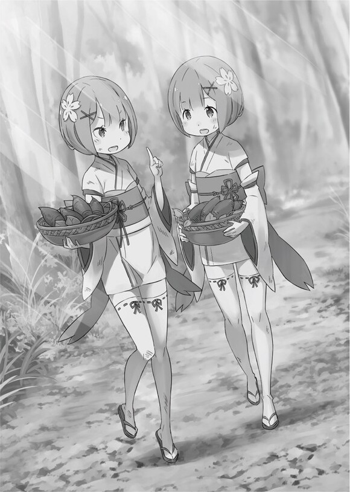

Огненная ночь

Рем медленно просыпается на веранде, залитой приятным солнечным светом.

Свет солнца был настолько приятен, что она уснула днём. Рем протирает свои сонные глаза, вытирает слюнку, которую чувствует на щеке и оглядывается.

Она была очень юной девочкой. На ней было белок кимоно, похожее на туземное платье и дзори на ногах.

Своими прищуренными глазами она увидела знакомый пейзаж. Рем внезапно заметила дзабутон, на котором она сидела. Она пыталась понять, кто положил его туда.

Единственный человек, который пришёл на ум не было рядом с ней. Когда Рем с беспокойством спрыгнула с веранды, она поспешила к центру деревни.

Как долго она спала? Солнце над ее головой все еще было высоко, поэтому она думала, что прошло не так много времени. Она медленно начинает чувствовать слёзы на глазах.

— О, Рем. Ты полна энергии сегодня.

— …

Женский голос остановил Рем. Когда она обернулась, то увидела молодую женщину, которая жила по соседству. Они жили в одной деревне и были одной расы. Это было лицо, которое Рем знала столько, сколько могла себя помнить, но…

— Ах…

Лицо Рем покраснело, она воскликнула и посмотрела вниз. Она покраснела от смущения и стыда и не смогла ответить. Но женщина не заметила этого замешательства и сказала:

— Сегодня тепло, самое время для игр на улице. Весёлые дети делают меня счастливой.

— Эм… Гм…

— А, да, Рам сегодня не с тобой? Это необычно.

— …

Рем задержала дыхание, услышав конец, казалось бы, обычную дружескую фразу. Причина, которая послужила этому — это имя её сестры. От этого у Рем что-то сжалось в сердце.

— Рам — следующий вождь клана Они, если за ней не присматривать, то…

— Я, эм… я… я пойду… к… сестрице… эм… простите…

Рем закончила разговор. Как только она, краснея, склонила голову, то сразу же убежала в спешке. Внезапные действия удивили женщину, но она помахала Рем на прощание и сказала:

— Рем, обязательно скажи Рам, чтобы вернулась домой до наступления темноты.

Услышав женский голос позади, глаза Рем снова промокли от слёз. Она снова разочаровалась в себе, и ей стало плохо. Рем заставила себя закрыть глаза и ускориться.

— …

Рем добежала до площади и начала искать толпу. Её сестра всегда была окружена людьми. Это значит — где толпа, там и её старшая сестра, а если толпы нет, то и сестра в другом месте.

Её сестры нигде не было видно на этой площади. Чувство безнадежности Рем становилось все хуже и хуже.

Она должна была найти ее сейчас. Она должна искать, где бы она не была…

— Рем?

Всё тело Рем тихо задрожало в ответ на этот голос, когда достиг её ушей.

Рем обернулась и увидела, как розоволосая девочка смотрит на неё. У них были одинаковые причёски и одежда, но глаза были светло-розовыми. Она выглядела так, словно её переполняло достоинство и уверенность в себе.

Она была второй половинкой Рем, самым уважаемым и любимым человеком в этом поколении — её старшая сестра-близняшка Рам.

Рам посмотрела на свою сестру, коснувшись свой женской щёчки, сказала:

— Рем, что-то случилось? Ты плакала?

— Потому что я проснулась, а сестрёнки не было…

Рем отчаянно качала головой перед своей старшей сестрой, говоря, как она жестоко поступила с ней.

Когда Рам получив ответ опустила брови, она нежно обняла одинокую Рем.

— Ах, прекрати. Ты была такой милашкой, когда спала… Мне бы стало очень плохо, если бы я тебя разбудила, Рем…

— Я… Это я виновата, что уснула. Но, пожалуйста, не оставляй меня так больше…

— Ты права, больше не буду. Но если бы ты поспала ещё немножко, я бы успела вернуться… Мои обязанности — лишний груз для тебя.

Обняв и нежно похлопав по голове, Рем в ответ на доброту Рам закрыла глаза.

Рем поняла, что делала её старшая сестра, когда ушла. Фактический, её обязанности в это время были рутиной для Рам.

— Как прошли… обязанности…?

— Это была скучно, как и всегда. Реинкарнация Бога Они, восстановление расы и всё тако… как скучно.

— Это почему же…?

— Я так понимаю, что взрослые в отчаянии и что у них большие планы на меня. Я, конечно, понимаю, какая я великая. Но мы не можем вернуться в прошлое… эти взрослы не понимают этого.

— …?

Такая молодая, как Рем, не могла понять того, о чём говорит Рам. Сестра Рем, которая была уже достаточно взрослая, уже показывала тот уровень мудрости, который показывал взрослых в плохом свете, и это заставило её почувствовать себя никчёмной.

Она чувствовала себя жалкой, что не могла понять, что чувствует Рам, не видит её постоянные проблемы, с которыми она сталкивается. Самой болезненной вещью для Рем была безусловная любовь, которую Рам дарит кому-то другому.

— Не нужно спешить, Рем, Ты можешь идти в своём собственном темпе. Я старшая сестра, и подожду тебя, Рем.

— Д… да.

Рем почувствовала себя в безопасности, когда чувствовала руки, которые ласкали её спинку, и она глубже погружалась в любовь, словно тая в ней.

Все в деревни обожали и уважали Рам. Но с другой стороны, Рам никому не открылась в деревни, думая, что ожидания и уважении были ей не приятны.

Младшая близняшка Рем была единственной, кого Рам действительно любила всем сердцем.

Она была сокровищем, самым дорогим и в то же время являлось бременем.

— …

Но всё же Рем обняла сестру, стараясь не отпускать это тепло.

Для Рем Рам была второй половинкой, и Рам чувствовала тоже самое. Ну, на самом деле Рам была чуть больше, чем просто половина Рем.

— …Сестрёнка?

В ответ Рем внезапно отвернулась и посмотрела в противоположную сторону деревни. Услышав её, Рам сказала, глядя в туже сторону:

Кто-то вошёл в деревню. Я пойду проверю.

— Н… нам нужна помощь…

— Я не уйду далеко. Рем, останься здесь и…

— Я хочу пойти с тобой! Я тоже иду! Иду с сестрёнкой…!

Поскольку она всегда оставалась позади, её одиночество победило страх перед неизвестным. Рам немного задумалась.

— Оставайся рядом со мной, хорошо?

Рам отдала этот приказ, и они пошли к противоположной стороне от площади — ко входу, соединяющую деревню и горную тропу. Теперь Рем чувствовала постоянной беспокойство, прилагая усилия, чтобы поспевать за Рам.

Если бы Рам была там, то не было бы проблем. Но она думала о том, что сможет сделать, если там будет кто-то очень страшный.

Тем не менее, Рам прибыла намного быстрее, чем беспокойство ударило Рем.

— Остановись прямо сейчас свинья. В эту деревню нельзя приходить без разрешения.

Рам заблокировала вход в деревню, приподняв уверенно грудь. Рем, задыхаясь, смотрела вперёд на человека позади её сестры.

Тот, кого приветствовали двое маленьких Они, был лысый старик в потёртой одежде. Однако он был в два раза выше тех людей, о которых знала Рем. Её глаза не обманывали её. Старик был очень высокого роста и имел угрожающий вид.

— О, это два маленьких Они из этой деревни. А тогда детей не было.

Сначала старик был удивлен, но как только он узнал, что имеет дело с детьми, сразу же с облегчение выдохнул. Тем не менее, Рам фыркнула носом, когда на его ответ сказала: «Ха».

— Получил старую информацию и ведёшь себя спокойно — банальная и плохая уловка. Рем, вернись. Я собираюсь разорвать его на части.

— Ты довольно агрессивный ребёнок! Это ваша кровь делает вас такими агрессивными?

— Я реинкарнация Бога Они и известный вундеркинд. Не запоминай последние слова, великан.

— Ты произносишь эти слова так дерзко, зная, что я великан?

Старик отвечал на грубую речь Рам, поглаживая свою голову с озадаченным видом. Наблюдая за ними, Рем была взволнована этой ситуацией.

— Так? Почему великан, чьё племя находится на грани исчезновения, находится в скрытой деревне Они?

— Эй, это вы лидеры исчезновения. Я пришёл увидеть вас, ребят из Они. Показать некое уважение.

— Понимая, что скоро умрёшь, ты доказываешь стереотип, что старики проблематичны.

— Ты обаятельная девочка… Лучше бы училась у своей сестры позади себя.

Рем быстро спряталась за Рам, когда тема разговора перешла на неё. Старик удивился такой реакции, и Рам с отвращением щёлкнула языком.

— Ты заслуживаешь умереть тысячу раз за то, что напугал мою сестру.

— Избавь меня от этой фамильярности. Я пришёл к старому другу Сетанте. Он всё ещё должен быть главным. В конце концов, я не слышал о его смерти.

— Господин…

Сетанта был главой клана Они, а также пожилым человеком, который был посредником в этой скрытой деревне. У него были седые волосы, большое телосложение, ужасно сильное чувство запугивания, и он был тем, кого Рем хотела видеть меньше всего на свете. Хотя Рам и ее родители были единственными людьми, с которыми ей было хорошо.

— Что тебе нужно от господина? Если ты убьёшь вождя сейчас, роль будет передана мне, и это будет хлопотно. Я буду признательна, ели ты этого делать не будешь.

— Очень плохая шутка… хотя, на ложь не похоже.

Уныло опустив плечи, старик прищурился, чтобы хорошенько взглянуть на Рам. Эти глаза смутили Рам, и он посмотрел на Рем, словно случайно, и это заставило её смутиться.

— Хорошо. Я проведу тебя до резиденции вождя. Даже если скажешь, что это не нужно, я всё равно пойду за тобой.

— Ты очень осторожно, не так ли? Я понимаю.

— Рем, если ты увидишь, что этот великан ведёт себя странно, дай мне знать. Я его убью.

Рам и Рем привели с собой старика, который повесил голову от поражения, в место «Резиденция вождя». Но это здание почти ничем не отличалось от других зданий в деревне.

В этом доме жили только два человека: вождь и его жена.

— Господин, я привела большого старика, который утверждает, что вы старые знакомые. Это так?

— Вы это серьёзно…

Рам заставила старика нахмуриться. Она сказала это у входа в здание. После минутного молчания дверь открылась и появился Сетанта со строим лицом. Сетанта смотрел на Рам и Рем, а затем на великана:

— Опять за своё, Кромвель. Удивительно, что ты снова пришёл сюда.

— Ты не изменился… вот что я хотел бы сказать, но не могу. Ты постарел. У тебя тело уменьшилось?

— С твоими размерами все вокруг выглядят меньше.

Этот разговор напоминал разговор старых друзей. Сетанта обратил своё внимание на Рем и остальных.

— Большое спасибо вам двоим. Он мой знакомы. Его зовут Валга Кромвель.

— Мне не нравится, когда меня так называют. Я зовусь Ромом сейчас.

— Какая грубая смена имени.

— Это просто нужно было сделать.

Великан, который раньше был известен как Валга Кромвель, сейчас носил имя Ром.

— Должно быть ты прошёл долгий путь, Кромвель. Давай поговорим внутри. Рам, ты иди с нами, а Рем, ты иди домой.

— …

Сетанта продолжал разговор равнодушно, а Рем продолжала тяжело дышать, держа рукав Рам. Рам снова собиралась нести своё бремя, а Рем не могла ей в этом помочь.

Но Рам положила руку на дрожащие пальцы Рем, чтобы прикрыть их. И тогда она сказала.

— При всём уважении, господин, я думаю, что такая молодая леди, как я, будет только мешать вашему воссоединению. Кроме того, я пообещала помочь в поле.

— Хм… Ты действительно так думаешь?

— Рем чувствовала бы себя одиноко, и я не хочу, чтобы меня закрывали в комнате с двумя старыми чудаками.

Она сказала это точно и хладнокровно, что даже у Сетанта широко раскрылись глаза. Рем была также удивлена острым языком своей сестры.

— Ах-ха-ха-ха! Ты проиграл, Сетанта! У детей есть и свои взгляды на мир. Хотя мне грустно, что она назвала нас старыми чудаками. Просто отпусти её.

— Даже гость это понял, поэтому я не буду извиняться. Пошли Рем.

— Э-э-э-э… ладно, сестрёнка…

Рам воспользовалась словами Рома, который дико рассмеялся и взяла руку Рем и быстро покинула это место. Следуя за сестрой, которая шла быстро, Рем с любопытством оглядывалась.

— А…

Слепленные глаза Сетанты заставили Рем сожалеть, когда она оглянулась. Она очень торопилась, чтобы не отставать от Рам.

— Рем, всё хорошо. Они воли в резиденцию. Никто больше не смотрит.

— Ах…

Рем успокоилась благодаря голосу Рам. Смотря на свою сестру, Рем сказала:

— Интересно, почему этот гость пришёл в деревню?

— Кто знает? По крайней мере, он может войти в эту деревню. А если он может свободно войти в деревню и является старым другом вождя, то он бесполезен и у него здесь бесполезные дела.

— А сестрёнке есть чем заняться?

— Ну, если взрослые хотят положиться на меня, я что-нибудь придумаю. Хоть это будет трудно.

Рам скривила руки и сделала серьёзное выражение, не характерное её возрасту. Она была старшей сестрой, которая относилось ко всему нейтрально, но Рем понимала эти тонкие различия своей сестры.

— Что я могу сделать для своей сестрёнки?

— Рем…

— Если сестрёнке это не нравиться, то я хочу помочь. Возможно, я ничего не смогу сделать, потому что я… я хочу быть с тобой.

Рам с удивление слушала слова своей сестры. Она посмотрела вниз и потёрла свои пальцы. Затем, она встала перед Рем и соприкоснулась своим лбом с её.

— Всё хорошо. То, что Рем так заботиться обо мне, делает меня в 100 раз сильней. Я уже так сильна, что меня не остановить.

— Сестрёнка, потрясающая…

— Да, я потрясающая. Я имею в виду, я — Сестрёнка Рем.

Рам не хотела быть Богом Они, не хотела быть вождём, называться реинкарнацией Бога Они. Она гордилась тем, что была старшей сестрой Рем.

Это смутило Рем, но сделало её счастливой.

— Теперь пошли, Рем. Я хочу играть со своей сестрёнкой целый день.

— Хорошо… но сестрёнка…

— Ах, это. Да.

Рам порождает ветер, и песок у её ног крутится во круг спирали по центру. Рядом с ней, Рем была потрясена этой слой, и со лба Рам вырвался белый рог.

Даже Рем, её близнец, была поражена красотой рога.

Огромная сила, исходящая от него, которой восхищались и уважали все Они, устремилась к полю, а точнее, к воде, рядом с ним.

Вода в ручье дико колебалась, купаясь в силе Рам. Сразу после этого сила водяного потока, создающего рябь, поднималась к нему и плыло к полю, как змея. И вскоре тело змея взорвалось над полем, и вода разбрызгалась по всюду.

— Об этом позаботились. Пошли, Рем.

Паранормальное явление закончилось так же быстро, как и началось. Рем кивнула Рам, и она убрала свой рог.

Способность собрать столько воды, и разбрызгать по всему полю — это действительно была выдающиеся работа Бога Они. Рем и все остальные в деревне не могли даже подражать чему-то подобному.

Рам была особенна, и тот факт, что она обладала невероятной силой, было лучшим доказательством.

Это было то, чем Рам могла гордиться больше всего…

— Хорошо, сестрёнка.

Она берёт руку свой старшей сестры и начинает бежать вперёд.

Даже если Рам будет идти впереди, она всегда будет оглядываться и заботиться о Рем, и соответствовать её темпу.

Рем гордится этим, но в тоже время — это превратиться в большой кол, который пронзит её грудь.

Когда наступил вечер, Рем и Рам вернулись в деревню, и были покрыты полностью грязью.

В своих руках они несли бесчисленные множества ямсов. А сами они были настолько грязными, что белоснежные кимоно стали чёрными.

Ямсы росли в земле вместе с лозами. Они собрали столько ямсов, сколько могли унести. Рам была в хорошем настроении, так как собрала больше 10 штук.

— Сестрёнка, ты такая счастливая.

— Разумеется. Мы сможем съесть тонну варенных ямсов Рем. Это лучшее наслаждение для меня.

Она показала большую улыбку, которую редко показывала. А Рем в ответ показала свою детскую улыбку.

Картошка на пару, о которой говорила Рам, была простом блюдом. Рем легко его готовила, позаимствовав кухню своей матери. Хотя его довольно сложно назвать блюдом, но Рам любила его больше всего, чем что-либо. Вся деревня приложила усилия, чтобы приготовить то, что она пожелает. Но варёная картошка Рем была самым любимым.

— Твоя приправа восхитительна. Рем, ты единственная, кто может так приготовить картошку, которая делает меня счастливой.

— Э-хе… сегодня я снова выложусь на полную и подготовлю её для сестрёнки.

— Да, больше пара.

Рем улыбнулась улыбающейся Рам, которая объявила об своём обжорстве с благородным выражением лица, держа корзину, наполненную ямсами.

Так они вернулись в деревню с горной тропы и направились в сторону дома, а потом резко остановились.

Причиной послужили две длинные тени, которые стояли у входа в деревню и купались в лучах заходящего солнца.

— Господин и этот гигантский человек?

У входа в деревню стояли два человека: Ром, которого они провели по городу несколько часов назад, и Сетанта, который его приветствовал. И двое стариков заметили, что Рам и Рем возвращаются в деревню.

— Снова картошка с гор.

— Да, это моё единственно хобби. Итак, вы закончили свои махинации?

Замечание Рам о Сетанте, у которого был мрачный взгляд, сильно задело его. Рем чувствовала себя неловко только из-за этого отношения Рам к Сетанте.

Тем не менее, великан покачал головой.

— Ты не можешь расслабиться в присутствии ребёнка? Это низко. К тому же, твои действия с ней никуда не приведут.

— Это потому что она ещё молода. Она только начинает осознавать себя и гордиться тем, что ей всё позволяют.

— Ты не должен обращаться к ней, как к ребёнку, только когда тебе это угодно. И как мне, кажется, природа этой девочки не имеет ничего общего с тем, чего ты от неё хочешь сейчас.

— …

Рам спокойно смотрит в глаза Рома, когда он направил свой мудрый взгляд сквозь неё. Рем поняла, что Сетанта и Ром говорили о Рам, но она не могла понять всех деталей. Но она чувствовала, как Рам возмущена, и как она крепко сжала корзину, которую несла.

— Во всяком случае, мой ответ окончательный. Я сильно устал.

— Ты уверен, что потерял всю свою энергию, Кромвель. Или, я должен сказать, что ты больше не проявляешь инициативу?

— Наоборот, я состарился. Ты и я, мы одинаковы.

Ром тихо отвечал на замечание Сетанты, и повернулся к нему спиной. Идя по земле, он собирался покинуть деревню, спускаясь по горной тропе.

Проходя мимо Рем и Рам, он сказал:

— Всегда будьте вместе. Не забывайте это…

Ром кинул им эти слова, и отправился по горной тропе, пока не исчез из поля зрения. Наблюдая за большой спиной, Рем в замешательстве ничего не сказала Она просто хотела, что всё просто и мирно кончилось.

— Хоть сейчас он такой, но когда-то он был воином, которого я мог назвать братом по оружию… Не осталось ничего от прошлого «Я» в нём.

Но вопреки желанию Рем, Сетанта заговорил об этом старике. Она не могла понять деталей, а Рам фыркнула в ответ.

— Время меняет людей. Изменения неизбежны. К лучшему или к худшему.

— Он слишком долго общался с людьми. Он так потворствовал людям, которых ненавидел, что его гнев к ним со временем исчез. Безнадёжный слабак.

Старейшина стиснул зубы и плюнул в спину, которую больше не было видно. Видя его гнев, Рем вспомнила слова Рома и глаза, которыми он на неё посмотрел.

Она чувствовала, что в тех глазах не было той слабости, о которой говорил вождь. Это были любящие глаза. В этом и была причина, по которой он мог забыть того, кем был раньше.

Но у Рем не хватило смелости сказать это вслух.

— Нет шансов, что мы снова встретимся. Я чувствую облегчение.

— Поздравляю с потерей одного из ваших друзей. Я хотела бы это отпраздновать. Угостить вас картофелем?

Рем испугалась Рам, которая подняла кучу картошки, которую собрала на ужин. Рем знала, как ответит старик, приняв это не как издевательство, а как шутку.

— К сожалению, я не в настроении. Возможно, в другой раз.

— Упустив шанс съесть вареной картошки Рем, и вы больше его не получите. Жаль, что вы отклонили это предложение. Пошли, Рем.

— Хм, хорошо. До свидания, господин.

Идя за Рам, у которой было торжествующее выражение лица, Рем так же быстро пошла за ней. Остался только хмурый старик.

— Всё будет хорошо?

— Моя милая Рем. У глупых взрослых опять всё пошло не по плану, вот и всё.

— Сестрёнка, ты в порядке?

— Да. Я рада, что всё кончилось скучным разговором. За это я должна поблагодарить того великана, что он его высмеял.

— Он сказал, что этот великан раньше был страшным… он совсем не похож на такого.

— Да. Конфликт между людьми и полулюдьми был решён через взаимопомощь. Полагаю, с ним случилось что-то подобное. Иначе…

— Сестрёнка?

С любопытным взглядом, Рем позвала Рам, которая остановилась и задумалась. Но она никак не отреагировала на Рем, так как глаза у неё были закрыты. Это был первый раз, когда Рам не отреагировала на зов Рем.

— Сестрёнка, сестрёнка.

— Не волнуйся, я в порядке. Я просто немного задумалась.

— Задумалась? О чём?

— О том, как вкуснее было бы съесть твою картошку, Рем.

Затем у Рам заурчал живот. Звук был похож на рычание зверя, и это поразило Рем. Она с гордостью позволила услышать этот звук и сказала:

— Это действительно то, что ты слышишь. Быстрей. Если мы не поторопимся, я умру от голода.

— Да. Поняла. Идём, сестрёнка.

Рем несколько раз покивала, смотря на серьёзную Рам. Рем сразу придумала способ, приготовить картофель самым эффективным способом, пока спешила с Рам домой.

Вот так голова Рем наполнилась варёной картошкой, и она ни разу не вспомнила, как Рам о чём-то серьёзно задумалась.

И Рем не пожалела об этом.

Она также полностью забыла о посетителе, который приехал в деревню Они. И так прошли дни.

Солнце встаёт, и снова садиться.

Итак, время шло…

Для Рем эта роковая ночь стала очень внезапной.

— …Сестрёнка?

Проснувшись в одиночестве ночью, Рем издала голос, пытаясь найти сестру в темноте.

Она не нашла Рам, которая должна была спать рядом с ней.

Сёстры жили в одной комнате, она делили кровать и спали рядом друг с другом. Сколько бы Рем не протягивала руку, она не могла найти тело своей сестры.

— Может быть, она пошла в уборную?

Рем, сидя в темноте обдумывала, что случилось с её сестрой.

Рам обычно просыпалась раньше Рем, и ждала её пробуждения. Из-за этого Рем никогда не видела спящего лица своей сестры. Если Рем просыпалась ночью, чтобы пописать, Рам просыпалась с ней, чувствуя это.

Она ни разу не выходила из комнаты, оставив Рем позади, как сегодня.

— …

Рем стала чувствовать что-то неладное. Она встала босиком на пол и скинула покрывала. Она чувствовала беспокойство и потянулась к двери.

Она заметила это, хотя было уже слишком поздно.

— А?

Опьяняющий, горелый запах и странно сухой воздух, который достиг кожи, кусал её. Жара, которая заставила её мокнуть от пота, явно не соответствовала климату этой скрытой деревни, не говоря уже о ночном климате.

Там был огонь. Пожар. За дверью был огонь, который окутал всё здание.

— Горим!

Она в панике хватается за ручку двери и кричит от боли. Рем разрыдалась из-за собственной глупости, а её ладонь покраснела от ожога.

Ей нужно многое обдумать, но сначала нужно встретиться с сестрой.

— Ай…

Она концентрирует силу на лбу и слегка дрожа, выдыхает. Она начинает обострять все пять чувств своего тела, воспринимая мир таким, каков он есть. Она поднимает свою ножку и выбивает дверь без колебаний.

В этот момент адское пламя пересекает коридор, словно высмеивая её, и взгляд Рем окрасился в красный цвет.

Рем использовала свою силу, чтобы подавить свой страх и вышла в горящий коридор.

Она посмотрела в спальню родителей. Дверь в комнату была раскрыта, и не было никаких признаков её родителей. Её сестры тоже не было. Она медленно спустилась и направилась к гостиной. Огонь бушевал, где семья проводила время во время еды. В доме никого не было, вот к какому выводу она пришла.

— Уфф!

Пламя у входа было очень сильным, но ей нужно было пройти через него.

Рем отказывается от этого плана и ударяется об сгоревшую хрупкую стенку своим телом, пробивая её. Она кувыркнулась в воздухе и упала на землю.

«Найти Рам»

Будто это обычный день, решение Рем было таким же. Она побежала на площадь, чтобы встретиться с сестрой. Но в следующий момент она замерла.

Её лицо напряглось. Глаза широко открылись, застыв на месте. Рем перестала двигаться.

То, что она видела своими глазами, никаким образом не было похоже на тот прекрасный пейзаж, к которому она привыкла.

Все дома были охвачены пламенем, превращаясь в пепел. Горели также и деревья.

Перед Рем горел соседний дом. Женщина, живущая там, была охвачена огнём и превратилась в обугленный труп. Её конечности были скручены. Её лицо было искажено от предсмертных мук.

Она смогла понять, что это она по двум рогам, торчащим из её лба. Два слегка скрученных рога были вдавлены во внутрь.

У Рем был комплекс неполноценности из-за наличия только одного рога, из-за это она постоянна смотрела на рога других людей.

По всей деревне лежали сгоревшие трупы. Она сразу поняла, кто из них были её отцом и матерью.

Обгоревшие трупы лежали друг на друге. Это была трагическая гибель, но они боролись до самого конца.

— Нет, вы…

Смерть всей расы, смерть родителей. Шок заставил Рем потерять в себе все силы. Вихрь энергии на её лбу рассеялся.

Что произошло? Как это могло случиться?

— Ра-а-а-а-а-а!

Рем услышала рёв, который прорвался сквозь ночь.

Рёв, подобный рёву зверя, исходил из центра деревни, и именно туда побежала Рем; и именно там она увидела мускулистого седого Они.

Верхняя часть туловища была открыта; это был Сетанта. У вождя торчали два больших рога. Он размахивал мечом с безумными, окрашенными в красный глазами.

Меч был украшением и был очень тяжёлым для оружия, и только Сетанта мог с ним справиться. Он давно потерял остроту, но этот кусок железа был опасным оружием, который дробил плоть и был длинной более двух метров.

Сетанта махал куском железа так плавно, словно он был продолжением его руки. И был противник, который получил гнев и сильный удар Сетанты.

Рем увидела извивающуюся тень перед глазами.

Пылающий свет от домов ярко освещал окрестности. На глазах появлялись бесчисленные трупы. И единственный, кто жил и двигался был Сетанта, а во круг него были существа, облачённые в чёрные одеяния, подобным теням.

Тень, завёрнутая в чёрную одежду от головы до ног, вцепилась в Сетанту.

— Вон!

Тупой кусок железа пронзил тень спереди, и существо в чёрной одежде разлетелось на пополам. Куски плоти разлетаются в разные стороны и Сетанта переключился на следующую тень.

Рем смотрела на вождя, который отчаянно сражался с противниками, и сила медленно возвращалась к её ногам. Среди трупов она не видела Рам, которую искала.

Из того, что она видела, силы существ в чёрном не соответствовали силе Сетанты. Пока их внимание направлено на вождя, она должна была искать Рам.

— Ц-ц-ц-ц-ц-ц!

Когда она пыталось спешно покинуть это место, странный звук донёсся до её ушей.

Последовательность неприятных звуков была похожа на щелчки языка. Кто-то непрерывно щёлкал языком, и глазами Рем пытались найти его источник.

Сетанту окутал огонь.

Огонь шёл изо рта, носа и ушей серого старейшины. Всё его тело было охвачено адским пламенем. Сетанта бросил своё оружия, крича, он пытался потушить огонь.

Пламя жгло его горло, и он потерял свой голос. Большой огонь испарил его глаза, его язык воспламенился, и старый старейшина Они упал.

— Хо… м-м-м…

Силуэты метнули свои клинки в форме крестов в тело Сетанты, охваченного огнём.

Обгорелый старейшина был проткнут бесчисленными клинками. Он не проронил ни слова. Фигура замирает и больше не двигается.

Рем увидела это своими собственными глазами и утратила желание сражаться.

Она видела, что её расы больше не было. Всё было укутано трупами… Либо сородичами, либо чёрными фигурами.

Рем окружили чёрные тени. Они замахивают на Рем красивые клинки. Она не была уверена, что лучше: умереть от огня или от порезов.

Она не была уверена, но её губы шевельнулись. Её руки и ноги не двигались, а голова перестала работать. Хоть её тело не двигалась, она знала, на кого нужно положиться.

И это…

— Сестрёнка.

В тот момент, когда она это сказала, задул сильный ветер.

Ветер ласкал пламя, сжигавшего деревню, и чёрные существа, окружившие Рам, упали. У всех них голова отделилась от тела. Все они упали во круг Рем, и она была окружена морем крови.

И к ней подошла фигура.

— Рем! Рем! Ты не ранена? Ты в порядке?

Та, кто произнесла эти слова и бросилась в объятья Рем, была Рам. Рем приняла эти объятья и почувствовало неловкое облегчение и счастье.

Она была рада воссоединению со своей старшей сестрой. Её спокойствие было естественным. Но что за приступ счастья? Она видела своих родителей, свою расу, вождя. Всех их мёртвыми своими глазами, и всё же она ничего не чувствовала, кроме счастья.

— С-сестрёнка!

Её мысли стали белыми, её сознание то включается, то выключается. Шок, который она испытала, сильно ударил сердце Рем. В поисках исцеления, она цеплялась за свою сестру. Рам это понимает и успокаивает её.

— Один за другим…

Рам, которая ласкала голову Рем, оглянулась. В её светло-розовых глазах появляются силуэты в чёрных одеяниях.

Их было ещё больше, чем тех, что сейчас лежали перед ними. Сколько их было в деревне? У них не было надежды на выживание.

— Я не позволю вам тронуть Рем, несмотря ни на что. Вы все здесь встретите свою смерть.

Безмолвные фигура на ответ Рам одновременно обнажили свои красивые клинки. Рам столкнулась с молчаливым безумием и рог на её лбу стал сиять ещё ярче.

Резня, вот что увидела Рем.

— А-а-а-а-а!

Рам рычала, прыгая то влево, то вправо, насмерть выбивая тела чёрных фигур своими ногами. Их головы и тела рвуться, как бумага.

Это была поразительная физическая сила, однако, это был не единственный секрет её ужасающий силы.

Рам взмахнула рукой, разрезая на части чёрное существо. Её светло-розовые глаза посмотрели на небо, и чёрная фигура приземлилась на землю, разделённая надвое.

Сильное тело и магические способности, которые были настолько превосходными, словно весь мир был на её ладони. Это была демонстрация истинных способностей Рам, которая была реинкарнацией Бога Они, когда-то считавшимся сильнейшим воином расы Они.

Каждый раз, когда раздавался резкий звук, появлялся ещё один расчленённый труп. Атаки Рам, которая превратилась в настоящую машину для убийств, не прекращались. Люди, нападавшие на Бога Они были похожи на самоубийц. Она дробит и рассекает все тени, которые прыгали на неё, и не пройдёт много времени, пока все они не умрут.

— Ц-ц-ц-ц-ц-ц.

Она слышала, как язык снова начал щёлкать.

Этот неприятный звук заставил Рем прийти в себя.

Находясь посреди поля битвы между Рам и чёрными фигурами в странных одеяниях, Рем не могла понять, откуда доноситься этот звук.

Рем беспокоилась. Что случится после этого щелчка? В прошлый раз из-за него Сатанта сгорел.

— Сест…

— Рем!

В одно мгновение зрение Рем окрасилось в красный цвет. Её тело оказалось в ловушке адского пламени. Нет, это был след от пламени, которое попало в грудь Рам, которая прикрыла её своим телом.

Взрыв, который пришёл следом, отбросил сестёр Они. У Рем закружилась голова, её внутренние органы перемешались, а лицо было грязным от слюны и слёз. А Рам…

— Вы, люди…

Тяжело дыша, Рам показала злой взгляд, когда поднимала окровавленное колено.

Её белое кимоно было разорвано на части, а сильное кровотечение создало лужу под ней. На теле была рваная рана, но она зажила в одно мгновение. Регенерирующая плоть излучала горячий жар, и рана превратилась в красный пар.

Взятие всей маны из атмосферы и превращение ее в силу для борьбы было особенной характеристикой рога Они. У Рам был выдающийся рог, так что она могла легко залечить свои раны.

Но это не могло помочь с болью и усатостью.

— …

Рам проверяет, нормально ли работают её ноги, и она шагает вперёд, чтобы снова напасть на врага. Но это был лишь один шаг, её тело выталкивает взрыв пламени, и Рам, издавая крик, отлетела назад.

Увидев, что её сестра лежит рядом с ней, Рем широко раскрывает глаза и сразу слышит голос.

— Маленькие сестрички Они…

Это был низкий и хриплый тон. Может показаться, что это был наигранный говор, словно он подражал окружающему пейзажу.

Деревня была охвачена огнём, и по среди неё появилась чёрная фигура с подвеской.

Рем не могла увидеть лицо человека с того места, где она была. Но во всех сторонах появились бесчисленные тени. До неё дошло, что худшее из возможных развитий событий наступило.

— Сестрёнка?

— По… пожалуйста… Рем, что угодно, только не Рем…

К Рем ползла Рам, и она крепко обнимает её. А затем старшая сестра отчаянно прижимает лицо Рем себе в грудь. Её голос дрогнуло, когда она столкнулась взглядами с тенью.

Её голос звучал раскаянно, словно просил прощения, и это привело Рем в замешательство.

Она никогда не могла представить Рам, которая всегда была уверена в себе, всегда была горда и благородна, которая была лучшей старшей сестрой в мире, предстанет перед ней подобным образом.

— Такая красивая сестринская любовь. Это идеально. Я хотела проверить, как пахнут сёстры Они.

— …

Рам сомкнула челюсть так сильно, что могла легко сломать себе зубы. Она обнимала Рем. Но Рам, реинкарнация Бога Они, не могла сделать шаг.

Фигура бросила клинок в Рем, которая была прижата к груди Рам. Поняв это, Рам открыла руки и встала перед своей сестрой, чтобы спасти её.

Увидев это, Рем только широко раскрыла глаза, чувствуя себя бессильно.

А затем…

Раздался пронзительный звук и брызги крови с белым осколком упали на землю.

Крик и чей-то смех. Белый свет прошёл по красному небу среди шума.

Это был рог. Прекрасный, самый благородный и драгоценный рог Они. Рог Рам, последняя надежда клана Они.

Деревня была охвачена адским пламенем, сестра кричала, вытирая кровавые слёзы, и та боль, которая не осталась в памяти Рем.

Она была сломлена от жестокости и усталости.

— А-а-а-а-а…

Рем слабо вздохнула, и всё остальное из её памяти было стёрто навсегда.
