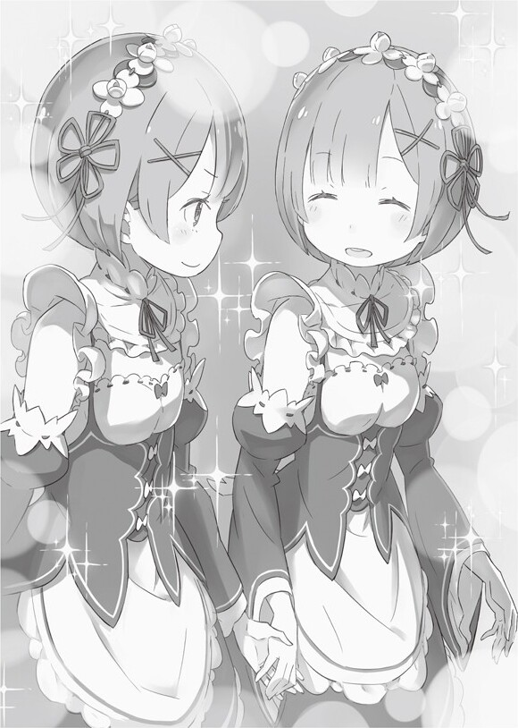

Клоун, соучастник и заместитель

— Большое вам спасибо, Учитель. Я никогда так не гордился тем, что работаю на вас. Я, Клинд, готов рискнуть жизнью, чтобы выполнить свой долг. Вся моя душа.

— Твой неожиданный уровень мотивации не вызывает у меня ничего, кроме беспокойства!

Это был ещё один день, когда обычная ссора развернулась у входа в резиденцию Мейзерс.

Ссорились только Фредерика и Клинд. Фредерика была единственной, кто набросился на него, в то время как Клинд просто отмахнулся от неё в спокойной манере. Однако это был единственный день, когда Клинд нахмурил брови и снова заговорил с Фредерикой.

— Я не совсем понимаю, что ты подразумеваешь под беспокойством. Я всегда говорил, что никогда не откажусь от своих обязанностей, но клянусь, что сделаю для этого ордена всё, что в моих силах. Так что я не понимаю, почему ты так волнуешься.

— Твои фетиши! Твоя мотивация! Сочетание их — это то, что заставляет меня взрываться от беспокойства!

Фредерика, топая ногами, оборачивается, и на её страшном лице появляется тревога. Фредерика видит, что люди наблюдают за их обменом репликами, и решает нацелиться на высокого из них.

— Учитель, почему вы смеётесь в такой ситуации? Я уже говорила вам снова и снова, что есть проблемы с тем, кого вы берёте!

— Ну, твоя реакция была настолько ожидаемой, что она сделала меня счастливым. Это очевидный выбор, если учесть его способности и результаты, верно? Шрам, оставленный на резиденции Милод, глубок, и теперь по крайней мере один способный слуга нужен, чтобы содержать семью. Как опекун, я обязан сделать всё, что в моих силах.

— Но…

— Или ты можете порекомендовать кого-то подходящего для этой работы, кроме тебя и Клинда?

Фредерика бормочет что-то невнятное и не может спорить с Розваалем, который задал ей неприятный вопрос.

— Клинд будет работать сверх своих возможностей, так как он знает, что его хозяин будет ребёнком. Однако ты единственная, кто может остановить его от выхода из-под контроля. Ты получишь короткий конец палки, и я бы хотел, чтобы ты с этим справилась.

— Для хозяина, верно?

— Неееет. Для Дадли, Грейс и маленькой Аннерозе.

— Это, конечно, нечестный способ выразить это.

Фредерика уступает объяснениям Розвааля и вздыхает после недолгого молчания. После этого она посмотрела на сестёр, ожидающих рядом с Розваалем.

— Вам, вероятно, придётся иметь дело с большим количеством работы. А вас двоих это устраивает?

— Да, всё будет хорошо. Мы это знаем и останемся здесь.

— То, что сказала Сестрёнка. Кроме того, Фредерика и Клинд — это те, у кого будет много работы.

— Работа и рабочее место просто будут разными. Хотя я не понимаю, почему я должна быть с этим парнем.

Как всегда, Фредерика была несправедливо низко оценена Клинда. Хотя для Рем они оба были надёжными учителями, обладавшими многими респектабельными чертами характера.

— Конечно, сестрёнка всегда будет номером один. Она никогда не сдвинется с этого места.

— Да, конечно. В конце концов, я такой драгоценный человек для Рем.

— Понимаете друг друга, несмотря на то, что разговор был таким трогательным, это возможно из-за той синестезии, о которой я слышала…?

Сёстры видят, как Фредерика наклоняет голову, и поэтому они смотрят друг на друга и слегка улыбаются.

Через несколько дней после инцидента появились более или менее заметные признаки урегулирования ситуации.

Семья Милод, потерявшая супружескую пару, которая была её главой, осталась жива благодаря тому, что Розвааль стал опекуном их дочери. Однако из-за случившегося инцидента многие слуги умерли, и многие подали в отставку, и в результате Клинда и Фредерику пришлось отправить в резиденцию Милод.

Кроме того, отныне в резиденции Милод должно было проходить обучение полулюдей, которое обычно проводилось в резиденции Мейзерс.

Таким образом, резиденция Мейзерс останется с минимальным количеством рабочих — другими словами, Рем и Рам останутся с Розваалем в качестве его помощников.

— Как ты знаешь, забота о хозяине — непростая задача, но, пожалуйста, будь сильной и держись.

— Тебе тоже придется иметь дело с чудаком. Сделай всё возможное, чтобы остаться там, Фредерика.

Рам, возможно, и была остра языком, но в её оскорблении чувствовалась игривость. Фредерика тоже могла это сказать. Это то, что они оба чувствовали в словах, которые говорили друг другу.

И вот Фредерика повернулась лицом к Рем и опустилась на колени, чтобы соответствовать уровню её зрения.

— Рем, не напрягайся слишком сильно и оставайся здоровой. Ты можешь писать мне в любое время, если что-нибудь когда-нибудь всплывёт.

— Ты слишком много беспокоишься, Фредерика. Кроме того, мне будет хорошо везде, пока со мной будет сестрёнка.

— Понятно. Тогда это хорошо.

Затем Фредерика ласково улыбнулась ответу Рем. То, как Фредерика улыбалась, не пряча рта, было похоже на ту открытость, которую она проявляла к кому-то близкому.

Увидев этот полный набор больших, острых клыков, Рем внезапно почувствовала сожаление внутри себя.

— Фредерика, у меня есть… одна вещь, за которую я хочу извиниться.

— Рем хочет извиниться передо мной?

Рем хмуро посмотрела на Фредерику, которая выглядела очень любопытной. Однако Рем отложила её реакцию в сторону, и она вспомнила, как сожалела о своей первой встрече с Фредерикой, которая произошла давным-давно.

Это было тогда, когда она испугалась улыбки заботливой девушки и не смогла извиниться за это.

— В первый раз, когда мы встретились, я испугался тебя, хотя ты и беспокоилась обо мне. И по сей день я до сих пор не извинилась… я искренне сожалею.

Рем извинилась, опустив голову, и это заставляет Фредерику широко раскрыть глаза. Сразу после этого Фредерика, похоже, что-то поняла и со счастливым выражением лица погладила Рем по голове.

— Всё в порядке, Рем. Ты очень хорошая девочка.

— Вообще-то, она моя младшая сестра. Это же очевидно.

— Забывая о том, действительно ли это что-то значит, да, это очевидно.

Мягко погладив её по голове, Рем сделала удивлённое выражение. Однако Фредерика одобрительно кивнула Рем, которая приподняла голову, а затем она взяла себя за юбку, делая реверанс.

Движение было настолько совершенным, что Рам и Рем захотели скопировать её.

— Пожалуйста, позаботьтесь хорошенько о господине Розваале. Я знаю, что могу предоставить это вам.

Затем она сказала это и широко улыбнулась, не пряча рта.

В кабинете под покровом ночи две тени слились в одну.

Тяжело дышала молодая девушка с раскрасневшимися щеками. Тонкое, маленькое тело девушки дрожит, и она слабо цепляется за мужчину, сидящего рядом с ней. Однако она делала это не для того, чтобы сохранить равновесие, а скорее для того, чтобы бороться с волнами чувств. Она не беспокоилась о том, чтобы стряхнуть его с себя.

Ведь она была на коленях у мужчины, и он держал её в своих объятиях, в конце концов.

— Ну вот, всё готово.

Затем их контакт заканчивается медленным звуком голоса мужчины. То, что слабо освещало мрачную комнату, было четырёхцветным светом в руке мужчины-это было сияние маны.

Используя одновременно несколько магических атрибутов, он мог исцелить девушку с особым телосложением. Такова была цель сегодняшней встречи, и это была тайная, которая случалась каждую ночь.

— Ты, должно быть, устала. Есть ли какие-то проблемы?

— Это нормально. Я также не думаю, что есть какие-либо последствия от чрезмерного употребления.

Дыша несколько неуверенно, Рам, ступив на пол, положила руку на лоб и покачала головой. Каждую ночь она прикасалась к тому месту, где когда-то был её рог, но никак не могла привыкнуть к этому.

Возможно, это было потому, что её сердце всё ещё не принимало тот факт, что она потеряла свой рог.

— Тебя что-то беспокоит? У тебя такой вид.

— Беспокоюсь о чём-то, да. Конечно, есть кое-что, о чём я беспокоюсь. Мои учителя покидают особняк, и с завтрашнего дня здесь будем только я и Рем. И всё же, ты ещё не раскрывает своих истинных мыслей, верно?

— Понимаю. Это то, что ты хочешь услышать?

Единственным, кто покачал головой с горько-сладкой улыбкой в ответ на цинизм Рам, был Розвааль, откинувшийся на спинку стула. Он вёл себя так же, как всегда, наливал спиртное в бокал для вина, стоявший на письменном столе, и потягивал его маленькими глотками.

Для Розвааля не было редкостью употребление алкоголя. Рам привыкла видеть в нём человека, который каждый вечер приходил к нему на лечение.

— У тебя сегодня довольно много выпивки, и ты быстро пьешь. Так и в обморок упасть не долго.

— Извини, это тело никогда не теряло сознание от алкоголя. Хотя, не напиться сейчас никак нельзя.

Это было странное, неприятное заявление, но Рам не обратила на него внимания. Важно то, что Розвааль пытался опьянеть от вкуса алкоголя, и было легко представить, почему он этого хотел.

— Ты винишь себя за то, что случилось с Дадли и Грейс?

Выражение лица Розвааля не изменилось, когда его спросили. Лёд в стакане, который он держал в руке, только что с шумом треснул. Чувствуя, что это было отражением колебаний в его сознании, Рам прищурилась.

Когда на него смотрели её светло-красные глаза, он тоже смотрел на них своими собственными гетерохромными глазами.

— Это удивительно. Я думала, что ты не умеешь заботиться о других людях.

— Это в принципе верно. Я не хочу выглядеть крутым, но в основном я прожил свою жизнь хладнокровно. То есть по собственному выбору. Просто есть некоторые редкие исключения.

— Редкие?

— Да, очень редкие. В редких случаях я хочу, чтобы те немногие люди, которые мне нравятся, были счастливы, и это не имеет ничего общего с моим собственным счастьем. Бывают моменты, когда мне этого хочется.

Возможно, он намекал на то, что чувствует то же самое к Дадли и Грейс. Эти двое действительно нравились Розваалю. Однако они потеряли свои жизни.

Вдобавок ко всему, хотя они и не имели к этому никакого отношения, их втянули в противостояние с Культом Ведьмы, которая началась с Они.

— Тогда ты винишь нас? Неужели ты нас ненавидишь?

— Я знаю способ разделить свои чувства и результаты. Так что было бы действительно неразумно обвинять вас и всё такое. Кроме того, нападение Культа было…

— Спланированно тобой, так?

Прервав Розвааля, Рам сама перешла к главному вопросу.

Её напористая манера говорить заставляет Розвааля закрыть один глаз. Под пристальным взглядом его жёлтого глаза Рам продолжала, прислонившись к столу.

— Рем, как человек чистый, прекрасный и невинный, кажется, не находит врагов среди друзей… Но я, как человек мудрый, непобедимый и галантный, не соглашусь. Обнаружение еретиков одного за другим в деревне не может быть простым совпадением. Было бы глупо думать об этом как о чём-то подобном таким образом.

— Итак, мудрейший, как ты сказала, думаешь, что я заставил их сделать это. И как же мне это удалось?

— Дело не в том, как ты это сделал, а в последствиях и мотивах. Ну, похоже, у них был пунктик на тех, кто выжил, так что пока мы где-то испускали запах, они шли за нами. Однако это только объясняет, как их заманили сюда. Есть также вопрос, почему ты позволил им сделать первый шаг.

Отложив в сторону того, кто был привязан к особняку, остальным троим было позволено сделать первый ход без исключения. И вот, в результате, Дадли и Грейс погибли.

Розваалю пришлось заплатить очень большую цену за Рем и Рам, чтобы добиться их возмездия.

Именно поэтому она и сомневалась. «Зачем он это делает?»

— Очевидно, ты знал об опасности нападения Культа Ведьм. Так почему же ты так много сделал, чтобы помочь нам с нашим возмездием? Ты даже потерял двух близких друзей. Почему ты решил, что это стоит того, чтобы сделать всё возможное для нас с Рем? Почему?

— Это всё… для моей цели. Это ради той цели, ради которой я жил и всегда буду жить.

Он открывает свой закрытый глаз и пронзает Рам, которая настаивала на ответе, своими гетерохромными глазами. Сила эмоций в его голосе ошеломляет Рам.

Сила, глубина и количество его страсти переполняют её, и в то же время она чувствовала ревность.

Её сердце горит от желания узнать, что же видел этот человек перед её глазами, о чём он думал и чего хотел.

— Если это так, я пожертвую близкими друзьями. Если это так, то я использую любого симпатичного человека. Если уж на то пошло, то я с радостью впутаюсь в любую жестокость и ересь.

Жертвоприношение, использование, жестокость, ересь -Рам поняла его намерения, не отворачиваясь, когда он сделал своё заявление.

Розвааль говорил, что Рам и Рем необходимы для достижения его цели. И поэтому, если понадобится, он жестоко использует их в качестве жертвоприношений и для удобства в процессе.

Между ними повисло молчание.

Возможно, это был первый раз, когда Розвааль высказал свои истинные мысли вслух. Однако выявление их в этой ситуации также может быть частью его плана по использованию Рам.

Розвааль — это человек, который продолжал лгать. Он скрывает свои истинные мысли и истинный характер под клоунским гримом и пытается скрыть всё, будучи глупым и ведя себя эксцентрично.

Так что Рам могла сделать с ним только одно.

Дыхание Рам и громкий шум воды после этого были тем, что нарушило тишину. Звук воды на самом деле был стаканом спирта; когда Рам схватил его со стола, она вылила его на лицо Розвааля.

Розвааль без колебаний позволяет совершить этот безрассудный поступок, не выказывая никаких намерений уклониться от него, и он качает головой.

— Это твой способ попрощаться?

Она облила его спиртным, пока они разговаривали. Для него было вполне естественно не придумать никакого другого объяснения.

И все же Рам покачала головой, когда он это сказал.

— Нет. Я просто хотела услышать твои истинные мысли без макияжа.

Рам в одно мгновение садится на колени к Розваалю и вытирает ему лицо, мокрое от алкоголя, носовым платком. Затем белый клоунский грим спадает, и появляется его истинное лицо.

Рам оказалась лицом к лицу с ним, и, прищурившись, сказала:

— С таким лицом, без всякой косметики, говори то, что говорил раньше. Ничего не скрывай. Ничего. И скажи это. Сказать это. Скажи это сейчас.

Рам вцепилась руками в лицо Розвааля, и она не отвела взгляда. Хотя Розвааль даже не пытался сопротивляться. Он закрывает глаза и открывает их.

— Я… я буду использовать вас, для своей цели. Для этого мне нужны вы. Я не остановлюсь, независимо от того, какие жертвы мне придется принести на этом пути. Даже если мне будет грустно из-за Дадли и Грейс, я не пожалею. Даже если мне придется пожертвовать вами в будущем.

Он смотрел ей прямо в глаза и говорил всё прямо. Его истинные мысли столкнулись с его истинным лицом и истинными чувствами, и сердце Рам подпрыгнуло.

— Отлично. Я сделаю всё, чтобы помочь вам в достижении вашей цели.

— Я действительно чувствовал, что в 9 из 10 ты попытаешься меня убить.

— Я не из тех, кого легко предсказать. Кроме того, у нас есть контракт.

Находясь достаточно близко, чтобы чувствовать дыхание Розвааля, Рам продолжала приближаться, пока их лица не соприкоснулись.

— Возмездие Они и месть четырём врагам — я поставила на кон свою гордость и душу и поклялся сделать всё, что смогу для вас, чтобы всё это могло быть выполнено.

— Это было устное обещание.

— Разве вы только что не дали это устное обещание, потому что знали, что я его не нарушу?

Розвааль замолчал, когда Рам спросил его, и это был его ответ.

И вот теперь её мысли были такими: «даже если бы не было словесного обещания, я сделаю это.»

— После сегодняшнего вечера, с этого момента, я всё ещё буду клясться в верности господину Розваалю. Вы следовали контракту и доказали, что в наших добрых душах и моём теле течет их гордость. Я отдам за вас всё, что у меня есть. Я полностью посвящу себя вам. Я — ваша воля.

Рам принесла присягу, доказала, что она даже отдала бы душу, и осторожно подносит её губы к Розваалю. Так, их губы сладко пересеклись.

— Почему ты пользуешься всей этой неразберихой? Вот подрасти ещё на 10 лет.

— Тц…

Однако его прервала рука, которую он положил между их лицами остановила её.

Получив отказ от её поцелуя, Рам недовольно нахмурилась. Это заставило Розвааля криво улыбнуться.

— Я с благодарностью приму твою преданность. Но твоя привязанность — совсем другое дело. А что касается этого… скажем, через, так, 400 лет можем продолжить…

— Это довольно долгое ожидание. Хорошо. Я пока отойду в сторону.

Это прозвучало как шутка. Однако Рам чувствовала, что существует очень большая стена, которую он никогда не разрушит. Вероятно, это было что-то значимое для Розвааля.

Вот почему она отступила. Принуждать его было бы бессмысленно. К тому же у неё ещё оставалось время.

— Только, пожалуйста, не забывайте, господин Розвааль.

— О чем?

— Те, кто полагается на мечи, падают от мечей. Те, кто полагается на ведьм, падают к ведьмам. Те, кто посвящает себя огню, падают в огонь.

Это были слова, сплетённые вместе почти как песня, и это было проклятие, наложенное в конце возмездия.

Однако на этот раз, в совершенно другой ситуации, Рам снова наложила проклятие на человека.

— И вот, те, кто просят у Они, падут к Они и будут уничтожены тем, на что они полагались.

— Так ты собираешься уничтожить меня?

— Да, это так.

Услышав, как Розвааль произнёс эти слова с закрытым одним глазом, Рам встала с его колен и кивнул. А потом она слегка отступает назад, взяв себя за юбку и, демонстрируя безупречный реверанс.

— Твои идеалы, твои желания, твои чувства — я уничтожу всё это. Помогая тебе с тем, что для тебя значит всё, я заберу у тебя всё. Пожалуйста, ждите этого с нетерпением.

Рам говорила это, очаровательно подмигивая, неуместно для её возраста.

После того как Розвааль на мгновение ошарашенно посмотрел на неё, он рассмеялся, не в силах больше сдерживаться.

Он всё смеялся, смеялся и смеялся. Затем, после этого, он кивнул.

— Очень хорошо. Тогда давай посмотрим, будет ли твоя преданность и привязанность связана с моим уничтожением.

Затем Розвааль радостно улыбнулся от всего сердца, и его лицо очистилось от клоунского грима.

Это было примерно через год после той огненной ночи, когда они пришли в свой дом.

— Там больше ничего не осталось.

— Именно так оно и есть. Всё сгорело, и здесь больше никто не живёт. То, что все останки были похоронены Розваалем, является его благодатью.

Рем и Рам осматривали место, которое когда-то было площадью, и делились своими мыслями.

Не осталось даже развалин сожжённых и разрушенных домов. Почва превратилась в выжженное поле, и там уже начали понемногу расти сорняки. Поля были совершенно пустынны, а горную дорогу теперь невозможно было узнать. Теперь уже нельзя было сказать, что здесь раньше была деревня, управляемая зелёными горами.

— Где же был вход?

— По словам господина Розвааля, именно отсюда открывается вид на всю деревню. Так что, скорее всего, именно там находилась резиденция вождя.

Рем и Рам были здесь одни. Розвааль отказался идти с ними в такую даль и теперь ждал, когда они вернутся. Он баловал их своей добротой, но они не могли заставить его ждать слишком долго. Они должны были быстро вернуться, даже если им приходилось подталкивать себя.

Рам быстро поднялась на холм, по-видимому, соглашаясь с Рем. Однако, похоже, Рам, начала уставать от путешествия.

— Сестрёнка, давай возьмемся за руки.

— Ну, раз уж ты так хочешь, то, наверное, ничего не поделаешь.

— Да, я хочу этого. Прошло так много времени с тех пор, как я гуляла по деревне с сестрёнкой.

Они шли к главному дому, который должен быть на холме, держась за руки, идя бок о бок.

Год назад, когда они были в деревне, Рем всегда ходила за Рам. Всё изменилось, всего за один год.

Её 7-летнее сознание, которое не могло измениться в деревне, и то, как она жила, так сильно изменилось за этот последний год, и вот она здесь.

Ей было немного грустно из-за того, что она не могла показать, каково ей сейчас в деревне, своей матери, отцу и им подобным.

Тем не менее, если бы трагедия в деревне никогда не случилась, Рем наверняка всё ещё прятался бы за Рам. Вот почему всё было так сложно.

Она не могла показать никому в деревне, как сильно изменилась. Как она теперь жила желанной жизнью, которой могла бы гордиться.

— Рем, должно быть, так оно и есть.

Мысли Рем внезапно прервались, и она посмотрела на странный каменный памятник в том направлении, куда указывал Рам. На таком высоком месте, где когда-то стояла резиденция вождя, был построен Белый кенотаф.

Это была очень большая масса Хрустального камня, и она была больше, чем Рам и Рем вместе взятые.

— Мана существует в хрустальном камне. Возможно, есть души, которые притягивают ману, чтобы духи и низшие духи могли материализоваться, используя её. Это и следовало ожидать от господина Розвааля.

Стоя перед кенотафом, Рам восхищалась тем, что сделал Розвааль. Рем также тихо восхищалась Розваалем.

Она не могла достаточно отблагодарить Розвааля за то, что он помог добился возмездия и дал ей возможность жить. Сможет ли она даже отплатить ему тем же, сделав всё возможное в качестве служанки?

— Рем, давай дадим им знать. Передай мне алкоголь.

— Да, сестрёнка.

Всё ещё чувствуя, как глубоко внутри закипают эмоции, Рем достал из ручной клади бутылку саке, как велела Рам. Они суммировали своё жалование и выбрали самый дорогой алкоголь.

Рам взяла его, без колебаний вынула пробку и вылила спирт на кенотаф в качестве подношения.

Их похороны были немного неуместны, но никто из взрослых не мог их критиковать.

Вот почему они принесли то, что было самым важным подарком для похорон, использованным для того, чтобы упокоить души.

— Возмездие было достигнуто. Сожаление о той ночи, гнев той ночи и горе той ночи. От Рам и Рем.

Один в подвале, один в столице, один с пламенем, а последний с помощью своего хозяина.

Ни одного не осталось, и возмездие было достигнуто. Теперь же души их рода не будут блуждать.

— К сожалению, реинкарнация Бога Они и возвращение Они превратились в пепел. Но гордость и кровь останутся живы. Прощайте все.

Рам выливает только половину спирта на кенотаф.

А потом Рам отдала оставшийся спирт Рем, и она прислонилась к каменному монументу. Её сестра молча отодвинулась. Она была очень внимательна к тому факту, что Рем будет следующей, кто упокоит их души и даст клятву.

Поэтому Рем спокойно наклонила бутылку саке, которую она приняла, и вылила на каменный памятник.

Рам произнесла эти слова, чтобы успокоить их души. Таким образом, Рем должна была рассказать им о своей решимости и попрощаться с ними.

Нерушимое обещание Рем, которое она даст спящим душам своего рода, своему отцу и своей матери.

— Мама, папа, все, пожалуйста, не волнуйтесь.

Со своей лучшей улыбкой Рем упоминает о том, что её сородичи, вероятно, беспокоились больше всего.

Это были люди, которые всегда возлагали свои надежды на Рам, верили в Рам и беспокоились о Рам. Так что Рем оставалось только одно-дать им обещание.

— Сестрёнка… я сделаю всё, что должна была сделать сестрёнкой.

Рем с гордостью пообещала душам своих соплеменников, что это действительно будет смыслом её жизни.

Это была улыбка, похожая на распускающийся цветок. Это была сладкая, милая улыбка, которую только Рем делала в деревне, и она никогда не показывала её своим соплеменникам, когда они были живы.

— Ты закончила?

— Да. Сестрёнка, большое вам спасибо.

Рем положила бутылку и покинула кенотаф. Как только Рем без колебаний кивнула на этот вопрос, она взяла сестру за свободную руку, они пошла дальше.

Они направлялись вниз по склону холма, прочь из своего города, прочь с горной дороги, к карете, где их ждал хозяин.

— Я хочу увидеть Фредерику и Клинда как можно скорее, так как мы будут сегодня в резиденции Милод.

— Я впадаю в депрессию, когда думаю о том, что увижу этих двоих. Фредерика наверняка задаст мне кучу вопросов из-за Гарфиэля.

— Сестрёнка и Гарф, в конце концов, хорошие друзья. Но, пожалуйста, не оставляй меня совсем одну.

— Я не буду, потому что Рем — самая милая, самая драгоценная младшая сестра на всём белом свете.

Когда они держались за руки, она чувствовала, как глубокая привязанность сестры проходит по её ладони, и ни одно из этих слов не было ложью.

Чувствуя эту неожиданную любовь, Рем искренне аплодировал ей.

Замена такой обожаемой сестры. Замена такой замечательной сестры.

Ради этого, чтобы быть такой, чтобы ей было позволено быть такой, она будет жить прилежно.

Даже её неразлучная сестра не знала об этой клятве, но Рем просто мило улыбнулась.

— Да. Сестрёнка для меня тоже самая лучшая сестра на свете.

《Конец》
