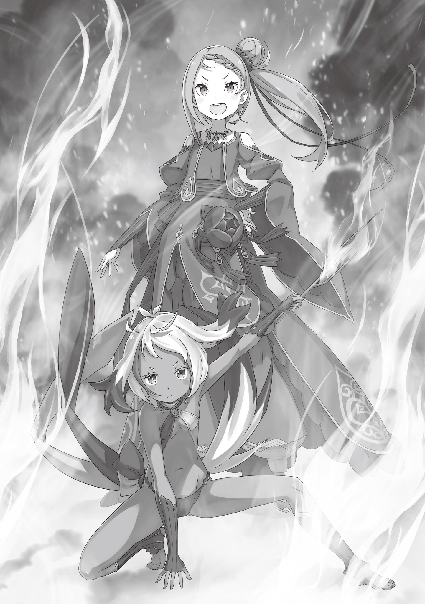
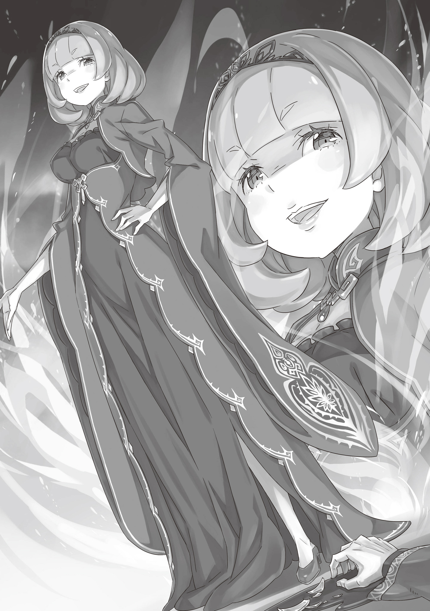
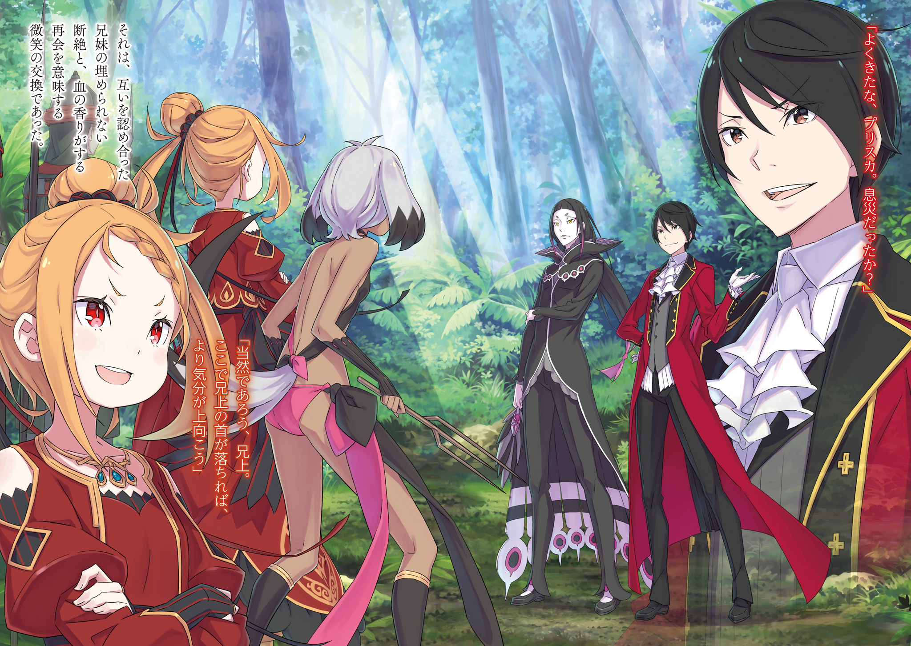
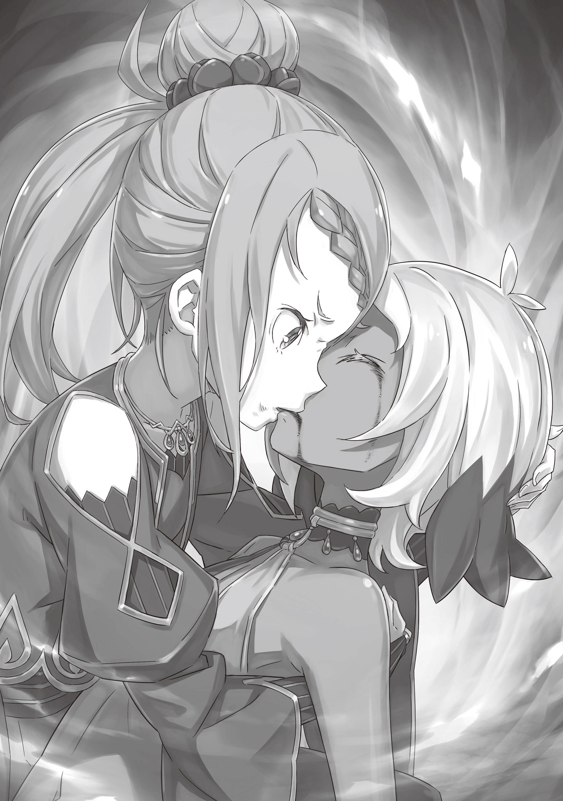
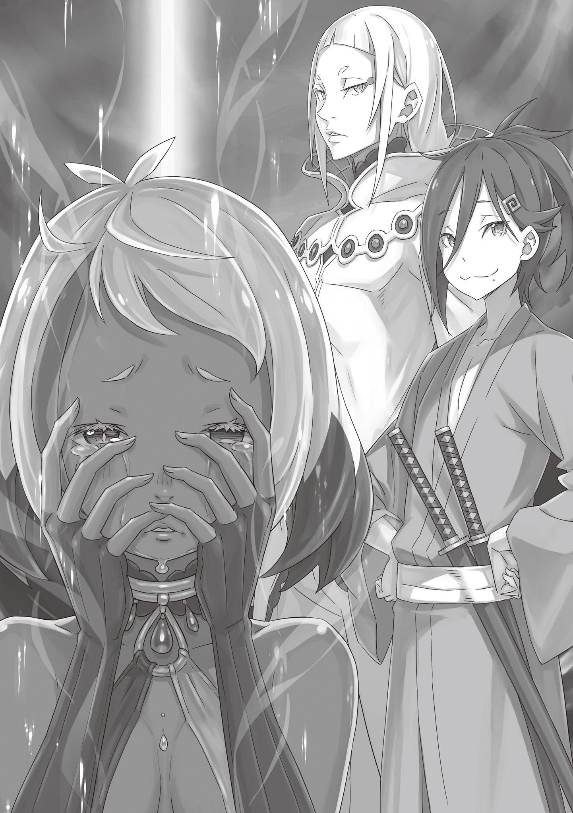

Багровая Тень

『紅蓮の残影』

Тёплый солнечный свет скользнул за жалюзи и коснулся щеки спящего.

— Ммм… Ммм… — зарождающийся голос ещё не стал глубже с возрастом. Он имел нейтральный тембр, не был явно мужским или женским, а его обладатель выглядел так же невинно, как и звучал, излучая необъяснимую, отталкивающую притягательность.

На кровати лежал и мягко ворочался симпатичный молодой человек. Его розовые волосы были взъерошены ото сна, а кожа была белой, словно молоко. На вид ему было лет десять, плюс-минус, и, как и его голос, его ангельская внешность не позволяла определить, мальчик он или девочка.

Его звали Шульт, и нищета, в которой он родился, могла бы стать его смертью, если бы не его могущественная удача.

— Ааа… — Шульт сел на белую простыню и зевнул, потирая глаза. Они были красными, как рубины, что только подчёркивало его красоту. Одно можно сказать точно, он обладал некой чистотой, приближенной к совершенству. Однако подобные наблюдения сильно расходились с мнением Шульта о себе.

— Боже, я всё ещё худой, словно ветка. — Он перестал тереть глаза, когда его сознание догнало реальность, и вместо этого начал дуться, пощипывая себя за верхние части рук. Причина его недовольства была проста: как бы он ни старался, его руки и ноги никогда не становились мужественнее. Все тренировки, которые он проходил, казалось, не оказывали заметного влияния на его тело.

Вчера вечером, например, он старательно тренировался размахивать деревянным мечом перед сном, и всё же он был здесь, а руки оставались гладкими, как шерсть. Хуже того, в его мышцах сохранялась слабая боль ещё одно напоминание о том, каким же жалким он был.

На самом деле эта боль была признаком того, что невинное желание мальчика постепенно становилось правдой, но он этого не знал. Вместо этого Шульт вспомнил совет, который однажды дал ему Ал.

— Мастер Ал сказал, что боль это признак того, что что-то не так. Он также сказал, что я должен отдыхать, пока боль не пройдёт.

Режим тренировок Шульта, который он разработал на основе того, что рассказал ему Ал, состоял из одного дня тренировок с мечом, за которым следовали пять дней отдыха. Естественно, ожидать значительного улучшения при таком расписании было откровенно глупо. На самом деле, это было частью плана Ала, но это была ещё одна вещь, которую Шульт не понимал.

Однако не все планы Ала проистекали из его собственной незрелости…

— Шульт, ты проснулся?

— Ох!

Шульт подскочил, повернувшись в сторону голоса; кто-то ещё был в комнате вместе с ним. Она сидела в роскошном кресле, её длинные ноги были элегантно скрещены. Только комплект спальной одежды прикрывал её сладострастную женственную форму. Её пунцовые глаза были устремлены на книгу, лежавшую раскрытой на её коленях. По мнению Шульта, она выглядела так, как будто могла быть работой самого искусного художника в мире; он мог бы поклясться, что она светилась, сияла.

— Доброе утро, Леди Присцилла, — сказал Шульт.

— Мм. Сегодня утром ты выглядишь как никогда прекрасно, Шульт. И я хвалю то, как приятно было обнимать тебя прошлой ночью.

— Спасибо, миледи, — зачарованно произнёс Шульт. Женщина Присцилла великодушно кивнула. Шульт нашёл эти одобрительные слова чрезвычайно приятными и в то же время смущающими; это было сложное чувство.

Он понимал, что его роль заключается в том, чтобы выполнять для Присциллы всякую работу и служить ей грелкой в постели, но ему часто хотелось, чтобы он мог отплатить свой огромный долг перед ней более существенным способом. Это было то, что он действительно чувствовал, и его самое заветное желание. Шульт пристально посмотрел на Присциллу.

— Что такое? Кажется, сегодня утром ты смотришь на меня особенно внимательно. что-то случилось?

— Н-ничего, Леди Присцилла. Вы по-прежнему самая красивая в мире! И я так счастлив, что могу служить вам! Но…

— Но что?

— Я хотел бы быть более полезным для вас, Леди Присцилла, но у меня не хватает сил. Я хотел бы владеть мечом, как Мастер Ал… — пока он говорил, Шульту вспомнились его вялые, дряблые руки.

Ему не нужно было быть таким же сильным, как рыцарь Присциллы, Ал, или даже её личная армия Красные Пластины. Его единственным желанием было защитить её хотя бы от угроз и проблем, с которыми она регулярно сталкивалась.

— Когда настанет момент, Леди Присцилла, я стану вашим щитом… Ох, но моё тело такое маленькое. Вы могли бы держать меня перед собой, чтобы защититься от… Ой! Ау!

— Довольно легкомысленных разговоров. Я сама решу, как мне пользоваться своим имуществом. Когда ты стал таким высокопоставленным и могущественным, чтобы думать, что можешь отдавать мне приказы? — Присцилла, которая встала почти без участия Шульта, успела одновременно погладить и потрепать его за ухо.

Прислонившись к её ладони, Шульт сказал: «Я, конечно, не хотел…». Он смотрел то в одну сторону, то в другую. — Нгх… Но, если я не могу быть вашим щитом, тогда как же я могу служить вам, миледи? О, я знаю! Я могу прижаться к вам и стать вашей бронёй!

— Дело не в том, какую часть моего снаряжения ты можешь заменить. Шульт, я не жду и не нуждаюсь в том, чтобы ты был моим мечом или щитом. Самое лучшее, что ты можешь сделать, это продолжать служить мне подушкой.

— Только вашей подушкой, миледи…? — его голова поникла; её слова были безжалостными. Было больно слышать, что человек, которому он был обязан всем, не считает его одним из своих воинов, даже если он давно это понял. Виной тому были его хрупкие руки. А может, виноваты были его палкообразные ноги.

— Хм… — Присцилла наблюдала, как Шульт мрачно оценивает собственное тело, затем скрестила руки, подчёркивая свою пышную грудь. — Если ты не можешь просто продолжать служить мне подушкой, я бы предпочла, чтобы ты читал книгу, а не размахивал мечом. Да, это было бы гораздо полезнее для меня.

— Книгу, миледи? Значит, если я прочитаю книгу, то смогу стать вашим щитом?!

— Нет, не можешь. Не забывай своё место.

— Простите, миледи…

Когда обнадеживающий огонёк в его глазах погас, Шульт быстро пожалел о своём слишком восторженном предположении. Присцилла бросила на него забавный взгляд, а затем взмахом руки указала на комнату. Они были в её спальне, но кровать была не единственным предметом обстановки. Полки, заставленные книгами, выстроились вдоль стен. Особняк Присциллы, который стоял на территории поместья Бариэль, был заполнен этими книжными полками, где хранилась целая коллекция, не уступающая ни одной в Королевстве. Её муж Лейп сам был большим коллекционером, и как только Присцилла вступила во владение поместьем, она скупила, казалось, все книги, какие только могла найти. Она не была случайным читателем. Это было не что иное, как узурпация знаний.

— Бывают случаи, когда знание может спасти вашу жизнь гораздо лучше, чем щит или меч, — сказала она.

— Что?

— Это изречение, приписываемое какому-то древнему мудрецу. Я более или менее согласна с ним, но думаю, что до истины ещё один шаг.

— То есть…

То, что сказала Присцилла, было трудно понять Шульту, и он изо всех сил старался уследить за ходом её мыслей. Конечно, она не подстраивала ничего в его пользу. Присцилла всегда двигалась в своём собственном темпе. Это коллективное желание видеть её крепкую фигуру, ведущую их вперёд, приводило всех её последователей в восторг.

Если бы они не бежали изо всех сил, то никогда не догнали бы женщину, которая ни перед кем не останавливалась.

— …

— Знание это всемогущий посох, — сказала Присцилла. —

Меч или щит — что толку от них, если они тебе не нужны? Может ли меч сделать твои поля более плодородными? Может ли щит исцелить больного? Может ли меч или щит обогатить вашу жизнь? Они не могут сделать ничего из этого. Знание, и только знание, подобно посоху, на который можно опереться в любых обстоятельствах. Что касается меня, то я стою и хожу благодаря своей собственной силе. Естественно, это не значит, что я никогда не спотыкаюсь.

— Но ведь падать больно…

— Да, это далеко не приятно. Можно получить травму. Может пойти кровь. Однако…

— А! Если у тебя есть посох, ты не упадешь! — воскликнул Шульт, поднимая свою руку, наконец-то поняв смысл слов Присциллы.

Она позволила своему выражению лица смягчиться в явном удовлетворении и снова погладила Шульта по голове. На этот раз нежно, очарованная его пониманием. — Вот почему тебе следует заняться чтением книг, если ты хочешь быть не моим мечом, ни моим щитом, ни моей подушкой, а моим посохом.

— Да, миледи…! О, но… я не умею читать…

— Попроси Ала научить тебя. У него, к тому же, на руках слишком много свободного времени. И несмотря на обратное, он довольно талантливый учитель. Если он не сможет вложить буквы в твою голову, я просто отрежу ему вторую руку.

— Очень серьёзная ответственность! Я буду стараться изо всех сил учиться ради Мастера Ала! — Шульт сел ещё прямее, подстёгиваемый мыслью о том, как ужасна будет жизнь Ала без обеих рук. В тот момент, когда Присцилла кивнула в знак признательности, его взгляд случайно упал на одну книгу. Это был том лежащий на стуле, который Присцилла заняла мгновение назад. У книги была красная обложка, отделанная золотом. Шульт вспомнил, что видел её раньше. Только он, служивший Присцилле подушкой каждую ночь, знал, что это была её любимая книга, которую она непременно читала, просыпаясь каждое утро.

— Леди Присцилла, что это за книга?

— …Эта? Это не книга для чтения. Скорее, она… полна напоминаний, скажем так. Я сомневаюсь, что она заинтересует тебя, даже если бы ты смог прочитать её.

— «Напоминаний», миледи? — Шульт наклонил голову, не совсем понимая, что это может значить.

В ответ Присцилла взяла книгу в руки и провела пальцами по обложке. — Если бы ты её прочитал, я сомневаюсь, что она принесла бы тебе пользу. То, что читатель ищет в книге, у каждого человека отличается. Просто почувствовать, как сердце выскакивает от драматической истории, одно из удовольствий чтения.

— …? Но ваш посох, Леди Присцилла…

— Даже я читаю не только для того, чтобы учиться. Хм… — Присцилла снова села в кресло, а затем открыла книгу, лежащую на коленях, и пролистала её содержание. — Ты меня забавляешь. Шульт, я почитаю тебе несколько минут.

— Вы почитаете мне, Леди Присцилла? О! Я не могу дождаться!

— Хах. Твои бесхитростные реакции продолжают очаровывать меня. В любом случае… Да, давай посмотрим…

Присцилла посмотрела на Шульта, который сидел прямо на кровати, а затем начала говорить. Он, ухватившись за этот неожиданный шанс, восторженно слушал. Голос, наполнивший его уши, казался мягким и тягучим, словно нежная песня.

Её рассказ начался так, как, казалось, должна начинаться каждая история: «Давным-давно, в одном определённом месте жила прекрасная, милая, очаровательная молодая женщина…».

Эта очаровательная, милая и прекрасная девушка была одета в роскошное платье.

— …

Платье, красное словно кровь, мягко развевалось, когда она ступала по земле. Заметная молодость витала в ней, её спина была прямой, а осанка безупречна. От миндалевидных пунцовых глаз до бледной и нежной, как фарфор кожи и точеных черт лица всё в ней словно сияло; это были предвестия её великого и ужасного будущего.

Шесть слуг сопровождали её, пока она с величайшей уверенностью в себе шла по красной дорожке. Когда она прошла через большие двери, открытые в конце пути, её встретил роскошный обеденный зал и ещё девять слуг.

Как только она подошла к центральному месту за длинным столом, покрытым белой скатертью, одна из слуг выдвинула для неё стул, и началась подготовка к трапезе. Для девушки привезли тележку, полную столовых принадлежностей. Она была единственной, кто действительно пользовался обеденным залом; все остальные присутствовали лишь для того, чтобы облегчить ей приём пищи.

Пока готовилась посуда, девушка довольно резко повернулась к стоявшей рядом слуге и спросила: — Какие у меня планы на сегодня?

Слуга поклонилась с величайшим уважением и ответила: — Комната Миледи подготовлена для ваших занятий, как только вы закончите ужинать. Кроме того, Мастер Винсент просит, чтобы вы пообедали с ним.

— Моих занятий, хмм? Надеюсь, эта еда не будет такой же безвкусной и неинтересной, как те уроки. Но ты говоришь, что мой старший брат здесь; это хорошая новость. Я ждала возможности отомстить за унижение, которое потерпела в шатрандже.

Там, где слуга говорила тихо и смиренно, девушка была надменна. Она кивнула; слуга не обратила внимания на её снисходительное отношение, но она сделала один шаг назад, продолжая кланяться, и вернулась к ряду слуг.

Одобрив тщательно соблюдаемый этикет, девушка сказала: — Очень хорошо, — и снова повернулась лицом вперёд. Пока она разговаривала со слугой, ей принесли еду, и первое блюдо горячий суп уже стояло перед ней.

— Если позволите, миледи.

— Мм.

Несмотря на то что еда была готова, это не значило, что уже можно было начинать трапезу. Вместо этого, одна из слуг сделала шаг вперед, и скромно спросив дозволения, аккуратно подняла ложку. Она набрала полную ложку супа и поднесла ко рту, но не девушки, а к своему.

Всё было просто; она дегустировала еду на предмет наличия яда. Ко всякому дворянину приставлен человек ответственный за проверку еды.

Для девушки это было делом привычным; она едва ли реагировала на происходящее в то время как женщина пробовала блюдо, проверяя его на вкус и подтверждая, безопасно ли то для употребления. Буквально вся еда подаваемая молодой особе подвергалась подобной проверке, что по сути означало, что ей едва ли приходилось есть только что приготовленные блюда, пока те всё ещё были горячими. Вне всяких сомнений, она понимала, что это было необходимой мерой предосторожности.

— Как утомительно… — Слова рождались у неё на устах, но едва ли покидали их; и свидетелем тому была лишь она одна.

Дегустатор закончила свою работу, не обращая внимания на шёпот девушки. Когда подошла её очередь отведать теперь уже холодного супа, девушка посмотрела на блюдо, а на её красивом лице проступило заметное раздражение.

— …

Она набрала полную ложку супа и поднесла ко рту. То как скоро её рука возвращалась за добавкой, вероятно, говорило о её желании как можно скорее разделаться с этим угрюмым блюдом. Что ж, покуда она соблюдает должный этикет, никто не мог или лучше сказать не смел возражать как бы быстро она не уплетала своё блюдо.

И в любом случае, ни скорость ни манеры более не являлись проблемой.

— …Хрк…

Странный звук соскочил с уст девушки, а из её руки выпала ложка. Вместо своей посуды она схватилась за скатерть, потянув её на себя, разбрасывая столовую утварь и серебро во все стороны.

— Кх… Гххх…

Другой рукой она, задыхаясь, схватилась за горло. Она широко раскрыла свои красные глаза, чей естественный цвет стал ещё более выразительным из-за кровавых слез бежавших по её щекам. Точно так же кровь лилась из её носа и рта.

И пускай эта невероятная сцена заставила их трепетать от ужаса, они не могли ничего поделать кроме как наблюдать. Только один из них был скован безмолвным оцепенением: этим человеком был дегустатор блюд, чья голова кровоточила как бы повторяя за молодой особой: — Я с…сделала это, — дребезжащим голосом прохрипела она, умудряясь улыбаться, несмотря на казалось бы невыносимую агонию. Затем она рухнула на колени и по тому как она, падая, даже не удосужилась вскинуть свои руки вперёд, стало очевидно, что она уже была мертва. Она употребила тот же яд, что подала юной леди, и всё же умудрилась сопротивляться его воздействию достаточно долго, чтобы убедить её в том, что еда безопасна. Она держалась ради того, чтобы убедиться в том, что её план увенчался успехом — воистину, она сделала всё чего стоило ожидать от настоящего убийцы.

Её упорство стоило ей жизни, но оно всё же окупилось сполна.

— Мм…

Кресло, в котором сидела девушка, опрокинулось и она упала с тяжёлым звуком. Её руки и ноги судорожно сжимались будто бы до последнего цепляясь за жизнь, но в конце концов она перестала двигаться и на обеденный зал опустилась мёртвая тишина.

— ……

Два тела, убийца и её цель, лежали на полу рядом друг с другом. Казалось что само время остановилось; разумеется, трупы уже не могли встать и уйти, но слуги, всё ещё остававшиеся на ногах, боялись сделать хоть одно неверное движение. Если бы хоть кто-то из них хотя бы пискнул, время бы снова начало свой ход, и всё это было бы на их совести. Такой была всеобъемлющая ясность происходящего, сковавшая слуг и не позволявшая им сойти с места.

В этот момент…

— Что-что? Убийца тоже мёртв?

— …

Девушка, появившаяся в проходе в обеденный зал, смотрела на тела с выражением близким к скуке.

Её появление, в купе с заданным ею вопросом, заставило лица присутствующих в комнате застыть в удивлении. И кто мог бы их в этом винить? Ибо девушка была как две капли воды похожа на их госпожу, ту, что только что пала жертвой отравления. Нет — она отнюдь не была просто на неё похожа.

— …. — Скрестив руки, девушка посмотрела на своего двойника сверху вниз. На первый взгляд, между ней и мёртвым дитя на полу было безусловно поразительное сходство, но поставь их рядом, и в их лицах сразу начнут выделяться небольшие отличия. И если мёртвую девочку можно было принять за шедевр признанного художника, то та что смотрела на неё сейчас, являлась самой сутью той красоты, что этот художник пытался, но так и не смог запечатлеть, будучи всего лишь жалким смертным.

Стоя там, разинув рты, слуги стали постепенно осознавать то, что произошло на самом деле. Столь ужасающей была природа истинной красоты.

— Леди Приска, — сказал один из слуг, стоявших рядом. Два простых слова. Услышав их, девушка Приска обернулась и вскинула голову. Её оранжевые волосы сияли ослепительно словно солнце, а глаза её были формы миндаля, алые словно рубины. Стоя перед оригиналом, перепутать её с жалким подобием, внезапно, стало решительно невозможно. Она попросту была сложена иначе.

— Х-хвала небесам, с вами всё хорошо…

— Хмф. Сентиментальность подобную твоей даже банальной не назовёшь. Неужели тебе могло показаться, что меня могло сразить что-то столь безыдейное? Найти столь способную дублершу не так уж и дёшево, знаешь ли. — Она грозно посмотрела на служанку, которая стояла с опущенной головой, а затем подошла к своей дублёрше.

Двойником называют того кто в достаточной мере схож внешне с важной персоной, которую ему должно было заменять в свершении небезопасных дел. Двойники были неотъемлемой частью любого коварного плана или заговора, и они чётко осознавали, что прилежно исполняя свою роль, всенепременно рискуют своей головой.

И даже всё это не значило, что Приска желала столь ужасной кончины для её двойника. Учитывая то, что для этого они, само собой, использовали молодую девушку очень похожую на неё, сложно было не испытывать тревогу при виде этого зрелища.

— Значит кому-то очень сильно хотелось чтобы сей лик был запечатлен на моей посмертной маске, — задумалась она.

— ….

Слуги тряслись в стороне, в то время как девочка, которой на вид было лишь одиннадцать-двенадцать лет, созерцала неподвижные тела. Кто мог бы над ними посмеяться или обвинить их в трусости? Явно не тот кто видел эту девочку столь юную и прекрасную, чей профиль в то же время был так жесток под стать её очам бордово красным.

— Экономка. Подойди.

— Д-да, мадам!

Приска подозвала к себе женщину, которая от лица остальных слуг сделала шаг вперёд. На её лице был отчётливо виден страх, а её плечи дрожали перед ребёнком по меньшей мере на двадцать лет младше её самой. Это снискало лишь взгляд и звук “Хмф”, прозвучавший из уст Приски.

Приска жестом приказала женщине слушать: — В твои обязанности сегодня входил выбор людей обслуживающих поместье, не так ли?

— Вы… правы, миледи. Поэтому, позвольте мне взять всю ответственность за эту оплошность.

— Дура. Ради чего по-твоему я доверила тебе эту работу?

— Ради чего, миледи? — этот вопрос заставил глаза служанки широко открыться от удивления. Она очевидно думала, что её ждет полный разнос.

Приска ухмыльнулась заметив смятение на лице женщины. Улыбка её была безобразно жестокой, особенно ужасно она смотрелась на устах кого-то в столь юном возрасте. И всё же она была на границе с чем-то, что можно было бы назвать завораживающим. Все ещё улыбаясь, Приска продолжила, — Когда я назначаю кого-то некомпетентного следить за моей безопасностью, на свет выползают людишки ещё глупее тебя, которые чтут это за идеальную возможность загнать меня в могилу. Отличный шанс избавиться от них всех одним махом.

— …

И действительно, как только Приска успела договорить, у изумлённой экономки перехватило дыхание, а все остальные слуги тем временем подоставали ножи, кинжалы, и ещё какое-то оружие из под складок их одежды. Как следует рассмотрев их своими алыми глазами, Приска почти моментально приняла решение. Она схватила экономку за лацканы и пихнула её в сторону ближайшего от неё кинжала. Женщина закричала от боли когда клинок пронзил её плоть, но крик почти сразу же стих, а её глаза закатились назад — это был очевидный признак того, что лезвие было пропитано неким быстродействующим ядом.

В то время как экономка доживала свои последние мгновения жизни, Приска отскочила назад, приземлившись на стол, всё ещё уставленный едой. Она вытянула скатерть у себя из под ног и отправила её в полет над головами, надвигающихся слуг — а вернее, убийц.

— … — Без лишних слов, убийцы прорубили себе путь сквозь ткань; она задержала их лишь на мгновение. Но этого короткого мгновения замешательства Приске как раз и не хватало.

— Гхххх! — С лёгкой ноги Приски, столовый нож нашёл себе новый дом в горле одного из убийц. Он прорвал кожу, а следующим ударом она засадила нож ещё глубже. Даже пронзённая глотка, казалось бы смертельная рана, не помешала ему, трясущейся рукой поднять кинжал. Но Приска прыгнула вновь, сокращая дистанцию и хватаясь за его руку, и затем погрузила его кинжал в грудь другого убийцы. Одной лишь царапины, нанесённой оружием пропитанным столь сильным ядом, достаточно, чтобы лишить жертву сознания. Прямое попадание в сердце же, влечёт за собой мгновенную и неминуемую смерть.

— Она всего лишь девчонка! — вскричал один из убийц, разъяренный их тщетными попытками отнять её жизнь.

— И всё же оказалась вам не по зубам. Отребье вроде вас не достойно моих стараний. — Приска издевательски усмехнулась. Затем она прокрутила ближайший стул вокруг, чтобы лишить оппонента его кинжала. Клинок с грохотом пронёсся по полу, а пока убийца провожал его взглядом Приска лишила его ещё и зрения, ткнув пальцами в глаза. Ослепленный, он упал на пол, где его горло настигла нога Приски.

Одного лишь её упорства, с которым она нападала, было достаточно чтобы опрокинуть целую группу взрослых, но хотя количество их и не было велико, они всё же сильно превосходили её числом, уже начиная отходить от последствий её атаки, понемногу приближаясь к ней.

И снова Приска находилась в невыгодном положении. Всё чем она располагала, была скатерть и какое-то столовое серебро — одним словом, ничего, что могло сойти за настоящее оружие. Кроме…

— Я начинаю уставать от того, что мне приходится марать свои ручки занимаясь тяжким трудом, — сказала Приска. Она взирала на своих врагов с неподдельной скукой, как будто бы ей не было никакого дела до всей этой опасной ситуации. Одного лишь взгляда её алых очей хватило, чтобы убийцы замерли на месте.

Если бы они атаковали её все разом, многие из них погибли бы, но рано или поздно чей-то кинжал достиг бы своей цели. Даже царапина грозила потерей жизни и Приска не была исключением. Убийцы в свою очередь совершенно не ценили свои жизни, всё лишь бы достигнуть своей цели. Но была одна вещь, на которую они не рассчитывали.

Они все разом перевели дыхание и ринулись в наступление.

— Вы, должно быть, совсем дурачьё. Неужели вам могло показаться, что увидев вашу жалкую засаду насквозь, я приду сюда одна?

Её слова проникали в них словно яд. Хватило ли им времени на осознание того, что с ними происходило? Это так и осталось под завесой тайны, ибо все они были объяты пламенем, сгорали дотла еще до того как могли закричать.

— …

Все четырнадцать убийц, посланных забрать жизнь Приски, в один миг были сожжены, включая и тех, что пали от её руки. Огонь пылал зелёным цветом, пока Приска аплодировала этому поистине завораживающему зрелищу огня пожирающего жизнь.

— Ха, до чего прекрасное представление. Красота огня непоколебима. Даже когда дровами служат ничтожные болваны подобные этим. Ты заслужила от меня похвалу, — сказала Приска, глядя на уже тлеющих убийц.

— Это честь. Величайшая честь. — Голос раздался со стороны крохотной фигуры, вставшей между Приской и напавшими на неё убийцами.

— …

С виду она выглядела примерно на тот же возраст, что и Приска, и, быть может, совсем недавно стала подростком. На её голове красовались большие уши, характерные для представителей расы людей-собак, а в руке она держала что-то похожее на ветку — выглядящую к тому же довольно внушительно, несмотря на то, что смотрелась она так, будто бы её подобрали с земли в случайном месте. Её юное тело было стройным, а её бледную кожу едва ли скрывала ткань, которой было так неприлично мало, что её наряд был неуместно провокационным. Она носила короткие серебристые волосы, за исключением одной приметной алой пряди в её чёлке.

Она посмотрела на горящих убийц, а затем перевела ничего не выражающий взгляд в сторону Приски, и сказала: — Устранение завершено. Я рада, что вы в безо… ргхыыааа…

— Погоди-ка. Ты что это, рыгнула на меня?

— Прошу прощения? — она потрясла головой: — Нет. Не, рыгала я.

— Именно что рыгнула, дурёха так это и зовётся. — Приска легонько шлёпнула её ладошкой.

— Ой, — сказала девочка ровным голосом. Затем она коснулась своих ушей и сказала: — Госпожа Приска. Как я справилась?

— Напрасно спрашиваешь, но как я уже тебе сказала, ты достойна похвалы. На мне ни царапинки. И то как ты с ними разделалась, было одно загляденье.

— Всё благодаря духам. — Девочка показалась немного скромной, когда убрала руки со своих ушей. Над её открытой рукой стал парить бледный сгусток света дух. У него не было своей собственной физической оболочки, но имея достаточно маны, ему можно было бы придать временную форму. То был низший дух, создание наделённое номинальными волей и силой.

Есть также и те духи, что способны взаимодействовать с живыми существами, формировать с ними контракты, предлагая взамен свои помощь и могущество. Похожим образом на духов и их возможности полагалась и эта девочка. Вот только она не заключала с ними никаких контрактов.

— *глоток*

Она без колебаний закинула низшего духа себе в рот и стала жевать.

Приска заулыбалась. — Никогда не устану наблюдать за тем как питается Пожиратель Духов.

— Ргхыыааа.

Приска скрестила руки, но в этот раз лишь пожала плечами в ответ рыгающей девочке.

Особой способностью этой девочки было не формирование контрактов с духами, а получение их возможностей через поглощение. Уникальная способность похищать чужие качества.

Очевидно, что кто попало не мог завладеть силой духов, пожирая их. То было проявлением особых качеств и именно поэтому Приска так высоко ценила эту девочку.

— Аракия, ты прекрасно справилась с выполнением моих указаний.

— …Потому что они исходили от вас, Леди Приска.

Произнося имя этой девочки, Аракии, Приска прошлась по пеплу оставшемуся от сожжённых убийц, приближаясь к нетронутому огнём телу. К её двойнику, чьё лицо было так сильно похоже на её собственное за вычетом разве что выражения агонии застывшего на её лице. Приска присела рядом с телом, закрыла её глаза и приступила к приданию её лицу более умиротворенного выражения. — По крайней мере в этот единственный раз твоё лицо спутали с моим, — сказала она: — Ты достойна того, чтобы никто не видел тебя такой.

— Эта девочка… Кем она была? — спросила Аракия.

— Той, что была мне полезна. Полагаю, в этом заключалась ценность её жизни. Я прикажу вернуть тело её семье, которой достанется положенная компенсация. Награда достойная той, что успешно заняла моё место.

Когда Приска начала подниматься, стало ясно, что её интерес к телу двойника уже начал угасать. Она окинула взором комнату, затем потолок, а потом промямлила: — Быть может, я позволю брату разобраться с этим бардаком.

— Как раз тогда, когда на тебя возложили ответственность за развлечение гостей, случается подобное. Моя младшая сестра всё такая же неугомонная. — Гость указал на тот ужас, что случился в обеденном зале и сверкнул улыбкой, в которой поровну было веселья и садизма.

Эту улыбку носил черноволосый молодой человек. Его миндалевидные глаза были одновременно красивы и сияли богатством его ума, он будто бы мог заглянуть в тёмное сердце этого мира. Ему было не больше двадцати лет, но в его поведении не было и намёка на незрелость присущую молодым людям. Несмотря на худощавое телосложение, он обладал всем необходимым, чтобы окружающие склонялись перед ним как перед правителем.

Этим молодым человеком был Винсент Абеллюкс член Императорской Семьи Священной Империи Волакия, а также единокровный брат Приски Бенедикт по отцовской линии. Он и около десяти его слуг прибыли, чтобы навестить сестру в её поместье. Их встретила Приска, менее часа назад перебившая всю свою прислугу за исключением Аракии. Услышав эти новости, Винсент первым делом выразил своё недовольство.

Едва ли подобное говорят своей сестре, жизнь которой висела на волоске ещё каких-то пару мгновений назад, но Приска просто ответила: — И вправду, неугомонная я. Когда вокруг тебя мельтешат до неприличия много мух, то ты отмахиваешься, давишь их или сжигаешь дотла. На моём месте любой поступил бы так же. Нет никого кто был бы в силах или же в праве критиковать меня за это. Да и к тому же…

— К тому же, с чего я взял, что у меня есть на это право? Так ведь?

— И к тому же, мой старший брат не исключение. — Приска выглядела совершенно невозмутимой и поэтому Винсент угадал, что она собирается ему сказать. Он, тем временем, подмигнул своей младшей сестре, вновь скрещивая свои длинные ноги, а затем посмотрел на девочку, стоявшую подле Приски.

Она была невыразительной, безэмоциональной, и — говоря прямо — не слишком дисциплинированной, учитывая то, как она стояла там словно бревно. На фоне того, насколько Приска разборчива в выборе своих украшений, конкретно за этим, казалось, ухаживали до странного небрежно. Тем не менее, Винсент всегда делал ставку на чёткость суждения его младшей сестры; ни один её поступок не совершался без веской причины. Зелёное пламя поглотившее убийц доказывало то, что эта девочка представляла некоторую ценность.

— Очень хорошо. Не хотелось бы совать свой нос куда не следует, но у тебя есть идеи о том, откуда взялись убийцы на этот раз?

— Ни одной. Хоть методы их были крайне небрежными, но кто-то принял все возможные меры, чтобы скрыть откуда дует ветер, раздувший эту искру. Как бы мне не было обидно это признавать, но мне не кажется, что этот след куда-то меня приведёт. А что, у тебя есть что-то на примете, братец?

Его собственный вопрос отражённый обратно, заставил его сурово улыбнуться в ответ. — Увы, но мне на ум приходит слишком много причин, по которым каждый из нас мог бы стать целью заказного убийства.

Приску нисколько не опечалил его ответ; она с самого начала не возлагала на него больших надежд. Она лишь ответила: — Конечно.

Они находились в гостиной поместья Приски, комнате, не понёсшей ущерба в недавнем инциденте. Приска выбрала эту комнату для того, чтобы принять своего брата и его свиту, покинув обеденный зал в его удручающем состоянии. Винсент и глазом не повёл, узнав, что немалое количество людей погибло в доме его сестры; он, равно как и сама Приска, уже давно привык к подобным вещам. С самых юных лет им приходилось становиться жертвами подобных покушений на жизнь. По мнению Приски, среди её многочисленных братьев и сестёр, лишь Винсент мог потягаться с ней в той смелости, с которой они встречают подобные события. И всё-таки, Винсенту не было дела до того, насколько высокого мнения о нём была его сестра, которая была младше его на семь лет. Во всяком случае…

— Что касается поместья, позволь мне всё уладить самому. Если бы я вдруг лишился младшей сестры, прошедшей через столь многое, по такой нелепой, идиотской причине, мне стало бы… очень одиноко.

— Одиноко! Не сомневаюсь, это весьма похвально! Но я, признаться честно, хочу быть благодарной за то, сколь щедро одарил душевной теплотой своей меня дражайший старший братец.

— Тебе ведь известно, что маленькие девочки обычно очень милы? Так вот, это не про тебя.

— А мне казалось, что “дражайший” это лучшее на что я способна в выражении моей привязанности к тебе. — Приска протянула чашку чёрного чая, который она заварила собственноручно одно из немногих её проявлений искреннего гостеприимства и, не моргнув и глазом, солгала.

Винсент слегка ухмыльнулся, прекрасно отдавая себе отчёт, что своего брата Приска любит лишь на словах; он взял предложенную ему чашку чая, отпил из неё и вздохнул.

Для брата с сестрой это было привычной рутиной: постоянные провокации и в то же время проверки друг друга на прочность. Несмотря на то, каким едким казался их обмен любезностями со стороны, на самом же деле Винсент и Приска были сильно привязаны друг к другу. По сути, сам факт того, что Винсент без колебаний отхлебнул чая, по-своему служил тому доказательством.

Внезапно, тишину прервал чей-то крик: — Превосходительство! Ваше Превосходительство! Я завершил беглый осмотр местности. — Дверь в гостиную резко распахнулась, а в проходе показался подчёркнуто миниатюрный, но при этом несомненно самовлюблённый молодой человек. Он был худого телосложения и примерно одного возраста с Приской и Аракией, а его синие волосы были собраны на затылке. Черты его внешности заметно отдавали женственностью; воистину, он был так хорош собой, что его было легко принять за молодую женщину, но его поведение и язык тела определённо выдавали в нём мальчика, отчего любому было бы сложно спутать его с девушкой.

Мальчик вприпрыжку направился к ним, пока в конце концов не облокотился на спинку дивана, на котором восседал Винсент. Затем он наклонился через плечо Винсента и сказал: — Батюшки, Превосходительство, знаете вы как драть с людей по три шкуры. И это за такую-то скучную работёнку! Не то чтобы я отказывался пахать как пёс, но вам не кажется, что от меня было бы куда больше пользы, занимайся я другими вещами?

— Раз так, то пустой трёп в их список не входит. Животному не пристало читать нотации своему хозяину. Ты не пашешь как пёс, ты и есть пёс; и лучше бы тебе об этом не забывать.

— Но в жизни каждой собаки есть особенный, счастливый день, так ведь, Превосходительство? Так же как и то, что у всякого человека есть идеальное место чтобы отыгрывать свою роль сцена! Мне должно стоять на собственной сцене, определяющей само моё естество! Жизнь слишком коротка!

Винсент вздохнул в ответ на реплику молодого человека, у которого, казалось, было припасено возражение на всё, что бы тот ему ни сказал.

Что касается самого молодого человека, то он в ответ сжал губы, но стоило ему заметить Приску, он тут же воскликнул: — О! Только поглядите на эту прелестную юную леди. А какие глаза у вас красивые. Смотря на своё отражение в этих рубинах, мне кажется, что выгляжу я довольно мужественно. Вы так не думаете?

— Ты вправе держать при себе шута, братец, но мне невыносима его крикливость. Мне это всё не по нраву. — Приска оперлась рукой на подлокотник кресла и уткнулась подбородком себе в ладонь.

— Шут? А что, тут такой есть…? — Но молодой человек, который тут же стал изучать комнату, был глух к её ремаркам. — Шут, шут, шут, не вижу здесь таких. Погодите, может, вы имели в виду щенка? Один такой определённо задремал, стоя подле вас.

— Щенок? Я? — Аракия наклонила голову и показала на себя, будучи, очевидно, застигнутой врасплох внезапной сменой темы.

— Естественно, а ты видишь здесь другого щенка? Твои висячие ушки такие очаровательные, щеночек. Но не кажется ли тебе, что ты маленько… не одета? Даже по меркам тех, кто обожает привлекать к себе внимание? Будешь вот так расхаживать, привлечёшь к себе внимание нехороших людей.

— Не одета… маленько не одета… Щенок… — Аракия посмотрела на Приску, ожидая от неё какого-нибудь намёка на то, как ей отвечать на поведение этого мальчика и справляться с молниеносным потоком его слов.

Приска, мгновенно уловив значение её взгляда, взялась за подбородок. — Братец.

— Хммм?

— Советую тебе подыскать себе нового шута.

Не успела она договорить, как Аракия будто бы исчезла. В мгновение ока она очутилась на потолке гостиной. Она оттолкнулась, устремляясь всем телом в сторону Винсента и того мальчика.

— Гав-гав — сказала она. На конце её вытянутой руки начало светиться голубое пламя, готовое вот-вот поглотить мальчика.

— Ну и ну, какая вспыльчивая. Но должен отметить, совсем не против я реакции такой. По правде говоря. Она мне даже по душе. — У мальчика в руке уже был его меч когда он успел его обнажить? которым он принял удар нанесенный ладонью Аракии, сводя на нет её внезапную атаку.

В руках его было довольно редкое оружие, которое называли катаной, а родом оно было из Карараги, столицы великой нации, живущей на западе. Он ловко орудовал ей, мастерски избегая смертельно опасных ударов Аракии. Более того, он успел обнажить второй меч, чьё лезвие он уже держал возле шеи Аракии.

— …

Если бы рука мальчика хоть немного дрогнула, то его клинок тут же лишил бы Аракию её головы; фехтовальные навыки молодого человека были отточенными до безупречности. То, что ему удавалось скрывать свою воинственную натуру, словно клинок в ножнах, чётко указывало на уровень его мастерства.

— Я подобрал его на поле битвы, — сказал Винсент. — Копавшегося в куче брошенного оружия.

— Я просто не мог найти того, что искал. Я надеялся снискать себе славу в боях, а затем на заработанное золото купить хороший меч, но не успел и меня заприметил Его Превосходительство. — Ловким движением молодой человек убрал свой клинок с шеи Аракии, и вложил оба меча в ножны на бедре. — О, не стесняйся снова на меня нападать. Может узнаем, смогу ли я уклониться, в этот раз не пытаясь физически остановить твою атаку? Так я буду смотреться даже ещё круче чем сейчас, и тогда… Ойййёёёоооой!

— Достаточно. Не позволяй случившемуся затмить твой разум. Я не намерен враждовать с Приской. Пока не намерен. — Винсент с силой потянул молодого человека за ухо, прежде чем его заносчивость успела выйти из под контроля. Затем, все ещё не отпуская его уха, Винсент вытолкнул его вперед со словами: — Представься. Будет полезно, если она тебя запомнит.

— Я чрезвычайно рад нашему знакомству, мадам. Меня зовут Сесилус Сегмунт, доверенное лицо господина Винсента Абеллюкса, человек, которому суждено однажды стать сильнейшим во всей Империи ярчайшей звездой на небосклоне этого мира!

— …… — Его, всё прибавляющее в уверенности, представление впервые заставило глаза Приски слегка округлиться от удивления. Её губы разомкнулись и она воскликнула: — Ха! Слушай сюда, павлин напыщенный! Что раздражает в тебе сильнее всего, так это то, что нет в словах твоих ни капли лжи!

— Ну, надо полагать, у меня нет веской причины, чтобы лгать. Кхм. Госпожа… Приска, как вас там? Ваш щеночек тоже не промах. Даже на фоне того, что она не ровня мне.

— Этот человек… ненавижу, — сказала Аракия, чьё внимание привлёк хохочущий Сесилус. Она надула щёки от негодования, но тут Приска подозвала её к себе; Аракия подошла и устроилась подле её колен, в то время как Приска гладила её по голове. Всё ещё поглаживая Аракию по голове, Приска сказала: — Итак, братец, ты “пока” не намерен враждовать со мной?

— Эх, а ты всё держишь ухо в остро, сестра. Да, именно так я и сказал.

— Я знаю, что ты меня обожаешь, потому выражайся яснее. И так понятно зачем ты нарочно оговорился. Ты же хотел намекнуть на…

— Ты всегда всё схватывала на лету, сестра. — Лицо Винсента расслабилось и на нём проступила улыбка, которую с натяжкой можно было охарактеризовать как приятную.

Аракия и Сесилус, неуверенные в том, что понимают о чём говорили брат с сестрой, могли лишь глазеть на них в недоумении. Однако, в отличие от застенчивой Аракии, Сесилус без колебаний выпалил свой вопрос: — Намекнуть на что? Кажется вы оба в курсе о чём речь это имеет какое-то отношение к сегодняшнему визиту?

Услышав вопрос Сесилуса, Винсент поднялся с дивана. — Значит ты всё понял… или же, полагаю, в твоём случае, ткнул пальцем в небо. И да, разумеется, что это связано с нашим визитом. Тебе должно быть известно, что мы не можем просто так нагрянуть друг к другу в гости для дружеской беседы. — С высоты своего роста Винсент взглянул на девушек сверху вниз. Алые рубины Приски посмотрели в его чёрные глаза.

— Она всё таки начнётся? — спросила она.

— Да, начнётся. Церемония Императорского Отбора. Приска, тебе надо готовиться к поездке в столицу. — Винсент на мгновение замолчал, но затем всё же продолжил: — Наш отец… Император, да покроется славой имя его, скоро покинет этот мир.

Священная Империя Волакия была огромным государством, которое доминировало в южной половине большинства существующих карт. Её территория была гораздо больше, чем у трёх других Великих Государств. Благодаря умеренному климату и плодородным землям, Империю Волакия можно назвать самой пригодной для жизни из всех этих стран. Во всяком случае, если говорить исключительно о природной среде.

Ибо люди, жившие и процветающие в этом благодатном месте, естественно, хотели становиться всё сильнее и сильнее. В Империи стало традицией, что сильные почитались, а слабые страдали. На протяжении долгих веков истории эта система ценностей не менялась более того, груз веков превратил её в незыблемый закон, связавший нацию по рукам и ногам.

И самыми главными представителями образа жизни нации, теми, кто наиболее полно воплощал её этику силы, были Император Волакии и Императорская Семья.

— Должна признать, это впечатляющее зрелище видеть всех нас, братьев и сестёр, собранных в одном месте, — заметила Приска, оглядываясь по сторонам и проверяя присутствующих.

— И вправду, — ответил Винсент.

Единокровные братья и сёстры сидели бок о бок, опрокидывая стаканы с алкоголем. Приска и Винсент вряд ли смогли бы пересчитать количество своих братьев и сестёр по пальцам. У Приски их насчитывалось не менее шестидесяти шести, хотя, если считать только тех, кто ещё жив, число сразу же сокращалось до тридцати одного.

— …

У неё было восемнадцать братьев и тринадцать сестёр, и все они (все тридцать два человека, включая Приску) были кровными детьми Драйзена Волакия.

Империя Волакия была плавильным котлом многих народов, и Император выбирал самых сильных представителей из каждой части Империи, не обращая внимания на то, к какой группе они принадлежали, после чего брал их себе в супруги, производя на свет многочисленное потомство. У Драйзена было всего шестьдесят семь возможных наследников, поэтому его часто высмеивали как бессемянного мальчика-Императора. Такие насмешки были вполне естественны, когда его предшественники регулярно рожали по сто или двести детей, как само собой разумеющееся.

— И не сказать, что от сего легче стало тем из нас кого он произвёл на свет, — заметила Приска, которая была одной из них. — С более чем шестьюдесятью братьями и сёстрами тяжко помнить, какие лица да под какими именами. Ах, если б дети мудрого царя всегда рождались мудрецами.

Ситуация была настолько мрачная, что среди присутствующих были и те её братья и сёстры, кого она видела впервые и с кем её связывали одни лишь кровные узы. С чего бы ей любить этих людей? Возможно, точнее будет сказать, с какой стати ей вообще стоит с ними церемониться?

Винсент говорил о взаимной выгоде вот это была связь, которую невозможно отрицать.

— Оооо, вы посмотрите кто тут у нас. Приска, и кажется она не очень рада встрече.

— …. — Приска хранила молчание.

— Вот это да! Никакого тебе приветствия после столь долгой разлуки? Ты доведёшь свою старшую сестру до слёз.

Голос девушки, назвавшейся старшей сестрой Приски, был до того приторно сладким, что его можно было бы намазывать на хлеб словно мёд. Приска, в свою очередь, относилась к ней весьма прохладно. У них были одинаковые оранжевые волосы, но у этой молодой женщины были слегка опущенные в уголках, прищуренные глаза. Между Приской и её старшей сестрой было не более пяти лет разницы в возрасте, и её более женственная фигура свидетельствовала об этом. Она действительно была одной из сестёр Приски, и звали её…

— Сгинь, Ламия. Слушая твой говор, я испытываю тошноту. Я нахожу звук твоего голоса куда более опасным, чем отравленный кинжал, — сказала Приска.

— Холодная, жестокая и язвительная. Что наш дорогой Винсент нашёл в тебе, всё никак не пойму. Не хочешь просветить меня, брат?

— Мне нравятся дерзкие.

Слова Приски были не просто холодными они были колючими, практически смертоносными, но Ламия и не думала отступать. Более того, она снисходительно улыбнулась, при этом даже не пытаясь скрыть то, что в голосе её был яд. Она уже очень давно являлась неотъемлемой частью жизни Приски. Подобную привязанность можно было счесть милой, будь она продиктована жаждой внимания своей маленькой сестрички, но Ламией двигала чистая, незамутнённая враждебность.

Словно пытаясь её подчеркнуть, она сказала, — Ах, да, — а затем заботливо улыбнувшись: — До меня дошли вести, что на тебя напали твои же слуги ещё и в твоём собственном особняке? Право, какой кошмар. Мне больно думать, что тебе не найти покоя даже в стенах родного дома.

— Значит сучка эта, непременно, жаждет пасть свою разинуть.

Будь обстоятельства иными, Ламия ни за что бы не допустила раскрытия подобных сведений это было признаком её уверенности в том, что это покушение было невозможно связать с ней. Приска грозно на неё посмотрела, зная сколь коварной могла быть Ламия.

Ламия была в откровенном восторге от реакции Приски. — Мне любо дорого это выражение на твоём лице, Приска. Выражение жалкой, маленькой девочки, которая ничегошеньки не знает. — Она потянулась к губам Приски и рукою растянула их в фальшивую улыбку. Затем, будто тот час же утратив интерес к своей младшей сестре, она, взамен, придвинулась поближе к Винсенту. — Не могу не поинтересоваться, зачем собирать нас всех сегодня в этом флигеле? Почему не в Кристальном Дворце? Не находишь ли ты всё это до боли странным ещё и в такое время, когда в воздухе витают все эти слухи об угасающем здоровье нашего отца?

— Не сомневаюсь, за этим действительно стоит что-то важное. Кристальный Дворец является символом столицы он не может позволить его разрушить. Вместо этого, он избрал этот флигель, до которого ему нет дела.

— Так ты думаешь что…? — Ламия чуть было не улыбнулась, когда пыталась узнать о чём же на самом деле думал Винсент. Но, не успела она задать вопрос, как что-то началось.

— …

Дверь в большой зал с шумом отворилась, собрав на себе взгляды всех присутствующих. Медленным шагом кто-то вошёл в дверь это был седовласый, престарелый мужчина. У него были тонкие руки и шея, а кожа была болезненно бледной. Однако же в его алых глазах всё ещё теплилась жизнь; но не она приводила это тело в движение, а сила воли.

— Это Император… Драйзен Волакия, — прошептала Приска при его появлении.

Да, это был нынешний правитель Священной Империи Волакия, отец тридцати двух отпрысков, собравшихся в этом зале, Драйзен Волакия.

— …… — Собравшиеся дети преклонили колени при виде приближающегося Драйзена, тем самым выказывая своё уважение. Голоса, что совсем недавно заполняли этот зал, совсем утихли, и в наступившей тишине, с громким эхом зазвучали шаги Драйзена. Наконец, он добрался до похожего на трон кресла на другом конце обширного зала. Он тяжело вздохнул и оценивающе посмотрел вокруг.

— Хотел бы я сказать, что рад видеть всех вас, собравшимися здесь.

— ……

Все продолжали молчать.

— Но я вижу, что некоторые из вас не сочли нужным поклониться мне.

Те, кто всё же преклонил колено, в удивлении подняли головы, обнаружив тех кто не последовал их примеру. Сильнее прочих выделялась Приска. Винсент и Ламия также стояли прямо. Таких как они набралось чуть меньше десяти…

— Позвольте поинтересоваться, что, по-вашему, вы себе позволяете? — требовал от них ответа один из старших братьев. — В присутствии нашего отца, Его Превосходительства Императора. Какая Дерзость..!

— Дерзость, значит? Не смеши меня. Если мы с тобой оба являемся истинными членами Императорской Семьи Волакия, то и так ясно кто из нас прав. И это точно не безмозглый болван, истративший единственную извилину на соблюдение церемонии, — ответила Приска, не знавшая пощады.

— Чт..?! — воскликнул старший брат. В том случае, когда братьев и сестёр насчитывалось более шестидесяти голов, разница в возрасте между самым старшим и самым младшим из них порой заставляла видеть в них скорее родителей в компании их чад. Приска, будучи младше него на целых двадцать лет, задала ему такую головомойку, от которой лицо мужчины покраснело и начало дёргаться. — Приска, поганый твой язык как смеешь ты распускать его в адрес своего старшего брата!

— Старшего брата? Ах да, конечно. Прошу меня простить. Вас ведь так много, но благодарна я судьбе, что лишь немногие из вас достойны места в памяти моей. Совсем забыла, что брат ты мне.

— …… — Не в силах более терпеть насмешек, брат бывший их объектом, резко вскочил на ноги, красный от злости. Казалось, что он вот-вот накинется на свою младшую сестру.

Но их остановил Драйзен, который просто сказал: — Прекратите.

— Хнгх… Но, Отец…

— Неуважение ко мне, говоришь? Если она делает это напоказ, то подобное даже глупостью нельзя назвать. Но я не стану порицать её, за то что не склонилась передо мной. Отнюдь, мне это более по нраву.

Этими словами Император разрешил спор между его детьми, но не в пользу старшего брата. Вернее будет сказать, что поведение Приски получило его одобрение. В доказательство, Драйзен скрестил свои костлявые пальцы, посмотрел на Приску и сказал: — Приска. Почему ты не преклонила передо мной колено?

— Уверена, мне нет нужды всё тебе разжёвывать. Причина в том, что перед собой не вижу я того, кто был бы достоин поклонения. Ты постарел, отец. Ты едва ли похож на того, кому есть место на вершине Империи, которая первым делом предписывает своим подданным “быть сильными”.

— Бвфха! — Так, будучи обхаянным девочкой едва ли старше десяти лет, Император не прогневался, отнюдь, он громко рассмеялся. Он вскользь окинул своими алыми глазами тех, кто последовал примеру Приски.

— …… — Они не стали опровергать правдивость слов Приски. Все они были более или менее согласны с ней. По их мнению, нынешний Император не стоил того, чтобы они ему кланялись.

— Именно такими должны быть члены Императорской Семьи Волакия. Такими должны быть мои дети!

— Отец…!

— Роммель, минуту назад ты говорил о дерзости. Дерзость! В чём польза от подобных качеств? — Драйзен сделал паузу , а затем продолжил: — Роммель, не хочешь ли ты испытать себя?

— Испытать себя…? — Мужчина по имени Роммель в ответ на слова Императора насупил брови. Вслед за этим Император поднял руку вверх и с силой махнул ею. Пространство напротив Роммеля начало искажаться и закручиваться, а из образовавшегося разрыва резко показалась рукоять меча.

— …… — Роммель глазел на него в изумлении. Остальные присутствующие резко вздохнули. Настолько красивой, была возникшая только что рукоять меча. Ножны и меч, покоившийся в них, были украшены столь искусно, что кто-то даже невольно воскликнул.

— Меч Света, Волакия, — сказал Драйзен.

— Меч, передаваемый из поколения в поколение Императорской Семьи Волакия… — пробормотал Роммель, который выглядел так словно его переполнял жар. Он доверился словам своего отца; его лицо сковало от страха и в то же время от возбуждения, затем Роммель нервно сглотнул и сделал шаг вперёд. — Т-такая тяжёлая ноша и вместе с тем огромная честь. Ваше Превосходительство…

Роммель едва ли не трясся от радости, но ответа от Драйзена так и не последовало. Присутствующие с ожиданием в глазах смотрели на Роммеля, который, набравшись смелости, коснулся ножен парящих в воздухе.

Меч Света, носивший имя своей Империи, существовал с самого зарождения этой нации. Как следует из его названия, лишь правителям Волакии было дозволено им владеть — даже Приска ещё ни разу не видела его собственными глазами.

Не довелось ей также собственными глазами узреть истинное значение слов “лишь Император способен владеть мечом”.

— Хаа? — в исступлении промолвил Роммель, схватившись за рукоять и попытавшись обнажить меч. И всё же у него могло бы получиться, и ненадолго ему даже удалось, на руке его родилось пламя, мгновенно ставшее пожаром, которым вскоре был он поглощён.

—…! — Роммель, объятый пламенем уже не был способен даже кричать. Первыми сгорели горло и лёгкие, лишив его дара речи. Он умер, не издав при этом даже предсмертного хрипа.

Вместо Роммеля, в отчаянии подали голос, те кто преклонил колено перед Императором. Но от этого было мало прока. Сожжённый дотла, Роммель, рухнувший на ковёр, уже был мёртв, так и не успев познать агонию. Он обгорел так сильно, что было невозможно понять, упал он на спину или на грудь.

Нескольких секунд хватило Роммелю, члену Императорской Семьи, чтобы сгореть заживо.

Несколько братьев и сестер, выглядящих так будто их вот-вот стошнит от вони источаемой горелой человеческой плотью, стали подниматься, но Ламия, нахмурив бровь, лаконично подытожила: — Агх. А как смердит. — Что до Приски, которой не так давно довелось стать свидетелем того, как вся её прислуга обратилась в пепел, то разыгравшаяся здесь сцена казалась ей отнюдь не отталкивающей, а скорее удивительной.

И даже в этом случае, её удивление было вызвано не самой гибелью Роммеля, а скорее её причиной: Мечом Света.

— Лишь Императору дозволено касаться его. Этот факт предельно ясен. — Лишь десять человек из числа испуганных братьев и сестёр спокойно восприняли гибель Роммеля. Разумеется, Винсент, в пол голоса изрекший сие наблюдение, был одним из этого не робкого десятка, равно как и Приска, которая пришла к схожему выводу.

— О-отец! Что всё это озна..?

— Молчать, — сказал Драйзен, стирая с лиц выражение ужаса от лицезрения смерти Роммеля. Престарелый Император осмотрелся вокруг, переводя пронизывающий насквозь взгляд от одного своего отпрыска к другому. Пока суровый блеск его алых глаз разил их одного за другим, Приске удалось что-то заметить.

— Ч-что происходит? — робко спросил кто-то из присутствующих, тоже это заметив.

А именно то, как пространство перед каждым из них стало искажаться и закручиваться, являя им алую рукоять меча. То же явление случилось и перед Приской, Винсентом, а также Ламией. То была какая-то шутка? Из ниоткуда появился тридцать один Меч Света по числу присутствующих в комнате братьев и сестёр (за исключением почившего Роммеля).

— Теперь мы начнём Церемонию Императорского Отбора, — провозгласил Драйзен. Не придавая значения столь ошеломляющему зрелищу перед его глазами, он говорил, не повышая своего голоса. Внезапно, он перестал походить на высохшее дерево, престарелого правителя, или угасающее пламя не достойное поклонения. Его глаза были широко открыты, а сам Драйзен был словно бушующий огонь.

— Меч Света сам выбирает себе хозяина. Быть избранным мечом есть первый шаг на пути к трону Империи.

— ……

Никто не проронил ни слова.

— В лице меча перед вами предстаёт ваша судьба. А теперь! Обнажите его. Такова участь, от которой не может быть спасения.

Продолжая свою речь, Император, а вернее бывший Император, Драйзен Волакия поднялся и над его головой также возникла рукоять меча. Он потянулся вверх и крепко ухватился за неё, и его тело было тут же объято пламенем.

— ……

Случившееся означало то, что меч отрёкся от старого Императора и теперь готов избрать нового владельца. Со смертью Драйзена Волакия, трон опустел. Гибель старого правителя знаменует собой начало состязания за трон, Церемонии Императорского Отбора, с помощью которой на протяжении многих поколений определялись Императоры Волакии.

Пока все остальные замерли при виде их сгоревшего заживо отца, Винсент промолвил: — Приска. — Он смог предвидеть смерть теперь уже бывшего Императора, но знал ли он, что всё случится именно так?

Это уже не имело значения. Приска повернулась на его голос и её алые глаза встретились с чёрными очами брата. Они понимали мысли друг друга.

А затем, без колебаний, Приска потянулась за мечом находящимся перед ней…

— Сей мир меняется в угоду мне.

Меч позволил себя перенести из ножен в её руку.

Церемония Императорского Отбора, которой суждено определить будущего правителя Империи Волакия, только что началась.

Между братьями и сёстрами Империи началось безжалостное, лишённое и тени сожаления, кровопролитие.

Император Волакии, Драйзен Волакия, погиб.

Известие об этом, а также о начале Церемонии Императорского Отбора, пробежались по Империи удивительно тихо.

Трудно было не согласиться с тем, что на закате своей жизни Драйзен как нельзя лучше подходил на роль Императора Волакии, но, по крайней мере, его последние мгновения на этом свете перед своими детьми и в объятиях ревущего пламени были наполнены положенной им гордостью.

Смерть Императора означала, что трон некоторое время будет пустовать, однако жители привыкли к таким пробелам в правительстве, когда преемники были определены, и ни гибель государя, ни вакантное место на троне их особо не расстраивало. После безмолвной скорби по погибшему правителю, интерес людей склонялся к тому, кто станет победителем церемонии, спора за преемство. Они перебирали детей Императора, болтали и смеялись, гадая, кто же станет следующим правителем.

Участники церемонии были свидетелями жертвоприношения бывшего Императора, и теми, кто прошёл первое препятствие на пути становления следующим: Меч Света, который определил достойных.

И говоря о них…

— Итак, одиннадцать человек пережили обнажение Меча Света. Не уверена, много это, или же мало, тем не менее. — Приска оперлась на подлокотник и вздохнула.

Церемония Императорского Отбора началась, и битва, которая определит следующего Императора, была уже не за горами. Естественно, Приска стояла среди тех, кто обнажил меч и выжил. После смерти Императора, которая, кстати говоря, произошла после расправы над глупым братом Приски, Роммелем, осталось всего тридцать её братьев и сестер. Не каждый из них попробовал обнажить Меч Света, однако, в конце концов, число потенциальных наследников сократилось до одиннадцати. Это означало, что у Приски было десять противников, десять соперников за Имперский Трон.

— Противники… Это почти что смешно, оказаться посреди смертельной игры со своими братьями и сёстрами, о существовании которых я едва догадывалась до вчерашнего дня. — Приска положила свой стройный подбородок на палец в довольно экстремальной позе.

Одиннадцать кандидатов на трон. Все остальные либо отказались обнажать меч, боясь своего сожжения, либо по своей глупости встретили пылающую судьбу, переоценив себя, или же бездумно приложив свою руку к тому, что было им не по силам. Ни трусы, ни мёртвые больше не беспокоили Приску.

Таким образом, её единственными настоящими противниками были другие десять претендентов на преемственность, и конечно же, Винсент Абеллюкс был в их числе. Все братья и сёстры, на данный момент, могли согласиться, что он был одновременно величайшей угрозой, и главнейшим препятствием на пути к трону среди них.

И так…

— Союз?

— Господи, это так странно звучит для тебя? Я полагала, что в такой ситуации совместить силы было бы первым, о чём можно было подумать. Ну… Возможно не для тебя, Приска. Ты никогда не предпочитала сотрудничество. — Ламия Годвин улыбнулась своими алыми губами, но это лишь придало ей вид ядовитого цветка.

Единокровная сестра Приски была одной из тех детей, которые успешно обнажили Меч Света, и кроме того, она была из тех людей, которых Приска презирала больше всего на свете. Ламия, вероятно, питала такие же чувства к Приске. Они провели каждый день своей жизни в такой сильной ненависти друг к другу, что казалось, одна из них могла убить другую задолго до того, как церемония дала бы им повод это сделать. Ожидаемо, Приска могла лишь ухмыльнуться, когда Ламия посетила её поместье, и принесла с собой такого рода предложение сразу после начала борьбы за трон.

Пока Приска раздумывала над предложением, Ламия, сидя на диване, позволила глазам разгуляться по гостиной. — Этот дом кажется слегка пустым, разве нет? Слуг и близко не достаточно… Я знаю как ты любишь представить себя. Даже подумать жалко, что твоё личное гнёздышко пребывает в таком скудном состоянии.

— Боюсь, ты застала меня сразу после того, как я избавилась от каждого бесполезного слуги, которого имела. Кое-какая чертовка разместила целую гвардию идиотов в моём доме, а хорошую замену, как правило, тяжело найти..

— Чертовка? О боже. Должно быть, это ужасный поступок по отношению к тебе. — Ламия невинно улыбнулась и взглянула на свои ногти, предлагая малейший кусочек банального сочувствия. Учитывая поведение Ламии в момент смерти Императора, было ясно как день, что она приложила свою коварную руку к этому событию, однако Приску это не волновало прямо сейчас. У неё не было доказательств, тогда как Ламия явно была более чем готова ответить на любую претензию. Победа Приски должна была бы свести всю её подготовку на нет. В любом случае, на повестке дня дела гораздо важнее.

— …

— …? Что, Приска? В чём дело?

— Ничего. Я просто никогда не представляла себе, что слуги… Нет, что я буду когда-либо развлекать тебя в моём доме.

— Господи, ещё чуть-чуть, и я бы подумала что ты меня не любишь. Ну, я знаю, что ты недолюбливаешь меня. Как и я тебя.

Обязательства гостеприимства не имели смысла. В конце концов, Ламия даже не удосужилась попробовать чай, предложенный ей Приской. Дело усугубляло и то, что принятый гость был кровным родственником таков был путь Императорской Семьи Волакия. Поступив иначе, человек выразит исключительное доверие к хозяину, или же покажет, что не желает никакой вражды с ним. В противном случае это немыслимо.

И всё-таки, ни одно из этих условий не могло быть достигнуто, когда дело касалось Приски и Ламии. Однако благодаря их связи, при которой лишь кровью можно было перекрыть иную кровь, предложение Ламии стоило внимания.

— Что скажешь? Как тебе идея твоей любимой сестрёнки?

— Справедливо. По крайней мере ты заслуживаешь похвалы. Это было неожиданно. Никогда бы не подумала, что ты станешь первой, кто предложит мне стать союзниками. Я была уверена…

— Что я немедленно воспользуюсь поводом, чтобы наконец убить тебя? Ох, ты умеешь расстроить, Приска. Ты ведь не думаешь, что я сделала бы что-то настолько безрассудное, так?

Ламия жестоко улыбнулась и сымитировала Приску, уперев подбородок об руку. Одним из способов установки взаимопонимания в разговоре было копирование поведения. Ламия поняла это, руководствуясь не логикой, а своим чутьём.

Естественно, такой приём не сработал бы на Приске, однако Ламия не собиралась сдавать позиции, продолжив: — Конечно, я бы соврала, сказав, что мысль о том, чтобы покончить с тобой, не пришла мне в голову сразу же. Но даже я знаю для чего мне дана голова, знаешь ли. Моя прекрасная, идеально ухоженная голова.

— ……

Приска ничем не ответила.

— Положим, я поступила бы опрометчиво и убила тебя, но что тогда? Что произойдёт после этого? Только идиот действует, не волнуясь о последствиях. Как те из нас, кто не принял вызов Меча Света. Хотя, не сомневаюсь, что те кто его всё же принял и потерпел поражение, были ещё глупее.

То как она глумилась над погибшими, которые к тому же были её родственниками, заставило Приску поморщиться. Но гнев не был вызван словами Ламии. её раздражало то, что она в които веки была абсолютно согласна со своей сестрой.

И вправду, пока что Приска была полностью согласна с Ламией. Она разделяла её отвращение как к их более трусливым братьям и сёстрам, так и к тем кто принял вызов меча и был сожжён заживо. К тому же её на мгновение тоже посетила мысль о том, чтобы сделать свой первый ход против самой ненавистной из своих сестёр.

Самой ненавистной, отнюдь не потому что они не ладили друг с другом, а по той причине, что Приска видела в Ламии своего самого опасного врага. Она не сомневалась в том, что Ламия была в числе тех, кого она желала устранить незамедлительно.

Однако же, был среди них ещё более опасный противник. А именно…

— Наш дорогой брат, Винсент Абеллюкс, — произнесла Ламия.

— Тебе всегда удаётся оставаться пренеприятнейшей из женщин.

— Пожалуй, сочту это за комплимент. — С триумфом заулыбалась Ламия, прочтя её мысли как открытую книгу. Приска почувствовала как в ней нарастает раздражение, когда она увидела едва скрываемую жестокость, сидящую глубоко в глазах Ламии. По крайней мере, она не была одинока в своей борьбе с испытываемым ею унижением от того, что ей приходится общаться с самой ненавистной из своих сестёр, предпринимая всё возможное, чтобы ситуация окончательно не превратилась в смертельную дуэль.

— Выстоять против нашего брата Винсента мы можем лишь объединившись вместе. И раз уж мне придётся работать с кем-то сообща, не вижу смысла мне размениваться на всякий сброд и прочее отребье. И раз уж ты прибегнешь к яду, то кто откажется от лучшего из них? К тому же я подозреваю, что ты отчасти согласна с моим суждением.

— И поэтому ты явилась ко мне с предложением союза? Именно подлости я от твоих махинаций и ждала.

— Подлости? Ты ранишь меня. Хотела б я, чтобы лукавством ты это назвала.

— Воистину лукавство. Точнее слова не сыскать для такой лисицы как ты. Не стану возражать.

Ламия рассмеялась, издавая звук схожий со звенящим колокольчиком; это был смех человека, уверенного в том, что даже тут она не была загнана в угол. Ещё бы, ведь её Корпус Резчиков не дал бы Приске возможности навредить ей. Так называлась её частная армия, признанная сильнейшей среди прочих личных ополчений Волакии.

Не то чтобы Корпус Резчиков прямо сейчас брал в кольцо особняк Приски, но ей всё же угрожало само его существование. Даже разговаривай она с Ламией наедине, или же в доме самой Приски, то даже тогда сёстры не были бы на равных. Ламия хоть и выглядела безобидной, но ни в коем случае не была такой на самом деле, и она прекрасно это осознавала.

— ……

Что Приска могла противопоставить армии Ламии? Лишь скромные по численности войска семьи Бенедикт, на которые она едва ли могла рассчитывать, а также Аракию.

Их союз ни при каких условиях не был бы заключён на равных правах. Для Ламии в объединении с Приской не было практически никакой выгоды, за исключением разве что чувства извращённого удовлетворения тем, что удалось заставить Приску преклониться перед ней.

— Я весьма высокого о тебе мнения, Приска. Мне совершенно нет дела до семьи Бенедикт. Мне нужна лишь ты.

— …… — Приска ответила молчанием.

— Поэтому я решила с тобой подружиться прежде чем ты успеешь стать моим врагом. Разумеется, нам скорее всего придётся друг друга убить, когда всё это подойдет к концу, но от того лишь будет больше пользы, если на время зарыть топор войны…

— Считаешь, мне нужна защита, чтоб не растаять как снежинка? Должна отметить, это ужасно надменно с твоей стороны.

— Мне так жаль, что тебя это так сильно беспокоит. Но есть ли выбор у тебя? — Продолжая говорить, Ламия широко раскинула руки, отчего её грудь чересчур роскошная для её шестнадцати лет подпрыгнула. Затем она заглянула Приске прямо в глаза и сказала: — Я уже долгое время подготавливала почву, готовясь к этому самому дню. Зная возраст нашего ныне покойного Императора, мне было понятно, что долго ждать не придётся. Всё произошло на пару лет раньше, чем я рассчитывала, но это терпимо. Мне нечего опасаться, учитывая насколько все безалаберны и не подготовлены. За исключением…

— За исключением чего?

— За исключением кого. Вы с Винсентом отличаетесь от остальных. Все знают, что Винсент является угрозой. Но ты, Приска, даже если по тебе такого и не скажешь, тоже являешься таковой.

— …….

— Мне известно, что ты опасна. Вопрос в том, насколько опасна? Чем именно? Если ты протянешь животному руку, не зная ядовитое ли оно, то когда оно укусит, будет уже слишком поздно. И поэтому…

— И поэтому ты хочешь сказать, что меня нужно держать при себе, под надзором?

— Разумеется, одной сестричке ведь можно качать другую у себя на коленках? — Ламия сначала выпрямила, а затем вновь скрестила свои ноги, которые скрывала её юбка, прежде чем соблазнительно провела рукой по своему бедру. На лице её промелькнула лёгкая, не искренняя улыбка, так выглядела женщина, прекрасно отдававшая себе отчёт в том, что её красота была ещё одним оружием, призванным околдовывать окружающих. Многие мужчины без колебаний согласились бы совершить немыслимое ради шанса прикоснуться к этому телу. А Ламия Годвин, в свою очередь, при помощи своих женских чар и обаяния подпитывала иллюзию того, что это когда-нибудь может произойти.

Её уловки не работали в случае Приски, сестры что ненавидела её, но предложение Ламии всё же обладало достаточной ценностью, чтобы та не спешила его отвергать. Поэтому она этого и не сделала..

Ламия взглянула на неё и с довольным видом кивнула. — Не думала, что мне представится шанс сказать такое в твой адрес, но тебе не обязательно решать здесь и сейчас. Подумай сколько тебе нужно, чтобы дать положительный ответ и скажи мне. — Довольно ухмыляясь, понимая что Приска не могла ей отказать на месте, Ламия медленно поднялась. Затем она тяжело, будто от сильной усталости, повернулась к Приске спиной, словно напрашиваясь на то, чтобы в неё тотчас же вонзили меч — нет, она скорее подчёркивала тот факт, что Приска не желала или не могла поддаться на эту провокацию. — Ах да, я ещё вернусь за положенным мне ответом… Уверена, ты знаешь, когда это случится.

— Когда ты покончишь с обрезкой, кто бы сомневался.

— Хе-хе. Так и есть! — Ламия, повернув голову, оглянулась на Приску, а затем её прекрасный и в тоже время злорадный образ покинул гостиную, громко хлопнув дверью.

— Чёртова лисица, — пробормотала Приска, смотря Ламии в след, не удосуживаясь проводить её из комнаты. Ламия и так достаточно хорошо знала особняк Приски и в эскорте не нуждалась. Имея в своём распоряжении Корпус Резчиков, что ждал её снаружи, для всей остальной Империи она была неудержима.

С уходом Ламии, Приска оставалась в комнате одна — пока не зазвучал новый голос. — Принцесса, всё хорошо? — Голос принадлежал Аракии девочке с серебряными волосами, которая только что выскользнула из тени позади Приски. Будучи её слугой, она была единственной на кого Приска могла рассчитывать в бою, и лишь она одна присутствовала на встрече, наблюдая из тени. Но всё это было излишне; ведь в такой обстановке вероятность того, что Ламия напала бы на Приску, была близка к нулю.

На самом деле, Ламия, вероятно, была в курсе её присутствия.

— Нет во всём этом абсолютно ничего хорошего. Для меня нет никакой выгоды в том, что атаковать прямо сейчас. Как бы сильно меня это не бесило.

— Вам бы досталась её голова.

— Согласна, но подумай: сколь многое мы бы утратили взамен? Не сомневаюсь, что ты определённо лишила бы её головы, не настаивай я на том, чтобы ты воздерживалась от подобного.

— Я её ненавижу. Она насмехается над вами, госпожа Приска. — Упрямая словно дитя, Аракия продолжала гнуть свою линию; Приска уперлась подбородком в свою руку, довольная тем, с какой враждебностью сверкали глаза Аракии. Из-за того как открыто она выражала свои чувства и какую преданность она выказывала Приске, она, казалось, была ей как питомец. Эта очаровательная сторона её характера была причиной, по которой Приска держала её при себе. К сожалению, всё это уравновешивалось тем фактом, что она отнюдь не была семи пядей во лбу…

— До чего же жестоко было сравнивать меня с нашим старшим братом. Как бы то ни было, я уверена, что ты последуешь моим указаниям. И если ты будешь придерживаться им, то вырастешь здоровой и сильной.

— …? Да. Так и сделаю. Я поняла.

По голосу казалось, что она навряд ли всё поняла, но Приска была уверена, что она будет стараться изо всех сил. И этого было достаточно.

— А что касается той коварной стервы, то пускай пока думает, что я пляшу под её дудку. Не делай ничего безрассудного, Аракия.

— …… — ответа от Аракии не последовало.

— Аракия, ответь мне, — Приска, встревоженная отсутствием ответа, нахмурила брови.

Наконец, Аракия коснулась алой пряди волос у неё на лбу и заговорила: — Я не была вам достаточно полезной. Вы злитесь?

— О чём это ты?

— Я проиграла. Синеволосому господина Винсента.

— Ах, это. — Приска вспомнила: источником чувства неуверенности Аракии в себе было поражение, нанесённое ей молодым синеволосым мечником, которого Винсент на днях привёл с собой в особняк. Аракия редко зацикливалась на чём-то, кроме Приски, подобное отношение она оправдывала своими особенностями как Пожирателя Духов и своей боевой доблестью. Её, должно быть, сильно тревожит то, что её уверенность в себе смог пошатнуть мальчик её возраста. Наверное, ей казалось будто она подвела Приску. Однако…

— Дурёха.

— Ой!

…Приска щёлкнула приунывшую Аракию по лбу, отчего глаза последней наполнились слезами. Приска сочла увиденное очень милым, но всё равно лишний раз повторила: — Дурёха. Во мне нет ни глупости, ни сумасбродства, чтобы я хранила инструмент в коем для себя не вижу пользы. И заруби себе ты на носу, Аракия уж точно не тебе порочить мой инструментарий.

— И даже… саму себя?

— Считаешь, ты будто сама себе принадлежишь?

— …

От такого глаза Аракии, которая быстро помотала головой, округлились. Её уши болтались вслед за её головой, сродни её вилянию хвостом. И как оказалось, она и вправду резво им виляла, быть может, ей стало легче.

— Но, Леди Приска, что означает… обрезка?

— Обрезка означает позволять дереву расти, срезая лишние ветви и листья. Одним словом, это рутинное занятие необходимое для взятия под контроль хода Церемонии Императорского Отбора. Я не собираюсь участвовать в подобной ерунде, но…

— Да, госпожа? Что такое?

— Я считаю, что Ламия первым же делом к ней приступит. Это как раз под стать её вульгарности.

Император Волакии избирался посредством Церемонии Императорского Отбора; это был неприкосновенный ритуал, и в его основе лежала одна вещь: резня между кровными братьями и сёстрами.

Император Волакии выбирал себе жён среди самых сильных его подопечных, и они рожали много, много детей, что было очевидным. И одному из них предстояло стать следующим государем. Церемония Императорского Отбора, начавшись со смерти бывшего Императора, продолжится до тех пор, пока не останется лишь один кандидат на трон, и таким образом, каждый, кто станет правителем по определению, будет также убийцей своих младших и старших братьев и сестёр. Они убьют друг друга, а иначе не смогут заполучить трон.

“О граждане Империи, будьте сильны…”

Таким было основоположное учение, фундаментальная ценность, устоявшаяся среди тех, кто звал себя жителем Волакии. Помимо прочего, таковым было железное правило, которое Императорская Семья Волакии, как и сам Император, должны были олицетворять собой. И именно это служило главной причиной того, почему Церемония Императорского Отбора не могла существовать без кровопролития.

— Однако тем, кто бездумно потакает традициям лишь из-за того, что они существовали веками, недостаёт утончённости. С годами перспективы меняются, и мы должны соответственно реагировать на любое событие. — взболтав вино, промолвил Бартрой Фиттс.

Двадцатисемилетний Бартрой стоял прямо между детьми бывшего Императора; самому старшему из его более чем шестидесяти братьев и сестёр было сорок, а младшему всего десять. Но их родственная связь не подразумевала хорошие отношения. Каждый ребёнок, рождённый в Императорской Семье Волакии всегда держал в уме церемонию. Настоящая дружба между ними была крайне редка. Сближение с кем-либо грозило развитию привязанности, и не позволяло им быть хладнокровными, когда это было необходимо. Поэтому дети обычно были склонны держаться на дистанции, либо открыто ненавидеть друг друга.

— Так ведь мыслит большинство. Ты согласна, Ламия? — Бартрой повернулся к своему гостю, его младшей сестре с красивыми алыми глазами, Ламии.

— Ох, да… — сказала она со слабой ухмылкой. — Бартрой, мой дорогой брат, я восхищаюсь твоим умом. И давно тебе стали приходить такие мысли в голову?

— В то время, когда мне приходилось думать и конечно, его было достаточно. Этот проклятый ритуал повторялся веками. И когда ты хватаешься за ржавую цепь голыми руками, есть шанс пораниться самому.

Другими словами, тщательные приготовления имели решающее значение.

Бартрой показательно сжал свой кулак; глубоко впечатлённая Ламия кивнула. Однако рука Бартроя не схватила Меч Света, в отличии от её руки, в день смерти Драйзена. Он отказался участвовать в Церемонии Императорского Отбора.

Девятеро других разделили его желание не касаться меча все остальные приняли испытание, и десять из них сгорели заживо, оставив за собой одиннадцать претендентов на престол. Включая Роммеля, погибшего раньше всех, одиннадцать детей лишились жизни в тот день. И, откровенно говоря, Бартрой желал свести дальнейшие жертвы к минимуму.

— И поэтому я заключил с тобой соглашение, Ламия.

— Чтобы когда я вознесусь на трон, ты и другие отказавшиеся участвовать в церемонии, были под моей защитой. Я знаю.

— Именно так, — кивнул Бартрой. — Для этого я и убедил остальных девятерых примкнуть к нам.

Девять братьев и сестёр вместе с Бартроем — выбывшие — отказались от своего права участвовать в Церемонии Императорского Отбора ещё до её начала. В конечном итоге, те, кого Бартрой не переубедил, бросили вызов мечу, и их жизни унесло пламя. Тем не менее, его усилия были не напрасны. Десять человек, которые в ином случае были бы сожжены, спаслись от уничтожения мечом.

Опять же, как правило, братья и сёстры Императорской Семьи Волакии не были близки. Однако Бартрой стремился стать исключением. Он активно налаживал связь со своими братьями и сёстрами, и строил доверительные отношения, при которых они могли бы без опасений подойти к нему за советом или помощью.

Всё это было в предвкушении Церемонии Императорского Отбора.

— Позволь спросить, почему ты выбрал меня? Я всего лишь маленькая девочка среди всех наших братьев и сестёр, если так можно так выразиться.

— Такое должно быть очевидным. Поскольку именно ты вдохновила меня на подобные мысли, Ламия.

— Я?

— Именно. Я верил, что ты, как никто другой поймёшь меня. Будучи ещё малышкой, ты задавалась вопросом, не существует ли какого-то способа закончить это, не причиняя вреда друг другу.

В то время всё ещё молодой Бартрой искал что-то, что можно было бы сделать — и эти слова, произнесённые его сестрой, словно мимолётная мечта, снизошли на него, словно откровение. Он размышлял над ними и следовал им до тех пор, пока не оказался там, где стоял сегодня.

— Церемония началась так как ты и предсказывала, но кажется будто до победы тебе ещё далеко. Я и девять других наших братьев и сестёр будем с тобой сотрудничать. А затем, быть может…

— Затем, нам, быть может, удастся одолеть нашего брата Винсента? В этом твой замысел?

— Так и есть. — Бартрой кивнул, несмотря на то, что в его горле пересохло от одного только упоминания Винсента.

Винсент Абеллюкс был одним из единокровных братьев Бартроя. Но его величие, сила его характера были столь грандиозны, что к добру или к худу, но их сложно было принять за родственников. Этот молодой человек был гениальнейшим из стратегов и имел наилучшие показатели во всех областях знаний. Будучи пугающе проницательным, Винсент вернул дому Абеллюксов, некогда опустившемуся до уровня мелкого дворянства Волакии, их утраченное благосостояние, при этом проложив себе дорогу к званию Верховного Графа с помощью одних лишь навыков и своего таланта.

Винсент по праву считался главным претендентом на Имперский Трон. И как следствие, для Бартроя имело бы смысл обратиться к нему со своим предложением о сотрудничестве.

— Хотя я сильно сомневаюсь, что от Винсента стоит ждать симпатии к родственникам.

— Такая морока, не так ли? Вести переговоры с тем, кто и без твоей помощи может заполучить всё, что только пожелает.

— Ты воистину проницательна, Ламия.

— Хе-хе. Не волнуйся. Я не сержусь. В конце концов, это значит, что раз ты не можешь подступиться к Винсенту, то первой о ком ты подумал, была я. Не так уж и плохо.

То, сколько гордости и эгоизма было вложено в замечание Ламии, заставило Бартроя слегка улыбнуться. И, разумеется, она была абсолютно права. Вслед за Винсентом, Ламия, казалось, была ближайшей претенденткой на победу. Не сказать, что те кто входил в лидирующую десятку не были достаточно хороши, но по мнению Бартроя, именно у Ламии были все шансы одолеть Винсента.

Шансы были и у другой моей младшей сестры, но симпатии к окружающим в ней было не больше, чем в Винсенте.

— Она может и достаточно юна, но у неё есть все необходимые ей качества достойного правителя Волакии…

Начнись церемония пятью годами позже, то в очереди на наследование имперского престола она стояла бы на первом месте. Но этому попросту не было суждено случиться. И поэтому, со своим предложением Бартрой обратился к Ламии.

— Ну что ж, мой дорогой брат, давай обсудим наше будущее.

— Мм, да, прошу меня извинить. Я немного ушёл в себя. Что касается будущего. Да, это очень важно. — Бартрою было необходимо сообщить остальным девяти отказавшимся о том, что они теперь намерены предпринять. На данный момент, никому из них не было известно о том, кто был его сообщником. План, который он вынашивал вместе с Ламией, мог перечеркнуть саму Церемонию Императорского Отбора, наиважнейший ритуал во всей Волакии утечка информации могла произойти откуда угодно. Ему никак нельзя было ослаблять бдительность.

Однако близился тот день, когда приложенные им усилия наконец-то будут вознаграждены. Она сдержит своё обещание, говорил он себе.

— Я знаю, что всё это было ради спасения наших братьев и сестёр, но я сожалею, что из-за меня ты была обязана принять вызов Меча Света. В тот день, если бы…

— Было бы весьма хлопотно, если бы я тогда тоже сгорела, не так ли?

— Лучше и не скажешь! Кхм, однако ж дело это совсем не шуточное. — Бартрой потряс своей головой, укоряя себя за ироничную улыбку, промелькнувшую на его лице. Быть может, именно чувство выполненного долга за достижение его великой цели, было виной тому, что его напиток столь быстро вскружил ему голову. Или же ему не хотелось признавать тот факт, что даже в момент их разговора, люди с которыми они были связаны общей кровью, абсолютно не таясь, продолжали убивать друг друга.

Громко глотая, он выпил ещё вина.

— Кстати, Бартрой. Я тут кое о чём думала, так, мимолётный пустяк.

— О? И о чём же?

— Знаешь, говорят будто человек способен на проявление небывалой силы в момент, когда его одолевают гнев или отчаяние?

— Гнев… или отчаяние? — Бартрой поглядел на Ламию со своего места на диване, не будучи уверенным, что понимает отчего вдруг разговор перешёл на эту тему. Его сестра сидела неподвижно и лишь кивнула, подняв вверх два пальца.

— Да, именно. Те девять братьев и сестёр, что ты привёл ко мне, Бартрой… Так вот, они знают в каком положении оказались. Уверена, что отчаяние заставит их сотрудничать со мной. Но тебе не кажется, что кто-то из них будет в добавок ещё и напуган?

— Что ж, прирождёнными бойцами их и вправду не назвать.

— И всё же нам надобно объединиться вместе для достижения общей цели. Им нужен гнев. Ярость достаточно сильная, чтобы сокрушить их страх. Такой как…

— Такой… такой как что? — медово сладкий голос Ламии вдруг зазвучал для Бартроя как-то странно, как будто бы издалека. Его голова потяжелела, а мир вокруг стал каким-то… иллюзорным. Его голова качнулась вперёд. Его горло сильно пересохло. Ему срочно нужен был ещё бокал. Должно быть так и есть. Он налил себе ещё вина, затем ещё и ещё, пока оно не полилось через края бокала. Пока, наконец, тот не был опрокинут, начав окрашивать ковёр алым цветом.

— Вот, например, что если их дорогой, старший брат, на которого они все так рассчитывали, вдруг станет жертвой столь бессердечного обмана?

Но слова Ламии теперь даже не доходили до его ушей.

Пересохло. Так сильно пересохло в горле. Ему хотелось ещё вина. Да… Того вина, что Ламия преподнесла ему в качестве подарка.

— …

Вина…

Ламия взглянула вниз на Бартроя, который рухнул вслед за своим бокалом на испачканный вином ковер. Её старший брат уже перестал дышать; он даже не дергался.

По какой-то прихоти она сжала пальцы, взяв свой бокал, из которого не выпила и капли, и вылила его содержимое на голову Бартроя.

Её брат по-прежнему не шевелился.

— Батюшки, вынуждена признаться, что я удивлена. Подумать только, он ничего не предпринял, чтобы защитить себя. — Ламия до последнего не исключала возможности, что Бартрой лишь симулирует смерть, но её осторожность оказалась весьма неуместной. Он умер по одной простой причине: он не был осторожен.

Ламия выбросила пустой бокал на пол и с ухмылкой посмотрела на труп своего брата, её красные глаза сузились. — Все эти годы ты готовился… лишь для того, чтобы умереть собачьей смертью. Ты и вправду был тупицей, брат.

Ламия никогда не понимала ход мыслей Бартроя, в каких заблуждениях он пребывал. Он говорил о неком откровении, которое, как ему казалось, она ему дала, но, насколько Ламия понимала, она лишь играла роль простодушной младшей сестрёнки, направляя его в выгодном для неё русле. И она даже не мечтала, что это приведёт к тому, что не менее десятка потенциальных соперников даже не поучаствуют в отборе.

— Хотя, если честно, все десять из них, вероятно, были бы сожжены заживо, если бы осмелились схватиться за Меч Света.

Она просто не знала, о чём думает Бартрой; похоже, он считал, что может ссылаться на кровное родство как на единственную причину, по которой она должна даровать защиту ему и его когорте. Гордыня, когда человек верит, что может спасти других, была лишь забавой, дозволенной только тем, кто имел власть. В тот момент, когда Бартрой решил расположиться к кому-то, кто сильнее его, в тот самый момент, когда он решил использовать свой ум в попытке вызвать их симпатию, он отбросил свою лучшую надежду на исполнение своего желания.

— И потому ты сейчас мертв, дорогой брат, — сказала Ламия.

О граждане Империи, будьте сильны! Неписаное правило Империи Волакия, обычай могущества, согласно которому сильный имел право терзать слабого. Согласно этому обычаю, сильный питался слабым, даже если тот был членом Императорской Семьи. А сильные могли наживаться на смерти слабых по своему усмотрению.

— Ваше Превосходительство, мы их благополучно одолели, — скрипучим голосом произнёс мужчина, пока Ламия продолжала смотреть на своего мёртвого брата. Они находились в особняке Бартроя, куда она была приглашена в качестве гостя, но человек, появившийся в приёмной, не принадлежал к домашнему персоналу; это был один из агентов Ламии. Он был пожилым человеком, с роскошными, целиком седыми волосами, и умными глазами, спрятанными посреди глубоких морщин на лице. Он обратился к Ламии как «Ваше Превосходительство» термин высшей чести в Волакийской Империи: он был главным стратегом Ламии Годвин…

— Прекрасная работа, Беллстетз. Полагаю, у вас не возникло никаких проблем?

— Никаких. Как указало Ваше Превосходительство, мастер Бартрой держал здесь, в своём особняке, лишь самый минимум персонала.

— Хм. Интересно. Представьте себе, мы были кровными родственниками, но ему и в голову не пришло обезопасить себя.

— … — Человек, которого она назвала Беллстетзом, почтительно поклонился и умолк. Полезные люди не говорили без очереди. Ламия ненавидела пожилых людей, но только потому, что большинство из них были совершенно никуда не годными. Пока они могли держать себя в руках, она не возражала против их существования. Тем не менее, она считала, что пожилые люди слишком охотно говорят, и лучший способ управиться с ними заткнуть их.

— Этим-то меня, по крайней мере, преданность моего дорогого покойного отца делу и восхищает. Он знал, что столь жалким образом усопнув на смертном одре, он лишь омрачит все свои достижения. А мы бы этого не хотели.

Независимо от того какими бы сильными и мужественными ни были люди в молодости, возраст делает дураками всех. По мнению Ламии, система императорской преемственности, которая заменяла правителя до того, как это могло произойти, была в высшей степени логичной. Она тоже надеялась, что занавес над её жизнью опустится до того, как она состарится, а её ум и красота завянут.

— Хотя я планирую, чтобы она продлилась настолько долго, насколько это только возможно, — заметила она.

Беллстетз сделал паузу, затем сказал: — Очень хорошо, Ваше Превосходительство. Если у вас нет возражений, могу ли я продолжить работу над планом?

— Да, пожалуйста.

Стратег был заинтересован не в том, чтобы развлекать Ламию шальными замечаниями, а в том, чтобы продолжать свою работу. Она не стала ни винить его за это, ни упрекать лишь кивнула и подмигнула.

Бартрой был мёртв, а глупые братья и сестры, которых он сплотил вокруг себя, потеряли своего знаменосца. Уже не имея права участвовать в отборе, беспомощно гнущиеся, словно ветки на ветру, у них был только один выбор: искать кого-то нового, кто поведёт их. Они найдут Ламию.

— Мы имеем дело с шайкой, собранной моим братом Бартроем. Я могу лишь предположить, что их головы пусты, все до единой. Как только они узнают, что наш брат мёртв, обвести их вокруг пальца будет проще простого.

Он был таким же глупцом, как и те братья и сестры, которые, неверно оценив свои способности, попытались схватить Меч Света и были уничтожены; таково было истинное мнение Ламии о Бартрое. Однако в том, что его глупость в конечном итоге принесла ей хоть какую-то пользу, была своя доля ценности.

Собираясь выйти из комнаты, Ламия остановилась и обернулась к трупу брата, лицо которого всё ещё было погружено в пол. — Скажи, Бартрой… Дорогой брат. Я хочу, чтобы ты знал: я не ненавидела тебя ни в коем случае.

Ответа не последовало конечно, не последовало. Но Ламия и не искала его. Она не пыталась извиниться или как-то успокоить свою совесть. Она лишь констатировала факт.

— Просто тобой было проще всего манипулировать. Самым восприимчивым к невинной болтовне миленькой маленькой девочки.

Она давала ему понять, что всё это было не более чем вступительным гамбитом, стратегическим ходом, сделанным, когда она была ещё очень молодой. Это был её последний подарок мёртвому человеку, а затем она ловко выскользнула из комнаты, предоставив остальное своему стратегу, который стоял со склоненной головой. К тому времени, когда она покинула двери особняка и начала садиться в ожидавшую её драконью карету, она уже позабыла лицо своего брата.

Тогда она сладко усмехнулась. Её внимание уже было приковано к следующей цели. — Итак, обрезка закончена. Я не могу дождаться того, что будет дальше, Приска.

Если взглянуть на Церемонию Императорского Отбора под другим углом, то она предстанет в виде внутреннего конфликта в пределах Империи гражданской войны.

Битва за трон была состязанием, в котором члены Императорской Семьи проявляли ум, изобретательность и боевую доблесть, а все земли страны превращались в поля сражений; любое место в её границах могло в любой момент стать ареной для решающей конфронтации. И, разумеется, во время гражданских войн, отношения с соседними государствами становились более напряжёнными. Неизбежная потеря части военной мощи страны была вполне естественной, беря во внимание творящийся разброд в сфере внутренних дел.

Это было сродни тому как десятилетия назад Королевство Лугуника было вынуждено проявлять повышенную бдительность на случай вторжения не в последнюю очередь со стороны Волакии когда в её пределах разыгрался масштабный внутренний конфликт. И хотя это едва ли было единственной причиной этому, она всё же объясняла почему церемония имела обыкновение столь скоро подходить к концу. Нельзя было позволить, чтобы трон Империи пустовал годами. Возможно, именно такая утилитарная логика и стояла за тем, что обычно церемония длилась не более одного года.

Суть была в том, что…

— Я думаю, это станет кульминацией Церемонии Императорского Отбора, — сказала про себя Приска, прислоняя к своим губам красный складной веер, во время осмотра только что возведённой заставы. Она встала лагерем на вершине невысокого холма, под защитой частной армии семьи Бенедикт. Все они были облачены в красную броню согласно личным предпочтениям Приски но они не дотягивали до статуса элитных войск, им недоставало подготовки и их первый бой всё ещё был впереди. Но, по крайней мере, боевого духа у них было хоть отбавляй.

— Я не требую от них звёзд с неба, мне лишь нужно, чтобы они чётко следовали моим указаниям. Ты там, Аракия?

— Мм… Рядом с вами, — сказала Аракия, внезапно возникшая посреди строя Красных Пластин, откликнувшись на зов Приски. Она слегка ошарашила солдат, до этого момента совершенно не подозревающих о её присутствии.

Приска подняла руку вверх, чтобы унять роптание толпы, и затем посмотрела на Аракию. Как и всегда, на ней был самый минимум одежды, а руки были тонкие как веточки, но она всё же была готова к бою. По сравнению с солдатами в полном обмундировании, она казалась очень хрупкой, но для её скудного одеяния была веская причина. Мальчишка-мечник на службе Винсента может и высмеял её за это, но оставляя свою кожу открытой, она в полной мере раскрывала свои способности Пожирателя Духов. По словам самой Аракии, низшие духи ценят гармонию с природой и не приемлют чего-либо созданного руками человека. Таким образом, её открытость в стиле одежды служила приманкой для этих духов её пищи.

Всё это было ради того, чтобы Аракия могла использовать весь потенциал своих сил. И если для этого ей необходимо оголять себя до такой степени, то Приску это ничуть не волновало, пускай хоть щеголяет голышом, если так будет нужно.

— Быть может, я бы думала иначе, будь она уродливой…

— …? Что вы хотите этим сказать, Принцесса?

— Только то, что ты хороша собой. Достаточно красива, чтобы выстоять даже перед мои испытующим взором.

— Благодарю вас… Наверное? — Аракия наклонила голову, застигнутая врасплох тем, что её внешность внезапно стала темой для обсуждения. Но Приска не собиралась более её развивать. Как бы то ни было, время для пустой болтовни подошло к концу.

— Докладываю, Ваше Превосходительство! — сказал гонец, подбежавший к Приске. Он протолкнулся сквозь ряды солдат, и, гремя своей красной бронёй, преклонил перед ней колено, вручая свиток. Аракия взяла его, сломала печать, и передала его Приске.

Приска просмотрела его и проворчала: — Хмф. Кто тебе его дал?

— Граф Беллстетз Фондальфон, стратег семьи Годвин!

— Беллстетз… Древнее ископаемое, — заключила Приска, вспоминая лицо, идущее в комплекте с именем, а затем закрыла один глаз, погрузившись в свои мысли. Ей не пристало помнить грязь под ногами, а, следовательно, тот факт, что Беллстетз ей запомнился, указывал насколько он был ценен и достоин того, чтобы его запомнить.

В качестве своей стратегии Ламия предпочитала яд. Ум и жестокость были среди её основных черт, но эти её врождённые дарования были взращены отнюдь не одной персоной. Среди них был и Беллстетз. Если сравнивать Ламию с ядовитым цветком, то Беллстетз был из числа садовников, что поливали её водой и помогали ей цвести.

— Принцесса. Письмо… Что в нём?

— Ничего важного. Когда начнётся осада замка, нам предписано быть в арьергарде.

— Арьергард…

— Другими словами, нам следует с задних рядов наблюдать за тем как сражаются другие.

Аракия не раз переменилась в лице, пока впитывала содержание послания. Сперва, она в недоумении нахмурила бровь; затем, глаза её широко открылись; и наконец, она от недовольства надула щёки. — Принцесса… Я думаю, что они, возможно, насмехаются над нами.

— Да, уверена, что она преследует цель нас унизить. Эта лисица никогда не пренебрегает возможностью свершить своё очередное жалкое злодейство. Но она недостаточно беспечна, чтобы поставить под удар свой шанс на победу.

— Что тогда?

— Я думаю, что она считает будто сможет победить, не прибегая к нашей помощи. Хотя, при такой армии как у неё, не сказала бы, что я всецело виню её в этом. — Пытаясь успокоить раздражённую Аракию, Приска жестикулировала подбородком указывая на что-то. Аракия посмотрела в том направлении и заметила целую вереницу из знамён; вокруг них лагерем стояло ещё несколько частных войск, на манер того, что было у Приски. Объединённая армия шести участников отбора, которых Ламия Годвин призвала на поле битвы.

Было не ясно, предложила Ламия остальным те же условия, что и Приске или же нет, но во всяком случае, она переговорила с четырьмя участниками отбора и составила план, который они в данный момент приводили в действие. А именно…

— Взятие Винсента Абеллюкса в оцепление.

Вдалеке, удобно устроившись в лесу, располагался замок семьи Абеллюкс. Объединённое войско наблюдало за ним сверху, обосновавшись на обрывистом утёсе, а Приска, бывшая теперь в рядах сил угрожающих её брату, который, в свою очередь, был самой большой угрозой для неё самой, улыбнулась.

План был весьма разумным. Винсент был ближе всех к трону; если они без промедления избавились бы от него, то объединение усилий с братьями и сёстрами, которых впоследствии всё равно пришлось бы устранить, обрело бы смысл. Даже Приска была вынуждена одобрить этот замысел.

Исторически так сложилось, что для успешной осады, число войск атакующей стороны должно в три раза превышать количество обороняющихся так, одной только численностью они превосходили силы под командованием Винсента в пять раз. Не удивительно, что войска Приски находились в приподнятом настроении, даже несмотря на то, что их навыки всё ещё нуждались в полировке. У них не было причин чувствовать себя иначе; они отдавали себе отчёт в том, что обладали подавляющим преимуществом.

Как бы сильно не хотелось Приске это отрицать, но Ламия распланировала идеальное оцепление. Оставалось только…

— …узнать как сильно мой братец рассчитывает отбиваться теперь, когда он оказался в охотничьих угодьях лисы.

Ламия Годвин была непревзойдённым совершенством.

В этом были убеждены солдаты Корпуса Резчиков на службе у семьи Годвин. Их вселяющий страх, облик, с головы до ног закованный в соответствующие ему доспехи с огромными ножницами в руках, был известен во всей Волакии.

Их боевые заслуги получили широкую огласку, когда Ламии было девять лет от роду. Это случилось в то время, как семья Годвин оказалась втянута в восстание начатое одним из графов, и которое стоило им почти половины их владений. В Волакии, где чтут сильных, а бунт против волка ценится куда выше чем служение свинье, и поэтому, ни один чужак не предложил семье Годвин помощь, когда те пытались подавить это восстание.

Той, кому удалось усмирить мятежников, и снова склонить чашу весов в пользу своей семьи, была никто иная как Ламия Годвин. Она вынудила главу семьи отречься под предлогом того, что его здоровье пошатнулось, а сам он вероятно скоро покинет этот мир, а взамен она взяла бразды правления семьёй, воспользовавшись сим коварным приёмом, дабы одолеть армию графа. Она даже обнаружила и изобличила подстрекателя, толкнувшего графа на путь восстания, тем самым она продемонстрировала недюжинную политическую хватку, о которой в Империи будут говорить ещё долгие годы.

Всего этого она достигла с помощью специально созданного ею Корпуса Резчиков, которому было суждено стать козырной картой в колоде семьи Годвин. Все они носили маски, скрывающие их лица, а при помощи своих огромных ножниц, они нещадно прорезались сквозь ряды любого противника. Молва об их жестоком пренебрежении человеческим достоинством и воинской гордостью, а также о том сколь бесчеловечную кару они обрушивали на своих врагов, вскоре распространилась по всем уголкам Империи, а вместе с ней и имя Ламии Годвин.

Дабы обратить обычных, способных чувствовать, людей в этих хладнокровных солдат, из ран которых не лилась кровь, и чьи глаза разучились плакать, требовалось внушение, граничащее с религиозным кому-то требовалось заставить их принять определенный тип веры. Так эта девушка и поступила. И именно поэтому Ядовитая Принцесса, Ламия Годвин, была самим совершенством.

Истинным назначением Корпуса Резчиков было приведение в жизнь замыслов принцессы.

— …

Это являлось чем-то вроде фатализма, оно граничило с отречением от здравого смысла, но в конечном счёте для них это было единственным способом сохранить свои сердце и разум. В основу Корпуса Резчиков не могли лечь идеи, полностью лишённые безумия. Вместо этого они жертвовали своим здравомыслием взамен на веру в то, что каждое их деяние было правым или же являло собой воплощение самой справедливости и, таким образом, они и выполняли отдаваемые им приказы. Это было их качеством, а также даром, полученным от той, что стояла над ними. И так…

— Убейте Винсента Абеллюкса! За Госпожу Ламию!

— За Госпожу Ламию!

Весь Корпус Резчиков разом взревел и ринулся в наступление на вражеские позиции. Вместе с ними, на замок Абеллюксов стала быстро надвигаться остальная объединённая армия. Даже тогда, когда звуки их шагов превратились в раскаты грома, под которыми, казалось, содрогалась земля, войска Абеллюксов не сдвинулись с места.

Защитники замка располагали преимуществом, но против столь огромного численного превосходства шансы их виделись уже не столь оптимистичными. Быть может, они, поддавшись отчаянию и признав своё поражение, и вовсе не собирались сражаться. Если это было правдой, то появление Корпуса Резчиков заставило бы их лишний раз утвердиться в своём выборе.

— Приготовиться! — прокричал кто-то, и на них обрушилась первая волна.

— Ахх! Какую бодрость духа здесь я наблюдаю. Совсем не против я. По правде говоря, мне это по душе!

И в тот же миг солдатам в авангарде показалось будто мимо них пронёсся легкий ветерок. Настолько ошеломительно быстрым было нечто, пролетевшее перед ними, слишком стремительно чтобы заметить это невооружённым взглядом.

Только это не было лёгким ветерком; в этом они заблуждались. Но вот последствия его нельзя было ни с чем спутать.

— Оу…

Целая группа солдат Корпуса Резчиков замерли на месте, схватившись за головы, сражённые тем как неожиданно всё начало плыть перед глазами. Они побросали свои ножницы, пытаясь удержать свои внезапно отяжелевшие головы. Но это было уже бесполезно. Ибо они были начисто отсечены от их шей, на которых тем было положено держаться.

— …… — Не способные более держать свои головы, они тщетно пытались закричать. Но прежде чем они успели рухнуть на землю, остальные члены отряда, всё ещё шедшие в наступление позади них, столкнулись с ними, топча их тела, пока, наконец, те не расстались со всем, что было выше шеи.

Лишь в тот момент остальные осознали, что авангард был уничтожен, но было уже слишком поздно.

— На поле битвы быстрым должно быть ваше всё. Ваше чутьё, ваше суждение и ваша рука, сжимающая меч. Думаю, всё это делает меня довольно-таки особенным, но вам не кажется, что вы все какие-то чересчур медленные?

Недоумение распространялось в рядах солдат с той же скоростью, с которой серебряная вспышка несла за собой смерть и разрушение. Солдаты, казалось, гибли едва ли не прежде чем могли осознать это; к тому моменту как они заметили присутствие столь грозного мечника, количество голов на земле уже не поддавалось подсчёту.

— Эх, Его Превосходительство и впрямь невероятен! Он прямо как знал, что если дать мне меч, что я искал, то я стану вдвое эффективнее в бою! — То были слова синеволосого мальчика, который весело смеялся, смахивая кровь со своего меча. Он был симпатичным

юношей, одетым в розовое кимоно и сандалии дзори, с двумя мечами на бедре, но с первого взгляда было очевидно, что смертоносная аура витала вокруг этого жнеца, забравшего великое множество жизней.

Корпус Резчиков разом содрогнулся, и все они направили на молодого человека свои ножницы. — Будьте начеку! Окружите его и убейте! — прокричал кто-то.

— Ооо! Нравится мне как быстро вы взяли себя в руки. Очень хорошо. Я тут подумал, что моя минута славы не была бы такой уж впечатляющей, если бы вместо врагов я всё это время нарезал кучу соломенных чучел. Если человек не знает как с должной помпой умереть, то как, скажите на милость, можно главному герою на их фоне выгодно смотреться?

— Парнишка спятил…! Ты из людей Винсента Абеллюкса…?

— Спятил? А вот это уже обидно. Но, отвечая на твой вопрос, да. Абсолютно. Очень даже спятил. Правее ты и быть не можешь! — Мальчишка повернул голову, разглядывая Корпус Резчиков прежде чем стильным движением поднять свой меч. Это не было удобной боевой стойкой; казалось, что он просто хотел выглядеть круто.

Он нарочно скользнул сандалиями по земле и заявил: — Имя мне Сесилус Сегмунт! Доверенное лицо Его Превосходительства Винсента Абеллюкса, и мне суждено однажды снискать славу как величайшего мечника Волакии! Я есть украшение и главный герой пьесы этого мира, и я истреблю всех вас, дабы расчистить для Его Превосходительства путь к трону Империи!

— …

Корпус Резчиков ничем не ответил.

— Что же это такое? На этом месте должны были последовать ваши овации и аплодисменты… Ну же, не стесняйтесь. — Мальчишка резко поднял голову, отчего его собранные волосы всколыхнулись. Но долгожданных аплодисментов Сесилус так и не услышал вместо этого, гнев стал охватывать ряды солдат Корпуса Резчиков, посчитавших это за оскорбление. Они ринулись на него, угрожающе лязгая своими ножницами. Сесилус почесал голову. — Наверное, стоило сперва узнать ваши имена, прежде чем представляться самому?

И затем, всё ещё будучи во власти этого заблуждения, он принялся встречать удары их огромных ножниц своим мечом.

— Элитные войска семьи Годвин вступили в бой с силами Абеллюксов!

Так началось сражение. Боевой клич сотрясал воздух внизу.

Начиная с частных войск Ламии, Корпуса Резчиков (существовала ли когда-либо вооружённая банда с ещё более мрачной репутацией?), кольцо вокруг Винсента стало сужаться. Линия фронта неуклонно приближалась к замку Абеллюксов.

Однако…

— Первая линия обороны должна была пасть практически моментально. Раз уж этого всё ещё не произошло, полагаю, это значит, что тот проклятый мечник и вправду настолько хорош. — Приска захлопнула свой складной веер и алыми глазами оглядела передовую линию. На таком удалении солдаты выглядели маленькими словно фасолины, но она всё же могла разглядеть плоды трудов невероятно могучего мечника, сдерживающего натиск войска Ламии. Он был тайным оружием Винсента, которое тот намеренно раскрыл ей ещё до начала Церемонии Императорского Отбора. Она прекрасно знала, что он превосходил даже Аракию, но всё же… — Видеть его за работой зрелище завораживающее.

В это было трудно поверить, но он, без преувеличения, стоил целой армии, стойко держась против всего вражеского войска.

На осаду этого замка Ламия стянула в пять раз больше сил, которыми располагал Винсент, однако её рассчеты исходили из того, что каждый отдельный её солдат был равен одному воину Винсента. Естественно, что один единственный боец, способный единолично сдерживать натиск тысячного войска, сводил такие вычисления на нет.

— Тревожно мне…

— Он так сильно тебя беспокоит, Аракия?

Повинуясь воле Приски, Аракия ждала, наблюдая за ходом сражения, а её губы скривились от негодования. — Да. Да, беспокоит, — ответила она. — Ничего, если…? Ничего, если я пойду туда?

— Как бы сильно мне не хотелось тебя уважить, но дать согласие на это не могу. Останься здесь со мной. Тебе, быть может, не представится возможность схлестнуться с ним на этом поле, однако…

— Однако…?

— …в нужный момент твоя сила будет весьма кстати.

Сказанного Приской было достаточно, чтобы выражение на лице Аракии сменилось. Она единожды моргнула, и её недовольный вид преобразился в обличье воина. Приска одобрительно кивнула и затем отдала стоящему возле неё солдату приказ подготовить небольшой отряд. Численность схлестнувшихся в битве войск находилась в пределах допустимого, хотя едва ли находилась.

Приска уже готовилась к совместной вылазке со своим отрядом, как вдруг, она услышала голос. — Приска. Куда ты направилась?

— …

Внезапный вопрос заставил её вздрогнуть. Никто из стоящих рядом не только не заметил её реакции, но и не ответил на раздавшийся вопрос, ибо никто не мог его слышать. Голос транслировался напрямую в разум Приски. Это был метод односторонней связи, являвшийся по своей сути телепатией. Ей был известен лишь один человек, способный на такое, и который как и она сама, находился на этом поле на правах участника Церемонии Императорского Отбора.

— Следи за своими манерами, Палладио. Кто позволил тебе обращаться ко мне?

— …Не знал, что для разговора со своей собственной сестрой мне нужно особое разрешение.

Телепатия требовала определённой сноровки, но Приска смогла незамедлительно ответить ему, что, похоже, удивило его, но лишь слегка. Всё было ради того, чтобы воспользоваться способностью телепатии повергать неподготовленного собеседника в шок.

— До чего же жалкая уловка. Ловушки, да дешёвые фокусы, на большее Племя Злого Глаза уже ли не способно?

Немного помедлив, Палладио ответил: — Ламия сказала тебе оставаться в тылу. Я бы посоветовал тебе воздержаться от самодеятельности.

— Марионетка готовая на всё, что ей ты только ни прикажешь. Как мило. Тебя я тоже в платье наряжу, коль пожелаешь. Что до меня, то под лисью дудку танцевать мне вовсе не с руки.

— Предательство… значит? В такой-то момент?

— Ха! Ну вот, меня ты смог развеселить. Я собираюсь брешь во фронте устранить.

Беспокойство Палладио было на лицо даже через телепатическую связь. Данный метод общения подразумевал, что голос исходил от сердца, а это сильно осложняло попытки скрыть свои эмоции, что было его очевидным изъяном. И чем более жалкими были чувства его пользователя, тем очевиднее они становились во время сеанса телепатии. Палладио не был исключением. Вместе с тем, презрение и язвительность в голосе Приски были столь же очевидны и для него.

— Пред свиньями я бисер метать не собираюсь, — сказала она. — Ламии можешь передавать всё, что пожелаешь.

— Грубость засела в тебе так глубоко, что никто бы не поверил, что я твой старший брат. Никогда тебя не любил, Приска.

— Что ж, есть у меня приятнейшее для тебя известие. Чтобы на ремарку жалкую твою ответить, решила я собственноручно голову твою снести. — Она садистски улыбнулась и оборвала телепатическую связь, испытывая раздражение. Зловещая способность проникать напрямую в разум другого человека принадлежала Палладио, но, кажется, ему нечем было возразить. — Трус, — пробурчала себе под нос Приска.

Он принадлежал Племени Злого Глаза; где-то на его теле располагался Злой Глаз, дарующий необычные способности. Подобный дар был крайне редким, но он был потрачен впустую на кого-то столь неуверенного в себе.

— Принцесса…?

— Ничего. Просто человек, мнящий себя моей нянькой, пытался указать мне на моё место. Думает, что будет на меня доносить. Всё уже готово?

Аракия утвердительно кивнула. Приска улыбнулась, прищурив свои алые глаза, и расправила свой складной веер. Звук, с которым тот рассекал воздух, был необычайно громким, привлекающим внимание её малого отряда.

Основные силы сражались на передовой, но Приска, стоя с важным видом перед своими солдатами, повела их в совершенно ином направлении.

— Мы собираемся убить Винсента Абеллюкса, — сказала она. — Вам всего лишь стоит следовать за мной.

— Прошу, смотрите под ноги, Ваше Превосходительство. Тут грязно.

Из-за деревьев показался стройный, черноволосый мужчина по имени Чиша Голд, за собой он вёл другого статного молодого человека, призывая того ступать осторожнее.

Эта местность охранялась солдатами, прошедшими тщательный отбор, сильнейшими среди сильных, но Чиша чувствовал, будто он вытянул короткую соломинку. Он был ближе всего к своему господину и ненавидел каждое мгновение происходящего вокруг.

Данный пост достался Чише отнюдь не по праву рождения; его положение в обществе не дало бы ему права служить представителям знатного рода, подобного семье Абеллюксов. Он был обыкновенным подданным Империи. По чистой случайности он оказал помощь драконьему экипажу, чьим владельцем оказался принц. И этот принц, Винсент, в свою очередь лично призвал Чишу к себе на службу. Императорская Семья Волакии славилась своей эксцентричностью и когда Винсент стал свидетелем того, какую расчётливость проявил Чиша, возвращая в строй карету, колесо которой отвалилось, угодив в сточную канаву, то он тотчас же забрал его с улицы.

С этого момента Чиша стал служить Винсенту лично, хотя он чётко отдавал себе отчёт в том, насколько он не соответствовал занимаемой должности. И то, что ему было не место на поле битвы подобном этому, в войне за престол, называемой Церемонией Императорского Отбора. Сколько ночей он провёл, задаваясь вопросом почему он здесь?

И всё же никому другому нельзя было доверить столь важную роль, отчего он оставался единственной кандидатурой. Он очень не любил давать развёрнутые указания, но так или иначе, насущным оставался вопрос о том, кому мог доверять его господин. В этом отношении, в число возможных вариантов формально входил Сесилус, но Чиша считал, что от этого безмозглого пса нельзя ожидать чёткого следования заданной стратегии. И поэтому, после долгих раздумий, Чиша пришёл к выводу, что если работу нужно было выполнить на совесть, то ему придётся заняться ею лично.

— Кажется, тебя всё это не радует, Чиша. Ты ещё бледнее обычного.

— Полагаю, так и есть, Ваше Величество… Я лишь недоволен своим нынешним положением.

— Недоволен? Чем же?

— Во-первых, я не питаю любви к планам, сопряжённым с риском для моей жизни. А во-вторых, я не только предложил этот план, но ещё и согласился в нём участвовать, что из моих уст звучит весьма странно. — Он провёл рукой по своим аккуратно уложенным волосам и драматично вздохнул, как бы подчёркивая сколько хлопот всё это ему доставляло.

Голос его был тихим словно лёгкое покашливание, но как ни странно, никто никогда не жаловался на то, что его речь было сложно расслышать или разобрать. В этот раз он говорил всё так же тихо, но его господин, слушая его, лишь посмеялся.

С какой радостью он бы его прервал, напоминая, что для смеха время было неподходящим? Разумеется, для подобного Чиша был слишком рационален, а его господин слишком важен, чтобы его упрекать.

Они слышали как вдалеке слившиеся воедино звуки битвы перемежались с криками. Вспышка из жизней, спасённых и отнятых, в противовес ценностям друг друга. А в эпицентре всего этого был человек, стоявший рядом с Чишей Винсент Абеллюкс.

На момент старта церемонии Винсент был фаворитом в гонке за трон. Само собой разумеется, что на него нацелятся остальные претенденты, но данное оцепление было куда свирепее чем ожидалось. Атакующая сторона, с которой они схлестнулись, находилась на вершине шкалы угрозы, которую они могли предвидеть. И тем не менее…

— Это всё ещё в пределах ожидаемого. А это означает, что происходящее всё ещё находится под моим конт…

— Понимаю, понимаю. Ты обзавёлся весьма недурственными пешками, братец. Моё тебе почтение.

— … — негромкое бормотание Чиши было прервано пылким голосом, который, казалось, обжигал его барабанные перепонки. На короткое мгновение он почувствовал будто сами его мысли были в огне. Этот голос, сильный и непреодолимый, принадлежал девочке переполненной уверенностью в том, что её пламя способно поглотить абсолютно всё.

Лицо Чиши напряглось, а сам он почувствовал сильное желание сглотнуть. Он увидел как из тени вышла целая группа: принцесса, облачённая в алые одежды, в окружении солдат из Красных Пластин, а подле неё девочка с серебряными волосами.

— Приска Бенедикт. — Стоя напротив невозмутимой девушки, Чиша вдруг понял, что в горле у него как-то странно пересохло. Он забыл о почтительном обращении к собеседнику, пока шептал её имя, но сама Приска решила не делать замечаний по этому поводу. Воистину, это… он… не стоил её внимания.

Её взгляд пал на Винсента, минуя ошеломлённого Чишу, стоящего возле него.

— Рад, что ты пришла, Приска. Надеюсь, что ты в добром здравии.

— Разумеется в добром, братец. Только представь сколь было бы оно добрее, коль голова твоя рассталась бы тотчас с шеей.

Они глядели друг на друга, а перед ними разверзлась непреодолимая бездна крови, в которой утопало их воссоединение. Но оба они улыбались.

За три месяца с начала Церемонии Императорского Отбора гражданская война в Империи успела достичь своего апогея.

Целый ряд потенциальных правителей Волакии взял в кольцо Винсента Абеллюкса, наиболее вероятного из кандидатов на престол, и уже затягивал петлю на его шее. Каждый из них привёл за собой внушительную и закалённую в боях личную армию, и в данный момент они орошали земли Верховного Графа Абеллюкса кровью, распространяя по полю битвы смрад смерти и разрушения. Наполненные гневом и ненавистью крики, доносившиеся с обеих сторон, рисовали чёткую картину того, какой жестокой и беспощадной была эта кровавая война. Любой здравомыслящий человек отвёл бы взгляд, был бы травмирован подобной трагедией. Исключением, пожалуй, был весьма конкретный круг людей.

Члены Императорской Семьи Волакия, стремящиеся стать следующим Императором; их верные вассалы, служившие им щитом и копьём, а также “выбывшие”, они же те, кто унял свой губительный эгоцентризм и теперь работал исключительно над достижением собственных целей.

Этих людей можно было считать, в определённом смысле, избранными; они, и только они, были способны безучастно наблюдать за трагедией, которая разворачивалась вокруг них, за тем как вспыхивали и так же внезапно гасли огоньки чьих-то жизней на поле боя. Подобного можно было достичь лишь располагая уникальным набором качеств, которым обладали только такие люди как они.

В каком-то смысле, они были Сверхлюдьми, теми, кто был прирождённым правителем, или же мог однажды им стать.

Глубоко в лесу мужчина и женщина столкнулись друг с другом, за спиной каждого из них был небольшой отряд из их сторонников. Кровные братья и сёстры не были исключением из этого правила, на самом деле, именно поэтому эти двое являлись идеальным его примером. В тот момент для них обоих значение имели лишь они одни. Само их существование могло повлиять на судьбы великого множества людей и кардинальным образом изменить будущее Империи. Они оба это знали и действовали соответственно.

Оба понимали, что путь, по которому они шли, вёл в будущее их народа…

— Хэ!

Лицом к лицу вновь встретились брат и сестра, их воссоединение было неистовым как раскат грома. Стоя среди зелени, они лаконично обменялись любезностями, а затем, как по щелчку пальцев, оба протянули руку вверх. В мгновение ока в их руках алым светом засиял прекрасный меч.

Говорят, в этом мире существуют Десять Мечей Силы, наделённых невиданным могуществом. И Меч Света был одним из них, и если его касалась рука недостойного, то тот в то же мгновение сжигал её обладателя дотла. Этот меч из поколения в поколение передавался в Императорской Семье Волакия, и, на время Церемонии Императорского Отбора, Мечей Света было столько же сколько и кандидатов на престол. Никто не ведал, что именно было тому причиной.

Но делало ли присутствие множества Мечей Света их сияние менее ярким? Категорически, нет.

— …

Подобно солнечным лучам, клинки-близнецы разрубали лесную мглу. Приска и Винсент спокойно приблизились друг к другу, предложив партнёру обмен ударами меча, изящными как танец, поливая лес дождём из красно-белых вспышек.

Враждующие языки пламени переплелись, усиливая жар друг друга; это было великолепное зрелище. Одно пламя пожирало другое, грозясь поглотить любого кто посмел бы его коснуться или же просто приблизиться к нему. По всем законам, нескольких таких мечей не должно было существовать одновременно; увидеть как их стравили между собой, было словно видение за пределами самых смелых фантазий.

Свита, сопровождавшая брата и сестру, отреагировала с запозданием; они почувствовали как их кожу опалял жар, и только тогда они осознали происходящее. Лишь тогда до них дошло, что их господа уже вступили в схватку не на жизнь, а на смерть.

— До чего серьёзный просчёт! Выходит на то, чтобы глазеть и удивляться времени у меня не было! — Жаркий ветер, коснувшийся его кожи, привёл Чишу в чувства и заставил жалеть о совершённой им ошибке. Он порылся в складках своей одежды и достал оттуда складной веер, сделанный из железа, что превращало его в полноценное орудие войны. Он приготовился оказать содействие своему господину.

Однако прежде чем ему удалось присоединиться к бою, его отбросило в сторону от той точки, что он был намерен использовать в качестве опоры для прыжка в гущу сражения. Удар был свирепым как укус дикого зверя. Чиша сердито посмотрел на того, кто нанёс его, а потом он улыбнулся своими миндалевидными глазами.

— Принцесса сейчас занята. Я не позволю тебе вмешиваться. — Аракия стояла спиной к жаркому противостоянию между Винсентом и Приской. Она была молодой представительницей собачьего народа, кожа её была смуглая, и немалая её часть была на виду. В руках у неё была абсолютно ничем не примечательная веточка; казалось, что она стояла в полностью расслабленной позе, она выглядела весьма уязвимой. Но, между тем, Чиша поймал себя на том, что щёки его напряглись, а сам он нервно сглотнул.

Он осознал, что она была диким зверем, таким же как Сесилус.

— Я не из тех, кто утруждает себя физической работой, — сказал он. — Ты, должно быть, тайное оружие Леди Приски.

— …? Я Аракия. Я сражаюсь во благо принцессы.

Её ответ был предельно краток, но одного этого было достаточно в качестве доказательства её нерушимой верности. Чиша тяжело вздохнул. В таком случае, их разговор в любом случае зашёл бы в тупик. Он встал в боевую стойку со своим железным веером в руках, в то время как, стоявшие позади него, солдаты Винсента так же достали оружие.

— Лично я и эти солдаты хоть и сражаемся во имя другого, но столь же самоотверженно. Боюсь, что я не стану принимать участия в чём-то столь неэффективном как дуэль. Ты должна меня за это простить.

— Эм…?

— Буду краток, я намереваюсь взять тебя числом. — Заявил Чиша, а солдаты сочли это за сигнал к атаке, к которой они с упоением приступили, подняв вопли и крики.

Глаза Аракии округлились. Она оглянулась назад на сражавшихся позади неё, Приска с упоением орудовала Мечом Света, а Винсент принимая каждый её удар, отвечал тем же. Аракия сделала шаг вперёд, намеренная предотвратить любое вмешательство. — Сложные вещи, мне не ясны. Но всё это ради принцессы. За неё я готова умереть.

Каждый солдат, прижавший её, был окутан пылом битвы…

Лишь меч и копьё служили их инструментами выражения страсти к бою; они вонзят их в кожу Аракии, разорвут её плоть, разобьют её кости, и лишат её жизни. Бой был просто ритуалом для достижения подобного итога. Жизнь противостояла жизни до самого конца.

Что ж, Аракия тоже могла провести этот ритуал.

— Ааам… — довольно лениво она проглотила духа. Это было очень вовремя: низшие огненные духи, растревоженные битвой между Приской и Винсентом, начали собираться вокруг. Аракия просто впитала одного своим телом и преобразовала его силу в свою. Это было естественным для Пожирателя Духов.

— Рррваф! — Аракия пригнулась, а всё её тело слабо светилось синим огнём. Оно было слишком красивым, чтобы описать его такими обычными словами как адское пламя, но независимо от этого, невозможно было избежать лицезрения её фигуры, охваченной огнём. Как только войска были мгновенно шокированы при виде этих священных одеяний, Аракия влила свою силу в ноги и прыгнула на них. Её тело парило подобно ветру, пролетая первую линию солдат. Она легко уклонилась от их атак, и мужчины, попытавшись снова окружить Аракию, заметили кое-что: их тела оказались захвачены синим пламенем.

— Нггхххаааа!

Солдаты завыли в агонии, поглощённые с головы до пят палящим теплом. В отличии от Аракии, которая носила огни будто они были плащом, подходящим богам, пламя, что охватило солдат не казалось для них красивым или приятным. Мужчины бросались на землю, пытались обмазаться грязью, но огонь не затухал. Пламя вгрызалось в само их существо, отбирая их жизни и выжигало абсолютно всё, пока от них не остался лишь пепел.

— Держать строй! — крикнул кто-то. Это были личные солдаты Винсента, и решив, что их убитым товарищам уже ничем не помочь, они решили немедленно атаковать Аракию.

Но как печально даже рассчитанное число насилия не могло противостоять ещё большему насилию. Числа часто решали исход битвы. При равных условиях два человека были сильнее одного, и сотня сильнее дюжины. Это естественно. И всё же, показателем опытности стратега была его способность преодолевать такие отличия в количестве сил.

— Что ж, это уже откровенно надоедает… — Чиша, командующий солдатами, положил свою свободную руку на вторую, держащую веер железной войны. Он действительно знал, что его миссия стратегия; его роль хоронить врага. Это был именно тот талант, который искал Винсент, подняв его из низов; именно поэтому в этой ситуации он был с Винсентом.

Составить план, проконтролировать обстоятельства, уничтожить оппозицию и быть ответственным за стратегию его обязанности. Он выполнял это на многих полях битвы, а поэтому знал. В этом мире существовали высшие существа, которые рушили любые стратегические расчёты, потому что они превосходили само число.

Мальчик, которого Винсент прибрал к своим рукам пару месяцев назад, был одним из них. И эта Аракия, прорывающаяся через бойцов Чиши словно дикий зверь, была такой же.

— Гах!

— Гхаа?

— Гьяааааххх!

Череда криков раздалась от крупных, сильных мужчин, когда они были подброшены в воздух. Некоторые были целиком уничтожены; другие очнулись с искалеченными лицами и сломанными конечностями, а кому-то было суждено оказаться разорванным на земле, никогда больше не встав.

Аракия двигалась на четвереньках как животное; её единственным оружием была обыкновенная палочка, однако её было достаточно, чтобы расколоть мечи солдат, отобрать их гордость и жизни.

Чтобы отобрать у них всё. — Достаточно… — Чиша, приняв тяжёлое решение ради того, чтобы остановить эти бессмысленные потери, шагнул вперёд. Потратить столько рядовых солдат на того, кто был выше любых цифр пустая трата жизней. Будучи тем, кому доверили эти жизни, Чиша не мог позволить этому продолжаться.

— Солдаты, отступите, прошу. — сказал Чиша. — Я разберусь с… этим.

Как только он приказал отряду отойти, Аракия остановилась. Она продолжила стоять на земле словно собака, но взглянула на высокого молодого мужчину, наклонив голову и внимательно наблюдая за ним.

Молодой мужчина вздохнул на этот почти что звериный жест. — Я стратег Винсента Абеллюкса, Чиша Голд.

— Я собака Принцессы Приски, Аракия.

Знакомство завершено, и двое ближайших соратников участников Церемонии Императорского Отбора бросились друг на друга. Но это было всего лишь одно столкновение, поединок решился в мгновение ока.

Аракия приблизилась с земли к Чише со своим железным веером войны. Распознав атаку снизу, Чиша взмахнул веером, вбивая его в голову девушки. Её серебристые волосы, с единственным красным локоном окрасились тёмной кровью по крайней мере, именно этого ожидал Чиша. Однако за мгновение до того, как его удар достиг цели, Аракия широко открыла свой рот, и проглотила щепотку света. Внезапно она исчезла; он не мог её видеть.

Пока Чиша стоял с широко раскрытыми глазами, Аракия, всё ещё сидящая на земле отбросила его ногой. Его стройная фигура взмыла в воздух от этого удара, и казалось, он пронзил его тело насквозь. Затем, палочка Аракии прошила его тело со спины до живота, прибив прямо к земле.

— Гахх…хха… — прохрипел он. Выкашляв впечатляющее количество крови, пока палочка держала его на месте, Чиша не мог даже упасть на землю.

Аракия быстро отступила от него, смотря в его сторону лишь чтобы сказать “Вот и всё”. Она повернулась, чтобы доложить своей госпоже о победе над врагом — Прин…

Но секундой позже, красный свет сверху поглотил Аракию вместе со всем лесом.

Ламия Годвин никогда не забудет ту самую садовую вечеринку.

Это мероприятие устраивали каждый год в честь дня рождения её отца, Императора, Драйзена Волакия. Оно длилось семь дней, и все братья и сёстры императорской крови обязаны были на нём присутствовать, вынужденные собраться вместе, хотели они того или нет. Разумеется, с Церемонией Императорского Отбора на носу, они обычно старались составлять своё расписание так, чтобы видеться с остальными как можно реже. Но всё же, имея более шестидесяти братьев и сестёр, вечно избегать их всех было абсолютно невозможно.

— …

В том году, Ламия, тогда ещё только девяти лет от роду, разыскивала своего брата Винсента, который, как ей было известно, должен был прибыть в тот же день, что и она, дабы поприветствовать их отца.

Многие императорские дети взрослели не по годам. В подобном окружении, цыплёнок сразу отправлялся в суп, если не успевал вовремя опериться; ты либо рос быстро, либо умирал. Как следствие этого, не было в Ламии и толики той добродушности, что обычно свойственна девятилетним девочкам; она уже являлась умной и проницательной молодой женщиной. К тому времени, она уже училась оценивать окружающих, отдавая предпочтение способным людям. Именно поэтому она искала встречи с Винсентом; разговоры со своим интеллигентным и статным братом заставляли её сердечко биться чаще.

Она успела исходить весь необъятный Кристальный Дворец в поисках Винсента, тем временем, втираясь в доверие к своему брату Бартрою, который всегда был слишком беспечен в общении со своими младшими братьями и сёстрами. И только ей удалось найти искомого ей брата, как вдруг…

— Приска Бенедикт. Вот моё имя.

— …

…напротив Винсента она обнаружила маленькую девочку в ярком платье багрового цвета.

Три коротких месяца спустя Ламия Годвин приняла жёсткие меры, дабы сместить беспомощного главу семьи и покарать взбунтовавшегося графа.

— Подтверждён орудийный залп магическим камнем. Когда дым рассеется, я доложу вам о его результатах, — отрапортовал Беллстетз.

— Для меня не имеет значения, используй ты хоть весь наш запас магических камней; просто убедись в том, чтобы я получила желаемое. Ты обязан держать меня в курсе того, как и когда будет развиваться ситуация, — сказала Ламия.

— Миледи, — ответил Беллстетз, отвесив уважительный поклон. Ламия подпёрла подбородок руками и посмотрела на лес, который превратился в пылающее поле света. Она улыбнулась. Ей удалось собрать вместе так много братьев и сестёр для оцепления Винсента. То, что она привлекла к этому делу даже своего заклятого врага, Приску, отнюдь не было символом того, как сильно же она хотела убедиться, что у неё хватит сил одолеть своего брата.

На деле же это значило, что присутствие Приски само по себе являлось ядом, способным прикончить Винсента.

— Разве я тебе не говорила, Приска? Я о тебе очень высокого мнения. Опаснее тебя только наш дорогой брат… Среди нас лишь ты обладаешь схожим с ним образом мышления. Поэтому я знала, что тебе будет под силу его обнаружить. Я была в этом уверена.

Винсенту было бы известно, что с самого начала церемонии он станет главной мишенью для остальных её участников. Скорее всего, он даже предвидел то, как коалиция из его братьев и сестёр возьмёт его в оцепление, и так как битва будет проходить на землях Абеллюксов, он, несомненно, подготовил множество путей отступления. Как бы сильно она не хотела этого признавать, Ламия затруднялась предсказать каким именно образом Винсент выскользнет из её сетей. Но она установила простое правило: если она не могла чего-то достичь, то она попросту должна положиться на того, кто сможет.

Так она и поступила.

— Винсент и Приска находились в одной и той же точке. Уверен, что они оба попали в эпицентр взрыва. — Телепатический доклад от сообщника Ламии, Палладио, заверил её в успешности плана. Он держал в секрете от остальных братьев и сестёр то, что в его жилах текла кровь Племени Злого Глаза и что его способности позволяли ему с невероятной точностью отслеживать положение конкретной цели. Для этого ему требовался какой-нибудь фрагмент тела объекта, а Ламии не удалось добыть ничего подобного в случае с Винсентом, что…

— Ты, без сомнения, не думал, что я проделаю весь этот путь до твоего дома, чтобы просто загнать тебя в угол, — сказала Ламия. Она вынашивала план использовать способности Палладио с момента начала церемонии. Винсент, бывший её истинной целью, был крайне осторожным человеком. Но ей и не нужно было выслеживать его напрямую, ей лишь было необходимо проследить того, кто, как она знала, окажется рядом с ним.

Приска как никто иной подходила на эту роль. Именно поэтому Ламия лично поехала к ней с предложением об альянсе и убедилась в том, чтобы Приска приняла участие в оцеплении.

По этой причине Ламия целых семь лет противилась своему желанию убить Приску.

— С моего сердца наконец-то пал тяжкий груз, Приска, — сказала Ламия, положа руку на свою роскошную грудь, рисуя в памяти омерзительное лицо своей единокровной сестры. Как только она бы убедилась в том, что Винсент и Приска оба мертвы, всё что тогда оставалось, так это, используя Корпус Резчиков, истребить остатки войск Винсента, а затем поставить мат остальным её братьям и сёстрам. Фаворит и тёмная лошадка были бы устранены, а остальные братья и сёстры Ламии Годвин даже в подмётки ей не годились.

— Ламия, когда всё это закончится…

— Да-да, я знаю. Я дам тебе ноготь, клочок своих волос или что ты там хочешь. Ты сможешь прийти за мной в любое время дня и ночи.

Её альянс с Палладио продлится лишь до момента гибели Винсента. Уговор был таким, что после этого Ламия передаст ему какую-нибудь часть своего тела, но даже Злой Глаз, за которым было уникальное преимущество в информационной войне, бывшей ключом любой победы, становился бесполезным в руках слабоумного идиота. К несчастью для него, Палладио попросту не было суждено одолеть Ламию. Он мог бы попытаться объединить других братьев и сестёр против Ламии, так же как она это сделала против Винсента, но это никуда бы его не привело. Ей уже были известны все уязвимости, слабости и тёмные секреты большинства куда более могущественных кандидатов; они бы не стали присоединяться к Палладио.

Винсент и Приска были единственными кто мог надеяться победить Ламию. А Палладио собственноручно помогал с тем, чтобы исключить такую возможность. Самым нелепым здесь было то, что даже он сам этого не заметил. Он не сильно-то отличался от, умершего собачьей смертью, Бартроя, которого обвела вокруг пальца его же собственная младшая сестра.

— Собственно говоря, тот факт, что он действительно верит, будто может меня одолеть, делает его ещё глупее нашего дорогого Бартроя.

— Ваше Превосходительство, дым рассеивается.

Использование орудий заряженных магическими камнями было запрещено из-за их колоссальной разрушительной силы, и по мере того как мгла стала отступать от леса, всем стало ясно почему. Разруха, учинённая десятью орудиями разом, говорила сама за себя.

Мощь такого орудия определялась тем, какого размера и насколько чистым был магический камень, заряжаемый в него, но независимо от этого, разрушения, причинённые на одном из участков поля битвы, служили свидетельством искреннего желания Ламии сразить свои мишени наповал.

Она заполучила магические кристаллы, которые являлись камнями высочайшей чистоты. Огневую мощь, которую они могли произвести, в пределах Империи превосходили только камни, использованные при строительстве Кристального Дворца в столичном городе Рапгане. Камни были настолько мощными, что орудия не выдерживали получаемой на выходе силы, и их разрывало на части в процессе стрельбы. Даже члену Императорской Семьи Волакия было не под силу избежать подобной атаки, оставшись невредимым. Даже если бы их было двое.

Это было гениальным ходом Ламии, который обеспечил бы ей победу. И теперь…

Было слышно как один из разведчиков, смотрящих в подзорную трубу, пробормотал: — Этого быть не может! — Должно быть, при помощи телескопа ему удалось разглядеть последствия атаки, недоступные невооружённому глазу.

Даже она не могла разобрать, что именно там происходило, однако Ламия всё же понимала, что что-то пошло не так. Лес, который должно было разнести в щепки шквальным огнём, уцелел в одном месте, даже деревья там всё ещё стояли прямо. Что могло стать причиной столь невообразимого положения дел?

— В точке столкновения кто-то есть! — прокричал трясущийся разведчик. — Сребровласая девочка собака… Она правая рука Приски Бенедикт!

Глаза Ламии широко открылись. Правая рука Приски: Ламия вспомнила молчаливую, невыразительную шавку…

— Отдаю тебе должное, Приска… — проворчала она. Затем она поднялась и стремительно подошла к разведчику, выхватывая из его рук подзорную трубу. Через неё она могла видеть эпицентр взрыва, где навзничь лежала маленькая подруга Приски, выдыхавшая дым. Так или иначе, этой шавке удалось свести на нет канонаду, устроенную Ламией.

Девочка из собачьего народа была абсолютно неподвижна; Ламия не могла разобрать, была ли та всё ещё жива или нет. Но её это ни капли не беспокоило. А вот что имело значение, так это масштаб разрушения на том клочке леса, а скорее отсутствие такового. Приска и Винсент никак не могли быть мертвы.

Что означало провал первой фазы её плана. Но у Ламии в колчане была припасена другая стрела, а за ней ещё одна. — Я и подумать не могла, что мне и вправду придётся воспользоваться страховкой, доставшейся от Бартроя…

Она припоминала совет, который ей дал её брат, тот что добровольно отрёкся от своего права на трон. Остальные девять братьев и сестёр, кто так же отозвали свою кандидатуру, были лишь картами в её руке, и она была намерена их разыграть, дабы прикончить раненых Винсента и Приску одним махом.

Ламия опустила подзорную трубу и стала раздавать следующие указания: — Приступить к засаде. Им может и не достаёт мотивации, но они, по крайней мере, их задержат…

— Ваше Превосходительство! — вмешался чей-то суровый голос.

Не успел этот голос прозвучать, как перед взором Ламии возникла тень. Она рефлекторно подняла руку, а Меч Света опалил воздух, через который он прошёл, сжигая стрелу летевшую в неё.

Она может и отразила первую атаку, но стрелы лились подобно дождю; отреагировав с опозданием, солдаты окружили её, дабы своими телами укрыть её от стрел.

— Но как им удалось вычислить мой лагерь? — вопрошала она. — Погодите… быть не может! — Предчувствуя ответ на собственный вопрос, Ламия выглянула из-за спин своих солдат, чтобы посмотреть на атакующих. Глядя прямо на надвигающуюся на неё лавину врагов, она поняла, что её догадка была верна; это были выбывшие братья и сёстры, те, которых она увела у Бартроя, те, кого она пыталась использовать, чтобы сомкнуть вокруг Винсента кольцо оцепления. Трусы, которым никогда бы не хватило смелости восстать против неё.

Что? Неужели узрев битву, они все разом вновь воспылали желанием взойти на трон? Нет, на подобную решимость они были попросту не способны. Тому могло быть лишь одно объяснение.

— Винсент Абеллюкс…

Бороться против одного оцепления, используя другое. Зубы Ламии заскрежетали, когда та осознала, что её оппонент был достаточно изворотлив, чтобы исполнить такой манёвр. В её сознании всплыло симпатичное лицо Винсента, человека, поставившего её в подобное положение, и она подумала о том, как же сильно она его ненавидела.

Это было классическое двойное предательство. Ламия, Ядовитая Принцесса, позволила яду проникнуть прямиком в круг её приближённых. Когда всё это началось? Ламия была настолько проницательной, что только она об этом подумала, как её тут же осенило.

— Только не говорите мне, что… он всю дорогу работал сообща с моим дорогим братом Бартроем?

Бартрой, умерший собачьей смертью, тот, кому должна была достаться роль главного неудачника. Братья и сёстры, которых он собрал во имя его высшей цели, стали остриём контрнаступления Винсента. Ламия содрогнулась от одной только возможности того, что её мог переиграть Бартрой, осознавая, что Винсент стоял на своём куда крепче неё. Вероятно, позволить ей атаковать при помощи магических орудий также входило в его планы. Таким изящным движением они были выведены из уравнения, открывая возможность поймать её в ловушку, воспользовавшись образовавшейся уязвимостью.

Но этот план включал в себя то, чего попросту не могло случиться. Чтобы защититься от канонады Ламии, Винсенту была необходима девочка-собака, принадлежавшая Приске. Если он хотел преуспеть, то в этом деле доверие и помощь Приски были незаменимы. Всё это вело к одному единственному выводу… — Ты всё это время работала с ним сообща, не так ли, Приска?

Тайный союз между Приской и Винсентом был непременным условием необходимым для успешного взятия Ламии в оцепление. Когда это условие оказалось выполненным, наступление на, оказавшуюся теперь по ту сторону засады, Ламию, усилилось.

— Ваше Превосходительство! Предоставьте это нам. Вы должны добраться до Корпуса Резчиков и отступить. — Командир на её службе, Беллстетз, видя как противник одерживает верх, порекомендовал Ламии спасаться бегством. На мгновение она от злости едва ли не пренебрегла его предложением, но Беллстетз был прав. Хладнокровный расчёт очень скоро возобладал на ней; останься она здесь и её ждала бы только смерть.

— Беллстетз, на тебе линия фронта. Удерживайте их здесь даже ценой собственных жизней. — приказала она.

— Да, Ваше Превосходительство. Берегите себя.

Наскоро попрощавшись, Ламия покинула свой лагерь, который стал полем битвы. С собой она взяла лишь элитный отряд её личной охраны. Тем временем, Беллстетз уже вёл решительное наступление на предавших их братьев и сестёр, но ему больше не было места среди её размышлений. Она уже думала как будет выбираться из этой ситуации и что будет делать, когда ей это удастся.

Казалось, что все её планы заканчивались похожим образом.

— Если вы манипулируете ими, давя на их чувства, то тот, кто давит на них сильнее, может прийти и отнять их у вас. Есть кое-что куда проще и доступнее чем зависть или жадность. И это страх.

— … — Ламия практически слышала звук, с которым планы рушились в чертогах её разума, а виновником этого, уничтожившим все плоды её стараний, был никто иной как человек преспокойно стоящий перед ней. Истинный истребитель людей на службе у Винсента.

— Приветики. Дико извиняюсь за то, что целую вечность сюда добирался. Я пытался управиться поскорее, правда пытался, но быть первым мечом на сцене это тяжкий труд. Хотя, кажется, я уже уловил местный настрой. Может, хоть концовку я отыграю без лишней фальши, — улыбнулся он, молодой человек, будто искупавшийся в крови, и с мечом в руке.

Сколько же людей он порешил? Он был практически весь красный от запёкшейся крови, его необычное кимоно было так сильно заляпано, что от его оригинального цвета осталась лишь память. Однако же ненормальным его делало отнюдь не то, что с головы до ног он был покрыт кровью, а тот факт, что ему не было до этого совершенно никакого дела; то, как он говорил и двигался с абсолютным безразличием, и его преобладающее, почти что демоническое присутствие, исходящее от него всё это не оставляло никаких сомнений в том, что его единственным ремеслом была смерть. То была самая странная и чудовищная из его черт.

— Ваше Превосходительство… — Солдаты, одетые в форменную броню Корпуса Резчиков, вышли вперёд, становясь между Ламией и этим молодым человеком, избрав судьбу живого щита на его пути к ней. Каждый из них понимал, что для них этот выбор означал смерть.

— Хмм, да! Вы засияли от выдающейся решимости защитить свою госпожу. Великолепный настрой! Воистину грандиозный. Совсем не против я такой трагедии. По правде говоря, мне это по душе!

— Мы не позволим такому монстру как ты приблизиться к Её Превосходительству!

Молодой человек бил по ним словно разряд молнии; солдаты принимали его удары своими огромными ножницами. В момент столкновения был слышен не ужасный звук лезвий разрезающих плоть, но эхо от того с какой силой одно оружие врезалось в другое.

Ламия знала, что её солдаты гибли; и всё же, она переступила через тела членов Корпуса Резчиков, убегая туда, где этот мальчик и его меч не могли её достать, сбегая в то место, где он не смог бы её преследовать, она бежала, бежала и бежала.

И вот когда Ламия Годвин наконец достигла этого самого места…

— Не волнуйся, Ламия. Ему тебя здесь не достать… Ведь хоронить тебя собственноручно буду я.

…Её ждала Приска Бенедикт, сжимавшая в своей руке Меч Света.

— Приска Бенедикт. Вот моё имя.

Именно это горделиво объявила она в момент их первой встречи на садовой вечеринке. Приске тогда было пять лет от роду; эта садовая вечеринка была для неё первой. Винсент, на чьих поисках Ламия была так сильно сосредоточена, представил их друг другу, но Ламия была до того обескуражена, что едва ли она слышала о чём говорил её брат после этого.

Интуиция подсказывала Ламии Годвин, что этой девочке суждено стать её злейшим врагом на всю оставшуюся жизнь.

— О? Я Ламия Годвин, милейшая старшая сестрёнка. — Она усилием воли натянула на лицо улыбку, но у Приски было точно такое же предчувствие. Она с ходу уловила истинные чувства Ламии. С их самой первой встречи сёстры сочли друг друга соперницами.

— …

Лишь пристальный, как у ястреба, взгляд Винсента мешал Ламии придушить Приску прямо на месте. Он был интеллигентным молодым человеком; напряжение возникшее между двумя сёстрами не обошло его внимания.

Ламия довольно-таки регулярно посылала убийц за головой Приски, но она всегда понимала, что её сестре это будет лишь досаждать. Она так же признавала то, что покуда Приска была жива, привлечь Винсента на свою сторону будет решительно невозможно. А это значило, что оба они были не более чем препятствиями на пути Ламии.

Пространство для манёвра, которым как ей казалось, она располагает, было утрачено. В таком случае самое время было закатать рукава.

— Скажи мне, Бартрой, мой дражайший брат… Почему не можем мы, братья и сёстры, отпраздновать день рождения нашего отца всем вместе в спокойной обстановке?

— О, Ламия… Сей вопрос печалит и меня. Но нам это попросту не суждено.

— Не суждено нам всем поладить? Это… Это так печально…

— … — Бартрой ничего не ответил.

Ламия, которая всё для себя решила, уже сделала первый ход в своей игре.

Она сажала семена, поливала их, когда те прорастали, и взращивала ростки возможностей. Когда цветки начинали распускаться в изобилии, она проверяла какие из них были ядовиты.

— Да… Ты права. Всё так как ты и сказала, Ламия. Ах, если бы братья и сёстры могли двигаться по жизни не вредя друг другу…

Она до последней ноты отыгрывала роль невинной маленькой сестрички, а Бартрой и рад был с потрохами на всё это купиться. Со стороны казалось, что он был тронут до глубины души. Таким образом, Ламия готовила почву под ногами, прокладывая путь, по которому она в дальнейшем собиралась идти.

Но в итоге…

— Подумать только, я потратила семь долгих лет в попытках аккуратно тебя посадить, стараясь вырастить из тебя ядовитый цветок, дабы погубить нашего брата Винсента. — Голос Ламии был полностью лишён эмоций в тот момент, когда она резко остановилась, прервав свой побег.

Подле Приски, стоявшей напротив неё, не было ни единого солдата. То же касалось и Ламии, которая поручила своей дублёрше спасаться бегством в компании её личных стражей, делая это как можно более демонстративно.

Здесь, Ламия и Приска были наедине.

Ламия ни в коем случае не была настолько глупа, чтобы поверить будто Приска могла её недооценить.

— Воистину, из младших сестёр ты ненавистней всех… — Ламия одной рукой поправила причёску, смотря на Приску, которая стояла, скрестив руки. Взгляд алых глаз Приски не был холоден; ведь они пылали ярко, как в тот самый день на садовой вечеринке. Приска глядела на Ламию, а та на неё, как отражение в зеркале, идеально повторяя тот день, когда они увидели смертельного врага друг в друге.

— Как твоему щеночку удалось укрыть тебя от моей канонады? Если бы не она, я бы одним махом стёрла вас с Винсентом с лица земли.

— Мне известно насколько хорош твой слух. Уверена, ты осведомлена насчёт того, что таких как Аракия называют Пожирателями Духов. Её сила зависит от поедаемых ею духов, думаю, достаточно доходчивое объяснение. Такой ответ будет для тебя понятнее некуда.

— Ты предлагаешь поверить, что она съела духа достаточно сильного, чтобы отразить такой удар? Сомневаюсь я, что такое вообще… — Она собиралась добавить “существует”, но затем остановилась. Она посмотрела на землю и кивнула как будто всё это вдруг обрело для неё смысл. — Я предполагала, что Винсент, зная, что его окружат, избрал это место так как этот замок достаточно прочен, чтобы отразить осаду. Моё предположение было ошибочным, не так ли?

— Наш брат с самого начала планировал покинуть замок. Он избрал это место отнюдь не изза укреплений, а благодаря самой земле, на которой их возвели.

— Я полагаю, выражаясь точнее, дело в духе что дремлет в этой земле, да?

Приска не стала этого отрицать. Наблюдая за реакциями своей младшей сестры, Ламии удалось ухватить суть того почему её привели сюда и из-за чего её орудийный залп не возымел успеха.

— Мюспел. Глыба.

Приска кивнула. — В данный момент мы находимся на краю того, что зовётся его священной землёй.

Мюспел, Глыба это имя одного из четырёх наиболее известных духов этого мира. Поговаривали, что так называемые Четыре Великих Духа свободно бороздили просторы Волакии. Если бы кому-то удалось поглотить одно из этих могучих созданий, то вполне возможным стало бы защитить своего хозяина от артиллерийского огня, организованного Ламией.

— И твой мелкий щеночек выжила, вобрав в себя силу одного из Четырёх Великих Духов?

— Она поглотила лишь небольшую его часть, но даже этого было бы достаточно, чтобы уничтожить столь малый сосуд. Но победа не плывёт в чьи-то руки сама по себе. Она требует жертв.

— Я полагаю, ты сделала всё это, зная, что случится, если поглощённый Великий Дух впал бы в безумную ярость, — сказала Ламия.

Приска решила, что её стратегия требовала от одного из ближайших её доверенных лиц рискнуть собственной жизнью. Ламия понимала теперь, что план включал в себя применение силы одного из Великих Духов. Но Глыба был созданием выходящим за рамки материального, общение с ним было невозможным, не говоря уже о том, чтобы контролировать или отдавать ему приказы. Может Аракия и вобрала в себя лишь малую его часть, но всегда существовал риск, что вместо этого само её естество было бы поглощено, а она сама устроила бойню, впав в бешенство.

— Есть у меня ещё вопрос, — проворковала Ламия. — Как Винсенту вообще удалось пленить Глыбу в этом месте? Похоже, что не только лишь людей способен втянуть в свои планы наш дражайший брат.

— Планирование и манипуляции без сомненья нашего брата специализация. Но средства несущественны, ибо важна лишь цель, достигнутая мной.

— Да… Да, ты права.

Приска, уже решившая, что ей не интересна долгая беседа, подняла Меч Света. В ответ на это, Ламия вытянула из воздуха свой собственный меч и встала в боевую стойку. Никто из них не стала мешать другому обнажить оружие, но это не являлось знаком доверия. Этим словом нельзя было назвать их смирение с тем, что для них было давно предопределено. Сёстры просто знали, что именно так и поступят. Так как понимали, что это дело они скоро разрешат собственноручно…

— Со дня нашей встречи, Приска, я не переставала тебя ненавидеть.

— Не тревожься. Из тех, чьим именам позволено остаться в памяти моей, ты для меня презренней всех.

Старшая сестра схлестнулась с младшей, выставляя их враждебность и неприязнь во всей красе. Они не поступили бы иначе, не сказали бы иных слов, даже если бы оказалось, что они видят друг друга в последний раз в жизни.

— …

Они сделали шаг навстречу друг другу, скрещивая мечи, озаряя мир раскалённой вспышкой красного и белого. Всё вокруг Ламии потеряло для неё значение; во всём мире теперь была лишь она и Приска, и она смеялась, более чем уверенная в том, что ей следовало прикончить эту девчонку при первой же встрече на той вечеринке.

Сёстры ненавидели друг друга до последнего, и ругались пока их отношениям не пришёл конец.

— К этому моменту, Приска и Ламия должны вот-вот закончить улаживать свои дела, — сказал Винсент, глядя на еле живую Аракию. Полностью истощённая и обмякшая, она с вытянутыми ногами лежала, прислонившись к большому дереву.

Удивляться было нечему; она единолично отразила залп из орудия, заряженного магическими камнями, способного уничтожить целую армию, а чтобы это сделать, она приняла в своё крохотное тельце одного из Четырёх Великих Духов. Последствия подобного были суровыми; Аракия совершила этот поступок, прекрасно отдавая себе отчёт в том, что она могла поплатиться за это своей душой.

Таким образом, план Винсента увенчался успехом, а Аракия сыграла в нём решающую роль.

— Скорее всего, это было нелегко. Приске повезло снискать такую поддержку. Это я пожалуй признаю.

— Я сделала это… ради принцессы…

— Да, уверен так и есть. Я не подвергаю тебя сомнению. — Для Винсента было большой редкостью высоко оценить подобную преданность. Практически каждый на службе Императорской Семьи был верен ей, по крайней мере, не меньше Аракии, а некоторые даже сверх того. В это число входила персональная гвардия Винсента, которых использовали в качестве наживки для врага, не ведавшая, что между Винсентом и Приской было заключено тайное соглашение. — Полагаю Чиша мне за всё это выскажет потом, — пробормотал Винсент.

Он смотрел на Чишу, который сразу после того как Аракия проткнула его насквозь, оказался в месте, где канонада столкнулась с мощью одного из Четырёх Великих Духов. На нём сейчас проводили рискованную операцию, но на его теле не было живого места. Шансы его выживания висели на волоске. Он был толковым стратегом, преданным слугой, которому Винсент мог доверить высокий пост в будущем, и всё же он был частью его плана, способом реализовать заговор, дабы убедиться, что его не распознают и он будет успешным.

И тем не менее, Винсент был уверен, что цель оправдала средства. — Я того же мнения о Ламии, что и она насчёт меня с Приской. Церемония ещё только началась, но таким образом я уже устранил ближайших соперников в битве за трон.

В плане амбициозности и одарённости, а также вероятности в действительности взойти на трон, по мнению Винсента, волноваться стоило только из-за Ламии и Приски. К сожалению для всех остальных братьев и сестёр, всем им было далеко до Винсента. Однако был среди них тот, кто, хоть и не угрожал его претензиям на трон, но таки умудрился застать Винсента врасплох несколько иным образом.

— … — По всей видимости, я тоже недооценил своего старшего брата Бартроя.

Бартрой Фиттс, который покинул этот мир вскоре после начала Церемонии Императорского Отбора, подрезанный Ламией. Ему была ненавистна сама идея, во имя которой братья и сёстры убивали друг друга, и он стремился свести смерть, что несла за собой церемония к минимуму с помощью плана, вызвавшего удивление даже у Винсента.

— По собственной воле, отказавшись от участия в церемонии, он пообещал обеспечить повиновение со стороны ещё нескольких братьев и сестёр в обмен на мои гарантии сохранности их территорий и населения. Смелый ход, если не сказать больше.

Если бы он сработал, то в борьбе за трон Винсенту пришлось бы снести на десять голов меньше. А если каждый из них призвал свою личную армию для участия в споре за престол, то людские потери были бы только больше. Предложение это было продиктовано мировоззрением прямо противоположным куда более адекватной оценке ситуации за авторством Винсента, заключавшейся в том, что никто из его братьев и сестёр не должен был пережить церемонию.

Грубо говоря, у плана его побега из-под оцепления Ламии было два ключевых элемента. Первым была Аракия, способная применить мощь Великого Духа, дабы нейтрализовать канонаду; другим же было неожиданное для Ламии двойное предательство другими словами, братья и сёстры, а также их войска, которых Бартрой в тайне доверил Винсенту. Конечно, в случае их успеха, они по сути почтили бы свои обязательства перед мертвецом, но Винсент попросту не смог бы счесть их утратившими свою законную силу. Нельзя отказывать ни в награде, ни в наказании таким был принцип, который Винсент, как член Императорской Семьи Волакия, всегда держал в уме.

Братья и сёстры, коих Бартрой убедил оставить свои притязания на трон, безусловно, отчаянно боролись во имя триумфа Винсента, во имя того, в ком они видели своё спасение. Истинная природа этой сделки была сокрыта от них. Бартрой унёс её с собой в могилу. Ради получения желаемого он был так убедительно дружелюбен и мил. Винсента в особенности впечатлило то, что Бартрой был готов даже вписать в свой план собственную смерть, если это потребовалось бы для достижения его цели. Бартрой Фиттс, был, поистине, достойным членом Императорской Семьи Волакия.

— … — Дыхание Аракии было поверхностным, а самой ей было нечего сказать в ответ Винсенту, предававшемуся воспоминаниям. В конце концов, она всегда была не более чем преданной собакой, выполняющей команды Приски. Не было у неё ни собственного мнения, ни желания думать за себя. Она была полезной, лишённой амбиций, девочкой, той чей разум никогда не посещали мысли о предательстве. И всё же Винсент сомневался в том, что Приска так сильно её ценила за одну только полезность.

Приску и Аракию объединяло нечто большее, чем просто отношения хозяйки и её слуги. Между ними была искренняя привязанность. Аракия без колебаний пожертвовала бы всем ради Приски, хотя им обеим недоставало воображения, чтобы полностью осознать истинное значение этого.

— Говоришь, тебя зовут Аракия, да?

— …? Да… Так и есть. — Аракия с подозрением посмотрела на Винсента. Он подошёл и встал перед ней, так что она смотрела на него словно крохотное, пугливое животное, а затем он подмигнул ей.

— Я хочу кое-что тебе предложить. От меня… — И тут, Винсент остановился, слегка мотнув головой. Выражение его глаз оставалось неизменным, когда он поправил себя: — От лица твоего Императора.

Минуло два месяца со дня неудавшейся попытки взять Винсента Абеллюкса в оцепление.

— Что б тебя, Приска…!

— Молчи, негодяй. Вести с тобой беседу мне пользы никакой.

Выражение лица длинноволосого мужчины, словно маска, застыло в гневе, пока он доставал из пустоты Меч Света. Однако рубящий удар, начертав в воздухе алый полумесяц, был отражён атакой сверху, выбивая магический клинок из руки мужчины. Потеряв оружие, он широко распахнул глаза, когда увидел вспышку, взмах меча куда более изящный и жестокий чем у него.

И это стало последним, что он когда-либо видел.

Резкий удар мечом с лёгкостью отделил голову мужчины от тела, гарантируя его смерть. Разлученные друг с другом голова и торс одновременно загорелись, покрывшись огромными языками пламени, что обратили тело в прах.

Такими были последние мгновения жизни Палладио Манэска, сына Императорской Семьи Волакия.

— В конце концов, ты был всего лишь очередной посредственностью. Это был твой предел. — Приска сурово оценила судьбу её недалёкого старшего брата, укрывшегося в своём замке в ожидании собственной смерти.

Жалкий перебежчик так тяжело трудился, чтобы спеться с Ламией и изменить ход Церемонии Императорского Отбора. Приска, как и обещала, собственноручно снесла его голову. Честь, по-видимому, более не имела ничего общего с теперь уже мёртвым мужчиной, но среди мыслей Приски прискорбному положению Палладио теперь не было места. Всё было занято тем, что она устранила ещё одно препятствие, отделявшее её от трона. То был единственный факт стоящий внимания.

— Принцесса…

— Аракия? Здесь я уже прибралась. Как дела с остальным?

— Никаких проблем. Всё закончилось.

Отправляя Меч Света обратно в пустоту, Приска повернулась к только что появившейся Аракии. Та была то тут, то там, разбираясь с солдатами, которыми кишел замок Палладио, служивший ему оперативной базой, но на её открытой коже не было ни царапины.

Возможности Злого Глаза Палладио были отличительной чертой его фракции, но ему не хватало либо ума, либо сторонников, дабы раскрыть весь их потенциал. И так Аракия повсюду умело избавлялась от его рук и ног, в то время как Приска отсекла его голову.

— С Ламией, по крайней мере, было весело. Не представляла я, что буду “скучать” по этой ехидной злодейке.

— … — Аракия ничего не ответила.

— В чём дело, Аракия? Выглядишь такой серьёзной, на тебя это не похоже. — Приска демонстративно уселась на трон своего почившего брата, а затем вопрошающе посмотрела на притихшую девочку.

— О… — ответила наконец Аракия, а потом моргнула. Спустя мгновение, она сказала: — Вы скоро вступите в бой? С Господином Винсентом?

— Моим братом? Да… Да, полагаю, что так. Случится ли это скоро, сказать не могу, но нам, рано или поздно, придётся уладить наши дела.

Приска, понимая, что поведение Аракии как-то связано с затянувшимся пребыванием Винсента на этом свете, позволила себе смягчиться и улыбнуться. Винсент был её главным соперником в рамках Церемонии Императорского Отбора, её истинным испытанием. С того самого дня, когда она помогла ему сбежать из оцепления Ламии, она наблюдала за тем как его войско всё прибавляло в численности, а он устранял остальных братьев и сестёр, других претендентов на трон, одного за другим.

Ламия знала, что так будет; именно по этой причине она и стремилась атаковать Винсента на ранних этапах, даже если это значило работать с остальными сообща. Если бы тем самым остальным хватало бы ума, то они бы продолжали сотрудничать даже после того как оцепление провалилось, в то время как Винсент, по крайней мере номинально, был загнан в угол. Но они свой шанс упустили, а Винсент успел зализать свои раны и использовал возможность восстановиться.

— За подобную глупость они не заслуживают ничего кроме собственного истребления, — сказала Приска. В итоге, когда один из них выйдет победителем Церемонии Императорского Отбора, то вместе с троном Империи Волакия ему достанутся и все обязанности с ним связанные. Те братья и сёстры продемонстрировали то, что они никогда бы не смогли нести это бремя. Теперь, когда Ламии больше нет, а Палладио был казнён, всё что оставалось сделать…

— Ах, Госпожа Приска, ваша проницательность не перестаёт удивлять. — Беседу между хозяйкой и её слугой прервало лёгкое постукивание туфель по полу одновременно с появлением нового действующего лица. — Должен выразить моё искреннее восхищение.

Приска положила подбородок на руки и перевела свои алые глаза на новоприбывшего, который с вычурным изяществом ей поклонился. Это был молодой человек с белыми волосами. Лишь на мгновение Приска прикрыла один глаз, перебирая свою память, но вскоре она вспомнила кем он был. Только вот смотрелся он теперь несколько отлично от того каким его помнила она.

Насколько Приска могла вспомнить, в их прошлую встречу, волосы его были чёрными.

— Я вас чем-то удивил, миледи? Приношу свои извинения. Моё несостоявшееся свидание со смертью, в миг нашей прошлой встречи, лишило меня красок.

— Понимаю. Странные вещи воистину имеют место быть. От любопытства была намерена я отказаться, ведь облик твой меня лишь на мгновенье озадачил. Ты Чиша Голд, не так ли?

— Весьма польщён тем, что вы меня помните. — Чиша поклонился вновь; он действительно был тем молодым человеком, кого она видела при её сражении с Винсентом. Приске, которая была занята тем, что разыгрывала с Винсентом бой на мечах, а затем переключилась на Ламию, не были известны все детали, но из того, что она слышала, Чиша и Аракия столкнулись в ближнем бою и он получил практически смертельные ранения.

— Я принёс с собой небольшой знак уважения от Его Превосходительства, дабы отметить это событие. Может показаться слегка поспешным, но мы надеемся, что вы его примите.

— Всего пара минут прошла как я сняла с плеч голову врага, и тут как тут, мой братец умудрился гонца сюда прислать. Как на него похоже. И что в это поздравленье входит?

— Изысканное вино, если вам угодно. — Чиша достал бутылку вина снискавшего в этих краях славу как одного из лучших.

Даже в столь нежном возрасте как двенадцать лет, Приске уже был знаком вкус спиртного. Даже для той, кто гордилась тем, что владела лишь только лучшим, в чём она ни разу себе не изменила, это вино было довольно сложно достать.

И тем не менее, она сказала: — Аракия, разбей её.

При этих словах бутылка в руке Чиши разбилась, звенящий звук разлетелся по комнате, а вино водопадом полилось на ковёр.

Улыбка Чиши была почти как у рептилии. — Некоторые благородные господа были бы готовы последнюю рубашку продать за бутылку подобную этой.

— Об этом я осведомлена прекрасно. Не будь мы посреди Церемонии Императорского Отбора, её я может даже приняла бы. Но должен братец мой осознавать, что во времена такие любой подарок от него на части буду рвать.

— И он осознаёт, — кивнув, сказал Чиша, не подавая вида, что всё это хоть немного его расстроило.

Среди Императорской Семьи Волакия за дарами обычно всегда усматривали какой-нибудь скрытый мотив. Учитывая то, сколь популярным было убийство через отравление, просто так выпить что-то, преподнесённое кем-то из семьи и без должной проверки, было абсолютно немыслимым.

Такая реакция была, вне всяких сомнений, вполне ожидаемой, но тем не менее, молодой друг Винсента смотрел на Приску с таким спокойствием как будто эмоции совсем покинули его следом за цветом его волос.

— Возвращайся и скажи моему братцу, что все очевидные препятствия устранены и дело наше скоро мы уладим. Не можем более друг с другом вести себя как прежде, и этого желать мы не должны.

— Если вы простите мне мой вопрос, Госпожа Приска, вы искренне верите в то, что сможете победить моего господина?

— Определённо. Ибо сей мир меняется в угоду мне.

На это высказывание философии Приски, Чиша ответил вежливым поклоном. Приска посмотрела в сторону, махая ручкой будто говоря, что их беседа подошла к концу. Она думала, будто Чиша вернётся к Винсенту и известит его о том, что им пора готовить к финальной битве. Однако…

— И если в мире всё для вас во благо, то каким вам видится будущее?

— Что? — Приска вновь взглянула на Чишу, пристально, ища смысл этого влекущего важные последствия вопроса. Затем глаза её широко открылись, ибо кто-то встал перед ней на колени.

— … — Это была Аракия, чьи колени находились в луже вина; она склонялась над выпивкой, запятнавшей пол. По мере того как жидкость растекалась, она потянулась к ней своим дрожащим язычком и принялась громко её лакать.

— Аракия, что это ты вытворяешь? Ни одной моей служанке не пристало вот так ронять своё достоинство, чтобы…

— Принцесса. Мне… жаль… — Аракия посмотрела на изумлённую Приску, подняв свои полные слёз глаза. Она впервые видела свою молочную сестру настолько опечаленной, и даже Приска могла лишь замереть на месте. Но переставать удивляться было ещё рано, ибо затем силы покинули тело Аракии и та рухнула на пол.

Аракия лишь простонала что-то невнятное: — Ах…хх…Хкк! — Её конечности свело судорогой, глаза закатились и было очевидно, что в свои последние моменты жизни она страдала.

— … — Приска не долго наблюдала за происходящим, прежде чем, судя по её взгляду, начать применять холодный расчёт. Пока Аракия была на смертном одре, бесчисленное множество возможных вариантов рождались в разуме Приски, вспыхивали и угасали.

Обыкновенный человек перебирал бы их слишком долго; Аракия могла бы умереть пока он делал свой выбор. Но Приска не была в числе обыкновенных. Не был и Винсент, предвидевший её действия.

Поэтому у этого брата и этой сестры, которые были близки как никто другой, не было иного выбора кроме как вступить в смертельное состязание.

— Чёртова дурёха, — пробормотала Приска, приближаясь к свалившейся в конвульсиях Аракии. Она взяла её в свои руки, придав ей сидячее положение, и словно продолжая предыдущее действие, прижала свои губы ко рту Аракии и начала высасывать из неё отравленное вино. Она сплёвывала его в сторону, глоток за глотком, как высасывала бы яд из раны. Этот яд, однако, был достаточно силён, чтобы одолеть даже Аракию; большинству людей одного только контакта с ним хватило бы для того, чтобы он на них подействовал.

— Грр… — Приска тоже ощутила на себе его эффект, но даже когда яд разъедал её тело, она продолжала вытягивать его из Аракии и выплёвывать его в сторону.

— Ужаснейшая пара, — заметил, наблюдавший за ними, Чиша, на языке которого вертелись слова неподдельного восхваления. Как для Приски, умудрявшейся, пускай недолго, терпеть яд, вытягивая его из Аракии; так и для Винсента, который увидел в этом единственный способ отравить свою чрезвычайно бдительную сестру. В глазах Чиши оба, и брат и сестра, были совершенством, непревзойдёнными гениями заговора.

Конвульсии Аракии прекратились, и хотя она и была без сознания, её жизни уже ничто не угрожало. Приска, сумевшая её стабилизировать, вытерла свои губы, и, не будучи способной скрывать дрожь в голосе, спросила Чишу: — Как моему брату удалось убедить Аракию сотрудничать с ним?

— Разве вам самой неизвестно? — спросил Чиша, в недоумении наклоняя голову, так как всё ещё был под впечатлением от её смелости. — Кажется мне, что вам, Госпожа Приска, ход мыслей Его Превосходительства виднее чем мне.

— Хмф… И всё же главную роль в своей крохотной пьесе он доверил именно тебе.

— Я могу лишь сожалеть о том, что не могу отплатить ему за его доброту.

Приска медленно поднялась и вернулась на трон. Чиша был втайне поражён тем, что походка её всё ещё была уверенной. Но вместе с тем, он, всё также про себя, почувствовал облегчение при виде того как она прислонилась к спинке, выдавая то, насколько тяжёлыми были для неё последствия отравления.

Слова, сказанные Чишей в следующий момент, были совсем не обязательны, но он всё же не удержался. — Госпожа Приска.

— Да, что?

— Если бы я уже не был предан Его Превосходительству, то я бы всем сердцем и душой служил вам, миледи. Жаль только, что не представилась возможность. — Он покачал головой.

— Ха… — Приска посмеялась, будто резко вздохнув. Затем она посмотрела вниз на, лежащую на полу, Аракию и её губы, окрашенные кровью, расплылись в улыбке. — Мне в неказистом клоуне нет нужды. Коль хочешь мне служить, изволь себя в порядок привести. Красивым стать. До чего нелепый простолюдин.

Она тяжело вздохнула, но до самого конца ей не хотелось изменять себе; финальную колкость она оставила за собой.

А спустя мгновение её дыхание прекратилось. Так ушла из жизни Приска Бенедикт.

— И так несчастная, милая принцесса угодила в западню врага и лишилась жизни. Её старший брат одержал безоговорочную победу, став Императором для целого народа, и, говорят, что он по сей день правит и процветает.

— К-какая захватывающая история! А что было потом?

— Не было никакого потом. Я ведь сказала тебе, разве нет? Главная героиня истории, Принцесса, в концовке погибает. В истории этой продолжению места нет.

— Что?! Но… но к этому ничто не ведёт! — Маленький мальчик в в расстроенных чувствах очаровательно вскинул брови. Для него подобное состояние было весьма необычным.

Прекрасная принцесса, читавшая ему историю… ээ, пожалуй, точнее будет сказать, Присцилла, подняла голову. Её оранжевые волосы словно водопад, сверкая, заструились с её плеч. Она скрестила руки на своей роскошной груди. А затем она пожурила разбушевавшегося мальчишку: — Перестань, Шульт. Где это ты надменности набрался, чтобы историю, выбранную мной критиковать? Что в сказке этой тебя могло так сильно опечалить? Скажи мне, если сможешь.

— Да, миледи! Просто принцесса в ней была такой, такой печальной! Она так усердно работала и изо всех сил старалась, но её обманул и брат, и её ручная собака, тоже… Ох, я просто не знаю как мне быть! — Шульт надул свои побагровевшие щёки.

Приска поймала себя на том, что она улыбается. Она хоть и исказила пару деталей, но в целом её история была правдивой. Реакция Шульта, как таковая, была особенно трогательной, если учесть, что он лично знаком с этой “печальной принцессой”. Однако…

— Какие только чувства на сей счёт в себе ты не нашёл, принцессы век к финалу подошёл, поставив в сказке этой точку. Её не изменить. В том суть сказаний, которые решаем мы поведать.

— Ааа… Но это так грустно. От того становится так больно.

— Как изволишь с этим поступить, тогда? Время разбазаришь

на жалобы и огорчение?

Если именно так он намеревался себя повести, то мнение Присциллы насчёт Шульта могло кардинальным образом перемениться. Его будущее, действительно, находилось в подвешенном состоянии, и зависело от того как отзовётся он о сказке, которую она по собственной прихоти рассказала ему.

Шульт пребывал в блаженном неведении, когда он скрестил свои короткие ручки и смущённо кивнул. Присцилла не стала его торопить и ожидала каким же будет его ответ. В конце концов, Шульт разжал свои скрещенные руки, посмотрел на Присциллу и сказал: — В таком случае… В таком случае я сам допишу эту историю!

— Что? — Она подняла бровь. Такого ответа она и представить себе не могла.

В ответ на её реакцию, Шульт решительно сжал свою ручку в кулак. — Леди Присцилла, вы сказали, что в сказке уже поставлена точка. Но я буду думать о том, что было дальше, чтобы для принцессы всё не закончилось так печально!

— … — Присцилла ответила не сразу. Так значит Шульт, с его скромными навыками владения языком, собрался переплести нить повествования уже законченной истории. Присцилла сделала лёгкий вдох, а потом задумчиво прикрыла один глаз. — Продолжить то, что уже завершено, так? Что ж, как она продолжится? Какое будущее ты уготовил почившей принцессе, Шульт?

— Ну, аа… Ну, сперва, принцесса выпила яд, но не погибла от него! Она лишь погрузилась в глубокий, глубокий сон, а позже она проснулась вновь!

— Хо. Она просыпается, да? И почему же? Яд был довольно смертоносным. Его было достаточно, чтобы с лёгкостью человека лишить жизни.

— Но принцесса и её собака приняли его по половине! Вот почему! — Да, яда там было достаточно, чтобы убить любую из них, но просто приняв одну половину и другую, ни принцесса, ни её ручная собака, не умерли. Примитивная логика, стоявшая за этим и бездумное применение элементарной арифметики, были по-детски искренними, но именно так Шульт намеревался связать всё воедино, и Приска не стала с ним спорить. Вместо этого она просто взъерошила его розовые волосы и улыбнулась. — Леди Присцилла? — сказал он.

— Ты размышляешь о вещах наистраннейших, Шульт. Переиначивать законченную историю в угоду своим предпочтениям. Не кажется ли тебе такое поведение высокомерным? Прежде всего, в лицо плевать тому кто произвёл её на свет?

— Эм… Аа, я был не прав, что так сделал?

— С чего бы быть тебе неправым? Зазорного нет ничего, коли историю ты не приемлешь, и форму ей придашь себе по нраву. И вовсе это не зазорно. По правде, я впечатлена.

Рыдал бы Шульт в полнейшем отчаянии пока не уснёт, Присцилла бы без сожалений, без задних мыслей и с большой вероятностью выбросила его как если бы он был не более чем избалованным дитя. Но Шульт не обманул её высоких ожиданий.

— Надеюсь ты мне поведаешь продолжение истории несчастной принцессы. Расскажи мне ту сказку, что будет по душе тебе.

— …! Д-да, миледи! Ну, сперва, принцесса не умерла от яда! А потом кто-то очень добрый помог ей…

Шульт, чьи глаза теперь сверкали, с позволения Присциллы, принялся плести продолжение истории. Присцилла подперла подбородок рукой и наблюдала за тем как восторженный мальчишка продолжал свой детальный рассказ, а свободной рукой она бережно поглаживала обложку книги. Та в свою очередь вдохновила её на то, чтобы рассказать эту сказку. Ей трудно было оценить сколь важным было получить такое вдохновение. Для кого-то это могло вовсе не иметь значения. Для лиц неосведомлённых эта книга могла показаться бессмысленным потоком букв. Но для неё…

— Леди Присцилла? Вы слушаете?

— Ну конечно же слушаю. Ты за кого меня держишь? — Присцилла погладила Шульта по голове и улыбнулась. Она припоминала другую голову, которую ей доводилось гладить всё с такой же улыбкой…

Приске не суждено одержать надо мной верх. Она куда более уязвима чем я. Как следствие, если мы вступим в схватку друг с другом, Приска погибнет и это неизбежно.

Однако даже я не желаю убивать младшую сестру, что мной любима больше всех. И поэтому, по достоинству оценив твой сегодняшний подвиг, я дарую тебе возможность. Шанс спасти Приску.

Касаемо того как именно…

— …

— Наконец-то проснулась, да? — заговорил кто-то, стоявший в профиль подле её кровати, в то время как с дрожью распахнулись её глаза. Она обнаружила, что смотрит на незнакомый потолок, но после беглого осмотра она заметила мужчину в необычных одеждах, белого с головы до ног. Его… имя…

— Ты весь белый…

— Чиша Голд. Я бы хотел, чтобы ты потрудилась запомнить хотя бы моё имя. Разумеется, это лишь моё личное мнение. — Чиша, как он сам себя звал, несмотря на свою жалобу, нисколько не переменился в лице. Девочка на кровати, Аракия, пропустила его возражения мимо ушей. Она почувствовала, что что-то было не так; она поднесла руку к своему левому глазу. Порой, спросонья мир вокруг кажется нечётким, но то каким туманным он выглядел сейчас, несколько отличалось от привычного. Словно она ослепла на один глаз.

Когда он увидел как Аракия потирает пальцем своё веко, Чиша спокойно пояснил: — Считай это платой за то, что тебе сохранили жизнь. Аналогично тому как я стал белым как снег. Но важнее то, что оба мы несомненно живы.

Известие о том, что она ослепла на один глаз, не стало для Аракии особо серьёзным потрясением. Она совершила свой поступок, прекрасно отдавая себе отчёт в том, что он мог стоить ей жизни. Её больше удивляло то, что она вообще была жива.

Более того, её пребывание в мире живых само по себе говорило об успешности плана Винсента. Иначе яд определённо стал бы её погибелью.

— Принцесса. Где?

— Ты имеешь в виду Госпожу Приску? Боюсь, что она несомненно мертва.

— …! — Аракия сделала резкий вдох. Чиша говорил с тем же спокойствием с каким объяснял ей состояние её глаза, но она всё же не могла проигнорировать сказанное им. Её, всё ещё зрячий, правый глаз, широко открылся и она яростно потянулась к Чише, желая свернуть его бледную шею.

— Оп! Рановато ещё, ты пока только идёшь на поправку. Угомонись, щеночек.

— Гаа!

Только он успел, словно шутя, заговорить, как что-то твёрдое ударило её по лбу и она почувствовала как вся обмякла. Она моргнула, пытаясь понять, что произошло. Краем глаза она увидела размытое, но улыбающееся лицо. Силуэтом склонившимся над ней, возле места её падения, был синеволосый мальчишка.

В ту же секунду как она поняла кто это был, Аракия, доселе едва ли проявлявшая эмоции, почувствовала будто сердце её разлетелось на миллион крохотных осколков.

— Улыбчивый шут…

— Хахаха! Знаю, ты, должно быть, рада меня видеть, но не надо же себя так обзывать. В конце концов, не родился ещё человек, у которого моё лицо не вызовет улыбку!

— … — Своим, оставшимся в строю, глазом, Аракия грозно посмотрела на мальчика, врезавшего ей по лбу, проявляя весьма очевидное намерение его убить. Чиша медленно покачал головой. — Позволь мне принести извинения за его словоблудие. И за мой, вводящий в заблуждение, ответ тебе. Повторюсь, что Госпожа Приска мертва. Однако твоя принцесса всё ещё находится среди живых.

— Но… это…

— Его Превосходительство сдержит данное им слово. Ты стала ядом, погубившим Госпожу Приску, и по этой причине он не нарушит клятву. Однако…

— Я больше никогда… не увижу принцессу…

— …Всё верно, — тихим голосом сказал Чиша и кивнул. Аракия почти полностью его игнорировала; она прижала руку к своему левому глазу и задержала дыхание.

Винсент сдержит своё слово. Если Чиша сказал правду, то Приска была и живой и мёртвой одновременно. Церемония Императорского Отбора завершилась для неё предательством Аракии.

— Принцесса… — Аракия представила себе прекрасное лицо, которое она так долго созерцала. Ненавидела ли она Аракию теперь? Испытывала ли она неприязнь к той, кто уступила плану Винсента и стала для неё отравой? К Аракии, которая не верила в безоговорочную победу Приски, и вместо этого действовала по собственной инициативе, дабы спасти принцессу от смерти?

Дело не в том, что она была очарована словами Винсента. Если Приска действительно не могла даже надеяться одолеть Винсента, то дело было бы отнюдь не в грубой силе или сообразительности. Причиной стало бы её сердце. Приска была такой искренне милосердной, такой доброй. Поэтому ей не суждено было победить холодного и жестокого Винсента.

— Оу… Оуу…

— Ну, ничего себе, она заплакала. Чиша, что будем делать с щеночком? Его Превосходительство говорит, что она теперь бродячая.

— Мне было велено позволить ей действовать по её усмотрению. Кстати, а что насчёт тебя? Молва о том, с какой жестокостью ты расправился с Корпусом Резчиков, расходится повсюду.

Чиша разговаривал с мальчишкой, стоя у ног Аракии; а сама она, прикрыв лицо руками, рыдала. До этих двоих ей не было никакого дела; вместо этого она всё плакала и плакала, и молилась. Хоть она и была Пожирателем Духов, по сути варваром, которому некому было вознести молитву, она всё же взмолилась, обратившись к Небесам. Она молила о том, чтобы правдивыми оказались слова, которые часто произносила её любимая принцесса.

Что сей Мир…

— …меняется в угоду мне, — прошептала девочка, придерживая свои оранжевые волосы, дабы те не развевались на ветру, что норовил их растрепать.

Красивая девушка стояла на поле, устланном травой, созерцая могилу размещённую в тени каких-то деревьев. На надгробии было высечено имя Приски Бенедикт. Имя павшего в битве члена Императорской Семьи Волакия. Девочка посмотрела на него, и её алые глаза заулыбались.

— Принцесса, будете стоять открытая всем ветрам, заболеете и умрёте. — сказал кто-то позади неё. Это была старая женщина, облачённая в аристократического вида одежды, которые так хорошо на ней сидели будто она прямо в них и родилась. Позади неё стояло несколько слуг, чей вид буквально кричал о том, что эта женщина была именно той кем казалась с виду. Столь же очевидным было и то, что именно юная леди, к которой старушка обращалась с таким

почтением, являлась среди них августейшей особой. — Принцесса, — повторила старая женщина, — прошу, внемлите мне…

— Хватит с меня этой вашей “принцессы”. Это безрассудство. Приска Бенедикт мертва и под землёй погребена. А раз так, принцессой называть меня нельзя. Положено мне быть твоею драгоценной внучкой.

— … — Старушка склонила голову. Девочка вела себя чересчур заносчиво для внучки.

Девочка могла спиной почувствовать оказанный ей знак покорности. — Хмф, — фыркнула она и вновь посмотрела на могилу. Тех кто погиб во время Церемонии Императорского Отбора обычно не увековечивали подобным образом. К побеждённым не было жалости; принцип, которому следовала церемония, был таким, что проигравших обычно обращали в пепел, не оставляя даже тел. Поэтому это надгробие Приски Бенедикт являлось необычным явлением. Таким же как и тот факт, что тело девочки было погребено под ним.

— Так сильно на меня была она похожа… Подумать только, что довелось ей послужить мне дважды.

Она подумала о той, что была её двойником и пожертвовала собой, во время покушения организованного ещё до начала церемонии. Девочкой с оранжевыми волосами как у принцессы, которую ей удалось защитить. Её телу воздали все почести, его вместе с достойной компенсацией отправили её семье. Но даже в могиле её не оставили в покое; ей доверили новую роль. После смерти она сыграет Приску Бенедикт, как делала это при жизни.

— Полезная вещь. — Вот и всё, что сказала девушка и затем с характерным треском раскрыла алый складной веер в её руке. Она забрала его у своей омерзительной старшей сестры, а теперь им обмахивалась она, поворачиваясь к старушке и слугам, стоявшим позади неё в ожидании. И наконец…

— Принцесса…

— Сколько раз мне повториться что б вы меня так не звали? Принцесса, носившая сей титул, печальный встретила конец. Трагичный даже, но большего она не заслужила, ведь не смогла с тревожностью сладить приверженцев своих. Ту, что ныне перед вами, зовут… Хмф. Как там ещё раз? — Девочка в любопытстве наклонила голову.

Старушка закрыла глаза, и спустя мгновение ответила: — Присцилла.

— Да, именно так. — Девочка медленно кивнула и со щелчком захлопнула веер. Её старшая сестра имела обыкновение прятать его в своём декольте, а эта девочка так сделать не могла, но возможно, что в недалёком будущем ей это будет по плечу. Ибо она всё же была жива. И пока у кого-то была жизнь, было и будущее. В таком случае…

— Это значит, что мы можем продолжать. Ведь в конце концов…

Она посмотрела на небо. Зависнув в едва ли не омерзительно голубых небесах, солнце пылало так ясно, что казалось почти что алым. Она протянула к нему руку будто пытаясь его схватить, и она всё ещё могла ощущать тепло Меча Света в своей ладони.

Найдя утешение в этой теплоте, девочка Присцилла улыбнулась и сказала:

— …сей мир меняется в угоду мне.
