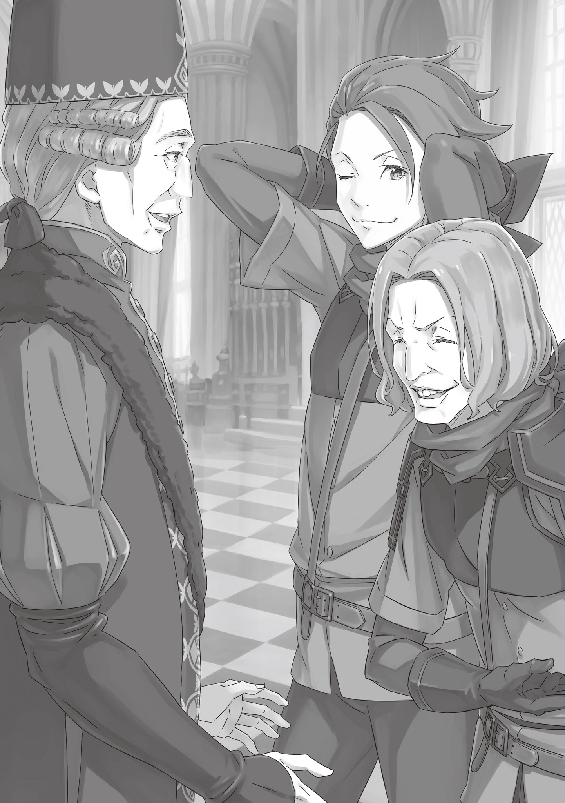
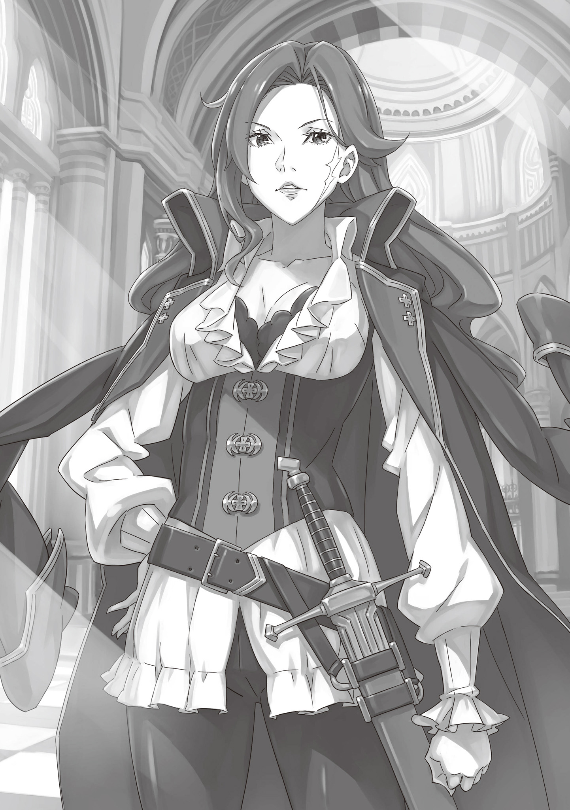
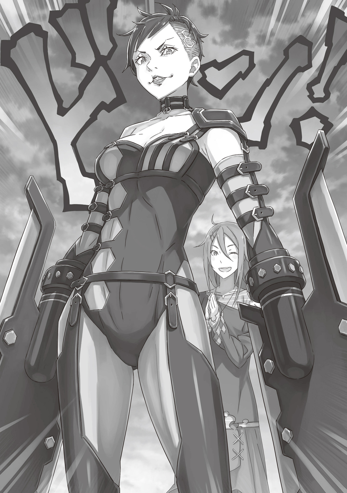
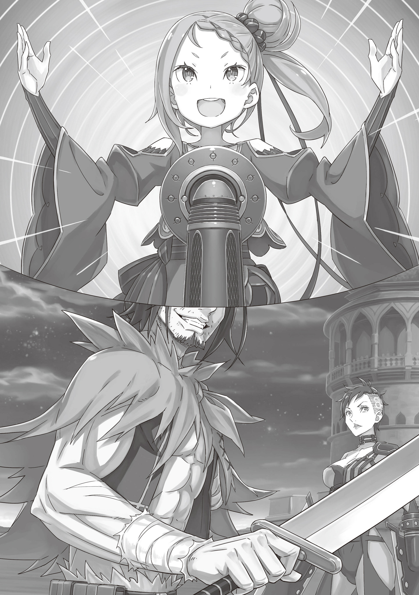
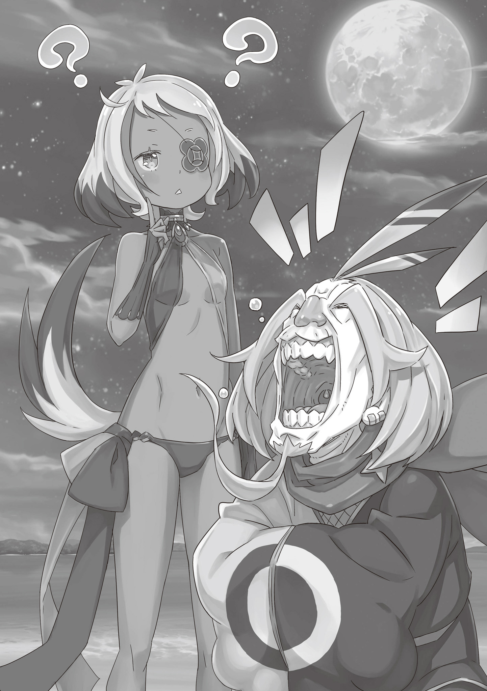

Багровая Графиня и Гладиатор

『赫炎の剣狼』

Смертельный поединок всем кажется увлекательным когда это не их жизнь стоит на кону.

Может прозвучать как крайность, но с его перспективы, в ней была весьма ощутимая доля правды. От такого нельзя было играючи отмахнуться как от нелепого преувеличения.

Пока он катился кубарем по твёрдой земле, ему были слышны, доносившиеся сверху восторженные крики. Восторг сменило освистывание в адрес его неуклюжей попытки бегства, но ему было наплевать.

— В конце-то концов, это я здесь своей чёртовой жизнью рискую! — он cплюнул слюну с мокротой, прежде чем выставить перед собой огромный меч в своей правой руке. Этого было достаточно, чтобы контролировать его противника, который уже собирался продолжить атаковать в рукопашную. Надвигающийся на него, бледный, лысый мужчина держался расслабленно, обе его руки свободно болтались, пока тот ухмылялся.

У лысого человека в руках не было никакого оружия, что в этих местах являлось весьма необычным выбором. Но, в некотором смысле, было в его руках нечто куда более опасное чем любой меч или копьё.

Существовала техника под названием Отравленная Рука. Метод убийства, заключавшийся в том, чтобы вымачивать свою руку в яде, вбирая его вплоть до того момента, когда он вот-вот станет смертельно опасным. Постепенно, насыщенные токсины накапливались в ногтях, а это значило, что малейшая царапина могла погубить врага. Фиолетово-красные пальцы и ногти лысого человека свидетельствовали о его владении этой техникой.

— Вижу у нас тут шиноби, просравший важное устранение. — Одних лишь рук этого человека и его непоколебимой решимости убивать было достаточно, чтобы угадать его происхождение.

Шиноби были убийцами прошедшими жесточайшую подготовку и невероятным образом расширившими пределы возможностей своих тел. Некоторые сомневались в их существовании, говорили будто те были всего лишь городской легендой, но даже если и так, то они были легендой, в которую стоило верить. Их нанимали сильные мира сего в качестве элитных солдат для участия в игре “убей или будь убитым”, по правилам которой жили подобные им люди. Не ясно как конкретно этот сюда попал, но теперь он застрял здесь как и все остальные.

Ибо это была…

— Отвратная, ничтожная дыра, зовущаяся Гинунхайвом, островом рабов меча, где пленённые им вынуждены биться друг с другом.

Положение рабов меча соответствовало их названию, это касалось и тех двоих, что сражались в данный момент. Этими словами обозначали худших из худших; день ото дня литрами лилась их кровь, в избытке ломались их кости и гасли их жизни. И этот, так называемый Остров Рабов Меча, где смертельные поединки выдавали за развлечение, был идеальным вместилищем для полчищ имперских подданных, ищущих утоления их жажды крови. Вполне естественно рассчитывать на то, что в столь бесконечно ожесточённых землях как Империя Волакия найдётся подобное место.

— Не то чтобы становилось хоть немного лучше от того, что они дёргают нас за ниточки! — прорычал мужчина, медленно поднимаясь, держа в руке тяжёлый меч. Судя по весу этого оружия, оно явно не предназначалось для того, чтобы им подолгу размахивали одной рукой, но, к сожалению, у этого человека не было другого выбора кроме как положиться в бою на свою правую руку. Ибо левая рука, которая в противном случае могла бы оказаться полезной, отсутствовала.

— … — Его длинные, непослушные волосы были собраны на его затылке, чтобы тот мог свирепо таращиться на своих противников глазами, которые некоторые называли злыми. Это всё чем он мог держать врага под контролем. Однорукий мужчина выдохнул. Его рука не входила в число его недавних потерь. Это случилось в далёком прошлом, и он уже давно приноровился к тому как это влияло на его равновесие. Это всё ещё создавало сильные неудобства, когда приходилось сталкиваться с противниками, требующими от него повышенной бдительности, такими как этот.

— А это значит, что мне не стоит сильно с этим затягивать, — сказал он. — Как тебе такая идея, Мистер Наверное-Шиноби? Скажем, мы с тобой сработаемся и нарочно забьём на этот матч?

— Забьём…?

— Хо, интересно стало, ага?

Человек с Отравленной Рукой настороженно вскинул бровь. Почувствовав возможность, однорукий мужчина стал напирать дальше. — Всё просто: я буду и дальше себе бегать от тебя, а ты атакуй меня да промахивайся. Если это продлится достаточно долго, то хозяин и зрители начнут понемногу терять терпение. Есть шанс, что у них там под рукой имеется зверодемон какой или что-то типа того и они могут отправить его сюда, чтобы расшевелить нас. И тогда нам не придётся бороться друг с другом, только с тварью.

— Если мы вместе её одолеем, то переживём этот день, ты это имеешь в виду?

— Ага, в этом вся задумка! Оу, до чего ж классно встретить парня, с которым я могу поболтать немн… Хгггх?! — Как только однорукий мужчина, расплываясь в улыбке, подумал, до чего же непринуждённый у них намечался разговор, как на него кинулся Отравленная Рука с его остро заточенными ногтями. Однорукий мужчина едва успел уклониться, перекатываясь назад, дабы увеличить дистанцию между ним и его врагом.

Лысый человек ухмыльнулся ему в ответ. — Не глупи, — сказал он. — Объединиться с тобой чтобы биться со зверодемоном? И, вероятно, сгинуть при этом самому? Любой, поставь перед ним выбор между одноруким мужиком и зверодемоном, выберет калеку. Я не исключение.

— Эй, послушай, Я знаю что ты чувствуешь, ладно? Но я на правах твоего брата по разуму…

— К тому же, для меня это возможность козырнуть отточенными мной навыками. И я терпеть не могу, когда кто-то мешает мне веселиться.

— О! Прости. Я не знал, что ты из тех самых прирождённых убийц. Полагаю найти общий язык нам не удастся из-за разницы во взглядах, значит. — Он бы и рад был в полнейшем замешательстве почесать свою голову, но опусти он свою правую руку, его единственную линию обороны, то в тот же миг получил бы в свой адрес смертельный удар. Он обошёлся вздохом, а затем Отравленная Рука его оппонента дёрнулась.

Он чувствовал его приближение, или скорее, знал о нём. Началось бы всё с атаки ядовитой правой рукой, а если бы он от неё уклонился, этот человек ударил бы левой, хотя нет, то было бы лишь видимостью, отвлекающим манёвром. Он пустил бы в ход свою ногу, его козырной картой была отнюдь не его Отравленная Рука, а Отравленная Нога. Всё довольно запутанно.

Но фокус уже не способен застать вас врасплох, если вам известен его секрет.

— …! — Сделав резкий вдох, однорукий мужчина уклонился от хука правой атакующего, но несмотря на то, что он видел движение его левой руки краем глаза, он всё же поднимал свой меч дабы встретить им летящую с разворота ногу этого человека. Лезвие вонзилось прямо в колено, отрубая ногу и разбрызгивая кровь повсюду. Несколько капель упало на однорукого, которому пришлось уповать на то, чтобы хотя бы кровь его врага не оказалась токсичной.

— Всего-то неудача… или, мне стоит сказать, неудачная звезда, — сказал однорукий, а затем голова проигравшего, со всё таким же недоумевающим выражением лица, взмыла вверх по дуге, рассекая воздух.

— Ещё один день на волоске от гибели, да?

— Эй, мне бы хотелось более лёгких побед. Но эти старые косточки повидали уже более тридцати лет, да и с одной рукой эти неуклюжие маленькие победы лучшее, что я могу сделать.

Однорукий мужчина удалился с арены, сопровождаемый радостными криками, через проход для рабов меча. Его встретил один из стражников в действительности же один из тюремщиков, которые были расставлены вокруг Колизея. В их обязанности входил надзор за рабами, обеспечивающих развлечение, причём бойцы иногда ласково называли их “рабовладельцами”.

Большинство стражников относились к рабам с презрением, однако Орлан, один из них, отличался тем, что относился к бойцам почти что по-дружески. С учётом его добродушного отношения, его пригодность к службе в страже была весьма сомнительна, однако, очевидно, он был достаточно профессионален в ней, чтобы оставаться на своём посту последние несколько лет, и отношения с этим одноруким мужчиной у них были на уровне знакомых. На самом деле, они скорее были похожи на товарищей, нежели на раба меча и стражника.

— Лови, — произнёс однорукий мужчина, бросая Орлану своё залитое кровью оружие. Рабам меча не разрешалось иметь при себе оружие и пользоваться им, кроме как на самой арене, а за её пределами они и вовсе должны были носить наручники. Даже если они имели чисто декоративный характер для однорукого человека.

— Так, наручники надеты, — сказал Орлан. Затем он добавил: — Знаешь, я рад, что ты сегодня выжил. Наверное, это не моё дело, но, тот парень, с которым ты дрался, про него ходили ужасные слухи. Он схватил за руки несколько стражников, и все они умерли. Все утверждали, что это был несчастный случай, но…

— Но если с пользователем Отравленной Руки произошёл “несчастный случай”, разве это не равно сказать то, мол, что он сам отрубил им головы своим оружием?

— Ты прав. Но у нас здесь не так уж и много таких, как он. Он был слишком увлечён, чтобы задавать вопросы. Чёрт, жизнь стражников такая же дешевая, как и жизнь рабов меча. Не говори никому, что услышал сейчас, хорошо? — Орлан тонко улыбнулся; он действительно не был создан для работы стражником. Хотя, возможно, дело было вовсе не в работе стражника — может быть, дело было в самом Гинунхайве? Может быть, во всей Империи.

В Империи ценились материальные достоинства: непоколебимая решимость и готовность поставить на кон свою жизнь ради победы в сражении. Сердобольность и щедрость не заслуживают здесь уважения. Трудно жить с такими людьми, у которых такой жестокий взгляд на мир. Но такова была Священная Империя Волакия.

— В любом случае, это лучше, чем быть рабом, как я!

— Это не смешно… И, о, послушай, я не пытаюсь сказать, что рад твоей победе лишь потому, что тот парень был кретином . Это еще и потому, что ты весьма приличный человек.

— Эй, послушай. Если ты будешь слишком сентиментальным, то в конечном итоге пойдёшь по моему пути!

— Что ты имеешь ввиду под “путём”?

— А, не так важно. Давай уже поскорее свалим отсюда. — Однорукий похлопал всё еще сбитого с толку Орлана по плечу, в попытке заставить его двигаться. Он не был заинтересован в том, чтобы стоять и переговариваться, к тому же, этот проход вёл на арену. Это означало, что по нему вскоре пройдут бойцы для следующего матча.

— Ооо, Боже. Мне было интересно, кто же мог здесь мельтешить — это же мой любимый маленький Ал.

— Угх…

Это было именно то, чего он так сильно не хотел встреча со следующим соперником. Ал почувствовал, как его лицо исказилось в гримасе.

— О Боже, Боже, Боже, — сказала женщина-боец, своим звонким как колокольчик голосом, когда увидела Ала. Её длинное тело покачивалось, когда она подошла к нему с таким видом, будто бы её очень весело. — Угх, он говорит! Какая грубость! Я-то думала, что мы друзья…

— Не дави на меня. У меня было бы много проблем, если бы я объявил нас друзьями. Максимум нас можно было бы назвать знакомыми, которые иногда беседуют.

— Хе-хе-хе. Ты говоришь такие забавные вещи, мой милый. — Сказала высокая женщина, с весьма красивой улыбкой, звонким хохотом и подстриженными тёмными волосами. На самом деле, она действительно была необычайно высокой более двух метров. Она была одарена идеальной фигурой, с изгибами ровно там, где женщине хотелось бы их иметь, и она с гордостью выставляла их на показ, нося довольно откровенный наряд. В сочетании с угловатым лицом, всё это делало её похожей на сбежавшую из музея скульптуру.

Но было в ней то, что бросалось в глаза даже больше, чем её ослепительная внешность: её руки. Глядя на её высокое тело, можно было подумать, что её руки весьма длинные, однако они обе заканчивались в локтевом суставе.

Таким образом, она находилась в еще более тяжёлом положении, чем Ал с его одной рукой, но тем не менее, она являлась цветочком, что всё же расцвел на фоне этих трудностей. Зрители не кричали и не освистывали её; наоборот, она всех восхитила. Она была самым главным событием здесь, на Гладиаторском Острове Гинунхайв.

— Я благодарен тебе, Хорнет, правда, но давай о наших с тобой положениях. Если бы такой крохотный муравей, как я, стоял рядом с тобой, меня бы разнесло.

— Ох, прошу тебя, не говори таких вещей. Ты меня расстраиваешь. Ты ведь мой самый, сааамый лучший друг, в конце концов.

— Сааамый лучший, да? Думаю, это значит, что остальные уже померли.

— Хе-хе-хе!

Пользуясь такой высокой текучестью кадров на этом острове, можно было бы очень быстро продвинуться по карьерной лестнице раба-мечника. Тот факт, что Хорнет не перечила Алу, был в какой-то степени приятным событием.

Благодаря своей незабываемой внешности, характеру и манере речи, Хорнет умела надолго приковать внимание публики к себе, не отпуская его. Она действительно была похожа на свою тёзку; два-три укуса её яда и ваша жизнь окончена. По сравнению с этим ядом, яд Отравленной Руки, с которым Ал сражался мгновением ранее, был просто детской забавой.

— Госпожа Хорнет, уже почти время…

— Ох, я знаю. Вы позволите?

Это был, хотите — верьте, хотите — нет, один из стражников, обратившийся к ней в таком почтительном тоне. Сослуживец Орлана встал на колени перед ней и снял с её ног кандалы, которые она носила вместо наручников. Но это действие было похоже на то, как мужчина склоняется перед своей королевой.

Именно за эту врождённую способность заставлять других преклоняться перед ней она получила прозвище Императрица Рабов Меча.

— Что ж, хочется верить, что и этот поединок будет прекрасным и элегантным.

Ал набросился на неё. Это привлекло внимание стражника, сопровождавшего Хорнет. “Брр, жутко”, — сказал он. Стражник стал человеком Хорнет до мозга костей — он без колебаний напал бы на Ала, однако она его остановила.

— Не делай глупостей. Лучше иди в мои объятия, милый.

— Да, мэм.

Всё еще стоя на коленях, стражник кивнул, и из глубины коридора показался тюремщик низкого ранга, чьё лицо было закрыто шарфом; он тащил за собой тележку, на которой лежали два массивных меча. Каждый из них был размером со взрослого человека, однако их рукояти были весьма причудливой формы. Впрочем, это было понятно, ведь это оружие было изготовлено специально для Хорнет.

“Ииии понеслась!” — томно произнесла Хорнет, направив свои короткие руки в сторону мечей. Обрубки аккуратно вошли в пустые рукояти, закрепившись со звучным щелчком. Затем девушка весьма легко подняла огромные клинки, несмотря на то, что каждый из них весил больше 100 кг. Обычный человек не смог бы поднять даже один такой меч, не говоря уже о том, чтобы справиться с двумя. Именно это делало её стиль абсолютно уникальным и именно это делало её сильнейшим бойцом на острове Гинунхайв.

— Может быть, ты поглядишь на мою битву, прежде чем уйдешь, Ал, милый? Пожалуйста, сладкий. Ты же всё ещё здесь. Я хочу посвятить сегодняшнюю победу тебе и только тебе.

— Спасибо, но нет!

Он не смог удержаться ещё от одного выстрела, несмотря на продолжающееся ослепление стражника Хорнет. Но даже после этого Хорнет продолжала улыбаться, и просто прошла на арену. Мгновение спустя раздались громкие возгласы: она вышла на арену, и толпа обезумела.

— Прекрасно. Я собираюсь вернуться под землю и немного вздремнуть.

— Что…?! Как ты смеешь так игнорировать госпожу Хорнет! — огрызнулся стражник.

— О чём ты? Я ей в лицо сказал, что не собираюсь смотреть. Она лишь улыбнулась на это. Для меня это достаточно хороший ответ. Я не прав?

Ал бросил на разгневанного стражника жесткий взгляд, наблюдая, как тот мигом вздрогнул от неожиданности.

Он был свеж после боя только что он рисковал своей жизнью. Очевидно, этого было достаточно, чтобы даже его кровь вскипела. Стражник видел, как Хорнет усмехнулась и пропустила слова Ала мимо ушей, так что более у него не было оснований настаивать на своём. Ему оставалось лишь молчать, и он не был доволен этим.

Чёрт возьми, она знает, как держать тебя в напряжении! Едва ли она ведёт себя как раб меча, верно? — сказал Ал. Когда он проходил мимо умолкшего “слуги” Хорнет, удаляясь прочь от арены, Орлан опустился рядом с ним. Он практически сделал себя невидимым с момента появления Хорнет, и это был правильный выбор.

Хорошо это или плохо, но лучшее, что вы можете сделать для себя постараться не сталкиваться с Хорнет. Если она проявила к вам интерес это было опасно, а если не проявила, то это не значило, что вы в безопасности. Здесь это было негласным правилом.

— Эй, по крайней мере, похоже, ты ей нравишься, Альдебаран, — сказал Орлан.

— Дай мне передохнуть Орлан. И мне помнится, я уже говорил тебе… — однорукий человек, Альдебаран, подмигнул охраннику. — Зови меня Ал. Ты же знаешь, я ненавижу своё полное имя.

Остров Рабов Меча, Гинунхайв, расположенный в западных пределах Империи Волакия, был столь плотно окружён озером, что его впору было называть островом неумолимых вод.

На остров можно было попасть лишь по одному единственному мосту, подъемному, если быть точным, который обычно держали в поднятом и непроходимом положении. Допуск на территорию острова, равно как и отбытие с неё строго регулировался, а причиной практически полной изоляции обитателей острова была довольно простой: нельзя было позволить рабам меча покинуть его.

Рабы меча являлись ровно тем, на что намекало их название: рабами, которым было позволено владеть мечами. Однако, подобное имущество разрешалось носить при себе лишь на время их участия в смертельных поединках на арене в центре острова, матчей организованных на потеху зрителей пришедших извне. Положа руку на сердце, остров служил сценой для извращенного зрелища, когда на всеобщее обозрение выставлялось убийство рабами себе подобных.

Большинство рабов меча были либо преступниками либо теми кому не оставили больше выбора кроме как добровольно отдаться такой жизни, не будучи способными выплатить долг. Хотя, пусть и довольно редко, но случалось так, что какого-то бедолагу без крыши над головой могли приволочь сюда. Каким бы ни было их происхождение, как только они были низвержены до звания раба меча, все они желали одного: прожить ещё один день, убив своего противника. И больше ничего.

— Я тут подумал, Ал. Ты действительно считаешь, что мы можем и дальше так жить?

В подземелье острова находились жилые помещения, где размещались рабы меча. Однако “жилыми” они были весьма относительно; они были напрочь лишены удобств и какихлибо проявлений заботы, которые могли бы преобразить это место в нечто более уютное. Это было лишь пространством где рабы могли влачить своё жалкое существование.

Каждый из них занимал себе место для ночлега, а затем убивал время до тех пор пока его снова не уводили сражаться. Ала это тоже касалось.

Он просто валялся в своей койке, благодарный за то, что ему удалось пережить ещё один день…

— Эй, Ал? Ты там слушаешь? Ээээээээй, Ал!

— … — Приторно слащавый голос мужчины заставил его поморщиться и перевернуться, лёжа на твёрдом полу. Повернуться спиной к собеседнику обычно означало полнейшее отсутствие заинтересованности в беседе с ним, но он, по-видимому, этого намёка не уловил.

— Эй, ну хватит уже, — сказал он, тряся Ала за плечо. — Говорю же тебе, ты должен это услышать. Я говорю кое о чём очень важном!

— Я тебя не слушаю, к тому же чуть не помер, прояви ты к человеку немного сострадания? Я только покончил со своей работой и жутко устал. Я хочу завалиться спать. Это единственная доступная мне чёртова радость жизни.

— Опять двадцать пять? Ты же знаешь, что есть на острове и другие приятные вещи кроме сна. К тому же ты, Ал, весьма популярен. — Мужчина улыбнулся и подбородком указал на нескольких персон стоящих вдалеке. То было несколько вызывающе одетых женщин, и хотя официально сами они были рабами меча, они всё же служили на этом острове в качестве жриц любви. Их никогда ладно, почти никогда не вызывали биться на арене, но взамен, от них ждали исполнения роли отдушины для других рабов меча.

Иметь среди них “популярность” для Ала было почестью, которой, по его же мнению, он был не достоин…

— Агх, — было всем что он сказал.

— Уа! Ал, так нельзя. Это просто за гранью грубости! Мы ведь с тобой о красивых женщинах говорим! Их труд ничем не хуже твоего!

— Я предвзят к ним не от того чем они занимаются. Дело… как бы в чувствах. — Ал нахмурился, борясь с неприятным ощущением пришедшим вместе с этим шквалом критики.

Конечно, он мог бы овладевать женщинами и играться с ними. Они бы махали ему, улыбались, каждая в поисках нового клиента. Некоторые из них оказывались сломлены найденным. К этим женщинам никто не проявлял доброты. Но даже в таком месте, они старались жить так хорошо как могли. Да кем он вообще был, чтобы обращаться с ними так, будто они хуже его?

— Ты неловко себя чувствуешь в обществе женщин, и всё же с ними ты всегда обходителен. Недаром ты им по душе, Ал.

— Просто им особо не из чего выбирать. Будь у них побольше вариантов, то на такого потасканного старого пердуна как я, никто бы не позарился.

— Хо-хо, в выражениях мы не стесняемся! Но это пожалуй одна из тех вещей, которые мне в тебе нравятся, Ал. — Возмутительно красивый мужчина улыбнулся ему. Ал вздохнул, не уверенный в том как ему быть с заискиванием этого человека.

Симпатичный мальчишка с длинными серыми волосами, звали его Убирк, был привезён на Гинунхайв в качестве раба меча пять лет назад. Он был красивым и стройным, но не особо способным. На самом деле, он не годился для сражений от слова совсем; было очевидно, что его втоптали бы в грязь не позднее чем через пару минут на арене. Так как же всё-таки он умудрялся выживать здесь целых пять лет? Так же как и те женщины.

Хорнет может и была наиболее отличившейся из числа рабынь меча, но было немало и других женщин доказавших свою доблесть на ринге. Обязанностью Убирка было следить, чтобы определённое их число всегда оставались довольны, точно так же как это делали жрицы любви для рабов меча мужского пола. Его умения в данной области и были тем, что так долго сохраняло ему жизнь.

— Так вот, Ал, возвращаясь к тому, о чём я там говорил…

— Ты меня не расслышал? Не в настроении я болтать.

— Ой, да будет тебе. У меня для тебя особое приглашение от самой Императрицы.

— Так ещё не интересней. — Ал нарочито поморщился; на какое-то время он не хотел ни видеть её лица, ни слышать её имени.

Убирк широко улыбнулся в ответ. — Вау, вот как ты позволяешь себе говорить о Хорнет! Тебя ничем не напугать, так ведь, Ал?

— Не смеши. Ты ж меня видел только что. У меня от женщин кровь стынет. И от Хорнет, само собой, тоже. ЧТД.

— Чееее тээ… Чего? Ещё одно забавное словечко с твоей родины, Ал? Никогда не понимал их значения! — Убирк наклонил голову, пытаясь усвоить необычные слова Ала.

Ал не собирался распинаться чтобы объяснить их значение. Окончательно свыкшийся с таким поведением, Убирк настаивать не стал. К несчастью для Ала, это не означало, что тот перестал говорить.

— Ну же, только послушай. А иначе, в следующий раз когда мы с ней будем предаваться плотским утехам, Хорнет может меня прихлопнуть. Тебя разве не будет грызть из-за этого совесть?

— Оо, да ради всего… Если выслушаю тебя, обещаешь не донимать меня во время моего отдыха? Если справишься, выделю пару минут на разговор с тобой.

— Ха-ха! Какой же ты приятный малый, Ал. Жаль с женщинами обращаться ты не мастак.

— Захлопнись, — проворчал Ал, отмахиваясь от подколов Убирка и в то же время требуя его поторопиться и говорить на одном дыхании.

Наконец, Убирк перешёл к сути. А именно: — Ходят слухи, что на арене скоро произойдёт некое крупное событие. Важные шишки со всей Империи съедутся сюда.

— В самом деле? Они уже много лет так не делали. Почему сейчас?

— Потому что… Ну ты знаешь. Император Волакии нас покинул, и теперь у нас появился новый. Другими словами, все имперские кандидаты мертвы.

— Они все мертвы, и значит у нас новый Император? О, так ты имеешь в виду, что последний выживший кандидат занимает трон. Ага, думаю это значит остальных больше нет с нами.

Объяснение Убирка оставляло желать лучшего, но Алу хватило смекалки сообразить, что тот хотел сказать. Он тихо подмигнул.

Даже здесь на уединённом острове, до них дошла весть о смерти Священного Императора Волакии и про так называемую Церемонию Императорского Отбора, которую проводили для выявления его преемника. Чем бы ни было это предстоящее событие, оно наверняка задумывалось как празднование в честь нового правителя.

— Вряд ли они испытывают друг к другу тёплые чувства, но думаю даже они не прочь закатить вечеринку в такие времена. Ставлю на то, что для таких как мы новость эта прескверная, однако.

— Просто рабу меча с десятилетним стажем по опыту больше знать положено, да? Моё тебе уважение! — сказал Убирк, поровну смешав серьёзность с сарказмом.

Ал цокнул языком. — Хорош. Мысли о моей опытности меня только в депрессию загонят.

Поразмыслив над аналогичными ситуациями из своего прошлого, Ал знал, что празднование в честь нового Императора наверняка не обойдется без смертельных матчей “особого” толка. Привычные правила поединка один на один подвергнут изменениям или же вовсе отменят. Был, по крайней мере, один случай, когда на десятерых рабов натравили крупного Зверодемона, пойманного специально для того действа.

— Бой с огромным как гора зверодемоном четыре года назад… Вот он был самым тяжким. Если бы не Хорнет, зарыли бы нас прямо там на месте. Рога той твари всё ещё украшают этот зал.

— Воистину, о таких сражениях слагают легенды. Так жаль, что пережить её удалось только тебе с Хорнет.

— Даа, и именно поэтому ко мне теперь столько внимания от неё.

До того момента она видела в нём лишь не подающую надежд мелкую рыбёшку, но то, что ему посчастливилось выжить в том кошмарном побоище, к превеликому огорчению самого Ала, пробудило в ней интерес. С тех пор она прохода ему не давала каждый раз, когда они оказывались рядом друг с другом. Она поистине являлась творцом его кошмаров.

И всё же нельзя было сказать, что он не был ей обязан благодаря ей он смог пережить ту ожесточённую схватку четыре года назад.

— Но порой, если не можешь бороться с течением, значит плывешь по нему. Ну так что там? Чего хочет Хорнет?

— Обещаю, ничего замудрённого. Предстоит крупное торжество и поэтому будет много народа из тех кого обычно здесь не встретишь. А это значит…

— … — Ал ничего не ответил.

Убирк перешёл на шёпот. — Мы могли бы просто взять в заложники кого-нибудь важного, может даже верховного графа или ещё кого повыше. А потом мы сможем потребовать нас освободить!

Ал снова поморщился. Как бы дерзко она ни звучала, но для него эта пластинка была уже заезженной. — Вы ребята всё никак не уймётесь, да? Сколько ты уже мусолишь эту затею?

Убирк уже не в первый раз заводит при нём свою шарманку об этой чрезвычайно несбыточной мечте, и Ал уже начал понемногу от неё уставать.

Убирк не был одинок в этом; многие рабы меча этого острова втайне помышляли о попытке побега. Покуда они пребывали здесь, ни один раб меча не был уверен, наступит ли для него завтрашний день. Желать свободы было самым естественным из желаний во всём мире. И всё же…

— Я тебе зуб даю, что сотни, а может и тысячи людей вынашивали эту же самую мечту до тебя. И знаешь скольким удалось слинять? Ни одному. Удрать отсюда это нелепая и безнадёжная затея.

— Поверь мне, я в курсе. Но это лишь потому что они либо не продумали всё как следует, либо действовали спустя рукава. Тем планам было суждено провалиться, так и случилось.

— Думаю, можно и так на это посмотреть. — Ал не стал возражать Убирку, но планы все составляли, держа в уме идеальные условия. Доводов Убирка было недостаточно, чтобы побороть равнодушие Ала к данной теме. — Всё равно не могу себе представить, чтобы Хорнет подписалась на подобную хрень. Императрице здесь нравится. Она же берсерк и живёт ради битвы.

Хорнет жила без ограничений и ни в чём не нуждалась; она нашла для себя место, где исполнялся любой её каприз. Ал не мог понять, с чего бы ей поступаться таким почётным отношением к её персоне. От того, в свою очередь, крайне подозрительно начинало звучать то, что приглашение исходило от самой Хорнет.

— Я тебя раскусил. Извинишься прямо сейчас, и я может быть тебя прощу, — сказал Ал.

— Ха-ха-ха-ха! Не сработало, значит? Хорнет ты, похоже, нравишься, Ал, вот я и подумал, что ты мог бы её уломать… Ааай!

— Я сказал, что может быть прощу тебя. — Ал стукнул простодушного с виду Убирка костяшкой пальца по голове, от чего глаза последнего наполнились слезами, а затем толкнул его в сторону.

Не отказав Убирку в мимолётной беседе, Ал лишь существенно ухудшил своё и без того печальное положение. И всё же, стоило, наверное, уделить внимание тому, что на острове скоро пройдёт крупное мероприятие. Особенно, учитывая то как много подобных событий ему довелось пережить в прошлом и сколько раз он был уверен, что вот-вот умрёт.

— Именно поэтому нам нужно преодолеть столь нелёгкие времена и…

— Исчезни уже отсюда! В следующий раз я врежу тебе всерьёз! — пригрозил назойливому Убирку кулаком Ал, намереваясь избавиться наконец от мальчишки с дурным глазом.

Хоть язык у Убирка и был подвешен, но быть такого не могло, чтобы он всерьёз верил в свой план побега. Это было мечтой, которую рабам меча ни за что не претворить в жизнь, желанием, которому не суждено сбыться.

К тому же Ал был уже сыт по горло бесплодными фантазиями.

Он был рабом меча вот уже более десяти лет и уже не помышлял об иной жизни.

Мышцы пожилого слуги едва ли не скрипели от напряжения повисшего в комнате. Для ветхого старика дворецкого служение другим было даром свыше. Вот уже более пятидесяти лет он работал на семью Пендлтонов, начиная ещё с родителей нынешнего главы семейства. Даже не будь он так сильно обязан своему хозяину, их всё равно связывали близкие отношения, ведь последний рос у него на глазах. Всё вышесказанное значило, что дворецкий желал своему господину одного лишь добра.

И всё же…

— Хмм…

Чашка, поданная дворецким на стол, оказалась в руке и тонко очерченный нос вкушал аромат её содержимого. Он был уверен, что ему удалось соблюсти все основы как полагается как долго заваривать чайные листья, температуру воды, и все остальные детали. Степень его самоотдачи могла бы вызвать изумление, но вкус чая может кардинально поменяться от малейшего отклонения по любой из целого ряда причин.

Взор, в коем блистали как красота, так и знания обо всех этих вещах, пристально изучал плоды его труда. Удастся ли ему угодить его обладателю? Такой была поставленная задача, которой был одержим каждый обитатель этого дома в данный момент. Работать лучше и усерднее, дабы выказать должное уважение их господину. Не то чтобы это сильно беспокоило дворецкого, но, быть может, персона, созерцавшая чашку, его возмутила.

— Могу ли я спросить каким вы его находите, Госпожа? — Дворецкий не разогнулся, продолжая кланяться.

— Приемлемым я аромат желаю счесть. Остался только вкус. Теперь его узнаем… — Говорящей была персона бывшая второй по важности после самого хозяина дома: супруга Джораха Пендлтона, которому так долго служил этот дворецкий.

— …

Губы цвета вишни коснулись края чашки. Дворецкий сбоку наблюдал за девушкой, потягивавшей чёрный чай. Сей вид вызывал у него улыбку. Его господин так долго не встречал достойных кандидаток в жёны, а теперь, наконец, в своём преклонном возрасте, ему впервые посчастливилось жениться. Событие это было радостным. Даже несмотря на то, что супруге его было каких-то двенадцать лет от роду.

Разница в возрасте навряд ли была в диковинку среди аристократических супружеских пар, а браки по расчёту и вовсе были чуть ли не продиктованы этикетом как способ упрочить связи между знатными семействами. Но чтобы мужчина за пятьдесят принял к себе двенадцатилетнюю невесту даже дворецкий с его выслугой лет поймал себя на том, что был этим озадачен. Не в последнюю очередь потому как эта конкретная жена, казалось, не давала никаких преимуществ.

В то же время элементарная порядочность Джораха не подлежала сомнению. Он обладал редчайшим среди имперской элиты качеством добротой и её было достаточно дабы вселить в сердце дворецкого непоколебимую верность. Эта преданность сподвигла его на то, чтобы стараться по мере своих сил оказывать этой девушке всяческое содействие, зная, что она будет подавлена сменой обстановки. Да, дворецкий со всей своей незыблемой решимостью принял молодую супругу своего господина.

Эта решимость моментально рассыпалась перед лицом самой этой девушки.

Да, девочке были двенадцать лет. И да, она явилась в усадьбу Джораха, имея за душой лишь юность, при отсутствии собственного домовладения. Но она была поразительно хороша собой, а душа её пылала ярче любого пламени.

Присцилла. Так звали эту волевую молодую особу, объявившуюся в его доме словно завоевательница. Присцилла Пендлтон.

— Недурно, — сказала девочка, чей голос, исходящий из её щуплого горлышка, будто бы впивался в мозг слушателя. Дворецкий не сразу понял, что та дала оценку его чаю. Причина его запоздалого осознания этого факта была проста: лицо этой девочки. Ничего особенного не произошло или не поменялось она попросту была настолько хороша собой, что он был ею очарован; время по ощущениям словно прекратило свой ход.

И когда течение времени возобновилось, а до дворецкого дошли её слова похвалы, он затрепетал. Эта девушка, чей возраст не был равен и четверти прожитых им лет, своим комплиментом заставила кровь в его жилах бежать быстрее; чувство беспомощности сковало саму его душу.

Для этих старых костей просто быть дворецким уже было даром свыше. Вероятно, что для такого человека было вполне естественно кланяться перед той, что была прирождённой правительницей. Ибо служить кому-то означало находиться в его полной власти.

— Покиньте нас, изволю я с супругом говорить.

— Да, сударыня. — Дворецкий, не задумываясь, покинул комнату. Его интересовало то, сделает ли она ещё хоть один глоток чая, пока он будет выходить. Он задавался вопросом, одарит ли юная завоевательница его работу подобным знаком одобрения.

Старый дворецкий чуть ли не буквально пылал надеждой, тихо оставляя комнату.

Когда дворецкий вышел и они оказались одни, раздался слабый голос: — Кажется, ты всех держишь под своим каблучком, Присцилла. — Обладателем этого голоса был мужчина в годах, сидевший в наиболее удалённом от входа кресле, бывшем самым важным в этой комнате, что бы это ни значило. В нём проглядывались апатия и первые седые волосы, но он был хозяином этого дома Джорахом Пендлтоном.

Можно было утверждать, что ему, как графу в Священной Империи Волакия, повезло с его происхождением и статусом в обществе. Его тяжёлый взгляд был сосредоточен на красивой девушке с глазами алыми как кровь и ярко-оранжевыми волосами, собранными заколкой c драгоценным камнем Присцилле.

То, каким образом Джорах начал их беседу, предполагало, что разница в возрасте не была единственным барьером, разделявшим эту супружескую пару.

На нерешительное обращение своего мужа к ней Присцилла ответила: — Ба, — и громко фыркнула. — Говоря со мной, изволь не пресмыкаться и не хрипеть, ведь разницу меж голосом твоим и слабым ветерком едва ли я могу узнать. Или погоди ужели правда ветер мне только что случилось услыхать?

— Н-нет, нет, не ветер. Это я с тобою говорил… Я лишь имел в виду то, что ты прекрасно ладишь с прислугой.

— Хмф. Коль так считаешь, то лишь докажешь насколько слеп на самом деле ты.

— Что? — сказал Джорах, широко открыв глаза.

Нелепую реакцию своего мужа Присцилла встретила с недовольным выражением лица. — Послушай. Отнюдь не значат отношения эти, что с ними я в ладах. Они лишь воле подчиняются моей. Неведома для них иная жизнь кроме как кланяться, расшаркиваться да прислуживать. Мне стоит лишь указания выдать им, и вот те счастливо хвостом виляют.

— П-понимаю… Наверное…

— Раз уж на то пошло, то я удивлена сколь долго умудрялся ты держать при себе столь посредственную обслугу.

— Держать при…? Прости. Кажется, я не совсем поспеваю за ходом твоих мыслей…

Присцилла, прикрыв один глаз, ещё пристальнее посмотрела на, продолжавшего несвязно бормотать, Джораха, но тот даже под её испепеляющим взглядом не стал вести себя иначе.

— Ты как никогда загадочен. Я говорю о том как не достаёт тебе желаний, стимулов, что каждому даны природой. Не стану говорить мол не встречала я людей тебе подобных. Но…

— Д-да? — запнулся Джорах.

— …раз так, никак мне не понять, зачем решил меня ты в жёны взять. — Присцилла к тому же продолжала сверлить его тяжёлым взглядом.

Проявив великодушие, нрав Джораха можно было бы назвать добросердечным. Умерь его, и он предстанет трусом, которому недоставало либо твёрдости характера, либо тяги к приключениям. Он был доволен всем, следуя проторенной дорогой, никогда не сворачивая с неё в необузданную глушь.

Весьма занятным он мог не быть, но обладал стойкостью и надёжностью качествами, что сложно было встретить в Империи, в которой высоко ценились жизни, пылающие ярко, преград не зная. Джораха часто высмеивали за его слабохарактерность и вероятно именно поэтому он так долго оставался в холостяках.

Правила, которым следовал Джорах Пендлтон, были просты: он не искал себе приключений, и не участвовал в авантюрах. И всё же, свадьба с Присциллой, казалось, шла вразрез с обоими его принципами. Это была, возможно, крупнейшая авантюра из всех. Ибо…

— Я в курсе, что тебе известна тайна личности моей. Я Приска Бенедикт, особа юная, которой должно было умереть во время Церемонии Императорского Отбора.

Она промолвила имя члена Императорской Семьи, побеждённого, и предположительно погибшего по итогам кровавого состязания, призванного определить следующего Императора Волакии.

Но Приска не погибла. Инсценировав свою смерть, она продолжила жить. Но не под своим именем, а под личиной девушки по имени Присцилла Пендлтон, которая ещё только постигала основы лавирования в водах приличного общества. Многие пожертвовали всем, дабы уберечь эту девочку от гибели, но когда Присцилла вышла за Джораха, то не скрыла от него ничего из всего этого.

Разумеется, откажи он ей, беря в расчёт всё, что он знал, то весьма маловероятно, что она оставила бы его в живых. Поэтому над Джорахом нависла своего рода страшная угроза, когда она рассказала ему всю правду. Но это не отменяло того факта, что, зная эти обстоятельства, он всё же согласился взять Присциллу в жёны. По какой причине? Даже Присцилла, в считанные мгновения заставившая старого дворецкого кланяться ей и потакать любым её прихотям, была не в силах разгадать истинных намерений Джораха.

— … — Джорах был в меру удивлён, но затем губы его расслабились, расплывшись в лёгкой улыбке, в благосклонном выражении лица, коим принято глядеть на малое дитя, неспособное найти ответа на вопрос.

— Быть может, супруга моего собой являешь, но правом унижать меня подобным взглядом ты не владеешь, — сказала Присцилла.

— П-помилуй меня. Я лишь… До сего момента ты вела себя словно юный мудрец, неизменно видящий всё насквозь. Я был удивлён, поняв…

— Поняв что?

— …что временами ты ведёшь себя на свой возраст. — С точки зрения Джораха, это замечание само по себе было сопряжено с немалым риском. Казалось, что про себя он рассматривал возможность того, что ему начисто снесут голову. — Тебе н-нет нужды беспокоиться. У меня нет намерений использовать тебя, разоблачить или любой другой подобной цели. В данном вопросе я с тобой абсолютно искренен.

— Очень хорошо, — сказала Присцилла спустя мгновение. — Что бы ты ни затевал, значенья это не имеет всё равно. Ибо сей мир меняется в угоду мне.

— …

Джорах ничего не ответил. Философские взгляды Присциллы можно было бы охарактеризовать как веру в предначертание или пожалуй в судьбу. Как только эти слова покинули её уста, выражение лица Джораха смягчилось вновь. Однако, прежде чем Присцилла успела отпустить комментарий по этому поводу…

— Простите меня, Господин, — сказал дворецкий, снова появившийся в комнате, постучав в дверь. Прервав личную беседу хозяина и хозяйки этого дома, он поступил неподобающим для себя образом, и человеку с его огромным стажем, следовало яснее осознавать это. Его бестактность прояснил доклад, который он им представил: — К нам посетители от Верховной Графини Дракрой.

— Верховная Графиня? Впервые об этом слышу, — сказал Джорах, поморщившись, но затем он воскликнул: — Присцилла?! — Ибо жена его уже была на ногах и уверенным шагом устремилась прочь из комнаты. Крик её мужа нисколько её не замедлил, вместо этого она прямиком направилась ко входу в особняк.

Когда она оказалась в вестибюле, то была встречена протяжной речью: — Ну вот. Нас обнаружила такая милая юная леди. — Слова исходили от незнакомого Присцилле стройного молодого человека; в ответ она удивлённо выгнула бровь. Парню было, наверное, лет семнадцать или восемнадцать, а в руках он сжимал тонкий свёрток. С дружелюбной улыбкой на лице он помахал Присцилле. — Вы малютка Графа Пендлтона? Ваш папенька сегодня до…?

— Бал, идиот, язык твой без костей! Нет у Графа Пендлтона никакой дочери! Не забегай вперёд! — Мужчина поменьше, стоявший подле разговорчивого гостя, отвесил тому смачный подзатыльник.

— Йауч! — взвизгнул молодой человек, удар вышел весьма гулким. — Майлз, брат, за что ты так?! Знаю, что в голове моей опилки, но даже так, будет нехорошо, если ты её расколешь!

— Замолкни! Если голова твоя пуста, то тебе надо бы её наполнить прежде чем снова светиться здесь! И больше не делай меня частью своих бестолковых проколов!

— Проколов?! К чему это ты конкретно клонишь? В чём я по-твоему облажался?

— Граф Пендлтон лишь недавно сыграл свадьбу с молодой невестой! Поэтому используй свою пустую башку по назначению и попытайся напрячь извилины! Мы прибываем в особняк Графа Пендлтона, у коего нет никаких дочерей, и тут пред нами предстаёт юная леди…

— О! Я понял, — наконец связав всё воедино, парень кивнул и прошёлся рукой по своим каштановым волосам.

— А ты не торопился, — проворчал невысокий мужчина, пожимая плечами словно он был измучен. — Было у тебя всегда два основных качества тупость и умение создавать проблемы. Не будь я вынужден ходить за тобой повсюду по пятам с тех пор как ты был мелким, Бал, то клянусь, я бы давно отпустил бы тебя на все четыре стороны…

— Поверь мне, брат, я многим тебе обязан. Но тебе не кажется, что ты и сам ошибочку допустил?

— Э? Что я до…? Оу! — к этому моменту их разговора, низкорослый мужчина таки заметил виновницу их спора и замер.

Но всё бы здорово да замечательно, вот только Присцилла, бывшая предметом обсуждения, наблюдала за этой перепалкой, не проронив ни слова. Как только двое визитеров повернулись к ней, она пожала своими хрупкими плечами и сказала: — В чём же дело? Продолжайте. Вниманья мне не уделяйте. Двух клоунов вид, что спорят меж собой, весьма потешной вышел сценой. Ну же, валяйте.

— Гррр… На нас сыграла как на скрипке мелкая девица…

— Поосторожнее, брат, ты начинаешь грубить. Как насчёт того, чтобы нам начать с извинений?

— Гррр…

Эту парочку от слов Присциллы затрясло. У неё не было конкретного намерения над ними насмехаться, но она всё же была опечалена тем, как ей пришлось отпустить с крючка столь потешных шутов, которые, казалось, наверняка бы пред ней скакали и извивались, что бы та не сказала.

— П-Присцилла, это мои гости. Прошу, не слишком увлекайся, потешаясь над ними…

— Хмф. Наконец нагнал, да? — сказала Присцилла, чьи раздумья над её следующей репликой были прерваны, подоспевшим Джорахом.

— Ах, — ответил граф, слегка вскинув бровь при виде тех двоих, что стояли перед его женой. — Мне передали, что к нам явились посланники от Верховной Графини Дракрой. Я и не думал, что подразумевали тебя, Майлз.

— Граф Пендлтон! Столько воды утекло, слишком много, — сказал небольших габаритов мужчина по имени Майлз, очевидно знакомый с мужем Присциллы. Он преклонил колено перед Джорахом, и парень подле него спешно последовал его примеру.

— Кто это? — спросил Джорах, наблюдая за заметно менее искушённым из двух посланников. — Я не узнаю его. Он новенький?

— Да, именно так. Он мой очень давний друг. Верховная Графиня Дракрой была достаточно добра, чтобы дать ему работу. Видите ли, он располагает достаточно редким талантом укротителя Небесных драконов. — Он толкнул молодого человека локтем. — Представься!

— Само собой, брат. Представляюсь! — Парень посмотрел на Джораха, и Присцилла заметила, что её мужа чуть было не ошеломила та непосредственность, с которой тот на него взглянул. Она улыбнулась, узрев такую напористость во взгляде. Молодой человек, должно быть, скрывал это за ширмой своей беспечности, он мог оказаться кем-то весьма особенным.

Абсолютно не подозревая, что Присцилла оценивала его, парень положил руку себе на грудь и сказал: — Рад нашему знакомству. Меня зовут Балрой Темегриф. Мой старший братец Майлз с самого моего детства приглядывал за мной — и, как видите, всё ещё не перестал.

— Я знаю. Майлз всегда умел заботиться о других. А это занятие укрощением Небесных драконов, вы…?

— Слушаюсь. Мне под мою опеку достался довольно темпераментный образчик. — Широкая улыбка Балроя, казалось, намекала на его бесстрашие, но вместе с последней фразой изменился характер выражения его лица. Пускай улыбка его и была несколько неуместной, но она всё же стала выражать уверенность в себе.

— Насколько помню я, умение приручать Небесных драконов это тайное искусство, передаваемое в определённых семействах, — сказала Присцилла. — Способ заполучить Небесного дракона во служение, существо что обычно не питает к людям нежных чувств.

— Так и есть, мисс. А вы настоящий знаток. Вы хоть и малы, но учились, должно быть, весьма прилежн… Оуоуоу!

— Это тебе следовало бы подучиться! Тому как соблюдать чёртовы правила приличия! — Разгневанный тем как быстро Балроя покинула последняя частичка учтивости, Майлз крепко ущипнул того в спину, в то время как его речь также подрастеряла в плане вежливости.

— Прошу, пожалуйста, — вмешался Джорах. — Не стоит позволять таким мелочам так вас расстраивать. Мне следовало представить её раньше. Это Присцилла Пендлтон… Она моя, кхм, жена.

Присцилла фыркнула от одной только мысли, что это всё на что Джораха хватило, представляя её. — Вообразите себе мужчину за пятьдесят, что жену свою представить не способен, дара речи не лишившись. Встань прямо и с уверенностью вещай! Мужчины удачливей тебя на свете нет. Ибо посчастливилось тебе моим супругом стать! — В ответ Джорах мог лишь неловко улыбнуться, пока Балрой и Майлз продолжали глазеть на них со слегка округлившимися глазами.

— Батюшки! Знаете, эта мысль меня посетила ещё во время нашей беседы чуть ранее, но какая же всё-таки боевая у вас жена, Граф Пендлтон.

— Да, боюсь, что я всецело в её власти…

— Глупец. Тем больше причин польщённым быть. А что до тебя, грубиян вульгарный, то я не потерплю чтоб обрисовывал меня банальным словом “боевая”. — Она сделала паузу. — Хмм. Нет, пожалуй “вульгарный” тебе всё же не годится.

— Ээ, мне принять это за комплимент? — Сказал Балрой, вопрошающе глядя на Джораха, но граф лишь неловко, но с теплотой улыбнулся; он определённо не имел никакой власти над своей новой женой.

Тем, кому наконец удалось вывести разговор из тупика, был Майлз, уже какое-то время хранивший молчание. — Так. Кхм, Граф Пендлтон, мы прибыли к вам с посланием от нашей госпожи. Разрешите передать его вам?

— Оу, разумеется, простите, что заставил вас ждать. Послание от Серены? О чём оно?

— Думаю, оно касается острова рабов меча, — вызвался ответить Балрой.

— Остров Рабов Меча… Да, кажется, он упоминался, — сказал Джорах, беря в руки запечатанное письмо, проверяя его содержимое. Он вздохнул. Ему не очень-то по душе была сама идея этого острова.

— Остров Рабов Меча… Гинунхайв. Знаешь, а ведь мне ещё не доводилось там бывать, — сказала Присцилла.

— Хо! Заинтересовались, хозяюшка? — спросил Балрой. — Аа, знаете, я сам всегда хотел повидать это место, так что это вести добрые!

— Хмм. Мне стоит полагать, что моего никчёмного супруга ваша госпожа намерена позвать на этот остров?

— Ммхмм, я бы сказал, что примерно так и есть, — подтвердил Балрой. Присцилла схватывала всё на лету. Хотя Майлз выглядел раздражённым обменом репликами между его “младшим братом” и Присциллой. — Ну же, Майлз, в чём дело? — спросил Балрой.

— Меня интересует, зачем нам в принципе было утруждать себя доставкой письма…

Казалось, что ему сполна хватало хлопот с этим так называемым младшим братом. Но, быть может, так оно и было на самом деле. — Наполните сосуд водой сверх меры и, разумеется, что через края она польётся, — озвучила своё наблюдение Присцилла. — Коли этого желаешь избежать, изволь же из него ты безустанно отпивать. Но даже так, вода рискует убежать.

— Я это запомню, — сказал Майлз. Он казался достаточно сообразительным. Тот факт, что он не отмахнулся от слов Присциллы как от детского лепета, прекрасно иллюстрировал собой причину, по которой Балрой его уважал.

Оставалось лишь ответить на послание.

— Я очень рад получить приглашение от Верховной Графини Дракрой, — сказал Джорах. — Однако, я боюсь, что мы слишком заняты, поэтому я буду вынужден…

— Не обращайте на него внимания. Мы примем приглашение на Остров Рабов Меча.

— П-Присцилла?! — Джорах свернул приглашение и уже был готов вежливо от него отказаться. Его лицо выдало несвойственный ему накал эмоций, когда он наклонился и прошептал ей на ухо: — Присцилла, Остров Рабов Меча принимает множество гостей. Что, если кто-то из них узнает тебя?

— Такова твоя причина отклонить приглашение? Тогда позволь мне донести до тебя мою причину его принять.

— Т-твою причину? Что бы ни могло сподвигнуть тебя на…?

— Всё довольно просто. Этот остров интересен мне.

Джорах посмотрел на неё в неподдельном изумлении. Именно так Присцилла коротала свой век; это было сродни тому как жена ласково просит своего мужа об услуге. Даже если из-за сложившейся ситуации трудно было назвать этот момент ласковым. Тем не менее…

— … — Джорах едва ли мог говорить.

— Граф Пендлтон, как бы вы хотели поступить? Наша госпожа не требует срочного ответа, поэтому, если вам нужно время обдумать своё решение… — предложил Майлз.

Джорах, однако же, отклонил столь любезное предложение, сказав: — Нет, спасибо, — и покачал головой. — Вам нет нужды томиться в ожидании моего ответа. Прошу, передайте Верховной Графине Дракрой, что мы… мы принимаем её приглашение.

— Оу, приятно это слышать. Уверен, госпожа будет рада. — сказал Балрой, который, казалось, был столь же доволен полученным ответом, сколь был он слеп к тому как тяжело тот дался Джораху.

Майлз глядел на Джораха, выражая куда более противоречивые эмоции, но он всё же не смел подвергать сомнению принятое им решение. Вместо этого, он отвесил низкий поклон и сказал: — Превосходно, сир. В письме вы найдете подробности на счёт времени и места. Если вы пожелаете, чтобы мы доставили ваш ответ, то мы с радостью это исполним.

— Не будет в том нужды. Не верю я, что даже ваши головы достаточно пусты, чтобы ответ простой не донести домой. Извольте же его своей хозяйке принести, — сказала Присцилла.

— Ха-ха-ха! А она нас подловила, брат. Прямо в яблочко!

— Заглохни! — крикнул Майлз, чей голос раздался на весь особняк. Напоследок они вновь позволили себе поведение, неподобающее официальным посланникам.

С сильным взмахом крыльев два Небесных дракона взмыли в небо.

Даже по меркам драконов, Небесные драконы были особенно темпераментной и буйной расой, которая, по слухам, иногда была такой же непостоянной как и зверодемоны. В отличии от Земных драконов, которым нравились люди, или Водных драконов, которые боялись их, но поддавались дрессировке, найти общий язык с Небесными драконами было существенно труднее. Тех, кто умел это делать называли Наездниками Небесных драконов, а секрет этого ремесла, который был известен лишь в Волакии, никогда не покидал её границ. Так получилось, что Балрой и Майлз оба были среди почётных Наездников Небесных драконов, которых, как говорят, было менее сотни во всей Империи.

— Знаешь, я не припомню, чтобы когда-то летала на Небесном драконе…

— Присцилла, н-не говори мне, что ты хочешь оседлать Небесного дракона…

— Ха. Тебе не нужно так беспокоиться. Даже я понимаю, что это не настолько легко осуществить. Я знаю, что даже такая утончённость как у меня теряется для зверей, которые повинуются лишь своим природным инстинктам.

— Понятно. Да… это обнадёживает. — Джорах в облегчении положил руку на грудь.

Присцилла отвернулась от уходящих посыльных, взглянув на своего мужа. Как обычно, он создавал впечатление робкого труса во взрослой одежде. Однако он принял опасное решение: отправиться на Остров Рабов Меча вместе с Присциллой.

— Хмм? — спросил Джорах. — Что-то не так?

— Твои мотивы продолжают озадачивать меня. Хмм. Иль возможно, это именно то качество, которое позволило тебе соответствовать минимальным требованиям, чтобы стать моим супругом, — пробормотала Присцилла, жалуясь на непостижимую натуру характера Джораха. Будь он поглощён красотой Присциллы, желая её лишь для того, чтобы удовлетворить свои животные желания, он не продержался бы и ночи после их брака. С другой стороны, пытаться воспользоваться настоящей личностью Присциллы было бы слишком опасно для него. Он не подходил для таких заговоров и уловок, и это сделало его подобным бомбе, которой ещё предстояло взорваться.

Наконец, поняв, что в данный момент она не сможет разгадать эту тайну, Присцилла сказала: — Сейчас я отложу это в сторону. На данный момент я гораздо менее заинтересована в своём непримечательном муже, чем в этом Острове Рабов Меча.

— Не-непримечательном? Это больно…

— Если ты не желаешь быть раненым, заинтересуй меня. По крайней мере, сейчас ты не более интригующий, чем спектакль, который я никогда раньше не видела.

Джорах сгорбился под беспощадной атакой его жены. Тем не менее, он, очевидно смог выстоять наказание, поскольку хоть он и не выпрямил свою осанку, всё же умудрился сказать: — Просто чтобы убедиться… ты ведь не поддалась моменту? Ты действительно собираешься отправиться на Гиннунхайв?

— Конечно собираюсь. Речь ведь идёт о Дракрой… Кхем, Верховной Графине Дракрой. Принять её приглашение, а потом отказать было бы таким оскорблением, что она вполне могла бы пойти войной против нас. Даже я не планирую терять дом, в котором только что вышла замуж. Такое трудно было бы стерпеть.

Джорах сжался ещё сильнее, однако Присцилла уже почти не обращала на него внимания. Её багровые глаза смотрели в небо, на горизонт, за которым скрылись Небесные драконы её мысли об Острове Рабов Меча, что должен быть где-то там. Её всё ещё плоскую грудь переполняли чувства от одной лишь мысли об этом месте. Даже Присцилла не могла предвидеть того, что их там ждало. Но даже так…

— Это не имеет значения. Ведь сей мир меняется в угоду мне.

— Ахх! — Ал резко встал с постели, когда его внезапно охватил страх. Он быстро оглянулся вокруг, но ничего необычного не увидел.

— Ал! Эй, чувак! Что это сейчас было? Дурака валяешь?

— Гах-ха-ха-ха-ха! Тебе не надоело быть в центре внимания?

Остальные рабы меча, наслаждаясь напитками поблизости, были более чем рады заставить его поволноваться об этом. Так же, как и проституты, здесь на острове были и свои знатоки в кулинарии и пивоварении.

Ал глядел на своих товарищей-пьяниц, проводя рукой по густым чёрным волосам.

— Ауууу, Ал? Ааааал! Только не говори мне, что ты обиииделся! — сказал один из них.

— Прекращай уже имитировать Хорнет. Ты как кошмар наяву, — сплюнул Ал. Затем он медленно поднялся на ноги. Его настроение никогда не поднимется, если он будет спорить с пьяницами. Отмахнувшись от них, он надеялся найти место, где мог бы побыть один. Однако он должен был быть осторожным ему не хотелось бы случайно наткнуться на Хорнет или Убирка. С этой мыслью он осознал, что единственный человек, рядом с которым он мог расслабиться, был Орлан, и это невыносимо угнетало его.

Ал бродил туда-сюда, пока не выбрался из удушливого подземелья наружу к ночному ветерку.

Прямо к подземелью примыкало пространство, предназначенное для использования рабами меча, небольшой плацдарм, где патрульные охраняли внешние стены острова. Разводной мост был единственным доступом к острову и наружу, но охрана “очень небрежно заботилась” о том, чтобы люди внутри не выбирались на поверхность. Конечно же, это позволило некоторым идиотам попытаться переплыть огромное озеро…

— Но это не очень хороший план, когда озеро кишит зверодемонами. Отправившись туда, ты лишь встретишь смерть. — Пробормотал себе Ал.

Таким образом, даже с подходом к охране по принципу невмешательства, ни одной живой душе ещё не удавалось сбежать с Острова Рабов Меча. В таком месте даже мечтать о свободе было пиком глупости.

Это напомнило Алу о нелепом лепете Убирка ранее этим днем, и он злобно щёлкнул языком. Это была простая болтовня, и обычно, он бы пропустил это мимо ушей, но сегодня его терпение лопнуло.

— Предаваться мечтам положено во сне, чёртов ты идиот, — проворчал он. Он взглянул на небо и увидел полумесяц. Он выглядел ужасно большим, однако тем, что привлекло его внимание была не сама луна, а звёзды, что укрыли собой всё ночное небо вокруг. Бесчисленные огоньки света. Ал долго смотрел на них, и затем прикусил губу.

— Неудачные звезды. Вот что стоит за всем этим.

Празднество, которое должно было состояться на этом острове, было очень, очень близко.

Сама свирепость это было первым впечатлением Присциллы о Верховной Графине Дракрой. Она была невероятно высокой женщиной, а её стройные руки и ноги были в тонусе. И всё же это не лишало её утонченности; она всё ещё имела женственную фигуру, которая отбивала любую мысль о том, что она посвятила всю себя лишь военному делу.

Её можно было описать как прекрасную, но необузданную бестию.

Волны ржаво-рыжих волос струились по её спине, укрытой не платьем, а достойным капитана торгового судна плащом. Кто-то мог бы сказать, что она совсем не похожа на дворянку, однако позволить себе такое могли лишь за её спиной, поскольку в Империи сильные и способные сами решали как себя презентовать.

Кому бы в таком случае хватило смелости что-либо возразить Серене Дракрой, также известной как Палящая Леди?

— Давно не виделись, Граф Пендлтон. Как ваше здоровье? — С улыбкой произнесла Серена, однако нельзя было не заметить старый шрам, простирающийся по левой стороне её безупречного лица. Этот большой светлый шрам был оставлен клинком, доставшимся ей в качестве подарка от отца, когда она взяла бразды правления семьёй в свои руки. А прозвище Палящей Леди появилось в итоге свирепой борьбы внутри семьи, в которой её отец был сожжён заживо, предположительно, её же руками.

— Серена! Я благодарен сказать вам, что всё хорошо. И вы тоже кажетесь в хорошем здравии. Это замечательно. — Скромная улыбка Джораха сильно контрастировала с лёгким и уверенным приветствием Серены. Присцилла уже привыкла к кротости своего «любимого» мужа; такова была его натура, и отнюдь не знак того, что он запуган превосходящим чином Серены.

Граф и графиня, мужчина и женщина, один из них мягок, а вторая решительна хоть они оба и казались совершенно разными существами, с более чем двадцатилетней разницей в возрасте, эти двое всё ещё были товарищами.

И всё же, столкнувшись с мужчиной «за пятьдесят» и его двенадцатилетней женой, даже Серена не могла слегка не удивиться. — Ты, должно быть, новенькая жена, о которой я уже хорошо наслышана, — сказала она, остановив свой взгляд на Присцилле. — Мне говорили, что ты довольно молода, и меня посетила мысль, что, может быть, именно по этой причине он так долго был одинок… — Пока её супруг съежился в боли, Присцилла стояла рядом, как в своей тарелке. — Однако, ясное дело, слухам не всегда нужно доверять. Вижу, что Майлз и Балрой составили мне довольно точный доклад.

— Хоо, неужели они доложили обо мне? И какими же прекрасными словечками я была обольщена?

— Они говорили о высоком достоинстве, несмотря на ваши годы, насколько я помню. И если моя память мне не изменяет, то вы в их глазах предстали «дерзкой», отчего у них появилось желание «поучить вас манерам».

— Хоо…

Присцилле хватило смелости беседовать с Сереной не представившись должным образом, однако верховная графиня, по всей видимости, не заостряла на этом внимание. Алые глаза Присциллы нахмурились, посмотрев на двух мужчин, стоявших позади Серены Балроя и Майлза, выполняющих роль посланников графини. Майлз отвёл свой взгляд, а Балрой глупо ухмыльнулся и помахал ей рукой.

— Я полагаю, нет необходимости уточнять, кто из них старший, — подметила Присцилла.

— Я бы не была так уверена в этом. По нему не скажешь, но Майлз очень проницателен. Они оба важные для меня пешки. Не хочу вас огорчать, однако вы не сможете их присвоить себе, даже если уже положили глаз.

— Я не нуждаюсь в них. Единственные, кто достоин стоять рядом со мной, это люди, превозносящие мою красоту, или хотя бы в достаточной мере клоуны, чтобы не утомлять меня. Откровенно говоря, даже мой муж не соответствует ни одному из требований.

— Ха?! Каким боком это относится ко мне? — воскликнул Джорах с голосом, ещё более тонким, чем обычно.

— Ох, прекрати ныть, — фыркнула Присцилла, схватив своей худой рукой его.

В настоящее время, Присцилла и Джорах покинули особняк, в котором они уже свыклись с супружеской жизнью для того, чтобы принять приглашение Верховной Графини Серены Дракрой. Это привело их далеко к западным окраинам Империи. А именно, к Острову Рабов Меча Гинунхайв, на котором проводилось празднование принятия нового Императора.

— Грубо говоря, нет никаких связей между Церемонией Императорского Отбора и Островом Рабов Меча, — сказала Присцилла. — Для них это просто удобный повод собрать бушующую толпу.

— Острый у вас язык, юная госпожа. Вам не нравятся подобные шоу? — спросила Серена.

— Хмм? Не в них проблема. Я просто говорю, что они не имеют в себе цели показать верность Императору. Однако я не настолько узкомыслящая, чтобы порицать простолюдинов за упивание в таких развлечениях. Кроме того…

— Что?

— …смотреть на то, как другие сражаются за свою жизнь, и оценивать их выступление, мне очень даже нравится. — Произнося это, Присцилла вытащила веер из своего платья, прикрыв им своё лицо

Глаза Серены слегка расширились. — Ха, — усмехнулась она. — Мне она нравится! Неплохой улов, Граф Пендлтон! Я думаю, мне понравилось бы беседовать с этой юной леди. Жаль лишь, что мы не сможем разделить с ней бутылку вина.

— Я прошу вас, у меня сейчас голова разболится… И, Присцилла… Вы не должны выражаться так легкомысленно…

— Глупая. Конечно же я знакома со вкусом вина. За кого ты меня принимаешь?

Джорах чуть не подавился. — Присцилла?! — Однако Серена выглядела всё более довольной.

Верховная графиня улыбнулась, скривив белый шрам на её

лице. — Ой-ой. Какой бы приятной ни была эта беседа, я думаю нам лучше насладиться ею пока мы идём дальше.

— Было бы прекрасно, я уверена. — сказала Присцилла. — Теперь, насколько я помню, на Гинунхайв можно попасть по мосту, не так ли? Я полагаю, он будет довольно людным в свете празднования.

— Не беспокойся. Как твой проводник, я уверяю, что тебе не станет скучно, — сказала Серена. Джорах покачал головой в замешательстве, но Серена щёлкнула пальцами, и по сигналу, Майлз и Балрой приступили к делу.

Они оба сунули свои пальцы в рот и громко свистнули, призывая…

— Божечки!

— Ах, Небесные драконы.

Джорах глазел в удивлении; Присцилла просто закрепила свой взгляд на фигурах, спустившихся к ним с небес. Два Небесных дракона, взмахивая крыльями и поднимая пыль, приземлились.

Если они были обычной парой Небесных драконов, то не отличались бы от тех, на ком Присцилла и Джорах недавно видели Майлза с Балроем. Что гарантировало сюрприз, так это судно, которое эти двое несли за собой.

Так называемые Небесные драконьи судна, прикреплённые к существам цепями, были редким зрелищем даже в Империи Волакия, где укротители Небесных драконов нашли себе место.

— Я сомневаюсь, что даже ты имела опыт с таким. Я понимаю, что это немного поздно, но считайте это свадебным подарком для вас, — сказала Серена, гордо улыбаясь с парящим судном позади неё.

Джорах лишился речи от её дерзости, но Присцилла ухмыльнулась; это был действительно подходящий брачный дар. — Прекрасно, — ответила она. — Отличный выбор. Я думаю, что ты мне нравишься, Верховная Графиня Дракрой.

На мгновение, Серена решила ничего не отвечать бесстрашной Присцилле, и лишь почесала щеку в некотором смущении. Затем можно было услышать её тихое бормотание, — Да, Граф Пендлтон… И правда отличный улов.

— Ты слышал, Ал? Говорят сюда прибыло Небесное драконье

судно! Небесное драконье судно! — в явном восторге воскликнул Убирк, в тот самый момент, когда Ал опёрся рукой о стену, собираясь размять связки в ноге.

Снова день за работой, снова ставя свою жизнь на кон такой была реальность для раба меча по имени Ал, пребывавшего в этом отвратном месте. Вся страна может и празднует коронацию нового Императора, но у него всё ещё были его обязанности.

— На деле, это торжество означает, что предстоящее зрелище будет серьёзнее чем когда-либо, — пробормотал Ал.

— Поверить не могу, что я пропустил Небесное драконье судно! — сказал Убирк. — Повезёт, если доведётся хотя бы раз в жизни такое увидеть! Я, должно быть, самая невезучая душа на всём белом свете! Ал! Ты слушаешь, Ал?

— Да заткнись ты уже! Разве не видишь, что я тут размяться пытаюсь?! — Ал был занят, делая круговые движения бёдрами в то время как вокруг него мельтешил Убирк.

Ему было жаль Убирка, на самом деле жаль, но, по мнению Ала, ему, по крайней мере, достаточно благоволила судьба, чтобы тот не оказывался в одном смертельном поединке за другим. Ал постоянно находился в опасности, борясь за свою жизнь на потеху публике до тех пор, пока удача его наконец не покинет. Такой была жизнь раба меча, и такой же в конечном итоге была его смерть. Убирк может и очутился на этом острове, но он всё же не стал частью этого кровожадного механизма, и по меркам Ала подобная участь была довольно удачной.

Заискивающая улыбка сползла с лица Убирка, и он тихо произнёс: — Всё это не меняет того факта, что меня беспрестанно мучают, либо попросту игнорируют. С моей точки зрения, мне совсем не кажется, будто я более удачлив чем ты, Ал.

Ал тоже понизил голос. — Подстилка, ведущая себя так, словно она одна из нас, рабов меча! Чёрт!

После грубостей подобных этой люди обычно становятся более не способны на цивилизованный диалог друг с другом, но Убирк лишь широко улыбнулся. — А ты не знаешь пощады, — сказал он, почесав свою голову. — Полагаю, покуда я не научусь владеть мечом, не быть мне твоим другом, так ведь, Ал? Думаю, быть нам с тобой до конца жизни лишь знакомыми.

— Не стоит тебе считать, будто за всю твою жизнь тебе не доведётся помахать мечом. Может пока что тебе и удаётся выезжать за счёт смазливой мордашки, но никогда не знаешь, всегда ли так будет. Поразмысли над тем, где ты окажешься спустя десять или двадцать лет спустя.

— А как же ты, Ал? Рассчитываешь остаться здесь ещё на десяток лет? Есть разница между стойкостью и тем, чтобы делать вид будто ты настоящий кремень.

Слушать такое было больно, но Убирк был прав. Абсолютно нелепой была уже сама мысль о том, чтобы выживать здесь десять или даже двадцать лет. Ал, скорее всего, свалился бы, так и не достигнув ни одной из этих отметок. Может на следующий год, а может и через неделю. Или его черёд, быть может, наступит сегодня.

— Так почему нет, Ал? Пока ты не закончил как…

— … — Ал не ответил.

— Если тебя хватает лишь на то, чтобы смиренно ждать смерти, торча здесь, то почему бы не бросить судьбе вызов с оружием в руках? Присоединившись к нам, ты один стоил бы целой сотни, Ал! — Убирк, должно быть, увидел что-то в прищуренных, чёрных как обсидиан глазах Ала, потому как вещал он с необычайным пылом в голосе.

Он снова нёс околесицу о своей беспочвенной, бессмысленной революции. Не стой столбом! Вооружайся! Борись против гнёта! Ему, должно быть, нравилось подхлёстывать подобными речами людскую ярость. Но в случае с Алом…

— Спасибо, парниша, но нет. Нет у меня тут других занятий кроме как сражаться как проклятый, да выживать.

— Ал… — Неожиданно, на самом деле, впервые Убирк принялся по-настоящему, всерьёз с ним спорить. — Хорошо, тогда зачем ты вообще сражаешься? Твоя победа подразумевает чьё-то поражение и сулит проигравшему смерть, не думаю, что есть в этом хоть какой-то смысл!

— А он есть. Ведь мне нет никакого резона подыхать, — от голоса Ала повеяло холодом.

Убирк выглядел так, словно хотел ещё что-то добавить, но они заметили как кто-то шёл со стороны холла, чтобы увести Ала на бой. Это был его стражник, Орлан. Раз он был здесь, значит время пришло.

— Я вернусь. А может и нет. На всякий случай, к обеду можешь меня не ждать.

— Ты вернёшься, Ал. Уж я-то знаю.

— Звучишь как образцовая героиня. Ясен перец, сказала бы мне такое девчонка и я б не знал как мне быть… — Ал старательно изображал невозмутимость, дабы ненароком не выйти на ветку Убирка в симуляторе свиданий.

Убирк и другие знакомые ему рабы меча провожали Ала взглядом, пока Орлан вёл того на арену. На пути туда на нём были наручники, так было нужно, но как только его любимый меч вновь оказался в его руке, Орлан сказал: — Ты там смотри, выживи, Альдебаран. Как ты всегда и делаешь.

— Знаешь в чём твоя проблема? Память твоя дырявая, — сказал Ал, мрачно улыбаясь, пока выходил на арену. Он ведь говорил Орлану не называть его так.

Только он ступил на арену, как тут же был усыпан овациями и криками толпы зрителей, наслаждающихся своим мрачным увлечением. Ал хоть и отпустил язвительный поклон, но всё же не брезговал общением с публикой. Ему никогда не стать их другом, но не было ничего плохого в том, чтобы расположить их к себе. Лишь ещё одна стратегия выживания, усвоенная Алом за десять лет жизни в качестве раба меча.

— Должен сказать, это местечко прямо ожило сегодня… Может быть, очередной смертельный поединок, но, в конце концов, наверняка что-то таки кроется за этой фигнёй с новым Императором.

Развлечения предлагаемые рабами меча на Гинунхайве были точно такими же как и всегда, но публики было явно куда больше обычного. Оттого лишь больше было причин их расшевелить, добиться от них любой поддержки, чтобы они могли бы ему оказать в его стремлении выжить.

— Дамы и господа в ложе для своих, все наши дражайшие гости в покоях для важных персон, и все те, кто наблюдает с крыши, прошу, убедитесь, что у вас наготове носовые платки побольше… лады? — Ал ухмыльнулся, а затем встал в боевую стойку со своим мечом люедао наготове.

Из туннеля прямо напротив него показался его противник крупный, лысый мужчина с палашом в каждой руке. Его тело было испещрено заметными шрамами, оставленными мечом, указывая на то, что он тоже был ветераном рабов меча.

С кем придётся сражаться, не было известно пока не наступал день схватки. По правде, Ала всегда интересовало, когда его выставят на бой против Хорнет, Императрицы рабов меча. Он лишь радовался, что смертный приговор не был вынесен сегодня.

— Эх, оба мы неудачники. Никто не виноват. Вини во всём грёбанные звёзды.

Лысая голова взмыла в небо, оставляя за собой дугообразную струю крови. В тот же миг с трибун раздался самый громкий за сегодня крик толпы, рукоплескавшей этому поединку хотя нет, они высмеивали проигравшего и раз уж на то пошло, то и победителю доставалось за компанию, даже пока те его подбадривали.

— Чёрт возьми, это просто нечто. Я слышал о проводимых здесь смертельных поединках, но не знал, что это самая настоящая мясорубка. Интересно почему.

— Подобное проявляет всё то худшее, что есть в людях. Не понимаю я тех, кто любит на такое смотреть.

Балрой и Майлз, подчинённые Серены, разделяли общее чувство восхищения или скорее отсутствие оного по отношению к зрелищу, что они наблюдали.

Балрой, кажется, использовал некую разновидность древкового оружия, в то время как Майлз утверждал, что сам он напрочь лишён каких-либо боевых умений. Во многом сродни тому как их взгляды на бои между рабами меча похоже представляли собой две крайности. Раз уж они были друг другу словно братья, можно было бы со снисхождением сказать, что они компенсировали недостатки друг друга.

— А что на счёт тебя, Присцилла? Ты довольна? — спросила Серена. — Вижу, что твой муж бел словно мел.

— Не дурно. Довольно любопытна мысль о том, как оставшийся ни с чем, в бою рискует всем, — сказала Присцилла. — Хотя стиль боя той неуклюжей образины меня нисколько не развлёк.

— Неуклюжей? Ах, речь об одноруком? — Серена слегка коснулась шрама на своём лице и сверкнула кровожадной улыбкой.

Присцилла говорила о победителе в той схватке, которому удалось так завести толпу. Черноволосый мужчина добыл победу, но та была довольно-таки неприглядной. Он игрался со своим противником, пока наконец не отрубил тому голову, но сделал это невероятно грубо. Не было в его боевом стиле элегантности. Не то чтобы она ждала от бойцов из числа рабов меча каких-то выдающихся умений, но всё же…

— Заметила, что к жизни собственной он не привязан вовсе. За что же бьётся он? — Присцилла скрестила руки, вынося свой приговор безобразному мужчине и его безобразному стилю.

Реальность была такова, что многие из тех, кто был заточён на этом острове, не имели желания сражаться в боях, в коих те были вынуждены участвовать. И всё же у каждого из них была своя причина биться на арене, побеждать, и выживать, или такого можно было бы от них ожидать. Быть может, они искали воссоединения со своими друзьями или любимыми, или возможно такое, что ими попросту движила жажда заурядной славы. Даже выживание само по себе могло по праву служить стимулом. Но чтобы кто-то был лишён даже этого вот что выделялось. Кто-то кого не волновала даже его собственная жизнь, но кто всё же убивал лишь бы справиться с тем, что оказывалось на его пути. Это было до того…

— Нелепо. — Сказала Присцилла, в тот же миг как Джорах издал противный булькающий звук. Она мельком взглянула на бледное лицо мужа, чьи глаза старательно избегали арену, а его шея и лоб были все в поту. Что ж, она была прекрасно осведомлена о том, что он совсем не годился для созерцания всякого рода кровавых состязаний. Воспользоваться приглашением Серены дабы угодить своей жене, пожелавшей приехать сюда, было всем, чего от него стоило ждать.

— Ты человек, что Волакийской знатью называться годится меньше всех, — известила его Присцилла.

— М… мне жаль… Даже мне казалось, что я способен вынести чуть больше этого, но… Хрк!

— С моментом угадал ты безупречно. Мне только-только показалось, что не прочь была бы я проветриться сходить. Идём со мной, — сказала Присцилла, а затем поднялась на ноги, взяв за руку своего побелевшего супруга.

С мест приготовленных для Присциллы и её сопровождающих открывался идеальный вид на состязания, но расположено оно было недостаточно высоко, чтобы до них не доходила вонь от крови и жира смрад жизни. Джорах никогда бы не смог прийти в себя в такой обстановке.

— Воспользуйтесь внешним проходом. Балрой, оставайся с ними, — приказала Серена.

— Что? Почему я? Я же столько всего могу почерпнуть из этих смертельных поединков… Аай!

— Не пререкайся с Верховной Графиней! Вон отсюда, пока не опозорился ещё сильнее! И следи ка ты за своими манерами в присутствии Графа Пендлтона и его жены! — сказал Майлз.

— Слушаюсь, — ответил Балрой, нехотя смирившись с этим поручением. Затем он последовал за Присциллой и Джорахом, покинувшими их места, при нём был продолговатый объект, завёрнутый в ткань.

Они вышли на одну из смотровых площадок с видом на озеро, окружавшее Гинунхайв. Снаружи, вдали от водоворота страстей арены, их встретил солёный воздух. Солнце уже садилось, сменяемое кроваво-красной луной в небе. Она отражалась на поверхности тёмных вод озера и посему казалось будто две луны, в воде и в небесах, хмуро глядели на этот мир.

— *Вздох*… Благодарю за твою заботу, Присцилла. Мне снова так жаль. И перед вами, юный Балрой, я должен извиниться за то, что обязали вас сопровождать нас. Кажется вы с большим удовольствием наблюдали за боями, — сказал Джорах.

— Ой, ничего страшного. Не о чем волноваться. Не сказал бы, что с удовольствием смотрел за поединками, ну не совсем. Просто многое из них почерпнул.

— Правда?

— Разумеется. Всё равно не было особой причины там торчать, если в итоге это лишь сильнее вас расстроило бы, Граф Пендлтон.

Вероятно, Балрой лишь недавно поступил на службу к Серене, но всё же отнюдь не стеснялся высказывать своё мнение. Это не особо докучало Присцилле, но Джорах всё время волновался, что тот может ляпнуть такое, чего Графу нельзя было бы оставить безнаказанным. Присцилла бросила взгляд на своего мужа, который, как и всегда, неохотно пользовался преимуществами своего дворянского статуса, а после вгляделась в озеро.

— … — Она ничего не говорила, но про себя подумала, что от Острова Рабов Меча она ждала куда большего. Она едва ли не пришла восторг от перспективы узнать, насколько значимым окажется этот остров, но когда увидела его воочию, то тот в её глазах поубавил в значительности. Хотя, в отличие от Джораха, она не гнушалась крови, да и сами смертельные состязания презрения у неё также не вызывали.

— На самом деле, оно единственным могло бы стать, что кровь мою способно разогнать, — сказала она. К добру или к худу, Присцилла, также принадлежала к Волакийской знати. По сути хоть она и не могла открыто об этом говорить кровь её была ничуть не менее Волакийской, чем у остальных.

Присцилла не считала, что характер определяется родословной, но она, по крайней мере, не стала бы отводить взгляд от бойцов, ставящих на кон свои жизни на арене. Двух насекомых, дерущихся в клетке, было попросту недостаточно, чтобы взволновать её.

— Ну и ну, Сударушка Жена, а вам смелости не занимать как для столь юной особы, — сказал Балрой. — Даже мой брат Майлз немного да морщился, но вот вы даже не моргнули ни разу, когда в полёт отправилась та голова. — Балрой взглянул на Присциллу, смотревшую на озеро, стоя у перил. Он облокотился о перила и задрал ноги едва ли слуги так себя ведут.

Присцилла, однако же, не сделала замечания; она лишь ответила: — К чему же клонишь ты? Мол я приятнее была бы и милее, коли визжала и пищала сродни простушке деревенской и слёзы всякий раз лила как гибнет проигравший?

— Не, не, ничего такого. Эй, думаю, у любого, кто приходит на этот остров лишь для того, чтобы рыдать каждый раз, когда кто-то сыграл в ящик, были бы неиллюзорные проблемы. К тому же…

— Да?

— …Я неравнодушен к сильным женщинам. Таким как Верховная Графиня Дракрой.

Это высказывание было ещё не уважительнее его позы, но всё же, Присцилла ничего на этот счёт не сказала. Тому было несколько причин. Она понимала, что ни в словах ни в действиях Балроя не было злого умысла. Она расценила его как нечто особенное, корабль, который было бы обидно потопить здесь и сейчас. Кроме того, в данный момент он, как-никак, был приставлен к ней в качестве телохранителя. Сколь беспечно и расслабленно он бы себя ни вёл, Балрой всё же регулярно бдительным взглядом осматривал территорию вокруг. Присцилла знавала многих бойцов, и видела, что, пускай он и молод, Балрою было самое место среди лучших из них. Если ему позволить и дальше расти и развиваться, то он вполне мог бы стать воином, известным по всей Империи.

— …

Затем шла Серена, которая приставила этого человека охранять Присциллу и Джораха. Поскольку это именно она пригласила их на остров, можно было утверждать, что для неё было вполне естественным желать обеспечить им безопасность на время их пребывания здесь.

В данный момент, у Присциллы не складывалось негативного впечатления о Серене. Та даже к Джораху, слывшему среди многих дворян посмешищем, относилась как к равному. Для Присциллы не существовало причин видеть в ней врага. По существу, она считала, что ей до поры до времени лучше подыгрывать планам Серены.

— Странно, — сказала она, выгнув свою изящную бровь.

— Что странно? — спросил Балрой, подмигнув.

Когда Присцилла заговорила вновь, она звучала так будто бы продолжила беседу с самой собой нежели отвечала на его вопрос. — Когда это они подняли разводной мост?

Думаю, я смотрел на вещи слишком оптимистично.

— … — Ал спокойно смирился со своим положением, в то время как до него доносились крики, эхом отдававшиеся в стенах коридора позади него.

Совсем недавно, буквально за считанные минуты до этого, он боролся за свою жизнь. Тот здоровяк с двумя палашами был довольно хорош в бою; впервые за долгое время, Алу потребовалось двузначное число попыток, прежде чем ему удалось вырвать победу из рук его противника. Борьба за выживание серьёзно его измотала, и хотя было бы неправильно называть это триумфом, напряжение определённо покинуло его плечи, когда он вернулся в жилые помещения только чтобы обнаружить себя, задающим вопрос…

— Тебе это кажется смешным, Убирк?

— Смешным? Тебе должно быть известно, что я сроду не шутил, Ал. Разве я не говорил? Не сказал ли я тебе, что это место нуждается в революции? — Красавчик ему ухмыльнулся, показывая, что он всё тот же старый добрый Убирк. За исключением пожалуй Орлана, стражника, лежащего у его ног в растекавшейся луже собственной крови, жизнь вытекала из глубокой раны в его шее.

Произошедшее было очевидно с первого взгляда: Убирк убил Орлана. Раб меча отнял жизнь стражника.

— Убийство стражника строжайше запрещено, — сказал Ал. — Такое не спишут как мимолётный пустяк. У нас тут катастрофа.

— Да, если смотреть лишь на происходящее здесь, то ты прав. Я не просто раб меча; теперь я преступник, что столкнётся с серьёзными последствиями. Если всё пойдёт не по-моему, то в наказание меня даже могут заставить участвовать в смертельном поединке… натравят на меня Хорнет или что-то в этом роде. Ха-ха. Полагаю, я, считай, мертвец.

— И ты ржёшь над этим?! — взорвался Ал, возмущенный неспособностью Убирка осознать своё положение. Он стоял, держа свой люедао наготове, пугающе хладнокровно глядя на Убирка, в чьих руках был лишь примитивный кинжал, с которого капала кровь Орлана. Он, должно быть, втайне держал его при себе. Он был ничтожен на фоне массивного клинка Ала. Если бы дошло до драки, то победитель был бы очевиден. И они оба осознавали это…

— Тебе со мной не сладить, парень. Даже тебе должно хватить

мозгов, чтобы это понять.

— Да, знаю. Мне прекрасно это известно. Я не питаю иллюзий будто способен биться с тобой, Ал. В конце концов, даже в случае вот с этим человеком… Мне пришлось изрядно усыпить его бдительность, если ты понимаешь о чём я. — Всё продолжая говорить, Убирк бросил кинжал на землю и поднял вверх свои окровавленные руки. На вид казалось будто он сдавался, но Ал, не уверенный в том, что на самом деле было у того на уме, поморщился.

— Ал, не важно сколько раз ты будешь мне отказывать, я всё равно не перестану спрашивать: не поможешь ли ты нам? С твоей удалью на нашей стороне, я уверен, что эту революцию будет ждать успех.

— Не будет. Нельзя нам вот так торчать на этой промокшей каменюке и грезить о всяких глупостях. На самом деле, всем срать хотелось на слова таких как мы с тобой.

— Нет, не правда! Будь ты с нами, Ал…

— Ты хоть иногда затыкаешься?

Убирк явно исчерпал запас идей, но он не собирался оставлять попытки уговорить Ала вступить в его ряды. Ал же был готов любой ценой его заткнуть.

Прости, Убирк, но революция это всего лишь мечта. Она выходит за рамки грёз.

Пустой болтовни было недостаточно, чтобы Ал вознамерился вступить на борт тонущего корабля с Убирком у руля. Вместо этого, он сделал шаг вперёд, со всей силы замахнувшись на Убирка своим люедао. — Я не хочу тебя убивать, — сказал он. — Просто отсеку тебе руку, а затем, когда мы с тобой станем в этом похожи, я разыщу остальных стражей и…

— Сдашь меня им? Боюсь, что предпочёл бы этого избежать. — Лицо Убирка поникло; он посмотрел на Ала с неподдельным сочувствием. — Какая досада, Ал, самая что ни на есть жалость.

Ал попытался направить свой клинок прямо на него, словно хотел срезать это выражение с его лица, но потом остановился. Что ж, на самом деле, движение прекратил его меч. Строго говоря, его остановили.

— Чт…?

Его диагональный удар был прерван, когда его оружие отскочило от огромного меча. Он мог бы похвалить себя за то как ему удалось удержаться за рукоять, но вид захвативший всё его внимание отсёк любые возможности для подобного самовосхваления.

— Это ещё что за херня? Очередная из твоих отвратных шуточек? — Ал тяжело сглотнул, его руки гудели пока он пытался получше ухватиться за рукоять своего меча. За Убирка вступилась высокая фигура ужасающая и ошеломительная. Наипрекраснейшая и жесточайшая среди всех рабов меча этого острова, несущая на себе свои суровые орудия… — Хорнет?!

— Ну и дела, до чего же страшный взгляд. Ты ведь должен быть моим милым, малышом Алом. Как ты можешь быть таким равнодушным? — Весело посмеялась Хорнет. Черноволосая женщина посмотрела на Ала сверху вниз; на своих длинных ногах она была настолько высокой, что ему едва ли не приходилось вытягивать свою шею, чтобы посмотреть на неё. Её мечи, эти исполинские лезвия, уже были прикреплены к культям её рук; она воистину воплощала собой человека, обращённого в оружие.

Хорнет была прославленной Императрицей рабов меча, женщиной чьи чары и боевой дух пленили многих, даже несмотря на то, что сама она была рабыней этого острова. И если Убирк находился под её защитой, то последствия были ошеломляющими.

— Так значит, ты на его стороне? Ты на стороне скромного мятежа Убирка? А ты полна неожиданностей.

— Ого, ты так считаешь? Думал, я одна из этих скучных, консервативных дам? Меня это так печааалит.

— Я не так глуп, чтобы называть тебя скучной, раз уж мне жить охота. Но аргумент-таки хороший. Я всё ещё удивлён. Казалось бы, на этом острове у тебя было всё, чего бы ты ни пожелала.

Все рабы меча уважали её, и даже стражи кланялись ей Хорнет практически заправляла Гинунхайвом. Она обожала сражаться и не знала поражений на арене. Здесь она была чуть ли не царицей. Ей здорово жилось на этом острове и казалось, что годилась она для этого как никто другой.

Так почему же она потворствовала нелепой фантазии Убирка о революции?

— Хочешь поболтать о консерваторах, так вот я по сути живой пример. С чего бы тебе отказываться от стабильной жизни ради какого-то несостоявшегося революционера? У тебя что это, реально крыша поехала?

— Ой, да будет тебе. Это же просто-напросто невежливо. Но это одно из тех твоих качеств, что я в тебе нахожу притягательными, мой милый малыш Ал. И ты такой злой… Ты наконец сделал то, чего я от тебя ждала всё это время.

— Чего ты вообще могла от меня хотеть? — Ал подмигнул Хорнет, хотя в нём закипало желание сражаться, словно раскалённая точка меж его бровей. Он даже представить себе не мог, какими могли быть её ожидания на его счёт.

— Ха-ха-ха! — посмеялась Хорнет. — Больше всего я желала отнюдь не твоего к нам присоединения, Ал. Ты куда интереснее для меня в качестве врага.

— …!

Мгновение спустя, два массивных лезвия, что весили никак не меньше ста килограммов каждый, обрушились на него, рассекая воздух. Хорнет являла собой силу, с которой следовало считаться; Ал не смог бы поднять и одного из этих лезвий, даже если бы от этого зависела его жизнь, а она орудовала ими столь же легко, словно размахивала парой тоненьких веточек.

Этот коридор был не то чтобы очень просторным; в нём едва ли доставало пространства для уклонения от её атак. Ал присел дабы избежать первого удара, а потом отпрыгнул назад.

— Оххх, такого нам не надо, — сказала Хорнет, преследуя его, нанося тому жёсткий колющий удар в грудь. Его швырнуло ещё дальше, а сердце, желудок и прочие внутренности Ала точно перемешались от удара.

Второе лезвие впилось в его тело, с силой ударяя поперёк, прежде чем тот успел перевести дыхание, начисто или скорее, с кровавыми ошмётками разрезая того надвое.

Было сложно избежать смерти, что уже явилась за Алом…

— Оххх, такого нам не надо, — сказала Хорнет, делая шаг вперёд и совершая выпад одним из гигантских лезвий. Ал едва успел от него уклониться. — Оо, — сказала удивлённая Хорнет; Ал попытался воспользоваться своим люедао, чтобы атаковать в ответ, нанося удар опираясь лишь на инстинкты, раз уж та, после его кувырка в сторону от её атаки, находилась теперь позади него.

Уклоняясь от его контратаки, Хорнет, с ошеломительной как для обладательницы столь внушительного роста скоростью, присела, позволяя мечу Ала проскользнуть над её головой. В следующий миг он получил удар снизу, и его ноги оторвались от пола. Он более не мог избежать того, что должно было случиться; массивное лезвие обрушилось на него сверху, разрубая его пополам…

— Оххх, такого нам не надо, — сказала Хорнет, делая шаг вперёд и совершая выпад одним из гигантских лезвий. Ал принял его, держа свой люедао под углом, силой преграждая тому путь. — Оо, — сказала удивлённая Хорнет; Ал в тот момент уже кричал и с размаху бил мечом по ноге, на которую его противник переложил свой вес.

Хорнет грациозно взмыла над его выпадом. Но нахождение его оппонента в воздухе открывало для Ала идеальную возможность он моментально развернулся и побежал через коридор. — Йааааааа!

Это было его первое боевое столкновение с Хорнет, но её не просто так звали Императрицей рабов меча. Ал прекрасно отдавал себе отчёт в том, что сразись он с ней хоть сотню раз, то столько же раз он и погибнет. Как бы сильно ему ни было обидно, он всё же знал, что это поле сражения ему следует покинуть безвозвратно.

Он не был из тех, кто одержим идеей о том, что из любого своего сражения он непременно должен выйти победителем. По его логике, выживание было равносильно победе. Это значило, что…

— Если смогу выбраться на арену… привлечь публику на свою сторону…

— Ал! Прошу, не разочаровывай меня! Задумайся над этим хоть на минутку ты же знаешь, что так надо! — кричал Убирк в спину удаляющемуся Алу. Тот не желал его слушать, но всё же не мог уберечь свои барабанные перепонки от встречи со словами Убирка. — В тот самый момент как я заручился поддержкой нашей подруги, Хорнет, я понял, что у меня есть все, кто мне нужен. Я лишь очень-очень сильно надеялся, что ты к нам присоединишься…

Ал не желал задумываться о словах Убирка, но он был вынужден слушать. Ибо прежде чем ему удалось найти чем на них ответить, перед его взором предстало оно.

— …

Ему кое-как удалось добраться до арены, но всё уже переменилось.

Ещё какие-то мгновения назад, зрители рукоплескали и злобно потешались, лицезрея бои на смерть, но они были далеки от всего этого; на грани жизни и смерти всегда сражался кто-то другой, и ни разу не они. На смену ушедшей в небытие необузданной страсти пришли вполне осязаемые напряжение и страх, наполнявшие собой это здание. И не удивительно ведь там меж зрительских мест беспорядочно сновали вооружённые, мятежные рабы меча, что теперь вязали публику по рукам и ногам под неодобрительные взгляды последних, захватывая это место.

Быть может, кто-то из людей и пытался оказать сопротивление, но Ал был уверен, что любые неудавшиеся герои были без промедления обращены в гниющие трупы под беспощадными ударами мечей революционеров, становясь примерами для остальных.

Ал был потрясён, но он понял.

— Только не говори мне… Он взаправду…

Захватить Остров Рабов Меча и бороться против Империи.

Мечта становилась реальностью.

Во время празднования сообщение между Островом Рабов Меча и материком было частым и оживлённым. Присцилле, кажется, приходилось слышать, что именно по этой причине, пока шли торжества, разводной мост оставался в опущенном состоянии. Поэтому она начала задаваться вопросами, когда заметила, что тот был поднят. А затем она вместе с Джорахом и Балроем поспешили вернуться к Серене…

— Похоже, ваша догадка попала прямо в точку, Сударушка Жена, — сказал Балрой. Он стоял подле неё, созерцая этот вид. Они вернулись назад, желая знать не произошло ли чего-то ужасного, чтобы пред ними предстало зрелище полнейшего хаоса. Вот только составлено оно было отнюдь не из криков и аплодисментов публики смертельных поединков.

— Н-неужели… Это рабы меча там вне арены…? — спросил Джорах. Ему требовалось некоторое время, дабы поспеть за развитием ситуации, но он достаточно лаконично и точно её изложил. Как заметил человек с только что побледневшим лицом, рабы меча вырвались за пределы арены на зрительские места, и теперь своим оружием они угрожали некогда расслабленным завсегдатаям. Тот факт, что те, кто попытался им противостоять, теперь лежали в лужах собственной крови, ясно давал понять, что это не было игрой или частью представления. Нет, это наверняка было…

— Восстание рабов меча, да? — сказала Присцилла.

— Что? — в изумлении раскрыл рот Джорах.

Но в ответ на его вопрос раздался разъярённый крик: — Где Верховная Графиня Серена Дракрой?!

Группа не скрывающих свою жестокость людей пробиралась через сидения, ведя себя так, словно они здесь хозяева. Было очевидно, что они разыскивали персону, пригласившую Присциллу и Джораха. Казалось маловероятным, что они могли быть настолько безрассудными, чтобы убить её на месте, но…

— Хорош прятаться и выходи! А не то мы поубиваем всех на этом чёртовом стадионе!

Присцилла поправила саму себя она не думала, что те были до того несдержанными, но их темперамент-таки превзошёл её ожидания. Они не казались достаточно смышлёными для того, чтобы и вправду не претворить свою угрозу в жизнь. Присцилла улыбнулась, представив такое развитие событий.

— Присцилла, в-встань позади меня, — сказал Джорах, собирая в кулак всю ту скромную силу духа, коей он обладал, когда сделал шаг, становясь перед маленькой девочкой (каким Джораху показалось выражение лица его жены в тот миг?). Этого было достаточно, чтобы муж удостоился приподнятой брови на её лице. Даже Балрой, несмотря на явную и непосредственную угрозу жизни его хозяйки, нашёл время на удивлённое “Хах!”

Однако действия Джораха также привлекли внимание ещё и тех агрессивных людей.

— Это ещё что? Эй, вы там, без толку там торчать. Если думаете, что сумеете сбежать…

— Я та женщина, что вы ищете Серена Дракрой, — заявила Присцилла, перебивая мужчину при этом заметно шокируя своих спутников.

— Хнгх?! — поперхнулся Джорах.

— Ну, вообще! — подметил Балрой.

Голос Присциллы эхом пронёсся сквозь напряжённую атмосферу арены, естественно, привлекая к себе внимание как головорезов так и пленённых ими зрителей среди них была и настоящая Серена Дракрой. Её глаза открылись чуть шире, но она, казалось, ухватила суть намерений Присциллы. Само собой, она их поняла. Ведь ловкачкой Серена и сама тоже была весьма незаурядной. Впрочем…

— Дарованья моего ей, без сомненья, всё же не достичь, — пробормотала про себя Присцилла.

— Мелкая, ты? Ты Верховная Графиня Дракрой? — приближаясь к ней, спросил мужчина одетый в чёрное. Пострижен он был по странной моде, волосы длинные справа и под ноль выбритые слева. На бедре он носил меч с искривлённым лезвием, и было ясно, что тот умел с ним обращаться.

Мужчина смерил Присциллу взглядом, однозначно скептическим. — Я слыхал, что Верховная Графиня Дракрой та ещё горячая штучка, настолько, что её прозвали Палящей Леди. Такой малютке как ты, собой едва ли прохладную комнату удастся растопить, не то чтобы испепелить кого-ни…

— Прозвище сие исторгла чернь, что локоны мои узрела, как пламя рыжие, никак иначе. И как молва народная прозвала, меня не трогает, тем паче. Очами собственными меня ты волен лицезреть.

— … — Мужчина ничем не ответил.

— Как думаешь? Похожа я на юную дурёху, что вздумала Верховной Графини роль примерить? Иль на того, кто одобрения ищет в примитивном прозвище, когда уже в дворянство Волакийское я вхожа? — Несмотря на то, как над ней нависал этот человек, Присцилла высоко держала голову и, пока говорила, глядела тому прямо в глаза.

Мужчина застыл. Он, должно быть, воспринял юную особу ровно так как она и выглядела: как маленькая девочка, на которую подуй и та восвояси улетит. Если он был рабом меча, то ему на этом острове, по всей видимости, не раз приходилось глядеть смерти в лицо. И всё же дерзости Присциллы хватило, дабы его приструнить.

— Прошу простить, Верховная Графиня. Вы должны проследовать с нами. Наш предводитель желает встречи с вами. — Мужчина старался быть вежливым по крайней мере настолько учтивым, насколько таковым мог быть подобный ему простолюдин. Но он-таки внял притязаниям Присциллы на титул Верховной Графини. Он зыркнул на своих товарищей и приготовился увести её прочь. Присцилла не намеревалась сопротивляться.

Однако за бортом оставался Джорах, который всё ещё пытался отстоять свою, ставшую бесполезной, мужественность. — П-погодите, вы! Если собираетесь её забрать, возьмите и меня тоже!

Мужчина выглядел так, словно только что впервые заметил Джораха. Возможно так оно и было; весь этот разговор Джорах провёл, не проронив ни слова, пытаясь уйти в себя. — Мне не говорили, что вы здесь со своим отцом… — сказал мужчина.

— Я ей не отец. Я её муж!

— Её муж? — Мужчина был пуще прежнего скептичен, по очереди окидывая взглядом Присциллу и Джораха. По всей вероятности, его больше шокировала разница в силе их характеров, нежели в их возрасте.

Впрочем Присцилле грозила бы целая гора всевозможных невзгод, погибни Джорах от меча здесь и сейчас, и потому она сказала: — Воистину сей человек приходится мне мужем. Отцом моим он быть не может, ибо тот был заживо, пред взором моих собственных очей, сожжён. Мне стоит полагать, причины оной с лихвою достаёт, дабы Палящей Леди зваться, волос моих при этом не упоминая вовсе.

— Намёк понял. Но если эта история правдива, тогда ваш муж…

— Ведите его. А иначе, может он брыкаться и вопить, и лишний раз вам жизни усложнить. При мне куда сговорчивее он. Коли решите вы его убить… Что ж, не захотите вы, чтоб я по вашу душу заявилась, так ведь?

Присцилла, разумеется, не была из тех, кто благочестиво последует за своим дражайшим супругом в мир иной; ею никоим образом не движили подобные романтические идеи. Но эти люди уже были убеждены в том, что она являла собой образцовую Волакийскую дворянку.

А потом случилось нечто, начисто лишившее их остатков самообладания. Один из головорезов посмотрел вниз на колизей и воскликнул, голосом пронзая, тревожную тишину нависшую над ареной, после того как Присцилла привлекла к себе внимание, — Эй! Это что, Хорнет?

Все оглянулись и посмотрели на арену дабы в итоге обнаружить, что, прерванные начавшимся восстанием, смертельные бои возобновились. Не те по официальному расписанию, а истинный, надлежащий бой до смерти, начавшийся сам по себе.

— И всё ж при разнице такой меж их умений, оно на казнь более похоже, — отметила Присцилла.

Одна из рабов меча, вышедших на арену, ростом была выше двух метров, отсутствующие у неё руки, были заменены двумя массивными, сокрушительными лезвиями. С одного взгляда было ясно, что за собой та оставила гору трупов и пролила целые реки крови она, должно быть, являлась той, чьё имя, будучи произнесённым вслух, было способно вселять такой ужас.

Она противостояла однорукому мечнику, который, к несчастью, был напрочь лишён каких-либо заметных преимуществ. Степень его мастерства и близко не достигала уровня Хорнет, и казалось будто бы в любую секунду нет, даже в этот самый миг он вот-вот примет на себя критический удар.

— … — Однорукий мужчина прохрипел и с брызгами крови взмыл вверх. Его тело ударилось о землю и покатилось по ней, оказываясь около рва, используемого для сброса крови и трупов, оставшихся после боя. Хорнет шагнула к нему и пнула его, всё ещё живого, своей длинной ногой, отправляя того в яму.

— Видимо, он отверг приглашение Хорнет. Каков кретин. — Мужчина с кривой саблей вздохнул, пронаблюдав демонстрацию подавляющей мощи этой женщины. Может статься, что сражённый мгновение назад раб меча был его знакомым. Тот мужчина казался недалёким малым, отказавшимся присоединиться к мятежникам, несмотря на то, что в данный момент Присцилла не видела никаких преимуществ в том, чтобы отвергать их.

— Своё решение дабы отстоять, известной меры силой должно обладать. С позиции такой, исход фатальный для него, пожалуй, разумелся сам собой. Эй, вы там, ужель явились только лишь с нелепым видом тут стоять столбом?

— Страшно ты болтливая, не так ли, Верховная Графиня? Думаешь, мы тебя не тронем? Ты потому такая острая на язычок?

— Воистину ты в это веришь, хам?

— …Кхем…

— Я верно разумею, что счёл ты будто высокомерие моё из убеждения исходит, что вы не тронете меня?

Мужчина увидел во взгляде Присциллы нечто, заставившее его проглотить всё, что он собирался сказать. Он дёрнул подбородком в сторону своих товарищей и те увели её и Джораха прочь.

— Сударушка Жена, а как же я? — вопрошал Балрой, направившись было за ними, но слова Присциллы его остановили.

— Надеюсь, ты не ждёшь, что и тебя я запишу в мужья. Коли за нами ты пойдёшь, занятия себе всё равно там не найдёшь. Будь паинькой и обожди пока твой не наступит звёздный час.

Даже боец величины Балроя не мог совладать со всеми присутствующими здесь рабами меча. В том, чтобы костьми лечь в бою против сотни, покрытых сединой, воинов не было никакого смысла; это было яснее некуда. Но Балрой был юн и неопытен и слегка импульсивен.

— Вам-то легко такое говорить, Сударушка Жена, но мне-то нужно свою гордость за… Хнгх?!

— Захлопнись, дубина!

Балрой ещё только разворачивал своё копьё, когда Майлз, который в какой-то момент подкрался к нему со спины, огрел того по голове бутылкой. Импровизированное оружие издало неприятный, глухой звук, глаза Балроя закатились и он рухнул на пол. Майлз врезал ему. — Они же станут принимать нас за таких же недоумков как ты! И что хорошего это нам с тобой сулит, хаа?!

— Ты кто такой? — спросил один из мужчин.

— Никто, никто. В драке с вами я не заинтересован, — сказал Майлз, отбрасывая бутылку в сторону, всячески демонстрируя своё повиновение. — Вы сказали, что Верховная Графиня у вас? Прекрасно, забирайте девчонку, её мужа и уходите. Мы здесь не для того, чтобы причинять неудобства.

Мужчины переглянулись, но уже не были достаточно глупы, чтобы всецело принимать слова Майлза за чистую монету. Они удостоверились в том, что Балрой действительно был без сознания прежде чем увести Присциллу прочь. Прямо перед тем как они покинули зону, предназначенную для зрителей, Присцилла мельком посмотрела на Серену. Губы Верховной Графини шевелились, беззвучно говоря “Прости. И спасибо”. Вместо ответа Присцилла с подобающей величественностью последовала за мужчинами.

— При… кхм, Серена, каков твой план? — прошептал Джорах.

— Так значит ты умом не обделён дабы понять, что план был припасён. Не назовись я так, то весь мятеж мы просидели бы зазря, так никогда и не увидев лица их главаря. И было бы веселья в подобном ни на грош.

Джорах едва ли не лишился дара речи. — Ввеселья ни на грош?

Присцилле было неведомо какого всемогущего ответа ждал её супруг, но её уже было никак не переубедить. Не было ясно, чего же этот “главарь” мог хотеть от Серены, но если бы она застряла на зрительских трибунах, то Присцилла утратила бы возможность раскрыть суть происходящего здесь. Это ничем бы не отличалось от того, чтобы свернуться в клубок у подножия сцены.

— И вот такого я меньше всего желаю, — сказала она.

— … — на это Джорах ответил напряжённым молчанием.

— Не переживай. В каких условиях ни оказались мы с тобой, всё одно ведь сей мир меняется в угоду мне, — сказала Присцилла. В ответ на довольно дерзкую философию его жены, Джорах лишь изумлённо уставился на неё, хотя плечи его при этом слегка опустились. Реакция эта не была особенно воодушевляющей, но Присцилле было некогда распекать его за это.

— Мы на месте, — сказал один из мужчин. После нескольких минут ходьбы, они прибыли к комнате с необычайно тяжёлой дверью, через которую их и провели. Присцилла, на ходу рисовавшая в уме карту этого острова, рассудила, что эта комната, должно быть, находится на самой высокой точке острова рабов меча другими словами, она, наверное, принадлежала тому, кто всем здесь заведовал. Это могло бы объяснить роскошную мебель и дорогостоящий ковёр, которые в ином случае на острове пленных гладиаторов казались бы не к месту.

Это заодно бы истолковало присутствие крови на ковре, а также лежавшее там тело тучного человека, которого выпотрошили как свинью.

— Э-это…? — начал было Джорах.

— Хозяин сего острова, я полагаю… Тот, что здесь забавами доселе заправлял. Рабы восстали, коих на показ он выставлял. И полоумному дано понять, кто их расправы первой жертвой пал.

Её сей человек сам на себя накликал, ведь несмотря на ненависть, что вызвал он, опасность всё ж как следует не оценил. А впрочем, на поверку рабы меча его опасности чутья смышлёней оказались…

Размышления Присциллы были прерваны человеком, который подбежал мелкой рысью с вкрадчивой улыбкой, переступая через тело бывшего хозяина острова. — Что ж! Большое удовольствие вас наконец увидеть, Верховная Графиня. Мне жаль встречать вас при таких… ну, как-то так. Я бы хотел принять вас в комнате почище. — Создаваемое им общее впечатление можно было просуммировать как утончённое; он являлся кем-то вроде смазливого юноши.

В отличие от бесцеремонных, но эффективных головорезов, этот молодой человек в декорациях острова рабов меча смотрелся несколько не ко двору, но Присцилла с первого взгляда поняла, что тот был лидером этого восстания.

— Это ведь ты, не так ли? Сему празднеству хозяин, — сказала она.

— Празднеству? Оох, а мне это слово нравится. Бурные вечеринки я люблю поэтому-то я не питал ненависти к жизни здесь, на острове, знаете ли. Даже если местами переносить её было тяжко. — Симпатичный юноша улыбнулся, но бросил презрительный взгляд в сторону, лежащего на полу, тела. Этого Присцилле было достаточно, дабы понять как тот сумел выжить на этом острове: орудуя не мечом, а своим телом. Разумеется, что хозяин острова погиб. Такой исход был неизбежным.

— Так что же всем вам нужно? Похитить решились вы меня — кхм, Верховную Графиню. Так полагаю, вам показалось будто это вас к чему-то приведёт.

— Ах, не зря вас прозвали той, что одержала верх в сотне битв… Впрочем должен заметить, вы выглядите несколько молодо для побывавшей в стольких баталиях. Ох, что ж, это всё только облегчает. Верховная Графиня Дракрой, знаменитая Палящая Леди… Вы находитесь в числе самых видных дворян в Империи.

— В числе? Не будь глупцом. Меня не заменить никак. Само сравнение тех прочих подлецов со мной есть непочтительности знак.

— Сере…! — Джорах чуть было не подавился этим именем, но таки ухитрился энергично помотать головой. Присцилла нахмурила бровь ему в ответ, но только лишь глубже ушла в образ Серены. Судя по тому с чего начал этот молодой человек, его замысел был вполне очевидным.

Он намеревался использовать Верховную Графиню в качестве заложницы.

— И ты надеешься о чём-то с Империей договориться? О чём же?

— Всё чрезвычайно просто. Пожаловать Острову Рабов Меча суверенитет, и освободить всех рабов до единого. Хочу свалить из этой лужи, Верховная Графиня Дракрой. — Красавчик мрачно усмехнулся, несмотря на то, как его воззвание превратило его во врага целой Империи.

Остров Рабов Меча был захвачен его же рабами, и весомая часть зрительских масс пребывала теперь в статусе заложников. В их число входило немало Волакийских дворян, и отнюдь не в конце этого списка была Верховная Графиня Серена Дракрой. Мятежники рассчитывали обменять этих пленников на свою свободу.

Таков был доклад отправленный в самое сердце Империи, и стоило бы ожидать, что подобное потрясёт страну только недавно обретшую своего нового Императора… но потрясения так и не случилось.

— Немедленно соберите силы реагирования и отправьте их на тот остров. Я не намерен вести переговоры, — приказал новый Император, Винсент Волакия.

Во всем вопросах воля Императора стояла превыше всего, и поэтому был собран отряд истребления. Рабов меча на острове было около пяти сотен, а имперские войска насчитывали две тысячи тщательно отобранных солдат. Даже такие испытанные, умудрённые опытом бойцы как рабы меча не сумели бы выстоять против столь многочисленной армии. Более того, приказ Императора состоял лишь из двух слов: “Сокрушите их.”

Это двухтысячное войско не делало вид словно находится там ради освобождения заложников. Им было дано разрешение применить подавляющую боевую мощь, дабы искоренить противника.

— И всё же, бросить Дракрой значит наделать ещё больше головняка.

— Так значит Его Величество солгало…?

— Не говори так, деточка! Разве только ты не дорожишь своей жизнью. Это была не ложь. Просто… уловка. Лучше будет выразиться так. Способ навести порядок, не наделав ошибок. Вот где истина, — сказал старый, седовласый мужчина, чесавший свою шею и не потрудившийся скрыть своё недовольство.

Начать с того, что он был маленького роста, что лишь усугублялось согнутой под тяжестью его преклонных лет спиной. То, как он сумел перевалить за свои девяносто лет, было исключительным достижением как для того, кто был обычным человеком и не являлся каким-то долгожителем из числа полулюдей. Его бодрость также была весьма впечатляющей, учитывая его возраст. Можно было разувериться в собственных ушах, расскажи вам кто, что сей мудрый, пожилой человек, чьи глаза скрывались под необычайно длинными бровями, был одним из Девяти Божественных Генералов, бойцов известных во всей Волакии.

Заполучить место среди Девяти Божественных Генералов можно было лишь продемонстрировав воинское мастерство наивысшего порядка. И тем не менее, этот седовласый старик Ольбарт Дарккенн входил в их число. А его собеседницей была девушка со смуглой кожей, большая часть которой была обнажена, и с повязкой на глазу. Ольбарт улыбнулся ей из под своих раскидистых бровей. — Твоё имя. Напомни-ка мне, тебя зовут…

— Аракия. Думаю, я уже не раз вам говорила.

— Ах, да, разумеется, Аракия. Уж в этот-то раз, я запомню! — Ольбарт щёлкнул пальцами и с хрипом рассмеялся, отчего он звучал так, словно был сильно болен. В ответ ему Аракия лишь вздохнула и сквозь приспущенные веки посмотрела на остров вдалеке.

В настоящее время, Ольбарт и Аракия были размещены в районе Гинунхайва вместе с горсткой, направленных сюда, солдат, и изучали остров.

— Быстрее всего было бы навалиться всем разом, но для этого разводной мост должен быть опущен, — сказал Ольбарт.

— А мы разве не можем воспользоваться лодками?

— Лодки, лодки! Ага, думали мы об этом, но ты знаешь. Это озеро кишмя кишит водоплавающими зверодемонами. Когда-то давно их выпустили в эти воды, чтобы не дать рабам меча сбежать, но теперь они заправляют этим местом. Поэтому без разводного моста мы не можем туда войти, а мятежники выйти. Крепкий орешек попался, разве нет? — Ольбарт вновь разразился своим хрипящим смехом.

Аракия обратила своё внимание на озеро и обнаружила, что в тёмных, ночных водах, она могла различить дрейфующие в ней очертания, плывущие, и скользящие в ней словно рыба. Разве что ею вовсе не являющиеся. Они были водоплавающими зверодемонами. Многим наземным существам тяжело сражаться под водой, и посему, для многих не было редкостью считать этих зверей ещё более опасными нежели их сухопутные аналоги. Не было ничего удивительного в том, что Ольбарт мог, смеясь, отмахнуться от затеи с лодками как от нецелесообразной. И потому…

— Я пойду, — сказала Аракия.

— Да будет тебе, мы тут не про немного поплавать говорим. Ты у монстра в пузе окажешься раньше чем хоть немного приблизишься к острову, нет? Я стар и мне не так долго осталось, но смотреть на то как молодая девица, у которой вся жизнь впереди, губит себя понапрасну это уже чересчур!

— Всё… в порядке. Я просто обращусь в воду.

— Хоо! — Брови Ольбарта сложились в гримасу однозначно выражавшую удивление. Пока он наблюдал, Аракия разоблачилась, избавляясь от своего и без того минималистичного одеяния, оставаясь в итоге абсолютно голой. Затем она присела у воды, протянула руку, и издала — Ням! — Она зачерпнула рукой духа воды, крохотного низшего духа, и закинула того к себе в рот.

Будучи Пожирателем Духов, Аракия могла поглощать их из воздуха вокруг неё и присваивать себе их силу. Она могла пользоваться этой мощью лишь до тех пор пока дух не будет полностью съеден, но так как они были повсюду, куда ни посмотри, она никогда не испытывала недостатка в топливе.

Это было способностью, позволившей ей поглотить духа воды, передавая ей его свойства. Она глянула на Ольбарта и сказала: — Разводной мост надо только, чтобы он опустился, так?

— Да, так сойдёт. Впрочем, вернись я к Его Высочеству и доложи ему о том, что, пока мои старые косточки прохлаждались, крохотная девица вроде тебя выкладывалась на полную, то он прибил бы меня на месте. Ступай выполнять свою задачу, дорогуша! — Он небрежно помахал ей на прощание. Аракию, которая просто кивнула и нырнула в воду, это нисколько не волновало. Она стартовала со скоростью способной потягаться с любым из водоплавающих зверодемонов.

Настоящие водные создания не заметили Аракию, практически ставшей единой с водой благодаря силе того духа. Ни один зверь не стал бы умышленно бросаться на пустое водное пространство. Таким образом, Аракии удалось свершить то, чего никому не удавалось сделать с самого основания острова рабов меча в одиночку пересечь озеро, так ещё и так легко. Это отняло у неё менее десяти минут.

— …? — Внезапно, она углядела нечто, заставившее её сбросить доселе ровный темп. Она заприметила маленький островок между берегом и основным островом. На деле же, он был слишком мал, чтобы зваться островом; он больше походил на скопление камней. Она заметила его потому как, вкусив духа воды, она стала более чувствительной к малейшим изменениям потока и движения озёрной воды.

Она также почуяла кровь в воде. Аракия сменила направление и поплыла к каменной отмели, следуя за запахом крови, пока не достигла суши. Теперь ей были видны следы запёкшейся крови, ведущие к небольшой расщелине между валунами. И когда она проследовала по ним…

— Чёрт, я уже совсем не соображаю, что творится. Я, должно быть, потерял столько крови, что мне мерещится всякое.

— … — Аракия прищурилась, чтобы лучше видеть.

— Одно ясно точно. Я знаю, что не могла голая сребровласая деваха вдруг сюда заскочить и найти меня на этих скалах… Только не с моей кармой…

В расщелине она обнаружила мужчину, у которого недоставало одной руки. Его чёрные волосы промокли насквозь, а поперёк его груди зияла рана, явно серьёзная. По следам его крови она и шла, и было ясно, что если этот мужчина предположительно как-то связанный с островом в ближайшее время не получит помощь, то смерть его не заставит долго себя ждать.

Аракия на мгновение задумалась. Ей было приказано вывести имперскую знать с острова. Дабы достичь цели, ей нужно было опустить разводной мост и тем самым позволить Ольбарту пересечь озеро. И чтобы это сделать, не помешает иметь какое-то представление о внутренней кухне острова.

— Ты ведь… не хочешь умирать? — спросила она.

— … — Мужчина никак не ответил.

— Если не хочешь умереть… Ммм. Я тебе помогу. Взамен ты со мной поговоришь.

Аракия сформировала условия переговоров, основываясь на том, как это делала её бывшая хозяйка. Нет, в своём сердце, Аракия всё ещё служила той девушке. Но то была первая раз в её жизни попытка договориться насчёт чего-либо, и когда человек, находящийся на смертном одре, её услышал, то ответил, тихо посмеявшись.

— Ты думаешь, я страшусь смерти после всего этого? Надо было попробовать это… до того как я миллион раз подох… — Пока он говорил, кровь запятнала его губы. Он звучал так словно произносил проклятье.

Рабы меча из Гинунхайва взбунтовались и потребовали своего освобождения с этого острова. Все зрители, прибывшие сюда дабы отпраздновать восхождение на трон нового Императора, были взяты в плен. Во всяком случае, таким был план, изложенный красивым юношей, кто казался предводителем сего вооружённого восстания. Присцилла Пендлтон, выдававшая себя за Серену Дракрой, прищурила свои алые глаза.

Она была девочкой всего двенадцати лет от роду, но блеска в её пристальном взгляде, закалённого лезвия из бессердечности и эрудиции, хватало, дабы убедить всех, что она являлась многоуважаемой верховной графиней. Никто из находящихся в этой комнате не смел сомневаться в её притязаниях.

Разумеется, если бы правда всплыла, то жизни лишилась бы не только Присцилла, но и, сопровождавший её, муж Джорах…

— Для Острова Рабов Меча суверенитет? Близорукости в точности такой ждала от грёз тех, кто существование жалкое влачит на тесной глыбе, что посередь озера стоит. Не удивляет. Не увлекает. Воистину лишь время попусту теряет. — Присцилла презрительно фыркнула.

— Ох… — вклинился побледневший Джорах. Естественно, что никого среди рабов меча, стоящих вокруг, это, также, особо не порадовало. Один лишь симпатичный юноша, находившийся прямо напротив Присциллы, отреагировал иначе.

— Хе-хе! — Посмеялся он, так словно всё это его веселило. — Вы определённо владеете словом. В этом вы не знаете пощады. Я нисколько не расстроен… Хотя, не уверен, что я волен говорить за всех присутствующих здесь.

— Как будто дело есть до мыслей бездарей безмозглых о словах моих. Ты перед ними, несомненно, произнёс речей прелестных, одну иль может две, довольно было их, чтоб есть заставить с рук твоих.

— Вот так так! Разве я выдал нечто странное?

— Ещё бы. Ведь меньшим кажешься глупцом средь прочих местных, а значит должен признавать, что шансы острова суверенитет достичь и выпустить рабов на волю, нулю равны точь-в-точь.

Юноша пожал плечами, но даже не шелохнулся от заявления Присциллы. Чего, однако, точно нельзя было сказать о его головорезах.

— Эй, что всё это значит? — потребовал один из них. — Ты же сказал, что если мы возьмём верховную графиню в плен, то те ублюдки из столицы…

— Прислушаются к вам? Ты в Волакии живёшь. Нелепое ты, верно, слышал выражение: О граждане Империи, будьте сильны. Была б сильна верховная графиня, коли в столицу возвратилась, за жизнь свою боясь? А что же ты, кто заложников набрал на преимущество в переговорах понадеясь? Силён ли ты?

— …

— Могу поведать я какой реакции вам от столицы ждать. Когда услышит он, что требуете переговоров, дабы вам свободы дать, с врагами Император на расправу будет скор. Я полагаю к делу Девятерых Божественных Генералов привлекут, что службу лично Его Превосходительству несут.

Само упоминание Девяти Божественных Генералов заставило содрогнуться всех головорезов и Джораха в придачу. Они были девяткой сильнейших воинов Волакии и напрямую отвечали перед Императором. Рабы меча этого острова имели вполне обоснованную уверенность в своих навыках после того как сумели пережить так много сражений, но эта девятка стояла на совершенно ином уровне.

Кто-то в этом мире был наделён особыми возможностями, естественными талантами, а кто-то нет. Такой разрыв по части силы между ними повергал в отчаяние, а Девять Божественных Генералов служили тому доказательством. Этот титул не был из числа тех, что можно было заполучить на основании своего статуса или родословной, а только лишь через торжество силы победу приносящей.

Сильное замешательство вспыхнуло вспыхнуло среди рабов меча, когда тем было сказано, что эта Девятка может явиться по их души. Человек, приведший сюда Присциллу, накинулся на смазливого парнишку: — Это тебе не шутки, Убирк! Она правду сказала?! Мы ни о чём таком не слышали!

— Ну же, прошу успокойся, Гаджит. Только представь как сильно тряслись бы мои поджилки, заявись сюда такие как они! Я едва ли знаю с какой стороны меч держать!

— Не время дурака валять, ты мелкий… — Мужчина по имени Гаджит, тот что с саблей, схватил смазливого паренька, Убирка, за шиворот, но тот всё не оставлял попыток его урезонить.

— Ясно как день чего хочет верховная графиня, — сказал он. — Она надеется нас запугать, прямо как вот сейчас, чтобы мы прогнулись и сдались ей на милость. Но я… Нет, нет, мы на её маленький план не поведёмся. Настойчивость и даже алчность наши хлеб с маслом. Я разве не прав?

На что тот другой мужчина цокнул языком. — Пфха! — и отпустил Убирка. Другие рабы меча также казались огорчёнными, но уже более не озлобленными.

Присцилла, описывая одним словом, посчитала всё это за идиотизм, но она знала, что едва ли они теперь могли остановиться. Деяние уже было ими совершено. К этому моменту для них уже не было возможности сдаться, принести извинения и признаться в том, что их представления были не верны. Подобное уже являлось невозможным. Они уже перешли рубеж, когда пути назад больше нет.

Именно поэтому им нельзя было отступать.

— При… Серена, что он задумал? — прошептал Джорах.

— Хаа. Так, значит, мой супруг смог разуму применение снискать кроме как со страху дрожать. Считай, что я удивлена.

— П-пожалуйста не дразни меня, дело ведь серьёзное. — Голос Джораха дрожал, но он сделал вдох и сказал: — Я согласен с тобой на счёт того как всё рассудит Император. Нам не стоит ждать от него признания независимости Гинунхайва. Помощи нам не видать.

Пока она слушала как её мужа спокойно находил нестыковки в замысле рабов меча, Присцилла слегка прикрыла свои алые глаза, своим молчанием побуждая того продолжать говорить.

— Я и сам являюсь графом этой Империи, пускай и не ахти каким. Мне известно каким принципам следует эта страна. Даже окажись Император человеком преисполненным сострадания…

— Традиции Империи нашей ему даже намёк на слабость ни в коем разе не позволят показать. Исходом восстанию сему может быть лишь одна погибель, — заключила Присцилла.

— Представить себе не могу, чтобы ему это было невдомёк, — сказал Джорах, чей взгляд медленно переходил на Убирка, который всё ещё пытался разжечь в своих головорезах энтузиазм. Присцилла была полностью согласна с суждением Джораха. Будь у Убирка глаза, чтобы видеть или разум, дабы размышлять, он бы осознал, что это восстание закончилось, так и не начавшись. И всё же он его поднял, втянув в него рабов меча благодаря при помощи своей дымовой завесы, сотканной из слов. Эта ситуация была его рук дело. Зачем?

— Суверенитет для острова сего лишь чтобы пыль в глаза пустить. Есть у него иная цель, — сказала Присцилла. Видеть его успех было для неё невыносимо и в той же степени не интересно было ей продолжать плыть по течению вслед за происходящим. Присцилла никогда не была той, что простодушно поступает так как ей велят другие. Не важно с кем бы ни имела дело, как ей жить решала она сама.

Поэтому, Присцилла осматривалась вокруг, в ожидании нужного момента. Её шанс настанет, и когда это произойдет, она уж точно его не упустит. Ибо…

— Сей мир меняется в угоду мне.

— Это должно помочь. Теперь ты не умрёшь. Наверное.

— Ага, спаси… Хнгх! — Он пытался её поблагодарить, когда получил удар в, только что перевязанную тряпкой, рану и вскрикнул от боли.

Первая помощь, оказанная ею, ну, не то чтобы очень сильно внушала доверие, и каждый раз как она касалась раны, на его глазах проступали слёзы. Ирония состояла в том, что это возможно и помогло сохранить ему жизнь держало его в сознании в момент, когда лишиться чувств могло означать верную смерть.

Так или иначе, этот человек, Ал, наконец-то посмотрел на свою медсестру и изрёк: — Может говорить об этом уже чуток поздновато, но тебя не так уж легко смутить, не так ли? Должен признать, я никогда не думал, что мне свезёт настолько, чтобы такая красотка как ты вот так просто предстала предо мной в чём мать родила.

— …? Я как-то чудно́ поступила? — спросила смуглая девушка, что в данную секунду почёсывала свою щёку, наклоняя голову в сторону Ала (будучи при этом совершенно голой). На её красивой фигуре было ни грамма лишней плоти, но ей, казалось, было абсолютно неведомо чувство стыда по поводу своей наготы.

Ал догадывался, что девочке было около двенадцати или тринадцати лет, тот возраст, в котором, согласно его ожиданиям, девушке уже пора было стать более щепетильной в подобных вопросах. — Думаю, это зависит от того, где ты родился и как тебя воспитали. А вот мне, по душе, когда фигурка просто бомба ну знаешь, бадабуум! С этим тоже свезло. Кажется, обе наши жизни были сегодня спасены.

— Это тебя спасли. Я… как раз в норме. Наверное?

— Эй, вопрос задаёшь здесь ты. Но в любом случае, вот он я, вижу сребровласую девчонку, когда сам вот-вот помру… Я, случаем, не в аду? — Ал вздрогнул, но не потому что было холодно. Он печально улыбнулся.

Девушка, Аракия (так она назвалась, когда тот спросил её имя, пока она обрабатывала его рану), коснулась своих волос. Они насквозь промокли, практически слились с водой, капающей с них. Она прищурила свои красные глаза и сказала: — Мои серебряные волосы… странные? Они прелестные. Принцесса постоянно это твердила.

— Оу, нет, нет. Всего лишь болтаю сам с собой. Это моя личная беда. Никак не связана с тобой, малышка… Просто у меня остались некоторые дурные воспоминания о серебряных волосах. Они напоминают мне о том, какой же бесполезный отброс.

— …? — Аракия вновь просто наклонила голову в ответ на гневный поток самокритики Ала, бывшей за пределами её понимания. Улыбка Ала стала ещё более горькой; ему не верилось в то, что он вот так облегчал свою душу перед этой юной леди сразу после того, как та спасла ему жизнь.

Он очень тяжело вздохнул, словно так он мог бы избавиться от напряжения в своём сердце. Но, разумеется, ему было это не под силу. — Эт самое… Ну знаешь. Я кое-кем дорожил, но в самый ответственный момент был не в состоянии помочь.

— Ох… Мне это понятно. Я такая же. Не смогла выручить принцессу. — Аракия понурила голову и пальцами слегка коснулась своего левого глаза, повязка на котором не давала ей покоя, пока она ухаживала за раненым Алом. Её правый глаз на вид был ярко красного цвета, но он подозревал, что сокрытый тем покровом левый глаз лишился зрения. Казалось, что тот служил ключом к памяти о её сожалениях.

— Мдаа. Похоже, хоть что-то сказать к месту мне не под силу, — сказал Ал. Он чувствовал свою вину перед девушкой; сказанное им упоминать не стоило. Было неправильным, человеку средних лет, взваливать на подростка чувства собственной беспомощности.

Довольно времени он растратил впустую на этом острове, чтобы считать подобное самобичевание уместным.

— Слушай, мне жаль. Я просто несу всякую чушь. Наверное было бы не очень хорошо просить, чтобы ты забыла, что я там наговорил, но может ты могла бы пропустить всё это мимо ушей. Ты, видимо, здесь по какому-то делу, так ведь? А иначе, не была бы ты сейчас посреди такого опасного озера как это.

— Ммхмм. Остров… Его захватили, так?

— Похоже на то. Я и сам почти ничего не видел. — Алу было неудобно за свою неспособность звучать авторитетнее, но у него не то чтобы была возможность притормозить и во всё вникнуть. Он лишь знал, что обнаружил себя бьющимся насмерть с самой могучей женщиной Острова Рабов Меча. Правда заключалась в том, что получить несмертельное ранение для него было не иначе как чудом и даже этого едва удалось избежать. Ради этого чуда ему пришлось оказаться на волосок от гибели.

— И вот пока меня занимали мысли о том, не отброшу ли я коньки, Убирк с Хорнет взяли остров под контроль вместе со всеми, кто купился на их аферу, ха? И каким боком во всём этом вы, юная леди?

— Разводной мост. Я его опущу. Ведь, если этого не сделать, солдаты не смогут попасть на остров.

— С этим будет нелегко.

— Хмм, — сказала Аракия, раздосадованная тем как скоро Ал нашёл пробелы в её плане, как только услышал в чём была её цель. Это была милая реакция, вполне себе ожидаемая от девочки её возраста, но к несчастью для неё, сказанное Алом было правдой. Лёгкой эта задача ей явно не покажется.

Пока разводной мост, отделяющий остров от материка, оставался поднятым, солдаты прибывшие из столицы, не могли начать штурм Гинунхайва. Иначе говоря, он служил ныне занимающим этот Остров Рабам Меча дорогой жизни, и им должно быть это известно. А это значило лишь одно: “Будет разыграна козырная карта в их колоде. А для этого острова таковой является монстр по имени Хорнет. Мы зовём её Императрицей рабов меча.”

— Императрица… рабов меча? Она сильная?

— Помнишь как нашла полудохлого меня? Это её работа, — сказал Ал, указывая на себя.

— …? Это значит, что она сильная? — Чёткого ответа на вопрос Аракии получено не было. В её глазах мастерство Ала являлось предметом для спора. У него была лишь одна рука, когда она его нашла, тот цеплялся за жизнь, да и сама Аракия в бою, вероятно, была не промах. Ему не в чем было её винить, если та была невысокого мнения о нём. Но и мощь Хорнет не давала повода в себе усомниться. Не было на острове никого, кто мог выстоять против неё, и даже сильнейшим воителям этой Империи она доставила бы немало хлопот при прямом столкновении. Даже Аракия, казавшаяся куда сильнее Ала, наверняка не была исключением.

— Было бы совсем другое дело, если бы ты ненадолго отложила всё это, да для начала выросла здоровой и сильной. У тебя в запасе имеется лишний год-другой прежде чем тебе понадобится опустить тот мост?

— Нет… У меня есть дела, что я должна совершить. — Аракия покачала головой и выдала очевидный ответ.

— Ну разумеется. — Ал печально улыбнулся, но таки поднялся на ноги, опираясь о стену. Он всё ещё ощущал лёгкое головокружение от кровопотери, но всё же считал, что был способен двигаться, если сосредоточится на этом.

Аракия пронаблюдала за тем как он поднялся, а затем моргнула своим большим глазом. — Что ты будешь делать?

— Что мне делать? Тебе ведь надо на остров попасть, так, юная леди? Тебе понадобится кто-то, знающий что там да как, если хочешь опустить тот разводной мост. Ты поэтому мне помогла, верно?

— …Ох!

— Только не говори, что забыла! …Оох. От крика голова кругом идёт… — Ал улыбнулся Аракии, осознавая, что она была из тех, кто мог запутаться в любом деле, каким бы она сейчас ни была занята.

Реальность состояла в следующем: не важно сколько у него было жизней, вернуться на остров кишащий врагами было самоубийством. Но вместе с Аракией? Это уже была совсем другая история.

Ценность его жизни может и была едва ли равной одной песчинке, но ей он был обязан этой девочке. — И никто не посмеет меня обвинить в неблагодарности. Я проведу тебя по острову. Но…

— Мнн. Это должно помочь. Биться… Моя задача.

Он осёкся, практически сказав, что собирался сбежать поджав хвост как только покажутся враги. И раз уж Аракия, у которой хвост имелся на самом деле, была настолько преисполнена решимости, едва ли Ал мог разгуливать по округе со своим нытьём.

Когда они всё решили, Ал протиснулся через расселину в скалах и посмотрел на этот ненавистный остров, служивший рабам меча домом, где группа зрителей удерживалась в заложниках, а толпа людей, бывших то ли очень храбрыми, то ли глупыми, раз объявили войну Империи…

Ал покачал головой из стороны в сторону, чтобы избавиться от воды в его ушах. — Ладно, так мы решили идти. Но как мы туда доберёмся? — поморщившись, сказал он. Он столкнулся с той же проблемой, бывшей первоочерёдной причиной того, что опустить разводной мост стало необходимым: озеро доверху набитое зверодемонам, которое они должны были пересечь, если хотели добраться до суши.

Таким было первое препятствие. Первое, что стояло между ним и оплатой долга перед его спасительницей.

— Эй, как много из сказанного тобой являлось правдой?

— … — Присцилла задумчиво прикрыла один глаз, глядя на него со своего места в роскошном кресле, на коем она, скучая, коротала время. Говорящим был человек со странной причёской он сбрил свои волосы, но лишь половину. Он был тем саблистом, которого Убирк именовал Гаджитом. Она предположила, что тот располагал определённым влиянием здесь, где первее всего ценилось испытанное в битве мастерство. Она подозревала, что тот мог за себя постоять в бою. Это прояснялось тем, как он по всей видимости представлял интересы остальных. Хотя тот факт, что он лишь исполнял обязанности в отсутствие настоящего лидера, Убирка, выставлял смелость Гаджита как нечто сродни декорации.

— Хорош мне тут юлить, дворянка. Ты хоть понимаешь в каком положении оказалась? Э?

— Избавь меня от своего нытья. Считаю я, положение своё не в силах уяснить здесь ты. Что шаткая сама земля, что под ногами у тебя.

— Это что ещё такое было? — потребовал Гаджит.

— Ты подстрекателю тому позволил диктовать тебе всё до самых мелочей. Ты не способен иль просто не желаешь думать головой. А раз ты этого не можешь, то значит проку нет от глаз, носа или ушей, что шли в комплекте с ней. Вы все к этому пришли, глаза прикрыв, заткнув носы с ушами, бесхитростно себя за руку вести позволив. Разве я не права?

Вопреки попыткам Гаджита запугать её, позиция Присциллы оставалась неизменной. Джорах, бывший подле неё, проявлял заметную нервозность. А что касается получившего основательный разнос Гаджита, то он мог скрыть своего недовольства, но было не похоже, чтобы тот собирался совершать опрометчивых поступков.

Казалось, что в массе своей рабы меча отходили от эйфории вызванной захватом острова. Прилив крови к голове, конечно, замечательно подходил для начала восстания, но теперь, похоже, замаячил вопрос, а что собственно дальше. И как следствие этого, они обратились к Присцилле или скорее, к Верховной Графине Дракрой единственной персоне, обладавшей здесь наиболее богатым опытом в вопросах взаимодействия с Империей.

— В точности столица сделает как описала я. Явление Девяти Божественных Генералов грядёт сколь много императорских перстов на вас падёт, решать ему, но как только те придут, сие убогое восстание раздавят в теченье считанных минут.

— Ты себя-то послушай. Как думаешь, сколько у нас здесь людей?

— Значенья не имеет. И ты это разумеешь.

— …!

Не важно каких бы храбрецов они из себя ни строили, любой, кому довелось прожить свою жизнь в Империи, всякий, кто зарабатывал на неё мечом, прекрасно это понимал. Гаджит и другие рабы меча не питали иллюзий насчёт того, что могут тягаться с Девятью Божественными Генералами. Они это осознают как только немного успокоятся.

— И всё же вы это совершили… Зачем? — спросил Джорах, глядя на бледнеющих рабов меча. Вопрос был задан не совсем из жалости или сочувствия.

Гаджит равнодушно вздохнул. Такому слабому человеку как Джорах никогда не понять чувств людей обладающих большей, но при этом всё ещё посредственной силой как он сам. Человеку не обделённому статусом и богатством ни за что не постичь отчаяния тех, кого заперли на изолированном острове. Не была на это способна и Присцилла. Даже если этих двоих можно было заставить вообразить всё это, они бы всё равно не сумели этого прочувствовать. И потому…

— Вам, шавкам, средь двух открыта лишь одна дорога. Вы можете и дальше позволять тому смутьяну за нос вас водить иль жизням дать своим погаснуть в попытках тщетных Девятерых Божественных Генералов победить. Или же…

— Да? Или же что?

— Иль вызов можете вы бросить своей судьбе и жизни ваши собственноручно возвратить себе.

Рабы меча тяжко сглотнули, каждый их них был восхищён словами Присциллы. Путь, бывший сейчас перед ними, вести мог лишь в тупик. Зашли в него они по глупости, отрезав себе обратную дорогу, и никак иначе. Но оставить всякую надежду на то, что может существовать какой-то способ выйти из этой патовой ситуации, значило поступиться любой другой возможностью кроме смерти.

— …

— Попробуйте головам своим, доселе не испытанным, применение найти. Ведь судьбы ваши вам принадлежат одним, — сказала Присцилла, но понаблюдав за тем как эти люди пытались напрячь извилины, коих вовсе не имели, она смогла лишь пожать плечами.

В тот самый момент, как на брови у Гаджита начинала проявляться ещё одна морщина, раздался голос. — Верховная Графиня Дракрой. Не присоединитесь ли вы ко мне на балконе? Берег виден вполне отчётливо. — Это был Убирк, вернувшийся в комнату.

— Приглашение прозаичное. Но всё ж лучше чем находиться здесь, я полагаю. — Присцилла поднялась, дабы принять предложение симпатичного юноши, но в тот же момент, она повернулась к своему мужу со словами, — А ты останься тут. Мне подозрения нежданные, чтоб возникали, вовсе ни к чему.

— Чт…?! — изумлённо выпучил глаза Джорах, но Присцилла не придала этому значения. Она приняла на себя эту опасную роль, и исполнит её до конца. Преследуемая тревожным взглядом Джораха, она пошла за Убирком на балкон, где мимо них пролетел ночной бриз. Разводной мост всё ещё был поднят, как и несколькими часами ранее, отрезая Гинунхайв от внешнего мира.

Но было там нечто отличное от того каким всё ей запомнилось. А именно…

— Кажется, солдаты Императора встали лагерем на дальнем берегу. Вы можете увидеть крохотные огоньки вон там, — сказал Убирк, заслоняя свои глаза рукой. И, действительно, на материковой суше в удалении. Когда вести о событиях на Гинунхайве и требованиях рабов меча дошли до столицы, сюда по-видимому была направлена армия, дабы окружить озеро. Бриз нёс за собой практически осязаемое предвкушение грядущей битвы, пока солдаты готовились к ней.

— Я видел как вы общались с Гаджитом и остальными. Они не очень-то легки на подъём, так ведь? Мне известно как вы, должно быть, себя чувствуете, на самом деле. Я пять лет потратил, убеждая их перестать уже волочить ноги.

— Свою софистику равнять не смей с моим великолепием, плебей. Сие суть есть неуважение.

— Софистика? Вы раните меня, — сказал Убирк. Но затем тихонько посмеялся. — Так значит я неуважительный плебей, да? — Он прислонился к перилам балкона. Он ставил себя в крайне уязвимое положение. Конечно, на некотором удалении находился страж, но если бы Присцилла решила перейти к действиям, то тот ни за что бы не подоспел к ним вовремя. По словам самого же Убирка, он вовсе не являлся воином. Лишить красавчика жизни для Присциллы было бы плёвым делом. Но в то же время…

— Это не имело бы никакого смысла, разве нет? Мы так далеко зашли. Лишись я своей головы сейчас и это бы всё равно не прекратилось. Я лишь легонько подстегнул события.

— Хмф. Подстегнул. А кого именно ты там подстегнул?

— Ох, каждого кто попался под руку. Любого, кого ничего особо не волновало. — Убирк посмеялся вслух. А затем он взялся за полу́ своей рубахи и начал задирать её вверх. То было примитивное, грубого покроя одеяние, носимое каждым заключённым на этом острове, и когда он его поднял, то под ним обнаружилось худощавое, костлявое тело.

Присцилла нахмурилась, но вскоре осознала, что сделал это он не ради того, чтобы просто раздеться. Он что-то ей показывал. Нечто, позволившее ему разжечь пламя этого восстания.

Там, по центру груди Убирка, был расположен третий, в данный момент закрытый, глаз.

— Племя Злого Глаза.

— Совершенно верно. Не часто такое увидишь, да? Немного нас таких осталось. Я один из немногих выживших. — Убирк позволил своей рубахе опуститься обратно и в дразнящей манере поднял руки, будто говоря своей позой “ я тебя поймаю”. Присцилла никак не отреагировала, разве что скрестила руки, взявшись за свои локотки́.

Даже среди полулюдей, способности, коими обладали члены Племени Злого Глаза, считались чрезвычайно редкими. Где-то на их телах располагалось третье око, как правило именуемое Злым Глазом, способным наделять их целым спектром возможностей. Это было сродни благословению взглянув на это иначе, Племя Злого Глаза можно было бы назвать народом, в представителях которого благословения обнаруживались всегда.

Благословения нельзя было в полной мере назвать магией, и люди, которые всегда рождались с тем, что в сущности своей являлось благословением, были лакомым кусочком для тех, кто желал воспользоваться подобными способностями ради достижения своих целей. За свою историю Волакия повидала не одну битву за контроль над Племенем Злого Глаза. И множество его членов, с которыми обращались так словно, те были богатствами, коим суждено было постоянно менять своих обладателей, погибло в тех войнах…

— Полагают нынче, что Племя Злого Глаза почти перевелось, — констатировала Присцилла. — Считают их по редкости своей демонам едва ли не под стать.

— А вы хорошо осведомлены. Да, я представитель этого редчайшего из племён. Впрочем, кхм, причина, по которой я нравился хозяину этого острова, не имела ничего общего с моим Злым Глазом.

— Ты проститут.

— Стыдно, но правда. — Убирк почесал свою щёку, и впервые прозвучал так словно на самом деле говорил от чистого сердца.

Присцилла, однако же, отмахнулась от его стыда со словами: — Хмф. Какая здесь нужда стыдиться?

— Чего?

— Всё живое себе под солнцем место ищет как умеет. И коли ты своё нашёл к оружию не прибегая, то ты, должно быть, этого достиг к работе разум привлекая. Сие показывает в тебе не зверя, но человека.

Достичь победы, когда оба противника обнажили перед друг другом свои клыки, значило доказать свою физическую мощь. Но использовать разум вместо клыков это выявляло не физическую силу, а интеллектуальную. Не то чтобы в сущности своей одно было лучше другого. У каждого имелось своё применение.

— Понимаю… А вы очень умны, — сказал Убирк.

— Разумеется, Я умна, глупец. Ты за кого меня держишь?

— Ну что ж, это вопрос непростой. — Убирк печально улыбнулся Присцилле. По тому как она говорила, как надувала свою грудь, он подозревал, что ей было известны его следующие слова. Если Убирк подстроил всю эту ситуацию в надежде поймать Верховную Графиню Серену Дракрой, то тогда к этому моменту он бы уже заметил. — Кем бы вы ни были на самом деле… Вы не Верховная Графиня Серена Дракрой, не так ли, госпожа?

— Ты времени не трать на то, что разумеется само собой. Ужели ты подобно прихвостням своим пустою обладаешь головой? — Ответ Присциллы был лишён какой-то особой злости.

Плечи Убирка резко поникли. — Я думал, вы попытаетесь прикинуться дурочкой. А вместо этого, вы вот так прямо сознались…

Что до этого, то для Присциллы не было никакой разницы, раскусил ли Убирк её обман. В свою очередь, он, проявлявший осторожность дабы их разговор не достиг ушей охраны, кажется не планировал рассказывать остальным рабам меча о том, кем Присцилла являлась на самом деле.

С его стороны это было своего рода стратегией для переговоров. Ему было известно, что она не являлась той, за кого себя выдаёт, но при этому никому об этом не скажет. А взамен…

— Мне нужно, чтобы вы некоторое время не путались у меня под ногами, мисс.

— Невежественный ты мальчишка. Даже тебе должно быть ясно, что восстание ничтожное твоё тотчас сокрушат. С мостом иль без него, войска, которые, как видишь ты, стянулись к озеру на дальнем берегу, всенепременно путь через него сообразят. Сие лишь времени вопрос.

Убирк улыбнулся и тихо сказал: — Да. И как раз время мне и нужно.

В тот момент, из водоворота вопросов в голове Присциллы на поверхность вышел ответ, имевший для неё смысл. — Так вот в чём твоя цель, — сказала она. Теперь ей стало ясно зачем Убирк разжёг этот мятеж, прекрасно осознавая, что оно будет подавлено. Она знала, почему он так отчаянно хотел выиграть время.

Он удивлённо на неё взглянул. Слова, прошёптанные ею, дали понять, что его план теперь был ей известен. — Ну и ну! Вам дабы разгадать мои цели, потребовалось лишь это? И так! Необычно здесь то, что я не сомневаюсь в правдивости ваших слов. С ними вы странным образом убедительны.

— …Не больно-то тревожит, находишь ли убедительной меня иль нет. Вопрос лишь в том как ты поступишь? Теперь когда твой план я раскусила, что теперь?

— Ситуация неприятная. А я-то думал преимущество за мной, — сказал Убирк, почёсывая голову и при этом с лёгкой горечью улыбаясь. Злой Глаз под его рубахой был устремлён на Присциллу. Если именно благодаря ему он сумел поднять это восстание, то его сила, должно быть, в считывании эмоций окружающих опасная способность.

Впрочем, Убирк покачал головой и сказал, — Нет. Мой Злой Глаз на такие удобные штуки неспособен. Да и сомневаюсь, что на вас это сработало бы. И посему лучше всего, я полагаю, будет заставить вас молчать…

— … — Присцилла не проронила ни слова.

— …но одно неотступное сомнение не даст мне так поступить. И поэтому. — Убирк щелчком пальцев подозвал охрану. Явилось двое мужчин, крупный, закованный в броню, и другой, поменьше, с голым торсом. — Пожалуйста, сопроводите леди в отдельную от её мужа комнату. И постарайтесь проявлять при этом любезность.

— Любезность. Хороша шутка, — сказал тот, что поменьше, изо рта которого раздавался раздражающий, похожий на жужжание насекомого смех. — Мыто тут всегда такие. Любезные.

— Ну, она наша козырная карта. — Убирк обернулся и посмотрел на Присциллу. Глаза его были столь таинственными, делая невозможным понимание, таящихся в них эмоций. — Мне придётся вас попросить остаться с нами ненадолго. Впрочем, вынужден признать, что это может сойти за надменность, когда я думаю о Девяти Божественных Генералах, собирающихся стереть это место в порошок.

— Хох. Так, значит, замысел ты всё-таки имеешь? Такой, что планы генералов императорских расстроит? — Присцилла вскинула бровь.

— Скажем так, у вас есть свой Император… а у нас наша Императрица.

Слово императрица привлекло внимание Присциллы. Если на острове был некто, именуемый подобным титулом, то она была либо самой нелепой клоунессой этого мира или же…

— …той, кому сил достанет на трон претендовать.

Буль буль, буль буль с неимоверной скоростью пейзаж проносился мимо них. Что ж, это было не совсем так. По правде, поблизости не было ничего достойного звания “пейзажа”, да и двигалось скорее не их окружение, а они сами.

Всего лишь однорукий мужик среднего возраста по имени Ал, которого с небывалой скоростью тащили сквозь водную гладь.

— Блргх?! — воскликнул он, когда заплыв резко прекратился. Не будучи способным погасить свою инерцию, Ал вылетел из воды и покатился по твёрдой поверхности. Остановился он, спиной коснувшись холодной земли, где он жадно вдохнул в свои лёгкие столько кислорода, сколько мог. — Ого… го… Я уж думал, мне кирдык! — Ал тяжело дышал, размышляя над тем, как он был до смерти напуган вдобавок к тому, что чуть было реально не умер. Одной из причин тому, разумеется, служила его неспособность дышать под водой, а второй были его многочисленные зрительные контакты со зверодемонами, рассекавшими в водах этого озера.

Там был буквально другой мир, и принадлежал он тем ребятам, что звали эти воды своим домом. Уже сам факт того, что Алу удалось выжить, дабы оказаться на той крохотной скале, где его в итоге обнаружила Аракия, случился благодаря небольшой череде счастливых совпадений.

Весёленькое дельце, подумать только, сколько раз эти чудища едва ли не порвали меня на лоскуты.

С плеском воды вслед за ним появилась Аракия. — Мы на месте.

— Благодарю, я в курсе. И на ка вот… накинь вот это. — Он нахмурился при виде всё ещё обнажённой (и всё ещё ни капли не смущённой) девушки, бросая ей свою потасканную рубаху. Она была насквозь мокрой, покрытой кровью и в ней красовалось множество отверстий, но это всё равно было лучше чем расхаживать вокруг с голой девицей. Из уважения к чувствам Ала, Аракия разорвала его рубаху надвое, оборачивая одну её часть вокруг груди, и заворачивая свою талию в другую, устраняя таким образом наиболее проблематичные аспекты отсутствия у неё одежды.

Разобравшись с насущной проблемой, Ал кивнул головой и тихо произнёс: — Вернулся домой, а ведь всего-то пара часов прошла… От местечка, однако, жутью веет. — Он посмотрел на Остров Рабов Меча, на который опустился саван из тишины.

Он вместе с Аракией вышел на сушу около свалки для отходов в нижней части острова просто площадка с которой мусор, отбросы и что угодно ещё, накопившееся здесь, сбрасывают в озеро на корм зверодемонам. Несмотря на прямой доступ к озеру, здесь совсем не было стражи, несущих дозор на случай проникновения сюда имперских солдат. Водоплавающих зверодемонов в качестве охраны вполне достаточно — по крайней мере, обычно.

— Они, должно быть, думают, что нет таких безумцев, которые решились бы забраться сюда таким образом.

— Это место. Для чего оно?

— Сюда они вышвыривают мусор с острова. Тухлую еду, человеческое говно и любого кто сам превратился в отходы.

— Любого, кто превратился в отходы?

— Я имею в виду трупы. Их забирают зверодемоны. Это по-настоящему… экологично, понимаешь? — сказал Ал. Аракия с виду была до глубины души возмущена.

Независимо от её мнения на этот счёт, Алу такой способ разбираться со всем казался разумным. В конце концов, покуда рабам меча приходилось биться с друг другом на потеху публики, остров и дальше продолжит производить тела. Весь остров был предназначен для проведения боёв они не могли выделить землю на погребение кого-либо. К тому же, кто бы тогда посещал эти могилы, даже если они таковыми располагали?

Следовательно, такой метод был наиболее эффективным в вопросе обращения с мертвецами.

— Конечно, случается и такое, что какой-нибудь залётный зритель с, эм, странными предпочтениями, готов приобрести себе один из тех трупов.

— Трупов? Что они с ними делают?

— Эй, не все рабы меча такие здоровые и безобразные скоты как я. Время от времени, попадаются смазливые ребята, даже случается такое, что тут мимоходом окажется симпатичная женщина. Но когда приходит их время, погибают все. Если умерев, они остаются при своей красоте, то кто-нибудь может их купить.

Ему даже приходилось слышать о людях, приобретших себе тела редких представителей расы полулюдей, дабы сделать из них чучела немало людей из необычных племён проходили через Остров Рабов Меча.

В любом случае, исключая тех несчастных, чьё достоинство продолжало подвергаться унижению даже после их смерти, большинство трупов выбрасывали в озеро, где они становились пищей для зверодемонов и становились частью пищевой цепи.

— Не уверен, что одно чем-то лучше другого, когда они уже мертвы, — сказал Ал. На его взгляд, он не считал будто для него имело бы какое-то значение, превратят ли его тело в игрушку или отдадут на съедение зверям, когда его не станет. Мёртвое был мертво́; после уже ничего не оставалось.

Ничего не оставалось, но существовал надлежащий природный цикл.

— Хмм? Что такое, юная леди? Ты всё продолжаешь сверлить меня взглядом.

Аракия, в тот момент полностью игнорировавшая мысли и чувства Ала, буквально пришпилила его своими глазами, одним, с пылающей в нём искрой и другим, свет в котором уже погас.

— Неплохо… Я думаю, — сказала она.

— Хмм? Что неплохо?

— Твоё лицо? Твоё лицо. Не думаю, что ты безобразный скот.

Ал потерял дар речи среди того, что она могла сказать, этих слов не находилось. Он был прежде всего удивлён тем, что Аракия вообще обратила внимание на его внешность, но ещё больше он был поражён тем, как она из уважения к нему продолжала эту тему. Или, быть может, на самом деле ни то ни другое не было правдой; возможно, что она попросту в своей манере излагала свои мысли, но даже такое было бы по-своему удивительным.

Ал не был в восторге от своего лица. По сути, он его отчасти даже ненавидел. Он едва ли не предпочёл бы убрать его с глаз долой, если б мог.

— …Разводной мост. То, что приводит его в движение где оно? — Пока Ал пытался определиться с тем, сказать ли ему “спасибо”, Аракия уже переключилась на другую тему.

Так решение Ала было принято за него: он перестал беспокоиться из-за слов благодарности и дёрнул своим подбородком вверх. — Вот она. Видишь ту башню прямо у моста? В ней расположен его контрольный механизм. Если тебе удастся туда попасть, то опустить мост будет совсем не сложно.

— … — Аракия посмотрела туда, куда ей указал Ал, прищуриваясь дабы получше разглядеть башню. Если бы она добралась туда и опустила мост, то тогда имперские солдаты толпой ринулись бы сюда с противоположного берега, и это вооружённое восстание было бы моментально раздавлено. Рабы меча, позволившие речам Убирка сделать их частью его безумного замысла, его безрассудной борьбы, были бы сокрушены, вероятно, при этом ещё не полностью расставшись со своими грёзами.

— А это значит, что все, кого я знаю, вероятно, разом исчезнут… прямо как тогда четыре года назад, — сказал Ал. — Эй, погоди-ка. Они ведь и меня тоже станут в этом винить? Сотрут меня в порошок?

— Всё хорошо… Я с ними поговорю. Возможно, я про это не забуду. Определённо.

— Как для утешения это звучит чутка расплывчато! Всё равно… — Но затем Ал замолчал, так как Аракия смотрела на него обеспокоенно, несмотря вопреки гримасе на его лице.

Сколь бы ни было тяжело для неё это признать, но у Аракии не было никаких гарантий её безопасного воссоединения со своими союзниками. В сущности, она вполне могла ожидать того, что контрольную башню будет охранять сама Императрица Рабов Меча, Хорнет та, которую по словам Ала, невозможно одолеть.

— … — Ал не пытался притвориться, будто его собственная сила была смехотворной, но Хорнет являлась самой могучей воительницей на Острове Рабов Меча. То, что она могла бы сражаться даже с Девятью Божественными Генералами, сильнейшими бойцами всея Империи, на равных, в его голове смотрелось невероятно правдоподобно. Если у затеи Убирка и был какой-то шанс на успех, то зиждился он на наличии кого-то, чьё мастерство в бою можно было сравнить с Генералами, когда те явятся на остров. Дабы действительно усадить Волакийскую Империю за стол переговоров, им бы потребовалась сила, способная не дать впечатляющей мощи государства их раздавить.

Хорнет наверняка являлась ключевым элементов плана Убирка. С этой точки зрения…

— Я серьёзно считаю, что тебе с Хорнет не тягаться, малышка.

Аракия была сильнее Ала, или так он предполагал. Но Хорнет была могущественнее целой сотни Алов. У Аракии нет шансов побороть этого монстра.

Он считал, что им впору было трубить отступление, привести этих Девятерых Божественных Генералов, которые предположительно выжидали на том берегу. Аракия могла бы притащить их по воде, точно так же как она сделала в случае с Алом.

— Думаю… вплавь будет тяжело. На небольшой дистанции это ещё может быть и ничего, но вот…

— Полагаю, не очень-то здраво будет просить их задержать дыхание на десять или пятнадцать минут, да? Но я не уверен, что это хоть немного лучше, чем считать будто тебе под силу победить Хорнет.

— Я думаю. Если мне не победить… то я не буду сражаться.

— Что?

Ал выглядел шокированным, а Аракия выхватила нечто бывшее в воздухе тускло светящегося, низшего духа. Ни секунды не колебаясь, она запихала его себе в рот, пережёвывая бестелесное существо.

— …

Она поведала Алу, что является Пожирательницей Духов. Она была способна поглощать не поддающихся подсчёту созданий, известных как духи, что витали в воздухе, вбирая их своим телом и перенимая их особенности. Именно так она уподобилась низшему духу воды, чтобы пересечь озеро. На самом деле, не будет преувеличением сказать, что она обратилась в саму воду, плывя со скоростью на целые порядки опережающей любого обычного человека. Как Ал мог не поверить в её объяснение? Она ведь с потрясающей прытью протащила его через озеро.

Так, чтобы пересечь озеро, Аракии потребовалось поглотить духа воды. В таком случае, дабы достичь контрольной башни и опустить мост, она съест…

— Духа ветра.

— Эй, постой, ты же это не серьёзно… — На глазах у Ала тело Аракии стало преобразовываться в ветер. Это значило, что она постепенно становилась невидимой. Прищурившись, Ал мог разглядеть лишь силуэт Аракии, но только потому как знал что искать. — Вау, с этими штуковинами ты способна на что угодно. Удобная фиговина. Думаю, с этого момента я стану питаться строго духами.

— Не рекомендую так делать… В итоге ты рискуешь исчезнуть.

— Ахх, это одна из этих штук, да? Ты не в силах поддерживать свою сущность, а потом такой пуф!

Для него это звучало так, словно для слияния с духами пожирателю требовалось непоколебимое самосознание. И если это было ключом, то, да, она была права: для такого он был не годен. Ал являлся образцовым примером человека, не знавшего кем он был на самом деле.

— Будет прямо безудержно весело, если ты туда заберёшься, а Хорнет там вообще нет. — После всех его предупреждений по поводу того, насколько же она была могущественна, если самой Хорнет вдруг не оказалось бы в башне, то это и вправду было бы сплошным разочарованием. Даже невзирая на то, что в таком случае Аракии стало бы куда проще выполнить свою цель.

Аракия, однако же, услышав шуточку Ала даже не улыбнулась. Вместо этого, полупрозрачная девушка посмотрела на башню и сказала: — Нет. Она там.

Ал и Аракия, преисполненные сомнений и бдительности, в кратчайшие сроки вернулись на остров. Они направлялись к контрольной башне несмотря на то, что оставаться подле Аракии Ала вынудили исключительно сложившиеся обстоятельства. Он хотел отплатить ей за спасение его жизни, но он собирался с ней разойтись в разные стороны как только поймёт, что его долг уплачен. Дабы зажить по-другому.

К этому моменту, он уже поведал ей как опустить разводной мост, провёл её через остров, и наделил достаточным количеством одежды, дабы ту не посчитали за какую-то извращенку. Он думал, что всё это в сумме тянуло на весьма ощутимую помощь. Он более не был ей чем-то особо обязан.

— Хргх! — На глазах у Ала, мужчину стоявшего перед ним скрутило, а из его головы хлынула кровь. Другой человек, говоривший с ним, был шокирован внезапной и жестокой кончиной своего собеседника. Но объяснение произошедшего или облегчение его сердечных мук в обязанности Ала не входило. Вместо этого он выхватил нож, висевший на поясе у ошарашенного мужчины, взялся за него обратным хватом и ткнул им того в сердце. А потом с силой его провернул.

Оба стражника погибли не издав ни звука, с разницей в пять секунд. Возможно, они смогут продолжить свой разговор в следующей жизни.

Ал озвучил своё восхищение, вытирая своей рубахой кровь с ножа. — Фух. Невидимость. Вот это уже нечестное преимущество.

— А ты… Ты сильнее чем я думала. Даже несмотря на то, что у тебя всего одна рука, — ответила едва различимая Аракия. Он подумал, что её оценка, возможно, была слегка излишне честной, но всё же решил принять её за комплимент.

Так или иначе, одеяния стражей были слишком заляпаны кровью, чтобы их можно было носить, и потому Старине Алу придётся продолжить свою тайную операцию в полураздетом состоянии. — Чёрт, они и вправду захватили остров, так ведь? — сказал он.

— Ты думал, я солгала?

— Скажем так, я надеялся, что мне это… приснилось.

Ал не испытывал нежных чувств к кому-либо с этого острова у него даже друзей не было. Нет, то была неправда. Стражник по имени Орлан являлся едва ли не единственным к кому у Ала была хоть какая-то симпатия. В остальном, здесь у него действительно ничего не было. Ему хотелось, чтобы это оказалось сном из-за того как всё перевернулось с ног на голову, включая жизнь Орлана.

— Интересно, чем я займусь потом…

По меньшей мере, когда всё это закончится, на острове должны будут наступить какие-то перемены. Та самая единственная вещь, которую он желал видеть неизменной, уже не была прежней, и в дальнейшем грядут ещё изменения. И если те были неизбежны, то зачем ему здесь оставаться? Сколького он вообще сумел достичь за десятилетие, проведённое им на этой каменюке?

— Ни хрена, вот сколько. Ни хрена я не сделал, и в будущем будет так же. — Он проводил свои дни словно трава, колышущаяся на ветру, как листочек, скользящий по поверхности пруда, ведомый волей бриза. Ему всегда недоставало даже воображения, дабы представить, что же его ждало в конце этого пути…

В тот момент, когда Ал стоял около убитых им стражей, Аракия внезапно заговорила: — Там.

Ал затаил дыхание и посмотрел в указанном ею направлении. Он завидел каменные плиты, контрольную башню, окружённую стенами как естественными так и рукотворными, а у их основания была…

…очень, очень крупная фигура, стоявшая к ним спиной.

— …! — У Ала чуть было дух не перехватило от ощущения будто его сердце зажали в тиски. Он поспешил скрыться в тенях около стены. Он высунул оттуда голову лишь на секунду. Ни за что на свете кто-то, повернувшийся спиной, не смог бы его заметить, не говоря уже об Аракии. Но только представьте себе, если бы та в тот самый миг смотрела бы в их направлении.

— Уф… уф… — Ал заметил своё прерывистое дыхание, когда приложил руку к своей груди, которая внезапно снова заболела.

Он не раз смотрел смерти в лицо и выжил, дабы поведать об этом и всё же в этот момент его одолевал практически непреодолимый страх перед смертью. Дело не в его боязни снова и снова испытывать боль и отчаяние. Он мог сталкиваться с ними сотни, даже тысячи раз, покуда знал, что рано или поздно они закончатся. Но что, если им не будет конца? Ал Альдебаран знал, что в этом мире существовали такие враги, коих нельзя было побороть. Такие стены, что нельзя было покорить.

Императрица Рабов Меча была одной из них.

— …Ха! — С этой мыслью, Ал язвительно посмеялся, снова приводя в движение свой застывший разум. Что вселило в него такую уверенность будто её невозможно было побороть, нельзя было превозмочь? Ал не являлся тем, кто должен с ней биться. Он сказал Аракии, что наступит момент, когда его долг перед ней будет уплачен сполна. Пришло время ему бежать, поджав хвост.

Он знал, что как только она его увидит, то снова явится за его жизнью. Он не желал оставаться в зоне досягаемости её ядовитых клыков ни секундой больше он хотел убраться оттуда.

— Эй… Юная леди… Мне реально жаль, но дальше я не пойду.

— … — Аракия ничего не сказала.

— Она и так уже не раз меня грохнула… Чёрт, скорее уж сотню раз. Я не в силах заставить себя что-то с ней сделать.

Так Ал сказал Аракии, что покидает поле боя, всецело ожидая получить от неё разнос за его неблагодарность. Но даже напади Аракия на него в порыве гнева здесь и сейчас, это всё равно было бы лучше, чем вновь сойтись с этим монстром в смертельном поединке. Это чудовище может и являло собой непреодолимую стену, но Аракия он считал, что сможет найти способ одержать над ней верх.

Оказалось, что Ал переживал понапрасну. Аракия сказала лишь: — Ммм. Поняла. Спасибо.

От её прямолинейного ответа он заморгал, но при этом не заметил никаких изменений в поведении Аракии. Она приняла его трусость столь же естественно, как и всё остальное и просто вычеркнула его из своего боевого состава, имевшегося в её в распоряжении.

Однако вдобавок это указывало на то, что она не собиралась отступать перед лицом этой твари…

— Слушай сюда, деточка, бросай это дело. Никто не станет тебя винить. По крайней меря, я не буду. Ты ведь слышишь меня, так?

— Она, наверно, сильная.

— Никаких наверное. Именно такая она и есть. Она, по крайней мере, на третьей или четвёртой строчке среди сильнейших живых существ, что мне довелось встретить на своём веку.

— А кто на первой и второй?

— Не охота их вспоминать.

Была у них одна общая черта все те монстры заставляли его чувствовать себя так, словно сердце насквозь промёрзло в груди. От одних лишь мыслей о них у него внутри что-то умирало. В конце концов, это не представлялось возможным. Не имело значения сколько, сотен или тысяч раз он бы ни сходился с ними в бою, это всё равно было неосуществимо.

Ибо он знал, что в этом мире существовали непробиваемые стены.

— Послушай, детка… — начал он, но проповеди из уст мужика средних лет было не остановить безрассудную девушку, у которой было всё впереди.

— Пока. — Сказала Аракия, и после чего её практически невидимое тело слилось с ветром и она направилась к контрольной башне, буквально в одном темпе с бризом. Долговязая воительница впереди всё ещё была к ним спиной; она всматривалась в озеро. Аракия только-только должна была проскочить мимо неё как вдруг…

— Чтоооо ж. До чего странный ветерок.

Аракия не могла просто проскользнуть мимо. Некоторые из нас являлись сверхлюдьми; они жили в мире за рамками обыденного. Хорнет как раз входила в их число. Какое едва различимое изменение в потоке ветра она заметила? Каким бы оно ни было, она повернулась и двинула свои лезвия сами её руки прямо сквозь этот бриз. Замах на вид был широким, ненаправленным, но он угодил прямиком в грудь Аракии. Её разрубило бы пополам, не защитись она от этого удара. Но она засекла ауру надвигающейся смерти и воспарила вверх, уклоняясь от атаки.

Это, однако, не было финалом смертельного танца.

— Хорошо! Вот так так, ну и нууу! — Хорнет, казалось, чуть ли не пела, продолжая свою пляску смерти, от неё буквально исходило зло.

— …! — Единая с ветром, Аракия была способна перемещаться лучше и быстрее, чем можно было ожидать, но Хорнет продолжала теснить её серией безжалостных ударов своих мечей, пока та чуть было не оказалась загнанной в угол. Она отчаянно пыталась избежать этой волны смерти она очевидно была вовлечена в грандиозную битву, но Хорнет пока ещё только игралась с ней.

Это отнюдь не значило, что она не наслаждалась этим поединком. Убийство являлось её страстью, а причинение страданий её любимой забавой. Следовательно, этот размен между атакой и обороной, позволивший ей загнать Аракию в угол, весь целиком был частью церемонии во имя её удовольствия.

— Я… — Начал было Ал, но так и не смог себя заставить сказать это вслух. Я же говорил. Да, она была безрассудна; было ясно к чему это в итоге приведёт. Но решение не останавливать девушку силой принял именно Ал.

Разумеется, существовала определённая вероятность того, что ему бы не удалось её остановить, даже если бы он попытался, но так размышляли те, у кого в жизни имелся лишь один шанс. На Ала это не распространялось.

Если бы он хотел, то остановил бы её. И всё же он этого не сделал.

Ал более не горел желанием растрачивать свои усилия на переубеждение других. Поэтому-то он и наблюдал за тем как эта девочка шла на бой, в котором он знал, что та погибнет, почему лишь понимающе следил за этим поединком, и по какой причине он узрит кровавый финал её жизни.

— …

Нечто отдалось болью где-то в глубине него; как будто его сердце вот вот будет раздавлено под колоссальной тяжестью. Если это было симптомом стресса от столкновения с тем, что было крайне сложно вынести, тогда зачем же он стоял здесь, наблюдая за тем, чего не желал видеть? Отнюдь не по какой-то там героической причине на манер желания сполна пронаблюдать последствия своих решений. Для столь важных причин он не был достаточно благороден.

Он был всего лишь мужиком средних с жалкой пародией на оружие в руке и целой жизнью прожитой, кое-как избегая любых смертельных ран хотя он всё же носил шрамы от великого множества увечий иного рода. Его дух был сломлен. Он не мог даже мечтать.

У него не было причин сражаться и ничего, что бы могло вдохновить его на победу. Абсолютно никакой мотивации хоть с чем-то бороться.

И всё таки Ал…

— Ох.

— Ну и ну!

Огромный клинок обрушился ударом сверху, от которого было не уйти. Кровь ушла в пляс, взмыв в ночное небо.

Связь полуголой девицы с ветром была оборвана; она отшатнулась назад и рухнула на каменные плиты. Императрица острова рабов меча посмотрела на окровавленную девочку и мило ей улыбнулась. — Да ты просто милейшая кроха, не так ли? Я тебя не узнаю… Мне интересно, как тебя сюда занесло.

— …

Хорнет с любопытством наклонила голову, но девочка ничего не ответила, лишь уставившись на неё своим, пылающим враждебностью, алым глазом. Улыбка Хорнет от этого стала лишь шире.

Капающая кровь окрасила серебряные волосы девочки в красный цвет и мелкими точками запятнала её смуглую кожу, которая, казалось, словно пульсировала от желания сражаться.

Хорнет занесла вверх свои клинки, смакуя своё следующее действие…

— Ладно, хорош уже, — сказал кто-то прямо перед тем как она смогла обрушить вниз свои мечи. Кто помешал ей веселиться?

Её раздражение, однако ж, улетучилось, стоило ей увидеть обладателя этого голоса. — Так, так, так! — Её глаза широко открылись, когда она с удовольствием заметила освещённую лунным светом фигуру.

Равно как и она, он не располагал полным набором конечностей; сродни ей, волосы его были необычного чёрного цвета; и под стать ей, он ухитрился выжить в этом гиблом месте…

— Альдебаран! — сказала она.

— Не называй меня так, — огрызнулся он. — Ба, да кому какая разница? Чувствую себя так, словно сдохнуть хочется. — Он навёл свой кинжал на Хорнет. Короткое, примитивное оружие, бывшее на порядок короче огромного меча, коим он обычно орудовал. И так, человек сбежавший от неё на арене, тот, что совсем недавно избежал критического ранения, пришёл сразиться с ней вновь.

— Вот тебе на! Этого я не ожидала. Не знала, что мой милый малыш Ал такой пылкий мужчинка!

— Никакой я не пылкий что-то там. Девчушка слишком симпатичная, чтобы умереть такой молодой… и от вида её окровавленных серебряных волос мне стало хуже, чем я того ожидал. И…

— Даааа? — сказала Хорнет, растягивая вопрос.

Ал нахмурился, но затем мрачно усмехнулся. Хорнет улыбнулась в ответ, а по её спине пробежала приятная дрожь.

Пока они стояли там, ухмыляясь друг другу, Ал сказал: — Звёзды были… Нее. Скверное сегодня моё настроение.

— Ко времени сему подействовать пора бы яду, — со своего кресла прошептала Присцилла.

— Эт чё такое? — сказал небольшой, полуодетый мужчина, широко открывая глаза. Он был одним из двух стражей приставленных к Присцилле после беседы с Убирком на балконе, когда её с Джорахом рассадили по разным комнатам. Другой стражник, здоровяк, закованный в броню, сохранял тишину, но она таки привлекла его внимание. Оба они были обеспокоены сказанным ею.

Она размашистым движением подняла палец вверх чтобы они точно увидели. — Мудрёного здесь нет. Позвольте всё истолковать чтоб даже вам, недалёким дуракам, удалось понять: яд есть фигура речи. Отравы подлинной ни в коем месте нет. Однако ж есть такое, что даже в миг сей разъедает жизнь, энергию крадёт пока наш разговор идёт.

— Чем дольше ты базаришь, тем непонятнее становится. Но я знаю, когда надо мной насмехаются!

Своей роскошностью комната, в коей ныне пребывала Присцилла, несколько уступала опочивальне хозяина острова. Небольшой мужчина, получив скучный наряд на несение караула, схватился теперь за свои кинжалы и злобно смотрел на Присциллу. Его гнев, вызванный её словами, был буквально написан на его безобразном лице, равно как и тот факт, что он хотел выместить эту злость на ней.

Однако…

— Коль мне надеешься ты угрожать, уже изволил сильно опоздать.

— Даа? Ну ка давай посмотрим как долго ты сможешь так трепаться, ты мелкая…

— Неа, думаю она будет так говорить до самой гробовой доски, — сказал некто, перебивая орущего небольшого мужчину. Последний, будучи готовым сражаться, отпрыгнул назад, но был пойман уколом копья, одним ударом лишившим того жизни, пронзив его лицо. Он погиб на месте.

В тот же самый момент, на красный ковёр, оглушительно лязгая доспехом, упал крупный мужчина. Всё благодаря человеку со странной причёской Гаджиту, убившему другого раба меча. Вместе с ним в комнате был…

— Умеешь женщину заставить ждать, — заметила Присцилла.

— Ой, я спешил, знаете ли, на самом деле спешил. Но сначала, Майлзу нужно было устроить мне основательную взбучку, а потом графиня сказала ждать подходящего момента…

— Довольно оправданий. Во всяком случае, моей достоин похвалы за то что прибыл до того, как яд свою работу завершил. — Это была лучшая благодарность, которую Присцилла могла проявить по отношению к поникшему Балрою. А затем она повернулась и посмотрела на Гаджита.

Он был одной из капель яда, посеянных Присциллой. А теперь он смахнул кровь его товарища со своей сабли, цокнув языком, когда заметил, что она на него смотрит.

По-видимому, это демонстрировало то, что он решил бороться со своим положением дабы вернуть себе контроль над его собственной судьбой. И раз уж Гаджит пришёл в движение, то, скорее всего, рабы меча, бывшие в комнате Джораха, тоже решились.

— Однако ж, вероятность есть, что сдохли все до одного любимого включая мужа моего.

— Ой, не говорите так, вы меня пугаете. Понимаете, верховная графиня приказала мне защищать в том числе и Графа Пендлтона.

— Так значит сим нам надобно заняться, — с абсолютной отстранённостью сказала Присцилла. Она поднялась, в процессе поправляя своё платье. Мимолётные увеселения предлагаемые этим восстания уже её утомили, и ей уже было порядочно известно о намерениях их лидера, Убирка. Всё вышеперечисленное означало, что ей более не стоило ожидать от нынешней ситуации спасения от скуки.

И посему, Присцилле Пендлтон осталось лишь одно деяние…

— Ради его финала, сей неотёсанный спектакль украсить я должна цветком, то бишь собой.

Перед ним возвышалась контрольная башня разводного моста и бледный, лунный свет падал на его спину, а сам он лицом к лицу столкнулся с самым могучим из своих врагов.

— …

Было довольно драматично, если он мог так выразиться, с печалью подумал Ал. Однорукий мечник рядом с окровавленной маленькой девочкой. Это было чем-то сродни сюжету легенды о герое или саги если они оба в итоге выживут, разумеется. В обратном случае, что ж, тогда это сможет стать одной из великих трагедий столь часто встречающихся в этих историях. Будь на его месте кто-то другой, какой-нибудь более могучий и симпатичный воин, то, без всяких сомнений, этот момент лёг бы в основу картины.

— Эх, думается мне, этот миг тоже мог бы стать картиной. Одной из тех, где нарисован Ад, — с горечью сказал Ал. Он отогнал от себя угрызения совести, направляя свой кинжал вперёд. В ситуации, когда даже со своим любимым люедао он бы всё равно оказался в невыгодном положении, ещё сильнее его угнетала необходимость полагаться на это жалкое подобие оружия.

Очень скоро Ал стал сомневаться в своём решении. А Хорнет, тем временем, сверкнула ему одной из своих фирменных, ослепительных улыбок. — Скверное настроение, а? — Императрица Рабов Меча язвительно над ним усмехнулась. Со своим высоким ростом и двумя массивными мечами, служившими продолжением её обрубленных рук, она едва ли не походила на трёх стоящих бок о бок людей. Ал уже в который раз поймал себя на мысли о том, как же странно она выглядит.

По-настоящему сильным является тот противник, с первого взгляда на которого ты осознаешь, что шансов его победить у тебя нет. Хорнет как раз соответствовала этому определению. Отсутствие обеих рук в обычной ситуации может и считалось дефектом, но Хорнет ловко обратила его в свой главный козырь.

— Хи! Хи-хи! Ха-ха-ха-ха-ха! — Хорнет рассмеялась, будто бы крепко обнимая свои руки, пристёгнутыми к ним лезвиями, абсолютно при этом не интересуясь тем, как Ал оценил эту ситуацию. На вид она была в дичайшем восторге, невзирая на то, что обращала своё оружие против давнего товарища.

— Что тут нахрен смешного? сказал Ал.

— Ох, мой дорогой, милый Ал, тебе ли не знать. Мне всегда хотелось попробовать сойтись с тобой в бою до самой смерти.

— Не то чем я когда-либо интересовался, но да, я догадался. Мы бились насмерть, и я просрал как последний кретин. Ты пинком отправила меня в канаву для трупов, да?

— Даааа. И всё же ты здесь. Что может означать лишь одно.

— Ага? И что же? — К несчастью для Ала, он не мог постичь мыслей такой помешанной на сражениях воительницы как она. За десять лет на Острове Рабов Меча он так ни разу и не получил удовольствия от боя. И тем не менее, если бы его и дальше заставляли продолжать сражаться против собственной воли, то разумеется, что ему бы не повредило хоть раз в жизни насладиться поднятым за победу тостом.

Но Алу это было не под силу. Не мог он заставить себя испытывать счастье, отнимая чью-то жизнь. И его одолевали сомнения в том, что это когда-нибудь изменилось бы. Именно поэтому…

— …И через миллион лет мне всё равно будет тебя не понять, Хорнет.

— Нам и не нужно взаимопонимание, Ал, дорогуша. Если в итоге мне будет весело, то это всё чего я желаю.

До чего же эгоцентричный, односторонний взгляд на мир. Насколько же он под стать Императрице. Под стать Империи.

Это, конечно же, если его не положат на алтарь этого мировоззрения.

— Безобразный… скот, — промямлила Аракия.

— О, потише там и просто смотри как я работаю, юная леди. Я реально принял близко к сердцу твои слова о том, что я не безобразная скотина, — сказал Ал.

— … — Аракия оглянулась на него, не будучи способной скрыть боль, вызванную его остроумным ответом. Она почти не выказывала эмоции своим одиноким глазом, но яснее бушующего пламени было то, что она знала в каком невыгодном положении в данный момент находился Ал.

— Положение крайне неблагоприятное. Поверь, мне это известно как никому другому, — сказал он. Ему не нужно было говорить о том, каковы были шансы на успех у идиотского испытания, что он на себя взвалил.

— Ну ладно, дорогуша, поехали! Не умирай слишком быстро, хорошо? — Голос Хорнет был поистине приторным, а потом она дала волю своим лезвиям, и мост окутала буря. Ал тут же присел, поднимая вверх свой кинжал в надежде её пережить.

— …!

Но он вдруг обнаружил, что его оружие было унесено прочь вместе с его туловищем так Ал и умер. Как оказалось, очень быстро.

— Считаю целью истинной сих беспорядков императорскую голову. — Сказала Присцилла, подбирая подол своего платья, переступая через тело раба меча, до недавнего времени стоявшего на страже в коридоре.

— Чёрт, ну и догадочка, — ответил Балрой, с широко открытыми глазами. Всего мгновение назад он пронзал своим копьём сердце этого раба меча.

Молодому человеку пришлось сломя голову нестись, расчищая путь для Присциллы, которая шествовала вперёд как никогда бесстрашно, но с его стороны не прозвучало ни единой жалобы. Пока с его копья стекала кровь, тот огляделся вокруг и сказал: — Одно дело поднять восстание на Острове Рабов Меча и потребовать для себя свободы перед лицом Империи. Это им действительно удалось, так что я полагаю в этом плане вы можете в них не сомневаться. Но как он собирается достать самого Императора? Вы же не думаете, что он потребует его голову в обмен на заложников, так ведь?

— Нет, без всякого сомнения, так я не считаю. Равно как не верю я, что Император собственную жизнь поставит под удар решением своим, разве только нет способа иного голову врага ему прибрать к рукам…

— Ого, ну не знаю. Кажется мне будто это тоже самую малость слишком, — сказал Балрой, почёсывая свою щеку и слегка улыбаясь в ответ на заявление Присциллы. Дерзкие слова этой девочки имели под собой силу; послушав её, особо при этом не задумываясь, совсем несложно было бы начать кивать головой, дабы в итоге поймать себя на том, что беспомощно с ней соглашаетесь.

И всё же, то, как она говорила будто бы знала Императора лично, казалось было уже перебором.

— Не кажется ли вам такая логика слегка натянутой, Сударушка Жена? В лучшем случае они могут рассчитывать выманить Девятерых Божественных Генералов, представляющих вооружённые силы Империи. Думаю, честно говоря, звучит так будто они действительно могут сейчас находиться на том берегу…

— Как я погляжу, подобие ума коим всё же обладаешь, способен в дело ты пустить. Попробуйка тогда вот это: коль Генералы таки решат явиться, что с этим островом случится?

— Ну… полагаю восстание провалится, а рабов меча силой заставят подчиниться.

Спутник Балроя, раб меча, Гаджит, выглядел огорчённым тем как легко тому дались эти слова, но они являлись истиной. Девятерых Божественных Генералов, стоящих на высшей ступени войск Империи, выбирали отнюдь не так как в случае военных командиров других стран. Ни родословная, ни личные качества в уравнение не входили в истинно Волакийской манере, значение имела лишь сила.

По существу, рабов меча бы изничтожили, всех до единого. Это было абсолютно очевидным.

— Да, исход сей предрешён, — сказала Присцилла. — Зачем тогда их лидеру затевать мятеж, если знал, что будет сокрушён?

— Ну, эм… ему было известно, что придут Божественные Генералы, и точно его уничтожат…

— Точнее некуда. Однако ж сие значит, что подле Императора не будет Генералов.

— … — Слова Присциллы вновь заставили Балроя широко открыть глаза. Он, сам того не ожидая, сглотнул, осмысливая их значение. Затем он потряс головой и сказал: — Не, не. В смысле, логика мне ясна, но одного или двух Генералов, вышедших на пару минут, будет маловато, чтобы нарушить сохранность Императора. Их девять, поэтому-то их и зовут Девятью Божественными Генералами! Так почему…?

— Замечательно. Тогда, положим, беспорядки начались, что требуют призвать всех девятерых. Допустим, события имели место быть вне острова рабов меча.

— Вы же не имеете в виду…? — Было ли это совместной операцией, скрупулёзно спланированной с привлечением чего-то или кого-то ещё? — Но это же смешно, — сказал Балрой, но стоило только указать ему на такую возможность, как он уже был не в силах от неё отделаться.

Истина заключалась в том, что он как и все на этом острове, был лишён любой информации о происходящем в мире за его пределами. Быть может, где-то ещё также происходили подобные мятежи; этого им было никак не узнать.

Впрочем Император узнал бы. Если где-то вспыхнули очаги восстания, он выделил бы все необходимые войска дабы их погасить. Он бы направил туда девятерых генералов, служивших лично ему.

— Император отнюдь не из беспечных, нет и средь его охраны личной таковых. В сомненьях я, что разом отошлёт он всех девятерых. Но всё ж, числом своим окажутся куда скуднее, чем в ситуациях обычных, и в связи с тем, шанс может появиться.

— Так, значит, все рабы меча на острове это лишь пешки на заклание в важной партии? — Вопрошал Балрой, с содроганием, облизывавший свои пересохшие губы.

План, совершенно не учитывавший вред наносимый вовлечённым в него, был более чем достоин всяческих похвал. Кто-то замыслил ловкий ход, такой, что потребует положить колоссальное множество жертвенных агнцев на алтарь достижения его цели. Но если Балрой не мог скрыть дрожь, пробежавшую по его спине, то вызвана та была отнюдь не приведённым в движение планом, а проницательностью Присциллы, сумевшей это разглядеть. Каким, спрашивал он себя, этот мир представал перед взором этих алых глаз?

По крайней мере, в одном он был уверен: эта юная особа проявила снисхождение, согласившись стать супругой Графа Джораха Пендлтона.

— Эй! Это тебе не грёбаная шутка! — Если Балрой признавал логику Присциллы неоспоримой, то об одной из тех самых пешек, Гаджите, того же сказать уже было нельзя. Его губы дрожали, а глаза пылали от гнева. — Голова Императора?! Да кому на неё не насрать? Мы лишь хотим…

— Из тупика нащупать выход, в коем оказались? Вы прозаичными мотивами своими куда проще сделали задачу управлять собой. Сперва попробовали бы думать головой, — безжалостно изрекла Присцилла.

— Хрр! Ну, мелкая…!

Гаджит направил свою расчехлённую саблю на шею Присциллы. Ситуация сложилась взрывоопасная словно пороховая бочка, но Балрой лишь пожал плечами и сказал: — Ну же, будет тебе, брат. Не на Сударушку тебе надо злиться. Это тебе ничего не даст.

— Завали! Ничего не даст, да? Если ты права насчёт всего этого, то для меня вообще ни от чего не будет толка! Пытаться освободить остров это было одно дело, но убить Императора? Мы ведь соучастники этого?!

— Неа, госпожа лишь гадает. Она не знает наверняка.

— Сказал же тебе заткнуться, копейщик. Я знаю, что ты просто пытаешься меня переубедить. Но я… я уже поверил этой мелюзге раньше!

На этот раз, Балрой ничем не ответил, всё сильнее впадавшему в панику, Гаджиту. По правде, он в тайне был согласен с этим рабом меча: точка зрения Присциллы, вероятно, была верной. Враги, возможно, охотились за головой Императора. А это значило, что Гаджит и его товарищи, не важно осознанно или же нет, но спровоцировали и оказали поддержку заговору с целью убийства Императора. Ничем хорошим для них это не закончится. Смертная казнь была уже практически предопределена.

— …

Как бы сильно он не сочувствовал Гаджиту и его нынешнему положению, Балрой, тем не менее, закрыл один глаз и погрузился в раздумья. Если бы он очень постарался, то смог бы достать его своим копьем с того места, где он стоял. Если бы удалось задеть что-нибудь жизненно важное скажем, шею или грудь Гаджита Балрой сумел бы оборвать его жизнь максимально безболезненно. Но, учитывая уровень мастерства Гаджита, имелся шанс, что у того получилось бы избежать критического ранения и тем самым получить возможность, в качестве ответной реакции, навредить Присцилле. А этого Балрой как раз хотел избежать. Отчасти по вине приказов его хозяйки, Серены, но в той же степени он исходил и из собственного суждения.

Он безусловно не желал никаких происшествий, которые бы лишили его Присциллы.

Его размышления были прерваны резкими словами: — Почто там мешкаешь? О чём там размышляешь, Балрой Темегриф? — Той, что произнесла его имя была никто иная как Присцилла. В её глазах на самом деле ещё пылали те самые огни, в миг, когда она говорила Балрою: — Сей мир меняется в угоду мне.

— …

— И в связи с тем, твой выбор мне не навредит ничем. Настоятельно прошу тебя запомнить.

Она говорила так, словно являлась центром всего мира и сказано это было так легко. Балрой и Гаджит оба сглотнули, ошарашенные этим заявлением. И в следующий миг…

— Хррраххх!

— Гахх!

…раздался сиплый крик, и внутрь влетел осколок камня, удар пришёлся по боковой части головы Гаджита. От столкновения тот вскрикнул, после чего тут же выпрыгнул некто, имевший при себе ещё обломок, что беспощадно врезался в голову раба меча. Гаджит резко упал, а его сабля со звоном покатилась по коридору.

— Ха! Направить оружие на верховную графиню. Ни разу не слыхивал о подобной дерзости!

— М-Майлз? Брат? — сказал шокированный Балрой. А тем кто только что одержал верх над Гаджитом и вправду был Майлз.

Было удивительным наблюдать его здесь, когда тот по идее охранял Серену на местах для зрителей. Но Майлз лишь сердито посмотрел на своего изумлённого младшего брата и сказал: — Неплохо сработал, стоя словно истукан безмозглый! А если бы жена Графа Пендлтона пострадала, пока ты там не мог решиться? Что тогда, изрядный ты болван?

— Я не безмозглый и не болван, брат… — Сказал Балрой, удручённо опуская плечи. Его старший брат хоть и орал на него так рассерженно, что даже слюна со рта летела, но в то же время, от присутствия того здесь чувство одиночества, сжимавшее Балроя своей хваткой, стало отступать. Мысль об этом разогнала тучи, столь сильно мешавшие ему определиться насчёт Гаджита.

— Говорят, что на кувшины даже самые большие своя найдётся крышка, дабы те прикрыть, — подметила Присцилла, увидев какое облегчение испытал Балрой. — Однако же, должна сказать, твоя довольно неприглядна, — произнося это, она улыбнулась.

До Майлза, присоединившегося к середине беседы, смысл её слов в отличие от Балроя не дошёл. И она была права. “Старший брат” всегда компенсировал его недостатки.

— Никогда не был семи пядей во лбу. Я всегда позволял Майлзу побыть моими мозгами, — сказал Балрой.

— Хмм? Ты о чём таком говоришь? Ба, да кого волнует! Юная госпожа, с вами всё хорошо? Верховная графиня очень волновалась! — Майлз, по большей части не обращавший внимания на Балроя, поднял Гаджита с пола и попытался удостовериться, что Присцилла была невредима. Гаджит по-видимому был всё ещё жив, так как он тихо стонал, но его убеждённость уже покинула своего хозяина.

— Она точно невредима, — сказал Балрой, благодарный Майлзу за его вмешательство. — На ней ни царапинки. Прямо как хотела верховная графиня!

— Заткни свою варежку! Я тебя не спрашивал! С чего мне вообще тебе доверять? Ты же стоял и пялился на врага! Юную госпожу спас я! Майлз!

— Он ничем не лучше тебя. Визжать отнюдь не время аки кошка в течке, — сказала Присцилла, положив конец этим дебатам. — Я невредима. А теперь пойдём. — Она быстро развернулась.

Майлз и Балрой уже было собирались последовать за ней, но потом последний заметил, что она шла отнюдь не в направлении хозяйской опочивальни комнаты, где держали Джораха.

— Ээ, Сударушка Жена? Там вы Графа Пендлтона не найдёте…

— Не будь смешон. Супруга дорогого можем на потом мы отложить. Врагов цель истинная Императора сразить, а наш решающий момент наиважнейший на острове сием имеет место быть. Конец восстанию сему нам первым делом должно положить.

— Это ещё что? Они хотят убить Императора? П-погодите Они что хотят сделать?! О чём вы говорите вообще?! воскликнул Майлз, который ещё только входил в курс дела.

Балрой его проигнорировал. — Ладно, так что тогда? — спросил он у Присциллы. Если её действия были направлены не на освобождение Джораха, а на подавление восстания рабов меча, то как именно она намеревалась этого достичь? Каким был её пункт назначения?

Ответ был простым.

— Сей раб меча всё показал нам превосходно. От нас лишь требуется рабов о положении опасном предостеречь.

Остров Гинунхайв предлагал целый ряд развлечений включавших в себя рабов меча. Самым незатейливым среди них был простой смертельный поединок один на один. Иногда могли устроить и командные бои, трое на трое, или пять на пять. Временами могли привести огромного зверодемона, и рабы меча были вынуждены биться с ним в рамках сражения “рейдового” типа. Всё что угодно, лишь бы уважить страсть публики к крови и насилию.

На Острове Рабов Меча разрешить могли любую битву, если та утолила бы присущую аудитории жажду жестокости. Но даже в таких обстоятельствах, трудно было назвать происходящее сейчас битвой. Ведь в конце концов…

— Не умирай слишком быстро.

…Ровно столько Ал мог выстоять против бури, пришедшей вслед за теми словами. Он и надеяться не мог её преодолеть. Шквал из ударов обрушился на него сверху, снизу, слева и справа проявление неумолимой силы, способной уничтожить целый мир. Было не важно, отпрыгнул бы он назад или же парировал бы своим кинжалом. Не имело значения, отступи он вбок, вперёд или же по диагонали. Куда бы он ни направился, его ждала смерть.

Ему раздавили голову, вскрыли его туловище, отрубили ноги, сломали руки, а его внутренности растеклись по земле вокруг без разницы, сколько раз он ни пытался, у него не было возможности избежать подобного будущего.

То было побоище. Одно лишь трагическое кровопролитие. Разумеется, на острове были и те, кому даже понаблюдать за тем, как прихлопнули муху, пришлось бы по душе, но такой исход обманул бы ожидания большинства зрителей. Если всем чего бы им хотелось было узреть чью-то смерть, то основная масса людей обладавших достаточным влиянием, дабы на досуге приехать сюда, могли бы просто остаться дома и спровоцировать немного кровопролития на своих собственных землях. Нет, то чего они желали увидеть, была борьба на выживание, людей сражающихся за свои жизни.

С этой точки зрения, такое зрелище было бы полнейшим разочарованием.

Но Ала не волновало, что о нём подумают после того как его вскроют.

— Дооонааа!

К двадцатому, по его подсчётам, сценарию, он испробовал отчаянный выброс магии. Бесцельный, по сути лишь заклинание, отправляющее плиты на мосту в полёт. Точнее, в направлении Хорнет, давая взмахам её мечей иные цели окромя самого Ала.

Ал ухватился за открывшуюся на мгновение возможность, беря собственную жизнь в свои руки, бросаясь в бой и едва уворачиваясь от первой ответной атаки. Затем набрав дистанцию, и понимая, что сумел пересечь первый смертоносный барьер, он…

— Хргх!

…вот-вот должен был с облегчением выдохнуть, когда его голова оказалась раздроблена ударом сверху.

— Не умирай слишком быстро.

— Дооонааа!

Стартуя с произнесённого им словно нараспев заклинания, он отпрыгнул назад, перемещаясь в гармонии с движениями каменных обломков. А затем, даже не переводя дыхание, он скакнул в сторону.

С рёвом на землю обрушился удар, из-за которого казалось будто неистово трясся весь мост. Всадив одно из своих лезвий в землю, Хорнет завертелась, надвигаясь на Ала со своей атакой, которая прорвалась через проход. Ал перепрыгнул через тот сокрушительный удар, а затем его выпад достиг Хорнет. К несчастью, та отбила его сильнейшую атаку так, словно он был назойливым насекомым.

— Этого-то я и хотела! О, мой милый Ал, я знала, что тебе такое под силу!

— Думаешь? Всё время пока я сражался, у меня жизнь перед глазами мелькала. Мне кажется, я тут не в своей тарелке!

При всём уважении к характерно восторженной, Хорнет, они с Алом проживали в абсолютно разных мирах. Она может и видела в нём того, кто как следует порывшись в себе, обнаружил способность не ударять лицом в грязь, когда наступала по-настоящему критическая ситуация но по мнению самого Ала, чем дольше длился этот бой, тем сильнее истощался он сам; и так было всегда.

Когда бы тот ни сходился в битве с кем-то действительно сильным, как сейчас, у него на уме была одна и та же мысль: мне никогда не стать таким как они.

Дело было не в отсутствующей руке, и не в его возрасте. Суть была скорее в чём-то более фундаментальном, связанном с тем, что лежало в его основе как живого существа.

Была такая известная поговорка, гласившая: “Почему тигрица сильна? Да потому что она тигрица.” Вот так просто. Сильные являлись таковыми, ибо мощью они наделены с рождения. Слабые же появлялись на свет, будучи лишёнными её. Ни больше и не меньше.

И потому…

— Я ещё не закончила! Давай-ка ещё немного повеселимся! — сказала сильная, Хорнет, пуская в ход свои лезвия. А слабый, Ал, вероятнее всего, будет сокрушён и растоптан ещё множество раз десятков, сотен, тысяч раз.

Аракия пристально следила за тем, как разворачивалась битва между жуткой женщиной с гигантскими клинками и одноруким мечником. С начала боя прошло всего двадцать или тридцать секунд, и тем не менее ей довелось лицезреть ошеломительный град из ударов и как часто атака и защита сменяли друг друга. Девочка была на пороге смерти, и вместе с тем не в силах оторваться.

— …

Тем, кто обменивался ударами с обладательницей огромных мечей, Хорнет, был человек, помогший ей зайти так далеко. Его, очевидно, звали Алом, учитывая то, сколь часто Хорнет продолжала называть его “мой милый малыш Ал”.

Тот факт, что Ал каким-то образом всё умудрялся выживать, противостоя Хорнет, для Аракии был ничем иным как результатом целой серии чудес. Как это ни прискорбно, но в её глазах, способности Ала не выходили за рамки второсортных и это если она проявляла великодушие.

Проведя свою жизнь на Острове Рабов Меча, он, должно быть, пережил немало сражений, в коих ставкой служила его собственная жизнь. Но ему уже никак было не отточить свои умения сверх того чем располагал, даже ввязывайся он в ещё большее число таких смертельных поединков. Человек по имени Ал достиг естественного предела своих возможностей, и в результате между ним и Императрицей оказалась пропасть, разрыв в силе, таланте, и навыке, который будет тяжело преодолеть. Аракия рассудила, что, если бы она того хотела, то справилась бы с Алом за считанные секунды.

И всё же она столкнулась с реальностью творящегося перед её глазами.

— Поразительно…

Мнение Аракии постепенно менялось не от того, что её оценка навыков Ала стала выше, а скорее из-за его боевого стиля того как он парировал или уклонялся от атак Хорнет на грани фола, а затем совершал жалкую попытку контратаковать.

Ему уже пора было погибнуть. С таким навыком он не протянул бы и двух секунд против Хорнет. И всё-таки вот он есть, ещё живой и даже пытается дать отпор. В отличие от Аракии, надеявшейся проскользнуть незамеченной нечестным методом Ал в открытую сошёлся с Хорнет лицом к лицу, и продолжал сражаться.

И всё это, а именно схватка с самой Хорнет, было дабы уберечь Аракию.

— …! — Она стиснула зубы и напрягла свои руки и ноги.

Не то чтобы её так сильно ранило ударом гигантского меча; дело было скорее в самом столкновении с ним, едва ли не раздавившем девушку. Она подозревала, что у неё имелось несколько переломов, не говоря уже о целом наборе внутренних повреждений. Она пользовалась силой поглощённого ею духа воды, дабы ускорить процесс заживления, но её раны не собирались быстро затягиваться. К тому же…

— Динь, — предостерегающе сказала Хорнет, поворачиваясь к Аракии. Даже, сражаясь с Алом, она продолжала следить за её действиями. Попытайся та резко рвануть до контрольной башни, и, без всяких сомнений, Хорнет прервёт свой поединок, дабы ей помешать. И сколь обидно ей ни было это признавать, в противоположность Алу, Аракия не могла вообразить себе способа избежать такой атаки. Этот удар отправил бы её в могилу, а вмешательство Ала с целью ей помочь потеряло бы смысл.

Так что же тогда Аракия могла поделать? Аракия, не сумевшая хоть немного отплатить самому важному человеку в её жизни…

— Принцесса… — Промямлила она, опуская взгляд на землю, при мысли о той, которая словно являлась её вторым я. Той, что с самого её рождения была рядом, но более не могла оставаться подле неё. О властной девушке, выглядевшей так, словно она правила всем миром и определённо повелевала Аракией.

— Внемлите мне, вы, сброд из рабов меча!

Голос, сочащийся высокомерием, эхом пронёсся по острову, поражая Аракию и прерывая на середине бой Ала и Хорнет. Оба они стали вопрошающе оглядываться по сторонам, но куда сильнее их была удивлена Аракия. Ибо тех голос застиг врасплох своей внезапностью, но Аракия же была изумлена так как он был ей знаком.

— Мятеж сей обречён. Ваш предводитель императорскую голову снять стремится с плеч; о свободе вашей речь нужна лишь чтобы вас, рабов меча, отвлечь. Всяк здесь одурачен. Являетесь вы жалкой, безголовой солдатнёй, никак иначе. Вам, дуракам, только лишь исход смертельный отведён. Однако милости ваш Император новый не лишён. Удел ваш может быть им заново решён, коль скоро вы себя изволите как подобает проявить. Советую я вам пошевелить мозгами в головах пропавших, и направление шагов решить дальнейших. Давайте же, о безголовые солдаты! Коли желаете надежду обрести, головушки свои обратно воротить, сей шанс для вас последний самый!

На этом, не дожидаясь пока Аракия хотя бы выйдет из ступора, полный снисхождения голос прервался, озвучив желаемое.

То была трансляция, осуществляемая через устройства связи, коими была усеяна эта местность металлическими трубками, передававшим голос и Аракия, Ал и Хорнет не были единственными её слушателями. Она достигла каждого уголка этого острова.

Аракия до такой степени была потрясена, что в её разуме едва нашлось место для размышлений об истинном смысле вложенном в озвученные тем голосом слова. Однако Ал и Хорнет отреагировали на него иначе.

— Не в курсах кто это был, но они надеются обернуть ситуацию против вас, — сказал Ал.

— Да, думаю так и есть. И я уверена, трусость заставила бы некоторых из нас пойти на предательство. Даже в случае нашего успеха, в зависимости от того как бы всё сложилось.

— Хе, не смеши. Быть такого не может, чтобы ты верила будто у этого вообще были шансы сработать.

— Ти-хи-хи! — Хорнет прижала свои мечи к себе и засмеялась, и, содрогаясь, её тело издавало скрипучий звук.

— Эй, — сказал Ал, глядя на неё с неподдельным отвращением. — Знаю, это полный бред говорить о стабильной жизни в таком-то месте, но ты реально приняла Убирка настолько всерьёз, что была готова отказаться от всего чем обладала? Скажи мне, что ты самом деле не пытаешься прикончить Императора.

— Охх, ну разумеется нет. Император живёт выше облаков, и мне на него плевать с высокой колокольни. Будь он великим воином, мне может и было бы интересно сразиться с ним, но похоже, что это не про него.

— Ага, тоже что-то такое слыхал. Так, значит, ты хотела узнать на что способна. Захватываешь остров, а потом меришься силами с любым из Девяти Божественных Генералов, какого только пришлют сюда по твою душу. Дамочка, да ты спятила, — сказал Ал, но улыбка и не собиралась покидать лицо Хорнет.

Она не стала этого отрицать, а это говорило о его правоте. Она поставила себе цель схлестнуться с Божественными Генералами, и её мечте было суждено сбыться, стоило им только опустить этот мост.

— Почему тогда не дать нам опустить разводной мост?

— Хороший вопрос. Меня поманило сладостное искушение сразиться с моим дорогим Алом. Не говоря уже обо всех тех миленьких, крохотных рабах меча с коими мне так и не довелось сойтись в бою. Я лишь подумала…

— Окей, погоди-ка, таймаут. Кажется, остальное мне слышать уже не охота…

— Я думала, что сначала перебью всех на этом острове, а как сражаться станет уже не с кем, вот тогда я бы и опустила мост.

— Сказал же, что слышать этого не хочу. — Ал нахмурился, почувствовав отвращение к кощунственным намерениям Хорнет. Она собиралась убить каждого на этом Острове Рабов Меча, любого кто был с ними связан, всех зрителей, пришедших на тех посмотреть, а потом, насытившись кровью, она бы бросилась сражаться с Девятью Божественными Генералами. Своего рода попытка подойти к самоубийству с размахом.

— Ты ведь не всерьёз считаешь себя сильнейшей на всём белом свете, так ведь? Сильнейший из известных мне людей этого мира прямо сейчас расхаживает по Лугунике с портфелем из начальной школы.

— Я вовсе не питаю иллюзий, что я сильнейшая. Нет, нет, нисколько не питаю. В какой-то момент я выбьюсь из сил посреди сражения и умру.

— … — Ал ничем на это не ответил.

— Но мне это подходит, понимаешь? Славная гибель в бою вот чего я хочу. Именем своей семьи, клянусь, что прежде чем сгинуть, я устрою им зрелище.

Описав свою смерть, Хорнет облизнулась в предвкушении битвы. Она демонстрировала то, что решение уже было принято и она не была намерена отступать. Ал прищурился, наблюдая за тем, как эта воительница озвучила своё безумное заявление, взял жалкий кинжал рукой и поцарапал им собственную шею. А затем изрёк: — Всем в смерти видится какой-то глубокий смысл. Смех да и только.

— … — На сей раз черёд хранить молчание настал для Хорнет.

— Смерть это не спасение, в ней нет ценности. В ней одна только боль и печаль. Почему тебе это не ясно? — Он холодно, с отвращением на неё посмотрел. Он испытывал к ней одно лишь презрение.

Свирепой мощи чувств, покоившихся в тёмных глазах Ала, хватало сполна, дабы обратить в лёд сердце любого, кто бы его ни увидел. В них пребывала бездна, место глубокое и мрачное, куда ещё никому не довелось заглянуть. До того тёмное, что даже Хорнет всегда бывшая у руля, обнаружила себя неспособной проронить ни слова, загнанной в тупик утверждением о тривиальности и смехотворности принципа, коим та жила и за который была готова умереть.

— Я тоже… буду сражаться.

— Эй, юная леди, не думаю, что тебе стоит слишком сильно напрягаться. Просто сиди там, и отдыхай.

— Нет… Я так не могу.

В затихший было разговор вступила Аракия, двигаясь вперёд ползком на четвереньках прежде чем встать на ноги. Её покалеченное плечо вернуло себе прежнюю форму, а её кости начали срастаться, так что больше не казалось будто от любого движения та может развалиться на части. Ей всё ещё было далеко до полного исцеления, но она не могла позволить Алу вести это сражение в полном одиночестве. Как она вообще могла снова предстать перед принцессой, если позволила бы погибнуть тому, кто оказался втянут в бой по вине её собственной несостоятельности?

— Принцесса…

Голос, услышанный ею во время того объявления, принадлежал девушке, занимавшей самое важное место в жизни Аракии. Та абсолютно не изменилась и эта речь служила тому доказательством. Она была всё такой же самонадеянной, по-прежнему твёрдо убеждённой в том, что весь мир был у неё на ладони. То был голос владычицы этого мира.

Слушая его, душа Аракии пылала внутри. Она всё так же находилась под влиянием этой девушки.

— Я по-прежнему… принадлежу… принцессе!

Зная, инстинктивно чувствуя это, Аракия становилась счастливее как ни от чего другого. Увидев как воспылал её алый глаз, он, кажется, рассудил, что смысла спорить уже не было. Вместо этого, он перехватил своё оружие и снова повернулся лицом вперёд, на пару с Аракией зажимая Хорнет в тиски, при этом он стоял впереди последней, а Аракия сзади.

— Ладно, Хорнет. Мы исполним твоё желание и прикончим тебя. Ибо никому не победить меня.

Одной рукой держа устройство связи, Присцилла откинулась назад, прочь от транслирующего аппарата. Она понимала, что её объявление нет, вооружённое восстание на Гинунхайве на самом деле служившее лишь прелюдией к покушению на жизнь Императора вновь подняло шумиху по всему острову. Как она и надеялась, среди рабов меча вспыхнула междоусобная борьба.

— Те, что в успех уверовали сего восстания и те кто хоть щепоткою ума располагает теперь себе иные цели избирают. И посему, у нас имеется два лагеря у коих цель не совпадает оружием из них каждый обладает. К сражениям суровым и смертельным им не привыкать обоим, и потому тот всех превзойдёт, кто первым нападёт, тут спора быть не может.

— Несомненно, так всё и выглядит, — сказал Балрой. Он крайне внимательно слушал и возможно располагал даже более чётким представлением об обстановке на острове, чем Присцилла. Он пускал в дело все пять своих органов чувств, отлаженных как часы. — Мм, — кивнул он. — Всё как вы и сказали, Сударушка Жена множество споров и драк вспыхивают то тут, то сям, и повсюду. Если оставим их предоставленными самим себе, то те, вероятно, разорвут друг друга на части.

— Ты действительно считаешь будто всё пройдет так гладко? Эти люди тебе не рыбы или насекомые. Как только их популяция сильно сократится, они сразу почуют неладное. Впрочем, я согласен с тем, что мы наверное можем просто не высовываться до тех пор, — сказал Майлз.

— Нет, не можем, — ответила Присцилла. — Как только в основном останутся лишь те, кто способен в известной мере думать головой, для плана нашего настанет час к фазе перейти второй. Старт переговоров новых, от вожака их не зависящих, c заложниками в лице людей влиятельных.

— Ах! — Майлз понял к чему та подводила; тем временем, Балрой продолжал смотреть в недоумении. Присцилла заметила, что Серена была полностью права: эти двое прекрасно друг друга дополняли, Балрой с небольшой недостачей ума и Майлз, восполняющий интеллектом то чего тому не хватало в плане боевой мощи. Майлз несколько не соответствовал стандартам Присциллы, которая также ценила красивую внешность, но и забирать одного лишь Балроя тоже того не стоило.

Ради её любимого супруга она бы сочла это за победу, если бы могла сохранить связи с верховной графиней.

— Майлз, брат, тебя не посещает странное ощущение будто нас… оценивают?

— Что ж, ты не обязан говорить такое вслух, дубина. И всё же… для столь юного дитя, есть у неё какая-то аура. Внушительная и величавая. Таки и хочется её приструнить.

Братья наклонились друг к другу чтобы, пошептаться, но её особенные ушки с лёгкостью уловили их секреты. Садистское замечание Майлза технически являлось неуважением, однако пока тот не претворял его в жизнь, Присцилла не чувствовала себя обязанной считать такое оскорблением. Мужчина, желавший её, был тем, кто добровольно пойдёт к ней на службу.

— … — Ощущая на себе их взгляды, Присцилла продолжила в быстром темпе идти по коридору. Как только кто-то преграждал ей путь, Балрой тут же от них избавлялся. Даже закалённые воины Острова Рабов Меча ни в какое сравнение не шли с его мастерством в обращении с копьём.

Наконец, Присцилла-таки добралась до искомой ею комнаты нетронутой.

— Советую вам, деревенщинам, в сторону уйти. Явилась, дабы мужа своего я возвратить.

— Чё?!

Мужчины в комнате были поражены завидев как Присцилла вышибает дверь и выдвигает требования, но сильнее всех удивился Джорах, сидевший в кресле посреди помещения. — Присцилла?! — воскликнул он при виде своей жены.

Присцилла цокнула язычком от того как Джорах забыл, что та действовала под чужим именем. — В этом есть беда супруга моего лишается присутствия ума лишь от того, что пятьдесят тому стукнуло всего. — Пробубнила Присцилла, хватая цветочную вазу с пола и швыряя её в комнату. С меткостью у неё был полный порядок; ваза угодила в спинку кресла, в котором сидел Джорах, заваливая то на бок вместе с её постояльцем. Это значило, что на один лишь короткий миг, люди в комнате потеряли Джораха из вида. И в тот же самый момент…

— Вперёд, Балрой.

— Ага. Как пожелаете, миледи.

Получив личный приказ, Балрой рванул как залп, пробиваясь к центру комнаты словно луч света. Мужчины, бывшие внутри, поздно отреагировали на Присциллу, но в ответ на появление ещё одного незваного гостя они подоставали своё оружие. Все шестеро разом двинулись навстречу Балрою.

Они были слишком медлительны. За одну секунду его копьё описало полукруг.

— Считаете копьём только колоть можно? Подумайте ещё раз. Для размахивания оно тоже годится. — Балрой подмигнул одним глазом и затем внутренности троих мужчин, чьи животы он разрезал, растеклись по всему полу. Эта троица качнулась вперёд и стала частью кучи собственных кишок.

— Йааааа! — Двое выживших рабов меча перепрыгнули через трупы своих товарищей, в попытках напасть на Балроя. Один из них являлся рукопашным бойцом, в кулаки которого были заколочены сапожные гвозди, а вторым был зверочеловек с топором в каждой руке. Ни тот ни другой не обладали радиусом поражения копья, но если бы они смогли подобраться достаточно близко, то получили бы ощутимое преимущество.

Им в самом деле удалось сократить дистанцию и они пытались воспользоваться этим, когда…

— Копейщики могу пользоваться одним лишь копьём. Так вы думаете? Ещё одно маленькое заблуждение.

Левый кулак Балроя обрушился на лицо бойца, лишая того сознания и его передних зубов в придачу. Балрой перебросил своё копьё в правую руку, открывая возможность нанести удар левой.

Потерявший сознание мужчина опрокинулся назад прямо на линию удара топора зверочеловека. Раздался глухой звук от столкновения топора с затылком того мужчины, отрезая его отсутствующему сознанию возможность вернуться назад. Не встревоженный этим зверочеловек, попытался пробить голову своего компаньона насквозь дабы переломить худощавое тело Балроя. Огромная физическая сила коей располагал этот получеловек была впечатляющей, но…

— Я всё ещё шустрее.

Балрой отпустил копьё бывшее в его правой руке, нанося внезапный колющий удар вытянутыми пальцами. Двумя из них он угодил зверочеловеку в лицо, вонзив их тому в глазные яблоки, ослепляя его.

Зверочеловек взвыл от боли и попятился назад. Открыв шею, он совершил последнюю ошибку. Балрой одной ногой наступил на трахею этого человека, подхватил своё копьё левой рукой, а затем загнал его древко в горло мужчины. Зверочеловек опрокинулся назад, в конвульсиях, захлёбываясь собственной кровью, не в силах издать даже предсмертный хрип.

После этого пятеро людей из шестерых присутствующих в комнате оказались мертвы. Что до последнего, то он направился не к Балрою, а к опрокинутому Джораху.

— Ни с места! Ещё хоть шаг и я…

Затея была неплохая, но всё тому человеку только и оставалось, что приставить свой кинжал к шее Джораха.

— Сейчас, Гай!

— Хкк!

Позади Присциллы раздался крик Майлза, стоявшего в проходе и потолок комнаты рухнул, а из образовавшейся дыры высунулся Небесный дракон, который тут же схватил угрожавшего Джораху мужчину за голову. Тот был вытащен наружу, оставляя позади лишь эхо от его криков. Через разрушенный свод пролился обильный кровавый дождь, оросивший Джораха, стоявшего прямо под ним.

— Гах?! Кровь? Это кровь! Присцилла, мне более не жить…

— Глупец. Кровь не твоя. Плебея собственность она. — Присцилла фыркнула при виде Джораха, сходящего с ума из-за небольшого количества крови. Она глянула вверх и встретилась взглядом с Небесным драконом, смотрящим вниз через потолок.

Она узнала это создание. То был один из крылатых драконов, привёзших их на этот остров на борту драконьего судна. Учитывая то, как он подчинялся приказам Майлза, она предположила, что он являлся его питомцем.

Присцилла сказала: — Представление недурное. Однако же…

— Тут всё, так ведь? Что насчёт того, ээ, вожака? — сказал Балрой. Беглый осмотр помещения дал понять, что красавчика, то есть Убирка, среди погибших не было. Посмотрев на тела, Присциллы прищурила свои алые глаза; Балрой, бывший подле неё, повесил копьё на спину и по-видимому искал то же самое. Но в опочивальне хозяина острова Убирка точно не было. Нет быть может, дело было в чём-то ещё.

— Быть может, с острова он скрылся вовсе, — сказала Присцилла.

— Но разводной мост всё ещё поднят. Отсюда никоим образом уйти нельзя.

— Образом нельзя простым. Но всё ещё путём возможно обходным. Даже Император в столичном городе своём имеет доступ к скрытым механизмам, магии подобным, что в одночасье в месте позволяет оказаться удалённом.

— Блин! Чувствую, меня могут прибить лишь за то, что мне такое известно, — сказал Балрой. Ему, однако же, хватило выучки не интересоваться откуда у Присциллы подобная информация.

В очередной раз пересматривая своё мнение о Балрое и Майлзе, Присцилла вышла на балкон осмотреться, позволяя себе погрузиться в отдалённые звуки битвы.

— Присцилла? Кхм, думаю, подолгу там стоять может быть опасно…

— Улажено по большей части всё уже, — сказала она, заглушая раздражающий фоновый шум, коим являлся голос Джораха. — Осталось лишь рабам меча с позицией своей определиться. Что до моста, то множеством путей его заставить можно опуститься. — Она закрыла свои глаза. — А я пока, шумом ветерка изволю насладиться.

Лязг мечей можно было услышать из любого уголка Гинунхайва звук того, как всё разлеталось вдребезги и стиралось в порошок. Наиболее заметный грохот доносился со стороны всё ещё поднятого разводного моста.

Вместе с порывами ветра и шумом битвы, до неё донёсся тихий звук, словно крыса отчаянно боролась за свою жизнь. Однако…

— Говорят, загнанная в угол крыса может укусить. Мне любопытно кого в итоге изволят проглотить.

Участие Аракии изменило картину боя с Хорнет. Теперь, когда он волновался не только о собственной, но и о гибели Аракии, Ал почувствовал так, будто его голова лопнет под напором мощного потока мыслей, исходивших изнутри.

— Я не в курсе твоих особенностей, мне вообще о тебе ничего не известно как нам вообще сражаться бок о бок?!

— Просто двигайся в унисон…

— По-твоему я для такого достаточно быстро соображаю?!

Аракия являлась Пожирателем Духов; она могла поглощать их и использовать дабы проявлять особые способности. На деле она была даже чересчур особенной; Алу ещё не приходилось проводить в голове “симуляций” того как работать с кем-то вроде неё. Она сражалась на четвереньках, пуская в ход даже свои зубы, что вызвало у него ассоциации с диким зверем, но увидеть как всё это делает такая красивая, но ещё не полностью сформировавшаяся девушка как Аракия, было в этом нечто низменное и чувственное. Это впечатление лишь усиливалось тем, что их оппонентом являлась ещё одна красивая женщина, в её случае без кистей рук.

— Был бы не прочь записать этот матч, будь я зрителем, смотрящим с безопасного расстояния, — сказал Ал.

— Что же! Для меня честь получить комплимент от тебя, — ответила Хорнет. С широкой улыбкой на лице она бросилась вперёд со своими мечами, так началась комбинация, подводившая Ала к краю пропасти; за всё то множество их реваншей он достаточно раз пронаблюдал эту атаку, чтобы найти способ её пережить.

Он ощутил этот удар всей своей рукой, изо всех сил сжимающей его кинжал, дабы тот не выдернуло из неё. Может его и было маловато, но оружие есть оружие. Потеряй он эту штуку, то вскоре за ней ему можно было ожидать расставания с ещё одной рукой.

— Хрн! Дооона! — закричал он, попятившись назад из-за удара; его заклинание подняло с земли несколько каменных глыб.

Хорнет невозмутимо оборонялась от любых атак, наносимых из слепых зон, создаваемых камнем, но её похоже раздражала эта крохотная хворостинка, сунувшая свой нос в их бой. — А ты назойливая, — с громким, грубым смехом сказала она, а затем вклинила оба своих меча в каменные плиты. После чего она ловко ушла от нападения, объятой пламенем, Аракии, и тогда руки Императрицы налились силой и та стала крутиться разрывая пол.

Когда земля у них под ногами начала рушиться, Ала и Аракию затянуло в разрушительный шторм. Они вместе издали отрывистый крик, перед самым мостом проваливаясь на нижние уровни острова. Ал беспомощно летел вниз, а Аракия оттолкнулась от проносящейся мимо стены и схватила его, стабилизируя их обоих.

— Аах! С-cпасиб, мелкая. Спасла меня…

— Всё хорошо. Но я тебя не спасла. Это ещё впереди.

Когда они наконец-то приземлились в самых недрах острова, Ал и Аракия прищурились в попытках заглянуть за пределы поднятого ими облака пыли.

Увидели они Хорнет, беспрепятственно словно нож прошедшую сквозь извергшуюся пыль. Она с оглушительным скрежетом металла потёрла свои клинки друг о друга, и засмеялась. — Теперь поле нашей битвы стало немного просторнее. Ох, мой милый Ал, я надеюсь, ты меня развлечёшь.

— …Если я ударю веткой по твоим ногам, то с вероятностью примерно в шестьдесят процентов ты разрушишь этот мост.

— …? Что ты сказал? — Спросила Хорнет, сбитая с толку его словами. На её лице застыла улыбка. Но Алу ещё было, что сказать Императрице рабов меча.

— При обрушении моста, девчонка спасает меня в ста процентах случаев. Она преданная. Когда я перехожу в наступление, когда ты начинаешь свой небольшой танец с мечами, мне раздрабливают голову. Если я просто наблюдаю за тобой, то меня рубят на куски, и даже попытайся я умчаться прочь, с шансом чуть более чем в семьдесят процентов мы с этой девочкой оказываемся не на одной волне.

— …

— Всё это метод проб и ошибок, на протяжении семисот тринадцати раз. За сегодня ты грохнула меня семьсот тринадцать раз.

— …

— Ха. На самом деле, если мы прибавим сюда тот первый бой на арене, то полагаю, что это уже будет семьсот девяносто два раза.

Ошарашенная Хорнет могла лишь внимать Алу, хладнокровно объясняющему… что-то. Он был искренне поражён тем как она его не перебила и не разразилась хохотом от степени нелепости сказанного им. Это наводило на мысль о понимании Хорнет того факта, что Ал не сошёл с ума и не пытался ей угрожать. Это наверняка означает…

— Тебе ведь тоже это ясно, разве нет? Что я тут встрял с богом смерти.

— …Мне вообще ничего не ясно, включая значение этой болтовни. Мне ещё ни разу не удалось тебя убить, Ал, дорогуша. Но… — Она сделала паузу, а её глаза полнились жаждой крови и страстью. — Сразить тебя восемь сотен раз для меня словно сбывшаяся мечта.

Хорнет слегка наклонилась вперёд, а её лицо краснело от возбуждения.

Это было первым движением её самого смертоносного танца с мечами. Оно могло повести ситуацию по любому из нескольких шаблонов, но каждый влёк за собой смерть. Единственным решением было вообще не допустить его начала. Дабы защитить себя, ему было необходимо…

— Ладно, дорогуша, хватит с нас этой бестолковой болтовни. Готовься.

— Толк в ней всё-таки был.

— …?

— Всё, что я делал это тянул время.

В ответ Хорнет поморщилась, а потом Ал узрел плоды своих трудов.

— Чт…? — прохрипела Хорнет и упала на колени. Её глаза были налиты кровью, а её дыхание заметно участилось. Но чем быстрее и глубже она вдыхала, тем скорее угасала её жизнь.

Императрица Рабов Меча огляделась вокруг своими покрасневшими глазами в попытках осознать случившееся. Ал стоял над ней, и посмотрев вниз, он понял, что ему совсем не доставляло удовольствия заставлять другого человека встать перед ним на колени. Памятуя о своём долге перед ней за ту битву со зверодемоном четыре года назад, он решил посвятить её в детали.

— Это отрава, — сказал он.

— Ах… …рава — Хорнет взглянула на него, её лицо являло собой маску из неверия и боли.

— Вдохновился одним старым фильмом. Говорят, отравлено людей было куда больше, чем убито любым другим оружием.

— От… рава…? Когда я… приняла…?

— Я смешал его прямо здесь. В месте, куда они складывают тела.

Покачав головой, Ал объяснил Хорнет, что здесь в самых недрах острова они хранили тела. Он уже говорил об этом Аракии о том как определённого рода зрителям с чрезвычайно извращёнными пристрастиями нравилось выкупать трупы тех, кому довелось погибнуть в особо зрелищной манере. У каждого их них были свои причины, будь то необычное происхождение бойца или же его неповторимая красота, или заради того, чтобы покупатель мог проанализировать наиболее исключительные навыки человека. Да для чего угодно.

Среди трупов, собранных в этих целях, был один нужный Алу. А именно…

— Чуть ранее, я бился с одним парнем, шиноби, владевшим Отравленной Рукой. Он наверняка до последнего был пропитан этой штукой. Я попросил юную леди сжечь его для меня.

— К…

— Отраву принесло ветром. И ты её вдохнула.

Хорнет повалилась вперёд на пол, глаза её были широко открыты и налиты кровью. То, как тряслось и извивалось её тело, создавало впечатление словно Императрица Рабов Меча просила у Ала с Аракией прощения. Та Императрица Рабов Меча, что столь многих поставила на колени, теперь сама обнаружила себя на противоположной стороне.

— Отрава сработала и это несомненно радует. А ведь ушла уйма попыток на то, чтобы заманить тебя на эту конкретную точку, когда пол проломило. Рад, что всё прошло как по нотам.

— Н-нет… Постой. О-отрава? Ты… отравил? Меня? Не… честно…

— Честно? Ты нахрен стебёшься что ли? Когда дело доходит до выживания на Острове Рабов Меча, нет никаких правильно или неправильно. Или ты даже этого не знала, салага?

Хорнет могла как угодно его обзывать пока лила кровавые слёзы, но Ал был беспощаден. Пускай Хорнет и господствовала на этом острове с помощью своего мастерства, кое в чём она всё же заблуждалась: победителями здесь были отнюдь не сильные. Им становился любой, кто одержал победу.

Напичкай врага ядовитым газом, используй второго бойца, дабы загнать того в угол без разницы. Победа, есть победа.

— Не сработай газ и всё стало бы куда сложнее. Может, пришлось бы обрушить весь остров, или раздавить тебя разводным мостом… У меня, наверное, ещё с десяток других задумок в рукаве. И абсолютно никакого понятия, выгорела бы хоть одна из них, — тихо произнёс Ал.

— …ххх… — Хорнет, чьи глаза были застланы кроваво-красными слезами, испытывала страх перед ним. До неё дошло, что не было лжи в этих россказнях о способах одержать верх, коими он не воспользовался. Даже не будь у него в распоряжении той отравы, у Ала всё равно имелись ещё методы её устранения.

Хорнет не было суждено осуществить свои мечты насладиться кровавыми состязаниями. Эта возможность внезапно испарилась в тот самый миг, как она избрала Ала своим противником в смертельном бою.

— … — Размышляя над реальностью происходящего, Хорнет нашла своего рода принятие в этой агонии; кто бы ни победил, любой кто остался в живых, был сильнее. Было весьма по Волакийски вот так принять своё поражение. И так, она в конце концов подползла к Алу. — Ал… Дорогуша… Прикончи… меня…

Она умоляла его собственными руками закончить начатое им, даровать ей смерть достойную Императрицы рабов меча. Ал поморщился. И следом…

— Чего, хочешь, чтобы я хотя бы добил тебя? Ну, я то понимаю, но…

— Ах…

— Но никогда не знаешь, что в последнюю секунду кто-то может отмочить, стоит только подойти слишком близко. Я буду стоять тут и ждать пока ты не помрёшь. — Ал зубами отвязал грязную тряпку, прикреплявшую кинжал к его руке, и чуть дальше отошёл от Хорнет. Она приложила оставшуюся у неё силу, дабы подползти вперёд словно колорадский жук, но он отверг просьбу стать её палачом, и вызванное этим отчаяние вновь охватило её, когда тот отступил прочь.

Таким образом, Императрица Рабов Меча не получит желаемой ею достойной смерти Ал почесал подбородок свободной рукой, созерцая вызванную этим скорбь на её лице, досе́ле всегда полное уверенности в себе. Потом он почесал свою голову, бросая сочувствующий взгляд на свою знакомую, которая более не могла его слышать.

— Я ж говорил тебе, Хорнет. Сказал же, что биться со мной будет скучно.

Как только разводной мост был опущен и солдаты с дальнего берега его пересекли, поражение было гарантировано. Впрочем следует сказать, что по большей части свершилось оно в тот самый момент как голосом маленькой девочки через систему оповещения были раскрыты истинные намерения заговорщиков. Божественные Генералы вместе с остальными силами подкрепления обнаружили себя занятыми в рутинной операции по зачистке.

И проходила она довольно гладко…

— Ээээй, Аракия. Дедушка этого так просто не оставит странный мужчина ещё и настолько старше тебя! А насколько он старше вообще? Негоже его при себе держать полагаю нам придётся его прибить.

— …О чём вы говорите? — спросила Аракия.

— Га-ха-ха-ха-ха! Просто так старичье разговаривает. Тебе это не кажется смешным? О… Не кажется. Точно, точно, такое себе зрелище, когда старик так делает. Виноват, виноват.

Источником хриплого смеха являлся миниатюрный, седовласый старик Ольбарт Дарккенн. Аракия была несколько озадачена поведением человека, утверждавшего что он является Третьим среди Девяти Божественных Генералов, но Ал, которого заставили предстать перед этим старым малым, пребывал в ещё большем недоумении.

Ал был выжат как лимон; ничего ему не хотелось больше чем просто завалиться где-нибудь поспать. Разумеется, он бы не сказал этого Ольбарту даже перед лицом смерти (буквально). В конце концов…

— Ты ведь тот самый, не так ли? Ты помог опустить мост. Ты был весьма полезен. В особенности, учитывая, что если бы я как можно скорее не навёл бы тут порядок, то Его Превосходительство казнил бы меня.

…В конце концов, инстинкты настойчиво предупреждали Ала о том, что, невзирая на потешное поведение старика, тот был ещё более могущественным чем сама Хорнет, отделаться от которой ему удалось лишь спустя сотни и сотни попыток. Ал определённо ставил её на третье или четвёртое место среди сильнейших людей, с коими ему приходилось сталкиваться за свою жизнь, но этот рейтинг стремительно обновлялся.

— Мир огромен… но мне было достаточно и этого крохотного островка, — сказал он.

— Никаких мирских желаний, так? Ты… ну, недостаточно молод чтобы зваться юношей, я полагаю. Хотя, в моих глазах большинство людей это молодёжь! А молодым положено мечтать, разве нет? — спросил Ольбарт.

— Мечтать, а? У меня уже была достойная мечта. — Так на небрежный поток сознания Ольбарта ответил Ал, когда посмотрел на Аракию, стоявшую подле умудрённого годами человека. Он протянул руку и погладил ту по голове с её покрытыми пылью серебряными волосами. Аракия всё ещё выглядела слегка растерянной, но всё-таки приняла его жест. — Я грезил о том, чтобы быть способным уберечь красивую, сребровласую юную леди. Это было моей обязанностью на протяжении всех моих жизней.

— Здрасьте, ты это серьёзно? Я тебе Аракию не отдам, знаешь ли. Эта мечта уже перебор!

— Я к ней привязался. Это не значит, что у меня романтический интерес. Серебряные волосы мой единственный камень преткновения. — Ал убрал свою руку в попытках унять явную настороженность Ольбарта.

Более или менее отрешённая от их беседы Аракия посмотрела на Ольбарта и сказала: — Хм… Этот безобразный скот. Что с ним будет?

— Такие слова-то колкие! А ведь она их даже не в обиду говорит! Сердечко моё…

— С ним-то? Ничего. Если хочет награды, то он её от меня получит при условии, что в моей власти претворить её в жизнь. А ежели он хочет свободы, то он её заслужил. — Ольбарт глянул на Ала, которого слегка возмутило то, как опосредовано поинтересовались его пожеланиями, но последний всё равно кивнул ему в ответ. Старику неспроста удалось прожить так долго; многолетний жизненный опыт подсказал ему, что было в глубине души Ала.

— Так и есть. Мне ничего не нужно. И сваливать отсюда я тоже не планирую. Если бы мне пришлось выбирать, то я бы только попросил сделать так, чтобы это самое “отсюда” не перестало существовать.

— Не думаю, что тебе стоит об этом беспокоиться. В Империи полно злодеев, а это небольшое происшествие только что одарило нас целой кучей свежеиспечённых преступников. Мы мигом восстановим местное поголовье! Га-ха-ха-ха! — Ольбарт вновь расхохотался, стуча Ала по плечу.

Затем старик развернулся, чтобы уйти, и Аракия вот-вот собиралась за ним последовать. Ал ещё какое-то время смотрел вслед крохотной фигуре, и в тот самый момент, когда он уже сам собирался откланяться, она остановилась. Она не повернулась целиком лишь оглянулась на него. — Спасибо тебе, — незатейливо сказала она.

В ответ Ал лишь пожал плечами. — You’re welcome, деточка.

— …Я не понимаю, что это значит.

— Это вся благодарность, что мне нужна. Высший балл. Ох чёрт, у меня мурашки… Долгой тебе жизни, мелкая.

Аракия на мгновение насупила бровь, но потом кивнула и в этот раз уже действительно последовала за уходящим Ольбартом. Ал посмотрел ей вслед, а затем как следует потянулся. Восстание на Острове Рабов Меча подавили, и большая часть его знакомых, включая Хорнет, были мертвы. Из этого существовало лишь одно исключение по слухам, его главный виновник, Убирк, без следа исчез. Слегка удивительно, учитывая то, что его план включал в себя не только Гинунхайв, но также мятежи по всей Империи, бывшие лишь прелюдией к конечной цели, убийству Императора.

Что ж, всё ещё был жив здоров, а Ал убедил себя, что Убирк, вероятно, пошёл на корм рыбам или что-то в этом роде. Подходящий финал для никчёмного, глупого беглеца не имевшего права играться с чужими судьбами.

— Ха. Думается мне, я всё-таки изменил судьбу этой девчушки, Аракии.

Благодаря ему, Аракия продолжит жить, может быть встретит кого-нибудь, у неё будут дети, внуки и правнуки. Она, возможно, станет основательницей целого рода. Невозможно представить себе как это могло преобразить мир.

Это могло бы в итоге оказаться одним из немногих следов, оставленных Алом в этом мире.

— Могу себе представить как сильно меня бы отметелил мой учитель, начни я вот так разговаривать, — сказал Ал, почёсывая голову. Он развернулся и направился обратно на Остров Рабов Меча. Не имело значения кого там больше не было, не важно если его не желали там видеть, это было его место. Такое, где ему было позволено существовать, рай для паршивых овец, подобный ему.

— “Безголовая солдатня,” ха… — пробубнил он, внезапно воскресив в памяти голос, услышанный им через систему оповещения. “Безголовая солдатня”, так эта девочка пренебрежительно описала рабов меча, бездумно поднявших вооружённое восстание, но Ал не так уж сильно от них отличался. Она приказала дуракам вернуть на место их головы.

— Жестокая она женщина.

Дабы спасти живущих во лжи, порой недостаточно просто столкнуть тех лицом к лицу с правдой. Содрогаясь от сего окрашенного в кроваво-красные цвета заявления, лишённого любых намёков на доброту, Ал облизал свои высохшие губы.

Если он и питал какие-либо надежды, то в них входило до конца дней своих так никогда и не встретить хозяйку этого высокомерного голоса.

— В каком-то смысле, мне сей небольшой вояж вполне себе пришёлся по душе. Позвольте вас поблагодарить от лица моего супруга, — с нисколько не померкшей надменностью сказала Присцилла, пока они сидели в гостиной поместья Пендлтонов. Произнося это, она поднесла к своим губам чашку.

Сидя напротив неё, сия почтеннейшая дама, Серена Дракрой, улыбнулась и приняла выраженную Присциллой благодарность. — Будучи той кто тебя пригласила, твои слова приносят мне облегчение. И кстати о твоём муже, полагаю он отсутствует. Где бы он мог быть?

— С нашей поездки ему всё не здоровится. Переутомился. Как видите, он размазня.

— Если рассказанное Майлзом и Балроем правда, то я не могу винить графа за его подавленное настроение. Но как бы то ни было, я рада, что он невредим.

Присцилла тихонько улыбнулась; такой любезности не ждёшь от Палящей Леди, слывшей крайне грубой.

Ровно как Присцилла и предсказывала, вооружённые восстания и крупномасштабные мятежи происходили по всей Империи, а не только лишь на Острове Рабов Меча. Все они, однако, были в скорости подавлены Божественными Генералами отправленными разобраться с ними, а столица которая в теории являлась целью всего этого манёвра так и осталась блаженно безмятежной.

В конечном итоге, истинные цели врага оставались неизвестными. Убирк, заваривший кашу на Гинунхайве, пропал, а сам инцидент в целом оставил после себя неприятное чувство раздражения.

— Кажется, наш новый Император может расслабиться, невзирая на своё недавнее восхождение на трон. Я с превеликим интересом буду наблюдать, дабы узнать, способен ли задачу выполнить, коей себя так рьяно он обременил, — сказала Присцилла.

— Так значит даже о Его Высочестве Императоре ты тоже высказываешься в подобном тоне. А ты действительно та ещё штучка, юная супруга. И…

— И что?

— Да ничего. Боюсь, что я перед тобой в долгу. Я поставила тебя под удар. — Серена пожала плечами. Она намекала на то как Присцилла выдала себя за неё и сопутствующую этому опасность на Острове Рабов Меча. Со стороны могло казаться будто Присцилла пыталась уберечь Серену от грозившей ей беды. Но сами собеседницы прекрасно отдавали себе отчёт в том, что мотивы Присциллы отнюдь не были столь похвальными.

Серена, должно быть, получила доклады Балроя и Майлза, бывших подле Присциллы. Трудно сказать что мог бы заметить или сказать Балрой, но Майлз точно не стеснялся бы в выражениях, описывая деяния Присциллы. Более того, она сделала куда больше нежели просто отыграла её дублёршу, и Серена, по-видимому, высоко ценила эту услугу. Происходящее между ними в данный момент было чем-то вроде ритуала призванного это подчеркнуть.

— Не люблю оставаться в долгу, — сказала Серена. — Я хочу как можно скорее расквитаться со своим долгом. Чего бы ты хотела получить? Кроме моих подчинённых, с которыми я, боюсь, что не могу расстаться…

— Меня не заставляйте повторяться. Коль было таковым моё желание, о вашем дозволении не стала бы просить. Ко мне они бы сами по себе пришли.

— Вот как? Перспектива сама по себе пугающая. Прекрасно. Тогда положим этот долг на полку?

— До поры до времени, да.

Серена нахмурилась и посмотрела на Присциллу, снова заметившую белый шрам с левой стороны лица этой женщины. Она моргнула левым глазом и тем не менее посмотрела прямо на Верховную Графиню.

Одна из них была значительно старше другой, но кое-что их объединяло обе они являлись властными дамами, способными вызывать у мужчин трепет. Таким образом, Серена, внимая внутреннему голосу интуиции, могла предположить, что Присцилла притворилась ею на том острове лишь для того, чтобы создать этот долг.

Присцилла, разумеется, не выдала бы в чём именно состояла правда. Впрочем…

— Однажды я с вас спрошу сию услугу, что мне вы задолжали. А меж тем, вольны вы наслаждаться предвкушением того когда и как тому произойти.

— Хе. Кажется, я взвалила на себя воистину крупный долг. — Девушка пред ней была столь юна и всё же так прекрасна. Палящей Леди могла лишь глотнуть при мысли о том как однажды ей придётся соблюсти это обязательство. Она вздохнула.

— На-ка, Альдебаран, возьми вот это.

— Говорил же тебе не называть меня так.

Наручники бывшие чистой воды формальностью сняли, и им на замену ему выдали его люедао. К данному моменту эта беседа фактически являла собой ритуал, но Ал разделял его не с тем редким человеком, коего он впустил в своё сердце, а скорее с угрюмым стражником, ставшим заменой почившему.

Он всё ещё время от времени скучал по погибшему Орлану. Быть может, схлестнуться с Хорнет его побудило желание хоть как-то отомстить, пытаясь загладить вину за случившееся.

— Хе. Ага, верно… Покушение на жизнь Императора провалилось, у нас на острове теперь полно новых лиц, и жизнь тут идёт своим чередом. Не велика разница в общемировом масштабе.

Всё поменялось; ничто на веки не осталось. Ни подстрекательство Убирка, ни пороки Хорнет, ни пылкие желания рабов меча, ни преданность Аракии, ни хитрость Ольбарта. Даже гибель Орлана. Всё померкнет со временем. Муравьи могли причитать и рыдать, но им было не под силу остановить течение реки. Восстание на острове помогло Алу осознать это. Ступая на арену, встречаемый диким рёвом толпы, он всё ещё думал об этом.

Когда его сегодняшний противник показался из туннеля напротив, глаза Ала широко распахнулись от удивления. — Гаджит? Так значит ты тоже выжил, да? Я был уверен, что ты отбросил коньки.

— Эй, и я так считал. Но хрен его знает как так вышло. Карма или что-то там, наверное. Вероятно, то же, что сулит одному из нас сегодня погибнуть.

Это был тот самый саблист с наполовину выбритой головой. Алу приходилось слышать, что тот поддержал восстание одним из первых, но раз уж он был тут, то значит ему удалось как-то заслужить снисхождение.

Был тут и Ал, вышедший с ним на смертный бой. Всё поменялось. Ничто на веки не осталось. Ничто в этом мире. Ни сам этот мир.

— Так, давай уже приступим. Без обид, да, Гаджит?

— Ага, ещё бы. Ведь мы рабы меча до самой нашей смерти. Даже Хорнет в конце концов сыграла в ящик. Однажды сыграем и мы.

— … — Ал ничем на это не ответил. Вместо этого, когда Гаджит обнажил саблю, Ал принял боевую стойку, готовясь позволить своему люедао покончить с этим.

Все погибли. Смерть шла за всеми. Она являлась тем, от чего никому не было суждено уйти. За исключением Ала.

— По крайней мере, пока, — прошептал он.

Толпа стала ещё более неистовой, и гонг ознаменовал начало боя. Гаджит припал к земле и рванул вперёд, а Ал мчался ему навстречу.

Гаджит вознамерился срубить его голову. Алу же требовалось опередить противника в этом. Всё как всегда. Просто выпала…

— Несчастливая звезда. — И больше ничего.
