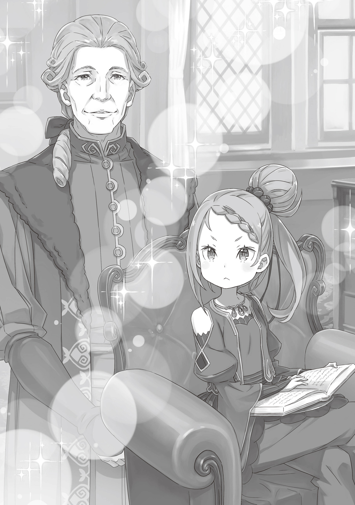

Алое Расставание

『緋色の別離』

Время с тех пор как эта девица его захомутала, казалось, пролетело в мгновение ока.

— Мне ты жалким видишься подобием мужчины.

— Ч-что?!

Баронесса из местных дворян настояла на том, чтобы Джорах рассмотрел перспективу женитьбы на её внучке.

Джораху Пендлтону, чей пятидесятый день рождения был уже совсем близко, брак представлялся предприятием, с коим его ничто не роднило, миром, обитателем которого ему было никогда не стать. Как представитель дворянства, он, разумеется, чувствовал себя обязанным продолжить свой род, но для сей цели он всерьёз подумывал усыновить кого-нибудь в качестве своего наследника.

Следовательно, когда предложение женитьбы достигло его ушей, всё главным образом было ради того, чтобы баронесса не потеряла лицо. Ведь в конце концов, внучке было всего двенадцать лет. И вот она была, женщина как в поговорке “достаточно юна, что в дочери тебе годна́” но она была и того моложе! И Джорах отнюдь не горел желанием обрекать девушку, у которой вся жизнь была впереди, на несчастье свойственное подобному замужеству. Если потребуется, то он был готов обеспечивать её и, быть может, подыскать ей достойного супруга.

Все эти затеи уподобились стеклу разлетевшемуся на множество осколков когда пришло время для собственно встречи.

— Меня ты волен величать Присциллой. Однако, была когда-то Приской Бенедикт из Волакийской Императорской Семьи.

— Чтоооо?!

Джорах поймал себя на том, что был ошеломлён девочкой, которая вела себя как кто-то куда старше двенадцати лет. Беседа проходила стремительно, сильно опережая его попытки вернуть заготовленные им оправдания. И “Присцилла” к тому же повергла его в шок раскрыв свою подноготную.

Любому Волакийскому дворянину, даже такому как Джорах, было известно имя Приски Бенедикт. В скорости ему стали понятны две вещи: заявление Присциллы являло собой абсолютную и неоспоримую истину; и чего от него в этом отношении ждал его старый друг. Так Джорах сыграл свою роль, оправдав возложенные на него ожидания, как опекуна, которому было должно оберегать эту ранимую юную особу…

— Глупец. Ужели думаешь, что роли таковой тебе желаю я?

— Что? Ну… если не этой, тогда зачем…?

— Ужель ты спрашивать обязан? Мне слышать доводилось, что у тебя в семейной библиотеке пару старинных экземпляров важности особой залежалось. — Сказать это ей было столь же легко как дышать. Её интерес и надежды были обращены отнюдь не на человеческие качества Джораха, а на его имущество. То был абсолютно самоуверенный образ жизни, такой, что не брал во внимание или же вовсе пренебрегал положением, в коем пребывала сия юная особа.

Джорах взял Присциллу, девушку живущую подобно пламени, к себе в жёны. Он сильно стыдился за свой возраст в пятьдесят лет, но в то же время он впервые испытал какого это, когда его желают столь пылко, что могут обжечь.

Джорах Пендлтон был совершенно заурядным человеком с напрочь отсутствующими качествами, способными охарактеризовать его как имперского дворянина. Выживает сильнейший; Сильные пожирают слабых; богатая страна, могучие солдаты такими были идеалы коими была пропитана Империя Волакия. Едва ли в ней было место для человека, чья искренность служила тому единственной рекомендацией.

Одним словом, Джорах воистину являлся образцом добросердечного человека, который не годился в ряды имперской знати.

Сам Джорах прекрасно отдавал себе отчёт в том, что он не шёл нога в ногу с принятым в Империи образом жизни; поэтому то он, до недавних пор, и вёл тихую, но приятную жизнь, находясь в тени и стараясь не привлекать к себе внимания. Ни разу на своём жизненном пути он не брался за серьёзные задачи. Сохранение домохозяйства для будущего поколения представлялось тому его обязанностью. По иронии судьбы, именно подобное скромное поведение и не дало ему обрести достойную пару вплоть до достижения им почтенного возраста.

Но это было чудом, сумевшим расцвести как раз потому, что он всё ещё был одинок.

— Ужель так веселит тебя лишь лицезреть столь пристально меня?

Джорах в изумлении широко раскрыл глаза, когда эта девочка раскритиковала того за задержавшийся на ней взгляд.

Образ Присциллы его жены заставил Джораха замереть на месте от того как она была с головой погружена в чтение, забывая при этом даже дышать. Столкнувшись с этим фактом лицом к лицу, он непроизвольно потянулся пальцем к одной из прядей своих волос и стал её накручивать. — М-мои извинения. Я всего лишь был так… так заворожён вашим обликом.

Девочка фыркнула, выпрямляя и снова скрещивая свои ножки. — Хмф, Ужели? Тогда ты можешь быть прощен. Людям свойственно быть очарованными шедевральными картинами или драгоценными камнями, ибо есть в них красота, что за рамки логики выходит. Такую подлинную прелесть народ неотразимою находит. Сколь более пленительной для глаза могла я оказаться?

Воистину высокомерное заявление, и всё же Джорах не мог с ней спорить, ибо та была, в самом деле, очень хороша собой.

— …

Пока шла их беседа, её глаза ни разу, даже мельком не взглянула на Джораха. Они так и продолжали глядеть в книгу у неё на коленях, страницы которой она время от времени переворачивала, жадно поглощая историю, написанную на её страницах.

Задумавшись об этом, Джорах осознал, что девушка была занята чтением всякий раз как он её видел. Должно быть, это служило неисчерпаемым источником знаний: целые горы книг, прочитанных ею за всю её жизнь. Другими словами, чтение она находила неотъемлемой частью процесса накопления умственного багажа, несущей её ко всё более и более высоким местам, возносящей и облагораживающей само её естество. Говоря кратко, оно помогало ей приблизиться к собственной завершённости.

По её словам, людям свойственно восхищаться красивыми вещами, даже если такое не кажется рациональным. Если она была права, то это определённо побудило Джораха принять её в свои жёны и стало причиной, по которой он был не в силах оторвать от неё глаз. Вероятнее всего, это также объясняло почему он был у неё на побегушках, желая исполнить любой её каприз. Это всё проясняло.

И таким образом…

— Присцилла. Пускай оно и пролетело так быстро, но время, проведённое с тобой, было, вероятно, самым лучшим в моей жизни.

— … — От Присциллы не последовало незамедлительного ответа.

— Я трусливый человек, — продолжил Джорах. — К этому самому моменту, я истратил удачу, дарованную мне при рождении. Бережно черпая её, словно чайной ложкой. Впрочем…

Зайдя так далеко, Джорах не мог подобрать нужных слов. Не от того, что он не загадывал настолько наперёд или же его вновь покинула уверенность. Ничего столь негативного.

Нет, причина была довольно проста.

— …

Присцилла глядела не в книгу, а на него.

Взгляд её алых, прекрасных словно рубины, глаз был прикован к Джораху. Они без единого слова побудили его продолжать, а сам он в ответ тяжело сглотнул.

Сколь бы смехотворно это ни звучало, но он впервые почувствовал на самом деле знал что девочка, сидевшая перед ним, Присцилла, вручила ему реплики. Поручила роль главного героя в пьесе её жизни, невзирая на то, каким ничтожным, заурядным человеком тот был.

Таким образом, он гордился тем, что не ощущал содрогания в своём сердце. Даже в момент, когда за дверью раздался крик.

— Граф Джорах Пендлтон! Вы арестованы по обвинению в измене!

Солдаты, облачённые в золотистую броню, окружили поместье Графа Джораха Пендлтона. Сверкающее снаряжение, коим те были покрыты с ног до головы, выдавало в них подчинённых одного из Девяти Божественных Генералов, занимавших особое положение даже в Империи Волакия.

Каждый из солдат был вооружён мечом или копьём, в то время как у других в руках находился либо топор, либо лук, и смотрелись они как один неделимый отряд, но такое впечатление являлось ошибочным. Бойцы в своих золотистых доспехах отнюдь не ощущали своего единства, и даже намёка на сплочённость. В подразделении, где люди оценивали человечность друг друга согласно выбранного ими оружия, поддерживать порядок было решительно невозможно.

Потому если и существовало что-то объединяющее их, то им отнюдь не являлось нечто столь неосязаемое как командный дух. Дело было кое в чём куда более очевидном и определённом. А именно: в силе.

— Бойцы на позициях, Генерал Ральфон.

— Мм, отлично. Всем, отступить!

Получателем этого доклада являлся мужчина средних лет с лицом, покрытым шрамами; он многозначительно кивнул подбородком. Его огромное тело с развитой мускулатурой было облачено в броню, каждый его уголок был покрыт золотыми пластинами. Казалось будто даже его кровь бежала, преисполненная воинской гордостью, и, в самом деле, создание такого впечатления он считал честью.

Гоз Ральфон, так звали этого человека, и он являлся одним из сильнейших людей в Империи. Ему был дарован пост Первого номера среди Девяти Божественных Генералов, вершины иерархии Волакии.

Солдаты, окружившие поместье, и в особенности сам Гоз, вели себя благоразумно. Как впрочем и должны были, ибо они явились сюда дабы взять под арест предателя, затеявшего заговор с целью восстания против Империи. Легко могла начаться битва, бывшая самой целью, с коей войска и были сюда присланы. Впрочем, если дело дойдёт до насилия, то более всего им следовало волноваться отнюдь не о личной армии Графа Пендлтона а скорее о персоне, которую тот по-видимому укрывал в своём доме…

— … — Гоз ненадолго закрыл свои глаза на мгновение ощутив искреннее сожаление, но вскоре потряс головой, отбрасывая это чувство прочь. Он выпрямился во всю внушительную высоту своего роста и сделал шаг вперёд, покидая шеренгу. Он глубоко вдохнул и зарычал: — Граф Пендлтон! Вы арестованы по обвинению в измене!

Засим, закованные в золото, воины сломали парадную дверь. Обвинения уже были выдвинуты; они не дали бы Джораху возможности возразить. Они как можно скорее захватили бы его, а затем передали в руки того, в чьи обязанности входило заслушать его доводы.

— И так мы наступаем! — Тем, кому полагалась сия конкретная ноша, был Гоз. Эта задача была доверена именно ему.

Стоило солдатам войти в дом как раздался яростный звон столкнувшихся мечей донесся изнутри. Очевидно, Граф Пендлтон привёл в готовность подчинявшиеся его семье войска, вступившие в бой.

— Я не намерен давать вам время, — проворчал Гоз, перед тем как поднять своё излюбленное оружие, ожидавшее подле него своего часа. Его можно было в некоторой степени назвать булавой длинная рукоять под двуручный хват с большим металлическим шарообразным навершием на конце. Он его поднял легко, несмотря на то, что весило оно должно быть свыше ста килограмм; После чего одним могучим прыжком, он пролетел над головами своих бойцов, приземляясь перед ними и бросаясь вперёд со своим оружием на перевес, раскидывая прочь врагов, преграждавших ему путь.

— Прекратить бой! — закричал он. — Мы прибыли сюда по приказу Его Превосходительства. Всякий оказавший сопротивление, наряду с Графом Джорахом Пендлтоном, будет считаться предателем!

— …

Его голос, достаточно громкий дабы сотрясать собой воздух, вселил страх в солдат графа. Учитывая репутацию Джораха, казалось, что его свита навряд ли полнилась выдающимися воинами. Уж точно не теми, кто захочет поднять оружие на занимавшего Первое место среди Девяти Божественных Генералов, Гоза Ральфона.

Но затем…

— Батюшки. Не ожидал, что вы явитесь собственной персоной, Генерал Ральфон. Что ж, это тревожно…

Сверху лестницы, прилегающей к главному залу сразу за проходом ко второму этажу, раздались шаги, и следом появился стройный силуэт. Гоз посмотрел вверх и нахмурил свои кустистые брови. Он знал этого человека им был никто иной как тот за кем он и прибыл сюда.

— Граф Пендлтон. Как хорошо с вашей стороны было явить себя, — сказал Гоз.

— Мне известно, каким меня видят люди, но я всё ещё являюсь членом дворянства Империи Волакия, пускай и ничтожным. Не хотелось бы, чтобы про меня говорили, будто я повесил всю работу на своих подчинённых, в то время как сам в содрогании прятался за их спинами. Впрочем… часть про содрогание вероятно правдива. — Джорах вяло улыбнулся.

Гоз удивился его появлению посреди боя. Насколько он знал, Джорах был известен лишь за его мягкость, нерешительность и абсолютное неприятие войны. Чтобы он ещё и показался в самом разгаре битвы…

— Значит, вы поменяли своё решение? Я весьма заинтересован в том, чтобы узнать чем же это было продиктовано, — сказал Гоз.

— В присутствии одного из Девяти Божественных Генералов, нависшего надо мной, я склонен поведать обо всём, что вам хотелось бы знать, — сказал Джорах. — Я… слаб. И вынужден постоянно набираться смелости, дабы иметь с чем-либо дело. — Он с дрожащим голосом прикусил свою губу.

Один из его солдат уважительно припал на колено подле него и протянул меч. Джорах принял его и медленно вытащил из ножен. Являлся ли Джорах Пендлтон матёрым мечником? Ни о чём подобном Гозу слышать не приходилось. Так оно и оказалось: с первого взгляда было ясно, что тот был любителем. Некоторым людям известны лишь базовые стойки, но Джорах в свою очередь даже ими не владел.

— Вынужден вас предупредить, что покуда в ваших руках находится оружие, я не буду сдерживаться, — сказал Гоз.

— Э-это приемлемо. В тот самый миг как мною был избран этот путь, я знал, что до этого дойдет… Я уже попрощался со своей супругой.

— …Так и есть? Тогда в словах более нет нужды. — Гоз уверенно кивнул Джораху, глядевшему прямо на него. Затем он убедился в том, достаточно ли крепко его рука держит булаву, и закричал, дабы разжечь пыл своих солдат и одновременно сломить волю врага: — Я Гоз Ральфон, из Девяти Божественных Генералов Империи Волакия! По приказу Его Превосходительства, искореню любого, кто посмеет грозить Империи изнутри!

— Моё имя Джорах Пендлтон, граф Империи Волакия, и во благо моей супруги, этими тщедушными руками, я окажу вам сопротивление.

— Узнаю этот рык. Так значит, Гоз Ральфон здесь. Раз захватить меня одну хотели, то так слегка переборщили. И не сказать, чтобы меня сим удивили. — Присцилла лишь слегка улыбнулась она знала, что сказанное ею было не совсем правдивым, а затем продолжила бежать через лес. Она поддерживала подол своего красного платья, двигаясь столь же легко как если бы вместо труднопроходимого ландшафта под ногами у неё была ровная земля, или же словно та была юной дикаркой, что родилась и выросла в дикой природе.

Однако ж помимо того её поведения, всё остальное в ней суть было диаметрально противоположным образу человека, выросшего в лесах, от чего нынешние действия девочки казались настоящим чудом.

— …

Позади, в покинутом ею поместье, её муж со своими бойцами вёл бой с солдатами Империи. Та самая последняя улыбка, коей её одарил Джорах, запечатлелась на её глазах.

— Справился он весьма недурно.

Джорах был человеком немногих выдающихся качеств. Он, вероятно, являлся персоной наименее компетентной по меркам основ на коих зиждилась Империя Волакия; он оставлял желать лучшего и как Волакийский дворянин и как мужчина. И всё же в тот самый последний миг, он без всяких сомнений доказал, что был Присцилле мужем. Его любовь к своей супруге сподвигла его на акт самопожертвования, чтобы выиграть время и позволить ей сбежать. Присцилла не была столь низменной, дабы пренебречь этим, будь то попытка или же успех, и не позволила бы так поступить никому другому.

Неся в сердце сии чувства, она практически летела сквозь чащу леса…

— Ни шагу более, Принцесса.

— …

…пока не была остановлена нежданным голосом. Она перестала бежать, переводя вверх взгляд своих алых очей. Там высоко, среди ветвей большого дерева она разглядела силуэт, вскоре спустившийся к ней.

Им оказалась девочка, завёрнутая в одежду, оставлявшую большую часть её кожи открытой. Лет ей было примерно столько же сколько и Присцилле, и она, вероятно, ещё не вступила в подростковый возраст. Девочка, очевидно, пребывала в добром здравии, но пока ещё не обрела формы, с которой её можно было бы назвать привлекательной. Один её красный глаз на вид казался сонным; а вот другой скрывался под повязкой щеголявшей цветочным орнаментом. Волосы её были серебристыми, не считая одной пряди красного цвета, а на голове у неё красовались уникальные ушки, характерные для представителей собачьего народа.

Рука девочки сжимала жалкого вида веточку, только что сорванной ею с дерева, губы её дрожали, а своим единственным глазом она уставилась на Присциллу. — Леди Приска… — сказала она, воспользовавшись другим именем Присциллы.

— …

Услышав своё старое, давно покинутое ею имя, Присцилла спокойно выдохнула. Минуло время совсем чуть-чуть его прошло, но всё ж оно ушло. И потому казалось странным, что девочка пред нею с лицом знакомым, и цветом глаз известным ею смотрелась так, словно ничего в ней не изменилось.

Она служила, надо полагать, теперь хозяину иному, и всё-таки молящий взгляд к Присцилле обратила. В том было доказательство, что прежнюю себя та всё же сохранила.

— Непросто от такой иронии укрыться, что именно тебе в сей миг передо мной суждено явиться, — сказала Присцилла.

— Принцесса. Я…

— Предала меня и с братцем моим спелась. Тем самым, руками собственными порешить меня возможность появилась. Найдёшься ли ты как объясниться?

— Н-нет, не предавала! Я никогда…! — Хотя эта девушка имела обыкновение почти не проявлять своих эмоций, безжалостные нападки Присциллы всё же заставили её лицо тревожно исказиться. — Прямо как сейчас… Принцесса, для вас, я…

— … — Присцилла ничего не сказала.

— Сегодня… сегодня, всё по-прежнему. Господин Винсент сказал мне…

— Дурёха. Ты формой обращения ошиблась. Волакии мой старший братец ныне Император, и коль имперским ты являешься солдатом, тебе бы стоило сие усвоить. Ибо… — Присцилла сделала паузу и скрестила руки, а затем смутила девочку тяжёлым взглядом своих миндалевидных глаз, позволив себе дерзкую, презрительную улыбку. — Нет… По правде, братец мой права называться Императором Волакии отнюдь не заслужил.

— Ох…

— Приска Бенедикт мертва. Средь всех участников Имперского Отбора уцелел лишь он один. Только вот наличие живой меня сей легенде угрожает, разве нет? — Если об этом узнают, поднимется скандал такой величины, какой только знавала имперская история. Император, от коего ждали, что тот будет являть собой воплощение завета быть сильным, действовал вопреки представлениям о выживании сильнейшего.

— Госпожа… Приска…

— И пока в процессе ты имя моё произноси как подобает. Теперь зовусь Присциллой я. Присциллой Пендлтон в знак уважения к прощальной службе, что мой супруг мне сослужил. Должна я настоять, чтоб в этом ты не путалась, Аракия.

— При… сцилла…?

— Я допускаю, что сие лишь лёгкая со звуками игра. В каком бы месте иль положении ни случилось оказаться, самой собой, я буду оставаться. Сколько бы мороки братцу старшему это ни несло. — Присцилла подмигнула девочке, которую она звала Аракией, а потом фыркнула.

Аракия распрямила свои хрупкие плечи. — Приска или Присцилла… Принцесса это всё ещё моя принцесса. Идёмте же со мной. Господин Винсент… то есть, Его Превосходительство желает с вами переговорить. Поэтому…

— Боюсь, сего не разумею. Желает моего он возвращения теперь? Какова в том цель? Мой братец Император, ему с тем, чтобы жизнь моя и далее тянулась нельзя мириться. И коли приказал он мне в столицу возвратиться…

— Да? Если так… то что тогда?

— Объявлению то равноценно, что тот на жизнь мою намерен снова покуситься.

— Ох…

Слова Присциллы прозвучали едва ли не буднично, но они всё же шокировали Аракию. Посмотрев на свою молочную сестру, она осознала, что Винсент и вправду не посвятил её в тонкости его приказов. Но этого было вполне достаточно, дабы Присцилла сделала предположение о ходе мыслей оного. Зачем же он отправил Аракию разыскать её в этот конкретный момент?

— По-своему любовь он проявляет, прислав за мной тебя.

— Что…?

— Да. Семейная привязанность. Мой старший братец меня и вправду обожает. Я и сама немало нежных чувств к нему питаю. Но к нашим положениям, сие отношенья не имеет. На сей раз убить меня мой братец должен. А посему…

— …?!

На последнем слове Присцилла понизила голос, и Аракия, выпучив глаза, отскочила назад. Причиной тому была красная вспышка. Размашистый, прекрасный и жестокий удар, настолько, что коснись он шеи Аракии, и та на месте сгорела бы дотла.

Замах был совершён рубиновым клинком, внезапно оказавшимся в руке Присциллы.

— Меч Света, Волакия… — сказала Аракия.

— То, что двое нас достойных в руках оружие сие держать, должно быть, крайне неудобно братцу моему. В сомненьях я, нуждается ли он во власти символе столь старомодном, но без него подобных Беллстетзу, не смог бы он держать в узде.

— Принцесса, уберите свой меч, и…

— И всё ж, меня ты сдаться призываешь? Раз так, то выбора ты мне не оставляешь, лишь путь свой прорубить сиянием в руке моей.

Этот меч был слишком велик и грандиозен для девочки, которой ещё было куда расти. Но Присцилла сияла уверенностью воспользоваться тем с легкостью вкупе со умением на деле это совершить.

— Ступайте, Принцесса. — Аракия опустила веточку, которую она сжимала в своей руке.

Это заставило Присциллу выдохнуть, издав: — Хоо? — и в изумлении закрыть один глаз, смутив её. — Ужель противиться указаниям самого Императора ты собралась?

— Но Господин Винсент… Его Превосходительство приказал мне прийти сюда.

— …

Приняв во внимание то, что она сочла за истинные намерения, стоявшие за приказами Винсента, Аракия вынесла своё решение. Возможно, она была права, или, быть может, подобное их толкование попросту потакало её личным желаниям. В любом случае, это было ощутимым изменением в характере Аракии, доселе всегда беспрекословно следовавшей указаниям.

Заметив это, Присцилла вновь поместила Меч Света в воздух, где тот исчез.

— Моя принцесса… и есть та самая принцесса. Но раз Госпожа Приска мертва… тогда этот раз последний. Умоляю вас. Не привлекайте больше к себе внимания. Как с тем эфиром… на Острове Рабов Меча…

— Ах, но так любовь мою я к братцу выражала. И раз дела на острове были решены, защитников своих он мог оставить дома в стольном граде.

Как бы то ни было, разоблачение убежища Присциллы в конечном счёте являлось лишь вопросом времени. Она слыла барышней напрочь не годной для того, чтобы залечь где-нибудь на дно и смиренно наблюдать за тем как светская жизнь проходит мимо неё. Даже дни, проведённые в компании Джораха, были для неё лишь лирическим отступлением пускай и на удивление не лишённым приятных сторон. В достаточной степени дабы она по крайней мере перестала противиться именовать себя Присциллой Пендлтон.

— Аракия, тебе я благодарна. Но в нашу следующую встречу, уж лучше бы тебе в намерениях своих определиться.

— …Надеюсь, мы не увидимся. Больше никогда.

— Но мы увидимся. Во всяком случае я так считаю.

Засим, Присцилла улыбнулась и в тот же миг случился колоссальной силы взрыв со стороны поместья откуда она пришла. По-видимому, сражение достигло своего апогея. Аракия на одно кратчайшее мгновение перевела взгляд в направлении раздавшегося звука, но её внимание вскоре возвратилось к тому что было прямо перед её глазами. Однако…

— Принцесса…

…к тому времени как она повернулась обратно, Присциллы уже и след простыл. Аракия осмотрела всё вокруг, но всё же знала, что Присцилла не была столь небрежна, чтобы позволить столь легко себя обнаружить. Ведь, в конце концов, она являлась молочной сестрой Аракии и единственной живой родственницей Императора…

— …умоляю вас…

Аракия от всей души желала, чтобы Присцилла удалилась прочь, так далеко насколько возможно, и прожила там отпущенный ей срок. Дабы та позабыла об этой жестокой войне за право унаследовать трон Империи и продолжила бы жить как обычная девушка где-то там очень далеко.

Но вопреки её желаниям, Аракии была известна правда. — Такому совершенно точно… не бывать.

Девушка, звавшаяся Приской Бенедикт, ни за что бы не вынесла подобного образа жизни. Грядёт однажды день, такой же как сейчас, когда Аракия предстанет перед лицом своей принцессы. Сумеет ли она что-либо сделать с Присциллой или Приской, как тот настанет?

В намерениях своих определиться. Вот что ей сказали. И всё же…

— Леди Приска… Вы такая глупышка…

И всё же на мгновение, та смогла лишь прошептать одну единственную фразу.

Мятеж, организованный Графом Джорахом Пендлтоном, увенчался провалом. Сам граф, бывший тайным вдохновителем сего заговора, пал от руки Гоза Ральфона, первого среди Божественных Генералов Империи. Благодаря чему был заложен фундамент для мирного правления страной только что взошедшего на трон Императора, Винсента Волакия.

У графа не имелось кровных родственников, и потому род Пендлтонов, тянувшийся целые поколения, оказался прерван. Всего за два месяца до мятежа, граф взял в жёны молодую женщину, но тотальное уничтожение его семейства завершилось с её самоубийством. Несмотря на свой столь юный возраст, девушка, одолеваемая скорбью от деяний совершённых её супругом, покончила с собой.

Такими, во всяком случае, были показания взятые у Аракии, которая позднее вошла в ряды Девяти Божественных Генералов Империи Волакия.

Таким образом, не осталось ни беглецов, ни кого-то ещё, кто бы угрожал народу волчьего меча. Мир в Империи был обеспечен.

Его ничто не омрачит. В грядущем будет длиться он.

⟅КОНЕЦ⟆
