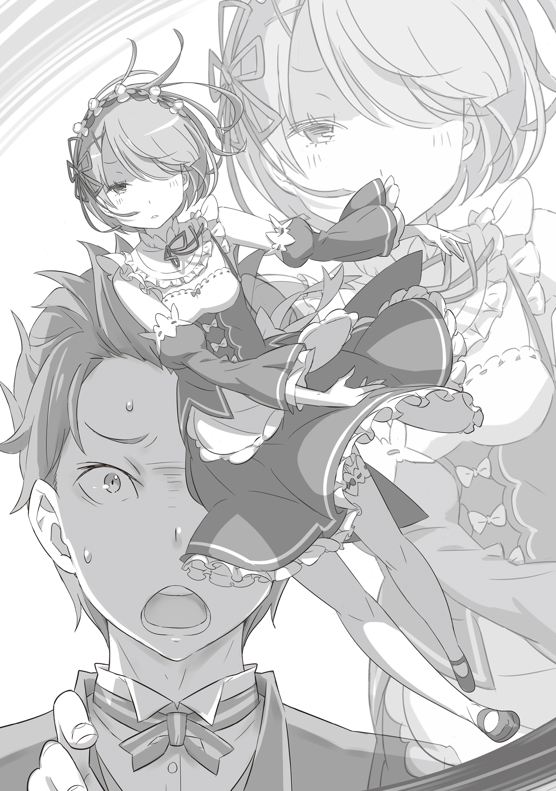

— Сестрёнка, сестрёнка. Послушай. Сегодня Субару наконец-то смог встать с постели.

— Вот как.

— Сестрёнка, сестрёнка. Я пообещала в следующий раз подстричь Субару… Сестрёнка, как думаешь, какая стрижка ему подойдёт?

— Ну… да, наверное.

— Сестрёнка, сестрёнка. Субару только что смог сам сходить в туалет! Похвали его!

— …………………Чего?

— Уму непостижимо, — подперев щеку рукой и сидя на стуле, Рам устало вздохнула.

В обычное время её обязанности сводились к незаметной помощи младшей сестре, но сейчас у неё не было сил даже на такие мелочи. Она чувствовала себя выжатой до последней капли.

— И всё это — целиком и полностью вина Барусу.

— Это с какой стати ты вешаешь на меня всех собак в первый же день, как я вернулся к работе?! У тебя вообще совести нет — гонять больного, который едва на ноги встал?

Паренёк, энергично орудующий тряпкой над пыльной полкой, возмущённо вскрикнул, глядя на тоскливо застывшую горничную.

Они находились в одной из гостевых комнат восточного крыла поместья Розвааля.

Хотя гости в этом особняке — редкость, поддержание чистоты и проветривание комнат оставались незыблемой рутиной. И сегодня эта «рутина» легла на их плечи.

Костюм дворецкого, в котором сейчас был Субару, сидел как влитой — Рем вложила всю душу, подгоняя его. Скорее всего, он даже не подозревал, что девушка потратила на него всё своё жалованье, которое прежде просто копила без цели.

Тот факт, что он не догадывался об этом, тоже раздражал Рам.

— Впрочем… ожидать подобной проницательности от Барусу бессмысленно. И что только Рем нашла в таком мужчине?

— Эй, учитель, может, хватит бубнить? Помогла бы лучше! Мне, между прочим, тяжело!

— Ты сам вызвался работать, хоть Рем тебя и отговаривала. Если твоя решимость чего-то стоит, прекращай ныть, какую бы ношу на тебя ни взвалили… Это не по-мужски.

— Моя мужественность и решимость существуют не для того, чтобы оправдывать твою лень!

Субару продолжал возмущаться, но Рам картинно закрыла уши руками, демонстрируя полное безразличие. Впрочем, даже за шутовским кривляньем было заметно: двигается он скованно, то и дело щадя ещё не зажившие раны.

С момента нашествия зверодемонов прошла неделя. Тяжёлые увечья, полученные Субару, практически исцелились — спасибо самоотверженной заботе Рем и, как ни странно, ежедневной магии Беатрис, помогавшей ему по какой-то своей прихоти.

Но исцеление было лишь внешним. Рам слышала отчёты Духа и Розвааля и знала об ущербе внутри его тела.

И всё же он упрямился, стараясь не показывать боли, что, разумеется, только подливало масла в огонь её раздражения. Неужели он думал, что если продолжит валяться в постели, Рем будет винить себя?

Впрочем, зная характер сестры, он был прав. Несмотря на внешнее спокойствие, она вновь бы взвалила всё на свои плечи, работая до истощения. Трудоголик до мозга костей.

— Я действительно надеялась, что найдётся кто-то, кто сможет её сдерживать, но…

— Ась?

— Невзрачное лицо, самомнение до небес. Ни выдающихся знаний, ни боевых навыков, да и денег нет… Пожалуй, собрать в одном человеке столько разочаровывающих черт даже сложнее, чем наоборот.

— Эй! Чтобы ты знала, я вообще-то понимаю, когда меня оскорбляют!

То, что он не взрывается гневом, лишь подтверждало нехватку мужского стержня. Хотя Рам понимала: именно это и позволяет ей не выбирать выражений.

Эта мысль вдруг резанула её неприятным холодом.

Словно я пользуюсь снисходительностью Барусу… Мерзкое чувство.

— …

Скрыв раздражение за маской безразличия, Рам поднялась и, проходя мимо окна, невзначай провела пальцем по раме. Посмотрев на серый налёт на подушечке пальца, она повернулась к юноше: — Барусу, это что?

— Это вообще-то твоя зона ответственности!

Она планировала ткнуть его носом в плохую уборку, а в итоге получила упрёк в собственной халатности. Скудные остатки энтузиазма испарились окончательно. Ей захотелось лечь прямо здесь, на ковёр.

— Слушай, ты выглядишь ещё более вялой, чем обычно. Тебе, может, и правда нехорошо?

Субару, опёршись на стол, с беспокойством заглянул ей в лицо.

Рам недовольно нахмурилась. Глупая, неуместная забота.

Конечно, состояние её врат оставляло желать лучшего — последние несколько дней, разбираясь с последствиями происшествия со зверодемонами, она расходовала ману сверх всякой меры. Приходилось курсировать между деревней и особняком, латать дыры в барьере и разгребать бумажную работу за вечно занятым Розваалем. Сегодня утром ей удалось поспать от силы час.

Тело налилось свинцом, мысли путались, даже держать веки открытыми стоило титанических усилий. Из-за плохого кровообращения всё тело словно скрипело при малейшем движении.

— Всё в полном порядке.

— Не знаю, что именно входит в это твоё «всё», но геройствовать не стоит, поняла?

Пока она массировала переносицу, пытаясь отогнать тяжесть, Субару внезапно подошёл вплотную.

Протянув руку, он со словами «Ну-ка» приложил ладонь к её лбу.

— Жара… вроде нет. Хотя, может, небольшая температура? Если сильно устала, шла бы ты отдыхать, я доделаю… Ай-ай-ай-ай!

— Чьего позволения ты просил, чтобы распускать руки? Ни на секунду нельзя потерять бдительность с таким мужчиной.

Ущипнув его за тыльную сторону ладони, всё ещё прижатой к её лбу, Рам фыркнула. Субару отскочил, тряся пострадавшей рукой, и посмотрел на неё с выступившими слезами на глазах.

— Слушай ты! Человек вообще-то волнуется! Могла бы принять заботу с благодарностью!

— Не нужна мне твоя забота. И вообще, откуда у Барусу время беспокоиться о других? Если есть свободная минутка, лучше удели внимание Рем…

Бросив эти слова, Рам прошла мимо обиженного дворецкого, направляясь в следующую комнату. Но стоило ей сделать шаг…

— А…

Тихий, хриплый вздох сорвался с губ. Или это был голос Субару? Она не поняла.

В тот момент, когда подошвы коснулись мягкого ворса ковра, перед глазами будто рухнул чёрный занавес. Тело отказалось подчиняться, шея больше не держала тяжесть головы.

Не издав ни звука, Рам рухнула, и мир для неё погас.

Очнувшись от сна без сновидений, Рам почувствовала на лбу прикосновение холодной ткани.

— Это комната Рам?

Приоткрыв дрожащие веки и дождавшись, пока зрение сфокусируется, она увидела привычную обстановку своей комнаты.

Простой, лишённый украшений и, по её собственному мнению, довольно унылый интерьер. Лишь розовые занавески, простыни и одеяло, подобранные на вкус Рем, добавляли ярких красок. В остальном комната, из которой максимально вытравлена любая индивидуальность, идеально описывала девушку по имени Рам.

— О, наконец-то проснулась. Честно говоря, я уж перепугался, думал, что делать.

Она приподнялась, тряхнув головой, и увидела Субару, который держал керамическую миску с водой. Сопоставив воспоминания перед потерей сознания со своим нынешним состоянием, Рам опустила взгляд на себя и произнесла: — Ну и извращенец.

— Я только выдохнул, а первое, что слышу — это оскорбление?!

— Одежда на Рам другая. И липкого пота больше нет, всё чисто. Как же тщательно ты, должно быть, облизывал моё тело. Мерзость какая, Барусу.

— Какой милый характер! И переодела, и обтёрла тебя Эмилия-тан! Я бы никак не смог этого сделать! И даже если бы смог, уж точно не стал бы тебя вылизывать!

Субару завопил, пытаясь отбиться от ложного обвинения.

По его словам выходило, что после того как Рам рухнула в гостевой комнате, Субару тут же позвал Эмилию и убедился, что угрозы жизни нет. Поскольку Рем ушла за покупками, Эмилия помогла переодеть Рам и обтереть ей тело, после чего её уложили в постель.

— Вот как… Значит, ты побеспокоил госпожу Эмилию не только из своей прихоти.

— Хоть я и ищу любой шанс пообщаться с Эмилией-тан, но границы я всё-таки знаю. Так, а как самочувствие-то?

— Первое, что я увидела, проснувшись, — твоя бандитская рожа, так что настроение отвратительное.

— Давай про физическое состояние! Кого волнует твоё настроение!

— Не ори над ухом у больного человека. Ты и вправду не способен на чуткость.

— Гр-р-р-р…

Видя, как Субару скрипит зубами, в бессилии искривив лицо, Рам выдохнула, всё ещё ощущая глубокую усталость.

В глубине души она честно корила себя за эту оплошность.

И за то, что показала слабость перед Субару. И за то, что из-за своей некомпетентности пренебрегла чувствами Рем. И за то, что, к своему ужасу, почувствовала мимолётное успокоение.

— Ну, раз твой ядовитый язык работает как обычно, значит, жить будешь. На, вот вода. Эмилия-тан тоже сказала, что это просто накопившаяся усталость, так что поспишь — и всё пройдёт.

Не замечая внутренней борьбы Рам, Субару, подавив досаду, протянул ей воду. Приняв чашку, Рам начала пить маленькими глотками, смачивая горло. Тем временем Субару поднял упавшее с её лба полотенце, быстро сполоснул его в умывальнике в углу комнаты и вернулся.

Для Барусу это на удивление адекватная забота.

— М-м, ха…

Горло пересохло сильнее, чем она думала. Осушив чашку, Рам медленно опустилась обратно на подушку. Тут же Субару положил ей на лоб влажное полотенце, принося приятное облегчение.

— А для Барусу ты весьма догадлив.

— Да-да, счастлив, что угодил сестрице.

Бросив это небрежно, Субару подтащил стул к кровати и плюхнулся на него. Сев задом наперёд, он обхватил спинку стула руками, прижав её к животу.

Рам нахмурилась, глядя на его позу: он явно не собирался возвращаться к работе, намереваясь сидеть здесь в качестве сиделки.

— Просто спать я могу и без помощи Барусу. То, что может Барусу, может и Рам.

— У тебя ругательства вылетают так же естественно, как дыхание… Не парься. Сегодняшнюю норму я всё равно вряд ли выполню, так что посижу, пока не уснёшь. За ручку подержать?

— Не говори гадостей. Сама мысль о том, что ты будешь пялиться на меня спящую, вызывает дрожь.

— Да иди ты…

Субару надул губы, изображая обиду. Неужели ему было так досадно, что она не дала подержать себя за руку? Взгляд Рам стал ещё более суровым.

Однако ситуация — лежать в постели, когда кто-то сидит рядом и смотрит за тобой — навевала определённые чувства.

— Немного напоминает о прошлом.

— О прошлом? Сестрица, неужели у тебя богатый опыт выступлений в роли такой вот неженки? Глядя на твою обычную «толстокожесть», образ слабой девы как-то не вяжется.

— Сразу после того как я потеряла рог, я часто вот так заболевала. Всё из-за того, что я не могла нормально контролировать ману. Я тогда доставила Рем немало хлопот.

Услышав о роге, Субару, до того настроенный на подтрунивание, сделал неловкое лицо.

Приятно было заткнуть его, но Рам не подала виду и проигнорировала его реакцию.

Семь лет назад, когда потерявшая рог Рам только прибыла в поместье Розвааля, её тело не справлялось с резким изменением общего объёма маны, который она могла удерживать. Сбои случались постоянно. Каждый раз Рем относила её в постель и выхаживала.

Давно она не перенапрягалась в своём нынешнем, лишённом рога состоянии, и вот результат — она снова в том же положении.

Но смеяться над этим совсем не хотелось. Наверное, потому что ухаживала за ней сейчас не младшая сестра.

В те времена Рем, сидя у постели больной Рам, часто держала её за руку, пока та спала.

А в ночи, когда Рем готова была сломаться под грузом ненужного чувства вины, уже Рам точно так же сжимала её ладонь.

Может, болтовня Субару и всколыхнула в ней эти воспоминания?

— Барусу.

— М-м?

Внезапная сонливость накрыла её волной. Не в силах сопротивляться тяжести век, Рам начала проваливаться в забытьё. В последнее мгновение с её губ непроизвольно сорвалось имя сидящего рядом юноши, и…

— …

Так и не поняв, что именно она сказала напоследок, Рам погрузилась в глубокий-глубокий сон.

— Сестрица крепко спит?

— Ага, вроде того. Хотя умудрилась съязвить буквально за секунду до отключки. Талант не пропьёшь.

Отвечая на вопрос только что вернувшейся с покупками Рем, Субару не сводил глаз со спящей Рам. Девушка, наблюдая за его кривой ухмылкой, вдруг обратила внимание на одну деталь.

— Ты держишь её за руку?

— Да она пробормотала что-то… И вид у неё был такой, будто ей до жути одиноко. Ну, даже не одиноко, а как-то… Чёрт, не могу слово подобрать.

Субару запнулся, пытаясь подыскать верное описание для того последнего выражения лица и неожиданно мягкого голоса Рам. Видя его затруднение, Рем лишь понимающе улыбнулась.

— Я уверена, что сестрица открыла тебе своё сердце, Субару. Просто у неё сложная натура.

— Слышала бы тебя сама Рам — ни за что бы не согласилась… — пробурчал юноша, глядя на хихикающую девушку и с трудом сдерживая ответную улыбку.

Затем он посмотрел на свою руку, всё ещё мягко сжимавшую ладонь спящей, перевёл взгляд на неё и тихо произнёс: — Будь у нашей старшей сестрёнки всегда такое лицо, она была бы очень даже милой.

Таков был его вердикт лицу безмятежно спящей Рам.
