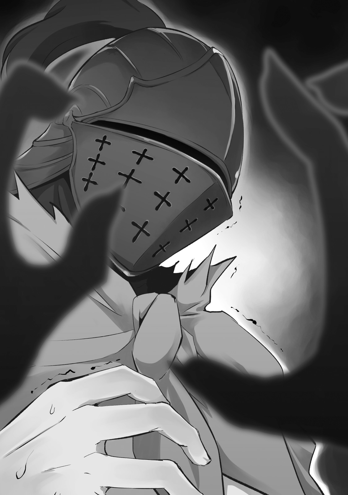
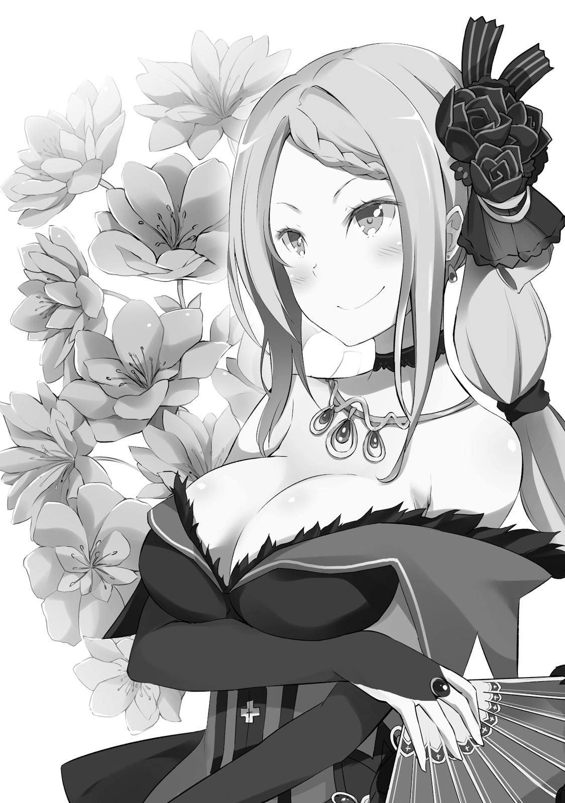

Это началось однажды днём, с одной внезапно брошенной фразы.

— Ал, мне скучно. Придумай что-нибудь интересное.

— Эй-эй, Принцесса. От такого заявления и тиран бы обалдел. Полегче на поворотах, я за тобой не успеваю. Что-что?

— Мне скучно. Придумай что-нибудь интересное. Не сможешь — голова с плеч.

— А?! Какие уж тут сомнения, вылитая тиранша!

Он закричал приглушённым голосом и, вскинув руку, уставился в небо. В бескрайнюю синеву, по которой быстро неслись облака.

Он опёрся спиной о железные перила балкона.

«Погода завтра, похоже, испортится», — лениво подумал он. И в тот же миг его подбородок резко толкнули.

— А! Ух! А-а-а!

Его тело без опоры перевалилось через перила. Повиснув в воздухе, он в последний момент ухватился правой рукой за что-то мягкое и гладкое, отчаянно подтягиваясь.

— Опа-опас-опасно! Я же сейчас был на волосок от смерти…

— К несчастью, опасность ещё не миновала… Более того, сейчас ты в ещё большем риске.

— А?

Он глянул на сад под балконом, перевёл дух и, услышав её слова, растерянно поднял взгляд. За перилами стояла она — хозяйка белой руки, за которую он цеплялся. На её лице играла садистская улыбка.

Девушка с рыжими волосами в алом платье, смело открывающем её гладкую кожу. Она с лёгкостью держала его одной рукой, а пальцы другой, изящные и белые, протянула к нему.

— П-принцесса?! Принцесса! Молю, проявите хоть каплю милосердия!

— Ты удостоился чести несколько секунд касаться моей безупречной кожи. Гордись этим и тони.

— А-А-А-А!

Вместе с безжалостным приговором её палец выстрелил вперёд. Это был обычный щелбан, но его скорость и сила были на совершенно ином уровне. Раздался резкий щелчок, и удар отбросил Ала прочь.

Отлетев назад, он ощутил невесомость. Мир перевернулся. Он рухнул головой в воду и пошёл ко дну.

— Т-т-только что! Господин Ал… он, кажется, упал в пруд!

— О, Шульт. Как раз вовремя. Я желаю чаю. Живо приготовь. Это твоя работа. И не заставляй меня ждать.

— Д-да! Разумеется! Но как же господин Ал?! Это ужасно!

Пуская пузыри, он опускался на довольно глубокое дно. Издалека доносились встревоженный голос мальчика и громкий смех девушки, что наслаждалась этим зрелищем.

— И чем я только занимаюсь.

С этой мыслью Ал оттолкнулся от дна и силой устремился к поверхности.

Юго-запад Драконье Королевство Лугуника. Здесь раскинулось баронство Бариэль, которым правил барон Лейп Бариэль.

Лорд Лейп был известен своим деспотичным правлением, ненавистным всему народу. Он обложил людей тяжкими налогами и непосильным трудом. В одно время земли Бариэль даже прозвали каторгой Королевства.

Однако за последние несколько месяцев дурная слава баронства утихла. Напротив, поползли слухи, что отношения между правителем и народом стали лучшими за последние годы.

Говорили, будто Лейп, взяв в жёны молодую, мудрую и прекрасную леди, полностью изменился и начал заботиться о своих людях. Но каждый в этих землях знал — это не так.

Изменился не характер правителя, а сам правитель. Точнее, Лейп, что прежде управлял землями, слёг от болезни. Всё изменилось благодаря мастерству его жены, взявшей на себя обязанности лорда.

Судьба земель, вместо прикованного к постели Лейпа, оказалась в руках его прекрасной жены. Её правление было поистине божественным, и она мгновенно покорила сердца людей.

Новая правительница была близка к народу, в отличие от предшественника, который лишь отбирал и эксплуатировал. Её невероятная, благородная красота и простота, с которой она лично посещала владения, окончательно пленили жителей баронства Бариэль.

Так родилась слава о милосердной женщине, которую народ громко прозвал «Принцессой Солнца».

— …И что подумает народ, если узнает, что их «Принцесса Солнца» только что пыталась утопить своего слугу, скинув его в пруд.

— Не говори вещей, которые столь дурно звучат. Впрочем, мёртвые не болтают… Как думаешь, кому они поверят? Тебе, подозрительному головорезу, или мне, прекрасной и изящной?

— Вот это сейчас прозвучало в тысячу раз хуже, без сомнений!

Ал сидел, скрестив ноги, у самого пруда в саду поместья. Он промок до нитки; вода пропитала не только одежду, но и нижнее бельё. Сняв дзори и оставив их сушиться на солнце, Ал оголил торс и принялся с трудом выжимать свою куртку.

Он зажал ткань подбородком и с силой выжимал её одной правой. Неудивительно, что это было так трудно — левой руки у Ала попросту не было.

— Господин Ал, я выжму её! Пожалуйста, доверьте это мне!

Видя мучения Ала, к нему подбежал совсем юный мальчик. Ему было лет десять. Миловидное детское личико и крохотный костюм дворецкого создавали трогательное впечатление, будто он изо всех сил старался казаться взрослым.

Однако эта идиллия была тут же разрушена.

— Перестань, Шульт. Не хватало ещё, чтобы твои пальцы огрубели от грязной работы. Если тебя станет неприятно обнимать, я тотчас же лишу тебя звания моей подушки.

— А-а-ах! Госпожа Присцилла, вы так внезапно обнимаете, я пугаюсь!..

Мальчик — Шульт — залился краской и весь съёжился в её объятиях. И от вида его смущённой фигуры, утопающей в руках Присциллы, прежняя трогательная картина разом сменилась странной, почти порочной атмосферой.

— Чего уставился, Ал? С таким глупым лицом.

С этими словами рыжеволосая девушка лишь крепче обняла Шульта и дерзко усмехнулась.

Она была настоящим солнцем. Её красота сияла так ярко, что грозила ослепить всякого, кто на неё посмотрит. Рыжие волосы горели в лучах света, а в глазах полыхал неукротимый огонь.

Дьявольское очарование и совершенное тело, которое она выставляла напоказ без малейшего стеснения, пленяли сердца всех — и мужчин, и женщин.

Её собственная аура была настолько сильной, что затмевала даже алое платье. Это и была Присцилла Бариэль, Принцесса Солнца, правящая этими землями вместо мужа.

Поймав на себе её ядовитый, змеиный взгляд, Ал мотнул головой, словно пытаясь скрыть тяжёлый вздох.

— А-а, нет, просто лишний раз убедился, до чего же хорош жанр «онэсёта». Благодарю за зрелище.

— Опять твои непонятные словечки. Эта фраза, надо полагать, пришла из-за границ Великого Водопада?

— Именно. К тому же, шлем залило, и я ни черта не увидел. Вот как-то так.

Говоря это, Ал постучал по своему шлему. Источником звука был чёрный железный шлем, который он никогда не снимал. Увидев это, Шульт, всё ещё в объятиях Присциллы, широко распахнул глаза.

— Шлем! Господин Ал, ваш шлем же заржавеет! А без шлема вы станете безголовым! Как страшно! Нужно его немедленно высушить!

— Твоё заблуждение очень мило, Шульт, но безголовым я не стану. Голова у меня на месте. И да, этот шлем не ржавеет.

— А? Не ржавеет? И голова есть… Какая жалость.

— И чего тебе жаль, Шульт, ума не приложу.

Ал криво усмехнулся и снова постучал по шлему, стряхивая капли.

— Этот шлем сделан на заказ. Вообще-то, это вещь с довольно известной историей, знаешь ли.

— Ого, впервые слышу. Где ты его украл?

— Почему сразу «украл»?! Хоть немного в меня верьте, госпожа!

— Не думаю, что с твоей-то никчёмностью ты мог бы купить такую вещь. Так где украл?

— На арене для гладиаторов, где я раньше был! Но я не крал! Просто когда я оттуда сбегал, один добрый парень мне его отдал. Шлем висел как украшение, так что, думаю, вещь и правда стоящая.

При слове «гладиатор» на лице Шульта на миг промелькнула боль. Но Ал был даже немного рад, что Присцилла, услышав то же слово, и бровью не повела.

— Ты ведь был гладиатором в Волакии. Значит, родом ты с острова Гинунхайв. А шлем твой, должно быть, копия реликвии того самого Короля Гладиаторов?

— От всезнающих людей ничего не скроешь! Да, так и есть. Вкалывал на острове гладиаторов. Левую руку там и оставил. А шлем получил вместо выходного пособия.

Его прошлое так легко раскрыли, и Ал почти обиженно бросил эти слова. Как бы то ни было, шлем и вправду был особенным. Снимать и сушить его не было нужды.

— Так что можешь не смотреть на меня с таким любопытством, Шульт.

— А, я… я вовсе не из-за этого! Мужчину судят не по лицу!

— Так себе поддержка! Обидно, между прочим!

Попытка утешить провалилась, и Шульт понуро опустил плечи. Присцилла погладила мальчика по голове и, бросив взгляд на Ала, произнесла:

— Что ж, ценность мужчины определяется не только лицом, хотя и оно — один из критериев. Шульт, не забывай, что я благоволю к тебе в первую очередь за твою милую внешность. Постарайся больше не расти. А ещё я запрещаю тебе обрастать лишними волосами.

— Принцесса, отдавали бы вы приказы, которые хотя бы можно выполнить.

— Я… я буду стараться!

— Вот видите, Шульт такой доверчивый, он вам поверил.

Ал с сочувствием посмотрел на мальчика, сжавшего кулачки. Но стараться ради Присциллы было для Шульта смыслом жизни. Мешать ему было бы глупо.

Она, так легко определившая жизненные цели своего слуги, вынула из декольте веер. Сколько бы Ал ни видел это смелое и радующее глаз хранилище, он не мог привыкнуть. Она прикрыла веером губы.

— Хм, скука, которую я с трудом разогнала, снова вернулась. Ал, пора для следующего развлечения. Смотреть как ты тонешь в воде было весело. Теперь… может, потанцуешь на огне?

— О, отличная идея! Мне как раз нужно высушить одежду… Дура!

— Ты же почти согласился. Почему вдруг одумался? Что это было?

— Я подыграл, чтобы тут же возразить. Не заставляй меня объяснять шутку. Это выматывает душу.

Ал съёжился от повисшей неловкости, и Присцилла тут же нахмурилась. Его хозяйка была капризна, как кошка, но куда более жестока. И это пугало. Ал ломал голову, пытаясь придумать, как исправить положение.

— Ты — мой шут. И будь добр всегда помнить о своей главной задаче — развлекать меня. Бери пример с Шульта. Он готов выполнить любой мой приказ.

— Это уже слишком.

— Вовсе нет. Шульт, расскажи мне что-нибудь, чтобы развеять скуку. Прямо здесь и сейчас.

— А?! Д-да, я постараюсь! Так, эм…

Теперь отдуваться за Ала пришлось Шульту, и он отчаянно пытался что-то придумать. В нём проснулась совесть, и он уже хотел было вмешаться, но…

— А! Я кое-что вспомнил! Только что слышал, как служанки сплетничали! Лицо Шульта просияло, и он, вскинув руку, затараторил:

— Говорят, в деревне на юге наших земель в последнее время пропадает много людей! Рядом с деревней есть лес, и если подойти к источнику в том лесу, то уже не вернёшься! Все шепчутся о «Кошмаре Радримы». У-у-у, как страшно!

— Это что ещё такое? То разговоры про безголовых, то это. Шульт, ты что, любитель страшилок?

Узнав о неожиданном увлечении мальчика, Ал криво усмехнулся и продолжил вытряхивать воду из щелей своего шлема. Затем, звякнув металлическими сочленениями, он обернулся к Присцилле.

— Деревня на юге… «Кошмар Радримы»… источник, где пропадают люди… значит…

Заметив, как Присцилла задумчиво пробормотала эти слова, Ал почувствовал недоброе.

И его предчувствие оправдалось прежде, чем он успел что-либо предпринять.

— Интересно.

Сказав это, Присцилла захлопнула веер. Она направила его кончик на Ала и Шульта.

— Это поможет развеять скуку. Я лично решу это дело!

И она улыбнулась. Ярко, как солнце, всем своим видом показывая, что готова с головой окунуться в новые неприятности.

Радрима, деревня на юге баронства Бариэль, была самой обычной, ничем не примечательной деревушкой.

Она находилась вдали от главных дорог Королевства, и надежд на развитие у неё не было. Всего лишь одна из многих фермерских деревень на этих землях, известная разве что своими цветами. Её жители привыкли к жизни без перемен и ценили её. Поэтому сегодня вся Радрима стояла на ушах из-за события, какого здесь ещё не бывало.

— …Я же говорил, что надо было замаскироваться.

— Не говори глупостей. С какой стати я должна скрываться под личиной и прятаться от чужих глаз? Мне нечего стыдиться. Пусть эти простолюдины как следует запомнят моё величие.

— Дело не в стыде, а в том, чтобы не привлекать внимания… но теперь уже поздно.

Почёсывая затылок, Ал тяжело вздохнул под градом устремлённых на них взглядов. На них пялились жители Радримы, ошарашенные внезапными гостями. И их реакция была вполне понятна.

Чего ещё ждать, если одна только драконья повозка, въехавшая в деревню, была образцом кричащей роскоши, вся в золоте и драгоценностях.

Ослепительная золотая повозка… А когда из неё вышла девушка несравненной красоты, было неудивительно, что селяне пришли в полное замешательство, не понимая, что происходит.

Как и предполагал Ал, удивление селян было направлено в основном на драконью повозку и Присциллу. Но он не замечал, что немало взглядов было приковано и к нему — однорукому человеку в железном шлеме и странном наряде.

В умении привлекать к себе внимание госпожа и слуга были подстать друг другу. Так или иначе…

— Для начала, основа любого расследования — это сбор информации…

— Кропотливое расследование мне не к лицу. Немедленно отправляемся к этому вашему источнику.

— Я так и думал! Шульт, займи-ка Принцессу, а?

Его госпожа ненавидела слова вроде «кропотливо» и «усердно» и не собиралась следовать главным правилам расследования. Ал попытался спихнуть уже теряющую терпение Присциллу на Шульта.

Но тот не ответил. Обернувшись, Ал увидел, что юный дворецкий с серьёзным лицом уставился в большую книгу и жадно пробегал по ней глазами.

— Шульт?

— Ау! Ах, простите! Я слишком сосредоточился!

— Ладно, за невыполнение обязанностей я отчитаю тебя позже. Что это за книга?

— Её дала мне госпожа Присцилла! Она сказала, что будет полезно выучить пару историй на тот случай, если ей станет скучно… Велела зачитать её до дыр, чтобы я мог пересказывать по памяти.

Шульт, который и читать-то научился совсем недавно, от такого задания едва не дымился. Капризы и эгоизм Присциллы были обычным делом, но Шульта, которому от этого доставалось, было жаль.

— Принцесса, что вы на этот раз вбили в голову Шульту? Его же жалко.

— Знание помогает в жизни. Шульту ещё многому предстоит научиться. Не смей мерить его своей жалкой меркой. Хотя не буду отрицать, что вид усердно старающегося Шульта со слезами на глазах весьма умиляет.

Прикрыв губы веером, Присцилла искоса взглянула на сосредоточенного мальчика. Постичь её глубокие замыслы — задача почти невыполнимая. Если они вообще существуют.

— Ладно, пусть Шульт учится выживать. Но селяне уже, должно быть, на пределе. Пора бы им всё объяснить.

— А заодно и свой кропотливый опрос проведёшь? Что ж, ладно. Пока Шульт читает, я так и быть, составлю тебе компанию.

Присцилла на удивление легко согласилась. И пока она не передумала, Ал поднял руку, обращаясь к селянам, что обступали их издалека.

— Простите, что напугали. Мы не подозрительные. Может, так и не скажешь, но считайте нас кем-то вроде следственной группы. У вас же тут рядом с деревней происходят странные вещи, верно? Мы пришли это расследовать.

Ал указал на их отряд из трёх человек и объяснил цель визита. Селяне переглянулись.

Честно говоря, звучало это совсем неубедительно. Заявление, что они не опасны, следственная группа из женщины, ребёнка и человека в железном шлеме… слишком много вопросов. Ал уже приготовился к тому, что опрос пойдёт тяжело.

Но…

— Эта леди… простите за дерзость, но не Принцесса ли вы Солнца?

— А?

Робко вперёд выступил мужчина средних лет. Коротко стриженный, с проседью в волосах, он, словно выражая общее мнение, посмотрел на Присциллу, стоявшую рядом с Алом.

В ответ та лишь фыркнула.

— Я никогда сама себя так не называла. Но это правда, что простолюдины в моих владениях с обожанием зовут меня так. Впрочем, неудивительно, стоит им лишь взглянуть на мою благородную красоту, подобную солнцу.

— О-о, так и есть!

От этого почти приятного в своей прямоте нарциссизма глаза мужчины засияли. Его удивление и восторг передались остальным селянам, и они все как один преклонили колени.

— П-подумать только, сама Принцесса Солнца посетила нас! Мы уже советовались с соседними деревнями по поводу источника, но…

— Слухи дошли и до моих ушей. И вот я здесь, собственной персоной. Надеюсь, вы не посмеете заявить, что дело уже решено, и не обесцените мои труды?

— Н-ни в коем случае!

Присцилла в одно мгновение подчинила себе волю всей деревни. Она с удовлетворением оглядела коленопреклонённых селян, а затем обернулась к застывшему на месте Алу.

— Ну, чего стоишь, Ал? Вся эта кропотливая работа — твоя обязанность. Я буду демонстрировать своё величие. А ты тем временем поторопись и выполни свою часть.

— Да всё нормально… Просто как-то это всё… неправильно, что ли.

Когда находишься рядом с Присциллой, порой всерьёз начинаешь сомневаться, а не ты ли здесь ошибаешься. Наверное, потому, что он никогда не видел, чтобы она терпела неудачу.

— Естественно. Ведь этот мир устроен так, как удобно мне.

Произнеся свою коронную фразу, Присцилла с громким смехом толкнула Ала в спину.

После этого, благодаря покорным и готовым к сотрудничеству селянам, опрос прошёл на удивление гладко.

— Рядом с деревней есть лес, а в лесу — источник. И вот последние два месяца все, кто к нему ходил, пропадают один за другим. Сначала — местный, потом — те, кто пошёл его искать, потом — случайный путник, а после…

— Поползли странные слухи, и теперь каждые несколько дней кто-то подходит к источнику и исчезает. …Какая же причудливая и глупая история.

Присцилла коротко обобщила полученную от селян информацию и сощурилась. В её голосе звучала откровенная скука, но Ал был с ней согласен.

Это была классическая история, где спасатель сам становится жертвой.

— Деревня несколько раз отправляла поисковые отряды, но без особого успеха. Говорят, в лесу поднимается туман, и люди не замечают, как остаются одни. Некоторым удаётся вернуться, но большинство пропадает навсегда. Так и родилась история о серийных исчезновениях.

— Но одного этого недостаточно, чтобы объяснить череду пропаж. Не только же селяне, эти глупцы, суются в опасный лес. На что клюнули чужаки?

— Какая проницательность.

Ал хотел одобрительно свистнуть, но не смог. Вместо свиста вырвался лишь шипящий звук. Он кашлянул, чтобы скрыть неловкость.

— А вот это самое интересное. За то время, пока слухи ходили, они обросли странными подробностями. Говорят, если войти в туман у источника, а потом выйти из него… то можно встретить мертвецов.

— …Хм. Встретить мертвецов, говоришь.

— Ходят байки, что он ведёт в загробный мир, но так или иначе, слух идиотский. Вот только, как ни странно, дураков, которые в это верят, меньше не становится. Пока что жертв чуть больше десяти, но если так пойдёт и дальше, это может перерасти в крупный инцидент.

Если не устранить корень зла — эти слухи — как можно скорее, в дело может вмешаться Королевство. И даже если проблему решат, это бросит тень на способности Присциллы как правителя.

Для неё, участницы Королевского отбора, такой удар по репутации был недопустим. С этой точки зрения, Шульт, принёсший весть об этом деле, оказался как нельзя кстати. Теперь можно было действовать.

— Что будем делать, Принцесса? Можно, конечно, наспех собрать отряд и покончить с проблемой…

— Разумеется, мы немедленно идём в лес и лично осмотрим этот ваш источник. Если проблема решаема, я покончу с ней своими руками. Возражения есть?

— Серьёзно? Вы сами пойдёте в лес? Там могут быть жуки.

— Глупец. Разве это причина отступать? Моё величие отпугивает всяких насекомых.

Её утверждение не так-то просто было назвать ложью. Присцилла явно была полна решимости войти в лес.

Ал подумал, что она делает это не из благородного желания поскорее решить проблему. Просто она была на удивление активна в этом деле. Слишком уж она впряглась, не в её стиле.

Однако удивление Ала не шло ни в какое сравнение с реакцией селян, услышавших о решении Присциллы.

Для них новость о том, что исполняющая обязанности лорда сама отправится в лес, была сродни грому среди ясного неба. Они пришли в ужас и в панике бросились её отговаривать.

— С-Солнечной Принцессе нельзя подвергаться такой опасности! Если вы непременно пойдёте, мы пойдём с вами! Вся деревня поможет…

— Стойте, стойте, стойте! Я понимаю ваше беспокойство, но всей деревней?! Вы с ума сошли? Если такая толпа пойдёт с нами, мы и шагу ступить не сможем!

Ал запаниковал, слушая разгорячённого старосту. Но, похоже, это был не просто бред одного человека — все селяне с серьёзными лицами были готовы последовать за Присциллой. Староста сжал кулаки, и его голос задрожал.

— Во времена прежнего лорда здесь был ад. Нашу благодарность Принцессе Солнца, что взяла на себя заботу о землях, не выразить словами. Позвольте нам стать хотя бы её живым щитом!

— Хм-хм, похвальный порыв. Весьма достойно для вас, простолюдинов. И впредь не забывайте о своей преданности мне.

— Самое время для таких речей?!

Присцилла была в прекрасном настроении, но тащить за собой целую гору бесполезных людей, которые будут только путаться под ногами, не имело смысла.

Ал изо всех сил пытался отговорить селян.

— Мы очень ценим ваше желание помочь, но в переизбытке живых щитов нет никакого смысла. Принцесса Солнца желает, чтобы вы спокойно остались здесь и ждали добрых вестей.

— Какая удобная трактовка.

— Принцесса Солнца желает безопасности своим людям! Да здравствует Принцесса Солнца, банзай!

— Б-банзай…!!

Приём был грубым, но когда Ал в отчаянии прокричал «Банзай!», селяне подхватили его клич. По крайней мере, их порыв к самопожертвованию удалось остановить.

Оставалось лишь убраться отсюда поскорее, пока они не опомнились.

— Пошли, Принцесса. Жизнь конечна, возможности безграничны. К светлому завтра, летс-гоу!

— Хм, «летс-гоу». Ещё одно слово из твоего наречия Великого Водопада. Мне нравится.

Ал легонько потянул Присциллу за руку, и она, не рассердившись, послушно пошла за ним. За ними семенил Шульт, всё ещё сражавшийся с книгой и с таким лицом, будто вот-вот лопнет.

— Итак, немедленно приступаем к решению этой проблемы. Что ж, летсгоу.

В прекрасном настроении Присцилла тут же использовала только что выученное слово, и драконья повозка тронулась.

А селяне провожали золотую повозку, в которую села троица, троекратным «Банзай!».

В лесу, где находился злополучный источник, витала особая, гнетущая атмосфера, словно он сам отторгал непрошеных гостей.

Было ли это последствием инцидентов у источника, или же лес всегда был таким, сказать было трудно. Но то, что в нём обитало нечто зловещее, не вызывало сомнений.

— Ну, а мы всё равно прём напролом, игнорируя всё это.

Пробираясь сквозь траву и вглядываясь в густые заросли, Ал равнодушно пробормотал эти слова.

Спустя несколько десятков минут после отъезда из Радримы, они прибыли в нужный лес и уже начали своё расследование, проламываясь сквозь чащу. Драконья повозка, разумеется, проехать не могла, так что дальше пришлось идти пешком.

Шедший впереди Ал прорубал дорогу своей глефой. За ним, по утоптанной его дзори земле, следовали двое. Впрочем…

— Может, стоило оставить Шульта в повозке с кучером?

Обернувшись, Ал посмотрел на тех, кто шёл за ним — на Присциллу, без малейших колебаний шагавшую по лесу на высоких каблуках, и на Шульта, который испуганно цеплялся за её руку.

При этих словах Шульт виновато потупился, а вот Присцилла, наоборот, метнула в Ала гневный взгляд.

— Глупец. Если бы мы оставили его в повозке, то зачем вообще было брать его с собой? Я понимаю, ты хочешь остаться со мной наедине в темноте, но ты слишком много думаешь нижней половиной тела.

— Какие ещё пошлые мысли! Уверяю, эта идея пришла от моей верхней половины, а не от нижней!

— Я-я в порядке! Я буду очень стараться не мешать ни госпоже Присцилле, ни господину Алу… Ай! Падаю! Н-но… устоял!

— Хм, молодец, Шульт. Хвалю.

В отличие от Ала, чьё предложение было грубо отвергнуто, Шульт, едва не упав, удостоился похвалы от Присциллы и весь засиял от радости. Ал не завидовал. Наверное. Возможно.

Куда больше, чем это, Ала беспокоили медленное продвижение и гнетущая атмосфера. История с источником его не особо интриговала, а такое черепашье продвижение лишь копило стресс.

— Может, проще поджечь лес? Тогда и источник сгорит, дело с концом.

— Сегодня ты говоришь ещё больше глупостей, чем обычно, Ал. Во-первых, что за способ решать проблемы? Это всё равно что проиграть.

— А это разве вопрос победы или поражения?

— Всё становится таким, каким ты это считаешь. Неудачники потому и проигрывают, что не понимают этого. Дух поражения сидит в них ещё до начала битвы.

В ответ резко отрезала Присцилла. Скрестив руки на груди, она добавила:

— И вообще. Я тоже люблю огонь. Сжигать вещи — это весело. Но сжигать целый лес лишь потому, что к источнику подходят люди… Какая низменная и глупая причина для пламени.

— Мне вот как раз ваши принципы понять труднее… Но ладно, понял. Продолжаем.

Решив, что спорить бесполезно, Ал сосредоточился на том, чтобы прорубать дорогу глефой. Они шли там, где и тропы-то не было. Неудивительно, что в таких джунглях пропадали люди. Напротив, возникал вопрос: а не пропадали ли они здесь просто так, заблудившись, без всякой связи с источником?

Лес был не таким уж большим, и особых причин заходить в него не было. И уж тем более никто не прокладывал здесь дорог.

— Заманенные лесным источником… Какая банальная история.

Ал прорубал себе путь через лес. За его спиной раздался голос Присциллы. В нём слышалась едва сдерживаемая скука:

— Верно, — согласился Ал. — Первый пропавший увидел в лесу танец огней. Свет его и заманил… Теперь к источнику идут все, кто хочет увидеть мертвецов.

— Желание встретить мёртвых… Какая избитая история.

Слова Присциллы показались Алу странными. Её настроение всегда непредсказуемо, но это было нечто иное. Не скука и не злость. А что-то похожее на зависть.

— …Принцесса, а у тебя есть покойники, которых ты хотела бы встретить?

— Не припомню таких. Из близких мне недавно умер разве что мой любимый муж.

— Он ещё не умер. Для всех он просто на лечении.

— Ему даже сходить в туалет нужна помощь. Считай, что мертвец.

В голосе Присциллы сквозило лишь отвращение. Странное чувство пропало. Ал пожал плечами и посмотрел на притихшего Шульта.

Эта тема была слишком тяжёлой для юноши. Так и оказалось. Шульт побледнел, вспомнив человека, о котором шла речь.

— Господин Лейп… он ведь был плохим человеком, да?

— Говорят, у справедливости есть обратная сторона. Но господина Лейпа праведником не назовёшь. Он был злодеем. Не то чтобы мы сами святые.

Лейп Бариэль, муж Присциллы, был правителем этих земель. Он хотел сделать жену своей марионеткой для захвата власти. Однако Ал и Шульт разрушили его планы и разум Лейпа был сломлен. Он превратился в безвольную оболочку.

— Многие радовались его падению. Популярность Принцессы тому доказательство. Жаль его, конечно.

— Но я… я хотя бы помолюсь за упокой души господина.

— Да не умер он ещё…

Ал хотел возразить, но промолчал. Он увидел серьёзное лицо Шульта и его сложенные для молитвы руки. Пусть хоть кто-то помолится за Лейпа. Может, в следующей жизни ему повезёт больше.

— Прекратить! Молиться за эту старую развалину — пустая трата времени.

Присцилле эта молитва не понравилась. Она недовольно сузила глаза и тряхнула Шульта за руку.

— Если есть время на глупости — лучше цитируй ту книгу.

— А, да! Буду цитировать! Эм-м, с чего там начинается…

— Не издевайся над ребёнком…

Ал упрекнул её, но Шульт уже начал цитировать.

«Бедный Лейп», — мысленно посочувствовал Ал и срубил мечом особенно толстую ветку.

— Кстати, Ал. Почему ты так против встречи с мёртвыми?

— Её не может быть. Смерть — это конец. Мёртвых не встретить. И пытаться не стоит. Это принесёт лишь несчастье. Принцесса ведь того же мнения?

Деревья стояли плотно. Ал надрубил ствол и ударил по нему ногой. Не сломался. Последовал второй удар. Крепкий.

— Вывод у нас схожий, но пути к нему разные. Мёртвых не встретить, это так.

— …

Третий удар. Глухой звук, и дерево рухнуло. Ал приподнял его голенью, отбросил в сторону и расчистил путь.

— Или может… у тебя есть покойник, которого ты встретить не хочешь?

Слова ударили по ушам. Он стиснул зубы. От избытка силы нога отшвырнула поваленное дерево. Оно беспорядочно покатилось, сотрясая ветви.

Ал тяжело выдохнул.

Вот же женщина. Безжалостно и бесцеремонно топчет чужие сердца.

— Слушай, Принцесса. Ты и правда думаешь, что я стану говорить на такие серьёзные темы…

Он силой заставил сердце биться ровнее, напустил на себя беззаботный вид и обернулся. Но его слова не долетели до Присциллы. И не только до неё. До Шульта тоже.

— …

Спустился туман. И Ал вдруг понял, что остался совсем один.

Осмотревшись, он обнаружил, что всё вокруг затянуло белым — непонятно было даже, в лесу ли он вообще, да и присутствия спутников не ощущалось. Ал постучал Мечом Синего Дракона себе по плечу.

— Серьёзно? Всё в точности как рассказывали.

Казавшиеся сомнительными байки селян теперь стали реальностью: стоило войти в Лес у Источника, как ты попадал в туман и оставался совершенно один. И если некоторые всё же выбираются обратно, то невезучих затягивает в источник…

— И они встречаются с мертвецами. Что ж, меня это не радует.

Возможно, для кого-то такой риск был оправдан, но для Ала встреча с покойниками была просто жутью.

— Куда лучше была бы пикантная случайность с Принцессой в этом тумане.

Предпочитая пошлость мистике, Ал провёл мечом сквозь туман, однако лезвие не коснулось ничего: густые деревья неестественным образом исчезли.

И хотя правила требовали в такой ситуации не двигаться, его спутники вряд ли станут их соблюдать — одна из-за нрава, другой по неопытности.

— Придётся идти искать… Какая морока.

Ал вздохнул. Делать было нечего, так что он медленно шагнул в туман.

Этот туман отличался от обычного, который считают дурным знаком, но был не менее жутким, так что, раздвигая плотную завесу, он лишь молча прислушивался в надежде найти спутников: звать их он не решался из-за настойчивого предчувствия, что делать этого не стоит…

— …Кто здесь?

Из тумана донеслось дыхание, и Ал замер. Он услышал чужой вздох. Низкий, не Присциллы и не Шульта. Явно мужской, но таких с ним не было. Напряжение росло, и он приготовился.

— …

Впереди послышались тихие шаги что уверенно приближались. Неужели здесь и правда мертвец…

— Нашёл тебя, предатель.

— …

Когда перед оцепеневшим Алом из тумана появился крепкий седой старик в богатом убранстве и с печатью жадности в глазах, он сразу узнал этого мужчину, смотревшего на него с кипящей ненавистью.

— Ты…

— Да не умер он ещё!!

Прежде чем старик выплеснул свою злость, удар меча рассёк его по диагонали.

— …

Не успев ответить на атаку, старик принял удар в полную силу, и тело его, опрокидываясь назад, растворилось в тумане без единого следа. Ал проводил врага взглядом и гневно фыркнул, поднимая меч — на стали не было ни капли крови.

— Ну и халтура! Хотя бы мертвеца настоящего покажите!

Появление живого человека, о котором только что шла речь, взбесило Ала. Он был в ярости от такой примитивной сверхъестественной чуши. Слишком уж предсказуемый трюк.

Словно в ответ на его возмущение, на месте исчезнувшего Лейпа возникло несколько новых теней.

Увидев огромного мужчину в полных доспехах, человека в чёрном с длинным мечом, полуголого коротышку с клинками вместо кулаков и ещё несколько фигур, Ал, узнав их всех, невольно вздохнул.

— Сборище «гладиаторов» — это конечно мило, но в чём дело? Вы что, все умерли, а я и не знал?

— …

Вместо ответа человек в чёрном нанёс горизонтальный удар, и Ал, нырнув под серебряный блеск, действовал по памяти тела: тысячи раз отражав эту атаку, он парировал выпад в колени и пронзил врага.

Заметив, что гигант привычно задирает руки, а коротышка пасует перед лобовой атакой, Ал понял, что ничего не изменилось, более того — они стали слабее.

— Какие же плохие копии!

Рассекая торс гиганта на замахе и метая клинок в коротышку, он увидел, как из ран вместо крови брызнул туман, поглотивший исчезнувших врагов; следующим возник не «гладиатор», но обладатель до боли знакомого лица, которого Ал поприветствовал благодарным взмахом меча.

— Спасибо за шлем на прощание!

Он снёс голову стражнику, который когда-то дал ему шлем во время побега с арены. Его презрительная усмешка растворилась в тумане. Ал убедился, что вторая волна отбита.

— Какой же мерзкий осадок… К тому же, когда я сбежал, все они были ещё живы. А, нет, Гаджита я всё-таки убил.

Он припомнил, что пронзил ему живот точь-в-точь как этому фантому. Так значит, это всё же была встреча с мертвецом?

— Похоже на обман… Да и вообще, какой смысл, если нельзя выбрать, с кем встретиться.

Если тебе показывают всех умерших знакомых без разбора, это сбивает с толку. К тому же здесь появлялись и живые. Само условие уже нарушено.

— Однако я прохожу через все эти слухи по порядку. Что дальше? Загробный мир?

В таком случае Ал рисковал пополнить список пропавших без вести — если, конечно, этот туман убьёт его или случится что-то ещё.

— А пока я тут рассуждаю, третья волна…

С досадой приготовив меч, он наблюдал, как перед ним странно зашевелился туман: беззвучные вихри сплетались в новую форму, создавая очередное существо. Казалось, его уже ничем не удивить — по крайней мере, так он думал, но…

— …

Рождённое из белого тумана существо оказалось настолько чёрным, что заполнило всё зрение: тонкое тело было укутано тьмой, а бушующий туман поглощался яростно раздувающейся угольной тенью, мгновенно перекрасившей мир вокруг. Перед ним воссоздали то, чего не должно существовать, — самое главное табу.

— …ах.

С хриплым вздохом Ал осознал, что оцепенел от ужаса: он понимал, что туман создаёт образы связанных с ним людей, живых или мёртвых, но только не это — ведь подобное было против всех правил, кощунством и оскорблением всего сущего, жизни и смерти.

— А-а-а-а-а-а!!

Изнутри хлынула вязкая ярость, и Ал закричал в порыве гнева: крик должен был придать ему сил, заставить рвануться вперёд и со всей мощи ударить по тени, но вместо этого сорвался, ноги, готовые сделать шаг, задрожали, а меч выскользнул из ослабевших пальцев и упал на землю.

Он не мог двигаться — не двигался, просто не мог, — потому что это всегда, тысячи, десятки тысяч и сотни миллионов раз, было невозможно, и сейчас тоже.

— …

Зубы стучали, а колени Ала вот-вот готовы были подогнуться. Тень медленно шагнула к нему — фигура, затянутая в чёрное платье, чей подол колыхался, словно сама тьма; тонкая рука с виднеющимися изящными пальцами медленно поднялась, потянувшись к шее застывшего Ала тихо и нежно, словно лелея.

Одно касание принесло бы покой и вечный сон, а потому…

— …

Внезапный ужас лишил его сил, и Ал рухнул на землю, однако от падения оцепенение спало, позволив ему попытаться отползти назад, чтобы создать хоть какое-то расстояние.

— Не-е-ет! Я… Я…!

— …

Голос сорвался, так и не дав крику обрести форму, но тень, не обращая внимания на протест, лишь сокращала дистанцию, тянувшись к нему для касания.

Ал был готов закричать от отчаяния…

— А?

Но в следующий миг грудь тени пронзил сияющий алый меч.

Ал опешил, и в тот же миг вспыхнул свет: разрастаясь, красные и белые всполохи мгновенно подожгли тень из тумана, пока пламя не охватило её целиком.

— …Как примитивно. В конце концов, иллюзия есть иллюзия.

Сквозь испаряющийся от жара туман донёсся скучающий голос, а напротив Ала, по ту сторону пламени, стояла Присцилла с алым мечом, чья сила прямо на его глазах испепелила тень — ту самую тень.

— Как ты…

— …

— Что ты наделала… У меня на глазах, как ты… как ты смеешь… аргх!?

— Заткнись. Не смей срывать на мне свою злость, глупец.

Пока зубы Ала скрипели от ярости, Присцилла безжалостно ударила его плашмя мечом по шлему, так что он опрокинулся на спину, а в глазах потемнело.

— Агх… П-принцесса… Уо! Горячо! А-а-а-а! Огонь, огонь!

— Это наказание за дерзость. Пусть огонь Меча Света поможет тебе поразмыслить, спалив пару волос.

Получив это безжалостное наказание, от которого часть шлема занялась огнём, Ал принялся отчаянно кататься по земле и, наконец сбив пламя, обессиленно осел. Присцилла же, посмотрев на него сверху вниз, воткнула свой Меч Света в землю и фыркнула:

— Чем больше у человека привязанностей, тем легче он поддаётся таким чарам. А те, кто притворяются незаинтересованными, выглядят вот так. Жалкое и смешное зрелище.

— П-принцесса, ты настоящая? Не подделка?

— Может, наступить на тебя как обычно? Тогда от удовольствия сразу вспомнишь?

— Точь-в-точь! Это настоящая Принцесса!

Взглянув на её жестоко-прекрасное лицо, он с облегчением понял, что вернулся в реальный мир: хотя ужас от недавней встречи ещё не прошёл, теперь, когда тень растворилась, он мог убедить себя, что это была лишь подделка. Всё в порядке — должно быть. Сейчас нужно было просто радоваться, что они снова вместе и целы.

— Принцесса, с тобой ничего не случилось?

— Будто я могу поддаться таким примитивным чарам. А ты больше не двигайся с места. Скоро туман рассеется. Шульт его развеет.

— Шульт? Как?

— Я сказала ему, что делать. Если он не совсем безнадёжный дурак, проблем не будет.

Присцилла так уверенно говорила о юном дворецком, которого здесь даже не было, что Ал пришёл в замешательство, однако его сомнения развеяли не слова, а результат.

— …

Мир словно поплыл — иначе и не описать, как перед глазами всё резко исказилось, пейзаж начал кривиться и ломаться; лишь Присцилла со скрещёнными на груди руками оставалась неподвижной, пока окружение вокруг них двоих искажалось, скручивалось и рвалось на части, а туман постепенно распадался на клочки…

— Серьёзно?

Он моргнул: густой туман бесследно исчез, и они с Присциллой оказались в лесу, на траве у небольшого источника, где перед ошеломлённым Алом раскинулась прозрачная вода с виднеющимися на дне водорослями и колышущимися на поверхности лепестками цветов.

А посреди этого источника, по пояс в воде, стоял мальчик с поднятыми руками.

— Шульт?! Ты что там делаешь?!

— Шульт развеял чары, что окутывали источник. Те, что создавали туман, обманывали заблудившихся, пленяли их сердца и топили в воде. Столь мерзкую магию они использовали.

Присцилла ответила удивлённому Алу, недовольно глядя на воду. Заметив их, Шульт просиял и направился к ним.

— Г-госпожа Присцилла! Господин Ал! Я нашёл его! «Водяное Зеркало»! Оно было на дне, как вы и говорили, госпожа Присцилла!

— Как она и говорила…

— Всё было так, как написано в сказке из книги, что вы мне дали!

Слова Шульта, выбиравшегося из воды, заставили Ала остолбенеть: он вспомнил содержание книги, которую Присцилла заставляла мальчика цитировать в лесу.

— У источников и озёр всегда полно таких легенд. В местах, где скапливается вода, легко скапливается и мана. Естественно, иногда это приводит к подобным явлениям.

— В ней был секрет, как не поддаться обману Пустых духа воды!

— Это просто сказки для развлечения детей.

Присцилла беззаботно подмигнула, но шок Ала не проходил: получалось, она поняла, в чём дело, едва услышав слухи.

— Госпожа Присцилла, вот «Водяное Зеркало». Я разбил его, и туман исчез.

Выбравшись из источника, мокрый Шульт подбежал к Присцилле и протянул ей едва заметный белый прозрачный кристалл — видимо, это и было «Водяное Зеркало».

— Молодец. Хвалю.

— Благодарю вас! Я так рад, что смог пригодиться!

Когда Присцилла взяла «Водяное Зеркало» и кивнула, Шульт расплылся в широкой улыбке, а наблюдавший за ними со стороны Ал неловко почесал затылок.

— Значит, дело закрыто? Во всём виновата скопившаяся мана?

— …Только бездарь решил бы так и ушёл.

В её холодных словах послышалась угроза, заставившая Ала и Шульта замереть; в следующий миг «Водяное Зеркало» в руке Присциллы вспыхнуло — прозрачный сгусток маны загорелся, и…

— …!!!

«Зеркало» внезапно изменило форму, вырвавшись из её руки: четыре крыла, маленькое синее тельце и огромные фасеточные глаза выдавали в нём уродливое существо — гибрид человеческого тела с головой и крыльями насекомого. Монстр издал пронзительный визг, попытавшись улететь, но…

— …Неужели ты думал, что я так просто тебя отпущу? Злой дух.

Кончик Меча Света срезал крылья крошечного монстра и пригвоздил его к земле: словно насекомое в коллекции, он был пришпилен и отчаянно дёргал конечностями.

— …!!!

— Заткнись. Твой писк и твой уродливый вид вызывают лишь омерзение.

Присцилла с отвращением повернула меч, заставляя монстра закричать ещё громче, отчего Шульт рухнул на землю, а Ал судорожно сглотнул.

— Принцесса, это… дух?

— Как видишь. Скорее всего, он притворился, будто «Водяное Зеркало» возникло само по себе, чтобы обмануть нас. И за эту дерзость, и за то, что он меня недооценил, он заслуживает смерти.

— Так вот как выглядит злой дух… Впервые вижу…

Ал скривился, глядя на духа — точнее, на злого духа, пронзённого мечом Присциллы.

Злые духи — это разновидность обычных, сверхъестественных форм жизни из маны, и, строго говоря, разницы почти нет, так как понятия добра и зла материального мира им чужды. Однако крайне редко появляются такие, как этот, с явными злыми намерениями: именно таких врагов человечества, подобных зверодемонам, называют злыми духами.

— Он силой «Водяного Зеркала» заманивал людей и топил в источнике, после чего высасывал их Од. Так он и копил силы. Повадки хищного цветка.

Значит, все пропавшие без вести стали жертвами этого злого духа.

Люди приходили сюда с последней надеждой встретить своих мёртвых близких. Если они умирали, увидев в тумане того, кого желали, это ещё полбеды.

Но если их просто пожирали, так и не исполнив их мечту…

— Госпожа Присцилла, это злой дух?.. Что вы с ним сделаете?

— Разумеется, уничтожу. За такое варварство на моих землях даже тысячи смертей не искупят его вины. Но я милосердна. Он заслуживает десяти тысяч казней, а я обойдусь одной.

Злой дух жалобно скулил, и хотя юный Шульт смотрел на него с сочувствием, Присцилла одним ледяным взглядом пресекла эту жалость.

Однако дух, похоже, увидев в реакции мальчика надежду, перестал дёргаться: подняв голову, он отчаянно заверещал, словно моля о помощи и обещая взамен всё, что угодно.

— …

Шульт сдавленно охнул и, когда его глаза наполнились слезами, молча посмотрел на Присциллу, но её алые зрачки не дрогнули; прежде чем между ней и мальчиком возник разлад, вмешался Ал.

— Допустим, он сейчас клянётся, что это была ошибка. Что он больше не будет, что он исправится. Даже если и так…

— Господин Ал?..

— Ты же слышал деревенских. Первую жертву заманили в лес мерцающие огоньки, а это значит, он с самого начала охотился на людей.

Злой дух есть злой дух, их натура не меняется внезапно: злоба этих существ беспричинна, ведь они просто враги человечества, поэтому сострадание здесь неуместно.

— Что ж, медленно сгорай заживо. Это послужит упокоением для душ моих подданных.

Стоило Шульту замолчать после слов Ала, как Присцилла произнесла свой приговор и влила силу в Меч Света, клинок которого, повинуясь воле хозяйки, засветился алым, пока ослепительное пламя, сорвавшись с острия, не окутало маленькое тело злого духа.

Раздался пронзительный визг, но вскоре его поглотил огонь — крик медленно затихал и вдруг оборвался навсегда. Так закончилась череда загадочных исчезновений, известная как «Кошмар Радримы».

— У того источника нашли кости пропавших. Говорят, от них почти ничего не осталось, но вроде бы опознают по украшениям.

Спустя несколько дней после происшествия у источника Ал пересказывал Присцилле последние новости на балконе второго этажа поместья Бариэль, где во время перерыва на чай хозяйка, сделав глоток из чашки, заваренной Шультом, нахмурилась, едва услышав доклад.

— Тот источник? О чём ты?

— Это же послесловие к недавнему делу со злым духом! Ты на полном серьёзе делаешь вид, что не помнишь? Мне аж не по себе!

— Источник, злой дух… А-а, ты про Радриму. Не напоминай мне о делах, к которым я уже потеряла интерес. Я уж было подумала, что-то важное.

— Это я виноват? Я, да? Ну, простите, пожалуйста!

Извинившись перед Присциллой, которая, казалось, вместе с интересом утратила и хорошее настроение, Ал сел напротив; с балкона дул тёплый ветерок, а от ласкового солнца клонило в сон, так что Присцилла, поставив чашку на стол, лишь фыркнула, глядя на его расслабленную позу.

— И как ты только смеешь напоминать о деле, в котором так себя показал? Замечу, в тот день от тебя было меньше пользы, чем от Шульта.

— Перестань, я же не могу это отрицать! Ты уже забыла о деле, но вот это помнишь?

Трудно было забыть, как он попался в ловушку «Водяного Зеркала», став обузой, поэтому, вспомнив об этом, Ал покраснел под шлемом и указал на Шульта, заваривающего новый чай.

— И вообще, почему на тебя и на Шульта не подействовала ловушка? С тобой всё ясно, ты вне всяких категорий. Но Шульт же просто ребёнок!

— А, да. Я просто ребёнок…

— Не смущайся так, это не комплимент.

Взъерошив волосы смущённо улыбающегося мальчика и наклонившись к нему, Ал хотел выведать секрет противостояния иллюзиям, но Шульт лишь робко опустил взгляд.

— Я не делал ничего особенного. И вообще, что за иллюзия?..

— Начнём с этого?!

— Всё просто. У Шульта нет покойников, тоску по которым он бы прятал, притворяясь сильным. Условия для иллюзии у него были иными, чем у тебя.

Присцилла оттащила мальчика от Ала и прижала к своей груди, а мечник, наблюдая эту завидную сцену, прищурился под шлемом, обдумывая её слова.

Значит, он не попался в ловушку, потому что у него попросту не имелось воспоминаний, за которые можно зацепиться: будучи сиротой, подобранным на грани смерти, Шульт не помнил ни семьи, ни счастливой жизни до встречи с Присциллой, из-за чего иллюзия и не сработала.

Сложно сказать, было ли непопадание в тот туман удачей или несчастьем, ведь сам Ал, чьи нежеланные встречи с живыми и мёртвыми всё равно оказались лишь подделкой, никакой радости от этого не испытал.

— …

Скрывая выражение лица под шлемом, Ал посмотрел на довольную Присциллу, обнимавшую Шульта.

Она, пронзившая ту тень своим огненным мечом, не стала спрашивать, что именно он видел в тумане. Естественно, ей было всё равно, что она сожгла.

Ал понимал: это не сочувствие с её стороны. Такова была её натура. И именно это приносило ему облегчение и даже спасение.

— Чего уставился, Ал? На место Шульта не рассчитывай.

— Я хоть и завидую, но смотрел не поэтому! …Кстати, Принцесса, так ты в итоге ничего в том тумане и не увидела?

— К несчастью, из моих близких покойников есть только мой любимый муж.

— Да не умер он! Но я его тоже в тумане видел, хоть он и не мёртвый!

Из всех нежеланных встреч та с Лейпом была самой неприятной.

От этого признания Присцилла тихо рассмеялась, поймав на себе удивлённый взгляд Шульта, и, вдоволь навеселившись, склонила голову набок.

— Кстати, Ал. Где ты услышал эти новости из деревни?

— А, так оттуда только что прибыл гонец. Рассказал, чем всё кончилось, передал тебе привет и… да, ещё цветы к входу доставили.

— …! Идиот, почему сразу не сказал?!

— Ух-х! Г-госпожа Присцилла?!

При последних словах Ала глаза Присциллы заблестели: подхватив Шульта на руки, словно принцессу, она с разбегу выпрыгнула с балкона, заставив опешившего мечника в панике броситься в погоню и настигнуть их лишь у входа в особняк, перед огромным букетом.

— Хм, хм! Величественно, изящно, поистине прекрасно. Хвалю жителей Радримы!

Уперев руки в бока, Присцилла сияла от удовольствия, разглядывая великолепные, пышно цветущие алые цветы: её реакция — полный восторг — была такой же, как при виде роскошной золотой драконьей повозки, причудливых произведений искусства или когда она любовалась самим Шультом.

— Эти цветы настолько хороши?

— Ха, невежество — жалкое зрелище. Это «Куренай», цветок, что растёт лишь в одной части королевства Лугуника, только в лесу у источника Радримы.

— Не слышал… Постой, что? Ты сказала, они растут только в том лесу?

— И только в это время года. Можно сказать, это единственная ценность той жалкой деревушки.

Скрестив руки на пышной груди, она несколько раз удовлетворённо кивнула, и, глядя на её невозмутимый профиль, Ал понял истинную причину её рвения в этом деле; вспомнив, что она была категорически против сожжения леса, он осознал, что разгадка крылась прямо перед ним — в её сияющей улыбке.

— Так значит, Принцесса, ты с самого начала спасала ту деревню только ради этих цветов?

— Не говори глупостей. Радрима — моя земля. Неужели ты думаешь, что я стала бы проявлять милосердие только ради этого? Хотя не буду отрицать, что именно это побудило меня вмешаться лично.

Присцилла без тени смущения или раскаяния подошла к цветам, и Ал подумал, что жители деревни, называвшие её богиней милосердия, были бы шокированы правдой, — но, конечно, сообщать им не было смысла, ведь в мире хватает вещей, о которых спокойнее не знать.

«По факту, Принцесса всё же спасла деревню, хоть и руководствовалась собственными желаниями», — размышлял Ал: желание полюбоваться цветами привело к спасению людей и укреплению поддержки, став очередным доказательством слов самой Присциллы о том, что «мир устроен так, как удобно мне».

— Госпожа Присцилла, куда нести цветы?

— В мою комнату, а так же расставьте их по всему особняку. Пока они живы, пусть радуют мой взор своей красотой. И позаботься, чтобы они не завяли.

— Понял! Я очень постараюсь!

Выполняя приказ, Шульт побежал собирать вазы по всему дому, а Присцилла, проводив его взглядом, заметила Ала.

— Эй, Ал, чего стоишь? Если есть время бездельничать, помоги Шульту. И запомни: каждый из этих лепестков вдвое ценнее твоей жизни.

— …Ну, это уже слишком, Принцесса.

Она была в превосходном настроении, а её ядовитый язык — в ударе, на что Ал ответил лишь беспомощной усмешкой, тут же поспешив помочь с цветами, прежде чем его жестокая и милосердная госпожа, красовавшаяся на фоне алого букета, перешла бы от слов к пинкам.

«Конец»
