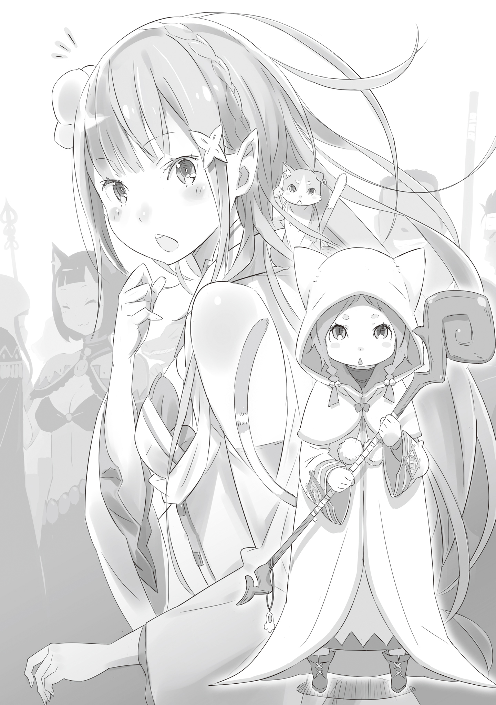

— А Столица-то и правда просто огромная, да? — звонко хлопнув в ладоши, просияла девушка, жадно впитывая открывшуюся картину.

Она была невыразимо прекрасна.

Длинные серебряные волосы струились шёлком до самой талии, а в косы был вплетён белый цветок — изящное украшение, заставлявшее её красоту расцветать ещё ярче. Кожа белая, словно первый снег, утонченные черты лица, а в глазах, скользивших по городу, сиял, подобно инкрустированным драгоценностям, чистейший аметистовый блеск.

Её можно было смело назвать несравненной красавицей, однако вела она себя слишком по-детски для столь громкого титула. Людской поток, снующий туда-сюда, шум и гам оживлённой улицы — всё вызывало у неё нескрываемое любопытство. Девушка слегка приподняла подол плаща с гербовым ястребом, дрожа от возбуждения, будто вот-вот готова была сорваться с места в галоп.

— Веселящаяся Лия — это, конечно, мило, но тебе пора бы спуститься с небес на землю.

Прозвучавший голос остудил пыл красавицы. Донёсся он не из гомонящей толпы прохожих, а откуда-то совсем рядом. Так близко, словно кто-то прошептал прямо на ухо.

— Ну-у… Я же знаю, что у нас проблемы. Я всего лишь на секундочку остановилась, а ты сразу за своё… Ты тако-о-ой вредный.

— Да-да. Мне тоже не хочется читать нотации. Но если так пойдёт и дальше, кое-кто может попасть в беду. Ты ведь не хочешь, чтобы это произошло, да?

— Ну, это… конечно так, но…

Девушка неохотно понурила голову, признавая справедливость упрека. Серебряные пряди качнулись, и на её плече показалась маленькая тень.

— В любом случае, давай походим вокруг и поищем. Нет смысла стоять столбом на месте.

С этим конструктивным предложением выступил крошечный кот, легко умещавшийся на ладони.

Серая шёрстка, круглые глазки и розовый нос. Внешне он казался самым обычным зверем, если бы не манера важно восседать на двух задних лапах и теребить усы, словно заправский мудрец.

Устроившись на плече девушки, кот тихонько заурчал, покачивая хвостом, который длиной не уступал его собственному телу.

— Крайней мерой будет набраться смелости и расспросить людей. Справишься?

— Не смейся. С этим-то я преспокойно справлюсь. Боже, Пак, ты вечно обращаешься со мной как с ребёнком.

— А как с тобой обращаться, если ты так расшалилась, что отбилась от сопровождающего?

На этот безмятежный, но острый ответ девушка могла лишь надуть губы и обиженно отвернуться.

Пак — так звали кота — рассмеялся, видя, как она отрицает очевидное, но тут же ведет себя ровно так, как он сказал: — Будет плохо, если стемнеет, Эмилия. Давай перестанем быть «потеряшками», пока я ещё могу тебе помочь.

— Никакая я не потеряшка. Я просто… ну, совсем чуточку не понимаю, где нахожусь, вот и всё.

Дерзко парировав, Эмилия с чопорным видом зашагала вперёд, вглядываясь в бесконечный людской поток столицы в поисках отбившейся спутницы.

Столица королевства Лугуника — один из величайших мегаполисов континента, чей людской муравейник насчитывал более трёхсот тысяч душ.

Будучи сердцем страны и домом для королевского замка, этот город, переполненный представителями всех мыслимых рас, никогда не спал. Жизнь здесь кипела, и за пестрым хороводом прохожих можно было наблюдать часами, не зная скуки.

Особенно процветала торговля: улицу, именуемую «торговой», плотно облепили магазины и лавки, ломившиеся от товаров из дальних городов и стран, а шум над головами стоял поистине головокружительный.

— Ну и народу… — пробормотала Эмилия, кое-как вырвавшись из давки на обочину.

Пригладив растрепавшиеся волосы и с облегчением выдохнув, она вновь посмотрела на дорогу. Она слегка нахмурилась при виде живой реки, заполнившей улицу от края до края. Найти здесь одного-единственного человека казалось задачей невыполнимой.

— Я думал, та девчонка выглядит довольно приметно… но в столице от этого, похоже, мало толку, — озвучил мысли Эмилии Пак, укрывшийся в гуще её серебряных волос.

Поправляя причёску, девушка легонько ткнула пальчиком в серую шёрстку: — Ага, беда… И ещё, Пак. Не воплощайся без особой нужды. Если тебя заметят — поднимется шум. Мог бы и в кристалле пока отдохнуть.

— Если я уйду в кристалл, боюсь, мы с Лией оба об этом пожалеем. Лучше скажи, что будем делать? Бродить, полагаясь на удачу?

— Ка-а-ак неприятно сформулировал! Нужно искать более обдуманно.

Эмилия решительно отвергла предложение духа и гордо выпятила грудь. Пак, задумчиво поглаживая ус, приготовился услышать гениальную стратегию, которая вот-вот должна была родиться в голове его подопечной. Однако ожидания оказались напрасными.

Глаза девушки внезапно округлились, и вместо плана она выдала: — Там, смотри! Кажется, кто-то ссорится.

— Лия…

— Я ненадолго. Просто любопытно, гляну лишь одним глазком.

У лавки через дорогу собралась толпа зевак — там разгорался скандал. Услышав это легкомысленное заявление, Пак схватился за свою маленькую голову и тяжко вздохнул: — Ты не забыла, что мы и сами, мягко говоря, в затруднительном положении?

— Н-нет же. Я не собираюсь вмешиваться или помогать… просто, ну да, захотелось поглазеть.

Бросив слова, не слишком подобающие её благородному облику, Эмилия рысцой направилась к месту происшествия. Растолкав толпу, она добралась до первого ряда и замерла.

— Го-во-рю же тебе! — звенел детский голосок. — Я не собиралась делать «кусь и бежать», я… мы с Хетаро разминулись!

— А я тебе говорю, барышня, хватит талдычить одно и то же. Я знать не знаю твоего «разминувшегося», а товар уже съеден. Я буду в убытках, если ты не заплатишь. Э-э-эх, раз платить нечем, придётся тебе оставить что-то в залог…

— Из вещей у меня только этот посох, но если я его отдам, Госпожа будет ругаться!

Увидев спорящих, Эмилия удивленно моргнула.

Одним из участников перепалки был высокий смуглый мужчина — очевидно, владелец лавки. Его оппонентка же едва доставала ему до пояса.

Это была девочка-зверочеловек: оранжевая шёрстка, подрагивающие круглые уши и пушистая белая мантия, скрывавшая всё тело. Ростом она была Эмилии лишь до груди, а огромные глаза и розовый нос делали её воплощением милоты и обаяния.

Судя по разговору, малышка полакомилась товаром без спроса, а теперь не могла расплатиться.

— Мими не хочет, чтобы её считали плохой и воровкой, что же делать…

— Мне тоже как-то совестно отбирать этот посох… Вещица-то с виду непростая. И как быть?

— Простите…

И когда атмосфера между участниками конфликта стала совсем тягостной, вперёд выступила не кто иная, как Эмилия. Под перекрестными взглядами спорщиков она произнесла: — Эм, нужно просто заплатить за то, что съел этот ребенок, верно?

— Ну, да… Э-э, барышня, вы знакомая этой малышки?

— А? Сестрёнка — знакомая Мими? А я и не знала!

— Нет, я её совсем не знаю, вижу впервые в жизни.

— Чего?!

Лавочник растерялся еще сильнее от такого чистосердечного признания в полной непричастности. Но Эмилия, проигнорировав замешательство торговца, уверенно запустила руку за пазуху.

— Я заплачу вместо неё. И проблема будет решена… так ведь?

— Ну, меня-то это выручит, но… Вы точно никак не связаны?

— Точно. Если уж говорить начистоту… то она, пожалуй, просто пришлась мне по душе.

Эмилия заговорщицки подмигнула, и лавочник, словно признавая поражение перед женской логикой, поднял обе руки. Улыбнувшись этому жесту, полуэльфийка потянулась за кошельком…

— А?..

Пальцы, шарившие в складках одежды, хватали лишь пустоту. Склонив голову, Эмилия с озадаченным видом принялась ощупывать себя — за пазухой, на поясе, в рукавах. Везде.

Посреди улицы воцарилась звенящая тишина. И в этой тишине с выражением глубокой неловкости на лице она произнесла: — Кошелёк куда-то подевался.

Потеряла спутника посреди столицы, а теперь ещё и осталась без гроша в кармане — таков был её приговор.

Эмилия, столь гордо вызвавшаяся заплатить, оказалась загнана в угол. Хотела помочь человеку — точнее, зверочеловеку — и вот результат. Она физически ощущала, как спрятавшийся в волосах Пак разочарованно качает головой. Ей хотелось пожаловаться, поныть, но сейчас требовалось срочно спасать лицо.

Мысли лихорадочно метались, и внезапно она выдала: — Я покажу трюк… Если будет интересно, пожалуйста, бросьте монетку!

— Э?..

От такого неожиданного предложения устроить уличное представление головы склонили все: и зеваки, и торговец. Среди ошарашенных лиц выделялась лишь радостная кошечка, захлопавшая в ладоши: «О-о, трюки, трюки!».

— Лия, Лия… страшно спрашивать, но что на тебя нашло? — раздался шепот.

— Я вспомнила, Пак! На таких многолюдных улицах, если показать необычный фокус, люди подают деньги, так ведь? По-моему, это идеальный выход из нашей ситуации.

— Старательная Лия — это мило, но иногда мне кажется, что я где-то ошибся в воспитании. Например, сейчас.

Эмилия уже не слушала причитания Пака — отступать было некуда, да она и не собиралась.

Игнорируя скепсис окружающих, она глубоко вдохнула и сделала шаг вперёд. Встав перед лавкой так, чтобы толпе было лучше видно, она дождалась, пока торговец чуть отступит. Это была её сцена.

— Сейчас я заставлю невиданного в мире зверька показывать фокусы!

— У меня дурное предчувствие… Меня ведь сейчас втянут во что-то…

— И-и-и раз!

Эмилия резко вытянула правую руку. Толпа с недоумением уставилась на пустую ладонь, обращённую к небу. Купаясь в этой растерянности, девушка незаметно подмигнула замешкавшемуся Паку.

— Давай, прошу тебя. Ну же, Пак. Ну же!

— Я не момент выхода упустил, я просто не горю желанием… Но раз уж нельзя позволить Лие стать посмешищем — придётся.

Всем своим видом выражая вселенскую скорбь и пожимая плечами, Пак неохотно выполз из укрытия. Серебряные пряди качнулись, и появление маленького существа вызвало мгновенный гул. Но когда он встал на задние лапки прямо на ладони девушки, подняв передние вверх, гул перерос в настоящий переполох.

Почувствовав мощный отклик публики, Эмилия торжествующе провозгласила: — Это редчайший в мире зверь! Сейчас он будет…

— Д-Дух! Это же Дух!

— Заклинательница Духов!

— Чёрт, валим! Бросай оружие и все бабки, просто беги!

Эмилия, которая как раз прикидывала, заставить ли Пака станцевать или кувыркнуться, не поверила своим глазам. Вместо аплодисментов начался хаос. Люди в толпе, окружавшие их плотным кольцом, с воплями бросились врассыпную. Более того — убегая, они в панике побросали на землю все свои мешки, свёртки и сумки.

Улица мгновенно опустела. Те прохожие, кто был подальше и не слышал криков, продолжали спокойно идти по своим делам, но кольцо «зрителей» испарилось без следа.

Пока Эмилия стояла в оцепенении, Пак, сидя на ладони, невозмутимо умывал мордочку подушечками лап: — Я же говорил тебе: «брось, не надо». Ну, по крайней мере, о деньгах теперь можно не беспокоиться.

— Танец Пака такой милый, могли бы посмотреть, а потом уходить…

— Мне нравится эта скромность Лии, называющей подобное бегство «уходом».

Эмилия лишь тоскливо вздохнула и окинула взглядом горы брошенных вещей. Она совершенно растерялась, не зная, что теперь делать с этим добром.

— А?

Взгляд её аметистовых глаз зацепился за один предмет, лежащий поверх какого-то грязного узла. Это был знакомый холщовый мешочек. Нагнувшись и подняв его, Эмилия утвердительно кивнула.

— Мой потерянный кошелёк… Почему он здесь?

— Может, кто-то добрый принёс и вернул?.. — лениво протянул Пак, зевая и забираясь обратно в уютные волосы.

Его выход был окончен. Эмилия нутром чуяла подвох, но факт оставался фактом — деньги вернулись к хозяйке. Она обернулась к лавке. Там, прислонившись к прилавку, стоял торговец, полностью выпавший из реальности от такого поворота событий.

— Эм, так сколько с меня причитается?

И Эмилия вернулась к своей миссии по спасению.
