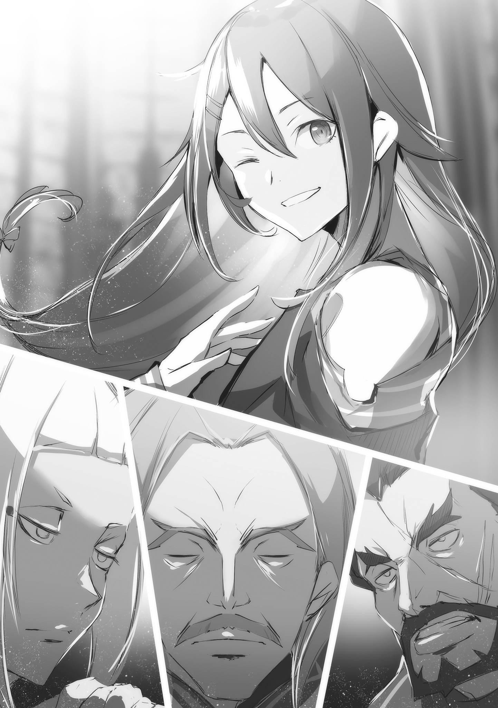
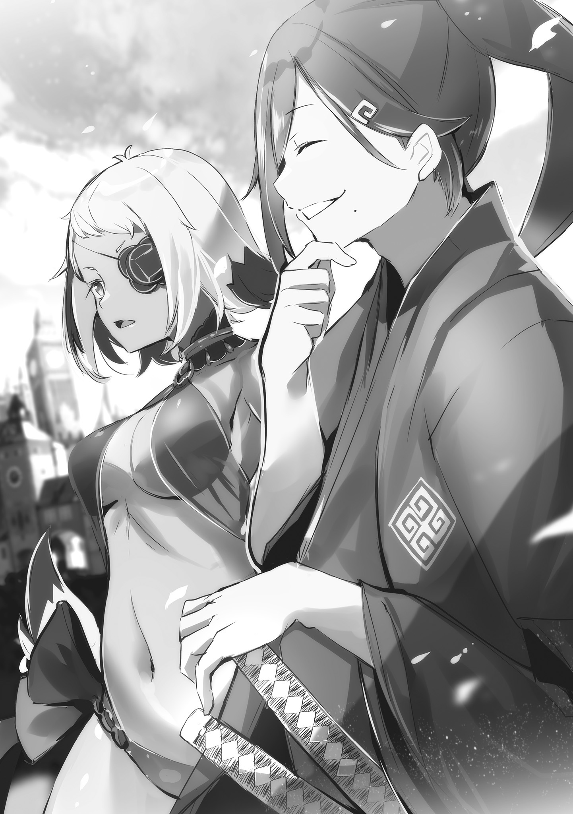
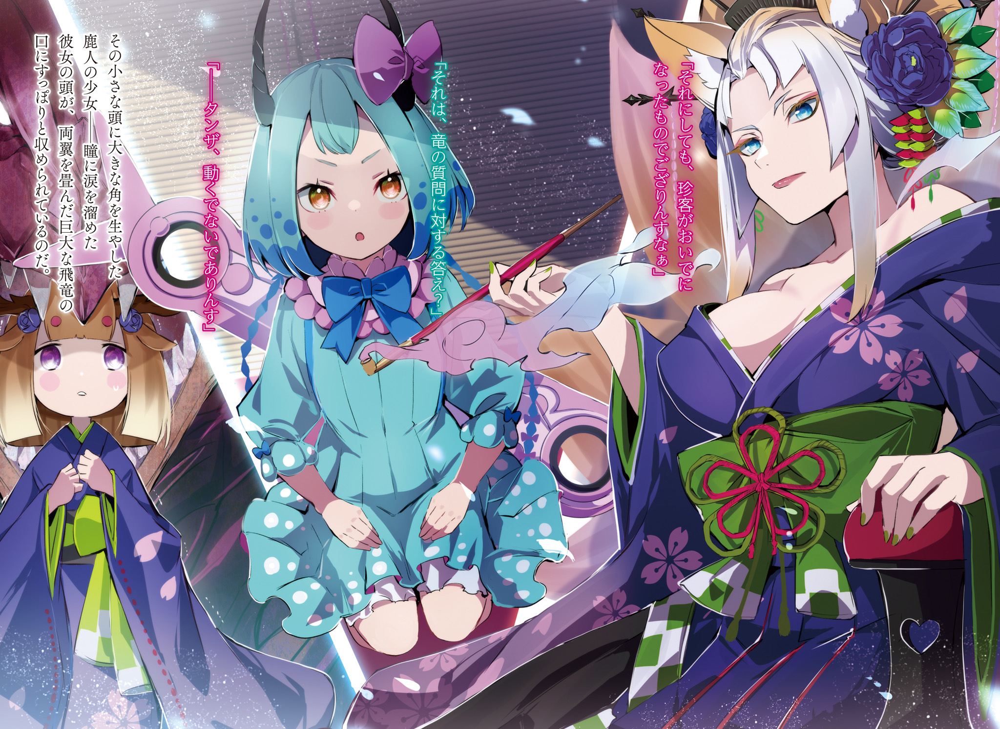
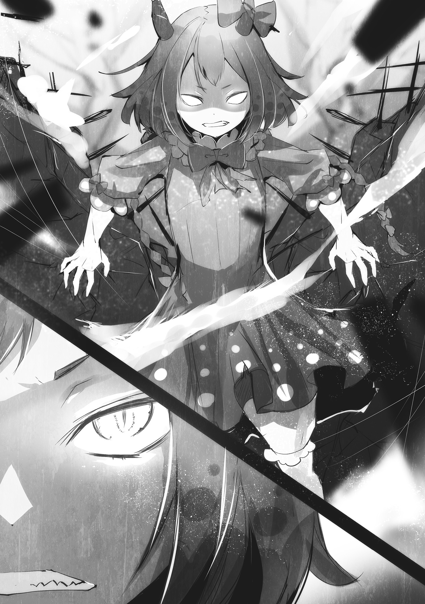

Хронологически история происходит через несколько месяцев после событий Ex 4.

Перевод и редактура: Gradient

— Объявляю Совет открытым, — тяжело и властно разнёсся по залу заседаний голос.

Слова прозвучали негромко, но обладали силой, способной рассечь напряжённый воздух и резануть по барабанным перепонкам собравшихся.

И неудивительно. Ведь голос принадлежал не кому иному, как правителю Империи, где царит закон джунглей — закон сильнейшего. Самому Вершителю судеб целой страны.

Семьдесят седьмой Император Священной Империи Волакия, — Винсент Волакия собственной персоной. Красивый мужчина с блестящими чёрными волосами и строгими, узкими глазами. Его стройное тело было облачено в одеяние со скромными, но изысканными украшениями.

В чёрных глазах горел свет разума, а мудрость, позволяющая мысленно охватить самые дальние уголки обширной Империи, принесла ему славу «Мудрого Императора».

Под его правлением Империя Волакия переживала эпоху мира, невиданного со дня её основания. В вечно раздираемой распрями стране семь лет его царствования вошли в народные предания как самое спокойное время в истории.

Однако выдающиеся качества правителя не означали мягкости нрава.

Нынешний Император, подобно предшественникам, был холоден и безжалостен. Этот общеизвестный факт словно витал в гнетущей атмосфере зала заседаний.

— …

Лица собравшихся на Совет Генералов — тех, кому в разной степени была доверена военная мощь великой Волакии, — были суровы и напряжены.

Расслабляться нельзя. Генералы знали: проявить слабость или небрежность перед другими, а тем более перед Императором, — значит подписать себе смертный приговор. Потому лица всех Генералов Второго ранга и ниже были словно высечены из камня.

— Что ж, сразу к делу. У нас сегодня накопилась целая гора вопросов, не так ли? — подхватил кто-то неспешным, дребезжащим голосом, прозвучавшим несколько неуместно в этой давящей атмосфере.

В центре просторного зала стоял длинный стол. Во главе его восседал Император. Ближайшие к нему места по обе стороны занимали следующие по рангу — таков обычай. И человек, произнёсший эти неторопливые слова, сидел по правую руку от Императора.

То был Чиша Голд — беловласый и бледнолицый мужчина, облаченный во всё белое с головы до ног, известный как один из мудрейших советников Императора.

Чиша, чья выдающаяся проницательность служила Винсенту в управлении государством, был не только доверенным лицом правителя, но и одним из «Девяти Божественных Генералов» — вершины военной иерархии Волакии.

Это означало, что он входил в девятку удостоенных высшего звания — Генерала Первого ранга.

Разумеется, на Совет были вызваны и другие Генералы, но…

— Начнём с первой проблемы… Явка Генералов Первого ранга сегодня рекордно низка за всю историю, что весьма прискорбно, — Чиша поднял первый вопрос повестки дня, и это действительно была серьёзная проблема.

Вокруг Винсента, самого почитаемого существа в Империи, зияло множество пустых мест. Неопровержимое доказательство низкой явки Генералов Первого ранга — «Девяти Божественных Генералов».

— Что за безобразие! Мы должны быть примером для всех солдат и офицеров, а такое поведение бросает тень на всех Генералов!

— Я пунктуален. Это естественно.

Один взорвался гневной тирадой, другой отозвался механически. Это были двое Генералов Первого ранга, занимавшие места рядом с Чишей, — Гоз Ральфон и Могуро Хагане.

Гоз, прошедший путь от простого солдата до генерала, и Могуро, выходец из особого народа, известного как «стальные люди», оба были беззаветно преданы Императору и считали присутствие на Совете своей прямой обязанностью, как и Чиша.

Но реальность была такова, что в этот день из Генералов Первого ранга явились лишь они трое.

— Ладно Груви, он возглавляет экспедицию, но что со стариком Ольбартом?!

— От старика Ольбарта получено извещение об отсутствии. …Впрочем, Генерал Первого ранга Гоз, судя по тому, что вы с самого начала не упомянули тех двоих, вы и сами всё понимаете.

— Сесилус и Аракия. Ждать бесполезно.

Гоз разразился упрёками в адрес отсутствующих, Чиша криво усмехнулся на его справедливое негодование, а Могуро подтвердил это коротким и метким замечанием.

В Империи Волакия, где почитали силу, условия для избрания в «Девять Божественных Генералов» были просты и ясны: непревзойдённая доблесть и мастерство. Ничего более.

Поэтому Имперская армия обладала несравненной боевой мощью, превосходя другие страны, но чем выше ранг, тем слабее дисциплина.

То, что Гоз даже не надеялся увидеть двоих — Сесилуса Сегмунта и Аракию, занимавших первое и второе места в иерархии «Девяти Божественных Генералов», — было вполне ожидаемо.

Как бы то ни было…

— Как они смеют пренебрегать Советом, на который Его Превосходительство тратит своё драгоценное время!…

— Все так же шумно голосишь, невежа, — прервал его Винсент.

— Ваше Превосходительство!…

Красивый мужчина во главе стола — Винсент — остановил Гоза, чьё суровое лицо побагровело от гнева. Император прищурил свои узкие глаза, окинул взглядом пустующие места «Девяти Божественных Генералов» и произнёс:

— Я и не ждал их. Даже на доске шатранджа у каждой фигуры свой ход. Если они начнут двигаться самовольно, нарушая правила, доска погрузится в хаос вопреки замыслу игрока. К тому же…

— …Если бы Ваше Превосходительство желали послушания, вы бы не стали возрождать систему Девяти Божественных Генералов. По крайней мере, ваш покорный слуга толкует это именно так, — перебил его кто-то.

Винсент тихо хмыкнул, когда его слова оборвали. Не побоялся проявить такое непочтение к Императору пожилой мужчина с аккуратно уложенными седыми волосами, сидевший по левую руку от Винсента, напротив Чиши — Беллстетз Фондальфон.

В Империи, где власть принадлежала военным, он, гражданский чиновник, занимал пост «Канцлера» — должность, уступающую по важности лишь самому Императору. Вершина гражданской иерархии. Мудрец Империи, в чьих почти закрытых глазах плелись бесчисленные интриги.

Его слова вызвали явное недовольство Гоза, чья преданность Винсенту была непоколебима.

— Канцлер, как вы смеете прерывать Его Превосходительство!…

— Прошу прощения. Однако Его Превосходительство занят государственными делами. Я счёл своим долгом верного подданного способствовать скорейшему продвижению Совета, сколь бы недальновидным это ни показалось.

— Хотите сказать, мы мешаем Его Превосходительству?!

— Генерал Первого ранга Гоз, не горячитесь так. Взгляд Его Превосходительства становится все холоднее и холоднее, как мне кажется.

— Кх!…

Гоз попытался возразить на дерзкое замечание Беллстетза, но опытный Канцлер легко парировал удар. Увы, в словесной дуэли Гоз и Беллстетз были в разных весовых категориях.

Гоз, пользующийся безграничным доверием солдат как выслужившийся из низов военачальник, по-настоящему раскрывался лишь на поле брани. А вот какое поле брани предпочитать — зависело от характера.

Чиша, например, тоже предпочитал битвы умов сражениям с оружием в руках.

— Сесилус, другие. Обсуждать бессмысленно.

— Да, как и сказал господин Могуро. Отсутствие «Первого» и «Второй» было ожидаемо… Не лучше ли перейти к основной повестке Совета?

— …Хорошо. Чиша, начинай.

В итоге попытка Гоза отыграться провалилась, и Совет двинулся дальше. Чиша вздохнул и, мельком взглянув на Гоза, сжимавшего кулаки в своих золотых латах так, что казалось, они вот-вот треснут, решил перейти к делу со словами: «Итак…»

Как всегда, нервы были на взводе ещё до начала самого Совета. Таково было положение дел в нынешнем руководстве Священной Империи Волакия.

Слово «переворот» часто встречается в летописях Империи Волакия.

Как уже упоминалось, в Волакии, где закон джунглей почитался за благо, поощрялось стремление силой заполучить желаемое.

Примеров тому не счесть: захват высокого военного поста, похищение возлюбленной или отъем богатства. Разумеется, если бы любое насильственное присвоение было дозволено, Империя превратилась бы в зону беззакония.

Нынешний Император, Винсент Волакия, прославленный как «Мудрый Император», установил по всей стране закон, требующий разумного применения силы, и тем самым навёл порядок. В результате многие жители Империи, и сильные, и слабые, ощутили на себе плоды его правления.

Зародилась эпоха, в которой стало легче жить и труднее умереть.

Однако блага, принесённые Винсентом, не делали его милосердным Императором.

— «Пусть на нашем флаге изображён волк, пронзённый мечами, но и среди волков есть лучшие и худшие. Стая не может существовать без различий. Но показательная казнь вожака, чья ненасытность грозит уничтожить всю стаю, также необходима».

Такова была политика Винсента и цель реформирования Империи. Удерживать доску в чистоте, в точном соответствии со своим видением, — вот суть его правления.

Ради этого он не гнушался искажать и попирать имперские обычаи и старые традиции. В некотором смысле, он был самым нетипичным и одновременно самым типичным Императором Волакии.

С тех пор как Винсент занял трон семь лет назад, Империя Волакия переживала самую мирную эпоху со дня своего основания. Поэтому слово «переворот» стало редкостью.

С начала правления Винсента Волакии событие, которое можно было бы назвать «переворотом», произошло лишь однажды, не считая периода сразу после его восшествия на престол. И это было…

— …Необходимо заполнить вакантное место в Девятке Божественных Генералов, — коснулся этой темы Чиша, когда Совет продвинулся вперёд и несколько вопросов было решено.

Внезапно воздух в зале заседаний похолодел и напрягся. На лбу Гоза пролегли морщины, похожие на трещины в скале, а атмосфера вокруг непроницаемого Могуро неуловимо изменилась.

Напряжение пробежало и среди Генералов Второго ранга и ниже, стоявших поодаль. Не отреагировали лишь сам Чиша, Винсент и Беллстетз.

Вакансия на вершине военной иерархии — среди «Девяти Божественных Генералов» — была недопустима. Единственным требованием к ним была их сила, что означало и недопустимость поражения.

Потерять место было равносильно смерти в бою. И причина, по которой освободилось девятое место, была не просто гибелью в сражении.

— Если бы только Балрой не отколол такой номер, — пробормотал Гоз со скрещёнными на могучей груди руками и горьким выражением лица.

Никто не поддержал его слов, но и не осудил, что говорило о схожих мыслях. Балрой Темегриф. Именно он занимал позицию «Девятого» среди Генералов Первого ранга и был одной из ключевых фигур последнего «переворота» в Империи Волакия.

Мятеж «Девяти Божественных Генералов», в который был вовлечён посланник соседней страны, с целью покушения на жизнь Винсента. Такова была суть великого переворота, первого с начала правления Винсента.

В результате Император получил тяжёлые ранения, но выжил. Главный заговорщик и исполнитель — Балрой был убит, и переворот захлебнулся.

Это произошло около двух месяцев назад, и с тех пор одно из мест в «Девятке Божественных Генералов» оставалось пустым.

Поскольку Винсент уже полностью оправился и вернулся к государственным делам, нельзя было дольше оставлять место Генерала Первого ранга вакантным. Отсюда и предложение Чиши.

— Учитывая необходимость держать в узде три соседние страны, полагаю, пришло время, — снова бросил камень в тихую воду Чиша, обращаясь к затихшему залу.

Все взгляды, естественно, устремились на Винсента. Встретив их, Император мельком взглянул на по-настоящему пустое место. Место, где когда-то беззаботно восседал Балрой Темегриф.

— Ваше Превосходительство?… — осторожно начал было Гоз.

— Довольно. У меня нет времени печалиться о мёртвых. Не мешкая, выберите кандидата.

— Слушаюсь. Благодарю за разрешение.

Мгновенное прищуривание тёмных глаз Винсента было прощальным словом мятежнику. Услышав приказ, Чиша поклонился в знак согласия. Затем он повернулся к Гозу, который все ещё недовольно скрещивал руки на груди.

— Генерал Первого ранга Гоз, как насчёт вас? Есть ли на примете Генерал, достойный вашего внимания?

— Хм, дай подумать… Есть несколько человек, искусных в стратегии, но если говорить о ком-то, кто мог бы занять место среди Девяти Божественных Генералов, то разве что Генерал Второго ранга — Кафма Ирулюкс.

— Генерал Второго ранга Кафма, значит.

Имя, названное Гозом, имевшим обширные связи среди Генералов, было, конечно же, знакомо и Чише.

Кафма Ирулюкс был талантом, достигшим звания Генерала Второго ранга в юном возрасте, и выходцем из редкого даже для многонациональной Волакии народа «Клетки Насекомых».

Этот народ носил в своих телах паразитов, называемых «насекомыми», и с детства учились управлять ими и при необходимости использовали их способности с помощью особой техники.

Однако, если и была проблема, то…

— Род Кафмы. С Балроем. Сговор.

— Как и сказал Генерал Первого ранга Могуро, разве Генерал Второго ранга Кафма не под домашним арестом из-за того инцидента?

Среди участников недавнего мятежа Балроя были и представители народа «Клетки Насекомых», к тому же из родного племени Кафмы. Сам Кафма не был причастен, но его привлекли к ответственности за участие сородичей, и он находился под стражей.

— Приходится сомневаться, подходит ли он на роль следующего Божественного Генерала.

— Именно поэтому не следует ли дать ему шанс обелить своё имя?! Он сам чувствует ответственность за участие своего рода в мятеже! Он готов хоть руки на себя наложить, если так и останется в опале!

— Хм…

— Ваше Превосходительство! Позвольте высказаться, хоть я и осознаю свою дерзость! Кафма Ирулюкс — человек высокой преданности Вашему Превосходительству, и терять его было бы невосполнимой утратой! Прошу, проявите великодушие!

Вскочив со стула так, что тот отлетел назад, Гоз опёрся руками о стол и, наклонившись вперёд, обратился напрямую к Императору. Такое поведение со стороны кого-либо другого сочли бы непочтением, но в глазах и сердце Гоза Ральфона горел лишь огонь преданности и праведного гнева.

— Ваше Превосходительство!

— Не голоси так противно, невежа. У тебя и без того голос зычный. Не обязательно так наклоняться, тебя слышно не только в зале, но и во всем замке.

Поэтому Винсент упрекнул Гоза лишь за громкость. На замечание Гоз рявкнул: «Прошу прощения!» — и продолжил:

— Но всё же! Прошу вас пересмотреть решение! Это позволит одним махом убить двух зайцев: заполнить вакантное место в Девятке Божественных Генералов и спасти будущее преданного Генерала!

— …Чиша.

— Слушаюсь. Позвольте высказать своё мнение. Полагаю, предложение Генерала Первого ранга Гоза не лишено смысла.

Получив от Винсента запрос, Чиша коснулся своего острого подбородка и ответил. Хотя сопутствующие обстоятельства были неблагоприятны, военные заслуги Кафмы Ирулюкса были известны и Чише.

Как и сказал Гоз, потерять выдающегося «Генерала» было бы болезненным ударом для Империи. Тем более, она уже потеряла Балроя Темегрифа. Хотя после недавнего инцидента с Королевством Лугуника был заключён договор о перемирии, он действовал всего три года, и что будет дальше — никто не знал.

Империи нельзя было позволять себе слабеть ни на мгновение.

— Полагаю, у Генерала Второго ранга Кафмы могут быть свои соображения, но не думаю, что в Империи найдётся тот, кто откажется от предложения о повышении до «Божественного Генерала».

— Хм. Убедительно звучит из уст человека, занимающего своё место не по доброй воле.

— …Не шутите так. Я уже смирился.

Пожав плечами на иронию Императора, Чиша тихо усмехнулся над собой. Если бы Кафма не стремился к званию Генерала Первого ранга, Чиша искренне посочувствовал бы ему, получившему такое предложение.

И был бы рад появлению ещё одного собрата по несчастью. Сам Чиша считал звание «Божественного Генерала» непосильной ношей. Честно говоря, ему больше подходила должность гражданского чиновника, а не военного.

Как бы то ни было, Чиша высказался положительно, и сомнения Винсента, казалось, развеялись. Дело шло к тому, чтобы без проблем договориться о предложении звания Кафме. Однако…

— …Ваше Превосходительство, ваш покорный слуга также хотел бы порекомендовать одного человека.

— Что ты сказал?!

Эти слова произнёс Беллстетз, вызвав бурю в зале заседаний. Прищурив глаза так, что они превратились в ниточки, Канцлер Империи, чьи истинные намерения всегда были скрыты, вызвал своим заявлением гнев Гоза. Тот, словно получив удар под дых, свирепо посмотрел на Беллстетза.

— Что ты задумал, Канцлер?! Ты, гражданский чиновник, смеешь вмешиваться в назначение военного, да ещё и Генерала Первого ранга?!

— Смею заметить, Ваше Превосходительство, моя должность — Канцлер… Я обязан не щадить себя ради блага Империи. А значит, имею право высказать своё мнение.

— Какие громкие слова. Полагаю, ты говоришь это с полной ответственностью.

Разъярённый Гоз ответил на спокойствие Беллстетза тихой, но явной враждебностью. Это была сосредоточенность хищника перед броском, проявление боевого духа Гоза Ральфона — «Рыцаря Льва».

Казалось, столкновение в зале было неизбежно…

— Прекрати, невежа. Твой голос в гневе ещё противнее.

Но их перепалку прервал не кто иной, как Винсент. От его слов Гоз затаил дыхание, а Император перевёл взгляд на Беллстетза.

— Беллстетз, ты сказал, что хочешь кого-то порекомендовать. Говори.

— Ваше Превосходительство! Пересмотрите…

— Я сказал, прекрати.

Получив повторное указание замолчать, Гоз с побагровевшим лицом затих. Беллстетз, в свою очередь, кивнул.

— Благодарю за ваше великодушное решение.

— Молчи. Третьего раза не будет. Говори немедленно.

— Слушаюсь. Человек, которого я хотел бы порекомендовать, зовётся Мэделин Эшарт.

Понукаемый Беллстетз наконец с полной уверенностью произнёс имя, и Винсент едва заметно приподнял бровь. Для него это было редким проявлением удивления, для всех остальных — почти незаметной реакцией. Действительно, Чиша, Гоз и многие присутствующие Генералы одинаково недоуменно переглянулись. Почему же?…

— Я не знаю имени. Канцлер кто это?

Вопрос, возникший у всех, озвучил немногословный Могуро. Хотя Могуро говорил мало и его речь была прерывистой и механической, это вовсе не означало, что он плохо вникал в суть Совета.

Напротив, он был одним из немногих мудрецов среди Генералов Первого ранга, способных спокойно и объективно оценивать ситуацию. На этот вполне закономерный вопрос Беллстетз коснулся пышных усов под носом и ответил:

— Ваше удивление вполне естественно. Мэделин Эшарт… она не служит в Имперской армии. У неё нет ни опыта службы, ни достижений в командовании.

— Это… уж слишком.

— …Да это ни в какие ворота!!

Чиша понял, почему имя было незнакомым, когда услышал объяснение, а Гоз, которому Винсент приказал молчать, не выдержал и взревел от ярости. Но на этот раз никто не мог винить Гоза.

Все Генералы в зале, включая Генералов Первого ранга, без исключения, сомневались в разумности предложения Беллстетза. Ни опыта службы, ни достижений. Иными словами, человек без каких-либо видимых заслуг. Кто же станет прислушиваться к такой рекомендации?

— Ты издеваешься над честью имперских солдат?!

— Вовсе нет. Я уже сказал. Как Канцлер Империи, я высказываю своё мнение, думая о будущем страны. И в моих словах нет лжи.

— Каким же языком ты смеешь говорить такое…

— Подожди.

Винсент снова остановил Гоза, у которого от гнева вздулись вены на лбу и который был готов взорваться.

Подперев щеку рукой на подлокотнике кресла, Винсент испытующе посмотрел на Беллстетза. Встретив этот взгляд, Канцлер без тени страха обратился к своему господину: «Ваше Превосходительство».

— Повторяю, у вашего покорного слуги нет намерений обманывать вас или пренебрегать званием «Божественного Генерала». Я уверен, что Мэделин Эшарт — человек, который оправдает ваши ожидания.

— Уверен, говоришь? Не бросайся так легко словами. Что она может?

— …Она управляет воздушными драконами.

— …

В тот же миг воздух в зале замер от ответа Беллстетза. Даже Чиша, стоявший рядом, затаил дыхание, осознавая, насколько рискованным было это заявление.

Искусство подчинения свирепых воздушных драконов, известное как «Приручение воздушных драконов» — было особой техникой, которой владели только в Волакии. Чтобы овладеть ею, требовались талант и долгие годы тренировок, поэтому наездники воздушных драконов были крайне редки и ценились на вес золота.

Но проблема была не в этом. Проблема была в том, что Балрой Темегриф, поднявший мятеж, тоже был наездником воздушных драконов. Рекомендовать на место погибшего Балроя такого же наездника… Независимо от намерений, это предложение выглядело как провокация.

Неудивительно, что Генералы онемели, а Винсент не нашёл слов. Казалось, вот-вот взорвётся Гоз, недоумевая, что задумал Канцлер. Но…

— Зная тебя, ты бы не стал просто так предлагать наездника на замену наезднику.

— Да, вы как всегда проницательны. Разумеется, ваш покорный слуга не считает, что простой наездник воздушных драконов… пусть и обладатель ценного навыка, достоин звания «Божественного Генерала». И ещё.

— Что?

— Одно уточнение. Я не говорил, что Мэделин Эшарт — наездница воздушных драконов. Я сказал, что она управляет воздушными драконами.

Так ответил Канцлер на вопрос Императора, и на его морщинистом лице появилась непроницаемая улыбка. Напряжение, повисшее между ними, было уже привычным для каждого Совета.

Этот человек с камнем за пазухой был ненадёжен, но тот факт, что Беллстетз занимал пост Канцлера, свидетельствовал о его незаурядных способностях.

Находить способных людей, использовать их таланты для построения своей игры на доске — таков был метод правления Винсента, который сам не отличался выдающейся воинской доблесть, в стране Волков-Мечей — Волакии.

Поэтому и на этот раз Император без колебаний продемонстрировал своё мастерство.

— …Вызовите Кафму Ирулюкса и Мэделин Эшарт.

— …Я не возражаю, но вы уверены?

— Уверен. Силу Кафмы я знаю. Значит, нужно оценить и эту Мэделин. Если она не оправдает моих ожиданий, это будет означать, что Беллстетз впал в старческий маразм. Я не настолько милосерден, чтобы держать место для выжившего из ума бездаря. Понятно?

— Вполне понятно, Ваше Превосходительство.

Несмотря на холодный взгляд, Беллстетз без тени страха поклонился. Он не рассчитывал на милосердие Винсента и не относился к нему легкомысленно. Либо он был абсолютно уверен в своей правоте, либо…

— Управляет воздушными драконами… И что с того?! Кафма тоже управляет насекомыми!

— Гоз, это, не, важно. Я, думаю.

— И без воздушных драконов, на насекомых можно доставить Его Превосходительство куда угодно при надобности! Разве нет, Могуро?!

— Не, нет. Однако, я, насекомых, не, люблю.

Пока Могуро сдерживал раздосадованного Гоза, чьё мнение было отвергнуто, Чиша мысленно переставлял приоритеты государственных дел и размышлял о будущем.

«Только-только улёгся недавний мятеж, а уже новые заботы на горизонте…» — Предчувствуя новые трудности, Чиша мысленно похлопал себя по плечу и смирился с временным исходом спора.

Нужно будет позже поговорить с Гозом, разузнать о намерениях Беллстетза и так далее.

Ожидать, что Винсент сам займётся этими вопросами, было бы верхом нелояльности со стороны давнего верного подданного. Тем более, Винсент уже и так выполнял свою роль более чем достаточно.

— …Сильные ведут себя свободно в Империи, а вершитель этой Империи, «Император», вынужден страдать от ограничений своей роли… Какая ирония, право слово.

И ведь это положение он обрёл по собственной воле, что делало ситуацию ещё более неразрешимой.

Если бы он действительно хотел отказаться, нашлось бы множество способов сбежать. Как, например, поступил тот, кто действительно сбежал из этой неудобной золотой клетки…

— …А-а-а, господа, вы все в сборе? Прошу прощения за беспокойство.

Это произошло прямо перед завершением Совета. Дверь в зал заседаний распахнулась, и одновременно раздался голос. Легко нарушив напряжённую атмосферу, в комнату вошёл изящный мужчина в синей робе.

Глубоко надвинутый капюшон скрывал его лицо, и он совершенно не вписывался в компанию сосредоточенных военных. Чиша почувствовал лёгкое отвращение, скривив своё бледное лицо, но причина была не только во внешнем несоответствии.

— …Господин «Звездочёт»? С какой целью вы пожаловали?

— О нет-нет, я и не думал, что Совет в самом разгаре. Видите ли, благодаря милости Его Превосходительства меня приютили в Хрустальном Дворце, но меня, знаете ли, недолюбливают во всех фракциях.

Ухмыляясь, мужчина — «Звездочёт» — легкомысленно ответил, не обращая внимания на недружелюбную атмосферу. На его неуловимую манеру Чиша лишь коротко бросил: «Вот как».

«Звездочёт» был чужеродным элементом, не принадлежащим ни к военным Генералам, ни к гражданским чиновникам вроде Беллстетза, и занимал уникальное положение в Хрустальном Дворце. Хотя Чиша, как и все присутствующие, не приветствовал его присутствия…

— Я тебя не звал, шут.

…Император, хоть и называл его так, не отталкивал его и позволял оставаться в Хрустальном Дворце по своей воле.

Не обращая внимания на настороженные и неприязненные взгляды окружающих, «Звездочёт» смотрел только на Винсента. Встретив его взгляд, Император хмыкнул и слегка махнул рукой.

— Идёт Совет. Тебе здесь не место. Убирайся немедленно.

— К-конечно, я стараюсь знать своё место. Ведь я здесь лишь по милости Вашего Превосходительства. Н-но поэтому я должен выполнять свою работу.

— …

Дерзкое возражение. Услышав его, Винсент едва заметно приподнял бровь. Одновременно Чиша и остальные Генералы напряглись. Никто не испытывал к этому «Звездочёту» симпатии. И не доверял ему. Но его предсказания — это было другое дело.

— Ты не смог предвидеть мятеж Балроя. И что же ты увидел на этот раз? Если твои слова снова окажутся пустым сотрясением воздуха, твоя голова расстанется с туловищем. Знай это.

— Не говорите таких страшных вещей! Я, как видите, хрупкое существо, словно былинка. Если меня так пугать, я от страха и слова вымолвить не смогу!

— Хватит болтать! Его Превосходительство приказал тебе отвечать! Отвечай сейчас же!!

Получив угрозу от Винсента и гневный окрик Гоза, «Звездочёт» почесал голову поверх капюшона и с кривой усмешкой пробормотал: «Ну и ну».

— Похоже, мне здесь не рады. П-поэтому отвечу, как велено. Ваше Превосходительство, если у вас есть какие-то заботы, они скоро развеются.

— …Что ты имеешь в виду?

— Если предстоит соревнование в чем-либо, то представится подходящая возможность. Весьма сожалею за вечно туманные выражения, но это всё, что я могу сказать…

— Ясно. Могуро, заостри руку.

— Понял.

Услышав слова «Звездочёта», кивнувший Винсент отдал приказ Могуро.

Тот поднял свою длинную руку, и её гладкая, похожая на минерал, поверхность медленно начала трансформироваться, постепенно заостряясь, словно наконечник копья.

Чиша знал, что в таком состоянии рука Могуро острее любого меча. Рука, способная легко рассечь каменную стену, без труда отсечёт и десяток голов «Звездочёта» разом.

— Ваше Превосходительство?! Н-неужели меня казнят?!

— Глупец, стану я тратить на это время. Начнём с пальцев.

— Ваше Превосходительство ведь считал, что информация, добытая пытками, не имеет ценности?!

— Таких молчунов, как ты, сначала нужно заставить говорить. А уж потом проверять содержание сказанного. Разве нет?

От сурового и рационального решения Винсента «Звездочёт» попятился и упёрся спиной в стену. К загнанному в угол «Звездочёту» приближался Могуро, ростом более трёх метров. Под этим давлением «Звездочёт» огляделся в поисках спасения.

— Хм, нельзя пачкать кровью зал заседаний. Кто-нибудь, принесите простыню!

Но никто, начиная с Гоза, который уже воспринимал пытку как свершившийся факт, не выказывал намерения помочь. Естественно, Чиша тоже.

У него не было причин идти против воли Винсента и помогать «Звездочёту». Казалось, вот-вот пальцев у «Звездочёта» станет меньше, чем положено…

— …Прошу прощения, что ворвался во время Совета! Есть срочное донесение!

В этот момент в зал ворвался гонец, следующий за «Звездочётом», и кровавая расправа была временно отложена.

Перед глазами порхали белая и жёлтая бабочки.

— …

Рассеянно наблюдая за их хаотичным полётом, он задумался: каковы же их отношения? Если не мудрить, то, наверное, семья? Но бывает ли кровное родство у разноцветных бабочек? Может, как цвет волос у людей, каждая унаследовала черты одного из родителей?

«Но бабочки, кажется, обычно спариваются только со своим видом».

Люди и полулюди, имея схожую внешность, могли бы общаться, влюбиться и завести детей. Но почему-то казалось, что бабочки не скрещиваются с другими видами. Птицы тоже образуют пары только с птицами своего вида.

«Хм, а вот у собак и кошек, кажется, не так… Или я ошибаюсь?»

Внезапный вопрос заставил его склонить голову, но, поразмыслив, он отбросил неразрешимую задачу. Бессмысленно.

Тогда что, если две бабочки — не семья, а заклятые враги? Если представить их так, то хаотичный танец, в котором они постоянно меняли позиции, начинал казаться отчаянной схваткой не на жизнь, а на смерть. Удивительно. И боевые приёмы бабочек тоже вызывали интерес.

«Кстати, говорят, люди из народа «Клетки Насекомых» могут общаться со своими насекомыми. Интересно, есть ли среди них те, кто держит бабочек? Если да, то мои сомнения развеялись бы».

Обычно насекомые, которых носил в себе этот народ, были агрессивными, но если бы существовала бабочка — мастер смертоносного, вернее, насекомоубийственного, боевого искусства, её вполне можно было бы причислить к сильным. Может, если понаблюдать поближе, что-то прояснится…

Внезапно сверху обрушилось алое пламя и в одно мгновение испепелило цветочную поляну.

— …

От пасторальной картины не осталось и следа, языки пламени лизали траву и цветы, превращая их в пепел. Мир, прежде радовавший глаз нежными оттенками синего, зелёного и жёлтого, был поглощён всепожирающим красным, превратившись в адское пекло.

Не только травы и цветы, но и бабочки, и множество других насекомых, вероятно, в одно мгновение обратились в прах.

И виновником этого был…

— Как всегда приветствуешь ты исключительно грубо, — пожал узкими плечами юноша с синими волосами, глядя на сожжённую поляну.

Перед ним, посреди пылающего поля, стояла полуобнаженная девушка, которой палящий жар был нипочем. Одежда, открывающая большую часть её смуглой кожи, свисающие собачьи уши, серебристые волосы и повязка на левом глазу — черты девушки, виновницы пожара. Полуобнаженная девушка, стоящая в танцующем пламени, её звали…

— …Аня.

— …Не Аня, а Аракия. Сколько раз повторять? — тут же недовольно возразила девушка — Аракия, — когда её назвали Аней.

В ответ юноша покачал головой: «Нет-нет».

— Прости, но я так тебя звал с детства, верно? Даже если ты сейчас просишь называть по-другому, мой язык уже привык.

— Я уже давно, давно тебе говорю!…

— Да-да, знаю. Поэтому и я тебе давно говорю, верно? Если Аня победит меня, я смиренно буду называть тебя по-другому. Но…

— Но?

— Но виновата Аня, которая так и не смогла меня победить. Если ты обвиняешь меня, то мне остаётся только извиниться за то, что я слишком силён, верно?

Он подмигнул и широко улыбнулся, поддразнивая её. В тот же миг лицо Аракии исказилось от гнева, и от её хрупкого тела начала исходить такая воинственная аура, что сам воздух затрепетал. Увидев это, юноша вздохнул: «Ну и ну», — и разжал руки, сложенные на груди.

— Вот, улетайте отсюда, здесь опасно.

— …Бабочки?

Из раскрытых ладоней выпорхнули две бабочки — белая и жёлтая. Когда Аракия ворвалась вместе с пламенем, он инстинктивно накрыл их руками, чтобы спасти. Брось он их, они бы сгорели вместе с цветами и травой.

— Жаль было бы, если бы поединок один на один был испорчен вмешательством со стороны. Если ты благодарна мне за это, очень хотелось бы услышать отчёт о том, кто победил… Исход поединка двух бабочек и сама история их вражды — наверняка это была бы увлекательная история, — любопытство юноши было безгранично.

Однако, похоже, услышать продолжение было трудно. Юноша вздохнул, рассекая приближающийся огненный шар.

— Право слово, Аня, у тебя с детства ни капли эмоциональности.

— Меня никогда и не звали Аней.

— Ну что ты такое говоришь. Наоборот, могла бы гордиться, а?

Юноша улыбнулся Аракии, показывая обнаженный меч, которым он только что рассёк палящий огненный шар.

Аракия слегка нахмурилась на его улыбку и слова, а её непонятливость вызвала у него ещё более глубокую усмешку. Уже столько раз он ей говорил.

— Ведь это прозвище дал тебе я, главный герой этого мира, звезда сцены — Сесилус Сегмунт! Можешь громко заявить: «Я — Аня!» — и гордиться этим!

— Сесилус, убью.

— Ха-ха-ха! Опять говоришь то, чего не можешь сделать!

Рассмеявшись в ответ на прямолинейное намерение убить, юноша — Сесилус Сегмунт — без страха ринулся в поток разрушения, обрушивающийся с ужасающей силой, оттолкнувшись от земли.

Один — безумный мечник, полагающийся на два меча у пояса, врубающийся в самое пекло.

Другая — прекрасная отступница, свободно управляющая силами природы и искажающая саму суть мира.

Такими были «Первый» и «Вторая» из «Девяти Божественных Генералов» Империи Волакия.

— Ух ты, Аня, ты стала сильнее! Смотри, моё кимоно всё в ожогах! А ведь его так трудно достать из Карараги!

— Хх… ха-а…

— Так что, как обычно, починка на тебе! Сама порвала и сожгла, сама и чинишь, так что без обид!

— …Сесилус, умри.

Аракия, распростёртая на выжженной земле, выплюнула проклятие. Но Сесилус, адресат проклятия, и ухом не повёл.

Враждебность и жажда убийства, куда более действенные, чем проклятия, обрушивались на него в полной мере, но он оставался невозмутимым, так что слова были для него пустым звуком.

— Вообще, лучше не говорить фразы вроде «умри» или «сдохни», это удел статистов. Если сама будешь понижать свою актёрскую ценность, тебе могут доставаться только скучные роли.

— …Опять не понимаю смысла твоих слов.

— Мне кажется, я не говорю ничего сложного. Большие шишки говорят как большие шишки. Мелкие сошки — как мелкие сошки. Мир так устроен. Поэтому, наоборот, те, кто умеет говорить крутые вещи, — крутые!

Сесилус поднял палец, излагая свою философию. Он уселся скрестив ноги рядом с лежащей Аракией. Его одежда была вся в саже, но заметных ран не было.

Глядя на окрестности, опустошённые так, словно их подвергли ковровой бомбардировке магическими камнями, трудно было поверить, что он только что бушевал в самом эпицентре этого.

— Я, знаешь ли, если серьёзен, даже от дождя увернусь.

— …Это уж точно ложь.

— Н-ну вот! Ложь это или нет, зависит от тебя самой. То, что ты считаешь невозможным, — невозможно. Пока ты считаешь, что не можешь, ты и облака не разрубишь.

Громко, в десять раз громче, ответив на слабое возражение, Сесилус, не вставая, выхватил меч из ножен у пояса. Словно молния, опережающая звук, сверкнул клинок.

Давление меча взметнулось в небо и разрубило пополам густое облако над их головами. Увидев это, Аракия моргнула своим единственным красным глазом.

— …«Разрез облака».

— Ну, это так, фокус, чтобы немного удивить. Но если бы я твердил, что до облаков не достать, я бы вечно до них не доставал.

— …

— Поэтому, Аня, вместо того чтобы твердить «убью» или «умри», не лучше ли сосредоточиться на своей цели? У тебя ведь есть цель?

Он заглянул ей в лицо, но Аракия отвернулась. Когда он попытался заглянуть снова, она уткнулась лицом в землю.

Предпочла поцелуй с землёй взгляду Сесилуса. Эта крайность вызвала у него удивление, но губы всё равно растянулись в улыбке.

Поединок между «Девятью Божественными Генералами» — для окружающих это было лишь досадным недоразумением, сеющим разрушения. Но между Сесилусом и Аракией такие стычки происходили часто, и цель их была проста: иерархия.

В «Девятке Божественных Генералов» номера присваивались по силе.

Над Аракией, «Второй», стоял лишь Сесилус, «Первый». Следовательно, Аракия жаждала занять его место. Говорят, это позволит ей исполнить заветное желание.

— Аня, я поддерживаю тебя в стремлении исполнить своё желание. Но поддаваться не буду.

— …Всё-таки ненавижу.

— Ну вот, опять. Но я себе такому нравлюсь, даже очень.

Говоря это, Сесилус снял верхнюю часть своего кимоно и осторожно накрыл им лежащую Аракию.

Он прекрасно знал, что ей это не понравится, но во время боя он не мог заботиться ещё и о её одежде. Её и без того откровенный наряд стал ещё более вызывающим, и если не прикрыть её, смотреть будет неловко.

— Такая красавица, а совершенно не заботится о себе, Аня. Если кто-то позарится на неё и будет повержен, мне, как мужчине, будет стыдно смотреть!

— …Не понимаю, что ты говоришь.

— То, что ты не понимаешь, тоже проблема. Может, это потому, что хозяин твоего сердца бросил тебя, и по итогу никто ничему тебя не научил? Может, мне тебя выдрессировать? Гав-гав, гав-гав.

— …

Аракия, поднявшись и накинув на плечи отданное ей кимоно, посмотрела на него с настоящей злобой.

На его доброту ответили враждебностью, и Сесилус беспомощно развёл руками. Хотя он и не понимал, каково это — испытывать боль от жалости непобедимого противника, он всё-же мог себе представить.

— Хотя… Испытал бы я боль, если бы меня утешал господин «Святой Меча»?

Обычно, когда любимый человек добр к тебе, ты радуешься, а не злишься, разве нет?

— Сесилус, ненавижу.

— Хм, как упрямо. Ну и ладно! Пожалуй, переложу это на Чишу!

Попав в затруднительное положение, Сесилус решил прибегнуть к своему обычному способу решения проблем: довериться старому другу Чише, на которого он всегда и полностью полагался.

«Итак, теперь нужно отвести Аню… А? Кстати, у меня сегодня вроде было какое-то дело в замке?»

Решив действовать незамедлительно и направиться к Чише, Сесилус склонил голову, почувствовав лёгкое сомнение. Но прежде чем он нашёл ответ, ответ сам нашёл его.

— Г-Генерал Первого ранга Сесилус! Генерал Первого ранга Аракия! Вы целы?!

— А? А, мы здесь, здесь! Всё в порядке!

Обернувшись, Сесилус помахал рукой бегущему к ним имперскому солдату. Молодой солдат с опаской ступил на выжженную землю и, оглядевшись, застыл в изумлении: «Это…»

— Ч-что здесь произошло? На вас напали?…

— Не волнуйся особо. Это частная земля Ани, заброшенное место, которое мы используем для наших поединков.

— …

Аракия, услышав объяснение Сесилуса растерянному солдату, недовольно опустила голову и промолчала. Хотя разрушения выглядели так, будто здесь произошло стихийное бедствие, это был обычный ущерб от их стычек.

Сесилус-то ладно, но методы боя Аракии наносили огромный вред природе.

Поскольку она слишком сильно разрушала всё вокруг, ей было запрещено использовать свои способности вне поля боя. Исключение составляли лишь её личные владения.

— Это прямой приказ Его Превосходительства, так что Аня неохотно подчинится. Но то, что меня заставили жить в лачуге на частной земле Ани, — это уже чистая несправедливость.

— Понятно… А?! Лачуга?!

— Да-да. Видишь вон там? Вот это она и есть.

Сесилус указал удивлённому имперскому солдату на место чуть поодаль. У реки, протекающей рядом с лесом, стояла лачуга — жилище Сесилуса.

Похожая лачуга находилась выше по течению, и там жила Аракия. Так что двое сильнейших «Божественных Генералов» жили в развалюхах.

— П-почему двое сильнейших в Империи живут в таком месте?…

— Я трачу всё своё жалованье на скупку знаменитых мечей и сокровищ со всего света. А Аня — потому что ей всё равно.

— …Вы живёте вместе?

— Нет…

Солдат, колеблясь, задал вопрос, поддавшись любопытству. Но быстрее Сесилуса на него ответила Аракия, отрицая подозрение. Действительно, они жили на одной земле, но не вместе.

— Это тоже приказ Его Превосходительства. Видишь ли, если бы я жил где-то ещё, и там у Ани случился бы припадок гнева, мог бы возникнуть ненужный ущерб, верно? Так что лучше уж я всегда буду под рукой у Ани, тогда опасность грозит только мне…

— Простите, простите! Моё понимание настолько низко, что я не улавливаю смысла!

— Ха-ха-ха, для тех, кто плохо сдаёт «экзамен на понимание Его Превосходительства», это нормально. Наверное, у приказа Его Превосходительства есть какой-то скрытый смысл, но я подробно не расспрашивал, так что не знаю.

Сесилус бодро похлопал по плечу солдата, выражавшего явное замешательство, и улыбнулся ему.

Честно говоря, это была история, которую можно было понять или не понять — не так уж важно. Просто для Сесилуса это была жизнь, которую он вёл уже много лет, так что сейчас его ничего не смущало.

— …Так зачем пришёл? — спросила Аракия, когда растерянный солдат совсем потерялся.

На этот вопрос солдат встрепенулся, словно очнувшись: «Точно!» и затем:

— Генералу Первого ранга Сесилусу Сегмунту и Генералу Первого ранга Аракии объявлен срочный сбор! Немедленно явитесь в Хрустальный Дворец в столице!

— Хрустальный Дворец… А! Точно, сегодня же был какой-то Совет? Меня в последнее время даже не зовут, потому что я там обычно просто клюю носом.

— Меня тоже…

— Не хотелось бы слышать такие подробности, но на этот раз всё по-другому!

Солдат, пропустив мимо ушей ответы Сесилуса и Аракии, выпрямился, и его лицо напряглось. Увидев его тревогу, Сесилус облизал губы, почувствовав дурное предзнаменование. Аракия, вероятно, почувствовала то же самое.

Сесилус улыбнулся её профилю и сказал:

— Только недавно Балрой натворил дел, и вдруг такое. Что стряслось с Волакией? Неужели война?

— …«Церемонии Императорского Отбора» достаточно.

— Ну, я понимаю доводы Ани, но я-то остался неудовлетворённым. Хотя господин «Святой Меча» и развеял мою досаду… ой-ой, простите.

Когда Генералы Первого ранга начинали разговор, простому солдату было не вклиниться. Извинившись за то, что прервал разговор, солдат покачал головой: «Нет-нет».

— Ситуация требует сил вас обоих.

— Ого-го, что же случилось?

— Дело в том…

Солдат запнулся, сглотнул слюну и продолжил.

Ситуация, требующая сил Сесилуса и Аракии, была такова:

— …«Седьмая» из «Девяти Божественных Генералов», Генерал Первого ранга Йорна Миссигр, подняла мятеж!

У Йорны Миссигр, «Седьмой» из «Девяти Божественных Генералов» Священной Империи Волакия, была дурная привычка.

В Волакии было принято выдвигать сильных на высокие посты.

Система «Девяти Божественных Генералов», возрождённая нынешним Императором Винсентом Волакией, стала символом этого принципа. Однако если единственным критерием отбора была сила, то о человеческих качествах кандидатов, естественно, никто не пёкся.

Сильный на то и сильный, что гнёт свою линию и со слабыми не считается.

А раз так, было бы странно ожидать от «Девяти Божественных Генералов» — этого воплощения силы — умения работать в команде или хотя бы элементарной порядочности. Разумеется, это не означало, что им дозволялось творить всё, что душе угодно.

У них была роль, которую могли исполнить только они.

При условии выполнения этой роли «Девяти Божественным Генералам» дозволялась немалая свобода. И, естественно, если их признавали недостойными этой привилегии, их ставили на место ещё большей силой.

Таков был закон сильного, таков был обычай Империи Волакия — страны Волков-Мечей.

Итак, вернёмся к началу.

Йорна Миссигр, одна из «Девяти Божественных Генералов» Священной Империи Волакия. Вершина Имперской мощи, правительница Города Демонов, обладающая несравненной силой и соответствующими привилегиями. У неё была ужасная привычка.

И это было…

— …«Седьмая» из «Девяти Божественных Генералов», Генерал Первого ранга Йорна Миссигр, подняла мятеж!

Гонец ворвался в зал заседаний, где проходил Совет. Зал на мгновение погрузился в тишину, услышав резкие слова задыхающегося солдата.

Ровно столько времени понадобилось, чтобы барабанные перепонки восприняли слова, а мозг их усвоил.

Затем, с небольшой задержкой, последовала реакция — у каждого своя.

Многие Генералы, участвовавшие в Совете, широко раскрыли глаза, их лица напряглись. Однако реакция тех, кому отвели места в центре зала, отличалась от реакции рядовых генералов.

Кто-то нахмурился, кто-то погрузился в раздумья, кто-то остался недвижим. А тот, чья реакция была самой бурной, поднял руку, облачённую в золотую латную рукавицу, и…

— Какого чёрта, эта сука-лиса! — в гневе обрушил свою могучую руку Гоз, разнеся длинный стол в щепки.

Удар породил порыв ветра, который взметнул волосы и одежду присутствующих. Удар, нанесённый в гневе, таил в себе силу, способную одним махом убить крупного зверодемона, и напомнил о неоспоримой мощи Гоза Ральфона, которого боялись как «Рыцаря Льва».

Однако…

— Твоя глупость не ограничивается твоим шумным ртом, невежа.

Ветер от удара взметнул чёрные волосы Императора, но глаза его были холодны.

Встретив взгляд Винсента, Гоз, поддавшийся гневу, побледнел. Краска сошла с его лица и шеи, покрасневших от ярости, и он рухнул на колени.

— Ваше Превосходительство! Я совершил ужасную оплошность! Прошу, накажите меня как угодно…

— Глупец. Думаешь, что у меня есть время наказывать тебя? Будучи одним из Генералов, ты настолько туп, что не видишь ситуации? Или ты меня за дурака держишь?

— Ни в коем случае! Всё, что вы говорите, — истинная правда!

Гоз, готовый пасть ниц, искренне стыдился своей оплошности. К добру или худу, он легко поддавался эмоциям, и это влияло как на его личную силу, так и на командование большой армией. Возможно, это тоже следовало бы назвать дурной привычкой.

Если указать на это, Гоз, несомненно, приложит все усилия, чтобы исправиться. Но это таило в себе опасность превратить человека, который в определённых ситуациях проявлял наибольшую мощь среди «Девяти Божественных Генералов», в заурядного генерала.

Поэтому Винсент лишь мельком взглянул на коленопреклонённого гиганта и не стал его больше упрекать. Вместо этого…

— Так вот что означало твоё предсказание, «Звездочёт»?

— Вероятно… Н-но если предсказание не приходит вовремя, проку от него немного, я и сам так считаю.

Винсент, выслушав ответ «Звездочёта» в робе, непроницаемо хмыкнул.

Донесение о мятеже совпало с предсказанием «Звездочёта», которого пригрели в столичном Хрустальном Дворце. Учитывая это и вопросы, поднятые на Совете, становилось ясно, что нужно делать.

Что должен делать Император, глава Империи Волакия.

— Беллстетз.

Винсент, подперев щеку рукой на подлокотнике кресла, позвал, и пожилой мужчина с узкими глазами тихо ответил: «Слушаюсь». Винсент обратил взгляд на «Канцлера» Беллстетза, почтительно склонившего голову.

— Имя, которое ты упомянул ранее.

— …Мэделин Эшарт, Ваше Превосходительство.

— Явится ли она на зов?

На испытующий вопрос Императора Беллстетз лишь ещё глубже избороздил морщинами своё лицо, дерзко улыбнувшись.

Однако прежде чем старый Канцлер успел ответить, кто-то позвал Винсента: «Ваше Превосходительство». Это был Чиша, сидевший напротив Беллстетза и служивший Винсенту советником.

Чиша, не выказывая эмоций на своём бледном лице, мельком взглянул на Винсента.

— Вы действительно уверены в этом?

— Уверен. Если она не оправдает ожиданий, я просто прикажу разом отрубить головы и старику, и шуту.

— …В таком случае, я убеждён.

Получив ответ Винсента, Чиша спокойно отступил. Сам «Звездочёт» пожал плечами и выглядел так, будто хотел что-то сказать, но Винсент не обратил на него внимания.

— Ты слышал, Беллстетз. Моя воля ясна. Действуй соответственно.

— Разумеется, я всё понял, Ваше Превосходительство. С самого начала ваш покорный слуга был готов положить жизнь ради будущего Империи. Чего мне бояться?

— …

На ответ Беллстетза, настолько искренний, что казался фальшивым, Винсент ничего не сказал.

Затем он перевёл взгляд на макушку коленопреклонённого гиганта. Гоз по-прежнему стоял на коленях, видна была только его макушка.

Как бы то ни было…

— Невежа, тот, кого ты рекомендовал, тоже может действовать немедленно?

— …! Разумеется! Он сейчас под арестом в своём поместье… Если Ваше Превосходительство позволит, то хоть в эту же секунду!

— Не говори того, чего не можешь сделать. Успей к развёртыванию армии.

— Слушаюсь!

Получив те же условия, что и Беллстетз, Гоз ответил громоподобным голосом.

Как и убедил Чиша, действия верхушки Империи были предопределены.

— Подавить мятеж Йорны Миссигр. В зависимости от того, как проявят себя Кафма Ирулюкс и Мэделин Эшарт, решится и судьба преемника на место «Девятого» Божественного Генерала.

— Ваше Превосходительство. Разве не освободится. Место «Седьмого»?

Услышав приказ Винсента, этот вопрос задал Могуро.

При жёстком голосе стального человека Генералы в зале тоже склонились к этому мнению. Естественно, если мятежница Йорна будет казнена, дарованный ей статус «Седьмой» будет аннулирован.

— В таком случае. Возможно. И Генерал Второго ранга Кафма. И госпожа Мэделин. Оба войдут в состав «Девяти Божественных Генералов». Разумеется. Есть вероятность. Что в этой битве. Кто-то из «Девяти Божественных Генералов». Включая меня. Может погибнуть.

— Хотелось бы избежать такого ужасного исхода. Однако опасения господина Могуро преждевременны. Решение о том, лишать ли госпожу Йорну её статуса, остаётся за Вашим Превосходительством, не так ли?

Продолжая слова Чиши, острый взгляд Беллстетза пронзил Винсента. Старик с глазами, казавшимися закрытыми веками, испытующе посмотрел на Императора, и тот подмигнул одним глазом. Посторонний человек ничего бы не понял по этой реакции, но…

— Я не милосерден и не великодушен. Но пока она выполняет свою роль, я не стану отбирать дарованное ей положение. Однако… — сделав паузу, Винсент обвёл взглядом собравшихся в зале и продолжил:

— Если фигура на доске перестаёт мне подчиняться — это другое дело. И это касается и вас, присутствующих здесь. Запомните это.

Таковы были заключительные слова Винсента Волакии на этом Совете.

Мятеж «Ярчайшей» Йорны Миссигр.

Весть о восстании Генерала Первого ранга Империи мгновенно разнеслась по стране, а началось всё с инцидента в крупном городе на юго-востоке — Городе Демонов Хаосфлейм.

Обычно в Империи каждый город управляется городским главой, который содержит частную армию и осуществляет самоуправление.

Тем не менее на дорогах, соединяющих города, и в ключевых точках расположены форты с гарнизонами имперских солдат; сильнейшие воины денно и нощно несут стражу, поддерживая порядок на огромной территории Империи, самой большой из Четырёх Великих Стран.

Поэтому и в этот раз первым очагом конфликта стал форт на передовой линии обороны страны, а точнее — события, произошедшие там…

— Говорят, в форте было триста с лишним солдат, но всех до единого перебили. Я много раз слышал дурные слухи о Генерале Первого ранга Йорне, но на этот раз ей точно крышка.

— Хм.

В шумной столовой он равнодушно отозвался на слова напарника, сидевшего за тем же столом.

Естественно. Его взгляд был прикован к тарелке перед ним: к толстому куску мяса, поджаренному до золотистой корочки и источающему аромат трав. Слюнки потекли, а желудок заурчал от голода.

Как и расхваливал Джамал, мясо было действительно отменным, такое нечасто встретишь. Правда, он предпочитал немного недожаренное, с кровью.

Доверить заказ этому неотёсанному напарнику было ошибкой. Он твёрдо поклялся себе больше никогда не совершать такой промашки.

Как бы то ни было…

— Эй, что за равнодушный ответ? Это дело государственной важности. Нас это тоже касается.

Прямо перед ним, пока он предавался размышлениям, его напарник — Джамал с повязкой на правом глазу — наклонился вперёд, и его недовольный голос прервал мысли. Юноша повертел в руках вилку и пожал плечами.

— Да ладно тебе. Я и не думаю, что это меня не касается. Просто мы сейчас едим, верно? Ты сам привёл меня в этот расхваленный ресторан, а теперь не даёшь есть — это уж слишком жестоко, даже для тебя, Джамал.

— Идиот. Мясо можно поесть когда угодно. Но часто ли нам выпадает шанс проявить себя как имперским солдатам? Ты тоже подумай серьёзно.

— Серьёзно, значит. Надо же, какой ты серьёзный, хоть с виду и не скажешь.

— Чего?!

Стоило ему высказать честное мнение, как Джамал тут же покраснел. Вопреки его грубоватой внешности и манере речи, Джамал был на удивление предан Империи. Возможно, потому, что осознавал себя хоть и захудалым, но отпрыском имперской аристократии — младшим графом.

Впрочем, Джамал почти не собирался наследовать титул главы дома О'Рейли и думал лишь о том, чтобы своими руками заслужить воинскую славу и подняться по служебной лестнице.

Говоря по-хорошему, он был честным человеком, не полагающимся на силу своей семьи. Говоря по-плохому — настоящим дуралеем, разбрасывающимся своими привилегиями.

Мнение юноши склонялось ко второму варианту. Однако…

— Я тебя похвалил. Как-никак, будущего шурина надо уважать.

— Похвалил? В твоих словах я не чувствую никакого уважения…

— Я не из тех, кто может вот так прямо говорить, что уважает или почитает. Если бы мог, Катя бы мне легко поверила.

— А, может, и так. Хоть я и говорю это, но она упрямая.

Джамал скрестил руки на груди и согласно закивал. Юноша пожал плечами.

Хоть юноша и брякнул это не подумав, на Джамала слова подействовали. Он не хотел с ним ссориться. Терять возможность видеться с Катей было бы неприятно.

Девушка по имени Катя О'Рейли, кровная родственница этого грубияна, была для юноши единственной и незаменимой.

— Так вот. Катю оставим в стороне, вернёмся к разговору о Генерале Первого ранга Йорне.

— Это нельзя делать, пока я ем мясо?

— Ты что, обжора? Это не займёт много времени, слушай.

Юноша скривил губы и посмотрел на Джамала, который не давал ему насладиться ароматным мясом.

Хотя он всем своим видом выражал недовольство, Джамал, похоже, воспринял это как серьёзное отношение и, довольный, поднял палец: «Слушай внимательно».

— Это тоже слухи, но армия, которая выступит для подавления восстания Генерала Первого ранга Йорны… говорят, это будет испытанием для определения следующего «Божественного Генерала».

— Что это значит? Я знаю, что недавно освободилось место «Божественного Генерала», но как это связано с нынешними событиями?

— Наверное, место «Божественного Генерала» не может долго пустовать. Поэтому срочно решено, что тот, кто сыграет ключевую роль в подавлении этого восстания, получит вакантное место. Ну как?!

— Никак. Ничего не думаю.

Джамал, слишком увлёкшийся своим рассказом, разочарованно воскликнул: «Ну вот!» — и опустился на стул, выражая недовольство. Юноша склонил голову набок.

— Допустим, твои слова — правда. А нам-то что с того? Неужели ты собираешься совершить здесь великий подвиг и стать «Божественным Генералом»?

— Ха, именно так!

— Я, конечно, знал, что ты идиот, но не настолько же…

Юноша ошеломлённо смотрел на Джамала, который, сверкая белыми зубами, указывал на себя большим пальцем.

Будучи имперским солдатом, он понимал привлекательность статуса «Божественного Генерала». Джамал, помимо того, что был выходцем из младших графов, испытывал гордость как имперский солдат, что ещё больше подстёгивало его амбиции.

Однако юноша считал, что мечты и идеалы — это то, что наиболее далеко от реальности.

— Послушай, Джамал… и ты, и я — обычные имперские солдаты. Да, мы Рядовые Первого ранга, но мы всё же обычные рядовые, далёкие от звания Генерала.

— Поэтому нужно воспользоваться шансом и одним махом…

— Такой шанс нам не светит. Во-первых, твоя уверенная история о том, что первый подвиг в подавлении восстания приведёт к званию следующего «Божественного Генерала», звучит подозрительно. От кого ты это слышал?

Джамал, имевший на удивление широкие связи, не раз приносил различные слухи, правдивость которых была сомнительна.

Однако прошлый опыт, когда они не раз обжигались на недостоверных слухах, не позволял юноше безоглядно верить Джамалу. Проще говоря, он с самого начала решил, что это очередная утка.

Даже недалёкий Джамал скривился, встретив недоверчивый взгляд юноши.

— Вечно ты придираешься. Так я тебе и не расскажу о том, что я услышал эту историю от тех, кто сбежал из форта, который перебила Генерал Первого ранга Йорна.

— …Сбежавшие из разрушенного форта?

Прокрутив в голове услышанное, он увидел, как проговорившийся Джамал схватился за голову: «Черт!»

Оставив на потом разбор глупости Джамала, юноша немного задумался. Если источник информации был правдив, то, возможно, от этой истории не стоило отмахиваться как от пустой болтовни.

— Сбежали из форта… значит, участники событий… Если был доклад о ситуации, то связь с верхами есть. И если это информация оттуда…

— Эй, что ты там бормочешь?…

— …Джамал, возможно, твоя история не такая уж и выдумка?

Джамал, скривившийся от собственной оплошности, затаил дыхание от этих слов.

Но тут же его лицо оживилось.

— Что ты придумал? Рассказывай скорее, Тодд.

— Погоди, не торопись. Давай спокойно соберём информацию. Всё равно нас вызовут. Помирать неохота.

Ответив нетерпеливому Джамалу, юноша — Тодд Фанг — скривил губы в улыбке.

Улыбаясь, он наконец впился зубами в толстый кусок мяса на тарелке. Мясо уже совсем остыло, но острые клыки безжалостно впились в его волокна.

Ужасающее состояние разгромленного форта соответствовало донесениям об односторонней резне.

Ступая по земле, где погибло множество имперских солдат, Гоз Ральфон чувствовал, как его могучую грудь терзает боль, но не физическая. Тела солдат уже вывезли, но следы битвы, отпечатавшиеся повсюду в форте, сломанное оружие и не до конца стёртые пятна крови красноречиво свидетельствовали о жестокости схватки.

— Проклятая Йорна Миссигр!…

Думая о солдатах и офицерах, погибших с чувством горечи, Гоз пылал праведным гневом.

Такое вероломное предательство совершил Генерал Первого ранга, принадлежащий к тем же «Девяти Божественным Генералам», что и он сам.

Когда же, наконец, Йорна Миссигр присягнёт на верность Его Превосходительству Императору от всего сердца?

Гоз, выслужившийся из рядовых имперских солдат, был одним из первых девяти, назначенных при возрождении системы «Девяти Божественных Генералов», и до сих пор занимал это звание. Он не считал, что его способности превосходят других «Божественных Генералов», но гордился тем, что его преданность Винсенту не знала себе равных.

С точки зрения Гоза, Йорна, неоднократно поднимавшая мятежи против Винсента, была непостижима.

Каждый раз после подавления мятежа её жизнь и положение сохранялись благодаря милосердию Винсента, но она снова и снова совершала подобные деяния — верх непочтения.

Это был варварский поступок, в котором не было ни капли уважения к Винсенту, ни осознания своего статуса Генерала Первого ранга…

— На этот раз я непременно отрублю голову Генералу Первого ранга Йорне.

— …Ну, это будет немного сложновато, я думаю. Видишь ли, твоё оружие, господин Гоз, — это ведь та булава? Голову размозжить ты сможешь, но для отсечения шеи она не подходит.

Позади Гоза, чьё суровое лицо стало ещё мрачнее, раздался голос, охладивший его пыл. Гоз обернулся и увидел юношу в кимоно, шагавшего в дзори по крыше форта.

Развевая свои длинные синие волосы на сухом ветру, он неспешно подошёл и встал рядом с Гозом.

— Как всегда, проделки госпожи Йорны не знают границ. Говорили, что всех, кто оставался в форте, перебила она одна…

— По донесению спасшихся солдат, так и есть. Форт был захвачен силами одной лишь «Седьмой» Йорны Миссигр.

— Ха-ха, так Йорна, пожалуй, даже сильнее, когда сражается одна. Тем, кто столкнулся с ней здесь, — мои соболезнования, и спасибо за разминку!

Гоз осуждающе посмотрел на юношу — Сесилуса, — который говорил почти весёлым тоном. Сесилус поднял бровь, встретив взгляд, полный упрёка за отсутствие уважения к павшим.

— Ой, неужели господину Гозу это не по нраву?

— Естественно. Называть погибших солдат и офицеров разминкой… У них была своя жизнь, свой путь. Говоря твоими словами, их собственная сцена.

— Ох, прошу прощения. Но одно уточнение, господин Гоз.

— …?

— Да, говорят, каждый человек — главный герой своей истории… но, по-моему, это лишь отговорка. Невозможно. Этот мир — одна-единственная пьеса… и в ней может быть только один блистательный главный актёр, истинная звезда сцены.

Сесилус, глядя снизу вверх на высокого Гоза, смело отстаивал свою позицию. Гоз, глядя сверху вниз на пыл его слов и напористую манеру, разжал кулак размером с детскую голову.

— …Похоже, ты хочешь сказать, что это ты.

— Да, именно так! Ты понял!

Сесилус ударил себя в грудь и беззаботно рассмеялся. Гоз вздохнул. Такова была философия Сесилуса, его абсолютное кредо, которое он никому не уступит. Назвать это пустыми мечтами или посмеяться над ними не мог ни Гоз, ни кто-либо другой в Империи Волакия.

Потому что сильнейшим на вершине Империи Волакия, почитающей сильных, был не кто иной, как Сесилус.

Железный и кровавый закон Империи гласил: чтобы посмеяться над его логикой как над глупостью и отвергнуть её, нужно быть сильнее его. А таких не было нигде.

Поэтому философию Сесилуса никто не мог опровергнуть.

— …Опять за своё. Сесилус, правда, идиот.

Сразу после этого вывода появилось исключение, назвавшее философию Сесилуса глупостью.

Окутанная вихрями, на крышу форта медленно опустилась девушка из собачьего племени с короткими серебристыми волосами — Аракия.

Сесилус, стоя под ветром от появившейся с неба Аракии, склонил голову.

— Опоздала, Аня. Мы же стартовали одновременно, а ты отстала на круг?

— …Не решили точно, где цель.

— Верно подмечено, но ведь сияющий золотом господин Гоз стоял на вершине форта как ориентир, поэтому и ты, Аня, прилетела сюда, верно? Значит, я, добравшийся до господина Гоза первым, победил, и можно смело так утверждать, не так ли?

— Сесилус, умри.

— Твоя коронная фраза, когда нечего возразить. Нет-нет, как же хочется познать поражение! Шучу!

Сесилус не менял своей шутливой манеры, несмотря на испепеляющий взгляд Аракии.

Гоз схватился за голову, видя их ребяческую перепалку, которую не стоило видеть солдатам и офицерам. Эти двое и так не отличались осознанием своего высокого звания, а вместе их поведение становилось ещё более вызывающим.

Немногословная и серьёзно относящаяся к своим обязанностям Аракия теряла самообладание, стоило появиться Сесилусу.

— Генерал Первого ранга Аракия, не нужно опускаться до уровня Сесилуса. Прошу тебя, помни, что ты — правая рука Его Превосходительства, «Божественный Генерал».

— …Прости.

— Что-что-что?! Господин Гоз, неужели ты думаешь, что с Аней договориться проще, чем со мной?! Это очень обидно, протестую! Аня ведь тоже совершенно чокнутая! Тамагояки всегда жарит только с одной стороны!

— Хочешь с двух сторон — жарь сам.

Увещевание не возымело действия, легкомысленная реплика Сесилуса вывела Аракию из себя. Глядя на это, Гоз снова обратил взор на далёкий пейзаж, видимый с крыши форта, — на сияние Города Демонов.

Далеко на горизонте сверкал Замок Красного Лазурита Города Демонов Хаосфлейм.

Замок, построенный из особого магического камня, считался столь же прекрасным, как и столичный Хрустальный Дворец. Однако в его стенах таился предатель — Йорна Миссигр.

— Если так подумать, то это сияние кажется, будто отливает кровью.

— Ну что ты, прекрасное остаётся прекрасным, не стоит слишком углубляться… Так что будем делать? На этот раз мы с Аней, кажется, под твоим командованием, господин Гоз.

— Я не собираюсь связывать вас правилами. Когда начнётся бой, полагайтесь на собственное суждение.

— Вот это да, господин Гоз! С тобой можно договориться!

Получив задание действовать по своему усмотрению, Сесилус просиял и радостно воскликнул.

Качества, требуемые от Генерала Империи, — это личная боевая мощь и способность командовать группой. Гоз обладал обоими качествами на определённом уровне, но способности Сесилуса были полностью смещены в сторону личной боевой мощи. Аналогично, Аракия тоже была сильна в личном бою, тогда как Чиша, напротив, обладал выдающимися командирскими способностями.

Подобрать каждому подходящее поле боя, позволив проявить себя в полную силу, — вот суть военного искусства. Такова была философия Гоза, выкованная в боях, и он сам считал, что именно за это его и ценят.

Действительно, с Сесилусом и Аракией никакая армия не была страшна. Однако, если противник — «Божественный Генерал», эта логика перестаёт работать.

— Тем более, противник — Йорна Миссигр… К тому же, это город этой суки-лисы. Нужно быть предельно осторожным, иначе можно дорого заплатить.

— Йорна Миссигр… я с ней не встречалась. Какой она человек?

— Хм… Точно. Генерал Первого ранга Йорна не появляется на Советах.

Аракия, теребя повязку на левом глазу, спросила Гоза, который задумчиво скрестил могучие руки. Гоз удивлённо поднял бровь на её слова о том, что они не знакомы, а Сесилус поднял руку: «Да!»

— Если уж на то пошло, то нас с Аней в последнее время и на Советы не зовут! Чиша сказал, что Его Превосходительство якобы заявил, что без нас дело идёт быстрее!

— Этого отрицать нельзя, но и нам это досадно.

Как раз недавно на повестке дня стоял вопрос о низкой явке «Девяти Божественных Генералов» на Советы.

Впрочем, на присутствие Сесилуса, Аракии и Йорны никто и не рассчитывал, так что максимальное число присутствующих составляло шесть человек. В настоящее время, поскольку «Девятый» отсутствовал, предел был пять.

И даже эти пятеро не собрались на последнем Совете…

— Генерал Первого ранга Йорна — женщина из лисьего племени, правящая Городом Демонов. Её отличает язвительная манера поведения и отсутствие уважения к Его Превосходительству. Лично я считаю её недостойной звания Божественного Генерала и не испытываю к ней симпатии.

— Она потрясающе красива, и от неё исходит особая аура, так что на сцене она смотрелась бы великолепно. Ах да, во время предыдущего мятежа я пару раз пытался её прикончить, но не вышло.

— …! Сесилус, не смог убить?

Аракия остолбенела, услышав дополнительную информацию.

История о том, как Аракия стремилась занять место «Первого» и неоднократно бросала вызов Сесилусу, была широко известна. Гоз и сам присутствовал при их поединках. Для неё, которую Сесилус каждый раз легко обыгрывал, слышать о противнике, которого не смог убить непобедимый Сесилус, было невыносимо.

— Сесилус, ты поддался красивой противнице?…

— Ой-ой-ой, вот уж не надо! Я никогда никому не поддаюсь! Да и вообще, если бы я не мог драться в полную силу с красивой противницей, то с тобой, Аня, были бы те же проблемы, верно?!

— …

— Как бы то ни было, сила госпожи Йорны уникальна. В этом она, пожалуй, похожа на господина Ольбарта. Ну, Ольбарт тоже непонятно силён!

Выражение лица Аракии, слушавшей рассуждения Сесилуса о силе Йорны, было сложным.

Однако Гоз был согласен с мнением Сесилуса о том, что её трудно описать. Подробности силы Йорны были неизвестны. В Империи было принято, что даже «Божественные Генералы» не раскрывали друг другу всей своей силы.

— Как Ольбарт… Тем более не понимаю. В конце концов, как сильна?

— Не вини так Сесилуса, Генерал Первого ранга Аракия. Я тоже считаю, что описать силу Генерала Первого ранга Йорны трудно. Но если всё же попытаться выразить словами…

— То?

Гоз на мгновение задумался над вопросом Аракии, склонившей голову в недоумении.

Но в итоге на ум пришёл лишь один ответ, и он его озвучил.

— Её сила меняется так же причудливо и ярко, как цвета радуги, под стать её прозвищу — «Ярчайшая»?

— …Непонятно.

— Вот именно!

Сесилус расхохотался над объяснением Гоза, от которого Аракия лишь склонила голову набок, неясно отчего веселясь.

Гоз заметил, как взгляд Аракии стал колючим от поведения Сесилуса, и с неуместным восхищением подумал, как же ему удаётся так действовать ей на нервы.

Поведение этих двоих, не изменившееся перед битвой, само по себе следовало бы считать обнадёживающим, но…

— …Ради Его Превосходительства мы должны выполнить свой долг.

— Это, да.

— Возражений нет.

Целью отряда, командиром которого назначили Гоза, было подавление нынешнего мятежа. На решительные слова Гоза Сесилус и Аракия ответили без тени сомнения или колебания. Если эта непоколебимость была связана с их силой, то такой подход соответствовал имперскому духу.

— И всё же, господин Гоз, тебе нелегко. Мало того, что ты командуешь мной и Аней, так ещё и собравшимися солдатами, да ещё и наблюдаешь за схваткой за место Балроя.

— …Если ты это понимаешь, то хотелось бы, чтобы и ты вёл себя сдержанно.

— Ха-ха-ха, шутишь! У каждого свои сильные и слабые стороны. То, что Чиша вечно возится с Его Превосходительством, хоть и нехотя, — это потому, что он для этого подходит.

Гоз тяжело вздохнул, глядя на Сесилуса, который легкомысленно махал рукой.

Как и отметил Сесилус, помимо подавления мятежа, на Гоза была возложена обязанность наблюдать за двумя кандидатами, борющимися за место следующего «Божественного Генерала», — Кафмой Ирулюксом и Мэделин Эшарт.

Хотя Кафму рекомендовал сам Гоз, он намеревался смотреть на вещи максимально объективно, раз уж ему поручили эту роль. И всё же…

— Оба запаздывают. Ладно ещё незнакомка, но на Генерала Второго ранга Кафму это не похоже.

Гоз с подозрением отнёсся к тому, что ни один из двух кандидатов, которым было приказано выступить, так и не появился.

С Мэделин, рекомендованной Беллстетзом, он не был знаком, но с Кафмой у него были довольно близкие отношения. Юноша из народа «Клетки Насекомых» был очень ответственным, и его слова Винсенту о готовности покончить с собой не были преувеличением. Поэтому Гоз очень хотел, чтобы он воспользовался шансом реабилитироваться.

Как вдруг…

— …Генерал Первого ранга! Прибыл Генерал Второго ранга Кафма Ирулюкс!

— Прибыл?!

— Так точно! В подземелье форта… А?! Генерал Первого ранга Сесилус и Генерал Первого ранга Аракия, когда вы успели?!

Солдат, явившийся с докладом, цокая военными сапогами, изумлённо посмотрел на Сесилуса и Аракию. Эти двое прибыли прямо на крышу форта, даже не доложив о своём прибытии. Такая реакция была понятна.

Как бы то ни было, Гоз, невольно повысивший голос, пресёк его удивление: «Не обращай внимания».

— Тогда передай Генералу Второго ранга Кафме, чтобы поднимался сюда. Хочу обсудить план захвата Города Демонов.

— …Боюсь, это будет несколько затруднительно.

— Что?

Нетерпение Гоза, спешившего начать военный совет, наткнулось на неожиданные слова подчинённого. Когда он удивлённо посмотрел на солдата, тот, дрожа губами под тяжёлым взглядом Гоза, произнёс:

— Прибывший Генерал Второго ранга Кафма находится в особом состоянии… Хотелось бы, чтобы вы, Генерал Первого ранга, приняли решение.

— В особом состоянии? Ты не можешь разобраться в ситуации?

Подчинённый ответил уклончиво и растерянно кивнул: «Так точно…» Хотелось бы отчитать его за нерешительность, но прежде всего Гоза беспокоило состояние Кафмы. К тому же…

— Это не имеет отношения к нашей теме, но когда говорят «Генерал Первого ранга», непонятно, имеют в виду господина Гоза, меня или Аню. Ведь мы все, в общем-то, Генералы Первого ранга.

— А ты хоть раз сделал что-то, подобающее Генералу Первого ранга?

— Сделал! Рискуя престижем Империи Волакия, сразился один на один с сильнейшим «Святым Меча» Королевства!

— Слышала, что проиграл в пух и прах.

— Когда мы вновь сразились в Королевстве, была ничья!

Судя по тому, как Сесилус топал ногами и дулся на слова Аракии, перекладывать на этих двоих разрешение тревог подчинённых было бы жестоко.

К несчастью, дело о самовольной поездке Сесилуса в Королевство, включая инциденты, которые он там устроил, считалось секретной информацией, не подлежащей разглашению.

Нужно будет потом приказать подчинённому, который нечаянно услышал это и теперь стоял с вытаращенными глазами, держать язык за зубами. Запомнив это, Гоз сказал подчинённому: «Понял».

— Я пойду к Генералу Второго ранга Кафме. Проводи.

— Ха-ха, вот это да. Ну и ну, понятно-понятно.

Сесилус, подперев рукой свой тонкий подбородок, с любопытством разглядывал диковинный объект перед собой.

Аракия, наблюдавшая за ним сзади, колебалась, стоит ли атаковать его беззащитную спину.

Винсент разрешил ей нападать на Сесилуса когда угодно, но она и сама понимала, что во время операции следует проявлять сдержанность. К тому же, если она начнёт буянить здесь, то создаст проблемы не только Сесилусу, но и Гозу, и остальным солдатам.

Гоз был большим и страшным на вид, но Аракия не испытывала к нему неприязни.

Он постоянно беспокоился о ней и заботился, а если считал, что она неправа, то делал замечание. Поскольку Аракия плохо разбиралась в общепринятых нормах, его забота ей помогала.

Поэтому, хоть и представился отличный шанс, она сдержала желание напасть на Сесилуса.

— Ого, не напала, Аня. Я сейчас специально подставил спину, ты заметила?

— Умри.

Вместо того чтобы просто быть ненавистным, Сесилус произнёс ещё и язвительные слова, и она рефлекторно ответила. Он лишь усмехнулся в ответ, и Аракии стало горько.

— И всё же, хоть я и не был с ним знаком, но какой же он необычный человек. Кафма, кажется, его зовут?

— …Действительно, он и раньше отличался от других, в большей или меньшей степени, но не до такой же.

— А, так всё-таки да? Хорошо. А то я уж напрягся, подумав, что к нам присоединится кто-то ещё более нечеловеческий, чем Могуро.

Сесилус и Гоз обменивались словами перед странным объектом, доставленным в подземелье форта, не обращая внимания на душевное состояние Аракии.

Аракии, которой трудно было понимать чувства других, не удавалось разгадать, что творится в душе Гоза, на лбу которого пролегли глубокие морщины. Но, хотя её чувства были сложными, она разделяла мнение Сесилуса.

С этим объектом, называемым «Кафма», трудно было бы подружиться. Почему же?

— …Похоже на кокон, не так ли? — усмехнулся Сесилус, и его слова точно передавали впечатление от увиденного.

Кокон — одна из стадий метаморфоза насекомого перед тем, как оно превратится во взрослую особь. Красновато-коричневая круглая оболочка, совершенно неподвижная, величественно покоилась в подземелье форта. Даже если сказать, что это Кафма Ирулюкс, было непонятно, как с ним общаться.

— Это… почему так?

— Т-так точно! Дело в том… Генерал Второго ранга Кафма во время ареста подселил в своё тело новое насекомое…

— Новое насекомое…

Солдат, отвечавший за транспортировку кокона, ответил на вопрос Аракии, запинаясь от волнения. Аракия, ничего не поняв из ответа, посмотрела на Гоза в поисках объяснения.

Встретив вопросительный взгляд единственного глаза Аракии, Гоз хлопнул себя по лбу: «Так вот в чём дело».

— Народ «Клетки Насекомых» сразу после рождения помещает в своё тело передаваемое в роду насекомое-паразита. Симбиоз с этим насекомым и использование его силы время от времени — вот особенность народа «Клетки Насекомых», но…

— Но, подселил нового.

— Да, я слышал об этом. Те, кто превосходит других в своём роду, принимают ещё одно новое насекомое, чтобы развить свои способности. То есть, Генерал Второго ранга Кафма…

— В поисках новой силы оказался в состоянии кокона, ожидающего превращения, — заключил Сесилус, прищурившись и глядя на кокон, подхватив вывод Гоза.

Аракия, мало интересующаяся мирскими делами, тоже слышала, что несколько месяцев назад в политическом перевороте участвовал народ «Клетки Насекомых». Кафма, не принимавший участия в мятеже, всё же был наказан, взяв на себя вину сородичей.

Во время этого ареста он и подселил в своё тело новое насекомое. Его чувства…

— Злится, хочет буйствовать?

— Ахахахаха! Ну что ты, Аня, это же не ты!

— …

— Причина, по которой человек в отчаянии жаждет силы, проста: ради возрождения. Убить своё бессильное «Я» и стать другим перед лицом новой смертельной опасности. Что же ещё это может быть?

Аракия подумала, что могут быть и другие причины, но в словах Сесилуса была доля правды. Аракия тоже когда-то желала силы. Нет, она и сейчас желает её.

Когда её сила оказалась недостаточной, чтобы защитить дорогого человека, жизнь Аракии резко изменилась. Чувство бессилия тогда было велико и до сих пор оставляет свой след.

Если то же самое постигло Кафму Ирулюкса…

— Чтобы стать сильным…

— И всё же, сколько времени займёт превращение? Господин Гоз, есть предположения?

— …Не знаю, но одно могу сказать точно. Долго ждать мы не можем.

Ответил Гоз тяжёлым голосом, скривив лицо.

Гоз, рекомендовавший Кафму на пост «Божественного Генерала», наверняка надеялся, что тот проявит себя в этой битве. Но в таком состоянии это было невозможно.

С другой стороны, откладывать начало операции ради этого Гоз не мог.

— Понятно-понятно… В таком случае, давайте разберёмся по-быстрому.

— Сесилус?

Аракия сочувствовала разочарованному выражению лица Гоза, а рядом с ней Сесилус тихо выхватил меч.

Он поднял меч с бледно-голубым отливом и направил его острый кончик на кокон Кафмы. Медленно нарастающее давление меча… в нём не было ни капли ребячества или шутки.

— Сесилус, что ты собираешься делать?

— Если уж говорить, то, пожалуй, испытаю решимость Кафмы. Раз долго ждать нельзя, остаётся только доказать его серьёзность.

Ответив Гозу, чьё лицо стало суровым, синие глаза Сесилуса наполнились блеском меча.

Аракия почувствовала, как затрепетали малые духи, таящиеся в воздухе, от нарастающего чистого давления меча. Как для «Пожирательницы Духов», это было просто страшно.

Понятно, почему духи боялись её, ведь она их пожирала. Но то, что духи боялись давления меча Сесилуса, означало, что он внушал им, бестелесным созданиям, мысль о смерти.

И то же самое касалось и представителя народа «Клетки Насекомых», запертого в оболочке кокона…

— …ш-ш-ш.

Коротко выдохнув, Сесилус взмахнул мечом.

Лёгким движением запястья был нанесён удар меча — разновидность трюка, который Сесилус в шутку называл «Разрезом Облака». Но мало кто посмеялся бы над этим трюком как над уличным балаганом.

Разве что хозяин Аракии, обладавший необычайной смелостью, и Винсент. Для всех остальных этого было бы достаточно, чтобы ощутить, будто их разрубили надвое. Поэтому…

— …Ха-ха, действительно.

Вероятно, это был своего рода защитный инстинкт в ответ на давление меча Сесилуса.

Сесилус тихо рассмеялся и склонил голову. Его щеку едва не задело нечто, вырвавшееся из треснувшего кокона, — тёмно-зелёное вещество, похожее на шипы. Кокон, прежде не реагировавший, ответил атакой. Сесилус ловко отбил её одним мечом и, повернувшись к Гозу, сказал: «Уже всё в порядке».

— Раз он отреагировал на давление моего меча, то дальше — вопрос времени. Можно уже снять оболочку?

— …Вот как. Действительно, похоже на то.

Гоз, на мгновение остолбеневший, согласился, равнодушно коснувшись выросших шипов.

Прикоснувшись к шипам, Гоз сжал руку, и шипы треснули и рассыпались. Шипы обладали упругостью, как у растений, как и выглядели, но в то же время были твёрдыми, словно замёрзшими.

— В таком случае… Нет, в процессе снятия оболочки шипы могут снова появиться. Снятием займусь я. Вам поручаю собрать снятую оболочку.

Сказав это, Гоз деловито приступил к работе, и солдаты тоже повернулись к кокону.

Наблюдая за этим, Сесилус вложил вынутый меч в ножны и весело обернулся. Его приподнятое настроение раздражало Аракию, и её взгляд невольно стал строгим.

— Ой, ты не в духе, Аня.

— Хорошее настроение Сесилуса — моё плохое настроение.

— Что за странная связь? Думаю, для душевного здоровья полезнее самой решать, какое у тебя настроение, не завися ни от меня, ни от своего сердечного господина.

— …!

Услышав то, чего не хотелось слышать, взгляд Аракии вспыхнул гневом. Но Сесилус легко отмахнулся от этого жара рукой и продолжил: «И всё же».

— Превращение насекомых — это удивительное явление, верно? Ведь гусеница и бабочка совершенно не похожи друг на друга. И силы, которые они используют для жизни, тоже, кажется, разные.

— …Листья есть да нектар пить.

— Вот-вот, и едят они разное! На самом деле, это совершенно разные существа. А если снять оболочку кокона до того, как он сам превратится, то содержимое будет жидким, и поднимется переполох…

Когда Сесилус договорил до этого места…

Сзади, со стороны кокона Кафмы, раздался громкий голос Гоза и шум солдат. Похоже, в процессе снятия оболочки кокона произошло что-то непредвиденное.

Возможно, это как-то связано с только что обсуждаемой темой.

— Сесилус.

— Я думал, всё будет в порядке, но, может, я поторопился?

Сесилус склонил голову, не выказывая особого беспокойства, и почесал щеку пальцем. Аракия, вздохнув на его безразличие, оставила разбирательства с коконом Гозу.

Вместо этого она пристально посмотрела своим единственным глазом в профиль Сесилуса.

— …? Что такое?

— Эта миссия, чтобы определить следующего «Божественного Генерала».

— Да, похоже на то. Надеюсь, преемник Балроя будет человеком, с которым можно поговорить. Хорошо бы и Кафма благополучно вышел на сцену…

— …Я заставлю тебя признать моё имя, вот увидишь.

— Ой.

Сесилус округлил глаза, услышав тихое заявление Аракии. Затем его удивлённое лицо расплылось в довольной улыбке, и он посмотрел на Аракию в ответ.

— То есть ты хочешь сказать, что в этой битве покажешь такой результат, что даже я удивлюсь?

— Сесилус не убил Йорну. Значит, я…

— Убьёшь Йорну, значит. Понятно-понятно… Ясно!

Шагнув вперёд перед кивнувшей Аракией, Сесилус улыбнулся во весь рот. Затем он быстрым движением схватил Аракию за руку и, грубо тряся её вверх-вниз, сказал:

— Отлично, попробуй меня удивить! Если бы условием было победить меня, ты бы, Аня, ни за что не справилась, так что это как раз подходящий вызов!

— …

— Ой-ой-ой, что случилось? У тебя морщинки на лбу, ты стала некрасивой. Раз уж ты слабее меня, то лучше бы оставалась красивой и милой, это выгоднее.

— Отпусти.

Оттолкнув руку Сесилуса, чьё поведение перешло все границы, Аракия заскрежетала зубами.

Она твёрдо решила перевернуть эту самодовольную физиономию и заставить его взвыть.

Это было нужно не для того, чтобы отобрать у Сесилуса место «Первого», и не ради чувств к хозяину, которые продолжали гореть в глубине души Аракии. Это был ритуал, необходимый Аракии, чтобы оставаться собой, чтобы твёрдо стоять на ногах.

— Ну и ну, Аня опять сразу злится… Как бы то ни было, я приветствую такие вызовы. У меня хотя бы есть противники, в этом мне повезло больше, чем господину «Святому Меча».

Сесилус, не обращая внимания на гнев Аракии, заложил руки за голову и пробормотал это.

Его синие глаза, казалось, смотрели словно сквозь потолок подземелья, и этот взгляд был для Аракии самым раздражающим за весь день.

Именно этот образ Сесилуса Сегмунта, который вечно вёл себя так, словно Аракия ему совершенно безразлична, словно он — абсолютный и сильнейший, — раздражал её больше всего.

В то же самое время, когда имперская армия стягивалась к ближайшему к Городу Демонов форту…

— И всё же, какой редкий гость пожаловал к нам, не так ли? — разнёсся по тронному залу замка неспешный, но властный голос, окутанный чарующей аурой.

В глубине просторного зала с дощатым полом, на почётном месте восседала хозяйка замка — лисица Йорна Миссигр. Несравненную красавицу, державшую в своих руках Город Демонов Хаосфлейм, украшали яркое кимоно и бесчисленные аксессуары, включая заколки для волос.

Сейчас она была опаснейшей женщиной в Империи Волакия, но в её поведении не было и намёка на это.

Для всех, кто ей служил, её невозмутимое спокойствие служило им опорой. Даже если вся Империя смотрела на неё с враждебностью, она оставалась непоколебимой.

Такова была прекрасная принцесса, неоднократно поднимавшая мятежи против Императора Волакии. Однако…

— Признаться, даже я не ожидала встретить гостя в таком виде.

— Это ответ на вопрос Дракона? — раздался жёсткий голос, обращённый к Йорне, которая поднесла ко рту длинную курительную трубку — кисэру, и выпустила струйку дыма.

Голос принадлежал маленькой тени, сидевшей внизу, под взглядом Йорны. Её детская, миниатюрная фигурка легко могла быть принята за заблудившегося ребёнка.

Однако эта «заблудившаяся» пришла в Замок Красного Лазурита не одна.

— …

Множество жёлтых глаз бесцеремонно осматривали тронный зал. Их обладатели были известны своей свирепостью и безжалостно нападали на кого угодно, будь то люди или зверодемоны, и, словно подтверждая, что эти слухи — не ложь и не выдумка…

— …Танза, не двигайся.

— Д-да…

Голубые глаза Йорны метнулись в сторону, к террасе тронного зала, где разворачивалась странная сцена.

Голова девочки-оленя с большими рогами на маленькой головке — Танзы, в чьих глазах стояли слёзы, — была полностью зажата в пасти огромного воздушного дракона, сложившего крылья.

Стоило дракону по прихоти закрыть пасть, и голова девочки была бы раздавлена, как яичная скорлупа.

И этот дракон, державший голову девочки, был не единственным. Множество драконов отдыхали на крыше и террасах Замка Красного Лазурита, используя жителей Города Демонов как заложников и сдерживая Йорну.

Воздушные драконы, которые никогда не приручались людьми и подчинялись лишь немногим избранным. И та, кто их подчинил, — девочка с такими же сияющими глазами — стояла перед Йорной…

— Как вас зовут?…

— …Мэделин Эшарт.

— …

— Лучше послушайся Дракона. Остальные не такие добрые, как он.

Сказав это, девочка — Мэделин Эшарт — посмотрела на Йорну золотыми глазами.

Её голову венчали чёрные рога — ни оленьи, ни демонические. Раса, считавшаяся давно исчезнувшей, существовавшая в древности.

Девочка-дракон с драконьими рогами предлагала Йорне сдаться.

Странная, напряжённая атмосфера окутала сердце Города Демонов Хаосфлейм — Замок Красного Лазурита.

— …

На самом верху замка, в глубине тронного зала, прекрасная женщина — Йорна Миссигр — устало взирала на посетительницу.

Правительница этого Города Демонов и одна из «Девяти Божественных Генералов» — сама суть военной мощи Империи Волакия. Правда, в данный момент её титул был под угрозой отзыва. Но даже оказавшись в шатком положении, когда её власть в Городе Демонов пошатнулась, на прекрасном лице Йорны не отражалось ни тени беспокойства.

И это было естественно.

Сожалеть о последствиях избранного пути — непозволительная роскошь для Генерала Первого ранга имперской армии, не терпящей слабаков. Впрочем, Йорна была бесконечно далека от подобного малодушия.

Смотреть на всё свысока и идти вперёд, по пути, вымощенному яростью, — такова была суть Йорны Миссигр.

И это оставалось неизменным, даже когда её со всех сторон окружала лютая враждебность.

— Отвечай Дракону. Думай хорошо, — раздался на удивление милый голос, обращённый к молчащей Йорне, что задумчиво вертела в пальцах золотую кисэру.

Голос принадлежал маленькой девочке, сидевшей по-японски на дощатом полу прямо перед Йорной. Сидя в самом центре враждебности, царящей в тронном зале, она смотрела на Йорну золотыми глазами. На голове с яркими голубыми волосами виднелись два чёрных рога.

Однако принять эту девочку за простого ребёнка мог лишь глупец, совершенно не понимающий ситуации, или непроходимый идеалист, не способный оценить угрозу.

К несчастью для любого глупца, Йорна не принадлежала ни к тем, ни к другим, а потому ошибиться в оценке опасности этой девочки не могла.

Тем более…

— …Йорна-сама.

На террасе тронного зала жизнь её служанки Танзы висела на волоске.

Огромный воздушный дракон, рыча и держа голову Танзы в пасти, угрожающе смотрел на Йорну. Повелитель небес, известный своей неукротимостью, держал в зубах жизнь и смерть Танзы.

К тому же, дракон, примостившийся на террасе тронного зала, был не единственным. Бесчисленные воздушные драконы отдыхали на крыше и других террасах, не сводя с Йорны своих золотых глаз.

Таких же золотых глаз, как у девочки в центре…

— Как твоё имя, дитя?

— …? Имя Дракона? Тогда Мэделин Эшарт. Запомни.

— Мэделин Эшарт… Какое изысканное имя, не правда ли?

— …

Мэделин, ответив так, прищурила свои золотые глаза, точно такие же, как у драконов. Йорне показалось, что это был тот самый взгляд, свойственный драконьему роду — свирепым и гордым существам.

Разумеется, никто бы не поверил, что существо, державшее в заложниках жизнь Танзы и явившееся с несметной стаей воздушных драконов для силовых переговоров, было миролюбивым по натуре.

Как бы то ни было…

— Ты явилась сюда одна, что несколько необычно… но ведь это по приказу Его Превосходительства, верно?

— Его Превосходительство… это тот самый главный мужчина на этой земле?

— …В целом, верно.

— Тогда да… Или нет? Напрямую Дракону сказал не Его Превосходительство. Сказал старик с бородой.

— Господин с бородой…

Йорна задумчиво свела изящные брови, услышав неожиданно честный ответ Мэделин. Возможно, девочке показалось, что она медлит с ответом, и её взгляд слегка заострился.

— Дракон ответил на вопрос. Ты тоже должна решить.

— Какое настойчивое приглашение, право слово. Кстати, какое великолепное «Управление воздушными драконами». На моей памяти никто ещё не подчинял столько драконов разом. Как же ты их приручила?

— …Это оскорбление?

В тот же миг зрачки Мэделин сузились, и воздух в просторном тронном зале похолодел ещё на градус.

В Волакии, где круглый год царит тёплый климат, ощутить холод почти невозможно. Если такое случалось, это был сигнал тревоги, не связанный с температурой — то был зов инстинкта, столкнувшегося с могучим противником.

— Дракон никому не подчиняется. Не путай милость Дракона с покорностью.

— …Поняла. Действительно, у людей-драконов и у нас разные мерки.

— …Отвечай. Хозяйка каменного замка.

Мэделин непреклонным взглядом потребовала от Йорны решения.

Её взгляд ясно давал понять: она больше не намерена терпеть пустую болтовню. Глядя на неё, Йорна отняла трубку ото рта и снова посмотрела на Танзу на террасе.

Танза, чьей жизни угрожали клыки дракона, встретилась взглядом с Йорной…

— …Танза.

— …Да.

— Ты сможешь полюбить меня?

На этот неуместный, казалось бы, вопрос чёрные глаза Танзы расширились в изумлении.

Но в голосе Йорны не было ни шутки, ни злого умысла. Танза, видимо, это поняла. В её расширившихся глазах мелькнул огонёк, и она кивнула.

Увидев это, Йорна незаметно улыбнулась…

— Уходи с миром, ничего не взяв. Это мой замок.

— …Дракон разгневан.

На провокационные слова Йорны Мэделин встала и махнула рукой дракону. Приказ был прост и ясен: сомкнуть пасть.

Пасть огромного дракона закрылась. Сила его челюстей должна была раздавить голову Танзы, как яичную скорлупу. С лёгким хрустом голова девочки должна была расколоться, разбрызгав содержимое… но нет.

— …!!!

Дракон, пытавшийся раздавить Танзу, напряг челюсти и тихо зарычал. Его острые, как лезвия, клыки не смогли пробить мягкую кожу Танзы; более того, они треснули у основания.

Мэделин, ставшая свидетельницей этой совершенно нелогичной сцены, изумлённо вытаращила глаза.

— Что ты сделала?! — произнесла Мэделин, невольно перейдя на диалектное «даття» вместо стандартного языка.

— …А речь-то какой милой стала, не правда ли?

Даття (〜っちゃ — ~ccha): В оригинальном японском тексте Мэделин в момент удивления или волнения использует диалектную частицу или вербальный тик «-чча» (〜っちゃ) в конце фразы. Это характерная черта речи, обычно указывающая на юный возраст или нестабильное эмоциональное состояние персонажа( в данном случае, наверное, подходят оба варианта).

Мэделин, выдавшая своё удивление акцентом, затаила дыхание от замечания Йорны. Но человек-дракон не собирался демонстрировать глупую беспомощность, просто застыв от неожиданности.

— …!

Затаив дыхание, Мэделин потянулась рукой к сумке за спиной. Белые пальцы расстегнули застёжку, схватили появившуюся рукоять и повернули запястье. В тот же миг с щелчком развернулось оружие.

Это было метательное оружие с плавным изгибом, называемое «Летающее Крылатое Лезвие». Охотничье приспособление, которое, будучи брошенным с вращением, возвращалось по дуге.

Однако то, что держала Мэделин, было огромным, почти с её миниатюрное тело.

— Ха-а!!

Схватив рукоять Летающего Крылатого Лезвия, Мэделин нанесла рубящий удар сбоку.

Не бросок, а именно рубящий удар, словно мечом, сопровождался ужасающей ударной волной, которая ураганом пронеслась по тронному залу Замка Красного Лазурита. Волна устремилась прямо к Йорне на её почётном месте хозяйки.

Однако…

— Дитя, ты и вправду поднялась в мой замок, ничего обо мне не зная, не так ли?

Удар Мэделин, поднимающий доски пола и способный рвать плоть и кровь, был легко остановлен перед Йорной, которая сидела в кресле, не шелохнувшись.

Необъяснимая сила не позволила яростному удару Летающему Крылатому Лезвию достичь Йорны. Вращающееся лезвие, словно наткнувшись на невидимую стену, обогнуло Йорну, сорвало обшивку стены позади неё и вылетело из тронного зала в горизонт.

Мэделин вытаращила глаза, а в следующий миг до её барабанных перепонок донёсся рёв дракона. Нет, это был не грозный рык. Это был вопль боли дракона.

Обернувшись, Мэделин увидела Танзу на террасе, поднявшую руку. В руке изумлённой девушки-оленя был зажат клык, который она, похоже, только что вырвала у воздушного дракона.

Абсолютный хищник и его жертва поменялись местами; дракон корчился от боли, лишившись клыка из-за простой, непримечательной девочки.

Мэделин затаила дыхание, осознав этот факт и реакцию Танзы — два невероятных события подряд…

— Отвлекаться прямо передо мной — какое бессердечие.

— …?!

В следующий миг в бок Мэделин врезался каблук гэта Йорны.

От сильного удара тело Мэделин отбросило назад. Подпрыгнув на полу, она с бешеной скоростью врезалась в стену, и половина её тела ушла в камень.

Мэделин, получившая удар не успев даже защититься, вероятно, так и не поняла, как была отражена её атака. Но и Йорна, пнувшая девочку, прищурилась от неожиданной отдачи.

На вид Мэделин была не выше Танзы. Однако отдача от удара ногой Йорны была намного сильнее, чем если бы она пнула здоровенного мужчину.

Словно в этом маленьком теле была заключена невероятная масса.

— Ну всё, я разозлилась… — пробормотала Мэделин, выбираясь из стены. Её голос дрожал от несдержанного гнева. Указывать на её снова изменившуюся речь уже не было смысла.

К тому же, раз уж началось, то ни у одной из них не оставалось выбора, кроме как сражаться в полную силу.

— …

Йорна поднесла кисэру ко рту, а Мэделин глубоко вдохнула своим маленьким телом. Наполнив лёгкие дымом и воздухом соответственно, их взгляды встретились на мгновение…

…И ужасающая ударная волна разнесла тронный зал Замка Красного Лазурита изнутри.

