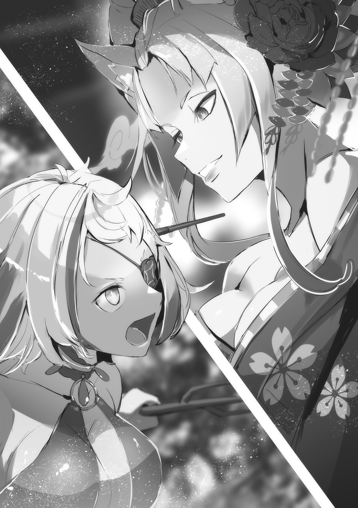

— На этот раз я приношу глубочайшие извинения за неудобства, причинённые моей оплошностью! — сказав это, юноша едва не ударился лбом о стол перед собой — нет, он действительно ударился с такой силой, что по залу разнёсся глухой звук, — и, низко поклонившись, извинился за свою ошибку.

Смуглая кожа, зелёные волосы, волевое лицо с сильным взглядом. Каковы бы ни были причины, привёдшие к извинениям, все с облегчением вздохнули, увидев его целым и невредимым.

Ведь…

— Когда из кокона потекла какая-то жижа, я запаниковал! Если бы он так и не затвердел, я бы волновался, сможем ли мы вообще сработаться!

Сесилус весело рассмеялся, вспоминая недавние события, и высказал совершенно неуместное замечание.

Действительно, из-за ситуации с коконом в форте на некоторое время воцарился хаос. Гоз чуть не лишил жизни перспективного Генерала Империи и теперь сильно стыдился своей нелояльности к Императору.

К счастью, в глубине кокона, залитого вязкой жидкостью, упомянутый юноша оказался цел.

— Итак, для уточнения: ты — Кафма Ирулюкс, верно?

— Так точно! Я — Генерал Второго ранга Кафма Ирулюкс! Я не только проглядел крайнюю нелояльность моего рода Его Превосходительству Императору, но и чуть не упустил дарованный мне шанс реабилитироваться… Стыжусь своей недостойности!

— Ух ты, какой серьёзный парень. Мне с такими немного трудно. Аня, что думаешь?

— Умри.

Сесилус поинтересовался мнением Аракии, сидевшей рядом, по поводу Кафмы Ирулюкса, который громко каялся в своих проступках. И получил ожидаемый ответ.

Проигнорировав Сесилуса, который надул губы из-за их обычной перепалки, Гоз громко воскликнул: «Довольно!» Он топнул ногой по полу зала и, положив свою огромную руку на плечо Кафмы, сказал:

— Подними голову, Генерал Второго ранга Кафма! Я не знаком с обычаями народа «Клетки Насекомых», но слышал, что ты принял новое насекомое. Зная тебя, это наверняка было сделано ради того, чтобы смыть позор с твоего рода.

— Генерал Первого ранга Гоз, но я…

— Твоя решимость и преданность Его Превосходительству Императору не вызывают сомнений. Не только я, но и Генералы Первого ранга Сесилус и Аракия признают это. Верно?

Успокоив упирающегося Кафму, Гоз обернулся и попросил подтверждения у Аракии и остальных.

Но Аракия не смогла ответить должным образом. Она впервые видела Кафму и не могла дать ответ, которого ждал Гоз. Тем не менее, она чувствовала, что должна что-то сказать.

— …

— Ну и ну, твоя немногословность никуда не делась. Если ты так себя ведёшь, когда меня или Чиши нет рядом, то окружающим можно только посочувствовать.

Сесилус, глядя на Аракию, которая не могла подобрать слов, беззаботно рассмеялся. Затем он легкомысленно хлопнул в ладоши: «Ага-ага, несомненно!»

— Как и сказал товарищ Гоз, усилия мистера Кафмы заслуживают уважения. Мне бы такое и в голову не пришло. Помещать в своё тело насекомое — вот это поступок!

— …Это оскорбление нас, народа «Клетки Насекомых»?

— Ой-ой?! Я же вроде как хвалил от всей души!

Кафма нахмурился, пытаясь понять истинные намерения Сесилуса. Встретив его подозрительный взгляд, Сесилус поднял руки и замотал головой.

— Не пойми меня неправильно. Пути к вершине силы у всех разные, есть свои сильные и слабые стороны, свои школы. Я — мечник-самоучка, но если путь народа «Клетки Насекомых» — это сосуществование с насекомыми, то нет ничего плохого в том, чтобы развивать силу в этом направлении. Я считаю, что в способах тренировки нет благородных или низких.

— Это… Прошу прощения. Я отнёсся слишком предвзято.

— Ничего страшного. Сесилус всегда говорит так, будто издевается.

— Согласна.

— Ой-ой-ой? Я вроде говорил серьёзно, а союзников нет?

Получив удар в спину от Гоза и Аракии, Сесилус сделал обиженное лицо. Но Аракия считала саму мысль о том, что она может быть его союзником, оскорбительной.

Аракия никогда не станет союзником Сесилуса. Даже если бы шла великая война, и Сесилус подставил бы свою беззащитную спину…

— Не колеблясь бы ударила меня. Ну, даже если бы такой шанс представился, пока ты не можешь им воспользоваться, это пустые разговоры… всё равно что торговать шкурой неубитого дракона.

— Слишком много слов.

— Тогда попробуй заставить меня замолчать?

Получив провокационную улыбку, Аракия сдержала раздражение и отвела взгляд. Краем глаза она увидела, как Сесилус сунул руки в рукава и расслаблено пожал плечами.

Её настроение становилось всё хуже и хуже.

— Итак, — прервал их Гоз, откашлявшись и возвращая разговор в нужное русло.

Гоз потёр своё испещрённое шрамами суровое лицо и посмотрел на Кафму сверху вниз. Тот выпрямился и с напряжённым лицом ответил:

— Слушаюсь. В чем дело, Генерал Первого ранга Гоз?

— Ты понимаешь, почему тебя вызвали сюда, на восточный фронт?

— …В коконе я смутно слышал об этом.

— Надо же, даже будучи жидкой кашицей, можно всё слышать, — прошептал Сесилус Аракии, прикрыв рот рукой. Проигнорировав его, Аракия наблюдала за происходящим.

Гоз, скрестив могучие руки на груди, тяжело кивнул на ответ Кафмы: «Хм».

— Раз слышал, дело пойдёт быстрее. Цель этой экспедиции — подавление восстания Йорны Миссигр, что базируется в Хаосфлейме. И в зависимости от того, как ты себя проявишь…

— Решится судьба вакантного места «Девятого», так?

— Верно. Я рекомендовал Его Превосходительству тебя как подходящего кандидата.

Гоз выпятил грудь в золотых латах, словно гордясь Кафмой вместо него самого.

Рекомендация действующего «Божественного Генерала» Гоза была, несомненно, желанной поддержкой для того, кто стремился занять вакантное место «Девятого».

Однако лицо Кафмы, услышавшего это, не прояснилось, и Аракия вопросительно склонила голову.

— Не хочешь?

— …Нет, это точно не так. Просто есть сомнения, достоин ли я этого.

— Достоин ли…

— Я ещё не искупил вину за то, что мои сородичи подняли мятеж против Его Превосходительства. И после этого стремиться к статусу «Божественного Генерала», — меча Его Превосходительства Императора…

— …Хочешь, но отказываешься?

Аракия не могла понять мыслей Кафмы, опустившего голову, и невольно вмешалась.

Возможно, её сомнение прозвучало в голосе, потому что Кафма напрягся, словно его обвиняли. Но Аракия, не знающая компромиссов, искренне не понимала его колебаний.

Есть желаемое, есть статус, необходимый для его достижения, и есть возможность его получить. Тогда причин не пытаться не было. А если попытаться и потерпеть неудачу…

— Тогда просто умрёшь.

— …Разумеется, я не боюсь смерти. Генерал Первого ранга Аракия, у вас не будет возражений, если я займу вакантное место «Божественного Генерала»?

— …Кто им станет, тот и станет. Мне всё равно.

Получив вопрос о её мнении, Аракия честно ответила.

Действительно, станет ли Кафма «Девятым» или нет, Аракию совершенно не волновало. Разумеется, если бы он претендовал на её место или пытался отобрать место Сесилуса, это было бы другое дело.

— Нынешний состав держится долго, но и в «Девяти Божественных Генералах» бывают замены… Хотя я и не думал, что уйдёт Балрой.

— Господин Балрой был хорошим человеком. Он почти никогда не морщился от моих разговоров. Правда говорят, что хорошие люди умирают первыми.

— Балрой участвовал в заговоре против Его Превосходительства. Его нельзя назвать добрым.

— С точки зрения товарища Гоза, может, и так.

Сесилус, заложив руки за голову, усмехнулся на резкие слова Гоза.

Балрой Темегриф, бывший «Девятый», — человек, задумавший мятеж против Винсента и погибший страшной смертью. Но и Аракия не испытывала к нему неприязни.

Он был разговорчивым, но умел находить подход к разным людям. С немногословной Аракией он держал правильную дистанцию, и, честно говоря, с ним было легко общаться.

Особенно по сравнению с человеком, который обычно совершенно не считался с её чувствами.

Поэтому она была удивлена, когда услышала, что Балрой участвовал в мятеже и погиб.

— Не ожидал, что господин Балрой падёт от руки рыцаря Королевства. Может, если бы я отрубил голову сэру Юлиусу, то господин Балрой обрёл бы покой?

— Голову рыцаря Королевства, говоришь? Вряд ли ты это серьёзно.

— Да-да. Всё равно господин Балрой не обрадовался бы, если бы я принёс голову сэра Юлиуса. А вот если бы голову господина «Святого меча»…

В тот же миг Аракия, Гоз и Кафма инстинктивно напряглись от сигнала тревоги.

Причиной был Сесилус, смотревший в пустоту, и чистое, острое давление меча, исходящее от всего его тела.

Сильнейший мечник Волакии, направивший отголосок своего смертоносного намерения на кого-то, кого он представлял в пустоте…

— …

Профиль Сесилуса, думающего о противнике за границей, раздражал.

Аракия испытывала непонятный гнев к Сесилусу и этому его «Святому Меча». Ведь именно Аракия должна была убить Сесилуса и забрать его место «Первого».

Было невыносимо, когда он вёл себя так, будто окружающие ему совершенно безразличны.

Как бы то ни было…

— Генерал Второго ранга Кафма, я понимаю твои сомнения насчёт того, что это слишком большая ответственность. Но возможности не ждут, пока мы будем готовы. Такова жизнь.

— …Я понимаю, Генерал Первого ранга Гоз. Имеются ли другие кандидаты?

— …Есть ещё один, в том же положении, что и ты. Его рекомендовал Канцлер Беллстетз.

Кафма с подозрением отнёсся к тяжёлому ответу Гоза, скрестившего могучие руки перед грудью. Вероятно, его смутило то, что кандидата рекомендовал не военный, а гражданский чиновник — Канцлер.

— Он уже значительно опоздал к назначенному времени встречи. Его Превосходительство снисходителен к тем, кто демонстрирует способности, но я не так великодушен, как Его Превосходительство. Нужно как можно скорее избавить Его Превосходительство от этой заботы.

— Ну-ну, разве в Волакии не принято говорить: «Победителей не судят»? Непунктуальность — это такой милый недостаток, который потом вспоминается с улыбкой.

— Тогда, если оба покажут результат, ценить следует того, кто соблюдает время, верно?

— Товарищ Гоз, ты мастер аллегорий.

Сесилус капитулировал перед остротой языка Гоза, недовольного другим кандидатом.

Вероятно, он и не собирался всерьёз обсуждать чужую карьеру. Быстро отказавшись от защиты, Сесилус посмотрел в окно зала и больше не высказывал своего мнения.

Увидев это, Аракия снова взглянула на Кафму.

— Так что, решишь?

— …Решить, что?

— «Божественным Генералом» станешь? Не станешь?

Как и Сесилуса, Аракию в конечном счёте не интересовала карьера Кафмы.

Однако, поскольку командиром операции был Гоз, выбор Кафмы повлиял бы на его планы. Поэтому лучше было решить всё как можно скорее.

Идти на компромисс, когда есть желаемое. Такой мысли она не разделяла ни на йоту, но…

— Делай как хочешь.

— …А. Аня, Аня, можно на секунду?

— …Нельзя.

Тут Аракию, понукавшую Кафму к решению, позвал неугомонный голос Сесилуса.

Хотелось бы проигнорировать, но она знала, что этот человек будет звать, пока не получит ответа. Поэтому Аракия неохотно обратила внимание на Сесилуса.

Сам же Сесилус, подперев щеку рукой на столе, указывал свободной рукой в окно.

— С неба приближается стая воздушных драконов, их ведь рубить нельзя, верно? — беспечно сообщил он о чрезвычайной ситуации.

— …

— Ух ты, сколько враждебности. Такого количества воздушных драконов и в Мезорейе нечасто увидишь.

— Заткнись, умри.

Находясь в эпицентре золотых свирепых глаз, направленных со всех сторон, Сесилус и Аракия разговаривали как ни в чем не бывало.

С другой стороны, напряжение солдат форта, державших руки на оружии и наблюдавших за ситуацией издалека, росло с каждой секундой. Жители Империи не понаслышке знали о свирепости воздушных драконов.

Иногда случались так называемые «Драконьи Бедствия», когда целые поселения уничтожались воздушными драконами во время их брачного сезона.

И вот теперь внезапно появилась стая из более чем тридцати драконов. Их настороженность была понятна.

— Спокойно! Это не враги! Это союзники! — громко крикнул Гоз, выступая вперёд и сдерживая солдат.

Стая воздушных драконов бесцеремонно расселась во внутреннем дворе форта, на смотровых башнях и внешних стенах. В гнетущей атмосфере их дикой мощи из центра стаи вышла одна девочка.

Медленно спустившись со спины одного из драконов на землю, девочка…

— …Мэделин Эшарт, значит. Я слышал о тебе.

— …Рассказ от Дракона?

— Дракона?…

На мгновение Гоз не понял смысла ответа и нахмурился.

Девочка, ответившая Гозу, была ему едва по пояс. На вид она была юной и милой. Но во взгляде, которым она смотрела снизу вверх на гиганта Гоза, не было ни капли робости.

Лишь намерение оценить Гоза как «живое существо».

С другой стороны, Гоз так же оценивал девочку. То, что она была не просто юной девой, какой казалась на вид, он понял по тому, как она командовала множеством воздушных драконов.

Вряд ли это была просто девчушка, которую воздушные драконы полюбили без причины. Доказательством тому…

— Не может быть, эти рога… неужели, человек-дракон?

— …Да.

— Значит, выжившие люди-драконы всё же были!…

Гоз поразился, услышав подтверждение факта, о котором он догадался по двум чёрным рогам на её голове. Однако его удивление не разделили двое «Божественных Генералов», склонившие головы позади.

Зато удивление Гоза разделил Кафма, осматривавший стаю драконов.

— Генерал Первого ранга Гоз, человек-дракон… это правда?

— По крайней мере, она сама так говорит… Раса, считавшаяся вымершей, но я слышал, что люди-драконы могли общаться с земными драконами, водными драконами и воздушными драконами.

— Общаться с воздушными драконами… трудно поверить.

— Но как ты объяснишь то, что перед нами?

Гоз кивком указал на драконов Кафме, потерявшему дар речи.

Воздушные драконы, отдыхавшие в форте, сдерживали свою свирепость и спокойно ждали. Даже используя «Управление воздушными драконами», можно было общаться только с одним драконом на человека. Следовательно, секрет Мэделин, командующей таким количеством драконов, нельзя было объяснить «Управлением воздушными драконами».

Тогда личность девочки — нет, Мэделин Эшарт — становилась очевидной.

— Откуда только Канцлер Беллстетз нашёл такую девочку?…

Произнеся это с трепетом, Гоз стиснул зубы, поражаясь бездонным связям Беллстетза.

Как и сообщил Беллстетз на недавнем Совете, у Мэделин не было ни записей о службе, ни чего-либо, подтверждающего её происхождение. Но поверить в то, что он просто нашёл талант в глуши, было невозможно.

Люди-драконы были настолько особенными существами. Откуда же тогда взялось это сокровище?

— …! Генерал Первого ранга Гоз!

В тот момент, когда Гоз об этом подумал, ситуация изменилась.

Кафма рядом с ним вытаращил глаза и вытянул вперёд руку с татуировками, характерными для народа «Клетки Насекомых». На конце этой руки виднелась Мэделин выхватила из сумки за спиной Летающее Крылатое Лезвие.

Слишком большое для её тела, Летающее Крылатое Лезвие своим острым лезвием было приставлено к толстой шее Гоза. Затем Мэделин посмотрела на него снизу вверх глазами того же цвета, что и доспехи Гоза.

— Не оскорбляй Дракона. Твой взгляд — оскорбление для Дракона.

— …

Голос был полон гнева. Похоже, она угадала его мысли по взгляду и выражению лица.

Гордые люди-драконы никогда не прощают оскорблений или презрения. Они готовы пожертвовать жизнью, чтобы смыть позор. Именно такой образ жизни, как говорили, и привёл их расу к гибели.

Впрочем, люди-драконы до своего исчезновения успели уничтожить более десятка других рас. Возможно, раз Мэделин здесь, то и люди-драконы не совсем вымерли.

Однако их выживание, похоже, зависело от действий Мэделин здесь и сейчас.

— …Не делай глупостей. Я тоже ещё не настолько привык к новой силе, чтобы проявлять снисхождение.

На тихое предупреждение Кафмы Мэделин мельком взглянула на свою шею.

По белой шее девушки ползли зелёные шипы, выросшие из руки Кафмы. Плети шипов, которые он испускал и в состоянии кокона, обвились вокруг шеи Мэделин.

Эти шипы, похоже, и были силой нового насекомого, которое Кафма принял, став коконом. Однако, как он сам и сказал, контроль над дрожащими шипами был ещё далёк от совершенства.

— …!!!

К тому же, воздушные драконы, видя угрозу своей принцессе, тоже начали волноваться.

Когда драконы, окружившие форт, зашевелились и начали издавать свирепый рык, напряжение среди солдат, которых успокоил Гоз, снова возросло, и воздух наполнился предчувствием схватки.

«Так дело не пойдёт. Вместо захвата Города Демонов начнётся междоусобица. Нужно было успокоить ситуацию, пока не стало слишком поздно», — подумал Гоз.

И тут…

— Ну-ну, господа, успокойтесь. Товарищ Гоз ведь в затруднении, — сказав это, фигура, ступившая вперёд в дзори, одним своим присутствием поглотила напряжённую атмосферу форта.

Юноша в кимоно, стоявший спокойно, — Сесилус — выглядел так же, как и раньше. Единственное отличие заключалось в том, что он положил руку на рукоять меча.

Лишь этого простого действия было достаточно, чтобы Сесилус Сегмунт подчинил себе всю атмосферу форта.

— …!

Мэделин вытаращила глаза на приближение мечника.

Её взгляд был прикован к Сесилусу, который неторопливо шёл к ней — сильнее, чем к шипам, непосредственно угрожавшим её жизни, сильнее, чем к Гозу, оскорбившему гордость людей-драконов. Она застыла на месте.

То же самое произошло и с Кафмой, который почувствовал страх, исходящий от его шипов, и со стаей драконов, которые внезапно замолчали и прижали крылья к телам.

Молодой герой народа «Клетки Насекомых», выжившая человек-дракон, даже свирепые повелители небес — перед лицом стихийного бедствия им оставалось лишь защищаться и молиться о спасении.

Значит, Сесилус и был стихийным бедствием.

Ходячее стихийное бедствие, прозванное «Синей Молнией», — таков был мечник Сесилус Сегмунт.

— Чт-то т-ты такое, ты… — пискнула Мэделин, переходя на свой диалект.

— Даття? Ты сейчас сказала «даття»? Это Драконий акцент?

— Таких, как ты, не должно быть!! — снова перешла на диалект девочка.

Вскрикнув высоким голосом, Мэделин отпрыгнула назад. Кафма, убрав шипы с её белой шеи и втянув насекомое внутрь, затаив дыхание смотрел на Сесилуса.

Сесилус, собрав на себе взгляды обоих — нет, всего форта, — склонил голову.

— Хм, мне нравится быть в центре внимания, но это немного не то направление, которого я хотел бы?

— Твои жалобы я выслушаю потом лично. К счастью, горячие головы, похоже, остыли.

Похлопав недовольного Сесилуса по плечу в знак признательности, Гоз посмотрел на Мэделин, сузившую зрачки. Она всем телом выражала настороженность к Сесилусу, но отреагировала на взгляд Гоза.

— Если мой взгляд был невежлив, прошу прощения, Мэделин Эшарт.

— …Не подпускай это чудовище к Дракону.

— Понял.

Гоз с готовностью кивнул на требование Мэделин, посмотревшей на Сесилуса.

Сесилус, часто создававший проблемы, на этот раз своим присутствием сыграл на руку. То, что он пригодился не только в бою на поле брани, было для Гоза редким опытом.

— Хотя бывают и случаи, когда из-за присутствия Сесилуса всё усложняется…

— Эй-эй, если хвалишь, то хвали до конца, товарищ Гоз! Если не похвалишь как следует, я тоже обижусь! Слишком строго — нельзя, абсолютно… Аня?!

— Одно твоё присутствие — помеха…

Аракия схватила за шиворот Сесилуса, который тут же пытался свести на нет свою пользу, и оттащила его назад. Воспользовавшись её действием, Гоз упёр руки в бока и посмотрел на Мэделин.

Показав, что её требование выполнено, он кивнул подбородком на окружение.

— Тогда успокой драконов. Солдаты форта не могут опустить оружие. Хотелось бы избежать дальнейших ненужных стычек между своими. Ты ведь понимаешь?

— …Поняла.

Кивнув, Мэделин глазами подала знак окружающим драконам. Она не обращалась к ним голосом и не управляла сигналами, а общалась взглядом.

Увидев, как естественно она это делает, Гоз легко признал её настоящим человеком-драконом. На его взгляд Мэделин прищурилась: «Что?»

— Твой взгляд на Дракона — невежлив.

— Прошу прощения. И мы ещё не поздоровались. Я — Гоз Ральфон, командир, которому Его Превосходительство Император приказал захватить Город Демонов, базируясь в этом форте.

— …Дракон — Мэделин Эшарт.

— Да, я знаю. Об остальных… расскажу позже.

Раз уж Аракия убрала нарушителя спокойствия, не стоило ворошить присутствие Сесилуса и вызывать недовольство Мэделин.

Гоз изменил позицию, чтобы заслонить Мэделин, которая то и дело поглядывала на Сесилуса.

— Итак, почему ты опоздала? Армия — это когда множество солдат и офицеров действуют как единый организм. Если кто-то нарушает строй, тело перестаёт функционировать.

— …

— Руки, ноги, хвост и крылья не должны действовать самовольно. Понятно?

Говоря это, Гоз указал на всё тело Мэделин — на части тела, отличные от чёрных рогов, свидетельствующих о её человека-драконьей природе, — на маленькие крылья, выросшие на спине.

Он старался объяснить понятно, но и его здравый смысл был сформирован в имперской армии. Он понимал, что это не единственная истина. Но раз Мэделин командует стаей драконов, она должна понимать важность коллективных действий.

И действительно, Мэделин коротко кивнула на объяснение Гоза.

— Хм. Хорошо, если поняла. Тогда спрошу ещё раз. Где ты была? Если ты просто заблудилась…

— …Дракон был в Городе Демонов.

— …Что?

Было бы хорошо, если бы она просто плохо ориентировалась на местности и задержалась.

Но ответ оказался неожиданным, и Гоз, не веря своим ушам, посмотрел на Мэделин, которая повторила своё объяснение.

— Дракон был в Городе Демонов. Та женщина велела передать кое-что.

— …

На мгновение Гоз растерялся, не зная, стоит ли ругать Мэделин.

Но сейчас приоритетом было не исправление её представлений о здравом смысле или самовольные действия в обход плана операции. Важнее всего была информация, которую она принесла.

Услышав «та женщина», Гоз сразу догадался, о ком идёт речь. Поэтому…

— Рассказывай. Что эта сука-лиса велела тебе передать?

— …Жизнь солдат форта, сбежавших.

— …

— Пока она не заберёт жизни всех сбежавших солдат форта, она не остановится.

Гоз прищурился, услышав бесстрастные слова Мэделин, и поднёс руку ко рту. Ощущая ладонью свои усы, он молча размышлял.

— Солдаты форта… Неужели, Генерал Первого ранга Гоз?!

— Я знаю. Я сомневался, с какой целью она начала этот мятеж, но…

Тихо ответил Гоз Кафме, который повысил голос, услышав тот же доклад.

Йорна Миссигр, перебившая солдат форта и нарушившая спокойствие правления Императора Винсента. Что она задумала, начиная мятеж, и чем собирается его завершить?

Часть ответа принесла сама Мэделин, но…

— …Прежде чем штурмовать Город Демонов, нужно запросить указания у Его Превосходительства.

С горечью подумал Гоз, глядя на виднеющийся вдалеке Город Демонов.

— …Жизнь солдат форта, значит.

— Это неприемлемо, иначе и не скажешь. Такое требование даже требованием назвать нельзя.

Информация, доставленная из форта на передовой у Города Демонов, тихо всколыхнула и столичный Хрустальный Дворец.

Винсент, сидевший за столом в скромном кабинете, отвёл взгляд от сурового лица Гоза, видневшегося в зеркале, и задумался.

Вместо него к зеркалу обратился и заговорил с Гозом присутствовавший Чиша Голд.

Советник Императора, мужчина во всем белом, поглаживая свой острый подбородок, сказал:

— Почитание сильных — обычай Империи… Но нельзя допускать, чтобы любой безрассудный произвол исполнялся по прихоти. Во-первых, если следовать этой логике…

— «Тогда все мои желания должны исполняться, иначе это несправедливо!»

— …

— Гоз, заставь этого глупца замолчать. Он мешает обсуждению.

Вместо замолчавшего Чиши Винсент отдал указание в зеркало. В ответ послышалось тяжёлое «Слушаюсь», а затем легкомысленный голос удалился.

«Зеркальце Переговоров» — незаменимый «Метеор» для связи на расстоянии, но у него был один недостаток: оно позволяло общаться с этим большим дураком, которого только что прогнали.

Как бы то ни было…

— …Считать требование Генерала Первого ранга Йорны пустой болтовней и отмахиваться от него было бы несколько преждевременно.

— Ого, ты так настойчив, хоть это и информация, принесённая той, кого ты рекомендовал.

— В данном случае важнее источник, а не тот, кто принёс. Конечно, я не отрицаю некоторой предвзятости как рекомендатель.

— Хм. И правильнее было бы сказать не «принесла», а «заставили принести».

Хмыкнув, Беллстетз склонил голову перед острым взглядом Винсента, его морщинистое лицо не дрогнуло.

В одной из комнат Хрустального Дворца собрались Канцлер, Советник и Император. Достаточно представительная компания, чтобы проанализировать информацию, полученную через «Зеркальце Переговоров», и сообщить группе, штурмующей Город Демонов, дальнейший план действий.

На повестке дня, разумеется, истинные намерения Йорны Миссигр, использовавшей Мэделин Эшарт в качестве гонца.

— Счесть это простым отвлекающим манёвром и отмахнуться смехом было бы трудно. Ведь если бы не самовольные действия госпожи Мэделин, это требование так и не было бы передано.

— Как сказать. Война — это когда, начиная её, уже продумываешь и то, как её закончить. Хоть я и мало знаю о мятежах, возможно, это касается и их? То есть…

— С самого начала планировала представить это как условие для прекращения войны, значит.

Собравшись втроём, они пытались разгадать истинные намерения Йорны, предъявившей столь ясное требование.

Разумеется, всегда оставался худший вариант — бездумные действия наобум, но Винсент и остальные не придавали этой вероятности большого значения.

Даже среди «Девяти Божественных Генералов», избираемых по силе, у каждого были свои замыслы и планы для их осуществления — таково было их общее мнение.

Исключением, пожалуй, был лишь «Первый», Сесилус Сегмунт.

Проблема была в другом…

— …Почему она так зациклилась на жизнях солдат форта?

Решающее начало этого мятежа и требование, выдвинутое как условие его завершения, — солдаты и офицеры форта. Но они были выбраны не просто как жертва для провокации Винсента или столицы.

Была причина, почему именно они. Таков был ход рассуждений.

— Груви Гамлет, отправленный на запад…

— Сообщает о наличии очага восстания на месте. Он не может действовать.

— Ольбарт Дарккенн, отсутствовавший на Совете…

— Говорит, что борется с эпидемией в деревне. Заявил, что и сам уже стар, но работает усерднее меня, хоть и на двадцать лет старше. Не могу же я требовать от него невозможного.

— Форт находится в непосредственной близости от Города Демонов —Хаосфлейма, которым правит Йорна Миссигр?

— Да. Это край земли, куда предпочитают переселяться немногие полулюди и племена Империи. И при этом никаких проблем, кроме самой госпожи Йорны, там не возникает, так что это место можно назвать аномальным.

— В форте погибло триста солдат, пропало без вести более десяти.

— Ужасающая картина, от которой хочется отвести глаза. Говорят, всем до единого аккуратно размозжили головы. …Ваше Превосходительство?

Винсент, равнодушно хватая информацию, необходимую для размышлений, погрузился в редкую для него долгую задумчивость.

Впрочем, «долгая задумчивость» для Винсента длилась менее десяти секунд.

Для мозга Императора, мгновенно находящего наилучшее решение в любой ситуации, десять секунд размышлений были редкостью.

И вот…

— …Найти выжившего человека-дракона — это надо же умудриться.

На неожиданно брошенную тему лицо Беллстетза не дрогнуло. Седовласый старик покачал головой: «Нет-нет».

— Назначение и поиск труднодоступных талантов — необходимый элемент процветания Империи. Ваш покорный слуга лишь рад, что смог порекомендовать Вашему Превосходительству такого человека и тем самым выполнить часть своих обязанностей Канцлера.

— Хм, хитро говоришь. Но на этот раз придётся тебе послужить мне.

— Как прикажете.

Продемонстрировав почти фальшивую преданность, Беллстетз низко поклонился. Проводив его взглядом, Винсент позвал свою правую руку: «Чиша».

— Слушаюсь. В чем дело, Ваше Превосходительство?

— Отправляйся на место. Чего я хочу, ты уже и сам догадался.

— Это тоже чрезмерная оценка. Если бы вы отдали чёткий приказ, я бы избавился от лишних сомнений.

— Стоит показать тебе снисхождение, как ты тут же этим воспользуешься. Помучайся немного угрызениями совести.

Просьба осталась без ответа, и Чиша картинно закрыл лицо руками, показывая, что его надежда рухнула. Разумеется, Винсент не собирался менять своё мнение, и Его Величество Император даже не взглянул на разочарование своей правой руки.

Вместо этого Винсент снова обратил внимание на «Зеркальце Переговоров».

— Ты всё слышал. Ваши задачи не изменились. Захватите Город Демонов и покажите Йорне Миссигр, что она зарвалась.

— Так точно! Слушаюсь! …И ещё, Ваше Превосходительство.

— Что?

По ту сторону «Зеркальца Переговоров» Гоз, ответивший бравым голосом, сник. Винсент нахмурился на его вид, а Гоз, выпятив свою могучую грудь, сказал:

— Прошу прощения за дерзость, но прошу уделить толику времени. Генерал Второго ранга Кафма Ирулюкс просит удостоить его личной беседы с Вашим Превосходительством.

— Кафма Ирулюкс? Хорошо. Подведи его к зеркалу.

— Слушаюсь, немедленно!

И в это время…

— Да-да-да! Ваше Превосходительство, Ваше Превосходительство! Хотел только одно спросить!

Вместо Гоза появилось лицо Сесилуса, которого только что выставили.

Сильнейший мечник Волакии, не рассчитавший расстояние до «Зеркальца Переговоров» и заполнивший собой весь экран, обращался к Императору с полным пренебрежением к субординации.

— Если бы нашёлся кто-то, кто смог бы отрубить тебе голову, я бы приказал казнить тебя за непочтение.

— Опять говорите то, чего не можете сделать! Так вот, я хотел спросить: скоро, думаю, предстоит прямое столкновение с госпожой Йорной, может, передать ей пару слов?

— …

— Видите ли, госпожа Йорна ведь так хочет вашего внимания! Может, это её последний шанс в жизни, так что было бы здорово услышать слово, которое позволит нам сойтись в битве без сожалений.

Сесилус, просивший слова Императора по причине, совершенно отличной от обычной заботы, — это было так непохоже на только что прозвучавшую почтительную речь Гоза, что Винсент едва не рассмеялся.

Разумеется, он лишь едва не рассмеялся, и никто не увидел, как его губы дрогнули в улыбке.

— Есть слова, которые нужно передать. Слушай внимательно и исполни роль гонца.

— Да-да, положитесь на меня! Какая роскошь, какая роскошь, я прямо как гонец Его Величества Императора.

— Не путай. Как закончишь с обязанностями гонца, немедленно возвращайся к своей основной роли. Ты…

— …Меч Вашего Превосходительства. Разумеется, я это понимаю.

Человек, обычно отчаянно непонятливый, только в таких ситуациях проявлял сообразительность — как же работал его мозг? Чтобы разобраться в этом, у Винсента, к несчастью, было слишком много дел.

Под взглядами Советника и Канцлера Винсент торжественно подобрал слова.

Слова, которые он произнесёт, должны быть краткими, предельно ясными по смыслу и полными презрения к образу жизни упомянутой мятежницы…

— Доставь мои слова вместе с клинком. В этом и заключается смысл, который должен нести мой Меч.

Битва началась, и молния пронеслась по полю боя — городу.

Город Демонов Хаосфлейм, где смешалось множество полулюдей, который также насмешливо называли «Городом Хаоса».

Беспорядочно возведённые здания без единого стиля, хаотично надстроенные помосты и сооружения — город действительно заслуживал своего названия «Хаос», будучи воплощением причудливости.

Даже если не интересоваться городским пейзажем, его неоднородность на мгновение захватывала взгляд. Но это внимание быстро рассеивалось из-за шума тени, бегущей внизу.

— Ура, всё-таки быть первым — это здорово! Нельзя упустить шанс скрестить мечи с другим «Божественным Генералом»! Ах, возня с Аней — это отдельная категория!

— Умри.

Сесилус, отталкиваясь от земли подошвами дзори, с рёвом рассекал ветер, и его нескончаемая болтовня растворялась в городском шуме. Аракия, не отставая от него, хмурила свои изящные брови и отвечала тем же.

Может показаться, что разговор шёл обманчиво неспешно, но оба были высшей боевой силой Империи, и события, произошедшие вокруг них за это время, были поистине выдающимися.

— Ой, простите, господа статисты! Главная цель впереди, так что разделаюсь с вами мимоходом!

С этими словами, сопровождаемыми непонятной для обычного человека логикой, сверкнул удар меча.

Молния, опережающая даже моргание, последовательно поражала фигуры, пытавшиеся преградить путь, и никто не успевал не то что коснуться её, но даже уследить за остаточным свечением, как разлетались брызги крови.

А те, кому посчастливилось не оказаться на пути молнии…

— Мешаешь.

С кратким словом обрушились огненные шары, сжигая одного за другим врагов, которых не достал меч.

Сделала это «Пожирательница Духов», летевшая, не взмахивая крыльями, как птица или дракон, а окутав свои ноги пламенем.

Там, где проходили Сесилус и Аракия, двое «Божественных Генералов», врагов не оставалось. Они с ужасающей скоростью преодолевали улицы Города Демонов.

Однако…

— Так здорово снова сразиться с госпожой Йорной, но то, что Аня висит на мне довеском, — это как-то не радует!

— Это мои слова.

— Товарищ Гоз нам совсем не доверяет. Если госпожа Йорна по ошибке уйдёт в другую сторону, я вообще не пойму, зачем мы сюда пришли!

Аракия вздохнула, подстраиваясь под Сесилуса в их перепалке, лишённой всякого намёка на координацию.

То, что Аракия сопровождала Сесилуса, было результатом подчинения командиру Гозу. Честно говоря, у Аракии не было головы для тактики, так что возражений, кроме эмоциональных, у неё не возникало.

Как бы то ни было, если это была операция ради победы, она неохотно, но согласилась присматривать за Сесилусом. В идеале, если бы победа была достигнута так, чтобы Сесилус расстроился, — было бы очень хорошо.

Для этого проще всего было бы, если бы они просто промахнулись…

— …Как вы тут суетливо резвитесь, не так ли?

Ноги Сесилуса, который только что пересёк главные ворота города и мчался по главной улице, остановились.

Голос принадлежал женщине в ярком кимоно, стоявшей посреди улицы и смотревшей на них. С первого взгляда Аракия поняла, что это сильный противник.

— Это…

— Да, это она, Аня. — Привет-привет! Давно не виделись, госпожа Йорна!

Аракия контролировала своё положение в воздухе, оставаясь с ногами в огне. Сесилус шагнул вперёд перед парящей девушкой и широко помахал рукой женщине, преградившей им путь, — Йорне Миссигр.

На энергичное приветствие Сесилуса Йорна качнула кисэру в руке.

— Как всегда, громкий мужчина. Снова вас прислали, сударь, значит, вы очень нравитесь Его Превосходительству.

— Его Превосходительство — меня? Нет-нет, этого не может быть. Он не смотрит на вещи с точки зрения «нравится — не нравится». Поэтому он вечно хмурый! Самый настоящий страдалец!

Сесилус приложил палец ко лбу и заговорил первое, что пришло в голову. Йорна прищурилась.

С точки зрения Аракии, это были пустые оскорбления, но Йорна восприняла ответ серьёзно и мельком взглянула на Аракию, словно ожидая её мнения, что немного смутило.

— С вами, госпожа, мы встречаемся впервые, верно? Обо мне вы?…

— Слышала. Аракия. Приятно познакомиться.

— Коротко, но вежливо. Весьма любезно с вашей стороны.

Йорна взмахнула рукой, запахивая рукава кимоно, и изящно присела на одно колено, поклонившись. Вежливому приветствию — учтивый приём. Затем она продолжила:

— Та девочка-дракон, что показалась недавно, передала моё послание?

— Послание…

— А, да-да, слышали! То, что мисс Мэделин рассказала, верно? Товарищ Гоз должным образом запросил указания у Его Превосходительства!

Сесилус ударил себя в грудь и уверенно ответил на вопрос Йорны. Услышав его ответ, Йорна дрогнула бровью, и в её взгляде мелькнула тень эмоции.

Аракии показалось, что это был отблеск надежды. Если так, то Йорну ждало разочарование.

Почему же?

— Каков был ответ Его Превосходительства?

— Речь шла о жизнях солдат форта, верно? Кхм. — «Не стоит и рассматривать. За глупые желания — платить собственной кровью». Примерно так. Похоже было?

Откашлявшись, Сесилус спародировал Императора Винсента. Это было верхом бесстрашия, но пародия была совершенно непохожей. Сомнительно, что он вообще старался изобразить его.

Аракия ошеломленно смотрела на это безобразие, а Йорна, чья надежда была разрушена, тихо вздохнула.

— Тогда мой ответ прост и ясен… Кровью и заплатят. Кровью тех, кого я люблю, пролитой кровью, в тысячу раз большей кровью.

— Ой, кажется, я её разозлил. Аня, думаешь, это моя вина?

— В большинстве случаев, виноваты Его Превосходительство и Сесилус.

Аракия почувствовала, как воздух вокруг начал накаляться, и крепче сжала длинную деревянную ветку в руке.

Тихое нарастание боевого духа. Увидев, как Йорна медленно качает головой, Сесилус сказал: «Вот незадача», — и вытащил меч с бледно-голубым клинком.

— Ну, мы и так собирались сразиться, так что считай, что сэкономили время! Итак, госпожа Йорна, я ваш противник! — «Синяя Молния», Сесилус Сегмунт.

— «Пожирательница Духов», Аракия.

Сесилус наклонился вперёд, а Аракия усилила пламя, окутывающее её ноги.

Йорна, встретив их боевой дух лицом к лицу, улыбнулась без тени страха.

— «Ярчайшая» Йорна Миссигр. Что ж, постарайтесь развлечь меня как следует.

Звуки ожесточённой схватки, доносившиеся из центра города, сообщили Гозу о начале полномасштабного сражения.

Значит, Йорна всё же вышла к главным воротам. В этом решении не было ничего удивительного. Разумеется, если бы она направилась сюда, он, как один из «Девяти Божественных Генералов», встретил бы её во всеоружии.

— Похоже, Сесилус и Генерал Первого ранга Аракия столкнулись с Йорной Миссигр.

— Хм, правда? Как вы это…

— Прислушайся, и услышишь. Слышны звуки битвы.

Кафма, бежавший рядом с Гозом, удивлённо посмотрел на него. Он приложил руку к уху и прислушался, как сказал Гоз, но…

— Вы услышали? В этой суматохе боя?

— У звуков тоже есть свои особенности. Хоть это и не вяжется с моей внешностью, я увлекаюсь музыкой.

Хотя ему часто говорили, что это ему не идёт, Гоз любил музыку. Ему нравилось и слушать, и играть. С женой он познакомился на концерте. Музыка обогащала жизнь Гоза. Поэтому и на поле боя звук помогал ему.

То, что он родился с более чутким слухом, чем у обычных людей, было одним из немногих сокровищ Гоза.

— Однако, город оказался более неприятным, чем я слышал.

— Да, я тоже так думаю.

Разговаривая, Гоз и Кафма во главе отряда имперских солдат продвигались по Городу Демонов. Хаосфлейм, куда они ворвались через задние ворота, сбивал с толку захватчиков своей причудливой структурой.

Вероятно, у создателей не было никакого намерения помешать им. Просто город был слеплен из случайных идей и настроений каждого дня.

И жители этого города, кипящего хаосом, тоже были под стать ему.

— О-о-о-о-о!! — с рёвом бросился на них житель Города Демонов, почти без оружия.

Люди без доспехов, но с силой духа и энтузиазмом, не уступающими регулярным войскам. И то, что это было не просто безрассудство, а реальная сила, поддерживалось…

— …Тайным искусством, которым управляет Генерал Первого ранга Йорна.

— Подробности техники мне неизвестны, но жители Города Демонов обладают необычайной силой. Поэтому…

Срезав слова, Гоз кивком указал вперёд, где отряд вооружённых солдат принял на себя лобовую атаку бегущих жителей. Нет, попытался принять.

— Уа-а-а-а-а-а?!

В следующий миг житель Города Демонов с горящим красным пламенем в одном глазу разметал пятерых солдат, выставивших большой щит.

Последующие солдаты тоже не смогли остановить его неудержимый натиск. И такие сцены разворачивались повсюду, где наступали имперские войска.

— Вот причина, по которой Город Демонов считается неприступным!…

— Да, верно. Хоть и есть некоторые индивидуальные различия, считай, что каждый житель Хаосфлейма равен десяти солдатам Империи. Поэтому и нужна моя сила, сила Генерала Второго ранга Кафмы, твоя сила.

— …

Кафма стиснул зубы и с опаской погладил свою татуированную руку. Заметив в этом жесте смутное беспокойство, Гоз спросил: «Боишься?»

Услышав это, Кафма вскинул голову.

— Страха нет!

— Но тогда почему ты обратился к Его Превосходительству? Говорил, что недостоин звания «Божественного Генерала».

— Это…

Кафма замолчал, и его серьёзное лицо скривилось.

Перед началом битвы Кафма, поговорив с Винсентом через «Зеркальце Переговоров», отказался от предложения о повышении до «Божественного Генерала», которое получил по рекомендации Гоза.

Конечно, Гоз чувствовал, что его опозорили как рекомендателя. Но он требовал от Кафмы не извинений. И Кафма это понимал.

Нужны были не слова извинения, а истинные причины, побудившие Кафму принять такое решение.

— Я лишь подумал, что так будет лучше для Его Превосходительства… и, следовательно, для Империи Волакия. В решающий момент Генерал, не способный функционировать должным образом, вряд ли сможет выполнить волю Его Превосходительства.

— …Значит, ты не собираешься стремиться к большему?

— Нет, это касается только меня нынешнего, недостойного.

Взгляд Кафмы, исполненный решимости, прямо встретился с серьёзным лицом Гоза.

Честный Второй Генерал Кафма Ирулюкс, отказавшийся от почётного звания «Божественного Генерала» и опозоривший Гоза Ральфона.

Такова была его решимость.

Если Гоз, занимающий пост Генерала Первого ранга, не признает этого, его авторитет будет подорван.

— Генерал Второго ранга Кафма, ради чего ты сражаешься?

— …Без колебаний, ради Священной Империи Волакия и ради Его Превосходительства Императора, правящего ею!

На гордое заявление Кафмы Гоз рассмеялся: «Фу-ха-ха-ха!»

— Тогда расправь грудь, Генерал Второго ранга Кафма! Лишь совершив подвиг, который убедит и тебя, и окружающих, ты оправдаешь и моё лицо, рекомендовавшего тебя на место «Девятого»!

— Так точно! Непременно!

На его спине появились прозрачные крылья, и его крепкое тело взмыло высоко в небо.

Проводив его взглядом, Гоз поднял своё оружие — золотую булаву — и смело вступил на поле боя. Он будет бушевать, демонстрируя мощь Его Превосходительства Императора, и пошумит как следует.

Остальное…

— …Поступайте по усмотрению Его Превосходительства. Каким бы ни был исход, если такова воля Его Превосходительства, мы, солдаты и Генералы, последуем ей, рискуя жизнью.

Мэделин Эшарт потянула носом, ощущая едкий, обжигающий запах битвы. Город Демонов, виднеющийся вдалеке, стал полем сражения. Льётся кровь, напрасно гибнут жизни.

Но в этом не было ничего необычного. Жизни обрываются повсюду, кровь льётся везде. Даже в этом форте, где осталась Мэделин.

— …

Форт был пропитан густым запахом крови.

Похоже, он подвергся жестокой атаке, само здание форта было полуразрушено. Собравшиеся солдаты выступили, оставшихся было минимальное количество. Вероятно, это здание скоро бросят.

Может, сровнять его с землёй для снятия стресса? Такая мысль мелькнула, но…

— Не делай глупостей. Дракон должен вести себя достойно.

Укорив себя, она успокоила разбушевавшиеся эмоции.

Нельзя поддаваться чувствам, буянить, кусать или нападать на кого-то. Не то чтобы это было плохо само по себе, но ей сказали, что в мире людей это не приветствуется.

Она не собиралась заискивать перед людьми, но связываться с этими многочисленными существами было бы хлопотно.

К тому же…

— …Никто не говорил, что бывают такие люди.

Пробормотала Мэделин, и в её памяти всплыл образ синеволосого мужчины с мечом у пояса.

Он вёл себя легкомысленно и постоянно улыбался, но Мэделин с первого взгляда поняла, что этот человек — чудовище, вышедшее за рамки обычного.

Его легкомыслие, наверняка, было лишь маской.

Это было неприятное чувство, которое Мэделин, потомок людей-драконов, не должна была испытывать.

Дракон должен быть всегда могучим, величественным, царить над всеми живыми существами. А она испугалась какого-то человека.

— Это потому, что Дракон ещё маленький.

Мэделин посмотрела на свою руку и с горечью прошептала.

Если бы она могла использовать истинную силу человека-дракона, ей не пришлось бы бояться какого-то человека. Но Мэделин была ещё юна и неопытна как человек-дракон. Из-за этого она опозорила честь своей расы.

Чтобы смыть это унижение, ей придётся когда-нибудь встретиться с этим мечником лицом к лицу…

— …Ха-ха, понятно. Действительно, внешний вид говорит сам за себя. И крылья на спине имеются, это меня впечатлило.

— Кьяу!

Мэделин, задумавшись и прислонившись к разрушенной стене форта, подпрыгнула от неожиданности. Её лицо помрачнело, потому что голос, раздавшийся сзади, заставил её издать неприятный писк.

Бесцеремонно затронув тему её крыльев, Мэделин посмотрела на мужчину, который был значительно выше её.

— Бесцеремонно оцениваешь крылья Дракона? Не смей зазнаваться, человечишка.

— Ох-ох, прошу прощения за грубость, приношу свои извинения. Похоже, моё низменное любопытство взяло верх.

Мужчина с ярко выраженной белизной во внешности поклонился и ответил Мэделин.

Вернее, это был человек, у которого не было ничего, кроме белого. Волосы белые, лицо белое, одежда и обувь — всё белое, словно он намеренно избавился от своего «цвета».

Мужчина в сияющих золотых доспехах сказал, что его можно узнать с первого взгляда, и действительно, внешность была узнаваемой. Несомненно, это был тот, с кем Мэделин должна была встретиться в форте.

— …

Мэделин прищурилась, ощущая раздражение от его спокойного тона.

Снова человек с непоколебимой смелостью перед ней. Хозяйка сияющего каменного замка, мужчина в золотых доспехах, встреченный в форте, пахнущий лесом мужчина, полуголая женщина — все они были такими же.

Даже если не считать того ненормального мечника, вокруг было полно неприятных ей людей.

Некоторые Драконы назвали бы их героями. Но Мэделин была не настолько стара. Она верила, что Драконов должны бояться и уважать.

Поэтому…

— Ты, сядь там.

— …Сядь? Какая странная просьба. Почему я должен делать что-то подобное?

— Просто сядь. Не можешь послушаться Дракона?

Мэделин указала пальцем на голую землю и властно приказала.

Мужчина на мгновение заколебался, а затем послушно опустился на одно колено. Наконец-то оказавшись выше противника, Мэделин скрестила руки на груди и гордо выпрямилась.

— Не смей говорить с Драконом сверху вниз. Ты и другие не понимаете величия Дракона.

— …Кстати, кого вы имеете в виду под «другими»?

— Тех, кто был в этом форте. Мужчину в золотых доспехах, полуголую женщину. И того мечника.

— Какие знакомые лица. Но то, что мне приходится за них расплачиваться, — это просто злой рок, не иначе… Впрочем.

— …?

Мужчина прервал свою речь, заинтриговав Мэделин, которая нахмурилась.

Тогда мужчина, стоя на коленях, посмотрел на Мэделин, и его жёлтые глаза, единственное цветное пятно на его белом лице, дрогнули.

— По какой-то причине расхлёбывать чужие проблемы, похоже, и есть моя работа. И по поводу вашего гнева, возможно, мне и следует ответить.

— …

Мужчина смотрел прямо в глаза Мэделин, но его дух совершенно не преклонялся, и Мэделин поняла, что физическое превосходство бессмысленно.

В отличие от людей-драконов, люди — лжецы. Они могут спокойно преклонять колени перед кем-то, не испытывая при этом искренней преданности.

— …Хватит. Встань.

— Ого, вы уже успокоились?

— Я поняла, что заставлять тебя сидеть бессмысленно. Величие Дракона я покажу тебе потом.

— Был бы весьма признателен. Ах да, я не представился.

Получив разрешение Мэделин, мужчина встал, отряхнул колени и снова поклонился. Даже этот жест раздражал, но гордость не позволяла нападать на того, кто проявляет вежливость.

Мужчина посмотрел на Мэделин сверху вниз и, загадочно улыбнувшись, представился.

— Меня зовут Чиша Голд. По приказу мудрого и высокомерного Его Превосходительства Императора я прибыл сюда издалека. Прошу любить и жаловать.

— Поняла. Дракон не представляется.

— Было бы неприятно, если бы мы были незнакомы, но я о вас наслышан, госпожа Мэделин. Итак, с чего начнём? Времени, похоже, осталось немного.

Белый мужчина — Чиша — огляделся по сторонам и фальшиво спросил. Мэделин хмыкнула на его слова и указала на свой нос. Именно поэтому её и отослали с поля боя, оставив здесь.

Поэтому…

— Используй нос этого Дракона. Я покажу тебе, что мы созданы иначе, чем вы.

Мэделин, повинуясь гордости людей-драконов, сверкнула острыми клыками и уверенно заявила это.

— «Говорят, она не остановится, пока не истребит всех солдат форта. Я передал Сесилусу, чтобы он ответил ей, что за это придётся заплатить кровью, но ты и сам знаешь, что делать».

Стоит ли считать приказ лететь на место происшествия знаком доверия? Или же следует сетовать на несправедливое давление со стороны властителя, которому невозможно перечить? Трудно было решить.

Посоветоваться по этому вопросу было не с кем, ведь он достиг такого положения, где вышестоящих начальников уже не было. Учитывая, что он не стремился к этому положению, чувствовалась какая-то удушающая несвобода.

Как бы то ни было, полученное положение налагало ответственность. Необходимую работу нужно было выполнять.

По крайней мере, такова была профессиональная этика Чиши Голда.

— И всё же, ситуация несколько щекотливая, не так ли?

— …? Ты что-то сказал Дракону?

— Нет, это я так, про себя. Не обращайте на меня внимания.

Чиша пожал узкими плечами и ответил. Мэделин коротко бросила: «Понятно» — и, опустившись на четвереньки, снова принялась принюхиваться, выслеживая запах.

«Такое рвение в работе стоило бы перенять многим «Божественным Генералам». Но со стороны это выглядело ужасно», — подумал Чиша.

Ведь получалось, что он заставлял юную на вид Мэделин ползать по земле и нюхать её, а сам следовал за ней.

Люди-драконы горды и не прощают тех, кто пятнает их честь. Такое впечатление сложилось при первой встрече, но теперь всё резко изменилось.

Мэделин, которая обижалась, когда на её рога и крылья смотрели с любопытством, похоже, не считала унизительным ползать по земле на глазах у других.

Вероятно, это было связано с различиями в восприятии между людьми-драконами и людьми. Благодаря этому поиски проходили гладко, если не считать того, что Чише приходилось закрывать глаза на свою всё возрастающую плохую репутацию.

— Если бы здесь был Груви, то и эта плохая репутация забылась бы… Его Превосходительство, до чего же злой человек. Не думаю, что он специально спланировал эту экспедицию ради этого, но…

Один из «Девяти Божественных Генералов», гиеночеловек Груви Гамлет, обладал нюхом, превосходящим даже других зверолюдей. Ходили не смешные шутки о том, что от его носа не скрыться, даже если убежать на другой конец Империи.

И Чиша знал, что это было не совсем шуткой.

— Чтобы он не распознал подмену меня и Его Превосходительства, нужно было бы приложить все сто процентов усилий.

Для Чиши, который в случае необходимости исполнял роль двойника Винсента, нюх Груви мог стать решающим фактором при подмене.

Недаром Винсент назначил его одним из первых в «Девяти Божественных Генералах», помимо тех, кого он с самого начала считал своими пешками, вроде Чиши и Сесилуса.

Сможет ли Мэделин заменить Груви? Чиша несколько скептически относился к её способностям. Одной лишь редкости — быть человеком-драконом — недостаточно для выполнения роли «Божественного Генерала».

Сейчас Чиша и Мэделин выслеживали выживших после нападения Йорны Миссигр на форт, который был практически уничтожен.

Однако искали они не тех, кто сообщил об уничтожении форта извне, а тех десятерых с лишним пропавших без вести, кто действительно мог спастись из этого ада, — выживших.

— Форт полностью уничтожен, триста с лишним солдат перебиты, гласит донесение. Однако…

Между военным термином «полное уничтожение» и его общепринятым значением существовала разница.

В армии «полное уничтожение» означало состояние, когда дальнейшее ведение боевых действий невозможно. Определение этого состояния варьировалось в разных странах, но в Империи Волакия полное уничтожение объявлялось, если погибало девяносто из ста человек.

То есть…

— Десять человек выжили. Ты и самый главный мужчина на земле так думаете.

Мэделин, принюхиваясь и следуя по запаху, подхватила последнюю мысль Чиши. Услышав её слова, Чиша приложил палец к подбородку: «Пожалуй, да».

— Учитывая ужасающее состояние форта и то, что противником была Генерал Первого ранга Йорна, я предполагаю, что их будет меньше, но кто-то должен был остаться. К тому же…

— К тому же?

— Генерал Первого ранга Йорна, как ни странно, имеет привычку ослаблять последний удар. Ведь она даже отпустила госпожу Мэделин, поручив ей передать послание.

— М-меня не отпустили! — пискнула Мэделин, снова переходя на диалект.

— Что?

Чиша склонил голову набок, услышав изменение в речи Мэделин, которая выглядела взволнованной. Но Мэделин быстро взяла себя в руки и, сверкнув острыми клыками во рту, сказала:

— Не лезь не в своё дело. Заглядывать под чешую Дракона — только сокращать себе жизнь.

— Что ж, приму ваш совет к сведению… Хоть я и прекрасно понимаю смысл этого совета, могу я кое-что спросить?

— …

Мэделин отвернулась и возобновила поиски на четвереньках. Воспользовавшись тем, что она не отвергла его просьбу словами, Чиша задумался: «Итак».

Мэделин Эшарт, рекомендованная Беллстетзом в «Девять Божественных Генералов». Её особенности как человека-дракона и обстоятельства её знакомства с Беллстетзом были неизвестны.

Вообще…

— Госпожа Мэделин, по какой причине вы согласились на эту роль?

— …Услышала просьбу старика. Если выполню её, он станет союзником Дракона.

— Союзником, говорите? Канцлер Беллстетз?

— Так его звали? Если это второй по важности мужчина на земле, то да.

Если Императора называть самым главным мужчиной на земле, то считать Канцлера Империи вторым по важности — по крайней мере, в Империи Волакия — не было бы ошибкой.

Хотя «Девять Божественных Генералов» и обладали властью, сравнимой с Канцлером в военных делах, но поскольку «Первым» был Сесилус, их авторитет был подорван.

Тем более, никто не считал Сесилуса вторым по важности человеком в Империи.

— «А? Я — важный? Перестань, Чиша. Думаешь, я придаю значение таким званиям, как “важный” или “не важный”? Статус Генерала Первого ранга я получил просто потому, что сильный, мне его просто дали. Вообще, важные люди не подходят на роль главного героя. Скорее, на роль тех, кого рубят!» — Ясно представился ответ самого Сесилуса в голове.

Десять лет знакомства давали о себе знать — воспроизведение было излишне точным, что вызывало у Чиши отвращение.

— Но старик сказал правду.

Пока Чиша размышлял, Мэделин неожиданно пробормотала это. Чиша поднял бровь на её бормотание, а Мэделин, не поворачиваясь, потянула носом.

— Кровь Дракона редка. Те, кого встречаешь на земле, будут смотреть на Дракона с любопытством. Будут расспрашивать, чтобы узнать побольше, но мне велели не злиться и не откусывать им головы.

— Понятно. Я бы тоже предпочёл, чтобы мне не откусывали голову.

— У тебя ещё есть вопросы к Дракону?

— Хм, пожалуй.

Раз уж Мэделин упомянула наставления Беллстетза и его предупреждение, она давала понять, что не намерена отвечать на дальнейшие вопросы, и требовала от Чиши определиться.

Чиша, в свою очередь, не получал от Винсента приказа разузнавать о ней. Поэтому он мог бы спокойно отказаться от возможности задать вопросы.

Однако…

— Да, у меня ещё есть вопросы. Я, знаете ли, на удивление беспокойный человек, и чтобы успокоить своё маленькое сердце, считаю, что чем больше знаний, тем лучше.

— Хитро говоришь. Не беспокой Дракона глупыми вопросами.

— Разумеется. Ваше происхождение, полученное образование, состав семьи, убеждения, любимые книги, стиль боя, образ жизни людей-драконов, поселение людей-драконов, что любите, что ненавидите, справедливость, отвращение, количество приёмов пищи в день, продолжительность сна, любимая еда, ведущая рука, ведущий глаз, сова вы или жаворонок, и многое другое.

— …

— Но если выбирать из всего этого самый важный вопрос…

Мэделин остановилась и посмотрела на Чишу, перечислявшего интересующую его информацию, как на ненормального. Это было довольно обидно, но и ожидаемо. Он продолжил, обращаясь к Мэделин, в чьих золотых глазах застыло отвращение.

Застыло, и…

— …Кто дал вам ваше имя?

— …А?

— Ваше имя. Мэделин Эшарт, ваше имя.

Это было настолько неожиданно, что глаза Мэделин широко распахнулись от замешательства и удивления.

Реакция была по-детски непосредственной. Беллстетз, вероятно, рассчитывал предотвратить утечку информации, настроив её против окружающих и поддерживая в неведении.

Действительно, Чиша и не надеялся получить ценную информацию.

Просто…

— Говорят, что вымершие люди-драконы жили вместе с Драконами. Я слышал, что некоторые Драконы могут понимать речь. Возможно, и имя госпожи Мэделин было дано Драконом? Таково было моё нескромное предположение…

— …Нет. — пискнула она снова со своим акцентом.

— Хм?

— Имя Дракона дала Дракону его семья.

Мэделин прижала маленькую руку к груди и ответила так, словно хранила тайну.

Мягкий оттенок её голоса и хрупкость, с которой она произнесла эти слова, заставили Чишу прищуриться и легко поверить, что это не ложь. Скорее всего, она вообще не умела лгать.

Ложь — оружие слабых, невидимые когти и клыки для противостояния сильным.

У неё, сильной, обладающей видимыми когтями и клыками, потомка людей-драконов, не было причин лгать.

— …

Размышляя так, Чиша в то же время с отвращением осознавал, что трезво просчитывает: имя Мэделин — это одно, а вот фамилию Эшарт можно проверить и, возможно, что-то найти.

Однако по её голосу и профилю он понял, что «семья», которую представляла Мэделин, была для неё действительно чем-то незаменимым. В этом отношении между людьми и людьми-драконами не было разницы. Нет…

— …Поэтому Дракон и пришёл на землю.

Тихо добавленные слова несли в себе холодный жар, в который посторонним не было доступа.

Услышав это, Чиша снова пришёл к выводу, что люди и люди-драконы ничем не отличаются.

Какая бы кровь ни текла в жилах, какой бы жизненный путь ни был пройден, суть «мстителя» всегда одна.

Неугасимая ненависть, поселившаяся в глазах Мэделин, дала Чише это понять.

— …Пришли, — сказала Мэделин, которая до этого была на четвереньках, поднимаясь. Отряхнув руки от земли, она кивком указала на вход в горную тропу, ведущую вглубь густого леса.

Оглядевшись, Чиша увидел, что это была неудобная местность вдали от людских поселений.

— Запах человека, которого я учуяла в форте, смешан с запахом крови. Те, кого ищем, — здесь.

— Хм, понятно. Но в горах будет непросто. У меня не очень крепкие ноги.

— Дракона это не волнует. Тогда сдаёшься?

— Нет-нет. Просто, раз уж это заброшенная гора с неровной землёй и деревьями, никому не нужная… было бы очень полезно, если бы госпожа Мэделин выкурила оттуда искомых людей.

— …Выкурить.

Если искомые люди прячутся в горах, придётся устраивать облаву.

К несчастью, в этой миссии у Чиши не было других помощников, кроме Мэделин. Хотелось бы посетовать на суровые условия труда, но большая часть персонала была задействована в захвате Города Демонов, так что требовать невозможного было нельзя.

В таком случае, Чише оставалось лишь напрячь свой скромный ум и найти наилучшее решение.

Единственный союзник — Мэделин — с помощью своих превосходных чувств обнаружила место укрытия искомых людей. Теперь самым быстрым способом было бы использовать её преимущества, чтобы выкурить их из леса.

Получив такую просьбу от Чиши…

— …Методы Дракона — грубые.

Золотые глаза девочки сверкнули, когда она повернулась к Чише, и её губы изогнулись в полумесяц.

В тот же миг, словно привлечённый улыбкой девочки, сверху донёсся звук мощных взмахов крыльев. Множество крыльев, наслаивающихся друг на друга, — это был звук ветра, создаваемого крыльями, превосходящий все слухи.

Стая из более чем тридцати воздушных драконов опустилась вокруг Мэделин.

— Охота Дракона — свирепая. Потом не жалуйся.

Мэделин погладила шею одного из драконов, приземлившегося рядом, и предупредила Чишу. Встретив сдерживающий взгляд дракона, Чиша кивнул: «Да».

Затем он шагнул вперёд, встал рядом с Мэделин и повернулся к лесу.

— Неизвестно, насколько были осведомлены солдаты форта, но те, кто сбежал от Генерала Первого ранга Йорны и укрылся в лесу, вряд ли невиновны. Поэтому…

— …?

Чиша прервал свою речь и закрыл глаза. Затем глубоко вдохнул…

— …Эй, имперские солдаты, что прячутся в горах!! Если в вас есть хоть капля гордости Волков-Мечей, выйдите сюда и дайте объяснения!!

— …

Громкий голос Чиши, от которого задрожал воздух, разнёсся далеко по горам.

Это была не милость или снисхождение, а необходимый ритуал. Дать возможность объясниться — значит предоставить солдатам шанс оправдаться, защитить свою честь.

Стоило ли предоставлять им такой шанс? Весы внутри Чиши не склонялись ни в одну сторону. Но у него были свои предположения о том, что произошло в том форте и что привело к мятежу Йорны.

Если его предположения верны, то милосердие им не понадобится.

— Госпожа Мэделин, подождём один коку. Если после этого движения не будет, я поручу дальнейшее вам.

Слушая эхо своего голоса в горах, Чиша присел в тени ближайшего дерева. Мэделин, наблюдая за ним, тихо вздохнула.

— Люди такие медлительные… Спрошу одно.

— Всё, что угодно.

— …Что такое «один коку»?

Вопрос Мэделин, нахмурившей брови, заставил и приземлившихся драконов синхронно склонить головы.

Наблюдая за тем, как девочка командует драконами, Чиша в то же время потёр переносицу, размышляя о безжалостном принуждении к неведению со стороны Беллстетза.

Один коку. Чтобы объяснить это Мэделин, не потребовалось бы и одного коку.

И ровно через один коку стая драконов нападёт на гору, где прячутся трусы.

Там они познают свирепость воздушных драконов и ужас человека-дракона. Тем, кто предал свою гордость, железный и кровавый закон никогда не прощает.

Коку (刻): Старая японская единица времени. Её продолжительность варьировалась, но часто она равнялась примерно двум современным часам. Однако в фэнтези и историческом контексте часто используется для обозначения неопределённого, но короткого промежутка времени. В данном контексте Чиша даёт им небольшой, но ограниченный срок для ответа.

Изящная рука взметнулась, белые пальцы рассекли воздух. Движение, отточенное, как в танце, вызвало, однако, невероятное явление, похожее на сон или иллюзию.

— Танцуйте, — произнесла Йорна.

Улицы подпрыгнули, словно живые, здания сорвались с фундаментов и заскользили в хаотичном движении.

— Пойте.

Бесчисленные помосты, опутавшие город, потеряли опору и посыпались вниз, но, освободившись от оков простого падения, начали свободно парить в воздухе.

— Разбивайтесь.

Кирпичные здания, разноцветные витражи, даже посаженные деревья и цветы — все исказило свою изначальную природу и начало буйствовать, меняясь по своему усмотрению.

Прямо посреди широкой главной улицы Йорна, танцуя с кисэру в руке, преобразила всё вокруг: городские пейзажи изменили форму, здания и помосты взлетели в воздух, деревья и цветы встали на дыбы, словно солдаты.

— Это…

— Ух ты, как всегда, непонятно, что происходит, и от этого жутко! Но в то же время это комплексное искусство, от которого невозможно оторвать глаз! Поистине великолепно!

Аракия не могла не удивиться, увидев эту жуткую картину. Но, заметив обычное поведение Сесилуса рядом, она быстро подавила своё волнение.

«Ярчайшая» Йорна Миссигр — было ясно, что она грозный противник.

— К тому же, странные техники, как у дедушки тоже.

Вспомнив знакомого человека, Аракия подавила своё удивление. Сесилус, мельком взглянув на пришедшую в себя Аракию, шагнул вперёд… и исчез.

— …!

И в следующий миг исчезнувший Сесилус появился прямо перед Йорной.

Меч, выхваченный со скоростью молнии, проскользнул сквозь множество возникших препятствий и достиг её тонкой шеи, намереваясь разрубить её надвое.

Однако…

— Ай, как всегда, шея защищена крепко.

— А вы, сударь, как всегда, используете те же приёмы. Разве вы не усвоили из нашей предыдущей встречи, что мою шею вам не взять?

— Нет, я сегодняшний отличаюсь от меня предыдущего. Расти каждую секунду, а не только каждый день, — это привилегия главного героя. Более того, с каждым выходом на сцену мужественность только растёт!

— Какой вы болтливый кавалер.

Лезвие Сесилуса коснулось её шеи, но шея Йорны осталась цела, не было даже царапины. Лишь лёгкая красная полоска свидетельствовала об ударе. Сесилус говорил, что раньше не смог её убить. Это было буквально так.

— Ш-ш-ш.

В следующий миг Йорна отбила меч своей кисэру и, развернувшись, ударила Сесилуса локтем.

Сесилус мгновенно отступил, уклоняясь, но бесчисленные кирпичи — обломки разрушающегося дома — словно стрелы устремились за его остаточным изображением, впиваясь в него.

Кирпичи, не попавшие в цель, пробили в земле огромные дыры, создавая картину разрушения, словно после ураганного обстрела. И летящие обломки, начавшиеся с кирпичей, были лишь началом.

— Ого, а вот это уже становится довольно зрелищно!

— Раз уж представился шанс развлечь сильнейшего в Империи, я тоже не собираюсь сдерживаться.

На Сесилуса, посмотревшего вверх, обрушились бесчисленные помосты, опутавшие город.

Каждый из них — огромная масса весом в несколько тонн — падал, чтобы раздавить одного лишь Сесилуса, не щадя облика города.

Падали, падали, падали…

— Та-та-та-та-та!!

От этого ливня гигантских атак Сесилус уклонился не осторожностью, а дерзким ускорением.

Земля дрожала при каждом падении помоста, и молния пронеслась по хаотично движущимся обломкам. Пока Сесилус участвовал в этой смертельно опасной гонке…

— Я тоже здесь.

Аракия взмахнула веткой в руке, ощущая в теле последний жар поглощённых малых духов.

Способность «Пожирательницы Духов» проявлялась за счёт сжигания жизней поглощённых духов. Малые духи, поглощённые для битвы с Йорной, — их последний блеск высвободился здесь. Чтобы разом захватить неприступный Город Демонов вместе с его хозяйкой.

В тот же миг вокруг Аракии вспыхнуло пламя, поглотившее сотни метров.

— …Это.

Йорна удивлённо подняла бровь, опалённая жаром и скоростью распространения пламени.

Обычно огонь распространяется постепенно, увеличивая площадь горения, но пламя Аракии не горело так медленно.

Это был метод, при котором она, поглотив малых огненных духов и накопив их силу, принудительно воспламеняла всех других малых духов в пределах досягаемости, сжигая их разом.

Быстрое распространение огня, огромная разрушительная сила, и сама Аракия, превратившаяся в пламя, нацеливалась на врага.

Таков был стиль боя Аракии, когда она поглощала малых огненных духов…

— Я и не собиралась недооценивать тебя как простую девчонку, но…

— Много сжигать, умею.

Внутри ревущего пламени, освещающего всё вокруг красным, в глазах Йорны появился настороженный блеск. Встретив этот взгляд, Аракия не почувствовала ответа на свой огненный взрыв.

Город, вещи — всё горело, но палящий жар пламени не достигал Йорны. Как лезвие Сесилуса не смогло отрубить ей шею, отскочив от её белой кожи, так и пламя…

— Аня! Эй! Я же тоже сейчас поджарюсь?!

— …Заодно.

— А-а-а, ну почему ты такая непонятливая! Как же это раздражает!

Сесилус, бежавший в том же пламени, взмахнул мечом и одним махом разрубил здание перед собой. Запрыгнув на срез, он взбежал вверх, спасаясь от огня, пожирающего землю, и взмыл в небо над городом.

Затем он ринулся в самый центр урагана из падающих помостов и обломков зданий, и его удары меча засверкали, как молнии.

В тот же миг все предметы были изрублены и обезврежены. Тем временем Аракия, превратившаяся в пламя, тоже приблизилась к Йорне и нанесла удар ногой огромной огненной мощи.

— …!

Пламя, изогнувшееся дугой, увеличило длину ноги Аракии и пронеслось по городу, словно слизывая его. Пылающий удар, сжигая всё на своём пути — задетые здания, деревья, — превращал Город Демонов в ад.

Однако…

— Никого нет?

Глядя на сожжённый пейзаж Города Демонов, Аракия почувствовала, что не было ни одной жертвы.

Окружающие малые духи тоже не ощутили никаких изменений в количестве жизней. Вокруг, кроме Йорны, действительно никого не было в пределах досягаемости Аракии и Сесилуса.

Это означало, что жители города полностью доверяли Йорне и верили, что она сможет в одиночку отразить врага, который наверняка придёт с фронта.

— Я знала, что вы придёте с фронта. Тогда детям лучше поручить тыл. Одного или двух «Божественных Генералов» я и одна удержу.

— Какая уверенность.

— Это моя гордость. А твои глаза, госпожа, колеблются.

Толстый каблук, прорвавшийся сквозь завесу пламени, пронзил грудь Аракии, не имеющую физического тела. Развевающиеся полы кимоно рассекли пламя по диагонали, и ответный удар разрубил Аракию по вертикали.

Разумеется, Аракии, слившейся с пламенем, физические атаки были нипочем. Даже если пронзить пламя мечом, убить его невозможно. Но…

— Я, колеблюсь?

— С такой силой в Волакии принято делать то, что хочется… но ты, госпожа, кажется, не получаешь от этого удовольствия. Более того…

— …

— Ты словно не понимаешь, почему ты здесь.

Шаг Йорны расколол дорогу, и удар ладони снизу вверх стёр лицо Аракии. Рассеянное пламя собралось снова, и исчезнувшая голова быстро восстановилась.

Однако слова ранили грудь Аракии сильнее кулака.

Слова Йорны, словно видящие её насквозь, заставили сердце Аракии затрепетать…

— Перестаньте, госпожа Йорна. У Ани сердце сразу начинает трепетать.

Тут в разговор вмешался голос Сесилуса, и его скользящая подошва дзори мягко коснулась груди Йорны снизу. Затем Сесилус сказал: «Вот» — и, напрягши колени, легко подбросил высокое тело Йорны вверх, пнув её в небо с бешеной силой.

И вслед за ней прыгнул Сесилус, обрушив на Йорну свои неотразимые удары меча. Безжалостные удары меча. Йорна принимала их на все свои жизненно важные точки, но…

— Необучаемый кавалер.

— Ух ты, и это не сработало! Я думал, с помощью «Божественной Защиты Духов Земли» или чего-то подобного вы и проворачиваете этот фокус и, оторвав вас от земли, я рассчитывал, что удар пройдёт.

— …Удивлена, что у вас есть желание учиться.

— Конечно, искать шанс на победу, постепенно продвигаясь, — это тоже удовольствие. Сражаться бездумно — я же не Аня.

Молниеносный удар Сесилуса взревел, и Йорна, не сумев его остановить, приняла удар на грудь. Однако её пышная грудь оттолкнула остроту меча, и ответный удар Сесилус отразил ножнами.

Ножны затрещали от удара кулаком, и тело Сесилуса стремительно пронеслось по красному небу.

— Сесилус!

Проводив взглядом улетающего Сесилуса, Аракия тут же повернулась к Йорне. Но её шею схватила протянувшаяся рука. Это была вернувшаяся Йорна, сделавшая рывок в воздухе.

Своими белыми пальцами она схватила тонкую шею Аракии, шею, которая не должна была иметь физического тела.

— Акх…

— Из-за колебаний, вероятно. Образ размылся, и стало возможно схватить тело. Зачем ты сражаешься, госпожа?

— …

— Я сражаюсь ради любви. А ты, госпожа, по какой причине сжигаешь город?

Если то, что человек несёт в себе, напрямую связано с его силой, то сила Йорны была подкреплена именно этим.

Услышав этот вопрос, Аракия, хватая ртом воздух, вспомнила иллюзию далёкого дня — своё самое дорогое существо.

Всегда, везде, суть Аракии оставалась неизменной. Но можно ли тогда сказать, что то, что Аракия сжигает город, — это тоже ради неё?

— …Поэтому я и говорю, госпожа Йорна, не заставляйте Аню думать.

Вспышка. Удар меча, пронёсшийся перед глазами, отрубил руку Йорны, державшую шею Аракии.

Как и шея, рука не была отрублена. Но глухой звук нанёс Йорне болезненный удар по руке, и хватка ослабла. В этот момент тело Аракии было унесено.

Обхватив её за талию и отступив назад, Аракия увидела, что спас её Сесилус с досадно невозмутимым лицом.

Обнимать Аракию, всё ещё слитую с пламенем, — всё равно что обнимать само пламя, но он сохранял невозмутимое выражение лица.

— …Больше всего я не понимаю таких кавалеров, как вы.

— А? Неужели я такой непонятный? Я горжусь тем, что Его Превосходительство и Чиша считают меня трудным в обращении, но легко управляемым.

— Рука горит, вам не больно?

Несмотря на звук и запах горящего мяса, улыбка Сесилуса не дрогнула, хотя его рука под кимоно горела. На вопрос Йорны он лишь протянул: «Хм-м», — и, показав свою браваду, сказал:

— Паниковать от боли здесь менее круто, чем дерзко улыбаться, верно?

— …

Источая запах горящей кожи и мяса, такого, что жар, казалось, доходил до костей, Сесилус без стыда и страха, следуя своей философии, заявил это. С улыбкой на лице он нежно погладил по голове Аракию в своих объятиях.

— И ещё, прошу вас не внушать Ане лишнего. Я не отрицаю тех, кто придаёт большое значение причинам и смыслу сражения, но…

— Вы считаете, что сильному это не нужно?

— Нет-нет, моя сила и сила других — это разные вещи. Я не хочу, чтобы Аня думала о таких вещах, потому что когда Аня думает, она становится до смешного слабой.

— …!

Услышав такие бесцеремонные слова, Аракия попыталась возразить.

Но голос не слушался. Причина, вероятно, была в отношениях Йорны с жителями города — Йорна одна держала фронт, а жители, доверяя ей, объединились, чтобы защитить то, до чего она не могла дотянуться. Она позавидовала этой крепкой связи.

Не солгать, если сказать, что она вспомнила доверительные отношения, которые когда-то были у неё с её хозяйкой.

Однако…

— Аня, я не говорю не думать. Но всему своё время и место. Станешь ли ты главной героиней или статистом — решать тебе.

— …Смысл, не понимаю.

— Сейчас будь просто одним лишь мечом. Или хозяин твоего сердца хотел, чтобы ты здесь пала?

— …

Сесилус, издавая шипящий звук горящей руки, с ухмылкой спросил это.

Его лицо раздражало, и хотелось по-настоящему поджечь его сгоревшую руку, но она передумала. Очень досадно, но её истинная хозяйка не пожелала бы такого.

К тому же, она не хотела, чтобы Сесилус рассмеялся и сказал: «Я так и знал!»

— Аня, сколько у тебя поглощённых малых духов?

— …Сто двадцать четыре.

— Отлично. Тогда убей госпожу Йорну сто двадцать четыре раза. В этом и заключается смысл существования нас, двух высших из «Девяти Божественных Генералов».

Представив простую причину для сражения, Сесилус вложил свой меч в ножны. Затем он сказал: «Вот» — и, приподняв тело Аракии, встал сзади в позу наблюдателя, засунув руки в сгоревшие рукава.

Увидев все эти действия Сесилуса, Йорна поднесла кисэру ко рту.

— Я думала, вы кавалер, умеющий только убивать…

— Да?

— …Но удивлена, что вы так умело и оживляете.

Йорна прищурилась, выпуская дым. Сесилус поднял бровь. Затем сильнейший человек Империи рассмеялся, откинувшись назад: «Ха-ха-ха».

— В конце концов, я всего лишь мечник. Оживлять людей — такой трюк мне не по силам. Если Аня пришла в себя, то это исключительно благодаря долгому знакомству. И ещё…

— И ещё?

— Серьёзная Аня довольно сильна. Я и сам иногда пугаюсь!

Сесилус, сказавший это с совершенно незлобным лицом, был невыносим. Настолько, что хотелось поджечь не руку, а лицо.

Но она этого не сделала. А если и было что сказать, не делая этого, то…

— Сесилус.

— Да-да.

— …Умри.

— Не можешь просто сказать спасибо.

Все ещё желая ему смерти, Аракия вспыхнула ослепительным светом.

Безрассудный приём — активировать всех поглощённых малых духов внутри тела, не думая о последствиях. Увидев это, Йорна медленно покачала головой.

— Ты тоже сражаешься ради любви, госпожа.

— …Наверное, совсем другое!

Сказала это, мельком взглянув на Сесилуса, поэтому Аракия взревела и бросилась вперёд.

В следующий миг поле боя в Городе Демонов Хаосфлейм накрыли величайшие разрушение и свет.

И затем…

От прямого удара ногой он отлетел и врезался в стену. Тяжёлый ботинок тут же придавил к полу голову мужчины, рухнувшего с мучительным стоном.

Мужчина взвыл — удар выбил ему передние зубы о половицы, он захлёбывался кровью. Услышав этот вопль, его одноглазый обидчик склонил голову и процедил:

— Слабак.

Сцена разыгралась в одной из комнат казармы имперских солдат. Схлестнулись двое, оба — имперские солдаты в стандартной красной форме.

Однако исход был предрешён с самого начала. И дело не в засаде или внезапном нападении. Они одновременно обнажили мечи, но преимущество одного было подавляющим. Разница в мастерстве владения клинком бросалась в глаза.

Среди рядовых и Солдат Первого ранга ему почти не было равных. Такова была сила Джамала.

— Будь он ещё хоть немного поумнее, повышение до Генерала пошло бы как по маслу. — размышлял вслух юноша.

— Заткнись, Тодд! Просто похвали мою силу, как есть.

— Силу-то я твою похвалил. Никто не сомневается в твоём умении владеть мечом. Итак…

Пожав плечами в ответ на недовольный рык, Тодд, которого позвал Джамал, шагнул вперёд.

Он присел на корточки и заглянул в лицо солдату, которого Джамал придавил ногой к полу и который не мог пошевелиться.

Впрочем, заслужит ли этот человек жалости, зависело от его ответов.

— В-вы… вы же оба солдаты регулярной армии, как вы можете…

— Эй-эй, парень, ты же первым меч выхватил, нет? Насколько я видел, Джамал просто ответил на твою атаку. Мне жаль, что тебя так отделали, но… не значит ли это, что наши вопросы пришлись тебе сильно не по душе, а?

— …!

— Эй, не пытайся сбежать. Будешь рыпаться — сделаю тебя таким же, как я, — Джамал указал пальцем на повязку на своём правом глазу.

Угроза была очевидна и подействовала моментально. Солдат побледнел. Вероятно, он решил, что Джамал вполне способен на такое.

Боевой дух пленника заметно угас, и Тодд одобрительно кивнул: «Так-то лучше».

— Тогда продолжим с того же вопроса. Ты ведь из выживших в том форте, который уничтожила Генерал Первого ранга Йорна, верно? Зачем она это сделала?

— П-потому что она спятила! Ты же слышал слухи! Эта женщина и раньше… Гья!

— Она Генерал Первого ранга, уважай! Думаешь, мы в кабаке, а ты мне лучший друг?

Длинный меч в руке Джамала сверкнул, и солдат взвыл от боли — ему отсекли мочку уха. Джамал и сам был мастером грязных словечек, но странным образом оставался щепетилен в вопросах субординации.

Теперь-то этот парень будет осторожнее в высказываниях.

— То, что она спятила, — это понятно. Но вот моя теория: каким бы безумным кто ни казался, он руководствуется своей логикой. Поступки, которые со стороны кажутся бессмысленными, для него самого вполне закономерны. Понимаешь?

— А… а…

— То есть, я предполагаю, что и у нынешнего буйства Генерала Первого ранга Йорны есть своя, понятная ей причина. И если она перебила всех до единого солдат в форте, я подозреваю мотив обиды или мести.

Не просто резня, а тотальное истребление — значит, мотив был глубже.

Начав разбираться, Тодд узнал, что Йорна, по-видимому, требовала выдачи и тех солдат, что сбежали из форта. Император наотрез отказался, что в итоге и привело к вооружённому столкновению в Городе Демонов.

Однако…

— И… и что тебе с того, если ты узнаешь?…

— А? Тебя это не касается…

— Погоди, Джамал. Ничего страшного, если я ему расскажу. Возможно, при определённых условиях я смогу остановить эту войну.

Тодд жестом остановил Джамала и улыбнулся пленнику.

Тот тяжело дышал, борясь с болью в груди и ухе. Он с надеждой посмотрел на Тодда.

— Если причина в обиде, то и извиняться нужно по-разному. Нет ничего хуже извинений, когда сам не понимаешь, за что просишь прощения, — это только злит собеседника. К тому же, мы, возможно, сможем предложить тебе способ спастись, по крайней мере, тебе одному.

— К-как это?…

— Ничего сложного. Если мы поймём ситуацию, доложим начальству. И пока там будут разбираться и пытаться уладить внутренний конфликт, мы закроем глаза на то, что ты скроешься.

Солдат затаил дыхание от предложения Тодда и посмотрел на него испытующе. Его подозрения были напрасны — у Тодда действительно не было никаких других скрытых мотивов.

В конечном счёте, жизнь и судьба этого человека его не интересовали. Интерес Тодда сейчас был сосредоточен на причине мятежа Йорны Миссигр, способах его остановить и получении нужной информации.

А если точнее — на использовании этой информации, чтобы выслужиться и получить признание.

Именно ради этого он пошёл на такой неоправданный риск: разыскал выжившего из форта, устроил так, чтобы можно было поговорить с ним наедине в казарме, убрав всех остальных.

Теперь этот человек должен был принести пользу.

— …Сначала это было просто от скуки, — решив, видимо, что Тодд искренен, мужчина смирился и мало-помалу начал рассказывать.

Это была история о начале нынешних беспорядков, о причине, по которой Йорна истребила солдат форта, и о причине, по которой она требовала головы всех причастных, включая выживших.

Выслушав его, Тодд убедился, что всё оказалось примерно так, как он и предполагал.

Действительно, причиной буйства Йорны Миссигр были обида и праведный гнев.

— В-вот и всё. Ну как, теперь ты доволен? — закончив рассказ, солдат, который к концу говорил всё более возбуждённо, спросил Тодда.

Встретив его взгляд, Тодд погладил подбородок и кивнул:

— Да, доволен. Если рассказать начальству о таких обстоятельствах, они, скорее всего, прислушаются.

— Тогда!…

— Только вот время ты выбрал неудачное, парень.

Глаза солдата изумлённо расширились. Он, видимо, не понял смысла этих слов. Из-за такой непонятливости ему и придётся заплатить своей жизнью.

Следовало заметить раньше.

Заметить, что Джамал, стоявший рядом с Тоддом и слушавший тот же рассказ, смотрел на говорившего взглядом, полным искреннего презрения.

— Я так и думал, что этим кончится, но всё равно — какой позор.

Тодд пожал плечами и встал. У его ног покатилась отрубленная голова солдата. Ничего особенного. Джамал просто взмахнул клинком и одним махом отсёк ему голову.

— Мерзавец. Позорит мундир имперского солдата.

— Как устроено твоё чувство собственного достоинства, мне решительно непонятно.

Тодд склонил голову набок и потянулся.

Этому человеку просто не повезло. Не повезло проболтаться в присутствии Джамала, не повезло, что его местонахождение вообще вычислили Тодд и Джамал.

Не повезло и в том, что из других скрывающихся беглецов, чьи местонахождения они также установили, его было проще всего выманить.

Впрочем…

— Хотя и остальным двоим вряд ли можно позавидовать.

— Да уж, я их на куски порву.

— Стой-стой, прекрати убивать их просто чтобы спустить пар. Их нужно передать начальству, они должны стать нашей заслугой.

На это замечание Джамал скривился. Оттолкнув ладонью его недовольное лицо, Тодд вздохнул, поражаясь безрассудству своего будущего шурина.

Он пошёл на такой несвойственный ему риск — всё ради того, чтобы добиться успеха и вернуться в столицу. Вернуться к любимой женщине, которая ждала его там.

И ради этого…

— Уж с присмотром за таким несносным будущим шурином я как-нибудь справлюсь. А взамен, когда всё закончится, ты, Катя, нежно утешишь меня в своих объятиях, — прошептал он себе под нос.

— Нынешний инцидент начался с того, что солдаты форта замучили до смерти девушку из народа людей-оленей, а затем надругались над её телом. Убийство зверочеловека, находящегося под защитой Города Демонов, — можно представить, как разгневалась хозяйка этого города. Похоже, для них это оказалось полной неожиданностью.

Вернувшийся Чиша доложил об этом прекрасному черноволосому мужчине — Императору Винсенту Волакии, который, выпрямив спину, сидел за столом в своём кабинете, заваленном бумагами. Доложив, Чиша замер в ожидании дальнейших слов.

Он ждал не благодарности за труды, а практических, реалистичных указаний на будущее.

Винсент остановил руку, перебиравшую документы. Не поднимая взгляда, он произнёс:

— Так вот причина истребления солдат в форте. Кто раскололся?

— Трое из разбежавшихся солдат проболтались бойцам из прибывшего отряда. Рядовой Первого ранга, разобравшись в ситуации, задержал их и доложил наверх. Один скончался, двое под стражей.

— Отправить двоих пленных в Город Демонов, к Йорне Миссигр.

Чиша молча повиновался Винсенту, который без малейшего колебания решил судьбу беглецов.

Они были теми, кто спровоцировал нынешний мятеж Йорны. Пусть примут самую ужасную смерть и послужат утешением за кровь, пролитую в этой битве.

От этой кровожадной мысли Чише стало противно самому себе. Ведь он считал себя человеком спокойным и миролюбивым.

Не обращая внимания на внутренние терзания Чиши, Винсент продолжал, не отрывая взгляда от документов:

— Кроме того, разыскать того, кто назначил Генерала форта, и всех его родственников. Приговор будет вынесен позже.

— Принято. Кстати, Ваше Превосходительство, насчёт солдата, поймавшего беглецов…

— Награда полагается по праву. Можешь дать ему ту награду, какую он пожелает.

— Я так и думал, что вы это скажете, поэтому спросил его лично. Разумеется, не в этом обличии.

При этих словах Винсент впервые оторвал взгляд от документов и посмотрел на Чишу.

«Раз уж это вызвало интерес, то хорошо», — подумал Чиша, вспоминая двух солдат, с которыми столкнулся лицом к лицу. Один — грубоватого вида парень с повязкой на глазу, другой — приятный на вид обходительный юноша.

Они заслуживали высокой оценки: по скудной информации вышли на беглецов, поняли, что трусость и предательство тех требуют доклада начальству, и действовали правильно.

Естественно, Чиша подумал о соответствующем вознаграждении, но…

— Он ответил: «Граждане Империи, будьте сильны!».

— …Что?

— Это то, что сказал мне один из тех солдат, когда я спросил, какую награду он хочет. Сказал, что лишь следовал принципам Империи Волакия.

Странно было то, что это заявил именно грубый солдат, который казался даже карьеристом.

Солдат искренне верил в железный закон Империи и ненавидел слабаков, предавших его. Он даже заявил, что награда, запятнанная их кровью, ему не нужна.

Разумеется, у его напарника рядом лицо было таким, будто его вот-вот стошнит от этих слов.

— «Граждане Империи, будьте сильны!», значит. — Закон Волка-Меча, который любой подданный Империи Волакия впитал вместе с молоком матери.

Услышав эти слова снова, произнеся их, Винсент едва заметно прищурился.

Чиша не мог постичь всей глубины замыслов Его Превосходительства Императора, скрытых за этими прищуренными чёрными глазами.

Возможно, к невыраженной словами сути этого закона ближе всего мог подобраться лишь тот мечник, кто руководствуется не логикой и совершенно свободен от чувства ответственности и условностей своего положения.

Как бы то ни было, основные распоряжения касательно этого инцидента, от его начала и до завершения, были отданы. Если оставалось ещё что-то доложить, то… Чиша хлопнул в ладоши: «Ах да».

— Что касается Мэделин Эшарт, которую я сопровождал: её сила и способности безупречны, и она достойна звания Генерала. Однако отсутствие у неё военного опыта и тот факт, что за ней стоит Канцлер Беллстетз, вызывают у меня беспокойство.

— Раз уж Кафма Ирулюкс, которого рекомендовал Гоз, отказался, у нас нет времени пренебрегать человеком со способностями и амбициями. Даже если она связана с Беллстетзом.

— …Я считаю, что нет нужды глотать яд.

— Для этого и существуешь ты, «Девять Божественных Генералов» и я.

С этими словами взгляд Винсента снова вернулся к столу, и его рука возобновила перелистывание документов.

Показав своим поведением, что разговор окончен, Чиша вздохнул, глядя на упрямство Винсента и его смелость совать руку в ещё горячую золу.

Хотя за долгие годы знакомства он прекрасно знал, что Винсент таков…

— …Осталось не больше двух лет, — произнёс Винсент тихо, прежде чем Чиша успел уйти.

Слова Императора остановили Чишу, но Винсент не пояснил их, погрузившись в работу с документами.

Было ли это просто бормотание себе под нос или вопрос, адресованный Чише?

В любом случае, больше слов от него не добиться. Отвратительно было осознавать это и собственное бессилие.

«Зачем он вообще здесь?» — этот вопрос эхом отдавался в голове.

— …Совсем на меня не похоже. Право слово, проклятье какое-то.

Пробормотав это, Чиша, признающий себя не кинжалом за пазухой Императора Волакии — нет, кинжал — это кое-кто другой — а просто доверенным лицом, покинул кабинет.

— …

Небо, видневшееся из окна коридора, было до отвращения синим и, казалось, совершенно не заботилось о том, сколько жизней гибнет под его величественным взором каждый день.

— Право слово… — прошептал Чиша.

И это, как одному из Волков-Мечей, казалось ему ужасным проклятьем.

— А! Аня, ты опять пожарила тамагояки только с одной стороны!

— …Хочешь с двух сторон — жарь сам.

Аракия взглянула на Сесилуса, который капризно ковырял еду на столе в их лачуге.

На скромном столе стоял завтрак на двоих, расставленный на разноцветной посуде. Чтобы различать, чья где, в шкафу хранилось множество тарелок разных цветов.

Не дай бог воспользоваться посудой Сесилуса. Хотя, поскольку тот даже тарелки за собой не мыл, полностью избежать контакта было невозможно.

Тем более сегодня, когда минимизировать контакт было особенно трудно.

Почему же?

— А-а-а.

— …

— Аня, ну же, я рот открыл. А-а-а.

Подгоняемая им, Аракия с раздражением схватила вилку Сесилуса. Вонзив её в тамагояки на его тарелке, она буквально впихнула её в рот, ожидающий еды, словно птенец. Она сунула его с силой, способной сломать передние зубы, но Сесилус без труда перехватил тамагояки и с наслаждением прожевал.

Раз он был так ловок, то и помощь в еде ему была не нужна, это издевательство чистой воды.

Это была месть за то, что Аракия обожгла руку Сесилуса, и она продлится, пока рана не заживёт.

Если бы только им не было приказано заботиться друг о друге, раз уж они живут вместе.

— Ням-ням… М-м, вкусно. Не считая того, что пожарено только с одной стороны, готовишь ты, Аня, отлично. Я гарантирую, я наблюдал за твоим прогрессом годами.

— Гарантия Сесилуса… в отличие от гарантии Чиши?…

— А! Недоверие на лице! У меня намётанный глаз, Аня. Иначе я не мог бы разбираться в старинных мечах и знаменитых клинках. И в людях я тоже разбираюсь.

— …Звучит лживо.

Поскольку Сесилус не мог двигать перевязанной рукой, он выразил своё недовольство, покачиваясь из стороны в сторону.

Игнорируя его, Аракия торопливо заканчивала завтрак, больше похожий на пытку, поднося горячую, только что приготовленную еду ко рту Сесилуса кусок за куском. Он ловко справлялся с каждым, что вызывало лишь досаду.

Такой вот напряжённый завтрак стал возможен лишь потому, что…

— Однако и на этот раз мятеж Йорны провалился. Хотя, насколько серьёзно она вообще собиралась его устраивать, — тут мы с Его Превосходительством сомневаемся.

— …Причина — погибшие люди-олени.

— Да-да. Хаосфлейм — это пристанище для всякого сброда, так что если ткнуть палкой в осиное гнездо ради забавы, то и получишь по заслугам. И так понятно: сунешь руку в нору — лишишься пальцев.

Сесилус весело рассмеялся, непринуждённо подводя итог недавнему мятежу. Но когда Аракия опустила глаза на его слова, Сесилус удивлённо поднял бровь.

— Что случилось, Аня? Что-то беспокоит?

— Йорна… была сильна.

— Точно. Ух, и на этот раз я так и не понял её фокусов. Думал, уж теперь-то точно смогу отрубить ей голову, но промахнулся.

— Не только её странная сила, но и…

Меняющийся город и невероятная, несокрушимая стойкость Йорны. Всё это, конечно, было ненормальным, но сердце Аракии затронула сама её суть.

Досадно, но во время битвы она, как и велел Сесилус, отбросила лишние мысли и сражалась. Но теперь, когда всё закончилось, проблема, на которую ей указали, — её собственная неуверенность — так и не была решена.

Вопрос «Зачем она сражается?» — эхом отдавался в голове Аракии.

— Сесилус, зачем ты сражаешься?

— …

— …Что это за лицо?

Пытаясь разобраться в себе, Аракия задала этот вопрос, и Сесилус сделал странное лицо. Лишь спустя мгновение она поняла, что это было выражение удивления.

С тем же удивлённым выражением лица Сесилус покачал головой.

— Нет-нет, я просто удивился, что ты, Аня, пытаешься что-то узнать обо мне. Может, это впервые с самого детства?

— …Ты и так рассказываешь, не спрашивая.

— Точно. Мои предпочтения в еде, мои убеждения, моя философия как звезды сцены — об этом я тебе рассказывал сколько угодно. Но вот вопрос «Зачем я сражаюсь»… Ха-ха-ха.

— Не можешь ответить? — тихо спросила Аракия.

— Нет, могу. Я сражаюсь, потому что стремлюсь к «Небесному Мечу».

Тихий ответ Сесилуса. В его глазах в этот момент царило спокойствие, разительно отличавшееся от его обычной шумной манеры.

Иногда Сесилус Сегмунт показывал такое выражение.

Неуловимое, как молния, не имеющее реальной формы, ускользающее от взгляда.

Аракия чувствовала, что это особое состояние существ, стоящих на ином уровне, чем обычные люди, — состояние, которое она ощущала и у своей хозяйки, и у Императора этой страны, — Винсента.

Словно ей давали понять, что их положение и то, что они видят, — совершенно иное.

— Сесилус.

— Да?

— Умри.

— За что?! Я же только что честно ответил на твой вопрос! И вот твоя благодарность!

Аракия вздохнула, когда Сесилус развеял эту атмосферу и снова начал шуметь.

Вздохнув, она почувствовала лёгкое облегчение и нахмурилась.

Облегчение оттого, что Сесилус всё же не дотягивал до уровня её любимой госпожи или Императора?

Это тоже было достаточно раздражающим фактом.

— И всё же, похоже, звать тебя Аней я буду ещё долго.

— …Скоро я заставлю тебя забрать свои слова обратно.

— Пока ты это говоришь, прошло уже семь лет. Ха-ха-ха!

Легкомысленно рассмеявшись, Сесилус снова открыл рот: «А-а-а».

Аракия с хмурым лицом швырнула ему в рот жареную рыбу, даже не вынув кости.

Сильнейший Волк-Меч Империи рассмеялся, ловко отделяя зубами и языком кости от мяса.

Сильнейший из Волков-Мечей, думая о далёком «Небесном Мече», ел рыбу, которую поймали, зажарили и подали к столу, и весело смеялся.

«Конец»
