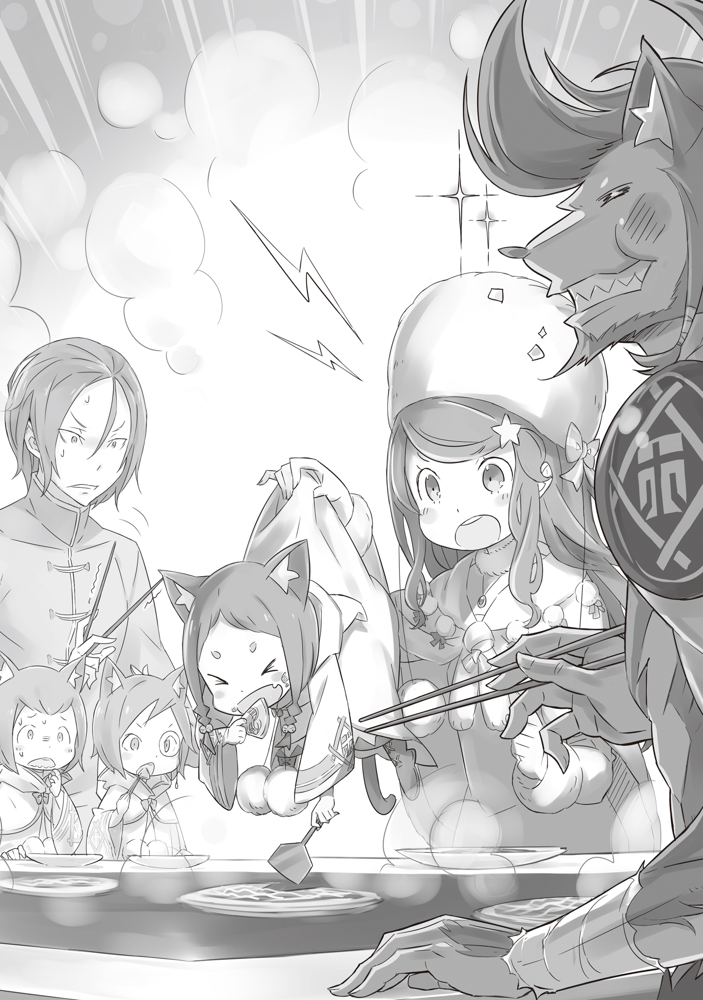

База: aXygnus

Перевод и редактура: mentalrebel

Сегодня в маленьком, укромном уголке столицы Королевства проходило небольшое торжество.

???: Да ладно вам, ребята! Вместо того чтобы капризничать, лучше быстро закончите уборку, и я приготовлю блинчики дайсукияки!

Той, кто хлопала в ладоши и командовала группой, являлась девушка невысокого роста. С волнистыми фиолетовыми волосами она была одета в длинную белую шубу из звериного меха. Ее шею украшал шарф из белой лисы, а в сочетании с прекрасной внешностью девушка производила впечатление непорочности на всех, кто ее видел.

Эту девушку звали Анастасия Хосин. Молодая и красивая торговка, управляющая крупной коммерческой компанией под названием Торговая Компания Хосин, родом из Городов-государств Карараги.

А перед ней стояло абсолютно пустое внутри незанятое здание…… Ее новая база, открытая в Королевстве Лугуника.

???: Ну же! Нам надо поторопиться, чтобы госпожа успела приготовить свои фирменные блинчики! Идемте!

???: П-подожди, сестричка! В этой коробке хрупкие предметы, и, если сестричка будет нести ее так небре… О! О!!!

Маленькие силуэты бегали туда-сюда возле Анастасии, которая наблюдала за их работой, сложив руки на бедрах. В этот момент один из детей споткнулся и упал, однако успел подбросить коробку в воздух.

???: Ой! Ты безнадежна, Мими! Ты должна понять, какая ты маленькая, какие у тебя короткие руки, какая ты неаккуратная и какое у тебя милое личико! О! Не обращай внимания на личико! Просто помни об остальном!

Мими: Ах, Капитан! Ты самый лучший! Ты и мою коробку можешь нести, хотя у тебя и так много всего!

Прежде чем они упали, зверочеловек успел подхватить и девочку, и коробку, которую она держала. Девочка истерически смеялась, дергая получеловека за его темно-каштановые волосы, уложенные в гриву.

Девочка невинно засмеялась, и зверочеловек простил ее с зубастой улыбкой. Анастасия не смогла сдержать румянца на щеках при виде младшего брата девочки, который в панике метался перед ними.

???: Вижу, это довольно оживленный переезд.

Тот, кто это прокомментировал, был очень нарядным парнем с напряженным выражением лица, который подошел к девочке. На вид ему было около десяти лет, а его сиреневые волосы были собраны в хвост. Его лицо можно было назвать андрогинным, а телосложение — стройным; если бы не писклявый голос, его легко можно было бы принять за девушку.

Анастасия: Как ты видишь, не только эти двое, но и все здесь веселые. Исключение составляют, пожалуй, только два других вице-капитана и старый дедушка, работающий в администрации. Пожалуйста, постарайся вытерпеть это.

???: Да, это соответствует тому, что мне говорили. Но возможно ли среди этой суматохи вести нормальную жизнь?

Анастасия: Ну, в Карараги не принято говорить вполголоса. Поэтому каждый там говорит громко, жестикулирует, мелодраматично рассказывает свои истории и бессовестно врет. Йешуа, помни об этом.

Йешуа: То есть вы хотите сказать, что лгать там так же естественно, как и дышать… Я буду иметь это в виду.

Не меняя выражения лица, Йешуа Юклиус принял этот совет, и Анастасия оценила его жест.

Было приятно общаться с людьми, которые умеют активно использовать внешние факторы, чтобы улучшить себя, под каким бы влиянием они ни находились. Его амбиции также соответствовали его молодому возрасту и семейному происхождению.

Теперь оставалось только испытать разочарование и трудности, и быть достаточно жадным, чтобы снова встать на ноги и добиться успеха в жизни.

???: Йешуа-сан. Могу я тебе помочь?

Йешуа: Спасибо. Дайте-ка подумать, вы ведь вице-капитан Тиви, верно? Что ж, тогда я прошу вас отнести это туда.

Поправка. Теперь ее оценка этого молодого человека была еще выше. Она оценила тот факт, что он смог безошибочно определить, кто из тройняшек пришел к нему, что для нее, мгновенно сопоставившей их имена с внешностью, было очень важно.

Анастасия: Редко встретишь человека, способного так быстро различать тройняшек…

Анастасия склонила голову набок, размышляя, действительно ли их так сложно отличить. Они действительно были похожи, но каждый из них обладал своим неповторимым шармом. Это была загадка.

Тиви носил монокль и был самым умным среди троих, у Хетаро всегда было озабоченное лицо, показывающее его чувствительную сторону, а Мими была простодушна и являлась самим воплощением милой невинности. Это была тройка вице-капитанов «Железного Клыка», наемной армии Торговой Компании Хосин. А тот, кто командовал всеми войсками, Капитан всех этих солдат, был тем самым зверочеловеком.

???: Что такое, госпожа?! Что это за жуткая улыбка, хах?! У вас похмелье или что?! Мы не можем сейчас с вами разбираться, мы заняты!

Анастасия: Это ужасное заявление, Рикардо. Поторопись и закончи свою работу. Иначе еда Рикардо окажется в желудке Мими.

Мими: Оооооо! У Мими будет большой живот!

Рикардо: Но почему?! Я работаю больше, чем все остальные!

Рикардо раскрыл свой огромный рот, делая преувеличенные жесты, и громогласно себя похвалил. Его рот был так велик и полон клыков, что он мог бы съесть Анастасию в два укуса. Его мускулистое тело было покрыто коричневой шерстью, а пушистый хвост возбужденно раскачивался из стороны в сторону.

Эти черты, а также его клыкастая морда были неопровержимым доказательством того, что он является собачьим получеловеком.

А Мими, сидящая на плечах Рикардо, представляет собой котенка-получеловека с оранжевой шерсткой на голове и покачивающимися кошачьими ушками. «Железный Клык» Анастасии являл собой группу наемников, состоящую исключительно из зверолюдей.

Фактически, почти все, кто помогал с переездом, были зверолюдьми, поскольку из человеческой расы присутствовали только Анастасия, Йешуа и еще один мужчина.

???: …Это довольно оживленный переезд, не так ли, Анастасия-сама?

Красивый голос, словно благословленный ветром, принадлежал молодому мужчине, вставшему рядом с Анастасией.

У него были фиолетовые волосы, чуть более темные, чем у Анастасии, у которой они имели светлый оттенок. У этого молодого мужчины, поправляющего челку, были желтые глаза, а его лицо было настолько обворожительным, что многие женщины впадали в оцепенение, стоило ему лишь улыбнуться.

В отличие от худощавого Йешуа, его тело было хорошо подтянуто и отнюдь не выглядело хрупким. Лучшим описанием для его тела было бы «красивое и сильное».

Анастасия превыше всего любила совершенство. Помимо совершенства, ей нравились красивые вещи. По этой причине мужчина, являвший собой идеальный сплав совершенства и красоты, был для нее крайне желанным.

Если бы она не была решительна в своих амбициях и не обладала жадностью, которая намного превосходила ее плотские желания, этот мужчина мог бы запросто похитить ее сердце. «Безупречный Рыцарь» Королевства Лугуника, Юлиус Юклиус, стоял особняком от других.

Анастасия со смехом взглянула на Юлиуса, который, вернувшись с работы, переоделся в удобную одежду.

Анастасия: Вы с братом, говорите совершенно об одних и тех же вещах.

Юлиус: Это крайне неловко. Идти по стопам собственного младшего брата…

Анастасия: Нет, я так не думаю. Вы, братья, довольно хорошо ладите. Я даже немного ревную.

Сделав шаг назад, она сузила глаза, держа в поле зрения Юлиуса и Йешуа. Последний, поняв, что на него смотрит Анастасия, повернул голову и спросил,

Йешуа: А у Анастасии-сама есть братья или сестры?

Анастасия: Хм? Ну, я не уверена.

В ответ она наклонила голову и закрыла один глаз. Отреагировав, Юлиус сказал: «Йешуа»,

Юлиус: Мне не нравится такая любознательность. Это не очень красивый поступок, особенно по отношению к дамам. Обрати на это внимание.

Анастасия: Ах, нетнетнет, если ты будешь его так ругать, я потеряю самообладание. Просто я ничего не поняла и ответила странно.

Помахав рукой, Анастасия улыбнулась удаляющемуся Йешуа и коснулась своего лисьего шарфа, обернутого вокруг ее шеи, на некоторое время погрузившись в раздумья.

Анастасия: Тиви?

Тиви: Да, мэм. Йешуа-сан, ты можешь оставить организацию этих материалов на меня, чтобы вы трое вместе смогли провести важный разговор.

Анастасия: Ты все понял с полуслова, я просто заворожена тем, какой ты милый и грамотный.

Тиви не случайно был известен как самый проницательный и благовоспитанный из «Железного Клыка». Без него такая большая группа, состоящая из людей, которым не хватало перфекционизма, не сработалась бы так хорошо.

Даже после комплимента Анастасии маленький котенок-получеловек сохранил прежнее выражение лица и принялся выполнять многочисленные поручения. Сначала у Йешуа было обеспокоенное лицо, однако его брат положил руку на его плечо.

Юлиус: Вы хотите отправиться в другое место, Анастасия-сама? Трудно гарантировать, что другие люди не будут подслушивать…

Анастасия: Все в порядке, это не секрет. К тому же, если я не буду присматривать за этой компанией, они начнут халтурить. Давай останемся здесь.

Повернувшись к Йешуа, она продолжила.

Анастасия: Справедливости ради, что касается твоего предыдущего вопроса, то я не пыталась уклониться от ответа. У меня нет воспоминаний о моей семье, поэтому я, честно говоря, не могу ответить.

Йешуа: …То есть вы хотите сказать, что не помните своего прошлого?

Анастасия: Нет. С тех пор, как мне удалось себя осознать, я уже была одна, живя в самом жалком месте Карараги. Чудо, что я не стала рабом. И я не только не знаю своих родителей, но и мне даже пришлось дать себе имя.

Должно быть, Йешуа получил хорошее воспитание. Он и представить себе такого не мог. Как она сама сказала, и ее имя, и фамилия были выбраны ею самой. Когда она жила в норе под землей, то мечтала когда-нибудь вылезти из нее, и поэтому ее имя было каламбуром от слова «нора*».

Поскольку она выросла в норе под землей (穴蔵, читается как «анагура»), другие люди назвали ее Анастасией (アナスタシア).

Было забавно думать, что ее амбиции и гордость были так сильны, даже когда она была мечтательницей, не имеющей ничего общего со своим именем.

Йешуа: Значит, фамилию Хосин вы тоже решили дать сами себе?

Анастасия: Ну, я не думаю, что есть кто-то еще с такой фамилией. Тем более в Карараги никто бы не решился на такое. В конце концов, самая известная легенда среди нас, торговцев, — «Хосин из Пустоши». Это довольно нелепое заявление.

Действительно, здравомыслие Анастасии не раз подвергалось сомнению во время основания Торговой Компании Хосин. Она не смогла подавить короткий смешок, вспомнив свой тогдашний разговор с Рикардо.

Анастасия: Если ты спрашиваешь, в своем ли я уме, то, честно говоря, я уверена, что потеряла его довольно давно…

Нынешний Капитан «Железного Клыка» когда-то давно потратил много времени на переживания по этому поводу, но на самом деле он был первым, кто поддержал эту безумную авантюру с переездом в Лугунику. Видимо, жадность была заразительна.

Йешуа: Понятно… Теперь мне стала ясна причина, по которой Анастасия-сама доверяет полулюдям и имеет под своим командованием такую армию как «Железный Клык».

Анастасия: Вот как. Ты способен понять все это лишь из того, что я рассказала?

Йешуа: Да. Это понятно из истории вашего происхождения и имени, а также из того немногого, что я смог увидеть в вашей личности. Именно из-за того, что у вас такие необычные идеи, вы без колебаний назначаете полулюдей на высокие посты*.

В этом коротком обмене Йешуа проявляет тонкий расизм, а также чрезмерную вежливость, доходящую до грубости, что вызвало негативную реакцию Юлиуса и Анастасии.

Анастасия широко раскрыла глаза от прямого заявления Йешуа, который смотрел на нее, как бы анализируя. Однако Юлиус был явно удивлен таким высказыванием своего младшего брата.

Это удивление переросло в гнев, и Анастасия начала действовать, пока Йешуа не получил выговор.

Анастасия: Ясненько… Йешуа, ты действительно очень заботишься о своем старшем брате, не так ли?

Юлиус: Анастасия-сама?

Анастасия: Йешуа встревожен. Я, иностранка, сую свой нос в столь важную для Королевства Лугуника тему при поддержке дома Юклиусов… Который, в свою очередь, представляешь ты, Юлиус. Твой брат играет в злодея, чтобы узнать, действительно ли я достойна твоего доверия.

Йешуа, побледнев, ничего не сказал в ответ. Анастасия видела, что его глаза слегка подрагивают. И ей этого было достаточно.

Анастасия: Мне жаль, но ты ошибаешься. Я верю в то, что раса не имеет никакого отношения к способностям людей. Мои сотрудники, помимо того, что они очень полезны, еще и очень милы. Почему бы мне не относиться к ним так, как они того заслуживают?

Йешуа: …В Лугунике еще не полностью искоренена дискриминация по отношению к полулюдям.

Анастасия: Я знаю, и я думаю, что это то, что обычно происходит в стране с такой долгой историей. Я могу представить, что люди до сих пор хранят обиду со времен «Войны Полулюдей»… Но, признаться, я считаю это чертовски глупым.

Анастасия пожала плечами в ответ на защиту Йешуа.

Анастасия: Раса или кровь — ни то, ни другое абсолютно ничего не говорит о ценности каждого индивидуума. Единственное, что имеет значение, — это человеческая сущность и сила воли. Когда я сяду на этот трон, я буду следовать этой философии до конца, понимаешь?

Йешуа: …Значит, Анастасия-сама действительно претендует на трон?

Анастасия: О, так вот о чем ты беспокоился?

Насколько серьезно вы претендуете на трон другой страны? С точки зрения Йешуа, он был прав, усомнившись в преданности человека, занимающего такой пост. Это было естественно. Ее образ мышления был очень необычен для Королевства Лугуника, поэтому она оказалась бы в невыгодном положении.

Однако Анастасия была готова поставить на кон свою душу.

Анастасия: Хорошо, тогда как насчет обещания? Я буду бороться за трон всем, что у меня есть, и клянусь, что ни в коем случае не буду срезать углы, когда дело дойдет до Королевских Выборов. Мне не нужно говорить, что я не странная карарагская актриса, которая так или иначе желает принести пользу Карараги, верно? Я никогда в жизни не была такой серьезной.

Йешуа: Если вы будете давать такие необдуманные обещания, то однажды можете об этом пожалеть.

Анастасия: Нет, не пожалею.

Если Йешуа еще не был убежден, Анастасия решила это до него донести, пронизывая его своим пристальным взглядом.

Анастасия: Я сдержу свои обещания, какими бы они ни были. «Хосин и Посмертно Выполняет Свои Обещания» — таково национальное поверье Карараги, и я тоже настроена подобным образом. С того момента, когда я решила использовать его фамилию как свою собственную, я также решила, что никогда не буду попирать его наследие.

Йешуа: …………

Анастасия: Вот почему мы выполняем свои обещания. Несмотря ни на что.

В этом и заключался истинный смысл присвоения фамилии Хосин, героя-основателя Карараги. Йешуа сглотнул слюну, а рядом с ним на колени опустился Юлиус, на лице которого были видны эмоции. Взглянув на него, через несколько секунд младший брат последовал его примеру.

Юлиус: Анастасия-сама, прошу вас, простите грубость моего наивного брата. Однако, должен признаться, я искренне восхищен вашими словами. Теперь я смог убедиться, что ваше прибытие в Лугунику было благословением.

Анастасия: Мне приятен твой комплимент, но я лишь констатировала очевидное, понимаешь? Что ж, если вам было достаточно знать, насколько серьезной я порой бываю, то все в порядке… Ах, теперь я начинаю смущаться из-за этого, я вся краснею.

Девушка, закрыв лицо руками, застенчиво улыбалась, поворачиваясь то в одну, то в другую. Затем оба брата встали, и Йешуа молча посмотрел на Анастасию.

Йешуа: …………

Юноша понятия не имел, что ему следует сказать. Возможно, мир, в котором жила Анастасия, нельзя было понять, руководствуясь здравым смыслом Королевства Лугуника. Но если все было именно так, то…

Анастасия: Йешуа, работай до упаду и немного поголодай до вечера.

Йешуа: Э…?

Анастасия: А потом, когда все это закончится, я отблагодарю тебя своим замечательным и особенным дайсукияки. Мими и Рикардо обожают их, и я уверена, что они так сильно тебе понравятся, что ты аж свалишься со стула.

После этих слов Анастасии, подчеркнутых ее прекрасной улыбкой, первой реакцией Йешуа было замереть и поразмышлять над этими словами в течение нескольких секунд, пока он не побежал к Тиви, чтобы помочь ему с сортировкой документов, его решимость заметно разгорелась.

Юлиус: Мне очень жаль, Анастасия-сама. У моего брата все еще узкий взгляд на мир, и это привело его к противостоянию с вами.

Гордая собой, Анастасия выпятила свою грудь и положила руки на бедра.

Анастасия: Тогда сегодня настал тот день, когда он начнет вылезать из своей упрямой скорлупы. Твоя раса или иерархия не имеет значения, когда ты ешь вкусную еду. Как только он это поймет, то научится относиться к этим детям как к равным.

С горькой улыбкой на заметные эмоции Юлиуса, Анастасия по привычке погладила лисий шарф, обернутый вокруг ее шеи. Шарф тихо шевельнулся, словно его пощекотали пальцами.

《Конец》
