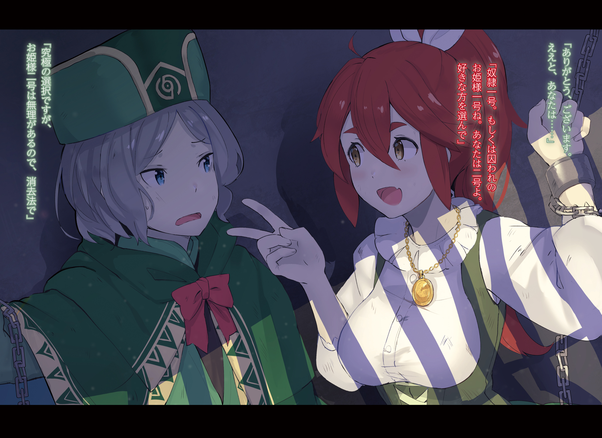
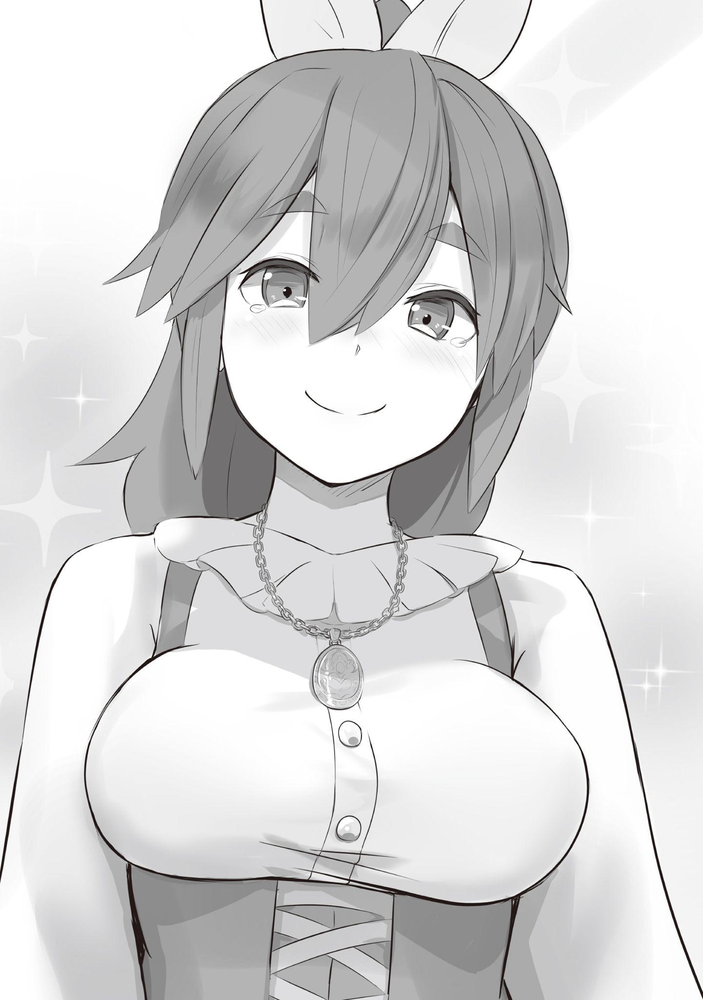
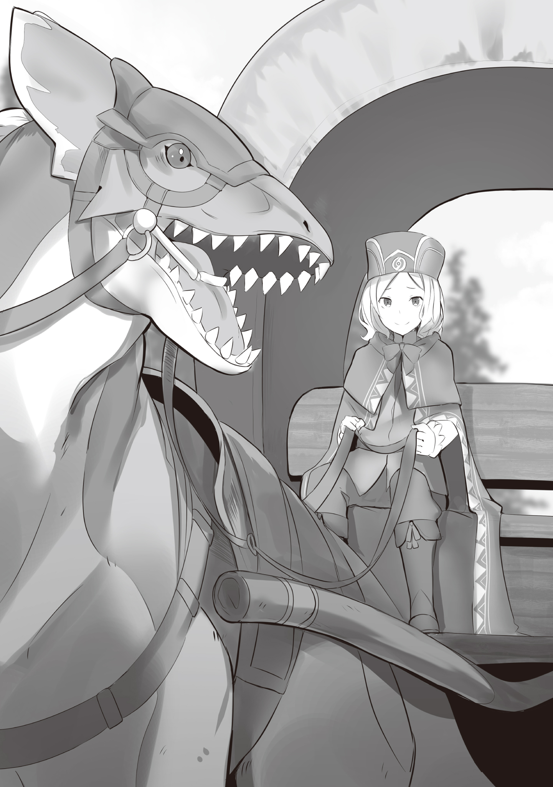

— Молодой господин, вам не кажется, что вокруг стало как-то слишком уж шумно?

— Да что ты?

Знакомый голос достиг ушей, и юноша, возившийся с поклажей в кузове, склонил голову набок, прислушиваясь.

Перед ним стоял хрупкий пепельноволосый молодой человек.

Во взгляде его сквозила робость, однако приятная внешность и опрятный вид, свойственные странствующему торговцу, не отталкивали.

Он всегда следовал принципу: лучше не вызывать неприязни, чем лезть из кожи вон, дабы понравиться; неосторожность в этом деле могла повредить ремеслу, ненароком задев чьи-то чувства.

Звали юношу Отто Сувен.

Став самостоятельным торговцем, он колесил по свету со своим единственным и горячо любимым ездовым драконом — типичный вольный коммерсант.

Сейчас Отто как раз увязывал остатки поклажи в кузове своей драконьей повозки.

Простая схема его ремесла — доставить закупленный товар в другие земли, там выгодно обменять его на деньги или другие товары — и на сей раз сработала как часы.

Отто заехал в этот горный городок, чтобы сбыть партию недавно приобретённого вина и различных предметов роскоши.

Торговля прошла успешно, и теперь, налегке, он готовился отправиться в путь…

— К тому же, молодой господин, вы что-то совсем витаете в облаках, — продолжил голос, в котором слышались и заботливые, и чуть ворчливые нотки его компаньона-дракона. — Сделка-то вроде прошла как по маслу, а вот сено сегодня, прямо скажем, дрянь.

— Притворяешься, будто обо мне беспокоишься, а сам на вкусное сено намекаешь? Поднаторел ты в этом, друг мой.

— Не стану отрицать корыстных мотивов, но я и вправду за вас волнуюсь, молодой господин. Ну и, конечно, отменное сено никогда не помешает.

— Да-да, понял, — Отто едва заметно вздохнул, поправляя ремень на тюке. — Впрочем, в последнее время, говорят, сплошные неурожаи, так что праздничный ужин и пир горой отложим до возвращения в большой город.

— И потому вы так рвётесь в путь, уже предвкушая угощение? Подозрительно.

Голос его верного дракона выразил сомнение.

За долгие годы совместных странствий тот научился улавливать малейшие перемены в настроении Отто.

С одной стороны, на него всегда можно было положиться, с другой — хлопот с ним было не оберёшься.

Стараясь не выдать своего нетерпения, Отто нарочито бодро хлопнул в ладоши:

— Да ничего особенного! В общем, торговля здесь завершена! Как говорится в «Афоризмах Хосина»: «Время — деньги»…

— …Господин торговец! Странствующий торговец здесь?!

— …

Доводы Отто бесцеремонно прервал зычный мужской голос, перекрывший его и громкостью, и силой намерения.

— Молодой господин, это… — обеспокоенно пророкотал дракон.

— Я и без слов всё понимаю, Фуруфу.

С отчаянием в голосе Отто закрыл лицо руками и весь съёжился.

Ах, если бы его, вечно стремящегося оставаться в тени, не заметили!

Но этой хрупкой надежде не суждено было сбыться.

— Ого! А вот и вы, господин странствующий торговец! Какая благая весть! Это же луч надежды!

Резко отдёрнув полог драконьей повозки, незнакомец заглянул внутрь и, обнаружив Отто, расплылся в улыбке до ушей.

У Отто даже духу не хватило заметить, что нельзя так бесцеремонно вторгаться в чужую повозку.

Смирившись с неизбежным, он лишь вздохнул и неохотно поднялся.

— Э-э-э, вы, кажется…

— Колин! Колин Лабрилль! Я представляю этот город, Гинеб! — громогласно представился мужчина.

— А-а…

В отличие от Отто, которому оставалось лишь внутренне содрогнуться, мужчина, назвавшийся Колином, так и пыхтел энтузиазмом.

Редеющие волосы и ухоженные усы тронула седина, возраст его приближался к шестидесяти, но жизненной энергии в этом старике было столько, что слюна так и брызгала, долетая до Отто, стоявшего в глубине кузова.

— Итак, господин Колин, что вам угодно от меня, скромного странствующего торговца?… — осторожно начал Отто.

— Вот именно! У меня к вам есть неотложное дело, и я как раз искал странствующего торговца!

Колин с энтузиазмом откликнулся на робкий вопрос Оттo, который как раз вытирал лицо подвернувшимся под руку платком.

Впрочем, то, что его разыскивают, Отто и так понял — по оглушительному зову.

— Ещё бы, ваш голос был слышен, кажется, из одного конца города в другой… — пробормотал он себе под нос.

— Вы что-то сказали?!

— Нет-нет, ничего особенного. Вероятно, вам послышалось.

— Ясно, послышалось! Однако, если расценить это как божественное знамение, то это самый что ни на есть добрый знак!

С невероятной настойчивостью истолковав все в лучшем для себя свете, Колин крепко сжал кулак.

Затем он поманил застывшего Отто свободной рукой.

— Ну же! Что толку разговаривать в этой тесноте! Сначала ко мне домой! Там я и поведаю вам, господин торговец, это важное дело!

Видимо, права отказаться у Отто уже не было.

Спорить тоже не хотелось — он опасался, что за время препирательств его любимая драконья повозка, которую Колин так пренебрежительно назвал «тесной», вся окажется забрызгана слюной.

Для Отто же это была не просто повозка, а верная спутница, с которой он провёл бок о бок уже несколько лет.

— Сочувствую вам, молодой господин.

Когда он уже собрался последовать за воодушевлённым Колином, его окликнул Фуруфу.

Сочувствие в голосе его земляного дракона было неподдельным, и Отто глубоко вздохнул.

— Потому-то я и хотел уехать побыстрее…

— Да какие-то несколько секунд ничего бы не изменили. Вам просто фатально не везёт со временем, молодой господин.

— Насчёт этого мне и возразить нечего…

Отто, сражённый этой убийственной правотой, лишь беспомощно развёл руками.

— Хм-м? Господин торговец, с кем это вы разговариваете? — удивлённо склонил голову Колин, заметив, что Отто обращается к пустоте, по крайней мере, с его точки зрения.

Рядом с Отто не было «человека», с которым можно было бы разговаривать, во всяком случае, видимого Колину.

К сожалению, у Отто не было ни малейшего желания подробно это объяснять.

Поэтому он лишь пожал плечами на вопрос Колина.

— Я ни с кем не разговаривал. Вам, наверное, опять послышалось?

— Хм-м-м, чтобы так часто чудилось… Это же целая череда благих знамений! Надежда бьёт ключом, словно родник! Удачное начало, господин торговец!

Отто подумал, что постоянные слуховые галлюцинации — это скорее признак болезни, а не добрый знак, но промолчал и лишь устало улыбнулся:

— Пожалуй, вы правы.

— …Ох уж… — с тоской прошелестел голос Фуруфу, наблюдавшего за вымученной улыбкой своего хозяина.

Голубоватая чешуя земляного дракона едва заметно переливалась в полумраке повозки.

«Гинеб» — так назывался неприметный городок, затерянный в горах на юге Королевства Лугуника.

Говорят, когда-то неподалёку был рудник магической руды, и строительство домов для шахтёров и их семей положило начало городу.

Маленькое поселение разрасталось, постепенно развиваясь, и так обрело свой нынешний облик.

— Однако, как только город по-настоящему отстроился, главная жила иссякла! — сокрушался Колин, жестикулируя так энергично, что Отто невольно отодвинулся. — Мой дед, который переехал сюда в надежде, что это место станет вторым Костулом, был, говорят, страшно разочарован!

— Шахтёрский город «Костул», значит. Его неиссякаемые жилы обеспечивают большую часть добычи магического камня в королевстве. Недаром поговаривают, что это место — бывшее логово дракона, — Отто старался поддержать разговор, демонстрируя осведомлённость, полезную для торговца.

— Ого! Какая эрудиция! Таким и должен быть мужчина, зарабатывающий на жизнь торговлей!

Сидящий напротив Колин то и дело разражался громкими похвалами, обильно разбрызгивая слюну.

Отто, устроившийся на предложенном ему диване для приёмов, изо всех сил уворачивался от его слов и летящих капель, сохраняя на лице вежливую улыбку.

Его отъезд бесцеремонно прервали, и Колин привёл его в самый богатый дом в городе.

Конечно, он и в подмётки не годился настоящим особнякам Королевской Столицы, но для Гинеба это был, несомненно, лучший дом.

Похоже, Колин не солгал, назвавшись представителем города.

Обычно Отто был бы только рад познакомиться с влиятельным человеком в этих краях, но на этот раз обстоятельства складывались не в его пользу.

Поэтому, немного поболтав на общие темы, Отто состроил сочувственное выражение лица и перешёл к делу:

— Итак, господин Колин. По какому делу вы меня позвали?

— М-м…

— Как вы знаете, я странствующий торговец… из тех, кто больше всего не любит задерживаться на одном месте и тратить время, не приносящее ни гроша. Мои дела в Гинебе уже закончены. Я бы хотел как можно скорее перебраться через горы…

— …Вот именно об этом!

Отто, тщательно подбирая слова и стараясь побыстрее распрощаться, замолчал.

Колин прервал его, выставив перед его лицом ладонь.

Пока Отто, обескураженный такой бесцеремонностью, молчал, Колин повторил те же слова:

— Господин странствующий торговец, я хотел посоветоваться с вами именно насчёт этого перехода через горы!

«Ну вот, началось», — подумал Отто, стараясь не выдать Колину своего внутреннего напряжения и лёгкой досады.

Переход через горы — сейчас это был единственный способ добраться до Гинеба.

— …

Чтобы попасть в расположенный в горах Гинеб, нужно было воспользоваться горной тропой от подножия.

По пути необходимо было пересечь мост через реку в ущелье, но сейчас этот мост был непроходим.

А все потому, что…

— Господин торговец, вы, должно быть, знаете, что из-за недавних затяжных дождей река в ущелье вышла из берегов. Из-за этого мост, ведущий к дороге у подножия, смыло, и теперь в наш город можно попасть только по запутанной горной тропе! — выпалил Колин, в голосе которого слышались и тревога, и надежда.

Как и сказал Колин, мост через реку смыло, и в настоящее время Гинеб оказался отрезан от мира, словно остров на суше.

Впрочем, это не означало полной изоляции.

Отказавшись от переправы через реку, можно было добраться до города от подножия по извилистой и трудной горной тропе.

Однако это, несомненно, занимало в несколько раз больше времени и требовало пройти опасный путь.

Мало кто решился бы на такой рискованный поход ради торговли в не слишком-то прибыльном городишке.

Гинеб, расположенный в горах, всегда был довольно самодостаточен.

Отсутствие странствующих торговцев в течение нескольких месяцев не стало бы для него вопросом жизни и смерти.

Поэтому предполагалось, что в Гинебе какое-то время торговцев видно не будет.

…И тут, к неудовольствию самого Отто, но к бурной радости Колина, появился он.

— Мы уж думали, придётся потерпеть, пока мост не починят, но ваш приезд, господин торговец, это воистину благая весть! Хоть мы и не голодаем, но предметы роскоши ведь нужно откуда-то доставлять!

— Это удача для нас обоих. Благодаря этому и мой кошелёк изрядно пополнился… — Отто вежливо улыбнулся, хотя внутренне уже чувствовал, как его затягивает в водоворот чужих проблем.

— Вот как! Однако вы, господин торговец, странный человек! — Колин подался вперёд, глаза его блестели. — Мост обрушился всего несколько дней назад, а раз вы здесь, в Гинебе, значит, вы выбрали трудную горную тропу ещё до того, как он рухнул! Для странствующего торговца, который так ценит время, это довольно бессмысленный крюк!

Отто промолчал, лишь чуть заметно поджав губы.

— Или, может быть, вы, господин торговец, знаете некий особый способ? Не по крутой горной тропе! И не с помощью магии, чтобы перебраться через реку, где смыло мост! А какой-то другой путь «перейти горы» и добраться до Гинеба!

Подавшись вперёд так, что его лицо оказалось почти вплотную к Отто, Колин уставился на торговца налитыми кровью глазами, обильно разбрызгивая слюну.

Отто едва заметно отстранился и мысленно вздохнул.

Хоть манерам Колина и недоставало изящества, его предположения по большей части были верны.

Действительно, Отто решил отправиться торговать в Гинеб именно после того, как услышал об обрушении моста.

Он наспех собрал предметы роскоши, совершенно справедливо рассчитывая, что в отрезанном от мира Гинебе на них будет повышенный спрос.

И Отто не прорывался через вышедшую из берегов реку, рискуя повозкой и товаром, и не преодолевал несколько дней крутую, изнурительную горную тропу.

Он провернул эту торговую экспедицию способом, недоступным другим.

— Но этот способ — это, так сказать, коммерческая тайна… Я не могу его разглашать. Это моё преимущество, которое имеет смысл только потому, что о нем знаю лишь я. Требовать, чтобы я его раскрыл…

— Разумеется! Разумеется! — перебил Колин, нетерпеливо взмахнув рукой. — Но у нас есть обстоятельства, которые заставляют нас просить вас сделать исключение! Понимаете, крайние обстоятельства!

— Обстоятельства? — Отто удивлённо округлил глаза, чувствуя, как неприятный холодок пробегает по спине.

Колин несколько раз энергично кивнул, лицо его выражало крайнюю серьёзность.

Затем он обернулся к входу в гостиную и зычно, без всякой надобности так громко, крикнул:

— Входи!

Услышав его голос, дверь робко отворилась, и на пороге показался бледный, худощавый молодой человек.

На вид он был лет на пять старше Отто.

Робкого вида юноша с большой, заметной родинкой у носа, одетый в простую, но чистую одежду.

Он опустил глаза и, неловко поклонившись, пробормотал:

— Д-добрый день…

— Это мой сын, Архим! — прогремел Колин, указывая на него широким жестом. — Нынешнее дело связано именно с этим Архимом! Ну же! Расскажи всё господину торговцу сам!

— У-у-у… — Архим вздрогнул и, казалось, стал ещё меньше.

Колин схватил сына за плечи и почти силой усадил рядом с собой на диван.

Совершенно подавленный напором отца, Архим то бросал быстрый, испуганный взгляд на Отто, то вновь утыкался глазами в пол.

Отец, излишне полный кипучей энергии, и сын, которому не хватало даже самой необходимой решимости, — разительный контраст.

— Итак, господин Архим… У вас ко мне есть дело… или, быть может, нужен совет, как я понимаю?

— Н-на самом деле… там, в горах, э-э, Мароне… и, э-э… — Архим замялся, теребя край своей туники.

— …?

Отто терпеливо ждал, хотя его внутренние часы уже громко тикали, напоминая об уходящем времени.

— Есть девушка по имени Мароне! Она невеста моего сына! — В конце концов, не выдержав, Колин сам начал объяснять вместо Архима, который при этом облегчённо выдохнул.

Отто, смирившись, послушно выслушал объяснения отца.

Объяснение было несколько сбивчивым, полным эмоций и отступлений, но если вкратце, то…

— Невесту господина Архима, госпожу Мароне, похитили разбойники, обосновавшиеся в горах, — подытожил Отто, когда Колин наконец перевёл дух. — И вы хотите позвать на помощь, чтобы её вернуть…

— Именно так! Разумеется! — Колин стукнул кулаком по колену. — Мы пытались собрать отряд смельчаков во главе с моим сыном, чтобы отбить её, не прибегая к помощи чужаков, но в результате выяснилось, что в городе одни трусы! Прискорбно!

— Хм-м, трусы, говорите… — задумчиво протянул Отто, оценивая ситуацию.

— Молодую девушку похитили мужчины! Да ещё какие-то горные отбросы! Будь я моложе, я бы никогда этого не простил! — Колин распалялся все больше, его лицо побагровело. — Собрал бы всех жителей города и разорвал бы этих негодяев на куски! А эти… эх!

Главным трусом, казалось, был тот, кто съёжился рядом с Колином, но Отто в душе посочувствовал и испуганному Архиму, и остальным жителям города — их действительно нельзя было винить.

То, что доведённые до отчаяния люди брались за оружие и становились разбойниками, — увы, дело обычное.

У тех, кто выбрал грабёж ради выживания, и у тех, у кого есть дом и работа, слишком разная готовность рисковать собственной шкурой.

Порой трусость — тоже необходимое качество для выживания.

Отто не считал зазорным и не побрезговал бы ничем, лишь бы выжить.

Поэтому сейчас он куда больше сочувствовал тем, кого Колин огульно заклеймил трусами, нежели самому пылкому старику.

«И всё же…» — Отто задумчиво потёр подбородок, размышляя о постигшем Гинеб несчастье с разбойниками.

Конечно, это было чистое невезение, но Гинеб, изначально имевший слабые связи с внешним миром, должен был представляться для разбойников лакомым куском.

Скорее, чудом казалось то, что подобных проблем не возникало до сих пор.

А значит, разработка каких-никаких мер противодействия таким угрозам была для Гинеба делом насущной необходимости, если они не хотели повторения.

— Господин торговец! Вы меня слушаете?!

— А? О, да, простите. Немного задумался…

Отто вовсе не был обязан ломать голову над проблемами обороны чужого города, но у него была дурная привычка — стоило ему заметить явную брешь, как ему тут же хотелось её как-нибудь залатать.

Хотя он и пытался постоянно внушать себе, что в жизни главное — полагаться на собственные силы и не лезть не в своё дело.

— В общем! Это чрезвычайно серьёзная проблема! Госпожу Мароне похитили две ночи назад! Если не поторопиться с её спасением, её жизнь будет в опасности… И тут появились вы, господин торговец, обладающий неким тайным способом перехода через горы! Как это ещё назвать, если не самой судьбой!

— Простое совпадение…

— Как это ещё назвать, если не самой судьбой?! — взревел Колин.

Какой напор! Какое назойливое, раскрасневшееся лицо! Отто на мгновение потерял дар речи от такого натиска.

Однако, несмотря на всю неприязнь к навязчивости Колина, судьба похищенной женщины искренне его беспокоила.

Мысль о страданиях, выпавших на долю беззащитной девушки, не давала покоя; Отто не был настолько чёрствым, чтобы списать всё на «необходимость полагаться на собственные силы».

В конце концов, решение Колина попытаться собрать спасательный отряд было куда человечнее, чем если бы он просто опустил руки.

«…У-ух».

Если бы только не отец, а сам жених, который сейчас дрожал всем телом и съёживался в углу, горел искренним желанием отбить свою невесту, это была бы почти идеальная, трогательная история.

— Ну, что скажете, господин торговец?!

Вопрос был брошен Отто, который мучительно колебался между человеческой совестью и интересами торговца.

Однако с того момента, как его заманили в этот особняк, у него, по сути, уже не было выбора.

Если бы он отказал Колину, то неминуемо прослыл бы человеком, бросившим в беде невесту сына представителя города, и тогда о нормальной торговле в Гинебе можно было бы забыть навсегда.

Но если бы он уступил нажиму Колина и всё рассказал, то лишился бы своего уникального торгового преимущества и в итоге понёс бы куда большие убытки.

Следовательно, у Отто здесь был только один приемлемый выход.

— Способ, которым я сюда добрался, я вам не расскажу.

— Ого! Господин торговец, так значит, вы вот так просто бросите невинную девушку в беде…

— Поэтому! — Суровому, уже начавшему распаляться Колину, Отто, словно в отместку за его напор, выставил вперёд ладонь, прерывая его громкий голос.

Затем, глядя на удивлённое лицо Колина, он позволил себе едва заметную злорадную усмешку, намереваясь хотя бы немного расстроить его прямолинейные планы:

— Просьбу о помощи я передам наружу сам. А жители города пусть как можно скорее займутся ремонтом моста.

Так он скорректировал предложение, чтобы обойтись малыми убытками, а не большими.

— …Молодой господин… это ведь почти то же самое, что позволить использовать себя в чужих интересах.

Отто, крепче стиснув вожжи, недовольно фыркнул.

— Какая грубость! Скажи лучше, что это было мудрое решение, позволившее свести ущерб к минимуму. Я и сам прекрасно понимаю, что взвалил на себя лишнюю ношу.

Его компаньон, Фуруфу, лишь привычно вздохнул, отчего воздух едва заметно колыхнулся: «Ну-ну».

— М-м-м…

Хотя Отто и изобразил показное недовольство, в глубине души он был полностью согласен со словами своего земляного дракона.

Честно говоря, его действительно использовали.

И как торговца, и просто как человека, Колин обвёл его вокруг пальца, это уж точно.

Сердце неприятно скреблось от этого осознания.

— Всё-таки надо было притвориться, что ничего не слышу, и сразу уезжать. Из-за одного неверного решения ввязался в такие неприятности… Но тогда та похищенная женщина…

— Узнав о её положении, вы уже не смогли бы сделать вид, что ничего не знаете. Молодому господину не стать бессердечным злодеем, как бы он ни пытался.

— Вовсе нет. Я тоже умею расставлять приоритеты. Если что-то угрожает тому, что мне действительно дорого, я буду защищаться не раздумывая. Фуруфу, кстати, один из них.

— Ну-ну, премного благодарен.

На этот чуть насмешливый ответ Отто снова промычал «М-м-м…», но его верный дракон лишь едва заметно качнул массивной головой, словно усмехаясь.

…В настоящее время Отто, следуя настойчивой просьбе Колина, направлялся в ближайший к Гинебу город, ведя повозку по ухабистой горной дороге.

Он согласился помочь в спасении женщины, но при этом не мог раскрыть свою коммерческую тайну — тот самый способ, которым он попал в Гинеб.

Это было решение, принятое им в отчаянии, когда он разрывался между человечностью и интересами торговца.

Разумеется, это была не просто бескорыстная помощь.

Он добился от семьи Лабрилль письменного обещания всевозможных льгот при дальнейшей торговле в Гинебе — эксклюзивные права на некоторые товары, снижение пошлин.

Так что, по факту, это были самые настоящие переговоры, в результате которых он не только, возможно, поможет людям, но и заключил выгодный коммерческий контракт.

Но почему-то чувство поражения было сильным, будто его обыграли на его же поле.

Может, это из-за его природной мелочности, неспособности к широким жестам?

— Да нет, дело не в этом. Может, просто потому, что у вас на шее теперь ощутимый поводок? — донёсся до него голос Фуруфу.

Отто тяжело вздохнул, услышав слова компаньона, безошибочно прочитавшего его мысли.

Сзади, в кузове мерно покачивающейся драконьей повозки, виднелся сгорбленный человеческий силуэт — это был не груз.

Это был Архим, тот самый несчастный жених, у которого похитили невесту.

Он сидел, обхватив колени и уставившись в одну точку.

При заключении договора с Отто Колин категорически настоял на его сопровождении.

— «У него украли невесту, и как наследник Лабриллей он уже стал посмешищем на весь город! Если он ещё и будет сидеть сложа руки, пока другие возвращают девушку, его опозоренную честь будет не восстановить до конца дней!»

Таковы были громкие доводы Колина, с силой хлопнувшего сына по спине, отчего тот едва не клюнул носом.

С этим мнением, в общем-то, можно было и согласиться, но вот заботиться об Архиме, отправившемся таким образом восстанавливать свою честь, теперь предстояло именно Отто.

Он долго упирался, приводил веские доводы, но в итоге его все же заставили согласиться на сопровождение Архима.

Из-за этого атмосфера в драконьей повозке была самой мрачной за всю её долгую историю путешествий.

С тех пор как Архим сел в повозку, он почти не открывал рта.

В драконьей повозке Отто имелась «Божественная Защита Уклонения от Ветра», так что дело было не в дорожной тряске или сквозняках, а исключительно в его подавленном душевном состоянии.

— Когда смешиваются семейные дела и женские проблемы, это всегда приводит только к неприятностям, не так ли? — философски заметил Отто, глядя на дорогу.

— В ваших словах, молодой господин, чувствуется глубокий личный опыт. Интересно, та девушка на родине все ещё кипятится и собирается сжечь вас на ритуальном костре, когда вы наконец вернётесь?

При этом упоминании Отто поморщился, словно от зубной боли.

— Мне даже думать об этом не хочется, так это угнетает.

Услышав о проблемах, оставленных на родине, Отто невольно покачал головой.

Он был странствующим торговцем, но была и другая, куда более веская причина, по которой Отто уже несколько лет не мог вернуться в родной дом, где жила его семья.

Если он вернётся, то неминуемо создаст им огромные проблемы.

А ещё, его собственная жизнь, скорее всего, окажется в смертельной опасности.

— Какая же несправедливая судьба. Хотя я уже почти привык. …И то, что привык, — это самое ужасное.

— …С-с кем ты разговариваешь?

Услышав внезапный, тихий голос, Отто вздрогнул и резко обернулся.

Из кузова на козлы, с опаской выглядывая, высунулся Архим, который до этого момента сидел не шевелясь, обхватив колени.

— Никого ведь нет, а ты с кем-то разговариваешь… Это как-то жутковато.

Архим с тревогой огляделся по сторонам и, убедившись, что они действительно одни, удивлённо нахмурился, глядя на Отто.

— А-а, нет, что вы, — Отто постарался изобразить непринуждённую улыбку. — На самом деле у меня есть привычка довольно громко разговаривать самому с собой. Работа уж такая.

— В-вот как…

— Когда работаешь странствующим торговцем, большую часть жизни проводишь в одиночестве, без постоянных собеседников. Естественно, у многих, как и у меня, появляется привычка разговаривать с небом, или вот с дорогой.

Архим посмотрел на него с явным сочувствием.

— …Жалко тебя. Хорошо, что я не торговец.

Услышав этот искренний, почти детский сочувственный тон, Отто почувствовал странную, почти кровную связь между Архимом и его громогласным отцом.

Манеры и поведение у них были диаметрально противоположными, но по сути своей это были очень похожие, прямолинейные отец и сын.

— Но что случилось? До ближайшего города ещё прилично ехать…

Архим покраснел и отвёл взгляд.

— Х-хочу по малой нужде. …Не мог бы ты где-нибудь остановиться?

— А, понятно. Это действительно проблема, — кивнул Отто.

Если речь шла о столь естественной нужде, то можно было понять, почему Архим, наконец, собрал всю свою немногочисленную храбрость и обратился к нему.

Если бы его многострадальную повозку сначала забрызгал слюнями отец, а потом ещё и обмочил сын, это было бы уже слишком печально и для повозки, и для самого Отто.

Быстро натянув вожжи, Отто остановил драконью повозку на обочине пустынной горной дороги.

Поблагодарив его тихим шёпотом, Архим неуклюже слез с повозки и, оглядываясь, направился к ближайшим кустам у дороги.

Отто провожал его взглядом, вздыхая.

— Хотелось бы, чтобы он сделал это перед отъездом.

— Он не привык к путешествиям, молодой господин. Будьте снисходительны, — раздался спокойный голос Фуруфу.

Усмехнувшись на очередной вздох своего компаньона, Отто стал молча ждать возвращения Архима.

Путь предстоял ещё долгий, и мысль о том, что все это время придётся ехать в гнетущем молчании или выслушивать жалобы, сильно угнетала…

Неожиданно из-за кустов донёсся сдавленный, испуганный возглас Архима:

— …Э-эй! П-подойди сюда! Быстрее!

— М-м?

Размышляющего Отто окликнул Архим из-за кустов.

«Что ещё случилось?» — с досадой подумал Отто и, вглядевшись с козел в густой подлесок, не сразу нашёл Архима.

— Господин Архим? Что стряслось?

— П-подойди сюда! С-скорее! Невиданное насекомое… у-укусило в очень странное место!

— В какое ещё странное место… Да помилуйте, только этого не хватало…

Услышав эту неприятную фразу, Отто устало почесал голову и спрыгнул с козел.

Продираясь сквозь колючие кусты, он увидел спину Архима, который отошёл довольно далеко от драконьей повозки.

«Ну зачем же было забираться так далеко, чтобы справить нужду», — с раздражением подумал Отто.

Укусы насекомых — обычное дело в любом путешествии, но укус в «странное место» — это уже потенциально серьёзно.

— Господин Архим, место укуса… нет, можете не показывать. Просто, если начнёт опухать, это может быть довольно опасно, так что лучше сообщите мне как можно скорее…

Вообще-то, с подобными вещами должны были справиться лекарства из его походной аптечки, хранящейся в драконьей повозке.

С этой мыслью он и заговорил, но в следующее мгновение…

— …Кх?!

От резкого удара зрение Отто помутилось, мир перед глазами вспыхнул белым.

Едва он услышал шорох быстрых шагов по траве за спиной, как что-то твёрдое и тяжёлое обрушилось ему на затылок.

Он глухо застонал и попытался устоять на ногах, но тело не слушалось.

Голова отяжелела, ноги подкосились. Он не успел сгруппироваться и мешком рухнул на влажную землю.

Ударился лицом. Вспышка боли. Во рту появился неприятный привкус земли и крови.

— …

Сознание стремительно уплывало.

Теряя последние остатки ясности, Отто смутно подумал:

«Было бы крайне неприятно, если бы я упал совсем рядом с тем местом, где только что мочился Архим».

— …Очнулся?

— …Уэ?

Прохладная, влажная ткань коснулась его лица, и Отто, издав какой-то глупый, нечленораздельный звук, с трудом открыл глаза.

Зрение было затуманено, всё расплывалось.

Он несколько раз моргнул, и постепенно взгляд сфокусировался, позволяя разглядеть склонившуюся над ним рыжеволосую женщину.

Это была женщина с густыми, яркими рыжими волосами, небрежно собранными сзади в хвост.

Взгляд её был сильным, волевым, черты лица — красивыми, но заметная усталость и въевшаяся грязь на поношенной одежде несколько омрачали её природную красоту.

— Г-где я?… — прохрипел Отто.

— Ш-ш-ш. Тише. Не хочу, чтобы те, наверху, нас заметили.

Во рту пересохло так, что первый звук получился едва слышным, больше похожим на скрежет.

Услышав его, красавица приложила палец к губам и, взяв стоявшую рядом грубую глиняную кадку с водой, зачерпнула немного ладонью и смочила пересохшие губы Отто.

Несколько раз, жадно впитывая эту неожиданную милость, Отто кое-как пришёл в себя.

— Спасибо… э-э, а вы?…

— Рабыня номер один. Или, если угодно, пленённая принцесса номер один. Ты, соответственно, номер два. Выбирай, что больше по душе.

— Вот это выбор! Но на принцессу номер два я явно не тяну, так что, боюсь, методом исключения…

Несмотря на её легкомысленный, почти насмешливый тон, ситуация вырисовывалась довольно отчаянная.

Услышав ответ Отто, красавица едва заметно, устало улыбнулась.

— А ты, оказывается, довольно крепкий, по лицу и не скажешь. Я Мароне. Добро пожаловать, младший товарищ-раб.

— Самое нежеланное приветствие на свете, старшая товарищ… Вы сейчас сказали «Мароне»?

— Да, сказала.

Красавица Мароне чуть склонила голову набок, а Отто попытался схватиться за гудящую голову.

Но это ему не удалось — правая рука была скована, прикована к холодной каменной стене.

Бросив взгляд, он увидел, что его правая кисть была зажата в грубый железный браслет, соединённый короткой цепью со вбитым в стену кольцом, полностью лишая его свободы передвижения.

— …Это ужасно.

— Правда? А по-моему, всё же лучше, чем ошейник. Я тут всячески жаловалась, и мне немного улучшили условия содержания.

— Это улучшенные условия? Больше похоже на временную меру, чтобы обмануть какое-нибудь начальство… Кстати, если вы Мароне, а я оказался в таком незавидном положении, это значит…

Именно в такие моменты он особенно жалел, что его голова соображает не хуже, чем у большинства других людей.

В мозгу Отто тут же, с неприятной ясностью, связались рассказ Колина в Гинебе и его нынешняя плачевная ситуация.

Плененная Мароне и избитый, также пленённый Отто.

Прикованный к стене, названный рабом номер два или, что ещё хуже, младшим товарищем-рабом.

…Без всяких сомнений, это было логово тех самых разбойников.

— Если посмотреть на это с такой точки зрения… Да уж, неприятная картина вырисовывается, ничего не скажешь.

Отто внимательнее пригляделся, осматривая окрестности, и его настроение резко упало ещё ниже.

И неудивительно: их держали в сырой каменной тюрьме с проржавевшей железной решёткой вместо двери.

На холодном каменном полу валялись какие-то грязные тряпки и мелкие осколки керамики.

За железной решёткой виднелся тускло освещённый коридор, но дальше ничего не было видно.

Однако по промозглому, холодному воздуху он понял, что их заперли где-то в глубине пещеры или чего-то подобного.

— Может, это какой-нибудь заброшенный шахтёрский туннель?

— Хм, а ты сообразительный. Может, ты не просто случайный прохожий, которому не повезло оказаться не в том месте не в то время?

— Ну-у, как сказать. Что касается «не повезло», тут я совершенно не могу возразить.

Мароне скривила губы, а Отто убедился, что кроме них двоих в камере никого нет.

Судя по её скромным размерам, маловероятно, что рядом была ещё одна такая же камера, но…

— Э-э, меня одного сюда притащили? Может, со мной был кто-то ещё?

— Ты был один, когда тебя принесли, но… у тебя был спутник?

— Ну, мы не то чтобы сильно подружились, но и бросать его на произвол судьбы мне бы не хотелось. …Такой, худощавый, повыше меня ростом, и постарше.

Мароне задумчиво нахмурилась.

— Худощавый, постарше… А ещё какие-нибудь особые приметы есть?

Отто, приложив свободную левую руку к подбородку, напряг память.

— Да. У него была довольно большая, заметная родинка у носа. А так, в целом, выглядел несколько нездоровым, бледноватым…

— …Да, этого вполне достаточно. Более чем достаточно, но…

— …?

Внезапно лицо Мароне исказилось гневом.

— Этот трус теперь ещё и совершенно незнакомого человека подставил и бросил?!

— Эй!…

Мароне покраснела от ярости, и её громкий, яростный крик заставил Отто от удивления выпучить глаза.

Та самая женщина, что только что велела Отто сидеть тихо, сама совершенно потеряла самообладание.

Последовавший за этим крик изумления самого Отто тоже был довольно громким, так что их голоса гулко отразились от стен и прокатились по тёмному коридору.

— Это, кажется, было очень неосмотрительно с нашей стороны?! — воскликнул Отто, опасаясь последствий.

— Ха-а, ха-а… Прости. От гнева не сдержалась, — Мароне тяжело дышала, пытаясь успокоиться. — Я тоже, как старшая товарищ-рабыня, ещё не слишком опытна в сохранении хладнокровия.

— Проблема в нашей рабской квалификации?! Э-э, что вообще случилось?…

Отто попытался выяснить истинную причину её извинений и внезапно поникшего вида, но их прервали приближающиеся шаги нескольких человек — за решёткой появились фигуры мужчин в грубой, грязной одежде.

Они пошло ухмылялись и одобрительно захлопали в ладоши, увидев очнувшегося Отто.

— Эй, проснулся, раб номер два? — насмешливо бросил один из них.

— …Значит, это прозвище — не просто шутка Мароне?

Один из разбойников сплюнул на пол.

— Она, похоже, хочет сделать это местной традицией. Скорее бы она уже сгнила вместе с этим мусором.

— А первая-то у нас все такая же бойкая, острая на язычок, — добавил другой, похотливо облизнувшись.

Мужчины со свистом и грубыми шутками посмеялись над отповедью Мароне.

Все как один — в грязной, поношенной одежде, с вульгарными манерами и злобными ухмылками на небритых лицах, — типичная банда разбойников, словно сошедшая со страниц дешёвой приключенческой книжки.

Без всяких сомнений, это и были те самые разбойники, о которых с таким ужасом говорили в Гинебе.

Подумать только, они устроили себе логово в заброшенной шахте — какая мрачная ирония, учитывая историю основания Гинеба, начавшегося именно с рудника.

— Может, если не обращать внимания на полное отсутствие солнечного света, здесь вполне можно жить? — пробормотал Отто скорее для себя, пытаясь справиться с подступающей паникой.

— Вот как заговорил! А ты мне нравишься, номер два, болтливый, — один из разбойников, самый крупный, с мерзкой ухмылкой подошёл ближе к решётке.

— А то, когда молчат как рыбы, приходится помучиться, чтобы вытянуть нужную информацию. А мучить мужиков, знаешь ли, не так весело, как некоторых.

Не обращая внимания на пошлые насмешки разбойников, Отто спросил о том, что волновало его больше всего в данный момент:

— Что с моим земляным драконом и драконьей повозкой? Они должны были быть припаркованы неподалеку от того места, где вы меня… сцапали.

Невозможно было, чтобы они не заметили его драконью повозку, оставленную на горной дороге.

Разумеется, и сама повозка, и весь оставшийся груз должны были быть конфискованы.

Хотя, он не думал, что у них были веские причины убивать послушного, неагрессивного земляного дракона.

— Успокойся, торговчишка. Твои торговые инструменты и прочее барахлишко — всё под нашим надёжным присмотром, — разбойник самодовольно хмыкнул. — А земляной дракон твой, похоже, быстро разочаровался в своём хозяине-рабе. Легко отвернулся от тебя и теперь работает на нас. Нам как раз нужен был один такой трудолюбивый и смирный земляной дракон, так что всё удачно сложилось.

— Вот как. Это самое главное…

Он с досадой прикусил губу и опустил голову, и мужчины презрительно рассмеялись над его сломленным видом.

В ответ Отто лишь глубже подавил закипавшие в груди гнев и отчаяние.

Ситуация была из рук вон плохой, но ему нужно было выяснить ещё кое-что.

А именно…

— …Что случилось с мужчиной, который был со мной?

— А? — разбойники переглянулись.

— Не думаю, что вы, так увлёкшись мной и моей драконьей повозкой, его не заметили.

Он хотел узнать о судьбе Архима, которого здесь, в камере, не было.

Однако Отто был настроен довольно пессимистично на этот счёт.

Его не было рядом.

Если бы его схватили живым, то, независимо от того, сделали бы его рабом или нет, он, скорее всего, оказался бы здесь.

А раз его нет, значит…

Однако мужчины, переглянувшись ещё раз, легко и даже с некоторой насмешкой опровергли худшие опасения Отто.

— А, тот! Мужик, который с тобой был! Его мы благополучно отпустили, — сказал главарь, потирая подбородок. — Наверное, уже вернулся в город целым и невредимым, и его сейчас утешает его шумный папаша.

— …Отпустили? — Отто неверяще уставился на них.

— Ага, и даже гостинцев с собой дали, чтоб не плакал. Испугался ведь бедолага. У нас тоже есть толика милосердия. А, парни?

Напыщенной речи мужчины поддакнули остальные, словно подзадоривая его и издеваясь над наивностью Отто.

Но Отто было не до их грубых шуток.

Мужчины сказали, что отпустили Архима.

Отпустили целым и невредимым того, кто видел их лица, знал об их злодеяниях и, что самое важное, мог привести сюда помощь.

Что это могло означать?

…Придя к единственно возможному выводу, Отто остолбенел, чувствуя, как холодеет у него внутри.

— …Господин Архим был с вами заодно?

— «Заодно» — это как-то грубо звучит, тебе не кажется? — разбойник прищурился. — Говори повежливее: «сотрудничал», раб номер два!

Слова, подтверждающие страшную догадку Отто, потонули в оглушительном, издевательском хохоте мужчин.

Пока этот хохот отдавался в его ушах, многие вопросы, мучившие Отто, мгновенно прояснились.

И то, что Архим так настойчиво вызвался сопровождать драконью повозку, и то, что по дороге он так вовремя остановил её под надуманным предлогом нужды, и то, что он так ловко заманил его в кусты, подальше от дороги, — всё это было сделано с одной единственной целью: одним махом избавиться от мешающего свидетеля и заполучить нового, полезного раба, а также его имущество.

Этот тихоня-юноша обвёл его вокруг пальца!

Самым большим просчётом Отто было то, что он недооценил Архима, посчитав его просто робким, забитым трусом.

В такой ситуации ему было совсем не до смеха над простодушием Колина.

— Ну, посиди пока так, поразмысли. Мы тут как раз собирались сворачиваться с этого места. А ты пока наслаждайся своей временной рабской жизнью в своё удовольствие, — бросил главарь.

Замолчавший Отто выглядел совершенно растерянным и подавленным, и мужчина, удовлетворенно дёрнув за решётку, насмешливо хмыкнул.

— Какое ещё «в своё удовольствие»! В следующий раз, как сунешься сюда, я тебе палец или ещё что-нибудь откушу, ублюдок! — яростно прошипела Мароне.

— Ой-ой, первая-то у нас какая страшная. Неудивительно, что её мужик так легко бросил.

Ухмыляясь и отпуская скабрёзные шуточки, мужчины оставили двух своих пленников и удалились из импровизированной тюрьмы.

Пока звук их удаляющихся шагов не затих окончательно, ни Отто, ни Мароне не произнесли ни слова.

Вскоре освещение в коридоре погасло, и холодную, сырую тюрьму снова окутал гнетущий полумрак.

Некоторое время они сидели в тишине, потом Мароне нарушила молчание:

— Вообще-то, мы с тем мужчиной никогда не были помолвлены.

— Э-э-э, вот так вот?… — Отто смог лишь издалека пискнуть, скорчив жалобную гримасу.

От столь вопиющего и неожиданного разоблачения он окончательно растерялся.

Спустя некоторое время после того, как разбойники вдоволь поиздевались над ними и ушли, Отто в полумраке осторожно заговорил с Мароне, и они начали обмениваться информацией, пытаясь разобраться в ситуации друг друга и понять, что же на самом деле произошло.

В ходе их сбивчивого разговора речь, естественно, зашла о том поручении, которое Отто получил в Гинебе от Колина, и об отношениях Архима и Мароне, но её заявление повергло его в полное изумление.

Что из всего этого было правдой, а что — наглой ложью?

Насколько же Гинеб был прогнившим и лживым городишкой, если здесь творились такие дела?

— Значит, господин Колин тоже был в сговоре с Архимом? Отец и сын вместе сотрудничали с разбойниками, орудующими рядом с их городом, и наживались на собственных жителях? Это же… чудовищно!

Мароне покачала головой, её рыжие волосы тускло блеснули в слабом свете, проникавшем откуда-то сверху.

— Думаю, ситуация всё же не настолько безнадёжна. Господин Колин, конечно, человек, который не слушает других и бывает крайне бестактен, но он не любит кривых путей и закулисных интриг. Он слишком прямолинеен для этого.

— Ну да, и актёр из него, похоже, никакой… — согласился Отто, вспоминая чрезмерно эмоциональное поведение старика.

Если говорить по-хорошему, он был человеком без двойного дна, а если по-плохому — образцовым примером вопиющей, почти опасной честности.

Услышав от Мароне убедительное отрицание причастности Колина, Отто нахмурился, пытаясь сложить кусочки головоломки.

Неужели это было делом рук одного лишь Архима?

Хотя, если он действительно сотрудничал с разбойниками, то о каком «одном» могла идти речь.

Там наверняка целая шайка.

— Но в таком случае, почему слова господина Колина так сильно противоречат фактам? Он ведь говорил о похищении невесты…

— Хм-м. Не знаю, как это тактичнее сказать, но, видишь ли, я ведь… ну… красивая, не так ли? — Мароне произнесла это с едва заметной усмешкой, но без тени кокетства.

Отто вздохнул.

— Ужасно неприятно это признавать в такой ситуации, но да, вы очень красивая.

— Поэтому, наверное, он решил, что если сделает вид, будто у него невеста-красавица, вроде меня, то его властный отец наконец перестанет его унижать и считать ничтожеством. У них там, знаешь ли, такие вот непростые отношения в семье.

— Да нет, не может быть… Это же… — Отто уже было хотел возразить, но, вспомнив динамику отношений той странной парочки — властного, громкого Колина и забитого, молчаливого Архима — он прикусил язык.

Колин то и дело пытался полностью лишить сына права принимать какие-либо решения, обращаясь с ним как с неразумным ребёнком.

Возможно, и всегда покорный Архим был этим глубоко недоволен, и это недовольство вылилось в такую уродливую форму.

Однако Отто и Мароне совсем не хотелось становиться невольными жертвами его извращённого тщеславия.

— Несколько дней назад Архим позвал меня в лес, сказал, что есть какой-то важный разговор. Я слышала, что в горах орудуют разбойники, и что похитили уже не одного и не двух человек, так что я, конечно, не хотела идти, но он был так настойчив…

— По-по-подождите. Подождите, пожалуйста, — Отто резко перебил её, услышав мимоходом брошенную информацию, которую никак нельзя было пропустить.

Мароне недовольно на него посмотрела:

— Что? Я что-то не то сказала?

Но это было слишком шокирующе, чтобы просто пропустить мимо ушей.

— Э-э, разве вы, Мароне, не первая, кого похитили эти разбойники? Мне Колин говорил…

Мароне горько усмехнулась.

— Конечно, нет. Их было гораздо больше. Когда я сюда попала, я была уже «рабыней номер два». …Понимаешь, что это значит?

Отто похолодел.

— Н-номера… повышаются?…

В таком случае нетрудно было догадаться, что стало с предыдущими «номерами один».

Если молодая женщина попадала в руки таких отбросов, как эти разбойники, её ждала либо незавидная участь наложницы для всей банды, либо продажа в рабство на каком-нибудь подпольном рынке.

— Успокойся. Меня пока и пальцем не тронули. …Говорят, я слишком «качественная», так что меня можно очень дорого продать какому-нибудь извращенцу-аристократу. Ценный товар.

— … — Отто не нашёлся, что ответить на такое.

— Кажется, им что-то конкретное от тебя нужно. Когда тебя сюда притащили, они так между собой говорили. Сказали, что им очень нужна твоя помощь, чтобы безопасно перебраться через горы, какой-то особый путь.

— …Об этом моем секрете должны были знать только господин Колин и Архим. Никто больше.

Мароне сочувственно посмотрела на него и тихо бряцнула цепью, прикованной к её руке.

— Сочувствую. Похоже, тебя просто подставили.

Этими словами она, по сути, подытожила все невероятное невезение Отто.

Однако благодаря этому вся запутанная ситуация наконец прояснилась.

То, что однажды уже вызвало у него смутное подозрение.

Причина, по которой Гинеб, обладавший всеми условиями для того, чтобы стать лёгкой мишенью для разного рода злодеев, до сих пор каким-то чудом избегал крупных несчастий, — это было вовсе не чудо.

Просто до сих пор на все произошедшие мелкие беды и исчезновения людей закрывали глаза, и все жители города делали вид, будто ничего не происходит, боясь навлечь на себя ещё большие проблемы.

— Но на этот раз господин Колин решил действовать. …Когда разбойники похитили «невесту» его сына, его терпение, видимо, окончательно лопнуло.

— Вообще-то, эту так называемую «невесту» разбойникам подсунул его собственный сын, — с горечью поправила Мароне. — Неужели он так сильно боялся, что отец узнает о его глупой выдумке и снова его унизит? …А номер два, то есть ты, просто попал под горячую руку.

— Вы, Мароне, тоже изрядно попали под раздачу, тут уж ничего не скажешь.

Все началось с какого-то нелепого семейного разлада, с эгоистичного, мелкого тщеславия сына, накопившего незрелую, детскую злобу на отца, а самая красивая девушка в городе была цинично использована в качестве удобной лжи.

И Отто — совершенно случайная, несчастная жертва всего этого фарса.

«Неужели моё легендарное невезение достигло такого апогея?…»

Мароне, попавшая под раздачу из-за своей красоты, тоже была несчастна, но её несчастье, как казалось Отто, вряд ли могло сравниться с его собственным.

Он-то думал, что ухватился за очень выгодное, уникальное дельце, недоступное другим торговцам, а в итоге лишился и потенциальной прибыли, и своей любимой драконьей повозки, и теперь ему грозила либо мучительная смерть от рук этих отморозков, либо жалкая участь раба где-нибудь на рудниках…

— Ну-ну, не стоит так сразу отчаиваться, — Мароне попыталась его подбодрить, хотя в её голосе тоже слышались нотки безнадёжности. — Пока жив, всегда есть хоть какая-то надежда на что-то хорошее. Может, нам ещё повезёт, и кто-нибудь придёт на помощь.

Отто криво усмехнулся.

— Нас, таких невезучих, втянутых в чужое мелкое тщеславие и глупость? И кто же это, по-вашему, может быть?

— Н-ну, какой-нибудь благородный странствующий рыцарь, случайно проходивший мимо этих Богом забытых гор? — с деланной бодростью предположила Мароне.

«Что ж, довольно милая, хоть и совершенно нереалистичная мысль», — подумал Отто, невольно восхищаясь силой духа Мароне.

Мароне, которая, должно быть, провела в этой сырой, холодной тюрьме гораздо больше времени, чем он, и наверняка в куда более суровых условиях, тем не менее, ни на йоту не утратила своей прежней душевной стойкости и даже пыталась шутить.

Это было настоящее достоинство.

Достоинство, отшлифованное до блеска трудностями жизни в этом захолустном городке Гинеб, что само по себе было почти чудом.

«Но я ведь торговец, а не мечтатель».

Пессимизм — это даже хорошо для торговца.

В настоящей торговле нет места таким понятиям, как «абсолютная уверенность» или «полное спокойствие».

Всегда нужно быть готовым к худшему.

Поэтому Отто думал пессимистично, очень пессимистично, накладывая худший из возможных сценариев на ещё более худший.

Кто-то придёт на помощь — такого удачного стечения обстоятельств в его жизни обычно не бывает.

Странствующему торговцу вроде него следует полагаться не на капризную судьбу, а только на надёжное имущество, которое у него в руках, и на собственный ум.

— Надо же, какое нам везенье подвалило — напоследок поймали «Обладателя Божественной Защиты»! А мы уж думали, придётся козьими тропами ковылять!

Один из разбойников, тот, что был поглавнее, громко рассмеялся, обращаясь к Отто, грубо привязанному верёвками в кузове его собственной драконьей повозки.

На следующее утро после их ночного разговора в тюремной камере Отто, как какой-то мешок с картошкой, поместили в его же драконью повозку, и под тычками и угрозами мужчин он был вынужден указывать им тайный путь через горы.

Он провёл в плену всего один день, но яркий солнечный свет и свежий горный воздух казались ему до странности желанными и почти забытыми.

…Впрочем, предаваться таким сантиментам было совершенно некогда.

Разбойники, очевидно, покончив со своими злодеяниями в окрестностях Гинеба, намеревались как можно скорее пересечь горы, прежде чем Колин, одураченный собственным сыном, отправит за ними настоящий карательный отряд, и перебраться на новое, ещё не освоенное «охотничье угодье».

Для этого они беззастенчиво использовали земляного дракона и драконью повозку Отто, а его самого и Мароне считали ценными трофеями.

Невезение Отто достигло своего пика, дальше уже, казалось, некуда.

— Эй, номер два. Твоя хвалёная «Божественная Защита» не может как-нибудь исправить эту плачевную ситуацию? — понизив голос, чтобы не услышали разбойники, спросила Мароне, сидевшая рядом с ним в кузове.

Разбойники обращались с ней, своим главным и самым ценным трофеем, относительно неплохо.

По крайней мере, по сравнению с Отто, которого просто грубо связали и бросили в кузов, как ненужный хлам, это была огромная разница.

Впрочем, это было лишь сравнение различных степеней несчастья.

— Смотря что вы подразумеваете под «исправить». На что именно вы так оптимистично рассчитываете? — прохрипел Отто.

С помощью Мароне, которая немного ослабила его путы, Отто кое-как удалось сесть, прислонившись спиной к дощатому борту повозки.

Услышав его слова, Мароне на мгновение задумалась:

— Ну… я не знаю… чтобы в следующее мгновение все эти злодеи разлетелись на мелкие кусочки… или что-то вроде этого. Было бы неплохо.

Отто закатил глаза.

— И чего это вы так сильно рассчитываете на какую-то «Божественную Защиту»?! Они бывают очень разными!

— Не пойми меня неправильно, — Мароне чуть заметно улыбнулась. — Я рассчитываю не столько на «Божественную Защиту», сколько на тебя самого, номер два.

— На что именно во мне, в человеке, чьё имя вы даже толком не знаете, вы можете рассчитывать?! И насколько сильно?!

Отто почти выкрикнул это, реагируя на слова Мароне.

Она снова едва заметно улыбнулась, но эта улыбка была такой же хрупкой, вымученной и пустой, как и весь их безнадёжный разговор.

Мароне, выразившая эту слабую надежду, на самом деле не рассчитывала всерьёз на «Божественную Защиту» Отто.

Она просто из последних сил сопротивлялась отчаянию, которое ледяными тисками сжимало её сердце и грозило вот-вот поглотить её окончательно.

— …У тебя, номер два, «Божественная Защита Проводника», да? Ты ведь так им сказал вчера.

— …Да, всё верно. К сожалению, она не настолько сильна и эффектна, чтобы одним махом разнести всех врагов вдребезги. Далеко не так.

«Божественная Защита Проводника» — это был тот единственный козырь, который Отто, после долгих и мучительных раздумий, решил раскрыть этим разбойникам, надеясь хоть немного улучшить своё положение и выиграть время.

Средство для перехода через горы, не через обрушенный мост и не по крутой, опасной горной тропе, — разбойники, услышавшие от Архима, что у Отто есть такой особый способ, ни за что не поверили бы его отговоркам или отрицаниям.

Поэтому, прежде чем его начнут пытать, выбивая информацию, Отто сам, скрипя сердцем, рассказал им о своей «Божественной Защите».

«Божественная Защита» — это уникальное благословение, даруемое человеку при рождении, — в целом, это сверхъестественная способность, своего рода дар от мира.

Сила, которой наделяется лишь один из тысяч, — это всё равно что обладать редчайшим талантом, которого нет у большинства других людей.

Её действие коренным образом отличается от обычной магии и часто выходит за рамки привычного человеческого понимания, порой гранича с чудом.

«Божественная Защита», о которой рассказал Отто, тоже вполне можно было назвать такой сверхъестественной способностью, выходящей за рамки обыденного.

— Это «Божественная Защита», с которой, честно говоря, много мороки, — вздохнул Отто, обращаясь к Мароне.

— Она далеко не так универсальна и полезна, как может показаться по её громкому названию «Проводник».

— Но ведь ты смог тогда с завязанными глазами пройти от той ужасной тюрьмы до самого выхода из их логова, благодаря своей «Божественной Защите», верно? Это же просто здорово! — поспешно вступилась за него Мароне, решив, что он излишне скромничает или намеренно принижает себя перед ней.

Мароне говорила о том, как Отто был вынужден демонстрировать свою «Божественную Защиту» этим разбойникам.

Чтобы перебраться через горы, используя его знания, Отто должен был сначала доказать, что он действительно необходим разбойникам для их побега, что он не просто блефует.

Поэтому он рассказал им о своей «Божественной Защите» и, чтобы наглядно продемонстрировать её действие, с завязанными глазами успешно прошёл по запутанным, тёмным туннелям от их тюремной камеры в глубине логова до самого выхода на поверхность.

— Благодаря силе этой «Божественной Защиты» я могу найти самый безопасный и короткий путь к подножию горы. Придётся, конечно, идти по еле заметной звериной тропе, которую и дорогой-то с трудом назовёшь, но эффект, как вы сами видели, налицо.

— И раз они теперь узнали, что у тебя есть «Божественная Защита», они тебя точно не убьют, — с надеждой сказала Мароне. — Они же так радовались, приговаривая, что «Обладателя Божественной Защиты» можно очень дорого продать какому-нибудь коллекционеру или богатому лорду.

— Ура-а-а, как хорошо, что я родился с «Божественной Защитой», — саркастически протянул Отто, — только вот радоваться тут совершенно нечему! Если бы не эта чертова «Божественная Защита», меня бы, скорее всего, и не поймали так легко.

Хотя «Божественные Защиты» часто считают просто удобными и полезными способностями, у «Обладателей Божественных Защит» тоже всегда много своих, специфических трудностей и проблем.

И эти трудности часто непонятны даже другим «Обладателям Божественных Защит», не говоря уже об обычных людях.

Ведь у того, кто слышит слишком много, и у того, кто видит слишком много, проблемы совершенно разные, и понять друг друга им бывает очень сложно.

Поэтому Отто решил отшутиться на обнадёживающие слова Мароне неопределённой, кривой улыбкой.

У неё, конечно, не было никаких злых намерений, и то, что благодаря его «Божественной Защите» он, по крайней мере, пока остался жив, было неоспоримым фактом.

— Если бы не «Божественная Защита»… я бы, возможно, уже…

— М-м? Ты что-то сказал, номер два? — Мароне обеспокоенно посмотрела на него.

— Нет, так, пустяки, не обращайте внимания, — Отто постарался улыбнуться бодрее. — Кстати, могу я вас кое о чем попросить?

В мировой истории ещё не было ни одного задокументированного случая, чтобы простое нытье и жалобы на судьбу помогали реально решить какую-либо проблему.

Поэтому Отто поглубже скрыл свои мрачные мысли за кривой усмешкой и попросил Мароне об одной небольшой, но важной для него услуге.

— … — Услышав его тихую просьбу, Мароне удивлённо округлила глаза и попыталась понять его истинные намерения, но…

— Эй, вы там, пора отправляться! Потеснитесь, рабы! И так тесно, что все не поместимся, если будете рассиживаться!

Разбрызгивая слюну и отпуская грубые шутки, в кузов его собственной повозки начали забираться разбойники.

В тот же миг Отто и Мароне грубо разделили, и кузов наполнился неприятным запахом пота, дешёвого табака и ощущением тревожного присутствия этих опасных, непредсказуемых мужчин.

Один из разбойников, самый наглый, уселся на козлы, грубо выхватил вожжи у Фуруфу и рявкнул на земляного дракона, приказывая ему бежать.

На одно короткое мгновение верный земляной дракон проявил нерешительность, искоса посмотрев на Отто, но тут же, под угрозой удара, драконья повозка медленно и нехотя тронулась с места.

— Ну, веди нас, номер два, — прошипел один из разбойников, приставив лезвие ржавого ножа к горлу Мароне.

— Ты теперь наша единственная надежда на спасение. А то твоей подружке, первой, придётся очень несладко, если ты попытаешься нас обмануть.

Его принуждали пошлой усмешкой и откровенно грубым, угрожающим поведением.

В ответ Отто, сцепив зубы, послушно, используя силу своей «Божественной Защиты», направил драконью повозку по самому короткому и безопасному, известному только ему, пути вниз с горы.

— Спасибо за такое плодотворное сотрудничество, парень. Благодаря тебе обошлось без лишних хлопот, — сказал разбойник, сидевший рядом с Отто в кузове, когда они уже миновали первый опасный участок.

— Лишних хлопот — это… что вы имеете в виду? — осторожно спросил Отто.

— Ну, это когда приходится слегка поколотить непослушных, чтобы стали сговорчивее. Мы тут вообще-то мирные ребята, нам такие методы не по душе, понимаешь? — пробормотал мужчина, сидевший рядом с ним, многозначительно похлопывая по своей мускулистой ладони короткой, грязной дубинкой.

Если присмотреться повнимательней, можно было заметить, что утолщённый кончик этой дубинки был испачкан чем-то тёмно-красным, засохшим, что весьма красноречиво говорило о предыдущих проявлениях их так называемого «миролюбия».

Как бы то ни было…

— Дальше, пожалуйста, сворачивайте направо. Немного проедете прямо, и войдёте в довольно узкую на первый взгляд звериную тропу, но не волнуйтесь, драконья повозка там еле-еле, но пройдёт, так что не останавливайтесь, — громко сказал Отто.

Прежде чем его успели грубо окликнуть с козел, Отто сам вызвался указывать дорогу.

Сначала разбойники отнеслись к его указаниям с некоторой настороженностью и подозрением, но когда Отто указал им несколько совершенно незаметных, естественно скрытых от посторонних глаз троп и проходов, они наконец поняли всю силу и полезность «Божественной Защиты Проводника» и безоговорочно признали его как ценного «Обладателя Божественной Защиты».

— Однако, под конец нам всё-таки подфартило. Этот трус нам в итоге очень даже пригодился, — удовлетворенно пробормотал один из мужчин, когда напряжение немного спало, и повозка мирно покачивалась по лесной тропе.

Отто примерно догадывался, кого тот имел в виду под «трусом», но решил уточнить.

— Господин Архим и вы, ребята… в каких вы вообще были отношениях сотрудничества? Если это, конечно, не секрет.

— Что? Тебе так интересно, что стало с тем парнем, который тебя так ловко продал? Впрочем, это вполне понятно, — разбойник усмехнулся, заметив в глазах Отто плохо скрываемые негативные эмоции, и продолжил, явно наслаждаясь своим рассказом:

— Вскоре после того, как мы впервые наведались в этот городишко, он сам пришёл в наше логово, притащив с собой какую-то девку.

И предложил нам сделку: он нам регулярно поставляет свежих девок, а мы взамен не трогаем город и его жителей.

— И вы… вы согласились на эту сделку? — с трудом выдавил из себя Отто.

— Дурак, что ли? Одними девками, знаешь ли, сыт не будешь, — разбойник презрительно сплюнул.

— Мы потребовали ещё регулярную выпивку и хорошую еду. С тех пор мы с ним и «сотрудничаем». Ну, похоже, на этот раз мы всё-таки слишком сильно разозлили его папашу, раз он решился на такой отчаянный шаг.

Значит, вся эта грязная сделка между разбойниками и Архимом была его единоличным решением, и до этого злополучного случая с Мароне все шло довольно гладко для обеих сторон.

Мир и спокойствие для города в обмен на совесть и жизни отдельных его жителей, что-то вроде того.

— Этого более чем достаточно, чтобы всё понять.

Он коротко кивнул, показывая, что вполне удовлетворен полученной информацией, и мужчина, хмыкнув: «Вот как?», закончил свой хвастливый рассказ.

Поблагодарив его за откровенность, Отто искоса взглянул на Мароне.

— …

Мароне, внимательно прислушивавшаяся к их разговору, заметно побледнела, узнав эту страшную правду о городе, в котором она прожила всю свою жизнь.

Правда открылась, но это, увы, далеко не всегда приносит утешение или облегчение.

А утешение — это вообще такое чувство, которое имеет смысл только для тех, у кого есть хоть какое-то будущее.

У Отто и Мароне, по крайней мере, на данный момент, будущего, казалось, не было.

Впрочем, это был тупик лишь при одном условии: «если всё оставить как есть».

— …Хрру-у-у-у-у…

Странный, низкий, вибрирующий звук, сорвавшийся с губ Отто, не вызвал у окружавших его разбойников никакой заметной реакции.

Он заранее сказал им, что это необходимая процедура при использовании его «Божественной Защиты Проводника».

Некий обязательный ритуал для обращения к силе своей «Божественной Защиты».

Так он им нагло солгал.

— …Номер один.

Как только этот странный, протяжный звук прекратился, Отто произнёс это уже совершенно обычным человеческим голосом.

Услышав его, Мароне заметно вздрогнула всем телом.

У них был уговор.

Если на этой горной дороге, в самый подходящий момент, Отто назовёт Мароне «номером один»…

— …Кх!

Крепко стиснув зубы до боли в челюстях, Мароне изо всех сил схватилась за тяжёлую цепь, прикованную к её руке, и что было мочи вцепилась в дощатый борт повозки.

Разбойники удивлённо посмотрели на её странные действия, но Отто тоже, не теряя ни секунды, крепко обмотал цепь, связывавшую его со стеной повозки, вокруг своего запястья.

И, прежде чем разбойники успели заподозрить что-либо неладное…

— Молодой господин, только не умирайте! Умоляю!

Голос его верного спутника Фуруфу, полный безграничного доверия и глубокого отчаяния, — и в следующий миг драконья повозка от сильнейшего, резкого толчка сбоку опасно накренилась и перевернулась, и всё, что не было надёжно привязано в кузове, вместе с испуганными, яростными криками мужчин, вылетело наружу.

Прямо в глубокую, бездонную пропасть, зиявшую в просвете между раскидистыми деревьями у самого края дороги.

— В конце концов, как же так получилось, что мы всё-таки спаслись?… — спросила Мароне с аккуратно перевязанной головой, недоуменно склонив её набок в небольшой, но чистой приёмной местной лечебницы.

Её вопрос был вполне закономерен и понятен.

Однако юноша — Отто, с также перевязанными головой и шеей, с одной рукой на перевязи, выглядевший как настоящий ветеран после тяжёлого сражения, — лишь с трудом пожал здоровым плечом.

— Ну, не стоит так сильно беспокоиться о таких мелочах. Благородный странствующий рыцарь, конечно, так и не появился эффектно из-за поворота, но пока мы живы, не всё так уж и плохо, согласитесь.

— Что-то мне кажется, номер два, ты меня опять пытаешься обвести вокруг пальца… — Мароне посмотрела на него с подозрением.

— Просто так удачно совпало, что мы, будучи прикованными цепями к бортам, остались в кузове, а тем, кто не был прикован, сильно не повезло, и их просто выбросило наружу. Да ещё и прямо у самого обрыва. Точно, жуткое невезение для них.

— В каком-то смысле, да, так оно и есть. Но, хм-м… что-то тут не сходится.

Мароне всё ещё выглядела крайне неубежденной, и Отто лишь криво усмехнулся в ответ.

Они находились в пункте своего назначения — небольшой лечебнице скромного городка у самого подножия горы.

Отто, как и обещал разбойникам, перевёл их через горы.

Вот только из тех, кто должен был его сопровождать в этом опасном путешествии, не осталось в живых никого, кроме его старшей товарища-рабыни — теперь уже, к счастью, бывшей рабыни — Мароне, встреченной им так неожиданно по пути.

— Пока Мароне оказывали первую помощь, я тут кое-какие мелкие отчёты для местных властей составил.

И про то, что разбойники использовали заброшенную шахту как своё логово, и про то, что этот негодяй Архим тайно им во всём помогал.

— …Значит, в Гинеб теперь отправят рыцарей Королевской гвардии? И будет большое расследование?

— Масштабной военной операции, может, и не будет, всё-таки это всего лишь банда разбойников, но официальное расследование точно проведут. Архиму теперь не отвертеться, его совершенно точно поймают и накажут по всей строгости закона. Как только сломанный мост через ущелье будет окончательно починен, в Гинеб сразу же нагрянет следственная группа. Если Архим успеет до этого выбраться из города по той крутой горной тропе, то, может, ему и удастся сбежать, но вряд ли у такого труса, как он, хватит на это смелости или упорства.

Хотя непосредственным участником всей этой грязной работорговли был именно Архим, в самой основе его безрассудных и жестоких поступков лежал застарелый конфликт с его отцом, Колином.

В будущем положение некогда уважаемой семьи Лабрилль в Гинебе станет совершенно безнадёжным.

Да и вообще, это такой город, который годами закрывал глаза на то, что его молодые дочери бесследно исчезали и становились жертвами разбойников.

Хороших отношений с таким местом у Отто в будущем точно не будет.

— Кстати, у Мароне есть вариант вернуться в Гинеб для участия в расследовании в качестве главной потерпевшей и свидетельницы…

Мароне театрально содрогнулась.

— Хе-хе-хе, ни за что на свете. Хватит с меня этого Гинеба.

— Я так и думал, — кивнул Отто.

Даже если Архима поймают и осудят, в этом городе к ней наверняка будут относиться как к прокажённой, как к «порченой» женщине, побывавшей в руках разбойников.

Такая мрачная перспектива её совершенно не устраивала, и Мароне решительно потянулась на больничной койке.

— Всё в порядке. У меня здесь нет родных, и никто особо не будет горевать о моем исчезновении. Наверное, это был даже хороший шанс… своего рода толчок к новой жизни.

— Подумать только, её чуть не продал в рабство мужчина, к которому она не испытывала ровным счётом ничего, а она и в этом видит хорошее. Беспросветная позитивность.

— Правда? Номер два и мой младший товарищ-раб, ты мог бы проявить и побольше уважения к своей старшей товарищке.

— Ну-ну, не обижайтесь, ведь у меня есть кое-что для вас, номер один и моя незабвенная старшая товарищ.

— А? — Мароне удивлённо посмотрела на него, и Отто протянул ей небольшой, но довольно увесистый кожаный мешочек, который до этого момента он прятал за спиной.

Мароне машинально взяла его, с любопытством заглянула внутрь и на мгновение потеряла дар речи.

— Это… это же…

— На самом деле, за тех разбойников, с которыми нам «посчастливилось» столкнуться, была назначена довольно большая награда местными властями. По некоторым вещам, оставшимся в кузове после… инцидента, удалось быстро установить их личности. И, в общем, хоть и совершенно случайно, но мы с вами поучаствовали в их, так сказать, разгроме… так что нам выдали часть положенного вознаграждения.

— …

— А, но, справедливости ради, и учитывая мои заслуги, пополам делить не будем! Я возьму себе немного больше. Мне ещё мою драгоценную драконью повозку чинить после всего этого, так что это уж точно мне по праву полагается.

Отто быстро затараторил, пытаясь доказать справедливость такого неравенства в распределении добычи.

Даже при таком не совсем равном раскладе сумма, доставшаяся Мароне, была более чем достаточной, чтобы одинокая молодая женщина смогла начать новую, спокойную жизнь где-нибудь подальше от этих мест.

— Это был действительно ужасный, кошмарный опыт… но мы оба в итоге что-то приобрели. Вот так, Мароне. Мне, можно сказать, кое-как удалось избежать серьёзных убытков, а вы, Мароне, теперь готовы начать всё сначала. И, что самое главное, мы оба живы! Это ли не чудо?

Мароне медленно кивнула, её глаза блестели.

— …Да, мы живы. Мы спасены. И этого, пожалуй, уже более чем достаточно.

— Вот именно, может, это даже чистая прибыль в итоге… э-э…

Он попытался шутливо подмигнуть ей, но тут же осекся от крайнего удивления.

Причиной были неожиданные руки, крепко обхватившие его шею и талию.

Мароне, с раскрасневшимся от переполнявших её чувств лицом, внезапно обняла Отто, сильно прижав его к своей пышной, мягкой груди.

Он немного растерялся от такой внезапной нежности.

Но тут же заметил, что она слегка дрожит.

— Что ж, будьте здоровы. И желаю вам удачи в вашем будущем, моя старшая товарищ.

— Спасибо тебе, номер два… нет.

Она медленно отстранилась, и Мароне, со слезами, блестевшими на глазах, покачала головой.

Затем она тихо спросила:

— А как тебя зовут по-настоящему? Скажи мне.

На этот прямой вопрос Отто тепло рассмеялся и, немного подумав, ответил:

— …Достаточно и «номера два», старшая товарищ.

Драконья повозка, наскоро и не слишком умело отремонтированная в ближайшей деревне, со скрипом и стоном медленно двигалась по пыльному тракту.

— И всё же, молодой господин, вы слишком уж выпендривались там, в лечебнице. Прямо как герой из дешёвого романа.

— Ну не говорите так, Фуруфу. Я всё прекрасно понимаю и сам очень раскаиваюсь в своей излишней театральности… — Отто понуро сидел на козлах, понукая своего верного дракона, и тяжело вздыхал.

В ответ на его частые вздохи последовал не менее тяжёлый вздох его компаньона, земляного дракона Фуруфу, на обычно невозмутимом, невыразительном лице которого сейчас явно читалось крайнее недоумение и толика осуждения.

Фуруфу, как всегда, с глубоким сочувствием смотрел на своего незадачливого хозяина, постоянно попадавшего в какую-то бесконечную череду невезений, несчастий и откровенно глупых ситуаций.

— Какое ещё «вознаграждение за поимку разбойников»? Те типы до единого свалились в ту пропасть, и там не осталось ничего, что могло бы хоть как-то указать на их личности, не говоря уже о доказательствах их вины. Откуда тут вообще могла взяться хоть одна медная монета?

— У-у-у… — Отто съёжился под этим логичным и беспощадным напором.

— К тому же, вся потенциальная прибыль и весь ценный груз от этой крайне неудачной поездки безвозвратно канули в лету, а вы ещё и почти половину своей небольшой заначки, так предусмотрительно спрятанной под полом кузова, отдали какой-то первой встречной девчонке… Молодой господин, вы что, совсем дурак? Или просто филантроп-самоубийца?

— Я не считаю себя таким уж дураком, но… может, я всё-таки и вправду дурак? — жалобно протянул Отто.

— Большой, просто огромный дурак, молодой господин. Совершенно безнадёжный.

Отто, общавшийся со своим беспощадным, но преданным Фуруфу с помощью своей «Божественной Защиты Духовной Речи», позволявшей понимать язык животных, обречённо запрокинул голову к бескрайней синеве небес.

Большая часть того, что он так красиво рассказал Мароне в той лечебнице, была, мягко говоря, сильно приукрашенной выдумкой.

Конечно, официальное расследование в Гинебе по делу о разбойниках и предательстве Архима наверняка будет, но что касается щедрого вознаграждения и упущенной прибыли — это всё была сплошная, наглая ложь, призванная хоть как-то утешить несчастную девушку.

Прибыль от потенциально выгодной торговли в Гинебе вместе со всем оставшимся товаром и самими разбойниками безвозвратно канула в глубокую пропасть и была утеряна навсегда.

Единственное, что у него осталось благодаря его природной бережливости и предусмотрительности, — это та самая небольшая заначка, спрятанная под досками пола в кузове повозки, но и оттуда он отдал Мароне довольно приличную сумму, так что едва-едва избежал полного, окончательного разорения.

— Ну, если вот так просто бросить ни в чем не повинного человека, попавшего в беду, потом ведь совесть замучает, спать спокойно не смогу…

— Молодой господин, вы то же самое говорили, когда только ввязались во всё это сомнительное дело с самого начала. Ваша мягкосердечность вас когда-нибудь до могилы доведёт.

Говорил.

И ведь действительно говорил.

Ввязался во всё это, потому что совесть мучила, и из-за этой же самой злосчастной совести в самом конце понёс такие большие и обидные убытки.

С самого начала и до самого конца этого приключения Отто постоянно нёс убытки из-за этой своей дурацкой черты характера.

Приоритетное право на эксклюзивную торговлю в Гинебе, которое он с таким трудом выбил у Колина, тоже наверняка будет аннулировано после того, как вскроются все тёмные делишки и махинации семьи Лабрилль.

По сути, в этот раз Отто только зря потратил кучу времени, упустил выгодные возможности и лишился значительной прибыли.

— Единственная реальная прибыль от всего этого — это искренняя благодарность спасённой Мароне, пожалуй. И её улыбка.

— Ха-ха-ха, молодой господин. Если вы этим действительно довольны, то вы прямо как какой-нибудь благородный рыцарь из сказки, а не прагматичный торговец.

— Ну что вы, Фуруфу! Я с головы до пят пропитан настоящим духом торговца! Какой из меня рыцарь! — Отто картинно скривился от слов Фуруфу и категорически отверг это нелепое предположение.

Рыцари — это такие существа, которые были совершенно непонятны практичному уму Отто.

И уж точно он никогда не смог бы стать одним из них.

Да и не хотел.

— С ними и просто знакомиться-то уже хлопотно, не то что как-то близко связываться или иметь общие дела. Себе дороже выйдет.

— А-а, вот вы как теперь заговорили. Значит, можно ожидать, что в самом скором времени, молодой господин, вы обязательно свяжетесь с какими-нибудь рыцарями или кем-то в этом роде и неминуемо попадёте в очередную ужасную, запутанную передрягу. Таков закон подлости.

— Да прекратите вы уже предсказывать мне такое мрачное и безрадостное будущее! У меня и так настроение на нуле!

Отто испуганно вздрогнул от такого жуткого и, что самое страшное, весьма вероятного предсказания своего верного компаньона.

Это была совсем не шутка.

Отто искренне, всем сердцем хотел добиться настоящего успеха как торговец, открыть свою лавку, разбогатеть.

И для этого ему нужно было по возможности избегать всяческих неприятностей и опасных авантюр.

— Нет ли где-нибудь поблизости совершенно безопасной, абсолютно безрисковой и при этом очень-очень прибыльной торговой сделки, а?

Отто говорил это, прекрасно понимая, что это не просто несбыточная мечта, а самая настоящая, совершенно несбыточная мечта, истинная утопия.

В ответ Фуруфу лишь выразительно пожал своими массивными плечами, словно говоря: «Ну что тут поделаешь, такова жизнь».

— Пока молодой господин остаётся таким, какой он есть, то есть молодым господином Отто Сувеном, таких сказочно выгодных и безопасных сделок для вас не будет. Такова ваша судьба… Но, по-моему, молодому господину это в итоге даже к лучшему.

— Это ещё почему вдруг?! — удивился Отто.

— Ну, если у молодого господина когда-нибудь действительно появится свой собственный стационарный магазин, то у него больше не будет никаких причин путешествовать по свету, а значит, и у меня не будет никакой работы. Так что пусть заветная мечта молодого господина сбывается как можно медленнее, не торопясь.

— Это ещё почему-у-у-у?! Да что ж такое!

Высокий, протяжный, полный отчаяния крик Отто эхом разнёсся по бескрайнему голубому небу.

Услышав его, любимый земляной дракон Отто затрясся от беззвучного смеха, сотрясая свою мощную, покрытую чешуёй глотку.

Смеясь, он сказал своим особенным, понятным только Отто, образом:

— Поэтому давайте будем долго-долго, совсем не торопясь, маленькими шажками идти к вашей великой мечте, мой дорогой молодой господин. Вместе.

