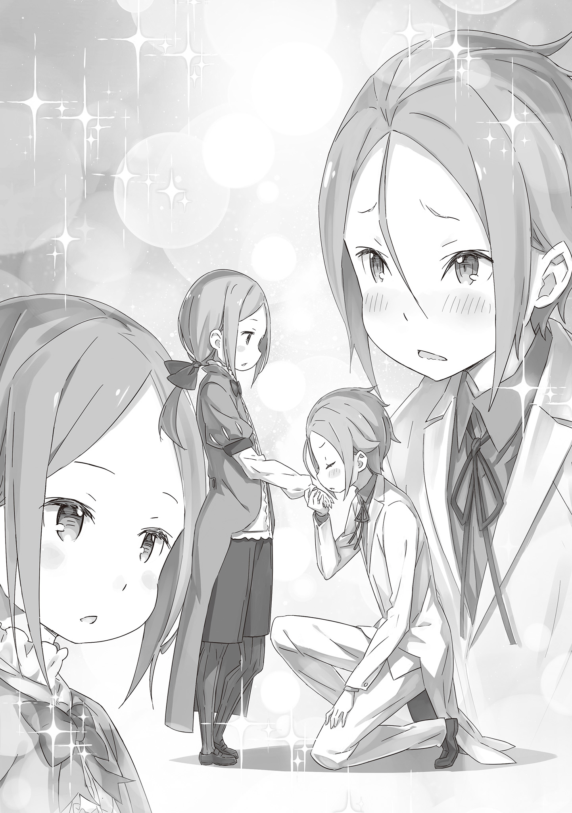

Вид из окна всегда казался иллюзией, которой он не мог достичь. Дом Юклиус имел древнее происхождение и на протяжении поколений поставлял рыцарей для Драконьего Королевства Лугуника.

Сквозь различные события, происходившие в истории Королевства Лугуника, члены Дома Юклиус сопровождали и торжественно поддерживали его в качестве рыцарей.

Это была не такая роль, как у Святого Меча и Демона Меча, что жили в свете своих выдающихся достижений в поворотные моменты истории Королевства. Однако, подобно тому как король был ничем без своих вассалов, всегда были безымянные обычные рыцари, скрывающиеся в тени героических свершений.

Дом Юклиус был не более чем родом, производившим таких обычных рыцарей. Они были опорой королевства, как люди, присягнувшие ему на верность.

Я никогда не сомневался в сути моей семьи. Как я упоминал ранее, это необходимость. За историями героев и других выдающихся людей должны стоять истории обычных людей. Это всего лишь вопрос наличия нужных людей в нужном месте и определения их ролей.

Другими словами, главная роль и второстепенная роль. Я думал, что между ними нет большой разницы. Если бы мне нужно было назвать проблему, то она всего одна…

— Кха .

Он закашлялся, его тело заскрипело и заныло где-то глубоко внутри без какой-либо причины. Его позыв к кашлю не исчезал, и он продолжал кашлять и тяжело дышать, терпя боль.

Это не было чем-то необычным. Всего лишь один из бессмысленных приступов, которые случались с ним по десять раз на дню. Это не было болезнью. Он просто был слаб и хрупок.

— Кха .

И реальность этой «слабости» была его неизбежным грехом.

В Доме Юклиус из поколений и поколений рыцарей, тот факт, что «старший сын» родился слишком слабым, чтобы держать меч, был тяжёлым грехом, который мог заставить его пожалеть о собственном рождении.

В этот мир Йешуа Юклиус был рождён грешником.

— Это Юлиус. С сегодняшнего дня он будет жить с нами. Изначально вы двоюродные, но отныне он будет твоим старшим братом, — сказал мне отец, глава нашей семьи.

Так я впервые встретил своего «старшего брата».

В тот день Йешуа чувствовал себя удивительно хорошо и впервые за долгое смог поесть вместе со своей семьёй. Вышеупомянутое представление произошло перед едой.

— Юлиус — сын моего младшего брата. Недавно он потерял своих родителей из-за несчастного случая, поэтому я решил взять его к себе и вырастить… У тебя есть какие-нибудь вопросы, Йешуа?

— Вопросы?

— Да. Юлиус на три года старше тебя… Если я приму его в нашу семью, он будет в положении твоего старшего брата. В таком случае…

Я заметил, как золотые глаза моего отца на мгновение метнулись в сторону .

Это было похоже на выражение вины, которое было видно лишь на краткое мгновение. Йешуа полностью понял невысказанные слова своего отца.

Из-за своего слабого тела Йешуа, естественно, доставлял кучу хлопот многим взрослым, особенно своим родителям. Дети вроде него также, естественно, приобретали способность читать лица взрослых.

Йешуа не был исключением. Вот почему он мог читать мысли своего отца — тот жалел Йешуа, но также отдавал приоритет выполнению главной миссии Дома Юклиус. Йешуа мог догадаться о напряжённости между его отцом и рыцарями, поэтому он не возражал.

У меня с самого начала не было права возражать.

Моему отцу вообще не нужно чувствовать всю эту вину.

Если бы я изначально родился с правильным телом, то не было бы этого странного разрыва.

Йешуа решил улыбнуться и кивнуть, как это сделал бы внимательный сын, чтобы успокоить своего отца.

— …

Можно было увидеть облегчение на лице его отца, когда мужчина опустил брови в ответ на реакцию Йешуа. Он не мог видеть истинные чувства сына, но его нельзя было в этом винить.

Ведь Йешуа был настолько хорош в сокрытии своей истинной сущности.

Вот почему…

— Юлиус, тебе следует представиться.

— Д-Да, отец! — сказал мальчик, когда отец подтолкнул его вперед.

Юлиус стоял перед Йешуа. Он выглядел аккуратно и имел тот же цвет волос, что и Йешуа и его отец — доказательство того, что в его жилах текла кровь Юклиусов.

— Меня зовут Юлиус Юклиус, и с сегодняшнего дня я буду жить с главной ветвью семьи. Я знаю, что странно, что я буду твоим старшим братом, хотя пришел сюда позже, но… Я надеюсь, что мы поладим, — сказал Юлиус без колебаний, как будто он много раз раньше практиковал эти предложения.

Затем он протянул руку.

Йешуа посмотрел на этот жест, приглашающий к рукопожатию, и попытался подстраховаться. Это была его первая встреча с тем, с кем он долгое время собирался провести вместе.

— Я Йешуа Юклиус. Тоже рад с тобой познакомиться, — Йешуа попытался дать нейтральный ответ, чтобы не произвести сильного впечатления.

Он мягко пожал руку Юлиусу и хотел закончить взаимодействие.

Или так он думал…

— А?!

В тот момент, когда они пожали друг другу руки, Йешуа увидел нечто немыслимое. Через секунду после того, как их руки коснулись друг друга, Юлиус склонился перед ним.

Затем, опустившись на одно колено на пол столовой, Юлиус нежно прикоснулся губами к тыльной стороне руки Йешуа — это была своего рода вежливость, которую рыцарь проявлял к даме.

— Я надеюсь, что мы будем вместе очень долгое время, — Лицо Юлиуса покраснело, когда он, стоя на колене, произнёс эти слова.

Это был не то действие, к которому он привык. Его голос дрожал, и его взгляд всё время бегал, но он выглядел так, словно достиг своей первой цели.

Йешуа затаил дыхание, когда…

— Хахахаха! Ахахаха! Юлиус, это приветствие, которое рыцарь дарит даме. Тебе не следует делать это с Йешуа…ах…ахахаха!

— Я-Я совершил ошибку?!

Пытаясь вытерпеть унижение и следовать учтивости, Юлиус был ошеломлен, когда на его ошибку было указано.

Это был первый раз, когда Йешуа видел, как его отец так громко смеялся и так широко улыбался. В столовой были и другие слуги, но его отец не смог сохранить приличия и сдержать смех.

— П-пожалуйста, не смейтесь надо мной! — воскликнул Юлиус. — Я много об этом думал…

— Ах, я знаю, знаю, — ответил его отец, утирая слезы, пока Юлиус отчаянно пытался сопротивляться. — Теперь тебе можно изучать этикет. Я вижу, что у тебя есть желание учиться, и этого достаточно.

Юлиус повернулся к Йешуа, казалось, опечаленный реакцией его отца.

Затем он попытался извиниться перед Йешуа за то, что поцеловал его руку,, сказав, что смутил его

— Т-ты в порядке? — спросил он.

— …А? — смущенно ответил Йешуа.

— Ты… ты плачешь… Тебе больно?

От слов Юлиуса тело Йешуа напряглось от удивления. Юлиус коснулся щеки Йешуа, спрашивая: «Видишь?», перед тем как продолжить: «Это слёзы».

Йешуа увидел несколько капель, слегка дрожащих на мизинце Юлиуса.

В тот момент, когда Йешуа понял, что это были его собственные слезы…

— …у…у…

Его эмоции хлынули так легко, что он не мог в это поверить. Это был такой мутный поток неизвестных чувств, что даже он не подозревал, что запечатал их.

Йешуа разрыдался, мгновенно оказавшись в резко хлынувшем потоке.

— О! Ах! Ох, отец! Что мне делать?! — воскликнул Юлиус.

— Д-Йешуа, что случилось?! — крикнул его отец. — Скажи мне, если что-то не так! Что произошло?!

Отец и Юлиус явно запаниковали, увидев рыдающего Йешуа. С его сыном было очень легко, если не считать его физического состояния. Удивление отца не было поразительным, учитывая внезапную перемену в поведении его сына.

Реакция слуг ничем не отличалась. Они мобилизовали все свои силы, чтобы остановить слёзы Йешуа.

…В конце концов, через некоторое время Йешуа перестал плакать, и его первая встреча со старшим братом запечатлелась в его памяти как горькое воспоминание.

— В своей семье я ничего для становления рыцарем не изучал.

Так Юлиус начал свой рассказ после того, как посетил комнату Йешуа через несколько дней после их горькой первой встречи.

Отец Йешуа, который теперь был и отцом Юлиуса, легко переключился с роли отца на роль главы дома Юклиус. Он подавил свою вину перед Йешуа, и Юлиус начал свое специальное обучение как рыцарь.

При этом, это было долгожданное рыцарское образование для отца, ведь изначально оно должно было быть дано Йешуа, но было оставлено в подвешенном состоянии, поэтому было понятно, почему он был так увлечён этим.

Конечно, я могу только представить, как тяжело будет Юлиусу, которому на самом деле придётся пройти через это.

— Если бы я знал, что все так обернётся, я бы ко всему относился серьёзнее…

— …Чем ты занимался в своей семье, брат? — назвав Юлиуса своим братом, Йешуа наклонил голову набок, лёжа на кровати.

Сегодня утром у Йешуа была температура, поэтому обеспокоенные слуги сказали ему отдохнуть в своей постели. Но к середине дня после обеда всё стало лучше.

В те дни, когда по утрам у него была температура, Йешуа обычно отдыхал весь день. Это была рутина, которой он следовал в течение долгого времени, чтобы не беспокоить других людей в доме и не заставлять их волноваться.

Вот почему обычно никто не входил в комнату Йешуа, когда он отдыхал. Никто. Кроме Юлиуса, который пришел пожаловаться на свое специальное ежедневное обучение.

— Я часто помогал своим маме и папе. Кроме того, я гулял со своими друзьями, жившими поблизости… Я не подозревал, что связан с таким большим Домом, как этот.

— Твой покойный отец рассказывал тебе что-нибудь о Доме Юклиус? — поинтересовался Йешуа.

— Вообще ничего! Я был очень удивлен, когда мой нынешний отец пришёл за мной.

Йешуа прищурил свои жёлтые глаза, когда Юлиус преувеличенно махал руками. Он много раз слышал о младшем брате своего отца, который также был отцом Юлиуса, а Йешуа приходился дядей.

Он был странным человеком даже в Доме Юклиус. Когда его старший брат стал главой, он быстро женился на обычной женщине и начал жизнь за пределами семьи.

Он был из тех людей, кто предпочитал простую и обычную жизнь, а не жизнь дворянина из Дома Юклиус. Не то чтобы мы были незнакомцами, но я никогда с ним особо не пересекался.

Причиной смерти его и его жены стало наводнение, произошедшее в городе, где жила семья Юлиуса. По-видимому, их унесло внезапным потоком, когда они пытались помочь другим.

— Они были великими людьми, — сказал Йешуа.

— … — Юлиус молчал.

— Брат?

Если они умерли, пытаясь помочь другим, это означало, что они жили как праведные и хорошие люди. Было иронично, что это было причиной их смерти, но это заставило Йешуа по-настоящему уважать своих дядю и тётю.

Однако Юлиус просто покачал головой в ответ на слова Йешуа, говоря: «Нет».

— Мои мама и папа не были особенными. Но все, в том числе и наш отец, говорят, что они сделали что-то великое. Но… — Юлиус всхлипнул. Затем он продолжил со слезами на глазах. — Но мне все равно, были ли они обычными, я просто хочу, чтобы они были живы. Разве странно так думать?

— Ну, это…

Это был вопрос, на который Йешуа не мог найти ответа.

Это определённо была сложная тема обсуждения для двух юных мальчиков, которые только что стали братьями. Юлиус вытер лицо рукавом перед молчаливым Йешуа.

— Мои мама и папа умерли, — продолжил он, — и наш отец привел меня сюда. У меня появился ты — младший брат, и многое изменилось, но… я все еще беспокоюсь.

— …Беспокоишься… о чем? — спросил Йешуа.

У него было тело, которое могло свободно двигаться, и его отец мог научить его всему необходимому, чтобы стать рыцарем. Он был Юлиусом Юклиусом, который теперь должен был пройти по пути, по которому должен был следовать Йешуа.

О чем, чёрт возьми, ты можешь беспокоиться, мой новый брат?

— Я не знаю, что мне следует делать. Я не знаю, нормально ли просто делать то, что говорит отец. Если я это сделаю…

Смогу ли я стать тем, кто сможет отплатить моим мёртвым отцу и матери?

Молодой Юлиус не мог подобрать подходящих слов, но именно это он хотел сказать. Йешуа уловил его невысказанные слова и задумался.

Он внимательно обдумал опасения Юлиуса. В то время Йешуа не понимал почему. Он просто об этом думал.

Если Юлиусу предстояло пойти по пути рыцаря как старшему сыну Дома Юклиус, который изначально был предназначен для Йешуа, это означало, что опасения, которые у него были, также были опасениями Йешуа.

Есть я, рождённый в рыцарской семье, и всё, что у меня есть, это тело, не подходящее для рыцаря. И есть Юлиус, который вырос обычным человеком, но будет воспитываться как рыцарь в рыцарской семье.

…Его путь определенно приведёт к незаконченному пути Йешуа Юклиуса.

— Герой…

— А? — Юлиус поднял брови на бормотание Йешуа.

Йешуа расслабил губы, глядя на слегка удивлённого Юлиуса.

— Твои родители были великими людьми. В таком случае, чтобы быть достойным своих родителей, тебе определенно нужно стать героем.

— Что… такое герой? — Юлиус наклонил голову, но продолжал слушать с явным отчаянием в глазах.

В ответ на этот взгляд Йешуа посмотрел на книжную полку в своей комнате. Там были разные книги из разных времён и стран, которые собрал для него его отец.

Там стояла любимая книга Йешуа, и в ней был будущий идеал Юлиуса.

Итак, давайте выслушаем эти истории в тишине и без спешки. Пусть они будут рассказаны со всей искренностью, чтобы желания Йешуа Юклиуса были доверены его новому «брату».

…Для того, чтобы они оба шли вместе по пути становления героями в качестве рыцарей Дома Юклиус.

《Конец》
