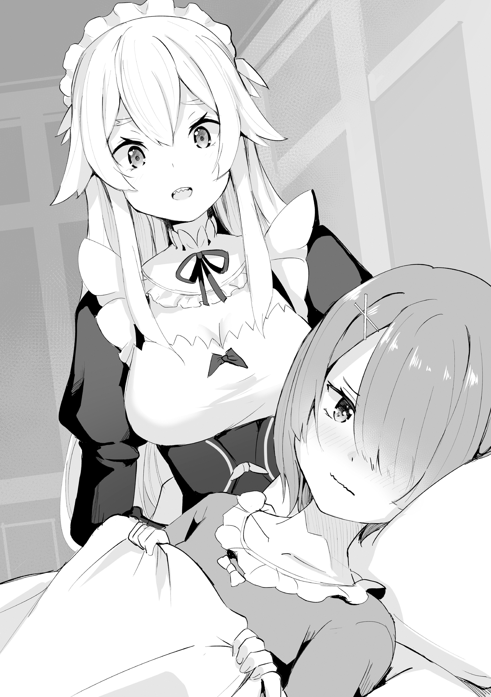
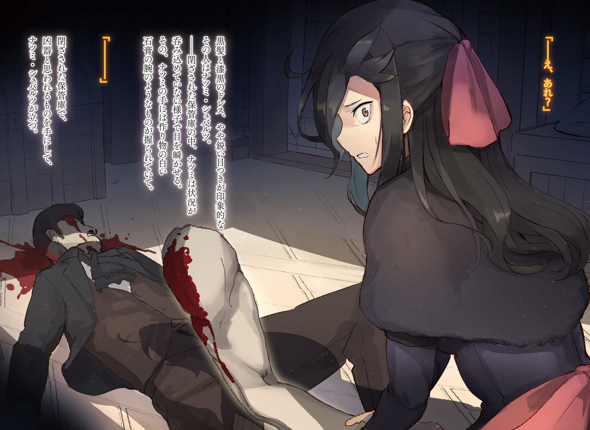
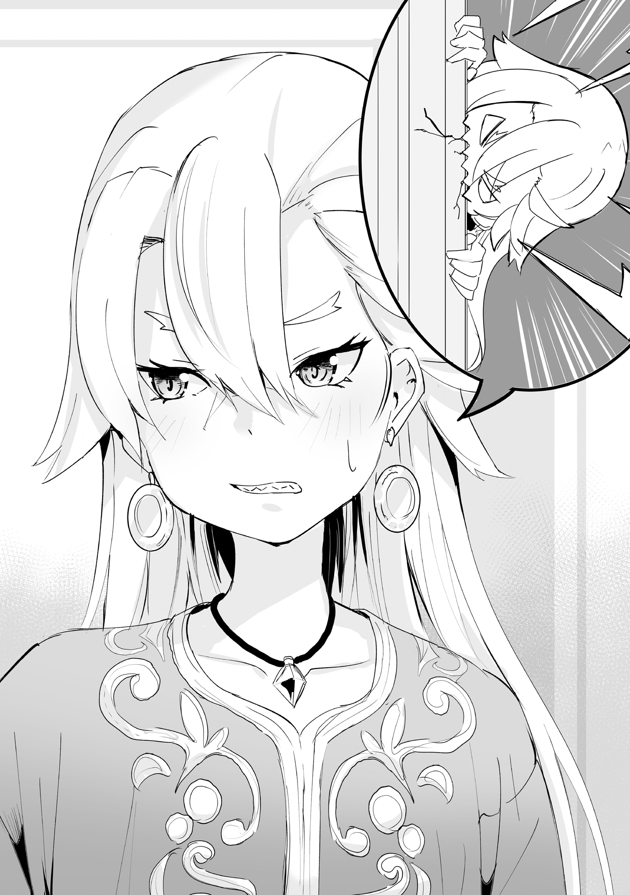
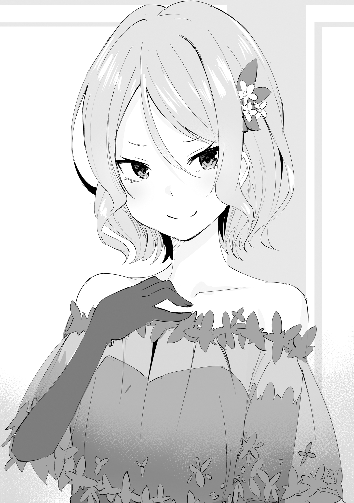

Картина, представшая взору, была образцом блистательного, ослепительного великолепия, присущего миру высшего общества.

Приём проходил в виде фуршета. Убранство зала поражало своей изысканной пышностью, а само роскошное здание было возведено с неимоверным, даже чрезмерным использованием ценнейших строительных материалов. Подумать только, в какую сумму обошлось нынешнее торжество — от одной этой мысли голова шла кругом.

Господа и дамы, приглашённые на сей вечер, были одеты с утончённой элегантностью, однако за внешней респектабельностью скрывались острые, порой безжалостные словесные поединки, в которых каждый из собеседников неизменно стремился подчеркнуть собственное превосходство.

Поистине, то был мир небожителей — даже в самом высшем обществе лишь горстке избранных дозволялось ступить в это святилище, где царили свои, особые законы.

Признаться, я всегда полагал, что подобные миры до конца моих дней останутся для меня за семью печатями, но…

«И каким же это образом, позвольте спросить, меня угораздило впутаться во всю эту историю?..» — чуть слышно вырвалось у меня, притаившегося в уголке зала.

Куда ни глянь, повсюду сновали небожители. И моей мещанской душе оставалось лишь в полном недоумении вопрошать, каким ветром занесло меня в это общество.

«И чем больше я размышляю о случившемся, тем мучительнее становится вопрос: отчего я избрал именно этот метод?..»

Всё ещё терзаясь этой проблемой минувшего дня, мучившей меня и до того, как оказался на приёме, я осторожно обратил свой взор на собравшуюся в центре зала публику. И хотя зал был полон гостей, внимание моё невольно привлекли несколько наиболее оживлённых групп. Первой, что бросилась в глаза, была компания, центром которой служила фигура в костюме шута.

Поскольку на приём были приглашены весьма состоятельные особы, наряды их отличались изысканностью и некоторой игривостью. Однако даже на этом фоне диковинный костюм упомянутого господина выделялся своей эксцентричностью. Впрочем, он привлекал к себе внимание не только благодаря своему облику, но и благодаря своему положению, ибо даже в этом блестящем обществе он, вне всякого сомнения, занимал одно из самых высоких мест.

А потому не было ничего удивительного в том, что многие, зная, какая роль отведена ему в великой игре, что ныне вершит судьбы Королевства Лугуника, прилагали все усилия, дабы снискать его расположение.

Ведя с ними ни к чему не обязывающую светскую беседу, молодой человек в костюме шута вдруг заметил мой взгляд. Он тотчас же прикрыл один из своих разноцветных глаз, подмигнув мне.

«Право, он столь неразборчив в чужих чувствах… Впрочем, нет, судя по выражению его лица, он прекрасно всё понимает» , — со вздохом подумал я. Увы, я уже достаточно хорошо разбирался в людях, чтобы постичь его истинные намерения, и потому смирился со своей участью.

Удручённо опустив плечи, я перевёл взгляд на другую группу гостей и приметил в ней ещё одно знакомое лицо. От сей картины у меня аж щека дёрнулась. «Ох, право же, господин Гвейн, вы так любезны!» — прикрывая рот изящной ручкой, с улыбкой проворковала дама, глаза которой обладали какой-то особой, притягательной силой. Редкого оттенка чёрные волосы и платье того же цвета подчёркивали её благородную осанку и изысканные манеры.

Умело ли она вела беседу или же была искусной слушательницей, сказать трудно, однако, окружённая несколькими джентльменами, она непринуждённо смеялась, создавая вокруг себя атмосферу редкой гармонии и согласия, и, судя по всему, весьма виртуозно лавировала в светском обществе. Я так и не смог решить для себя, восхищён ли я или встревожен её многогранными талантами.

Поодаль от них ещё одна дама, на сей раз блондинка с довольно резкими чертами лица, молчаливо, но решительно отвергала ухаживания кавалеров. Поистине, разительный контраст царил в поведении присутствующих.

И тут ко мне, скромному наблюдателю, погружённому в созерцание этой пёстрой сцены, неожиданно обратился один из гостей:

— Юная леди, полагаю, вы заскучали на вечере?

Богатые люди, как правило, могут позволить себе быть учтивыми без всякой задней мысли. В этом, несомненно, их сильная сторона, — подумал я, в то время как на моём лице застыла вежливая улыбка.

— О нет, сэр, просто столь многолюдная обстановка меня несколько утомила. Признаться, мне нечасто доводится бывать на подобных приёмах…

— Понимаю. В самом деле, я обратил внимание, что ваш прелестный лик мне незнаком. Не сочтите за грубость, но позволите ли вы узнать мне ваше имя?

Услышав слово «прелестный», я едва удержался от горькой усмешки. Однако, с неимоверным усилием подавив этот порыв, я лишь заставил себя улыбнуться ещё любезнее и, присев в реверансе, представился:

— Одри Суффл, к вашим услугам.

«Какая ещё Одри Суффл?!» — мысленно простонал Отто Сувен.

В платье, с украшениями в волосах и лёгким слоем косметики на лице.

События, о которых пойдёт речь, произошли примерно за тридцать шесть часов до описанного ранее светского приёма.

— Это, вне всякого сомнения, простуда.

Убедившись в состоянии Рам, что лежала на кровати в своей комнате с пылающим лицом, Фредерика — горничная со светлыми волосами — медленно покачала головой и поставила безжалостный диагноз.

— Ясно, — коротко отозвалась Рам, — ты ошибаешься. Рам совершенно здорова. Грош цена словам Фредерики.

— Да что ты говоришь! Прекрати упрямиться. Если ты появишься на людях в таком состоянии и, не ровен час, потеряешь сознание, то кому, по-твоему, доставишь больше всего хлопот?

— Кх… Какая низость!..

Фредерика осторожно коснулась лба Рам, которая пыталась подняться и слезть с кровати. Услышав упрёк Фредерики, Рам, чьи щёки напряглись от досады, отвернулась и потупила взор.

— Можешь называть это низостью, как тебе будет угодно. Но в любом случае, Рам, тебе надлежит провести в постели несколько дней. Тебе ведь и самой известно, что твои недомогания имеют обыкновение затягиваться, поэтому побереги себя, сделай милость.

— Но если Рам останется в постели…

— …Я сама поставлю в известность господина. И следует также подумать, кем тебя заменить.

Сказав это, Фредерика снова легонько надавила Рам на лоб, уложив зардевшуюся и сверлившую её гневным взглядом девушку обратно.

Наказать ей отдыхать подобным образом. Этой упрямице, младшей коллеге, иначе и не втолкуешь, что ей следует сохранять покой.

А потому…

— Я как-нибудь улажу это дело, так что, пожалуйста, лежи и отдыхай.

Так, твёрдо заверив её, Фредерика постаралась успокоить Рам — это был самый верный способ.

— Итак, Рам надлежит провести в постели несколько дней. Чтобы не заразиться, постарайтесь, пожалуйста, как можно реже бывать в её комнате.

Так, во время еды, Фредерика уведомила всех о состоянии здоровья Рам.

Собравшиеся в столовой поместья Розвааля члены лагеря Эмилии выслушали её сообщение, и каждый отреагировал на него по-своему. Субару, например, сложил руки на груди и слегка наклонил голову.

— Надо же, Рам подхватила простуду. Прямо таки «Хворь Они» , как говорится.

Примечание: 鬼の霍乱 (они но какуран) — Хворь/Холера Они. Эта идиома используется для описания ситуации, когда человек, который обычно невероятно крепок, вынослив и никогда не болеет, неожиданно слёг с болезнью.

— Ну вот, Субару, вечно ты со своими странными словечками… Так с Рам всё в порядке? Это действительно обычная простуда?

— Да, прошу вас, не беспокойтесь. Однако сейчас весьма ответственное для вас время, госпожа Эмилия, и Рам, разумеется, не хотела бы заразить вас… во всяком случае, я так полагаю.

— Неуверенность в голосе естественна, когда речь идёт о сестрице, — усмехнулся Субару, глядя на нерешительность Фредерики.

«Передай простуду другому — и сам выздоровеешь» , — вот что могла бы сказать Рам, поэтому нетрудно было понять, почему Фредерика не осмелилась выразить своё предположение более определённо.

Как бы то ни было, хотя недомогание Рам и вызывало беспокойство, оставалось только наблюдать за течением болезни и ожидать её выздоровления. У Субару, скорее всего, не было иммунитета к болезням этого мира, так что ему следовало поберечься, дабы не слечь с каким-нибудь серьёзным недугом.

— Интересно, что будет со мной, если я подхвачу здешнюю простуду?.. Скажи, Эмилия-тан, ты помнишь, как сама болела? Это очень тяжело?

— Что? Я? Прости, я никогда не простужалась, поэтому не знаю…

— Вот как? Никогда не болела, необычно.

Сидевшая рядом Эмилия в ответ на вопрос Субару только растерянно сдвинула брови. Потом она напрягла бицепс и, так шутливо пригрозив ему, добавила:

— Наверное, это потому, что я всегда слушалась Пака — хорошо ела и спала в тепле? Я с самого детства была о-о-очень здоровой.

— Советы Пака по части здоровья и красоты всегда верны, тут не поспоришь…

В том, что Эмилия расцвела в такую прекрасную юную леди, несомненно, имелись заслуги не только её врождённых качеств, но и благоприобретённых — не без помощи советов Пака.

Красота ведь проявляется и в неуловимых чертах поведения, в манерах. И в этом отношении Эмилия была также само совершенство.

— И всё же твой рассказ мало прояснил мои представления о здешней простуде. …Беако, а ты когда-нибудь… Впрочем, не, вряд ли.

— Разумеется, нет, я полагаю. Бетти была бы весьма огорчена, если её поставили в один ряд с обычными людишками, в самом деле. Я не настолько слаба, чтобы поддаться влиянию чего-то вроде простуды, я полагаю.

— Мило, с каким важным видом ты говоришь совершенно бестолковые вещи.

Сказав это, Субару нежно погладил по голове Беатрис, которая с гордостью излагала своё мнение, а затем, оставив её, с надеждой посмотрел на двух других сотрапезников — Гарфиэля и Отто. Впрочем, он тут же отвёл взгляд.

— Да и у вас двоих, судя по всему, с простудой весьма отдалённые отношения.

— Интересно, что именно в моём виде навело тебя на такую мысль?.. Впрочем, признаться, я тоже никогда не хворал простудой, так что и возразить-то мне нечего.

— И крутой я тоже. Сеструха, а Рам чё, магией исцеления не вылечить?

Ответы обоих были ожидаемы, а на вопрос брата Фредерика отрицательно покачала головой.

— Я понимаю твои чувства, Гарф. Но, к сожалению, в её случае имеют место некоторые особенности организма, поэтому магия здесь бессильна.

— …Тьфу ты, вот как. Ясно.

Гарфиэль питал к Рам нежные чувства. Естественно, услышав, что предмет его обожания страдает, он был обеспокоен, однако не настолько упрям, чтобы бездумно отвергнуть мнение сестры.

Лечение ран и исцеление от болезней — совершенно разные вещи, и магия, видимо, не была всесильна.

— Да! Господин Субару, я болела простудой!

— О! Петра, ты просто чудо! Одна лишь ты оправдываешь мои ожидания! Впрочем, Эмилия-тан и остальные тоже их оправдали, если уж быть точным.

— Э-хе-хе, можете на меня положиться. Ну, даже думать было тяжело, и было так плохо!

— Точно!

С готовностью подняв руку, Петра поделилась своим опытом, и Субару подтвердил, что её воспоминания о простуде полностью совпадают с его собственными.

В памяти его всплыла мучительная ночь, проведённая в жару: мать, перепутавшая соль с сахаром и оставившая возле его кровати кашу, и отец, который, стащив у него эту кашу, потом плевался и корчился. Да, воспоминания не из приятных.

И пока он предавался этим размышлениям…

— Субару, а меня ты не хо~о~очешь спросить?

Розвааль, сидевший во главе стола, помахал рукой. В ответ на такое желание привлечь к себе внимание Субару почесал в затылке и, сказав: «Нет…», — добавил:

— Ну я могу и спросить, только ведь ты, Розвааль, всё равно никогда не болел простудой, так?

— Ох, немного оби~и~идно. Между прочим, в детстве я был о~о~очень болезненным мальчиком. И хоть то была не простуда, но я ужа~а~асно намучился с другими недугами.

— Хэ-э, хм.

— Ой, тебе, кажется, не слишком интересно.

— Я не знаю, насколько можно верить твоим словам, да и рассказ Петры был куда более живым и милым, так что победа за Петрой. Победитель — Петра.

— Ура! Я победила!

Обрадованная Петра подбежала к Субару, и тот дал ей пять. Потом, подхватив девочку на руки, он закружил её под радостное «Уа-а-а» и осторожно опустил на пол. Увидев, что Беатрис смотрит на них с недовольным видом, он точно так же подхватил и закружил в воздухе уже её.

— Фу-фу, Субару, ты, я вижу, хорошо с ними ладишь. Мне бы тоже хотелось попробовать.

— С Эмилией-тан? Ну, Эмилия-тан лёгкая, как ангельское пёрышко, так что я справлюсь, просто просьба немного… неожиданная.

— Петру и Беатрис, похоже, о-о-очень приятно обнимать.

— А, так ты тоже хочешь их покружить? Тогда вот, держи.

— Бетти не вещь, чтобы её передавали из рук в руки, я полагаю!

Едва он передал Беатрис Эмилии, как та возмущённо запротестовала. А Эмилия, радостно подхватив малышку, принялась кружить с ней по комнате.

Зрелище было в высшей степени умилительное, но…

— Весьма сожалею, что прерываю развлечение госпожи Эмилии, но если я не ошибаюсь, завтра вечером Рам должна была сопровождать маркграфа?

— Благодарю вас, господин Отто. Да, именно в этом и заключается проблема.

В ответ на слова Отто, поднявшего руку, Фредерика приняла серьёзный вид, давая понять, что они подошли к главной теме сегодняшнего разговора.

И проблема эта, как совершенно верно заметил Отто, заключалась в следующем.

— Завтра вечером Рам должна была сопровождать господина на приём, устраиваемый господином Гвейном Мереттом. Однако, поскольку Рам простудилась…

— Роз-чи придётся скучать на приёме в одиночестве?

— Если бы я рассматривал только Рам, то, коне~е~ечно, так бы и поступил. Но к несчастью, на приём к господину Гвейну допускаются лишь те, кто выполнит одно непременное условие: дама в качестве спутницы соверше~е~енно необходима.

— Что ещё за условие такое…

«Неужели бывают такие нелепые требования» , — подумал Субару и вопросительно посмотрел на Фредерику. Та в ответ серьёзно кивнула и, глубоко вздохнув, сказала:

— Это может показаться шуткой, но, увы, это правда. Господин Гвейн является главой торговой гильдии западных областей Королевства… то есть тех земель, центром которых является поместье Мейзерсов. Человек он чрезвычайно способный, однако, имеет, так сказать, некоторые… сложности в характере…

— Он ведь важный человек, верно? Что же это за сложности?

— Он близкий друг господина, и характеры у них схожи.

— У-у-у.

Этих слов было вполне достаточно, чтобы сразу представить себе, сколь несносным должен быть этот ещё не виденный им господин Гвейн.

И все присутствующие за столом разделили беспокойство, которое испытывала Фредерика.

— Итак, на приём к этому приятелю Розвааля необходимо явиться в сопровождении дамы? Я бы смирился и без каких-либо причин, но всё же хотелось бы знать, есть ли они?

— Ну-у, господин Гвейн, надо полагать, не преследует никакой иной цели помимо желания оживить свою вечеринку. И надо сказать, она пользуется невероятным успехом. Влиятельные отцы семейств частенько выбирают своих дочерей в качестве спутниц, чтобы представить их какому-нибудь подающему надежды молодому человеку.

— Понимаю, вполне обычно для аристократов…

Так называемые светские приёмы, существующие в высшем обществе, как полагал Субару, зачастую служили местом, где отпрыски благородных семейств могли завести полезные знакомства.

И нынешний рассказ, похоже, не слишком расходился с его представлениями.

— Если Рам не может поехать, что же нам делать? Других вариантов нет?

— Раз Рам не годится, чё б сеструхе не поехать? А-а, сеструха слишком большая, и лицо у неё страшное, с ней только репутаци… Ай!

— Господин Гарф, ваши слова меня разозлили.

Высказывание Гарфиэля задело за живое не саму Фредерику, а её коллегу Петру. Схватив Гарфиэля за ухо, она так сильно дёрнула его, что парень сморщился от боли.

— Благодаря Петре я не стану ничего говорить Гарфу, однако сопровождать господина было бы для меня затруднительно. Учитывая, что Рам больна и за ней нужен уход, домашние дела останутся без присмотра.

— У-у-у.

Оставить поместье на попечение Петры и отлучиться на несколько дней Фредерика не решалась. Услышав это, Петра надула щёки, сетуя, видимо, на собственную беспомощность.

— Ах, раз уж ни у кого не получается, может, я тогда поеду?

— Нет, Эмилия-тан, это едва ли…

В качестве альтернативы Эмилия, на коленях у которой сидела Беатрис, предложила свою кандидатуру. Однако Субару счёл это проблемным и остановил её.

Дело было не в том, что он опасался выпускать Эмилию в светское общество. Вернее, опасения, конечно, были, но нынешний его отказ был вызван совсем другими причинами.

— Я согласен с Нацуки. Если госпожа Эмилия составит компанию маркграфу, боюсь, остальным гостям будет уже не до приёма…

— Это потому, что я полуэльф?

— Отнюдь, госпожа Эмилия, это потому, что вы кандидат на Королевских Выборах.

Опасения Эмилии были совершенно напрасны, ибо главная проблема заключалась в её нынешнем положении.

В Королевстве Лугуника шла борьба за трон, и Эмилия, будучи одной из претенденток, являлась в этой стране одной из самых высокопоставленных особ.

Если бы она без предупреждения явилась на приём, замешательство среди гостей было невообразимым.

— Организатор вечеринки также едва ли обрадуется, если у него отнимут роль главного действующего лица. Учитывая влияние торговой гильдии, вам, полагаю, следует поддерживать добрые отношения с господином Гвейном. Разве я не прав?

— Совершенно, соверше~е~енно прав. Как и ожидалось, Отто, ты весьма проницателен. Впечатляет.

— Сам не ожидал, признаться… Как бы то ни было, именно по этой причине я считаю, что госпоже Эмилии было бы благоразумнее воздержаться от сопровождения маркграфа.

— Хм-м, хорошо, я поняла. Спасибо, наставник Отто.

Выслушав столь обстоятельное объяснение, Эмилия кротко уступила, но, помедлив, добавила:

— Но в таком случае кто же поедет с Розваалем? Если и я, и Фредерика не можем…

— Я абсолютно против.

— Быстро.

С прелестной улыбкой Петра тотчас же отвергла свою кандидатуру.

Её отказ был столь категоричен, что ни у кого не возникло даже мысли пытаться её переубедить.

— Итак, если Петра отказывается, то последний оставшийся вариант…

Если ограничить выбор только девушками, то, поскольку Рам, Фредерика, Эмилия и Петра выбыли, оставалась лишь одна кандидатка.

Разумеется, спящая Рем в расчёт не принималась, а потому…

— …Беатрис.

— Ух…

Выдавила привалившаяся к Эмилии Беатрис. Имя её произнёс Розвааль, и его разноцветные глаза были сейчас устремлены прямо на девочку.

Отношения этих двоих и после событий в Святилище оставались чрезвычайно сложными.

Собственно говоря, положение самого Розвааля в лагере было весьма щекотливым, но их отношения с Беатрис были сложны и запутаны совершенно по другим причинам.

Разумеется, Беатрис сердилась на Розвааля. И было за что сердиться. И всё же Беатрис была слишком добра.

Если бы Розвааль искренне обратился к ней с мольбой, она не смогла бы бессердечно отвергнуть его.

А потому…

— Хо-хорошо, в самом деле. Мне это крайне, крайне неприятно, но если ты как следует попросишь, я, возможно, и не откажусь выслушать, я полагаю. Бетти… поедет с тобой на приём…

— Ну~у~у, я очень тронут твоей добротой, но, боюсь, ты слишком юна~а~а, чтобы выступать в роли спутницы. И объяснить окружающим наши с тобой отношения было бы весьма~а~а затруднительно.

— Просто умри, в самом деле!

Едва только проявив милосердие, Беатрис столкнулась с противоположным отношением и швырнула салфетку в Розвааля. Тот с лёгкостью увернулся и, сложив руки на столе, произнёс:

— Итак, как видите, мы оказались в весьма затруднительном положении. Как и сказал Отто, мне бы очень хотелось сохранить добрые отношения с господином Гвейном, особенно в свете предстоящих Королевских Выборов. А потому пропустить его приём было бы кра~а~айне нежелательно.

— А если объяснить ему ситуацию и явиться без спутницы…

— Это будет удар по моему положению маркграфа. Я бы сказал, что это плохо~о~ой ход.

Медленно покачав головой, Розвааль отверг предложение Субару.

Признаться, Субару сомневался, насколько можно верить словам Розвааля, но кое в чём они были заодно — в намерении во что бы то ни стало выиграть Королевские Выборы.

А следовательно, и к нынешней ситуации надлежало отнестись со всей серьёзностью.

— Альтернатива, альтернатива…

Эмилия и остальные девушки их лагеря не могли его сопровождать.

Если Беатрис не подходит, то по той же причине не стоит и уговаривать Петру. В таком случае наилучшим выходом было бы поискать спутницу вне их круга, но имелась ли поблизости подходящая особа, с которой они были бы в достаточно хороших отношениях?

— Аннероза… тут тоже не вариант, да?

— Скорее всего, она и сама приглашена на вечер. Если бы речь шла о помощи госпоже Эмилии, она, конечно, с радостью бы согласилась, но…

Дальняя родственница Розвааля была ревностной почитательницей Эмилии, так что если бы просьба исходила от неё, девочка, несомненно, оказала бы им содействие. Но если она сама в числе приглашённых, то это бессмысленно.

А раз так, то…

— …остаётся прибегнуть к последнему средству.

— М-м?

Услышав это решительное заявление Субару, Эмилия удивлённо склонила голову набок.

Ради этой очаровательной девушки, — Субару был твёрд в своём решении, — он готов лезть из кожи вон.

Прошёл день, и вот настало время Розваалю отправляться на вечеринку.

У парадного входа уже ожидал драконий экипаж. Казалось, всё было готово к отъезду. Однако проблема со спутницей всё ещё не была решена, и лицо Эмилии омрачилось тревогой.

— Субару заверил меня, что всё уладит, но…

Участие в этом приёме было важным шагом для Эмилии в Королевских Выборах. И мысль о том, что она вновь оказывается столь беспомощной, терзала её.

Отрадно было, конечно, что Субару, как всегда, с готовностью предложил свою помощь.

— Не стоит беспокоиться, в самом деле, Эмилия. Раз Субару сказал, что всё устроит, значит, так оно и будет, я полагаю.

— Беатрис…

— Если уж Субару взялся за это дело, то у него, несомненно, имеется какой-то план, в самом деле. А нам с тобой, вероятно, следует просто довериться ему и терпеливо ждать, пока он не попросит о помощи, я полагаю.

Беатрис, сидевшая рядом с Эмилией с самым невозмутимым видом, старалась подбодрить её. И её доброта и забота согрели сердце Эмилии. Беатрис и в самом деле сильно изменилась.

И эти изменения произошли благодаря не кому иному, как Субару.

— М-м, ты права. Я поверю в Субару… Нет, я уже верю в него.

— Вот это верный настрой, в самом деле.

Беатрис с гордым видом кивнула, и Эмилия, улыбнувшись, нежно погладила девочку по голове. Беатрис не отстранилась, лишь со вздохом приняла эту ласку.

— Прошу вас, не беспокойтесь, госпожа Эмилия. На крайний случай, у нас с Петрой имеется запасной вариант.

Увидев, как Эмилия и Беатрис мило беседуют, Фредерика, также вышедшая проводить Розвааля, вмешалась в их разговор. Петра, стоявшая рядом с ней, подтвердила её слова, решительно сжав кулачки:

— Это плод нашей с сестрицей Фредерикой усердной работы! Мне было бы противно делать это лишь ради господина, но для сестрицы Эмилии я выложилась на полную!

— Правда? Не знаю, о чём речь, но спасибо тебе, Петра.

— Э-хе-хе.

Петра очаровательно покраснела, и Эмилия улыбнулась, тронутая усердием девочки. Однако Фредерика, стоявшая рядом, продолжила, добавив: «Но…»

— …Имеется одно обстоятельство, которое внушает мне беспокойство… Похоже, Рам тоже что-то замышляла, и кто знает, что взбрело ей в голову, будучи прикованной к постели.

— Кажется, она звала господина Отто, но зачем, интересно?

В ответ на слова Фредерики Петра, приложив палец к губам, задумчиво склонила голову.

То, что Рам, которой надлежало сохранять полный покой, вызвала Отто — самого деятельного и трудолюбивого члена их лагеря — действительно вызывало недоумение. Ведь если он заразится простудой, это будет крайне неприятно.

— Хм, Розвааль что-то запаздывает. Да и Субару с остальными не видать…

— …Прошу простить, что заставила вас ждать.

— А?

Время отъезда приближалось, и Эмилия, обеспокоенная отсутствием Розвааля, уже начала волноваться, как вдруг её слух всколыхнул незнакомый голос.

— А-ах…

Обернувшись, Эмилия широко раскрыла свои аметистовые глаза. В них отразилась дама в чёрном платье, появившаяся из главных ворот поместья Розвааля.

Блестящие длинные чёрные волосы, украшенные большим бантом, и платье цвета воронова крыла — этот облик был Эмилии смутно знаком. Кажется, она уже встречалась с этой девушкой.

— …Если я не ошибаюсь, вы мисс Нацуми Шварц, верно?

— Да, госпожа Эмилия, рада вновь видеть вас. Для меня большая честь, что вы меня помните.

С этими словами дама — Нацуми Шварц — приблизилась к Эмилии и, изящно ухватив уголки платья, исполнила безукоризненный реверанс. В ответ Эмилия, слегка смутившись, тоже неуклюже присела.

Улыбающаяся Нацуми — эта девушка со странной, запоминающейся манерой держаться — однажды, ещё до пожара в поместье Розвааля, когда был приглашён легендарный повар, сидела с Эмилией за одним столом.

Красивая, утончённая, и в то же время кажущаяся необъяснимо близкой.

Она располагала к себе, как давняя знакомая, но, к великому сожалению Эмилии, едва окончив трапезу, тут же покинула поместье, так что им не удалось толком поговорить.

— Но какими судьбами вы здесь, Нацуми?

— Собственно говоря, меня попросил об этом господин Нацуки Субару. А именно — сопроводить достопочтенного маркграфа на сегодняшний приём.

— Ах…

Услышав объяснение Нацуми, Эмилия поняла, что это и был тот самый план, который придумал Субару. Каким образом эти двое связаны, неизвестно, но, очевидно, Субару и Нацуми находились в таких отношениях, что могли просить друг друга об услугах.

И вот теперь Нацуми согласилась выручить их.

— Постойте, а где же сам Субару?

— Что касается господина Нацуки, то в обмен на моё согласие сопровождать маркграфа на сегодняшней вечеринке, он вызвался помочь моим родителям по хозяйству. Всего на один день, завтра он уже вернётся.

— …Да уж, Субару вечно стремится казаться таким благородным.

То, что Субару, ничего не сказав Эмилии, сам всё устроил, было так на него похоже. Слегка улыбнувшись его расторопности, Эмилия поклонилась Нацуми.

— Благодарю, что приехали. Насчёт сегодняшнего вечера, я на вас рассчитываю.

— Да, можете всецело на меня положиться. Я исполню всё в лучшем виде.

С этими словами Нацуми с неожиданно мужественным видом ударила себя кулаком в грудь.

Наконец успокоившись, Эмилия облегчённо вздохнула и, обернувшись к стоявшим рядом Беатрис и остальным, спросила:

— …? Беатрис, что с тобой?

— …Ничего особенного, я полагаю. Просто Бетти оказалась доверчивой дурочкой, в самом деле.

— О-хо-хо-хо, какое очаровательное дитя!

Увидев нахмурившуюся Беатрис, Нацуми прикрыла рот рукой и улыбнулась. Заметив это, Беатрис насупилась ещё больше, но Эмилия так и не поняла, отчего у неё такое настроение.

Впрочем, если уж говорить о непонятных вещах, то Беатрис была не единственной, чьё поведение вызывало у Эмилии недоумение.

— Фредерика, Петра, а что с вами двумя? Что-то случилось?

— А, нет, собственно, э-э-э, это…

Запинаясь, Фредерика отвела взгляд. В ответ на её невнятное бормотание Эмилия в смятении склонила голову.

— Дело вот в чём! Сестрица Фредерика тоже попросила помощи у своей подруги!

Тут вместо Фредерики заговорила Петра. Взволнованно размахивая руками, она торопливо ответила на вопрос Эмилии:

— Мы помогали этой самой подруге переодеться в одной из комнат особняка! Поэтому мы думали, что вопрос со спутницей господина уже решён и всё в порядке…

— А, вот оно что? Но тогда как же быть? Ведь Нацуми тоже здесь…

Таким образом, вместо отсутствия спутницы возникла проблема избытка таковых.

Впрочем, лучше уж избыток, чем недостаток. Эмилия, не слишком искушённая в делах высшего общества, затруднялась принять решение в столь щекотливом вопросе, но…

— Прошу проще~е~ения за излишнее ожидание. Я уже готов.

— Розвааль! Ты не представляешь, тут такое дело…

Услышав голос виновника торжества, Розвааля, Эмилия поспешно обернулась к нему. Она хотела было попросить его совета по поводу избытка спутниц, но…

— …

Её взору предстал Розвааль, сопровождаемый двумя незнакомыми дамами, по одной с каждой стороны.

Одна из них была невысокого роста, с длинными светлыми волосами и глазами цвета изумруда. Свободное платье окутывало её фигуру, и держалась она с прямой осанкой.

Было в ней нечто схожее с Фредерикой, и, если не считать разницы в росте, черты их лиц, пожалуй, тоже были похожи. Вероятно, это и была подруга Фредерики.

В таком случае, кто же была вторая дама?

— У-у-у…

Хрупкая, с волнистыми пепельными волосами, украшенными изящной заколкой. Черты лица — андрогинные, но лёгкий слой косметики подчёркивал утончённую красоту. Ей очень шло платье, обнажавшее белые тонкие плечи, и лишь то, как она шла, опустив голову, несколько портило общее впечатление.

— Э-э, Розвааль, а эти две девушки…

— Госпожа Эмилия, позвольте представить вам мисс Гарнет и мисс Одри. Я только что встретил их в холле. Похоже, Фредерика и Рам любезно позаботились о том, чтобы я не скучал сегодня вечером в одиночестве.

— То, что Фредерика постаралась, я знала, но и Рам тоже?

Судя по этому объяснению, дама с пепельными волосами — Одри, как представил её Розвааль, — и была той, кого Рам попросила заменить её.

В итоге, благодаря стараниям всех членов их лагеря, набралось целых три спутницы.

— …Ох, кого я вижу…

— Давно не виделись, маркграф Мейзерс. Нацуми Шварц, к вашим услугам.

Розвааль заметил Нацуми, которая скромно стояла рядом с Эмилией и остальными, также вызвавшись быть его спутницей. «Да-да», — сказала Эмилия и, коснувшись плеча Нацуми, добавила:

— Субару попросил её, и Нацуми приехала. Но…

— Нет, что вы, понимаю. Очень хорошо, что вы пришли, мисс Нацуми. В таком случае, хотя это и несколько нестандартно…, — тут Розвааль улыбнулся ещё шире и, прикрыв один глаз, посмотрел на Нацуми своим голубым. Затем, обернувшись к Эмилии и остальным, он широким жестом обвёл всех трёх кандидаток в спутницы и объявил, — на сегодняшнем приёме меня будут сопровождать все три дамы.

Так, объявив о своём смелом выборе, он блистательно разрешил возникшую ситуацию.

Итак, подчиняясь столь неожиданному предложению Розвааля, Нацуми и две другие спутницы отправились прямиком к месту проведения вечеринки. Драконий экипаж резво покатил по дороге, унося их прочь от родного особняка.

И пока он удалялся, провожавшие его взглядом…

— …Сестрица Фредерика, всё ли будет в порядке?

— Право, не знаю… — задумчиво ответила Фредерика, прикрыв рот рукой. — Внешне они, конечно, само совершенство, но ведь внутри-то… внутри всё иначе.

Их план, хотя и нельзя было назвать блестящим, был по-своему смел, однако им и в голову не могло прийти, что ещё двое изберут тот же самый путь.

Сулит ли это удачу или, напротив, обернётся бедой — сказать трудно, слишком уж много в этом деле непредвиденных обстоятельств.

— Но я считаю, что всё будет в порядке. В конце концов, с ними будет господин Отто.

— Да. Раз Отто там, значит, всё обойдётся.

Пытаясь таким образом развеять свои опасения, Фредерика и Петра возлагали все надежды на одного молодого человека. Беатрис, прислушивавшаяся к их разговору, приложила руку ко лбу и тяжело вздохнула.

Будучи одной из немногих, кому была известна вся подноготная этого дела, Беатрис пробормотала:

— Поистине, что за нелепое решение, я полагаю. Как партнёру Бетти, ему не хватает самосознания, в самом деле.

— Послушай, Беатрис. Не только Субару, но и Отто с Гарфиэлем куда-то делись. Куда они запропастились, интересно?

— …

Задумчиво склонив голову, Эмилия, единственная из всех пребывавшая в полном неведении, с недоумением посмотрела на Беатрис. Та, не зная, что и ответить, совсем растерялась. Учитывая чувства Субару, как ей, его партнёрше, следовало бы поступить?

Решив, что правду пока говорить нельзя, Беатрис глубоко вздохнула.

— Апчхи!

— Ой! Какая гадость! Неужели нельзя прикрыть рот, когда чихаешь!

Одри, сидевшая в мчащемся экипаже, неожиданно чихнула, и Нацуми, мигом утратив свою деланную аристократическую изысканность, грубо накинулась на неё.

Услышав её голос, Гарнет нарушила молчание:

— Всё-таки это Капитан. Ну и ну! От настоящей женщины и не отличишь. Хоть запах и Капитана, но крутой я всё равно не был уверен, что ты Капитан. Как тебе удалось?

— Кажется, мои старые навыки и упорный труд сделали своё дело. …Ну, как вам мой голос? Достаточно ли он женственный?

— Офигеть!

Слегка кашлянув, Нацуми изменила голос, и Гарнет от удивления даже хлопнула себя по колену. Заметив, что блондинка, удобно усевшись, раздвинула ноги, Нацуми неодобрительно нахмурилась:

— Хоть здесь и нет посторонних глаз, твою позу, Гарнет, иначе как непристойной не назовёшь. Если ты и дальше намерена вести себя подобным образом, как ты собираешься исполнять возложенную на тебя роль? Если и Фредерика с остальными сделают тебе выговор, то пеняй на себя.

— Угх… П-понял. Раз уж крутой я взялся за дело, то не оплошаю…

В ответ на резкое замечание Гарнет сдвинула ноги и, слегка склонив корпус, улыбнулась. Щёки её, правда, чуть заметно подрагивали, но, возможно, благодаря стараниям Фредерики… нет, Петры, которая искусно сделала макияж, Гарнет приобрела некоторые черты, делавшие её весьма похожей на сестру.

Если бы она хранила молчание и улыбалась, никто, учитывая, что платье скрывало её фигуру, не смог бы разгадать её истинный пол.

И тут…

— Ну, а ты до каких пор собираешься отмалчиваться? Не пора ли уже собраться с духом?

— Лично меня больше удивляет, с чего это ты сам преисполнился такой решимости?!

— О-хо-хо-хо-хо!

Одри, покраснев, кричала на громко смеющуюся Нацуми, прикрывшую рот рукой. Однако тут же, словно устыдившись своей несдержанности, она воскликнула: «А-а-а!» — и закрыла лицо руками.

— Ну почему всё так вышло! И вообще, если кроме меня есть ещё двое, то к чему было прибегать к таким крайним мерам! Меня обманули!

— Обманули? Как некрасиво звучит. Никто тебя не обманывал. Просто из-за отсутствия должной координации все наши благородные порывы обернулись этим хаосом.

— Точно-точно.

В ответ на горестные, словно настал конец света, стенания Одри Нацуми ласково похлопала её по плечу и, округлив глаза, воскликнула «Ох!».

— А тебе неожиданно подходит этот образ. Раскрыт вкус каждого ингредиента.

— Такая оценка меня совсем не радует!

— Это всё сноровка Рам. Отто-бро, как ты только на такое согласился?

— Уж от вас двоих, Нацуки и Гарфиэль, я бы предпочёл не слышать подобных вопросов!

Тут Одри, вернее Отто, с яростью набросился на Гарнет, то есть Гарфиэля.

Излишне объяснять, что под личиной светловолосой дамы скрывался Гарфиэль, а пепельноволосой — Отто.

Ну а последняя, Нацуми Шварц, была не кем иным, как…

— …Нацуки Субару в своём временном облике.

— Послушай, отчего ты так воодушевлён и безупречно отыгрываешь свою роль? Даже голос изменился.

— Признаться, в прошлый раз из-за того, что я не сумел изменить голос, все мои старания пошли прахом. С тех самых пор я усердно тренировался, готовясь взять реванш.

Следует заметить, что для Нацуми — Субару — это уже было третье перевоплощение в девушку, но в двух предыдущих случаях он пытался скрыть тембр голоса на ходу и терпел неудачу. Первый раз был полным провалом, а во второй он попытался спрятать Пака у себя на шее, чтобы тот говорил вместо него, но результат, увы, оказался плачевным.

— Всё-таки лучше полагаться на собственные… кхм… собственные навыки.

— Но разве можно научиться подражать женскому голосу, просто захотев?..

Раз уж после долгих тренировок всё получилось, то этот вопрос был бессмысленным.

Кстати, у Отто от природы довольно высокий голос, так что, немного постаравшись, он вполне мог сойти за особу с андрогинным тембром.

— Но вот Гарфиэлю придётся туго. По прибытии ему лучше не разговаривать.

— Ага, сеструха с Петрой крутому мне то же самое сказали. Молчи, говорят, и улыбайся, да не забывай кланяться.

— Что ж, если будешь строго этого придерживаться, то, возможно, всё и обойдётся. И всё же…

Отдав Гарфиэлю необходимые распоряжения, Субару вдруг осёкся на полуслове. Он окинул взглядом своих столь разительно преобразившихся спутников, сидевших в экипаже, и произнёс:

— А вам двоим на удивление идут женские платья. Прямо как в «Миссия невыполнима».

— Мне бы очень не хотелось, чтобы оно мне шло! И вообще, почему вы оба тоже переоделись?

— Сеструха с Петрой уговорили. Честно говоря, крутой я хотел было отвертеться, но…

— Но?

— Но ведь это было для замены Рам, верно? Сказали, если соглашусь, она обрадуется.

Смущённо почесавший под носом Гарфиэль — при виде сильно изменившегося поведения младшего товарища Субару и Отто переглянулись. Бедняга. Его любовью бессовестно воспользовались.

Фредерика с Петрой, похоже, были готовы на любые средства, не гнушаясь ничем.

— Итак, с Гарфиэлем всё ясно, но ты, Отто? Даже если женское платье тебе к лицу, не сам же ты вызвался, так? Почему поддался на уговоры Рам?

— Это потому… потому что Рам на редкость кротко и смиренно попросила меня об этом. Если мы упустим эту возможность, это может серьёзно повлиять на Королевские Выборы, так что мне пришлось, скрепя сердце, пойти на эту крайнюю меру…

— …Хм-м. И это всё? Только поэтому? Как-то недостаточно убедительно, разве нет?

— П-правда?

Разумеется, если бы Рам обратилась к Субару со смиренной просьбой, тот, вероятно, тоже не смог бы сохранить обычного хладнокровия. И всё же, даже если предположить, что это и стало причиной, помутившей его рассудок, решиться на переодевание в женское платье было бы с его стороны несколько неестественно.

— Ха! Неужели, Отто, ты…

— Ч-что?

— Втайне питал страсть к переодеванию в женскую одежду? И потому воспользовался случаем, чтобы?..

— И это ты говоришь с таким видом, будто открыл какую-то невероятную истину?!

В ответ на ошеломлённое лицо Субару Отто, брызжа слюной, завопил. Потом, тяжело дыша, продолжил:

— Твои невероятные догадки, Нацуки, и на этот раз прошли мимо цели! Право же, я просто выполнил просьбу Рам. Я пошёл на это ради нашего лагеря и вот что получил в ответ!

— Л-ладно, ладно, извини, успокойся. Смотри, твоё прелестное личико совсем перекосилось…

— Заткнись!

Опасаясь, что дальнейшие насмешки могут привести к рукоприкладству, Субару счёл за лучшее придержать язык.

Во всяком случае, с обстоятельствами, толкнувшими Отто и Гарфиэля на этот шаг, всё было ясно. По итогу, как он и предполагал с самого начала, вся эта трагикомедия произошла оттого, что никто не счёл нужным высказать свои намерения вслух.

— Ну что, весело тебе? Всё время лыбу давишь.

— Ой-ой, решили переключиться на меня~я~я?

Лишь сейчас Субару наконец обратился к последнему пассажиру их экипажа — Розваалю, чьим эскортом они вызвались быть на предстоящей вечеринке.

Разумеется, он с самого начала находился с ними в одной драконьей повозке. И с усмешкой наблюдал за перепалкой трёх переодетых «дамочек», пока та не кончилась.

— Какой же ты мерзкий тип. Неужели наши старания тебя так забавляют?

— Забавляют? Скорее, радуют, и даже очень. Ведь вы с таким усердием взялись за роль моих спу~у~утниц. Если я не отвечу на подобное проявление духа, то чего тогда стоят мои чувства к вам… пфу-ха-ха!

— Да не смейся ты посреди фразы!!

Прерванные смехом, его и без того лживые тирады окончательно растеряли всякую убедительность. В конце концов Розвааль перестал сдерживаться и, сотрясаясь всем телом, громко расхохотался.

— У-увидеть Субару в женском платье снова — это уже само по себе удивительно, но чтобы и Отто с Гарфиэлем тоже… фу-ха-ха! А-ха-ха-ха-ха!

— И что тут такого смешного?! Впервые вижу, чтоб ты так искренне смеялся!

Чтоб Розвааль взорвался смехом… и впрямь редкое зрелище, но то, что вызвано оно их переодеванием — следствием совместной заботы, было довольно досадно.

В конце концов, оставив Розвааля, который всё никак не унимался, Субару сложил руки на груди и откинулся на сиденье. И тут…

— Кстати, почему крутой я с Отто-бро переоделись, уже понятно. А ты-то, Капитан, с чего это вдруг? Неужто госпожа Эмилия попросила?

— Да нет, Эмилия-тан о таком бы не попросила. Она ведь вообще не знает, что мы переоделись.

— Это тоже как-то странно… Так почему же, Нацуки?

— А что? Разве я не милашка?

С удивлённым видом Субару посмотрел на Отто и Гарфиэля. С каждым разом его женские образы становились всё искуснее, а нынешний был и вовсе шедевром. Так что, несмотря на обстоятельства, он с энтузиазмом и полной уверенностью в успехе взялся за это дело, но…

— …

От ответа Субару лица Отто и Гарфиэля помрачнели. Казалось, между ними возникла какая-то необъяснимая пропасть.

— Постойте, постойте, не поймите меня неправильно. Раз уж никто из девушек не мог поехать, то я решил, что придётся мне взять всё на себя. Это ж так же как у Отто?

— Ну, ты ведь сам вызвался, так? Это немного…

— Капитан, уж не тебе было говорить, что у Отто-бро страсть к женским платьям, разве нет?

— Ничего подобного! Просто если уж я взялся за дело, то стараюсь сделать всё основательно, а делать качественно — это же правильно, да?! Я что, сказал что-то не то?!

— Пха!

— Не смейся, Розвааль!!

Так, открывая друг в друге всё новые неожиданные стороны, компания продолжала свой путь к месту назначения.

Никто из них и не подозревал, какая беда, похуже женского платья, поджидала их там.

Итак, история возвращается к началу — к приёму в зале, полном гостей.

Субару, Гарфиэль и Отто — под личинами Нацуми, Гарнет и Одри — в качестве спутниц Розвааля без малейших затруднений и совершенно беспрепятственно проникли на вечеринку.

Разумеется, этому способствовало доверие к Розваалю, как к приглашённому гостю, однако…

— Мы и сами не лыком шиты, о-хо-хо-хо-хо!

— …

Благополучно миновав контроль и без труда смешавшись с толпой гостей, Нацуми, воодушевлённая успехом, разразилась этим громким смехом. Рядом с ней Гарнет, которой из-за особенностей голоса надлежало хранить молчание, с неловкой улыбкой старалась скоротать время.

А что же до Одри, чей энтузиазм был далёк от желаемого…

— Юная леди, не составите мне компанию?

— Был бы счастлив, если вы разделили со мной бокал вина.

— Сияние луны удивительно гармонирует с цветом ваших волос. Я мог бы любоваться этим вечно.

— А-ха-ха, благодарю вас. Но прошу прощения, я неважно себя чувствую и хотела бы немного отдохнуть.

Отвергая назойливых кавалеров одного за другим, Одри покинула оживлённую толпу и тяжело вздохнула. Ей хотелось, чтобы прохладный ветерок на балконе хоть немного помог ей отойти от атмосферы вечеринки.

Признаться, с той самой минуты, как она вошла в зал, у неё не было ни мгновения на передышку — кавалеры осаждали её со всех сторон. Она, конечно, слышала, что подобные приёмы служат местом для знакомств, но даже представить себе не могла, что охота, которую ведут эти изголодавшиеся волки, окажется столь беспощадной. Похоже, от «голода» у них даже помутился рассудок, раз они не в состоянии отличить истинный пол своей жертвы.

Право, если они не научатся лучше разбираться в женщинах, то даже в случае удачного знакомства их ждёт печальный конец. А может, это её облик настолько совершенен?

«Хм-м, макияж, однако, — страшная сила. Теперь я понимаю, как женщинам удаётся так преображаться…»

Гримировала Одри Рам, которая, невзирая на собственное недомогание, довела дело до конца. Сама Рам, похоже, почти не пользовалась косметикой, но, будучи от природы искусной во всём, она и в этом деле преуспела, так что её мастерство не вызывало удивления.

Одри была весьма довольна результатом.

Она всегда обладала чувством прекрасного, поэтому и сама понимала, что, если не считать некоторой излишней женственности черт, лицо её было вполне привлекательным.

И всё же она никак не ожидала, что, переодевшись в женское платье и нанеся небольшой макияж, ей удастся так легко обмануть окружающих.

«Впрочем, это в равной степени относится и к Нацуки, и к Гарфиэлю…»

Благодаря платью, скрывавшему фигуру, женский облик Гарфиэля также оказался на удивление убедительным. Если не знать правды, он вполне мог бы сойти за младшую сестру Фредерики. Чувствовалось, что Фредерика, вернее Петра, приложила немало стараний, и, каковы бы ни были результаты, это не могло не вызвать улыбки.

Что же до Субару, который сумел в одиночку так преобразиться, то тут Одри просто не находила слов. Оставалось лишь списать всё на силу его любви к Эмилии.

— …А-ах, у крутой меня уже плечи затекли. Одри-сис, а ты-то как, в порядке?

И тут, к Одри, искавшей уединения от шума и суеты, подошла Гарнет с усталым видом. По ряду причин Гарнет была вынуждена хранить молчание, поэтому, лишь убедившись, что поблизости никого нет, она с наслаждением потянулась, разминая затёкшие руки и ноги.

— А, это ты, Гарнет. Ты пользуешься большим успехом.

— Да уж, как и ты, Одри-сис. Крутая я ведь даже не разговариваю, а они всё липнут. Хотя…

С этими словами, скривившись от досады, она бросила взгляд в центр зала, где Нацуми по-прежнему наслаждалась общением с гостями.

Насколько там было оживлённо, можно было судить по многочисленным восторженным возгласам.

— …До Капитана… До Капитанши нам далеко.

— Право, я не понимаю, что творится с этим человеком… Боюсь, он даже перестанет откликаться на «Нацуки».

— Думаешь, это как в поговорке «Кодоро поспешно принимают за Оодоро»?.. А, неужели?

Хотя и существовали опасения, что, слишком увлёкшись ролью, она может забыть себя, Одри и Гарнет с горькой усмешкой отогнали от себя эти мысли.

Во всяком случае, их тайная операция по внедрению проходила успешно. Если им удастся продержаться этот вечер, то и Одри, и Гарнет исчезнут навсегда.

— Только вот у меня нет уверенности, что мисс Нацуми Шварц исчезнет вместе с нами.

— А, кто знает. О-о!

— …Гарнет?

Пока они так беседовали, Гарнет, облокотившись на перила балкона, вдруг устремила взгляд куда-то вверх. Вслед за ней и Одри посмотрела туда же и увидела, что на крыше особняка, где проходил приём, возвышается колокольня с большим, величественным колоколом.

— Ах, мы же видели её по дороге сюда. Трудно сказать, не рассмотрев вблизи, но и сам колокол, и колонны, кажется, весьма внушительных размеров.

— Похоже на то. При виде таких штук аж зубы чешутся.

— …Гарнет, только не вздумай их грызть.

Гарнет прикрыла рот рукой и клацнула острыми клыками. Почувствовав недоброе, Одри на всякий случай сделала ей предупреждение.

У Гарнет имелась привычка грызть твёрдые предметы. В особняке Розвааля её часто заставали за тем, что она грызла ножи или напильники, так что, вероятно, это была врождённая особенность, присущая полулюдям.

— Д-да сама знаю. …Ой, наверное, пойду перекушу чего-нибудь. Одри-сис, а ты чем займёшься?

— Я останусь здесь. Боюсь, если мы будем вместе, то привлечём к себе ещё больше ненужного внимания.

Помахав рукой, Одри проводила взглядом Гарнет, которая направилась обратно в зал.

Манеры Гарнет за столом, конечно, никудышные, но, поскольку ей было предписано молчать, это едва ли могло стать серьёзным препятствием.

«Главное, чтобы эта нелепая затея не была раскрыта. Если действовать осторожно, очень осторожно, то всё обойдётся.»

— Кажется, мисс Одри? Вы тут совсем одна, не скучаете?

— Э-э…

И тут, к Одри, мысленно повторявшей эти слова, подошёл некий господин, сменив удалившуюся Гарнет. Взглянув на него, Одри приподняла брови от лёгкого напряжения.

Хорошо одетый, элегантный мужчина с небольшой щетиной, придававшей ему некий шарм. Среди прочих участников вечеринки он выделялся какой-то особой манерой держаться, но, узнав, что он близкий друг Розвааля, всё становилось на свои места.

Это был не кто иной, как организатор сего торжества, Гвейн Меретт. Один из влиятельных людей, чьей поддержкой Эмилии нужно было заручиться в ходе Королевских Выборов.

— Господин Гвейн? Звезда сегодняшнего вечера находится в подобном месте?

— Звезда — это слишком пышно сказано, зна~аете ли. Сей дядя лишь предоставил место для встречи, только и всего. Мне хочется, чтобы все были счастливы, вот я и делюсь тем, что имею.

Посмеиваясь, Гвейн ловко уклонился от прямого ответа. Эта манера, за которой не было видно истинных намерений, делала его хлопотным человеком, и Одри тихонько облизнула губы.

Хотя едва ли нынешний разговор мог оказать серьёзное влияние на исход Королевских Выборов, всё же лучше было произвести благоприятное впечатление, чем дурное.

— И всё таки это было неожиданно. Розвааль ведь всегда приводил ту свою любимую горничную.

— На сей раз она нездорова, поэтому мы выступили в качестве её замены. Нам, конечно, далеко до неё, но мы стараемся не опорочить имя маркграфа.

— Нет-нет, вы более чем справляетесь. Вы красавицы, и особенно та, черноволосая… Нацуми Шварц хороша. Как ловко она вертит этими юнцами. Плохая девочка.

— Ха-ха-ха.

Невольно вырвавшийся смешок вывел её из образа. Однако это, похоже, не стало серьёзным промахом, ибо Гвейн, сказав: «Кстати», — переменил тему разговора:

— Раз уж вы здесь, на приёме, то, верно, и вас, мисс Одри, прельщает какой-нибудь из выставленных на продажу предметов?

— Предметы, о которых вы говорите… Они будут предложены позже?..

Вопрос был задан как бы невзначай, но Одри, слегка напрягшись, переспросила. В ответ Гвейн глубоко кивнул:

— Именно. Главное событие нашего вечера — это, конечно, аукцион.

— …Аукцион.

Услышав это слово, Одри задумчиво прищурилась.

Периодически устраиваемые Гвейном Мереттом приёмы. Официально они служили местом для встреч и знакомств людей из высшего общества, однако внимание участников было приковано к аукциону, проводимому во второй половине вечеринки.

Гвейн, будучи главой влиятельной торговой гильдии на западе Королевства, регулярно устраивал эти аукционы, предоставляя состоятельным людям возможность приобрести редкие и ценные вещи.

Говорили, что иногда там выставлялись и настоящие «Метеоры», и тогда за одну ночь из рук в руки переходили баснословные суммы денег.

Во всяком случае, именно так рассказывала Одри Рам.

— Сегодня вечером тоже будет немало необычных вещиц. Новички обычно интересуются предметами, выставленными на аукцион, вот дядя и подумал, не потому ли и вы, мисс Одри, здесь.

— Да, мне и вправду интересна эта тема. Хоть я здесь не ради какого-то конкретного предмета, но на сам аукцион я бы с удовольствием посмотрела.

— Вот как? Ха-ха-ха, похоже, чутьё дяди маленько притупилось.

В ответ на слова Одри Гвейн провёл рукой по своим длинным, зачёсанным назад каштановым волосам.

Жест был самый непринуждённый, но до какой степени можно было доверять этой улыбке? Опыт торговца вынуждал Одри быть настороже. Аура Гвейна ничем не отличалась от таковой у крупного торговца, и Одри следовало быть начеку, имея дело с таким выдающимся человеком.

Впрочем, сегодня он не был врагом. Скорее, напротив, тем, чьей поддержкой следовало заручиться. К счастью, у Одри не было уязвимых мест, которые она боялась бы выдать. Если не считать… что она была мужчиной в женском платье.

— А-а…

Ощущая напряжение от беседы с Гвейном тет-а-тет, Одри оглянулась, ища поддержки у своих спутников. Однако, пока она разговаривала с Гвейном и другими кавалерами, все трое её знакомых — Нацуми, Гарнет и Розвааль — успели исчезнуть из её поля зрения.

Каждый из них был личностью заметной, так что, если бы они находились в зале, то непременно бросились в глаза, но…

— Кого-то ищете?

— Маркграфа и двух другим дам, с которыми я пришла…

Ответила Одри на вопрос Гвейна, как вдруг…

Внезапно свет в зале погас, и всё погрузилось во тьму.

— Эй-эй, что такое?!

Одри невольно затаила дыхание, а стоявший рядом с ней Гвейн удивлённо вскрикнул. Изумление охватило не только их, но и всех присутствующих в зале.

Внезапно наступившая темнота полностью лишила их зрения, и лишь тусклый свет, проникавший из окон, смутно обрисовывал силуэты, не позволяя, однако, различить, кто есть кто.

— Всем сохранять спокойствие! Мои люди сейчас же зажгут свет. Прошу оставаться на своих местах и никуда не уходить. В панике можно наделать глупостей.

Мгновенно оценив ситуацию, Гвейн, с присущей ему решительностью, обратился к гостям. Таким образом ему удалось предотвратить начинавшуюся было панику, и тут же в темноте его фигура осветилась неярким светом.

На кончике поднятого пальца Гвейна трепетал маленький огонёк.

— Этому экстренному заклинанию меня когда-то давно научил Розвааль. До сих пор оно годилось разве что для чтения в потёмках.

Объяснив это стоявшей рядом Одри, Гвейн отдал распоряжения своим слугам, находившимся в разных концах зала. Среди них также оказались владеющие магией, и они, последовав примеру Гвейна, зажгли огоньки на кончиках пальцев и принялись зажигать погасшие светильники, возвращая в зал свет.

Это несколько успокоило гостей, но Одри, напротив, охватило ещё большее беспокойство.

— Маркграф?..

Если уж Гвейн смог с помощью магии зажечь свет, то Розвааль тем более мог бы залить светом весь зал. Однако он этого не сделал.

Потому что Розвааля не было в зале.

— И куда же он мог деться в такое время?..

Даже когда зал снова ярко осветился, среди гостей не оказалось знакомых лиц. Это относилось не только к Розваалю, но и к Нацуми с Гарнет.

Конечно, вероятность того, что они все вместе пошли в туалет, не равна нулю, но…

— Глава, я со срочным докладом.

— В чём дело?

К Гвейну, рядом с которым стояла погружённая в размышления Одри, подошёл один из его подчинённых. Понизив голос, он начал что-то нашёптывать.

— Что? Хранилище?

От услышанного щёки Гвейна напряглись, но он тут же взял себя в руки. Затем, улыбнувшись стоявшей рядом Одри, сказал:

— Кажется, возникла небольшая проблема. Я сейчас же вернусь, а вы, будьте добры, сохраняйте спокойствие и следуйте указаниям моих людей, хорошо?

— А, подождите!

Бросив это на прощание, Гвейн вместе с доложившим ему подчинённым поспешил вон из зала. Протянув было ему вслед руку, Одри в нерешительности замерла.

Следует воздержаться от поспешных решений. Одри была здесь посторонней, и разбираться с происшествием надлежало хозяину, Гвейну.

Однако в то же время глубоко в душе нарастало неясное, дурное предчувствие.

— Ах, ну почему! Только бы ничего не случилось!

По привычке она едва не схватилась за голову, но, вспомнив, что может испортить причёску, вместо этого бросилась бежать.

Непривычные платье и туфли на высоком каблуке затрудняли движения, но ей всё же удалось не упустить из виду удалявшихся Гвейна и его спутника.

Они направлялись в отдельный корпус, соединённый с основным зданием крытой галереей. Вероятно, именно там и находилось упомянутое хранилище.

Если рассуждать здраво, то хранилищем, о котором говорил Гвейн, скорее всего, было место, где содержались предметы, предназначенные для сегодняшнего аукциона.

Там возникла какая-то проблема, и хозяина вызвали. История принимала всё более подозрительный, неприятный оборот. И тут…

— Господин Гвейн, что случилось?

— Мисс Одри? Я же просил оставаться на месте.

Обернувшись на её голос, Гвейн с удивлением посмотрел на Одри. Прямо перед ним была массивная железная дверь, выглядевшая на редкость надёжно.

Трое мужчин пытались выбить её, наваливаясь всем телом. Разумеется, у Гвейна, как у хозяина, должен был иметься ключ от комнаты, но…

— Замок хранилища сломан, а дверь изнутри чем-то подперта. Вот сейчас пытаемся высадить её силой.

— Замок хранилища…

Едва она произнесла эти слова, как железная дверь под натиском людей Гвейна наконец поддалась. Перекошенная от ударов, она отворилась, и взору Одри предстало то, что находилось внутри.

Там было…

— Э-э, что?

Раздался глупый голос, и стоявшая в хранилище фигура обернулась.

Чёрные волосы, платье цвета воронова крыла, несколько резкий взгляд — это была Нацуми Шварц. В запертом хранилище Нацуми стояла, моргая глазами, явно не понимая, что происходит.

В руке она сжимала нечто, напоминающее белую гипсовую руку.

— …

У ног Нацуми лежал незнакомый полный мужчина.

В запертом хранилище, сжимая в руках предмет, похожий на орудие убийства, стояла Нацуми Шварц.

Одри Суффл с безмерным отчаянием осознала, что оказалась в худшей из возможных ситуаций.

При виде этой сцены Одри Суффл закрыла лицо руками.

Положение было поистине безнадёжным.

В хранилище, замок которого был сломан, а сам вход запечатан изнутри, лежал полный мужчина. В комнате имелись следы, похожие на последствия борьбы, что вяжется с состоянием распростёртого на полу человека.

Классический случай так называемой «закрытой комнаты» , и, если в такой комнате с жертвой находился ещё один человек, то, естественно, именно он и являлся преступником.

Одри ни в коей мере не возражала против этого мнения.

Не возражала бы, если…

— Мисс Нацуми Шварц, это вы ударили того господина?

— Нет, это не так! Я, я этого не делала!!

…Если подозреваемой, столь отчаянно мотающей головой, была не Нацуми Шварц.

Окружённая суровыми людьми в чёрном и запугиваемая их хозяином, Гвейном, Нацуми, опустив обрамлённые длинными ресницами глаза, горячо настаивала на своей невиновности.

«Даже в столь критический момент его игра проработана до мелочей» , — мысленно подметила Одри.

— Это недоразумение! Ложное обвинение! Я решительно намерена оспаривать это в суде!

— Оспаривать-то вы, конечно, можете, но…

Нацуми яро протестовала, однако то, что она находилась в запертой комнате вместе с жертвой, ставило её в крайне невыгодное положение. И что ещё хуже, так это обстановка в самой комнате. У ног Нацуми лежала жертва, а в руках у неё был обломок гипсовой руки…

— Конечно, дядя всегда готов выслушать прелестную даму, — сказал Гвейн и указал на орудие преступления в руках Нацуми, — но в данном случае, согласитесь, это будет затруднительно…

Кончик белой гипсовой руки был испачкан кровью, и с первого взгляда становилось ясно, что именно этим предметом и был нанесён удар.

Таким образом, Нацуми находилась в запертой комнате наедине с жертвой, да ещё и держала в руках орудие преступления.

— Нацуми, это уже…

— А! Постой, Одри! Ты что, уже собралась от меня отвернуться?! Но это ж непра-а-авда-а-а! Говорю же вам, это не я-а-а!

Громко топая ногами, жаловалась Нацуми. Её стремление оставаться «Нацуми» даже в столь критической ситуации было достойно восхищения, хотя, возможно, она просто была дурой.

Впрочем, эти мысли рикошетом могли бы ударить и по самой Одри, поэтому она решила в них не углубляться.

— Кстати, с этим мужчиной всё в порядке? Он ведь дышит?

Она перевела взгляд на человека, которого люди в чёрном выносили из помещения. Ему было лет сорок, грудь его обмякшего, безвольного тела мерно вздымалась, а значит, он ещё дышал.

Даже учитывая бедственное положение Нацуми, то, что жертва осталась жива, было доброй вестью. Видя облегчение Одри, Гвейн кивнул:

— Это лорд Лазлейн Энимоу. Хоть его ударили, но, к счастью, рана неглубокая. Удар, правда, пришёлся по голове, так что, возможно, он не ско~оро придёт в себя.

— В таком случае, до тех пор можно будет обсудить смягчающие обстоятельства…

— Не говори это, глядя на меня!

В ответ на холодный взгляд Одри Нацуми, покраснев, повысила голос. Однако обстоятельства были таковы, что Одри не могла полностью её защитить. Сказать, что Нацуми не способна без всякой на то причины напасть на незнакомца, было бы нетрудно, но…

— Глава, возникла проблема.

— Что, ещё одна? …Угу-угу. …Хм-м.

Внезапно к Гвейну подошёл один из его подчинённых в чёрном и что-то прошептал ему на ухо. Это был один из тех, кто осматривал ставшее местом преступления хранилище. Выслушав его доклад, Гвейн изменился в лице.

Эта перемена вызвала у Одри дурное предчувствие.

…И, как это часто бывает, предчувствие её не обмануло.

— Прошу меня простить, мисс Нацуми.

— А? Постойте, что вы делаете?!

Вдруг один из людей в чёрном схватил Нацуми за руки, и та растерянно вскрикнула. Стоя перед ней, Гвейн коснулся своей щетины и, прикрыв один глаз, криво усмехнулся:

— Жаль мисс Нацуми, но дядям вроде меня нужно сохранять лицо.

— Подождите, пожалуйста, что случилось? Проблема… Думаю, она и так была, но…

— Мисс Одри ведь не посторонняя. Вы, кажется, весьма близки с мисс Нацуми? Ну что ж, тогда скажу… Возникла новая проблема.

Обернувшись, Гвейн одарил её улыбкой, странным образом сочетавшей в себе интеллект и дикость. Эта улыбка оказывала леденящее душу давление, и Одри невольно замолчала.

Заметив её реакцию, Гвейн пожал плечами и произнёс:

— Из хранилища исчезло несколько предметов, предназначенных для сегодняшнего аукциона. А поскольку мисс Нацуми находилась в комнате и всё ещё в сознании, мы бы очень хотели выслушать её подробный рассказ.

Он сообщил об очередном усугублении и без того сложной ситуации, отчего лицо Нацуми стало мертвенно-бледным.

«Отчего этот человек вечно бросается с головой в самую гущу проблем…»

Тяжело вздохнув, Одри осторожно, стараясь не испортить причёску, обхватила голову руками.

Под предлогом подробного допроса Нацуми была задержана Гвейном и его людьми. Одри в тот момент ничем не могла ей помочь, и ей оставалось лишь смиренно проводить взглядом смотревшую на неё с обидой Нацуми. И всё же…

«Не может быть, чтобы это сделала Нацуми, но косвенные доказательства…»

Личный досмотр немедленно бы показал, что похищенных из хранилища товаров у Нацуми при себе нет. Тогда оставалась проблема с избитым мужчиной, но и в этом отношении Нацуми всё решительно отрицала, и Одри пока что была склонна ей верить.

Главным основанием для этого служило отсутствие у Нацуми причин лгать. Ситуация была из ряда вон выходящей, и если бы нападавшим оказался мужчина, то ей достаточно было честно в этом признаться.

«Ну, не исключено, что ей просто неловко было признаться, что на неё напал мужчина.»

Воодушевившись своим преображением, она слишком уж увлеклась на вечеринке, кокетничая и играя со многими мужчинами, поэтому можно сказать, что она лишь пожинает плоды собственного легкомыслия.

В таком случае ей следовало бы, презрев стыд, рассказать всё начистоту, однако…

«Тогда может вскрыться истинная личность Нацуми, а потом огонь перекинется и на нас…»

Больше всего Одри опасалась, что разоблачение Нацуми цепной реакцией приведёт и к их с Гарнет раскрытию. Это стало бы позором для лагеря Эмилии и могло оставить весьма глубокий шрам на их репутации в высшем свете.

«К тому же будет весьма досадно, если настоящему преступнику, пока мы тут разбираемся, удастся скрыться.»

Если уж Нацуми твёрдо настаивала на своей невиновности, то и избиение мужчины, и похищение ценностей из хранилища были делом рук кого-то другого.

И Одри отнюдь не прельщала мысль, что у этого кого-то выйдет осуществить свой план.

И тут…

— …Э-эй, Одри-сис, чё тут, нахрен, творится?

— Гарнет.

К Одри, одиноко стоявшей в коридоре, подошла Гарнет, которой до этого нигде не было видно. Убедившись, что поблизости никого нет, Гарнет, ничуть не стесняясь, гаркнула мужским голосом:

— Сначала вдруг стемнело, и поднялся шум, потом странная штука пролетела по небу, и мужика какого-то отмудохали — ну и бедлам, скажи же. Ещё и Капитаншу поймали, да?

— Много чего произошло, но последнее — самое скверное. Нам нужно помочь Нацуми. И для этого мне понадобится твоя помощь, Гарнет.

— О!

Округлив свои изумрудные глаза, Гарнет на мгновение замерла от удивления. Но изумление её тут же исчезло, и на лице златовласой леди появилась свирепая улыбка.

— Ну и ну, Одри-сис, похоже, ты настроена серьёзно. Крутая я уж точно не отстану. Хоть толком не понимаю, что к чему, но сделаем это!

— Вот это настрой. Для начала, чтобы прояснить ситуацию, следует поговорить с Нацуми. Кстати, ты не видел маркграфа?

— Его то? После того как Капитаншу арестовали, его, наверное, тоже туда вызвали, не?

— В таком случае мы можем встретиться с ним там. Поспешим.

Взяв с собой Гарнет, Одри направилась к комнате, куда увели Нацуми. По дороге она заметила, что освещение в особняке восстановлено, и приняла этот факт к сведению.

И вот, когда Одри и Гарнет подошли к комнате, где держали Нацуми…

— Говорю же вам, я ничего не делала! Когда я проходила мимо хранилища, дверь уже была открыта!

Голос Нацуми, защищавшей себя, эхом разносился по коридору. «Судя по её словам, особых подвижек в деле пока что нет» , — подумала Одри.

— Прошу прощения. Маркграф Мейзерс сейчас там?

Обратившись к дюжему охраннику в чёрном, стоявшему у двери, Одри получила ответ: «Он уже внутри». Объяснив ситуацию, Одри с Гарнет также получили разрешение войти.

— О~о~о, так вы то~о~оже решили прийти.

Розвааль, прислонившийся к стене, помахал вошедшим в комнату спутницам.

Оглядевшись, они увидели, что в центре комнаты на стуле сидит Нацуми, окружённая людьми в чёрном, а Гвейн, возглавляющий их, допрашивает её. Зрелище было весьма внушительное.

Наблюдая за этой сценой, Одри и Гарнет инстинктивно встали рядом с Розваалем.

— В такой ситуации это вполне естественно. А вот вы, маркграф, где были всё это время?

— Понима~а~аешь ли, учитывая моё положение, у меня было немало дел и бесед с разными людьми. В светском обществе никогда не знаешь, кто твой враг, а кто друг, — вот что утомительно. Я рад, что удалось выбраться оттуда, но нынешняя ситуация, признаться, тоже не особо…

— …Вот как. Ясно.

Розвааль сохранял свою обычную невозмутимость, но сейчас Одри было не до него.

Она перевела взгляд на Нацуми, которую в центре комнаты подвергали настойчивому допросу. Её бледное лицо выражало уныние, а в тёмных, слегка увлажнённых глазах застыла печаль. Слишком уж она вошла в роль.

— Господин Гвейн, Нацуми…

— Она упорно стоит на своём. Дядя уже и не знает, что делать. Как-никак, если мы не поспешим с решением, то понесём значительные убытки.

— Это, должно быть, так.

В ответ на слова Гвейна, пожавшего плечами, Одри с серьёзным видом опустила взгляд. И тут стоявшая рядом Гарнет молча потянула её за рукав.

Гарнет не могла говорить в присутствии посторонних. В светском обществе это привлекало к ней внимание, придавая ей загадочность и застенчивость, но на самом деле всё было гораздо проще.

Во всяком случае, Одри поняла, что хотела сказать Гарнет, потянув её за рукав.

— Если позволите, мы бы тоже хотели поговорить с Нацуми.

— Буду только рад, если сможете услышать что-то новое. А удастся выудить «Простите, это сделала я» — будет просто великолепно.

— Не знаю, в силах ли мы оправдать ваши надежды, но…

Ожидания были велики, но необходимое разрешение получено. Одри в сопровождении Гарнет подошла к съёжившейся на стуле Нацуми.

Заметив их, Нацуми изобразила на лице искреннее облегчение.

— Одри, Гарнет… Я… Я…

— Хватит ломать комедию, переходи к сути дела. …Что, в конце концов, произошло?

— Какая бесчувственность!.. Мне сейчас так страшно и одиноко, что без моральной поддержки я расплачусь.

— Если бы слёзы могли решить проблему, то я не возражала, чтобы ты наплакала хоть целое озеро. Но раз уж это не так, то будь добра, ответь на вопрос.

От резких слов Одри Нацуми насупилась. Однако, вздохнув, она всё же начала свой торопливый рассказ.

※Показания Нацуми Шварц※

На вечеринке я беседовала со многими господами. Это было чрезвычайно увлекательно, но я немного утомилась и в какой-то момент покинула зал.

Прогуливаясь в одиночестве по особняку, я вдруг услышала какой-то шум со стороны того самого хранилища. Поэтому, заинтересовавшись, я направилась туда.

И тут я увидела, что дверь хранилища открыта. И хотя то было неприлично, я тихонько заглянула внутрь. А потом и начался весь этот шум, так ведь?

Ах, я так напугана, так напугана, что вот-вот расплачусь.

И Нацуми, всхлипывая, приложила платок к глазам, завершив своё душераздирающее повествование.

Слушая её рассказ, Одри хотела было сложить руки на груди, но, сообразив, что этот жест не слишком женственен, вместо этого приняла позу Рам, обняв себя за локти.

— Для начала не могла бы ты дать более точные показания? Нацуми, ты ведь не просто «тихонько заглянула» в хранилище, а полноценно вошла внутрь, не так ли?

— Угх!

— И, пожалуйста, не опускай события, произошедшие с того момента, как ты вошла в хранилище, но до того, как начался шум. Это как раз таки самая важная часть.

— К-какая безжалостность, Одри!..

От упрёка Одри у Нацуми дёрнулись щёки. Гарнет, наблюдавшая за этой сценой, с удовлетворением подумала: «Как и ожидалось от Одри-сис!»

— В общем, исправь свои показания. И удели особое внимание тому, что пропустила.

— …Ничего не поделаешь. Что ж, я расскажу.

※Показания Нацуми Шварц 2※

Да, Одри права. Я вошла в хранилище. Стоя снаружи, я почти ничего не смогла разглядеть.

Внутри хранилища было темновато, но даже когда я спросила: «Здесь кто-нибудь есть?» — ответа не последовало… Я почувствовала себя очень неуютно.

…Теперь я думаю, что тот шум, должно быть, был делом рук вора. И я, войдя в хранилище, застала его на месте преступления. Наверное, так оно и было.

После я немного осмотрелась в хранилище, но не нашла ничего необычного, как вдруг вокруг стало темно. Что случилось потом, я совершенно не понимаю. Почувствовав, что нечто коснулось моей ноги, я подняла тот предмет, оказавшийся орудием преступления… Вот и всё.

— Понятно, вот как…

Выслушав рассказ Нацуми, Одри, всё ещё обнимая себя за локти, нахмурилась.

Неудивительно, что Гвейн был так раздосадован. Ведь в её показаниях не было ни единого факта, проливающего свет на суть дела. И непохоже, что она умышленно тянет время.

Услышав шум, она вошла в хранилище и, вероятно, вторглась на рабочее место вора. А потом, когда в доме погас свет, у её ног оказалось орудие преступления.

— Мне не хочется этого говорить, но не упустила ли ты момент, где, например, сцепилась с пострадавшим полным мужчиной и ударила его по голове гипсовой рукой?

— Разве тогда я б не была преступницей?! Я уже много-много раз говорила, что этого не делала! И орудие, и мужчина — всё это появилось внезапно!

— Хм, не очень-то правдоподобно…

От отчаянных протестов размахивающей руками Нацуми Одри была в полном замешательстве. Но тут Гарнет, стоявшая рядом, вдруг щёлкнула клыками:

— Странно ж как-то, что всё «появилось внезапно», а?

— Гарнет?

Понизив голос так, чтобы их не услышали Гвейн и остальные, Гарнет прошептала:

— Стемнело — это то понятно. Свет во всём доме потух. Но тот побитый мужик должен был кричать или типа того, не? И весь этот базар про «внезапно» тоже какой-то странный.

— Действительно. Нацуми, ты просто исключила это из своего рассказа? Крик того мужчины.

— Н-нет, ничего подобного. Но теперь, когда вы про это сказали… Я не слышала ни крика упавшего господина, ни чего-то похожего на звук удара тоже.

Нацуми покачала головой, а Одри мысленно похвалила Гарнет за проницательность.

А раз так, то дело принимало совершенно иной оборот. Если Нацуми не слышала звуков борьбы, то это означало, что…

— Жертва потеряла сознание раньше, чем Нацуми вошла в комнату?

Раз Нацуми не слышала криков, то этот вывод напрашивался сам собой. В таком случае высока вероятность, что шум, который привлёк Нацуми, был не от процесса кражи, а от падения жертвы.

Сначала возникает жертва, потом входит Нацуми. Затем в особняке гаснет свет, и в наступившей темноте преступник сбегает, оставив Нацуми и жертву в комнате.

С хронологией событий теперь всё стало ясно. Однако оставалась ещё одна проблема.

— …Проблема в том, что вход был заперт изнутри.

Вход в хранилище был закрыт, и людям Гвейна пришлось высаживать дверь. Замок железной дверь был сломан, а сама дверь — неким образом запечатана.

Тут Одри обернулась к Гвейну.

— Господин Гвейн, не могли бы вы позволить мне ненадолго осмотреть хранилище?

— Вам, мисс Одри?

Вопрос Одри удивил Гвейна, что, впрочем, было вполне естественно.

Даже если это и место преступления, едва ли его прельщала мысль пускать посторонних в хранилище, где всё ещё находились ценные вещи. Кроме того, там сейчас как раз сверяли опись, и он, вероятно, не хотел, чтобы им мешали.

Поэтому в ответ на неоднозначную реакцию Гвейна Одри уже собиралась было добавить ещё несколько слов, но…

— Розвааль, дружочек, что думаешь?

— Я? Я доверяю Одри. Она спосо~о~обная девочка.

— …Весьма признательна.

С кислой миной Одри приняла оценку Розвааля. Едва ли это выражение помогло расположить к ней Гвейна, но тот, кивнув, сказал:

— Хорошо, будь по-вашему. Мешать работе не хотелось бы, но мисс Одри, похоже, девушка разумная.

— Я сама попросила об этом, но вы уверены?

— «Пробовать всё, что может дать результат» — таков девиз этого дяди.

Ответив, Гвейн подмигнул, и Одри сравнила его лицо с лицом Розвааля. Да, Фредерика в своих словах перед отъездом не ошиблась.

Розвааль и Гвейн, вне всякого сомнения, были друзьями с дурным характером.

— В таком случае мы немного осмотрим хранилище и сразу вернёмся. Гарнет, идём.

— Э?! А как же я?! Мне ведь одиноко!

— Лучше поспешим с расследованием, чем будем тут тебя утешать. В конечном счёте, это будет полезнее для нас обеих. А пока можешь сидеть и кусать платок.

Примечание: «Кусать платок» — популярный в японской культуре театральный жест. Обычно так карикатурные аристократки выражают крайнюю досаду и бессильную злобу.

Стряхнув цеплявшуюся за неё руку Нацуми и увидев, что та действительно с досады принялась кусать платок, Одри вместе с Гарнет направилась к хранилищу.

На прощание Розвааль, бросив на неё многозначительный взгляд, закрыл свой жёлтый глаз и произнёс:

— Я рассчитываю на тебя, Одри.

В ответ на такое ободрение Одри лишь нахмурилась.

— И чё теперь будем делать, Одри-сис?

— Для начала следует проверить обстановку в хранилище. Гостей, полагаю, долго задерживать не удастся, и если мы не предпримем что-либо, то Нацуми в итоге выставят виноватой. А этого допускать нельзя.

Потихоньку привыкая к ходьбе в платье, она ответила на вопрос Гарнет. А затем, сказав «кстати», Одри посмотрела на подругу.

— Гарнет, а где ты была в начале всего этого беспорядка? Я не видела не только Нацуми, но и тебя с маркграфом.

— А-а…, как и Капитанша, вышла из зала. После того как мы с тобой, Одри-сис, разошлись, крутая я решила похавать, но там всякие типы всё время лезли с разговорами, и крутую меня это достало.

— …Ясно. Что ж, могу тебя понять.

Одри прекрасно понимала, какие тяготы пришлось вынести Гарнет. Учитывая её нрав, роль молчаливой скромницы, подпирающей стенку, была для неё сущим наказанием.

Подумать только, если бы Нацуми и Одри не составили ей компанию, то Гарнет пришлось сопровождать Розвааля в одиночку, — от одной этой мысли бросало в дрожь.

— …

На фоне этих раздумий Одри обратила внимание на некоторую невнятность в ответе Гарнет. Возможно, ей это просто показалось из-за чрезмерной подозрительности, но в голосе подруги прозвучала какая-то заминка.

Однако расспросить её как следует не нашлось времени — они уже подошли к хранилищу.

— Мы получили от господина Гвейна разрешение осмотреть хранилище.

В ответ на слова Одри охранник в чёрном, стоявший у сломанной двери, посторонился, пропуская их. Судя по тому, как быстро и без колебаний он принял решение, подчинённые Гвейна хорошо знали характер своего хозяина.

Во всяком случае, стараясь не мешать людям в чёрном, которые сличали опись с имеющимися в наличии товарами, Одри принялась внимательно осматривать хранилище, чего ей не удалось сделать прежде.

— Кстати, Одри-сис, чё тебя тут так цепануло?

— Детали, которые я не успела заметить из-за всей той суматохи… и, пожалуй, в первую очередь меня интересует всё, что связано со сломанной дверью.

— Дверью?

Подняв брови, Гарнет удивлённо посмотрела в сторону входа.

Дверь комнаты, где хранились столь ценные вещи, была, что логично, железной и весьма надёжной. Но сейчас, после того как её высадили, она представляла собой лишь груду искорёженного металла.

— Ну и здорово же её погнули. Чего это так?

— Похоже, её заблокировали изнутри чем-то вроде подпорки, так что пришлось вскрывать силой. Такие дела.

— Вот как. Эх, раз уж собрались ломать, то позвали бы крутую меня.

— Никто и не подумает просить юную леди, к тому же гостью, помочь высаживать дверь.

Гарнет хрустнула костяшками пальцев. Одри, своим телом заслонив её от любопытного взгляда человека в чёрном, привлечённого этим звуком, принялась внимательно осматривать место вокруг двери, где валялись сломанные петли и прочий мусор.

— Всё-таки ничего нет.

— Чего нет?

— Подпорки. Её нигде не видно. И ещё… Ува?!

— Опа!

В поисках неуловимой подпорки Одри вдруг поскользнулась. Гарнет тут же подхватила её со спины и надёжно удержала.

— Неумёха. Всё ещё не привыкла к платью, да?

— Не то чтобы мне хотелось к нему привыкать. Спасибо, что помогла. Но я поскользнулась потому, что под ногами…

Говоря это, Одри увидела, что пол в том месте, где она поскользнулась, был мокрым. Причём мокрым настолько, что это уже была целая лужа. Вот Одри и не удержала равновесие в непривычной обуви.

— Не подпорка, а какая-то странная лужа, значит.

— Это как-то связано с делом?

— Не знаю, пока не могу сказать определённо…

Хранилище находилось далеко от источников воды, и в самой комнате не было ничего, что могло бы стать причиной появления лужи. Невесть откуда взявшаяся вода — эта странность крепко засела в памяти.

— …

Одри перевела задумчивый взгляд на искорёженную железную дверь.

Если не было подпорки, то дверь, видимо, держал кто-то изнутри. В таком случае, поскольку Нацуми утверждала, что ничего не делала, оставалось предположить, что это был тот самый пострадавший мужчина. Его сбило с ног силой распахнувшейся двери, он ударился головой и потерял сознание… Нет, тогда непонятно, откуда взялось орудие преступления.

— Кстати, гипсовая рука, которой нанесли удар, — что это было изначально?

Одри обратилась к человеку в чёрном, который занимался сверкой описи. Тот, полистав бумаги, ответил:

— Вероятно, это часть «Статуи Благословенной Богини», главного лота сегодняшнего аукциона. Однако…

— Однако?

— Сама статуя, похоже, среди похищенных товаров. Осталась лишь рука, которой нанесли удар.

— Понимаю, так вот оно что.

Как и следовало из слов человека в чёрном, чего-то похожего на гипсовую статую в комнате нигде не было. Рука, послужившая оружием, была размером примерно с человеческую, значит, и вся Статуя Богини должна обладать соответствующими габаритами.

— Но в таком случае её было б нелегко унести. На весьма крупную добычу нацелились.

— А? Почему? Вряд ли она такая уж тяжёлая.

— Для Гарнет, может, и нет, но вот для обычного человека — да. И потом, даже если смогла бы её вынести, куда её спрячешь? Под юбку?

— А-а, теперь, когда ты сказала…

Такую большую статую, даже если и удастся вынести, спрятать будет негде, и она станет лишь обузой.

— Остальные похищенные товары по сравнению со статуей сплошь небольшие… Среди целей преступника Статуя Богини явно выделяется.

— То есть, преступник, нацелившийся на лёгкие вещи, не смог пройти мимо одной лишь Статуи Богини, так?

Подробный ответ человека в чёрном ещё больше затруднял определение личности злоумышленника. Похищение Статуи Богини разительно выделялось на общем фоне. Тем не менее…

— Хотя здесь есть много непонятных моментов, кое-какие дельные мысли у меня всё же появились.

— О, чё-то поняла, Одри-сис?

— Это лишь временная мера, но…, — перед Гарнет, которая с жадным любопытством уставилась на неё, Одри подняла свой палец. Затем, подмигнув сияющей подруге, произнесла, — изменить положение Нацуми мы, пожалуй, сможем.

— Судя по твоему лицу, Одри, наметился некоторый прогре~е~есс.

Едва Одри вернулась в комнату ожидания, как Розвааль, расслабив губы в улыбке, произнёс эти слова.

Раздражённая неспособностью разглядеть сокрытые за этим выражением намерения, Одри, тем не менее, кивнула и, ведя за собой Гарнет, подошла к Нацуми и Гвейну.

— Прежде всего, я обнаружила в хранилище нечто странное. Вероятно, это след, оставленный преступником, но к Нацуми, думаю, он не имеет никакого отношения.

— Надо же, а вы весьма расторопны. И что же вы нашли?

— Лужу.

Услышав ответ Одри, Гвейн удивлённо приподнял бровь. «Лужу?» — недоуменно переспросил он, а Одри, слегка кивнув, продолжила:

— У самого входа в хранилище была лужа воды. Совсем рядом с дверью. Вам это не кажется странным?

— Действительно странно. Среди аукционных товаров имеются картины, а сырость для них губительна.

— Н-но какое отношение эта лужа имеет к делу?

Гвейн с серьёзным видом кивнул, а пленённая Нацуми, сидевшая за его спиной, нетерпеливо торопила с ответом.

— Итак, начнём. Замок двери хранилища был сломан, а изнутри её что-то подпирало. Поэтому её пришлось высаживать силой. Но чем же её подпирали? Осмотревшись, мы не нашли ничего похожего. Верно, Гарнет?

— …

В ответ на вопрос Гарнет, стоявшая рядом, молча кивнула. Увидев это, Розвааль склонил набок голову и произнёс:

— Странная лужа… Неужели она настолько важна~а~а?

— Разумеется. Ведь эта лужа доказывает присутствие третьего лица.

— Ого, смелое заявление. Тогда прошу, мисс Одри, поведайте дядям, что, по-вашему, это была за лужа?

Видимо, уверенный вид Одри произвёл на Гвейна впечатление, и он с некоторым даже удовольствием обратился к ней с вопросом. В ответ на вызов со стороны этого щёголя Одри, сказав «Всё очень просто», изложила свою версию:

— Это был лёд. Лёд, созданный с помощью магии, — вот что подпирало дверь.

— Лёд! Классический трюк из детективных романов!

— …Де-те… что вы сказали?

Гвейн нахмурился от восклицания Нацуми, которая с волнением подалась вперёд, услышав объяснение Одри. Нацуми тут же извинилась: «Прошу прощения», — за то, что влезла в разговор.

«Если уж находишься в затруднительном положении, то хоть другим не мешай» , — вложив эту просьбу в свой укоризненный взгляд, Одри кашлянула и продолжила:

— Лужа воды в хранилище образовалась от таяния этого самого льда. Поэтому никакой подпорки там и не было. Вернее, она изменила свою форму.

— …Не то чтобы я хочу придраться к вашей версии, но этого всё же недостаточно. Идея с магическим льдом, конечно, оригинальная, но каким образом она доказывает непричастность мисс Нацуми?

— Во-первых, если целью было запереть дверь, то оставаться внутри было бы странно, не так ли? Ведь «закрытые комнаты» создают, дабы отвести от себя подозрения, а иначе в этом нет никакого смысла. Во-вторых…

— …У Нацуми предрасположенность к магии Те~е~ени.

Закончив фразу за Одри, Розвааль таким образом поддержал её теорию. Гвейн бросил на него острый взгляд.

— Розвааль, дружочек, если ты пытаешься покрывать своих людей, я этого не потерплю.

— Разумеется. …Даже если я лгал обо всём на свете, я бы никогда не солгал в том, что касается магии. Даю тебе слово.

— …Право, я бы предпочёл, чтобы ты солгал здесь, будучи взамен честным в чём-то более важном.

— Это тоже важно, знаешь ли. По крайней мере, для меня~я~я.

Услышав ответ Розвааля, Гвейн почесал в затылке. Наблюдая за этой сценой, Одри, сказав «в любом случае», продолжила:

— Как и сказал маркграф, Нацуми не обладает нужной предрасположенностью. Можете проверить с помощью «Метеора», если будет угодно.

— Что ж, это мы проверим позже, в отдельной комнате… Собственно, я и не подозревал мисс Нацуми в соучастии всерьёз. Я просто хочу выведать, что ей известно, только и всего.

— К-какой же вы коварный человек…

Ужасно побледнев, невольно пролепетала Нацуми в ответ на признание Гвейна. Однако с точки зрения Одри, Гвейн поступал совершенно разумно.

В той ситуации внимание, естественно, сосредоточилось на Нацуми, единственной, кто мог что-либо рассказать. Если бы Нацуми ничего не знала, то время было потрачено впустую, и хозяина, как ответственное лицо, это беспокоило.

— Не держите зла, мисс Нацуми. Дядя просто выполняет свою работу. К тому же чутьё подсказывало дяде, что мисс Нацуми что-то скрывает.

— Н-ничего подобного… это н-не так…

Нацуми запиналась, а за её спиной Одри и Гарнет покрылись холодным потом.

Догадка Гвейна была верна. Нацуми действительно скрывала великую тайну. Однако эта тайна не имела отношения к делу и была гораздо более нелепой. Но раскрывать её было никак нельзя.

В то время как Нацуми и остальные пребывали в смятении, Розвааль украдкой ухмыльнулся. Какой же мерзкий тип.

«Интересно, и кто же, по его мнению, во всём этом виноват?»

— В общем, преступник использовал магию для создания льда и превратил хранилище в «закрытую комнату» . Если он запер дверь снаружи, то те двое, что были внутри, — жертвы.

— Цель — выиграть время и запутать следствие… Подумать только, ледяная подпорка. Должен признаться, весьма впечатляет.

С досадой пробормотал Гвейн, и Одри прекрасно понимала его чувства.

Это было тщательно спланированное и хладнокровно исполненное преступление. Преступник, завладев желаемым, мог уже давно покинуть пределы поместья.

— Нет, такая возможность маловероятна. В ночь аукциона охрана усилена. Если бы в особняк проник незваный гость, то он так просто не отделался. А потому…

— Преступник всё ещё в доме? В таком случае дело за малым. Обыскать всех… Нет, едва ли он настолько неосторожен. Товары где-то спрятаны, верно?

Даже если ему и не удалось вынести похищенное, он, несомненно, заранее подготовил тайник, чтобы забрать добычу позже. Если преступник смешался с гостями, то по имеющимся при себе вещам вычислить его практически невозможно.

— …Одри-сис.

— …? Что такое, Гарнет?

Гарнет легонько потянула Одри, погружённую в размышления, за платье и тихо заговорила. Осторожно приблизив лицо, Гарнет прошептала на ухо:

— Крутая я об этой ледяной подпорке… есть одна неувязка. Ты, Одри-сис, говоришь, что преступник подпёр ей дверь, когда убегал, но… сделать это снаружи, через дверь, не так-то просто.

— А?

— Ну, это же магия через дверь, так? Чётко попасть магией туда, куда не видишь — это тебе не шутка. Просто так не получится. А значит, чтоб такое провернуть, надо…

— Обладать незаурядными магическими способностями?..

В ответ на замечание Гарнет Одри глубоко нахмурилась.

Она совсем упустила это из виду, но Гарнет была права. Одри и сама немного владела магией и знала, что точно направить заклинание в невидимое место — чрезвычайно сложная задача. Это всё равно что с закрытыми глазами попасть камнем в цель — дело не из лёгких.

Разумеется, если маг обладает соответствующими навыками, то для него это не составит труда, но…

— …Незаурядные магические способности, говорите.

Слова Гвейна, подслушавшего их разговор, заставили Одри побледнеть. Робко обернувшись, она увидела, что взгляд Гвейна устремлён на Розвааля.

И затем…

— Розвааль, дружочек, а что ты делал до и после того, как в доме погас свет?

Так, он задал новому подозреваемому вопрос, в котором не было места дружбе.

※Показания Розвааля※

Раз уж в деле замешан искусный маг, то нет ничего удивительного в том, что подозрение пало на меня. Разумеется, я готов ответить на все~е~е ваши вопросы. Вас интересует, что я делал до и после происше~е~ествия, верно?

В тот момент меня не было в зале. Как и Нацуми с Гарнет, я утомился от бесед и вышел пройтись. Однако и там меня тут же взяла в оборот одна весьма~а~а пылкая дама, так что некоторое время я провёл в её обществе.

Затем меня вызвали сюда в связи с происшествием… Впрочем, это вам и самим изве~е~естно?

— Вот, пожалуй, и всё~ё~ё.

— …

В ответ на слова Розвааля все присутствующие хранили молчание. Причины этого молчания у каждого, вероятно, были свои, но Одри, во всяком случае, испытала облегчение.

Хотя в его рассказе и имелись некоторые моменты, о которых Рам лучше было бы не знать.

— Маркграф, значит, вы были с дамой. В таком случае я спокойна…

— Ох-ох, как это ми~и~ило, что вы беспокоитесь обо мне. Заодно, если вы закроете глаза на то, что я был с другой дамой, а не с кем-то из вас, моих спутниц, я был бы весьма призна~а~ателен.

— Нет, об этом я, пожалуй, позже доложу Рам.

— У-у…

На прозвучавшее имя Рам Розвааль отреагировал на редкость растерянным выражением. То было ярким свидетельством тех непростых отношений, что сложились между ним и Рам, но для Одри это послужило неплохим способом отыграться.

Во всяком случае, то, что Розвааль был с дамой, — добрая весть.

— Осталось только поговорить с той дамой, и подозрения с вас, видимо, будут сняты.

— Что ж, вероятно, так оно и е~е~есть. То, что при упоминании магии подозрение в первую очередь падает на меня, весьма лестно, однако подобный фокус не так уж сложен в исполнении, вам не ка~а~ажется?

В ответ на слова Нацуми Розвааль кивнул и легонько взмахнул рукой. Тут же послышался тихий треск замерзающего воздуха, и из-за двери донёсся удивлённый возглас одного из охранников.

— Г-глава! За дверью внезапно появилась ледяная скульптура… Ах, исчезла!

— Розвааль, дружочек, не балуйся. Ты же пугаешь моих людей.

Гвейн укоризненно покачал головой и сказал охраннику за дверью, что беспокоиться не о чем. И пусть то было мимолётно, но Одри успела заметить ледяное изваяние, созданное Розваалем, — это была искусно выполненная статуя самой Одри.

Пока она хмурилась, ледяная фигура обратилась в ничто. Судя по продемонстрированному мастерству, создать ледяную подпорку для двери хранилища ему не составило бы труда.

Однако, несмотря на всю свою дотошность в магии, Розвааль был довольно небрежен в суждениях.

— Позвольте мне поправить вас, это отнюдь не простое дело. У вас совершенно отсутствуют представления о жизни простых людей, маркграф.

— Вот как? А я, помнится, мог проделывать подобное, когда только начина~а~ал заниматься магией.

— Что за бесячий ублюдок…

В ответ на столь бессознательное заявление гения Гарнет с досадой проворчала это себе под нос.

Хотя Одри и разделяла её раздражение, ей вовсе не хотелось говорить: «Просто вы гений» — и тем самым потворствовать его самомнению. Поэтому Одри вздохнула и…

— Господин Гвейн, давайте разыщем даму, которая была с маркграфом, и продолжим расследование.

— Пожалуй. Гости в зале, верно, уже теряют терпение. Мисс Нацуми, дабы снять с вас подозрения, не будете ли вы так любезны пройти с моим человеком для проверки вашей предрасположенности?

— Если меня сопроводите вы.

Возможно, оттого, что подозрения с неё были частично сняты, Нацуми обрела некоторую уверенность и ответила с изящной непринуждённостью. Слегка усмехнувшись её манере, Гвейн приказал одному из своих людей вывести Нацуми из комнаты.

Хотелось бы надеяться, что теперь дела пойдут на лад…

— …Не может быть, — отчаянный шёпот сорвался с губ Одри.

Сцена разворачивалась в приёмном зале, и перед Одри собрались приглашённые гости. Только что Гвейн обратился к ним с просьбой: «Прошу назваться даму, которая была вместе с Розваалем» , — но в ответ — ни одного голоса, лишь мёртвое молчание.

Впрочем, подобное поведение можно понять. Назвать себя по просьбе в такой ситуации — непростое дело. И хотя это всего лишь светский раут, сам факт совместного пребывания мужчины и женщины имеет определённый вес. Тем более что речь шла о Розваале, маркграфе, и это могло породить нежелательные слухи.

Даже несмотря на то, что Гвейн в качестве меры предосторожности и оговорил, что о подобном можно не беспокоиться.

— Что ж, понимаю, это нелегко. Придётся смириться. Розвааль, дружочек…

— …

— Кто же была та дама? Если ты скажешь мне…

— А-а, насчёт э~э~этого.

Гвейн, поставив интересы расследования выше стыдливости гостьи, обратился к Розваалю, однако тот, лишь моргнув своими разноцветными глазами, с задумчивым видом ответил:

— Я не ви~и~ижу юную леди, что была со мной.

— …Что?

— Я и са~а~ам диву даюсь, но её здесь нет. Совсе~е~ем нигде не видно.

— Уэ-э-э-э?!

В ответ на жест Розвааля, который поднял руки, будто сдаваясь, Одри пронзительно вскрикнула. Однако на лице клоуна не было и тени притворства — лишь искреннее недоумение.

— Н-но ведь все приглашённые были здесь? Если не считать Нацуми и раненого господина, все здесь?

— Разумеется. Иначе и смысла бы не было. Однако, похоже, дело принимает дурной оборот.

В ответ на вопрос Одри Гвейн приложил руку ко лбу.

Девушка, что составляла компанию Розваалю, отсутствовала — так его невиновность не доказать. Хуже того, возникли подозрения, что он пытался солгать, дабы избежать ответственности.

— П-по крайней мере, хоть кто-нибудь видел маркграфа? В то время как погас свет!

— А, говоря об этом…

— А! Видели?! Это же замечательно…

На её отчаянные слова кто-то откликнулся, но, подняв голову, Одри застыла на месте.

Дама, что была с Розваалем, не нашлась. Однако, едва Одри спросила, не видел ли кто самого Розвааля…

— Р-раз, два, три… Д-да сколько же вас?!

Вверх взметнулся целый лес рук — практически все присутствующие в зале подняли руки.

Может ли быть такая нелепость? Ведь Розвааля не было в зале…

— Где именно вы видели маркграфа?!

— Ну, э-э… в небе.

— …А?

Один из гостей робко ответил на вопрос ошеломлённой Одри. От слов, значение которых она никак не могла уразуметь, Одри в буквальном смысле слова округлила глаза.

Однако остальные гости, поднявшие руки, согласно закивали, услышав этот, казалось бы, совершенно неправдоподобный ответ.

— Постойте, постойте, господа и дамы, помедленнее. Объясните так, чтобы дядя понял. Как это вы могли видеть Розвааля в небе?..

— В таком случае позвольте мне объяснить.

— О…

С этими словами вперёд выступил человек стройного телосложения с утончёнными чертами лица. Коротко стриженный андрогинный блондин с волевым взглядом.

Увидев его, Гвейн сказал:

— А, это вы, лорд Канон Рейдим, прошу прощения за столь позднее приветствие.

— Нет-нет, во время приёма хозяину и так хватает забот, это естественно. Сейчас ситуация с маркграфом Мейзерсом важнее.

Покачав головой, ответивший господин — Канон — обратил взгляд своих голубых очей на Розвааля. Тот в ответ посмотрел на него своим таким же голубым глазом.

— И я буду весьма признателен, если вы её разъясни~и~ите. Говорят, меня якобы видели в небе?

— …Это случилось после того, как погас свет и господин Гвейн покинул зал. В наступившей темноте мы, ища поддержки друг у друга, старались успокоиться, и в этот самый момент…

— …

— За окнами зала, в темноте ночи, мы увидели парящую фигуру. Развевающийся плащ, характерные длинные волосы, и что важнее, не так уж много людей обладают способностью скользить по небу.

Канон изъяснялся довольно поэтично, и Одри, слушая его, затаила дыхание. Поскольку никто из присутствующих не возразил, становилось ясно, что многие действительно были свидетелями этого зрелища.

Плащ, длинные волосы и умение летать… Да разве есть другой такой же человек?

— Маркграф Мейзерс, это вы парили в небе?

— Увы~ы~ы, боюсь, это был не я. Хотя магия полёта — действи~и~ительно то, в чём я силён. Но это не значит, что никто другой на такое не способен.

— Но ведь столь многие из приглашённых видели это.

Разведя руками, Канон словно искал поддержки у прочих гостей, и те согласно закивали. Всё это походило на обвинение Розвааля, но если он и летал по небу, то что из этого следовало?

— Ну, если, например, нужно спрятать украденные вещи где-нибудь подальше от любопытных глаз, то это очень удобно…

— Одри, дорогуша, на чьей ты стороне? Ты мне друг или же вра~а~аг?

— Считайте меня другом, который непрестанно ищет возможности стать вашим врагом.

Её неприязни к Розваалю не было конца, но это личное дело Одри, и потому она задвинула лишние чувства в дальний угол. Главной проблемой сейчас были подозрения, павшие на Розвааля.

И это, и случай с Нацуми — всё вместе походило на целенаправленную атаку на лагерь Эмилии.

— …Неужели это и впрямь так?

Могло ли средоточие такого количества неудач возникнуть случайно?

Обнаружение Нацуми в хранилище, следы на месте преступления, отсутствие бывшей с Розваалем дамы и, наконец, всеобщее свидетельство подозрительных действий Розвааля — всё работало против них.

Одно или два совпадения — это ещё возможно. Но когда их три — это уже чей-то умысел.

Не была ли вся эта история предпринятой кем-то попыткой навредить лагерю Эмилии?

— Розвааль, дружочек, дела твои плохи. Может, скажешь что-нибудь?

— Признаться, я в тупике~е~е. Не думал, что у меня здесь настолько мало сторонников. Впрочем, такое со мной случается даже в собственном до~о~оме.

— Не знаю, что и ответить…

На слова Розвааля Гвейн удручённо опустил плечи. Даже у него, старого знакомого, не нашлось доводов в защиту Розвааля.

Одри тоже, хотя и не считала Розвааля виновным, не могла логически аргументировать свою позицию.

Если так и дальше пойдёт, то необоснованные слухи навредят Розваалю, а это, в свою очередь, отразится на положении Эмилии в Королевских Выборах. Этого нужно было избежать любой ценой, и Одри отчаянно пыталась найти выход…

— Вот слушаю вас и понять не могу, чё вы несёте.

— …М-мисс Гарнет?

Внезапно раздался грубый, полный ледяного гнева голос, и Гвейн, напрягшись, обернулся. Не только он, но и Канон, и остальные гости застыли от удивления.

Перед их взором, загородив Одри, стояла светловолосая девушка, Гарнет Тюрам.

Сложив руки на груди, она свирепо дёрнула головой:

— До этого крутая я молчала, но какую же чушь вы порете. Розвааль, этот хмырь, летал, говорите? Да у вас глаза вообще на месте?

— К-какие грубые выражения… Нет, прежде всего, э-э, юная леди, ваш голос…

— А, да простудилась. Потому и молчала всё время. Но терпение лопнуло.

— В-вот как…

Ошеломив Канона своим напором, Гарнет обвела присутствующих надменным взглядом своих зелёных глаз. Люди содрогнулись от силы её взора, и, глубоко вздохнув, Гарнет продолжила:

— Вот же ж, как вы такой-то оравой умудрились ошибиться… Слушайте сюда! Круто… Крутая я сейчас поясню, что к чему. Летавшим был ни Розвааль, ни кто-либо ещё!

※Показания Гарнет※

Когда в доме стемнело, да? Крутая я тогда, как и Капитанша с Розваалем, вышла из зала. Надоело, знаете, когда все лезут с разговорами, а ты и слова сказать не можешь.

Ну вот, стою, значит, дышу свежим воздухом… и вдруг в особняке свет погас. Гости зашумели, крутая я уж хотела было вернуться, и тут — это.

Да-да, та штука, что вы все тут Розваалем зовёте, прямо перед крутой мной по воздуху проплыла. Какая-то паршиво сделанная кукла, вот что.

— Никакой это был не человек — так, кукла деревянная. А вы все, едва увидев что-то летающее, сразу: «Розвааль, Розвааль…»

Словно говоря «ну и ну», Гарнет смерила гостей презрительным взглядом и клацнула своими острыми клыками.

В ответ на её слова приглашённые лишь недоуменно переглядывались. Канон, взяв на себя роль их представителя, поднял руку и спросил:

— Ваши слова, конечно, заслуживают внимания, но это всего лишь субъективное мнение. Множество пар глаз против одной лишь вашей… Вы ведь понимаете, что заслуживает большего доверия?

— А-а, глаза крутой меня, ясное дело. Так ведь, Одри-сис?

— …Нет, ну, что касается моего личного мнения, я согласна, но…

Одри закрыла лицо руками, услышав слова Гарнет, которая с такой лёгкостью отвергла всякую логику и убедительность. Просить Гарнет дать последовательные объяснения было ошибкой, но всё же хотелось бы, чтобы она хоть немного научилась сотрудничать.

Прервав эти мысли, Гарнет, наморщив нос, буркнула:

— Да тут без вариантов, крутая я своими глазами видела! Прям перед моими глазами кукла эта пролетела!

— Постой. Ты сказала, что прям перед глазами?

— А-а?

Одри выставила вперёд ладонь, прервав разгорячившуюся Гарнет. Та, уставившись на её жест, нахмурилась. Глядя на странное изменение в лице подруги, Одри переспросила:

— Ты только что сказала, что видела куклу прямо перед собой, верно? Все остальные, кто был в зале, видели маркграфа парящим в небе. Лорд Канон, я не ошибаюсь?

— Э? А, да, именно так.

— И тем не менее Гарнет утверждает, что видела это прямо перед собой… Гарнет, где ты была?

— Н-ну… в саду или типа того.

— Даже если ты видела летящую куклу из сада, это нельзя назвать «прямо перед глазами». Раз уж ты так сказала, значит, так оно и было. А следовательно, ты тоже была в небе или…

«Или на той же высоте» , — мелькнула догадка, и Одри подняла голову вверх. Вслед за ней Розвааль и Гвейн посмотрели туда же. И только Гарнет стояла вся в холодном поту.

Она с Одри уже смотрела на крышу этого особняка подобным образом. Воспоминание об этом недавнем событии и внезапно осенившая её мысль заставили Одри прищуриться.

— Господин Гвейн, если я не ошибаюсь, на крыше вашего дома имеется величественная колокольня. И колонны там тоже очень, очень массивные…

— М-м, да, верно. И то, и другое обошлось мне в кругленькую сумму. И если с колоколом всё и так ясно, то колонны изготовлены из особого камня — весьма ценная вещь.

— Понимаю, понимаю, ценная… и наверняка очень твёрдая колонна, не так ли?

— …

Сказав это, Одри бросила многозначительный взгляд на Гарнет. С неё и без того уже сходил седьмой пот, но теперь она вдруг густо покраснела.

— Грагх! Ладно, ладно! Признаюсь! Крутая я была на крыше! Вся на нервах была, а тут эта колонна на глаза попалась, вот зубы и зачесались…

Сжимая дрожащие кулаки, Гарнет созналась в содеянном.

Выходит, покинув зал, она отправилась на колокольню. И там, не в силах совладать с зудом в зубах, Гарнет, имевшая привычку грызть твёрдые предметы…

— …Ты грызла колонну?

— Д-да старалась сдерживаться, ясно! Но она, падла, твёрдая оказалась, и крутая я вошла в раж… В общем, догрызла её…

— …У меня просто слов нет.

Потирая лоб, Одри не знала, как реагировать на столь дикую выходку своей «младшей сестры».

Однако, если Гарнет была на крыше и видела этого так называемого «Розвааля» с более близкого расстояния, чем остальные гости, то…

— В общем, давайте внесём правки в показания. Это должно многое изменить.

— Д-да, пожалуй. А мои люди пока осмотрят крышу…

«Надо же, какой он великодушный, этот Гвейн — даже кричать не стал» , — подумала Одри.

※Показания Гарнет 2※

Признаюсь, когда стемнело, крутая я была на колокольне. Как только увидела колонну, так сразу захотелось её погрызть, ну и не сдержалась.

Пока грызла, потух свет, и крутая я собралась слезать. Ну, а дальше всё та же история: пролетевшая прям рядом деревянная кукла.

Было в ней чё-то неприятное, знаете. А под рукой как раз были обломки колонны, которую крутая я грызла. Ну, не выдержала, швырнула и разбила эту куклу вдребезги. И «плюх», вот так то!

— Стой, стой, стой! Ты об этом не рассказывала! Ты её сломала?!

— Ага, вдребезги. И полегчало сразу.

— Да уж, твой рассказ выбил меня из колеи! Эм, вы все это видели?!

История Гарнет приняла новый оборот, и Одри, сильно разволновавшись, обернулась к гостям. Те, переглянувшись, начали шептаться, и кто-то сказал:

— В самом деле, парящая фигура внезапно исчезла из виду. Я-то думал, что она просто улетела…

— А оказалось, что её сбила Гарнет. Так-так-так, становится всё интере~е~еснее.

— Не могли бы вы перестать потешаться?! Вы вообще осознаёте, кто тут находится в самом тяжёлом положении?!

— Осознаю я, осознаю, прости-прости, не зли~и~ись ты так.

Едва Одри не схватила его за грудки, подойдя вплотную, как пресловутый Розвааль спрятал свою неуместную весёлость. Тем не менее, события продолжали стремительно развиваться.

Если Гарнет действительно сбила ту летающую куклу, то…

— Ты знаешь, куда она упала?

— …Неа, не знаю, темно ж было. Но вряд ли шибко далеко.

— Кх, этого следовало ожидать… Нет, погоди. Гарнет, когда ты говорила, что разбила эту куклу…

— Ну да, вдребезги. И «плюх».

— А этот звук… тебе он не показался странным?

Для поломки куклы звук был уж больно нехарактерным. Гарнет, похоже, не обратила на это внимания, но Одри он показался чрезвычайно подозрительным.

Подобный звук если и был на что-то похож, то только на…

— Удар о воду, не та~а~ак ли?

— …! Точно! Гарнет, могла ли кукла упасть в воду?!

— …А-а, если подумать, наверное, могла? Нет, так и есть. Крутой мне начинает так казаться!

Осознав благодаря Розваалю истину, Одри и Гарнет дали друг другу пять. И затем, не меняя позы, синхронно повернулись к Гвейну.

— Господин Гвейн, если я не ошибаюсь, в вашем саду был фонтан. Возможно, звук, о котором говорила Гарнет, донёсся именно оттуда. А если так…

— То кукла всё ещё там, ясно. Что ж, недурно, недурно. Это мы тоже проверим.

— Одри-сис, крутая я пригодилась?

— Да, очень пригодилась! Но потом, когда всё это кончится, я заставлю тебя как следует раскаяться в том, что ты грызла колонну в чужом доме.

— Гу-о-о-о-о, настоящая сеструха разозлится!..

Это было вполне заслуженное наказание, и с ним следовало смириться. Но правдой также было и то, что дикая выходка Гарнет, скорее всего, поможет разрешить ситуацию. Поэтому Одри решила, что замолвит за неё словечко.

И вот, когда различные обстоятельства начали проясняться, произошло ещё одно крупное событие.

А именно…

— Одри! Гарнет! Ужас что случилось!

— Нацуми?!

Двери банкетного зала с грохотом распахнулись, и застоявшуюся атмосферу рассекла юная леди в чёрном — Нацуми Шварц.

Нацуми, которую вывели из комнаты, где с помощью «Метеора» проверили её магическую предрасположенность. И вот теперь она медленно приближалась к Одри и остальным.

— В-выслушайте меня спокойно, хорошо? Произошло нечто страшное.

— Страшное… Для начала, что с твоей проблемой, Нацуми? Удалось доказать свою склонность к магии Тени?

— С проверкой всё в порядке, сейчас не до этого! …Тот господин, что лежал без сознания… он очнулся!

— Лорд Лазлейн? Так это же прекрасная новость, разве нет?

Услышав сообщение Нацуми, Гвейн радостно хлопнул в ладоши в предвкушении развязки. Но вот Одри почувствовала, как по спине у неё пробежал холодок. Леденящее дурное предчувствие.

И словно в подтверждение её ожиданий, Нацуми с тяжёлым вздохом начала:

— Всё не так просто, господин Гвейн. Что касается лорда Лазлейна…

— …Неужели от удара он потерял память и не помнит, что случилось?

Гвейн нахмурился, предполагая наихудший вариант. Действительно, после удара по голове и потери сознания часто случается, что воспоминания о предшествующих событиях стираются.

В таком случае показания пострадавшего не смогут помочь расследованию, но…

— Если бы только этим всё и ограничилось, было бы хорошо.

— Э?

С этими словами, обращаясь к ошеломлённым Одри и остальным, Нацуми продолжила свою речь, которая оказалась ещё более невероятной, чем можно было ожидать.

Её сообщение заключалось в следующем:

— …Из-за удара по голове лорд Лазлейн лишился воспоминаний не только о событиях, предшествовавших нападению, но и о самом себе — у него полная потеря памяти.

События в очередной раз приняли совершенно непредвиденный оборот.

Пренеприятное известие поступило вместе с сообщением, что лорд Лазлейн Энимоу — жертва, в которой, казалось, и был ключ к разгадке — наконец очнулся. Все ожидали, что пробуждение центральной фигуры этого дела немедленно прольёт свет на запутанные обстоятельства, однако…

— …А-а, вы можете назвать нам своё имя?

— …А, это вы мне? А-а, э-э, хм-м, говоря об имени…

— Понятно. Благодарю вас.

Ответ, сразу же показавший, что ситуация развивается не в ту сторону, заставил Одри досрочно прервать допрос.

Перед Одри, в центре банкетного зала, на увесистом стуле сидел мужчина — тот самый пострадавший, лорд Лазлейн.

Лазлейн, которого ударили по голове в хранилище и который до сего времени был без сознания, к счастью, отделался лёгкой травмой и, судя по его виду, физически был в полном порядке.

Проблема была не с телом, а с сознанием. Ибо…

— Надо же, не только момент преступления, но и вся собственная жизнь совершенно изгладилась из его памяти…

Обрисовав словами постигшую Лазлейна трагедию, Одри обхватила голову руками и тихо застонала.

«Потеря памяти» — вот та неожиданная беда, что обрушилась на Лазлейна. Мало того, что его ударили, так он ещё и лишился памяти — поистине, его несчастьям не было конца.

Однако то, что одна из нитей, ведущих к разгадке преступления, оборвалась, означало, что постигшая его трагедия касалась не только его одного.

— Вот же встряли, Одри-сис. А мы-то на него так надеялись.

— Да уж. Если бы лорд Лазлейн помнил, что случилось, это стало бы решающим фактором в расследовании, но увы.

После этих слов они обе тяжело вздохнули. Заметив это, Лазлейн с тревогой спросил: «Э, я сделал что-то не так?»

Как бы то ни было, продолжать терзаться разочарованием и унынием в такой ситуации было бы неуместно.

— Простите, что прерываю ваши раздумья, мисс Одри, но не уделите ли мне минутку?

— Господин Гвейн? Что-нибудь выяснилось?

— Именно. Могу вас обрадовать, в фонтане в саду нашли то, что мы и ожидали.

Ответив на вопрос Одри, Гвейн пожал плечами и, кивнув, прикрыл глаз. Затем, сказав «и ещё», он бросил многозначительный взгляд на Гарнет.

— Колокольню тоже осмотрели. Неважно, её ли это следы зубов, но то, что там кто-то был, — это факт. И то, что это с высокой долей вероятности была мисс Гарнет, тоже не вызывает сомнений.

— Этим случаем мы причинили вам огромные неудобства… Никаких слов не хватит, чтобы извиниться…

— Ну, говоря об этом, уж позвольте, но нашему дорогому Розваалю я выставлю счёт. А что до нотаций, то этим, полагаю, займётесь вы, мисс Одри?

— Обязательно, и её старшей сестре я тоже сообщу, можете быть уверены.

— Уо-о-о, сердца у тебя нет… тц!

Бормоча нечто подобное, Гарнет схватилась за голову и зарычала, однако Одри такая реакция возмутила — чего, спрашивается, Гарнет ещё хотела после такого-то? К ней и так проявили милосердие, должен же быть какой-то предел наглости.

С проступком нерадивой младшей сестры разобрались. Возвращаясь к теме разговора, Гвейн приказал своим подчинённым принести находку.

— Это…

— То, что лежало на дне фонтана в саду. Довольно любопытная вещица, вам так не кажется?

Люди в чёрном положили у ног Гвейна то, что им удалось извлечь из фонтана. Мокрая, да ещё и изрядно помятая от безжалостного удара Гарнет, вещественная улика. Однако первоначальную её форму всё ещё можно было с трудом, но различить.

Это был странной формы предмет, сделанный из ткани и дерева. То, что порванная ткань — результат меткого броска Гарнет, было очевидно, но какой цели она служила изначально, оставалось загадкой.

Трудно было поверить, что эта штука и впрямь парила в небе, но…

— Похоже на воздушный шар…

— На воздушный шар?

В ответ на слова Нацуми, которая, разглядывая находку, произнесла незнакомое слово, Одри вопросительно склонила голову. Нацуми же, кивнув и поправив чёрные волосы на плече, объяснила:

— Это искусственный летательный аппарат, который поднимается в воздух за счёт энергии тепла. Воздух при нагревании стремится вверх. Этим и пользуются, наполняя нагретым воздухом тканевый мешок, чтобы он летел.

Говоря это, Нацуми развернула спутанные остатки и придала им первоначальную форму. В результате получился тот самый «воздушный шар», о котором она говорила.

— И такая вещь может летать? Правда?

— Вероятно, так оно и е~е~есть. Для мага, владеющего огнём, нагревание и охлаждение воздуха — дело обычное. Но названия «воздушный шар» я, признаться, по своему невежеству не слы~ы~ышал.

— Нагревать воздух, чтобы он поднимался ввысь… интересная мысль. Действительно, если эта штука летала, то, раз уж магия не использовалась, это должно быть правдой. …К тому же, нашли не только это.

— Что-то ещё?

Розвааль и Гвейн оба признали существование воздушного шара, и второй, выдержав паузу, продолжил. Как и подобает другу Розвааля, он с напускной важностью привлёк к себе внимание всего зала и…

— Собственно говоря, в фонтане нашли и похищенные из хранилища товары. Судя по всему, этот так называемый воздушный шар летел по воздуху вместе с похищенными мелкими вещицами.

— …! Понятно, значит, с помощью воздушного шара пытались вынести краденое. В таком случае становится ясно, зачем вообще понадобилось его запускать! — хлопнув в ладоши, громко воскликнула Одри в ответ на слова Гвейна.

План преступника состоял в том, чтобы прикрепить к воздушному шару похищенные ценности и вывезти их по воздуху. И план бы увенчался успехом, если бы не импульсивный поступок Гарнет.

— Молодец, Гарнет, отлично сработано! Потом я, конечно, заложу тебя Рам, Фредерике и Петре, но пока что можешь гордиться собой.

— И как крутой мне гордиться после таких-то слов?!

В ответ на сияющее лицо Одри Гарнет, оскалив клыки, возразила. Затем, грубо взлохматив свои светлые волосы…

— Ну, ладно, воздушный шар, который крутая я сбила, нашли, и украденные вещи тоже вернули — это хорошо, но это ж ещё не всё, да?

— Верно. Господин Гвейн, а статуя, она ведь…

— К сожалению, купания она избежала. Она уж больно велика для воздушного шара.

Мелкие вещицы нашлись, но местонахождение Статуи Богини по-прежнему оставалось неизвестным. Разумеется, предмет таких размеров невозможно было переправить с помощью воздушного шара.

— И в то же время так просто её не унести…

— Статую Богини? Ту, что была в хранилище? Думаю, даже одну статую вынести было бы крайне затруднительно, а уж две — тем более…

— ……………Что?

Одри, на несколько секунд замолчав, переспросила задумавшуюся Нацуми. В ответ на её вопрос Нацуми, наклонив голову, удивлённо моргнула.

— В чём дело? Я сказала что-то странное? Просто констатировала факт.

— Нет, мне просто показалось, что твоё мнение расходится с нашим. Прости, может, я просто ослышалась? Э-э, сколько, говоришь, было похищено статуй?

— Две, сказала же. Не заставляй меня повторяться.

— Э-э-э-э-э?!

Спокойный, будто излагающий очевидные факты тон Нацуми заставил Одри взвыть. Схватив Нацуми за плечи, Одри принялась неистово её трясти.

— Стой, стой, стой! Две?! Почему две?! Разве кто-нибудь говорил об этом?!

— У-успокойся. Когда я вошла в хранилище, там стояло две статуи. А когда свет вернулся, они обе исчезли. Естественно, я подумала, что их украли.

— Изначально было две статуи?! Господин Гвейн?!

Обернувшись, Одри искала подтверждение от Гвейна. Тот в ответ лишь покачал головой и сказал:

— Ну что вы, что вы, в такой ситуации у меня нет причин что-либо скрывать от вас. Можете мне поверить, тут и опись смотреть не надо: в хранилище находилась всего одна статуя — та самая проблемная богиня.

— З-значит, это просто Нацуми ошиблась?..

— Я не ошибаюсь! Требую, чтобы ты перестала выставлять меня дурой! Так и быть, я дам подробные показания!

※Показания Нацуми Шварц 3※

Я готова повторять это сколько угодно раз. Когда я, услышав шум, вошла в хранилище, там не было никаких подозрительных личностей, а статуй было две.

Статуи мужчины и женщины. Я совершенно точно видела их обе собственными глазами!

И вот, сразу после того как я осмотрела статуи, вокруг стало темно… А что было дальше, я уже неоднократно вам сообщала: когда я опомнилась, у моих ног лежали орудие преступления и лорд Лазлейн без сознания.

В этой ситуации много непонятного… но статуй было две! Это совершенно точно!

— …Таковы мои показания. Будь добра, зафиксируй их как следует.

Слова Нацуми, прозвучавшие так, будто её оскорбили недоверием, поставили Одри в тупик. Не только Одри, но и Гвейн, и все прочие присутствующие были в полном недоумении.

Только Нацуми упорно твердила о какой-то несуществующей статуе. Причём…

— У преступника и без того времени было в обрез, а тут ещё эта статуя мужчины… Ты думаешь, это возможно с практической точки зрения?

— Даже если ты так говоришь, я излагаю истину! Я — раба истины! И буду сражаться, пока вся правда не выйдет наружу!

— Что ж, попридержу твои показания на задворках сознания. Кажется, они уводят нас от основной линии расследования, поэтому пока отложим их.

Оставив в стороне высокопарную клятву Нацуми, Одри попыталась привести в порядок разрозненные факты. И тут она заметила Гарнет, присевшую на корточки на полу.

— Гарнет? Ты что, играешь с воздушным шаром?

— Эй-эй, Одри-сис, ещё чего. Прост вожусь тут с ним… и чё-то странный он какой-то, не?

Сидя на полу в совершенно неподходящей благовоспитанной леди позе, проворчала Гарнет. В ответ на её слова Одри, сказав «Странный?», заинтересованно склонила голову и посмотрела на воздушный шар.

Как и объяснила Нацуми, это был летательный аппарат, работающий за счёт нагретого воздуха. Но, поскольку Одри он был незнаком, то даже увидев его в собранном виде, она едва ли могла выделить в нём что-либо странное.

— Если к нему просто цепляли украденные вещи, то вот это будто бы лишнее, м? Крутой мне кажется, эта штука похожа на плащ.

— Ах, эти лоскуты. Теперь, когда ты об этом сказала, не могу не согласиться, что так оно и выглядит. А это вот… походит на человеческие волосы, жутковато, не так ли?

— …

Гарнет и Нацуми, разглядывая воздушный шар, указывали на детали его конструкции и обменивались мнениями. От их разговора у Одри промелькнула одна мысль.

И тогда…

— О~о~ой-ой, похоже, тебя осени~и~ило?

— Мне крайне неприятно, когда за мной столь пристально наблюдают, но, в общем, да… Маркграф, вы, вероятно, уже и сами заметили, что всё это — целенаправленная атака на наш лагерь.

— Хм, продолжай.

Прикрыв один глаз, Розвааль посмотрел на Одри своим голубым, побуждая её развить мысль.

Это было подозрение, которое с самого начала происшествия не давало покоя Одри.

Нацуми, которую пытались выставить преступницей в хранилище, и Розвааль, на которого позже пало подозрение. Неблагоприятная обстановка, сложившаяся после возвращения в зал, и эта нарочитая маскировка воздушного шара — всё это, вне всякого сомнения, было частью некого заговора.

— Цвет ткани, из которой сделан воздушный шар, и эти ненужные детали, имитирующие плащ… Это, очевидно, уловки с целью выдать его за маркграфа Мейзерса.

— Понимаю. Действительно, после всего, что мы узнали, прийти к такому вполне естественно… Но не всё в этой идее убедительно, не думаете?

Гвейн, скривив губы, прервал тихие рассуждения Одри. Проведя рукой по своим длинным волосам, он перевёл взгляд на окна зала.

— Маскировать воздушный шар под Розвааля — мысль неплохая. Но разве можно надеяться, что всё так удачно сложится? Гости случайно заметили летящего за окном фальшивого Розвааля, но если бы не заметили, то на этом всё и кончилось, так ведь?

— Верно. Поэтому преступник, во избежание подобного, должен был что-то предпринять.

— Хм?

Отведя взгляд от Гвейна, который вопросительно приподнял бровь, Одри окинула взором присутствующих в зале гостей. Люди, наблюдавшие за ходом событий, реагировали по-разному, и Одри, подняв палец, обратилась к ним: «Господа и дамы, прошу вашего внимания».

— Парящий в ночном небе маркграф… на самом деле, воздушный шар… Вы увидели его случайно? Или же что-то побудило вас посмотреть в окно?

— …

— Судя по реакции, я попала в яблочко.

Кивнув на реакцию затаивших дыхание гостей, Одри прищурилась.

— Одри? Что ты хочешь этим сказать? Объясни так, чтобы и нам было понятно. А то какая-то бессмыслица получается. И кстати, статуй было две.

— Какая назойливая. А всё очень просто, Нацуми. Когда воздушный шар был виден за окном, кто-то должен был крикнуть: «Маркграф Мейзерс летит!»

— …?!

Одри повысила голос, и Нацуми, стоявшая перед ней, округлила глаза. Удивлены были и Гарнет, и многие другие присутствующие. Однако удивление Нацуми и Гарнет несколько отличалось от удивления остальных гостей.

Потому что гости, несомненно, должны были понять, о чём говорила Одри.

— Услышав имя маркграфа, все посмотрели на парящий в ночном небе воздушный шар. И в том, чтобы спутать их, глядя издалека, нет ничего странного. Простое внушение.

— Сразу заставить всех думать, что это Розвааль, чтоб никто и думать по-другому не мог, так что-ли?

Одри восхитилась столь умелым использованием психологии толпы.

Известностью магии полёта Розвааля и предубеждениями блестяще воспользовались. Но у этого плана имелось слабое место. А именно…

— Кто первым крикнул, что это Розвааль?

Гвейн, быстро ухватив суть дела, обратился к гостям.

Это был правильный вопрос. План основывался на обмане массового сознания, но, как только он был раскрыт, личность исполнителя становилась очевидной.

И, как и ожидалось, взгляды гостей медленно обратились к одному человеку…

— Это вы крикнули, что тот воздушный шар — маркграф Мейзерс?

Пронзая толпу, взгляды присутствующих устремились к виновнику переполоха — даме в жёлтом платье с мертвенно-бледным лицом.

Всеобщее внимание было приковано к даме, и она с напряжённым лицом замотала головой. Вновь и вновь, словно отрицая реальность, она трясла головой, и губы её дрожали.

— П-постойте, я ничего такого…

— Столько людей указывают на вас. Ваши оправдания тут неуместны.

— Угх…

Под натиском Одри дама побледнела ещё сильнее. Её волнение было настолько велико, что нельзя было не отметить: для такой сцены актриса она никудышная.

Подобное поведение — всё равно что явка с повинной.

— Мисс Халейн, не стоит так пугаться. Дядя с остальными вовсе не собираются вас обвинять, уверяю. Мы просто проверяем факты.

К взволнованной даме обратился Гвейн мягким, успокаивающим тоном. Девушка, названная Халейн, несколько раз глубоко вздохнула и, хоть и с по-прежнему напряжённым лицом, кивнула.

Тем временем Одри, подойдя к Розваалю, тихо спросила:

— Это ведь не та дама, что была с вами, маркграф?

— Нет. Женщина, что была со мной, обладала куда более твё~ё~ёрдым характером.

На ответ пожавшего плечами Розвааля Одри кивнула. Затем Халейн, которую Гвейну кое-как удалось успокоить, начала свой сбивчивый рассказ.

И для начала Одри решила выслушать её объяснения.

※Показания Халейн Бэнкси※

Я-я просто вышла на балкон подышать свежим воздухом. Рассеянно стояла под ночным ветерком… и вдруг вижу: в небе что-то плавно движется.

Я была пьяна. К тому же, это было далеко. Увидев плащ, его расцветку и то, что оно летает, я сразу же решила, что это маркграф… вот и сказала, не подумав, людям внутри, что маркграф Мейзерс летит.

Ведь все знают, что маркграф владеет магией полёта, и был слух, что он продемонстрирует навыки в магии перед гостями. И я посчитала, что он, скорее всего, выбрал показать нам своё лётное искусство.

— Постойте. Откуда вы услышали, что маркграф собрался показывать магию на публике?

— Э?

Одри перебила запинавшуюся Халейн.

Та удивлённо округлила глаза, но нельзя было оставить без внимания столь существенную оговорку. Она ведь ясно сказала: был слух о демонстрации магии перед гостями.

— Однако такого не было. Сегодня вечером ничего подобного не планировалось. Не так ли, маркграф?

— ……Разумеется, такого в планах не~е~е было. Сегодняшний устроитель — господин Гвейн. Мне не пристало выступать со своими развлече~е~ениями.

— …? Ясно. Благодарю.

В его ответе была какая-то секундная заминка, но Одри решила отложить этот вопрос на потом. Во всяком случае, от её слов Халейн вновь жутко побледнела и выглядела так, будто вот-вот упадёт в обморок.

В её показаниях было столько странных моментов, что подозрения против неё, естественно, лишь усиливались.

И тут…

— Прошу вас, прекратите мучить мою спутницу.

— Лорд Канон? — Одри приподняла бровь, увидев, что светловолосый аристократ, Канон Рейдим, вновь выступил вперёд, — Мисс Халейн — ваша спутница?

— Да, это так. И мне невыносимо видеть ваши безжалостные нападки. Я понимаю, обстоятельства таковы, но всё же к даме следует относиться с большей учтивостью.

— Однако в показаниях мисс Халейн имеются некоторые странности…

— В таком случае я могу их объяснить. Когда она вышла на балкон, дабы проветриться, я был вместе с ней.

— Вы, лорд Канон?

Приложив руку к груди, Канон глубоко кивнул. Подойдя к Халейн, он встал рядом с ней, мягко обнял за дрожащие плечи и, нежно улыбнувшись готовой разрыдаться девушке, сказал:

— Я не могу представить, чтобы у неё был какой-либо злой умысел. Она лишь увидела в небе этот, как вы сказали, воздушный шар и сделала поспешный вывод, только и всего. Женщины, склонные к преждевременным суждениям, обычно обладают добрым и отзывчивым сердцем. Разве это не прекрасно?

— Н-но, даже если вы так говорите…

Столь решительное заявление, что это была всего лишь ошибка, несколько обезоружило Одри. В настоящее время единственными уликами против Халейн были косвенные доказательства и подозрительное поведение.

Стечение обстоятельств и напористость Одри создали ситуацию, в которой Халейн оказалась загнанной в угол, но прямых доказательств её вины не было. И если оговорку относительно магии списать на простую ошибку, то и придраться будет не к чему.

— Успокойтесь, сделайте глубокий вдох, мисс Халейн. Вы ни в чём не виноваты. Верно же?

— Д-да, это так. Конечно же, это так.

Канон ласково погладил её по спине, и к Халейн тотчас же вернулось спокойствие. «Если так и дальше пойдёт, она выйдет сухой из воды» , — с досадой подумала Одри. Нетерпение её нарастало.

Однако, сколько бы она ни сетовала и ни размышляла, переломить ситуацию было нелегко…

— Хоть какое-нибудь подтверждение её оговорки… что маркграф действительно использовал магию, например.

— А, так я и впрямь использовал ма~а~агию.

— А?

На отчаянное бормотание Одри Розвааль дал небрежное подтверждение. От таких слов все присутствующие, кроме самого Розвааля, были в крайней степени ошеломлены.

— Использовали… магию? Э? То есть, вы хотите сказать, что летали по небу или что-то в этом роде?

— Если бы так, то всё стало чрезвыча~а~айно запутанно. К счастью, нет. Помните, свет во всём доме разом погас? Это мои~и~их рук дело.

— Что-о-о-о-о?!

Розвааль указал на себя, и изумлённые крики Одри, Нацуми и Гарнет слились воедино.

И было отчего. Кто бы мог подумать, что внезапная пропажа освещения в особняке — дело рук Розвааля? Во-первых…

— Свет ведь должен был погасить преступник, чтобы выкрасть содержимое хранилища, разве нет?!

— Такое предположение вполне есте~е~ественно. Но сама подумай. Если целью действительно было ограбление хранилища, то зачем было гасить свет во всём доме?

— Э-это…

В ответ на замечание Розвааля Одри, дрожа, лишь кивнула.

Пропажа света в особняке и преступление в хранилище не связаны между собой. Эта мысль ей и в голову не приходила. Два события произошли одновременно, поэтому она, естественно, связала их воедино.

— А ведь и правда, здесь нет электрических систем безопасности, так что и полное отключение света не имеет смысла. Слепое пятно!.. Самое что ни на есть слепое пятно в рассуждениях!..

— Освещение в особняке господина Гвейна поддерживается исключи~и~ительно магическими фонарями. В тот раз дама, что была со мной, упрашивала показать ей какое-нибудь заклинание — вот вам и причи~и~ина моей шалости.

— Розвааль, дружочек, да как у тебя язык повернулся так спокойно об этом говорить…

Даже широкая натура Гвейна не выдержала такого возмутительного, вписывающегося в репертуар Розвааля поступка — он стоял, разинув рот от изумления.

Обстоятельства дела снова изменились. То, что отключение света в доме не имело отношения к преступнику, в отрыве от всего остального было лишь очередным фактом, но…

— В таком случае рассказ мисс Халейн уже нельзя пропустить мимо ушей. Как она и сказала, маркграф действительно использовал магию. Хотя это и не была магия полёта…

— Э, а, у, это… ну…

Вновь оказавшись в невыгодном положении, Халейн начала запинаться.

С первого взгляда было ясно, что она не годится для интриг. Но и непричастной она быть не могла. Естественно, должен быть кто-то, кто побудил её дать ложные показания.

И главным подозреваемым на роль этого закулисного кукловода в настоящее время был…

— Как я уже говорил, это не более чем злонамеренные домыслы. Хотя и совпала с действительностью, но её оговорка вполне могла быть случайной.

С этими словами вместо Халейн удар на себя принял белокурый аристократ, Канон Рейдим.

Именно этот человек, скорее всего, и был организатором преступления.

«И в то же время он кажется наиболее сильным противником…»

— Мисс Халейн уже устала. Столь долго находиться в центре всеобщего внимания — это было бы тяжело для любого. Скорее, это маркграф Мейзерс должен объяснить свой странный поступок?

— Против такого не попрёшь.

Скрестив руки на груди и скривив губы, пробурчала Гарнет, и Одри была с ней согласна. На данный момент… нет, изначально поведение Розвааля было настолько подозрительным, что всякое желание защищать его отпало.

Тем не менее, признать поражение на этом этапе было бы нелепо, важно сохранять присутствие духа.

— Я понимаю ваше желание защитить свою спутницу. Однако, если вы будете чрезмерно её покрывать…

— …Я не собирался говорить об этом, но, видимо, выбора нет. Хотя это и сведёт на нет всю заботу мисс Халейн.

— Надо же, не только Розвааль, но и лорд Канон что-то скрывает?

— Хм-м, как язви~и~ительно.

От слов Гвейна, сказанных с устрашающей улыбкой, Розвааль почувствовал лёгкий укол. Но это было вполне заслуженно, так что никто не стал его защищать.

Всеобщее внимание сосредоточилось на предстоящем заявлении Канона. И вот, собрав на себе взгляды всех присутствующих, он с решительным видом начал говорить:

— Мисс Халейн, желая защитить меня, намеренно умолчала об этом, но когда мы впервые увидели парящий в небе воздушный шар, именно я принял его за маркграфа Мейзерса.

※Показания Канона Рейдима※

Стыдно признаться, но первым, кто принял воздушный шар за маркграфа, был я.

Это произошло, когда мы с мисс Халейн стояли на балконе, наслаждаясь ночным ветерком. Созерцая усыпанное звёздами небо, я вдруг краем глаза заметил некое неторопливое движение.

Инстинктивно посмотрев в ту сторону, я был поражён.

Плащ, танцующий в ночном воздухе, развевающиеся длинные волосы, причудливый, бросающийся в глаза цвет одежды… И тут я вспомнил, что маркграф владеет искусством полёта.

Невольно я обратился к стоявшей рядом мисс Халейн: «Маркграф летит по небу». Моё волнение, видимо, передалось и ей. Как и я, мисс Халейн тоже поделилась этой новостью, но уже с гостями в зале…

— А что было дальше, вам и без того известно. Прошу прощения, что причинил столько беспокойства.

Канон отвесил поклон Одри и подле стоявшим, затем, обернувшись, поклонился и прочим приглашённым. Его жесты и манера держаться были безукоризненны.

«А он грозный противник» , — стиснув зубы, подумала Одри.

— Поня~я~ятно. Значит, лорд Рейдим утверждает, что именно его слова и ввели в заблуждение мисс Халейн. Какое мужественное призна~а~ание.

— Возможно и так. Но моя честь — ничто по сравнению с добрым именем мисс Халейн, которое могло быть опорочено. Это само собой разумеется.

С решительным видом произнёс Канон, словно рыцарь прямиком из книжки с картинками.

Глядя на его профиль, Одри ломала голову в поисках хоть какой-нибудь бреши в его показаниях. Но придраться было не к чему. Всё можно было списать на ошибку, на простое заблуждение. В отличие от Халейн, которая так легко поддавалась панике, Канон не допускал промахов.

— Весьма благородное решение. Однако, должно быть, вы очень удивились поступку мисс Халейн?

— Да, немного. Но в подобной несдержанности и заключается часть очарования сей девушки. Поэтому, даже если она и закричала: «Маркграф Мейзерс летит!» — это было так мило.

«Какая слепая вера» , — проворчала про себя Одри.

— …

Взгляд Розвааля, причём многозначительный взгляд, был направлен на Одри. Вызывающие, озорные, злобные нотки в его глазах сбили её с толку.

Но и будучи в замешательстве, она заметила… едва уловимую перемену в выражениях лиц остальных гостей.

— …Господа, дамы, ваша реакция несколько странна. Вас что-то смутило в словах лорда Рейдима?

В ответ на вопрос Одри гости переглянулись. Затем один из них робко произнёс:

— Возможно, это не так уж важно, но… рассказ лорда Рейдима немного расходится с моими впечатлениями…

— Расходится, говорите? В чём же?

Одри склонила голову набок, и вслед за ней стоявшие позади Нацуми с Гарнет сделали точно так же. А после и Канон, Гвейн и Розвааль тоже прислушались к разговору.

— Лорд Рейдим назвал мисс Халейн «милой», но… мне, признаться, трудно с этим согласиться.

— Это ведь дело вкуса, личных пристрастий…

— Разумеется, разумеется. Но мисс Халейн кричала: «Маркграф летит! «Вжух» — вот так летит! Потрясающе! Кто не увидит, тот всю жизнь будет жалеть! Всем внимание! Смотрите-е-е!» — и, хлопая в ладоши, в крайнем возбуждении созывала всех в зале…

— Так сильно она восторгалась?!

Неизвестный гость выдал поразительную актёрскую игру, и удивлённый возглас Одри смешался с чьим-то ещё.

Но на сей раз смешение голосов оказалось фатальным.

— …Ты ж слышать должен был, раз рядом стоял, разве нет? Какого хрена ты щас удивляешься, а?

Низкий, полный плохо скрываемой угрозы голос принадлежал Гарнет. Она уже и не старалась скрыть свою мужскую сущность, и во взгляде её, вопреки миловидному облику, сверкала ярость хищного зверя.

И взгляд этот был направлен на Канона, который удивился не меньше Одри.

Замечание Гарнет было метким, и Одри охватило то же самое подозрение. А именно: почему Канон, который якобы находился на том же балконе, так удивлён и растерян?

— Лорд Рейдим, боюсь, ваше удивление на сей раз невозможно оправдать.

— Н-нет, что вы. Это тоже в пределах ошибки… Мои уши восприняли слова мисс Халейн как милый щебет птички…

— Да что вы, это было больше похоже не на щебет птички, а на предсмертный вопль курицы, которой свернули шею.

— Ну до чего же вы настырны, сэр?!

Гость, ранее мастерски изобразивший волнение Халейн, ещё больше усугубил и без того шаткое положение Канона с его нелепыми оправданиями. Однако слова гостя явно попали в цель. У Канона напряглись скулы.

— …Касательно вашего рассказа, лорд Рейдим. Вероятно, на него повлияла моя заинтересованность показаниями мисс Халейн.

— …

— Иначе говоря, вы не слышали голос мисс Халейн лично! Или я неправа?!

— Гх… Гху-у!

Доселе спокойное выражение Канона наконец дало трещину, и он, загнанный в угол, лишь простонал.

Теперь обоюдное укрывательство… нет, сговор Канона и Халейн был очевиден. Канон не был вместе с ней. Тогда в это время он…

— Ах, не уделите мне минутку?

— Нацуми?

Внезапно, развеяв напряжённую атмосферу осуждения, вперёд выступила Нацуми.

Собрав на себе взгляды присутствующих, Нацуми отразила в своих чёрных глазах полное досады лицо Канона.

— Мисс Нацуми, у вас тоже есть что мне сказать?

— Да, эм, это просто для уточнения.

Кивнув на вопрос Канона, Нацуми смерила аристократа взглядом с головы до пят. А после столь бесцеремонного осмотра, нахмурив свои изящно очерченные брови, она произнесла:

— Лорд Канон, вы ведь на самом деле женщина, не так ли?

— Ч-чт!..

От брошенных Нацуми слов Канон, вытаращив глаза, потерял дар речи.

Изумление его разделили и все присутствующие в зале, которые с недоумением уставились на Нацуми, будто говоря: «Что она несёт?». Но Нацуми это ничуть не смутило.

— Хоть вы и искусно маскируетесь, подрисовывая брови и подражая мужской походке и манерам, мои глаза не обманешь. Лорд Канон — красавица в мужской одежде!

— П-п-постойте, мисс Нацуми! Вы серьёзно… нет, вы в своём уме?!

— Разумеется! Неужели вы думаете, что я стала бы шутить в такой момент?!

Нацуми гордо выпятила свою бутафорскую грудь, однако, с точки зрения Одри, такое было вполне возможно. Впрочем, Одри хотелось верить, что даже Нацуми не станет нести вздор, не считаясь с обстоятельствами.

Но нельзя было исключать, что она на это способна…

— К-как бы там ни было, это оскорбление! Я требую, чтобы вы взяли свои слова обратно, мисс Нацуми!

— Э-э-э, но я совершенно, абсолютно уверена, что глаза меня не обманывают!

— Да что вы заладили, как ребёнок? Не упрямьтесь так.

Канон, оправившись от шока, бросил на Нацуми суровый взгляд. Однако Нацуми в ответ лишь покачала плечами, всем своим видом демонстрируя готовность к решительному и бескомпромиссному сопротивлению.

Предчувствуя, что эта бессмысленная перепалка может затянуться, Одри схватилась за голову, думая, как поступить.

— Эй, а почему бы нам просто не проверить, права Капитанша или нет?

— А?

Тут в разговор, поморщив нос, вмешалась Гарнет. Предложение этого до ужаса простого способа решения проблемы снова лишило Канона дара речи.

— Проверим где-нибудь в уголке, и дело с концом. Сомнения Капитанши развеем да и к тебе предъяв не будет, ты ж не против?

— Э-это… нет, в первую очередь, само подозрение в подобном оскорбительно! Мисс Гарнет, мисс Нацуми, вам ведь тоже было бы неприятно, если кто-то вздумал проверять ваш пол?!

— …

— П-почему у вас двоих, ещё и у мисс Одри столь многозначительные лица?..

Сам того не осознавая, Канон метко поразил всех троих.

Действительно, если бы по какой-то нелепой случайности кто-то решил проверить пол Одри и её подруг, то ещё до того, как разразился скандал с ограблением, лагерь Эмилии бы вылетел из Королевских Выборов. И даже если не преувеличивать, мужчины их лагеря не избежали бы славы сборища извращенцев.

От мыслей о такой катастрофической перспективе Одри и остальные сразу же приумолкли. Но это отнюдь не означало, что страдания Канона на этом закончились.

— Один лишь дядя не может отмахнуться от этого, как от простой придирки? Розвааль, дружочек, что думаешь?

— Нет-нет, что~о~о ты, быть такого не может. Скрыть свой истинный пол и заявиться в подобном виде на мероприятие такого уровня — нет, я и помы~ы~ыслить не могу, чтобы кто-то осмелился на столь дерзкий поступок.

— Ну и ну.

Двое злобных взрослых со злобными лицами, Розвааль и Гвейн, вели злобную дружескую беседу.

С каким же наслаждением эти двое издевались над другими. А на бесстыдное заявление Розвааля и вовсе сказать нечего. Вот что значит не иметь сердца.

Побледневшему Канону, попавшему в тиски этих двоих, оставалось только сочувствовать.

— Однако это лишь в том случае, если он… или она действительно невинная жертва.

— Но даже если лорд Канон — женщина, какое это имеет отношение к делу?

Склонив набок голову, Нацуми, благодаря которой появился шанс разоблачить ложь, нахмурилась. В ответ на её сомнения Одри кивнула:

— Непосредственное. Нацуми, ты, похоже, не осознаёшь этого, но если лорд Канон действительно скрывал свой пол, то это может пролить свет на один из пока ещё неясных моментов.

— Неясных моментов… Ах, да! Две статуи, верно?!

— Опять ты об этом. Нет, я не их имела в виду.

В настоящее время проблема двух статуй, похоже, занимала Нацуми больше всего, но, к её несчастью, сейчас Одри интересовало совсем другое. Вероятно, Розвааль и остальные уже и сами догадались.

Если лорд Канон Рейдим — женщина, то проблема, которая будет решена, — это…

— Кстати, лорд Рейдим, у вас на ре~е~едкость красивые волосы.

— В-весьма польщён, маркграф, но к чему вы говорите это в такой момент…

— Просто я вспомнил, что юная леди, которая увела меня за собой и так мило упрашивала показать ей какое-нибудь заклинание, тоже обладала преле~е~естными золотыми волосами.

Нежно протянув руку, Розвааль коснулся золотистых локонов застывшего Канона. Движение его было настолько естественным, что Канон даже не попытался уклониться.

Более того, потрясение от раскрытия его замысла было для Канона уж слишком велико.

— Кстати говоря, дядя забыл кое-что проверить.

— А? Что такое, мой друг, Гвейн Меретт? Какая-то проблема?

— Ха-ха, да так, пустяк, мой друг, маркграф Розвааль L. Мейзерс.

Обменявшись приторными фразами, Розвааль и Гвейн переглянулись. Затем Гвейн, расплывшись в улыбке, повернулся к Лазлейну, который тихонько сидел в стороне.

Указав на него — человека, что с самого своего пробуждения с отсутствующим видом наблюдал за происходящим, Гвейн заговорил:

— Я тут вдруг подумал. А где же дама, которая сопровождала потерявшего память лорда Лазлейна Энимоу? Если она здесь, то ей следовало бы находиться рядом с лордом Энимоу.

— Э-это…

— Ну что, лорд Канон Рейдим? …Или, лучше сказать, леди Канон Рейдим?

В ответ на вопрос Гвейна Канон, понурив голову, тяжело опустил плечи. Затем, вяло, без всякой театральности подняв обе руки…

— Признаюсь. Полное поражение.

Дело было так.

Сегодня вечером Канон Рейдим дважды входила в дом.

В первый раз, переодевшись мужчиной и в сопровождении мисс Халейн, она прошла контроль на входе. Затем, тайно покинув зал, она вернулась, но на сей раз в женском платье, как спутница лорда Лазлейна Энимоу.

— А потом, уже в женском обличье, она выманила маркграфа Мейзерса, в то время как её сообщники, мисс Халейн и лорд Лазлейн, учинили это безобразие. Дабы когда дело вскрылось, подозрение пало на исчезнувшую леди Канон. Таков, видимо, был их замысел.

— …Совершенно верно.

Гвейн подытожил ситуацию, и Канон, поняв, что отпираться бесполезно, покорилась.

Рядом с ним… нет, с ней Халейн без сил опустилась на пол, а Лазлейн, который так ничего и не понял, лишь невпопад бубнил: «Что? Я что-то сделал?».

Как бы то ни было, ситуация прояснилась. Проблема заключалась в другом…

— Очевидно, что в этом деле, леди Канон, вашей целью был маркграф Мейзерс. Вас никогда и не интересовало содержимое хранилища, вы лишь хотели выставить маркграфа виновным, не так ли?

Откровенно говоря, для простого ограбления весь этот план был чересчур сложен и запутан.

Слишком уж многое было сделано, дабы выдать всё за проделки Розвааля: и воздушный шар, замаскированный под него, и уловка, чтобы его выманить.

Едва ли можно было сомневаться, что Розвааль чем-то сильно досадил Канон и её сообщникам.

— Мисс Халейн и лорд Энимоу были всего лишь втянуты в этот план. Тем негодяем, истинным автором сего замысла, направленного против маркграфа, была я одна… А потому и наиболее суровое наказание должна понести именно я.

— Учитывая, что вы женщина, на слове «негодяй» я хотел было покачать головой, но всё~ё~ё же, прежде чем говорить о наказании, хотелось бы узнать и моти~и~ивы. За что вы так со мной?

— Может, это девушка, которую маркграф использовал и бросил, или кто-то из её близких?

— Одри, дорогуша, что за у~у~ужасы ты говоришь? И потом, даже будь оно правдой, думаешь, я бы забыл о таком?

Хотя это и не делало ему чести, Одри с ним согласилась. Оставить ростки вражды, не вырвав их с корнем, — это было бы совсем не похоже на Розвааля.

Стоило Одри закончить свою мысль, как Канон коротко выдохнула.

— Между мной и вами, маркграф, нет никакой личной вражды. Просто вы ошибаетесь.

— Ого, я? И в чём же?

— Ясно в чём. …Вы выдвинули «Ведьму Оледенения» в качестве кандидатки на королевский трон.

— …!

От столь ясного обвинения Канон Нацуми затаила дыхание. За деланным спокойствием светской дамы на миг проглянула гордость рыцаря Эмилии.

Казалось, она вот-вот забудет о своей роли Нацуми и разразится гневной тирадой, но…

— Во~о~от оно что. Наконец-то я понял. Леди Канон Рейдим. Ваши владения ведь находятся близ Великого Леса Элиор. Значит…

— Я хорошо знаю Ведьму, что породила эту вечную мерзлоту и вселила ужас в сердца местных жителей.

— …И потому вы нацелились не на госпожу Эмилию, а на меня, оказывающего ей поддержку. Ведь имени самой госпожи Эмилии хуже уже не сде~е~елаешь.

Розвааль говорил без обиняков, и слова его, увы, были сущей правдой.

На Королевских Выборах дурная репутация, преследовавшая Эмилию, была тяжким бременем. Одно то, что она обладала теми же чертами, что и «Ведьма Зависти», делало её в глазах большинства людей символом ужаса.

Однако для Канон сверх этого имела место ещё и неприязнь к самому факту существования Эмилии. И причиной тому была история с Великим Лесом Элиор, о которой Одри ничего не знала…

— Если бы Ведьма не смогла претендовать на трон из-за очернения репутации маркграфа, то этого было бы вполне достаточно. А потом, выбрав подходящий момент, я бы раскрыла правду и в одиночку понесла наказание.

— Даже если бы это означало пресечение рода Рейдим? Крупная ставка.

— Мой род и без того оборвётся на мне. Мальчики не родились, и девочка была вынуждена унаследовать титул как мужчина. Раз я не могу произвести наследника, остаётся лишь тихо угаснуть. А потому, по крайней мере…

— Вы хотели избавить Королевство от бомбы, способной его погубить, и таким образом исполнить свой долг как аристократа?

«Но этой мечте не суждено было сбыться» , — словно хотела сказать Канон, медленно покачав головой.

Услышав о сильной воле Канон, Одри почувствовала горечь в груди. Рассуждая о благе Королевства, действия Канон можно было понять, несмотря на всю их радикальность.

Однако это было слишком уж…

— …Вы очень плохо знаете госпожу Эмилию.

— …Мисс Нацуми?

Нацуми, выступив на шаг вперёд, пристально посмотрела на Канон. От силы её слов и остроты её взгляда Канон слегка опешила.

— Прежде чем предпринимать столь решительные действия, вам следовало бы встретиться с госпожой Эмилией. Если бы вы это сделали… если бы вы только это сделали, то поняли, какая она старательная, самоотверженная, трогательная, искренняя, отзывчивая, добрая, сильная, стойкая и милая. …Да, вы бы наверняка это поняли.

На душераздирающую оценку Эмилии Канон широко распахнула глаза. Затем, с выдохом сняв всякое внутреннее напряжение, она улыбнулась и произнесла:

— А вот вы, похоже, хорошо знаете «Ведьму Оледенения»… госпожу Эмилию. Жаль, что нам с вами не удалось поговорить до приведения плана в действие.

— Боюсь, это было бы затруднительно. Ведь я была заперта в хранилище.

Нацуми, приложив палец к губам, улыбнулась Канон, в которой, казалось, что-то надломилось.

…На этом дело закрыто.

Канон Рейдим признала свою вину, и её сообщники, Халейн и Лазлейн, также взяты под стражу. Призыв Канон не был услышан, но её предостережение относительно Эмилии, участвующей в Королевских Выборах, несомненно, глубоко запало в души присутствующих и нанесло серьёзный урон лагерю Эмилии…

— Ну что~о~о ж, на этом наше представление подошло к концу. Господа и дамы, каковы ваши впечатле~е~ения? Был бы счастлив, если вы получили удово~о~ольствие.

Внезапно Розвааль, громко хлопнув в ладоши, зычно произнёс эти слова.

На лицах всех присутствующих, кроме самого клоуна, отразилось крайнее недоумение. Однако Розвааль, воспользовавшись этим замешательством и не обращая внимания на запоздалую реакцию толпы, продолжил:

— Прошу приветствовать бурными аплодисментами лорда Лазлейна Энимоу, мисс Халейн Бэнкси и лорда Канона Рейдима, любезно согласившихся помочь мне с этой постановкой!

— …

— Ваши аплодисменты!

В ответ на повторный призыв Розвааля среди гостей раздались сначала робкие хлопки, но затем они переросли в оглушительные овации. Мало-помалу сознание присутствующих начало принимать новую действительность.

А именно: что всё это было всего лишь розыгрышем, детективным спектаклем, подстроенным Гвейном и Розваалем.

— Маркграф! Что…

— Спокойнее, лорд Рейдим. Не пристало актёру хмуриться перед публикой, разве это не противоречит профессиональной гордости?

Розвааль с лукавой улыбкой обратился к Канон, которая, изменившись в лице, бросилась к нему с гневными упрёками. Но под его устрашающим давлением Канон затаила дыхание, и Розвааль тихим голосом добавил:

— Я улажу это дело. А вы пока подыграйте мне. Тогда ничего плохого и не сделаю.

— Но тогда то, что случилось сегодня…

— Дело с Великим Лесом Элиор — моя вина. Да, моя неосмотрительность.

От размеренного шёпота, льющегося ей в ухо, Канон вздрогнула. Слабо улыбнувшись ей, всё ещё не пришедшей в себя от удивления, Розвааль несколько раз кивнул.

— В о~о~общем, я тут думаю приписать себе все заслуги в сегодняшнем развлечении. Нет ли каких-то возраже~е~ений, Гвейн?

— Вот же ж, право, ума не приложу, с какого момента ты всё это решил, но не могу отделаться от чувства, что меня здорово провели… Ну ладно, раз уж из нас сделали такое зрелище, ничего не поделаешь. Я согласен.

Выслушав Розвааля, Гвейн, как бы смиряясь с неизбежным, пожал плечами.

Если уж сам хозяин, он же наиболее пострадавшая сторона, дал добро, то никто не осмелится возразить.

Даже сами преступники — Канон и её сообщники — не стали исключением.

— Маркграф Мейзерс, я…

— Я не стану говорить, что понимаю вас. В конечном счёте, я человек, которому чужие чувства недосту~у~упны. Поэтому я давлю логикой. В связи с этим происшествием вы передо мной в большом долгу. Вы, несомненно, окажете значительную поддержку на Королевских Вы~ы~ыборах.

Сказав это ехидным тоном, Розвааль в заключение добавил: «И ещё кое-что…»

— Ваши предубеждения относительно госпожи Эмилии нужно будет развеять.

— А?

— Как это ни странно, Нацуми была соверше~е~енно права. Если вы встретитесь с госпожой Эмилией лично, ваше впечатление о ней несколько изме~е~енится. По крайней мере, уж Ведьмой вы считать её перестанете.

— …Но если она узнает, что я сделала…

Канон с мрачным видом опустила взгляд. Она и на глаза была не в силах показаться. Однако Розвааль, услышав её тревоги, прыснул со смеху.

И, глядя на изумлённую девушку, пытаясь сдержать хохот, он произнёс:

— Не волнуйтесь. По сравнению с тем, что сделал я, ваш поступок — сущий пустяк.

Итак, дело, казалось, подходило к своему завершению, но…

— Прошу вас, подождите! Здесь ещё осталась нераскрытая тайна!

С этими словами Нацуми Шварц, приподняв подол платья, решительно топнула ногой. Её возглас заставил присутствующих, уже настроившихся на развязку, вновь поднять гам.

— Капитанша? Чё не так? Преступника ж нашли, гип-гип-ура, разве не?

— Никакое не «ура»! То, что краденые вещи, унесённые воздушным шаром, нашлись, — это, конечно, хорошо, но куда делась Статуя Богини? А тайна двух статуй?!

— Верно. Лорд Рейдим, что вы об этом скажете?..

— Ч-что я скажу…

Вопрос застал Канон врасплох. Помедлив, она дрожащими губами произнесла:

— В наш план не входило похищение Статуи Богини. Мы собирались вывезти всё на воздушном шаре, а посему были скованы ограничениями по весу. Поэтому, что касается Статуи Богини…

— Тогда она исчезла в мгновение ока? Только стемнело, а мигом позже её уже не было — это же фокус какой-то! Копперфильд!

— …Подожди, Нацуми. Ты сейчас сказала, что она исчезла в мгновение ока?

Одри склонила голову набок, глядя на Нацуми, которая, приложив руки к щекам, изображала преувеличенное удивление. В ответ на её вопрос Нацуми сказала «Да» и, нахмурив изящно очерченные брови…

※Показания Нацуми Шварц 4※

Прогуливаясь в одиночестве по коридору, я услышала шум и направилась к хранилищу. Дверь уже была открыта, и я, не получив ответ на свою попытку заговорить, заглянула внутрь. Затем немного осмотрелась в тускло освещённом хранилище… Именно тогда я и увидела две статуи!

Убедившись, что там, похоже, никого нет, я уже собиралась уходить, как вдруг погас свет. От неожиданности я затаила дыхание, и прошло, наверное, секунд десять? Тут в хранилище ворвались Одри с господином Гвейном и уставились на меня.

— Даже сейчас, вспоминая ваши лица в тот момент, я не могу унять дрожь…

— Дешёвый спектакль ни к чему… Но всё же это странно.

Не обращая внимания на Нацуми и её картинный трепет, Одри, подперев подбородок рукой, погрузилась в раздумья. В показаниях Нацуми была одна деталь, которая решительно не сходилась со всем прочим.

И была эта самая деталь до смешного простой.

— Маркграф погасил магические фонари, и прошло по меньшей мере пять минут, прежде чем мы с господином Гвейном высадили дверь хранилища. Однако ты, Нацуми, говоришь, что прошло всего десять секунд?

— Может, у Капитанши просто чувство времени сбилось?

— Едва ли можно перепутать пять минут и десять секунд. Даже если предположить, что она несколько приукрасила.

— Я не приукрашивала!

С этими словами Нацуми гордо выпятила свою поддельную грудь.

«Прямо таки как Розвааль, до чего же беззастенчиво эти двое могут ставить себя выше других, отрицая собственные промахи» , — мысленно восхитилась Одри.

Восхитилась и вдруг заприметила зацепку.

— Подделка, ставить себя…

— Одри?

— Нацуми, вспомни, пожалуйста. Стемнело сразу после того, как ты осмотрела статуи?

— А? Да, так оно и было. Я осмотрела статуи, повернулась спиной, и тут…

Нацуми робко кивнула, и Одри, услышав её ответ, глубоко вздохнула. Гарнет, наблюдавшая за профилем Одри, ухмыльнулась.

— Одри-сис, у тебя такой вид, будто до чего-то додумалась.

— Да, пожалуй. Додумалась. …Господин Гвейн, «Метеор», которым вы проверяли магические способности Нацуми, — не могли бы вы распорядиться принести его сюда?

— Распорядиться-то я, конечно, могу, но… зачем?

— Всё очень просто. Чтобы проверить магическую предрасположенность последнего действующего лица этой истории.

※Рассуждения Одри Суффл※

Этот человек, вступив в сговор с лордом Каноном Рейдимом и мисс Халейн Бэнкси, принял участие в сегодняшнем замысле. Роль его была весьма значительна — роль исполнителя.

Действуя согласно плану, он похитил товары из хранилища и успешно запустил их на воздушном шаре. Однако тут возникла проблема: появление Нацуми.

После запуска воздушного шара, когда он готовил уловку со льдом, чтобы запереть дверь хранилища, Нацуми, заметив открытую дверь, подошла к ней.

Исполнитель, которому никак нельзя было быть замеченным, в панике бросился к Статуе Богини и, встав рядом с ней в неподвижной позе, перевоплотился в так называемую вторую статую.

— Таким образом ему удалось обмануть Нацуми.

— П-постой. Возможно, на мгновение меня и удалось бы обмануть, но ведь такой мелкий трюк тут же будет раскрыт!

Выслушав рассуждения Одри, Нацуми, почувствовав, что её упрекают в невнимательности, возразила. Одри же, кивнув, ответила:

— Поэтому он и применил ещё один трюк. В твоём восприятии времени, Нацуми, и в том, сколько на самом деле отсутствовал свет, имеется значительное расхождение, не так ли? Ты также говорила, что и орудие преступления, и жертва появились внезапно.

— Ага, говорила. И чё с того?

— …Это «Шамак».

В ответ на вопрос Гарнет Одри, прикрыв один глаз, произнесла это слово.

«Шамак» — одно из простейших заклинаний магии Тени, оно ввергает жертву в некое подобие иллюзии, отрезая её сознание от действительности. Жертва даже не замечает разрыва в сознании, и течение времени для неё становится расплывчатым.

Иными словами, в тот момент, когда Нацуми повернулась спиной к преступнику, изображавшему статую, он наложил на неё заклинание.

— Поэтому между твоим восприятием времени и нашим такая большая разница. Ты оказалась во тьме раньше, чем погасли магические фонари, а потом, когда заклинание развеялось, ты очутилась в той же темноте, что и мы.

— Н-неужели такое возможно?! Но в таком случае преступник…

Одри кивнула побледневшей Нацуми. Затем, взяв в руки «Метеор» — волшебный шар, меняющий свой цвет в зависимости от магической предрасположенности того, кто его держит, — она осторожно положила его на колени человеку, сидевшему совсем рядом.

И тут же шар начал медленно окрашиваться в тусклый, бледный чёрный цвет…

— Лорд Лазлейн Энимоу владеет магией Тени. Он и жертва, и исполнитель этого преступления.

Эти слова Одри и стали истинным финалом сегодняшнего происшествия…

— …А? Я что-то сделал?

…Поправка. Слова человека, который вместе со своей жизнью позабыл и свой замысел, стали финалом сего происшествия.

— Прошу прощения, что причинил вам столько хлопот, мисс Одри.

Спустя примерно два часа после того, как всё улеглось, Гвейн, провожавший гостей, подошёл к измождённой Одри.

Гвейн горячо благодарил её за помощь в раскрытии истины, однако Одри не испытывала особой радости. По правде говоря, позор её спутников был слишком уж велик.

— К счастью, обошлось без серьёзных последствий, и я этому рада… Что же до выходки Гарнет, то её как следует отчитают и родные, и человек, укравший её сердце.

— Ха-ха, а вы не знаете пощады. Что ж, дяде, признаться, очень жаль драгоценную колокольню, но Розвааль обещался в полной мере покрыть ущерб.

— Разрешение ситуации с леди Канон… Право, я совершенно не понимаю этого человека…

То он безжалостно использует Эмилию и жителей собственных земель в своих кознях, то вдруг с такой лёгкостью потворствует дикой затее с переодеванием трёх мужчин в женские платья, а теперь ещё и проявляет снисхождение к Канон и её сообщникам, которые явно действовали против него. Поступки его казались лишёнными всякой последовательности.

— Полагаю, в голове у Розвааля всё вполне последовательно. Я хоть и знаком с ним довольно давно, но до сих пор не могу постичь глубины его натуры.

— Согласна. …Потому я и вздохнула с облегчением.

— Потому, что преступником, похитившим Статую Богини и всё остальное, оказался не Розвааль?

Одри кивнула, понимая, что скрывать это бессмысленно.

В конечном счёте, всё происшествие было хитроумным планом, имевшим целью выставить виновным Розвааля, однако Одри до последнего момента допускала и наихудший из возможных вариантов: что преступником действительно был Розвааль.

И истинная причина сих опасений совпадала с той, что заставила Одри прийти на мероприятие в женском платье. …Рам, неспособная из-за жара сопровождать своего господина лично, попросила Одри об одолжении.

А именно…

«…Сегодня на аукционе может появиться предмет c тёмной историей, которым одержим маркграф.»

Одри не могла отмахнуться от предостережений Рам, ибо доверяла её исключительному чутью и опасалась последствий, в случае если оно окажется верным.

— Но опасения были напрасны.

— Честно говоря, дядя не слишком-то его подозревал. Если бы Розваалю и взбрело в голову совершить какое-то бесчинство, ему не было нужды утруждать себя кражей из хранилища. Взять то же возмещение ущерба за колокольню — стоило ему лишь захотеть, и он бы просто задавил всех своим богатством. И это довольно пугающе.

Сокрушённо пожав плечами, Гвейн протянул Одри руку. Та с готовностью ответила на его рукопожатие.

— Что ж, а мне предстоит привести здесь всё в порядок, так что позвольте откланяться. Ещё раз выражаю вам свою признательность, мисс Одри. И передайте мою благодарность вашим подругам, мисс Нацуми и мисс Гарнет.

— Обязательно. И вам большое спасибо за гостепри… Угх?!

Внезапно её потянули за руку, и с уст удивлённой Одри сорвался сдавленный стон. Притянув Одри к себе, Гвейн тихо прошептал ей на ухо:

— В следующий раз дяде хотелось бы увидеть вас в более подобающем наряде. Это будет наше с вами обещание, не забудьте.

С этими словами Гвейн, усмехнувшись, развернулся и ушёл. Провожая взглядом его удаляющуюся спину, Одри… нет, Отто тихо вздохнул и произнёс:

— …Ну и ну. И впрямь друг маркграфа. Какой же всё-таки проницательный человек.

Так он воздал должное тому, кто, вероятно, был самым грозным противником этого вечера.

— В итоге дело завершилось тем, что местонахождение похищенной Статуи Богини, как и память лорда Лазлейна Энимоу, кануло в небытие. А я пообещал взять на себя всю ответственность за сегодняшние события. И Гвейн поймал меня на сло~о~ове.

— А потому все расходы, связанные с вечеринкой и пропавшей статуей, лягут на плечи господина. Восхитительно.

— «Восхитительно», вот уж спаси~и~ибо.

Сказав это, Розвааль улыбнулся. Мир уже давно погрузился в ночной покой, а они пребывали на берегу озера в безлюдном лесу, неподалёку от поместья Гвейна Меретта. Две тени стояли у кромки воды: Розвааль и, напротив него, высокий, худощавый мужчина…

— И всё же ты меня выручил, Клинд. Как тебе только удалось удержать Аннерозу от посеще~е~ения?

— Госпожа Аннероза почувствовала недомогание и осталась дома. Я не имею к этому отношения. Отрицание.

— Недомогание?.. С ней всё в порядке?

— Да, поскольку это была ложь. Госпожа Аннероза, узнав, что госпожа Эмилия не будет присутствовать, потеряла всякий интерес к приёму. Привязанность.

Согнувшись в пояснице, бесстрастно проговорил красивый мужчина, похожий на проволоку и с моноклем на глазу. Это был Клинд, дворецкий Аннерозы, родственницы Розвааля.

— Ты вечно лжёшь по пустякам. Сколько мы знакомы, а ты всё тако~о~ой же.

— Именно потому, что мы давно знакомы, полагаю. К тому же, видеть, как господин проявляет беспокойство о госпоже Аннерозе, для меня весьма отрадно. Проказа.

— Ну и ну, всегда с тобой так. …Что насчёт той штуки?

Пожав плечами на невозмутимую реакцию Клинда, который даже не удосужился улыбнуться, Розвааль слегка понизил голос. Клинд же, сказав «Вот», поднёс к берегу предмет, накрытый тканью.

Розвааль протянул руку и сдёрнул покрывало. И тогда…

— …Так вот она, та самая Статуя Богини.

— Доставлена согласно вашему приказу, господин. Скрытность.

Розвааль кивнул Клинду, который, приложив руку к груди, отвесил ему поклон.

Это и была та самая Статуя Богини, что сегодня ночью похитили из поместья Гвейна. Дело было закрыто, поскольку её местонахождение так и не удалось установить.

План Канон и её сообщников был неплох. И то, что они пытались свалить вину на Розвааля, даже пришлось ему по вкусу. Единственное, в чём они просчитались…

— Что касается Статуи Богини, то обвинения в мой адрес были вовсе не ложными.

— Господин погасил магические фонари, а я тем временем выкрал статую. Впрочем, я не ожидал, что кто-то ещё замыслил то же самое, и потому несколько растерялся. Досада.

— «Растерялся» — это ты об ударе, который нанёс лорду Энимоу Статуей Богини?

Клинд не стал отрицать. Испытывал ли он при этом стыд или же ему было всё равно, Розвааль не знал. Да и не особо старался узнать.

Как бы то ни было, он в точности исполнил приказ Розвааля. И этого было достаточно.

— Мне, конечно, жаль нечаянно втянутого Субару, но эта суетливая беготня Отто и Гарфиэля… Поистине, заба~а~авное было зрелище.

— Господин обладает столь добрым нравом. Дурной вкус.

— Слышать упрёки в дурном вкусе от тебя — это уж слишком, но… что~о~о ж.

Сказав это, Розвааль прищурил свои разноцветные глаза и уставился на стоявшую перед ним Статую Богини. Залитая лунным светом, она постепенно являла свой облик.

Это была статуя прекрасной длинноволосой женщины. Величественная, как и подобает богине.

Розвааль осторожно коснулся её ладонью и…

— Исчезни.

Едва он произнёс это слово, как по груди статуи пробежали трещины, и с громким треском изваяние рассыпалось на куски. Белые обломки с плеском упали в воду и погрузились в глубины озера. Восстановление невозможно. Цель была достигнута.

— Проклятая Статуя Богини, переходившая из рук в руки и приносившая несчастья, похоже, встретила свой конец. Занавес.

— Проклятая Статуя Богини — какая чушь. Просто людские страсти, сталкиваясь друг с другом, порождали трагедии, а всю вину свалили на статую. …Нелепо.

Розвааль пробормотал это с едва уловимым, сдерживаемым раздражением в голосе. Клинд, молча наблюдавший за его профилем, коротко вздохнул.

— …Кто бы её так ни назвал — Статуя Богини — но на госпожу Ехидну она ничуть не похожа. Шедевр.

— …Ты прав. Совершенно не похожа. И называть такую работу Статуей Богини просто смешно.

Глядя на рассыпавшиеся обломки, на озеро, в котором они утонули, на отражавшуюся в воде серебристую, колеблющуюся луну, Розвааль вздохнул.

— Да уж, выдалась ночь прямиком из дурной коме~е~едии.

Конец
