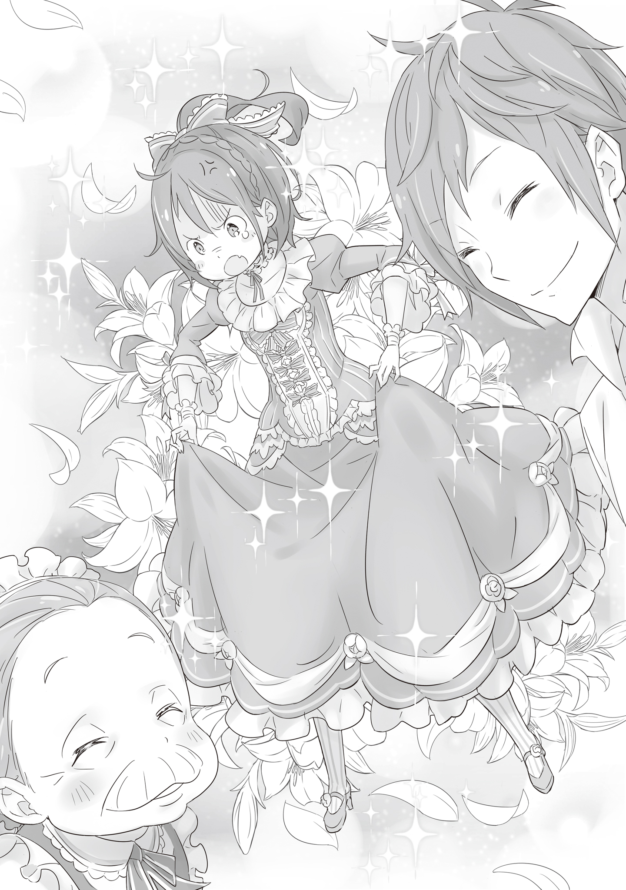

Первое, что я почувствовала при пробуждении, — невероятная мягкость, окутавшая всё тело.

— М-м-м?

Поморщившись, я поскребла затылок и попыталась приподняться. Зрение ещё толком не сфокусировалось, но прямо перед носом маячило нечто белое, изрядно пропитанное слюной. Подушка, наверное. Ткань, набивка, ощущения — всё слишком разительно отличалось от того убожества, что я знала раньше, но, судя по использованию, я не ошиблась.

Оглядевшись, я поняла, что укрыта тончайшей белой простыней и лежу на кровати, пружинящей при малейшем движении.

Не отдавая себе отчёта, я покачалась взад-вперёд, наслаждаясь скрипом и упругостью матраса, попутно разглядывая пляшущую перед глазами обстановку. И тут до меня дошло. Я склонила голову набок.

— Где это я?..

По крайней мере, роскошная комната и кровать, с которыми у меня, выросшей в трущобах, казалось, никогда не будет ничего общего, были неоспоримой реальностью.

Обычно моё утро в трущобах начиналось с ощущения твёрдой земли и жёсткого, рваного матраса. А ещё с аромата помоев, смешанного с сырым утренним воздухом.

Конечно, я оттачивала воровские навыки, чтобы однажды выбраться со дна, но… мечты поваляться в королевской перине в моём списке точно не значилось.

— И вообще, я же ещё ничего… Точно, что я вообще тут забыла?..

Настороженно озирая незнакомые хоромы, я тряхнула отяжелевшей головой, отчаянно пытаясь вспомнить, когда потеряла сознание. Но напрягаться не пришлось — ответ явился сам.

— Вы уже проснулись?

С этими словами дверь плавно отворилась. Услышав мужской голос, я напряглась и сунула руку за пазуху за ножом, но не нашла его.

Бросив быстрый взгляд вниз, я похолодела. И как только не заметила сразу? Кроме простыни, натянутой до плеч, на мне не было ни нитки. Я была абсолютно голой.

— Ваша одежда была грязной и порванной, поэтому слуги занялись починкой. Я сейчас же принесу замену, так что прошу, подождите немного…

— Тормози…

— Да?

Я бесцеремонно перебила парня — высокого, с красными волосами и голубыми глазами, с неестественно правильными чертами лица. То, как послушно он заткнулся, честно говоря, взбесило только сильнее.

— Шмотки потом. Дело, конечно, важное, не спорю, но есть вопросы посерьезнее… Сечёшь, к чему я?

— У меня есть несколько догадок… но мне не хватает уверенности, так что буду рад услышать их от вас.

Парень — знаменитость, которую в королевской столице каждая собака знает, «Святой Меча» Райнхард, — лишь пожал плечами. Из-за его спокойствия мне захотелось его придушить.

— Где я, чёрт возьми?! Кто ты такой?! И какого хрена ты меня вырубил?!

Я вопила прямо на кровати, не заботясь о манерах. Простыня предательски поползла вниз, пришлось в панике ловить ткань. Заметив, что губы Райнхарда тронула лёгкая улыбка, я оскалила свои острые клыки и угрожающе зарычала.

Глядя на такую меня, Райнхард произнёс: — Прошу прощения за грубость, но позвольте мне, госпожа Фельт, объяснить, как мы пришли к нынешней ситуации и почему я поступил именно так.

Он опустился на одно колено и, заговорив подчёркнуто вежливым тоном, уставился на меня своим прямым, пронзительным взглядом.

Скрестив ноги и плотнее закутавшись в простыню, я раздражённо фыркнула. Плясать под его дудку не хотелось, но истерика делу не поможет, где бы я ни находилась. Придётся слушать.

— Выкладывай. А уж куда я пожалуюсь на похищение и незаконное удержание со стороны «господина рыцаря» — будет зависеть от твоего рассказа.

— Похоже, мне придётся быть предельно искренним, — мягко улыбнулся Райнхард, запуская руку за пазуху.

Выглядел он иначе, чем в трущобах: простые брюки, тонкая рубашка, лёгкий жакет. Но даже дурак бы понял — этот «простой» прикид стоит целое состояние.

— Прежде всего, это место — особняк семьи Астрея в верхнем районе королевской столицы. Мы предоставили вам гостевую комнату, которая используется нечасто. Прошу прощения, если вам здесь тесновато.

— Сарказм засчитан. В эту конуру влезет штук десять моих берлог.

Вряд ли он хотел съязвить или обидеть. Просто констатировал факт. Скривив губы, я наблюдала, как парень, буркнув «извините», извлёк что-то из кармана.

— Думаю, этот предмет вам знаком.

— Эй, так это же та цацка, которую я пыталась спереть!

— Нет, строго говоря, другая вещь. Значок, о котором говорите вы, госпожа Фельт, вернулся к владелице, госпоже Эмилии. А это — точно такой же, но другой.

На раскрытой ладони лежала эмблема с изображением дракона. Приглядевшись, я заметила разницу: у того, что я стащила, камень в пасти крылатого ящера был красным, здесь же — зелёным.

— И чё с того? Мне она сейчас даром не нужна.

— Прошу, возьмите её в руки. Тогда поймёте.

Я хотела спросить «Чего я там пойму?», но язык прилип к нёбу. То ли пристальный взгляд Райнхарда подавил волю, то ли рука сама потянулась. Стоило значку коснуться кожи, произошло именно то, чего ждал рыцарь: камень вспыхнул ослепительным зелёным светом.

— Ну взяла, и чё?.. Ничего не поняла. Просто светится.

— Это «просто светится» и есть самое важное. В моих руках сфера темна. И в любых других тоже. Исключение — вы, госпожа Фельт, и ещё несколько избранных.

— Избранных… А? Камнем, что ли?

Я громко фыркнула, всем видом показывая отношение к этому бреду.

Но Райнхард посмотрел на меня глазами, в синеве которых можно утонуть, и серьезно произнёс: — Нет, не камнем. Драконом… или же судьбой.

— Судьбой? Ха! Чушь собачья!

Я-то гадала, что он мне с такой постной миной втирать будет, а он про судьбу! Тут уж удержаться было невозможно. Я хлопала себя по колену и заливалась хохотом, глядя, как округляются глаза «Святого Меча».

— Слушай сюда, Райнхард. Судьба — дежурная отмазка для тех, кто обожает сдаваться. Живёшь, думаешь, что всем рулит эта самая «госпожа Судьба» — удобно, да? Есть на кого спихнуть ответственность… Но я не такая.

— …

— В жопу судьбу, к чёрту все эти невидимые правила. Плевать, чему ты там радуешься, меня в это не впутывай.

Слабаки, любители опускать руки — все они прячутся за словом «судьба». Нет силы, нет мозгов, нет денег — во всём, видите ли, она виновата.

Мне такое нытье не нужно. За свою жизнь отвечаю только я.

Райнхард молчал, с одухотворенным лицом переваривая мою тираду.

Если бы он после этого просто взял и отпустил меня, претензий бы не осталось.

— Госпожа Фельт. Никто не может пойти против судьбы. Воспротивиться ей дано лишь немногим избранным — тем, у кого есть квалификация, решимость и средства.

— Ой, заткнись уже. Я не собираюсь философствовать. Камень светится, и что? Разговор окончен. Я возвращаюсь в трущобы. Живо верни одежду.

Даже я не собираюсь разгуливать по столице нагишом. Пусть те тряпки были ветошью, зато — моими. Однако…

— К сожалению, я не могу выполнить это требование. О человеке, заставившем сиять «Драконий Камень», надлежит доложить в замок… И если вы подданная Королевства, придется подчиниться.

— Не смеши! Подданная? Да государство ради меня пальцем о палец не ударило!

— Какой бы тяжелой ни была ваша жизнь, нахождение в столице означает пребывание под защитой Королевства. Вы наверняка пользовались некими благами… Этого нельзя отрицать.

— Я тут жила не потому, что хотелось! Просто денег не было, чтобы свалить. А теперь почти накопила. Так что я ухожу, выпусти меня отсюда!

— Я вынужден отказать. Прошу вас, смиритесь.

— Тц!

На этом бессмысленном обмене репликами моё терпение лопнуло. Райнхард всё так же смотрел на меня с невозмутимым лицом, и только я одна краснела от злости.

Я яростно взлохматила волосы, сделала пару глубоких вдохов и выпалила: — Ладно, твои слова я… обдумаю… Подумаю, так что выслушай и меня.

— Я приму это к сведению. Пока доклад в замок не отправлен, я бы хотел, чтобы вы оставались на попечении нашего дома. Что-то ещё?

— Именно что «ещё»… Верни мне одежду. Сколько ты намерен держать меня голой, господин рыцарь?

Я вложила в голос столько яда, сколько смогла, и это сработало: глаза Райнхарда слегка расширились. Пробормотав извинения, он с излишней учтивостью поклонился и повернулся ко мне спиной.

— Я позову слуг. Одежду для замены вам тоже скоро приг…

— Думал, я тебя послушаюсь?! Ага, щас!

Нельзя терять ни секунды.

Крикнув это в спину опрометчиво отвернувшемуся Райнхарду, я схватила подушку и со всей дури запустила в его красную шевелюру. И, не дожидаясь результата, спрыгнула с кровати. Едва босые ноги коснулись пола, я спружинила коленями и рванула вперёд.

Подушка долетела до цели, но этот тип мгновенно развернулся и поймал снаряд с такой скоростью, словно его рука телепортировалась. Мой трюк разгадан… но это было лишь начало.

— Получай!

Следом полетела простыня — та, что лежала на матрасе. Я швырнула её так, чтобы накрыть Райнхарда с головой.

На мгновение его фигура исчезла за белой завесой. Только идиот стал бы после этого ломиться в дверь.

— Будь здоров!

С этим воплем я отпрыгнула назад, спиной выбила оконную раму и, ухватившись за плотную штору, сиганула наружу.

Ещё сидя на кровати, я прикинула: второй этаж, до земли всего несколько метров. Если использовать ткань, чтобы погасить инерцию в начале, приземлиться — плёвое дело.

«Ловко же я его провела», — успела подумать я.

— Э?

Штора, обязанная выдержать мой вес, вдруг с легкостью отделилась от карниза. Ткань срезали так ровно, что даже мечом это сделать непросто, а уж ребром ладони… Так умеют не мастера, а чудовища.

— Ах ты ж монстр хренов!

— За последние два дня слышу это уже во второй раз.

Прямо рядом со мной, уже в свободном падении, нарисовался Райнхард. Оттолкнувшись от подоконника, он падал быстрее меня. К тому же из-за рывка отрезанной шторы меня перевернуло вверх тормашками.

— Прошу прощения.

Райнхард, коснувшись земли первым, использовал пойманную подушку как амортизатор, чтобы принять меня.

Простыня, в которую я была завернута, мягко взметнулась, и я оказалась у него на руках. Как принцесса в дешёвых романах. Он держал меня уверенно, будто с самого начала знал, чем всё кончится.

Это бесило до скрежета зубов.

— Я еще не провел экскурсию, вы могли не знать: в доме есть лестница.

— Не язви! А ну опустил! Долго собираешься таскать меня на руках?!

Я забилась в его объятиях, но рыцарь, умело покачивая руками, гасил каждый рывок. Я сверлила его взглядом, тяжело дыша, но хватка не ослабевала.

— Если бы вы, госпожа Фельт, сумели ускользнуть от глаз обитателей особняка, то были бы вольны делать что хотите. Но я приложу все усилия, чтобы этого не случилось. Смиритесь с моим обществом.

— Ты сам сказал! Не смей забирать слова обратно! Если сбегу — я победила, уяснил?!

Я ткнула в него пальцем, превращая разговор в пари. Райнхард кивнул, принимая вызов, а затем посмотрел в сторону особняка.

— Похоже, слуги услышали шум. Давайте вернёмся в комнату.

— Тц. Неси уже, только аккуратно, господин рыцарь!

Когда мы вернулись в ту же комнату, нас встретили двое слуг, судя по виду — дедулька и бабулька.

По словам Райнхарда, эти двое управляли особняком. Значит, для побега нужно обвести вокруг пальца их и «монстра».

«Проще пареной репы, только дождитесь ночи…» — самонадеянно подумала я, но боевой настрой улетучился мгновенно.

— Слушай, ты…

— Что такое? Вам очень идёт, госпожа Фельт.

Я процедила вопрос сквозь зубы, дрожа от бешенства, а Райнхард ответил с ангельской невинностью. Рядом с ним стояла та самая бабуля-служанка и улыбалась до тошноты доброй улыбкой.

В руках старушка сжимала охапку платьев, от пестроты которых рябило в глазах.

И одно из них — нелепое, жёлтое — прямо сейчас болталось на моем тощем теле.

— А… А моя одежда?..

— Мы бережно её храним. Поэтому, пока вы здесь, прошу, пользуйтесь этими нарядами. Не беспокойтесь, мы подготовили столько всего, что хватит на месяц.

— Ах ты!.. Я всё равно сбегу! Очень скоро! Так что готовься!!

Мой крик пронзил воздух, разлетаясь эхом по коридорам особняка Астрея.

