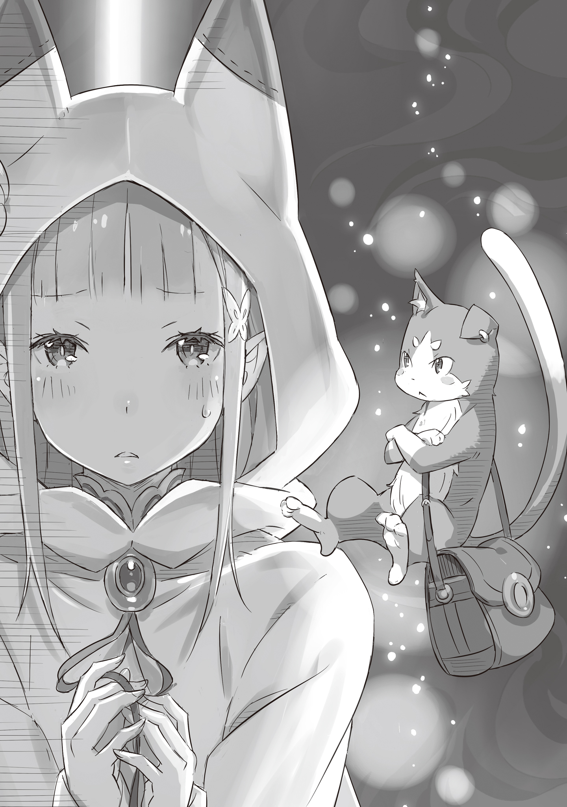

Внутри драконьей повозки неотступно висело напряжение.

У врат королевского замка Лугуники, что в столице одноимённого королевства, выстроилась длинная очередь из драконьих повозок, ожидающих своей очереди на въезд. Обычно у замка не бывало такого скопления народа, но сегодня был особенный день. Из-за наплыва посетителей проверка на входе и охрана были усилены.

Повозка медленно ползла вперёд, и в салон, помимо звуков ветра, доносился скрип корпуса. «Божественная Защита Уклонения от Ветра» наземного дракона оберегала от мешающего в пути ветра и шума, но стоило дракону остановиться, как она переставала действовать. А нынешний затор был более чем достаточным, чтобы защита то и дело прерывалась.

— Кажется, мы нескоро попадём в замок, — выглянув в окно, тихо пробормотала прекрасная сребровласая девушка.

Её аметистовые глаза были полны беспокойства, а голос звенел, словно серебряный колокольчик. Звали девушку Эмилия.

— Не думаю, что мы опоздаем. Но, Лия, у тебя даже щёчки напряглись. Расслабься, а не то вся твоя милая мордашка испортится, — услышав её бормотание, беззаботно и простодушно отозвалась маленькая тень.

Серый пушистый котёнок, который легко умещался на хрупком плече девушки, был не просто зверьком, а разумным существом, понимающим человеческую речь — духом.

— Всё в порядке. Никто не сравнится с тобой в милоте, Лия. Я гарантирую.

— Сегодня не время и не место обсуждать, кто милый, а кто нет. Я понимаю, Пак, ты изо всех сил стараешься меня подбодрить, но это соверше-е-енно неуместно.

— А-а, вот как? Я-то думал, раз все остальные кандидатки — девушки, то это будет к месту.

— …Ох, ну ты и вправду неисправим.

Эмилия тихонько хихикнула, глядя на духа, дурачившегося на её плече. Заметив, что напряжение хоть немного спало с её лица, Пак тоже удовлетворённо кивнул.

И в этот момент…

— Как и ожидалось от Великого Духа, вы мастерски умеете обращаться с госпожой Эми~и~илией, — похвалил их перепалку человек в наряде шута, сидевший напротив.

Длинные волосы цвета индиго и разноцветные глаза. С первого взгляда ни за что не догадаешься, но этот мужчина был маркграфом королевства и единственным покровителем Эмилии — аристократом по имени Розвааль L. Мейзерс.

Он элегантно скрестил длинные ноги и, глядя в окно, произнёс:

— Впрочем, догадка достопочтенного Великого Духа не так уж и далека от истины. Хоть это и церемония по избранию следующего правителя, на данный момент Драконий Камень, что в инсигнии, выбирает лишь женщин… В конце концов, в Драконьей Скрижали говорится о пяти жрицах. Быть может, это просто предпочтения Драко~о~она?

— Если подумать о наследовании крови, то жрица-девушка и впрямь удобнее… но это уж какой-то перебор. Да и все кандидатки как на подбор милашки, — ответил Пак на ироничное замечание Розвааля, а затем повернулся к Эмилии. — Не волнуйся, кто бы ни был твоим соперником, перед тобой он ничто. Будь уверена в себе.

— Я не совсем понимаю, о чём ты, но… хорошо, я поняла. Правда… — она на мгновение замолчала и склонила голову набок. — Что значит «если подумать о наследовании крови»? Почему девушка лучше?

— Э-э-это, разумеется, потому, что родство с наследником по женской линии куда надёжнее…

— …? — Эмилия непонимающе округлила глаза.

Розвааль, заметив её реакцию, прищурился, а затем взглянул на Пака, сидевшего у неё на плече.

— Достопочтенный Великий Дух, не кажется ли вам, что это уже чересчур… упущение в воспита~а~ании?

— Не знает — значит, и не интересуется. Я считаю, это лучший способ защитить мою дочь.

— Поправлюсь. Не упущение, а~~а… скорее, намеренное введение в заблуждение?

Пак обиженно пожал плечами в ответ на замечание маркграфа, но Эмилия всё равно не до конца понимала, о чём они говорят. Она была уверена лишь в том, что речь шла о ней.

Однако времени на расспросы у неё не было.

— О, кажется, мы двинулись. Пора готовиться к вы~ы~ыходу.

— Да, знаю, я полностью готова. И морально тоже.

Эмилия кивнула на слова Розвааля, и в этот самый момент драконья повозка остановилась у ворот замка. Снаружи раздался стук. Когда дверь открылась, первым из повозки вышел Розвааль, а Эмилия последовала за его высокой фигурой. Тёплый ветер коснулся её волос, и она посмотрела вперёд.

Она тут же кожей ощутила царившую вокруг напряжённую атмосферу и крепко сжала губы.

Все взгляды были прикованы к ней, к её внешности — серебряным волосам и аметистовым глазам. Она была готова к этому, но всё равно это знание, словно когтями, царапало её душу.

Однако…

— Всё хорошо, Лия. Я рядом.

Спрятавшись в её волосах, так близко, что она чувствовала его дыхание, был тот, кто нежно её оберегал — её семья.

Его присутствие спасло её, и Эмилия подняла взгляд на возвышающийся перед ней королевский замок Лугуники.

В этот день в замке должно было состояться собрание, посвящённое церемонии избрания следующего правителя королевства.

После проверки у ворот Эмилию проводили в приёмную для почётных гостей.

Комната, оформленная в тёплых тонах, была обставлена дорогой мебелью, а на стенах висели картины. Одна из них изображала Трёх Великих Героев, о которых слагали легенды в королевстве: «Божественного Дракона», «Святого Меча» и «Мудреца».

Каменные изваяния, посвящённые «Божественному Дракону», встречались по всему замку, но Эмилия находила это безвкусицей.

По крайней мере, Пак точно не собирался относиться к подобным вещам с симпатией.

— Уж лучше бы картину с фруктами повесили. Хотите, я вам парочку нарисую?

— О~о~о, как неожиданно. Не знал, что достопочтенный Великий Дух увлекается иску~у~усством.

— Ну, я никогда не рисовал, но, может, и смогу. Видишь ли, я — само воплощение возможностей. Капризный, не связанный правилами… чем не портрет художника, а?

— С такими-то повадками вы больше похожи на кота, нежели на художника, не нахо~о~одите? — довольно непочтительно заметил Розвааль с весёлой улыбкой.

Несмотря на слова, в его тоне не было ни капли уважения к Великому Духу. Впрочем, самому Паку преклонение и почтение были не по нраву, так что его это ничуть не заботило.

— А теперь… будь добр объяснить, зачем ты оставил Лию одну в приёмной и вызвал меня сюда.

— Разумеется, чтобы дать госпоже Эмилии возможность в одиночестве собраться с мыслями… Впрочем, вы всё равно не поверите. Да и это, коне~е~ечно же, не так, — Розвааль шутовским жестом покачал головой и посмотрел сверху вниз на Пака, скрестившего свои короткие лапки.

Как уже говорилось, Эмилии в комнате не было. После того как её проводили в приёмную, Розвааль позвал Пака в другое помещение, оставив девушку одну.

Духу не хотелось оставлять встревоженную Эмилию, но он не думал, что Розвааль на данном этапе станет затевать что-то бессмысленное. Поэтому он нехотя откликнулся на зов.

— Если это какая-то дурацкая шутка, я немедленно вернусь. Я и сам люблю пошутить, но сейчас моя Лия дрожит, словно котёнок, и я за неё волнуюсь, как за родную дочь.

— Великий Дух и впрямь очень дорожит госпожой Эмилией. Я понимаю ваше беспоко~о~ойство. Для госпожи Эмилии это звёздный час… хотя, возможно, он обернётся провалом.

— …Я до сих пор не в восторге от того, что ей придётся предстать перед людьми. Я лишь помогаю Лии, потому что она сама этого очень хочет.

Пак легко мог представить, с какой жестокостью столкнётся Эмилия через несколько часов. Именно поэтому он в душе был против и сегодняшнего события, и её участия в Королевском отборе в целом.

У Эмилии не было причин терпеть несправедливые страдания или самой лезть на рожон. Защищать её от всего, что может причинить ей боль, — в этом и заключался смысл существования Пака.

— Однако госпожа Эмилия уже сделала свой вы~ы~ыбор. В таком случае, не считаете ли вы, что наш долг — сделать её путь как можно более гладким и ро~о~овным?

— …Говори прямо, чего ты хочешь, так мы быстрее закончим.

— Что ж, буду краток. Через несколько часов госпожа Эмилия выйдет на сцену Королевского отбора. И нет никаких сомнений, что те, кому не по нраву её происхождение, осыплют её бессердечными упрёками. Их недоверие глубоко укоренилось, и они, несомненно, с низостью набросятся на ту, кого так удобно обвинять.

Розвааль хладнокровно и красноречиво излагал Паку свои жестокие предположения. Пак слушал молча, но в целом был согласен с его мнением. Он и сам мог судить об этом по взглядам, которыми провожали Эмилию обитатели замка, когда она выходила из повозки.

— Когда начнётся Королевский отбор, кандидатам дадут возможность высказать свои убеждения. Об этом я госпожу Эмилию предупредил… В то же время это станет прекрасной возможностью для тех, кто её ненавидит. У меня даже есть на примете те, кто не побоится повысить го~о~олос.

— Хм-м, и что же? Избить этих людей до начала Королевского отбора?

— Это был бы один из вариантов, но те, кого я имею в виду, обладают нравом, который ни за что не покорится силе. Мы довольно давно знакомы, так что я уверен — они лишь воспротивятся ещё больше.

— Тогда что ты предлагаешь? Если честно, я не очень-то полезен в ситуациях, которые нельзя решить грубой силой. Разве что твой знакомец — без ума от кошек. — Тут Пак умылся лапкой и добавил: — Или он и вправду без ума от кошек? Мне его соблазнить, что ли?

— Мы знакомы, но не уверен, что он настолько любит кошек. Поэ~э~этому давайте попробуем другой метод. Не согласитесь ли вы поучаствовать в небольшом представле~е~ении?

— В представлении?

Представление… забавное словечко вылетело из уст Розвааля, который только что назвал место, куда предстояло отправиться Эмилии, «большой сценой». Вряд ли это было совпадением.

— Представление? И что же мы будем разыгрывать?

— Как я уже говорил, можно легко предсказать, что во время представления убеждений кандидатов разразится скандал. Причиной станет происхождение госпожи Эмилии, и с этим ничего не поделаешь. Её рождение, как и глубоко укоренившееся в них неприятие полудьяволов, — это прошлое, которое не изме~е~енишь.

— Да, это я понимаю.

— Поэтому менять нужно не отношение к полудьяволам. А отношение лично к госпоже Эмилии.

Щёлкнув пальцами, Розвааль зажёг на их кончиках огонёк.

Собрать ману из атмосферы и придать ей яркий цвет — эта манипуляция магией, кажущаяся простой, на самом деле требовала невероятной концентрации. Это было доказательством того, что Розвааль — один из величайших магов своего времени.

— Причина, по которой мне сходит с рук такое поведение, проста. Разумеется, тут играют роль и заслуги рода Мейзерс, накопленные предыдущими поколениями… но главный фактор — это мой талант, позволяющий мне превосходить других.

— И Лия должна показать то же самое? Нет, не так. Я должен стать для неё этим талантом.

Пак понял, к чему клонит Розвааль, и, обняв свой длинный хвост, задумался. В его словах определённо была логика. Но это был рискованный план.

— Но не вызовет ли это обратную реакцию? Тех, кто боится её из-за того, что она полуэльфийка, её сила напугает ещё больше, разве нет?

— Безусловно, такой риск есть. Одна~а~ако мы с вами знаем характер госпожи Эмилии. Даже столкнувшись с незаслуженными обвинениями, она не станет использовать силу Великого Духа, чтобы выместить свой гнев. И если это станет ясно всем присутствующим сегодня благодаря нашему представлению, всё будет замеча~а~ательно.

Сказав это, Розвааль продолжил:

— И для этого… мне нужна ваша сила, достопочтенный Великий Дух. «Зверь Конца» из Великого Леса Элиор. Тот факт, что она, имея в своём распоряжении вас — того, кто одолел «Примирителя»¹, одного из Четырёх Великих, — не прибегает к силе, превратит её в их глазах из «полудьявола» в «Эмилию», одну из кандида~а~аток.

¹Примиритель (調停者) — прозвище Мелакуэры, которого Пак одолел в «Узах Льда».

— …А ты мастер уговаривать. Теперь я немного понимаю, что чувствовала Лия, когда ты уводил её из леса.

Хоть в его голосе и не было отчаяния, слова Розвааля обладали силой. Они направляли мысли собеседника так, словно его план был единственно верным решением в сложившейся ситуации. Он учитывал желания оппонента и давал ему то, чего тот хотел. Почти как мошенник.

— Перед замком ты назвал меня манипулятором, но сам-то ты ничем не лучше, а?

— Я это осознаю~ю~ю. Так каков ваш ответ? Если достопочтенный Великий Дух откажется, мне просто придётся придумать другой пла~а~ан.

— Значит, выбор за мной… Как же хитро заставлять меня так думать.

Пак задумался, стоит ли принимать предложение этого демона, то есть Розвааля. В его мыслях возник образ Эмилии, напряжённо сидящей в приёмной. Образ его любимой дочери, которая в последнее время только и делала, что нервничала.

И он почувствовал, что готов пойти на любое представление, лишь бы хоть немного облегчить её бремя.

— …Хорошо. Я принимаю твоё предложение. Лии мы ведь ничего не скажем?

— Заставить госпожу Эмилию играть в спектакле… одна мысль об этом приводит меня в у~у~ужас.

— И это не из-за благоговения, а в самом прямом смысле, да? Что ж, я тоже считаю, что интриги ей не по нутру, так что согласен.

Он гордился тем, что она выросла честной, прямой и искренней, но для коварных планов это было фатальным недостатком. И всё же, если подготовить для неё сцену, Эмилия наверняка поведёт себя именно так, как они ожидают.

— Так что за представление? Что и как мы будем делать? Замок ведь ломать нельзя, верно?

— Лучше всего будет произвести впечатление силой Великого Духа, не нанося замку никакого вреда. К счастью, повод для этого нам предоставит он .

— Он?

— Это Субару-кун, понимаете к чему я веду~у~у?

Услышав неожиданное имя, Пак удивлённо округлил глаза.

Речь шла о юноше, которого Эмилия оставила за стенами замка, чтобы не впутывать в сегодняшние события. Она заставила его пообещать, что он будет ждать, и Субару согласился, но…

— Ты что, велел ему нарушить обещание, данное Лии? Это мне совсем не нравится.

— Что вы, я прекрасно знаю, насколько важны обещания и контракты для заклинателей духов. Но его не остановить. Вот и вся исто~о~ория.

Пак вздохнул, глядя на Розвааля, который уже с театральным жестом отвешивал поклон. В то же мгновение в его мыслях промелькнули образы Эмилии и юноши, который, как ожидалось, должен был ворваться сюда.

Оправдает ли Субару ожидания Розвааля и примчится в замок? Или же сдержит обещание, данное Эмилии, и будет смирно ждать её возвращения в гостинице?

Как бы то ни было, молитва Пака оставалась неизменной. Всего одна.

«Пусть будущее моей любимой дочери будет счастливым».

С этой мыслью Пак приготовился выслушать коварный план Розвааля.

《Конец》
