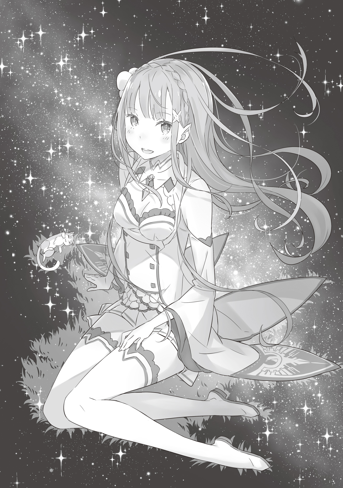

— Вы собрались на улицу в такой час, госпожа Эмилия?

Услышав за спиной знакомый голос, Эмилия замедлила шаг.

Длинные, струящиеся до самого пояса серебряные волосы взметнулись сверкающей волной, следуя за движением хозяйки. Тонкие пальцы, белизной напоминавшие алебастр, привычным жестом отстранили непослушную челку, и глубокие, сияющие, словно драгоценные камни, аметистовые глаза обратились к собеседнице.

— Да, я хотела ненадолго выйти в сад. Утром была такая суматоха, я не успела пообщаться с малыми духами. Если я нарушу контракт, последствия могут быть пугающими.

Её красота казалась совершенной, словно творение величайшего кукольника, вложившего душу в свой шедевр. Но стоило этому безупречному, с полупрозрачной кожей лицу тронуться смущённой улыбкой, а девушке — игриво показать язык, как ледяная неприступность исчезла без следа.

Осталась лишь невероятно, до щемящей боли в сердце, милая девушка.

Окликнувшая её горничная на мгновение затаила дыхание. Затем, будто одернув себя за неподобающую вольность, тихонько откашлялась и выпрямила спину.

— Под «утренней суматохой»… вы ведь имеете в виду Субару?

— М-м… да, именно его…

При имени, которое произнесла Рем, лицо Эмилии едва заметно напряглось. Уловив перемену, горничная чуть прищурилась: — Вам незачем подбирать слова. Если что-то случилось, пожалуйста, не стесняйтесь приказать мне. В конце концов, это непреложный факт: сейчас он живёт здесь на правах слуги.

— Я вовсе не стесняюсь… Просто задержка и правда случилась из-за того, что мы с ним заболтались. Но ведь я сама увлеклась беседой, так что, думаю, здесь есть и моя вина.

Вспоминая утренний инцидент, Эмилия виновато улыбнулась. Рем ответила лишь тихим вздохом.

Для Эмилии как для Заклинательницы, заключившей контракт с Паком и множеством других духов, ритуалы были неотъемлемой частью жизни. От них зависела прочность её связи с магическими сущностями. Контракт с Паком, например, включал в себя право духа выбирать ей прическу и одежду, а также обязательную гимнастику после ванны и уход за собой. Поскольку они были неразлучны уже давно, эти действия стали для полуэльфийки привычной рутиной, не доставляющей хлопот, но пренебрегать ими было строжайше запрещено.

— С малыми духами всё немного иначе: контракт требует уделять им время для общения каждый день. Если я испорчу им настроение, то в критический момент, когда нельзя будет положиться на Пака, они не придут мне на помощь.

— В магии духов, похоже, много ограничений. Рем в этом, признаться, не слишком разбирается.

— Говорят же, что Заклинателей Духов в принципе мало. Твоей магии тебя ведь обучал Розвааль?

— Да. Основы мне в детстве дала сестрица… а после я получала наставления от господина Розвааля.

Хозяин поместья, Розвааль L. Мейзерс, носил титул высшего придворного мага Королевства Лугуника. И хотя его эксцентричное поведение, странная манера речи и шутовские наряды вызывали массу вопросов, в его выдающихся способностях сомневаться не приходилось. Рем, прошедшая школу такого мастера, сама была одарённым магом воды. А её сестра Рам, в свою очередь, искусно управляла ветром. В случае опасности эти двое становились грозными боевыми единицами.

— Хотя о «чрезвычайных ситуациях» думать совсем не хочется…

— Я понимаю ваши чувства. Но прошу, будьте готовы к тому, что это неизбежно. То, что случилось в столице — лишь верхушка айсберга… Подобное наверняка повторится.

Слова, которые Рем адресовала опустившей взгляд хозяйке, были не сладким утешением, а суровым предупреждением. Эта девушка вообще была строга — и к окружающим, и к самой себе, вероятно, из-за привычки к жесткому самоконтролю. Впрочем, Эмилии эта черта в ней даже нравилась.

— Да, я понимаю. Сейчас не время ныть. Мне ведь помогает так много людей… Розвааль, вы с сестрой. Я просто не имею права вешать нос.

— Рем и сестрица лишь следуют воле господина Розвааля… Но всё же, если мы можем стать вашей силой, большего нам и не нужно.

Рем почтительно склонила голову. Эмилия едва не поклонилась в ответ, но вовремя остановилась. Ей уже делали замечание: госпоже не пристало кланяться слугам. Каждое действие, каждая деталь этикета здесь слишком сильно отличались от привычных ей порядков. Но девушка твёрдо знала: ей придется к этому привыкнуть.

— Ну, тогда я пойду в сад. Не задержусь, да и вряд ли я понадоблюсь кому-то в такое время.

— Слушаюсь… И ещё, позвольте узнать только одно. — Сделав идеальный реверанс, Рем подняла глаза на Эмилию. — Если Субару будет искать вас, как мне поступить?

Под «как поступить» она, вероятно, имела в виду, стоит ли выдавать её местоположение. Учитывая слова о том, что утренний разговор с юношей помешал делам, осторожность горничной была вполне естественна.

Однако Эмилия лишь легко качнула головой: — Всё в порядке. Если Субару будет меня искать, скажи, что я в саду.

— Вы уверены?

— Я же не прячусь от него и не хочу прогонять. К тому же… мне самой хочется поговорить с ним ещё. — Эмилия приложила палец к губам, и её лицо смягчилось в улыбке.

— О чём же вы беседовали, если не секрет?

— Хм… Рем, ты когда-нибудь смотрела на ночное звёздное небо?

— Звёздное небо? Нет, я никогда не смотрела на него осознанно. Разве что в ночных поездках, чтобы свериться с направлением…

— Нет, я не об этом. Я имею в виду — просто так, для души… Знаешь, раньше я тоже не смотрела.

Подойдя к окну в коридоре, Эмилия приложила ладонь к стеклу и вгляделась в наружную тьму. Мир, укрытый ночным пологом, был лишён искусственных огней — здесь царили лишь лунное сияние да холодное мерцание звёзд.

Рем неслышно встала рядом, тоже подняв взгляд.

Глядя на профиль горничной, Эмилия тихо произнесла: — В следующий раз, если будет возможность, расспроси Субару о звёздах. Уверена, тогда тебе, как и мне, станет чуточку приятнее смотреть в ночное небо.

— Ну что ж, Беатрис, я забираю Пака обратно…

— Я знаю, я полагаю…

Перед Эмилией стояла девочка с откровенно недовольным выражением лица. Надув губки, миниатюрная хозяйка библиотеки, чью прическу украшали роскошные сверлоконы, прижимала к себе духа-котенка. Пак в её руках беззаботно умывал мордочку лапкой.

Почувствовав взгляд хозяйки, он поднял голову: — М-м? Что такое, Лия? Моё очарование ослепило тебя?

— Да-да, конечно. Просто я подумала, что Беатрис, как всегда, делает такое лицо, будто ей противно меня видеть.

— Это естественно, в самом деле. Для Бетти ты — посланник дьявола, разлучающий Бетти с братиком, я полагаю. Ты ничем не лучше того парня с придурковатым лицом — из той породы людей, с кем совсем не хочется иметь дел, в самом деле.

Беатрис отвернулась, бросив это заявление прямо в лицо сопернице. Кого-то другого такое отчуждение могло бы ранить, но Эмилия, зная, что за колючим поведением девочки нет настоящей злобы, лишь улыбнулась.

— Таков контракт. Наше свидание с Бетти продолжится в другой раз, а сейчас мне пора вернуться к Лии.

— Это обещание, братик. Ты обязательно, непременно должен вернуться к Бетти, я полагаю.

Обменявшись фразами, полными драматизма вечной разлуки, Пак покинул объятия Беатрис и перелетел на плечо Эмилии. Устроившись на законном месте, котенок потёрся всем телом о серебряные волосы и довольно подёргал себя за ус.

— В библиотеке всё так же забываешь о ходе времени? Уже ночь на дворе… Судя по твоему наряду, ты не спать собралась, а в сад по делам?

— Ага, я ещё не выполнила контракт с малыми духами. К тому же сейчас самое время проверить то, что Субару утром рассказывал о звёздах… Кстати, Беатрис, у тебя есть какие-нибудь дела?

— У Бетти?

Беатрис, провожавшая Пака тоскливым взглядом, посмотрела на хлопнувшую в ладоши Эмилию с нескрываемым отвращением. То, что хранительница библиотеки не открывает сердца никому, кроме Пака — известный факт в поместье, но Эмилии казалось, что к ней и к Субару девочка относится с особой строгостью.

К полуэльфийке — из ревности к Паку, а с Субару они, похоже, просто не сошлись характерами.

— Если ты свободна, может, прогуляемся вместе? Мы живём в одном доме, но почти не разговариваем. А у меня сегодня припасена особенная история про звёзды!

— Которую ты целиком стащила у Субару, да-а? — вставил Пак.

— Ну вот, не говори такие обидные вещи! Ну так что, Беатрис, как насчёт прогулки?

Эмилия смешливо надулась в ответ на поддёвку Пака, а затем наклонилась к девочке. Та немедленно отступила, сохраняя дистанцию, и отвела взгляд.

— К сожалению, Бетти не имеет ни малейшего желания сближаться с тобой, в самом деле. И звёздное небо не кажется мне чем-то новым или удивительным, я полагаю. Интереса к нему у меня… почти нет, в самом деле.

— Хм-м, а Рем, кажется, заинтересовалась куда больше…

— Не думай, что Бетти можно поймать на ту же удочку, что и эту шумную служанку, россказнями о звёздах, я полагаю. В любом случае, всё закончится тем, что он просто давал незнакомым светилам случайные имена и веселился, в самом деле.

— Ух ты, как ты догадалась? — Изумление Эмилии перед проницательностью девочки было неподдельным.

На самом деле разговор о небесных телах начал именно Субару, но, похоже, здешняя карта звёздного неба отличалась от той, что была на его родине, и бедняга изрядно мучился, пытаясь сопоставить знания с реальностью.

— Субару, кажется, хорошо разбирается в астрономии, но из-за того, что небо другое, у него в голове всё перепуталось. Ну, там… Вега, Альтаир и… П-Бетельгейзе?

— Джус…

— А?

— Ничего, я полагаю… Всё, уходи уже поскорее, в самом деле.

Бросив короткую, резкую фразу Эмилии, которая явно путалась в названиях, Беатрис поспешила закрыть дверь в Запретную Библиотеку. Прямо перед тем, как сработал «Дверной Переход», отсекающий пространство, девочка бросила последний взгляд в их сторону: — Тогда до скорого, братик, я полагаю.

Она легонько помахала рукой, и её фигура исчезла за дверью. Эмилия тихонько вздохнула: девочка до самого конца оставалась неприступной льдышкой.

— Не получается у меня поладить с Беатрис так же хорошо, как у тебя, Пак.

— Наши с Бетти отношения строились долгое время. Это то же самое, что и попытка Бетти вклиниться между мной и Лией — у неё бы ничего не вышло.

Пак философски помахивал длинным хвостом, приговаривая, что «всё нужно делать потихоньку, полегоньку».

— Наверное, ты прав, — пробормотала Эмилия и вышла через террасу во внутренний двор.

Ночной ветер тут же принялся играть с её волосами, а лунный свет одел фигуру девушки в серебристое сияние. Слегка придерживая прическу, она ступила на коротко постриженный газон и направилась в дальний, укромный угол сада.

— Думаю… подойдёт.

Слегка примяв траву, Эмилия опустилась на землю, аккуратно поджав ноги. Затем подняла лицо к усыпанному искрами куполу и удовлетворенно кивнула.

Эмилия, как и Рем с Беатрис, относилась к тем, кто жил, не глядя вверх. Конечно, когда-то давно она могла залюбоваться красивым зрелищем, но привычка притупляет любое восхищение.

И всё же…

— Субару так весело рассказывал о них…

Пусть он и сетовал, что звёзды здесь «неправильные», но для Эмилии глаза юноши, устремлённые ввысь, сияли ярче любого созвездия.

Вспомнив об этом, она прикрыла рот рукавом и тихонько рассмеялась.

— Тебе, похоже, весело.

— Знаешь, это какое-то удив-и-и-тельно странное чувство. Небо ведь ни капельки не изменилось, но стоило измениться моему настроению — и оно выглядит таким красивым.

Субару говорил, что его имя тоже «звёздное». Гордясь своими глубокими, пусть и сбивчивыми познаниями, он поведал ей множество легенд.

— Кажется, вот это скопление крошечных звёздочек называется Млечный Путь, да? Влюблённые звёзды, которые могут встретиться лишь раз в году. Говорят, даже если льет дождь, они силой своей страсти пересекают небесную реку, чтобы любить друг друга.

— Хм, что же это такое… Не знаю почему, но мне кажется, что история как-то сильно испорчена, — скептически заметил дух.

— Ну смотри: если Альтаир не сможет переплыть Звёздную Реку до конца ночи, он не спасёт свою возлюбленную на другом берегу! По договору, Король Звёзд открывает реку, только пока она находится в заложниках.

— М-да… Ну, наверное, так и есть… Хотя, странно, что именно я это говорю, но звучит как какой-то бред.

Эмилия пересказывала этот сюжет с сияющими от восторга глазами, находя историю невероятно романтичной, а вот Пак лишь озадаченно склонял голову.

И всё же Эмилии этот «звёздный миф» пришелся по душе. Она втайне надеялась услышать от Субару ещё много таких историй.

Впрочем, сейчас нужно было заняться делом.

— Ну что, Пак. Я начинаю звать деток.

Услышав это, парящий у плеча дух немного отдалился — из деликатности, чтобы его могучая аура Великого Духа не подавляла робких «малышей».

— Простите, что не нашла времени утром… Ну, давайте поговорим.

Вслед за шёпотом Эмилии из ночной тьмы одно за другим начали рождаться бледные огоньки.

Каждый из них был малым духом, отозвавшимся на зов Заклинательницы. Сила и ритм их мерцания выражали чистую, бесхитростную радость встречи. Это чувство передавалось так ясно, что губы Эмилии сами собой расцвели в нежной улыбке.

Подарив духам своё тепло, она целиком отдалась этой безмолвной ночной беседе.

Мирный диалог душ продолжался некоторое время, пока тишину сада не нарушил знакомый, нарочито бодрый голос:

— П-приветики! Неожиданная встреча в таком месте, да?

Под светом луны стоял парень в костюме дворецкого. Он приветственно вскинул руку и нацепил на лицо самую любезную улыбку, которая, впрочем, не слишком-то ему шла.
