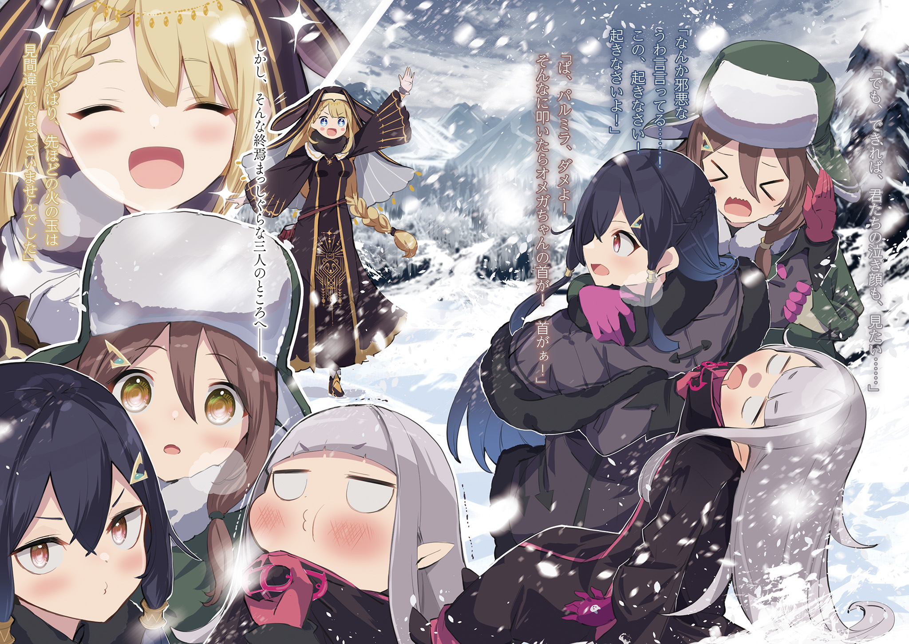
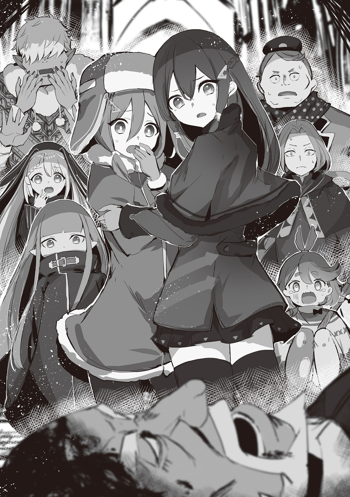
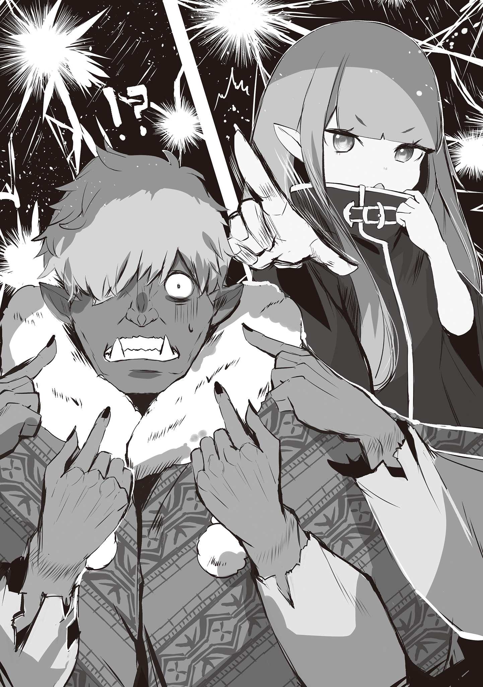
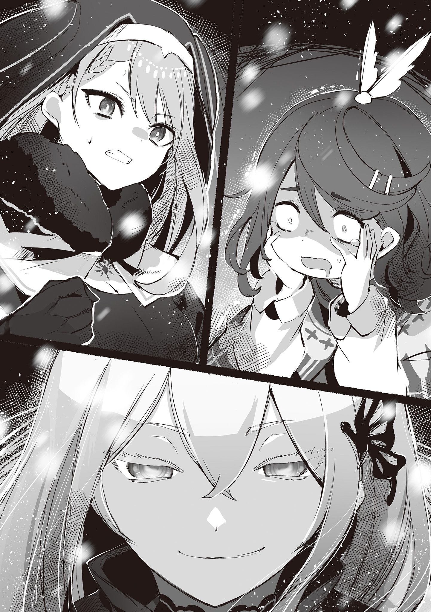

Хронологически история происходит после событий событий 4 арки и освобождения «Святилища».

Настоятельно рекомендуется читать эту историю лишь после трёх предыдущих:

1) Ведьмы после чаепития

2) Ведьмы после чаепития / Требования быть Ведьмой

3) Ведьмы после чаепития / Оценочное совещание Ведьм

Бушевала настоящая пурга.

Сильнейший боковой ветер был по-зимнему леденящим, а холод, казалось, вытягивал из рук и ног последние силы, лишал зрения, слуха, обоняния, осязания — одним словом, отнимал у Омеги всё самое важное.

— …! …!!

Сознание мутнело, но где-то рядом, как сквозь вату, слышался чей-то громкий крик.

Как только её затуманенный разум понял, что это отчаянный зов, чьи-то руки подхватили Омегу под мышки и с силой вытащили из снежного плена.

Нижняя часть её тела переместилась из глубины сугроба на его поверхность.

По сути, она просто сменила леденящий холод на пронизывающий мороз, но даже это заметно изменило ощущаемую температуру.

Вот так, даже замерзая, она совершила для себя новое открытие…

— Эй, ты! Слышишь меня?! Омега! Омега, чтоб тебя!

Эти размышления были грубо прерваны девичьим голосом, кричавшим прямо в ухо.

Отчаянно кричала девушка, чьё лицо было так близко, что Омега чувствовала её тёплое дыхание.

Черты лица были правильными, но волевой взгляд карих глаз — чересчур дерзким, а волосы — тёмно-синими.

Встретившись с Омегой взглядом, она тихо прошептала: «Слава богу…» — и тут же добавила:

— Ты ведь ещё не умерла? Ведь слышишь меня? Если слышишь, ответь!

— …Слышу-слышу. Только не… кричи так, пожалуйста.

— Еле дышишь, а всё язвишь!… Ты хоть понимаешь, что происходит?

— Ещё бы… а ты, напомни-ка, кто?

— Да ты совсем плоха!!

Едва Омега нахмурила свои замёрзшие брови, как кричавшая девушка с размаху ударила её головой.

Жёсткий удар пришёлся в лоб, и замёрзшие мысли с треском раскололись.

— Больно же, Пальмира…

— Наконец-то вспомнила! Соберись, Омега! Ты наступила на снежный карниз, упала и провалялась в сугробе! Говорила же я, не надо было выходить в такую погоду!

— …Твой голос сегодня как-то особенно сильно отдаётся в голове. Прошу, не кричи так, Минерва.

— О ком ты вообще говоришь?! Проснись, проснись, проснись!

Решив, что одного удара головой недостаточно, девушка — Пальмира — со всей силы принялась хлестать Омегу по щекам, когда та снова начала бормотать бессвязный бред.

Было больно, но сонливость брала верх.

И сознание Омеги уже готово было погрузиться в непробудный сон…

— Пальмира! Омега-чан! Вы обе в порядке?!

— Колетт! Ты сама-то цела?!

— Да-да, со мной всё хорошо! Но… но у нас проблемы! Я изо всех сил искала вокруг, но так и не нашла ни одного места, где можно было бы укрыться.

С этими словами к ним, разгребая снег, подошла их спутница — Колетт.

Девушка с милым и добрым лицом, заметив безвольно обмякшую в руках Пальмиры Омегу, громко ахнула: «Ах!» — и, поспешно сняв перчатки, прижала свои ладони к её щекам.

В такую пургу это было что мёртвому припарки, но даже это слабое тепло было приятно.

Опираясь на него, Омега с трудом разлепила ледяные ресницы, смёрзшиеся от неосторожно закрытых глаз.

— Колетт, Пальмира… Есть кое-что, что я хочу сказать вам напоследок…

— Не говори глупостей!

— Нет! Не смей говорить, что это конец, Омега-чан!

Последнюю волю, которую она пыталась изречь, заглушили упрямые крики двух девушек.

Но это было лишь детское барахтанье, отчаянная попытка не замечать реальности.

Смерть приближалась с каждой секундой.

Белый, холодный, неотвратимый конец…

— …Нет, пожалуй, я ещё могу побороться.

К чему смиренно принимать реальность и сдаваться?

Чтобы не запятнать свою честь под конец?

…Такой пассивный подход тот черноволосый парнишка наверняка возненавидел бы больше всего на свете.

Она вытянула руку, застывшую от плеча до запястья, словно ледышка, к небу и сосредоточила всё своё сознание на пяти пальцах, забывших, как сгибаться.

Она силой воли вмешалась в законы природы, использовав своё право изменять мир.

Проще говоря, она создала огненный шар и запустила его в белое небо бушующей метели.

Пламенный шар взмыл высоко в ледяное небо, всё выше, выше, выше… и исчез.

Омега увидела, как Пальмира и Колетт изумлённо уставились на внезапно появившийся огонь.

— На… большее… меня… не хватит…

— Эй! И чего у тебя моська такая довольная?! Что это сейчас было?!

— Омега-чан?! Не-е-ет, Омега-ча-а-ан!!

Истратив последние силы, она почувствовала, как её сознание… нет, само её существование начало таять.

Её тело, подобно телу духа, состояло из одной лишь маны.

В конце концов, оно распадётся на частицы маны и будет поглощено миром, став его частью.

Можно ли считать утешением хотя бы то, что девушкам не придётся цепляться за её мёртвое тело и бесконечно проливать слёзы?

— Хотя… если честно, я бы хотела… увидеть и ваши заплаканные лица…

— Что за зловещий бред она несёт?… А ну, просыпайся! Просыпайся же!

— П-Пальмира, нельзя! Если ты будешь так трясти, у Омеги-чан шея… шея же сломается!

Пальмира всё никак не давала ей спокойно уснуть, продолжая трясти и бить по щекам.

Колетт, цепляясь за неё, со слезами на глазах пыталась остановить это насилие над умирающей.

В метели, где замерзали даже слёзы, их действия лишь бессмысленно увеличивали риск.

Честно говоря, было бы разумнее бросить её и вдвоём искать способ выжить.

Однако, в этот момент, когда троица во всю неслась навстречу неизбежной гибели…

— …Значит, тот огненный шар мне всё-таки не померещился.

Внезапно раздался голос, и Колетт с Пальмирой вскрикнули: «А?!» — и обернулись на него.

Из белой, клубящейся дымки показалась женщина в рясе, поверх которой была надета тёплая одежда.

— В-вы…

— Меня зовут Ноэль, я странствующая проповедница. Я немедленно приду на помощь нуждающимся.

Появившаяся из-за пелены метели женщина, представившаяся как Ноэль, кивнула девушкам, которые удивлённо на неё смотрели, и тут же проверила состояние Омеги, которую держала Пальмира.

Её голубые глаза заглянули в лицо Омеги, она нащупала пульс и прошептала: «Дело дрянь».

— Ч-что значит «дрянь»?! Она что, умирает?!

— Если оставить всё как есть, то вполне может. Сначала нужно согреться… держите её крепче. А я вырою в снегу укрытие от ветра!

— О-ого! Я тоже помогу! То есть, позвольте мне помочь!

Пальмира крепко прижала к себе Омегу, а Колетт бросилась помогать Ноэль, которая уже начала рыть снег.

Снег на склонах гор часто становится твёрдым, как камень, из-за повторяющихся циклов таяния на солнце и замерзания, но женщины вдвоём голыми руками быстро выкопали яму, в которой могли бы поместиться все четверо.

Когда укрытие было готово, Ноэль достала из своей сумки книгу, вырвала страницу для растопки и вскоре в яме зажёгся тусклый оранжевый свет.

— …Тепло.

— Да, тепло. Но будьте осторожны, не подходите слишком близко. Пытаясь согреть замёрзшие части тела, люди иногда суют их прямо в огонь.

— Мы же не настолько глупы… Вот, Омега, смотри, как тепло.

По мере того, как воздух в яме постепенно нагревался, лица Колетт и Пальмиры расслабились.

В руках Пальмиры Омега тоже зашевелилась и, поёжившись, пробормотала:

— …Тёплый огонёк.

С этими словами она подалась вперёд, чтобы погреться у костра.

Но её онемевшие руки и ноги не слушались, и Омега, качнув розовыми волосами, нырнула головой прямо в огонь.

Невероятное тепло.

— Так вот каково это, пламя…

— А-а-а-а! Что ты творишь?! Я же только что сказала!

— Вот что чувствовала Кармилла в свои последние мгновения…

— Какой ужас! Ужас! Омега-чан! Нужно охладить лицо, охладить… вот так!

Её вытащили из костра и сунули обожжённое лицо в снег.

Её то нагревали, то охлаждали — какая суматошная и беспокойная процедура.

— Когда обо мне так много заботятся, это, на удивление, приятненько.

— Нашла время рассуждать!!

— Позвольте представиться ещё раз. Я Ноэль Туэрико, странствующая проповедница.

— Странствующая… проповедница? — в унисон переспросили девушки.

В яме, тускло освещённой костром, Ноэль низко поклонилась.

Она сняла тёплый капюшон, чтобы стряхнуть снег.

Её длинные светлые волосы были заплетены в одну косу, что в сочетании с ясными голубыми глазами и фарфорово-белой кожей создавало впечатление…

— «Святая» подошло бы тебе больше, чем «странствующая проповедница».

— Ох, что вы, это слишком большая честь. Я всего лишь спасла вас, безрассудно путешествующих в такую метель, так что не стоит меня так расхваливать…

— Постойте-ка… она сказала вежливо, но, кажется, нас сейчас отчитали по полной?

— П-простите, Ноэль-сан… Но-но! Благодаря вам мы и вправду спасены! Если бы вы не пришли…

— Мы бы все трое сгинули в снегах… правильно ли я употребила выражение?

— Не знаю, в чём ты там сомневаешься, но в таком случае первой бы сгинула именно ты.

Пальмира ткнула пальцем в переносицу Омеги, пока та грелась у огонька.

Омега же, в свою очередь, снова посмотрела на Ноэль, которая с мягкой улыбкой наблюдала за ними.

— Прости, что эти двое повели себя так невежественно. Странствующая проповедница — значит, ты из Святой Церкви Густеко, так?

— Совершенно верно. Я странствующая проповедница, несущая волю и учение Святой Церкви. Я увидела вдалеке огненный шар и, подумав: «а вдруг?», поспешила на помощь… и оказалась права.

— Да. Всё благодаря моей магии… Слышала, Пальмира?

— Ты ведь не думаешь, что это твоя заслуга, что нас нашли? Вообще-то, и поход в метель, и падение со склона — всё это твоя вина.

— Какая неблагодарная девочка.

— Благодарить надо Ноэль-сан, а не тебя!

Пальмира отказывалась признавать её заслуги.

Омега лишь пожала плечами в ответ на такое несправедливое обращение.

Ещё при жизни находились те, кто смотрел на неё косо лишь потому, что она «Ведьма». Привычный взгляд.

Подумав об этом, она улыбнулась, отчего Пальмира почему-то ещё больше покраснела и надулась.

— Хи-хи-хи, вы так дружны. Колетт-сама, Пальмира-сама и…

— …Омега. Таково моё нынешнее имя.

— Омега-сама. Благодарю за вежливость. Наша встреча — не что иное, как воля, ниспосланная нам Серебряным Благословением.

— Серебряным…

— …Благословением?

Как и сказала Ноэль, Колетт и Пальмира дружно наклонили головы, но для тех, кто оказался в горах… нет, по сути, на территории Священного Королевства Густеко, такой низкий уровень осведомлённости был нежелателен.

В любом месте есть свои, особые правила.

В Священном Королевстве Густеко эти правила были особенно сильны в виде учения Святой Церкви Густеко, пронизывающего всю страну.

— «Серебряное Благословение» — это выражение, свойственное Святой Церкви Густеко. Согласно ему, непрекращающийся снег является благословением от великого существа, которому поклоняются в Священном Королевстве. Для душевного спокойствия предпочтительнее считать суровые условия Густеко не естественным явлением, а испытанием, посланным чьей-то волей. Вероятно, именно эта идея легла в основу Святой Церкви, но…

— Омега-чан, Омега-чан, ты как-то не так говоришь…

Омега, увлечённо толковавшая молитвенные слова Святой Церкви Густеко, удивлённо подняла бровь на замечание Колетт: «А?».

Вместо неё, кончики бровей Ноэль опустились.

— Это то, что в народе называют «растерянным лицом»?

— Угадала и радуешься, а всё из-за твоего язвительного тона.

— Глупости. Я всего лишь соединила подходящую тему с подходящим объяснением…

Омега ошеломлённо застыла, а Колетт тем временем подсела поближе к Ноэль.

Затем девушка с любопытством посмотрела на неё снизу вверх.

— Скажите, можно спросить? То есть, Ноэль-сан, вы путешествуете даже в такой снегопад, чтобы рассказывать людям об этой Святой Церкви Густеко?

— Да, совершенно верно. Точнее, это не столько о самой церкви, сколько о её учении — весьма достойное занятие, знаете ли.

— …Я, конечно, не эксперт, но разве в Густеко не все и так последователи этой церкви? Зачем рассказывать то, что все и так знают?

На вопросы юных девушек Ноэль ответила с радостной улыбкой: «Вы правы».

— Учение не стоит на месте, оно меняется и обновляется… Изучать эту святую волю и нести её людям — вот в чём заключается моя миссия как странствующей проповедницы.

— Понимаю. Я и сама испытываю восторг, когда узнаю что-то новое, но мне также хорошо знакомо сладкое чувство, когда делишься знаниями с невеждой и переписываешь его представления о мире.

— В твоих словах и словах Ноэль-сан есть какая-то зловещая разница.

Как только она выразила своё сочувствие Ноэль, Пальмира снова её поддела.

Странно было то, что Ноэль, услышав слова Омеги, опять растерянно опустила брови.

Из-за этого казалось, будто Пальмира права.

Омега уже собиралась поправить её, углубившись в анализ выражения лица Ноэль, как…

— А-а-а! Ноэль-сан, мы сейчас в этом снежном домике благодаря вам, но… сможем ли мы все пробыть здесь до утра?

— Нет, долго оставаться здесь нельзя. Как только Омега-сама наберётся сил, мы двинемся дальше… Неподалёку есть церковь, там и укроемся.

— Церковь… ух, как камень с души.

Услышав предложение Ноэль, на лицах Колетт и Пальмиры появилось облегчение.

Для Омеги это предложение тоже было очень кстати.

— Как-никак, я была на грани смерти. Никогда бы не подумала, что снег так сильно скажется на моём мана-теле.

— Ты раскаиваешься?

— Меня так и тянет вкусить неведомый плод, я не могу сдержать волнения.

— Ах ты…!

Пальмира схватила честно ответившую Омегу за грудки и принялась трясти её взад-вперёд.

Это было всё то же эгоистичное и неуклюжее проявление заботы, но Омега со спокойствием взрослой позволила себя трясти.

Да и сил сопротивляться у неё всё равно не было.

— Вы всегда так путешествуете? — удивлённо спросила Ноэль у сидевшей рядом Колетт, глядя на эту сцену.

На её вопрос Колетт кивнула: «Именно!»

— Они всегда так. Мы втроём только недавно начали путешествовать вместе, но…

Глядя на громко возмущавшуюся Пальмиру и покорную Омегу, Колетт прижала обе руки к своим раскрасневшимся щекам и нежно улыбнулась.

— Для меня всё такое новое, каждый день такой весёлый, такой интересный!

— Вот как…

Ноэль опустила глаза и, прижав руку к своей пышной груди, кивнула.

— Этому можно только позавидовать.

Её вздох превратился в облачко белого пара и, поглощённый костром, бесследно растаял.

Церковь, к которой вела Ноэль, по-видимому, была построена высоко в горах.

Испокон веков авторитет и вера стремились к высотам.

Церкви не были исключением и часто строились на возвышенностях.

— Впрочем, церкви в горах иногда служат ориентиром для тех, кто смотрит снизу вверх. Как последняя крепость, за которую цепляются те, кто, подобно нам, оказался на грани гибели.

— Говорила бы ты это, идя на своих двоих… — раздражённо пробормотала Пальмира, слушая лекцию Омеги о расположении церквей.

Сама Омега в это время была на спине у Ноэль, наслаждаясь лёгкой прогулкой по снежной тропе.

— Ноэль-сан, Ноэль-сан, Омега-чан не слишком тяжёлая? Если устанете, я подменю вас, только скажите.

— Всё в порядке. Омега-сама легка, как свежевыпавший снег, я её почти не чувствую…

— А-а-а! Да держись ты хоть как следует!

Омега соскользнула со спины Ноэль и чуть не осталась лежать на снежной тропе, но её спасла Пальмира.

Та снова подхватила её под мышки и вытащила.

Омега посмотрела на неё и сказала:

— Пальмира, если слишком шуметь в горах, можно вызвать лавину. Будь осторожна.

— Почему в такой ситуации ругают меня?! Сначала надобно бы сказать «спасибо»!

— П-простите! Я виновата, что не заметила вовремя…

— …А! Смотрите, смотрите все! Вон там, это не церковь ли?

В тот же миг, как Ноэль вернулась к спорящим, Колетт радостно воскликнула.

Все взгляды обратились к ней.

Обернувшись, Колетт указала куда-то вдаль, сквозь завывающую метель.

Но, к сожалению, сколько ни всматривались Омега и остальные, ничего не увидели.

— Церковь?… Я ничего не вижу…

— Ясно. Колетт, похоже, мы не заметили, что с тобой что-то не так. Такой холод… психика, доведённая до предела, иногда начинает видеть галлюцинации.

— Ч-что, правда? Мне так плохо?…

Колетт в ужасе обхватила своё хрупкое тельце, осознав, что стояла на краю невидимой ментальной пропасти.

Пальмира тоже затаила дыхание и с мольбой посмотрела на Омегу, но та лишь покачала головой…

— Нет, Колетт-сама говорит правду. Это действительно церковь.

Ноэль, посмотрев в ту сторону, куда указывала Колетт, подтвердила её слова.

Колетт и Пальмира удивлённо переглянулись: «А?», а Омега понимающе кивнула.

— Понятно, это «Кольцо Звериной Защиты»… эффект браслета, Колетт. Я же говорила, это твоё благословение. Он помогает и защищает тебя.

— Этот браслет… так вот оно что. А я так удивилась.

Колетт с облегчением вздохнула и погладила массивный браслет на своей правой руке.

Этот браслет, «Кольцо Звериной Защиты», был «Метеором», который даровал своему владельцу звериную силу для защиты.

По иронии судьбы, именно этот подарок родителей и сделал Колетт сиротой и заставил её покинуть родные края.

Зная об этом, Омега не стала вдаваться в подробности о силе браслета.

В этом вопросе они с Пальмирой сошлись во мнении — Колетт лучше не знать.

Как бы то ни было…

— Раз Колетт и Ноэль её видят, значит, она настоящая. Можешь вести нас?

— …! Да, доверьтесь мне. Я обязательно буду вам полезна.

Обрадовавшись, что на неё положились, Колетт выскочила вперёд и повела их по снежной тропе.

Благодаря силе браслета её физические способности были улучшены, и она, несмотря на милые возгласы «Эй-эй-эй!», мощно разгребала снег, прокладывая путь для остальных.

— Колетт-сама, несмотря на свою внешность, очень вынослива…

— Впечатляет, не так ли?

— И почему это ты так гордишься?… И вообще, тебе бы самой не помешало стать немного выносливее!

Ноэль была удивлена работоспособностью идущей впереди Колетт, а идущая последней Пальмира поддерживала Омегу, которую несла Ноэль.

Вскоре отряд благополучно добрался до церкви.

Это была каменная церковь, построенная так, чтобы не рухнуть под тяжестью снега.

Хотя она была засыпана, сквозь окна пробивался слабый свет, что давало надежду на то, что внутри кто-то есть.

— Есть кто-нибудь? Есть кто-нибудь? Если… если…

Колетт постучала в дверь и позвала.

И, спустя некоторое время…

— …Подождите. Сейчас открою.

Раздался топот приближающихся шагов, и дверь церкви медленно открылась.

Увидев стоящих перед ним Омегу и её спутниц, человек внутри удивлённо округлил глаза.

— Ну и неожиданные гости. Четыре девушки в такой снегопад…

Произнёсший это с удивлением мужчина был средних лет, с суровым лицом и крепким телосложением.

Сначала он, видимо из осторожности, приоткрыл дверь лишь наполовину, но, поняв, что перед ним девушки, распахнул её настежь.

— Входите, входите! — пригласил он их внутрь. — Эй! Принесите кто-нибудь полотенца! У нас новые гости!

Мужчина крикнул вглубь церкви, и оттуда появилась большая тень.

Когда эта фигура протянула полотенца, Пальмира, стряхивавшая с себя снег, тихо вскрикнула.

Реакция была довольно грубой, но её удивление было понятно.

Полотенца были протянуты всем четверым одновременно.

— Ого, как здорово. У вас так много рук.

— М-многорукий… вот, вытереться, хорошо.

— Спасибо! Вы нам очень помогли!

Мужчина, которому Колетт с широкой улыбкой ответила на протянутое полотенце, был обладателем синевато-чёрной кожи и большого тела.

У него было на две руки больше, чем у них.

Четыре руки, растущие из плеч, были доказательством того, что он, как и сказал, принадлежал к племени многоруких.

Он, всё ещё держа полотенца, посмотрел на испугавшуюся его Пальмиру.

— В-возьми. Замёрзнуть… плохо.

— А, спасибо… и… простите. Я испугалась.

— Ничего. Часто, бывает.

Многорукий оставался невозмутимым перед столь полярными реакциями — испуганной Пальмиры и бесстрашной Колетт.

Омега и Ноэль тоже поблагодарили его, приняли полотенца и с благодарностью стряхнули с себя снег.

— Но всё же, одни девчонки в такую метель… довольно безрассудно, а?

— Позвольте, я бы поспорила с выражением «безрассудно». Когда мы выходили из предгорья, не было и намёка на то, что погода так испортится. Судить о наших действиях как о безрассудных, видя лишь результат, а не то, что было до начала снегопада, — это, мягко говоря, недальновидно, не так ли?

— Э-э, ну да. А ты, однако, говорливая девчонка…

Суровый мужчина был ошарашен аргументами Омеги, выступившей в защиту их чести.

Убедившись, что их репутация спасена, Омега посмотрела на Колетт и Пальмиру, но их реакция была не слишком восторженной.

Как бы то ни было, когда они закончили стряхивать снег…

— В любом случае, хорошо, что вы, девчонки, не заблудились. Я Подосо, служу стражником в городке по ту сторону горы, простодушный дядька.

— Я… Адомонса… с-странствующий артист.

Так представились двое мужчин.

Средних лет — Подосо, многорукий — Адомонса.

Услышав его имя, Колетт с блеском в глазах посмотрела на Адомонсу.

— Странствующий артист! Это ведь те, кто путешествует по деревням и городам и показывает представления? А какие трюки показываешь? Мне так интересно!

— Э-э? Мои… трюки…

— Трюки?!

Адомонса растерянно забегал глазами под напором любопытной Колетт.

Но, в конце концов, не выдержав её выжидающего взгляда, он, спрятав своё огромное тело под плащом, молниеносно взмахнул четырьмя руками и что-то метнул вглубь церкви.

Четыре ножа со свистом рассекли воздух, полетели по непредсказуемой траектории и вонзились в четыре стороны двери в дальнем конце церкви.

Это был виртуозный трюк, в котором особенности племени многоруких были мастерски использованы в метании ножей.

Однако…

— …А-ах.

Женщина, как раз показавшаяся из той самой двери, в которую вонзились ножи, побледнела как полотно.

Это была невысокая женщина с волнистыми медно-рыжими волосами.

Увидев ножи, которые, казалось, летели прямо в неё, она широко раскрыла рот и…

— А если бы я умерла?! — закричала она таким громким голосом, что от него и впрямь мог кто-нибудь умереть.

Эмоционально раскричавшаяся женщина представилась Макиной, менестрелем.

Её гнев, само собой, был направлен на Адомонсу, который только что чуть её не убил.

Она набросилась на него с яростью огненного шара.

— Я застряла в пути, думала, всё, конец… тут нашла эту церковь, только-только вздохнула с облегчением. Думала, от холода не помру, так чуть от ножа не погибла! И подумать не могла! У меня же жизнь перед глазами пронеслась! И что теперь прикажешь делать?!

— У-у, а-а, я…

— Что за «а» да «у»?! Думаешь, раз у тебя такая запоминающаяся внешность, можно расслабиться и не стараться?! Работай серьёзнее!

— Успокойтесь, пожалуйста. Это уже не имеет отношения к метанию ножей, к тому же, у Адомонса-самы не было злого умысла…

— Я не про злой умысел говорю! И вообще, не лезь не в своё дело! Что это за огромная грудь?! Сейчас как схвачу и потискаю!

— Ч-что за хамство!… Так нельзя, так нельзя…

Макина продолжала яростно кричать, набрасываясь без разбора даже на Ноэль, которая попыталась вмешаться.

Наблюдая за этим издалека, Омега приложила руку ко рту и задумчиво произнесла:

— Впрочем, менестрели во все времена одинаковы. Страстные, эмоциональные, без малейших колебаний лезут грязными ногами в чужую душу.

— Эй! А ты, малявка, что-то слишком уж разочарованно-философское несёшь. С такой-то внешностью рассуждаешь, будто жизнь познала… позна…

Макина, услышав её бормотание, уже было сменила цель для нападок, но вдруг застыла, широко раскрыв глаза.

Она казалась тугодумкой, но, раз уж назвалась менестрелем, наблюдательность у неё всё же была.

Её взгляд остановился на заострённых ушах Омеги.

— А-а-а-а, у тебя, эти уши…

— О, какой у вас намётанный глаз… это не каламбур на моё имя, если что.

Тут каламбур Омеги завязан на японской игре слов: фраза 「お目が高い」(O-me ga takai) — это идиома, означающая «У вас хороший вкус», «вы очень проницательны», «у вас намётанный глаз» и тд. Но шутка заключается в том, что начало этой идиомы 「おめが」(O-me ga) звучит абсолютно идентично имени Омеги 「オメガ」(O-me-ga), разве что отличие в написании есть, ведь имя Омеги пишется на катакане, а идиома на хирогане.

Она подмигнула дрожащей Макине, но та не оценила шутки.

С сожалением пожав плечами, Омега откинула свои розовые волосы, чтобы уши были лучше видны.

— Моё происхождение очевидно. Впрочем, эльфийской крови в хозяйке этого тела лишь половина… так называемая полуэльфийка.

— Ещё хуже! Эльф был бы чуточку лучше! Полудьяволица! Полудьяволица явилась!

Макина подпрыгнула и спряталась за Адомонсу.

Учитывая, что только что она на него нападала, это было весьма расчётливо с её стороны.

Похоже, Подосо подумал так же.

Он с удивлением почесал в затылке.

— Менестрель… это уж слишком прагматично, не находишь?

— Ч-ч-ч-что? Снежная ночь, церковь, полудьяволица… при таких условиях нет ни одной причины не подлизываться к самому сильному мужику. Я не хочу умирать! Не хочу умирать!

— Какая искренность…

Подосо с отвращением посмотрел на причитающую Макину.

— Прости, девочка-полуэльф. Я вроде как не имею предубеждений, но…

— О, не беспокойся. То, что меня сторонятся, — обычное дело. К тому же…

— К тому же?

— То, как люди, обычно ведущие себя добропорядочно, при виде полуэльфа тут же начинают смотреть на тебя с враждебностью и недоверием… это ощущение, на удивление, вызывает привыкание.

— В-вот как… какая ты смелая. …Хотя, если ты полуэльф, то, наверное, уже не девочка… Ай!!

Подосо, почесав в затылке от ответа Омеги, вдруг вскрикнул от боли.

Причиной боли была его нога, на которую со всей силы наступила Макина.

Подосо, невольно присев со слезами на глазах, увидел, как она тычет в него пальцем.

— Не спрашивай женщину о возрасте при первой встрече! Никакой тактичности, никакой деликатности, ноль!

— Ч-что я такого сказал?! Всего лишь про возраст спросил?!

— А давайте спросим мнения других. Посмотрите вокруг!

Подосо с сомнением огляделся и обомлел.

Пальмира смотрела сурово, Колетт — с грустью, Ноэль — с сожалением.

Все они осуждающе смотрели на Подосо, который неосторожно попытался выяснить возраст женщины.

— Ну, меня это не особо волнует.

— В-вот! Сама пострадавшая так говорит! И вообще, менестрель, ты же сама боялась Омеги-чан?!

— Это другое! Бестактные мужики — это просто ужас! И огромный получеловек — тоже! И большегрудая баба! И полудьяволица! Не на кого положиться!

Макина схватилась за голову и рухнула на пол, будто настал конец света.

Но тут Колетт опустилась перед ней на колени и осторожно протянула руку.

— Всё в порядке, сестричка. Омега-чан — хорошая девочка, её нечего бояться. И у Адомонсы-сана очень добрые глаза. А вот Подосо-сан — бестактный и никудышный, но…

— И Колетт-чан считает меня никудышным…

— Но ведь он первым открыл нам дверь! И дров в камин подбросил, чтобы было теплее… просто он не разбирается в сердце дамы.

Получив от Колетт сомнительную защиту — то ли похвалу, то ли добивающий удар, — Макина всхлипнула.

— Видишь? Так что давай, извинись перед всеми. Тогда тебя простят, и все примут тебя в свой круг.

— У-у-у… простите-е-е. Я не хочу быть одна…

— Поразительно. Она её приручила.

Ноэль невольно захлопала в ладоши, видя, как Колетт заставила Макину извиниться.

Пальмира с нескрываемой гордостью наблюдала за этим, и Омега подошла к ней.

— Радуешься, что Колетт хвалят?

— …Ты и вправду несносная.

— Глупости. Я думала, меня похвалят за то, что я научилась понимать человеческие сердца…

Омега была сбита с толку такой неожиданной реакцией, а Пальмира лишь устало вздохнула.

Когда в собравшейся компании воцарилось некое подобие гармонии, Подосо хлопнул в ладоши и сказал: «Можно минутку?»

— Девчонки, вы немного согрелись, так что давайте проясним. Мы все застряли из-за метели и ищем убежища в этой церкви… верно?

— Да. Совершенно верно.

На вопрос Подосо от имени всех кивнула Ноэль.

Остальные, похоже, тоже не возражали, и Подосо, получив ответ, почесал в затылке и сказал: «Ясно».

Коротко стриженные зелёные волосы, а выражение лица у Подосо было каким-то напряжённым…

— Тебя что-то беспокоит?

— …Дело в том, что я не могу найти священника, который должен жить в этой церкви. Священник Коатль, очень уважаемый человек, но уже в преклонном возрасте.

Услышав слова Подосо, сказанные с тревогой, Омега оглядела церковь.

Они в семером грелись в молельне, соединённой с входом, через который их встретили.

За молельней находилась жилая зона священника, но она не казалась очень большой.

По крайней мере, это не то место, где человек, привыкший здесь жить, мог бы заблудиться или пропасть.

— Подосо-кун, ты пришёл сюда по делу к священнику Коатлю?

— А? …Да, именно так. Сама видишь… такой снегопад. Священник живёт один, так что я забеспокоился, как бы чего не случилось.

— Понятно. Забеспокоился, как бы чего не случилось, значит.

Омега повторила слова Подосо и хитро прищурила свои круглые глаза.

Подосо с подозрением нахмурился, но задать вопрос ему не дали.

Услышав их разговор, Макина подскочила и воскликнула: «Точно!»

— Я тоже пришла сюда по делу к священнику Коатлю! Чтобы услышать историю священника Коатля, героя, спасшего город в этих краях, известного как «Святой Лавины»!

— …На самом деле, я тоже пришла сюда по делу к священнику Коатлю.

— Да ну? Какое совпадение, большегрудая! Хотя меня это и не радует!

— П-прошу вас, не называйте меня так…

Зарождавшаяся было дружба между Макиной и Ноэль, узнавших, что ищут одного и того же человека, тут же умерла.

Впрочем, стало ясно, что священник Коатль был довольно известен.

— Адомонса-сан, вы тоже пришли встретиться со священником?

— Н-нет, я нет. Я… с труппой… снаружи…

— У вас была назначена встреча?

— М-м…

Колетт, которая за короткое время успела подружиться с Адомонсой, перевела его обрывочные фразы.

Пальмира, косо поглядывая на них, задумчиво произнесла: «Но…»

— Этот священник, его ведь нет в церкви? Я волнуюсь.

— Ну, священник здесь живёт давно, так что он прекрасно знает, насколько опасен снег. Думаю, мы просто разминулись.

С этими словами Подосо посмотрел за пределы церкви, откуда доносился вой метели.

Со временем метель не только не утихала, но, казалось, становилась всё сильнее.

Сильный снегопад мог поглотить даже опытного человека.

Долголетие не гарантировало выживания в снегу.

— Если бы этот закон действовал, то нельзя было бы объяснить, почему я чуть не замёрзла насмерть. …Хотя, мой возраст на момент смерти — девятнадцать, так что, может, и не ошибаюсь?

— Э-эй, что ты там бормочешь, полудьяволица… страшно же.

— Я же полудьяволица. Прицениваюсь, как бы вас съесть.

— А-а-а! Молодые и нежные вкуснее меня!

Макина в панике упала на спину, чуть не обмочившись от страха.

Забавная реакция, но Ноэль прервала эту шутку, сказав: «Омега-сама».

— Нехорошо. Нельзя так радоваться, пугая людей.

— Ох, я согрешила перед священнослужительницей. Это же церковь последователей Святой Церкви Густеко, меня теперь накажут?

— …Нет. Хозяин этой церкви не я, а священник Коатль. У меня нет права читать здесь проповеди. …Но исправлять ошибки детей — это долг, который должен выполняться по совести окружающих, независимо от вероучения. Так я считаю.

— …Понятно. Я недооценила твою человечность. Прошу прощения.

Приняв искреннее заявление Ноэль, Омега поклонилась.

Колетт и Пальмира удивлённо уставились на извиняющуюся Омегу.

— Не знала… Омега-чан, оказывается, умеет извиняться.

— Хм. Когда это говорит Колетт, а не Пальмира, хочется задуматься о своём поведении.

— Задумывайся, кто бы ни говорил!

В ответ на насмешку Пальмиры Омега прищурила один глаз, высунула язык и извинилась.

Затем она, прищурив тот же глаз, продолжила: «Впрочем…»

— Ранее Макина сказала кое-что интересное. Кажется, «Святой Лавины»?

— О-о-о? Интересно? Хочешь знать? Тогда мой выход!

На вопрос Омеги Макина раздула ноздри, схватила стоявший в углу молельни инструмент — струнный инструмент менестрелей, люлиру — и дёрнула за струны.

Привлёкши всеобщее внимание, она начала отбивать ритм, топая по полу.

— А сейчас я поведаю вам историю о снежной лавине, обрушившейся на эти края, и о доблестном священнослужителе, что смело ей противостоял… История, полная слёз…!

Она начала петь под аккомпанемент, рассказывая историю хозяина этой церкви, священника Коатля.

О том, как он завоевал любовь горожан и стал героем, о котором поют менестрели.

Песня, призванная поведать об этом…

— …Это ужасно.

По молельне разнеслись фальшивая мелодия и жуткий голос, который, казалось, намеренно игнорировал ноты, словно душили птицу.

Омега нахмурилась.

Даже вой метели звучал бы лучше этой песни.

…Когда-то на этот регион обрушилась огромная лавина, которая практически уничтожила один из городов.

Священник Коатль первым поспешил в пострадавший город, спасал людей, пожертвовал свои сбережения на восстановление и сам переехал в эту церковь, чтобы предотвратить повторение трагедии.

— …Вот, если вкратце, содержание песни Макины.

— А? Зачем вкратце? Я пела с душой! У тебя что, претензии, а, мелочь пузатая?!

Макина, возмущённая тем, что её песню так грубо обобщили, прикусила рукав.

Однако, поскольку никто, даже Колетт, не заступился за неё, можно было догадаться о качестве исполнения.

Несмотря на песню Макины, героизм священника Коатля стал понятен.

— Лавина сошла двенадцать лет назад… Благодаря самоотверженности священника, не щадившего себя, город не исчез. Сейчас он почти полностью восстановлен, и все благодарны священнику.

— Ого, как здорово. Очень достойный человек.

— Да, достойный. Очень, думаю.

Колетт и Адомонса, успевшие подружиться, зааплодировали.

Слушая их добродушные комментарии, Пальмира лишь равнодушно хмыкнула.

— Пальмире не очень понравилось?

— Да не то чтобы не понравилось… просто не показалось, что история настолько захватывающая, чтобы слагать о ней песни. …Да и была ли это песня вообще?

— Вот-вот, именно! А? Именно что? «Была ли это песня?» — это ты о чём?

— Если будешь копать глубже, сама же и расстроишься. Так что там «именно»?

Макина пристала к Пальмире, которая, хоть и с неохотой, но отвечала ей.

Эта заботливость была её добродетелью, но Омега не стала на это указывать, зная, что Пальмира не обрадуется похвале.

Подгоняемая Пальмирой, Макина, постукивая ладонью по люлире, сказала:

— На самом деле, история о «Святом Лавины» сейчас не очень популярна. Считается, что ей не хватает драматизма. Поэтому я и пришла сюда!

— Поэтому вы и пришли к самому священнику Коатлю… что вы имеете в виду?

— Ну, я подумала, что у очевидца наверняка есть какие-нибудь интересные истории, о которых не ходят слухи! Я добавлю их в песню и обойду других менестрелей! Вот мой план!

Макина крепко сжала кулак, раскрывая свои амбиции.

Затем она расслабила кулак и жалобно простонала: «Потому что-о-о…»

— Если не так, то в этом Густеко ничего не найдёшь. Говорят, в последнее время в Драконьем Королевстве Лугуника столько всего интересного происходит, что тем для песен хоть отбавляй.

— Да, там и выборы короля, и истории о падении трёх Великих Зверодемонов, «Белого Кита» и «Великого Кролика». Об этом, конечно, легко петь.

— Просто ужас. Лучше бы у нас это делали, безымянные герои.

Не обращая внимания на жалобы Макины, Омега поняла её низменные цели.

Затем она посмотрела на Ноэль.

— Ноэль, а ты зачем хотела встретиться со священником?

— …На самом деле, моя главная цель та же, что и у Макины-самы. К сожалению.

— Понятно… действительно жаль.

Она с сочувствием посмотрела на опустившую глаза и посерьёзневшую Ноэль.

Правда, в данном случае цель была не в том, чтобы сочинить песню, а в том, чтобы расспросить о случае со «Святым Лавины».

— Священник Коатль тоже когда-то был странствующим проповедником. После той лавины он живёт в церкви, но я очень хотела бы узнать о его опыте, как у старшего наставника.

— Понятно, тяга к знаниям — это хорошо. Продолжай в том же духе.

— Непонятно, с какой стати Омега-чан даёт советы, но… ладно, я всё понял.

Подосо громко хлопнул в ладоши, подводя итог разговору.

— Жаль, конечно, что все мы зря пришли, но можно ведь и в другой раз. …Кстати, вы, девчонки, втроём путешествуете? Почему это?

— Нас всех изгнали из родных краёв. Моя причина очевидна, а эти двое пострадали из-за дружбы со мной… ой, получается, это всё моя вина. Ха-ха-ха, простите, что родилась.

— Что-то мне совсем не смешно…

Шутка, которая должна была вызвать взрыв смеха, неожиданно испортила атмосферу.

Не обращая внимания на недоумевающую Омегу, Колетт обратилась к Макине: «Слушай…»

Её глаза, как всегда, сияли от любопытства.

— А нет ли у вас историй, кроме той, о священнике? Мне так интересно.

— Ну-у… истории, связанные с этими местами, — это тоже непросто… а, тогда давайте я расскажу вам что-нибудь романтичное. Историю о «Ледяной шайке разбойников».

— Ледяная шайка разбойников?

Макина с усмешкой снова взяла люлиру, глядя на склонившую голову Колетт.

Омега приготовилась к новому ужасному концерту.

Однако Адомонса схватил люлиру и высоко поднял её.

— А, эй, ты?!

— Уа… всем неприятно. Нельзя. Я, не позволю.

— «Неприятно» — это слишком сильно сказано!

Макина подпрыгивала, но из-за разницы в росте не могла отобрать у Адомонсы люлиру.

Вскоре Макина, обессилев, рухнула на пол.

Вместо неё, неспособной петь, кашлянул Подосо.

— «Ледяная шайка разбойников» — это старая легенда. Давным-давно здесь орудовала банда разбойников, которые прятали награбленное. Но однажды пещеру, где они хранили сокровища, завалило лавиной, и бедолаги так и не смогли их достать.

— То есть, мораль в том, что копить сокровища, не используя их, до добра не доведёт?

— Какая ещё мораль. Это просто дурацкая старая история.

— И вообще, это вредительство! Протестую против пересказа песен менестрелей!!

На простое объяснение Подосо Макина закричала, ведь это был вопрос её выживания.

Её слова, на первый взгляд, были справедливы, но её пение и игра были слишком плохи.

Макине было бы лучше сменить профессию.

— Но-но, сокровища — это же драгоценности и всякие блестящие штучки, да? А то, что они под льдом, — это так волнующе!

— М-да, волнующе…

Колетт прижала руки к своей небольшой груди, а Адомонса повторил её жест.

На их слова Ноэль кивнула, задумчиво опустив подбородок.

— Поэтому многие ищут эту пещеру в надежде найти сокровища. Ведь если найдут, то разбогатеют.

— Во все времена ценности людей, ищущих богатства, непостижимы. Все они заблуждаются в том, что на самом деле нужно для полноценной жизни.

— Глубокая мысль. Так что же, по-вашему, Омега-сама, нужно для жизни?

— Это же очевидно. …Развлечения.

— …

На мгновенный ответ Омеги все присутствующие отреагировали с весьма многозначительными лицами.

Но, учитывая всё сказанное до этого, на этот раз Омега была оскорблена такой реакцией.

— Не поймите меня неправильно, это не шутка. Для полноценной жизни человеку нужны развлечения. Можно сказать, хобби, которое наполняет душу. Именно это определяет жизнь.

— Так какое же у тебя хобби, которое наполняет твою душу?

— Пробовать на вкус неведомое. Узнавать то, чего не знаешь. Ведь я — воплощение жажды знаний. Я жажду всего неведомого — вещей, людей, всего.

На улыбку Омеги Макина, задавшая вопрос, пожала плечами, мол, зря спрашивала.

Подосо и Адомонса тоже отреагировали усмешкой и удивлением, но Колетт и Пальмира не смеялись.

…Нет, не могли смеяться.

Эти двое знали, кто такая Омега на самом деле.

Если бы они могли смеяться над этим, то были бы не смельчаками, а безрассудными глупцами.

— Я, в общем-то, не обижусь на такое… но ты, Ноэль, тоже не смеялась.

— …Странно, но ваши слова, Омега-сама, показались мне искренними.

— Вот как. Хорошая девочка.

Она хотела похвалить, но от этих слов Ноэль напряглась.

Омега уже собиралась проанализировать свои слова, чтобы понять, почему она её так напрягла, как…

— Ох, я устала от разговоров… Мне тут надо по делам.

Макина внезапно встала и, потягиваясь, сказала это.

Она направилась вглубь церкви, но Подосо окликнул её: «Эй».

— Стой-стой, куда это ты? Холодно же. Лучше оставайся здесь.

— А? А-а, может быть и так. Но у меня, знаешь ли, тоже есть дела.

— Дела? Священника Коатля нет. Что ещё делать в церкви…

— Идиот! Не заставляй меня говорить всё! В туалет, в туалет!

Макина швырнула полотенце в Подосо, который раскрыл её тайное место назначения.

Подосо поймал полотенце, упавшее ему на лицо.

— Прости…

— Ха! Главное, чтобы понял. Ну, я на минутку…

— Я провожу. Адомонса, могу я оставить на тебя девчонок?

— Что?! Н-не надо! Я сама дойду до туалета!

Макина была в шоке, что Подосо, оставив всех на Адомонсу, собрался её проводить.

Но Подосо с серьёзным лицом похлопал её по плечу.

— Не стесняйся. Со мной тебе нечего бояться.

— С тобой-то как раз и страшно! Эй, кто-нибудь! Кто-нибудь, помогите мне…

— Он так настаивает. Отказывать джентльмену в его предложении — не по-дамски.

— Эта полудьяволица говорит то, чего совсем не думает!

Макина выругалась на небрежное замечание Омеги, но, в конце концов, сдалась под напором непреклонного Подосо и, топнув ногой, крикнула: «Ладно!»

— Хорошо, иди за мной, извращенец! Но мою душу ты не сломишь!

— Разве это не говорят, когда удаётся настоять на своём?

— Заткнитесь, мелюзга! После меня и вас ждёт та же участь!

Макина указала на Пальмиру и, оставив очень неприятное прощальное слово, ушла с Подосо вглубь церкви.

Как только они скрылись, в комнате воцарилась расслабленная атмосфера.

И дело было не в том, что грубиянка Макина портила атмосферу…

— …Подосо-сан, он был какой-то напряжённый, да?

Впечатление Колетт, склонившей голову набок, было верным.

Независимо от поведения Макины, именно Подосо поддерживал странное напряжение.

То, что он пошёл с ней в туалет, тоже было частью этого — он чего-то опасался.

— Адомонса-сан, вы что-нибудь слышали?

— Н-нет, я, ничего не слышал.

Адомонса покачал головой, отвечая с какой-то тревогой.

Несмотря на свою силу и мастерство в обращении с ножами, Адомонса из-за своего робкого характера был не годен для драки.

Выбор Подосо был не совсем верен.

— Не беспокойтесь, если что, я со всем справлюсь.

— …Ноэль, ты уверена, что можешь так легко обещать подобное?

— Я странствующая проповедница. Женщина, путешествующая в одиночку, должна уметь за себя постоять, иначе никак.

Пальмира с сомнением посмотрела на Ноэль, которая, улыбаясь, показала бицепс.

Однако, раз Святая Церковь Густеко официально признала её странствующей проповедницей, то Ноэль, скорее всего, и вправду была сильна.

Риски, связанные с одиночным женским путешествием, очевидны.

Омега путешествовала с Колетт и Пальмирой именно по этой причине.

— Ну, в одиночку и поговорить не с кем, скучно… но как бы то ни было, пока мы все вместе, проблем не будет. В крайнем случае, я покажу вам свою истинную силу.

— Истинную силу? Хе-хе-хе, тогда я на неё и понадеюсь.

Услышав слова Омеги, Ноэль с какой-то снисходительной улыбкой посмотрела на неё.

Вероятно, она приняла это за хвастовство маленькой девочки, но Колетт и Пальмира, знавшие истинную силу Омеги, лишь горько усмехнулись.

И в этот момент… снаружи в дверь церкви постучали.

— …Извините! Есть кто-нибудь?! Помогите!

Из-за двери донёсся молодой мужской голос.

Вряд ли это был священник Коатль, учитывая молодость голоса.

— Похоже, ещё один заблудившийся, как и мы.

— «Заблудившийся» — это не совсем корректно… но давайте впустим. Церковь открыта для всех. Подосо-саме и Макине-саме объясним потом.

С этими словами Ноэль побежала к входу в церковь.

За ней, достав из большой сумки новое полотенце, последовал и Адомонса.

Он дал полотенца и Омеге с её спутницами, но у него их было на удивление много.

Судя по его большому багажу, Адомонса, возможно, был в своей труппе кем-то вроде носильщика.

В таком случае, его отставшим товарищам сейчас, должно быть, очень нелегко.

Как бы то ни было, дверь церкви открылась, и Ноэль с Адомонсой впустили нового путника.

— Ох, простите-простите, вы меня спасли. Я думал, что снег будет идти, но не ожидал такого снегопадища… Просто не везёт. Какая досада.

С этими словами молодой человек стряхнул снег с головы.

Это был приятный на вид юноша с длинными седыми волосами, завязанными сзади.

Когда его проводили к камину, он заметил Омегу и её спутниц и удивлённо поднял бровь.

— О, здесь были и другие. Простите за шум. Меня зовут Треллок, я скромный торговец. Хотя сейчас я совсем на мели.

— На мели… то есть, у тебя ничего нет? Почему так вышло?

— Да уж, история постыдная. Из-за этого снегопада я совсем застрял и со слезами на глазах оставил свой багаж. Он был очень тяжёлый, так что пришлось… хотелось бы забрать его, когда снег прекратится, но боюсь, его засыплет и я его не найду, а-ха-ха.

Торговец, оказавшийся на грани разорения, то ли отчаялся, то ли что, но в его голосе не было и намёка на трагизм, и Колетт с Пальмирой не знали, как реагировать.

Тут Треллок, заметив, что Омега пристально на него смотрит, склонил голову набок.

— Что такое, юная леди? Почему вы так пристально на меня смотрите?

— О, ничего особенного. Я просто ещё раз убедилась, как много на свете смельчаков, путешествующих по снежным горам в одиночку. Кроме нас троих, все остальные — одиночки.

— Ну, мы втроём тоже чуть не заблудились, так что мы не сильно отличаемся…

Пальмира подхватила слова пожавшей плечами Омеги и собиралась продолжить.

Вероятно, она хотела представить Треллоку собравшихся.

Однако…

— …Кья-а-а-а-а!!

Её прервал пронзительный крик, донёсшийся из глубины церкви.

Кричала Макина.

Конечно, от неё можно было ожидать и того, что она будет вопить во всё горло, справляя нужду, но в её голосе звучали неподдельный страх и смятение.

Учитывая её пение и игру, трудно было поверить, что она была настолько хорошей актрисой.

— …! Вы все оставайтесь здесь!

Ноэль, чьё спокойное лицо стало суровым, как по команде, бросилась вглубь церкви.

Омега тоже побежала за ней.

— А! Сказано же было ждать…

— Пальмира! Адомонса-сан! Мы тоже!

Колетт, потянув за руки Пальмиру и Адомонсу, последовала за убежавшими Ноэль и Омегой.

Оставшийся позади Треллок растерянно крикнул: «Что происходит?!», а Омега, уже войдя в жилую зону священника Коатля, осмотрела расположение комнат.

Небольшая гостиная и спальня, кладовая с едой и припасами в конце коридора, а также туалет с умывальником — минимальный набор комнат.

Но Подосо и Макины нигде не было видно.

В таком тесном пространстве было невозможно разминуться, и ответ на вопрос «почему?» нашёлся быстро.

Часть стены в коридоре была сдвинута, и оттуда пробивался слабый свет.

— Это потайной ход. Похоже, ведёт в подвал.

— Омега-сама, зачем вы пошли за мной… ладно, я пойду первой.

Ноэль, видимо, поняв, что спорить бесполезно, приложила руку к стене, сдвинула её, открыв ведущую в подвал лестницу, и начала спускаться.

Омега и остальные последовали за ней.

Спустившись по недлинной лестнице, они увидели две спины.

— …

Одна спина принадлежала застывшему Подосо, другая — сидящей на полу Макине.

Они стояли у входа в подвал и, не оборачиваясь, смотрели прямо перед собой.

Тусклый свет в подвале исходил от лагмитовых камней — минералов, светящихся при ударе.

В этом белом свете Омега и остальные увидели то, на что смотрели Подосо и Макина.

…Там лежал пожилой мужчина.

Загорелая кожа, крепкое для его возраста телосложение.

Этот человек, чьё тело подтверждало слова Ноэль о том, что он был странствующим проповедником, жил в неудобных условиях снежных гор и, казалось, не знал телесной немощи.

Но, видимо, долгая жизнь, проведённая за расчисткой снега, и отрыв от реальных боёв всё же сказались.

…Он лежал в луже крови с проломленной головой — ужасающее зрелище.

— …Ах.

Слабый вздох вырвался у Колетт и Пальмиры, увидевших труп.

Рядом с Омегой затаила дыхание и Ноэль, а сидевшая на полу Макина, полуплача, невнятно бормотала: «Ч-что… за… ч-что…»

— Священник… Коатль…

Имя жертвы с проломленной головой назвал побледневший Подосо.

Других подходящих кандидатур не было, но его слова уже наверняка подтвердили личность убитого.

Затем он, глядя на мёртвого священника, добавил:

— Так он всё-таки добрался до этой церкви…!

На эти выдавленные слова Подосо Омега прищурила один глаз.

Но, прежде чем она успела задать вопрос, раздался топот, и в подвал спустились Адомонса и Треллок.

Естественно, они тоже увидели то же, что и остальные, и застыли в ужасе.

— Э-это… у-ух!

— А?! Тут же человек умер! Эй-эй-эй, что это за церковь такая?!

Адомонса задрожал, а Треллок забегал глазами.

Вполне естественная реакция на такое зрелище, но Треллоку, только что пришедшему в церковь, особенно не повезло.

Впрочем, все присутствующие оказались заложниками метели и свидетелями обнаружения трупа, так что, возможно, невезение было общим.

Как бы то ни было, среди охваченной паникой толпы Омега шагнула вперёд.

— Снежные горы, почти незнакомые друг другу люди, жестоко убитый старик.

— …

Она обернулась к затаившим дыхание людям и загадочно улыбнулась.

И затем…

— …А что, если этот убийца, будь он мужчиной или женщиной, собирается убить всех нас, кто здесь находится? — сказала она, высказав «Ведьминское» предположение, которое лишь усилило всеобщее беспокойство и смятение.

В промёрзшем подвале церкви лежал труп старика с проломленной головой.

На фоне этого ужаса злорадно усмехающейся «Ведьме» крикнула Пальмира: «Эй!».

Она обнимала Колетт и, дрожа, смотрела на мёртвое тело старика.

— Твой чёрный юмор в такой ситуации совсем не смешон… он, он правда мёртв?

— К сожалению, большинство людей умирает, когда им проламывают голову и вытекает содержимое. Есть, конечно, и те, кто выживает после такого, но этот старик, похоже, не из их числа.

Омега безжалостно развеяла хрупкую надежду Пальмиры и посмотрела на застывшего рядом с трупом Подосо.

Он был единственным, кто знал покойного при жизни, и назвал его священником Коатлем.

— Значит, этот старик и есть священник Коатль, я права, Подосо-кун?

— …Д-да, да. Это он. Это священник Коатль.

— Понятно. Хозяин, которого мы считали отсутствующим, уже был мёртв под нашими ногами.

— П-п-п-полудьяволица! К-к-как ты можешь быть такой спокойной?! Т-там же… человек мёртв… мёртв же?!

Как только Подосо подтвердил её догадку, Омегу сзади схватили за плечи.

Это была побледневшая Макина, которая с силой вцепилась в неё.

Она с бледным лицом принялась яростно трясти Омегу взад-вперёд.

— И что это за слова были?! Что ты имела в виду?! Убийца? Всех убьёт?!

— Прости. Я просто увлеклась и сказала это, не подумав. Так что не бойся и успокойся. А то у меня шея отвалится.

— Заткнись! Как ты можешь говорить «успокойся»?! В такой-то ситуации-и-и!

— Успокойтесь, Макина-сама. Она же ребёнок.

Ноэль, вмешавшись, отцепила плачущую Макину от Омеги.

Несмотря на её мягкую манеру и голос, движение было сильным и решительным.

Было видно, что она твёрдо намерена не допустить здесь ненужной ссоры.

— У-а… человек, мёртв… детям, смотреть, нельзя.

— А-Адомонса-сан…

Там, где стояли Колетт и Пальмира, Адомонса своим огромным телом заслонил им вид на труп.

Хотя они уже всё видели, и это было бессмысленно, само его намерение имело значение.

Тем временем Треллок, выглядывая из-за спины Адомонсы, с опаской смотрел на ужасающую сцену.

— Ух ты, какой шок… думал, спасся от гибели, а тут такое. Не везёт мне.

— …И вообще, ты кто такой?! Откуда здесь новое лицо?!

— Эй-эй-эй, обязательно сейчас об этом спрашивать?!

Треллок поднял руки в знак сдачи, когда на него набросился разгневанный Подосо.

Неожиданная смерть привела всех в смятение, и царил полный хаос.

Но тут Ноэль, успокоившая Макину, обратилась к Подосо, который наседал на Треллока: «Подосо-сама».

— О Треллоке-саме поговорим позже. Сейчас есть дела поважнее.

— Поважнее?! В такой ситуации, кроме как схватить подозрительного типа…

— …Нужно что-то сделать с покойным.

На это справедливое замечание Ноэль пыл Подосо поутих, и он замолчал.

Мёртвое тело старика, брошенное на холодном полу в глубине подвала, выглядело слишком уж жалко.

— Я-я накрою его тканью! Лучше уж сразу с глаз долой, так спокойнее! Ну же, подвинься, здоровяк! В том ящике за тобой!

— Уа, п-прости…

Макина оттолкнула застывшего Адомонсу и вытащила из деревянного ящика в углу комнаты белую ткань.

Она быстро накрыла ею труп и закрыла покойному глаза.

То, что она накрыла труп и закрыла ему глаза, было весьма неожиданной заботой.

— Удивительно. Я и не знала, что вы, кто приукрашивает подвиги и провалы мёртвых в своих песнях, способны на такое уважение к усопшим.

— Ты что, в такой ситуации нарываешься? Сразу говорю, если будешь лезть, я отвечу! Такие, как я, кто не думает о последствиях, в менестрели не идут, так что кыш!

— …Стойте! Прошу вас, не ссорьтесь!

Омегу и Макину, между которыми вот-вот могла вспыхнуть ссора, остановил крик Колетт, похожий на вопль.

Она со слезами на глазах покачала головой.

— Перед мёртвым человеком так ругаться нельзя, нельзя. Омега-чан же хорошая, ты ведь понимаешь?

— Насчёт «хорошей» у меня есть сомнения… но, к сожалению, это не тот случай, чтобы настаивать на своём, доводя Колетт до слёз. К тому же, у меня есть кое-что поинтереснее, так что пока оставим это.

— А просто извиниться не можешь?… Что за «поинтереснее»?

Пальмира подхватила последние слова Омеги, которая из-за Колетт потеряла желание спорить.

На это Омега, прищурив один глаз, сказала: «Всё просто», — и обернулась.

Её взгляд был устремлён на Подосо.

Он слегка вздрогнул, и Омега дружелюбно, по-ведьмински, улыбнулась ему.

— Ты только что сказал что-то многозначительное, вроде «как я и думал», Подосо-кун. У тебя есть информация, которой мы не знаем. Не поделишься?

— …

На требование Омеги Подосо на мгновение замолчал, а затем глубоко вздохнул.

— Давайте вернёмся в молельню. Здесь холодно, и мы рядом с телом. …Если говорить о таком не у огня, то настроение только ухудшится. — с этими горькими словами он проявил заботу, присущую настоящему взрослому.

— Я уже говорил, что служу стражником в городке за горой. Вчера на дороге недалеко от города произошло происшествие. Я пришёл в церковь, чтобы предупредить священника Коатля.

По предложению Подосо все покинули подвал с мёртвым телом и вернулись в молельню.

Там Подосо и поведал истинную причину своего визита в церковь — предупредить священника Коатля.

Сопоставив это с его бормотанием в подвале, можно было сделать вывод…

— Это происшествие — убийство, я права? Ой, только не спрашивайте, откуда я это знаю.

— Ну, если он, увидев труп, пробормотал «как я и думал», то другого и быть не может.

На подтверждение Омеги Треллок, потирая подбородок, тоже выразил понимание.

Подосо кивнул на их слова и погладил свой угловатый подбородок.

— Труп был в ужасном состоянии. Лица не разобрать. Еле-еле поняли, что это был путник, но все вещи были украдены…

— Безликий труп без документов… но этого ещё недостаточно.

— …!

Услышав бормотание Омеги, Подосо напрягся.

Но вместо него «А?» — удивлённо склонила голову Пальмира, стоявшая рядом с Колетт.

Она, позволяя поникшей Колетт держаться за её руку, строго посмотрела на Омегу.

— Омега, ты всегда говоришь загадками. Если что-то знаешь, говори. Тогда и мне, и Колетт будет спокойнее.

— Я понимаю тебя. Но мне так нравятся ваши задумчивые лица…

— Что тебе это нравится, я и так знаю.

Пальмира слегка нахмурилась, изобразив задумчивое лицо.

Это был её способ защитить Колетт, её компромисс.

Эта стойкость была похвальна, и Омега, вздохнув, с неохотой пожала плечами.

Она не хотела портить отношения с Колетт и Пальмирой.

Ведь если она случайно наступит на снежный карниз, упадёт в реку или загорится в костре, они могут перестать ей помогать.

— Но это не такая уж и важная информация. Просто Подосо-кун всё ещё что-то от нас скрывает.

— Да нет же, это очень важно! К-к-как он может что-то скрывать от нас в такой момент?! …Неужели! Это ты?! Ты и есть тот убийца, что всех убьёт?!

— Подосо-сама…

— Стойте-стойте-стойте! Менестрель — это одно, но и проповедница тоже!?

Слова Омеги стали толчком, и Макина с Ноэль с подозрением посмотрели на Подосо.

Тот отчаянно замахал руками, но убедят ли его оправдания этих двоих?

— Омега, не ухмыляйся, а продолжай.

— Эх, ладно. Вы двое, не стоит так нападать на Подосо-куна. То, что он утаивает информацию, — это естественное желание сохранить информационное преимущество в группе…

— Нет! Я просто не хотел, чтобы вы, девчонки, ещё больше испугались, если я расскажу, что за последние несколько недель были и другие убийства… а!

Он поспешно закрыл рот рукой, но было уже поздно.

Все присутствующие в молельне, кроме Омеги, удивлённо уставились на него, услышав эту шокирующую новость.

— Другие убийства… ну, это логично. Из-за одного убитого путника вряд ли можно было бы связать его смерть со смертью священника Коатля.

— Откуда ты всё это знаешь… а, чёрт, раз уж заговорил, то придётся рассказать.

На удивление спокойная реакция Омеги заставила Подосо с досадой почесать в затылке.

Затем он, смирившись, сказал: «Семь человек».

— За последние двадцать дней в окрестных городках и на дорогах убили семь человек. …Священник стал восьмым.

— Восемь…!

На слова Подосо Макина застыла с широко раскрытыми глазами.

Конечно, такой же шок испытали все присутствующие, но её реакция была особенно острой.

Макина схватила кочергу и, направив её на окружающих, зашипела, как зверёк.

— Кто?! Кто убил этого старика?!

— У-успокойся, девочка! Священника Коатля убил маньяк…

— И этот маньяк среди нас! Ты что, с ума сошёл?!

— Чт…

Макина, сверкая глазами, закричала на Подосо, который пытался её успокоить.

Тот онемел от её крика, но тут беззаботным голосом вмешался Треллок.

— Кровь, которую пролил покойный, не успела ни высохнуть, ни замёрзнуть. То есть, он умер не так давно. Скорее всего, после того, как начался снегопад.

— …Снег почти сразу перешёл в метель. Если бы убийца покинул церковь, ему пришлось бы пробираться сквозь пургу.

— Ха-ха, это же самоубийство. Я бы на его месте сразу вернулся и переждал снегопад в церкви. …Думаю, убийца так и сделал.

Подосо побледнел и замолчал, выслушав мнения Макины, Треллока и Ноэль.

Как ни жаль было Подосо, который хотел верить в лучшее, Омега была согласна с ними.

Судя по обстоятельствам, убийце священника Коатля было выгоднее вернуться в церковь.

— Конечно, не исключено, что недалёкий убийца всё же попытался сбежать и заблудился.

— …Но, Омега-чан, ты ведь тоже так не думаешь?

— Да, именно так. Если бы в этом месте был ещё один потайной ход, подобный тому, что ведёт в подвал, где произошло убийство, то убийца мог бы прятаться там, но это маловероятно.

Ответив так, что это не успокоило встревоженную Колетт, Омега добавила: «Кстати», — и посмотрела на Подосо и вооружённую кочергой Макину.

— Тот подвал, вы его нашли? Или знали о нём?

— А? А-а, это менестрель нашла. Я ждал в коридоре, а она, справив нужду, заметила свет, пробивающийся сквозь щель в стене… Ай!

— Я тебя убью, даже если ты не убийца!

Макина снова ударила Подосо кочергой по колену за его бестактное замечание.

Но оставим это на его совести.

— В подвале для освещения использовались лагмитовые камни. Учитывая, что они светятся несколько часов после удара, преступление, скорее всего, было совершено примерно в это время.

— Простите, а вы вообще кто такие?

— А, точно, да. Треллок-сан же ничего не знает. Ну, мы все просто случайно собрались в этой церкви из-за метели…

Пальмира начала объяснять ситуацию Треллоку, который задал вполне резонный, хоть и запоздалый, вопрос.

Впрочем, Пальмира, похоже, тоже была взволнована и в мельчайших подробностях рассказала ему о том, как Омега чуть не замёрзла и не сгорела заживо, что было совершенно лишним.

Как бы то ни было…

— Может, это и бессмысленно, но в какой последовательности все прибыли в церковь?

— Я-я пришла первой! Потом сразу появился этот дядька Подосо, а за ним и этот здоровяк. А потом…

— Мы с Омегой-самой и остальными пришли вчетвером.

— Да. Но не исключено, что Ноэль убила священника до встречи с нами, а потом просто присоединилась к нам на спуске с горы. Ты тоже не вне подозрений.

— Как обидно.

Колетт и Пальмира осуждающе посмотрели на Омегу, увидев поникшую Ноэль.

Но как бы они ни симпатизировали Ноэль, это не меняло фактов.

Алиби, обычное для таких ситуаций, в данном случае было бессмысленно проверять.

— То же самое можно сказать и о последнем прибывшем, Треллоке-куне. Впрочем, мы втроём, постоянно находившиеся вместе, — другое дело. Если, конечно, серийный убийца, наводящий ужас на округу, — это троица невинных девочек, то разговор другой.

— …Нет, в этом я не сомневаюсь. Полуэльфийка — это одно, но те двое на такое не способны. Особенно Колетт-чан.

— …? Непонятно, почему меня выделили.

— К тому же, я видел труп на дороге… таков способ убийства, на который женщина или ребёнок не способны.

Подосо, бледный и подавленный, тяжело пробормотал это, пока Омега склоняла голову набок.

Его бледность говорила о том, насколько ужасающим было увиденное им зрелище.

— Знаю, что это жестоко, но… я бы хотела узнать подробности происшествия. Особенно почерк убийцы.

— Почерк?… То есть, способ убийства? Зачем тебе это?

— Просто хочу знать… но, видя твоё лицо, я понимаю, что такой ответ не пройдёт, поэтому я придумала другое оправдание. Зная это, мы, возможно, сможем вычислить убийцу.

Омега выдвинула официальную версию, глядя на явно недовольное лицо Подосо.

Хотя его подозрения не рассеялись, сама возможность раскрыть правду была заманчивой.

Подосо, копаясь в неприятных воспоминаниях, начал рассказывать о происшествии.

— Все убитые до сих пор — это приезжие, путники или торговцы. Лица раздавлены, тела брошены на обочине… и мужчины, и женщины.

— Приезжие, раздавленные лица… Подосо-кун, ты решил предупредить священника Коатля потому, что он жил в церкви один, в изоляции?

— …? Да, именно так. Одинокий человек в опасности, вот я и пришёл его предупредить.

— Кстати, у седьмой жертвы на дороге было раздавлено только лицо?

— Нет, всё тело было в ужасном состоянии… эй, что это за вопросы?

Омега пожала плечами на недовольный тон Подосо, которому пришлось говорить о неприятном.

— Седьмая жертва была изувечена вся, а священнику Коатлю проломили голову. Почерк сильно отличается от предыдущих шести убийств.

— И что с того? Маньяк — это сумасшедший. Это же очевидно.

— Такой взгляд на вещи слишком узок. Конечно, с обычной точки зрения поведение маньяка кажется ненормальным. Но для самого маньяка его действия вполне логичны. То есть, у маньяка есть свои критерии. Как у Ведьмы.

— При чём тут вообще Ведьма?… Страшно…

Не обращая внимания на Макину, которая зацепилась за лишнюю деталь в объяснении, Омега сосредоточилась на различиях между серийными убийствами, о которых рассказал Подосо, и двумя последними жертвами.

Маловероятно, что убийца отважился спускаться с горы в метель.

Сопоставив произошедшие события и имеющиеся факты, можно было прийти к определённому выводу.

— …Адомонса-кун, я хотела бы кое-что у тебя спросить.

Она обратилась к Адомонсе, который до сих пор робко наблюдал за спором.

Тот удивлённо округлил глаза и, указав на себя всеми четырьмя руками, спросил:

— У-а… к-ко мне?

— Да, к тебе. Ты очень отзывчивый молодой человек. Поэтому я была бы рада, если бы ты любезно ответил.

На это предисловие многорукий юноша моргнул и робко кивнул.

Омега улыбнулась его простодушной реакции и, указав на него пальцем, сказала:

— Седьмую жертву, которую видел Подосо-кун, убил ты. …Так я считаю, а ты что скажешь?

— Убийца — Адомонса.

От этих слов Омеги воздух в молельне застыл.

— …

Молчание Адомонсы, которому было адресовано обвинение, лишь укрепило Омегу в её догадке.

В то время как Подосо и Макина, не имевшие такой уверенности, переводили взгляд с Омеги на Адомонсу и обратно.

— Э-эй, что это значит? Адомонса — убийца?

— Т-тогда и старика Коатля тоже убил этот здоровяк?!

— Этот вывод слишком поспешен. Я же сказала. …Адомонса-кун убил седьмую жертву, найденную на дороге. Впрочем, по-моему, седьмая жертва не имеет отношения к серийным убийствам, так что и называть её «седьмой жертвой» не совсем правильно.

Прежде чем растерянная толпа сделала поспешные выводы, Омега предотвратила ложное обвинение Адомонсы.

Подосо и остальные всё ещё не могли поверить и хотели возразить, но…

— То есть, было три разных происшествия: убийство старика в подвале, серийные убийства, о которых говорил этот стражник, и то, в котором эта девочка подозревает многорукого?

— Серийные убийства, убийство на дороге и убийство в церкви… это всё разные дела?

Треллок и Пальмира, выслушав Омегу, правильно поняли её слова.

Омега величественно кивнула на их подтверждение, и в этот же момент Колетт посмотрела на Адомонсу.

Её круглые глаза пристально смотрели на молчаливого гиганта с синевато-чёрной кожей.

— Адомонса-сан?…

— У-у, я…

От взгляда Колетт Адомонса отвернулся, словно от боли.

Был риск, что он впадёт в ярость и начнёт буйствовать, но Адомонса, похоже, не желал нового кровопролития.

Тем не менее, его поведение красноречиво подтверждало догадку Омеги.

— Его большой багаж показался мне подозрительным. Сначала я подумала, что он тащит вещи всей труппы, но тогда не хватало кое-кого важного.

— Не хватало важного? Кого же?

— Это же очевидно. …Хозяина. Хозяина раба.

При слове «раб» Адомонса вздрогнул.

Это была не ярость, а инстинктивная реакция на боль и страх.

— Вы сказали «раб». Но в Священном Королевстве это…

— Запрещено только на словах. На самом деле они существуют, и Адомонса-кун — один из них. Он скрывает всё тело под длинной одеждой, но это не национальный костюм многоруких.

— П-прекрати…

Адомонса задрожал, слушая лекцию Омеги.

Но та, не обращая внимания на его еле слышные протесты, безжалостно раскрыла правду.

Причина, по которой Адомонса носил длинную одежду, была проста.

— Чтобы скрыть следы побоев. Под этой одеждой у него всё тело в шрамах, верно? И на шее, наверняка, есть следы ожогов. Если безрассудно использовать «Ошейник Повиновения», то горло обгорает так, что говорить становится невозможно.

Это был «Метеор», который наказывал носителя сильным ударом тока.

«Ошейник Повиновения» был создан для усмирения военных преступников и особо опасных осуждённых, но его часто использовали не по назначению, унижая человеческое достоинство.

Эта отвратительная практика, существовавшая ещё при жизни Омеги, продолжалась и по сей день.

— У-а-а-а-а!!

Не выдержав слов Омеги, Адомонса с криком упал на колени.

Он схватился за голову и, срывая с себя плащ, обнажил кожу.

Все застыли в онемении.

— Ужас… — вырвалось у Пальмиры, прикрывшей рот рукой.

Тело Адомонсы было покрыто бесчисленными шрамами — следами порезов и побоев.

На шее виднелся белый, кривой шрам от ожога, а некоторые раны ещё даже не зажили.

…Это было доказательство многолетних жестоких издевательств, как и предполагала Омега.

— …Вот. Она говорила об этом ошейнике, верно?

Треллок, единственный, кто не смотрел на шрамы Адомонсы, а действовал, нашёл в его сумке металлический ошейник — «Ошейник Повиновения».

Ошейник, который долго использовали, и въевшаяся в него кровь уже не отмывалась.

— Вероятно, труп, найденный на дороге, — это хозяин Адомонсы-куна. Он, как видите, жил в ужасных условиях, но сумел дать отпор и снять с себя ошейник.

— Значит, то, что труп был весь изувечен…

— Это говорит о сильной ненависти.

Омега равнодушно ответила на ошеломлённый возглас Подосо.

Услышав это, съёжившийся Адомонса поднял заплаканное и перепачканное соплями лицо.

Но…

— Н-не…

— …Неправда! Да, неправда! Ты ошибаешься, Омега-чан!

Колетт, перебив пытавшегося что-то сказать Адомонсу, громко заявила это.

Она раскинула руки, защищая его, и смело встретила взгляды взрослых.

— Колетт-сама? Вы говорите «неправда», но… поступок Адомонсы-самы, кажется, уже раскрыт Омегой-самой…

— Да, это так. Наверное, Омега-чан права, и Адомонса-сан кого-то убил… но не потому, что ненавидел его! Верно?

— У-а…

Адомонса удивлённо посмотрел на Колетт, которая присела, чтобы быть с ним на одном уровне.

Она обняла его за шею, на которой виднелись шрамы от ожогов.

— Мне знакомы боль, страдания и печаль. Я тоже через многое прошла… но печаль и ненависть к кому-то — это разные вещи!

— …

— Так что расскажи. Не бойся, мы все вместе выслушаем твою историю.

Колетт искренне обратилась к нему.

Адомонса, обнятый ею, несколько раз сглотнул, прежде чем его губы тихо задрожали.

— …Я… боялся…

— …И убил, защищаясь. Ну, так я и думала.

— Омега-чан!

Как только Адомонса начал говорить, Омега прервала его.

На этот раз даже Колетт рассердилась и гневно посмотрела на свою спутницу — «Ведьму».

— Адомонса-сан как раз пытался рассказать, а ты…

— Его решимость похвальна, но эмоции могут исказить факты. По крайней мере, очевидно, что его преступление не было спланированным. Он не использовал ножи, которые были у него на поясе, а забил противника голыми руками. Это можно объяснить только внезапным порывом.

— Ножи… а, те, что для метания.

Это был коронный трюк Адомонсы, который был рабом и по совместительству странствующим артистом.

Когда он показывал свой трюк в церкви, из-за скандала Макины не было времени его похвалить, но Омега не забыла то свежее чувство восторга, которое она испытала.

И то, что брошенные ножи были отполированы до блеска, так, что на них не было и следа крови или плоти.

— Для него ножи — это рабочий инструмент артиста. Внезапно ему и в голову не пришло их использовать. Поэтому он и забил своего хозяина.

— …А то, что ты всё время говоришь «внезапно»…

— Всё просто. …Когда его пытались убить, он дал отпор.

Учитывая положение Адомонсы и хронологию событий, это было наиболее вероятным объяснением.

Его хозяин постоянно издевался над ним, и однажды издевательства переросли в нечто большее, и Адомонса почувствовал угрозу своей жизни.

Какие именно слова были сказаны, Омеге было интересно, но узнать это было невозможно.

В итоге хозяин Адомонсы был загрызен своей же «собакой» и превратился в жалкий труп.

Адомонса снял ошейник, бросил тело и сбежал в горы, где и набрёл на церковь.

— Такова, скорее всего, правда. У Адомонсы-куна не было злого умысла. Ведь он из племени многоруких. Если бы он захотел, то мог бы перебить нас всех, но он этого не сделал.

— Не говори таких страшных вещей! Что бы ты делала, если бы он взбесился?!

— В таком случае я бы попросила Колетт, которая нашла с ним общий язык, что-нибудь придумать.

— Нельзя же выставлять такого ребёнка на передовую! Даже я бы так не поступила, бессердечная!

На самом деле, если бы Адомонса взбесился, его смогли бы остановить только трое, включая Омегу.

И то, что одной из них была Колетт, — это факт, а не ложь.

Но, конечно, рассказывать такие подробности шумной Макине не было необходимости.

— Если издевательства и самооборона — это правда… то можно проявить снисхождение.

— Стражник? Вы это к тому, что…

На слова Подосо, который, выслушав всё, почесал в затылке, Треллок поднял брови.

Взгляды собравшихся обратились к нему, и он, вздохнув, сказал: «А что поделать».

— Судя по всему, виноват был хозяин Адомонсы… не хочу его так называть. Тот, кто его таскал с собой. Если бы была возможность, я бы и сам ему врезал.

— Н-но он же убийца! И после этого…

— …Грех должен быть ненавистен, но не человек.

Ноэль мягко прервала Макину, которая хотела возразить Подосо.

Она опустила кочергу, которую та держала, и посмотрела на Адомонсу.

Ноэль прямо посмотрела на несчастного юношу, которого обнимала Колетт.

— Вы, возможно, убили человека. За всеми нашими поступками следит Серебряное Благословение. Если последует наказание, значит, так тому и быть. …Но я считаю, что нет причин причинять вам боль.

— У-у, меня…

— Проще говоря, я хочу простить вас.

— …

Адомонса удивлённо посмотрел на Ноэль, которая, улыбаясь, произнесла эти слова.

Затем Колетт нежно погладила его по щеке.

— Всё в порядке, Адомонса-сан. Никто, никто здесь тебя не обидит. А если кто-то посмеет, я буду сердиться вместе с тобой.

— У-у, а-а, а-а-а…

Словно тронутый словами Колетт, Адомонса зарыдал.

Маленькая девочка гладила по голове плачущего гиганта — сцена, словно сошедшая с картинки в сказке.

— И ты этим гордишься, Пальмира.

— …Ты и вправду неисправима.

— Глупости. Я думала, меня похвалят за то, что я научилась понимать человеческие сердца…

Так закончился этот эпизод разговором Омеги и Пальмиры.

— На этом инцидент был бы исчерпан, если бы…

— С этим Адомонсой-саном всё понятно, но… что делать со стариком из церкви? Его же не Адомонса-сан убил, верно?

— Н-нет, не я…

Адомонса покачал головой, и Треллок, хмыкнув, задумался.

По поводу преступления Адомонсы договорились, что Подосо пойдёт с ним в участок после спуска с горы.

Была надежда, что, учитывая смягчающие обстоятельства, с ним обойдутся не слишком сурово.

Однако это решило проблему только с так называемой седьмой жертвой, найденной на дороге.

Убийство в церкви и серийные убийства, наводящие ужас на округу, оставались нераскрытыми.

— А что, если Подосо-кун, пользуясь своей властью, пообещает не преследовать по закону и убийцу священника, и серийного убийцу? Может, они, как и Адомонса-кун, сами признаются?

— Да у меня и в помине нет таких полномочий!

— Даже если бы и были, это было бы неправильно… Омега говорит, что серийные убийства и убийство священника — это разные дела, верно? Значит, нужно раскрыть только убийство священника?

— Ну, вообще-то, нам и убийство священника раскрывать не обязательно. Мы можем просто следить друг за другом до спуска с горы, а потом всех допросят.

Однако, если метель утихнет и всех начнут допрашивать, это будет невыгодно для убийцы.

Вполне вероятно, что он попытается замести следы, и именно этого стоит опасаться больше всего.

Но она не стала говорить об этом вслух, чтобы не выдать своих опасений.

— Кстати, а в этой церкви есть какие-нибудь ценности?

— Какой внезапный вопрос… с какой это целью?

— Ну, самый простой мотив для нападения на одинокого старика — это грабёж. Я слышала, что священник пожертвовал свои сбережения на восстановление города, пострадавшего от лавины.

— …Я не знаю, сколько денег было у священника Коатля.

Даже всезнающий Подосо не был в курсе чужих сбережений.

Придётся лишить его звания всезнайки.

Омега снова оглядела интерьер церкви.

Даже самый святой человек вряд ли стал бы жертвовать столько, чтобы самому остаться в нищете.

У священника Коатля, должно быть, были какие-то средства, которые позволяли ему тратить деньги на восстановление города.

Это должно быть немалое состояние.

Где оно находится, неизвестно.

— Ну, раз оно было спрятано, то логично предположить, что оно в подвале.

— Неужели там был сейф или спрятанные сокровища? Это было бы интересно.

— …Возможно, это и не шутка.

Треллок, который соображал довольно быстро, удивлённо поднял брови на слова Омеги.

Не собираясь его обманывать, Омега бросила взгляд в сторону коридора… нет, в сторону подвала.

— Я хочу кое-что проверить. Можно я осмотрю труп в подвале?

— Проверить?… Неужели ты собираешься сделать что-то ужасное с мёртвым, раз он не может ничего сказать?!

— Пальмира, ты вообще что обо мне думаешь?

Получив крайне обидную оценку, Омега, добавив, что «это не из любопытства», направилась в подвал.

В итоге все последовали за ней, не решаясь оставить её одну.

— Н-ну и? Что ты хочешь проверить в этом унылом месте?

— Если так боишься, могла бы и наверху остаться.

— Все пошли за тобой, а я бы осталась одна, в тоске и печали! Я тоже не хотела идти к трупу!

Чтобы не мешала ноющая Макина, Омега решила быстро всё проверить.

Лагмитовые камни, вмурованные в стену, светились белым при ударе.

Она снова заставила их светиться, так как свет уже начал тускнеть, и осмотрела труп, накрытый белой тканью.

— Вы что-то поняли?

— Мёртвые не говорят, но иногда они становятся красноречивее живых. Например, этот труп пытали.

— Пытали?! Священника Коатля?!

— Внимание привлекает проломленная голова, но пальцы рук и рот в ужасном состоянии. Убийца, должно быть, очень хотел что-то узнать. И ещё… хм, нет.

Омега без колебаний осматривала труп, чем вызвала у окружающих отвращение.

Не обращая внимания на их взгляды, она, порывшись в карманах священника Коатля, нахмурилась.

На её бормотание откликнулась Колетт: «Омега-чан?».

— Что-то ищешь? Нехорошо так лазить по чужому телу.

— Да, нехорошо. И, наверное, именно это и сделал убийца.

Омега вытерла кровь с рук тканью и встала.

Заметив выжидающие взгляды окружающих, она вздохнула и сказала:

— Скорее всего, у священника Коатля был… ключ или что-то в этом роде? Его, похоже, украли. Возможно, убийца охотился именно за ним.

— К-ключ? Почему ты так уверена?

— На шее священника. На загорелой коже остался след от чего-то, что он носил на шее. Учитывая, что в подвале церкви есть потайная комната, и священник владел каким-то состоянием, а с тела, которое пытали, исчезло то, что он носил не снимая…

— Понятно. Значит, это ключ от его сейфа, где хранились сокровища.

Треллок щёлкнул пальцами, придя к тому же выводу, что и Омега.

Вскоре и остальные поняли.

— Значит, Омега-сама, вы считаете, что у убийцы, лишившего жизни священника Коатля, есть ключ, который принадлежал ему?

— Всё это лишь догадки. Но это конструктивнее, чем вслепую подозревать друг друга. Чтобы подозревать, нужны основания. Таков закон охоты на ведьм, не так ли?

— Почему ты всё время приплетаешь ведьм?…

Пальмира с отвращением посмотрела на пожавшую плечами Омегу.

Впрочем, она, похоже, не возражала против убедительности её аргументов и не стала спорить.

Действительно, не было причин не попробовать.

Даже если убийца взбесится и нападёт, у них есть Адомонса, сложенный как монстр в физическом плане…

— …?

Подумав об этом, Омега внезапно почувствовала тяжесть в голове.

Она не обращала на это внимания, но усталость от ходьбы по снегу дала о себе знать… нет.

Это было нечто иное, вызванное намеренно.

— У-ах?…

Тихо застонав, Пальмира упала на колени перед Омегой.

Та инстинктивно протянула руку, чтобы поддержать её, но колени подкосились, и она не смогла удержать её.

Девушки, запутавшись, упали на пол, и никто им не помог.

Не потому, что все были бессердечными, а потому, что ни у кого не было сил.

Все остальные тоже падали.

…Слабый, сладкий аромат, щекочущий ноздри, — вот причина слабости.

— Это ты, ты во всём виновата, полудьяволица!… Зачем ты полезла, куда не следует?!…

На Омегу, оказавшуюся под Пальмирой, посыпались проклятия.

Она знала, чей это голос, но язык не слушался, чтобы возразить, и Омега медленно закрыла глаза.

Тело стало ужасно тяжёлым, всё было лень, и сознание провалилось в белый мир.

В подвале, наполненном пыльцой мускрима — в народе известного как «дрёма-цвет», — Макина, прикрыв рот тканью, убедилась, что все потеряли сознание.

Пыльца мускрима была её козырем на крайний случай.

Вдохнув её, человек засыпал за считанные секунды.

Эта пыльца спасла ей жизнь и помогла достичь цели.

Сон от неё длился недолго, но даже несколько минут были на вес золота.

— За это время я… вот оно.

Отпихнув ногой лежащую на полу Омегу, Макина опустилась на колени.

Она сняла доску, отличавшуюся по цвету от остальных, и перед ней оказался спрятанный сейф.

Затаив дыхание, Макина порылась в кармане и достала ключ.

Открыв им сейф, она увидела несколько мешочков… внутри были высококачественные магические камни.

Собрав все мешочки, она получила более чем достаточную добычу.

— Надо забрать их и бежать!…

Она собрала все мешочки, вышла из подвала и сунула их в свою сумку.

Затем Макина проверила, какая погода на улице, и, убедившись, что метель утихла, выбежала из здания.

Ветер был холодным, снег колол кожу, но по сравнению с пиком метели, ветер и снег ослабли.

— Так я, пожалуй, доберусь до предгорья… лучше так, чем остаться здесь и быть убитой!…

Спускаться с горы ночью по снегу — тоже рискованно, но оставаться в церкви — верная смерть.

Выбрав вариант с хоть каким-то шансом на выживание, Макина отчаянно побежала по снегу.

К счастью, ей уже приходилось бежать по снегу ночью.

Она выживала и в более суровых условиях.

И «дрёма-цвет» она носила с собой как раз для таких случаев.

Но лучше бы он ей не понадобился.

— А всё потому, что этот дурак Коатль затеял глупость!…

— …Эта история меня очень заинтересовала.

Проклятие, вырвавшееся вместе с облачком белого пара, было перекрыто внезапным спокойным голосом.

Макина от удивления затаила дыхание и хотела обернуться, но её тело пронзил удар.

«Кх-ха», — вырвался у неё стон, и Макина, получив удар в бок, покатилась по снегу.

Боль и удивление смешались, зрение затуманилось, а шум крови в ушах усиливал смятение.

Что, что произошло, что, что, что, что произошло?!

— Ты же… спала…

— К сожалению, хоть «Благословения» я и не удостоена, но в остальном мои способности равны способностям рыцарей-аколитов, и только так можно стать странствующей проповедницей. Яды и отравы на меня не действуют.

Макина, задыхаясь, стиснула зубы, услышав спокойный голос, доносившийся сквозь снег.

— Большегрудая!… Это ты, ты убила старика Коатля?…

— …Я же просила вас не называть меня так.

Ноэль, женщина в рясе, опустила уголки глаз, словно смотрела на непослушного ребёнка.

Она натянула на руки чёрные кожаные перчатки и сжала кулаки перед грудью.

Хотя перчатки выглядели кожаными, отчего-то раздался твёрдый, резкий звук.

— Это один из священных предметов. Он пропускает ману сквозь себя и становится твёрдым. Этим…

— …!

С этими словами Ноэль одним ударом кулака разнесла снег под ногами, оставив большую воронку.

Несмотря на такую силу, кожаные перчатки не порвались и не испачкались.

…Увидев это, Макина инстинктивно поняла, чем была раздроблена голова священника Коатля.

— П-подожди, подожди, подожди! Д-деньги? Тебе нужны деньги? Тогда вот! Я всё отдам! Магические камни старика! Ты станешь богатой! Поэтому…

— Не нужно. Моя цель — жизнь священника и ваша, Макина-сама.

— З-за что меня?!

— …Лейанотт.

Макина, которая уже начала молить о пощаде, застыла.

Ноэль пристально смотрела на неё своими ледяными голубыми глазами.

…Лейанотт — это название деревни, которая когда-то существовала в Священном Королевстве, но теперь её нет.

— Давным-давно эта деревня была уничтожена «Ледяной шайкой разбойников». Лавина была вызвана ими для того, чтобы откопать спрятанные в леднике сокровища.

— Откуда ты… неужели ты из Лейанотта?

— Я выжившая. Потеряв семью, соседей и друзей, я пришла в Святую Церковь Густеко. …И, возможно, мои молитвы были услышаны.

С этими словами Ноэль достала из-под рясы письмо.

Она нежно прижала его к губам.

— Это письмо было доставлено мне через церковь. Отправитель — священник Коатль. Он хотел покаяться в своих грехах, совершённых в составе «Ледяной шайки разбойников».

— А, этот старик и вправду… и за это его убили, ну и дела… хи-и-и!

Макина вскрикнула, видя, как Ноэль шаг за шагом приближается к ней.

Она хотела сбежать, но избитое тело не слушалось.

Руки лишь беспомощно скребли по снегу.

— Священник принял меня в церкви и покаялся. Он просил, чтобы наказание ограничилось только его жизнью. Такое удобное предложение я не приму.

— П-подожди… подожди, я-я, я не…

— Извинения и оправдания принесёте моей семье и соседям. …Да пребудет с вами Серебряное Благословение.

Железный кулак занёсся над Макиной, которая не могла произнести ни слова, её горло свело от ужаса.

…Внезапно вспыхнул свет.

— …

Поднятый кулак отбросило светом, и Ноэль от удара обернулась.

Макина, ошеломлённая, посмотрела в ту же сторону и увидела в метели маленькую тень.

Это была…

— …Прости, но я не позволю появиться второй жертве, Ноэль.

С этими словами «Ведьма» указала пальцем на мстительную проповедницу и стала свидетельницей финала.

В снегу, перед распростёртой Макиной и Ноэль, которая была готова её казнить, Омега, увидев их, пожала плечами. «Вот как».

— Я, конечно, думала спровоцировать и выманить того, кто украл ключ, но не ожидала «дрёма-цвета».

— …Омега-сама, вы тоже притворились спящей?

— Нет, я поздно заметила и на самом деле немного поспала. Чуть не проспала кульминацию… но в моих снах есть сожитель.

С этими словами Омега коснулась пальцем синего кристалла, висевшего у неё на шее.

Его тусклое сияние, казалось, упрекало её за неосторожный сон, и она улыбнулась.

Действительно, если бы она проснулась на минуту позже, Макина превратилась бы в забитый до смерти труп.

Хотя Омеге и было всё равно на Макину, она хотела избежать её смерти.

Это было бы трагедией не только для убитой Макины, но и для убийцы Ноэль.

— Ноэль, я понимаю, почему ты убила священника Коатля и хочешь убить и её. Скорее всего, ты — жертва тех событий двенадцатилетней давности. Жертва злодеяний и последующего раскаяния священника Коатля, который был членом «Ледяной шайки разбойников», но при этом назывался «Святым Лавины».

— Вы слышали наш разговор с Макиной-самой?

— Сопоставив факты, это можно понять и без подслушивания. И, кстати, я бы не советовала убивать Макину. Она не является объектом твоей мести.

— Что… она знала о ключе священника и о местонахождении сейфа.

— Поэтому ты и решила, что она тоже из «Ледяной шайки разбойников». Но ты потеряла хладнокровие. Двенадцать лет назад она была слишком молода.

Теоретически, если Макина была членом банды с самого детства, это возможно, но можно выдвинуть и более убедительную гипотезу.

Например…

— Она, очевидно, бывала в церкви и раньше. Случайно найти тот подвал — это слишком. И она знала, где взять ткань, чтобы накрыть труп. Ну, и то, что она украла ключ с шеи священника, когда накрывала его, и стало причиной подозрений.

— Э-это было минутное помутнение!… А всё из-за тебя, полудьяволица!

— Да. Из-за того, что я неосторожно сказала, что обладатель ключа — убийца, тебя стали подозревать, и тебе пришлось бежать, чтобы не быть избитой. Но «минутное помутнение» — это ложь, верно? Ты с самого начала пришла в церковь, чтобы украсть состояние священника.

Макина, попытавшаяся нелепо оправдаться, вздрогнула от слов Омеги, попавших в яблочко.

Омега, не обращая внимания на вспотевшую в метели Макину, обратилась к Ноэль.

— Макина — шантажистка. Менестрель — это её прикрытие. Услышав её игру и пение, это становится очевидно. Она узнала, что «Святой Лавины» был связан с «Ледяной шайкой разбойников», и решила шантажировать священника. Вероятно, она часто бывала здесь и так узнала о ключе и сейфе.

— Д-да, всё так!… Я сказала старику, если хочешь, чтобы я молчала… но он вдруг передумал, решил во всём признаться выжившим и избавиться от сокровищ…

Именно по этой причине Макина и отправилась в церковь, чтобы совершить кражу.

Но по неудачному стечению обстоятельств, в церкви уже находилась Ноэль, которую священник Коатль вызвал для исповеди, и именно её рукой ему и проломили голову.

— Ноэль, твоя месть должна была закончиться на убийстве священника Коатля, верно? Как бы ты его ни пытала, он не выдал имена и местонахождение своих сообщников. Человек, который не говорит, не заговорит ни при каких обстоятельствах.

— Я…

Ноэль, сжав кулаки и опустив голову, не отрицала слов Омеги.

Священник Коатль, убитый после жестоких пыток, не предал своих сообщников ради искупления.

Отчаяние от потери следов заставило Ноэль по ошибке принять Макину за врага.

Но если бы это принесло Ноэль облегчение, это был бы её выбор.

— В общем, мои выводы таковы. Честно говоря, я считаю Макину личностью посредственной, так что если ты всё же хочешь её убить, я не буду мешать.

— Что?!

Макина с отчаянием посмотрела на Омегу.

В её словах не было лжи, Омеге было всё равно на её жизнь.

Ноэль, похоже, тоже пришла в себя и начала понимать, что её подозрения в отношении Макины были ошибочны.

Тем не менее, в глазах Ноэль, не сумевшей до конца отказаться от жажды возмездия, Омега добавила: «Однако…»

— Мне велели друзья. Ради юных спутниц я стараюсь избегать смертей. И ты однажды спасла мне жизнь. Поэтому я закрою глаза на убийство священника Коатля. Но…

— …!

Ноэль, услышав прервавшуюся фразу Омеги, напряглась и широко раскрыла глаза.

На её глазах облик Омеги изменился.

…Словно мираж в снегу, девушка-полуэльф с розовыми волосами преобразилась в ничем не похожую на неё беловолосую «Ведьму».

— Если ты убьёшь второго, я этого не прощу. Если ты размозжишь голову Макины и удовлетворишь свою пустую жажду мести, то третьей жертвой станешь ты. …Я уважаю твой выбор.

— …Ах.

— Ну, что ты выберешь? Что бы ты ни выбрала, моё любопытство будет удовлетворено.

С этими словами «Ведьма Жадности» жестоко усмехнулась в снежной пелене.

…В подвале церкви, где стало меньше людей, мужчина медленно поднялся.

— …

В комнате не хватало женщин — менестреля, проповедницы и той странной маленькой девочки.

Первые две — это одно, но последняя… жаль.

— В ней было что-то притягательное.

Руки и ноги были тяжёлыми, но действие «дрёмо-цвета» проходило.

Всё благодаря сломанному мизинцу на левой руке, который он сломал перед тем, как заснуть.

Притворившись спящим, он наблюдал за ситуацией.

Он хотел знать, кто выдавал себя за него.

— Невероятно, два убийства, к которым я не имею никакого отношения… и в обоих чуть не обвинили меня. Толпа во все времена живёт своими эгоистичными предрассудками.

Желание подогнать непонятное под свои рамки понимания — отвратительно.

В этом плане та девочка ему нравилась.

…Убийца тоже живёт по своим правилам. Совершенно верно. Он тоже тщательно выбирает своих жертв.

Идеально, когда сдираешь лицо с того, кого искренне уважаешь.

Надев его лицо, он чувствовал, что и сам перенимает достойные черты и становится лучше.

Впрочем, лицо, которое он носил сейчас, было подделкой, всего лишь имитацией того, кого он не смог поймать.

Приветливый, но осторожный торговец, с которым он разминулся в пути, был лакомым куском, который, к сожалению, ускользнул.

— Поэтому нужно скорее найти новое лицо…

Однако в подвале, где он не смог содрать лицо со «Святого Лавины», не осталось достойных лиц.

Пожалуй, только та добрая и наивная девочка обладала здесь самой достойной душой.

Можно содрать её лицо, а потом догнать ту, что вышла на улицу.

Каким бы уважаемым он стал, если бы надел лицо той девочки, полное неисчерпаемого интеллекта?

— Итак, юная леди, позвольте на время одолжить ваше лицо.

Он вправил сломанный мизинец и надел особые перчатки.

На внутренней стороне пальцев были лезвия, как у бритвы.

Схватив ими лицо жертвы, можно было содрать его, как кожуру с фрукта.

Он направился к своей цели.

Дерзкая девочка обнимала её, защищая, и эта красивая картина тронула его до глубины души.

Какое лицо было бы у этой девочки, если бы у неё на руках содрали лицо той, кого она защищала?

…И в этот момент.

— …Э.

Правая рука мужчины, собиравшегося содрать лицо девочки, — запястье, локоть, плечо — взорвалась и была уничтожена.

Сильный, невероятно сильный удар.

Удивление опередило боль, и обездвиженный мужчина увидел, как ответ на его вопрос медленно поднимается.

Медленно, добрая девочка, которая, казалось, и мухи не обидит, повернулась к нему…

— …Р-р-р-р-р-р.

…И зарычала, как дикий «Зверь».

— «Оно чувствует опасность, грозящую носителю, и, лишая его рассудка, дарует огромную боевую мощь. …Да, это и есть истинная сила „Кольца Звериной Защиты“. Весьма отрадно».

— …И это всё, что ты можешь сказать?

— Ну-ну, не злись, Пальмира. Ты просто недовольна, что всё закончилось, пока ты спала.

В молельню, залитую утренним солнцем, Пальмира, нахмурившись, обиженно отвернулась.

Неспокойная метельная ночь закончилась, и наступило утро.

Те, кто провёл ночь в церкви, по счастливой случайности выжили в этих суровых условиях.

Однако…

— Проснулся, а церковь в руинах, двое человек пропали… и ещё эта шантажистка сама сдалась. Что мне теперь делать?…

Подосо, глядя на разорённую церковь, с облачком белого пара вздохнул.

Пропавшие, о которых он говорил, — это Ноэль и Треллок.

К счастью, можно было составить правдоподобную историю, связав их исчезновение с событиями прошлой ночи.

— Этот тощий парень был серийным убийцей, а странствующая проповедница его победила и схватила… так, что ли?

— Да. Сказала, что правосудие свершилось, и с гордым видом спустилась с горы. А мелкую преступницу оставила тебе в подарок. Кстати, что будет с Адомонсой-куном?

— …Маньяк, убивший восемь человек, был наказан по святой воле. Что может быть с Адомонсой?

Омега была немного удивлена, что Подосо, придумав удобную версию, почесал в затылке.

Именно это она и собиралась предложить, но думала, что он будет возражать.

— Значит, Адомонсу-куна отпустят?

— Ну, бросать его на произвол судьбы безответственно. Он говорил, что ему некуда идти, так что пусть живёт в нашем городе. Мне как раз нужен помощник.

На такой удивительно сговорчивый ответ Подосо Омега могла только восхищаться.

Это было идеальное решение, и Колетт, несомненно, была бы очень рада.

— Я изменила о тебе мнение, Подосо-кун. Если бы ты ещё научился быть деликатнее с женщинами, то и женитьба была бы не за горами.

— Заткнись! И будьте осторожны в пути, девчонки!

Их проводил гневный крик и летящие слюни.

Омега и её спутницы пошли по другой дороге, не той, что вела в город Подосо.

На прощание Колетт очень жалела расставаться с Адомонсой, с которым успела подружиться.

— Прощай, Адомонса-сан. Я уверена… да, я уверена, мы ещё где-нибудь встретимся. И тогда ты снова покажешь мне свой потрясающий трюк с ножами.

— Да, Колетт, и ты, будь осторожна… я, шанс, который мне дали, буду ценить.

— Да! Это самое главное!

Колетт, махая рукой, прощалась с широкой улыбкой.

На этом они расстались с Подосо, Адомонсой и связанной Макиной.

— И учти, о том, что ты видела прошлой ночью…

— Н-не скажу! Абсолютно не скажу! Честно, я теперь буду жить как простой обыватель! И-и петь, и на люлире, буду серьёзно учиться!…

— Вот и хорошо. …Впервые ты сделала правильный выбор.

Побледневшая Макина действительно и прошлой ночью, и сейчас спасла свою жизнь.

Её болтливость — это своего рода болезнь, но ей придётся бороться с ней не на жизнь, а на смерть.

Омега тоже надеялась на её излечение.

…Иначе будут проблемы.

— …Так что же в итоге произошло?

Расставшись с троицей, с которой они провели снежную ночь в церкви, отряд Омеги снова стал состоять из трёх человек.

Идя по снежной дороге в противоположном от Подосо направлении, Пальмира с любопытством спросила у Омеги.

Такой же вопрос был и у Колетт.

Омега, увидев её невинные, любопытные глаза, прищурила один глаз.

— Ну, если вкратце… несчастный святой, совершивший в прошлом преступление, был убит мстителем, порождённым этим преступлением. А рядом оказались стражник, раб, шантажистка и «Ведьмы». …А, Треллок-кун — это чистая случайность. Ему тоже не повезло.

Треллок, который, похоже, разозлил Колетт, превратившуюся в зверя под действием «Кольца Звериной Защиты», и был ею повержен.

Видимо, он и был серийным убийцей, убившим шесть человек, но его тело так и не нашли.

Судя по разрушениям в подвале и церкви и количеству крови, если он сбежал в горы, то вряд ли выжил.

Вообще-то, им должна была заняться Омега, но Колетт избавила её от лишних хлопот.

Вероятно, он убил гораздо больше людей, чем было известно.

То, что возможность расследовать это была упущена, можно было втайне счесть досадным.

— Н-но, так жаль, что мы не смогли попрощаться с Ноэль-сан. Ведь благодаря ей все остались целы…

Колетт, виновница победы над Треллоком, полностью поверила в придуманную Омегой историю и очень жалела, что не смогла поблагодарить свою спасительницу Ноэль.

О подробностях действия «Кольца Звериной Защиты» Колетт не рассказывать — таков был их с Пальмирой уговор.

Если нарушить его, придётся объяснять и правду о смерти родителей Колетт, и то, что происходит во время действия «Кольца», что может сильно ранить невинную Колетт.

Тогда она может снять «Кольцо». Омеге хотелось бы этого избежать.

Изменения, происходящие с теми, кто долго носит «Кольцо Звериной Защиты», — это тоже неведомый плод, который она хотела вкусить сполна.

— Но как это забавно. Существование серийного убийцы дало тем, кто совершил непростительные грехи, шанс начать жизнь заново. Какое удивительное стечение обстоятельств.

— А то, что там ещё и «Ведьма» была, делает это стечение обстоятельств не удивительным, а зловещим.

Пальмира с отвращением скривилась.

Это было её обычное выражение лица, символ её вечно обеспокоенной натуры, черта, которую невозможно изменить.

Врождённую природу не изменить.

Как Ведьма, она это признавала.

— …Ах.

Внезапно Колетт, стоявшая рядом с задумавшейся Омегой, что-то заметила и удивлённо округлила глаза.

Омега проследила за её взглядом и увидела одинокую фигуру на снежной дороге.

Узнав эту фигуру, Колетт с радостным лицом побежала вперёд.

— Ноэль-сан! Ах, как хорошо, что мы снова встретились! Я так хотела вас поблагодарить!

Стремительный бег Колетт было не остановить.

Пальмира, знавшая половину правды, на мгновение посмотрела на Омегу, но та покачала головой.

Если бы Ноэль что-то замышляла, ей не было бы нужды так показываться.

И действительно, она с улыбкой приняла в свои объятия подбежавшую Колетт.

Затем Ноэль, погладив Колетт по голове, сказала:

— Я спасла вас от серийного убийцы… так, значит?

— …? Да, так. Спасибо, что спасли нас в такой опасной ситуации, Ноэль-сан.

Ноэль, угадавшая развязку в церкви, на удивление Колетт, поблагодарившей её, опустила уголки глаз.

Затем она посмотрела на подошедших Омегу и Пальмиру.

Пальмира некоторое время мычала «а-а», «у-у», не зная, что сказать, но потом выпалила:

— И что теперь? Я слышала, у тебя была причина спешить с горы.

— Да, была. …Но эта причина как раз исчезла. И я теперь в растерянности, не знаю, что делать.

— Причина исчезла? У тебя больше нет работы?

— …Да, именно так. Цель… в жизни.

«Исчезла», — тихо пробормотала Ноэль.

Движущей силой, заставившей её стать странствующей проповедницей, была жажда мести.

Но она иссякла в тот момент, когда она убила священника Коатля и не смогла узнать от него имена других своих врагов.

Осталась лишь пустая оболочка по имени Ноэль Туэрико.

И тут Колетт, хлопнув в ладоши перед грудью, сказала: «А я знаю!»

— Тогда, Ноэль-сан, может, пойдёшь с нами? Ты, кажется, привыкла к путешествиям, и нам, наверняка, поможешь.

— …Я… с вами?

— Эй, Колетт! Не решай так сама…

— Ну что ты, Пальмира. Если Ноэль-сан будет с нами, то, может, Омега-чан не будет так часто попадать в неприятности, даже если мы за ней не уследим.

— В этом… есть смысл.

Услышав предложение Колетт, Пальмира задумалась.

Омеге, которую почему-то использовали в качестве аргумента, было что сказать, но, похоже, ошеломлённой Ноэль было что сказать гораздо больше.

— А ты как думаешь, Омега-чан? Будет весело, правда?

— …Делайте, как хотите. Если не можете решить, то не обязательно сейчас. Можно спуститься с этой холодной и проблемной горы и решить в тёплом месте.

На бесхитростные слова Колетт Омега пожала плечами.

Её движения, скованные холодом и стужей, идущей от земли, были неуклюжими, как у куклы.

Увидев это, Колетт весело рассмеялась, а Пальмира горько усмехнулась.

И на губах Ноэль, смотревшей на девушек, появилась улыбка, похожая на тающий снег.

…Похоже, их отряд пополнится, подумала Омега и, глядя в необычайно ясное голубое небо, глубоко выдохнула облачко белого-белого пара.

«Конец»
