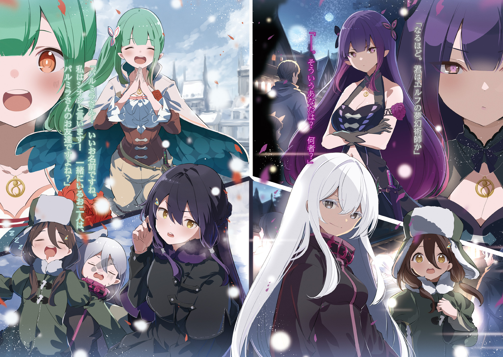
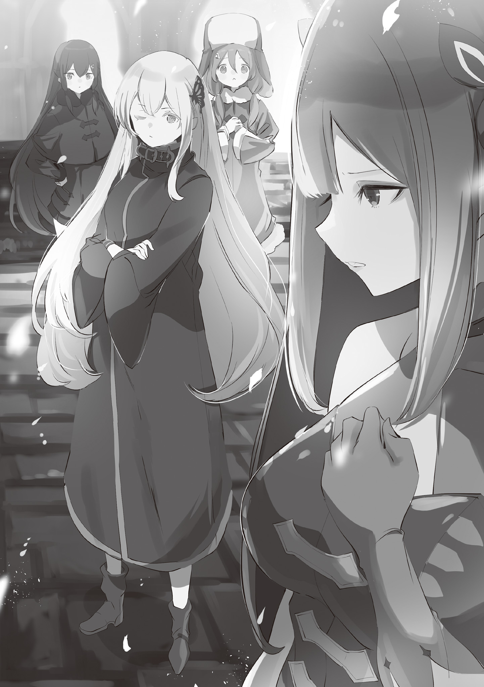
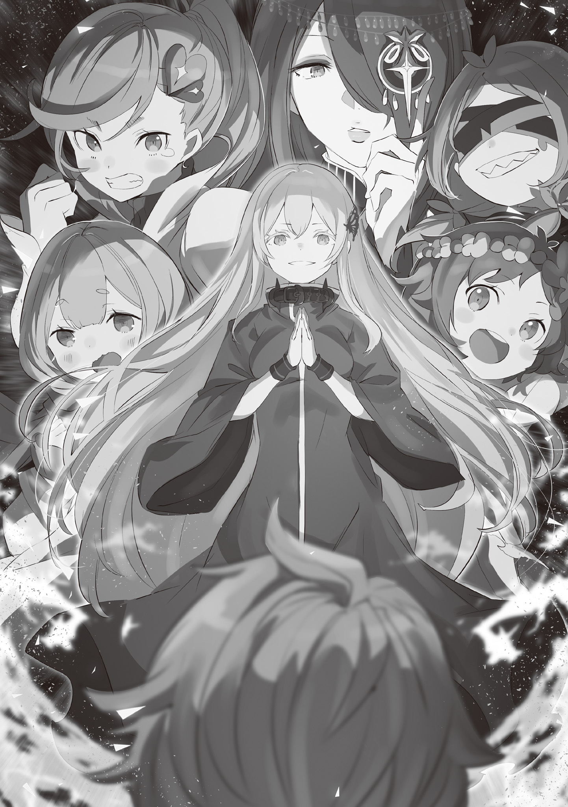
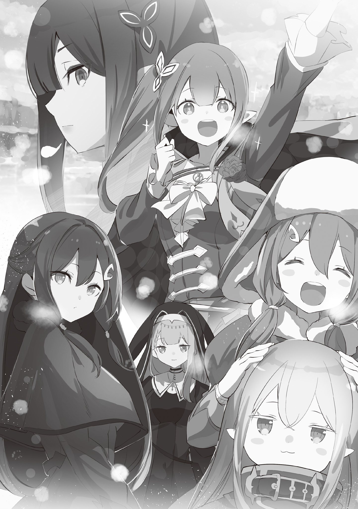

Хронологически история происходит после событий событий 4 арки и освобождения «Святилища».

Настоятельно рекомендуется читать эту историю лишь после пяти предыдущих:

1) Ведьмы после чаепития

2) Ведьмы после чаепития / Требования быть Ведьмой

3) Ведьмы после чаепития / Оценочное совещание Ведьм

4) Ведьмы после чаепития / Одна безумная ночь

5) Ведьмы после чаепития / Одна безумная ночь | Экстра

С каждым шагом ноги всё глубже увязали в снегу.

Даже под ясным небом, без метели, снежный пейзаж выглядел просто невероятно.

Кто знает, что таится под этой белоснежной пеленой, укрывшей землю? Будет ли под ногой твёрдая земля? Или, может, тропа вот-вот оборвётся, и впереди — природная ловушка, ведущая к скрытому под снегом обрыву?

— Ну что, Колетт, заставляет задуматься, куда ступить дальше?

— Да уж, сбивает с толку. И куда мне теперь ступить?

— Омега! Хватит нести чепуху! И ты, Колетт, не слушай её!

— Пальмира, я рада, что вам весело, но мы совсем остановились.

В снежной равнине эхом отдавались девичьи голоса — такие разные, но одинаково юные.

Четыре силуэта брели по заснеженной дороге: двое впереди, двое немного отставали.

Те, что шли первыми, то и дело оборачивались, беспокоясь о подругах.

В ответ на это заботливое замечание Омега лишь прищурилась и сказала:

— Не стоит так переживать, Пальмира. Я-то ладно, но ты ведь барышня из богатой семьи, привыкшая к тепличным условиям, так что нет ничего удивительного в твоей слабости.

— И это называется поддержкой? А почему ты тогда сама еле плетёшься?

— Я — случай особый. В нашем мире действует правило: тело подчиняется душе. А моя душа изначально не склонна к таким нагрузкам.

Слова Омеги заставили Пальмиру вспыхнуть от гнева.

— Не говори так, это обидно!

Её шаги, с трудом пробивавшие себе путь сквозь снег, замерли.

Она отчаянно пыталась унять сбившееся дыхание, выдыхая облачка белого пара.

Глядя на это, Омега фыркнула, а две девушки, ушедшие вперёд, поспешно вернулись.

— И зачем вы вернулись? Столько же прошли.

— Омега, ты такая вредная! Пальмира ужасно устала, мы не можем просто бросить её и уйти. Правда, Ноэль?

— Совершенно верно. Для нас с Колетт это лишь незначительная задержка!

— Незначительная задержка, значит? Да нам с Пальмирой потом придётся из сил выбиться, чтобы догнать вас!

— Не смей сравнивать меня с собой, Омега!

Пальмира всё ещё тяжело дышала.

Колетт с явным беспокойством смотрела на неё, убирая с её плеча тёмно-синие пряди.

Она поддерживала подругу, вместе с которой покинула родную деревню.

— И почему ты жалеешь только Пальмиру? Может, вы не заметили, но я тоже на последнем издыхании.

— Не уверена, что сейчас подходящий момент, но мне кажется, Колетт — случай особый. В отличие от вас с Пальмирой.

— А, я?

От такого внимания Колетт удивлённо округлила глаза и вопросительно указала на себя.

Ноэль, кивнувшая в ответ, была странствующей проповедницей Церкви Густеко, почитаемой в Священном Королевстве.

Она прошла специальную подготовку и обладала выдающимися способностями.

Поэтому то, что Колетт не уступала ей в выносливости, было поразительно.

— Но у этого есть причина. Несоответствие хрупкой внешности Колетт и её выносливости во многом объясняется эффектом браслета на правой руке.

— Браслета?

— «Браслет Защиты Зверя» — подарок от её родителей. Хоть их и нет рядом, они по-прежнему оберегают Колетт.

В ответ на слова Омеги Колетт опустила взгляд и погладила браслет на правой руке.

И тут она воскликнула: «Ох!» — и широко раскрыла глаза.

— Раз браслет — источник моих сил, может, стоит одолжить его Пальмире? Тогда она наверняка придёт в себя, правда?

— Я? Твой браслет?

— Конечно, почему бы и нет?

Улыбнувшись, Колетт сняла браслет и протянула его Пальмире.

Та поочерёдно взглянула то на браслет, то на лицо Колетт, а затем перевела взгляд на Омегу и Ноэль.

Ноэль безразлично склонила голову, а Омега лишь сделала жест, мол, валяй.

Следуя ему, Пальмира просунула свою тонкую руку в браслет и…

— Угх!

— Пальмира?!

Она мгновенно побледнела, зажала рот рукой и рухнула на колени прямо в снег.

Колетт с криком опустилась рядом и стала гладить сгорбившуюся подругу по спине.

Пальмиру несколько раз вырвало от невыносимой тошноты.

Она отбросила браслет, пробормотав: «Ч-что это…?»

Глядя на них, Омега подняла упавший в снег браслет.

— Похоже, браслет привязан только к Колетт. Если им попытается воспользоваться кто-то другой, в его тело будет направлена мана, оптимизированная для владельца, что грозит разрушением его собственных врат. Всё по правилам.

— Судя по твоим словам… ты это предвидела?

— Да. Результат примерно такой, как я и ожидала.

— Да чтоб ты сдохла, Омега… — согнувшаяся Пальмира с обидой прошипела проклятие, когда Омега подтвердила, что знала о последствиях.

Омега же, покачивая браслетом на кончике пальца, в ответ лишь склонила голову.

— Не стоит так выражаться. Чем ты недовольна?

— Зачем толкать меня в яму, если прекрасно знаешь, что я в неё свалюсь?!

— Зато я смогла увидеть твоё лицо в этот момент падения. Такое увидишь лишь раз, верно?

— У тебя отвратительный характер, Омега…!

Пальмира снова излила своё недовольство, её лицо было бледнее обычного.

К полному истощению добавился ещё и ответный удар защитного механизма «Метеора».

— Дальнейшие нагрузки опасны для жизни. Варианта два: либо оставить Пальмиру здесь, либо кому-то придётся нести её на спине.

— Мы не можем её оставить! Верни браслет, Омега! Я понесу Пальмиру…

— Погоди, не стоит принимать поспешных решений.

Омега намеренно отдёрнула «Браслет Защиты Зверя» от протянутой руки Колетт.

Вернее, не успела отдернуть.

Колетт легко забрала его, оставив Омегу с неловко поднятой рукой.

Однако она всё же спросила:

— Почему? Пальмире ведь очень плохо.

— Верно. Но разве Пальмира — единственная ваша обуза?

— Э?…

— То есть вы хотите сказать, что вы, Омега, тоже вот-вот упадёте и желаете, чтобы и вас понесли?

— Именно так!

Омега щёлкнула пальцами и глубоко кивнула понятливой Ноэль.

Несмотря на то что Омега не надела «Браслет Защиты Зверя», её истощение было таким же или даже более сильным, чем у Пальмиры.

Её тело, состоящее из маны, могло случайно исчезнуть от такого переутомления, начав с кончиков пальцев.

— Поэтому, учитывая наши телосложения, будет разумнее, если Колетт понесёт меня, а Ноэль — Пальмиру. Что думаете?

— Я не возражаю, но Колетт…

— И я справлюсь! Омега лёгкая, как пёрышко! Ноэль, ты уверена, что справишься с Пальмирой?

— Пальмира тоже лёгкая, словно обглоданная косточка, так что всё в порядке.

— Ч-что… это… за бессмысленно неприятное сравнение…

Даже в ругательствах Пальмиры уже не было прежней силы.

С радостного согласия двух полных сил девушек было решено, что лёгкая, как пёрышко, Омега и лёгкая, как обглоданная косточка, Пальмира продолжат путешествие на их спинах.

Причудливое странствие четырёх девушек в зимних нарядах началось с одинокого похода Омеги.

Покинув земли, которые можно было назвать колыбелью для её сосуда, где так долго была запечатана её душа, Омега отправилась на запад, чтобы повидать мир, но напрочь сбилась с пути.

В своих блужданиях она повстречала Колетт и Пальмиру, но вместо того, чтобы вернуться на изначальный путь, изменила его.

В конце концов, после того как они попали в Густеко, к ним присоединилась и Ноэль.

Так и сложилась их нынешняя компания.

Это была довольно разношёрстная компания, и Омега была ею вполне довольна.

— Я, особа с тёмным прошлым, заточённая во временном сосуде… юная дева, владелица Метеора — «Браслета Защиты Зверя»… странствующая проповедница из Священного Королевства Густеко и… хм.

— Пальмира, а тебя как представить? Сбежавшая дочурка из богатой семьи, бросившая сытую жизнь?

— Ты просто невыносима…

— Глупости. Мои слова сейчас были безупречным проявлением заботы, чтобы ты не чувствовала себя обделённой… Наверное.

Омега изумлённо вскинула брови, когда Пальмира, скривившись, отвернулась.

Омега и Пальмира, обмениваясь репликами, ехали на спинах Колетт и Ноэль соответственно, как и договорились.

И хоть в путь отправились четверо, слышны были шаги лишь двоих.

По иронии судьбы, вдвоём они шагали куда легче и проворнее, чем вчетвером.

— Как же быстро меняется пейзаж… Словно нам наглядно демонстрируют, какой обузой мы были… Ох, понятно.

— …Чего?

— Я поняла, отчего ты дуешься, и даже могу посочувствовать. Это из-за следов, верно? Ведь так приятно быть первой, кто оставляет следы на нетронутом снегу!

— Заткнись, ведьма!…

Омега умолкла.

Для неё это был всего лишь факт, но для некоторых людей назвать кого-то ведьмой — ужасное оскорбление.

Если Пальмира и дальше будет так запросто бросаться подобными словами, Омеге как старшей придётся принять меры.

— Ну вот, это те трудности, которых можно избежать, если путешествовать в одиночку. Напоминает мне времена, когда вокруг были одни лишь проблемные дети, требовавшие постоянного внимания.

— А! Слушай, Омега-чан, я там что-то вижу, вон у той горы!

Колетт округлила глаза.

Одной рукой она придерживала Омегу, а другой указывала вдаль, на заснеженную равнину.

Правда, сама Омега ничего не видела.

Не то что «что-то», а и самой горы.

— И правда. Вы молодец, Колетт, у вас зоркий глаз.

— Эхе-хе, у меня очень хорошее зрение! Думаю, это город. Омега-чан, пойдём туда? Воды и еды почти не осталось!

— Ох, так у нас не только силы были на исходе, но и припасы? Наше путешествие — это просто хождение по лезвию ножа, ха-ха-ха.

— Не время смеяться! Я уже хочу увидеть чьи-нибудь лица, кроме ваших. Прямо туда, без остановок!

Пальмира похлопала Ноэль по плечу, подгоняя её, и Омега с Колетт тоже последовали их примеру.

Две пары ног, тяжело переступая по снегу, двинулись вперёд, но уже с куда большим энтузиазмом, ведь теперь у них была цель.

Они направились к той самой горе, которую Омега всё ещё не видела, но тут…

— А?

Внезапно Колетт, чьи шаги до этого были уверенными, замедлилась и удивлённо охнула.

Ноэль и Пальмира, шедшие чуть позади, тоже выглядели озадаченными, видя, как Колетт, до этого быстро шагавшая по снежной равнине, замерла на месте.

— Что случилось, Колетт? Что-то не так?

— Эм-м… я и сама не знаю. Просто… я почувствовала сильное нежелание идти дальше, и вот…

Колетт сама была сбита с толку необъяснимым дискомфортом, её брови опустились.

Но её бессвязные объяснения лишь усилили недоумение Пальмиры.

Видя, как Колетт страдает от этого необъяснимого сопротивления, Омега тихо вздохнула и произнесла: «Что ж, ладно. Ну-ка!»

— А! Неприятное чувство прошло! Омега-чан, ты такая крутая!

— Ещё бы! Ну а теперь, смело вперёд…

— Стой, стой, стой, подождите!

Лёгким движением пальца Омега устранила причину беспокойства Колетт.

Однако теперь вмешалась Пальмира, и их движение снова застопорилось.

— Пальмира, мы с тобой — обуза. Лучше бы тебе это осознать.

— Да я это и так до боли чувствую! Не об этом речь! Что ты сейчас сделала?

— Ничего особенного. Просто устранила причину беспокойства Колетт. Разве не так?

— Ага, точно. Простите, что остановилась. Теперь всё в порядке!

Омега на её спине лишь пожала плечами.

Пальмира несколько мгновений беззвучно открывала и закрывала рот, но тут вмешалась Ноэль:

— Пальмира, быть может, обсудим это, когда окажемся в тепле?

— …Я ведь… не ошибаюсь…

— Конечно-конечно. Я запомню ваши терзания, Пальмира.

Неизвестно, о чём шла речь, но, похоже, между Пальмирой и Ноэль возникло какое-то взаимопонимание.

Ноэль, недавно присоединившаяся к троице, и Пальмира, осторожная, как кошка, наконец-то нашли общий язык — это было лучшим, что могло произойти.

— Омега-чан, может, ты для этого и забралась ко мне на спину?

— Хм, вот как… Да, именно так.

— Вау, вот это да! Ты и вправду всё наперёд знаешь!

Омега ничего не сказала, лишь с нежным взглядом смотрела на Колетт, чьи глаза сияли.

Как бы то ни было, мелочь, остановившая Колетт, была устранена, Пальмира перестала ворчать, а Ноэль молча шагала вперёд.

Препятствий больше не было.

К счастью, гора, которую Омега не видела, теперь показалась, и у её подножия ясно виднелся довольно большой город.

Явное облегчение передалось от младших — Колетт и Пальмиры, и даже Ноэль почувствовала себя спокойнее, когда увидела приближающиеся строения.

Омега тоже вздохнула с облегчением, что её путешествие здесь не закончится, но…

— Хм, странно…

Это чувство облегчения продлилось недолго. Когда Омега, с интересом принимая этот факт, пробормотала это, Колетт, неся её на спине, моргнула и с лицом, похожим на мордочку маленького кролика, произнесла:

— А? Что? А куда пропали Пальмира и Ноэль?

Снежные пейзажи остались позади, уступив место рукотворным постройкам.

Колетт ступила на улицу, припорошённую редким, тонким снежком, и ошеломлённо застыла.

Омега, которую та несла на спине, тоже недоверчиво нахмурила тонкие брови.

Вода и еда закончились.

Силы Омеги и Пальмиры тоже были на исходе.

Наконец они добрались до города, вывеска на въезде в который гласила: « Сильфора ».

Но стоило им ступить на его улицы, как две их спутницы, которые должны были быть здесь, бесследно исчезли.

— Странно, Омега-чан. Куда же они подевались?

— Да уж. Дорога сюда была прямой, так что они не могли просто отстать или потеряться. И хотя я не то чтобы постоянно за ними следила, но ещё пять минут назад они точно шли за нами.

— Да какие пять минут, они десять секунд назад были рядом! Вот это-то и странно!

Колетт нервно осматривала местность в поисках пропавших.

Омегу так сильно мотало на её спине, что она решила спрыгнуть на землю, пока её случайно не стряхнули.

Оперевшись на ноги, которые, на удивление, даже не подкосились, Омега тоже огляделась.

— Хм, я думала, они были чуть позади, но их и след простыл. Ноэль — странствующая проповедница, так что она может двигаться с невероятной скоростью, но…

— Но если они будут двигаться так быстро, Пальмира точно закричит! Пальмира, хоть и упрямая, но очень пугливая…

От этого милого «пугливая», сказанного в типичной для Колетт манере, на лице Омеги невольно появилась улыбка.

На мгновение эта мягкая формулировка напомнила ей кого-то знакомого, но тут…

— Э-э-э?!

Омега обернулась посмотреть, что случилось, и увидела, что Колетт вновь застыла, уставившись прямо на неё.

Вернее, на саму Омегу.

Сначала Омега подумала, что, может быть, она настолько лёгкая, что Колетт просто не заметила, как та слезла, но дело было не в этом.

Колетт указала на неё дрожащим пальцем:

— О-Омега-чан… У тебя белые волосы, Омега-чан!

— Белые волосы?

В ответ на изумление Колетт Омега недоумённо склонила голову.

Внешность Омеги сейчас не была её настоящей; она пребывала во временном теле юной девушки с розовыми волосами и чуть более длинными ушами.

Назвать её волосы «белыми» было бы ошибкой Колетт, но…

— Нет, это не ошибка! Твои волосы и вправду белые, Омега-чан.

Омега осторожно взяла прядь волос, спадающую на плечо, и убедилась в их цвете.

Но перемена коснулась не только волос.

Приглядевшись, она поняла, что её взгляд находится выше обычного.

Выше того уровня, к которому она уже начала привыкать в теле девочки.

Осознав это, Омега коснулась своего лица.

— Вот как, значит, я вернулась в свой изначальный облик.

Перед ней Колетт поспешно и часто закивала.

Омега взяла её лицо в ладони и притянула к себе.

В широко распахнутых глазах изумлённой девочки отразилась Ведьма с белыми волосами и точёным лицом — без сомнения, это было лицо Ехидны, Ведьмы Жадности.

— Омега-чан, мне очень страшно, когда ты вдруг в таком облике хватаешь меня за лицо!

— Прости. Желание всё проверить взяло верх. Но всё-таки это странно.

— Странно? Что не так? Что произошло? — спросила Колетт, чьи щёки всё ещё были стиснуты в ладонях Омеги.

— Как я уже показывала тебе и Пальмире, я могу на короткое время принимать свой истинный облик. Но сейчас я этого делать не собиралась. И к тому же…

— К тому же?

— То, что «Браслет Защиты Зверя» не срабатывает, когда я вот так держу твоё лицо, тоже неестественно.

Судя по растерянному взгляду Колетт, она не понимала, о чём речь.

Колетт не знала ни о принципе работы «Браслета Защиты Зверя», который оберегал владельца, ни о том, что в момент активации он отключал её сознание.

Но, независимо от того, осознает пользователь или нет, внезапное действие Омеги должно было активировать «Метеор».

Если, конечно, Колетт не доверяла Омеге так же сильно, как Пальмире, чего и быть не могло.

В любом случае, изменение облика Омеги, отказ «Браслета Защиты Зверя» и, вдобавок ко всему, исчезновение Пальмиры и Ноэль… три этих странности указывали на одну-единственную причину, и начинать проверку стоило именно с неё.

— Колетт, выслушай меня и постарайся не удивляться.

— Я изо всех сил постараюсь, но разве можно тут не удивиться? Мне страшно…

— Тогда постарайся удивиться не слишком сильно. Скорее всего, Пальмира и Ноэль в безопасности. На самом деле, в опасности сейчас мы с тобой.

— Что?!

Колетт, прислушавшись к просьбе Омеги, тут же прикрыла рот рукой.

Омега одобрительно кивнула её послушному жесту, приложила руку к своей груди и обвела взглядом городские улицы.

А затем произнесла:

— Похоже, мы с тобой оказались в ловушке… чьего-то « Мира Снов ».

— Эй?! Колетт! Омега! Что с вами?!

От неожиданности голос Пальмиры сорвался на крик.

На лице девушки, застывшем от растерянности и ужаса, отразилось непонимание.

Прямо перед ней, в снегу по колено, лежали рухнувшие на землю Колетт и Омега.

Они упали, едва переступив через ворота города, — рухнули, словно марионетки, у которых оборвали нити.

Спрыгнув со спины Ноэль, Пальмира перевернула лежащих лицом в снег девушек.

Обе сомкнули глаза, словно спали.

— Так внезапно уснуть… это же какая-то ужасная хворь!

В панике Пальмира принялась трясти Колетт за плечи и хлопать Омегу по щекам, пытаясь привести их в чувство.

Но те не реагировали, словно мёртвые.

Когда же она замахнулась, чтобы ударить Омегу посильнее, её руку перехватила Ноэль.

— Ноэль! Отпусти! Их нужно разбудить!…

— Понимаю ваши чувства, однако от тряски и ударов им будет только хуже.

— И что тогда?! Что нам делать?!

Пальмира попыталась вырваться, но хватка Ноэль была непоколебимой.

Растеряв весь свой пыл перед её недюжинной силой, девушка покорно умолкла, ожидая, что скажет Ноэль.

Что же случилось с Колетт и Омегой, если они не просыпаются ни от криков, ни от ударов?

Однако Ноэль не ответила Пальмире, а лишь молча огляделась… и произнесла:

— Слишком тихо…

— А? Ты о чём вообще?…

— Мы вошли в город, но при этом не слышно ни единого человеческого голоса.

Приложив палец к губам, Ноэль замолчала.

Её слова заставили Пальмиру затаить дыхание и тоже прислушаться.

И правда… как и говорила Ноэль, вокруг не было слышно ни людских голосов, ни признаков жизни.

Колетт с её способностями — случай особый, но и Ноэль должна была обладать хорошим зрением и слухом.

И если даже она ничего не замечала, то что уж говорить о Пальмире.

— И что с того? Сейчас важнее Колетт и…

— Пальмира, возможно, с жителями города та же ситуация.

— Та же? Э?! Неужели ты…

Испуганная Пальмира посмотрела на Колетт, которую она держала на руках, на Омегу, лежащую в снегу, а затем на опустевший город, где не было видно ни души.

— Ты хочешь сказать, что все жители города спят, как они?!

— Уверенности нет, но есть такое опасение.

Ноэль медленно покачала головой, её длинные заплетённые светлые волосы закачались в такт.

Заворожённая их блеском, Пальмира невольно сглотнула.

Что, если это необъяснимое происшествие коснулось не только Колетт и Омеги, но и всего города?

— …Нет, погоди-ка, а мы? Почему с нами не произошло того же, что и с этими двумя? Это странно!

— Вероятно, причина в моей особой подготовке.

— Твоей подготовке?

— Да. Я — странствующая проповедница Церкви Густеко. Я прошла специальное обучение, необходимое для путешествий по разным землям и распространения учения Святой Церкви. Частью этой подготовки было нанесение на тело печати, отражающей магию и проклятия извне.

Отвечая, Ноэль прижала руку к груди, скрытой под тёплой одеждой и рясой проповедницы.

Её объяснения звучали для Пальмиры как сказка из другого мира, но всё равно не всё сходилось.

— Хорошо, это объясняет, почему ты в порядке. Но при чём здесь я?

— Поскольку вы были у меня на спине, Пальмира, вы оказались под действием моей защиты и вместе со мной отразили внешнее воздействие, которому подверглись Омега и Колетт.

— Такая… случайность…

Получается, их судьба зависела от того, кто из них — Колетт или Ноэль — нёс её на спине.

Сказать, что вытянуть несчастливый билет из двух вариантов — это в духе Омеги, было бы, наверное, так, но…

Совершенно иное, неприятное чувство болезненно сжало грудь Пальмиры.

— Пальмира?

— …Ничего. Я немного успокоилась. Слушай, ты ведь странствующая проповедница, и тебя должны были учить, как выпутываться из таких ситуаций, верно? Так что делать, если твои спутники внезапно уснули в пути и не просыпаются?

— Учение Святой Церкви не рассматривает настолько конкретные случаи. Однако это не значит, что я совсем не могу оправдать ваших надежд.

— То есть…

Пальмира уже хотела спросить, что та имеет в виду, но не успела…

Вмешался кто-то третий — не Пальмира, не Ноэль и не спящие на снегу.

— Надо же, кто-то вошёл в город. Удивительно, что здесь целых двое не спят.

— Тс-с!

Внезапно с окраины города раздался мужской голос, и Пальмира, подавив крик, обернулась.

В её поле зрения стоял высокий, крепко сложенный короткостриженый мужчина.

Молодой человек лет двадцати пяти, с тёмно-каштановыми волосами и смуглой кожей, поднял руки в сторону Пальмиры и Ноэль, демонстрируя слегка дружелюбную улыбку.

То, что он не напал сразу, а сначала заговорил, можно было бы расценить как знак дружелюбия, но…

— Нет, не верю. Я слышала, мужчины врут не моргнув и глазом, лишь бы заполучить женщину. Ноэль, свяжи его!

— Э…! Ну и радикальные у вас семейные ценности! Сестрица, скажи хоть что-нибудь своей спутнице!

— Я считаю, что такая осторожность весьма похвальна. Когда женщины путешествуют одни, излишняя бдительность не повредит.

— Никакой поддержки! Может, сжалитесь надо мной, а? Мы ведь коллеги, не так ли?

Подняв и вторую руку в знак того, что он безоружен, юноша слегка изменил тон и подмигнул Ноэль.

Пальмира ещё больше насторожилась.

— Коллеги? Стало быть, вы…

— Я служу Рыцарем-Аколитом в Церкви Густеко, госпожа проповедница.

С этими словами юноша распахнул плащ, под которым сияли серебряные доспехи — доказательство его слов.

Ноэль слегка расширила глаза, и даже Пальмира, не слишком сведущая в церковных делах, поняла, что он не лжёт.

— Занк Метрей. Рыцарь-Аколит, посланный по воле Святой Церкви Густеко, чтобы истребить ересь, скрывающуюся в этом городе, Сильфоре. Приятно познакомиться?

Сказав это, юноша, Рыцарь-Аколит Занк Метрей, снова подмигнул.

— Честно говоря, сначала я был ошарашен. Как-никак, я был уверен, что моё « Благословение Отчуждения » безупречно, а его взяли и развеяли…

— Отчуждения? Но…

— «Благословение Отчуждения» … Колетт ведь остановилась прямо перед городом, помните? То неприятное чувство, которое она тогда испытала, было вызвано им.

Ноэль объяснила Пальмире, на чьём лице читалось недоумение, что произошло перед входом в город.

Услышав это, Пальмира сначала произнесла: «Так вот что это было…», а затем в замешательстве склонила голову:

— Погоди-ка. Ноэль, а ты-то как сразу всё поняла?

— Я своими глазами видела, как Омега разрушила это «Благословение».

— Так вот что это была за странная выходка Омеги!…

Тогда, за спиной остановившейся Колетт, Омега одним лишь движением пальцев развеяла «Благословение».

Даже Ноэль, странствующая проповедница, знающая о силе церковных «Благословений» не понаслышке, и та была поражена.

Впрочем, для Омеги, хладнокровно называющей себя «Ведьмой», это, видимо, было сущим пустяком.

— Эх, надо же, какая-то девчонка смогла его развеять… руки опускаются. А меня ведь во время обучения так хвалили, говорили, что у меня талант к «Благословениям».

Занк опустил голову, глядя на Омегу, которую убрали со снега.

Пальмира смотрела на него с сомнением, но Ноэль сочла, что его слова, вероятно, правдивы.

«Благословение Отчуждения» , иными словами, было барьером, который не позволял посторонним войти.

Омега развеяла его на значительном расстоянии, а Сильфора была немаленьким городом.

Использовать «Благословение», способное полностью охватить такой город, под силу лишь избранным Рыцарям-Аколитам.

По крайней мере, это было не под силу Ноэль, которой не хватало таланта к получению «Благословений».

— И всё же… ты говорил что-то про охоту на еретиков, так?

На удивление, довольно пугливая Пальмира, к тому же не из Священного Королевства, безбоязненно разговаривала с незнакомцем, представившимся Рыцарем-Аколитом, которых нечасто встретишь.

Занк, удивлённый таким редким поведением, ответил ей в своей обычной непринуждённой манере:

— А, да, было дело. Такова Священная Воля нашего Короля. По правде, я хотел разобраться со всем до того, как вы, сестрицы, заглянете в город, но…

— …но что-то пошло не так, и результатом стала эта трагедия?

— И возразить нечего. По факту, противник пока что на шаг впереди.

— Противник… ересь, что усыпила Колетт и Омегу…

В голове Пальмиры, вероятно, уже рисовался образ ужасающего еретика, угрожающего всему городу.

Однако…

— То, что был отправлен Рыцарь-Аколит, не всегда означает, что противник — это могущественная сущность. Роль Рыцарей-Аколитов разнообразна: это и стихийные бедствия, и спасение жизней, и многое другое.

— А, вот как? Неудивительно…

— Эй-эй, ты что, на меня взглянула и всё поняла? Да, мои боевые навыки похуже, чем владение «Благословениями», но я всё-таки Рыцарь-Аколит! Я могу за себя постоять!

— Но еретика в городе ты так и не одолел.

— Сестрица! Да у вас девчонка — просто кремень!

— Пальмира со всеми так общается. Но что важнее…

Ноэль перевела взгляд на Занка, которого только что отчитал ребёнок, и, выдохнув облачко пара, привлекла его внимание.

— Что из себя представляет тот самый еретик, что затаился в городе? Погрузить целый город в сон — задача не из лёгких. Ваше «Благословение», окутавшее город, — это уже само по себе нечто невероятное, но…

— …но его техника оказалась ещё сильнее. Понимаю, я того же мнения. И скажу кое-что пострашнее: на самом деле, я не первый Рыцарь-Аколит, которого послали на эту охоту.

Занк пожал плечами, его тон был лёгким, и на мгновение Ноэль чуть не ошиблась, недооценив серьёзность ситуации.

Пальмира, не посвящённая в дела Священного Королевства, выглядела так, будто не понимала всей тяжести положения, но Ноэль всё было ясно.

Звания Рыцаря-Аколита в Церкви Густеко удостаивались лишь единицы, и все они славились своей исключительной силой.

Если Занк был следующим, это означало, что предыдущий рыцарь пал от рук еретика.

— Ну что, поняли, насколько всё серьёзно? Пока я пытался выиграть время с помощью «Благословения Отчуждения», чтобы придумать план по поимке еретика…

— …мы тут бесцеремонно пришли и прорвали его, так? — вздохнула Пальмира, наконец всё поняв, а Занк кивнул: «Именно так».

Осознав общую картину, Ноэль поняла: они с Пальмирой, Колетт и Омегой были чистейшими посторонними.

Вторжение на территорию, где Рыцарь-Аколит проводит операцию, — от такой дерзости кровь стынет в жилах.

— Вот такие дела. Извините, сестрицы, но я прошу вас покинуть город. Как только охота на еретика будет завершена, уснувшие девчонки должны проснуться. Так что…

— Ага, конечно, мы положимся на тебя… Думал, я так скажу? Ни за что! Они же наши близкие! Оставить их вот так… — Пальмира скрестила руки на груди, пытаясь выразить свой категорический отказ.

Но она не договорила.

Её слова оборвались, потому что она заглянула в глаза Занка.

— Эй-эй, это уже ни в какие ворота, девчонка. Я ведь всё по-хорошему, вежливо и подробно объяснил. Я ведь сказал, да? По Воле Святой.

Слова Занка лились плавно, без запинки, словно он читал проповедь.

На его лице играла всё та же добродушная улыбка, но вот взгляд стал глубже.

Не тон, но сама интонация голоса неуловимо изменилась, став давящей, пресекающей любые возражения.

Заглянув в эти глаза, Пальмира невольно издала прерывистый вздох.

Но, не обращая внимания на её испуганную реакцию, Занк ещё ближе наклонил к ней своё лицо:

— Это Воля «Святой»! Противоречить ей, девчонка, значит быть еретичкой!?

— Занк, она не является верующей Святой Церкви.

— Тем более странно! С ней путешествует странствующая проповедница, так почему она до сих пор не стала верующей? Сестрица, ты что, свои обязанности не выполняешь?

Эти слова сильно задели Ноэль.

Её долг как странствующего проповедника — нести учение Церкви Густеко в массы и обращать в веру как можно больше людей.

Но она ни разу не говорила о своей вере ни Омеге, ни Колетт, ни Пальмире.

Если бы её назвали недостойной своего положения, ей нечего было бы возразить.

Осознание этого заставило её промолчать.

Занк нахмурился, видя, что Ноэль не ответила, и перевёл взгляд.

Он отошёл от них и направился к Омеге и Колетт, лежавшим под навесом.

— Я понимаю, вы беспокоитесь о подружках, но дальше предоставьте это мне и…

— Эй! Не смей трогать Колетт!

Когда Занк протянул руку к спящим девушкам, Пальмира, очнувшись от оцепенения, бросилась на него.

Забыв о недавнем страхе, она выскочила из-за спины Ноэль и вцепилась в руку Занка, чтобы защитить Омегу и Колетт.

Его лицо тут же напряглось.

В то же мгновение Ноэль поняла: дело плохо.

Но предпринять что-либо уже не могла.

Потому что всё уже сделала не она, а спящая Колетт.

— Бугх?!

В следующее мгновение раздался глухой удар, словно что-то пронзили, и тело Занка отбросило в снег.

Поскользнувшись, он вскрикнул от боли и потряс ушибленной рукой.

Рыцаря-Аколита с такой силой пнула хрупкая девушка — спящая Колетт нанесла удар, чтобы защитить Пальмиру.

Колетт резко вскочила на ноги.

На её правом запястье зловеще блеснул браслет.

— Шр-р-р-р-р-р…

Издав звериное рычание, Колетт встала в стойку, закрывая собой Пальмиру и Омегу.

Занк сперва округлил глаза от удивления, но его лицо тут же вновь стало непроницаемым.

— Эта сила… не от Святого Короля. Еретичка.

Едва прозвучали эти слова, сказанные ледяным, безэмоциональным голосом, Пальмира среагировала.

Она хлопнула рычащую Колетт по плечу и, обхватив спящую Омегу, закричала:

— Колетт! Хватай меня и беги!

Колетт мгновенно развернулась, подхватила Пальмиру вместе с Омегой на руки и, оттолкнувшись от стены дома с нечеловеческой силой, запрыгнула на крышу и тут же скрылась из виду.

— Чёрт, я не позволю им…

— Не стоит этого делать! — Ноэль преградила путь Занку, раскинув руки.

Занк цыкнул языком, и его пронзительный взгляд упёрся в Ноэль.

— Почему мешаешь? Неужели ты, странствующая проповедница, заодно с еретиками?

— Вовсе нет. Но если вы безрассудно броситесь в погоню, то подвергнете себя опасности. К тому же, ваша цель — еретик, усыпивший город. Они — другое дело.

— Еретик есть еретик. Предлагаешь мне закрыть на это глаза?

— Я не говорю «отпустить». Я говорю, что есть приоритеты.

Ноэль выпрямилась, не отводя взгляда от смотревших на неё сверху вниз глаз Занка.

Она понимала, что Пальмира с Колетт уже вне досягаемости.

Ноэль хоть и не знала наверняка, но «Браслет Защиты Зверя», который носила Колетт, обладал очень высокими характеристиками и действительно был чем-то, что Церковь Густеко могла бы признать «ересью».

Ведь Святая Церковь не признавала ни владельцев «Божественной Защиты», ни иных способностей, которые не могла объяснить «Благословением».

— И позвольте заметить, ещё не доказано, что они еретики. Я как раз нахожусь в процессе выяснения этого. А вы…

— Выяснения, значит. Звучит как оправдание падшей святоши.

— В таком случае, может, сразимся прямо здесь? Рискуете не исполнить Волю «Святой», но если таково ваше желание… — предложила Ноэль, прищурив голубые глаза и не отступая ни на шаг.

Занк, не ослаблявший своего напора, нахмурился и на несколько секунд замолчал, а затем ответил:

— Раз ты так говоришь, то ладно. Взаимное уничтожение — худший способ нарушить Волю «Святой». Но тогда, сестрица, и ты поможешь мне в охоте на городского еретика.

Он поднял руки, и вся враждебность в его позе тут же исчезла.

Увидев, что Занк снова превратился в добродушного парня, Ноэль тоже расслабила плечи.

— Я принимаю ваши условия.

Ей удалось сместить фокус внимания Занка с Омеги и остальных, сославшись на приоритеты.

Это была лишь отсрочка, но выигранное время на раздумья — уже хорошо.

Уж кто-кто, а Омега, даже будучи во сне, должна что-нибудь придумать.

— Итак, если конкретнее, кто этот еретик?

На её вопрос Занк ответил: «Ах, да…»

В его глазах снова промелькнула тень, но смотрел он уже не на Ноэль, а на заснеженные улицы Сильфоры.

— Здесь затаился гнусный еретик, что владеет искусством вмешательства в мирный сон.

— Хотя это лишь предположение, но, думаю, мы с тобой сейчас спим. Пальмиры и Ноэль здесь нет, потому что они смогли избежать сна.

— Н-но, но ведь это так странно. Почему именно мы? Может, мы с Омегой-чан те ещё сони, в отличие от Пальмиры и Ноэль?

— Что ж, в общих чертах можно и так сказать.

Омега убрала руки, которыми до этого держала лицо Колетт, и погладила свои белые волосы.

Колетт, смущённая её видом, который она хоть и видела, но к которому не привыкла, беспокойно озиралась по сторонам.

По словам Омеги, они находились во сне, но…

— Ой, подожди, Омега-чан. Даже если мы с тобой уснули вместе, разве не странно, что мы видим один и тот же сон?

Колетт и сама порой, когда ей снилось что-то хорошее, мечтала разделить этот сон с кем-то из друзей, но она никогда не слышала, чтобы такое было возможно.

Сны, что приходят к тебе ночью, какими бы они ни были, должны принадлежать только тебе одному.

— Ты совершенно права, Колетт. А потому этот мир — исключение из всех привычных правил о снах. Это значит, что тот, кто стоит за этим, — настоящий мастер.

— Ох… Исключение, значит…

— Вероятно, в реальном мире, за пределами сна, Пальмира и Ноэль сейчас отчаянно пытаются нас разбудить.

— Я уверена, что всё хорошо! Пальмира и Ноэль очень добрые. Но, но… я так переживаю, что мы заставили их волноваться. У меня аж сердце сжимается.

— Хм, это и впрямь прискорбно, — Омега, до этого погружённая в мысли, подняла лицо перед Колетт.

Колетт тут же поняла, в чём причина задумчивости Омеги.

Они стояли у входа в город Сильфора, и на улицах, виднеющихся оттуда, одно за другим появлялось множество людей.

— Ух ты, ух ты, Омега-чан! Как много людей! Кто они?

— Вероятно, это жители этого города… но если они не просто бездушные копии, то это нечто невероятное.

— …?

— Это значит, что все они могут быть в том же положении, что и мы.

Колетт склонила голову, не понимая слов Омеги, но когда та объяснила более доступно, её глаза расширились.

На взгляд Колетт, людей в городе было гораздо больше, чем сто или двести.

Если все они были в такой же ситуации, как Колетт и Омега, значит, за пределами сна уснул весь город.

— Н-но если подумать, разве это не нормально для ночи?

— Мы прибыли в город днём… Удивительно, что в наши дни сохранился такой могущественный пользователь «Искусства Сновидений» .

— «Искусства Сновидений»?

— Это категория, немного отличающаяся от магии или благословений. Подобное «Искусство Сновидений» существовало и четыреста лет назад, когда жила я.

Говоря это, Омега медленно двинулась в город.

Колетт, торопливо следуя за ней, спросила:

— Омега-чан, нужно ли нам туда идти? Разве нам не нужно покинуть город, чтобы выбраться из этого сна?

— Я не знаю, как создан этот «Мир Снов», но если есть отправная точка для каждого жителя, то это город. Вероятно, в этом мире снов не существует ничего, кроме самого города.

— Ничего не понимаю, совсем ничего! Омега-чан!

Колетт хотела задержать её и поговорить, но Омега не останавливалась.

Когда Колетт посмотрела на неё сбоку, то увидела, что та быстро шла, и её чёрные глаза сияли.

Сама Омега говорила, что она очень любопытна.

И хотя у Колетт от всех этих загадок голова шла кругом, её спутница, казалось, была в восторге.

Не сбавляя темпа, Омега обратилась к одному из прохожих — мужчине средних лет:

— Приветствую, не уделите минутку? Мы пришли в город издалека.

— …А? Простите, я занят, работаю. Поговорите с кем-нибудь другим.

— Ну-ну, не надо так. Кстати, а что у вас за работа? Может, я могу чем-то помочь?

— Странные вещи говоришь… Моя работа… это… работа… а? Работа?…

Мужчина, поправивший шляпу, так и замер, задумавшись над вопросом Омеги.

Он начал что-то бормотать себе под нос, а Омега, прищурившись, обратилась уже к другому прохожему.

Но и следующая женщина, и мальчик, и старик после неё — все они застывали в раздумьях от вопросов Омеги, и разговор тут же обрывался.

— Омега-чан, эти люди…

— Возможно, дело в предрасположенности, но скорее — в том, как была распределена сила. Сила погружения в «Мир Снов» для важных и неважных для пользователя людей различается. Впрочем, сомневаюсь, что его цель была лишь в том, чтобы погрузить всех в лёгкий сон… так что…

Интерес Омеги ничуть не угасал, несмотря на беспокойство Колетт.

Раз уж так вышло, Колетт решила молча наблюдать, пока Омега не закончит то, что задумала.

И это привело к чему-то невероятному.

Омега, оглядевшись по сторонам и, похоже, не найдя подходящего собеседника, вдруг вскинула свои тонкие руки к небу.

Колетт лишь захлопала глазами, глядя на эту сцену.

— …Аль Шарио.

Едва Омега произнесла это тихим, красивым голосом, как Колетт почувствовала, что по затылку пробежали мурашки.

Она тут же прижала руку к шее.

Но это ощущение возникло не от прямого воздействия, а от чего-то иного, куда более грандиозного.

Словно само тело первым поняло, что сейчас произойдёт нечто невероятное, и предупредило её этим покалыванием.

И это «нечто» тут же предстало перед её глазами.

Высоко над головой, с неба, с которого падали снежинки, начал опускаться луч света.

Когда-то давно, в родной деревне, откуда Колетт изгнали в лес, ещё до встречи с Омегой, ей доводилось в одиночестве наблюдать за падающими звёздами на ночном небе.

Почему-то именно эти воспоминания сейчас пронеслись в её сознании.

Она подумала, что этот приближающийся свет и есть та самая падающая звезда.

— Омега…

— Не нужно бояться.

Омега тихо сжала руку Колетт, прищурившейся от ослепительного белого света.

От неожиданного прикосновения тело Колетт на мгновение напряглось, но тут же расслабилось, когда она поняла, что это Омега.

Белый свет всё ближе и ближе подступал к двум девушкам, державшимся за руки, и к головам жителей города…

— Я же говорила, Колетт. Это «Мир Снов», место, созданное пользователем «Искусства Сновидений». А значит, вся власть здесь принадлежит ему. Я и сама создавала похожие «Миры Снов» под предлогом «Чаепитий»… но такой масштаб говорит о совершенно ином уровне мастерства.

Голос Омеги доносился откуда-то издалека.

В ушах звенело.

Колетт с трудом сглотнула, пытаясь осознать произошедшее, — падающая звезда, ещё секунду назад летевшая прямо на них, просто исчезла.

А затем…

— Признаюсь, я впечатлена. Вот она, истинная сила того, кто правит законами сна. Интересно, это имя всё ещё в ходу…? Приветствую тебя, «Мастер Грёз».

Омега, держа Колетт за руку, весело обернулась.

Колетт, неуклюже повернувшаяся вслед за ней, тоже посмотрела в ту сторону.

Среди безразличных к исчезнувшей звезде горожан, снующих туда-сюда, в самой гуще толпы неподвижно стояла одинокая фигура.

Это была красивая женщина.

В глаза бросались густые фиолетовые волосы до самой спины и глаза того же цвета, однако взгляд её был невероятно суровым.

И ещё одна примечательная черта.

Её уши были немного вытянутыми и заострёнными.

— Ты эльфийка?

— …А ты кто такая? — ответила женщина на реплику Омеги, обратившей внимание на ту же деталь, что и Колетт.

Голос её был таким же колючим, как и взгляд.

Колетт в панике переводила взгляд с Омеги на незнакомку.

Увидев замешательство Колетт, Омега слегка улыбнулась и подняла их соединённые руки:

— Не волнуйся, Колетт. Конечно, встреча с таким сильным пользователем «Искусства Сновидений» — редкость, и, похоже, мои заклинания в этом «Мире Снов» под запретом, но…

— А?!

— Но всё в порядке. Я и раньше не раз попадала в трудные ситуации…

Сказав это, Омега, не переставая улыбаться, посмотрела на женщину, которую назвала «Мастером Грёз», и закончила:

— …ведь умерла я всего-навсего один раз.

— Я не очень понимаю, но одного раза и так более чем достаточно, Омега-чан!

— Остановись уже, Колетт!

Пальмиру обдувало ледяным ветром, пока та отчаянно взывала к подруге.

К счастью, её мольбы были услышаны.

Колетт, крепко державшая её, прекратила прыгать с крыши на крышу и остановилась.

— Ох, как же тошнит…

— Гр-р-р…

— В-всё в порядке, просто успокойся.

Голова у Пальмиры шла кругом после такой тряски.

Сознание у тихо рычавшей рядом Колетт отсутствовало, но девушка чувствовала, что та беспокоится, и поспешила её успокоить.

В этом состоянии, под действием «Браслета Защиты Зверя», Колетт превращалась в зверя, который буйствовал ради самозащиты.

Но сейчас что-то было иначе.

Или это ей лишь казалось из-за дружеской привязанности?

По крайней мере, Колетт помогла им сбежать вместе с Омегой.

— Ты и правда меняешься, Колетт…

Чувство вины, запоздало возникшее вслед за облегчением, рассеялось, когда Колетт, потерявшую силы, обхватила Пальмира с криком «Вах!», чтобы удержать.

Колетт, словно и не было того, что произошло мгновение назад, мирно спала.

«Метеор» понял, что угроза миновала, и её тело вновь погрузилось в сон.

Однако Пальмира понимала, что это не означало улучшения ситуации.

— Колетт так и спит, а Ноэль теперь не с нами…

Хотя в той ситуации иного выхода не было, Пальмира винила себя за то, что оставила Ноэль одну.

Конечно, Ноэль была из Церкви Густеко и, наверное, могла найти общий язык с Занком.

Но Пальмира сбежала, испугавшись его, и теперь не могла избавиться от ощущения, что просто-напросто бросила Ноэль.

— Почему осталась именно я?… Была бы на моём месте ты, Омега…

Ноэль говорила, что разница между уснувшими и бодрствующими заключалась в том, кого несли на спине.

Если бы их роли поменялись и Омега осталась бодрствовать, она бы уж точно нашла, что ответить этому Рыцарю-Аколиту, и наверняка придумала бы, как противостоять «еретику», усыпляющему людей.

Но вместо неё осталась бесполезная она.

И что делать теперь?…

— Эм, простите… Вам платочек не нужен?

— А?!

В момент, когда чувство бессилия едва не обернулось слезами, со стороны внезапно раздался голос.

Пальмира, подпрыгнув от неожиданности, отпрянула, всё ещё держа Колетт на руках.

Но споткнулась о лежащую Омегу и с громким «Ай!» рухнула на спину.

На заснеженной крыше отпечатались три силуэта.

И та, кто стала свидетелем столь неловкого падения, внезапно появилась в поле зрения Пальмиры вверх ногами.

— Ой, простите, что напугала. Всё выжидала момент, чтобы заговорить… Но потом подумала, да почему бы просто не взять и не объявиться?

— …

— Эм?…

Незнакомка, чей голос звучал до нелепого беззаботно для такой ситуации, обладала запоминающейся внешностью, и её черты чётко отпечатались в сознании девушки.

Это была красивая девушка с собранными в пучок светлыми, почти доходившими до спины волосами и круглыми глазами.

Но даже её красота не могла скрыть особенности — её длинных, заострённых ушей.

Такая особенность была лишь у одной расы…

— Эльф!

— Ох… Вижу, вы всё-таки заметили. Но я взвесила все за и против: скрывать свою природу, проявляя дружелюбие, а потом раскрыться, или сразу показать себя такой, какая есть.

— Я-я понимаю, да! Точнее, не совсем понимаю, но точно могу представить!

— Просто то, что я эльф, и то, что я заговорила с вами, — это две разные вещи, поэтому, если вы сможете не смешивать одно с другим…

— Эй ты!

Девушка-эльф тараторила, быстро выбрасывая слова.

Пальмира перебила её, и та тут же выпрямилась.

Конечно, она была эльфом, и встретить её в условиях этого заснувшего города было более чем подозрительно.

— У тебя нет к нам враждебных намерений? Я правильно понимаю?

— Да, никаких! Совсем никаких! Ни капельки! Наоборот, мне даже кажется, что мы могли бы подружиться.

— Чего?

— Прошу прощения! Я слишком увлеклась! Если бы вы просто допустили такую возможность…

В её ответе, несмотря на уступчивость, всё ещё сквозила лёгкая жадность.

Чувствуя небольшую усталость, Пальмира поднялась из снега.

И вот она уже стояла лицом к лицу со своей собеседницей, теперь не вверх ногами.

Девушка, одетая в тёплую одежду, всем своим видом напоминала эльфа, нет, она и была эльфом.

Впрочем, если говорить о загадочности, то лежащая в снегу Омега была куда более странной.

А потому…

— Ты из этого города? Только не говори, что ты тоже Рыцарь-Аколит.

— Вовсе нет, конечно! Но… с вами всё хорошо?

— В каком смысле?

— Самой странно это говорить, но редко кто, узнав, что я эльф, продолжает со мной разговаривать.

Девушка-эльф произнесла это, даже не пытаясь скрыть свои характерные уши.

Пальмира лишь пожала плечами в ответ, не желая вдаваться в подробности.

Внезапно глаза эльфийки округлились, а лицо озарилось улыбкой.

— Я так рада! А… можно узнать ваше имя?

— …Пальмира.

— Пальмира…! Какое прекрасное имя, меня зовут Сион! Те двое, что с вами, — ваши подруги?

— Не знаю, подруги ли, но близкие — это точно.

Отношения с Колетт были понятны, но вот кем ей приходилась Омега, Пальмира и сама не могла толком определить.

«Попутчица», пожалуй, было самым подходящим словом.

Пока Пальмира размышляла, эльфийка Сион с яркой улыбкой хлопнула в ладоши прямо перед ней.

Хлопок разнёсся по холодному воздуху Сильфоры, а Сион, сияя от радости, подошла ближе к Пальмире и продолжила.

Её слова, без какого-либо злого умысла, были слишком сложной просьбой для Пальмиры, которая только что пережила приступ бессилия:

— В таком случае, Пальмира, не могли бы вы мне помочь? Чтобы вернуть ваших спящих друзей и жителей Сильфоры из «Мира Снов» Лиры!

«Сильфора» — так назывался город в Священном Королевстве Густеко, где снег шёл круглый год.

В обычное время Сильфора была ничем не примечательным городком, затерянным среди снегов.

Но теперь она превратилась в место, где и жители, и случайные путники погружались в непробудный сон.

Городок стал центром притяжения для людей с самыми разными целями.

Для Пальмиры, которая забрела сюда без всякой цели и по воле случая оказалась втянута в эту заварушку, всё происходящее было невыносимо.

Однако…

— …Слезами горю не поможешь, верно?

— Да! Позитивный настрой — это замечательно! Мне ведь тоже становится легче, когда меня готовы выслушать, так что это вин-вин!

«Вин-вин» (ウィンウィン) — это прямая транслитерация английского выражения «Win-win» (или в переводе «выигрыш-выигрыш») — стратегия или подход, при котором обе стороны в ситуации, будь то переговоры, конфликт или сотрудничество, стремятся к взаимовыгодному результату.

— Вин… что?

— А… это значит, что обе стороны в выигрыше. Я ведь к месту это употребила?

— Понятия не имею. Впервые слышу.

Пальмира нахмурилась, глядя на Сион.

Девушка смотрела на неё с озадаченным видом и казалась немного рассеянной, но, без сомнения, была ключом к разгадке этой передряги.

Ведь она, судя по всему, знала, почему Колетт и Омега уснули.

Обе погрузились в сон, как только прибыли в Сильфору.

Ни крики, ни пощёчины не могли их разбудить.

Ноэль, которая была с ними, заявила: причина — внешнее вмешательство.

— Я так понимаю, ты знаешь, почему весь город уснул?

— А, да, я знаю, почему друзья Пальмиры и жители города спят.

— Тогда скажи мне. Кто и зачем усыпил Колетт и остальных?

— Ну, конечно, я хотела бы устроить грандиозное объявление… — Сион вдруг замялась, неловко соединив кончики пальцев.

Пальмира, нахмурившись, поторопила её.

— Ты же сама появилась, чтобы всё объяснить. Чего мнёшься-то?

— Н-нет, то есть… Вы правы! Нехорошо тянуть интригу, скажу прямо. Всё это устроила Лира, и сделала она это ради меня!

— …Что?

— Эту ситуацию подстроила Лира, чтобы защитить меня! — Сион с решительным видом повторила, глядя на ошеломлённую Пальмиру.

Приложив руку ко лбу, Пальмира обдумывала её слова.

Умные люди часто опускают детали и сразу переходят к сути, но если Омега, которая тоже так делала, выдавала концентрат мысли, то слова Сион походили на неумелую попытку связать пару мыслей.

Но по её нетерпеливому и выжидающему взгляду было видно, что она настроена серьёзно.

— И ещё кое-что… Кто такая Лира?

— А… Лира — это другая я… моя вторая личность. Она довольно прямолинейна и может показаться резкой, но она не злодейка. Сейчас с помощью «Искусства Сновидений» она держит в заложниках жителей города и ваших подруг.

— Д-другая Сион?

Вместо того чтобы всё прояснить, эти объяснения лишь добавили вопросов.

Вторая личность, другое «я»…

Пальмира на мгновение усомнилась, не шутка ли это, но выражение лица Сион было серьёзным.

Это казалось немыслимым, но вид у Сион был таким же, как у спящей Колетт, как у всех жителей города.

Её слова лишь превратили подозрения в уверенность, и в результате вопросов, требующих ответа, стало ещё больше.

— Итак… Твоя вторая личность, Лира, с помощью магии усыпила Колетт и горожан. И сделала она это ради тебя, а спящие люди — заложники, но при этом Лира — не злодейка… Я правильно поняла?

— О-о-о… какая вы проницательная, Пальмира! Всё так! — Сион радостно захлопала в ладоши.

— Как это «не злодейка»?! Разве «не злодеи» берут заложников?!

— Ой?! — Беззаботно аплодирующая Сион взвизгнула от яростного выпада Пальмиры.

Не обращая внимания на её реакцию, Пальмира наклонилась так близко, что Сион ощутила её горячее дыхание.

— И что значит «ради тебя»? Почему ты сама не скажешь Лире, чтобы она всех освободила?!

— П-Пальмира, ваше негодование вполне понятно, но дело в том, что я сейчас потеряла с Лирой связь, она совсем меня не слушает…

— И что с того?!

— …к тому же, я не во всём осуждаю её поступок.

От этих слов, произнесённых внезапно изменившимся тоном, Пальмира замерла.

Она посмотрела прямо в глаза Сион, обрамлённые длинными ресницами, и в то мгновение осознала, какая бездна лет лежала между ней и этой эльфийкой.

Пальмиру заворожила глубина её взгляда — взгляда существа, повидавшего на своём веку то, что ей и не снилось.

Сердце девушки дрогнуло и слабо забилось.

— Как я уже говорила, Лира пошла на такие крайние меры ради меня. Конечно, если моей жизни что-то угрожает, то и Лире тоже, так что она и себя защищает… — произнесла Сион с лёгкой, извиняющейся усмешкой.

Пальмира не нашла, что ответить.

И тут, выслушав её, она кое-что вспомнила.

Момент, когда они разошлись с Ноэль, и мужчину с неприятной аурой — Занка.

Занк, назвавшийся «Рыцарем-Аколитом» Священного Королевства Густеко, говорил, что был отправлен в Сильфору для искоренения «ереси».

— То есть, ты и Лира — еретики, которых преследует Церковь Густеко?

— Да, именно так.

Пальмира посмотрела на заострённые уши Сион и робко спросила:

— …И это потому, что вы эльфы?

Дискриминация эльфов была общеизвестна даже для Пальмиры, которой никогда не доводилось с ними общаться.

Возможно, предрассудки, проникшие даже в самые отдалённые уголки Королевства Лугуника, распространились и по землям Священного Королевства.

Однако на это беспокойство Сион лишь склонила голову, ответив: «Как знать».

— Полагаю, это лишь одна из причин. Думаю, мы не нравимся людям из Церкви из-за магии, которую используем.

— Магии… той самой, что усыпила Колетт и остальных?

— Да, Лира усыпила жителей города, чтобы остановить преследовавших нас верующих. Вот истинный смысл того, о чём я говорила.

Ответы Сион стали чёткими и не противоречили рассказу Занка.

Было понятно, почему Сион и Лира, преследуемые Рыцарями-Аколитами, были вынуждены прибегнуть к силе.

Но даже при этом взять в заложники целый город — было неприемлемо.

— Могу я, на всякий случай, объясниться? — Сион указала рукой на город. — Взгляните туда.

Пальмира проследила за её жестом и заметила в городе нечто странное.

Часовая башня в центре Сильфоры, некогда отмерявшая время, была будто срезана наискосок, а её обломки валялись повсюду.

— Это же…

— Преследуемые верующими, мы бежали в Сильфору. Мы думали, что в людном месте они не решатся на необдуманные действия… но мы просчитались.

— Значит, это сделали люди из Церкви? Если они так буйствуют в городе…

— Да. Именно поэтому Лира усыпила преследовавшую нас женщину. У неё не было времени выбирать цели, поэтому под горячую руку попали и жители города… Так что ваши подруги, Пальмира, оказались там совершенно случайно. Мне очень жаль…

Сион извинилась с серьёзным лицом, и её объяснения казались логичными.

Сложно было поверить, что последователи Святого Учения станут бесчинствовать в городе, полном верующих, но Пальмира общалась с Занком.

Учитывая его резкость и чрезмерную реакцию на «еретиков», ей не казалось странным, что другой Рыцарь-Аколит мог прикрываться догмами Церкви, творя бесчинства.

Это и создало патовое положение, из-за которого Занк и не совался в город.

— Ну, как? Я постаралась рассказать всё как есть… — Робко посмотрела на Пальмиру Сион.

В ней больше не было той трагической героини, какой Пальмира её представляла.

Перед ней снова была обычная девушка, боявшаяся, что её искренность не примут.

А Пальмира была слаба против такого взгляда — полного тревоги и слабой надежды.

— …И чего ты от меня хочешь?

— Ох! Н-неужели…?! Неужели это то, о чём я думаю?!

— Не заставляй повторяться… Я готова поверить в то, что ты рассказала. Теперь объясни, что дальше. Только учти, у меня нет никаких полезных навыков. Могу похвастаться разве что своим домом, да и тот я бросила в родной деревне.

— Нет! То, что вы здесь, Пальмира, само по себе имеет огромное значение! Вы — наша главная надежда, спасительница, ключевая фигура! …Я же правильно использовала это слово?

— …Говорю же, не знаю я.

Сион схватила Пальмиру за руку, её глаза сияли.

Пальмира на мгновение пожалела о своём поспешном решении.

Но, не обращая внимания на её сомнения, Сион решительно подняла указательный палец и с сияющей улыбкой заявила:

— Не волнуйтесь! Ничего сложного! Как я уже говорила, мы с Лирой сейчас не разговариваем, она даже во сне меня не пускает к себе. Поэтому…

— Поэтому?

— …не могли бы вы стать моей посланницей?

Тем временем, пока в Сильфоре Пальмира и Сион вели свой разговор…

— Я думала, тебя это успокоит, но нет. — Омега пожала плечами, и её длинные белые волосы качнулись.

Колетт растерянно смотрела на неё.

Омега вдруг предстала в другом обличье — по её словам, истинном, — а затем объяснила, что они находятся во сне.

Колетт и правда не видела ни Пальмиру, ни Ноэль.

А все люди в заснеженном городе выглядели рассеянными.

Но если это правда, то что делать?

Ответ, казалось, был у женщины, появившейся прямо перед ними.

Только вот…

— Отвечай. Кто вы? Очередные Рыцари-Аколиты?

Женщина резко сузила миндалевидные глаза, глядя на Колетт.

Настроена она была воинственно.

Омега шагнула вперёд, словно защищая Колетт.

— У нас нет враждебных намерений. Не могла бы ты не смотреть на нас так грозно?

— И это после того, как вы пытались бросить в меня звезду? Говорю сразу: если бы я не вмешалась, многие души были бы разорваны в клочья. Вы ведь разбираетесь в «Искусстве Сновидений»?

— Верно, и более того, я и сама могу его использовать. Правда, у меня нет такого таланта, как у вас, так что моих сил хватит разве что на скромное чаепитие.

— Раз ты понимала, что творишь, я не могу расценивать это иначе как враждебные действия.

— Хм…

Колетт, затаив дыхание, могла только наблюдать за их словесной перепалкой.

Омега же, стоявшая перед ней, поднесла руку к подбородку и вдруг улыбнулась.

— Нет смысла продолжать… Первое впечатление уже испорчено.

— Ч-что? Ты вот так просто сдаёшься? Нельзя же так, Омега-чан!

— По моему опыту, если первое впечатление плохое, то и потом мало что изменится. Но… если хочешь, можешь попробовать поговорить сама.

— Я?… Д-да, конечно. Я попробую!

Колетт, хоть и удивилась, что Омега положилась на неё, всё же согласилась.

Честно говоря, она не была уверена, что достигнет успеха там, где даже Омега не справилась.

Но она чувствовала, что если будет только надеяться на других, то ничем не будет отличаться от себя прежней.

Колетт решительно шагнула вперёд, и незнакомка напряглась.

Заметив это, Колетт остановилась и, не приближаясь, позвала:

— Извините, что напугали вас. Я уверена, Омега-чан не хотела ничего плохого. Но использовать такую магию против вас — это, конечно, перебор. Я и сама очень испугалась.

— А ты… кто?

— Ах, точно! Я Колетт, а это — Омега-чан. С нами ещё были Пальмира и Ноэль, но они, похоже, смогли избежать сна. Мы с Омегой-чан — сони… А вы, барышня, тоже?

— …И что ты хочешь этим сказать?

— А? Ой-йо… Точно… Омега-чан, а что мы…

— Переговоры, Колетт, переговоры, — тихо прошептала Омега.

Колетт так стремилась наладить разговор, что забыла о его цели.

Надо было убедить незнакомку, что они ей не враги.

— Знаете, мы путешествуем. Не то чтобы мы очень спешили, но и спать слишком долго не можем. Поэтому…

— Поэтому вы хотите, чтобы я вас отпустила? Так?

— Нас в том числе… но, если можно, и жителей города? — Колетт приложила руку к щеке, сделав довольно смелую просьбу.

В тот же миг настороженное выражение лица женщины стало ещё более суровым.

Она скрестила руки на груди, демонстрируя категоричный отказ.

— И зачем мне освобождать остальных? Они вас никак не касаются.

— Д-да, конечно, мы не знаем ни их имён, ни лиц. Н-но, если они так и будут бродить с пустыми взглядами, может случиться беда, да и жаль их как-то.

— Жалость? И это основная причина?

— А? Разве это странно? — Колетт склонила голову набок, а женщина смотрела на неё с недоверием.

Она старалась быть максимально честной, но реакция собеседницы заставила её поникнуть.

Просить о чём-то людей у неё никогда не получалось.

Кроме родителей, она могла положиться разве что на Пальмиру, да и то благодаря её доброте.

Пока Колетт с опущенными бровями корила себя, женщина, казалось, колебалась.

Но прежде чем её сомнения развеялись, в разговор вмешался другой голос.

— Ну что ж, благодаря Колетт, думаю, нам удалось немного разрядить обстановку?

Конечно, это была Омега.

Она мягко коснулась плеча Колетт, расстроенной провалом переговоров.

— Не переживай, твоя искренность, без сомнения, дошла до неё. Посмотри на её лицо. Это выражение свойственно людям, не способным отбросить чувства. За четыреста лет я видела его множество раз.

— Н-но ведь нельзя говорить такое вслух…

— Вот как? А я намеревалась таким образом ярко заявить, что я на её стороне.

Здесь Омега использует японское заимствование «アピール» (apīru — от англ. «appeal»), которое означает «активно заявить», «продемонстрировать» или «привлечь внимание». Лире, очевидно, это слово незнакомо, что и вызывает её последующий вопрос.

Это было так похоже на Омегу, но именно из-за таких заявлений её отношения с окружающими часто портились, о чём Колетт и поспешила ей напомнить.

Впрочем, говорила она достаточно громко, чтобы и незнакомка её услышала, так что было уже поздно.

— «Заявить»?

— М-м-м?

— Где ты услышала это слово? Нет, откуда ты его знаешь? — Женщина прищурилась, задав вопрос, смысла которого Колетт не поняла.

Она указала на одно из тех слов, которые Омега иногда использовала и которые Колетт не знала.

Она всегда думала, что раз Омега такая умная, то, должно быть, вычитала их в каких-то книгах.

Но, судя по всему, незнакомку это очень интересовало.

Омега, в свою очередь, на вопрос женщины лишь произнесла: «Хм», и в её глазах промелькнул интерес.

— Любопытный вопрос. Совсем не та реакция, как у Пальмиры, которая отмахивается от непонятного, или у Колетт, которая просто пропускает всё мимо ушей… Однако ответ на этот вопрос для меня важен. Я не могу так просто им разбрасываться…

— Я освобожу всех мужчин, которых затянула в этот сон.

— В таком случае… я бы сказала: «Я отвечу!». Но если в обществе останутся только мужчины, оно зайдёт в тупик. Интересно, возможно ли в принципе продолжение рода, если в сознании будут только мужчины, а женщины — нет? В таком случае…

— Омега-чан! Мне кажется, ты говоришь о чём-то очень неприличном!

В своём взрослом теле Омега была куда более эмоциональной, и все видели её ехидную ухмылку.

Колетт не совсем поняла, о чём речь, но решила, что нельзя позволять Омеге с таким выражением лица продолжать разговор, поэтому, взяв на себя роль Пальмиры и Ноэль, отругала её.

На её замечание Омега лишь пожала худенькими плечами, пробормотав: «прости-прости», и снова повернулась к женщине.

Та от последней тирады снова помрачнела.

Омега с улыбкой посмотрела ей в глаза.

— К счастью, мне удалось кое-что выяснить. Судя по всему, ты не просто так использовала «Искусство Сновидений». Горожане были усыплены по определённым причинам, и я полагаю, эти причины связаны с твоими заострёнными ушами, твоей магией и тем фактом, что мы в Священном Королевстве Густеко. Я строю догадки на том, что видела: барьер вокруг города — это, должно быть, один из видов «Благословения» Священного Королевства. Им могут пользоваться лишь немногие чины Святого Учения — твои преследователи. Ты так зациклилась на моих словах, но причина этого мне пока не ясна. И всё же, желая получить информацию, ты без колебаний решила отпустить мужчин. Значит, удержать тебе нужно именно женщин. Верно?

— А… — Женщина замолчала, потрясённая длинным монологом Омеги.

Её большие глаза широко распахнулись, губы дрожали, и она не могла вымолвить ни слова.

Колетт, слушавшая рядом, тоже тонула в потоке информации, вываленной Омегой.

Не дожидаясь ответов, Омега продолжила:

— Полагаю, ты — эльфийка, «Мастер Грёз», признанная еретичкой и преследуемая Рыцарями-Аколитами. Твоя преследовательница — женщина, и ты затянула её в этот сон. А жители города — либо случайные жертвы, либо заложники, чтобы сдержать остальных.

— К-кто ты такая… почему ты так просто… всё это…

— О, неужели я попала в точку? Что ж, тогда отвечу так: «Элементарно, мой дорогой друг». — Омега грациозно поклонилась, приложив руку к груди.

В отличие от её самодовольного вида, женщина побледнела от шока.

Колетт прекрасно её понимала — поведение Омеги в этот момент было весьма отталкивающим.

— Послушайте, мы не хотим ссориться. Если можно договориться, давайте так и сделаем? Мы ведь даже вашего имени не знаем.

Видя, что Омега лишь пугает женщину, Колетт снова обратилась к ней.

Та робко перевела на неё взгляд.

В глубине её глаз, за злобой, Колетт увидела затаённую тревогу и выдохнула облачко белого пара.

— Если мы подружимся, может, Омега-чан и сама расскажет вам то, что вы так хотите знать. Правда, Омега-чан?

— Вовсе нет. Есть вещи, которые я не раскрою, что бы мне ни…

— Омега-чан.

— …Что ж, возможно, я и передумаю.

Под настойчивым взглядом Колетт Омега немного смягчилась.

Колетт улыбнулась и кивнула, а женщина лишь удивлённо моргнула, глядя на их перепалку.

Подумав немного, она медленно отвела взгляд и произнесла:

— …Лира.

Назвав своё имя, она сделала робкий шаг навстречу Колетт и Омеге.

— Наша цель — эльфийка, «Мастер Грёз». Сестрица, что тебе о них известно?

— Я кое-что слышала, но сталкиваюсь с подобным впервые.

— Ха! В этом мы похожи. Эльф, да ещё и «Мастер Грёз» — это же квинтэссенция ереси, противящейся Святой Воле. От одной мысли об их греховности по коже бегут мурашки.

Занк и впрямь содрогнулся, отчего Ноэль молча прищурилась.

Колетт, использовав силу «Браслета Защиты Зверя», унесла Пальмиру и спящую Омегу.

Ноэль же осталась с Занком, охотником на еретиков.

Как странствующая проповедница, она не могла отказать Рыцарю-Аколиту в помощи.

Но помимо долга перед Святым Учением, у неё была и другая, куда более веская причина.

А именно…

— Такую «ересь» нельзя оставлять в живых. В худшем случае придётся рассмотреть полное уничтожение Сильфоры вместе с жителями. — Занк произнёс это так, словно предлагал самое очевидное решение.

Следование Святой Воле и уничтожение «еретиков» — вот главная задача Рыцарей-Аколитов.

Выживание одного еретика считалось более тяжким грехом, чем гибель тысячи верующих.

Именно поэтому Ноэль и сопровождала Занка — чтобы не дать ему прибегнуть к крайним мерам.

Если он, слепо следуя догмам, решится на столь отчаянный шаг, она попытается тактично его отговорить.

А если не послушает — остановит силой…

«…О чём я только думаю?» — Осознав, что всерьёз рассматривает силовой вариант, Ноэль смутилась.

Она вступила в ряды Святого Учения ради мести, и оно дало ей силу.

И хотя её цель в жизни изменилась, она всё равно испытывала к Святой Церкви огромную благодарность.

Планировать же нападение на Занка было прямым предательством.

В конце концов, пойти против Рыцаря-Аколита на землях Густеко — всё равно что в одиночку бросить вызов всему Святому Учению.

Ни один безумец на такое не решится.

…Даже Омега, несмотря на всю свою мощь, не стала бы исключением, верно?

— Сестрица? Ты слушаешь?

— Конечно.

Ноэль слегка вздрогнула, когда Занк заглянул в её задумчивое лицо.

К счастью, её каменное выражение лица помогло скрыть замешательство.

Тут Ноэль заметила вдали временный снежный навес.

Её вывели из города, пообещав проводить до лагеря.

— По твоему лицу видно, что ты разочарована этим жалким укрытием. — Занк проследил за её взглядом и с досадой почесал короткие волосы.

Вероятно, разговор, который Ноэль пропустила, был как раз об этом.

— Что поделать? — проворчал он. — Я и подумать не мог, что мы не сможем войти в город. Пришлось наложить благословение, отгоняющее людей.

— Я ничего не говорила. Хотя, должна признать, выглядит потрёпанно… Занк, вы здесь один? — Ноэль огляделась по сторонам, склонив голову.

Её беспокоило не то, что лагерем служил один единственный шатёр, а отсутствие других последователей.

Рыцари-Аколиты редко действовали парами, но слуга у Занка должен был быть.

Однако Ноэль никого не видела и не ощущала.

— …А, я сам отказался от слуг. Раз противник — опытный «еретик», лишние люди будут только мешать.

— Насколько я помню, меня вызвали как раз для восполнения недостающих сил…

— Сестрица, вы — странствующая проповедница! Вы равны нам, Рыцарям-Аколитам, во всём, кроме «Благословения»! Было бы странно обращаться с вами как со слугой, не так ли?!

— …Да, вы правы. — Ноэль спокойно склонила голову.

Он был прав.

Между странствующей проповедницей и простым слугой лежала необъятная пропасть.

Впрочем, такая же пропасть лежала и между проповедницей и Рыцарем-Аколитом.

Разница в силе ощущалась даже острее.

Именно поэтому слова Занка так её удивили.

— Вы меня удивили.

— Хм? Чем же?

— Тем, что вы, Рыцарь-Аколит, назвали нас, странствующих проповедников, равными себе. Обычно ваши собратья так не считают.

Различий между странствующим проповедником и Рыцарем-Аколитом было предостаточно, например, в их ролях и обязанностях, но главное различие между ними было в том, могли ли они получить «Благословение».

«Благословение» же даруется главой Святой Церкви и вершиной Священного Королевства Густеко — Святым Королём.

Удостоившиеся его Рыцари-Аколиты отличались обострённым чувством избранности.

Ноэль знала больше Рыцарей-Аколитов, чем пальцев на обеих руках, и каждый из них без исключения считали себя выше странствующей проповедницы вроде неё.

Назвать её равной себе они сочли бы оскорблением самого Святого Короля, дарующего «Благословения».

— Поэтому ваше отношение, Занк-сама, показалось мне необычным.

— А-а, возможно. Я не люблю «еретиков» и «иноверцев». Но верующие — другое дело. Перед Святой Волей мы все равны.

— …

— О, но не пойми меня неправильно. Охота на еретиков для меня — высший приоритет. И если я сочту это лучшим выходом, то без колебаний отдам приказ на уничтожение города. Но это, так сказать, крайняя мера. — с этими словами Занк поднял руку, и с кончиков его пальцев сорвался красный огонёк.

Он тревожно покачивался в воздухе — воля, «Благословение», покорное Занку.

«Благословение», даруемое Святым Королём, по сути, было договором с духами.

Только те, кто заключал такой контракт и обретал неземную силу, становились Рыцарями-Аколитами.

— И всё же я считаю ваши взгляды редкостью, Занк.

— Может быть. Но это не мои мысли, я лишь перенял их у другого человека. Мой старый друг, очень набожный человек. И то, что я сейчас здесь, тоже его заслуга. Благодаря ему я тот, кто я есть. — Занк слегка улыбнулся, и его лицо смягчилось.

Похоже, он погрузился в воспоминания о своём старом друге.

Если у него был такой друг, то, возможно, худшие опасения Ноэль были напрасны, и Занк не одобрит крайние меры.

— Тогда, ради Святой Воли, Святого Короля и вашего друга, давайте найдём наилучшее решение.

Устранить «еретичку», не втягивая в это жителей города.

Ноэль надеялась, что их цели с Занком совпадают.

Однако…

— …Верно. «Еретичка» будет уничтожена любой ценой.

— …

В одно мгновение спокойная атмосфера испарилась, и лицо Занка исказилось жестокостью.

От столь резкой перемены Ноэль растерялась.

Изменившийся цвет его глаз лишь усилил тревогу.

Не обращая внимания на её смятение, Занк распахнул полог узкого шатра.

— Входи. Хочу поделиться информацией о «еретичке». Известно немного, но мы будем устранять неопределённость шаг за шагом.

Он кивком пригласил её внутрь.

С тяжёлым сердцем, в котором смешались тревога и дурное предчувствие, Ноэль молча последовала за ним.

Она чётко понимала, что дело не ограничится простой охотой на еретичку.

— Ничего себе, раздвоение личности?! Значит, вы разделили роли: одна в реальности, другая — в «Мире снов». Так тело остаётся бодрствующим, пока душа путешествует по снам! Поразительно… Весьма любопытно! — глаза Омеги загорелись неподдельным восторгом.

«Мастер Грёз» Лира, которую они встретили в мире снов, поддалась на уговоры Омеги и Колетт и начала понемногу рассказывать о себе.

Особенно Омегу заинтересовали две вещи: другая личность, Сион, и то преимущество, которое давало раздвоение личности для «Мастера Грёз».

— Не-не-не, Омега-чан, мне вот совсем не «ничего себе». Что это вообще значит — когда внутри тебя есть ещё одна ты?

— Буквально то, что я сказала. Но если тебе сложно, представь, что в твоей голове живёт кто-то другой. Например, Пальмира. Как думаешь, изменится твоя жизнь?

— А? Э-э-э… Наверное, будет весело всё время быть вместе с Пальмирой?…

— …Ничего в этом хорошего нет.

Колетт удивлённо моргнула, придя к умилительному выводу.

Но, похоже, этот ответ не понравился Лире, которая и впрямь страдала от раздвоения личности.

— Вот именно. Я не знаю эту Пальмиру, но представь, что в твоей голове не она, а Омега.

— Что?! Омега-чан в моей голове?!

— Хм. Признаться, я не понимаю чужих эмоций, но даже я поняла, что эта мысль Колетт не обрадовала.

— «Признаться»? Да ты, по-моему, именно такая, какой и кажешься. — хоть слова Лиры и были резкими, в них была доля правды.

Ответ Колетт был милым, но в реальности нет гарантий, что вторая личность окажется хорошей.

Учитывая причины, приводящие к раздвоению, можно было застрять в одном теле с кем-то совершенно невыносимым.

А если учесть, что она эльфийка и «Мастер Грёз»… можно лишь представить, в какой атмосфере она росла.

— Однако иронично, что в результате этого её личность разделилась, и она достигла огромного прогресса как «Мастер Грёз». Впрочем, это лишь подтверждает мою теорию, что человек совершает скачок в развитии, преодолевая «испытания».

— Ты что, приветствуешь раздвоение личности?!

— Это ведь очень ценный случай. Если есть кто-то, кто нанёс решающий удар по трещине в вашей личности, я бы очень хотела выразить ему благодарность…

Не успела она договорить, как рука Лиры с силой ударила Омегу по щеке.

Получив пощёчину, Омега мешком повалилась на снег.

Хотя это и был «Мир Снов», холод пронзил её, а по щеке разлилось тепло.

— Не говори… что попало… — Лира посмотрела на Омегу сверху вниз.

Её дрожащий голос и тоскливый взгляд говорили о том, что она испытывает куда большую боль, чем Омега от удара.

— Даже я считаю, что сейчас ты была неправа, Омега-чан.

— …Ох, раз уж даже Колетт так говорит, я и впрямь перегнула палку. Прости, если задела тебя.

— В моём случае, если я начну так рассуждать, само слово «извинение» потеряет всякий смысл.

— …Не тебе говорить об этом с таким важным видом.

Лира отвернулась, фыркнув в ответ на извинения Омеги.

Она не сказала ни «прощаю», ни «не прощаю», но Омега расценила эту недосказанность как проявление искренности.

В любом случае, продолжать эту тему было опасно.

«Мастер Грёз» — чрезвычайно могущественное существо.

Проникнуть в чужой сон — значит прикоснуться к беззащитному разуму.

При желании он может легко сокрушить чужое сознание, однако и у него есть слабости.

Главная из них — то, что при использовании «Искусства Сновидений» его пользователь также погружается в сон.

В этот момент он становится беззащитным, но Лира полностью компенсировала этот недостаток.

Пока одна личность управляет «Миром снов», другая бодрствует в реальности.

Так появляется «Мастер Грёз», способный погружаться в сны, оставаясь начеку.

Это просто невероятно.

— К тому же, эльфийка… Почти бессмертное тело, позволяющее оттачивать мастерство вечно… Не мне, конечно, говорить, но у тебя есть все шансы удостоиться звания «Ведьмы»! Ой…

— Отпусти меня, Колетт. Я ударю эту женщину по второй щеке!

— Подождите, госпожа Лира! Омега-чан не со зла! Она просто бесчувственная!

Омега так увлеклась размышлениями, что не заметила, как Колетт отчаянно удерживает Лиру.

— Ещё раз прошу прощения. Как и сказала Колетт, злого умысла у меня не было.

— …Тогда, пожалуйста, будь полезна.

— Буду стараться. Итак, где этот Рыцарь-Аколит?

На вопрос Омеги Лира лишь изумлённо выпучила глаза.

— Ты и твоя вторая личность, Сион, были вынуждены задержаться в этом городе. Причины, по которым я предположила, что противник — Рыцарь-Аколит, я уже озвучила. А судя по устройству этого «Мира снов», вы считаете угрозой рыцарей и во сне, и в реальности.

— …В первую очередь нужно разобраться с той, что во сне.

— Понятно, с той, что во сне. — Омега оглядела Сильфору.

Колетт, подражая ей, тоже начала озираться.

— Хм, не понимаю… кто эти Рыцари-Аколиты?

— Это как Ноэль, но с контрактом с духом. Впрочем, сейчас я могу судить лишь по обычаям четырёхсотлетней давности.

— Контрактом с духом?…

— Сознание захваченных жителей расплывчато, потому что ты экономишь ресурсы, верно? Значит, все силы направлены…

— …На ту часовую башню, — перебив Омегу, Лира указала на центр города.

Вход в башню был заблокирован странной каменной статуей — чудным существом, похожим не то на кошку, не то на собаку.

— Ух ты, какая милая! Что это за зверёк?

— Оценка красоты субъективна, но вещь и впрямь странная. Это ты заблокировала вход?

— Не физически. Просто так это выглядит в концептуальном плане. Я трачу большую часть своих сил… ресурсов на то, чтобы запечатать Рыцаря-Аколита.

— Понятно. Значит, сильный противник.

Омега целенаправленно использовала заимствованные слова, чтобы спровоцировать Лиру, и была довольна, что ей это удалось.

— Если мы хотим говорить начистоту, нам нужно лучше узнать друг друга. Я помогу тебе развеять опасения. Что скажешь?

— …Ты можешь гарантировать, что не нападёшь, как только я сниму печать с магии?

— Госпожа Лира, это уж слишком…

От слов Лиры глаза Колетт наполнились слезами, и под её взглядом девушка слегка напряглась, но от своих слов не отступила.

Омега пожала плечами.

— Хорошо, пусть магия остаётся под запретом. Но если я обезврежу противника и без неё, тебе придётся изменить своё отношение ко мне, верно?

— Даже если так, ты говоришь это таким тоном, что пропадает всякое желание… Что ты собираешься делать?

— Секрет. — ответила Омега, приложив палец к губам и подмигнув.

Пока Лира недовольно поджимала губы, Омега улыбнулась Колетт.

— Колетт, будет немного опасно…

— Мне лучше отойти?

— Нет, если что-то пойдёт не так, это не поможет. Просто не выпускай из рук «Метеор».

Лира сменила позицию, словно защищая Колетт.

Если Мастер Грёз, создатель этого мира, защитит её, то Колетт будет в безопасности.

— Итак, я готова. Можешь открывать часовую башню.

— …Если поймёшь, что дело дрянь, сразу скажи.

— О-Омега-чан! Удачи!

В следующее мгновение тишина была нарушена.

Каменная статуя разлетелась вдребезги, и одновременно с этим вся башня взорвалась изнутри.

Она покрылась трещинами, из которых хлынула вода, и в одночасье разлетелась на куски.

И тогда…

— …Я допустила оплошность.

На гребне хлынувшего потока вылетела высокая женщина с лазурными волосами.

На ней были серебряные доспехи и белоснежное одеяние — униформа Рыцаря-Аколита.

— Но вы меня недооценили, еретичка. Вам стоило просто превратить меня в пустую оболочку, как остальных, — и дело с концом.

— Увы, это не так-то просто. Вы постоянно что-то высекаете на своих телах во имя «Благословения». Подчинить вас сну очень сложно. Вы бы просто сбежали, что свело бы все усилия на нет.

— …А вы ещё кто такая? — женщина приземлилась вместе с потоком воды и, встав на ноги, нахмурилась.

Похоже, находясь в башне, она была отрезана от происходящего.

— Итак, ты, в свою очередь, определённо являешься объектом моего любопытства.

— Тц!

— Ого, ты не на шутку насторожилась.

Женщина, уставившись на Омегу, немедленно приняла боевую стойку.

— Поэтому я не буду сдерживаться. Кстати, могу я узнать ваше имя?

— У меня нет имени, которое я стала бы говорить «ереси»…

— Но вы ведь исполнители Святой Воли. Разве ваше имя постыдно? Это же то же самое, что стыдиться имени Святого Короля.

— …Микли Юрито.

В ответ на провокацию женщина, представившаяся Микли, сжала зубы и взяла в обе руки по тонкому колющему мечу.

Омега кивнула:

— Я — Омега. Движимая любопытством, я уничтожу твою душу.

— Какое ужасное заявление! — после этих слов лицо Микли исказилось от ярости.

В тот же миг её тело сорвалось с места и на огромной скорости понеслось по снегу… нет, скорее полетело, словно пуля.

Это было то же самое перемещение с помощью давления воды, что разрушило башню.

Похоже, истинной сущностью её «Благословения» был дух воды.

Без всяких прелюдий Микли решила пронзить лоб стоящей перед ней Омеги.

Два клинка, нацеленные прямо в череп!

Ещё мгновение, и…

— К сожалению, моя магия запечатана. Поэтому я прибегну к другим методам.

В тот же миг Микли, что нависла над Омегой, была сбита с ног сокрушительным ударом сверху.

Оглушительный удар сотряс землю, и волна, похожая на землетрясение, прокатилась по «Миру снов».

— Ах! — невольно вскрикнула Колетт.

Лира прикрыла её собой, опасаясь, что удар расколет их мир.

К счастью, сотворённая ею Сильфора оказалась на удивление прочной за счёт поглощённых жителей.

Этот выбор — количество вместо качества — оказался удачным.

— …Что это было? — Лира не могла понять, что произошло.

Если бы Омега попыталась снять печать, Лира почувствовала бы это, но ничего подобного не произошло. Значит, это была не магия.

Но Омега даже не двигалась.

—… Кажется, ту женщину словно кто-то стукнул сверху, — растерянно пробормотала Колетт, и Лира была с ней согласна.

Микли бросилась на Омегу, но её отбросили.

Что сделала Омега, оставалось загадкой.

— Тс-с, это ещё не конец! — хоть и сбитая с толку, рухнувшая на землю Микли тут же вскочила.

За её спиной взметнулся огромный водяной вихрь.

Эта гигантская водяная змея обрушилась на окрестности, и её целью была не только Омега.

Её мощь могла охватить Лиру, Колетт и всех жителей города.

— Ты пойдёшь на любые жертвы, лишь бы избавиться от еретика?! — стиснув зубы, Лира попыталась вмешаться, но её силы были на исходе.

Если бы жители города погибли во сне, их разуму в реальности был бы нанесён непоправимый ущерб.

Лира с ужасом поняла, что этого не избежать.

И тут…!

— БЕДСТВИЯ НЕ СМЕЮТ ПЕРЕЧИТЬ МОЕЙ ВОЛЕ.

Как только раздался тихий, детский голос, послышался звон разбитого стекла.

Водная атака Микли, что должна была обрушиться на город, внезапно кристаллизовалась и рассыпалась на мириады хрупких осколков.

— Неужели… моё «Благословение»…?!

Поражённая тем, что её сокрушительный удар был сведён на нет, Микли задрожала.

Её ошеломление стало причиной её поражения.

— …А, — её взгляд зацепился за кого-то другого, появившегося из ниоткуда.

Лира и Колетт проследили за её взглядом и увидели ту же фигуру — бледную девушку со светло-розовыми волосами.

В тот же миг из головы Лиры исчезло всё. Она отчаянно пыталась сфокусироваться на девушке, но силы покинули её ноги, и она рухнула на землю.

И всё равно её взгляд был прикован только к ней…

— Прошу прощения, эффект оказался слишком сильным.

— А?! — внезапно по плечу Лиры кто-то похлопал, и перед ней встала седовласая Омега, закрыв обзор.

Это вызвало у Лиры неконтролируемый гнев.

Однако это чувство тут же было заглушено нарастающей одышкой.

— Кха, кха! — она забыла дышать.

Буквально.

Была настолько очарована, что забыла о дыхании. Чем? Внезапно появившейся девушкой?

Сознание Лиры пронзили одновременно леденящий ужас и пьянящая эйфория.

— Что это?…

— Успокойся и дыши ровно. Всё уже кончено.

— Кончено?…

Собирая разрозненные мысли, Лира огляделась.

Огромная водяная змея, атака которой превратилась в осколки, обрела ещё более жалкий конец.

— Такая хорошая еда-а… а совсем безвкусная-а. Какое разочарование-э…

Девушка с пепельными волосами, извиваясь, выдыхала слова с лихорадочной истомой.

Оба её глаза были закрыты повязками, тело облачено в смирительную рубашку, а сама она прикована к гробу.

В этом положении, буквально без рук и без ног, она умудрилась целиком сожрать духа, которого Микли называла своим «Благословением».

А Микли, лишившаяся своего символа Рыцаря-Аколита…

— НЕ СМЕЙ ПОДЫХАТЬ ПО СВОЕЙ ВОЛЕ, ТВАРЬ!

Сразу после этого громкого возгласа Сильфора вновь содрогнулась.

Это был удар кулака, обрушившегося на лежавшую на земле Микли.

Удар, нанесённый блондинкой с голубыми глазами.

Для Микли, которая рухнула по той же причине, что и Лира, это должен был стать смертельный удар.

Так казалось, но…

— Кха! — раздался слабый вздох, и Микли снова начала дышать.

Лира ошеломлённо наблюдала за происходящим.

— О-Омега-чан… все эти девочки… это твои подруги? — робко задала Колетт вопрос, который мучил и Лиру.

Она, в отличие от Лиры, не забыла, как дышать, но не могла скрыть своего волнения.

В ответ Омега спокойно кивнула:

— Моя магия запечатана, поэтому я использовала свои связи.

— Связи? У тебя? Пф-ф, не неси чушь…

— А?! — Лира вздрогнула, услышав незнакомый женский голос.

Рядом со зданием на земле лежала женщина с пурпурными волосами.

— О-о, ха-ха, а вот и она. Тебе не холодно спать на снегу?

— Конечно холодно… Но лень сильнее холода…

— Тогда-а, давай Тифон тебя потащит-т? Мила поможешь-шь?

— Л-ладно, р-раз уж Тифон-чан п-просит…

К лежащей женщине подошли маленькая девочка с зелёными волосами и та самая девушка со светло-розовыми волосами.

Лира инстинктивно отвела от них взгляд.

Кроме них, там были ещё девушка в гробу и блондинка с голубыми глазами.

— Ты, скажи мне, кого ты привела?!

— Неверное суждение. Это ты затащила всех нас в свой «Мир снов», — ответила Омега, растянув губы в леденящей душу улыбке.

И тут до Лиры наконец дошло.

Не только женщины, одолевшие Микли, но и сама Омега были чудовищами за гранью понимания.

Она сама, по неосторожности, пустила лису в курятник и превратила свой сон в сущий кошмар.

— Что это? Что вообще происходит? — тут послышался ещё один незнакомый голос, и сердце Лиры ушло в пятки.

Однако, обернувшись, она увидела стройную девушку с тёмно-синими волосами, которая на первый взгляд не имела ничего общего с Омегой и её зловещими спутницами.

— Пальмира!

— А-а-а!

Лицо Колетт просияло от радости, и она ринулась к девушке.

Та не удержалась на ногах, и они, крепко обнявшись, рухнули в снег.

— Как хорошо, как же хорошо, Пальмира! Мне было так одиноко с одной только Омегой-чан! Н-нет, Омега-чан не виновата, это просто я такая трусиха…

— Эй, сначала слезь с меня!… И никакая ты не трусиха!

Пальмира, поднявшись со снега, погладила Колетт по волосам.

В тот же миг лицо Колетт наполнилось облегчением.

Гладя Колетт по голове, Пальмира сурово огляделась.

А затем:

— Что-то тут слишком много народу… Кто из вас Лира? Мне нужно передать послание от твоей второй половины, Сион.

Так она гордо объявила причину своего появления в «Мире снов».

Путь становления «Мастером Грёз» был донельзя мучительным.

Во-первых, без таланта невозможно овладеть необходимым для «Мастера Грёз» «Искусством Сновидений».

Во-вторых, даже если талант есть, освоение «Искусства Сновидений» сопряжено с невыносимо тяжёлыми и мучительными тренировками.

«Мастер Грёз» — специалист по погружению в глубины чужого подсознания, в его воспоминания. Чтобы погрузиться в чей-то сон, необходимо сперва настроиться на Од этого человека — его жизненную энергию.

Первый этап тренировки заключается в следующем: ты стоишь у изголовья спящего человека (усыплённого с помощью лекарств или ядов) и без сна и отдыха ищешь его Од. Если получалось настроиться до того, как подопытный умирал от истощения во сне, — хорошо. Если нет — его заменяли следующим, и тренировка повторялась.

Настройка — вещь сугубо интуитивная, но если из нежелания дать человеку умереть ты солжёшь, что всё получилось, обман тут же вскроется.

Ведь инструктор — тоже «Мастер Грёз», и он просто настроится на тебя самого и увидит ложь.

Единственный способ не убивать людей из-за собственной некомпетентности — это совершенствовать своё мастерство.

Когда ученик переставал ошибаться в настройке, начинался следующий этап: сокращение времени на синхронизацию и постижение самой сути «Искусства Сновидений», то есть непосредственного погружения в сон.

— В конечном итоге получается идеальный «Мастер Грёз» — эксперт в своём деле, с несколько размытым собственным «я», но способный безукоризненно выполнять приказы. Потрясающе, не правда ли?

— Мне почему-то кажется, что я слушаю какую-то жуткую историю?!

— Да. И я старалась рассказать её максимально жутко.

Даже говоря как можно более жизнерадостно, Сион всё равно горько улыбнулась, глядя на стоящую перед ней Пальмиру. Эта девушка с волевым взглядом стала невольной жертвой их с Лирой побега во время серьёзного переполоха в Сильфоре. И всё же она выслушала совершенно невероятный рассказ Сион, не отвергая его с порога. Честно говоря, это была невероятная удача. Возможно, ей наконец-то начало везти.

— Может, все мои прошлые неудачи были лишь для того, чтобы я смогла встретить здесь вас, Пальмира, — мою спасительницу.

— Не надо вешать на случайную прохожую такие ожидания… И вообще, если то, что ты рассказала о подготовке «Мастера Грёз», — правда…

— Правда?

— …то в каком месте у тебя «размытое я»? Упрямства в тебе не меньше, чем в той «Ведьме», что спит на снегу.

С подозрительным взглядом Пальмира указала на розоволосую девушку, лежащую на снегу. Сион опешила от замечания Пальмиры, а затем, подняв указательный палец, сказала:

— Так нельзя! Даже среди близких друзей нельзя так неосторожно называть кого-то «Ведьмой». Это очень обидное слово. Отношения могут испортиться, прямо как у меня и Лиры.

— Она сама себя так называет, так что всё в порядке. А теперь отвечай.

— Я не считаю, что моя воля сильна, но мы с Лирой немного особенные. Наверное, дело в том, что нас было двое в одном теле. Хотя прямо сейчас из-за этого возникли серьёзные побочные эффекты!

— Да уж, повод для веселья!

Ответ Пальмиры был быстрым и точным, что очень радовало Сион.

Однако этот тёплый обмен словами, хоть и был приятен, не стоило затягивать, учитывая серьёзность ситуации. Ведь Сион рассказывала Пальмире о судьбе «Мастера Грёз» не для того, чтобы та плакала.

— В общем, я — профессионал, прошедший специальную подготовку и много лет практикующий как «Мастер Грёз». Так что, пожалуйста, расслабьтесь и доверьтесь мне!

— Ты серьёзно? Пытаешься меня успокоить? От твоих незнакомых терминов я только ещё больше путаюсь!

— Это не просто термины… — пробормотала Сион себе под нос с горькой усмешкой, — в этом-то и вся наша проблема.

Затем Сион взяла Пальмиру за руку и усадила её между двумя девушками, погружёнными в сон, — Омегой и Колетт.

— Как я уже говорила, Пальмира станет нашим посланником к Лире. В общем, нашей связной.

— Зачем было ходить вокруг да около?

— Могла бы, но это, знаете ли, дань традициям… своего рода ритуал.

В ответ на немой вопрос во взгляде Пальмиры, Сион лишь кивнула с самым серьёзным видом. Убедительных доводов у неё не нашлось, но она рассчитывала, что одного лишь её вида будет достаточно. Наконец Пальмира, казалось, смирилась и с глубоким вздохом произнесла:

— Хорошо, посланник так посланник. Но твоё второе «я» меня хоть выслушает?

— Конечно! Ещё как! Наверное! Думаю, да! Обязательно!

— Ты потихоньку теряешь уверенность!

Сион показала язык, чтобы отшутиться от громкого негодующего возгласа Пальмиры.

Лира прибегла к радикальным мерам, чтобы оторваться от преследующих их Рыцарей-Аколитов, но Сион была уверена: уж со своим посланником в «Мире снов» она точно не поступит грубо. По крайней мере, Сион так думала.

— Итак, Пальмира, я на вас рассчитываю. Смотрите на кончик моего пальца. Он будет качаться из стороны в сторону, и ваше сознание постепенно начнёт уплывать…

Чтобы больше не испытывать терпение Пальмиры, Сион начала водить пальцем из стороны в сторону. Когда Пальмира сосредоточенно стала следить за ним глазами, Сион применила «Искусство Сновидений».

Это была коронная техника «Мастера Грёз», которая на мгновение блокировала поток маны в Од объекта, отделяя его сознание от реальности. Для тех, кто хоть немного владел магией, это было сущим пустяком, но эта техника работала на любом, чьё внимание удавалось отвлечь.

— Ой-ой, опять я за своё. Просто привычка, знаете ли. — мысленно нахмурилась Сион, осторожно поддерживая заснувшую Пальмиру и укладывая её рядом с подругами.

«Мастера Грёз», по своей природе, легко поддаются влиянию воспоминаний тех, с кем они синхронизируются. Незаметно для себя они перенимают чужие привычки речи или путают воспоминания.

Однако…

— Интересно, от кого это ко мне перешло? Прямо загадка.

Сион опустила уголки бровей и тихо прошептала, словно нащупывая в себе эту неизведанную черту.

— Вот как-то так. Меня попросила Сион, и я пришла передать тебе «послание».

— Понятно. Значит, ситуация снаружи примерно такая, как я и предполагала. Меня беспокоит судьба Ноэль, впрочем, если она настроится всерьёз, то одолеет почти любого противника, так что волноваться не о чем… Что с тобой, Пальмира?

— Просто не хотела снова видеть тебя в этом твоём жутком облике…

Омега удивлённо взглянула на себя и тут же поняла смысл её слов. В этом мире снов облик Омеги вернулся к своей изначальной форме, более близкой к сути её души.

Колетт тоже была удивлена, но Омега так увлеклась интересом Лиры к «Искусству Сновидений», что совсем забыла об этом.

— Тем не менее, мой нынешний облик не так уж и важен. Если бы это было путешествие, то моя юная тело-реплика вызвала бы желание защитить меня, а моя изначальная форма обычно располагает к себе собеседников противоположного пола. Есть свои плюсы и минусы.

— Мы не о практичности говорим, а о том, что ты в этом виде пугаешь!

— Нельзя так, Пальмира! Если ты будешь говорить так прямо, Омега-чан обидится! — покраснев, вмешалась Колетт, обхватив Пальмиру сзади.

Омега кивнула, глядя на эту уже ставшую привычной сцену, а затем перевела взгляд.

— Итак, благодаря безрассудству Пальмиры, не знающей всех ужасов «Мастеров Грёз», до тебя дошли слова твоей второй «я». Что будешь делать, Лира?

На вопрос Омеги Лира лишь нахмурилась и промолчала. Создательница этого «Мира снов», державшая в своих руках судьбы Омеги и всех жителей Сильфоры, изо всех сил пыталась осмыслить послание Пальмиры. Наконец, она тихо вздохнула:

— Могу я узнать твоё мнение?

— О, вот это сюрприз. Ты, которая не желала слушать даже свою вторую «я», просишь моего мнения… Неужели демонстрация силы так на тебя повлияла?

— Я лишь надеюсь на иной взгляд на ситуацию. И вообще, какая ещё демонстрация силы?… — с горечью прошипела Лира, обводя взглядом окрестности.

«Мир Снов», воссоздававший реальную Сильфору, теперь представлял собой ужасающее зрелище. Улицы, укутанные белым снегом, были разрушены до неузнаваемости — сложно было поверить, что всё это произошло всего за несколько секунд.

Рухнувшая башня и многочисленные кратеры в земле красноречиво говорили о ярости битвы, и Лира, похоже, не могла отделаться от мысли, что это не просто сон.

Если это поможет в переговорах, то всё шло именно так, как и рассчитывала Омега, но…

— То, что вы неведомое чудовище, может служить средством устрашения, но это не поможет вам завоевать доверие.

— Глупости.

— Почему ты удивляешься?! Сколько раз тебе нужно повторить, чтобы до тебя дошло?!

— Омега-чан, на этот раз я, пожалуй, с ней соглашусь…

Не только Лира, но и спутницы по путешествию — Колетт и Пальмира — не встали на сторону Омеги.

Смущённая неожиданным поворотом, Омега оглядела царившее вокруг опустошение — результаты работы пяти Ведьм, которых она призвала в «Мир Снов» Лиры.

Тифон, Кармилла, Дафна, Сехмет и Минерва — все они выполнили свою задачу и помогли одолеть Рыцаря-Аколита, которого заточила Лира.

Омега рассчитывала, что, оставшись единственной, кто не вмешивался, она сможет создать контраст между собой и своими подругами, и это поможет разрушить стену недоверия со стороны Лиры.

— Глупости.

— Кажется, ты по кругу пришла к тому же выводу… но моё впечатление не изменится. Лучше ответь на предыдущий вопрос.

— Предыдущий… ах да, послание от Сион, твоей второй половинки. Что ж. Если Рыцари-Аколиты настроятся всерьёз, они, скорее всего, прибегнут к «Операции по Очистке», уничтожив еретиков вместе с уснувшими жителями.

— …Кх!

— Это при условии, что суть Рыцарей-Аколитов не изменилась с тех времён, что я помню. Но, судя по атмосфере, исходящей от той, кто назвала себя Микли, сильных изменений не произошло. Так что твои действия, хоть и весьма интересны с точки зрения «Мастера Грёз», по большому счёту бессмысленны.

Выслушав её мнение, Лира побледнела и застыла с каменным лицом. Омега не раз видела такую реакцию ещё при жизни. Люди ищут совета у тех, кто умнее их, но, не получив желаемого ответа, тут же делают такое лицо. Если бы они относились к своим целям серьёзно, то заранее подготовили бы запасной план.

— Не только Омега, но и Сион думает так же. Эта ваша «Операция по Очистке», или как её там… неизвестно, когда она начнётся, так что давай, освобождай нас!

— Но…

— Лира-сан, мы понимаем, что вам было тяжело. Но-но, может, поступим так? Мы поможем вам сбежать от преследователей. Тогда вы ведь сможете разбудить жителей города, правда?

Пальмира и Колетт, каждая по-своему, пытались убедить колеблющуюся Лиру снять заклятие и освободить их вместе с жителями.

Но Лира, крепко стиснув зубы, ответила:

— Это ничего не гарантирует. Я лучше буду держать Рыцаря-Аколита в заложниках и…

— Вы хотите сказать, что собираетесь продолжать оборону, но у осады есть предел. Ваши противники не сдадутся, даже если жители умрут от истощения.

— …Что ты задумала?

Лира испепеляющим взглядом уставилась на перебившую её Пальмиру. Под этим острым взглядом Пальмира отпрянула, но всё же сказала:

— Ч-что? Я же говорила: я посланница. Сион мне сказала, что ты именно так и ответишь. Сама удивилась, что всё сошлось слово в слово…

— Кх… Что ты хочешь этим сказать? Что я настолько проста, что Сион может читать меня, как открытую книгу?

— «То, что вы злитесь и смотрите исподлобья, не продвинет ситуацию. У вас совсем мало времени. Нужно использовать имеющиеся карты, чтобы изменить положение».

— Хватит!

— «И злиться на Пальмиру тоже бесполезно». Надо же, всё сходится!

На гневные тирады Лиры Пальмира отвечала заученными словами. Похоже, Сион, с которой они делили одно тело, знала Лиру досконально. Колетт изумлённо моргала, наблюдая, как Пальмира ведёт полноценный диалог с помощью заученных реплик.

— Ух ты, как здорово! Говорить с кем-то, кого даже не знаешь… я так удивлена!

— Предугадывать действия своей второй «я» — одно дело, но Пальмира, которая умудрилась всё это запомнить и воплотить это, тоже весьма хороша. Она недооценивает себя, хоть у неё и острый ум. Способность принимать решения, не делая лишних обходных путей, тоже её достоинство, но… оставим это пока в стороне.

— Омега-чан?

Колетт заглянула в лицо Омеге, которая прикрыла один глаз и приложила тонкие пальцы к подбородку. Эта девушка обладала хорошей интуицией и тут же уловила, что в голове у Омеги созрела какая-то мысль. Отметив про себя, что и у Колетт, и у Пальмиры есть свои достоинства, Омега сказала:

— Эту бессмысленную дискуссию можно будет продолжить чуть позже.

— «Следи за словами!» — хором рявкнули на неё Лира и Пальмира.

Омега, проигнорировав их смущённые лица и удивлённый взгляд Колетт, подняла руку с одним вытянутым пальцем.

— У меня есть две идеи, как решить эту ситуацию. Одна из них максимально использует способности «Мастера Грёз», поэтому я лично предпочитаю этот вариант.

— Твои предпочтения… у меня плохое предчувствие.

— …Что ж, выкладывай.

— Ничего сложного. Видите, там лежит Микли Юрито? Она — главное препятствие в случае, если вы развеете этот сон. То есть, если её нейтрализовать, проблем не будет. Так как насчёт того, чтобы… с помощью «Искусства Сновидений» внушить ей, что мы — её союзники, и заставить её расправиться с преследователями из Святой Церкви?…

— Омега-чан!

Предложение было прервано Колетт, которая схватила Омегу за руку, не дав ей договорить. Увидев её круглые, полные слёз глаза, Омега вздохнула.

— Я так и думала, но, кажется, не выйдет…

— Если знала, что тебе откажут, зачем вообще предлагала?! — накинулась на поникшую Омегу Пальмира.

Омега понимала, что Пальмире и Колетт такие методы не по душе, но всё же…

— Даже если отбросить мои личные интересы, я уверена, что это был наилучший вариант. Отвергать его, основываясь лишь на «нравится — не нравится»… не кажется ли вам это несколько нечестным по отношению к собственной жизни?

— К жизни… но-но то, что ты сказала, Омега-чан, это же намного хуже и…

— К своей жизни, разве не нечестно?

Колетт, обнимавшая Омегу за руку, замолчала под её пристальным взглядом.

Если стремиться к полной терпимости по отношению к другим, это, конечно, тоже выбор, но быть настолько неосознанной, рискуя собственной жизнью из-за простых симпатий и антипатий, было неприемлемо.

Более того, Колетт и Пальмира могли заблуждаться.

— Даже моё присутствие не гарантирует вам ни безопасности, ни жизни. Этот мир никому не даёт обещания, что он не умрёт.

— …

Омега прищурила свои чёрные глаза, глядя на молчащих Колетт и Пальмиру.

Это была правда. Даже сама Омега до того, как начала называть себя этим именем, однажды умерла. И могущественные Ведьмы-подруги — все они встретили ужасный конец.

Никто не застрахован от смерти. Кроме, пожалуй, одного черноволосого мальчика…

— Ещё одна.

— А?

— У тебя ведь есть ещё одна идея? — спросила Лира, когда двое других замолчали.

На её вопрос Омега прищурила один глаз и произнесла:

— Хм. Мнение этих двоих я могла предсказать, но не ожидала, что и ты откажешься от первой идеи. Как я уже говорила, это был наилучший вариант, использующий весь потенциал «Мастера Грёз». С таким мастерством ты ведь не скажешь, что никогда не губила человеческих душ, верно?

— …Нет, не скажу. Вы правы, это, пожалуй, моя… наша с Сион главная специализация.

— Тогда…

— Но я с этим покончила.

Лира резко, сильным тоном прервала Омегу. Её слова, лишённые громкости или явной злости, не были пустым порывом, прикрытым добротой, как у Колетт или Пальмиры. Это шло из самого сердца — твёрдое решение, многократно укреплённое: она этого больше не сделает .

Произнеся это, Лира с дрожью в глазах посмотрела на Омегу и продолжила:

— Я с этим покончила. Раньше я так поступала. Но больше не хочу. Поэтому мы никогда больше не будем губить души людей…

— Хорошо, я всё поняла. Тогда план отменяется. Жаль, конечно.

— …А?

Лира вздрогнула и уставилась на Омегу с ошеломлённым видом. В свою очередь, Омега вопросительно наклонила голову.

— Хм? Ты сказала, что не хочешь, и объяснила причину, поэтому я отозвала своё предложение. Не понимаю, почему ты так реагируешь…

— Т-ты так легко сдаёшься?

— Мне, конечно, нравится настаивать на своём и убеждать других, но сейчас у нас мало времени. Мы ведь обе хотим быть честными по отношению к жизни, не так ли?

Омега продемонстрировала гибкость и понимание, принимая чужое мнение. Однако, к её удивлению, выражение лица Лиры выглядело почему-то недовольным.

Возможно, её остроумная последняя фраза, включающая содержание только что произошедшего диалога, оказалась неудачной?

— Знаешь, знаешь, Омега-чан не со зла…

— Довольно. Не нужно повторять это снова и снова, я уже начинаю понимать, — покачала головой Лира, обращаясь к Колетт, всё ещё не отпускавшей руку Омеги.

— Тогда говори. Что там у тебя за вторая идея.

— Ох, конечно. Хотя это, скорее, не столько идея, сколько желание расширить наши представления о том, что нас беспокоит…

С этими словами Омега осторожно подняла палец свободной руки.

— Итак, сейчас Сильфора окружена Святой Церковью во главе с Рыцарями-Аколитами, и мы на грани «Операции по Очистке». Её сдерживает то, что ты, Лира, усыпила жителей города с помощью «Искусства Сновидений»… Не находишь это странным?

— …Что именно?

— Для Рыцарей-Аколитов охота на еретиков во имя Святой Воли — это священный долг, который важнее жизней верующих. Почему же они до сих пор не начали действовать?

— …Да уж, знаешь, ответ очевиден, — усталым голосом ответила Пальмира, обращаясь к недоумевающей Омеге. Она, как и Колетт, молчала после предыдущих слов Омеги, но теперь указала на лежащую поодаль Микли.

— Там их товарищ, поэтому они не могут атаковать безрассудно. Если они это сделают и заденут её…

— …Да. И именно это и странно.

— Чего?

Омега прервала Пальмиру, которая пыталась объяснить ей очевидные вещи. Обращаясь к ней, нет, ко всем ним, Омега улыбнулась. Неверующим, не принадлежащим к благочестивым последователям Церкви Густеко, этого не понять.

— Наличие заложников не должно влиять на их действия. Почему же тогда появилась эта отсрочка? Мне кажется, я близка к разгадке.

Еретичка «Мастер Грёз» вошла в город Сильфору и взяла в заложники всех жителей.

Такую информацию Ноэль получила от Занка, и, казалось, она не противоречила происходящему. Она также узнала о невероятной опасности, которую представляет собой «Искусство Сновидений», и понимала, насколько бедственно положение Омеги и Колетт.

Ноэль ощущала сильное чувство долга — как можно скорее найти еретичку.

Поэтому Ноэль сама вызвалась помочь в поиске и предложила стратегию окружения, комбинируя её с «Благословением Отчуждения» Занка.

— Способ почти такой же, как при загонной рыбалке на реке.

Суть такой рыбалки в том, чтобы поставить в реке или озере сети, а затем гнать рыбу прямо в них. В данном случае сетями служил барьер Занка, а роль загонщика, привлекающего жертву, отводилась Ноэль. Занк, способный накрыть всю Сильфору отводящим барьером, без труда мог, поддерживая его, растянуть внутри города ещё один, реагирующий на прикосновения.

— Думаю, мы бы справились быстрее, если бы вы, господин Занк, не отказались от свиты.

— Давай без этого, сестрица. Я не знал, что именно понадобится, пока не прибыл на место. Глупо рассуждать постфактум.

— Вы правы. В любом случае, важно то, что мы можем это осуществить.

После этого короткого диалога Ноэль и Занк начали совместную операцию. Разумеется, Ноэль делала это ещё и для того, чтобы Занк, не видя других эффективных методов, не запросил у Святой Церкви разрешения на «Операцию по Очистке». Поэтому она была настроена решительно и выложиться на полную в поисках еретика, однако…

— …Признаться, я разочарована.

— Э-э, я понимаю, но у меня тоже есть обстоятельства, которые не позволяют мне действовать…

Ноэль, с отвагой ринувшаяся в город на битву, от которой зависели жизни её спутниц, прищурила голубые глаза и с недоумением посмотрела на ту, кого встретила менее чем через десять минут после начала поисков.

Под навесом, спасаясь от снега, стояла девушка с зелёными волосами и слегка заострёнными ушами — еретичка. Она находилась рядом с лежащими без сознания Омегой, Колетт и Пальмирой. Ноэль внутренне напряглась, увидев, как еретичка стоит возле её подруг. Одно неверное движение с её стороны — и та могла бы в мгновение ока расправиться с любой из трёх. Ноэль предполагала, что Пальмира и остальные могли попасть в плен к еретичке после того, как они разделились, но это был худший из возможных сценариев.

Их разум и так был во сне, а теперь и их тела оказались в плену, что вдвойне усложняло ситуацию.

— Хотелось бы уточнить… если я в одно мгновение размозжу вам голову, магия, наложенная на моих подруг, благополучно развеется?

— Какие страшные вещи вы говорите! Э-эм, я бы не советовала. Если я умру, созданный мной «Мир снов» разрушится, и все, кто спят…

— Так я и думала… Это рискованно.

— Да, очень рискованно!…

Еретичка с тревогой посмотрела на Ноэль. Ноэль делала ставку на Омегу. Девушка с такой поразительной аурой и умом наверняка смогла бы что-то придумать, даже будучи в плену сна. Главное, чтобы её действия не противоречили тому, что Ноэль собиралась сделать прямо сейчас, — убить еретичку.

— С-стойте, стойте! Подождите! Дайте мне ещё минуту!

— И что это изменит? Я предпочту помочь уснувшим, а не вам, случайной прохожей.

— Я понимаю! Но, на самом деле, есть шанс на неожиданный поворот событий!

— …Десять, девять, восемь, семь…

— А? Что это за обратный отсчёт?!

В ответ на слова еретички, выставившей руки вперёд, Ноэль начала отсчитывать секунды до атаки. Если та сможет сказать что-то убедительное — хорошо. Если же это была лишь уловка, чтобы затянуть и её в сон, — что ж, время она отведёт сама.

— Шесть, пять, четыре…

— Прямо сейчас в мире снов эти девочки ведут переговоры с другой мной, и, возможно, им удастся разбудить всех жителей города, и ещё…

— Три, два…

— Если с вами был короткостриженый шатен, будьте осторожны! Он убивает своих!

— …?!

Слова, выкрикнутые еретичкой в отчаянной попытке сказать всё, что придёт в голову, заставили Ноэль остановить руку за мгновение до того, как её пальцы, словно сталь, пронзили бы грудь девушки. Она замерла в нескольких сантиметрах от цели. Лицо еретички побледнело, и она мешком осела на землю. Глядя сверху вниз на спасшуюся от смерти девушку, Ноэль нахмурилась.

— То, что ведутся переговоры об освобождении Омеги и остальных, я поняла… но что означают ваши последние слова?

—Ч-что я сказала?

— Вы сказали, что мужчина с каштановыми волосами убивает своих товарищей.

Еретичка, хлопая глазами, несколько раз глубоко вздохнула, прижала руку к груди и ответила:

— Это правда. Нас выследил Рыцарь-Аколит, и, чтобы спастись, мы усыпили её вместе со всеми жителями города. А потом на подмогу ей прибыла команда во главе с тем самым короткостриженым мужчиной…

— Команда?

— В смысле, группа. Их было около пяти человек, кажется… — ответив, еретичка перестала дрожать и твёрдо посмотрела на Ноэль. — Я пыталась настроиться на одного из них и затянуть его в сон. Но связь внезапно оборвалась, как и с остальными… В итоге остался только он один.

Конечно, Ноэль могла бы счесть это враньём и отмахнуться. Однако поведение Занка — его Благословение, отказ от свиты, пустые палатки — всё это вызывало у неё подозрения. Эти сомнения не позволяли ей так просто отвергнуть слова еретички. Вопрос был в другом: неужели Занк готов был убить людей из своей же церкви ради выполнения этой священной миссии по своим правилам?

— Похоже, ответ на этот вопрос будет быстрее получить у него самого.

— Э?…

В следующее мгновение Ноэль схватила еретичку за шиворот, подхватила на руки лежащих девушек и единым прыжком отскочила назад. Туда, где они только что стояли, с небес обрушился невидимый удар — незримая сущность, которая с грохотом вдавила в землю и само пространство, и покрывавший его снег.

— Агх! — взвизгнула еретичка, которую Ноэль бросила на землю.

Не обращая на неё внимания, Ноэль спокойно посмотрела на виновника разрушений. Разумеется, вмешаться здесь мог лишь один человек.

— Господин Занк, ваша последняя атака могла убить и меня.

— …Разве не в том заключается добродетель верующего, чтобы не жалеть даже собственной жизни во имя Святой Воли?

— Если бы это действие действительно соответствовало Святой Воле, я бы не возражала.

На слова Ноэль Занк Метрей — лишь скривился. Рыцарь-Аколит, который должен был вместе с Ноэль уничтожить ересь «Мастера Грёз», почему-то попытался убить её. Действия этого избранного воителя, облачённого в серебряные доспехи, были совершенно непостижимы.

— В такой ситуации я вынуждена поверить её словам.

— И что же, любопытно, сказал этот еретик?

— Что вы, господин Занк, причастны к убийству приведённых вами же сопровождающих.

— …

Занк промолчал в ответ на обвинение Ноэль, но сама атмосфера вокруг него резко изменилась. Этой перемены было достаточно, чтобы подтвердить её подозрения. Значит, еретичка сказала правду, и Занк — предатель Святой Церкви. Хотя его мотивы оставались совершенно неясны.

— Соответствуют ли мои действия Святой Воле или нет — это вопрос, но я не могу позволить вам разгуливать на свободе.

— Собираешься драться? Думаешь, странствующий проповедник может победить Рыцаря-Аколита, наделённого «Благословением»?

— Одной мне будет сложно, — ответив, Ноэль на мгновение бросила взгляд на еретичку рядом.

Она не была уверена, заметила ли та её взгляд, но в этой ситуации даже девушка, находящаяся в полном шоке, должна была понять, что Занк — их общий враг. Теперь главное было продержаться до тех пор, пока она что-нибудь не предпримет.

— Я иду, — Ноэль потянулась к пояснице, надела закреплённые там стальные наручи и, с силой оттолкнувшись от земли так, что снег взлетел в воздух, бросилась на Занка.

Сила Рыцаря-Аколита, наделённого «Благословением», проявлялась в основном на средней и дальней дистанции. Хоть и не хотелось об этом думать, но в бою с Рыцарем-Аколитом предпочтителен был ближний бой. И именно на такой дистанции Ноэль была наиболее эффективна. Замахнувшись, она нанесла сокрушительный удар по Занку. Похоже, её стремительная атака увенчалась успехом — реакция противника запоздала, и её кулак устремился к его лицу!…

— Так не пойдёт.

…но не достигнув цели. Мощный удар Ноэль был остановлен барьером прежде, чем достиг Занка. Невидимая стена — барьер, возникший в нескольких сантиметрах между её кулаком и его лицом. В тот же миг Ноэль поняла, что он действительно мастер барьеров.

— Представь, что ты можешь окутать целый город тонкой плёнкой. А теперь собери всю эту плёнку в одной точке. Какой толщины и веса она станет?

— Даже тонкую бумагу, если её складывать снова и снова, можно сделать такой прочной, что она остановит клинок прославленного меча…

— Именно!

Секрет защиты был раскрыт, и тут же она превратилась в атаку. Плотный барьер, остановивший кулак Ноэль, рванулся вперёд, и мощный удар отбросил её назад. Словно её ударили самой стеной, Ноэль с глухим стоном отлетела и покатилась по снегу. Именно такой удар обрушился на них сверху мгновение назад. Ноэль понимала, что Занк наверняка использует ту же технику для решающего удара, поэтому, не вставая, подкинула обе ноги в воздух.

И тут же на неё обрушилась тяжесть.

— Кгх!..

С хрустом костей Ноэль оказалась под чудовищным весом. Словно на неё обрушился целый дом, она, стиснув зубы и покраснев, отчаянно сопротивлялась давлению. Но одного сопротивления было мало. Скоро последует новая атака Занка. И нужно было успеть до этого…

— Колетт! Давай!

— Гр-р-р-р-р-р-р-р-р-р-р-р-р!

Вместе с отважным криком девушки по заснеженному городу пронёсся громкий и яростный рёв. Краем глаза Ноэль, из последних сил сопротивляющаяся давлению, увидела тень, бросившуюся на Занка. Это была свирепая Колетт, мчащаяся на четвереньках.

— Чёрт! — выругался Занк и отвёл часть барьера для защиты.

Давление тут же ослабло, и Ноэль, быстро перекатившись, освободилась и вскочила на ноги. Она увидела, как еретичка помогла подняться Пальмире, которая, тряхнув головой, кивнула ей. Сион инстинктивно разбудила Пальмиру, которая тут же активировала «Браслет Защиты Зверя» Колетт и бросила её в бой. Ноэль не могла упустить такую поддержку и тоже ринулась на Занка, нанося удар за ударом.

Спереди и сзади, справа и слева, атаки Ноэль и Колетт в зверином обличье яростно обрушивались на Занка. Но он снова перевёл барьер в защиту, и их удары не достигали цели.

— Бесполезно! Сколько бы вы ни старались, вам меня не достать!

— Вовсе не бесполезно.

Эти слова произнесла не Ноэль, не Колетт и не еретичка, а очнувшаяся девушка. Пальмира, прижимая руку ко лбу, смотрела на укрывшегося за барьером Занка. Бессильная девушка, она стояла, не отступая ни на шаг, и сверлила взглядом Рыцаря-Аколита. Затем она крепко схватила за плечо стоящую рядом еретичку.

— Я сломаю его разум, а ты действуй.

— А?

— Микли Юрито ещё жива! — глубоко вздохнув, крикнула Пальмира, указывая в центр города.

Ноэль не поняла смысла её крика, но Занк понял. Он широко раскрыл глаза и невольно перевёл взгляд на Пальмиру. В этот момент его внимание отвлеклось от битвы.

И она не упустила этот шанс.

— С громким «Ба-бах!», добро пожаловать в «Мир Снов»!

Еретичка рядом с Пальмирой с боевым кличем направила палец на Занка. Ноэль не видела, какая потусторонняя сила сработала в этот миг, но сразу после того, как она почувствовала мощное возмущение маны, перемена стала очевидной.

Сознание Занка помутилось, и защищавший его барьер исчез. Ноэль успела остановить свою атаку, но…

— Гр-р-р-р-р!

— А, вот как.

…Колетт остановить не смогла. Удар её ног отбросил потерявшего сознание Занка в ближайший дом. Он был Рыцарем-Аколитом, так что он вряд ли умер, но удар был сильным.

Как бы то ни было…

— А дальше пусть Омега разбирается…

Когда Занк был повержен, а Колетт тут же свалилась на землю и уснула, за спиной у запыхавшейся Ноэль пробормотала Пальмира, поддерживая на руках потерявшую сознание Сион.

Занк Метрей и Микли Юрито должны были быть помолвлены.

Уроженцы из одной далёкой провинции, провели вместе детство, а затем вместе сделали первые шаги в Святой Церкви Густеко и, преодолев суровые тренировки и испытания, заслужили звание Рыцарей-Аколитов. Тот факт, что они были земляками, ровесниками и одновременно стали Рыцарями-Аколитами, прославил их. Это стало известным как выдающееся достижение и красивая история. В Святой Церкви возлагались большие надежды на Занка и Микли.

Все желали, чтобы двое благочестивых и выдающихся последователей связали себя узами брака и породили новое поколение верующих. И неважно, что на тот момент между Занком и Микли почти не было ничего общего. Неважно, что между ними не было ни соперничества, ни прекрасного душевного родства, которых так ждали окружающие.

То, что они были земляками, одновременно стали последователями и вместе стали Рыцарями-Аколитами, не было результатом сговора. Но и случайностью это тоже не было.

Занк любил Микли с давних пор. Она была прекрасной и умной девушкой, выдающейся для такой глухой, заснеженной провинции. Все в деревне думали, что она несомненно станет одним из самых талантливых кадров Святой Церкви Густеко. Микли без сомнений следовала этому будущему, усердно трудилась и, когда пришло время, вступила в Святую Церковь. Занк тоже выбрал этот же момент, чтобы вступить в ряды верующих.

Конечно, дело, начатое из легкомысленных побуждений, долго не продлится. Занк и сам так считал, но по воле судьбы у него обнаружился талант и, что удивительнее, искренние чувства к Микли. Стремление не отстать от Микли стало для Занка мощнейшей мотивацией. Благодаря этому он смог не только поспевать за ней, но и сам стремительно продвигался по иерархии Святой Церкви с невиданной скоростью.

Он стал Рыцарем-Аколитом. Слухи о них дошли до самого Святого Короля, и в результате ему предложили брак с Микли. Это было настоящее чудо.

Микли, будучи благочестивой последовательницей, не посмела ослушаться воли Святого Короля и приняла предложение. Занк, прикрываясь покорностью Учению, тоже согласился. Он был на седьмом небе от счастья. Считал дни до свадьбы.

Микли перестала выходить на связь во время миссии по охоте на ересь, прямо перед их свадьбой.

Занк, разумеется, вызвался добровольцем для спасения Микли. Он взял с собой нескольких сопровождающих и отправился в Сильфору — там он и узнал, что еретик — «Мастер Грёз».

Микли оказалась в ловушке сна, а еретичка держала в заложниках всех жителей города.

Тут же сопровождающие предложили «Операцию по Очистке» Сильфоры вместе со всеми её жителями, включая Микли, считая, что это единственный вариант. Возникло ощущение, что так и следует поступить. Охота на ересь была Святой Волей, и не было причин сомневаться в её приоритете.

Занк принял решение, видя, как его сопровождающие, зная о его помолвке с Микли, предлагали такой план без всякого сочувствия. Он решил: Микли нужно спасти любой ценой. Для этого он убьёт всех своих сопровождающих, затем заткнёт рты всем присылаемым подкреплениям, и точно так же поступит со всеми, кто приблизится к Сильфоре. Всё это ради спасения Микли и счастливого дня их свадьбы.

— Теперь мне всё ясно.

Занк был готов пойти на всё.

Но стоящая перед ним женщина с белыми волосами, словно насмехаясь над его решимостью, одной лишь улыбкой сокрушала его дух, втаптывая его в грязь. Это место было копией города Сильфора, но при этом оно было самым настоящим адом.

За спиной беловолосой женщины стояли ещё пятеро. Зеленоволосое дитя, прекрасная девушка с светло-розовыми волосами, девушка в гробу с пепельными волосами, красавица с пурпурными волосами, лежащая на снегу, и, наконец, златовласая девушка со слезами на глазах, скрестившая руки на груди. Все они были чудовищами, чья внешность не имела ничего общего с их истинной сутью.

— Знаешь, нам не составит труда растоптать твою душу в порошок, — произнесла она. — Но это было бы недальновидно. Даже если мы убьём тебя здесь, за тобой пришлют новых преследователей, и мы можем потерять ценного пользователя «Искусства Сновидений». Поэтому…

— А…

— Не мог бы ты доложить Церкви, что еретик, создававший проблемы, устранён? И что больше нет нужды посылать преследователей. А после этого можешь уйти в отставку.

Сложив руки на груди, женщина с белыми волосами спокойно направляла мысли Занка.

Будь он в норме, он бы закричал и возразил, насколько абсурдно это предложение. Но перед этими женщинами Занк не мог вымолвить ни слова.

— Конечно, не за просто так.

Усмехнувшись Занку, беловолосая женщина осторожно указала рукой в сторону. Тот невольно проследил за её жестом и застыл в оцепенении. Там лежала Микли — та, кого он так долго искал.

— Можешь забрать её с собой. К сожалению, её «Благословение» съела моя подруга, так что вернуть его не получится. Но для тебя это, наверное даже лучше, не так ли?

— …

— Забирай свою возлюбленную, уходи из Святой Церкви и возвращайся в родной город. Да, это будет обманом Святой Воли, но разве один любимый человек не дороже миллионов последователей?

С этими словами беловолосая женщина приблизилась к застывшему Занку и прошептала ему на ухо:

«Нельзя выбрать всё. Нельзя спасти жизнь любимой, защитить её веру и дело, и при этом исполнить свой долг и сохранить гордость Рыцаря-Аколита. Такого пути для тебя нет. Ты… просто не тот человек, которому это под силу».

Этого слова «Ведьмы» было достаточно, чтобы сокрушить его хрупкую веру в Святую Церковь Густеко, его ничтожность, и заставить его сдаться.

В тот день, с первыми лучами рассвета, жители Сильфоры ощутили нечто необъяснимое.

Прежде всего, это был нестерпимый голод и сильнейшая жажда. Затем им пришлось разбираться с огромным количеством снега, скопившегося в городе. Часовая башня в центре города оказалась почему-то сильно разрушена, и люди говорили, что это чудо, что никто не пострадал. Все в один голос твердили:

«Как будто несколько дней кошмар снился».

— Кошмар, как то обидно! Мы ведь так старались, чтобы хоть как-то сдержать произвол этих Рыцарей-Аколитов! — надув губы, возмутилась Сион.

— Да, да, это правда. Сион-сан так старалась, — сочувственно кивнула Колетт, опустив уголки бровей.

Колетт, с самого начала попавшая в сон, всё это время была с Лирой, но её сестра, с которой она наконец встретилась, оказалась очень весёлой, энергичной и общительной девушкой. Колетт до сих пор не до конца понимала, как в одном теле могут уживаться два человека, но кое-что она всё же поняла.

— Мне кажется, что и Сион, и Лира молодчинки.

— К-Колетт…! Мне так приятно это слышать!

— Гхм!

Услышав слова Колетт, Сион с навернувшимися на глаза слезами радостно бросилась её обнимать. Оказавшись в её объятиях, Колетт облегчённо выдохнула — череда происшествий наконец-то завершилась. Город Сильфора был благополучно освобождён ото сна, а те страшные люди, преследовавшие Лиру и Сион, после разговора с Омегой пообещали отступить.

— Ты и твои друзья вместе их запугали, верно? Честно говоря, мне даже жаль того парня, Рыцаря-Аколита. Неудивительно, что он так сник.

— Я считаю, это был самый мирный способ. Мне и самой не хватает смелости, чтобы разговаривать с Рыцарем-Аколитом один на один, а брать с собой подругу на беседу с мужчиной — это, как мне сказали, чисто девичья традиция.

— И где, интересно, такие традиции?… — пожав плечами, пробормотала Пальмира, глядя на поникшую Омегу.

Это был их обычный обмен репликами, но в нём чувствовалась некая неловкость. Омега вела себя как обычно, так что причина крылась в Пальмире. И Колетт прекрасно понимала, почему Пальмира так себя ведёт. Она тоже переживала из-за сказанного Омегой во сне.

— …А что будет с теми двумя?

Вдруг Ноэль, идущая в самом конце группы, задала этот вопрос. Под «двумя» она, очевидно, имела в виду тех Рыцарей-Аколитов. Колетт подумала, что хорошо, что они смогли договориться, ведь те двое были помолвлены.

— Скорее всего, всё пойдёт так, как мы и обсудили. Лира была против, поэтому её мнение не изменилось, но… потеря «Благословения» — достаточная причина для лишения звания Рыцаря-Аколита.

— А если они покинут Святую Церковь, помолвка будет расторгнута?

— Кто знает?

На настойчивый вопрос Ноэль Омега ответила с поразительным безразличием. Не только Ноэль, но и Колетт с Пальмирой удивлённо округлили глаза.

— Какой холодный ответ.

— А, Лира?…

Вдруг атмосфера от обнимающего её человека изменилась, и Колетт изумлённо вздрогнула. Она увидела, как облик женщины прямо перед ней сменился и вся её аура резко изменилась. В одно мгновение Сион превратилась в Лиру. Конечно, одежда и причёска не менялись, как это было во сне.

При этом Лира уставилась на Омегу и спросила:

— Хочешь сказать, как только они исчезнут из твоей жизни, тебе будет всё равно, что с ними станет?

— Я не настолько жестока. Более того, меня очень даже интересует судьба этой парочки. Меня интересует всё на свете. Кроме одного… — Омега сделала паузу и, повернувшись к Лире, посмотрела ей прямо в глаза.

— …Природу и суть любви я совершенно не в силах постичь.

Поэтому Омега не могла ничего сказать и о любви тех двоих, которые ушли. Колетт показалось, что в поведении Омеги, произнёсшей эти слова, было нечто необычное, совсем не свойственное её привычной безмятежности, — скорее, нечто сокровенное. Если у Омеги, чья любознательность безгранична и кто всегда стремится всё узнать и постичь, существуют приоритеты, то это, вероятно, один из важнейших.

Поэтому…

— Я пойду с тобой, Омега-чан.

— Колетт?

Пальмира удивлённо округлила глаза, услышав слова, которые невольно сорвались с языка Колетт. Впрочем, удивились все. Омега, остановившись, с интересом посмотрела на Колетт и, прикрыв один глаз, спросила:

— Это ответ на то, о чём я говорила в «Мире снов»?

— …Да, верно. Именно так. Как и говорит Омега-чан, возможно, это очень опасное путешествие. Но я вот что подумала…

— Ч-что ты подумала?

— Что я хочу помочь тебе, Омега-чан, найти то, что ты ищешь.

Это была цель, которая и раньше жила в ней, но теперь обрела чёткие очертания: помочь всезнайке Омеге найти тот самый ответ, который она желала больше всего на свете.

И когда всё получится…

— Я хочу быть рядом и видеть, какое у Омеги-чан будет лицо.

— Вот как. Если причина — любопытство, то мне нечего возразить, — улыбнувшись, ответила Омега.

Колетт облегчённо вздохнула, а затем посмотрела на Пальмиру:

— Знаешь, Пальмира. Я решила это сама, но мне было бы так приятно, если бы ты пошла с нами. Эм-м-м, как тебе такая идея?

— …После того, как нас так потрепало не только наяву, но и во сне, ты всё ещё говоришь об этом?

— Н-неужели… нет?

— …Одних вас отпускать страшно.

Пальмира отвернулась и буркнула это себе под нос. Колетт, широко раскрыв глаза, с улыбкой бросилась ей на шею.

— Тяжёло! —крикнула Пальмира, обнимая её в ответ.

Теперь, когда они покинут Сильфору, они продолжат своё путешествие с Омегой и Пальмирой.

— Хотя это и не обсуждалось, я тоже собираюсь пойти с вами , — тихо произнесла Ноэль.

— Возможно, нам снова придётся столкнуться со Святой Церковью.

— Я это осознаю. Но, должна признаться, к своему удивлению, пока я была с Занком, не могла перестать беспокоиться о вас.

Голос Ноэль был как всегда ровным и бесстрастным, но слова её были полны тепла. Она прищурила свои голубые глаза и добавила:

— Похоже, вы мне дороже, чем я думала.

— Н-ноэль-сан… Что за смущающие слова!

— Разве? Сказать дорогому человеку, что он дорог, это ведь общепринято, разве нет?

— Когда это говорите вы, Омега, мне почему-то кажется, что я ошибаюсь.

— Глупости.

Омега была ошеломлена, услышав такое не только от Пальмиры, но и от Ноэль.

Наблюдая за этим диалогом, Колетт, всё ещё обнимая Пальмиру за руку, рассмеялась. В ответ послышался такой же тихий смешок, и стало ясно, что Лира снова превратилась в Сион.

Сион, прикрыв рот рукой от смеха, выдохнула:

— Вы все и правда такие дружные, я вам завидую! Мы тоже постараемся быстрее влиться в ваш коллектив, так что давайте налаживать коммуникацию! Ой, а я правильно использовала слово «коммуникация»?

— Почём я знаю?… И вообще, что? Вы что, идёте с нами?

— Что?! Мы же вместе прошли через смертельную опасность! И кроме того… — на лице Сион отразилось изумление.

Последние слова за неё закончила Лира, в которую она превратилась в одно мгновение. Сменив выражение лица и тон голоса, она посмотрела на Омегу. Взгляд её казался суровым, но Колетт видела, что такова была её истинная натура. Глядя на Омегу этим строгим взглядом, Лира сказала:

— Кажется, вы знаете то, что хотим узнать мы.

— Ну-ну, понятия не имею, о чём ты.

— Не делай вид…!

— Омега-чан, если ты будешь так себя вести, Лире и Сион будет обидно.

— Ох, это несправедливо. Я совсем не ехидничаю. Ты ранишь моё хрупкое сердце!

— Какое притворство!

Вернувшаяся в свой привычный облик девочки, Омега лишь невинно хлопала глазами.

— Мы с Сион кое-что ищем, и то, что ты так демонстративно говоришь, может быть подсказкой.

— Хотите, чтобы я рассказала? Хм, ваши поиски…

— Омега? — позвала её Ноэль.

Омега приложила руку к губам и на мгновение задумалась, не обращая внимания на Ноэль, а затем сказала:

— Скажу прямо: я не знаю, что вы ищете, но у меня есть довольно весомая зацепка.

— Тогда!…

— Однако, с этой зацепкой у меня связаны довольно сложные обязательства и долги. — Омега покачала головой. — Я не могу просто так раскрыть её вам, ведь мы только что встретились.

— Но… тогда что же нам делать?!

— И чего такая суматоха…— покачав головой, ответила Омега.

В ответ на покачивание головы Омеги, потрясённая Лира мгновенно сменилась Сион. Видя растерянное лицо Сион, Омега, однако, лишь подняла палец и произнесла:

— Ответ хранится в моём разуме. Вам, «Мастерам Грёз», надлежит лишь применить свой коронный приём и извлечь его. Сопротивляться я не стану.

— …Но ведь внутри вас, госпожа Омега, находятся те ваши «подруги», верно?

— Если сможете пройти мимо них, то никаких претензий не будет. Можете брать всё, что захотите. — с ехидной усмешкой произнесла Омега.

Выслушав её, Сион пробормотала что-то вроде: «угу-угу», а затем заявила:

— Хорошо! Мы согласны на ваши условия, какой бы ни была их цена! Такова гордость нас с Лирой, так что мы с размахом вступим в эту игру!

— Не смей говорить за меня! Я впервые слышу о этой «гордости»!

— Ну вот, спорит сама с собой.

На решимость Сион тут же набросилась Лира, но со стороны это выглядело невероятно причудливо: Сион на мгновение превратилась в Лиру и стала кричать в пустоту. Колетт была совершенно ошеломлена таким поворотом событий, но всё же…

— Значит, Сион и Лира тоже пойдут с нами?

— Да! Мы будем очень признательны за вашу заботу!

— …Ладно, делать нечего, пока побудем вместе.

На ответы Сион и Лиры Колетт восторженно захлопала в ладоши. Стоящая рядом Пальмира выглядела озадаченной, а Ноэль, хоть и сохраняла бесстрастное выражение лица, слегка опустила уголки глаз. И даже Омега, само воплощение любопытства, улыбнулась появлению новых спутниц.

«Похоже, эти двое действительно проникли в его воспоминания, — в этом нет сомнений. Но за одно лишь это посягательство, тени должны были поглотить всё сущее, начав с них двоих. И всё же… что-то пошло не так, и эти двое здесь. И всё же… плод неизвестности неисчерпаем в своей сладости» , — с лёгким удовлетворением размышляла она о чём-то, непонятном для Колетт.

Как бы то ни было, на белом снегу теперь оставались следы пятерых девушек — так начиналось новое путешествие для шести спутниц.

《Конец》
