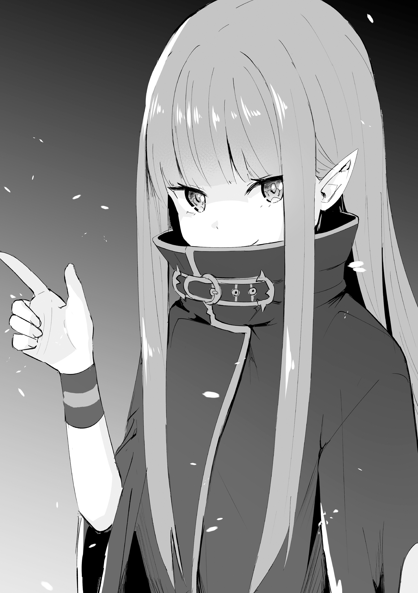
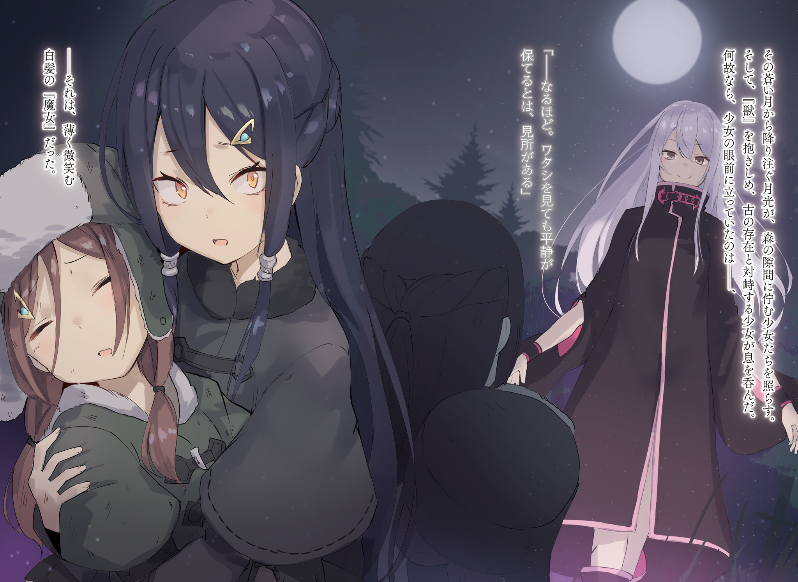

Английский перевод: Witch Cult Translations

Перевод и редактура: MilkyWay

Настоятельно рекомендуется читать эту историю лишь после предыдущей части:

Ведьмы после чаепития

Колетт погрузила руки в ледяную воду, из-за чего её узкие плечи слегка вздрогнули.

Колетт: Гха, холодно. Так холодно…

Она потирала онемевшие пальцы в воде, делая при этом ледяные вдохи. Грязь, прилипшая к пальцам, медленно смывалась в реку, и она снова начала чувствовать их.

Это было то время года, когда становилось намного холоднее. В родной деревушке Колетт с самого начала не было так тепло; однако, даже если она и привыкла к такой погоде, это ещё не означало, что она была невосприимчива к холоду Ледяного Сезона. Что ещё хуже, воздух в этом году был намного, намного холоднее по сравнению с обычным годом.

Хотя взрослые, вероятно, посмеялись бы над её дерзкой фразой “по сравнению с обычным годом”, учитывая, что ей всё ещё было двенадцать лет.

Колетт: Ну вот, теперь чистые. Но всё равно, так холодно… Мне нужно поторопиться и погреться у огня.

Колетт вытащила из воды вымытые руки, затем взяла свой браслет, который она оставила на ближайшем пне, и снова надела его на запястье. Вздрогнув узкими плечами, она повернулась обратно к своей маленькой хижине.

Она уже успела разжечь костёр перед хижиной, представляя, что может произойти нечто подобное. В те времена, когда она ещё не привыкла к такого рода рутинным работам, она в конце концов откладывала разжигание огня на потом. Но из-за этого ей всё время потом не удавалось зажечь его из-за замёрзших онемевших пальцев, и она не могла даже согреться.

Тем не менее, Колетт восприняла эти неудачи как поучительный опыт, который поможет ей расправить крылья и вырасти. Вероятно, при следующем распускании крыльев она снова потерпит неудачу, но и эти неудачи она воспримет как жизненный опыт.

Медленно, но неуклонно, шаг за шагом. Такова была мантра Колетт.

Колетт: Мне не нужно торопиться, так как сейчас Ледяной Сезон, хотя мне будет намного тяжелее, если я этого не сделаю. Так что…

Колетт начала подходить к своей хижине, чтобы погреться у огня, одновременно отмечая пройденные шаги на пальцах. Но затем…

???: …Эй, вы там, может быть, у вас найдётся минутка?

Внезапно Колетт услышала голос, отдающийся эхом. Она остановилась на месте, собираясь повернуться назад.

Колетт услышала голос девушки, который был ей незнаком. Деревня, в которой она выросла, была не очень большой, поэтому все её жители знали друг друга. Она сразу могла сказать, кто это, когда он начинал говорить.

Поскольку её голос не совпадал ни с одним из них, Колетт почувствовала себя немного, или, скорее, довольно удивлённой. Она нервно обернулась, чтобы посмотреть на реку, в которой только что вымыла руки.

Однако в этот момент удивление настигло её гораздо сильнее, чем удивление от незнакомого голоса.

Колетт: … Чт..

???: Приношу свои извинения, но, похоже, мне не помешала бы помощь… Холодная вода резко понизила температуру моего тела, и я чувствую, что вот-вот потеряю сознание. Видите ли, я могу умереть…

Пока она с дрожью в губах говорила это Колетт, человека медленно уносила ледяная река.

Колетт едва сдержалась, чтобы не закричать, прежде чем поспешно протянула руку к девушке в реке.

???: Примите мою благодарность. Я бы утонула, если бы вы оставили меня там. Или, быть может, я бы сначала замёрзла до смерти? В любом случае, я бы умерла. Некоторые люди считают, что замёрзнуть до смерти — это такой же лёгкий способ умереть, как и заснуть… Но, почувствовав на себе, что такое переохлаждение в реке, я бы сказала, что это ничуть не кажется легким, вы согласны?

Колетт: У-ух…

Колетт чувствовала себя ошеломлённой своей спутницей, которая всё болтала и болтала, не собираясь останавливаться, пока они грелись у костра. Но не то чтобы она никак не реагировала на только что произошедшее с ней: лицо её спутницы было ужасно бледным, а пальцы дрожали от холода.

Возможно, она бредила, загнанная в угол как разумом, так и телом, подумала Колетт.

Ей стало жаль дрожащую девушку, которая всё ещё улыбалась в ответ на спасение. Колетт осторожно предложила ей немного свежей кипячёной воды, пытаясь облегчить её страдания.

???: Выпить что-то горячее? Искренне благодарю вас. Восстановление нормальной температуры тела — самое важное, что нужно сделать при гипотермии. В этом отношении имеет смысл согреть своё тело изнутри. Значит, у вас всё это время были такие хорошие знания, хотя вы выглядите как выходец из среды с не очень хорошим образованием.

Колетт: Не совсем уверена насчёт образования. Но ведь даже дети, не говоря уже о взрослых, знают, что нужно дать замёрзшему человеку горячий напиток, нет?

???: …Точно. Это я тут была большеголовой раньше. Тогда я с благодарностью приму ваш напиток.

Девушка поднесла губы к чашке с горячей водой и чуть не выронила её, вероятно, потому что она была такой горячей на ощупь. Она подышала на неё и каким-то образом начала пить кипяток.

Колетт: …Какая странная девушка.

Колетт пробормотала это про себя, даже не думая об этом.

Девушку унесла холодная река. Одно только это выражение несло в себе странную вибрацию, однако она производила странное впечатление и во многих других отношениях.

У неё были длинные розовые волосы, на ней был надет плащ, сшитый для мужчин, а также обувь, которая совсем не подходила для такой стройной и миниатюрной девушки, как она. По возрасту она была близка к Колетт, а ростом, пожалуй, чуть ниже её. Однако черты её лица были весьма привлекательны, настолько, что Колетт не могла оторвать от них глаз. Она обладала красотой, не свойственной её возрасту.

И самой привлекательной чертой во внешности этой девушки были…

???: Возможно, мои уши привлекли ваше внимание?

Колетт впервые осознала, что смотрела на уши девушки. На её выразительные, длинные уши.

В этом мире жило много разных видов Полулюдей, но среди них был только один вид, который славился на весь мир своими длинными, красивыми ушами.

Колетт: Ты эльф?

???: Ответ на этот вопрос довольно сложен. Конечно, в девушке, от которой я получила это тело, текла эльфийская кровь; но трудно сказать, течёт ли та же самая кровь в её теле, когда оно было воспроизведено подобным образом. Если копнуть глубже, то это также вопрос того, что из тела или души вращается в качестве основной движущей силы. Это тело эльфа, но моя душа явно не эльфий…

Колетт: Эм, ммм…?

???: …Я снова погружаюсь в свои дурные привычки, не так ли?

Девушка наконец-то ответила на её вопрос, хотя Колетт едва ли поняла, что она сказала. Всё ещё оглядываясь по сторонам, девушка провела пальцем по груди, а затем глубоко вздохнула.

На груди девушки висел какой-то голубой сверкающий камень, выглядевший очень красиво. Она зажала его между пальцами и пробормотала про себя: «Я поняла, я поняла».

???: Видите ли, вокруг есть несколько действительно шумных девушек. Я признаю себя эльфом, чтобы всё прошло гладко и пойду дальше…

Колетт: …! Тогда, может быть, ты намного старше меня?

???: Сколько мне лет? Если вы имеете в виду это тело, то, наверное, можно сказать, что мне примерно 400 лет.

Колетт: 400 лет…!

Колетт слышала, что эльфы живут гораздо дольше, несмотря на свою внешность. Но даже в этом случае 400 лет были для неё неожиданностью, выходящей далеко за рамки того, что она могла себе представить. Потому что, когда речь зашла о 400 годах…

Колетт: В те времена, когда «Ведьма Зависти» творила своё бесчинство…

???: …

Выражение лица девушки омрачилось сразу же после того, как она произнесла имя этой отвратительной “Ведьмы”.

Её выражение можно было описать только как буквально омрачённое. Колетт почувствовала глубокое сожаление, гадая, не обидело ли её неосторожное замечание.

???: О, вы не сделали ничего плохого. Просто у меня было несколько мыслей на уме. Это напомнило мне, что я всё ещё не слышала имени своего благодетеля.

Колетт: …А, моё? Я Колетт, и я живу в этой хижине.

???: Понятно, я запомню его, Колетт. Меня зовут… Омега. На данный момент этого достаточно.

Колетт: Омега… чан?

Омега: Я действительно не слишком привыкла к тому, что люди называют меня «чан». Звучит довольно мило, не находишь?

Не виня Колетт за её оплошность, девушка — Омега одарила её своей очаровательной, но относительно интеллигентной улыбкой. И, сохраняя эту улыбку на лице, она заговорила,

Омега: Раз уж мы заговорили о «сладком», у тебя есть что-нибудь поесть? Похоже, что мой некогда дремавший желудок ожил после питья твоей горячей воды… Я умираю с голоду.

Хотя Колетт не была уверена в том, хорошо или плохо полагаться на доброту других, она охотно выполнила просьбу Омеги.

К счастью, у Колетт в хижине был кролик, которого она поймала как раз незадолго до того, как нашла Омегу, поэтому она начала быстро готовить его и варить для голодающей девушки.

Омега: Хм, Колетт, для такой юной девушки ты определенно хорошо разбираешься в ножах, не так ли? В твоих руках нет колебаний, когда ты управляешься с кроликом.

Колетт: Мои родители умерли, поэтому мне с малых лет приходилось помогать взрослым. Вот почему я довольно хорошо ловлю таких диких кроликов, как этот. О, Омега-чан, ты не против поесть мясо?

Омега: Да, у меня с этим нет проблем. Тем не менее, кролики, кролики, ха…

Колетт: …? Что с ними?

Омега: Ничего, просто не так давно судьба свела меня с ними, поэтому они для меня как плохая примета. Естественно, у меня нет проблем с их употреблением, так что я с нетерпением жду этого.

Поскольку она ждала от неё блюда, Колетт решила приготовить его должным образом для своего редкого, но желанного гостя.

Ей очень хотелось пожарить его с травами, но, судя по тому, как Омега лежала на полу, разрываясь от голода, она не могла позволить себе больше ждать.

Всё, что она могла сделать, это посыпать его солью и перцем, а затем торопливо обжарить на огне, готовя на скорую руку. Аромат привлёк Омегу, и она неуверенно поднялась на ноги.

Колетт: Вот, держи! Он горячий, так что будь осторожна.

Омега: О милая, ты это имеешь в виду, потому что видела, как я напортачила с горячей водой, да? Конечно, я уже некоторое время демонстрирую неуклюжесть, но это потому, что нынешнее тело более чувствительно к горячим вещам, в отличие от прошлого.

По правде говоря, Колетт уже не понимала, о чём говорит девушка. Тем не менее, Омега приняла предложенное ей кроличье мясо, поданное на кости. Она тяжело дышала над ним, а затем с наслаждением откусила кусочек.

С превеликим наслаждением. Это выражение показалось ей странным, но, по крайней мере, только так могли описать его глаза Колетт. Даже Пальмира, которая жила в самом большом доме деревни, не смогла бы откусить это с таким очарованием, подумала она.

Омега: То, что меня смыло рекой раньше, тоже было похоже на это, но, видишь ли, я спала довольно долго. Прошло очень много времени с тех пор, как я стояла и ходила на своих ногах.

Колетт: Правда? И поэтому ты разучилась плавать?

Омега: Нет, я никогда не умела плавать. Меня унесло рекой, потому что я пыталась набрать воды, чтобы утолить жажду, и поскользнулась. В конце концов, мои ноги оказались короче, чем я их помнила…

Она откусила ещё кусочек мяса на косточке, с гордостью признаваясь, что не умеет плавать, покачивая своей коротенькой ногой. Разговор Колетт с Омегой освежил её, поскольку она привыкла проводить время в праздной скуке.

Судя по тому, что она слышала, Омега, похоже, находилась в середине бесцельного путешествия. Честно говоря, учитывая её возраст и способность справляться с обыденными делами, не кажется ли ей, что путешествие в одиночку — рецепт для катастрофы?

Колетт, хотя и нерешительно, предложила ей.

Колетт: Если ты не против, почему бы тебе не остаться в моей хижине на некоторое время? Скоро станет намного холоднее, так что, думаю, тебе стоит как следует подготовиться к путешествию.

Омега: Хм, я ценю твоё предложение, но даже если я позволю тебе сделать всё это для меня, я мало что смогу дать взамен…

Колетт: …Тогда, пожалуйста, расскажи мне историю.

Омега: Историю?

Колетт получила положительный ответ на своё предложение, тем самым лишив Омегу причины её колебаний.

Она была эльфом с большим сроком жизни, прожившим более 400 лет. Существо, которое было знакомо с событиями, о которых многие живущие в настоящем даже не подозревали.

Колетт: Я была бы по-настоящему счастлива, если бы ты рассказала мне несколько историй, которых я не знаю… Например, историю из далёкого прошлого, из тех времен, о которых никто не слышал.

Омега: …

Омега закрыла один глаз и кивнула, как только Колетт спросила её об этом.

Затем…

Омега: Действительно, люди обычно хотят знать всё, не так ли? Он тоже был странным в этом отношении.

Колетт: …?

Омега: Мои извинения, разговаривала сама с собой. Я не возражаю. В конце концов, разговоры с людьми всегда были одним из моих любимых занятий. Если ты не против, тогда, полагаю, я побеспокою тебя некоторое время.

Омега слегка улыбнулась ей, что свидетельствовало о том, что она приняла предложение Колетт.

Омега: 400 лет назад мир был непростым местом для жизни людей. Магия была исключительно сильной стороной Полулюдей и Духов, независимо от того, в какой стране вы находились. Сами люди с трудом справлялись даже с разведением костров.

Омега щёлкнула пальцами, заставляя языки пламени танцевать.

Прошло несколько дней с тех пор, как Омега остановилась в маленькой деревушке Колетт. За это короткое время молодая эльфийка пересказала всё, что знала о мире, одно за другим.

Поначалу, когда её занесло в реку, Омега показалась ей гроздью опасностей. Однако то, как она демонстрировала свои знания и магию в различных бытовых сценах, изменило представление Колетт о ней.

Омега была беспечной и к тому же рассеянной. Тем не менее, причина, по которой она могла продолжать путешествовать с таким настроем, заключалась в том, что она обладала “силой”, которая делала это более или менее осуществимым.

Она могла легко определить, насколько сильна Омега, просто взглянув на то, как она создаёт огонь, кипятит воду, рубит дрова с помощью ветра и обрабатывает землю одним щелчком пальцев.

Омега: Мастерство магии? Действительно. Я бы хотела сказать, что любой человек может делать такие же вещи, немного попрактиковавшись, но это было бы неправильно. Магия — это тоже искусство, поэтому она во многом зависит от качеств человека. Насколько мне известно, в истории есть только два или три человека, которые могут делать то же, что и я.

В истории, а не в мире. Это выражение вызвало в сознании Колетт образы грандиозности Омеги.

Колетт была застигнута врасплох, запечатлев лицо Омеги в профиль, когда она заявила это, не выказывая никаких признаков того, что смеётся над этим как над напыщенностью, не говоря уже о хвастовстве.

Омега безоговорочно заявила, что она — одна из лучших в мире, и не из тщеславия. В голове Колетт всплыло одно слово, когда она увидела её такой.

Как бы отреагировала Омега, если бы она набралась смелости и сказала это вслух?

Омега: …Если тебе есть что сказать мне, почему бы тебе не попытаться произнести это?

Омега сказала это спокойным тоном, глядя на молчаливую Колетт.

Чувствуя, что эти ясные голубые глаза завладели ею, Колетт произнесла это «слово» вслух. Как только она услышала его, Омега одарила её своей самой завораживающей улыбкой.

Омега: Да, конечно, так и есть. Я злобная Ведьма, знаешь ли.

Это был её ответ.

… Другими словами, жизнь Колетт изменилась. Теперь она проводит свои будни с «Ведьмой», что знает всё о былых временах.

Омега: Ты спрашиваешь, почему я ношу плащ, который мне не подходит? Это потому, что он не принадлежал мне с самого начала, я получила его от кое-кого другого.

Омега спокойно ответила на вопрос Колетт, пока та вешала только что выстиранный плащ сушиться.

Колетт любила задавать вопросы и часто донимала Омегу «историями» — таково было условие пребывания Ведьмы здесь. Её непомерное любопытство нравилось Омеге, учитывая, что она любила поговорить.

Омега: В конце концов, большинство людей обычно либо игнорируют меня, когда я пытаюсь с ними вежливо общаться, либо насильно говорят мне заткнуться с самого начала.

Колетт: Правда? Но, но, это такая пустая трата времени. Твои истории очень интересны, Омега-чан, и мне нравится узнавать обо всех этих вещах, о которых я не слышала раньше.

Омега: Ммммм, это хорошо. Знания — это сокровище, которое никто не может у тебя украсть. В то время как с такими вещами, как имущество, в основном, всё выглядит так: если у тебя их больше, это даёт тебе больше преимуществ в жизни.

Было много ситуаций, когда отсутствие знаний приводило к тому, что человек был вынужден идти длинным путём.

Даже сам акт разжигания огня для людей был борьбой, когда они ещё не умели пользоваться магией. Однако, когда они зажгли первый огонь, эта борьба резко прекратилась и последующее разжигание не доставляло никаких проблем.

Омега: Обладая знаниями, вы избавляетесь от необходимости рисковать жизнью в ситуациях, когда умирать вовсе и не нужно. Естественно, нельзя допустить, чтобы это сокровище стало пустой тратой, поэтому для его использования нужен талант.

Колетт: Талант…

Омега: Действительно. Без знаний или, даже если они у вас есть, но вам не хватает таланта, чтобы их использовать, у вас просто отнимут вещи. Как, например, этот плащ, которым я владею.

Она указала на свой плащ, который висел на просушке, и продолжила читать лекцию Колетт, пока та стирала вещи в реке.

Хотя у неё их было не так много, большинство вещей Омеги были позаимствованы у их первоначальных владельцев. Правда, в настоящее время у неё не было возможности вернуть что-либо из этого, поскольку они были уже мертвы.

Но потом, вероятно, они бы тоже посочувствовали, ведь это была их справедливая награда за попытку украсть у Омеги. В конце концов, в этом мире выживает сильнейший, так же как более крупная рыба пожирает мелкую.

Омега: Вернее, я думаю, что выражение «сильные пожирают слабых» будет более уместно. Мне больше нравится выражение «выживание сильнейших», но это в моей природе — использовать как можно более точное выражение…

Колетт: Ты тоже через многое прошла, не так ли, Омега-чан? Может быть, это потому, что ты так долго живешь?

Омега: Это правда, что у меня гораздо больше возможностей учиться, учитывая, что я так долго живу. Но чем дольше я живу, тем больше мне нужно знать. Я не думаю, что наступит день, когда я захочу умереть, если только моя жажда знаний не иссякнет. В этом отношении я чувствую, что могу наслаждаться жизнью в полной мере.

Колетт: Эмм, это так?

Колетт изо всех сил старалась понять сказанное, но, видимо, эта тема была для неё слишком сложной.

Омега закрыла один глаз, глядя на девушку, которая выглядела так, будто из её головы вот-вот пойдёт дым. Затем она потянулась и перевела взгляд на Колетт.

Омега: Колетт, насчёт твоего браслета…

Колетт: …О, это? Если бы я не снимала его во время стирки, его бы залило речной водой, да? Было бы очень неприятно, если бы его смыло или он начал ржаветь: вот почему я его снимаю.

Омега: …Хм?

Она тихо положила свой серебряный браслет на пень у берега реки. Сам браслет выглядел так, словно над ним хорошенько потрудились: по его внутренней и внешней стороне шли узоры, точно выполненные мастерами. Чувствовалось, что он имеет самостоятельную ценность, такую, что его ношение не было заслугой молодой девушки, живущей в лесу.

Омега: Похоже, у тебя довольно приличное воспитание; откуда оно у тебя?

Колетт: Это? Это сувенир от моих мамы и папы на память. Они оставили его мне, когда умерли… Поэтому я всегда ношу его с собой.

Омега: Памятка от твоих родителей? Понятно.

Колетт: Они выполняли работу, которая выводила их за пределы деревни. Этот браслет они тоже привезли с собой извне. Я была очень маленькой, поэтому не могла пойти с ними, и они оставили меня в доме сестры моей мамы… моей тёти. Я так многому там научилась.

Вероятно, она имела в виду, что там она научилась таким жизненным навыкам, как приготовление пищи, стирка и охота.

Травма от смерти родителей, должно быть, была похожа на струп, который всё ещё заживал внутри неё. Пока никто не пытался содрать его специально, раны медленно затягивались, и однажды они перестали её беспокоить.

Таков был ход времени, в котором жили люди. Сладкая музыка для ушей Омеги.

Омега: Колетт, так как похоже, что тебе ещё потребуется время на стирку, ты ведь не против, если я немного прогуляюсь? Если подумать, в последнее время я только и делаю, что хожу туда-сюда между твоим домом и рекой.

Колетт: Я действительно перетащила тебя с реки в свой домик, но…

Лицо Колетт приняло кроткое выражение, когда она услышала предложение девушки. Омега наклонила голову в ответ на её колебания. Её реакция казалась довольно странной в отношении согласия на простую прогулку.

Омега: Что-то случилось?

Колетт: Нет, нет, ничего особенного. Просто, я думаю, тебе не стоит заходить слишком далеко в восточную часть леса. Они… Говорят, там живет Зверодемон, поэтому жители деревни не подходят к нему близко.

Омега: Понятно. Восточная часть леса, да. Я ценю твоё беспокойство.

Омега оставила Колетт у реки продолжать стирку, когда та проводила её, и отправилась на прогулку. Затем, как только Колетт скрылась из виду, она потянулась.

Омега: Значит, на востоке появился Зверодемон?

Она могла с уверенностью сказать, что появление там опасного Зверодемона стало бы угрозой для жизни и Колетт, и жителей деревни.

Зверодемоны были чистой, без примесей, угрозой для жизни большинства людей. Их было много разных видов, и степень их опасности тоже была разной, но, без сомнения, они представляли опасность для обычного человека, независимо от его вида.

Пока она размышляла об этом, ноги Омеги медленно направились к «восточной части» леса.

Омега: …

Конечно, это не было похоже на то, что Омега пыталась проигнорировать слова предупреждения Колетт без причины.

Хотя, возможно, это и удивительно, её предупреждение заставило Омегу неожиданно почувствовать благодарность за доброту Колетт. Если бы девушка с таким упорством, как у неё, испугалась Зверодемона, то она была бы готова избавиться от него.

Однако…

Омега: …Хм…

Омега вышла на небольшую поляну в восточной части леса. Она нежно погладила свои розовые волосы, сузив глаза от представшего перед ней зрелища.

Перед ней лежала слегка покрытая инеем земля, а на ней виднелось несколько разбросанных куч камней. Должно быть, их было больше тридцати, не меньше.

Если бы их было всего одна или две, она могла бы счесть их детской забавой, но с таким количеством в одном месте в них начал укореняться более глубокий смысл.

Учитывая, что здесь было так много камней, аккуратно сложенных в кучу, их назначение было ясно.

Это место было…

???: …Кто ты?

Омега не выказала особого удивления, услышав голос, окликнувший её сзади.

Она почувствовала, что кто-то приближается к ней, по звуку шагов и запаху. Чего она никак не ожидала, так это того, что её соперник окликнет её. Она была уверена, что он набросится на неё, не утруждая себя диалогом.

Омега: Прежде всего, я не питаю к тебе никакой вражды. Я просто хотела бы сказать, что я зашла сюда не по своей воле, а специально. О, это напомнило мне, что у меня нет при себе никакого оружия, так что я собираюсь медленно повернуться. Ты же не испугаешься, верно?

???: …Просто прекрати свой проклятый лепет и повернись.

Омега подняла руки вверх, показывая, что не настроена враждебно, а затем закрыла рот, чтобы показать своему противнику, что она делает именно то, что ей сказали. После этого она медленно повернулась в другую сторону, где стояла…

???: …Никогда не видела тебя раньше.

Высокая девушка посмотрела вниз на Омегу, произнеся эти слова.

Она была одета в чёрную одежду, у неё были длинные тёмные волосы, и она была довольно красива. Однако её глаза санпаку были невероятно острыми и производили ужасно пронзительное впечатление.

Омега: Хм.

Только закончив обрабатывать свои первые впечатления, она заметила, что девушка перед ней не так уж и стара. Ей было не больше пятнадцати лет, поэтому разница в возрасте между ней и Колетт не казалась большой. Единственные различия в их впечатлениях были связаны с её атмосферой и ростом.

???: Что за реакция? Раздражаешь.

Омега: Разве это не ты ужасно раздражаешься на молодую девушку, с которой только что познакомилась? Кроме того…

???: Что?

Омега: То, что ты носишь с собой нечто подобное, меня тоже шокировало, знаешь ли.

Она поняла это по знакам, которые почувствовала, когда девушка подошла к ней сзади, в основном по вони. В руках у незнакомки со зловещими глазами находилось нечто действительно шокирующее.

А именно, труп живого существа, завёрнутый в белую ткань.

Должно быть, когда-то он был в приличной форме, подумала она, но сейчас от него не осталось и следа.

Омега: Это слишком большой перебор, чтобы назвать его охотой. Так можно было бы испортить и плоть, и шкуру. То, как ты это сделала, было бы ужасно для добычи шкуры или пищи. Даже так…

Омега сначала прервала свои слова, а затем продолжила, всё это время наблюдая за реакцией девушки.

Омега: Если ты просто убиваешь их ради этого, то я тебе ничего не скажу.

???: … Не говори со мной так, будто ты всё знаешь.

Угрюмо бросив ей вслед эти слова, девушка прошла мимо Омеги и положила труп на землю… Или, скорее, ей следовало бы назвать это тем, что когда-то было кроликом. Как бы то ни было, она положила его на землю и начала копать яму с помощью хабу, который принесла с собой.

(Примечание: Хабу, буквально палка для копания, была инструментом, используемым для выкапывания корнеплодов и рытья ям для семян различных злаков. По сути, это древняя лопата).

Она похоронила тело, засыпала его землей и навалила сверху камни. Глядя на то, как она это делает, Омега убедилась, что впечатление, сложившееся у неё вначале, не было ошибочным.

Как она и предполагала, это место было кладбищем. Останки многих животных должны были быть погребены под грудой камней, как и кролик, чтобы быть увековеченными.

Омега: В конце концов, я тоже часто бываю рядом с могилами.

???: …Кто ты? Откуда ты взялась?

Девушка закончила работу над захоронением, встала и спросила об этом Омегу. В ней была какая-то напряженность, когда она не потрудилась спрятать свои окровавленные руки. Омеге показалось, что она окажется на этом кладбище вместе с ними, если неправильно ответит.

Омега стремилась к дружеским отношениям, поэтому она представилась, хотя и не совсем по вышеупомянутой причине.

Омега: Меня зовут Омега, я в значительной степени странствующий бродяга. Я просто случайно заглянула сюда по пути вниз по реке. Я не останусь надолго, так что надеюсь, вы не будете слишком строги ко мне.

???: Путешественник, ага. В вашем возрасте… Нет, скорее, эти ваши уши… Вы эльф?

Заметив характерные уши Омеги, на лице девушки появилось выражение открытого дискомфорта. Логично, что в эту эпоху по отношению к эльфам сохранялась сильная дискриминация, но всё же её реакция отличалась от обычной. Должно быть, у неё была еще одна причина презирать эльфов.

Однако, прежде чем Омега успела расспросить её об этом, она начала идти обратно тем же путем, что и пришла, с руками, всё ещё испачканными в крови.

Омега: Извините, что вмешиваюсь, но река вон там, если вы хотите вымыть руки.

???: …Вы сказали, что не останетесь надолго, верно? Послушайте мой совет и поспешите покинуть это место.

Омега: Я не очень понимаю, о чём этот разговор. Наверное, я плохо разбираюсь в этом?

Девушка не обратила внимания на случайную болтовню и без паузы начала уходить от реки. И, как раз перед тем, как спина её скрылась из виду, она заговорила,

???: Потому что если вы этого не сделаете, то и вас в конце концов разорвёт на части «зверь».

Девушка оставила после себя только эти слова, после чего её фигура исчезла из поля зрения Омеги.

Омега: «Зверь» говоришь…

Омега: Вот что она мне рассказала; ты случайно ничего об этом не знаешь, Колетт?

Омега рассказала Колетт о том, что произошло на востоке леса, пока они ужинали у костра. Колетт же надула щеки, слушая её рассказ, и потягивая овощной суп.

Колетт: Я же говорила тебе не ходить в восточную часть леса…

Омега: Говорила? Да, говорила. Однако я подумала, что смогу помочь, если у тебя возникнут проблемы со зверодемонами, учитывая, что я могу справиться с большинством из них. Тем не менее, я наткнулась не на зверодемона, а на девушку с таким ужасным взглядом в глазах, что это почти походило на самого зверодемона.

Колетт: …Думаю, ты имеешь в виду Пальмиру.

Было ли на самом деле честью для упомянутого человека быть замеченным только по ужасному выражению его глаз? Мальчик, которого знала Омега и у которого был такой же ужасный взгляд, определённо громко пожаловался бы и сказал, что это позорно.

Омега: Я думаю, в этом есть своя прелесть… Но, в общем, чувства других людей — это то, о чём нельзя догадаться, куда бы ты ни пошёл, так что, полагаю, ничего не поделаешь.

Колетт: Так о чём ты говорила с Пальмирой?

Омега: Мне не удалось как следует поговорить с ней… Хотя, да, она сказала, чтобы я не задерживалась и поскорее покинула лес, если мне дорога моя жизнь.

Колетт: ……хк! Это так…!

Колетт мгновенно повысила голос и встала со своего места. Миска, лежавшая у неё на коленях, опрокинулась, выплеснув весь суп на землю.

Омега: Колетт, это же кипяток. Нужно как можно скорее остудить водой твои кол…

Колетт: Это так… Это так эгоистично с её стороны! Зачем Пальмире делать что-то подобное…

Быстро заговорив, Колетт перевела дрожащие глаза на Омегу.

Колетт: Эй, Омега-чан, ты ведь не собираешься уходить?

Колетт спросила её об этом, даже не обращая внимания на то, насколько горячим был суп, пролившийся ей на колени.

Она не обращала внимания на слова, сказанные девушкой Пальмирой. Она лишь хотела, чтобы Омега осталась с ней. Однако это желание не могло быть исполнено Омегой.

Омега: Я очень рада твоим чувствам, но я с самого начала не собиралась оставаться надолго. Моё тело в гораздо лучшей форме благодаря последним нескольким дням. Я хотела бы отплатить тебе за твою доброту, поэтому надеюсь хотя бы позаботиться о том зверодемоне в лесу, или как там его.

Колет: …

Омега: Колетт?

Омега нахмурилась, так как не получила от неё никакого ответа, ни подтверждения, ни отрицания. После того, как она назвала её имя, Колетт издала короткий вздох и сказала: «Ох».

Колетт: Д-да, точно. Да, конечно. С самого начала ты заехала ненадолго, поэтому вполне естественно, что ты отправишься в другое путешествие. Это естественно.

По тому, как она это говорила, чувствовалось, что она скорее убеждает себя, чем говорит Омеге. Затем Колетт забрала свои тарелки и убрала всё недоеденное.

Омега растерялась, что сказать Колетт, от которой исходило напряжение. Несмотря на это, девочка улыбнулась Омеге, убирая свой ужин, и сказала,

Колетт: Всё в порядке, Омега-чан. Мне одиноко, но не настолько. Так что…

Омега: «Не стесняйся отправиться в путешествие»? Ну, это то, что я планирую сделать, но…

Колетт: Да, действуй. Это было бы здорово. Определённо, это к лучшему.

Сказав это, Колетт отвернулась от Омеги. Её маленькая спина выглядела жалко, но она не могла ничего сказать Ведьме, поэтому ей оставалось лишь просто промолчать.

Осталось лишь неумолимое, безжалостное молчание.

Омега: …

Этой ночью Омега медленно проснулась на своей кровати.

По правде говоря, пробуждение никогда не было её сильной стороной. Она считала, что это проблема не нынешнего тела, а скорее души. Если подумать, она никогда не умела вставать, даже когда у неё было собственное тело.

Она не знала об этом, но, возможно, это было связано с тем, что они называли “низким кровяным давлением".

Как странно, что даже смена вместилища её души ничуть не решила проблемы с кровяным давлением. Но сейчас было не время думать о связи душ и кровяного давления.

Омега: … Его здесь нет.

Грубая кровать была просто одеялом, расстеленным на полу. Её голубого пироксена, который должен был лежать рядом с подушкой, нигде не было видно. Омега обычно носила его в виде ожерелья, прикрепленного к шнурку, но, естественно, снимала его, когда ложилась спать. Она помнила, что сегодня тоже делала это перед сном.

Омега: Колетт?

От поднятых пальцев Омеги в кромешной тьме комнаты вспыхнул огонёк. Колетт не было видно на соседней кровати, и её плаща, который должен был висеть на стене, тоже нигде не было.

Колетт исчезла, как и её пироксен. Эта связь между причиной и следствием, вероятно, не вызывает сомнений.

Омега: Не может быть, трудно представить, что ей требуются деньги.

Омега потёрла уставшие глаза и поспешно накинула плащ, после чего вышла из хижины.

Ночной лесной воздух был прохладным, и туманное дыхание лишало сил её ноги. Но у неё не было возможности бросить пироксен и вернуться в постель. Она не могла с ним расстаться. Это была одна из самых важных для неё вещей в этом мире.

Омега: …

Когда она начала идти, какой-то звук пронзил барабанные перепонки Омеги: она услышала вой вдалеке.

Он доносился из глубины леса. Вой был резким, казалось, что он доносится до самых небес ночной прохлады. Как только Омега услышала его, в её голове промелькнуло лишь одно слово — «зверь».

Омега: Не зверодемон, а «зверь», хах.

Омега вспомнила, в каком состоянии была Пальмира, когда она сказала ей это слово, и сделала ещё один шаг вперёд. Не было никаких сомнений в том, куда она направляется. Восточный лес.

Омега: …

Омега сузила глаза, когда вошла на поляну с кладбищем, которую посетила днём.

Запах крови, заполнивший её ноздри, стал более густым по сравнению с тем, что она чувствовала днём. Возможно, из-за свежей крови, которая недавно была разбрызгана по кладбищу.

Омега: Хм.

Омега укоризненно кивнула подбородком, глядя на кладбище, которое теперь было окрашено в красный цвет.

Кровь и плоть, разбросанные вокруг, должно быть, принадлежали животным, обитавшим в лесу. На первый взгляд, картина выглядела ужасно, но ни один из этих людей не был человеком. Может быть, это было проявлением совести «зверя»?

Омега: Или, возможно, оно уже выбрало свою первую цель.

Омега медленно осмотрела кладбище и трупы. Свет луны загораживали тяжёлые тучи, а землю окутывала такая непроглядная тьма, что любому захотелось бы умереть.

Однако множество огненных шаров, которые наколдовала Омега, без помех рассекали тьму.

Они стали в буквальном смысле фонарями, освещавшими залитые кровью окрестности. И это было не что иное, как акт презрения к тем, кто обитал во тьме и не любил свет.

???: ϡ ϡ!!!

«Зверь» вылетел из завесы тьмы, испуская свирепый вой.

С огромной скоростью он бросился к Омеге и с огромной силой запустил в неё свои когти. Если бы она попала под его удар, то, несомненно, стала бы той же плотью и кровью, что разбросаны в округе.

При этом Омега не обладала достаточной ловкостью, чтобы быстро уклониться от этих атак. Что касается её физических способностей, то она была хрупкой и нежной, словно ребёнок, в прочем, так она и выглядела.

Хотя, несмотря на свою стройность, она всё же была сделана из другой структуры, чем обычный полуэльф, который может разбить даже валун, просто ударив по нему.

Омега: Боже мой, это напомнило мне кое-кого, кто мне не нравится.

Лицо Омеги помрачнело за несколько мгновений до того, как когти вонзились в её голову, когда воспоминания промелькнули в её сознании.

Скорость, с которой проносились мысли, была намного быстрее, чем реальное движение её тела. Существовали некоторые теории, утверждавшие, что воспоминания, возникающие на грани смерти, были операциями поиска, которые мозг, уязвленный риском смерти, выполнял, используя собственные воспоминания, чтобы найти способ выбраться из сложившейся ситуации.

Вот насколько ошеломляющей была скорость её мыслей. Когти «Зверя» всё ещё не достигли Омеги, даже когда она закончила своё абсурдное вторжение в мысли.

Поэтому защитная стена земли легко встала на пути атаки её врага.

Омега: Дона.

На самом деле ей не нужно было произносить заклинание. Земляная стена возникла гораздо быстрее, чем шевельнулись её губы. Тем не менее, она всё равно потрудилась произнести заклинание, потому что ей нравилось выражать происходящее словами.

Омега: …

«Зверь» был выброшен снизу поднимающейся стеной земли и взвился в ночное небо. Его маленькая тень вращалась по кругу, но быстро оттолкнулась от ветки дерева, остановила своё вращение и упала обратно на землю. Он умело защитил голову и спину от падения, приземлившись на землю на собственные четыре конечности. Не так уж плохо.

Однако…

Омега: Разве я не ударила тебя минуту назад, используя ту же самую землю?

Он никак не мог парировать её атаку, используя лишь временную контрмеру.

Её атака началась прежде, чем «зверь», который теперь приземлился на землю, сделал свой следующий шаг. Земля снова вздыбилась, и на этот раз она поглотила конечности «зверя», прижав его к земле.

«Зверь»: …ϡ ϡ!?

Руки и ноги были проглочены до колен и локтей, и ему некуда было девать свои силы. Глиняный кол дико взвился вверх к животу жалкого, сопротивляющегося «зверя», который лежал, не в силах пошевелиться.

«Зверь»: …ϡ ϡ

Омега: Используя всё вокруг как инструменты, ты действительно можешь продемонстрировать свои навыки мага. Ветер, земля, огонь, вода; всё это под моим заклинанием. Должно быть, вот каково это — сделать весь мир своим врагом.

Омега пробормотала эти слова без всяких эмоций, нанося жестокий удар в живот «зверя». Он издал рёв боли и поднял морду вверх, обнажив клыки.

«Зверь»: …ϡ ϡ

Омега: Хм, ты всё ещё выглядишь живым, не так ли? Может, сделаем ещё два или три таких?

Омега закрыла один глаз, глядя на ожившего, воющего «зверя», а затем направила на него свою ладонь.

Глиняный кол вонзился в его внутренности, хотя перед тем, как пустить его в ход, она закруглила его кончик, чтобы облегчить ему задачу. Однако, возможно, ей было бы проще запустить в него острый кол. На данный момент, если бы ей пришлось прибегнуть к кровопролитию, чтобы остановить его движение, то…

???: …Хватит уже!

Омега попыталась высунуть ладонь и обрушить на него шквал атак. Однако её неожиданно остановили.

В её холодных голубых глазах отражался сначала сопротивляющийся «зверь», чьи конечности вцепились в землю, а затем девушка, что стояла перед «зверем», дабы защитить его — Пальмира.

В её круглых глазах стояли крупные слезы, пока она смотрела на Омегу.

Омега: Что ты делаешь?

Пальмира: Я прошу тебя, хватит уже! Не думаешь ли ты, что нет необходимости идти дальше?

Омега: Тебе решать, если ты не можешь смотреть, но я не могу отделаться от чувства, что было бы безответственно с моей стороны оставить всё как есть. Я представляю, что в первую очередь он должен был беспокоить и вас, верно? Вы, должно быть, сторонились «зверя».

Пальмира: Нет! Как будто я могла когда-нибудь подумать: «Я хочу, чтобы ты убила »Зверя«!»

Пальмира отвернулась, по её лицу текли слезы, и она с рычанием проигнорировала слова Омеги. Затем она обхватила скованного «зверя», притянув его в свои крепкие объятия.

Пальмира: Я никогда не хотела превращать Колетт в «Ведьму». Я хотела помочь ей!

Она отчаянно кричала это, продолжая обнимать «зверя»… Или, вернее сказать, Колетт.

… Все эти странности были заметны, в самых разных аспектах, с самого начала.

Например, образ жизни Колетт. Зачем девочке 12-13 лет жить одной в ветхой хижине в лесу рядом с деревней? Она говорила, что её родители умерли, но она всё ещё была слишком молода, чтобы жить самостоятельно.

Колетт была как раз в том возрасте, когда жители деревни должны были заботиться о ней, учитывая, что она родилась в её окрестностях. Общинная жизнь была бы невозможна, если бы не дух взаимопомощи людей друг другу.

Если они не собирались ей помогать, то это означало…

Омега: Сам факт того, что молодая девушка поселилась в ветхой хижине в лесу, доказывает, что Колетт сторонится жителей деревни. Она не может получить никакой помощи от взрослых, поэтому у неё нет другого выбора, кроме как жить самой. Хотя, как ни удивительно, кажется, что она живёт довольно крепкой жизнью.

Навыки приготовления пищи и охоты она приобрела ещё при жизни родителей. Несмотря на отсутствие любви со стороны жителей деревни, любовь, которую она получала от родителей, не давала ей умереть.

Однако, будучи отвергнутой и изгнанной из своей деревни, одиночество девушки привлекло другую проблему.

А именно, проблему, о которой кричала Пальмира…

Омега: … Ведьма? Это точно роковая вещь.

Условия жизни Колетт, присутствие «Зверя», о котором ей рассказала Пальмира, а также слово «Ведьма», которое она выкрикнула, обнимая сопротивляющуюся Колетт.

Из разрозненных кусочков прояснилась вся картина, окружавшая этот заснеженный лес.

Это была нисходящая спираль, порождённая страхом, который они испытывали перед неизбежной «Ведьмой».

Пальмира: Это началось, когда умерли родители Колетт.

Пальмира отпустила Колетт, когда та изогнулась всем телом со звериным рёвом, и начала говорить.

Смерть родителей Колетт. Это послужило толчком к краху всего.

Пальмира: На дом Колетт напал зверодемон. Оба её родителя были убиты, оставив после себя только Колетт…

Дом был оставлен в ужасном состоянии, а родители Колетт, подвергшиеся нападению чудовища, были оставлены в таком ужасном состоянии, что никто не мог смотреть на них. Пальмира сказала, что Колетт оказалась единственной, кто выжил в этом проклятом доме.

После этого Колетт приютила одна из её родственниц в деревне и стала жить там.

Однако трагедия не позволила ей сбежать.

Пальмира: Зверодемон не оставил без внимания Колетт после того, как ему не удалось её убить. Он нашёл дом, в котором жила Колетт, и…

Омега: Вонзил свои клыки в эту семью, как я представляю. Зверодемоны — враги человечества. Неудивительно, что среди них есть и такие, которые проявляют коварство, если хотят убить или покалечить.

Пальмира: … Вред, причиненный зверодемоном, не закончился только этим. Это продолжалось снова и продолжалось.

Зверодемон продолжал преследовать Колетт, не подавая признаков смягчения.

Трагедия обрушивалась на каждый дом каждый раз, когда Колетт попадала в него. Несмотря на это, зверодемон так и не удосужился убить Колетт.

По мере распространения порчи, какими бы добрыми сердцами ни обладали жители деревни, они не смогли удержать её. Они воспринимали присутствие девушки по имени Колетт как бремя.

Пальмира: В конце концов, их так запугали, что никто не хотел брать Колетт к себе. Наоборот, они отнесли её в маленький лесной домик… Как будто она была…

Омега: …человеческой жертвой.

Омега заменила Пальмиру, когда та задыхалась от нехватки слов.

Выражение лица Пальмиры напряглось, как только она услышала её. Она была довольно невинной девушкой, в отличие от того, что вы могли бы себе представить по её лицу. Можно сказать, что она была доброй душой, что резко контрастировало с её воспитанием.

Тем не менее, она не могла не сказать, что это бессмысленная сентиментальность по сравнению с имеющимися фактами.

Омега: Если рассматривать это с точки зрения защиты деревни, они должны были подумать, что принесение Колетт в жертву привело бы к меньшему ущербу, чем победа над этим опасным чудовищем. Это вполне естественно с точки зрения управления рисками.

Ритуалы, в ходе которых приносились жертвы, чтобы молиться о таких вещах, как хорошая погода и обильный урожай, проводились повсеместно на протяжении всей истории человечества.

По правде говоря, Омега не видела смысла в том, чтобы приносить жертвы невольным врагам. Однако если враг представлял конкретную угрозу, то она могла бы сказать, что попытка выманить его «добротой» — не такой уж плохой ход.

Омега: Хотя это предполагает, что ваш враг может понимать разговор.

Пальмира: …я знаю точно. С чего бы зверодемону, лишённому всякого разума, уходить, даже если бы ему предложили Колетт? Я не очень поняла этого, и до сих пор не убеждена. Но вся деревня была охвачена страхом. Вот почему они пытались предложить Колетт…

Омега: В качестве жертвы… Ну, нет, не только это. Когда я вспоминаю предупреждение, которое ты дала мне, Пальмира, это становится очевидным.

Пальмира: …

Омега: Жители деревни думали, что Колетт — хозяйка зверодемона, так?

Она может сказать, что это тоже было естественным развитием событий.

Зверодемон нападал на них снова и снова, и каждый раз выживала только Колетт. Было логично, что люди с подозрением смотрели на Колетт, когда это продолжалось. «Жертвоприношение зверодемону» было хорошим предлогом, но на самом деле всё это делалось для того, чтобы держать опасную Колетт подальше от деревни.

Должно быть, для жителей деревни это было наименьшим укором совести, раз они не попытались убить Колетт.

Омега: Ну, я полагаю, они защищали себя. Люди не умеют сочувствовать другим в те моменты, когда они не могут себе этого позволить.

Пальмира: И вот так жители деревни стали называть Колетт Ведьмой.

Омега: … Понятно. Нет лучшего доказательства того, что её выгнали, чем это.

Налаживание их связей уже стало бесполезным, теперь, когда они оскорбили её проклятием, в котором говорилось о самом отвратительном существе в мире. Она понимала, что значит для Колетт жить одной в лесу, в полном одиночестве.

И если предположение Омеги было верным, то охота на человека должна была начаться, а не закончиться.

Омега: Были случаи, когда в лесу жестоко убивали животных, верно? Это кладбище служит местом, где ты хоронишь этих зверски убитых животных. Ты сделала это, я права?

Пальмира: Как…

Омега: Элементарно, мой дорогой Ватсон.

Её ненужные слова, которые она втиснула в свою речь, не дошли до взбешённой Пальмиры. Желая также продемонстрировать свои знания, она в конечном итоге запуталась, произнося слова, которые не несли в себе никакого позитивного смысла.

Не отмахнувшись от случайного замечания, Омега обвела рукой вокруг и указала на надгробия,

Омега: На самом деле, подобные вещи происходили повсюду 400 лет назад. В те времена требования необходимые для того, чтобы стать “Ведьмой”, были довольно неясными. Поэтому, говоря другими словами, некоторые считали, что Ведьмой может стать любой человек, если он соответствует минимальным требованиям. Таким образом, странные ритуалы получили широкое распространение.

Таких ритуалов было довольно много, они были настолько жуткими, что заставили бы любого человека с мягким характером отвести глаза. Она могла с уверенностью сказать, что в те времена мир был самым мрачным.

Омега: Немного не по теме, но почему ритуалы всегда должны становиться всё более ужасными? Разве не было бы здорово, если бы время от времени мы проводили ритуал днём, а не ночью, где мы просто возлагали цветы?

Пальмира: Что ты хочешь сказать…

Омега: Упс, прошу прощения. Ну, в этом нет ничего такого сложного… Я имею в виду, что девушка, с которой жители деревни обращались как с “Ведьмой”, решила, что с таким же успехом она могла бы попытаться стать одной из них. Или, возможно, она начала ритуал, потому что у неё сложилось впечатление, что она стала одной из них.

Таким образом, независимо от намерений человека, ритуал оказался бы эффективным, если бы условия были подходящими.

Живя одна в лесу, Колетт невольно создала такие условия.

Омега: Факторы выбирают тех, кто квалифицирован. Если бы она была найдена ими, путь к званию «Ведьмы» был бы открыт… К сожалению, похоже, что Ведьмовские Факторы этой эпохи уже нашли квалифицированных специалистов. Ну, я полагаю, что в этой эпохе не хватает Ведьм благодаря этому ребёнку, который держит кучу факторов в себе*.

(*Важное примечание: Ехидна использует здесь термин «子», что буквально означает «ребёнок». Неясно, кого именно она имеет в виду, сначала я подумал, что это, должно быть, Субару, потому что Ехидна видела его с двумя факторами. Однако я не совсем уверен, тем более что я не думаю, что Ехидна когда-нибудь назовёт Субару «子». Хотя Минерва называет его именно так. Мне нужно перечитать 4-ю арку, на этот раз на японском, чтобы понять, как она обращается к людям. Она также может обращаться здесь к Пандоре или к кому-то ещё. Я предпочёл дословный перевод «ребёнок», но это вполне может быть и девушка, поскольку этот термин часто используется для описания молодых девушек — на самом деле Ехидна использует его для таких людей, как Кармилла и Дафна. Также её «благодаря этому» имеет негативный нюанс, который накладывает вину на этого «子», поскольку она использует фразу «せいで», чтобы обвинить их).

Для начала, в эту эпоху людей с Ведьмовскими Факторами называли не «Ведьмами», а «Архиепископами Грехов». Совершенно справедливо, что отношение к ним не менялось, независимо от того, как их называли.

Омега: Похоже, я опять отвлеклась. В общем, из-за этого Колетт была отчуждена от своей деревни, и поэтому, оставшись одна, она начала проводить эти ужасные ритуалы, пытаясь изо всех сил стать «Ведьмой»… К счастью, не похоже, что она запятнала свои руки убийством животных. Хотя, это был бы лишь вопрос времени.

Пальмира: …Она, наверное, причинила бы кому-нибудь вред, если бы мы оставили её в покое…

Омега: Действительно. О, Боже, без сомнения, я была бы главной кандидаткой для этого. Или, возможно, это была бы ты. Нас обеих заманили в лес.

Пришла ли Пальмира сегодня на кладбище, потому что предвидела, что дело сдвинется с мёртвой точки?

Учитывая, что она активно проводила ритуал, идея открыть путь к становлению «Ведьмой», освободившись от всех своих привязанностей, была неплохой. У неё был действительно зоркий глаз.

Тем не менее, предсказание Пальмиры оказалось ошибочным. Колетт не думала об этом.

Омега: Мне жаль говорить, но эта девушка не «Ведьма». И, что ещё более важно, её истинная природа также не является «Зверем». Кстати, Пальмира, ничего, если я спрошу тебя кое о чём?

Пальмира: О чём? Если ты так много знаешь, то что ты вообще…

Омега: Жители деревни боятся зверодемона, но ведь никто его не видел, верно? Сказав это, Омега подошла к двум обнимающимся девушкам. Она протянула руку всё ещё сопротивляющейся Колетт… И осторожно сняла браслет, который она носила на запястье.

Мгновенно силы покинули тело Колетт.

Пальмира: …Колетт? Колетт! Что ты с ней сделала!?

Омега: Она потеряла сознание только после разрыва связи. Колетт потратила слишком много своих сил, поэтому неудивительно, что она сразу же уснула. Во всяком случае…

Колетт тихо вздыхала во сне, несмотря на панику Пальмиры. Её ангельское спящее личико казалось совершенно неуместным в этой жестокой ситуации, но ничего не поделаешь, учитывая, что она, вероятно, даже не подозревала, что является «Зверем».

Омега: «Метеоры»… Они были названы в честь «Падающих звезд», потому что они могут исполнить ваши желания.

(Примечание: «Метеор» обычно неправильно переводится как «Мития». Но это должен быть именно «Метеор», как можно увидеть здесь. При переводе первой арки я уже указал это замечание, но ещё раз, в веб-новелле слово «Метеор» появляется лишь в пятой арке, до этого их называли просто волшебными предметами, что могут творить магию сами по себе).

Подобные желания были мимолетными; в долгосрочной перспективе они становились питательной средой для создания проблем, отклоняясь от намерений своего создателя. И сейчас, и в былые времена это было главной проблемой, лежащей в основе этих «Метеоров».

Были ли испорчены желания людей или сами инструменты? Возможно, было бы лучше также включить в них руководство по эксплуатации.

Омега: Хотя, глядя на инструмент, можно догадаться, для каких целей он предназначен.

В любом случае, было много случаев, когда они не делали ничего плохого, так что, может быть, она переоценивала широкую общественность?

В любом случае…

Омега: Колетт больше не будет бесчинствовать. До тех пор, пока она не избавится от своего браслета.

Пальмира: Но это же сувенир, который оставили ей родители…

Омега: Это «Звериный Браслет»… Так называемый «Метеор». Инструмент, который можно активировать, даже если вы не обладаете никакими особыми способностями; сбруя, которую люди, которым не хватает силы, могут использовать для своей защиты.

Было время, когда человечество было наводнено врагами. «Звериный Браслет» был создан из жалости к людям, которые в те времена подвергали свою жизнь риску даже для того, чтобы просто разбить лагерь. Он был создан, чтобы помочь им.

Омега: Когда браслет чувствует опасность, мана его владельца временно увеличивается, делая его тело способным сражаться. Взамен чувство разума владельца резко снижается, и он становится похож на зверя. Поэтому его называют «Звериным Браслетом».

Пальмира: Тогда из-за этого проклятого браслета родители Колетт и все остальные жертвы…

Омега: Я слышала, что её родители были торговцами, имевшими дело с внешним миром. Смею предположить, что они получили « Звериный Браслет» откуда-то оттуда. Они сделали из него подарок для своей дочери, и после этого…

В ту роковую ночь «Звериный Браслет» превратил Колетт в «Зверя», и началась резня.

Как правило, «Метеор» приходил в действие, когда надвигалась опасность; однако не было ничего странного в том, что наивная девушка могла почувствовать опасность даже в суматохе ночного кошмара.

Омега: То же самое происходило везде, куда бы её ни занесло, пока, наконец, она не осталась одна. По иронии судьбы Колетт считала себя опасной, после того как с ней обращались как с корнем всего зла. Напротив, благодаря этому она приобрела квалификацию для управления браслетом. Убийство этих животных было сопротивлением «в твоё лицо».

Такова была правда, окружавшая Колетт, девушку, что жила в лесу одна.

Она потеряла свою семью, её сторонились жители деревни, и она была изгнана в лес. Девочка продолжала проводить свой ритуал, чтобы превратиться в «Ведьму» вместо того, чтобы запечатать страшного «Зверя».

Но на этот раз она собиралась принести в жертву путника, остановившегося у её дома, чтобы превратить себя в настоящую «Ведьму»…

Омега: … Это нелепо.

Пальмира: …

Омега: Она действительно думает, что убийство всех этих диких кроликов превратит её в «Ведьму»? Детская наивная мечта.

Сказав это, Омега посмотрела вверх. Небо всё ещё было затянуто тяжёлыми тучами, и не было видно ни одной звезды. Это её раздражало, поэтому она взмахнула руками.

В одно мгновение порыв ветра взвился ввысь и разогнал тучи, обнажив бледную луну.

Пальмира: Чт..

Лунный свет лился от бледной луны, освещая девушек на лесной поляне. У девушки, обнимавшей «Зверя» и оказавшейся лицом к лицу с этим древним существом, перехватило дыхание…

«Понятно. Тот факт, что ты можешь сохранять спокойствие, глядя на меня, означает, что у тебя есть обещание…» — сказала с лёгкой улыбкой светловолосая Ведьма.

Омега: Жители деревни прокляли Колетт как «Ведьму», верно? Это никуда не годится. Что-то подобное, если меня примут за “Ведьму”, заставит и меня, и этих девушек перевернуться в могиле.

Пальмира: *глоть*

Омега: Деревня была в той стороне, верно? Я плохо ориентируюсь, ты же видишь.

«Ведьма» улыбнулась Пальмире, когда её горло замерло. Не в силах собраться с мыслями, испуганная Пальмира только и смогла, что многозначительно кивнуть.

Омега: Благодарю.

Ведьма поблагодарила её за ответ и начала медленно уходить. Прямо в сторону деревни. Чтобы показать всем и каждому из тех кретинов, которые приняли Колетт за «Ведьму», истинную правду.

Пальмира: …

У Пальмиры замерло сердце, когда она смотрела на уходящую вдаль «Ведьму». После того, как она ушла, девушка подняла взгляд к небу — на луну.

Бледная луна смотрела вниз на двух обнимающихся девушек, молчаливых, как никогда прежде.

Она откусила немного оставшегося вяленого мяса и согрела своё тело теплой водой.

Затем она надела свой высохший плащ, и, убедившись, что её обувь снова на ней, приготовление к путешествию было завершено.

Омега: В итоге я задержалась здесь дольше, чем предполагала… Хотя, наверное, я получила больше удовольствия, чем думала.

Даже обычная повседневная жизнь сама по себе была сокровищем для человека, склонного радоваться любым неизвестным событиям. Пока она изобиловала событиями, ей больше ничего не было нужно.

Омега: Тем не менее, ничего существенного не осталось. Должно быть, такова и моя судьба.

Произнеся эти слова тихим тоном, Омега вышла из домика, который служил ей несколько дней. Поскольку хозяина не было, ей не с кем было попрощаться. Благодарственное письмо тоже не помешало бы, подумала она.

Омега: Птица не оскверняет гнездо, когда собирается улететь. Ну, особенно после того, как его уже изрядно загадили.

(Примечание: Идиома о птице относится к тому, что, покидая место, человек должен убедиться, что всё в порядке, прежде чем уйти).

Оставив эти впечатления, Омега вышла из хижины, прошла через лес, прошла через пустое кладбище, и наконец вышла на тропинку за пределами леса.

Она снова отправилась в бесцельное путешествие. С этими чувствами в голове Омега…

???: Куда ты идёшь одна, Омега-чан?

Омега: … Вот это неожиданное воссоединение.

Когда её окликнули сзади, Омега обернулась, чувствуя себя слегка ошеломлённой. В поле её зрения попали две молодые девушки, стоящие бок о бок.

Обе девушки, Колетт и Пальмира, держались за руки, не сводя глаз с Омеги.

Омега: Вы же не могли проделать весь этот путь только для того, чтобы проводить меня, верно? Я не должна говорить об этом, но мне кажется, что мы расстались не лучшим образом.

Пальмира: Ты это понимаешь, но всё равно говоришь… Слушай, ты что-то забыла.

Пальмира бросила ей что-то после того, как закончила говорить. Омега мгновенно протянула руку, чтобы поймать его, когда он по дуге полетел в её сторону. Она попыталась поймать его, но не смогла, и предмет упал на землю.

Омега: О, чёрт. Я чуть не забыла об этом.

Пальмира: …Ты серьёзно? Он выглядит очень важным. Ты, должно быть, сошла с ума.

Пальмира дала Омеге вздохнуть, поднимая важный предмет, упавший у её ног — голубой пироксен. Рядом с Пальмирой Колетт повысила свой голос и сказала: «Омега-чан»,

Колетт: Знаешь, я должна принести тебе столько извинений. В конце концов, я почти…

Омега: Чуть не убила меня? Ну, иногда такие вещи случаются. На самом деле, это была не более чем попытка, так что не стоит об этом беспокоиться.

Колетт: Но это нечестно! Ну же, пожалуйста, позволь мне загладить свою вину. Не надо вот так всё скрывать и отгораживаться от меня.

Омега: …

Столкнувшись с резким поведением Колетт, Омега в очередной раз пожалела, что ошиблась в выборе слов. Она просто хотела сказать ей, чтобы она не волновалась, так почему же всё закончилось именно так?

Омега: Тебе не нужно благодарить меня. То, что с тобой обращались как с «Ведьмой», было результатом ряда досадных случайностей. Мы установили источник, так что недоразумение должно было рассеяться. Никто в деревне больше не должен относиться к тебе как к «Ведьме», верно?

Колетт: Точно. Определенно, верно.

Омега: Понятно. Это меня радует.

Случилось много промахов, которые нельзя было исправить, но она была рада, что хотя бы один из них закончился хорошо.

Деревня превратилась в пандемониум, когда её посетила настоящая «Ведьма». Поскольку она устроила всё так, чтобы это было как можно менее травматично, жителям деревни до конца жизни будут сниться только кошмары.

Омега: Остаётся только молиться, чтобы они случайно не захлебнулись собственной рвотой.

Пальмира: …Ты хоть понимаешь, что говоришь?

Омега: …? Я просто указала на это с точки зрения логики, разве в этом есть что-то странное?

Пальмира испустила глубокий вздох, а Омега покачала головой, не понимая её реакции. Вместо неё вступила Колетт, произнеся: «Хм…».

Колетт: Благодаря тебе, Омега-чан, теперь все в деревне не считают, что я «Ведьма». И их непонимание по поводу «Зверя» тоже рассеялось… Но, знаешь…

Омега: Но?

Колетт: Теперь они также знают, что я дружу с «Ведьмой».

Омега: Это…

Омега нахмурилась, когда Колетт произнесла это, коснувшись своей плоской груди.

Появление настоящей «Ведьмы» помогло доказать, что Колетт не настоящая. Однако, похоже, такое обращение сработало слишком хорошо. Жители деревни искали причину появления настоящей «Ведьмы», и, таким образом, Колетт снова приняла на себя основную вину.

То есть…

Колетт: На этот раз я не могу остаться ни в деревне, ни в лесу.

Омега: Понятно… Да, я вроде как понимаю. Я не могу отделаться от ощущения, что это отчасти моя вина…

Пальмира: Нет, это точно твоя вина.

Пальмира перебила Омегу, спотыкаясь о слова, и чётко заявила об этом. Почти потрясённая силой её аргумента, Омега вдруг обратила внимание на наряды, которые были на девочках.

Теперь, когда она присмотрелась, на них была дорожная одежда. И это не та одежда, которую можно было бы надеть для небольшой поездки, они были полностью одеты для путешествия.

Колетт: Разве я уже не говорила тебе? Я не могу оставаться в деревне.

Пальмира: И я также исчерпала всю свою любезность с этой деревней. Вот почему я иду с Колетт.

Колетт: Так вот, мы собирались обсудить это отсюда. Но тебе действительно нравится быть одной, Омега-чан?

Её вопрос застал Омегу врасплох в полном смысле этого слова. Именно поэтому глаза обеих девушек ярко блестели, когда они смотрели на Омегу, выражение лица которой изменилось само собой.

Одни глаза были полны безудержного восторга, а другие — пагубного наслаждения.

Омега: Я говорила вам об этом много раз, но моё путешествие бесцельно. Я не могу обещать вам, что это будет захватывающее грандиозное приключение, как вы обе того желаете.

Колетт: Захватыва*…? Эмм, я не совсем понимаю тебя, но если это будет с Омегой-чан, то я уверена, что оно будет очень весёлым. Я просто обожаю проводить время с друзьями!

(Примечание: Омега использовала здесь английское заимствованное слово “spectacular”, поэтому Колетт её не поняла).

Пальмира: Я не доверяю тебе до такой степени, но… мне кажется, что и ты, и Колетт попадёте в опасность, если я оставлю вас обеих на произвол судьбы.

Колетт радостно сжала руку Пальмиры, а та, казалось, слегка надулась. Затем Омега глубоко вздохнула, глядя на девушку, сияющую от одного глаза к другому.

Омега: Хорошо. Мне нужно научить тебя пользоваться «Звериным Браслетом». Не знаю, насколько мы сможем держаться вместе, но вы обе можете делать, что хотите, пока вам это не надоест.

Колетт: Дааа, так держать! Давай и дальше хорошо относиться друг к другу, Омега-чан!

И Колетт, и Пальмира поспешно зашагали рядом с Омегой, когда та начала уходить, покорно поклонившись.

Найдя попутчиков в этом неожиданном месте, бесцельное путешествие Омеги, несмотря ни на что, продолжилось.

Омега: …Бесцельное путешествие, да? Ну, по сравнению с тем скучным путешествием, я думаю, это намного, намного лучше.

Омега шла с девушками, вспоминая один случай, который произошёл однажды.

Голубой пироксен, висевший у неё на шее, задрожал; освещённый солнечным светом, он ярко сверкнул. Казалось, что он пытается что-то сказать Омеге…

Однако жалобы, исходившие из его глубины, достигали только ушей Омеги.
