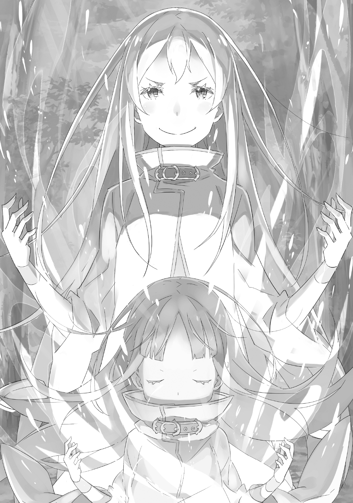

Английский перевод: Witch Cult Translations

Перевод и редактура: MilkyWay

Когда солнце омыло своими лучами белый снег, придавая ему волшебный вид, отражаясь от его поверхности, она выдохнула туманный вздох.

Ослепительный свет заставил её глаза слегка прищуриться. Её рука легла на ствол стоящего рядом дерева, и она почувствовала на ладони шершавую кору. Это была не иллюзия, а реальность, настоящее прикосновение.

Она крепко сжала ладонь, закрыла глаза от яркого света, позволила холодному воздуху наполнить свои лёгкие и снова спокойно выдохнула его. Прохладный ветер растрепал её розовые волосы, и девушка с тоном, не соответствующим её внешности, пробормотала:

???: Как я и думала, многие вещи ощущаются не так, как раньше, когда обретаешь новое тело спустя много веков.

У неё была прекрасная внешность, голубые зрачки таили в себе глубокое чувство рациональности, а также милое лицо, которое не могло скрыть благородный и элегантный шарм. При одном только взгляде на неё можно понять необыкновенный темперамент девушки.

Её молодое, неразвитое тело было облачено в белый халат без всякого нижнего белья. То, что она ступала по голой земле своими маленькими босыми ножками, делало её чрезвычайно уязвимой.

Несмотря на желание выплеснуть свои эмоции, она не могла этого сделать из-за погоды. Лес в этой местности был полностью покрыт снегом. Девушка пошла по снегу, из-за чего её тело начало быстро терять температуру и сильно дрожать.

Приходится признать, что дорожный наряд девушки — полный провал из-за своей непродуманности.

Сехмет: После стольких трудов, уф…! Не будет ли комично, если ты замёрзнешь от холода? Хууф…

И вдруг в голове дрожащей девушки раздался завораживающий, ленивый женский голос. Естественно, это не мог быть голос девушки, так как он звучал совсем иначе. Он проникал не в её уши, а прямо в разум. Девочка незаметно вздохнула и нахмурила брови.

Омега: Это не очень приятно представлять. Даже в моих нынешних обстоятельствах, я всё ещё обладаю магией, способной сжечь это поколение. Не смотрите на меня свысока.

Дафна: Значит несмотря на то, что ты проделала огромную работу, чтобы улизнуть в глухую ночь, ты всё бросишь и будешь обнаружена, наделав много шума? Идеальный сценарий для тебя, Дона-Дона?

Омега: …

Кармилла: Тише, тише… Дафна. Е…хидна…не имеет в виду ничего плохого…или, может, только немного? Мм, видишь ли, она, должно быть, просто испытывает облегчение от того, что снова жива, вероятно…вероятно…

Она услышала, как циничные замечания, произнесённые сладким голосом, быстро сменились неуверенными словами защиты. Эти два разных голоса не принадлежали девушке, и они отличались от медлительного голоса женщины, которая заговорила первой.

Три разных голоса по очереди обращались к девушке. Однако все голоса, обращённые к ней, были одинаково знакомы и наполнены сложными эмоциями. При этом девушка — нет, Ведьма, изменившая свою форму, Ехидна — расслабила губы.

Форма Ведьмы с белыми волосами и чёрными глазами, которая была известна своей чёрно-белой красотой, была утрачена. Теперь она использовала тело девушки как сосуд для своей души, сумев совершить невероятный акт оживления.

Было видно, что она приложила много усилий для своего возрождения, и такой поворот дел сильно обеспокоил её, но Ехидна справилась со всем этим и выполнила задуманное.

«Я вообще-то не склонна к эмоциям, но в этом вопросе я редко похлопываю себя по спине за хорошо проделанную работу. Однако…»

Омега: Когда ты проводишь более 400 лет в качестве духа, ты как бы забываешь, как снаружи красиво…

Тифон: Ты немного перевозбудилась. Дона, ты словно ребёнок. Совсем не разбираешься во многих вещах…

Омега: Я бы предпочла, чтобы ты не называла меня ребёнком, но… полагаю, сейчас мне нечего на это ответить.

Ехидна ответила на этот детский голос, звучавший в её сознании, но она знала, что её слова не возымеют никакого убеждения.

«В любом случае, я бы не хотела замёрзнуть до смерти сразу после своего возрождения».

Подумав, что можно сделать в крайнем случае, и не имея другого выбора, Ехидна щёлкнула своими пальцами.

Онемевшие пальцы издали тонкий слабый звук, и вокруг неё возникли пятна багрового света. Маленький огненный шар размером с её кулак замерцал и заколыхался, демонстрируя огневую мощь, большую, чем можно было подумать. Он прогонял холод заснеженного леса, что, в свою очередь, избавляло от опасности замёрзнуть насмерть.

Омега: Разница с моими Вратами несколько настораживает. Однако, кажется, нет никаких проблем с использованием магии. В таком случае…

???: Ты станешь посмешищем, если в этот раз ошибёшься с использованием магии и в результате сожжёшь весь лес.

Омега: Этому просто нет конца… Как вы смеете продолжать изливать на меня сарказм? После стольких трудов по реализации этого плана я начинаю жалеть, что вытащила всех вас.

Ехидна вздохнула, услышав голос пятого человека, прозвучавший в её голове, так как он был последним. Рука девушки бессознательно потянулась к обнажённой шее, где единственным, что подчеркивало её существование, было украшение, названное голубым пироксеном.

Омега: …

Ехидна некоторое время размышляла, проводя ногтем по твёрдой поверхности пироксенового кристалла. Человек с намётанным глазом мог бы сказать, что это не просто обычный предмет, а нечто, обладающее огромной силой.

Это был высококлассный магический кристалл высочайшей степени чистоты. Он обладал необычайной способностью накапливать магическую энергию и в данный момент накапливал в себе огромную силу, используя весь свой потенциал.

Даже тысяча высокоуровневых пользователей магии не смогли бы израсходовать накопленную в нём ману. И хотя было необычно, что такой маленький фрагмент мог вместить так много, использовать его весь было бы тоже весьма необычным подвигом. Обычный человек даже представить себе не мог, что сможет сделать что-то подобное.

И разве кто-то поверит, что в нём хранятся души пяти человек?

«Мне пришлось приложить немало усилий, чтобы заполучить этот магический кристалл и сосуд для моей собственной души. Я провела 400 лет в виде духа, и медленно воплощала этот план в жизнь в течение 10 лет, и наконец, настал момент…»

Минерва: Ехидна! Земля Ехидне! Ты вообще слышала хоть слово из того, что я сказала?!

Омега: Слышала. Ты кричишь мне прямо в ухо… Нет, «ухо» в данном случае не подходит. Ты можешь не кричать в моём сознании так много? У меня от этого уже голова разболелась.

Минерва: Сейчас не время для подобных разговоров! Посмотри рядом с собой. Посмотри!

Омега: Рядом со мной?

Она вытащила своё сознание из моря мыслей, следуя за голосом, а затем с сомнением посмотрела по сторонам. И тут она увидела ярко-красный свет и множество деревьев, охваченных пламенем, причём огонь перекидывался с одного дерева на другое.

Быстро оглядевшись, Ехидна поняла, что её единственный огненный шар заставил деревья загореться и стал той искрой, от которой начался лесной пожар.

Омега: О, Боже!

Сехмет: Ты выглядишь вполне спокойной, фууф.

Омега: Видишь ли, в таких ситуациях важно сохранять спокойствие и не паниковать. И хотя это, конечно, правда, что этот пожар неожиданный…

Когда Ехидна закончила говорить, она направила ладонь на горящие деревья и закрыла глаза. «Потухни!» — крикнула она, испуская слова силы из своих губ, когда открыла глаза.

Омега: Оно всё ещё не погасло…

Дафна: Хиии, у Дафны есть кое-какие мысли по этому поводу… Это место, похоже, отличается от мира Чертогов Грёз Дона-Доны, так сможет ли она вмешаться в него, просто используя слова?

Омега: Это, конечно, будет проблемой.

Кармилла: Большая ошибка в расчётах, не так ли?

Тифон: Дона, это ты устроила пожар? Ты плохой человек, Дона? Ты враг Тифон?

Минерва: Сейчас не время для разговоров! Быстрее! Скорее потуши его! Ну же!

Омега: Конечно. Я сделаю это… ух.

Пытаясь усмирить Ведьм, устроивших в её голове соревнование по крику, Ехидна попыталась потушить бушующий лесной пожар заклинанием, но вместо этого получила головокружение. Её заклинание забулькало во время произнесения и не сработало. Пока Ведьмы гадали, что случилось, Ехидна быстро разобралась в ситуации.

«Я ещё недостаточно знакома с этим телом, чтобы создать потоп с помощью магии».

Что означает…

Омега: Я не могу потушить огонь.

Минерва: Тогда тебе нужно убираться отсюда прямо сейчас!!!

Мало того, что она рисковала замерзнуть до смерти, теперь ей грозила ещё и смерть от ожогов. Ехидна вскочила на ноги, словно этот сердитый голос подстегнул её к этому.

«Лесной пожар распространяется, и скоро бежать будет некуда. Мне нужно выбраться отсюда».

Хотя она не знала этого тела и не шевелила пальцами более 400 лет, Ехидна бежала так, словно от этого зависела её жизнь, задыхаясь.

«Суровость внешнего мира немного отличается от того, что я себе представляла» — сетовала Ехидна, задыхаясь, её тело казалось тяжёлым, когда холодный воздух принимал его в свои объятия.

«Хотя мне кажется, что моё тело вот-вот сломается, если учесть, что я не чувствовала себя так уже несколько сотен лет…»

Омега: Нет, от этого легче не станет… Ух.

К счастью, благодаря отчаянному бегству Ехидне удалось избежать гибели.

«Пламя, сжигавшее лес, было очень мощным, но, направляя его по своему усмотрению с помощью ветра, который я создала с помощью маны, мне удалось найти путь к спасению. Без него я бы не выбралась оттуда. Теперь, когда я спаслась от опасного лесного пожара, я могу вернуться к путешествиям в этой одежде — вернее, я надеялась, что всё будет так просто, однако…»

«Вне сезона сильный снегопад и лесной пожар… и теперь, после всего этого, я нашёл девушку, на которой нет ничего, кроме лохмотьев. Может, мои глаза странно ведут себя из-за миазмов?» — спросил мужчина.

«Не волнуйся, я вижу то же самое… если только это не сон или что-то в этом роде», — добавил другой мужчина.

«Хм…» — сидя на пне, Ехидна положила руку на подбородок, словно размышляя о чём-то. Она была похожа на маленького ребенка, но эта поза очень подходила ей из-за ауры, которую она излучала.

Таким образом, мужчина, нет, мужчины, выглядели смущёнными из-за странного ощущения и смотрели друг на друга. Это была группа свирепых мужчин, одетых как бандиты, от которых исходила опасная аура. С первого взгляда казалось, что их 18 человек, и, поскольку каждый из них держал в руках хорошо поношенное оружие, они выглядели довольно комично в окружении маленькой девочки. Однако не судить о вещах только по внешнему виду и следовать инстинктам было их сильной стороной. Это можно было предположить по их внешнему виду и роду занятий.

Омега: Я полагаю, вы здесь из-за Великого Кролика, да? Другими словами… вы, господа, падальщики.

«Что?» — пробурчал мужчина.

Омега: Хм? В эту эпоху вас называют по-другому? Согласно его знаниям, вас можно назвать мародёрами, но это вам тоже не подходит… Интересно, как мне вас называть?

Ехидна слегка наклонила голову, заставив мужчин сделать нервные выражения, как будто они только что почувствовали что-то зловещее.

Занятие падальщиков, существовавшее и 400 лет назад, заключалось в том, чтобы обшаривать дома и имущество деревень и людей, разорённых зверодемонами, и превращать награбленное в деньги. Это было особенно актуально, если место было опустошено Великим Кроликом, поскольку всё, кроме исконных жителей, оставалось нетронутым, что делало его идеальным местом для падальщиков.

Омега: Даже если там есть выжившие, вы можете легко избавиться от них и представить всё так, будто это сделали зверодемоны. Какой умный способ охоты. Вы, господа, просто рождены быть гиенами.

Мужчина: Гиена? Ты имеешь в виду… гиена-люди? О чём ты вообще говоришь…

Мужчина впереди покачал головой и уставился на Ехидну с мачете в руке. В его глазах читался страх перед загадочным ребёнком и сильное желание причинить ей вред. Было ясно, что он прекрасно понимает, во что ему следует вмешиваться, а во что нет.

Мужчина: Я не знаю, что это за история, но от неё зависит наше пропитание. По какой-то причине кроличий след бесследно исчез. Вдобавок ко всему, случился лесной пожар и… появилась ты.

«Понятно, продолжай», — подтолкнула Ехидна.

«Ты зловещая девушка, но выглядишь неплохо. И ушки у тебя всё-таки есть», — сказал мужчина, лукаво улыбаясь и поглаживая своё ухо.

Его жест высветил нынешнюю физическую характеристику Ехидны — а она была таковой, потому что девушка, ставшая её сосудом, была полуэльфийкой.

«Не то, чтобы они думали обо мне как о полудьяволе. Важна ценность продукта, а не чистота крови. Будь я чистокровной или полукровкой, им было бы всё равно».

«С эльфами тоже так обращаются в эту эпоху?» — поинтересовалась Ехидна. Мужчина: Судя по тому, как ты говоришь, ты старая карга, которая долго пряталась в лесу, или что-то вроде того? Эльфы пугают тем, что по их внешнему виду невозможно угадать их возраст. Но да, верно. Даже сейчас их продают по хорошей цене.

Омега: …

«А?» — пробурчал мужчина. На секунду ему показалось, что его кожа закипела. Другие мужчины, почувствовав то же самое, были поражены. Они все начали обсуждать это, гадая, что же могло произойти. Единственная, кто знала, что произошло, прикоснулась к кристаллу пироксена на своей груди и попыталась успокоить ярость Ведьмы Гнева.

Мужчина: Эй, я не знаю, кто ты такая, соплячка или старая карга, но что бы ты ни делала, не нужно глупых идей…

«Ладно», — сказала Ехидна, прервав его.

Омега: Такими темпами мы не сможем достичь взаимопонимания. Вы, господа, хотите поймать меня и заработать немного денег. С другой стороны, я хочу продолжить своё беззаботное путешествие. Поэтому я хотела бы предложить компромисс. Что скажете?

Мужчина: Компромисс? Ты думаешь, что в состоянии вести переговоры?

«Я хочу, чтобы вы хорошенько подумали. Тогда будет шанс, что мы оба выберемся из этого благополучно», — с улыбкой обратилась Ехидна, наклонив голову.

Улыбка ребёнка заставила мужчину тяжело вздохнуть и сделать шаг назад, как будто она ошеломила его. И тогда мужчина, словно не веря, что так отреагировал, тут же сказал: «Я послушаю».

Омега: Я рада. Моё предложение простое. Тридцать секунд — это всё, что мне нужно. Я пойду с тобой, не сопротивляясь, но только если ты сможешь простоять передо мной эти полминуты, и с тобой за это время ничего не случится.

Мужчина: Ха. Что в этом такого? Думаешь, чего-то подобного будет достаточно, чтобы напугать нас…?

Омега: Ну, тогда отсчёт тридцати секунд начинается прямо сейчас.

Как только она поняла, что они приняли её условия, Ехидна погладила свои длинные белые волосы, сузила тёмные глаза и посмотрела на мужчин.

Все мужчины выглядели так, словно не понимали, что только что произошло. В их глазах это выглядело так, будто ребёнок, которому на вид было около 10 лет, внезапно превратился в красивую девушку с белыми волосами. Однако, прежде чем мужчины смогли получить ответ на свой вопрос, они один за другим начали поддаваться атаковавшей их аномалии.

Мужчина: Ка… ку.

Мужчина, державший мачете, упал на колени. Его глаза метались по сторонам, не фокусируясь на чём-то одном, а затем у него пошла пена изо рта. Подобное явление произошло не только с ним, но и со всеми окружавшими её мужчинами. Восемнадцать мужчин, находившихся в поле зрения Ехидны, не могли противостоять её ведьмовским миазмам и поэтому они испытывали сильную агонию.

Мужчины царапали и рвали свои шеи, закатывали глаза обратно в голову, пускали пену изо рта, бились в конвульсиях, захлёбывались языками, раскалывали себе головы оружием, зарывались головой в снег и умирали в муках различными другими способами.

Омега: Ровно тридцать секунд.

Закончив отсчитывать обещанные им тридцать секунд, Ехидна огляделась. Вокруг не было ничего, кроме людей, неподвижно лежащих в собственной крови и рвоте. К сожалению, среди них не было ни одного, кто смог бы выдержать эти тридцать секунд ада и стать Мудрецом, который мог бы править шестью Ведьмами.

«Это прискорбно для всех вас, но обещание есть обещание. Тогда я просто продолжу своё беззаботное путешествие. Думаю, никто не будет возражать, если я одолжу у вас одежду и обувь», — сказала Ехидна, затем взяла у павших мужчин одежду, которая ей подошла, и надела её.

К тому времени её облик уже вернулся к облику прежнего ребенка.

Омега: Похоже, это ненадолго. Полагаю, мне придётся подождать, пока я не привыкну к этому. Но всё же…

Ехидна оглянулась на павших мужчин, затем закрыла глаза и подумала о мальчике с чёрными волосами, о мальчике, который остался невредимым, будучи окружённым Ведьмами, покрытыми миазмами — хотя он, вероятно, даже не осознавал, насколько ненормально было быть способным на это.

Омега: Я не могу дождаться, когда доберусь до какого-нибудь города, так как теперь у меня есть немного денег на путешествие. Хотелось бы думать, что вкус чая изменился за несколько сотен лет… Ну а теперь…

Ехидна откинула подол своей длинной одежды и снова отправилась в путь без цели. Уходя, она начала испытывать благодарность к людям, которые снабдили её одеждой, обувью и деньгами на дорогу.

Омега: Я собиралась выйти на улицу и произвести ужасное первое впечатление на людей, надев лишь кусок ткани на голое тело. Это была ужасная ошибка — я всегда буду помнить вас, господа, как моих спасителей.

Она не произнесла ни слова обмана, она была искренна. Ехидна никогда не забудет о своём долге перед ними, пока не погибнет её душа, перед теми, кто работал падальщиками, кто встретил здесь Ведьму и умер.

Омега: Ааа. Я знаю, знаю. Вы шумные ребята. Пощадите меня уже.

Ведьма медленно начала двигаться вперёд по своему пути, отвечая на голоса в своей голове.

Небо было высоко над головой, ветер был слабым, и свет, казалось, благословлял того, кто вернулся спустя сотни лет.

《Конец》
