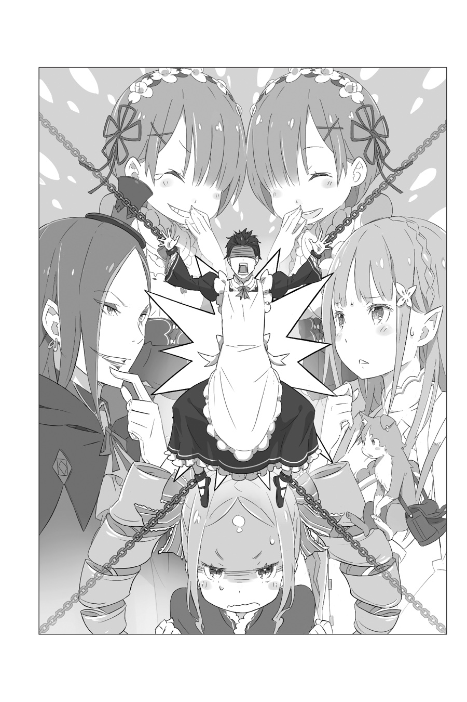

Рам: …Барусу, просыпайся. Уже утро.

Его разбудил холодный голос и звук распахивающихся занавесок, впускающих свежий воздух. Будучи столь внезапно вытащенным из мира снов, Нацуки Субару угрюмо зарычал и проснулся. В такие моменты он ненавидел себя за то, что так легко умеет просыпаться.

Рам: От тебя немного толку, но, по крайней мере, разбудить тебя не составляет труда.

Голос, что заставил его проснуться, метнул язвительный дротик в Субару, пока тот сидел на кровати. Перед Субару стояла красивая девушка в наряде горничной.

Её красные волосы были коротко подстрижены, а светло-красные глаза были ясными. Девушку с холодным выражением красивого лица звали Рам. В особняке, где помогал Субару, она была одной из двух горничных.

Рам: Ну-ка, хватит дрыхнуть, переодевайся. Если ты не перестанешь доставлять проблемы, Рам доложит об этом Господину Розваалю, и ты лишишься должности.

Субару: Разве ты не можешь сказать мне хотя бы «Доброе утро» или что-то в этом роде? …Уф.

Едва не зевнув от её строгих слов, Субару каким-то образом смог встать с кровати. Положив сменную одежду возле него на кровать, Рам повернулась, чтобы уйти.

Рам: Переоденься и сразу же встреться с нами. Даже не думай о такой глупости, как снова уснуть.

Субару: Как ты можешь, говоришь такое, такому трудолюбивому человеку, как я? Я сейчас к вам приду, мэм.

Рам: …Поторапливайся.

Рам не стала больше ничего говорить, и Субару оставалось лишь смотреть, как она быстро покидает комнату.

Нахмурившись по причине холодного отношения Рам, Субару снял свою привычную одежду, в которой спал, и, раздевшись до трусов, поднял сменную одежду, чтобы переодеться.

Сегодня шёл четвёртый день с тех пор, как его наняли работать здесь, в особняке Розвааля. Его тело ещё не было знакомо ни с работой, ни даже с самим понятием тяжёлого труда. Тот факт, что его всё ещё клонило в сон, был хорошим тому доказательством.

Натянув рукава, Субару поправил необычное количество украшений на своей одежде. Надев последнюю часть униформы на голову, Субару неуверенно двинулся по утреннему коридору. Местом встречи был главный вестибюль особняка. Субару смог дойти до него, сгорбив спину, которую обдувал прохладный утренний воздух.

Рам: Вот ты где, Бару…

Рам поприветствовала Субару после того, как он вышел из коридора и подошёл к главному вестибюлю. Но выражение её лица было несколько напряжённым, когда она посмотрела на него, а её приветствие остановилось на полпути. Увидев её реакцию, Субару слегка наклонил голову.

Он переоделся в свою рабочую форму, будучи сонным, возможно, что-то было не так?

???: О, Субару? Доброе утро. Давай сегодня поработаем на славу…

Девушка, стоявшая к Субару спиной, повернулась в сторону Рам. Это была сестра-близнец Рам, Рем. Не имея отличий от своей сестры, кроме голубых волос и цвета глаз, она также осмотрела Субару и застыла.

Хотя её отношение было более мягким, Рем была ещё более строга по отношению к работе, нежели Рам. Субару осмотрел свой наряд, ещё раз проверяя, не выглядит ли что-то странным.

Начиная с белой основы, это был изящный наряд чёрного цвета. Юбка была ниже колен, а манжеты рукавов раздувались. Фартук с оборками был прямым, а лента сзади, завершающая наряд, была идеально пришита. Забеспокоившись, что, возможно, украшение для волос не в том месте, Субару поднёс руку к голове… и тут до него наконец то дошло, в чём дело.

Субару: Как меня угораздило нарядиться в костюм горничной!?

Рам и Рем: А-ха-ха-ха-ха!

Одновременно с утренним криком Субару, Рам и Рем разразились смехом.

Рем: Даже будучи сонными, кто-то, кто в своём уме, заметил бы нечто подобное, пока одевается.

Рам: Для тебя одеться во всё это и проделать весь этот путь до места встречи… Я должна задаться вопросом, не является ли это одним из твоих хобби.

После приступа смеха, Рам и Рем продолжили наседать на Субару, настаивая, что он ведёт себя как соня. Горничная Субару выслушала их критику с выступившей на голове веной.

Субару: Вам есть, что добавить?

Рам: Хм, да. Похоже, что наряд Фредерики сидит на тебе как влитой. Всё так, как и предполагала Рам.

Рем: Сестра как всегда великолепна. Рем не может не восхищаться её проницательностью.

Субару: Проблема не в этом! И я не спрашивал, выглядит ли это на мне хорошо или нет! Это социальная проблема! Старшие горничные смеются над младшей горничной!

Рам: Значит, ты считаешь себя служанкой? Потрясающе, Барусу.

Рем: Похоже, тебе действительно нравится видеть себя таким…

Близняшки начали шептаться друг с другом. Видя, что ничего не получается, Субару оставалось лишь смириться.

Смирившись, он решил вернуться в свою комнату и переодеться, и вот он уже направился в сторону своей комнаты.

Рам: Смотри сюда, Барусу. Ты уже одет, так куда же это ты собрался идти?

Субару: Я подумал, что прежде чем показать всем такое ужасное зрелище, я вернусь в свою комнату и поплачу.

Рам: Так не пойдёт. Мы и так уже потеряли кучу нашего драгоценного времени сегодня утром. Мы не можем позволить себе потерять ещё больше.

Субару: Время, которое мы потеряли, было потеряно благодаря тому, что вы обе смотрели на меня и смеялись, не так ли?

Когда Субару заметил это, горничные сделали невинные лица. Видя их реакцию, он глубоко вздохнул.

Субару: Не смотря ни на что, я пойду и переоденусь. Если я уйду сейчас, то смогу обойтись тем, что мне будет стыдно лишь перед вами двумя. Я даже представить себе не могу, чтобы Эмилия-тан увидела меня в таком виде. Мне было бы куда более неловко.

Рам: Говоришь такое, хотя впервые испытываешь незнакомое ощущение юбки…

Субару: Да-да, я действительно привыкаю к ощущению свободы… нет!

Не удержавшись от язвительной реплики Рам, которая не проявила даже малейшего сострадания, несмотря на то, что она была виновником проблемы, Субару начал подниматься по лестнице, стараясь как можно скорее вернуться в свою комнату. Ситуацию нужно было исправлять и исправлять немедленно.

Субару: Хорошо, пусть это будет наш секрет и только наш. Я прошу тебя, пожалуйста, никогда больше не упоминай об этом.

Рам: Терять терпение на полпути, это в твоём стиле, Барусу.

Субару: Мне сейчас даже нечем ответить, несмотря на твой ядовитый язык. Так что, пожалуйста, держи это в тайне.

???: Что держать в тайне?

Субару: Продолжать разговор. Я говорю о том, что меня, полусонного, нарядили как служанку и выставили на парад…

В ответ на вопрос, прозвучавший над его головой, Субару сердито обернулся и ответил… Посреди этого до него дошло, что он смотрит в пару невинных аметистовых глаз, и он резко замолчал. «Хаа» — это всё, что вырвалось из его рта.

На втором этаже вестибюля, стоя в самой верхней части центральной лестницы и глядя в его сторону, стояла сереброволосая девушка — гостья лорда поместья и личность, интересующая Субару — Эмилия.

Причесав свои длинные серебряные волосы, Эмилия посмотрела на Субару, когда он замер, и наклонила голову.

Эмилия: Ммм… прости. Я не совсем понимаю, что нужно говорить в такой ситуации.

Субару: Ты могла бы просто посмеяться с остальными.

Эмилия: Прости, но это недостаточно забавно, чтобы смеяться с этого.

Субару оставалось лишь стерпеть всё это. Неужели весь мир настроен против него? Как он до такого докатился?

Когда девушка, на которую он положил глаз, видит его в таком наряде, и не может даже посмеяться над этим… ему просто-напросто захотелось умереть.

Рем: Сестра, сестра. Возможно, это то, что называется публичной казнью?

Рам: Рем, Рем. Я бы сказала, что в такой ситуации можно потерять всякое человеческое достоинство и умереть со стыда.

Сёстры-служанки, стоявшие позади него, держась за руки, тихо обсуждали его страдания. Попытка побега Субару потерпела полный крах, он попросту никак не смог бы им возразить.

Скорее всего, ничего из того, что Субару мог сказать в данной ситуации, не звучало бы убедительно. Любые действия были равносильны смерти, говорить, что-либо было так же равносильно смерти.

Избежать смертельной раны было уже невозможно, ему оставалось лишь попытаться сделать её как можно менее болезненной.

Эмилия: Субару, я действительно не знаю, что сказать…

Заикаясь, Эмилия нервно сместилась, стараясь тщательно подбирать каждое слово ради Субару. В любой другой ситуации Субару был бы очень рад такой заботе с её стороны, но эта ситуация была безнадёжной.

Видя, как чувства и выражение лица Субару гаснут с каждой секундой, Эмилия приняла решение.

Эмилия: Мне тоже понятно желание нарядиться в милую одежду, но я не думаю, что она тебе идёт, Субару!

Субару: …а?

Эмилия: Ах, я не расстроена или что-то в этом роде. Мне даже немного завидно. Что-то вроде того, что носят Рам и Рем, меня смущает, но длина, которую носила Фредерика, меня бы устроила…

Субару: Ты реагируешь на то, что я ношу, просто ставя этому низкую оценку? Ты не собираешься кричать на меня, что я извращенец?

Эмилия пыталась объяснить всё как можно быстрее, но она явно упустила суть разговора. Не было необходимости доводить это до неё, но это было настолько далеко от того, от того, что он ожидал, что Субару все равно спросил её.

Эмилия: …? Извращенец — это опасный человек, верно? А ты опасен, Субару?

Субару: Я абсолютно не опасен! Я надёжный и безопасный. Я понял, понял! Моя обычная одежда нравится тебе больше чем эта? Понял, пойду, переоденусь!

Субару поспешил завершить разговор, пока Эмилия не успела отреагировать плохо. Он чувствовал, как недовольные взгляды близняшек пронзают его спину, но он просто проигнорировал их.

Субару: Я всё ещё могу избежать это благодаря милой рассеянности Эмилии, но я ещё не разобрался с основной проблемой! Нужно вернуться в свою комнату, пока Розвааль или, что ещё хуже, Беатрис не увидели ме…!

???: Бо-о-оже мой, почему все собрались здесь так ра-а-ано утром?

Субару: Вы что, затаили на меня обиду или что?!?

Пока он пытался вырваться из всего этого ада и вернуться в свою комнату, в прихожей появился ещё один человек.

В клоунском гриме и эксцентричном наряде невозможно было не узнать хозяина особняка, Розвааля. И это несмотря на то, что он всегда держался особняком, пока не наступало время завтрака.

Субару: Из всех дней именно сегодня, почему?! Не только Эмилия-тан, но и Роз-чи явился!?

Розвааль: Если бы я мог сказать, то это потому, что я просто знал, что до-о-олжен. Если бы я не встал пораньше и не пришёл посмотреть, я бы пожалел об этом… и действительно, я увидел кое-что весьма-а-а интересное.

Когда Розвааль приблизился, он осмотрел Субару с неприятной улыбкой человека, который слишком сильно упивается собой. Под этим непристойным взглядом Субару придержал подол юбки и подсознательно отступил назад. Розвааль: Похоже, ты в поря-я-ядке. Если бы мне пришлось угадывать, я бы сказал, что это не первый случай, когда ты носишь женскую одежду?

Субару: Ну, вообще-то, был случай на церемонии поступления в старшую школу… Эй, хватит копаться в моём тёмном прошлом! Чёрт! Теперь мне никогда не стать невестой! Эмилия-тан, пожалуйста, скажи, что мы ещё можем пожениться!

Эмилия: Хм? Но ты же мальчик, Субару, так что ты изначально не мог быть невестой, верно?

Когда Субару стоял, едва сдерживая слёзы, Эмилия невинно добила его, и он разрыдался. Не иначе как ужасным это не назвать. Будучи непреднамеренно замеченным в женской одежде, теперь он знал, что судьба игралась с ним.

Субару: Если бы я знал, что меня увидят, я бы, по крайней мере, приложил к этому усилия и предстал бы перед ней в макияже и в нижнем белье…!

Эмилия: В этом проблема? Ты действительно немного странный, Субару.

Когда он полусерьёзно сказал это, сожалея о том, что увлёкся ситуацией, Эмилия одарила Субару кривой ухмылкой. Увидев её реакцию, он смело поднялся и взял себя в руки.

Субару: Вот четверо из шести человек в особняке! После того, как шестьдесят шесть процентов из вас увидели меня, я принял мужественное решение, что будет лучше закончить работу! Конечно, когда процент достигнет ста, мы все хорошенько посмеемся!

???: Это мужественное решение, но сейчас ты выглядишь совсем не мужественным.

???: Какие же вы шумные с утра пораньше, я полагаю.

Маленькая кошка, расталкивающая в сторону серебристые волосы, и девочка с закрученными в косы волосами, открывающая вход, появились прямо перед ним.

Субару: Я же не звал никого из вас! Дайте мне передохнуть!

Беатрис: Что!? Что это за высказывание!? Я бы не пришла, даже если бы ты… если бы ты… Ты! Этот наряд… выглядит нелепо, я полагаю! Извращенец!

Субару: Молчи! Ты не в том положении, чтобы тыкать пальцем в мою одежду! К тому же, если подумать, твой Братец постоянно голый, не так ли?!

Пак: Эй, я одет в нормальный мех. Извините за мой запах, плак-плак.

Беатрис: Не делай этого, Паки! Ты только заразишься и станешь таким как он, я полагаю! Ты должен сбежать вместе с Бетти!

Продолжая в том же духе, неожиданное утреннее собрание обитателей особняка продолжалось шумным разговором. Само собой разумеется, что в этот день завтрак немного припозднился.

Субару: Ах, горе-то какое. Сегодня была катастрофа. Это просто не мой день.

В конце рабочего дня Субару переоделся обратно в свою привычную одежду и вздохнул.

В конце концов, он проработал весь день в наряде горничной. У него осталось ощущение, что он потерял что-то важное как личность, но взамен у него было чувство удовлетворения, как будто он одержал маленькую победу над чем-то невидимым.

Лучше было бы сказать, что он чувствовал самоудовлетворение — он был удивлён своим собственным характером, который не изменился даже в другом мире.

Субару: Наверное, я потратил слишком много сил на какую-то глупость. Мне следовало бы лучше учиться.

Не хотелось бы, чтобы его невзлюбили за подобную глупость. Особенно, быть невзлюбленным очаровательной сереброволосой девушкой.

Субару: Даже несмотря на всё это, я удивлён, что Эмилия-тан не возражает против нарядов горничной. А может, это значит, что её не впечатляет наряд дворецкого, который я обычно ношу…? Это было бы весьма неприятно.

Повернув голову, он вспомнил, как уверенно носил наряд дворецкого, отражаясь в зеркале во весь рост.

Субару: Что ж, тогда завтра мне придётся просто развеять все воспоминания о наряде горничной, устроив великолепное шоу в роли дворецкого. Да. Что касается более интимной темы, то не пора ли мне пригласить Эмилию на свидание?

После того, как он закончил работу, а занятия Эмилии были завершены, он мог позвать её, назвав это освежающей прогулкой.

Цветочное поле в соседней деревне и маленький зверёк, от которого дети были в восторге. Было много вещей, которых можно было с нетерпением ждать.

С неким предвкушением сегодняшний день Субару подошёл к концу. Обещанное свидание и мир, что снова отвернётся от него, всё это ждало его в будущем, в будущем, до которого оставалось два дня.

《Конец》
