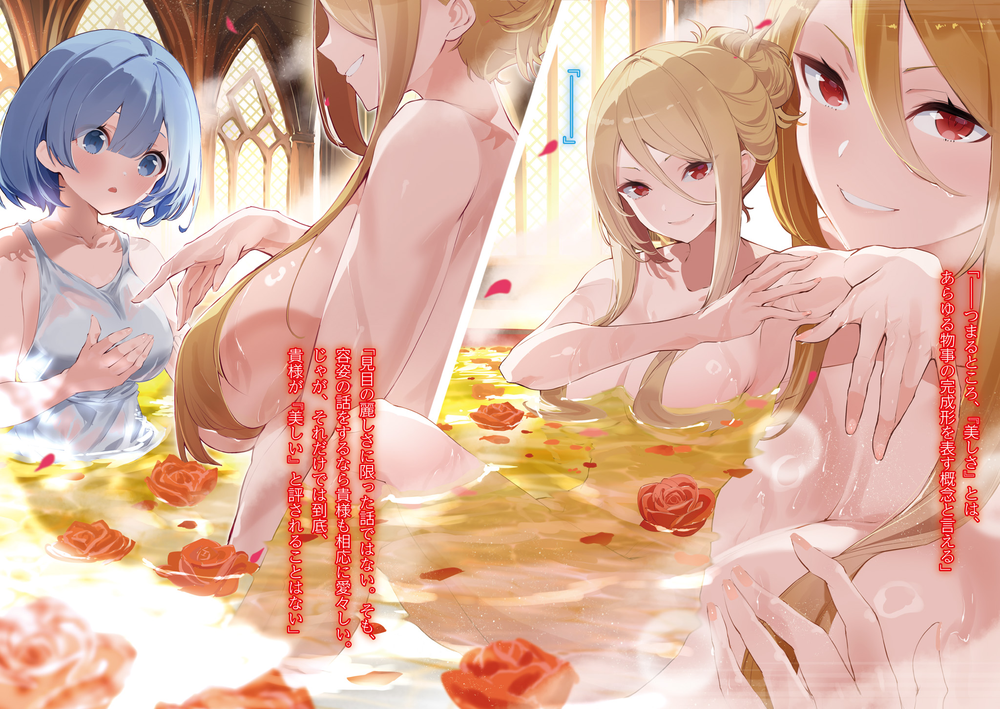

Дни Рем в городе за стеной были расписаны по минутам.

Утро начиналось с помощи по хозяйству: готовка, стирка. Затем обход раненых, проверка их состояния, лечение магией. В перерывах — разговоры с жителями города, попытки нащупать хоть какую-то нить к потерянным воспоминаниям.

Время летело незаметно, не оставляя ни минуты на пустые раздумья и самоедство. Рем была этому искренне рада. Беспокоиться о том, чего не изменить, — пустая трата сил.

Но стоило появиться свободной минутке…

Рем: …Как там Луи-чан… с ним?

……Тревога ледяной змеей сжимала ее сердце.

Рем: …………

Все, кто отправился в Город Демонов Хаосфлейм… Рем часто вспоминала Луи, которая отправилась туда вместе с Субару и Авелем. Предчувствия были недобрыми.

Город Демонов славился своей опасностью. Да ещё эти непонятные отношения между Луи и Субару… Беспочвенные, на взгляд Рем, подозрения Субару вызывали у неё недоумение.

Конечно, за последние дни её отношение к Субару сильно изменилось.

У неё оставалось много вопросов к его поведению, его внезапные исчезновения и возвращения с каким-то зловещим запахом… Но в его искренности Рем не сомневалась.

Рем: …Ну, почти. Часть меня всё ещё не доверяет ему. Но что может быть подозрительного в Луи-чан?

Ничего. Рем не видела в девочке абсолютно ничего подозрительного.

И не только она.

Воины Судрак тоже не замечали в Луи ничего странного. А уж они-то были куда более проницательными, чем Рем.

Получается, основания для своих страхов Субару видел только сам.

Именно это и пугало Рем. Кто остановит его, если она не рядом?

Рем: Медиум и Таритта с ним, они должны его удержать, если он вздумает обидеть Луи-чан… Но…

Весёлая Медиум и серьёзная Таритта — последняя надежда.

Остальным мужчинам, отправившихся в Город Демонов, Рем не доверяла. Ни Авелю, ни Алу. Авель в любой момент пожертвует Луи ради своей цели. А Ал…

Рем: …Он словно меня ненавидит.

Он не говорил ей ничего обидного, не пытался навредить. Но Рем чувствовала исходящую от него скрытую враждебность, словно из-под того черного металлического шлема на неё смотрел недобрый взгляд.

Да, он был дружелюбен с Субару, но это не повод для доверия. Безопасность Луи полностью в руках Медиум и Таритты.

???: Рем, что случилось? Почему ты такая грустная?

Рем, задумавшись, смотрела в небо, стоя на площади перед ратушей. Услышав голос, она обернулась.

Это была Мизельда — красноволосая, улыбающаяся, полная жизненной силы. Она бодро махала Рем рукой.

Увидев Мизельду, Рем вскрикнула и поспешила к ней с тростью.

Рем: Мизельда-сан, так нельзя!

Мизельда: Хмф. Перестань обращаться со мной, как с калекой. Я не так уж сильно пострадала.

Рем: Потерять ногу — это довольно серьёзная травма.

Рем подошла к Мизельде, которая стояла, сложив руки на груди.

Рем уже освоилась со своими ногами и с помощью трости передвигалась довольно быстро. Ей не требовалась помощь Мизельды.

Но Мизельда была явно недовольна.

Мизельда: Если ты будешь и дальше со мной сюсюкаться, у меня и вторая нога отвалится.

Рем: Мизельда-сан…!

Мизельда: Ладно-ладно.

Под пристальным взглядом Рем Мизельда выдавила из себя улыбку.

Вместо утраченной правой ноги у Мизельды был деревянный протез. Она уже научилась довольно ловко с ним обращаться. Конечно, ей надо было бы поберечь себя, но Мизельда упрямо отказывалась от покоя.

Именно из-за потери ноги ей пришлось передать звание вождя своей младшей сестре, Таритте.

Рем: Вы так хорошо выглядите… Может, зря вы так поспешили с этим?

Мизельда: Нет, это было необходимое решение.

Рем восхищалась силой духа Мизельды, но её ответ прозвучал резко и безапелляционно. Мягкий свет в глазах Мизельды погас, и она снова превратилась в суровую воительницу Судрак.

Мизельда: Вождь должен быть сильным. Если ты не можешь вести племя — уступи место другому.

Рем хотела было возразить, но слова Мизельды заставили её смущенно замолчать.

Она вновь позволила себе судить о том, в чём ничего не понимала. Мизельда, конечно же, сама всё решила.

И она прекрасно видела, как волнуется Таритта, приняв на себя бремя вождя.

Мизельда: Не хмурься, Рем. Я знаю, ты переживаешь за Таритту… за Субару… и за Луи.

Рем: Мне кажется, вы меня не понимаете…

Мизельда: Ну и ладно.

Мизельда без труда раскусила попытку Рем скрыть своё беспокойство. Бывшая вождь Судрак слишком хорошо знала свой народ.

Мизельда пожала плечами, а Рем робко кивнула.

Мизельда: Таритта, несмотря на свою молодость, обладает большим потенциалом. Ей только не хватает уверенности и опыта. И она обязательно их приобретёт в этом путешествии.

Рем: Уверенности и опыта?

Мизельда: Тебе они тоже не помешают, Рем.

Рем растерялась, ведь высокая Мизельда смотрела на Рем сверху вниз.

Слова Мизельды попали в точку. Тяжесть ответственности, душераздирающая тревога… В Таритте Рем видела себя.

Конечно, она понимала, что бремя вождя, которое легло на плечи Таритты, и её собственные поиски потерянного прошлого — вещи совершенно разные.

И всё же…

Рем: Мне кажется, я понимаю Таритту… Наверное, потому, что… я знаю, что у меня тоже есть старшая сестра.

Мизельда: У тебя есть сестра, Рем? Уверена, она замечательный человек.

Рем: Надеюсь…

Рем никогда не видела свою сестру-близняшку, но твёрдо верила в её существование, хотя и знала об этом только со слов Субару.

Где-то там была её вторая половинка. И Субару так отчаянно защищал Рем, потому что хотел, чтобы они встретились.

Эта мысль согревала сердце Рем. Но сомнения никуда не уходили.

Чтобы преодолеть их…

Рем: …Нужно сначала найти себя.

В этом и заключались «уверенность и опыт», о которых говорила Мизельда.

???: Госпожа Мизельда! Вот вы где!

Мизельда: Хмф.

Кто-то окликнул Мизельду. Она подняла голову, и Рем тоже посмотрела в ту сторону. Из ратуши им махал мужчина.

Крупный, коренастый, с густой шапкой непослушных волос. Но за этой внешностью скрывалась необычайная доброта — это был Зикр.

По просьбе Авеля он остался в городе командовать отрядом Рем и Мизельды. Сейчас он, нахмурив брови, подходил к ним.

Зикр: У меня душа в пятки ушла, когда я услышал, что вы гуляете. Вам нужен покой, вы ещё не оправились после ранения.

Он подошёл к ним, выражая беспокойство о здоровье Мизельды. Но, повторив слова Рем, он лишь вызвал её недовольство.

Мизельда: И ты туда же, Зикр? Мне уже надоели эти причитания.

Зикр: Даже если вам надоело, я буду их повторять. Если у вас найдётся время, я бы хотел с вами посоветоваться.

Мизельда: Посоветоваться?

Зикр: Да, насчёт размещения воинов Судрак.

Хоть Мизельда и передала бразды правления Таритте, она всё ещё оставалась бывшим вождём и самым опытным воином племени.

В отсутствие сестры её совет был как никогда важен. Так она могла чувствовать себя нужной и полезной.

Мизельда: Ну что ж, раз надо… Куна с Хоули сами не разберутся.

Зикр: Конечно, лучше бы они были здесь. Защита города важна как для вас, так и для нас. …А вы какие планы строите, леди Рем?

Получив согласие Мизельды, Зикр обратился к Рем.

Он, видимо, догадывался, что безделье доведет её до новых приступов тревоги. Рем мысленно поблагодарила его за заботу.

Рем: Спасибо, Зикр-сан. Но у меня уже назначена встреча.

Зикр: В самом деле? И с кем же…?

Зикр, не обидевшись, тут же отозвал своё предложение. Рем кивнула.

Рем: Я иду к… Присцилле-сан.

Присцилла: …В конце концов, «Красота» — это и есть совершенство. Ты согласна, Рем?

Рем: Хм…

Присцилла: «Красота» — это не только внешность. Это гармония внутреннего и внешнего: поведение, манеры, образ мыслей. «Красота» — это сама суть.

Присцилла протянула руку, и Рем осторожно взяла её в свои ладони. Мягкость и теплота кожи Присциллы, бархатистый голос, словно вибрирующий в воздухе… всё это гипнотизировало Рем.

Они с Присциллой были в купальне, одетые в лёгкие халаты. Присцилла вытянула бледную руку, её нагота не смущала Рем.

Обстановка располагала к откровенности, но Рем была слишком заворожена красотой Присциллы, её белоснежной кожей и идеальными формами, чтобы чувствовать себя неловко.

Когда Присцилла позвала её в купальню, Рем была несколько удивлена.

Рем: Купание… тоже одно из ваших любимых занятий?

Присцилла: …………

Рем: …И вы ради этого… реквизировали самый большой особняк в городе?

Присцилла: …Ты интересуешься, почему я его заняла? Да, именно поэтому. Ты что, серьёзно думала, что я поселюсь в какой-то лачуге или в солдатских казармах? Ты вообще представляешь, кто я такая?

Рем: …Присцилла Бариэль.

Присцилла: Не забывай добавлять «-сама».

Присцилла, прикрыв один глаз, бросила на Рем пронзительный взгляд. Рем, словно ощущая жар этих алых глаз на своей коже, продолжала аккуратно обтирать её тело мягкой тканью.

Присцилла, приняв Рем к себе, обращалась с ней, как с личной служанкой.

Готовить, стирать, помогать с купанием… — всё это входило в обязанности Рем. И она справлялась с ними безупречно.

Присцилла: Итак, ты поняла, чего тебе не хватает, Рем?

Рем замолчала, вспомнив про свои тревоги.

Этот взгляд, эти слова… Присцилла явно задумала что-то еще. Рем вспомнила слова Присциллы о «Красоте», которая заключена в самой сути, и начала догадываться, к чему та клонит.

Присцилла молча завернулась в халат и посмотрела на задумчивую Рем.

От горячей воды начинала кружиться голова. Но Рем не ощущала никакого давления со стороны Присциллы.

Рем: Если «Красота» — это суть… тогда… моя магия исцеления… тоже может быть… «Красивой»?

Присцилла: В общем-то, да.

Одобрительно кивнула Присцилла.

Но, прежде чем Рем успела обрадоваться, она добавила:

Присцилла: Хотя, если быть честной, твоя техника исцеления оставляет желать лучшего. Управление маной, понимание основ целительства… всё это выглядит… крайне любительски.

Рем: Любительски?

Присцилла: Если хочешь достичь совершенства, нужно исправить эти огрехи.

Рем: …Поняла.

На самом деле Рем понимала только общую суть.

Если исходить из слов Присциллы, «Красота» присутствует в любом проявлении мастерства. Значит, совершенствуя свою магию, Рем будет стремиться к «Красоте».

Но даже понимая это, она не представляла, сколько усилий потребуется…

Присцилла: Дурында. Думаешь, я просто так пригласила тебя в ванную?

Рем: А…?

Внезапно у Рем закружилась голова, и мир перевернулся.

Она инстинктивно потянулась за тростью, которую не взяла с собой. Рем с головой ушла под воду.

Рем: Кх…! Присцилла-сан, что…?!

Присцилла: Тихо. Расслабься и… лежи спокойно. Ты часть этого мира. Почувствуй это.

Присцилла не обращала внимания на протесты Рем. Рем затаила дыхание, когда тонкий палец Присциллы коснулся её лба.

Её тело само собой откинулось назад, и Рем, как и велела Присцилла, расслабилась в тёплой воде.

Она не подчинилась воле Присциллы, она… просто почувствовала, что так правильно.

Присцилла: Не важно, помнишь ли ты своё прошлое. Ты здесь и сейчас, и ты — это ты. Можно заблудиться в собственных мыслях или проклинать судьбу, но истина от этого не изменится. Прими это. Загляни в себя, найди в своей душе то, чем ты можешь гордиться. Тебе не нужна моя помощь, тебе нужна опора, чтобы идти своим путём.

Слова Присциллы мягко проникали в сознание Рем.

Она не стала разъяснять, как добиться совершенства в целительстве. Её слова можно было бы принять за пустые утешения.

За те неполные двадцать дней, что Рем провела здесь, никто не поражал её красотой так, как Присцилла. Конечно, воины Судрак, и особенно Мизельда, тоже были по-своему красивы, но Присцилла затмевала всех.

Присцилла: Почувствуй себя, Рем. От кончиков пальцев до кончиков волос. Тогда ты сможешь освободиться от влияния Наблюдателей.

Рем закрыла глаза. Слова Присциллы отзывались эхом в её сердце, разливаясь теплом по всему телу.

Она вспомнила Субару, который обещал вернуться, и Луи, которая ушла вместе с ним… Сердце Рем, нашедшей гармонию с миром, было спокойно.

《Конец》
