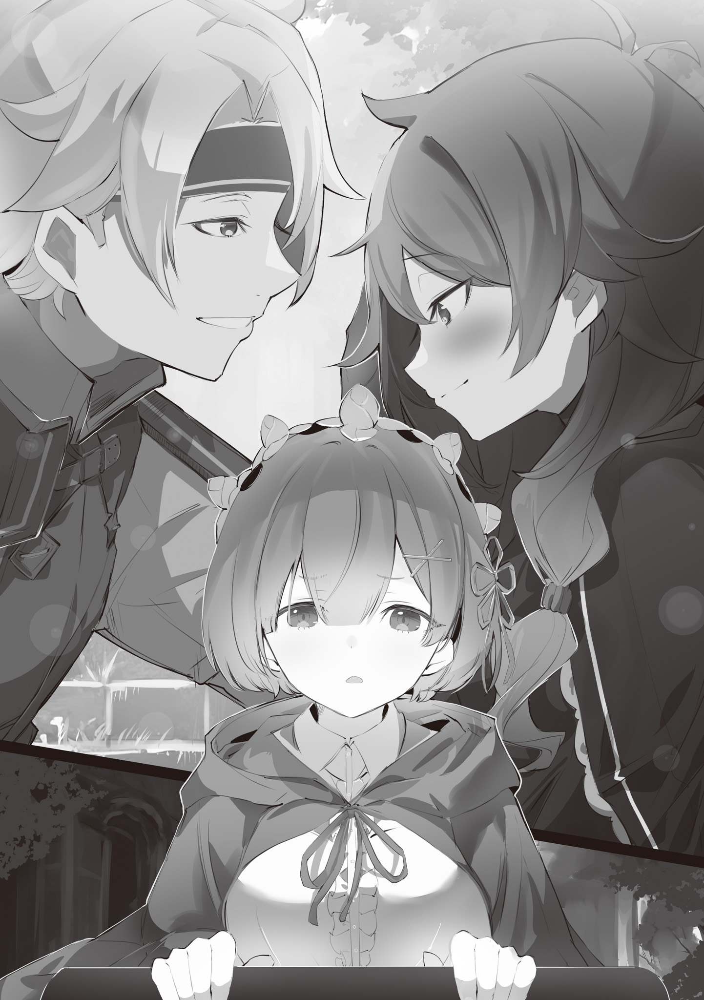

База: PaperKaminari

Перевод и редактура: mentalrebel

В связи с тем, что побочные истории пишутся именно для ранобэ, некоторые события и действия могут чуть различаться по сравнению с веб-новеллой.

Рем: ……Катя-сан, какими были твои отношения с женихом?

Катя: Что?

Катя не смогла скрыть своего недоумения, когда Рем задала вопрос, обернутый в невинность.

Рем, которая предпочла толкать инвалидное кресло по менее ухабистой дороге, проклинала собственную бестактность.

Но, как бы сильно она себя ни ругала, что сделано, то сделано.

Рем: Я сказала, что мне интересно, какими были твои отношения с женихом, так что……

Катя: Я услышала тебя с первого раза! П-почему именно сейчас, так внезапно, вот что я имею в виду……!

Рем: Неужели это было странно?

Катя: Конечно было! П-просто взгляни на ситуацию……хк

Катя разозлилась, ее голос был тихим, но в то же время сердитым до такой степени, что это можно было принять за особый навык. Она оглядывалась по сторонам своими полными подозрения голубыми глазами, — все было именно так, как она и сказала. Сейчас было не время для сплетен.

В данный момент Рем и Катя находились в середине эвакуации вместе с группой из десятков человек…… После боя между повстанческой и имперской армией они оказались в самом центре событий и теперь, когда ситуация изменилась, стремились к выходу из столицы Империи.

……Особняк премьер-министра Беллстетза Фондальфона, где они были взяты в плен.

Прошло уже некоторое время с тех пор, как кто-то пришел им на помощь в момент, когда на это место напала таинственная группа людей. Эта помощь оказалась весьма хлопотной; тот, кто помог Рем, и тот, кто помог Кате, — оба они тревожили внутренний разум Рем по чрезвычайно сложным причинам.

Одним из них был человек, который находился рядом с Рем с того самого момента, как она очнулась без своих «Воспоминаний», — Нацуки Субару. Он появился в другом обличье, чтобы вызволить Рем из опасной ситуации.

Этот факт, а также то, что он уменьшился в размерах, будучи вне поля ее зрения, вызывали у нее сомнения, однако в сравнении с той сложной ситуацией, в которой она оказалась вместе с Катей, это могло показаться несущественным.

Катя: Тодд……

Шевеля губами с тревожным выражением на лице, кожа Кати стала бледнее еще на один оттенок.

Крепко держась за поручни инвалидного кресла, она попыталась скрыть свою дрожь. Даже не осознавая этого, она пробормотала имя Тодда, словно полагаясь на него в этой нестабильной ситуации.

Но для Рем это имя, а точнее, человек с этим именем, был очень важен.

Рем: ……Тодд Фанг

Как и в случае с Катей, Рем произнесла то же имя, будто пытаясь убедиться, что его никто не услышит.

Нельзя сказать, что она полагалась на это имя или даже относилась к нему с большой симпатией. Но так и должно быть, поскольку с Тоддом у Рем были связаны очень опасные воспоминания.

С точки зрения Рем без «Воспоминаний», Тодд был первым, кто угрожал ее жизни…… если закрыть глаза на различные условия, то назвать его так не будет преувеличением.

Конечно, человек, о котором идет речь, сказал, что это было по приказу армии, и он делал это не по собственной воле, однако……

Катя: …Ты слишком сильно беспокоишься.

Рем: А?

Катя: У тебя появляются ненужные мысли, мол, если в этой ситуации затронуть тему Тодда и заставить меня о нем поговорить, то это поможет мне расслабиться, так ведь? Э-это так очевидно……

Даже не поворачиваясь, чтобы встретиться взглядом с Рем, которая толкала ее инвалидную коляску, Катя рассказала ей о своем понимании намерений, стоящих за заданным ранее вопросом. От такого понимания, крайне похожего на Катю, Рем закрыла глаза.

Однако то, как восприняла это Катя, и то, что думала об этом Рем, — практически полностью противоположные вещи.

Причина, по которой Рем спросила Катю о Тодде, заключалась в том, что она рассчитывала найти повод разлучить их друг с другом.

Если бы Рем сумела заставить Катю с подозрением отнестись к словам и действиям Тодда, заставить ее чувствовать себя по отношению к нему так же, как и остальные, тогда она смогла бы заставить ее разлучиться с этим опасным человеком.

Как бы сильно Рем ни старалась изобразить его хорошим парнем, ей не хотелось давать человеку, известному как Тодд, даже немного доверия. А поскольку Субару счел его полезным, он наверняка обладает исключительным мастерством. Она понимала это, но даже в этом случае доверять ему было сложно.

Ведь за все время Тодд ни разу не пытался узнать имена окружающих его людей.

И, когда Рем начала закреплять свое сложное душевное состояние,

???: Катя, остановись.

Подобно удару исподтишка, она услышала голос того самого человека, и плечи Рем рефлекторно вздрогнули. Вместо Рем Катя бессознательно обратилась к обладателю этого голоса,

Катя: Тодд……

Человек, на лице которого не появилось ни тени улыбки от облегчения Кати…… Тодд, лишь пожал плечами.

Тодд: До сих пор все шло хорошо, но чуть впереди возникли небольшие неприятности. Там достаточно зомби, чтобы заставить меня пересмотреть наш маршрут, но, к сожалению……

???: У нас нет времени искать другой маршрут.

Тодд указал на дорогу с топором в руке, и тем, кто сделал вывод из его объяснений, была молодая фигура, держащаяся за руки с девушкой в платье. Субару.

Рем и Катя, а также около двадцати мальчиков с черными волосами и глазами, которые до этого были заточены в особняке. Из-за того, что они взяли это бремя с собой, группа Субару отправилась вперед, чтобы обеспечить себе путь к побегу, причем вся группа стремилась добраться до стен и выбраться за пределы столицы Империи.

Однако это означало, что на их до сих пор успешный путь наконец-то упала тень.

Рем: Значит… Там сильный враг, и у нас нет времени на поиск другого пути?

Катя: М-мы полностью загнаны в угол! Ч-что же нам делать……!

Тодд: Давай посмотрим. Как насчет того, чтобы сдаться и присоединиться к мертвым? Сделать это с тобой, возможно, будет не так уж и плохо.

Катя: Дурак! Е-если ты собираешься умереть, то иди и умирай сам! ……Ах

Непроизвольно выплюнув это, краска быстро сошла с лица Кати.

Она осознавала всю остроту ситуации и своим заявлением откусила эти язвительные слова, однако тут же горячо пожалела о сказанном — это была дурная привычка Кати.

Конечно, прекрасно все понимая, Рем попыталась опровергнуть это заявление и……,

Тодд: ……Не делай такое лицо. На самом деле ты не это имела в виду, это уж я точно знаю.

Но, прежде чем что-либо успело слететь с уст Рем, Тодд нежно произнес эти слова, поглаживая вьющиеся волосы Кати.

Речь и манеры Тодда, а главное, облегченное лицо Кати поразили Рем до глубины души.

Уверенность, которую испытывала Рем как человек, ставший другом Кати, ее чувства, когда она претендовала на роль того, кто ее понимает, были опрокинуты. Проиграв в этом вопросе, Рем сильно расстроилась.

Субару: Я уже поговорил и с теми детьми. Сейчас у нас нет свободы, чтобы изменить маршрут. Именно поэтому, собрав всех, кого можно считать бойцами, мы сотрем нашего врага с лица земли. А вы тем временем попытайтесь подобраться к стене с соседней улицы.

Тодд: Мы составили план на победу, так что отдельная команда нужна лишь на всякий случай.

Оставив внутренние мысли Рем в стороне, Субару и Тодд объяснили план действий на данный момент.

Судя по всему, они хотели сказать, что, пока Субару и остальные противостоят ожидающему их врагу, группа Рем должна обойти поле боя.

Рем: Прошу, подожди. Если ты имеешь в виду всех, кого можно причислить к бойцам, то и я тоже.

Тодд: Боец? Ты?

Рем: ……А что, есть жалобы?

Естественно, Тодд сделал озадаченное лицо в сторону Рем, которая протестовала против своего исключения из числа людей, умеющих сражаться. В связи с тем, что произошло раньше, голос Рем стал ниже, и она бросила взгляд на Тодда, но тот пожал плечами, сказав: «Нет» и,

Тодд: У тебя странная походка, поскольку ты хромаешь на одну ногу, да? Если мне не изменяет память, в последний раз, когда я тебя видел, ты пользовалась тростью. Ты ведь не осознаешь, насколько хорошо можешь двигаться?

Рем: Это……

Тодд: Мы не можем назвать бойцом того, кто не имеет полного представления о собственной подвижности. Кроме того…

Не ответив ни на одно из резких замечаний Тодда, Рем от досады скрежетнула коренными зубами. Он напыщенно произнес эти последние слова в ее адрес, а затем перевел взгляд на Катю.

Увидев, как Катя пробормотала: «Ч-чего……» под пристальным взглядом своего жениха, Тодд рассмеялся.

Тодд: ……Похоже, Катя тебе доверяет. Довольно редкое явление для такой застенчивой особы, как она.

Катя: Что……!?

Тодд: Вот почему я хочу оставить Катю в твоих руках. Как ты на это смотришь?

Боковым зрением взглянув на Катю, чье лицо стало ярко-красным, а глаза наполнились слезами, Тодд бросил вопрос в сторону Рем.

Под этим вопросом Рем осознала свое полное поражение. Из-за того, что ее вычли из бойцов, и из-за нового человеческого поведения Кати, она оказалась в полной ловушке.

По крайней мере, если собственная контратака Рем не состоится, то она попытается обратить свой взгляд на Субару,

Субару: Я согласен с Тоддом. Рем, позаботься о Кате-сан. Давайте же все встретимся в безопасности, за пределами стен.

Рем: ……Поняла.

Услышав эти слова от Субару, единственного, кто мог ее поддержать, Рем бессильно кивнула.

Это было то, что она уже давно поняла. Субару было тяжело согласиться с тем, чтобы заставить Рем броситься навстречу угрозе. Как Тодд оберегал Катю, так и он оберегал Рем от опасности.

Как и следовало ожидать, он должным образом подготовил предлог, от которого Рем будет не в силах отказаться.

А затем……,

Тодд: Катя, следи за своими манерами. Я обязательно приду за тобой позже.

Катя: ……Н-не совершай глупостей. Твоя сильная сторона — остроумие и упорство, поэтому убедись, что ты правильно их используешь……

Тодд: Знаю. ……Я тоже дорожу тобой больше всего на свете.

После того как Тодд и Катя обменялись словами, Рем провожала их с неописуемым чувством.

И в то же время она колебалась, следует ли ей сказать такие же слова Субару.

……Однако ирония судьбы обнажила свои клыки не по отношению к Рем, а по отношению к Кате.

Катя: а……?

Увидев, что Катя застыла как вкопанная, с широко раскрытыми голубыми глазами, Рем прикусила губу и повесила голову. Руки Рем крепко вцепились в подол собственной одежды, а грудь наполнилась ощущением бесполезности.

Она сама взяла на себя эту роль. В таком случае, могла ли я поступить лучше? задалась она вопросом. Передать эту информацию из уст Рем Кате…… эту ужасную новость.

От нее у Кати заплыли глаза, после чего она еще раз обратилась к Рем.

Катя: Чт-, о…… ты- только- что- сказала, Рем?

Рем: Тодд-сан…… его не удалось найти.

Катя: Обманщица!

По-прежнему опустив голову и не глядя Кате в лицо, Рем повторила ту же информацию, и ее прервал горестный голос.

Колеса, поворачиваясь, издали дребезжащий звук, и Катя, подавшись вперед, вцепилась в руку Рем. Она неосознанно впилась в нее ногтями, но такая боль была мелочью.

По сравнению с той болью, которую Рем, а также Катя, чувствовали в своих сердцах.

……Чтобы сразиться с сильным врагом, вставшим на их пути, группа Субару отделилась от группы Рем.

Благодаря этому плану Катя и пленные дети благополучно выбрались за пределы столицы Империи.

Однако после того, как они отделились от них на середине пути, группа Субару до смерти выложилась в изнурительной борьбе с сильным противником, особенно Субару, который, когда Рем добралась до него, был на грани смерти.

Она едва успела вовремя и сумела спасти Субару, но……,

Катя: …………

Она до боли сжала руки Рем, и без того бледная и болезненная кожа Кати налилась еще большей кровью.

Его, жениха Кати, который вместе с Субару сражался против сильного врага, нигде не было видно. Беатрис и остальные тоже отделились от Субару и Тодда в середине битвы и не смогли воссоединиться после завершения боя с сильным врагом.

Следовательно, они не знали, как завершилась битва Субару и Тодда.

Катя: Все еще-, все еще, остался тот-, тот парень, который пришел за тобой, так ведь……?

Рем: ……Тот человек, да.

Катя: Если он был с Тоддом, тогда…… мы все еще не можем знать наверняка. Может быть, просто может быть, он знает, что случилось, что случилось с Тоддом……

Рем: Катя-сан……

Катя: ……Почему…

Дрожащие глаза Кати смотрели на Рем, и болезненные эмоции, скрывающиеся за этими голубыми глазами, на мгновение дрогнули.

Скорее всего, слова, которые она оборвала, предназначались для того, чтобы обвинить Рем.

Будь то обвинение в том, что она не вернула Тодда, или, возможно, в том, что она вернула только Субару. Только совесть заставила Катю этого не говорить.

Чувствуя, что лучше бы она позволила ей накричать на себя, Рем тоже была в растерянности.

Как бы искренне он ни демонстрировал свою готовность к сотрудничеству, подозрения Рем в отношении Тодда так и не рассеялись. Облегчение, которое Рем почувствовала теперь, когда Тодда не стало, было немалым. И хотя она не могла сказать об этом Кате, это, несомненно, было правдой.

Катя: Это неправда, он, он не мог, Тодд, нет……

Катя, которая по-прежнему не могла принять рассказанную ей реальность, тихо произнесла это. Она бы с удовольствием поговорила с ней по душам и дала бы ей время успокоиться, но здесь у них не было такой привилегии.

Стены водохранилища были прорваны, и столица Империи тонула под огромным количеством воды. Эвакуированные имперские граждане, солдаты и повстанцы начали двигаться к северному городу, и Рем с Катей больше не могли медлить.

По крайней мере, магия исцеления Рем должна быть использована с пользой. Но было трудно оставить Катю.

И в тот момент, когда Рем так колебалась……,

???: ……Катя? Эй, Катя! Неужели это Катя!

Вокруг них находилось множество беженцев, на земле были расстелены куски ткани, а в палатке была сооружена элементарное место отдыха.

Рем удивилась, когда голос, казалось бы, лишенный всякого внимания и заботы, назвал имя Кати, но реакция собеседницы была куда более драматичной.

Словно ожив, Катя подняла лицо, повернулась в сторону голоса, открыла глаза, а затем сказала,

Катя: ……Б-брат?

???: Ооо, вот ты где была, Катя! Слава богу, тебе удалось выбраться оттуда, ха! Я уже собирался сам вернуться обратно, но на моем пути встало столько людей, что мне пришлось нелегко.

Расталкивая толпу, этот имперский солдат с повязкой на глазу подошел к Рем и Кате.

На мгновение ей показалось, что она его откуда-то знает, но реакция Кати затмила мысли Рем.

Рем: Это что, твой брат? Но я слышала, что брат Кати-сан погиб……

???: Че, я…? Какой, блядь, погиб! Стоямба, ты ее опекаешь? Ты отлично поработала, приведя сюда Катю. И я определенно получу от тебя некоторую мзду за…

Катя: ……Тодд, он…

Его грубое, как у бандита, лицо нахмурилось, и человек, которого Катя назвала братом, начал бессмысленно угрожать Рем. Однако его остановили несколько слов Кати.

Ее брат без слов повернулся к ней, Катя отпустила руку Рем и вместо этого взяла за руку своего подошедшего брата.

Катя: Брат…… Тодд, он, он-……Он-……хк

???: ……Тц, этот ублюдок.

Внезапно Катя взорвалась эмоциями, и она с дрожью в голосе вцепилась в руку брата. Из ее глаз покатились крупные капли слез, и брат щелкнул языком, притянув голову сестры поближе к своей груди.

С его тела не сходила кровь, с него капал пот и грязь, но Катя не отстранилась. Она не могла отстраниться.

Рем не смогла этого сделать; эмоции Кати вырвались наружу, и она начала рыдать.

Даже когда ее брат, которого считали погибшим, вернулся, она все еще не могла счесть нормальным, что благополучие Тодда остается неясным. Катя просто безудержно разрыдалась перед Рем, которая была в растерянности и не находила слов.

Услышав ее страдальческий, тревожный, плачущий голос, Рем почувствовала укол в груди и по какой-то причине ощутила тепло от задней части своих век.

Рем: ……Почему я

На ее глаза навернулись слезы, но Рем усомнилась в том, что у нее самой есть повод для слез.

Она довела Катю до слез. Это была ее вина. Это чувство бессилия очень и очень сильно терзало Рем.

Бессилие от того, что она не смогла хотя бы позволить ей поплакать в своих объятиях, тоже не переставало терзать ее.

Катя: Тодд……Тооодд……хк

Потеряв дорогого человека, искренне скорбя, любящая девушка испытывала огромные страдания.

В глубине души она молилась, чтобы, по крайней мере, ее судьбоносное воссоединение с братом дало хоть какое-то спасение сердцу Кати.

……Вскоре после этого для Рем наступит ее собственное, поистине неизбежное, судьбоносное воссоединение.

Время исполнения великого желания тех, кто приехал за ней из далекой-далекой страны, приближалось на глазах…… И решимость принять это была чем-то таким, к чему Рем внутри себя все еще не была готова.

《Конец》
