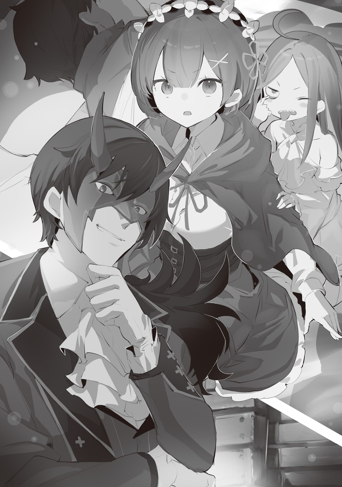

Как только его измазанные землей щеки вновь обрели пышную красноту, слабые вздохи юноши наконец-то превратились в нормальное дыхание.

Почувствовав облегчение и спокойствие, Рем осторожно высвободила его из своих объятий и вздохнула.

Рем: Первым делом…

Убедившись, что его жизни больше ничего не угрожает, она переключилась на вопрос о том, что с ним делать. В растерянности она его перевернула и положила его голову себе на колени, чтобы он отдохнул.

Часть ее чувствовала себя виноватой за то, что позволила кому-то с такими травмами лежать на земле со столь скудной растительностью.

Да, это все, что здесь есть. Ничего больше.

Рем: Почему, просто почему я оправдываюсь…

???: Аа…?

Когда Рем бормотала что-то себе под нос, искажая лицо в горькой гримасе, маленькая светловолосая девочка повернулась к ней и озадаченно наклонила голову.

Возможно, девочка почувствовала беспокойство, возможно, она ощутила тревогу, но Рем лишь покачала головой, чтобы отбросить собственные мысли, а затем обратила внимание на свое плечо. Этим теплом она спасла висевшую на волоске жизнь юноши.

Она мягко надавила рукой на собственное плечо и почувствовала устойчивый поток тепла.

Это было странное ощущение. Она чувствовала, что это не было для нее чем-то уникальным, а скорее тем, что она направляла изнутри. Ладонь маленькой девочки была не более чем проводником, катализатором.

????: ……Подумать только, ты способна использовать магию исцеления… Ему действительно дьявольски везет.

Как раз в тот момент, когда ей показалось, что она потеряла бдительность, неподалеку раздался чей-то голос.

Ее глаза метнулись туда, откуда он донесся, и она увидела человека — мужчину с черными волосами и пуританским лицом — стоящего с оскалом в глазах…… Он поддерживал юношу достаточно долго, чтобы тот выжил, и сказал, что она должна его спасти.

Рем почувствовала необходимость выразить свою благодарность, поскольку, как бы странно и досадно это для нее ни было, ей удалось спасти юношу благодаря ему.

И все же в его присутствии эта мысль испарилась из ее головы. Его взгляд был надменным, а тон — еще более надменным. Ей казалось, что он оценивает их, как товар на продажу.

Она тут же потянула девочку к себе и спрятала ее от его взгляда, используя свое тело.

Мужчина: Не бойся. Если бы у меня были злые намерения, я бы не привел сюда этого человека. Мое желание было простым — проследить, чтобы его усилия получили справедливое вознаграждение.

Рем: Усилия…? Справедливое вознаграждение…? Что…

Мужчина: Это ты.

Он оборвал настороженные вопросы Рем и заявил о себе.

Заметив, что Рем съежилась, он бесстрашно закрыл один глаз и снова заявил о себе.

Мужчина: Это вполне естественно. Цель этого человека была единственной и навеки верной. Она поистине не требует повторения. С самого начала и до конца он желал только твоей безопасности и душевного спокойствия, и ничего больше. Для достижения этой цели он готов был даже пойти на смерть.

Рем: ……Почему же так? Вы знаете? Вот почему ты… Ради меня… Зашел настолько далеко, что даже напал на тех людей.

Мужчина: ……Я не знаю.

Его короткие, ничего не значащие слова оборвали ее расспросы.

Помимо всего прочего, у этого человека, казалось, не было времени на проявление какого-либо внимания. Юноша, которому она с трудом доверяла, вульгарные солдаты и этот мужчина перед ней — все они дополняли образ «Амнезийной Рем» о представителях мужского пола; действительно, хотя ее выборка была слишком мала, она не могла не прийти к выводу о том, что мужчины равнозначны неприятностям.

И все же, не удостоив ее даже мыслью, мужчина посмотрел на юношу, лежащего на коленях Рем.

Мужчина: Меня не интересует происхождение его желаний. Я действовал в соответствии с собственными намерениями. Именно поэтому я сжег этот лагерь солдат дотла. И пока я это делал, я думал о том, как вознаградить этого клоуна. Таким образом, все пошло как по маслу. Такова истина вещей.

Рем: …………

Мужчина: Однако меня не интересует, как ты интерпретируешь мои слова.

Он пожал плечами, его глаза были безразличны ко всему, что могла бы сказать Рем, будто результаты этой конкретной тирады мало что для него значили. Он делал то, что хотел, и любые действия, предпринятые не в его интересах, были порождены его же прихотью. Однако сердце Рем еще не успело иссохнуть или зачерстветь настолько, чтобы быть неспособным оценить его окольную доброту.

Пока они разговаривали, от юноши, лежащего у нее на коленях, исходил отвратительный запах миазм, который держал ее в напряжении. Инстинкты кричали ей, чтобы она его остерегалась, независимо от его внешности или поведения.

Даже если такое поведение включало в себя риск своей жизнью, чтобы спасти ее из этого военного лагеря.

Рем: Я не… Я вас не понимаю.

Она продолжала что-то бормотать в его сторону, так и не добившись ни от кого прямого ответа.

Мужчина: ……Мизельда, я возвращаюсь в поселение. Уничтожай лагерь до тех пор, пока от него ничего не останется, и забери все, что сможешь использовать.

Мизельда: Поняла. Тебе больше не нужно скрывать свое лицо?

Мужчина: Конечно, есть свои минусы в том, что мое лицо может быть засвидетельствовано. На нашем митинге должна быть выставлена одна или две маски. Я возьму одну из них.

Мизельда: Прискорбно, но неизбежно…

Не обращая внимания на бормотание Рем, мужчина завязал разговор с красноволосой женщиной. При этом он повернулся спиной и начал уходить, однако лишь на мгновение он прервал свой шаг и оглянулся.

Мужчина: Ты. Что ты теперь будешь делать? Пойдешь со мной в поселение судракиек с этим глупцом на буксире? Или останешься здесь и умрешь? Выбирай.

Рем: ……Неужели у вас нет времени сформулировать это получше?

Мужчина: Нет. Мое время драгоценно и ограничено, и у него есть гораздо более важное применение.

По мере того, как он говорил шепотом, у Рем росла острая неприязнь к этому мужчине. Однако она придержала язык и, вместо того чтобы ответить огнем на огонь, лишь кивнула в знак согласия.

На этом она себя успокоила. ……Сейчас было не время проявлять упрямство. Даже если доверие к этим людям вокруг нее казалось тяжелой пилюлей, которую трудно было проглотить.

Рем: Никто, кроме меня, не сможет защитить эту девочку.

Вокруг нее были красные, горящие останки поля боя. Никого, кроме нее, для этой маленькой девочки не существовало, поэтому она решила сделать все, что в ее силах, с воспоминаниями или без них, еще крепче прижимая ее к себе.

Хотя это все еще вызывало недоумение, она нуждалась в руководстве этого человека, чтобы прийти к своему осознанию.

А этот юноша……

Рем: А ты, так мирно спящий… Я тебя ненавижу.

Раздраженная, она ущипнула его за нос.

Загорелые женщины…… «Судракийки» забрали Рем в свое поселение. Пейзаж там был удивительно странным. Повсюду, насколько хватало глаз, были женщины.

Конечно, предыдущий опыт общения Рем с большим количеством людей ограничивался имперским лагерем, в котором было полно мужчин. Теперь же в ее поле зрения не было ни одного мужчины. Мысль о том, что смешанное гендерное окружение — это редкость, начала укореняться в ее сознании.

Рем: Мужчины вашего племени сражаются в других местах?

Таритта: Хе? Нет, это просто обстоятельства… У судракиек рождается больше женщин, в то время как в Священной Армии рождается больше мужчин-воинов… Ах, сестра!

Мизельда: Таритта? Не раздражай меня из-за каждой мелочи. Ты — моя сестра, сестра вождя. Веди себя соответствующе.

Сестра вождя Судрак…… Таритта ответила на вопрос Рем, а затем позвала Мизельду.

Мизельда упрекнула Таритту, у которой волосы были выкрашены в синий цвет. Хотя она и чувствовала себя неловко из-за того, что, возможно, сделала что-то плохое Таритте, Мизельда решила не забывать об отказе от ее запроса.

Сейчас все вокруг выглядело новым и свежим, словно перед ней лежал открытый сундук с сокровищами.

За время пребывания в военном лагере она не понаслышке узнала, что не все были готовы отвечать на ее вопросы с юмором. В этом смысле женщины этого поселения были сравнительно добрее, хотя, справедливости ради, мужчина с повязкой на глазу из военного лагеря оказался более жестоким, чем ожидалось, так что сравнение, возможно, было не совсем оправданным.

Как бы то ни было, Рем наконец-то нашла место, где можно на время залечь на дно.

К счастью, Судрак, казалось, не собирался ни в чем ее ограничивать и даже предоставил ей лачугу для отдыха. Там она положила юношу на кровать, чтобы он отдохнул, и на какое-то время Рем решила спокойно обдумать свое положение.

Ей нужно было подумать о своем положении во всем этом, о том, что делать потом, решить, что делать с юношей и маленькой девочкой, и, и……

Девочка: Аа… уу аа……?

Рем: ……ах,

Глубоко задумавшись, она потирала брови, как вдруг почувствовала, что маленькая ручка потянула ее за рукав.

С тех пор как они прибыли в поселение, маленькая девочка тихонько следовала за ней по пятам. Хотя она стала более привязанной к Рем по сравнению с тем временем, когда они бегали по большим джунглям, тот факт, что она проявляла о ней заботу, ее обескуражил.

???: ……Похоже, даже эта девчонка понимает, что если ты попытаешься собрать все по кусочкам самостоятельно и наугад, то зайдешь в тупик.

Рем: Опять вы….

Когда девочка потянула ее за рукав, она услышала его голос. Не пытаясь скрыть недовольство на лице, она обернулась. У входа в лачугу стоял тот самый человек с черными волосами…… Хотя его нынешний вид оставил ее в оцепенении.

На нем была ужасная маска с красными и белыми полосами, отчего он выделялся как бельмо на глазу.

Несмотря на то, что его одежда также была мертвой уликой, она не могла скрыть его особенного присутствия, которое делало его таковым.

Девочка: Ууу…! Ууу…!

Рем: Что это за маска? Она ее пугает.

Мужчина: Видишь ли, я нахожусь в довольно шатком положении. В любом случае, ради Судрак, а также ради себя самого, я счел за лучшее скрыть свое лицо.

Он заговорил, положив руку на перекошенную от гнева маску, а затем невозмутимо вошел в лачугу. Рем попыталась дать понять, что ему здесь не рады, но, увы, он был не из тех, кто прислушивается к ее словам.

Поэтому Рем решила отбросить все притворства и говорить прямо.

Рем: Что именно вы собираетесь с ним делать?

Мужчина: Строго говоря, мы с этим человеком вместе не работаем. Так получилось, что в один прекрасный момент наши интересы совпали, и мы объединили усилия. Нет никакой гарантии, что так будет и в будущем.

Рем: …………

Мужчина: Он будет планировать, как избежать предстоящего конфликта. Он попробует от него убежать. Разумеется, он планирует взять тебя, вещь, с собой.

Втянув подбородок, Рем промолчала, несмотря на оскорбление.

Хотя ключевые слова «конфликт» и «убежать» вызвали у нее интерес, ее больше заинтересовала последняя часть его слов… То, что этот юноша, Нацуки Субару, попытается взять ее с собой. Это ее встревожило.

Правда заключалась в том, что густые миазмы, исходящие от него, обостряли чувства Рем и заставляли ее быть начеку. Тем не менее, ее первоначальная враждебность по отношению к нему начала угасать.

Оставался страх, что она пожалеет об этом, когда Субару проснется, но независимо от этого,

Рем: Вы продолжите сражаться бок о бок со здешними женщинами?

Мужчина: В этом и заключается все мое намерение. Я собираюсь сражаться до последнего вздоха. И эта борьба не закончится до тех пор, пока я буду дышать.

Рем: ……Я должна убежать от этого и спрятаться.

Мужчина: Я — сама война. Где ты намерена от меня спрятаться? Какая земля способна спрятать тебя от меня?

Очевидно, что в это верил только он сам, но этот человек обладал харизмой, присутствием, которое заставляло других воспринимать его понятия и представления как факт. Это было неотъемлемой частью того, кем он был.

Он был самой войной. Таким образом, это означало, что все в его присутствии будут обуглены, утонут в волнах огня войны, оставив после себя лишь пепел.

Рем: А если мне это не нравится, то я могу взять его и уйти…?

Мужчина: ……Нет. Это больше не вариант. Он вырвался из лап лагеря армии Священной Империи и пришел ко мне с желанием спасти тебя, и с того момента, как я решил проследить за исполнением этого желания, ты лишилась своего шанса избежать этого конфликта.

Рем: а……

Мужчина: Где бы ты ни была, как бы далеко ты ни убежала, пламя войны обязательно найдет тебя. Оно снова охватит, поглотит тебя. Твое желание или отвращение к этому не имеет значения.

Рем: Но это…! Это значит, что… Я ничего не могу сделать.

Он продолжает говорить, что все мои варианты ведут в тупик, но при этом сам выбор оставляет за мной. Неужели он получает от этого удовольствие? Этого не может быть. С какой стати он это делает?

Я не могу продолжать бороться, и выхода из этой борьбы тоже нет……

Девочка: ……ууу…!

Как раз в тот момент, когда Рем все дальше и дальше погружалась в яму мыслей, в которую сама себя загнала, маленькая тень прыгнула на мужчину.

Ее светлые волосы развевались в воздухе, маленькая девочка схватила мужчину за руку и застонала, стуча по ней кулачками. Ее удары не причиняли боли, но ее недовольство этим человеком стало достаточно очевидным.

Видя это, мужчина поднял руку, к которой все еще была прицеплена маленькая девочка, и,

Мужчина: Ребенок подражает своей компании. Если бы Сесилус был здесь, то ты бы пожалела о своих смелых и опрометчивых действиях.

Рем: ……Вы не будете на нее сердиться?

Мужчина: Ты намекаешь на то, что детская истерика может меня разозлить? Я могу поставить на место тех, кто меня не уважает, но ожидать, что простой ребенок поймет тонкости чести? Это глупо. Однако……

Когда он замолчал, его взгляд переместился на Рем и Субару. Она тут же обхватила свое тело руками и сузила на него глаза, как бы спрашивая: «К чему вы стремитесь?».

Рем: Что вы планируете…?

Мужчина: Схемы, скрытые планы, замыслы — не воспринимай их в плохом свете. Не каждый является протагонистом, как и не каждый является сценической декорацией, но истина в том, что те, кто не предпринимает действий, быстро теряют голову. Если ты не хочешь потерять свою, советую тебе продолжать ломать голову.

Рем: …………

Мужчина: Как я уже объяснял, как только этот человек проснется, он наверняка попытается убежать от моего конфликта и забрать тебя с собой. Однако Империи уже стало известно о вашем существовании. У вас больше нет средств, чтобы пробраться через надлежащие каналы.

Его слова холодным лезвием вонзились глубоко ей в грудь.

В них чувствовалась яростная враждебность. Они почти затуманили ее глаза, но это были конкретные слова. У Рем не было возможности их опровергнуть.

……Даже она не могла забыть тот адский пейзаж.

В том лагере погибло много людей. Империя, несомненно, будет мстить. Они наверняка обнажат клыки перед Рем и ее компанией, виновниками той трагедии.

Для этого существовала только одна причина……

Мужчина: Конечно, мне не нужно указывать на эту причину.

Рем: ……То, как вы выразились, не уступает тому, чтобы указать мне на это в лицо.

Она огрызнулась, но даже если Рем была неспособна разглядеть лицо за маской, она знала, что ее слова прозвучали неубедительно.

Маленькая девочка вернулась, вдоволь наигравшись с рукой мужчины, и прижалась к Рем. Ее поднятые вверх глаза смотрели на нее с беспокойством, на что она ответила легкой улыбкой на своем лице и нежным вздохом.

Затем она посмотрела прямо на мужчину и заговорила,

Рем: Скажите мне, что я должна… Что мы должны сделать. Пожалуйста.

Мужчина: Значит, ты искренне просишь совета. Имей в виду, что моя цель — только победа. Каждый мой ход делается исключительно для того, чтобы продвинуться вперед к победе. Таким образом, ты и тебе подобные могут оказаться не там, где хотят.

Рем: Я полностью это понимаю. Однако в данный момент нам не хватает средств, чтобы отличить хорошее от плохого. Возможно, такая формулировка покажется вам невежливой, но на данный момент вы как моя лакмусовая бумажка.

Мужчина: Хо?

Она заговорила, осторожно укладывая маленькую девочку рядом с Субару, когда мужчина рассмеялся в ответ.

Выражение его лица было скрыто за маской, поэтому Рем не знала, какие намерения несет его голос, но, несмотря на это, она решила продолжить свою игру. Если бы он был нетерпим к такому проявлению и впал бы в гнев, ее целью было бы начать все с чистого листа.

Однако если бы он оказался более открытым и проявил великодушие, все было бы по-другому……

Мужчина: ……Очень хорошо. Я приму твое пари.

Рем: ……Большое спасибо.

Мужчина: С самого начала, ты, я и в том числе Нацуки Субару, который спит позади тебя, даже если мы разыгрываем карты в меру наших возможностей, мы должны выигрывать ставки, чтобы двигаться вперед. Сейчас не время быть экономными.

Рем вздохнула, ее победа была сладкой от мужчины, который отказывался делать даже самые простые комплименты.

Если именно Субару первым вступил в азартную игру, чтобы вернуть себе свою особу, тогда он, Рем, маленькая девочка и мужчина в маске — все они должны продолжить эту серию ставок.

Она тайком сжала кулак, отметив, что начало было хорошим……

Мужчина: Первым делом. Этот человек попытается взять тебя и убежать от моей войны. Однако с первой же попытки, находясь в городе, он потерпит неудачу. Пускай. Он должен учиться и смотреть в лицо реальности. Иначе он не сможет встать на ноги. И по этой причине……

Пока Рем укрепляла свою решимость, мужчина начал говорить о своих планах, о своих руководящих принципах.

Что Рем должна делать после пробуждения Субару. Чего он от нее хочет и какой должна быть ее цель…… Однако она не собиралась быть куклой, которая будет только кивать и соглашаться. Впрочем, возможно, мужчина уже принял это во внимание.

Рем: Я тоже не могу позволить всему закончиться, так ничего и не выяснив.

И вот, чтобы восстать и сразиться с множеством окружающих ее тайн, с маленькой девочкой, у которой не было никого, кроме нее, и с юношей, от которого разило злом в ее объятиях, Рем начала ломать голову.

《Конец》
