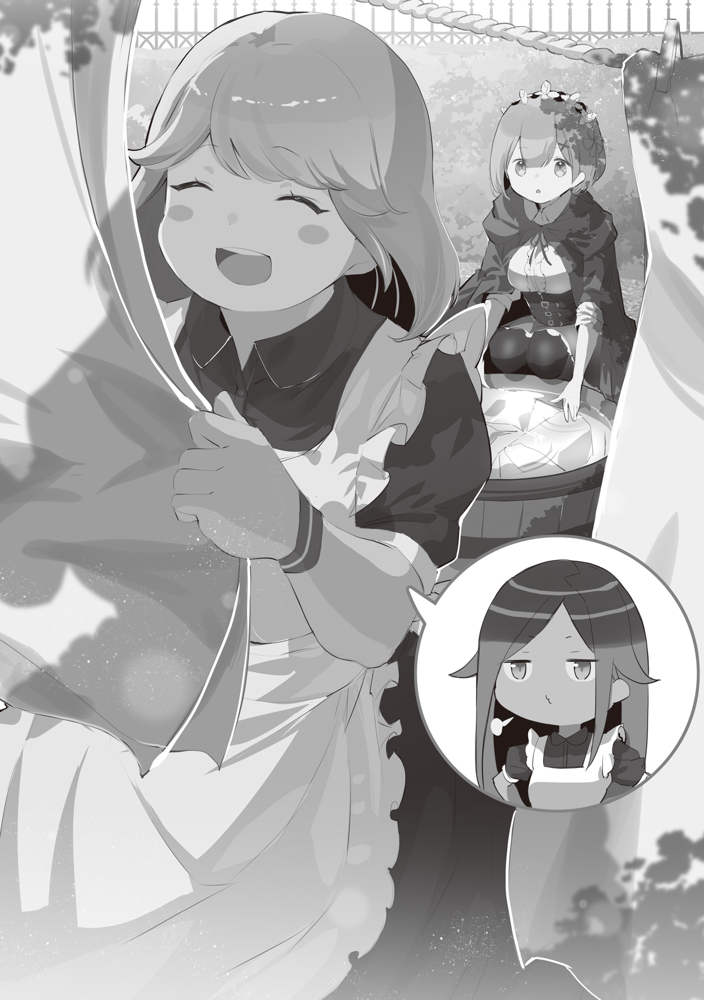

— Сестры-души, значит?

Услышав незнакомое ей словосочетание, Рем бросила недоуменный взгляд.

Они были в саду самого большого особняка в Городе-крепости Гуарал. У колодца в заднем саду они стирали одежду и бинты. Недавно произошел переполох, который, хоть и был незначительным, оставил несколько раненых. Поэтому нелишним было иметь как можно больше запасных бинтов. К тому же это была своего рода подготовка к будущему. Разумеется, для Рем было бы лучше, если бы их вообще не пришлось использовать.

В любом случае……,

— Вот так, агась~. Мы с Куной и есть эти самые «Сестры-души», агась~.

Смеясь широкой улыбкой, Хоули, стоявшая рядом с Рем, пока та стирала белье, развешивала только что выстиранную одежду на веревке. Эта девушка, которая была на целую голову выше Рем, вопреки своей беззаботной манере говорить, споро развешивала белье.

И хотя она в какой-то степени привыкла пользоваться своей тростью, если сравнивать Рем, у которой были проблемы с ногами, с Хоули — это была разница как небо и земля. Это была Хоули — с желтыми кончиками волос и здоровой смуглой кожей. Рем также отметила про себя, что время, проведенное ими вместе, кажется довольно долгим — исходя из ее собственного восприятия жизни.

Тем не менее, было еще много чего, чего Рем о ней не знала.

— Хоули-сан, кажется, вы очень хорошо справляетесь со стиркой.

— Эхехе, засмущала меня, агась~. По правде говоря, сначала у меня была роль не охотника, а стража, потому я так хорошо справляюсь с этим.

— Страж, значит?

Хоть она и понимала значение этого слова, у нее не было ни малейшего представления о том, какие конкретные обязанности оно подразумевает, исходя из ее ответа.

По ходу разговора она поняла, что стражи и охотники — это связанные понятия, но в ее скудных знаниях не укладывалось, чтобы эти два понятия были как-то связаны.

Потому Рем и нахмурила брови.

— Что делаете?.. Рем в смятении, да?

— А, это Куна~, — окликнула Хоули девочку, махнув увесистой рукой.

Стоило Хоули заметить появление совершенно бесшумно появившейся худой фигурки, ступившей на лужайку сада, глаза ее сверкнули. В ответ Куна, у которой кончики волос были зеленого цвета, лишь пожала плечами. В отличие от Хоули, обладавшей широкими глазами, у девочки глаза были похожие на острые щелки. Этими же глазами она сначала взглянула на стиравшую белье Рем, а затем на развешивавшую его Хоули.

— Рем, звания вроде страж и охотник — это, на самом деле, так у нас, у Судрак, заведено. Поэтому ты не сможешь найти ответ, как бы сильно ты ни ломала себе голову.

— Понятно, вот как оно… Что они означают?

— То, что ты без колебаний так спрашиваешь, — это еще одна твоя хорошая сторона, Рем.

— ……?

Прищурившись, Рем вопросительно склонила голову и взглянула на почесывающую щеку Куну. Позади нее Хоули тоже склонила голову точно так же, ворча: «Ты говоришь такие сложные вещи, Куна».

Вздохнув от разочарования из-за их реакции, Куна подняла палец и сказала: «Слушайте».

— Мне, конечно, без разницы, но традиции — это то, что напрямую связано с чьей-то гордостью. Даже если стремиться узнать что-то из неведения — это хорошо, есть люди, которые считают прямой вопрос грубым.

— За это… прошу прощения; я не подумала как следует.

Услышав предостережение от Куны, которая немного понизила тон, Рем покорно склонила голову. Отмахнуться от слов Куны как от преувеличения было бы просто. Однако Рем, знавшая мир в той же степени, что и младенец, не имела никаких оснований заявлять, что что-то является «Преувеличением».

Приняв эти слова близко к сердцу, Рем глубоко укорила себя.

— Так что же это означает?

— ……Ты послушала, что я только что сказала?

— Конечно. Но, если я уже один раз спросила……

Словно прося оставить размышления на потом, она приготовилась продолжить расспросы прямо здесь. В знак признания поражения Куна подняла обе руки перед напором любопытства Рем, проговорив: «Ладно, ладно».

— Нет смысла скрывать, так уж и быть, расскажу… Страж — это тот, чья роль заключается в защите деревни и воспитании детей, пока охотники в отъезде.

— Защищать деревню и воспитывать детей… вот как? Это великолепная работа.

— Это работа для тех, кто остался.

Рем была очень довольна, услышав объяснение про стражей; однако ответ был горьким. Отводя глаза, Куна поджала губы. Тогда, в ответ на ее попытку заставить Рем увидеть только худшую сторону……,

— Вот же~, Куна, если ты будешь так говорить, ты смутишь Рем~.

— А, нет, если это я спросила что-то неуместное, то……

— Нет, вовсе нет~. Тебе не за что извиняться~. Просто Куна очень восхищается работой охотника, поэтому ей не нравится долг стража~.

Смеясь над растерянной Рем, Хоули схватила Куну за плечи и потрясла ее. С их-то разницей в телосложении, Куну трясло, как деревья на штормовом ветру.

И затем, пока Хоули трясла Куну……,

— Мы с Куной, в итоге, сменили роли на охотников на полпути~. Потому что мы придумали, как выполнять этот долг: Куна будет глазами, а я — стрелять из лука~.

— Глаза и лук…… Теперь, когда вы об этом сказали, вы вдвоем ходили на охоту.

Ранее, когда они путешествовали из поселения Судрак в Гуарал, эти двое сопровождали Рем в качестве ее телохранителей. В пути именно они охотились на добычу и добывали провизию. Даже тогда, хоть они и казались странной парой, их мастерство в стрельбе из лука произвело на Рем впечатление.

— А потом мы обе стали охотницами. Это и вот это тоже — символ нашей связи как сестер-души~.

— ……Говорю же, в этом нет ничего настолько уж сумасшедшего.

Щеки Куны слегка порозовели от смущения из-за откровенной улыбки Хоули. Глядя на это, Рем начала с «Кстати».

— Я забыла спросить до этого, но эм, что такое «Сестры-души»?

«Души» и «Сестры» — это не то же самое, что «Охотники» и «Стражи», но это тоже было многозначное сочетание. Хотя по их тону она могла догадаться, что это используется для описания Куны и Хоули.

— Думаю, это очень ценное слово и взаимоотношения, но каков его реальный смысл?

— Ты, почему ты минуту назад строила такую смирную гримасу……

— Разве, я была не права?

Находясь под пристальным взглядом Куны, полным упрека, Рем с опаской искала ответы. Как она и сказала, было правдой, что минуту назад она размышляла, но не могла остановить свою интеллектуальную любознательность. Куна скривила недовольное лицо в ответ на умоляющий взгляд Рем, но……,

— «Сестры-души» — это малыши Судрак, которые родились в один день~. Агась~.

— Ах! Хоули, черт тебя побери!

— Вот же~, это не то, что нужно скрывать и дразнить ее этим~. Говорю же, не страшно рассказать ей об этом~.

Раздув свои круглые щеки, ответившая за Куну Хоули выпятила грудь. Однако Куна ткнула в эти надутые щеки Хоули……,

— Не неси чепуху. Если рядом мы, то я не против, но что будет, если Рем сделает то же самое с кем-то, кто не из нас? Они ведь могут разозлиться, нет?

— Тогда, когда придет время, мы просто должны защитить Рем от этого разозленного человека!

— Мы же не всегда будем с ней!

— П-пожалуйста, не ссорьтесь из-за меня!

В панике от начавшейся перепалки между ними Рем вмешалась, чтобы примирить их. Встав с помощью трости, она буквально вклинилась между двумя.

— Забота Хоули и беспокойство Куны — и то, и другое мне приятно. Но я не хочу, чтобы вы ссорились. Вы же сестры-души, разве нет?

— М-м-м……

— Все верно~.

Видимо, ее взгляд оказался проницательным, так как обе успокоились, когда она упомянула «Сестер-души». Будь то для Судрак или для них двоих, это, возможно, несло одинаковый смысл, но казалось, что эта фраза считалась весьма важной, и ею нужно было пользоваться с большой осторожностью.

Увидев отношения между ними, Рем вдруг пришла к выводу.

— Я завидую вашим отношениям.

— Что такое?

— Сестры-души…… Наверняка, это про сестер, которым не нужно кровное родство, да? И вы вдвоем так хорошо ладите, и даже охотитесь вместе.

Поддерживая друг друга, они построили незаменимые отношения.

Для Рем, у которой не было опоры, это казалось чем-то светлым, чем-то очень завистливым. Особенно потому, что она испытывала огромное чувство к звучанию фразы «Сестры-души».

— У меня, вроде бы, тоже есть старшая сестра. Старшая сестра-близнец, как я слышала.

— У Рем есть старшая сестра~?

— Да. Но так сказал тот человек, я этого не помню, поэтому верю лишь наполовину…… — оговорилась Рем.

Хоть она и продолжала так оговариваться, на самом деле она не сомневалась в существовании своей сестры. Тем не менее, неподтвержденное существование ее сестры, в конце концов, оставляло у Рем ощущение эмоционально сложного бремени.

Однако, неопределенным существованием была именно текущая Рем. В своем нынешнем состоянии, когда ею манипулировали каждое действие и каждое слово Субару, что, если бы она вдруг встретила свою настоящую сестру?

— Нынешняя я не смогла бы посмотреть в глаза даже родной сестре с чистым сердцем. Поэтому я вам завидую: связь у вас не кровная.

— Рем……

Когда Рем выразила вслух свои мысли, Хоули запаниковала и стала махать руками вверх-вниз. Ее реакция означала, что она не знала, что хочет сказать, и что будет уместно сказать.

Понимая, что она смутила добросердечную Хоули, Рем попыталась сказать ей что-то, когда……,

— ……Я думаю, тебе не стоит быть такой пессимистичной насчет этого, — заявила Куна, на что в ответ Рем моргнула глазами, произнеся «Э-э…».

— Вы сестры, и к тому же близнецы, да? Будь то близнецы или тройняшки, связь между сестрами, рожденными из одной утробы, довольно сильна, как оказалось. Из того, что я слышала, судракийский термин «Сестры-души» взят из этой связи.

— О-о-о! Это правда~!? Я совсем не знала~! — Куна приложила руку ко рту.

— Это просто то, что я слышала, ясно?

Изначально, когда в поселении Судрак рождались близнецы или больше детей, подтверждалось, что между ними существует особая связь. Искаженная течением времени, переданная легенда рассказывала об особой связи между «Близнецами души» — детьми, рожденными в один день.

— Короче говоря, «Сестры-души» — всё это выдумка.

— Ну~! Куна, ты опять за своё с этими формулировками~! Куна, я уже реально начну верить, что ты ненавидишь быть сестрой-души со мной~!

Куна лишь пожала плечами в ответ Хоули, которая выражала своё недовольство, тряся обеими руками. Наблюдая за ними двумя, Рем посмотрела себе на грудь, вспомнив их прежние слова. В глубине её тихо бьющегося сердца ощущалось очень слабое покалывание.

«Что это было? — спрашивала она себя. — Этот дискомфорт и чувство отчуждённости…»

— Моя связь, с моей кровной сестрой……

— Допустим, если ты помолишься, попробуешь пожелать этого, тогда, возможно, ты сможешь это почувствовать. Если ты хочешь вспомнить то, что забыла, это тоже может быть один из способов.

Как будто догадываясь о смятении Рем, Куна сказала это наперёд.

Кратковременное колебание. Однако, она всё же желала узнать истинную форму этого дискомфорта, и потому Рем поддалась этому ощущению. Она закрыла глаза, ища ответ в этом тепле в темноте.

— ……Ах.

……Она почувствовала, как будто могла ощутить слабый, светло-розовый теплеющий свет в близком, но далёком месте.

— Что-то почувствовала~? Если да, то это потрясающе~!

— Не могу почувствовать очень отчётливо…… Но почувствовала, будто оно есть. Это, связь?

Она снова почувствовала, что прикоснулась к части своей связи с той невидимой кем-то, с ещё не известной ей сестрой. Насколько бы ненадёжным ни было это ощущение, и, хотя оно, несомненно, давало ей почувствовать, что оно существует, но пропасть была такая, словно она это чувство не могла как-либо приблизить, усилить.

Нынешняя Рем никак не сможет преодолеть эту огромную пропасть.

Но……,

— Я очень, очень сильно это почувствовала. Нечто, что ощущается куда более надёжным, чем тот человек……

— ……У Субару просто дел по горло.

— И он так сильно старается ради Рем тоже; Субару такой жалкий~.

Услышав слова Рем, которая слегка пожаловалась, Куна и Хоули заняли более просубарскую позицию.

Конечно, не было необходимости приводить его в пример, и Рем тоже поразмыслила над этим моментом. Однако именно Субару первым рассказал о её сестре ментально нестабильной Рем. У самого него не было каких-то плохих намерений, и даже заранее сказал: «Прости» перед тем, как поведать ей, но даже тогда душевное смятение Рем было очень трудно воспринимаемо для других.

Его невнимательность к таким вещам и делает Субару собой.

— Хватит о нем. Мы отклонились от темы.

— Но ведь это ты сама первой начала разговор про Субару……

— Это неправда…… Ведь неправда, да?

Рефлекторно ответив, она тут же потеряла уверенность в собственном заявлении. К тому же, если это было бы правдой, ей было бы немного неловко из-за того, что Субару всегда занимал уголок в её сознании.

Она осталась в Гуарале вдали от него ради собственной независимости, поскольку он пытался оставаться рядом с ней. А также потому, что Присцилла косвенно велела ей пересмотреть саму себя.

— ……Поняла. Давайте займемся стиркой на свежую голову.

— Когда ты говоришь про «свежую голову», разве ты не теряешь эту же «свежую голову»?

— Ну~! Не говори раньше времени~!

Уважив Рем, Хоули, надув щёки, крепко обняла Куну. Зарывшись в её груди из-за разницы в размере, Куна издала звук «Мгх».

Хоули ухмыльнулась:

— Я тоже продолжу помогать Рем~! Я так давно стиркой не занималась, и это довольно весело, так что присоединяйся, Куна~!

— Что? Почему я должна присоединяться к вам?..

— Но, Куна, я же присоединилась к тебе, когда ты сказала, что хочешь пойти на охоту вместе~!

— Ух…… ггх.

Как будто именно это было её болевой точкой, контраргумент Хоули заставил Куну замереть.

Неизвестно почему, но Рем почувствовала, что увидела неожиданное распределение власти между ними, и издала тихий смешок. А ведь ей казалось, что Куна взяла на себя лидерство, в то время как Хоули просто следовала за ней.

— Похоже, Хоули больше похожа на старшую сестру, чем Куна.

— Ага, ага, Рем поняла~! Это же я родилась первой~. агась~.

— Разница всего-то в какие-то десятки секунд, да!? Ну уж нет, поэтому мы это решать не будем!

Скрипнув зубами, Куна вырвалась из объятий Хоули и повернулась к Рем спиной. Глядя на бельё, которое они стирали в колодезной воде, что они держали в руках, она вздохнула.

Куна не довольствовалась по поводу роли стража и решила стать охотником вместе со своей сестрой-души. Несомненно, эта работа была для нее неохотной……,

— Ладно, будь по-твоему, я помогу.

Возможно, из-за уважения к Рем, которая торопилась закончить работу, или потому, что её сестра-души попросила её с весёлой улыбкой, Куна так отрывисто предложила помощь.

Рем засмеялась в ответ на её поведение:

— Да, ваша помощь не помешает; мы должны вовремя подготовить ванну, иначе Присцилла на меня разозлится.

— ……Кажется, тебе тяжело приходится.

— После таких-то слов мы тебе помочь обязаны~!

Возможно, потому, что тирания Присциллы была хорошо известна, Рем глубоко почувствовала доброту Куны и Хоули.

Горько смеясь над этой правдой, Рем приступила к завершению оставшейся стирки, с которой ей помогали две сестры, которые, хотя и не были кровными родственницами, были по-настоящему связаны душами.

Пока она этим занималась, в её голову на мгновение закралось смятение, которое всё ещё чувствовала в глубине души.

И это был……,

— Интересно, какой сестрой я была?

……вопрос, что она задала своей не виденной старшей сестре, ответ на который она не получит.

《Конец》
