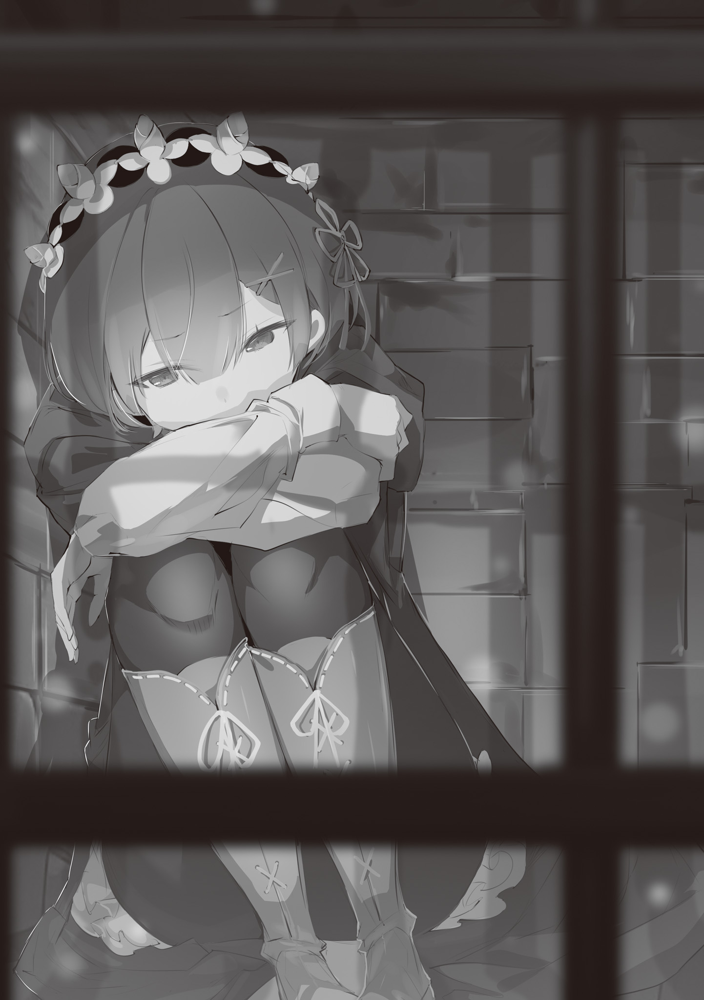

…«Рем», девушка, которую так назвали, сейчас пребывала в замешательстве и в смятении.

— ……

Она попыталась сжать железные прутья перед своими глазами, прилагая к этому все свои силы. Однако ей не удалось заставить железную клетку ни скрипнуть, ни погнуться.

Впрочем, она бы всё равно не смогла придумать, как спастись, даже если бы ей удалось согнуть прутья.

В этом месте было достаточно людей, чтобы назвать его лагерем, и с учётом того, что каждый из них обладал соответствующей военной силой, она не могла просто застать их врасплох.

Не говоря уже о том, что она не могла приложить никаких сил к своей нижней половине.

Она не могла вот так ускользнуть от их глаз и искать ту, от которой её отделили… ту девочку.

— Мои ноги не похожи на парализованные.

Рем пробормотала это, опуская свои бёдра на холодный пол железной клетки и потирая собственные ноги.

Дотрагиваясь до них руками, она всё ещё ощущала прикосновения. Поскольку она также чувствовала боль, когда пыталась ущипнуть их, это не означало, что её ноги были парализованы.

Просто ей было трудно передать волю, чтобы двигать ногами, можно даже сказать, что они медленно реагировали.

Так было и в лесу; ей приходилось хвататься за что-то, чтобы заставить себя встать. Она думала, что если бы у неё было что-то вроде трости, то она смогла бы начать нормально ходить, если бы ей дали немного времени.

Правда, не всегда под рукой будут стены или трость, за которые можно ухватиться. Её перспективы были мрачными. Смогут ли её ноги когда-нибудь снова двигаться нормально? Или она останется такой навсегда, или что ещё хуже…

— Нехорошо, нехорошо. Я слишком много думаю о плохом.

Отмахнувшись от предыдущих плохих мыслей, Рем покачала головой из стороны в сторону, и сама себя осудила.

По правде говоря, хотя она и находилась в ситуации, когда у неё не было никаких оснований для позитивного настроя, когда уже всё было сказано и сделано, она не должна решать, насколько плохим будет будущее, которое ещё не наступило.

Если смотреть на вещи с горечью и тревогой, то реальное будущее может оказаться в мрачной тени.

Такова истина, которую Рем усвоила за этот небольшой промежуток времени, прошедший с тех пор, как она очнулась, потеряв «Воспоминания».

— И этот человек преследовал нас, куда бы мы ни пошли.

Говоря это, Рем вспомнила черноволосого юношу со злым взглядом. Его голос, который, можно сказать, уговаривал её, а также его отношение и манера поведения, как будто он успокаивал её, были подозрительно холодными, но причина, по которой Рем крайне подозрительно относилась к нему, заключалась в том, что от него исходило зловоние.

Не преувеличивая, она могла утверждать, что вонь была зловещей, от неё воротило нос… Настолько невероятной, что человек, о котором шла речь, казалось, даже не осознавал этого, но Рем инстинктивно отвергала его.

Проще говоря, когда эта вонь витала вокруг него, ни одно слово, исходящее от того юноши, не доходило до сердца Рем. Как будто кто-то поверит словам монстра, с головы до пят покрытого запахом кровавого убийства, который говорит: — Я не опасен.

Как показалось Рем, в качестве крайнего примера можно привести внешность и манеру поведения этого юноши.

— Нацуки Субару…

Она снова и снова пыталась произнести это имя, которым юноша именовал себя. Её странно беспокоило чувство, которое вызывает это имя. Из небольшого багажа знаний Рем, она не могла точно определить, где имя, а где фамилия.

Поскольку больше никто не называл его по имени, даже это было двусмысленно для Рем.

— ……

Прислонившись спиной к стенам клетки, Рем наблюдала за окружающей обстановкой, глубоко вздохнув.

Во-первых, место, где находилась Рем, было военным лагерем. Поскольку здесь был поднят единый флаг, это, вероятно, указывало на принадлежность к какой-то стране или организации.

В лагере только мужчин было около сотни, это можно предположить по количеству палаток, но она считала, что не могла сильно ошибаться. Их боевая мощь должна была быть примерно такой, как и ожидается.

Хотя люди, которых Рем отправила в нокаут, когда очнулась на берегу реки, были не очень сильны.

— За исключением того человека с повязкой на глазу.

Их было не больше десяти, но человек с повязкой на глазу, который командовал ими, был очень силён. Конечно, Рем не могла шевелить ногами, и её состояние было не самым лучшим, но даже если бы она была в идеальном положении, она не уверена, что смогла бы противостоять ему.

В итоге Рем бесцеремонно прижали к земле, притащили в лагерь вместе с девочкой и Субару, и вот так просто взяли в плен. После этого, независимо от того, пришли ли они к выводу, что она не будет разговаривать, или сочли её опасной личностью, её посадили в клетку. Сейчас её разлучили с Субару и той девочкой.

Как и ожидалось, она беспокоилась об их безопасности, в особенности о девочке. Её голова была ранена и кровоточила, поэтому она волновалась, оказали ли ей надлежащую первую помощь. Что касается Субару, то с ним всё в порядке.

В том, что он находился в этом же лагере, она не сомневалась, поскольку его запах ощущался даже на расстоянии.

— …В конце концов, кто я, где я, и что мне вообще делать?

Даже раздумывая о том, о сём и о многом другом, подозрения Рем упирались в тупик. Это очевидная вещь… Заботиться о том, что перед тобой, есть привилегия только тех, у кого достаточно сил, чтобы остановиться и посмотреть на то, что перед ними.

В этом смысле у Рем даже не было должной подготовки, чтобы приступить к решению проблемы.

— Рем……

Вот так, она снова попыталась произнести своё имя… Нет, это слово. Бесчисленное количество раз Нацуки Субару называл её так. К сожалению, не похоже, что найдётся кто-то, кто знает её, кроме него. Жестокие люди в этом лагере, и, конечно, та девочка, с которой она была, не были особо разговорчивыми.

Поэтому, всё, что она может о себе сказать, это имя «Рем», которым её назвали, и чувство отвращения к вони, окутывающей Нацуки Субару, которое исходило из глубин её инстинктов.

— В настоящий момент отбросим имя Рем. Оно мне не подходит.

Она надеялась, что со временем, может быть, при случайной встрече, её воспоминания могут резко вернуться.

Похоже, что в её случае, даже встретив людей, с которыми она была как-то связана, и своё собственное имя, она не могла ожидать такого драматического возвращения.

Хотя, она определённо много думала о возможности того, что имя «Рем» принадлежало кому-то, к кому она не имела абсолютно никакого отношения, и что Нацуки Субару — абсолютный изверг, как и указывал окутывающий его злой смрад.

Точно, вероятность того, что Нацуки Субару — абсолютный изверг, была высока.

И всё же…

— Почему…

На травяном лугу, в лесу, на краю обрыва перед прыжком в реку — во всех этих местах лицо и голос Нацуки Субару, помнящего их отчаянное положение, заставляют сердце Рем ужасно щемиться.

Не было смысла верить, она могла выбросить те неосторожные слова, которые ей было невыносимо слушать.

И всё же, почему его голос и слова, а также ощущение его объятий всё ещё не покинули её.

— …Потому что этот человек продолжал вести себя так, будто знает меня.

Для Рем, которой не за что было зацепиться, это была связь, которая заставила её подумать, что она не знает, когда нужно расстаться. Рем осудила себя и снова крепко ухватилась за железные прутья, прилагая все силы.

В безопасности ли девочка? Что делает Нацуки Субару? Эти смутные мысли были единственным, в чём была уверена её пустая и неуверенная сущность.

— ….! Постойте! Что вы собираетесь делать с этим человеком!?

Когда она попыталась остановить мужчин, уводящих Нацуки Субару, её просьба была отклонена.

Застряв в железной клетке, она не могла даже высказать своё мнение по этому поводу. Просто, видя, как Нацуки Субару уводят, в груди Рем заклокотало праведное негодование.

…Нацуки Субару был в ужасном состоянии.

Бег по лесу, по уши в грязи, преследования со стороны охотника и гигантской змеи, наконец, едва пережитый прыжок в реку — само собой разумеется, что он был в ужасном состоянии. Однако, увидев его снова после разлуки, можно было заметить, что синяки на его теле и раны на плечах в какой-то момент увеличились.

Пальцы на левой руке, которые сломала Рем, явно причиняли ему боль. Однако по тому, как его другим ранам не была оказана должная помощь, было ясно, что уход за ним был не самым лучшим.

— Разве это не похоже на то, что он такой же раб…?

Смотреть на Нацуки Субару со скованными руками, окружённого внушительными мужчинами, в таком уязвимом состоянии было нелегко. Даже Рем, у которой сложилось не очень хорошее впечатление о нём, не могла не возразить против его такого жалкого состояния.

Несмотря на то, что, пока он был вне её поля зрения, от него всё сильнее и сильнее исходил дурной запах.

— Что они собираются делать с этим человеком, да и с девочкой тоже…?

При этих мыслях в груди Рем зародилось беспокойство. Её отношения с мужчинами в лагере, с самого начала обернувшиеся в худшую сторону, определённо не могли быть названы лучшими.

Даже желая, чтобы они обращались с ней по-джентльменски, можно было сказать, что это очень удобно.

— Если бы дело дошло до этого…

Она подумала, что в тот момент ей лучше смело покончить с собой.

Если она будет опозорена, оставаясь в неведении, будет гораздо лучше выбрать смерть, по-прежнему не имея никаких привязанностей. Смерть перед позором — эта мысль казалась ей очевидной.

Если это был голос её внутреннего «я», то она должна была быть такой и до потери воспоминаний. В таком случае, даже если бы у неё была хоть капля веры, она бы пошла и пересекла реку смерти…

— «…Я представляю, что у тебя опять возникнут подозрения, как только я скажу такие вещи, но я был бы просто доволен тем, что ты здесь со мной. Дыши, разговаривай, оглядывая окрестности своими глазами; я был бы доволен только этим».

— ……

И снова голос Нацуки Субару эхом отозвался в голове Рем.

Она собиралась принять самоубийство как нечто естественное, и, тем не менее, его слова прозвучали напрямую, чтобы заставить Рем принять решение. Дерзко, и так беззаботно.

Кем, чёрт возьми, он себя возомнил? Её гнев против этого человека, которого уводили, усилился.

Вот так, словно она действовала именно в соответствии с его желаниями. Возможно, он сказал ей эти слова, чтобы остановить её, если Рем когда-нибудь решит выбрать смерть.

Это могли сделать только те, кто обладал силой, превосходящей человеческое понимание.

Откуда у этого тощего бессильного юноши такая сила?

— Нелепо…

Закрыв глаза, она попыталась выбросить эту мысль из головы. Однако, сколько бы она ни пыталась избавиться от неё или отмахнуться, она не исчезала.

Потому что внутри её пустого «я», которое не просыпалось даже полдня с тех пор, как она потеряла свои воспоминания, был только этот юноша, Нацуки Субару.

Хочет она того или нет, но если ей необходимо взглянуть на себя со стороны, у неё нет другого выбора, кроме как встретиться лицом к лицу с Нацуки Субару.

Всё больше и больше это заставляло Рем страдать, так что вместо этого…

— Может быть, мне стоит сломать пальцы на его правой руке.

Подумав так, Рем закрыла глаза, подтянув ноги поближе.

Она забыла о том, что всего мгновение назад собиралась смело покончить жизнь самоубийством, и вместо этого, закрыв глаза, смело признала дискомфорт, который она испытывала по отношению к Нацуки Субару и который невозможно было выразить словами. Как только Нацуки Субару вернётся, она снова столкнётся со своими проблемами. Поэтому, по крайней мере, сейчас, сохраняя спокойствие, она оставит свои проблемы на потом.

……Однако Нацуки Субару не вернулся и через полдня.

Более того, люди, которые забрали Нацуки Субару… двое по имени Тодд и Джамал исчезли в лесу с примерно двадцатью мужчинами.

И хотя это было результатом того, что она собрала воедино подслушанное, когда лагерь внезапно разбушевался, она полагала, что по большей части не ошиблась.

— Уау?

— Да, всё в порядке. Тебе не о чем беспокоиться, так что просто сиди тихо, пожалуйста.

Возможно, заметив, что атмосфера вокруг неё наполняется трепетом, девочка, положившая голову на колени Рем, застонала. К счастью, похоже, мужчины оказались не такими уж бесчеловечными: девочка, с которой её разлучили, получила надлежащее лечение раны на лбу и была доставлена обратно к Рем.

Тем не менее, их отношение к ней не изменилось, и они по-прежнему оставались в тюрьме, так что сомнительно, что это можно было назвать джентльменским подходом. Хотя, даже такой подход мог оказаться куда более жестким.

— ……

Успокаивая девочку, она тихонько подбадривала себя.

Если что-то случится, и она не сможет действовать быстро, то окажется в полной растерянности. Она инстинктивно понимала, что такой менталитет безошибочно необходим для выживания.

В таком случае, в этой мысли Рем была доля истины, но вместе с тем в ней была и бессмысленность.

— Это…

Сначала Рем почувствовала слабый, неприятный запах. Он отличался от того, который она почувствовала от Субару, но всё же это был запах зла. Это был запах крови, к которому она совершенно не хотела привыкать.

Более того, пролилось немалое количество, а довольно много. Сильная вонь жизни и смерти. Она уже собиралась обратить на это внимание окружающих, но движения другой стороны были намного быстрее. Как будто они были совершенно не в её лиге, это была идеальная «засада».

— …Гааах!

Раздался голос, похожий на крик, и в следующее мгновение он разнёсся по округе. Лагерь превратился в столпотворение, предсмертные муки людей раздавались повсюду.

— Что… Что происходит!?

— Ааа-ааа!!!

Очнувшись в объятиях потрясённой Рем, девочка начала плакать, закрыв лицо руками. Она чувствовала, что это не пустяк. Глядя на реакцию девочки, Рем решила начать действовать так, как решила… Она ухватилась за прут клетки, который принимал нагрузку за нагрузкой, вложила в него всю силу своего тела и с силой оторвала его.

— Мы не можем здесь оставаться. Ты можешь пойти со мной?

Используя оторванный прут как трость, Рем потянула плачущую девочку за руку. Та не перестала плакать и не реагировала, но и не отмахнулась от руки Рем.

Вот и хорошо. Если бы она прямо сейчас убежала, Рем не смогла бы за ней угнаться. Пламя уже охватило все места в лагере, что свидетельствовало о хаосе и сражении.

Поэтому Рем нужно было выбирать только собственную безопасность и ничего больше…

— …Я нашла тебя, да~. Несомненно, эта девушка — та, которую я искала~.

Когда Рем уже собиралась забрать девочку и покинуть это поле боя, беззаботный женский голос ударил по её барабанным перепонкам. Но, несмотря на настроение в голосе, Рем вздрогнула от скорости руки, которая потянулась к ней.

Она тут же попыталась отмахнуться от неё, но та схватила её за протянутое запястье, и вместо этого её потянули внутрь. И точно так же её подхватили и подняли в воздух.

— П-пожалуйста, отпустите меня, отпустите меня…

— Не бойся, ты в безопасности, да~. Маска-кун сказал взять тебя с собой, да~?

— Кто это!? П-пожалуйста, остановитесь!

Она извивалась всем телом, но эта женщина… с коричневой кожей и волосами, выкрашенными в жёлтый цвет, была непреклонна. Рем не могла освободиться, используя силу своих рук, сила её противника была чудовищной, выходящей за рамки этого.

— Ууауу! Уау!

— Боже-боже, ты вместе с этой девушкой~? Тогда, ты можешь пойти с нами~.

Девочка попыталась посмотреть в лицо женщине, держащей Рем на руках, но та, похоже, не обращала на неё внимания. Вот так, вдвоём, они могли только подчиняться прихотям этой женщины.

— Почему……хк…

Почему? Вопрос, который она не знала, кому задавать, отдавался тщетным звоном.

Ответа не было ни от женщины, ни от девочки.

Однако ответ на вопрос «почему», который держала Рем, придёт после этого. После того, как Рем увели, и она встретилась с тем юношей, который был в предсмертном состоянии, который ринулся на неё… С Нацуки Субару, это будет исходить из его уст.

《Конец》
