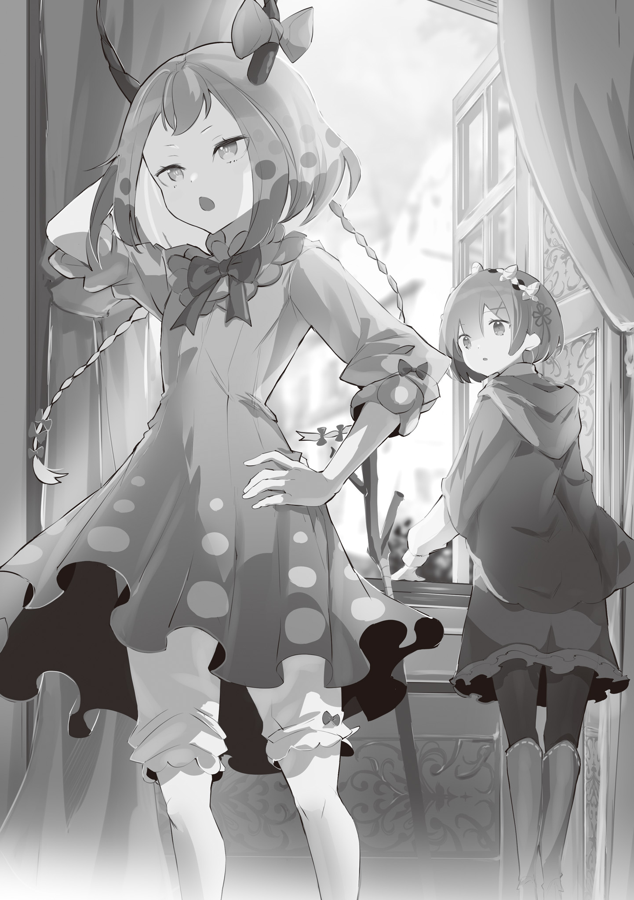

Похищенная во время битвы за город Гуарал и помещенная под арест в столице Рапгане…

Рем понимала, в каком она положении, но…

Рем: …И всё же… я не чувствую никакой опасности.

Рем, опираясь на трость, шла по широкому коридору и вздыхала.

Формально она была военнопленной и заложницей, но рядом с ней не было охраны. Конечно, здесь дежурили стражники, но никто не следил за каждым её шагом.

Небрежность? Или презрение?

Рем: …Ни то, ни другое.

Скорее всего, они просто адекватно оценивали ситуацию.

Рем понимала, зачем её держат в заложниках. И почему ей разрешено свободно передвигаться по особняку, но запрещено выходить наружу.

Это означало, что её ценят. Хозяин этого места, тот, кто держал её под замком, — премьер-министр Империи, Беллстетз Фондальфон.

Беллстетз, занимая пост премьер-министра, поднял мятеж против Империи.

Рем, ставшей невольной участницей гражданской войны, было трудно согласиться с его действиями. Но лично к Беллстетзу она не испытывала неприязни. Наоборот, после их разговора у неё сложилось довольно хорошее впечатление о нём.

Беллстетз поднял мятеж не из корыстных побуждений, а из заботы о будущем Империи.

Услышь она это от кого-то другого, она бы не поверила. Ведь тогда получалось, что виноват… Авель.

Но Рем знала, что именно Авель был причиной мятежа Беллстетза. И Авель не из тех, кто оставит это просто так.

Рем: У Авеля-сан свои принципы. Но я бы хотела, чтобы он объяснил это Беллстетзу.

Может быть, если бы они поговорили, мятежа бы не было? Рем не знала.

Было ли её нынешнее положение… лучше прежнего? Смогла бы она найти себя без этой войны?

Рем: Я…

Рем прижала руку к груди, думая о себе, о своих… обрывках воспоминаний, охватывающих всего один месяц.

Когда она проснулась, её сознание было пустым. И только Субару, который знал её, который пытался ей помочь, помог ей не сойти с ума.

Конечно, сейчас она воспринимала его не так, как в первую встречу. Тогда он казался ей источником зла. Но теперь она понимала, что это было из-за случайных обстоятельств.

Им пришлось забыть о своих разногласиях и объединить усилия. И этот союз изменил их отношения.

Рем: Когда он вернётся в Гуарал, он очень удивится.

Гуарал атаковали летающие драконы… и был разрушен. Многие их союзники поранились, а Рем похитили.

Что он подумает? Субару? Рем было не по себе от этой мысли. Наверное, именно поэтому…

Флоп: …Что-то ты приуныла.

Рем открыла дверь и вошла в комнату. Флоп лежал на кровати.

Рем держала руки над ранами Флопа, лежащего на кровати, и исцеляла их своей магией.

На его забинтованном теле виднелись глубокие следы от когтей. Раны почти затянулись, опасность для жизни миновала, но… Рем была недовольна собой.

Если бы она могла вернуть себе прежнюю силу, она бы исцелила Флопа в одно мгновение. Он получил эти раны, защищая её.

Флоп: Если бы ты могла мгновенно исцелять раны, Мэделин не стала бы тебя похищать. И не пощадила бы город. Так что, думай об этом, как о необходимости. Твоя слабая магия спасла людей. В этом нет ничего плохого… да?

Рем: …………

Рем опустила руки. Флоп, словно читая её мысли, подмигнул ей.

Рем было стыдно, что он поддерживает её, хотя сам ранен. Но она была благодарна ему за это. Рядом с ним, даже в такой ситуации, она не теряла надежду.

Рем: И всё-таки… раз Флоп-сан ранен, мы не можем даже думать о побеге.

Флоп: Ну и жестокая же ты! Но да, я сейчас еле живой. Так что… спорить не буду. Хотя, боюсь, даже без меня тебе было бы… трудно. Это её территория.

Рем: …Мэделин-сан?

Флоп кивнул.

Мэделин Эшарт, «Генерал Летающего Дракона», командовавшая атакой на Гуарал. Она захватила Рем и Флопа и доставила их в столицу. Она была одной из сильнейших воинов Империи… и могла убить их в любой момент.

То, что она этого не сделала, было связано с Флопом.

Рем: Флоп-сан. А кто такая Мэделин-сан для тебя?

Флоп: Мы знакомы. Нельзя сказать, что мы друзья, но именно поэтому она меня терпит. Хотя «терпит» — слишком сильно сказано. Если мы попробуем что-нибудь выкинуть, она нас убьёт.

Рем: Тогда… просить её об освобождении бесполезно.

Флоп: Да. Хотя я бы не отказался. Я волнуюсь, что, он будет ревновать если они будут слишком долго в разлуке.

Рем: Наверное, это немного не так.

Флоп: Неужели…?

Рем смутилась. Флоп, конечно, не ошибся. Она верила, что он волнуется за неё.

Хотя и не из-за того, что она рядом с Флопом.

Рем: Не думаю, что он ревнует. Скорее… волнуется за меня и за Флопа. И за Медиум-сан тоже.

Флоп: О, да! Я и сам волнуюсь за Медиум… Мы так давно не виделись. Я скучаю.

Несмотря на весёлый тон, его чувства были искренними.

Насколько искренне его обычное поведение? Рем не знала.

Именно поэтому она не хотела пользоваться его добротой.

Рем: Давай постараемся выжить. А пока…

Флоп: «Пока»?

Рем: …Тебе нужно отдыхать. Тебе нужно выздороветь… как можно скорее.

Что бы они ни решили — договариваться или бежать — им нужно, чтобы Флоп был в форме.

Рем была полна решимости. Флоп удивлённо посмотрел на неё.

Рем: Флоп-сан?

Флоп медленно покачал головой.

Флоп: Нет, ничего. Только… не сердись, ладно? Твои слова сейчас напомнили мне его. Говорят, что супруги со временем становятся похожи друг на друга.

Рем ахнула. Она очень старалась, но не рассердиться было трудно.

???: Эй, Óни, как там Флоп?

Рем вернулась в свою комнату. Окно было распахнуто. На подоконнике, болтая ногами, сидела девушка с небесно-голубыми волосами… и двумя чёрными рожками.

???: Эй, ты слышишь, что я, дракон, сказала?

Она ворвалась в комнату без стука и сразу привлекла внимание Рем. Óни промолчала.

Эта девушка, которая так и излучала силу, была Мэделин Эшарт, «Генерал Летающего Дракона».

Рем: Хотя… она вряд ли станет нападать на меня.

Мэделин: А? Что ты сказала?

Рем: Нет… ничего… Может, вы будете стучать перед тем, как влезать в окно?

Мэделин: Ты смеешь указывать дракону?

Рем: Нет. Просто… это второй… этаж.

Мэделин, кажется, не видела разницы между первым и вторым этажом. Но лестницы же не просто так придумали.

Рем: И не называйте меня Óни.

Мэделин: Почему? Дракона называют драконом, а Óни — Óни. Это же естественно.

Рем: Просто мне это не нравится. Я себя таковой не вижу.

Рем не хотела отрицать, что она — Óни. Просто… она этого не помнила.

Рем: Зовите меня Рем. Вы же называете Флопа-сана по имени.

Мэделин: …Флоп — особенный. Запомни это.

Рем: А можете и меня…

Мэделин: …Ты…

Рем хотела сказать «считать особенной», но Мэделин прервала её.

Рем почувствовала, как у неё всё сжалось внутри, и замолчала.

Мэделин: Тебя пощадили ради Флопа. Не испытывай терпение дракона. Чтобы спасти его, у меня есть и другие способы.

Мэделин спрыгнула с подоконника на пол.

Рем: Я… поняла…

Мэделин: Хмф.

Мэделин презрительно фыркнула и отвернулась. Напряжение немного спало.

Рем понимала, что одно неверное слово и она навлечёт на себя гнев Мэделин. Она сделала несколько глубоких вдохов и заговорила.

Рем: Состояние Флопа-сана нормальное. Ему нужно отдыхать. Но самое страшное позади.

Мэделин: …Ты что, дура?

Рем: А…?

Мэделин: Если Флоп выздоровеет, он тебе не понадобится. Зачем ты мне об этом рассказываешь? Тебе жить надоело?

Мэделин удивлённо глядела на Рем.

Рем: Нет, я хочу жить.

Рем покачала головой.

Мэделин: …Тогда зачем?

Рем: Я могла соврать. Но я решила, что лучше говорить вам правду.

Мэделин снова удивлённо взглянула на неё.

Рем подошла к окну и посмотрела на улицу.

Ухоженный сад, много стражников… вдали виднеются, дома, столицы и прекрасный Кристальный Дворец.

Рем никогда не была в столице. Рапгане.

Рем: Но… я привыкла быть в незнакомых местах. И я решила бороться.

Мэделин: Бороться…?

Рем: Мэделин-сан, вы, конечно, не испытываете ко мне никаких чувств, но даже вы можете на мгновение засомневаться.

Рем не верила, что сможет перетянуть Мэделин на свою сторону. Она не умела льстить, как Флоп.

Но создать маленькую щель в её защите может быть, ей это удастся.

Она знала, что он волнуется за неё. Субару. Она представляла, как он ищет её… как он готов рисковать своей жизнью и как он не послушает её, даже если она попросит его остановиться.

Если она не может помешать ему, она хотя бы может немного облегчить ему задачу.

Мэделин: …Не понимаю тебя. Но…

Рем: …………

Мэделин: …Дракон не обращает внимания на попытки слабых людей сопротивляться. Делай, что хочешь…

Она могла рассердиться. Но она просто проигнорировала слова Рем.

Она презирала её, считала неопасной.

Но именно поэтому у Рем был шанс.

Рем: Кстати. В этом месте, кроме меня и Флопа, есть ещё один чужак. Вы знаете, кто это? Мэделин-сан?

Мэделин: Слышала, что это гостья «Пожирательницы Духов».

Рем: «Пожирательницы Духов»…

Рем поняла, что речь идёт о Божественном Генерале Аракии, которая нападала на Гуарал.

Речь шла о женщине, которую Рем видела в особняке… в инвалидном кресле. Похоже, она тоже была под арестом.

Мэделин: Странная ты, Óни. Полагаться не на силу…

Слова Мэделин не произвели на Рем никакого впечатления. Она продолжала обдумывать план побега, вспоминая чей-то дальний пример.

《Конец》
