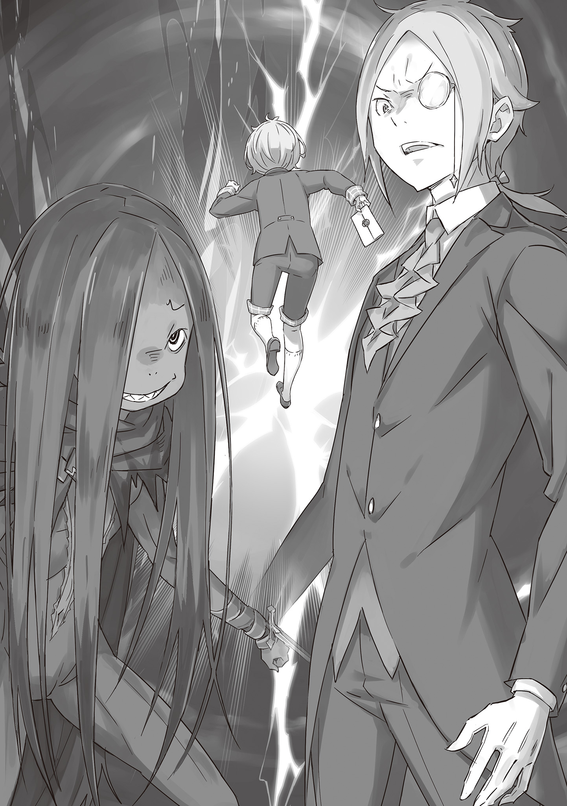

Английский перевод: WCT

Русский перевод: Перакстаз

(Версия Танпэнсю со всеми изменениями и дополнениями, введёнными при адаптации)

— …

Вместе со старым ностальгическим воспоминанием в памяти Йешуа всплыла и застарелая сердечная боль, на что он прищурился.

Покинув офис Анастасии, Йешуа остановился в коридоре, и, чувствуя дежавю из-за вида за окном, взглянул на красное аблоко, так похожую на ту, что он видел давным-давно.

Он не станет думать о том, что произошло, как о плохом воспоминании. А сопутствующую боль он расценивал необходимой.

— Хотя, иронично, что с тех пор моё здоровье перестало ухудшаться.

В поместье шутили, что это было эффектом аблока, которую ему дал Юлиус.

И в действительности тот день был поворотным моментом для здоровья Йешуа, которое резко улучшилось, и с тех пор лихорадка больше не приковывала его к кровати… Словно его нежелание мешать старшему брату возымело эффект на его тело.

А теперь Йешуа отказывался останавливаться лишь на этом.

— Несмотря ни на что, я должен быть полезен брату.

Это был лучший вариант, который Йешуа мог выбрать, будучи младшим братом Юлиуса Юклиуса. Для него, не способного достичь титула “Безупречного”, это было всем, что он мог сделать.

— Эй, Йешуа, чего стоишь тут как дурак с бледнющим лицом! Тебе нехорошо?!

Тогда, в момент, когда он вновь переживал свои чувства, раздался голос столь громкий, что стекло, которого Йешуа касался, задрожало. Когда он повернулся, то увидел огромного кобольда, шедшего к нему широкими шагами.

— Рикардо-сан… На самом деле во мне бурлит энергия. Разве незаметно?

— Ааа, да? Вообще не скажешь! Твоё лицо, как обычно, уж слишком бледное!

— Хмм, это несколько огорчает.

На слова Рикардо, звучавшие больше как сердитый крик, Йешуа поправил монокль.

В нём и правда бурлила мотивация. С давних пор тело Йешуа начинало вырабатывать энергию в тот самый момент, как он ставил перед собой какую-либо цель. Несомненно, подобное происходило и сейчас.

— Я был совершенно уверен, что ты будешь паниковать, раз уж тебя отправили к эльфийской леди! А если ты не повесил нос, тогда можно не волноваться, даже если Мими уезжает! Рассчитываю на тебя!

— Если бы это было чуть раньше, то я бы не смог принять поддержку, но сейчас я в порядке. Пожалуйста, оставьте это мне. Я чётко исполню свою роль по приглядыванию за Мими.

— Понял, понял, это чертовски прекрасно! Ну, сделай всё возможное, но не переусердствуй, хорошо?!

С этим немного непростым советом Рикардо хлопнул Йешуа по спине своей огромной рукой.

Йешуа вскрикнул, а его монокль упал, и слёзы навернулись на его глаза, когда он уставился на Рикардо. Как и ожидалось, у него не было сил противостоять физическому воздействию, поэтому он закашлялся.

— Кха-кха-кха, Рикардо-сан! Если будете со всеми себя так вести, то репутация нашего лагеря..!

— Чёрт подери, опять! Виноват, виноват! Вахаххаха!

— Сейчас совсем не время для вахахаканья!

Рикардо небрежно похлопал себя по голове, заставив Йешуа глубоко вздохнуть.

Однако вопреки чувствам Йешуа выражения лица Рикардо было несколько весёлым. Йешуа взглянул на него, спросив: “Что?”

— Ничего, я просто впечатлён тому как сильно ты сблизился со многими из нас, Йешуа.

— Это… ну, теперь, когда вы это сказали, я полагаю, что так и есть.

— Видишь? Держи такой настрой. Если у эльфийской леди будут претензии к Мисс, то к нам их не будет.

— …

Рикардо рассмеялся, показав клыки, и, размышляя об этом, даже этой улыбки Йешуа боялся.

Так было и с тройняшками: Мими, Хетаро, Тиви, даже с Анастасией. С самого начала Йешуа плохо справлялся с тем, что мир вокруг него расширялся, из-за чего часто останавливался.

Однако его доктрина заключалась в том, чтобы быть благоразумно осторожным, не заходя так далеко, чтобы скатиться в трусость.

— Поэтому я скромно восприму это с долей сомнений.

— Ха! Каков наглец!

Когда Рикардо искренне рассмеялся, Йешуа понял его мысль. Но всё было в порядке.

Под руководством Юлиуса, в его неожиданно расширившемся мире были Анастасия и члены Железного Клыка, и Йешуа не стал желать большего, да и не стремился к этому.

…Даже если бы он протянул руку к аблоку, он бы никогда не смог дотянуться до неё. Такова была жизнь Йешуа.

…Следуя таким идеям, Йешуа Юклиус выполнил свою работу посланника.

Подобное можно было утверждать без сомнений. Правда в том, что обеспокоенность из-за Мими или слухи об опасности лагеря Эмилии не беспокоили Йешуа достаточно, чтобы он насторожился.

Хотя это не значит, что проблем не было.

Встреча с так называемым “Лолимансером” оставила у него удивительно странное впечатление, и Мими, безрассудно связавшаяся с боевым офицером лагеря Эмилии… многие сцены напрягали его нервы.

Но, глядя на общую картину и учитывая, что на пути туда и обратно не было проблем, а письмо было успешно доставлено, он мог похвалить себя за отличный результат в качестве посланника.

Однако то, что было доставлено Эмилии, являлось лишь приглашением… Будет ли оно полезным его госпоже и Юлиусу зависело от того, что за ним последовало.

…Собрание кандидаток на престол в Городе Водных Врат Пристелле, успех которого и определит исход.

И теперь с присоединением лагеря Эмилии через день после появления лагерей Круш и Фельт, Анастасия поручила Йешуа важную задачу, поэтому того не было в гостинице.

И его миссия заключалась в…

— Значит это определённо искомое письмо! Тогда я очень рад, что смог помочь!

Глядя на сердечно улыбающегося мальчика, Йешуа ответил: “Да”, — облегчённо опуская веки.

— Это было чрезвычайно, исключительно и безусловно важное письмо. Я не смог бы показать лицо никому, если бы не смог вернуться с ним. Ты, эм…

— А! Меня зовут Шульт, братец.

— …Шульт-кун. Если бы не ты, репутация Дома Юклиус была бы запятнана. Спасибо, что сохранил историю моей семьи!..

— Для меня это большая честь!

Перед кланяющимся Йешуа стоял мальчик, смущённый, но не полностью отторгающий его жест — Шульт. Выражая благодарность застенчивому мальчику, Йешуа ощутил что-то в своей груди.

В подкладке пальто, к которому прикоснулась его рука, лежало письмо, которое он получил от посланника у городских ворот по указанию Анастасии.

Письмо было не запечатано. Его содержание было неизвестно даже Йешуа. Он знал, что в этот день оно будет важной составляющей в собрания кандидаток на престол, приглашённых в Пристеллу. Одна из них проделала весь этот путь исключительно ради содержимого этого письма.

И только это важное, жизненно значимое письмо он не мог потерять…

— Но когда я увидел, как братец быстро шёл, пытаясь поймать письмо, летящее в воздухе, я очень удивился!

— Угх! П-прошу прощения за причинённое неудобство… для справки, я не просто быстро шёл, а бежал.

— Вот как! Благодаря медленной пробежке братца я смог его вовремя догнать! А ещё поймать письмо!

Широко улыбающийся Шульт не нёс в себе недобрых намерений, а лишь покорно переживал и смущался из-за недостаточной выносливости Йешуа.

В любом случае, Йешуа был спасён от собственной неудачи благодаря Шульту, который поймал письмо, украденное озорным порывом ветра. И он был готов сделать всё, чтобы отплатить за эту услугу.

И на последующее предложение Йешуа Шульт застенчиво закрыл глаза.

— Правда в том, что, очень стыдно в этом признаваться, но я заблудился. Если это не проблема, я бы очень хотел, чтобы ты помог мне найти мою госпожу!

Йешуа шёл рядом с мальчиком, так неожиданно предоставившим ему возможность отплатить за услугу.

Выяснилось, что место, где Шульт заблудился, отойдя от своей госпожи, оказалось близ гостиницы, где остановились Йешуа и остальные, что облегчило ему задачу провести мальчика туда.

— Предлагать отплатить за услугу, а потом не помочь — именно это заставило бы меня потерять лицо.

Шульт, будучи потерявшимся ребёнком, мог вызвать улыбку, но они были в Пристелле — одном из пяти Великих Городов Лугуники. А здесь запутанные пути, пересекаемые каналами, пронизывали город, а отсутствие указателей обращало его в рукотворный лабиринт, где могли потеряться даже взрослые.

— На самом деле город был спроектирован как ловушка, по всей видимости. Поэтому запутанные пути служат его изначальной цели.

— Ого, братец, ты очень осведомлён. Где ты об этом узнал?

— Всё это я почерпнул из книг. Не из личного опыта, совсем нет.

Подняв палец, пока он рассказывал часть истории Пристеллы, Йешуа затем горько улыбнулся. В ответ на это его выражение Шульт произнёс: “Вот оно что?”, — склонив голову набок.

— Моя госпожа тоже часто читает книги. И часто говорит, что истинное знание состоит в том, чтобы в нужный момент применить выученное из книг.

— …

— Выходит, братец, который рассказал мне то, что узнал из книг, есть достойный и классный человек, так я думаю!

Йешуа глубоко вдохнул, в то время как Шульт сжал руку на груди.

В его искренних словах не было излишней озабоченности или жалости к Йешуа. Шульт лишь озвучивал философию, которую усвоил и в которую верил.

И это было то, чему он научился от своей госпожи.

— Шульт-кун, ты уважаешь эту женщину, так ведь?

— …Да, очень сильно! Так сильно, что слова “уважаю” недостаточно, чтобы описать мои чувства! У тебя тоже есть кто-то, кого ты уважаешь, братец?

— …Хе-хе. Я ждал этого вопроса.

— О! Я очень рад, что смог оправдать ожидания!

Когда Шульт радостно поднял руки, Йешуа кивнул и указал ладонью на небо. Следуя указанию, Шульт задрал голову к солнцу.

Разумеется, вот так смотреть на солнце было обжигающе для глаз смотрящего.

— Для меня мой брат сияет так же ярко.

— Брат братца! Он кажется таким удивительным!

— Именно! Брат великолепен. Он может всё, и он стремится уметь делать всё. Его суть, его жизненный путь, его воля — воистину Безупречный!

— Так круто! Яркий словно солнце… совсем как Присцилла-сама!

В тон радостно слушающему Шульту настроение Йешуа тоже поднялось.

Да, Юлиус был замечательным, потрясающим. Несмотря на то, что он заслуживал столь неоспоримую похвалу, его самооценка была слишком низкой. Йешуа бы хотел, чтобы его старший брат больше ценил свои усилия и преданность.

Поэтому он должен постоянно повторять: “Ты потрясающий”.

Вместо Йешуа, который был разочарованием в качестве наследника, был его старший брат, наследник Дома Юклиус…

— Ты вправду так любишь своего брата, братец!

— …

— Слушая тебя, я тоже обрадовался! Угх, я бы так хотел познакомиться с братом братца!

В ответ на послушание и невинность, с которыми Шульт воспринял его слова, Йешуа несколько раз моргнул, а затем несколько раз глубоко вдохнул.

Это была правда, что всякий раз, когда он думал о Юлиусе, в его голове возникал посторонний шум, который он не хотел слышать. Однако в ответ на искренний отклик Шульта у него было только одно, что он мог сказать.

То, что Йешуа думал о Юлиусе, своём достойном, целеустремлённом старшем брате.

— …Да. Мой брат совершенен, так что, когда ты встретишь его, Шульт-кун, я уверен, что ты не сможешь устоять перед его обаянием. Ты даже можешь захотеть сменить место службы.

— Э-э-э-это совсем не так! Я предан исключительно Присцилле-сама!

В ответ на застенчивую суету и восклицание Шульта Йешуа улыбнулся.

Мысль о том, что он хотел познакомить его со своим старшим братом, была искренней. С удовольствием слушая рассказ о его старшем брате, Шульт, без сомнения, сразу же поладит с братом Йешуа, которым тот так гордился. Это было трогательно, и только лишь от предвкушения Йешуа почувствовал, как у него на душе стало легче.

Разумеется, он должен в первую очередь сосредоточиться на делах, связанных с Королевским Отбором, включая доставку письма, поэтому вопрос Шульта нужно рассмотреть позже…

— …

Через мгновение резкое чувство беспокойства защекотало барабанную перепонку Йешуа.

— ..? А? Что случилось?

Заметив то же, что и Йешуа, Шульт остановился и склонил голову набок.

Перед ними, направлявшимися к гостинице, на оживлённом проспекте раздался нарастающий шум, который всё быстрее приближался…

— Шульт-кун, прошу, не медли и беги.

— Братец?

Услышав шум и распознав его источник, Йешуа заговорил с Шультом и протянул руку к недоумевающему мальчику, расширившему глаза.

В его руке было письмо, которое Йешуа был обязан доставить.

— Пожалуйста, возьми его. Словно своей госпоже, доставь его моему брату.

В ответ на голос Йешуа, не допускавший ни согласия, ни возражения, Шульт взял письмо дрожащей рукой. Затем Йешуа отступил от Шульта и громко воскликнул:

— Беги!

Подчиняясь его голосу, Шульт как по щелчку ринулся в противоположную сторону. Словно гонясь за юрким мальчиком, в том же направлении неслась толпа.

Встретившись с этой вопящей толпой, Йешуа шёл против неё, всё быстрее направляясь вперёд.

И…

— …Обжорство! Обжорство!

Грубый и жестокий голос, излучавший возбуждение, разносился вокруг, короткие конечности его обладателя размахивали и разбрызгивали кровь по проспекту.

Сквозь горькое ворчание были отброшены стражи, отвечавшие за защиту города. Солдаты, вооружённые мечами, облачённые в доспехи и преисполненные волей, были с ужасающей жестокостью измельчены и разрезаны, словно клочки бумаги.

Сотворившим это был чёрный комок, ловко ползущий вперёд, словно червь. Не комок грязи или теней, а существо с волосами, отросшими достаточно, чтобы скрыть его миниатюрное телосложение, но открывая зловещий блеск в его испорченных глазах.

— Хаха~! Так не пойдёт, не пойдёт, не пойдёт, совсем не пойдёт! Даже если тут так много людей, это никак не утоляет наш голод! Если так и будет и дальше, то мы не насытимся!

Настойчиво выражаясь, владелец зловещего блеска оглядывал своё окружения. В поле его зрения попала скрючившаяся и дрожащая женщина, не успевшая убежать. К ней, чьи ноги, казалось, потеряли всю силу, медленно и уверенно приближались шаги.

— Судя по виду, сестрица больше подходит Лою, а~а? Но ведь есть шанс, что она может быть деликатесом, так что давайте ради этой возможности попробуем и узна~аем.

— П-пожалуйста… пожалуйста! Пожалуйста, прос…

— …Неа.

Мольба плачущей женщины, решившейся на смерть, была осквернена коротышкой, обнажившим острые зубы.

Его тонкие руки медленно вытянулись, обнажая смертоносные оружия, обратившие стражу в кровавые ошмётки. Женщина вскоре последует за ними тем же самым образом.

— …Некрасиво.

— Э~э?

Подняв бровь, осквернитель жизни издал звук, пропитанный интересом. Его оценивающий взгляд был устремлён на Йешуа, вставшего между ним и женщиной.

Разумеется, просто втиснувшись между ними, он никак не мог помешать осквернителю. Поэтому Йешуа одолжил меч у одного из поверженных солдат, и отогнал противника, замахнувшись на него клинком.

— Даже если вы можете только ползти, пожалуйста, бегите. А я отвлеку его внимание на себя.

— …Мне так жаль!

Не оборачиваясь, Йешуа стоял к осквернителю лицом к лицу, а женщина поняла, что ради спасения нужно бежать.

Перед ним извинились, но всё было хорошо. Он хотел, чтобы она сбежала. Если осквернитель попытается помешать её побегу, то он…

— Ах, в этом беспокойстве~е нет смысла. Подобная добыча, в сравнении с таким вкусом, не достойна быть на нашей тарелке~е. Скорее уж, это ты, ты~ы.

— Что насчёт меня?

— Кажешься мягким и насыщенным на вкус. Мы любим людей вроде братца, чьи эмоции, как приправы или специи, все перемешаны. Сейчас слюнки потеку~ут.

Взгляд осквернителя, высунувшего язык и облизывавшего губы, выражая аппетит, соответствовавший его словам, заставил холодные мурашки пробежаться по спине Йешуа.

Хоть он даже и думать не хотел становиться целью чьих-то желаний всерьёз съесть человека…

— Даже если именно в этом дело, тем более нельзя тебя отпускать!..

— Хоть силы на вид и немного, сила это хорошо~о. Правда или блеф, но это приятная приправа, чтобы улучшить и усилить аромат и вкус, понимаешь! Обжорство! Обжорство!

Сжав перед грудью руки, к которым были привязаны кинжалы, осквернитель разразился пронзительными аплодисментами. Слушая их, Йешуа тихо успокоил своё сердце.

— …Брат, пожалуйста, будь в безопасности.

Сжимая меч, Йешуа понимал, что его худший момент разворачивался прямо перед его глазами, неотвратимо приближаясь.

Его ждал неизбежный конец. Однако сердце Йешуа было безжизненно тихим, хотя обычно он боялся всего и вся, и самого себя он сейчас понять не мог.

С мечом в руке, стоя напротив осквернителя жизни, терроризировавшего людей, он думал.

— Кто-то вроде меня, словно бы я был рыцарем…

Он думал о прошлом, когда его ошибавшееся я говорило с его старшим братом.

Совсем как отец Юлиуса, покинувший Дом Юклиус, потерявший жизнь и встретивший смерть образом, достойным рыцаря — лишь так Йешуа Юклиус мог стать рыцарем.

— Начнём же трапезу!

Иронично, но чувствуя приближение этого ужасающего момента, Йешуа улыбнулся и поднял свой меч высоко над головой.

Грациозный, непоколебимый, сверкающий меч, очерчивающий дугу, несомненно был мечом Юклиуса, обнажённым для защиты людей, для защиты слабых.

…Младший брат, достойный титула “Безупречного”, меч Йешуа Юклиуса, призванный защищать.

《Конец》
