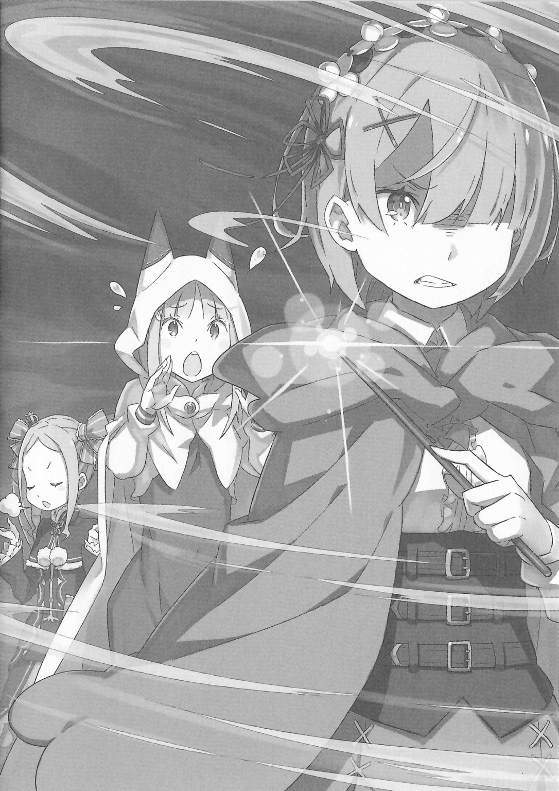

— М-м, задачка не из лёгких, в самом деле… — пробормотала одна.

— Хм-м, да уж. И что же нам делать? — продолжила другая.

Две девушки стояли рядом друг с другом в задумчивой позе, ломая голову над общей проблемой.

У одной из них были длинные серебряные волосы и аметистового цвета глаза — она была прекрасна. У другой — роскошно завитые кремовые локоны и характерный узор на зрачках.

Девушки по имени Эмилия и Беатрис размышляли так, словно они были сестрами. Хотя в вопросе, кто из них старшая, их мнения, вероятно, различались бы.

Находились они в белом пространстве — по-другому его и не назовешь. В общем, странное местечко.

Пол, стены, потолок — всё было залито чистейшей белизной. Это сбивало чувство перспективы, делало невозможным определение размера помещения, а также того, где верх и где низ.

Единственным элементом, нарушающим эту однородность, были…

— Эти каменные плиты, которых становится всё больше, — пробормотала Эмилия, глядя на черную плиту, парящую прямо перед ней. Их бесчисленное количество плавало в этом белом пространстве, создавая неприятное и странное ощущение.

Чик.

— Ах! Эй, Эмилия! Ты что творишь, я полагаю?!

Она беззаботно коснулась пальцем одной из них. Увидев это, Беатрис широко раскрыла глаза, а затем надулась от злости.

Она подскочила к полуэльфийке, которая была значительно выше её, и упрекнула её за безрассудство. Но было уже поздно.

— …

Плита, которой коснулась Эмилия, вспыхнула белым светом, заливая всё вокруг.

А в следующее мгновение исчезли и все остальные. Осталась лишь одна-единственная.

— М-м, похоже, не сработало.

— Не «не сработало», в самом деле! Почему ты вечно творишь такие безрассудные вещи, я полагаю?! Просто поверить не могу!

— П-прости, прости. Но смотри, мы можем попробовать сколько угодно раз.

Извиняясь перед покрасневшей от гнева Беатрис, Эмилия спокойно подошла к оставшейся плите. Она протянула руку и тронула её.

— Коснись ярчайшего героя, убиенного Шаулой.

В тот же миг раздался голос, и белый свет вновь окутал пространство.

И снова, как и прежде, бесчисленные плиты заполнили пустоту.

— Вот видишь?

— Никакого «вот видишь», я полагаю! Я тебе говорю, прекрати поступать так легкомысленно, в самом деле! — взвизгнула Беатрис.

Эмилия же подмигнула одним глазом и с некоторой гордостью посмотрела на неё.

В кажущемся бесконечным белом пространстве разносились нескончаемые нравоучения Великого Духа.

— Ох-ох, сестрица, ты опять разозлила Беатрис?

Увидев виновато спускавшуюся по лестнице Эмилию, стоявшая внизу девушка хихикнула, прикрывая рот.

— А, Мейли… Ага, так и есть. Я о-о-очень сожалею.

— Этого следовало ожидать, я полагаю. Эмилия совершенно не думает о том, где мы находимся. Хмф, — надувшись от возмущения, фыркнула подошедшая Беатрис.

— Хи-хи, когда я смотрю на вас, вы и правда похожи на сестер.

Наблюдая за сердитой Беатрис и виноватой Эмилией, Мейли выдала такое с озорной улыбкой на лице. Услышав это, девушки отреагировали совершенно по-разному. Эмилия просияла, а Беатрис скривилась.

— Бетти было бы очень тяжело, если бы у неё была такая несносная младшая сестрёнка…

— Эй! Но ведь это я старшая сестра, а Беатрис — младшая, так?

— Шутки в сторону. Бетти старше тебя по возрасту, и аура, которую она излучает, просто несравнима с Эмилией. Очевидно, что я старшая сестра, в самом деле.

Глядя на торжествующую Беатрис, полуэльфийка надула щёки.

Хотя внешне Эмилия выглядела старше, судя по этому обмену репликами, Беатрис действительно держалась с большим достоинством. Но с точки зрения Мейли, обе выглядели как просто хорошо ладящие между собой сестренки-дитятки. Кто из них старше — сущая мелочь.

— Но всё равно, вы такие беспокойные. Наверное, потому что братца рядом нет?

— Хм. Да, наверное. И Беатрис такая раздражённая, потому что беспокоится о Субару, который спит и никак не проснётся…

— Бетти злится потому, что Эмилия неосторожна. Я, конечно, беспокоюсь о нём, но это отдельный вопрос, я полагаю.

Укорив Эмилию, пытавшуюся незаметно свалить вину на другого, она вздохнула. В её маленькой груди действительно покалывали и прорастали семена тревоги.

В данный момент группа Беатрис находилась внутри Сторожевой Башни Плеяд.

Само по себе покорение считавшихся непроходимыми Песчаных Дюн Аугрии, логова зверодемонов, было серьезным достижением, но ситуация была далека от того, чтобы спокойно радоваться.

Прямо перед достижением Башни, на последнем рубеже, группа понесла тяжёлые потери и недосчиталась половины своего состава.

— Хорошо, что благодаря той девочке этого удалось избежать, но…

Эмилия коснулась щеки, и Беатрис нахмурилась от её слов.

Речь шла о единственной обитательнице Башни, которая не была спутницей Беатрис и её товарищей, а находилась здесь до их прихода. Молчаливая, бесстрастная женщина, не отвечающая ни на один вопрос. Честно говоря, её беспокойство и раздражение уже достигали предела, но…

— Та голая сестрица спасла и братца, да? Я понимаю твоё нетерпение, Беатрис, но это ведь правда?

— Я… Я знаю, я полагаю. Поэтому я ничего против неё и не замышляю.

Мейли угадала её истинные чувства, и она поджала губы. Затем Беатрис глубоко вздохнула, решив сменить тему.

— Стоять здесь — пустая трата времени, в самом деле. Пойду проведаю Субару.

— А, тогда я с тобой. Я волнуюсь и за Рам. Мейли, ты как?

На вопрос Эмилии Мейли склонила голову и погрузилась в раздумья.

— Эта непонятная штука наверху лестницы… Вы ведь ещё не разобрались с ней? Кажется, её можно трогать сколько угодно, так что, может быть, я могу понажимать на всё подряд?

— Я не против, но… ты справишься одна?

— Справлюсь. К тому же, если мы не достигнем цели в этой Башне, мы ведь не сможем вернуться домой? А мне не хочется надолго задерживаться в настолько песчаном месте.

Помахав рукой, Мейли развернулась и стала подниматься по лестнице. Проводив её маленькую спину взглядом, Эмилия повернулась к Беатрис: — Может, зря мы её отпустили?

— Я очень рада, что Мейли нам помогает, но…

— В том пространстве нет ничего, что могло бы нам навредить… К такому выводу пришли и Бетти, и Юлиус. Так что с ней всё должно быть в порядке.

— Вот как… Погоди? Тогда почему ты так сердилась на меня раньше?

— Знать, что опасности нет, и безрассудно действовать, не зная ничего, — это совершенно разные вещи! Похоже, ты совсем не раскаиваешься!

— Н-неправда! А! Давай скорее вниз! Субару и Рам уже заждались, ну же, быстрее, быстрее!

— Эй, погоди, Эмилия!

Эмилия, поспешно сменив тему, подхватила Беатрис на руки и побежала. Покачиваясь в её объятиях, она надула щёки.

— Всё-таки, как ни крути, старшая сестра здесь Бетти.

— О? Эмилия и Беатрис тоже спустились, да?

— А, Анастасия! И Юлиус тоже.

Спускаясь по длинной винтовой лестнице с Беатрис на руках, Эмилия заметила машущих им внизу госпожу и рыцаря.

Затем полуэльфийка с криком «Эй!» спрыгнула с края, срезав почти десять метров под порывами ветра.

— Оп!

— Ох, как ловко приземлилась. У меня бы духу не хватило, — с улыбкой сказала Анастасия.

— Говорить такое Эмилии бесполезно, я полагаю… Для неё не существует страха.

— Н-неправда. У меня тоже есть вещи, которых я боюсь. Эм-м, дайте подумать… Сейчас вспомню, подождите немного.

Та принялась мычать, пытаясь вспомнить свои страхи. Беатрис же, оставив эти бессмысленные попытки, спрыгнула с её рук на пол нижнего яруса и посмотрела на драконью повозку, в которой они прибыли.

Внутри повозки спал её контрактор.

— Почти целые сутки прошли, я полагаю.

— Беспокоитесь о нём? — спросил Юлиус, подойдя к ней.

Беатрис мельком взглянула на него, прищурилась и ответила: — Не подходи слишком близко. У Бетти уже есть контрактор. Соблазнять чужого партнёра — это дурной тон, в самом деле.

— Прошу прощения, но это эффект моей Божественной Защиты Призыва Духов. Он проявляется непреднамеренно. Пожалуйста, не поймите меня неправильно.

— Я просто пошутила, я полагаю. Это ты всё воспринимаешь слишком буквально.

Чувства юмора у него совсем нет, — подумала она, но всё же понимала, что сама повела себя не лучшим образом, поэтому решила промолчать.

Из-за инцидента в Песчаных Дюнах Аугрии они на время разлучились с Субару. Хотя воссоединение произошло всего через несколько часов, пережитое волнение было неизмеримо.

Если бы он хотя бы встретил их бодрым и здоровым, это немного успокоило бы её, но…

— Ну и соня же ты, — пробормотала она, взглянув на своего контрактора, лежащего в повозке. С момента их встречи он так и не проснулся.

Благодаря связи с ним она знала, что его состояние не критическое. Однако был прецедент «Спящей Красавицы». Невозможность проснуться даже при отсутствии физических проблем. Учитывая это, она не могла быть слишком оптимистичной.

— Беатрис волнуется. А ты как? — спросила Анастасия.

— Я? Конечно, я тоже беспокоюсь о Субару… Но я слышала от вас, как здорово он постарался в подземелье. С ним всё будет хорошо, — ответила Эмилия.

— На чём основана такая уверенность?

— На чём? Субару — мой рыцарь, так что верить ему — это естественно, разве нет?

Анастасия криво усмехнулась, глядя на недоумённо склонившую голову девушку. Именно такое безоговорочное доверие Нацуки Субару заслужил своими стараниями.

И пока они так разговаривали…

— …!

Внезапно из повозки послышался шум. Беатрис и остальные удивлённо обернулись. Сразу после этого… дверь повозки распахнулась, и изнутри выкатилась человеческая фигура.

Она рухнула на пол нижнего яруса и замерла с ошеломленным выражением лица. Это была Рам.

— Рам! Слава Дракону, ты проснулась!

— Г-госпожа Эмилия?

Только что вывалившаяся из повозки девушка прошептала это, глядя на подбежавшую Эмилию. Рам, которая обычно производит впечатление сильной и бесстрастной девушки, сейчас явно была в смятении.

Однако она быстро пришла в себя.

— Госпожа Эмилия, я так рада, что вы в порядке. А Рем с вами?

— Да, всё хорошо, не волнуйся. Она в безопасном месте.

— Вот как…

Она расслабилась от облегчения, и на её губах появилась слабая улыбка. Эмилия нежно обняла её и похлопала по спине.

Увидев это, Беатрис и остальные тоже вздохнули с облегчением.

— Похоже, с леди Рам всё в порядке, — заметил Юлиус.

— Она просто была сильно истощена. Раз проснулась, значит, всё нормально, я полагаю.

— Так говоришь, а у самой будто камень с души упал — заметила Анастасия.

— Замолчи.

Бросив сердитый взгляд на хихикающую девушку, Беатрис пожала плечами.

Ощущая на себе их взгляды, Рам поднялась.

— Похоже, ситуация довольно странная. Не могли бы вы рассказать подробнее?

— Конечно, но ты как, в порядке?

— Да, всё хорошо. Похоже, я проспала довольно долго…

— Ага. Субару так крепко тебя обнимал…

— Подождите.

Услышав невинные слова полуэльфийки, Рам напряглась. На её слова Эмилия удивлённо склонила голову: — А?

— Это… то, что было в повозке…

— А, да, ты, наверное, удивилась? Когда мы с вами встретились, Субару уже так крепко держал тебя… Наверное, он очень волновался за Рам.

— …

— Э? Рам, что с тобой? Зачем ты идёшь к повозке…

Девушка нетвердой походкой направилась обратно к повозке. Она достала из-за пазухи палочку и, произнося заклинание, начала собирать ветер. Это было…

— Если стереть Барусу как будто его и не было…

— Погоди, погоди! Это опасно! Успокойся!

— Не останавливайте меня, госпожа Эмилия. Рам должна смыть этот позор с себя!

Эмилия в панике бросилась останавливать решительно настроенную Рам, обхватив её сзади. Но та и не думала останавливаться, так что Юлиус тоже поспешил на помощь.

Наблюдая за этой сценой, Беатрис приложила руку ко лбу.

А затем…

— Вы все надоедливые, я полагаю… Просыпайся скорее, Субару, а то будет совсем нехорошо.

…устало пробормотала она, чувствуя бремя отсутствия главного столпа их группы.

《Конец》
