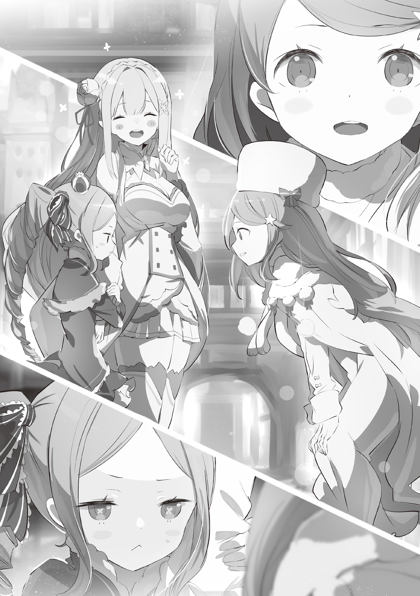
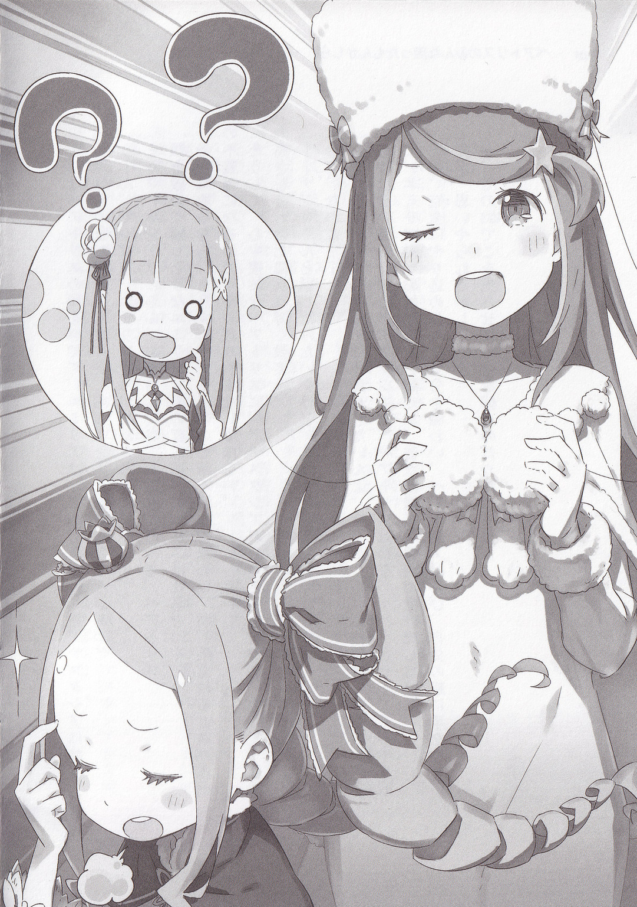

“Беатрис, мне нужно поговорить с тобой об одной очень важной теме, ты не возражаешь?”

Беатрис остановилась и обернулась, когда её окликнули таким тоном.

В поле её зрения оказался мальчик с короткими чёрными волосами и характерными для санпаку проницательными злыми глазами. На первый взгляд, просто взглянув на его лицо, вы не могли не насторожиться или испугаться. Но на самом деле это было совершенно не верное впечатление, в его характере была мягкость и нежность, никак не связанная с резкостью или жестокостью его редких глаз.

И этим самым мягким человеком был контрактор Великого духа Беатрис, Нацуки Субару.

Он не был «Тем самым» человеком, что должен был придти за Беатрис, которая ждала его в Запретной Библиотеки четыре столетия. Но выбор этого мягкого человека стал величайшей радостью в жизни искусственного духа Беатрис.

«Беако? Аууууу, ты меня слышишь?»

Сомневаясь в реальности грубого игнорировании от Беатрис, Субару, наклонивший голову вперёд, позвал её во второй раз. С тихим «кхм», Беатрис прочистила горло. Только сейчас она почувствовала, как её переполняет уже привычная благодарность и радость за возможность подобного разговора с человеком, которого она поставила на первое место.

Но Беатрис намеренно состроила жёсткое выражение лица.

“Я слышу тебя, я полагаю. Хотя по Бетти может показаться, что это не так, но на самом деле она очень занята. Только если это не очень важное дело, я не возражаю, я полагаю.”

Отвечая с холодным и безразличным видом, Беатрис подошла к Субару. В ответ на поведение Беатрис Субару произносит «Прости, прости» почёсывая свою щеку

"Я знаю, что моя очаровательная Беако очень занята множеством вещей, но я, по крайней мере, хочу, что бы обо мне тоже не забывали. В любом случае, у меня действительно важный вопрос.”

“Боже, тут уж ничего не поделаешь, потому что, если бы Бетти не было рядом, Субару не смог бы ни с чем справиться сам, я полагаю. Так уж и быть, я оставлю тех, кто может справиться сам на некоторое время.”

«О, спасибо.»

Широко улыбнувшись в ответ на сокрушающуюся Беатрис, Субару с облегчением похлопал себя по груди.

В отрыве от их отношений в качестве духа и контрактора, Беатрис почувствовала облегчение, когда почувствовала облегчение Субару. Она хотела, чтобы Субару был как можно более здоровым и счастливым.

Она не могла желать ничего большего, чем если бы он мог спокойно проводить каждый день, засыпая, без единой царапины.

Тем не менее, учитывая, что этот мальчик был личностью, которая по собственной воле выбрала этот тернистый путь, этому желанию не суждено было сбыться.

И вот почему…

“Бетти, тоже должна внести свой вклад, на самом деле. Иначе Субару не перестанет нырять головой в бездонные болота неприятностей.”

“Почему ты вдруг сказала что-то настолько страшное?!”

“Наверное, просто разговариваю сама с собой. Субару, вообще-то подслушивать — дурной тон, на самом деле."

«Ты говоришь что-то настолько пугающее про себя!? Ты же знаешь, тебе не стоит заводить какие-то странные привычки, пока меня нет рядом!?»

На недоуменный ответ Субару губы Беатрис медленно расплылись в улыбке. Первый и единственный контрактор Беатрис, он слишком сильно заботился о Беатрис.

Беатрис хвасталась, что ей больше четырёхсот лет, хотя она прожила в двадцать раз больше, чем мальчик, его отношение к ней было почти таким же, как если бы он обращался с ней так же заботливо, как с хрупким и безгранично дорогой младшей сестрой.

Она осознает тот факт, что ею дорожат, поэтому никогда не будет винить его за такое отношение.

"И что же? Разговор не продвигается, так что я продолжу его, я полагаю. Итак, какую же глупую проблему Субару может доставить Бетти на этот раз?”

"С такой формулировкой создаётся впечатление, что я регулярно прошу Беако о невозможном, не так ли?”

“На самом деле, это всего лишь вещи, которые если бы Бетти не было рядом, никто бы не выслушал, я полагаю.”

“Все так, как ты говоришь.”

Когда Субару жестом показывает, что хочет что-то сказать, Беатрис благородно вздёргивает подбородок. А затем Субару медленно сгибает колени и прижимается губами к уху Беатрис.

«Правда в том, что в Анастасию вселился искусственный дух, и что нам делать дальше?»

«…»

И когда перед ней действительно встаёт неразрешимая проблема, прелестное личико Беатрис сильно хмурится.

В настоящее время группа, в которую входят Беатрис и её контрактор Субару, готовится к возвращению из города водных врат Пристелла обратно в поместье Розвааля.

С момента масштабного нападения Культа Ведьмы, обрушившегося на город водных врат, прошло несколько дней. Мало-помалу начинают проявляться плоды усилий по восстановлению города. Однако шрамы, оставленные ужасающим Культом, глубоки, и ран, которые не заживут, если их оставить как есть, будет немало.

В поисках способа залечить эти раны, они отправятся на восток, где Субару будет ядром их группы. Их цель — башня «Мудреца», которая находится на самом восточном краю света.

Предвидя, что это путешествие станет для них самым трудным за все время. в буквальном смысле, участники оказались в ситуации, когда они должны решать эту проблему вместе, как единое целое. И это ещё не все.

«Серьёзно, Субару на самом деле такой беспокойный.»

Коснувшись своего широкого лба, Беатрис издала долгий, усталый вздох, что было нехарактерно для её внешности.

Услышав шокирующее признание Субару о том, что Анастасию заменил искусственный дух, Беатрис, поколебавшись, направилась прямиком к Анастасии, чтобы рассмотреть её состояние в мельчайших подробностях.

Честно говоря, Беатрис не знает, каково обычное поведение Анастасии. Они не общаются, и поэтому ей не с чем сравнивать, даже если её поведение или поступки неестественны.

Её поступки и характер, её образ жизни — все это не годится. Ей приходилось следить за потоком маны, окружающим её.

В результате этого она смогла ощутить слабое воздействие на врата, которое невозможно увидеть, если на нем сознательно не сосредоточиться. Это доказало что сказанное Субару не было результатом какого-то дурного сна.

"Скорее всего, проблема в самих вратах девчонки, я полагаю. Вот почему не только Бетти, но и никто другой не мог этого заметить, я полагаю.”

Это не просто её попытка оправдаться, это ощущение, которое она испытала, наблюдая за состоянием Анастасии. Это врождённый дефект, людей с такими недостатками немало.

Поскольку этого органа не было изначально, это был дефект, который в конечном итоге возник из-за того, что врата появились только впоследствии. К лучшему это или к худшему, но подобные дефекты не были стабильным явлением, этот прецедент был хорошо известен Беатрис.

“Бетти не может решить, кто из них двоих лучше, если выбирать между этой девушкой и Розваалем, я полагаю.”

Неспособность использовать магию или злоупотребление ею, что оказало бы большее влияние на жизнь человека?

Беатрис, как дух, по своей природе была тесно связана с магией. Начнём с того, что, поскольку её биологическая мать была «Ведьмой», она не могла представить себе жизнь без магии.

Магия подарила Беатрис насыщенную жизнь. И в то же время, она же обрекла её на одиночество.

В конце концов, все будет зависеть от того, как вы это используете и как вы это воспринимаете, по крайней мере, она так думает, но…

“На самом деле, чрезмерное обдумывание всего и вся ничему не поможет.”

“В каком смысле чрезмерное обдумывание?”

“Ункьяан, я полагаю…!”

Сразу после мрачного шёпота голос, раздавшийся прямо за спиной Беатрис, заставил её вздрогнуть. Обернувшись по инерции, она увидела девушку, Эмилию, которая удивлённо смотрела на неё голубовато-фиолетовыми глазами.

Она слегка рассмеялась и сказала «Мне очень жаль», когда Беатрис взвизгнула и отпрыгнула в сторону.

“Я не думала, что ты так удивишься, это таааак сильно напугало тебя.”

“Это… это вредно для сердца, я полагаю. Не то чтобы Бетти переживала, если бы у неё остановилось сердце, но если ты будешь продолжать так пугать людей, то остановишь сердце у кого-нибудь вроде Отто. Будь осторожна, на самом деле.”

“Ммм, ты права. Я буду осторожна с сердцем Отто-куна.”

Сделав глубокий вдох, чтобы успокоиться, Беатрис, сказав это, очень серьёзно кивнула Эмилии. По сути, она была девушкой, которая честно прислушивалась к тому, что говорили другие. Хотя, с другой стороны, она была чересчур честной.

“Братик перестарался в этом аспекте воспитания, на самом деле. Впрочем, как и ожидалось от Братика, я полагаю……”

«Так на что же ты тогда так пристально смотрела, Беатрис? ……Ах»

Эмилия, рассеянно выглядывавшая из-за головы Беатрис, повысила голос. То, что она увидела в поле своего зрения, было фигурой девушки в кимоно со светло-фиолетовыми волосами.

…Анастасия Хосин. В настоящее время это человек, чья плоть захвачена другим существом.

Беатрис, по совету Субару, отправилась прямо к ней, чтобы подтвердить правдивость его слов. Для этого она начала осторожно следить за Анастасией, но…

"Беатрис, почему ты смотрела на Анастасию?”

"Это, мммм, это, я полагаю. Причина, что выше горы и глубже, чем великий водопад, я полагаю.”

"Этот ответ почему-то кажется слишком странным и запутанным.”

Прижав руку ко рту, Эмилия слегка хихикнула. Сами по себе эти слова были похвалой Беатрис, но встреча с Эмилией здесь все чрезвычайно усложняет. Судя по тому, как Субару говорил об этом, казалось, что он не хотел, чтобы ситуация с Анастасией получила слишком широкое распространение.

Во-первых, в предстоящем путешествии Анастасия должна была стать их гидом к сторожевой башне Плеяд в дюнах Аугрии, и это путешествие не могло состояться, если бы стало известно, что она пропала.

Это означало бы, что в данном случае руководить ими будет не сама Анастасия, а искусственный дух.

«…»

“Искусственный Дух” даже к этому названию у Беатрис были сложные чувства.

Из искусственных духов, созданных «Ведьмой» Ехидной, в число которых входит и Беатрис, в этом мире существует только 3. Первый из которых — Пак, а последний — Беатрис.

Что означало бы, что та, что внутри Анастасии, была бы третьей, неизвестной до сих пор.

…Последней в своём роде, о которой её мать Ехидна не рассказывала, и даже Беатрис не знала о её существовании.

В отличие от Пака, к которому она испытывала сильную привязанность с самого рождения, как ни странно, последний представитель её рода не вызывал у неё никаких чувств товарищества или семейных уз.

Или, возможно, все изменится, если она встретится с ней лично, но у неё не хватило смелости подтвердить это.

И Беатрис с большим трудом придумала оправдание такому стечению обстоятельств. Конечно, в случае с Эмилией было бы достаточно легко одурачить её простым предлогом, но на самом деле Беатрис этого не хотела.

Одурачить честную, готовую поверить девушку скверной ложью было бы мучительно для её совести.

«Гррррр, на самом деле……»

И так, она искала выход из положения, продолжая рычать от раздражения, однако…

"Боже, Беатрис, ты такая упрямая.”

«А?»

"Не хмурься так. Знаешь, я не всегда нуждаюсь в защите. Я не такая уж невнимательная, как предполагает Беатрис.”

«Эмилия……»

Глядя на взволнованную Беатрис, Эмилия начала говорить это. Она приложила руку к груди, и её голубовато-фиолетовые зрачки пристально уставились на Беатрис, которой стало стыдно за себя.

В этом году Эмилия, которая усердно работала и развивалась в отсутствие Пака, показала Беатрис, что она выросла гораздо больше, чем предполагала Беатрис. Особенно, когда её похитил Архиепископ, но она все равно не сдавалась и в итоге победила грозного противника вместе с Субару.

«Дочка Братика настолько сильно выросла, я полагаю……»

"Фу-фу, это точно. Потому что я намного выше Беатрис.”

"Не увлекайся, на самом деле. Мама придала внешности Бетти идеальную форму, я полагаю. Это моя окончательная и идеальная форма, я полагаю!”

«Хорошо, хорошо. Тогда, может, нам стоит уйти?»

И улыбающаяся Эмилия схватила Беатрис за руку. Это событие заставило Беатрис растерянно распахнуть глаза, она посмотрела на сжатую руку Эмилии и её улыбку.

«……Идти? Куда идти, я полагаю?»

"Боже, не упрямься. Мы собирались отправиться вместе в долгое путешествие, и ты ещё толком не поговорила с Анастасией-сан, так что ты нервничаешь, верно? Я пойду с тобой, так что нам нужно поладить с ней.”

"Ты абсолютно ничего не поняла, на самом деле!”

Не то чтобы это можно было назвать глупостью, но то, что она неправильно поняла, разозлило Беатрис. Однако Эмилия склонила голову набок и спросила: «Это правда?» и…

«Тогда почему ты смотрела на Анастасию-сан?»

“Э-э-э, я полагаю.”

На появившиеся вопросы в круглых зрачков Эмилии Беатрис снова растерялась, не зная, что ответить.

Она не смогла придумать достойного оправдания. Тем не менее, она не могла отклонить просьбу Субару. Столкнувшись с этой дилеммой, Беатрис удручённо опустила плечи.

"Как и следовало ожидать от Эмилии, я полагаю…… Похоже, ты действительно разгадала мысли Бетти.”

“Видишь, я была права. Не волнуйся. Анастасия-сан — очень хорошая девочка.”

Увидев невинно улыбающуюся Эмилию, Беатрис улыбнулась в ответ с напряженными щеками. А затем, взяв ее за руку, ее отвели к Анастасии, за которой она следила.

"……Серьёзно, каждый из вас был бы совершенно беспомощен без Бетти, вы были бы такими надоедливыми, я полагаю.”

С тревогой думая о своём будущем, Беатрис слабо пробормотала это.

После этого…

"Но на самом деле это было довольно неожиданно. Кто бы мог подумать, что Беатрис-чан захочет подружиться со мной. В конце концов, ты так привязалась к Нацуки-куну.”

"Дело в том, что Субару тоже много об этом говорит. Он хочет, чтобы у Беатрис появилось больше друзей за пределами особняка. Он хочет посмотреть, как она будет играть и веселиться с другими детьми.”

(На англ “That he wants to see her making mud cakes.”, возможно под “mud cakes” имеется в виду играть в песочнице и делать песчаные замки/куличики, но я не уверен, да и звучит странно)

"Хах, звучит заманчиво, не так ли? Но, знаете, это звучит так, как будто супружеская пара говорит о своей дочери, не так ли?”

Анастасия кивнула, словно её тронула история Эмилии. То, как Эмилия произнесла «Супружеская пара?» в ответ на этот вопрос, прозвучавший прямо у неё в голове, полностью обесценило ежедневные усилия Субару по завоеванию её сердца.

Напротив, Беатрис, к которой эти двое относились как к дочери, испытывала необъяснимые эмоции.

"Беатрис, ты стала такой тихой. Ты, наверное, нервничаешь?”

"Нервничаю? На самом деле, эти слова никак не относятся к Бетти. Во-первых, в этой ситуации у Бетти вообще нет причин нервничать.”

«Ты довольно неуклюжая в общении, не так ли?»

Анастасия криво улыбнулась Беатрис, которая пряталась за Эмилией, обнимая её за руку. Внимательно наблюдая за этой улыбкой, Беатрис продолжала сохранять бдительность.

Погладив Беатрис по голове, Эмилия извинилась: «Мне очень жаль»

«Обычно она говорит гораздо больше, но при незнакомцах она становится немного застенчивой…»

“Хммм, Эмилия действительно похожа на мать, не так ли?”

"В самом деле? Это так? Фу-фу, мать. Она говорит, что я похожа на мать, Беатрис.”

Эмилия расслабляет щеки, изображая счастье, Беатрис, видя её реакцию, тяжело вздыхает.

Если бы она собиралась вести себя как мать, ей нужно было бы больше прислушиваться к своим собственным чувствам, так считала Беатрис. Хотя, если бы она это сделала, это было бы несправедливо по отношению к Субару, так что, в конце концов, она предпочла бы чтобы она этого не делала.

(Бедный Субару, даже Беатрис не верит в его отношения с Эмилией!)

И затем, пока Беатрис испытывала внутреннее смятение, Анастасия медленно согнула колени. Затем, встретившись с ней взглядом, она слегка улыбнулась.

«Похоже, ты поговорила с Нацуки-куном, но не сомневайся во мне так сильно, хорошо?»

«Хорошо, на самом деле……»

«Лично я хочу поладить с Беатрис-чан. Мы ведь довольно схожи, не так ли?»

Слегка уклончивая манера речи Анастасии заставила Беатрис разинуть рот. Было слышно, как Эмилия произнесла «Схожи?» после этого обмена репликами, но она отмахнулась от него несколькими подходящими словами.

Полностью осознав, что её загнали в угол, Беатрис снова приложила руку ко лбу.

«Будущее, вызывает беспокойство, я полагаю……»

И, потирая лоб, она подняла глаза к небу.

《Конец》
