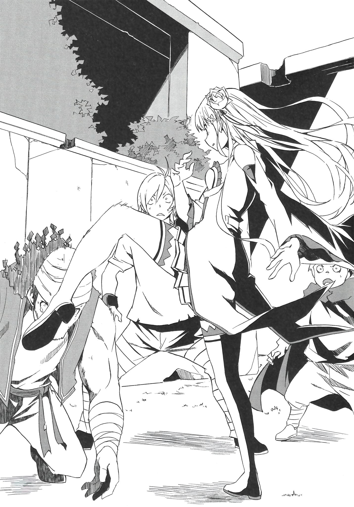

В момент, когда Эмилия поняла, что её драгоценный знак отличия вытащили из кармана, она приказала низшим духам скоординироваться и нацелила ледяную сосульку в спину злоумышленника.

— Это опасно, лучше не двигайтесь!

Голос, похожий на серебряный колокольчик, призвал к осторожности, и люди на улице, услышавшие его, замерли. Маленькая девочка с развевающимися золотыми волосами и чёрной лентой двигалась сквозь просветы между ними словно ветер.

Сосульки, созданные из маны, полетели прямо в ноги бегущей девочки. Издавая звук, похожий на свист летящей стрелы, сосульки приближались к девушке со скоростью пули. Но девочка бежала, не обращая внимания на эту атаку, словно зная, что у атакующего нет желания задеть её. Сосульки, не попавшие в цель, вонзились в стену соседнего магазина и в землю, а затем исчезли, потеряв свою форму. Спустя мгновение затишья люди засуетились.

— Что это!? Это драка!? — Закричал один из прохожих.

— Какого чёрта вы творите в таком людном месте!? — Крикнул другой.

Слушая это, Эмилия гналась за маленькой фигурой, которая скрылась в переулке.

— Боже! Что же сегодня творится! — Воскликнула она.

Разлучилась с сопровождающей меня девушкой, деньги из моей сумочки были потрачены на еду с питьём. Думала, что смогу поладить с милой кошко-девочкой, но сейчас я нахожусь в ситуации, когда украли то, что мне дорого.

— Выглядишь неважно, Лия, — пробормотал кто-то с внешностью кота и размером с ладонь, неторопливо умывая лицо, находясь на плече Эмилии.

Тот, кто бормотал возле её уха, был Великим Духом, Паком. Он связан контрактом с девушкой.

— У меня неприятности, Пак! Мои знак отличия украли! У меня будут большие неприятности, если я не верну его, Розвааль рассердится на меня!

— Если ты думаешь, что он просто рассердится, то тебе стоит серьёзнее задуматься над этим… А дитя, которое украло его, похоже, довольно умелое. Гляди.

— А?

Эмилия, болтающая с Паком, остановилась, забежав в подворотню. Прямо перед ней в конце дороги, напоминающей лабиринт, возник тупик.

Я почти уверена, что бежала по тому же пути, что и воровка, и я уверена, что дорога не могла иметь в конце никаких поворотов или изгибов.

— Мы могли пропустить боковую улицу, или она могла быстро перепрыгнуть через стену, — предположил Пак.

— Я… Я тоже умею карабкаться по стенам, — нерешительно ответила Эмилия. — Мне нужно догнать её, иначе…

— Если она ушла, повернув в сторону, то перелезать через стену было бы лишь пустой тратой времени. Ты ведь понимаешь это, верно? Нам нужно обдумать всё более тщательно.

Когда Пак проговорил это, скрестив свои короткие руки, они услышали свисток охранника, доносившийся с улицы. Вероятно, это свистел стражник из королевской столичной гвардии, который услышал переполох, вызванный магией Эмилии.

— У нас могут быть неприятности, если стража найдёт нас, — сказал Пак. — Что ты хочешь сделать?

— Если я объясню им ситуацию, интересно, помогут ли они мне найти знак отличия? — Поинтересовалась Эмилия.

— Они-то может и помогли бы тебе, но я не думаю, что это хорошая идея. Ты ведь знаешь причину и без моих объяснений, верно, Лия?

— Знаю… Это потому, что я кандидатка. Будет хлопотно, если они узнают о том, что я потеряла свой знак отличия.

— Отлично. — Пак сцепил свои мягкие лапы вместе и похвалил Эмилию тихим хлопком.

Эмилия надула щёки и посмотрела на стену перед собой, затем щёлкнув пальцами, создала лестницу изо льда. К тому времени, когда стражники подбежали к тупику, сереброволосой девушки и ледяной лестницы уже и след простыл.

— Мы далеко ушли от переполненных суматохой улиц и переулков, но… Что нам теперь делать? — Спросила Эмилия.

— Не лучше ли будет встретиться со служанкой? — Ответил Пак. — Я думаю, что поиск этой девушки будет легче, чем поиск того, кто украл знак отличия. Она всё же ярко выделяется.

После того, как им удалось уйти от стражников, Эмилия и Пак проводили стратегическое совещание на тему того, что делать дальше, на улице, что была напротив бродвея с прилавками торговцев, того самого, где был украден знак отличия.

— Было бы замечательно, если бы Рам могла помочь нам, — сказала Эмилия. — Но будет ли это правильно? Мне кажется, что я слишком часто нарушаю приказы Розвааля.

— Не отходи от того, кто тебя сопровождает. Не трать деньги. Не устраивай беспорядки. Не теряй свой знак отличия — это не то, о чём он думал упомянуть. Хммм, ты никак не избежишь ругани, не находишь?

— Мне начинает казаться, что я должна решить всё это сама.

— Бояться того, что твою ошибку раскроют, а после совершать ещё больше ошибок из-за этого… Я думаю, что ты явно идёшь по пути разрушения, и ничто тебя не остановит.

Эмилия надулась на Пака, который продолжал строить из себя шута, но его аргументы были весьма здравыми. Было бы гораздо мудрее сообщить о сложившейся ситуации с мыслью о том, что тебя отругают, а не продолжать усугублять ситуацию. Однако это может привести Эмилию к худшему из возможных для неё исходов.

— Но что мне делать, если Розвааль откажется от меня, сочтя меня бесполезной? — Спросила Эмилия.

— …

— Я не могу позволить этому случиться. Сейчас Розвааль — мой союзник, но возможно, что он перестанет им быть до того, как состоятся Королевские Выборы. Я не хочу быть ему чем-то обязанной, пока они не начнутся.

Эмилия мысленно представила себе коварного мужчину, который был её покровителем.

У нас с ним общие интересы, и я не хочу, чтобы баланс сил склонялся в сторону кого-то из нас.

— Что ж, моя дочь — та, кто выбирает тернистый путь, — сказал Пак, пожав плечами, услышав мысли Эмилии и виляя своим длинным хвостом.

Эмилия улыбнулась и опустила брови в ответ на реакцию своей семьи, с которой она была вместе долгое время. — Мне жаль, что я постоянно доставляю тебе неприятности, — сказала она.

— Это то, чего не следует говорить… Ну что же, тогда нам нужно сделать всё возможное, чтобы найти эту воровку. Интересно, что мы должны делать? Солнце уйдёт за горизонт, если мы так и будем продолжать вслепую рыскать по огромной Королевской Столице. У тебя есть какой-нибудь план?

— Посмотрим… Как насчёт того, чтобы держать глаза широко открытыми и искать очень усердно?

— Это вот и означает искать вслепую, Лия. Мне удалось краем глаза увидеть воровку, но по внешнему виду она был похожа на ребёнка. Да и одежда воровки не кажется такой уж чистой.

— Ты имеешь в виду, что у неё нет денег? Ты прав, раз уж она что-то украла.

Эмилия кивнула на умозаключение Пака, соглашаясь с ним, затем сразу после этого хлопнула в ладони, когда поняла, что он хотел до неё донести.

— О, точно! Раз у неё нет денег, значит, она из трущоб, о которых я слышала, когда меня водили по Столице! Это место, где собираются безработные и бездомные. Ты намекаешь, что воровка может быть оттуда!

— Именно этого я и ожидал от тебя, Лия. Даже я не мог предположить, что ты сможешь угадать то, о чём я думаю…

— Хорошо, давай обыщем место, названное трущобами. И после этого…

Решив, что будет делать, Эмилия уже собралась отправиться в путь с приподнятым духом, но остановилась, сделав лишь шаг. Её взгляд устремился на маленькую фигурку на другой стороне улицы. Там беспомощно скрючившись, сидела маленькая девочка с заплаканным лицом.

— Лия.

— Я… Я знаю, Пак. Я сейчас очень занята. У меня совсем нет времени беспокоиться о девочке, что находится в беде. Мне нужно торопиться.

Эмилия стала оправдываться, ничего не сделав после того, как её окликнул Пак, который пристально смотрел на неё. И даже сказав, что у неё нет времени на заботу о девочке, она не проявила никаких признаков того, что собирается двигаться дальше, заставив Пака вздохнуть.

— Независимо от того, насколько сильно кто-то старается, моя дочь всегда будет доброй девочкой, так почему бы тебе не поговорить с ней?

— Всё хорошо?

— Если ты задаёшь вопрос, хорошее или плохое время ты выбрала, то плохое. Но если ты спрашиваешь, хороший ли это поступок или плохой, то это хороший поступок. Так что давай, совершай свой хороший поступок, в плохо выбранное время.

Лицо Эмилии засияло, и, получив разрешение Пака, она направилась к девочке. Девочка, заметив, что Эмилия смотрит на неё сверху вниз, испугалась при виде незнакомки, но…

— Я знаю, что могу показаться назойливой, но разве отец и мать сейчас не с тобой?

Она спросила её, добродушно улыбаясь, словно позабыв о своей ситуации.

В результате Эмилии пришлось приложить немало усилий, чтобы сделать потерявшегося ребёнка менее настороженным. Похоже, родители дали ей хорошее воспитание, раз она не горит желанием разговаривать с незнакомцами. Чтобы преодолеть эту стену, им нужно было сделать первый шаг — назвать друг другу свои имена. Преодолев эту стену, Эмилия с помощью своей магии создала маленькие ледяные цветы и ледяные скульптуры животных, что сняли настороженность, и, наконец, она завоевала доверие девочки, используя свой главный козырь: Танцующего Пака.

Люди приняли ледяные цветы и ледяные скульптуры животных за какое-то уличное шоу, поэтому она получила немного мелочи от проходящих мимо людей, которые останавливались, чтобы это лицезреть. После этого она купила несколько шампуров в лавке с едой, потратив заработанные деньги, и насладилась ими вместе с маленькой девочкой.

— Лия, Лия. Ты случайно не забыла о своей цели?

— Нет… Нет, я не забыла. Смотри, она сейчас полностью расслабилась, как я и планировала.

— Ты ведь знаешь, что выглядишь не очень убедительно с соусом вокруг рта?

Держа руку девочки, они каким-то образом добрались до фруктового магазина, которым управлял отец девочки. Девочка вскочила на огромного мужчину с белым шрамом на лице, и тот — отец девочки — горячо поблагодарил Эмилию. Мать девочки, которую с ней разлучили, тоже была в магазине, и оба родителя склонились перед Эмилией, заставив ту занервничать.

— Ты спасла мою дочь, поэтому я хочу отблагодарить тебя. Можешь просить меня о чём угодно.

Эмилия покачала головой, сказав, что не хочет ничего взамен. Но для неё стало неожиданностью, когда продавец сказал, что она может попросить его о чём угодно. После того, как она рассказала ему о своей проблеме, ей показали дорогу к трущобам и название дома, где продают награбленное.

— Говорят, что это место, где легкомысленные люди обменивают украденные товары на деньги, но я бы не советовал туда ходить. Я не держу на тебя зла, но думаю, что было бы разумнее сдаться…

— Уммм…

Эмилия хотела сказать, что это не то, от чего она может отказаться, но засомневалась, так как ничего не изменится, даже если она расскажет этой семье о своём положении. Это заставило бы их тоже волноваться.

— Я понимаю. Спасибо за предупреждение. Очень жаль, но видимо ничего не поделаешь.

— Да, так будет лучше. Мне жаль, что я не смог помочь… Эй?

Отец кивнул с облегчением, когда Эмилия сделала вид, что сдалась. И тут маленькая девочка проскользнула мимо него и протянула руки к Эмилии. В её руке красовалось украшение в виде красного цветочка. Эмилия посмотрела на улыбку девочки, потом на цветочек, не зная, что делать.

— Пожалуйста, возьми его. Похоже, моя дочь хочет отблагодарить тебя по-особенному.

Эмилия робко взяла цветочное украшение, и девочка широко ей улыбнулась.

— Спасибо. Я о-о-о-о-очень счастлива.

Эмилия прижала цветочное украшение к груди и улыбнулась девочке искренней улыбкой от всего сердца.

Помахав на прощание семье девочки, Эмилия направилась в сторону трущоб, аккуратно убрав цветочек. Улицы стали пустыми и можно было заметить, как атмосфера начала понемногу сгущаться.

— Хммм, как и ожидалось от трущоб. Люди, живущие здесь, бедны как по карману, так и по характеру.

— Не говори таких грубых вещей, Пак. Это неуважительно по отношению к этим людям. — Эмилия отругала его, хоть и не могла сказать, что обстановка в этом районе была хорошей.

Обстановка городского пейзажа, который был оставлен гнить, после его возведения без капли стараний казалась тесной, особенно для Эмилии, которая долгое время жила в лесу.

— Притон значит, да? Это звучит смело, судя по названию, но стоит ли нам его искать?

— Да, я не могла узнать никаких подробностей о том, где он находится, так как не хотела заставлять её отца волноваться. Но послушают ли меня здесь вообще?

— Давать деньги в обмен на информацию — это норма, но у нас их нет.

— Сдачи, которую мне дали, было в как раз достаточно для двух шампуров. Такая точная сумма — это действительно большо-о-ое совпадение, — с гордостью сказала Эмилия, но Паку было трудно что-либо ответить.

Прямо сейчас их поиски значка шли полным ходом. Поиски родителей пропавшей девочки, которые, можно сказать, были просто обходным путём, принесли свои плоды, и они смогли разузнать полезную информацию.

Было бы отлично, если такими темпами им удалось бы найти девушку, укравшую инсигнию, однако…

— С кем это вы так долго говорите, молодая леди?

Настойчивое расследование Эмилии было прервано человеком с явным злым умыслом. Мужчина средних лет с густой бородой и в грязной одежде перегородил узкую тропу перед Эмилией. Более того, ещё двое мужчин появились позади, зажав её с двух сторон.

— Гораздо лучше поговорить с нами, нежели с воображаемым другом. Что скажешь? Мы не причиним тебе вреда… Хаа? Что здесь забыла такая прекрасная жемчужина? Похоже, в этот раз нам повезло, парни.

— Прекрасная жемчужина?.. Мне кажется, я не такая круглая… Неужели я толстая?

— В её личико было вложено много денег. Нам действительно попался джекпот. Она первоклассная как внутри, так и снаружи.

Даже не услышав волнения Эмилии, возникшего из-за её непонимания, мужчина средних лет двинулся к ней с развратным дыханием. Заметив, что двое мужчин позади неё тоже медленно приближаются, Эмилия прижалась спиной к стене.

— Хе-хе, видимо, ты сдалась. Всё хорошо. Даже если ты глупая, я наслажусь…

— До вечера осталось не так много времени, и я не могу напрягать Пака слишком сильно. Так что, возможно, сейчас будет немного больно, но…

— Аа? Нет уж, больно сейчас будем делать…

— Хаа!

На этом и закончились бредни мужчины. Эмилия, прислонившись к стене, сместила позицию противников в одну сторону. Она подняла свою длинную стройную ногу и с размаху опустила каблук на голову очарованного мужчины.

От резкого удара глаза мужчины закатились назад, и он рухнул на землю, шокировав своих спутников. Получив преимущество, Эмилия быстро подошла к одному из них и сильно толкнула в грудь, опрокинув его. Последний потянул к ней руки, но её струящиеся серебряные волосы, танцующие на ветру, проскользнули сквозь его пальцы.

— Получай! — Крикнула Эмилия, ударив мужчину ногой в челюсть, а затем, оттолкнувшись от неё, отправила его в полёт. Приземлившись, Эмилия направилась к человеку, которого она толкнула.

— Не двигайся! Если ты двинешься, то… Ммм, что бы мне сделать?

— Если ты двинешься, то я подарю тебе ужасное времяпровождение вместо этой доброты. Тебе ясно?

Пак пригрозил мужчине с плеча Эмилии, так как она ещё не решила, что сказать, а его шерсть уже встала дыбом. Увидев, как избили его спутников и как появился дух, мужчина потерял желание сопротивляться.

— Спрашивай нас о чём хочешь. Мы скажем тебе всё, что ты хочешь знать. Хе-хе-хе…

Мужчина послушно улыбнулся, и Эмилия хлопнула в ладоши, как бы подтверждая, что ситуация для неё благоприятная.

— Итак, вы можете сказать мне, где находится притон? Я была бы счастлива, если бы вы что-нибудь знали об этом.

Применив слегка насильственные методы, чтобы разобраться со злодеями, Эмилии удалось найти склад с награбленным.

Эмилия, положив руку на талию, наклонила голову к стоящему перед ней дому: — Интересно, повезло ли мне сегодня?

— Если бы тебе повезло, то твою инсигнию не украли бы, начнём с этого. Но ты правда смогла добраться сюда без серьёзных проблем… Может, тебе повезло в плохом смысле?

— Что значит «повезло в плохом смысле»?

— Это как если бы тебе приходилось терпеть боль, равноценную твоему успеху… Например, ты упала и поранила ногу, но благодаря этому ты смогла найти монету.

В случае Эмилии её инсигния была украдена из-за невезения, но найти того, кто её украл так быстро — это то, что может произойти только благодаря невероятной удаче. Итак, оставалась лишь одна проблема…

— От того, что я сделаю сейчас, будет зависеть, смогу ли я вернуть её или нет.

— Да, так и есть. У нас есть немного времени до заката, так что используй меня как следует.

Подбадривая Пака, Эмилия кивнула и направилась к двери притона. Это было довольно большое здание, примыкающее к внешней стене Королевской Столицы. По словам бандитов, которых Эмилия побила, хозяином дома был огромный мужчина, привыкший к тяжёлым ситуациям, а эта шустрая девчонка могла быть даже там, поэтому они не могли позволить себе не быть осторожными.

Руки Эмилии рефлекторно направились к груди. Именно там находилось украшение в виде красного цветка, которое ей подарила девочка.

Хотя ещё ничего не кончилось, Эмилия вспоминала различные события, произошедшие в Столице по пути сюда. Она разделилась с Рам, которая сопровождала её, играла с кошко-девочкой, у неё украли инсигнию, она помогла потерявшемуся ребёнку, и в конце концов оказалась здесь, в притоне. Много хорошего и плохого успело произойти.

Нужно сделать всё так, чтобы завершить этот день со словами «Это был отличный день». Мне нужно взять себя в руки, потому что здесь никто не встанет на мою сторону…

— Лия, тот, кто внутри, уже заметил нас, — прошептал Пак ей на ухо, пока она стояла перед дверью, думая, что сказать, когда она войдёт внутрь. Прежде чем она успела ответить, они почувствовали, что кто-то бежит к двери. А потом дверь открылась…

— Не открывай! Нас убьют!!!

Сразу после этого она услышала отчаянный крик мальчика с ужасным видом, от чего она разозлилась. Это было очень грубо. Неужели он думает, что за дверью стоит кто-то настолько злонамеренный?

Увидев Эмилию, стоящую перед дверью, блондинка, на которую падал вечерний свет, отступила назад. Эмилия последовала за девушкой в притон и оглядела людей внутри.

— Я бы никогда не стала делать что-то настолько страшное. Зачем мне убивать кого-то ни с того ни с сего? — Спросила Эмилия тихим голосом, слегка надувшись.

То, что произошло после этого, было не историей Эмилии, а историей другого мальчика. Однако в результате Эмилия узнала, что суетливый день в Королевской Столице всё-таки может закончиться благополучно.

И последнее: её уверенность в том, что за дверью она не встретит никого, кто встал бы на её сторону, опроверг парень с яркой и весёлой улыбкой, который впоследствии произнесёт: «Я хочу, чтобы ты назвала мне своё имя».
