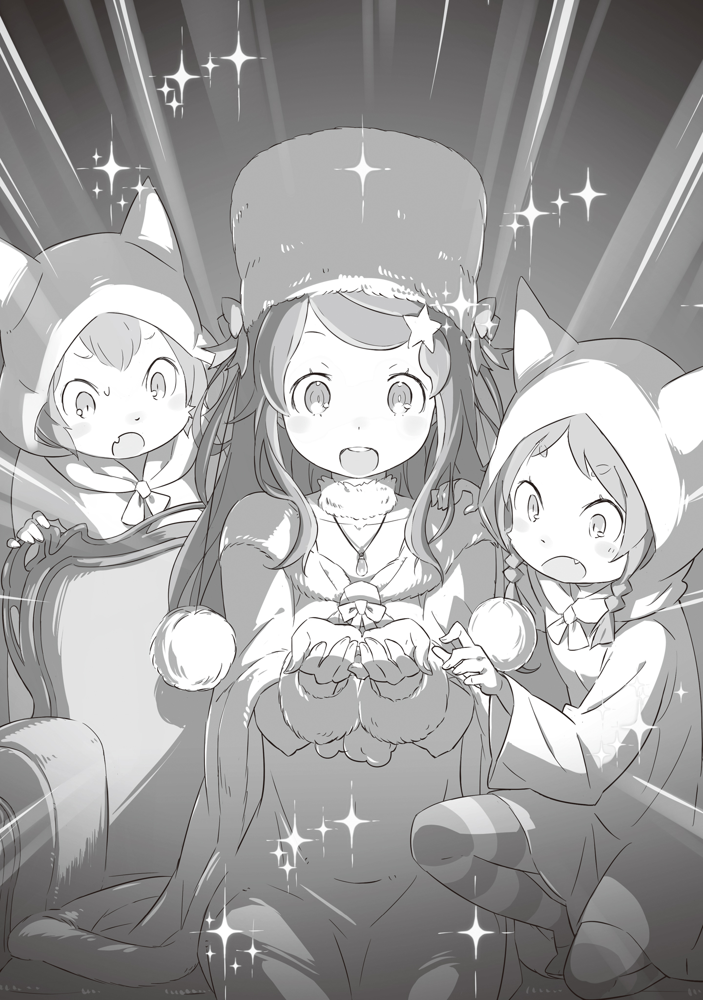

Заметив, что назначенное время приближается, Юлиус Юклиус взглянул на небо.

— Скоро… Я вечно теряю счёт времени, работая с документами.

Сняв очки, он слегка потёр уставшие от мелкого шрифта глаза. Юлиус всегда их надевал, исполняя обязанности дворянина и снимал, принимая облик рыцаря. Эта деталь была частью его философии — он считал важным разделять эти две роли.

— Нии-сама, пора готовиться.

Через пару мгновений раздался стук в дверь кабинета, и спокойный голос повторил.

— Юлиус?

— Я уже заканчиваю. Спасибо, что напомнил, Йешуа.

— Поставь себя на моём месте. Ты сам сказал мне, что это важная встреча для нашего Дома, а значит, и для всего Королевства Лугуники. Конечно, я волнуюсь.

В комнату вошёл молодой человек с благородными чертами лица, волосами, собранными в аккуратный хвост, и мягкой, располагающей улыбкой. Это был Йешуа Юклиус, младший брат и верный помощник Юлиуса. Несмотря на хрупкое телосложение и отсутствия таланта к фехтованию, он обладал острым умом и легко справлялся с тем, что давалось брату с трудом.

— Нии-сама? Что-то случилось?

— …Нет, ничего. Просто задумался. Всё в порядке.

— Хорошо. Тогда я приберусь здесь, а ты иди переоденься к встрече с гостьей.

— Я мог бы сделать это сам, но… у тебя это получается лучше, Йешуа.

— Ха-ха. Это так. К тому же, невежливо заставлять даму ждать.

С этими словами он подмигнул брату, чем немало удивил Юлиуса, несмотря на всю его природную галантность.

— Не ожидал от тебя такой шутки, Йешуа. У кого ты этому научился?

— У кого же ещё, как не у тебя, брат?

Его немедленный ответ стал ещё одним сюрпризом для Юлиуса, который, впрочем, согласился с оценкой Йешуа и задумался о своём поведении рядом с братом.

— Рада знакомству. Я Анастасия Хосин, президент Торговой компании Хосин, — произнесла с приветливой улыбкой девушка в гостиной. На вид она была совсем юной и невысокой. У неё были волнистые фиолетовые волосы, а тело прикрывало белая меховая накидка. Её мягкие губы всегда были сложены в улыбке, а светло-голубые глаза, казалось, успокаивали любого собеседника. Юлиус не был исключением — очарование девушки захватило его, и ему потребовалось несколько секунд, чтобы прийти в себя.

— Взаимно. Меня зовут Юлиус Юклиус, наследник Дома Юклиус. Благодарю вас, что согласились на встречу, Анастасия-сама.

Приложив руку к груди, он сделал изящный поклон. Глядя на этот формальный жест, девушка слегка приподняла брови.

— Всё в порядке, не будем слишком формальны. Ты ведь сам меня разыскал. Я согласилась на эту встречу, полагая, что она может быть нам обоим полезна.

— Рад это слышать. Не возникло ли проблем во время поездки? Я пытался предвидеть все возможные неудобства, но если что-то доставило вам дискомфорт, пожалуйста, скажите мне.

— Всё прошло отлично, спасибо. Даже не знаю, на что пожаловаться. Скорее, я боюсь, что отвлекаю тебя от важных дел своим визитом, — сказала она с застенчивой улыбкой.

У Анастасии был заметный акцент, характерный для могущественной западной страны Карараги, федеративного города-государства. Происхождение этого акцента было тесно связано с историей самой страны.

Беспокойство на лице девушки можно было заметить, проследив за её взглядом — он был направлен на то, что происходило за спиной Юлиуса.

— Ух ты! Сколько у тебя дорогих вещей, мистер! Всё такое блестящее! Круто!

— Онее-чан, успокойся… Не трогай чужие вещи! Если что-то упадёт…

— Смотри, Хетаро! Золото! Я вся в золоте!

— С-с-с-сестра…!

В комнату вбежали двое маленьких детей и стали играть в углу. Ни один из них не доставал Юлиусу до пояса — это были кошкоподобные полулюди с ярко-рыжим мехом, одетые в белые курточки. Судя по разговору, это были брат и сестра. Девочка постоянно хватала всё, что попадало под руку, а брат был в недоумении от ее поведения.

— Мне жаль так, что так получилось, но она не со зла. Надеюсь на ваше понимание, — сказала Анастасия.

— Я не настолько строг, чтобы ругать детей за то, что они дети. Но позвольте узнать, кто они?

— Формально — мои телохранители. Внешность обманчива, они довольно сильны. Уступают только капитану моего отряда, который остался с торговцами.

Объяснение Анастасии удивило Юлиуса. Он снова посмотрел на полулюдей. Если они действительно сильны, то, несмотря на милую внешность, принадлежат к известной личной армии Анастасии.

— То есть они из «Железного Клыка»?

—Именно. Более того, они вице-капитаны. На самом деле, их трое — тройняшки, — но третий, который гораздо лучше разбирается в финансах, остался дома в наказание.

Было известно, что «Железный Клык» — сильнейшая наёмный отряд в Карараги, состоящий на эксклюзивной службе Торговой компании Хосин. Они вмешивались только в самых крайних ситуациях.

— В любом случае, сегодня просто первая встреча, так что не обращайте на них внимания. Уверяю вас, я не намерена затевать драку. Наоборот, я хочу поддерживать с вами хорошие отношения.

— Всё же прошу прощения за свою реакцию. Будучи Королевским рыцарем, я слишком бурно отреагировал, узнав, что они принадлежат к такому элитному отряду.

— Знаешь, твоя реакция довольно необычна — многие просто не верят.

Глядя в расчётливые глаза Анастасии, Юлиус вспомнил, с кем имеет дело. Несмотря на юный возраст, у неё уже был внушительный список достижений, она успешно проявила себя в жестоком мире карарагийской торговли. А теперь хотела расширить свой бизнес в Лугунике.

— Что ж, перейдём к делу. Королевство Лугуника переживает экономический спад, казна практически пуста, и управлять страной становится всё труднее. Я права?

Юлиусу стоило усилий сохранить невозмутимое выражение лица, поскольку Анастасия сразу перешла к острой теме. Вопрос о тяжёлом финансовом положении Лугуники был крайне щепетильным. Эта информация была скрыта от большинства дворян; даже те, кто работал в правительстве, не были в курсе всех деталей. И уж тем более об этом не должны были знать иностранцы.

— Прежде чем ты начнёшь искать виноватых, уверяю тебя — никто не разглашал секретной информации. К такому выводу я пришла, основываясь на собственных наблюдениях в городе.

— Наблюдениях…?

— Переговоры начинаются задолго до того, как стороны сядут за стол — с изучения предмета обсуждения. Думаю, ты тоже собрал информацию обо мне? А я предпочитаю ходить своими ногами и видеть всё своими глазами.

Наслаждаясь тонким ароматом чая, Анастасия изложила свою философию как нечто само собой разумеющееся.

Первоначально встречу с Анастасией предложил Юлиус, который заинтересовался Торговой компанией Хосин. Компания стремительно развивалась в Карараги и обладала огромным потенциалом. Он подумал, что можно привлечь её в Лугунику для восстановления экономики. Теперь на Юлиусе лежала вся ответственность за то, чтобы правильно направить девушку, дабы его план не обернулся против него. Однако сейчас именно Анастасия полностью контролировала ситуацию.

— Честно говоря, Лугуника в её нынешнем состоянии меня не очень интересует. Даже если моя компания выйдет на ваш рынок, прибыль будет временной. Потому что очень скоро администрация королевства развалится, а я не хочу вкладывать деньги и ресурсы, зная об этом.

Она не стеснялась в резких оценках. Однако Юлиус, как член семьи Юклиус, прекрасно понимал, насколько верны её слова, и не знал, что ответить, предпочитая молчать. Но Анастасия продолжила:

— Однако… я вижу потенциал в Доме Юклиус. Не только в тебе, но и в твоём брате, он тоже весьма способный. Даже если королевству суждено пасть, я не считаю плохой идеей поддерживать хорошие отношения с вашим Домом.

— …

Это была явная провокация. Даже понимая это, Юлиус молчал, потому что слова Анастасии завораживали его.

В этот момент его голос, жесты, взгляд — всё это было оружием, которое Анастасия могла использовать в переговорах.

Сейчас Юлиус был её противником, которого она должна победить. Поэтому…

— …К сожалению, это невозможно. Дом Юклиус поклялся в абсолютной верности королевству Лугуника и разделит его судьбу. Наша задача — сделать всё возможное, чтобы этого не допустить.

— …

Уверенный и решительный ответ Юлиуса поразил её. Она ожидала отказа, но не такой категорического. В её широко раскрытых от удивления глазах Юлиус разглядел нечто новое, что показалось ему даже более привлекательным, чем её привычная деловая хваткость.

— Эй, мисс! Смотрите, мисс! Разве это не круто?! Это так круто! — в разговор вмешалась маленькая девочка-получеловек, хихикая как безумная. Затем она повернулась к Юлиусу с лучезарной улыбкой.

— Мистер, это ваше? Почему оно похоже на ящерицу?

— Это не ящерица, а дракон. Символ нашего королевства.

— Мими! Перестань донимать Юлиуса. Иди сюда, дай мне это.

То, что девочка по имени Мими держала в руках, было знаком отличия с драгоценным камнем посередине. Это был предмет огромной важности для королевства Лугуника, и он должен был храниться в безопасном месте.

— Анастасия-сама. Простите за бестактность, но этот знак отличия — очень ценный артефакт…

— Да, я прошу прощения. Конечно, я верну его. Но посмотрите, как он красиво светится!

Девушка улыбнулась, заметив, что камень на знаке отличия слегка сияет, и смотрела на него как заворожённая.

Однако больше всех присутствующих был поражён сам Юлиус.

Ведь это сияние могло означать только одно. Он невольно опустился на колени.

— Анастасия-сама. Похоже, нам нужно обсудить ещё более важный вопрос.

Анастасия прикрыла глаза, увидев резкую перемену в поведении Юлиуса, который начал обдумывать возможные последствия произошедшего.

Президент Торговой компании Хосин, иностранка, решила, что Лугуника не представляет для неё никакой ценности.

Но что, если бы у неё появился шанс взглянуть на королевство изнутри? Изменила бы она своё мнение?

Более того, что бы она сделала, если бы могла непосредственно влиять на судьбу королевства?

— …

А если она согласится стать частью того, что символизировало сияние знака отличия…

Что выберет сам Юлиус?

《Конец》
