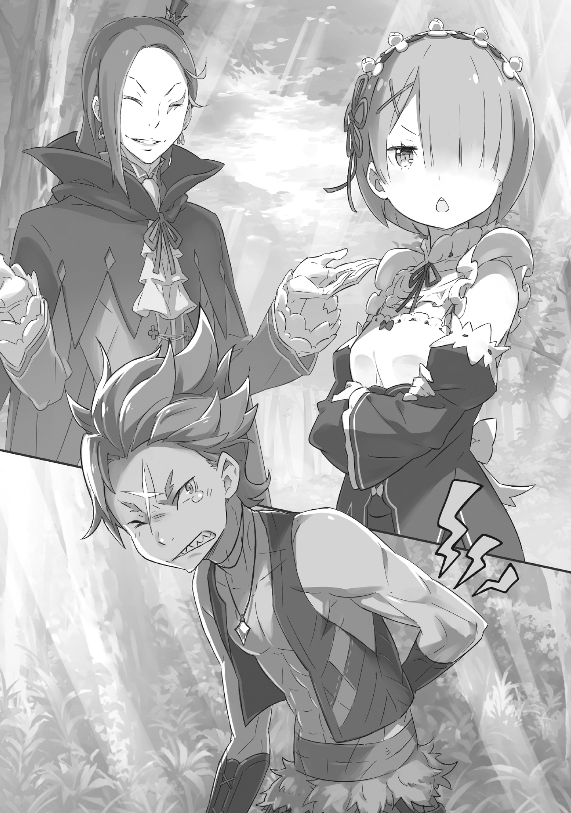

— На северной окраине владений маркграфа Розвааля L. Мейзерса, достопочтенного господина, которому служит Рам, есть место, называемое «Затерянный лес Кремальди».

Хотя лес и не велик, он известен странным свойством: попавшие в него теряют счёт времени и чувство направления, поэтому выбраться из него — задачка не из лёгких. Поэтому до сих пор неизвестно, что скрывается в его глубине, за что он и получил своё прозвище — «Затерянный лес».

Впрочем, для тех, кто знает путь, особенность «Затерянного леса» — не преграда. Это касается и Розвааля, хозяина этих земель, и служащей ему Рам, и всех обитателей «Святилища», укрытого в самой глубине леса.

— Йо, Рам. Опять пришла нянчиться с этим грёбаным ублюдком?

Окликнутая сзади грубым голосом, Рам остановилась и тихо вздохнула.

Знакомый тембр. Слегка резкий акцент, особая манера чуть растягивать окончания слов. Голос, который трудно забыть, но от которого сердце не трепещет. Хотя она и чувствовала стоящую за этой фамильярностью привязанность, даже нечто большее.

— Какое приветствие. Оскорблять господина Розвааля — ты, я посмотрю, многое возомнил о себе.

— Ха! Оскорблять? Не преувеличивай. То, что крутой я огрызаюсь на этого ублюдка, — дело привычное. Как говорится, «С Кетрареком не примириться».

На слова Рам, сказанные с лёгкой резкостью, последовало дерзкое возражение. И затем, прежде чем Рам успела обернуться, собеседник обошёл её и предстал прямо перед ней, показав своё лицо.

Короткие золотистые волосы стояли дыбом, на открытом лбу выделялся белый шрам. Изумрудные глаза смотрели по-звериному остро, и это впечатление только усиливал рот, полный клыков, острых, словно бритвы.

Свирепость проявлялась и в одежде. Лёгкая одежда, явно рассчитанная на свободу движений и без стеснения выставлявшая напоказ тренированное тело, была, без преувеличения, полной противоположностью тому, кого Рам избрала сердцем.

Оказавшись лицом к лицу со столь знакомым человеком, Рам тяжело вздохнула прямо ему в лицо.

— Чего это ты, посмотрев человеку в рожу, сразу вздыхаешь? Не думаешь, что это невежливо, а?

— Читаешь Рам нотации о плохих манерах? Посмотрел бы сперва в зеркало, хорошенько подумал, а потом бы и приходил. Мы давно не виделись, и если при первой же встрече на тебя лишь вздыхают, значит, проблема в тебе, не так ли?

— Говоришь всё, что взбредёт в голову. Невероятная женщина. Хотя в этом-то вся и прелесть.

Пропуская мимо ушей колкости Рам, полные яда, собеседник лишь весело щёлкнул клыками и под конец отвесил ей комплимент. На это Рам вздохнула ещё тяжелее, чем раньше.

— Сколько бы лет, сколько бы раз, сколько бы ты ни продолжал — все бесполезно. Чувства Рам уже отданы другому. Быстро сдавайся и отступай, Гарф.

— Шансы невелики? Вот это по мне! Как раз поэтому тебя и стоит отвоевать!

Сколько уже раз повторялся этот диалог?

На твёрдое заявление Рам, её собеседник — Гарфиэль Тинзель — не выказал ни малейшего колебания, напротив, выпятил мускулистую грудь и гордо отрезал.

На такое сильное проявление воли Гарфиэля, Рам лишь устало покачала головой и пробормотала:

— Подумать только, скольких мужчин Рам сразила своей красотой, просто беда.

— Говорить подобное без тени сомнения — в этом вся Рам, не так ли?

И в этом — в готовности без колебаний следовать зову сердца — они и впрямь были похожи.

«Святилище» — это своего рода скрытая деревня, расположенная в самой глубине «Затерянного леса Кремальди».

Официально его, вероятно, следовало бы называть «Святилище Кремальди», но поскольку само существование «Святилища» держится в тайне, его чаще всего называют просто «Святилище».

Это земля со своей историей, населённая преимущественно полукровками — потомками людей и полулюдей, теми, в ком течёт смешанная кровь. Контакты с внешним миром здесь сведены к минимуму.

В этом месте, где большинство жителей являются «смешанными», чистокровные не приветствуются. То же самое касается и Рам, выжившей из клана Они, — никто не горел желанием говорить с ней.

Впрочем, есть и некоторые исключения — например, Гарфиэль и ему подобные.

— Вообще, Гарф, какого черта ты тут прохлаждаешься? Господин Розвааль и госпожа Рюдзу как раз должны сейчас разговаривать. …И все же, Гарф, ты вроде как одна из ключевых фигур «Святилища». Постыдился бы пренебрегать своими обязанностями.

— Я ещё ничего не сказал, а ты уже делаешь выводы! Ну да, признаю, сбежал, потому что все эти обсуждения — та ещё морока, ты угадала.

— Бесстыдник.

— Беспощадная!

Гарфиэль шёл рядом с Рам, шагающей по поросшей тёмно-зелёным мхом земле внутри «Святилища». Глядя на юношу рядом, который смотрел в ясное небо и вздохнул, Рам прищурила свои светло-алые глаза.

В этот раз Рам посетила «Святилище» в качестве сопровождающей своего господина, Розвааля.

Это особые земли во владениях Розвааля, и порядки здесь иные. Жители не только освобождены от налогов, но и получают щедрую поддержку, так что место это напоминает скорее заповедник или охраняемую территорию, чем обычные владения. Настолько, что за спиной Розвааля люди шепчутся о его «Любви к полулюдям» и «смешанным», к которым он так благоволит. Однако дело тут не только в доброй воле, а…

— В том, что жители живут здесь, есть смысл. Вот как-то так.

— А? Ты что-то сказала?

— Рам сказала, что ей неприятно, когда ты идёшь рядом. Иди на полшага позади.

— Это ведь какой-то жутко древний обычай из Карараги, верно?

Демонстрируя неожиданную эрудицию, Гарфиэль склонил голову набок с весьма довольным видом. Несмотря на то, что их обмен репликами был исключительно колким, от одного этого он выглядел почему-то радостным, а Рам опустила глаза.

От его надежды, имеющей мало шансов на взаимность, и от его решимости бросить вызов этой безнадёжности, у неё вырвался вздох, в котором смешались изумление и усталость.

— И всё же, вы сегодня прибыли в «Святилище» не по обычному расписанию, верно? Случилось что-то особенное?

Небрежное бормотание Гарфиэля вернуло Рам к реальности. Глядя на юношу, который, сгорбив свою не слишком высокую спину, стоял сутулясь, Рам вздохнула в который уже раз и сказала:

— Подробности как раз сейчас должен обсуждать господин Розвааль. Если тебе интересно, надо было с самого начала участвовать в разговоре.

— Не хочу слышать это из его уст. Хочу услышать от тебя, Рам.

— …Господин Розвааль привёл в особняк полуэльфийку. Это важная персона, связанная с его заветным желанием. Существо, которое не чуждо и этому «Святилищу».

— …

Гарфиэль, не скрывавший своей симпатии к Рам и враждебности к Розваалю, впервые изменился в лице, услышав последовавший ответ Рам. Будучи человеком, чьи эмоции обычно были яркими, а чувства легко читались на лице, его безэмоциональный вид нёс в себе леденящую жуть, от которой становилось не по себе.

— “Не чуждо”…?

— Я же сказала — полуэльфийка. «Смешанные» без исключения подвержены влиянию барьера. Условия те же, что и для жителей «Святилища», для госпожи Рюдзу и остальных. Понимаешь?

— Значит, «Испытания» Гробницы…?

Коротко пробормотал Гарфиэль, прикрывая рот рукой. Юноша, обычно не скрывавший ни острых клыков, ни буйного нрава, лишь в минуты раздумий принимал позу, удивительно напоминавшую одного человека.

Вспомнив о том, кто и сейчас должен ждать их возвращения в особняке вместе со своей любимой младшей сестрой, Рам подумала про себя, что кровь — не водица.

— Значит, эту полудемоницу можно считать ключом к снятию барьера, верно?

— По крайней мере, господин Розвааль должен обсуждать это именно с таким намерением. Гарф, ты наверняка услышишь то же самое и от госпожи Рюдзу.

— Рам, ты уже общалась с этой полудемоницей, да? Какая она на самом деле?

Низким голосом Гарфиэль серьёзно задал вопрос.

Услышав это, Рам тоже вызвала в памяти образ полуэльфийки — девушки, назвавшейся Эмилией, — вспомнила их короткую встречу и ответила.

— Честно говоря, надежды мало. Не думаю, что от неё можно чего-то ожидать.

— Ну вот, опять ты говоришь слишком честно!

Гарфиэль сморщил нос, решив, что это слишком суровое мнение. Но Рам, тем не менее, продолжила говорить, делясь своими впечатлениями об Эмилии.

— Ей не хватает знаний. Понимание ограничено. Решимость поверхностна. Воля слаба. Самосознания недостаточно. Честно говоря, ей не хватает буквально всего, и сказать, что она везде плоха, — было бы великодушием. Я слышала об условиях, в которых она находилась ранее, так что место для сочувствия есть, но… в нынешних условиях на неё нельзя возлагать никаких надежд.

— Ну и разгромная же оценка! Этот ублюдок… он что, окончательно с катушек съехал?! Ай!!!

— Непочтения к господину Розваалю я не потерплю. Я тебя сейчас ударю.

— Не говори это после того, как ударила! Ах, моя бедная спина…!

Потирая спину в том месте, куда пришёлся удар Рам, Гарфиэль оскалил клыки и завыл.

Искоса взглянув на него, Рам поделилась с ним своими текущими впечатлениями об Эмилии в качестве предварительного вывода. По правде говоря, она не принижала её чрезмерно — это было её честное мнение.

— Той девушке-полуэльфийке недостаёт всего. Фатально недостаёт.

— Но это касается лишь “сейчас”, не так ли?

До сих пор у неё не было возможности. Поэтому отныне они дадут ей эту возможность.

Возможность учиться. Возможность изучать мир. Возможность обрести решимость. Возможность принять решение. Мы дадим ей возможность осознать себя.

Если, получив всё это, она так и не избавится от своих бесчисленных недостатков, вот тогда на ней можно будет поставить крест.

Но до тех пор, по мнению Рам, ещё слишком рано формировать окончательное мнение об этой девушке.

Ведь Эмилия — та, кого Розвааль объявил необходимой для исполнения его заветного желания.

— По расчётам, уже в этом году по-настоящему начнётся великая битва — борьба за трон королевства. До тех пор госпоже Эмилии необходимо усвоить то, что требуется.

— А, Королевский отбор, значит? Я слышал, что король-то помер… постой-ка, эй!

Связывая воедино разные события, Гарфиэль внезапно запнулся. Широко распахнув глаза, он, словно пытаясь подавить волнение, щёлкнул клыками и продолжил: — Неужели…

— Этот ублюдок Розвааль, он что, собирается выдвинуть эту полудемоницу на Королевский отбор? Он вообще в своём уме?

— Непочтение к господину Розваалю…

— Какое, к черту, непочтение! Это совершенно здравое мнение! Какой кретин попытается поставить во главе страны полудемоницу, подобную «Ведьме Зависти»?! Это «Гробница Ведьмы Жадности»! Этот ублюдок Розвааль, сколько же бед он собирается на нас навлечь?!

В гневе топнув ногой по земле и скрипнув зубами, Гарфиэль словно раздулся. От исходившей от него неудержимой, звериной боевой ауры на миг показалось, будто фигура Гарфиэля стала на голову выше — нет, это была не иллюзия.

Волосы на всем теле юноши встали дыбом, его скелет затрещал, трансформируясь, — и прямо перед этим…

— Успокойся, Гарф.

— …

Гарфиэль, окутанный свирепой демонической аурой, выказывал признаки трансформации в зверя. Приложив ладонь к его щеке, Рам, глядя своими светло-алыми глазами в его изумрудные, тихо обратилась к нему. Их взгляды встретились, и в глазах, которые были на грани потери рассудка, медленно обрёл прежний блеск.

Затем, моргнув несколько раз, Гарфиэль неловко отвёл взгляд от её позы и пробормотал: — П-прости… Крутой я немного… это… перегнул палку…

— Не утруждай Рам по пустякам. Я прощаю тебя лишь потому, что мы давно знакомы. Вообще-то, Рам бы оставила тебя гореть в гневе господина Розвааля до самого конца.

— Больно, больно, больно, больно!…

Перейдя от прикосновения к щипку за щеку, которой она касалась, Рам болью побудила Гарфиэля к раскаянию. Затем, словно отталкивая, она убрала руку, и Гарфиэль, прижав ладонь к своей покрасневшей щеке, с укоризненным видом уставился на Рам.

— Рам, ты…

— Так тебе и надо… ой, я оговорилась. Ты в порядке?

— Точно врёшь! Такая же явная ложь, как «Хрустальный Дворец Рапганы пал»!

Увидев, как он шумно возмущается, Рам почувствовала, что её гнев утих, и решила считать инцидент с его недавней глупой выходкой исчерпанным. Эта её уступчивость, похоже, передалась и ему: Гарфиэль пятернёй грубо взъерошил волосы на своей голове.

И затем, после лёгкого колебания, он медленно открыл рот…

— Ну и ну, ты же знаешь, как это бывает, Рам. Крутой я просто… эта часть тебя…

— О-о-о, так вот вы где, Рам, Гарфиэль.

— Но, ах!…

Гарфиэль отвел взгляд и собирался продолжить, но замер, когда в разговор вмешался голос третьего лишнего. Вместо него Рам обернулась к говорившему.

— Господин Розвааль. Я ждала вас.

Рам, до этого сохранявшая невозмутимое выражение лица, озарилась прелестной улыбкой. В её голосе появилась теплота, и, казалось, даже свет в глазах стал ярче.

Эта перемена была тем, чего никогда не случалось в её разговорах с Гарфиэлем. И все же, тот самый человек, которому была адресована улыбка Рам, лишь небрежно кивнул.

— Про~о~ошу прощения, что заставил ждать. Наш разговор благополучно завершился, я полага~а~аю. Рам, ты давно не виделась с Гарфиэлем, удалось ли тебе возобновить вашу старую дру~у~ужбу?

— Да, вполне.

На вопрос мужчины в наряде шута — Розвааля — Рам без колебаний кивнула. От её ответа, решительного до жестокости, Гарфиэль заскрежетал зубами, и Розвааль перевёл на него взгляд.

— Всё, что ну~у~ужно было обсудить, я рассказал старейшине. Остальное услышишь от неё~ё~ё. В этот ра~а~аз я не могу надолго задержаться. Про~о~ости, если заставил скучать?

— С чего бы мне скучать?! Вали, вали! Оставь Рам и проваливай отсюда побыстрее… Ай!!!

— Разумеется, Рам не останется. Я тебя сейчас ударю.

— Не говори это после того, как ударила! А-а, чёрт побери!

Рам вздохнула, глядя на Гарфиэля, который тут же получил по заслугам за свою грубость и аж прослезился от боли. Глядя на эту парочку, Розвааль, прищурив свои разноцветные глаза, слегка улыбнулся и сказал:

— Ну и ну~у~у, как вы близки. Да так, что даже у меня сердце щеми~и~ит.

Пробормотал он почти неслышно, будто говоря это не всерьёз.

Истинный смысл этих слов Розвааля прояснится лишь полгода спустя.

Начнётся Королевский отбор, в поддерживающий Эмилию особняк Розвааля ввалится шумный черноволосый юноша, различные судьбы придут в движение — и история достигнет вехи «Святилища».

И именно тогда — начнётся долгое, долгое исполнение заветного желания человека в наряде шута.

《Конец》
