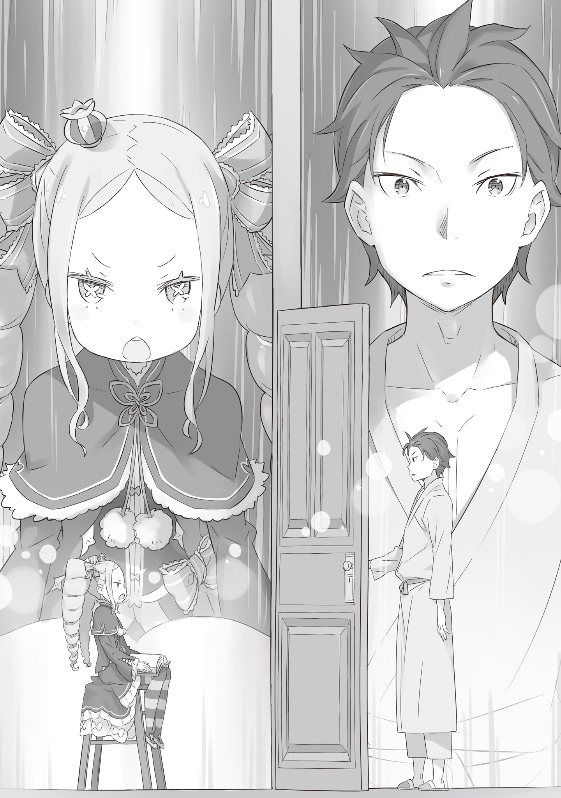

Закончив читать, она с мягким стуком аккуратно закрыла книгу.

Закрыв толстую, искусно переплетённую книгу, лежавшую на её коленях, девушка издала вздох, который казался несочетаемым с её детским обликом, на котором каким-то образом лежала тяжесть лет.

Девушка сидела на старой стремянке, сделанной из дерева. Одетая в элегантное платье, с завитыми светлыми волосами кремового цвета, она была похожа на куклу.

Девушку звали Беатрис — она была библиотекарем этой наполненной тишиной библиотеки, известной как «Запретная библиотека», и искусной волшебницей, что провела здесь не один год.

Беатрис: Сколько бы раз я ее ни читала, «Гильотина Магрицы» никогда не теряет своего очарования; просто шедевр, я полагаю.

Удовлетворённо прошептав самой себе, Беатрис провела пальцами по названию книги, лежащей у неё на коленях.

Бесчисленные полки и бесчисленные книги, собранные на них. Истории за историей, признанные шедеврами, специализированные трактаты из прошлого, которые теперь было трудно приобрести, или даже запрещённые книги, историю которых никто не знал; «Мудрость», существовавшая в Запретной библиотеке в виде книг, была безгранично велика.

В море книг, которые невозможно прочесть за всю жизнь, неудивительно, что были истории, которые Беатрис любила и перечитывала снова и снова. Книга, которую она только что закончила читать, также была одной из таких историй.

Беатрис: Какую книгу прочитать дальше, я полагаю?

Спокойствие, царившее в Запретной библиотеке, было для Беатрис наилучшим из возможных условий, так как она сама была и библиотекарем, и читателем.

С помощью заклинания Беатрис, известного как «Пересечение дверей», Запретная библиотека была полностью изолирована от внешнего мира. Не только свет и тьма были закрыты, но даже надоедливые межличностные отношения не могли быть привнесены в это место. Единственное, что издавало звуки в комнате, была она сама, и здесь было бесчисленное множество книг для чтения — поистине утопия, от которой у книголюба потекли бы слюнки.

Однако…

Беатрис: Конечно, после жанра трагедии, что-то, что облегчит сердце…

???: Беатрис-сама…

Беатрис: Ммм, потерять себя в другой трагедии, всё ещё испытывая это чувство меланхолии, было бы…

???: Беатрис-сама? Где вы?

Беатрис: Было бы забавно прочитать ту же историю ещё раз, с самого начала…

???: Беатрис-сама…? Беатрис-сама…?!

Беатрис: Аааа! Да сколько можно шуметь, я полагаю?!?

Спрыгнув со стремянки, она побежала к двери библиотеки с книгой, всё ещё зажатой под мышкой. Когда она положила руку на ручку двери, открыв её, на мгновение в пространстве между Запретной библиотекой и внешним миром, с которым она соединялась, возникло искажение. Прорвав это тонкое, похожее на плёнку ощущение, Беатрис вылетела в коридор особняка. В конце коридора, лицом в другую сторону, стояла синеволосая девушка; Беатрис смотрела ей в спину.

Беатрис: Ты уже давно продолжаешь эту шумную суету, я полагаю! Какие именно дела у тебя с Бетти в столь поздний час?

???: Мои извинения, Беатрис-сама. Но слава богу. Значит, вы ещё не спали.

Беатрис всё ещё прижимала книгу к груди, сделав при этом нахмуренное лицо, когда девочка повернулась к ней.

В направлении этого взгляда Беатрис подошла девушка, одетая в форму служанки. Она была младшей из сестёр-служанок, отвечавших как за особняк, так и за его обитателей — более способной. Её звали Рем, не так ли?

Когда Рем предстала перед Беатрис, она вежливо склонила голову перед ней, хоть вторая внешне и выглядела намного моложе её, и сказала,

Рем: Так получилось, госпожа Беатрис, что господин Розвааль зовёт вас. Похоже, есть дело, в котором ему просто необходима ваша помощь.

Беатрис: Если он поручил слуге позвать меня, значит, он очень высокого мнения о себе, я полагаю. Похоже, он забыл, что между ним и Бетти нет иерархических отношений.

Рем: ……

Пока Беатрис демонстрировала плохое настроение, в котором она пребывала после того, как ей помешали читать, Рем хранила молчание. Высказать своё мнение и навлечь на себя недовольство Беатрис или Розвааля было бы крайне неприятно.

Видя, как Рем напрягла щёки и уголки глаз, пытаясь сохранить спокойное выражение, Беатрис вздохнула.

Несмотря на то, что она превосходила старшую сестру в способностях, какая-то часть её менталитета все же отставала. Ей также казалось, что старшая сестра просто намного выше среднего в этом отношении, но всё это не имело значения для Беатрис.

Беатрис: …Ааа. Поторопись и покажи Бетти дорогу, пока она не передумала, я полагаю.

Рем: …! Да, спасибо. Рем проводит вас.

Когда юная девушка согласилась пойти на компромисс, Рем почувствовала облегчение, снова склонив голову.

Беатрис не очень хорошо умела скрывать свои чувства. Да и вряд ли ей удастся скрыть свои мысли от кого-либо, кто не лишён восприятия. Впрочем, таких ненаблюдательных людей было не так уж много.

Пока Беатрис размышляла об этом, неожиданно в глубине её сознания раздался голос. Это не был голос, имеющий чёткую форму, но благодаря тому, что он раздался с «силой», его намерения передавались четко.

Беатрис: Мм… Я получила инструкции от Паки. Похоже, вам следует приготовить горячую воду, чистую мочалку и комнату для одного гостя, я полагаю.

Рем: Комнату для гостей?

Беатрис: Именно так. Похоже, эта полубезумная девчонка приведёт кого-то с собой, я полагаю.

С таким видом, будто кто-то принёс что-то неприятное для неё, Беатрис издала мрачный вздох.

Следуя за служанкой, обдумывающей свои указания, Беатрис поправила хватку на книге, которую всё ещё держала при себе.

Беатрис: Боже правый, это же столько хлопот.

Оглядываясь назад, Беатрис была совершенно потрясена тем, насколько плохо все, кроме неё самой, справлялись со своими обязанностями.

…Оставим пока в стороне то, как плохо она справлялась со своими обязанностями и желанием вмешиваться в чужие дела: она забыла привести в порядок свои книги и, не в силах выносить шум за пределами, казалось бы, тихой Запретной библиотеки, поспешила покинуть её.

???: О-о, Боже, ты нашла её гораздо быстрее, чем я предпо-о-олагал. Была ли это победа упорной решимости Рем… или, возможно, просто поражение воли Беатрис бороться дальше?

Когда парочка, ведомая Рем, прибыла в прихожую особняка, высокий мужчина находившийся там повернулся к ним лицом.

Это был странный человек с длинными волосами цвета индиго, белым макияжем на лице и эксцентричной одеждой. Звали его Розваалем L. Мейзерсом, а сам он являлся хозяином этого особняка и давним знакомым Беатрис.

Когда он весело посмотрел на неё, Беатрис сузила глаза и тихонько фыркнула.

Беатрис: Ты, наверное, очень высокого мнения о себе, раз вызвал меня подобным образом. Не стоит отдавать такие жестокие приказы собственным слугам.

Розвааль: Несмо-о-отря на это, я ожидал, что вероятность того, что ты появишься, будет выше, если я попрошу Рем поискать те-е-ебя, чем если бы искал сам. В само-о-ом деле, если бы я начал обыскивать весь особняк, тебя бы это так развлекло, что ты бы не вышла меня встречать, не та-а-ак ли?

Беатрис: ….Теперь, когда ты заговорил об этом, это может быть правдой, я полагаю.

Вид Розвааля, который никогда не терял своей расслабленности, разгуливающего по особняку в её поисках, был бы редким явлением. Поскольку это была Рем, она сжалилась над ней и показала своё лицо, но она не могла отрицать возможности того, что если бы это был Розвааль, она бы уделила немного времени, чтобы насладиться его выражением лица.

Розвааль: Видишь, всё как я и сказа-а-ал.

Беатрис: Хмф, когда ты стоишь с таким видом, будто видишь всё насквозь, меня это не очень радует. Ну что, ещё не пришло время для поручения, ради которого ты позвал Бетти?

Розвааль: Само поручение должно прибыть в ближайшее время… Рем?

После своего претенциозного ответа Розвааль позвал Рем, которая стояла у него под боком. Девушка слегка приподняла свои голубые волосы и приложила руку к уху.

Рем: … Да, чувства, которыми делится сестра, становятся всё ближе. Похоже, скоро они доберутся до ворот. Можно ли Рем пойти и поприветствовать их?

Розвааль: Я буду рад, если ты это сделаа-а-аешь. Не думаю, что возникнут проблемы, но будь осторожна.

Кивнув на наставления Розвааля и поклонившись Беатрис, Рем направилась ко входу. Когда она открыла большие двери и вышла на улицу, в поместье подул прохладный вечерний ветерок, и по ту сторону двери можно было разглядеть территорию перед особняком и парадные ворота. Возле железных ворот стояла драконья карета, поднявшая облако пыли.

На водительском сиденье кареты сидела девушка, идентичная Рем — её старшая сестра-близнец.

Беатрис: Старшая из сестёр тоже вернулась; я бы хотела поскорее увидеть Паки.

При виде возвращения своей единственной семьи выражение лица Беатрис смягчилось. Лучшим исходом было бы просто радоваться новой встрече, но тут были и те мысли, которые были посланы ей ранее, и призыв Розвааля. Не может быть, чтобы всё закончилось так просто.

Розвааль: Возвращение твоего дорогого старшего брата…… но-о-о-о, я немного ревную. Мы с тобой тоже старые знакомые, но ты никогда не делала для меня такого лица.

Беатрис: Не стоит говорить такие жуткие вещи, я полагаю. И ты ведёшь себя слишком явно, знаешь ли. Тебя не интересует ни Бетти, ни кто-либо другой, я полагаю. У тебя на уме только один человек, знаешь ли.

Розвааль: Хоро-о-ошо, в этом ты не ошибаешься. Но это не значит, что говорить то, что я хотел бы хорошо поладить с тобой — ложь… Хотя этот вопрос стоит отдельно от этого.

Беатрис: Я не могу чувствовать ничего, кроме беспокойства по этому поводу, я полагаю.

Одновременно с этим лицо Беатрис напряглось при словах Розвааля, и Рем встретилась перед воротами со своей старшей сестрой Рам. После того как сёстры о чём-то переговорили, они тут же двинулись к карете, из которой спустилась сереброволосая девушка… Для Беатрис это был человек, который ввёл её в сложное душевное состояние.

Но на этот раз был кто-то, кто привлёк её внимание больше, чем сереброволосая девушка. Это был…

Беатрис: Кажется, с ними ехал какой-то черноволосый, мрачного вида парень.

Розвааль: Я уверен, что ты это поняла, но это и есть причина, по которой я тебя позва-а-ал.

Беатрис: Ты не можешь быть серьёзным, я полагаю.

Поняв, что её опасения попали прямо в цель, Беатрис нахмурила брови и стала ждать прибытия девушек.

Мальчик, которого спускали из кареты, был без сознания, и сёстры-горничные поднимали по одной части его тела, которое раскачивалось взад и вперёд, когда они пытались сдвинуть его с места.

???: Ум, гм! Этот мальчик мне очень помог, поэтому…… я бы хотела, чтобы вы несли его немного осторожнее…… Вы меня слушаете? Это выглядит очень болезненно, знаете ли.

Рядом с мальчиком, которого несли две сестры, бежала сереброволосая девушка, взволнованная и обеспокоенная. Ни на её плече, ни в серебристых волосах не было никаких признаков маленькой тени, которую искала Беатрис.

Беатрис: ……Кажется, я вытащила короткую палочку, я полагаю.

Вздох Беатрис отдавал возрастом, что совершенно не вязался с её детской внешностью.

Оказалось, что мальчик, которого принесли сёстры, приложил решающие усилия для решения проблемы, возникшей у сереброволосой девушки, Эмилии, во время её путешествия в столицу.

Как было сказано, после того как у Эмилии по неосторожности украли её драгоценную эмблему, он не только упорно выяснял её местонахождение вместо полуэльфийки и пытался сделать то-то и то-то, чтобы вернуть её девушке, но и рисковал собственной жизнью, чтобы защитить Эмилию.

Беатрис: Ах, это слишком подозрительно, я полагаю. Нет сомнений, что этот парень — шпион или что-то в этом роде, знаете ли. Полагаю, лучше всего было бы покончить с этим делом и дать ему умереть естественной смертью.

Рам: Хм, это довольно удобно. Что вы хотите, чтобы мы сделали, Эмилия-сама? Позволить ему умереть?

Эмилия: Почему вы говорите такие жестокие вещи!? Пожалуйста, помогите ему.

Взволнованная холодным предложением Беатрис, которая выслушала её объяснение, и Рам, которая дала короткий ответ, Эмилия попросила исцеления для мальчика.

У потерявшего сознание парня была довольно серьёзная рана в животе. В настоящее время она была закрыта только с помощью магии исцеления, и даже если оставить всё как есть, можно было ожидать, что он поправится, если будет спокойно отдыхать.

Правда, речь шла только о том случае, если он не будет делать абсолютно ничего, кроме как лежать в постели.

И у неё возникло ощущение, что этот мальчик, оставшись один, точно не останется в постели.

Беатрис: Выбор невелик, поэтому я вылечу его, но… это то, чего я обычно совершенно не делаю. Я делаю тебе одолжение, так что завтра ты позволишь мне взять Паки на весь день, я полагаю.

Эмилия: …! Очень хорошо. Если ты так хочешь, я обязательно поговорю об этом с Паком. Спасибо, Беатрис. Я в долгу перед тобой.

Беатрис: …… Это старомодный способ благодарить, знаешь ли.

Эмилия: А!?

Не обращая внимания на удивление Эмилии, Беатрис приступила к лечению мальчика и покончила с этим. Для огромной силы Беатрис, хранительницы Запретной библиотеки, это была пустяковая задача.

Несмотря на это, она потребовала достойного вознаграждения, так что условия были для неё вполне неплохими. Было бы неприятно, если бы их отношения переросли в нечто подобное, когда к ней обращаются по мелочам. Беатрис не была ничьей девочкой на побегушках.

Она была библиотекарем Запретной библиотеки, не больше и не меньше — в этом вопросе она никогда не отступала.

Беатрис: Ну вот, я его вылечила, полагаю. Об остальном позаботьтесь, как вам будет угодно. Следите за тем, чтобы он не перенапрягался, я полагаю.

Эмилия: Ммм, спасибо, Беатрис. Я в долгу… Я… Я очень благодарна!

Беатрис: Это тоже звучит старомодно, знаешь ли.

Когда Эмилия открыто улыбнулась, Беатрис отметила это выражение и отвернулась от неё. С таким прямым взглядом ей было трудно иметь дело, но у Беатрис не хватило воли сказать Эмилии об этом прямо.

Позаботившись об исцелении мальчика, Беатрис быстро удалилась в Запретную библиотеку.

Скорее всего, мальчик проснётся утром. Хотя его тело было восстановлено, ему потребуется время, чтобы восстановить выносливость после такого истощения. Тем не менее, исцеляющая магия Беатрис была способна восстановить выносливость, так что маловероятно, что останутся какие-либо серьёзные проблемы.

Беатрис: Похоже, что те девушки тоже вернулись в свою комнату; наконец можно вернуться к спокойной ночи.

Усевшись на стремянку в центре комнаты, она вздохнула, потирая свои колени. Запретная библиотека, по сути, была защищена от влияния внешнего мира, но Беатрис обладала широким восприятием, и именно оно позволяло ей понимать, что происходит внутри особняка. В конце концов, спокойствие, которое так любила Беатрис, наступало только тогда, когда все обитатели особняка крепко спали.

Однако сегодня ночью было слишком много суеты. Почему-то ей даже не хотелось перечитывать книгу, которую она несла в руках.

Беатрис: Это была такая приятная ночь, а теперь посмотрите, что из этого вышло. У Паки кончилась мана, он отдыхает, и я не смогу увидеть его до утра; ну и денёк, я полагаю. Если всё должно было так обернуться, зачем Бетти…… Хм.

Когда ночь неохотно подходила к концу, Беатрис тихонько напевала себе под нос.

Как и было сказано ранее, Беатрис знала, что происходит в особняке, как свои пять пальцев. Что-то не давало ей покоя. Это было…

Беатрис: Комната того раненого мальчика. Полагаю, он очнулся.

Особое внимание к его положению, на случай внезапных изменений, дало свои результаты. Почувствовав, что мальчик встал с кровати и начал двигаться, Беатрис поджала губы.

«Быстро» — подумала она. Конечно, её исцеление было идеальным. Она была уверена, что полностью восстановила мальчика, без единого шрама, но он как-то странно быстро привык к магии исцеления. Если такое возможно, то либо в его организме есть что-то особенное, либо он хорошо совместим с магией Беатрис.

Беатрис: Ах, фу, фу, фу, фу, фу, фу, фу, фу, фу, фу, фу, фу, фу, фу, фу, фу, фу, фу, фу, фу, фу, фу, фу…

Отвращённая тем, что сама же придумала, Беатрис почувствовала тошноту в груди. В тот же миг в её сердце зародился замысел использовать этого мальчика, чтобы избавиться от тошноты.

Беатрис: Теперь, когда всё решено, я, пожалуй, немного поиграю с ним.

Сидя на стремянке, Беатрис полностью задействовала силу своей теневой магии и «переделала» пространство одного этажа особняка — угол, включающий комнату для гостей, в которой находился мальчик.

Исходя из комнаты для гостей, в которой он находился, она соединила пространство конца коридора с другим концом, образовав бесконечный коридор. Иллюзия сделала невозможным увидеть, где коридоры пересекаются, а для окон она выбрала вечную темноту, без малейшего признака света.

Этим она завершила создание ловушки. Не имея возможности определить, в какую сторону идти, и не имея выхода, мальчик будет психологически загнан в угол.

Беатрис: Кроме того, любая дверь, кроме правильной двери…… двери в первую комнату, будет иметь особый приём, я полагаю. Твоё тело забудет о гравитации, твоё сознание и осознание реальности будет прямо противоположными, и даже сами комнаты будут перевёрнуты, я полагаю.

Ей казалось, что она немного перестаралась с контролем и изменением своей территории, но всё же Беатрис была довольна результатом.

Кстати, в этом розыгрыше использовалось множество различных заклинаний магии теней, которые были утеряны со временем, и некоторые исследователи магии упали бы в обморок, если бы увидели, как её неправильно используют таким образом, но Беатрис это не волновало.

Беатрис: Исполни же грандиозный танец на ладони Бетти!

Это, это, и всё это было исключительно для того, чтобы увидеть, как мальчик бешено бегает, сопли текут у него из носа. Она просто выпускала пар после того, как не смогла встретиться со своим братом, так что, хотя он и спас чью-то жизнь, он мог хотя бы немного развлечь её…

???: …Или, возможно, первая дверь — это выход, как это обычно и бывает.

Дверь Запретной библиотеки со щелчком открылась, и внутрь заглянула глупая физиономия.

Мгновенное суждение, мгновенный выбор, немедленный прорыв — ощутив чувство напрасной траты сил, которое не было подходящей компенсацией за затраченный труд, Беатрис сделала своё самое кислое лицо.

Беатрис: …Какой же ты невыносимый человек, я полагаю.

И тогда она впервые испытала ощущение, которое в последующие дни будет повторяться снова и снова.

Это было началом конца спокойных дней, проведённых ею в Запретной библиотеке.

《Конец》
