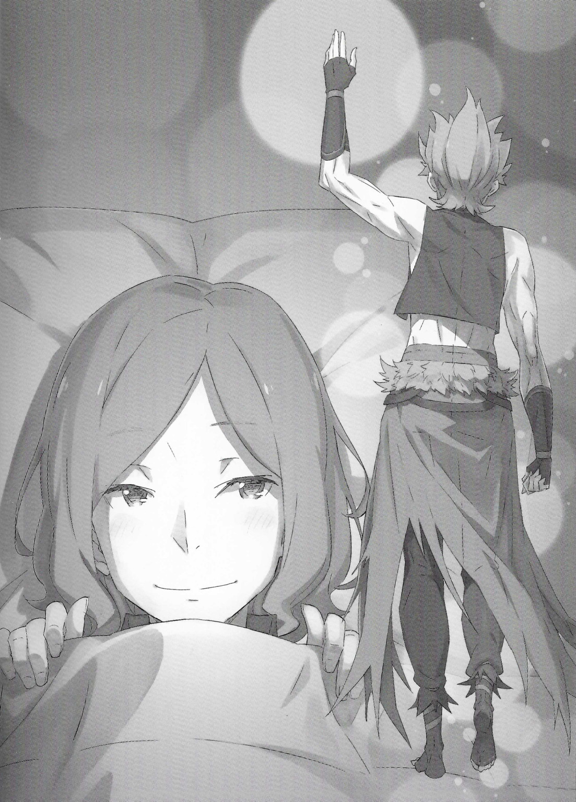

Отто: «Значит, восстановление разрушенной ратуши — настолько срочное дело?»

???: «Да, всё так, как я и сказал. Конечно, это только после того, как с вопросом еды, одежды и жилья для жителей будет покончено, но для общественного мнения нехорошо, если сердце города будет вечно лежать в руинах. Есть одна вещь, которую нельзя игнорировать ни при каких обстоятельствах, — это беспокойство людей. Иметь даже один большой столп для опоры имеет большое значение».

Отто: «Так вот оно что?»

???: «Вот так вот».

И с кроткой улыбкой Отто Сувен пожимает плечами на слова Киритаки Мьюза.

В настоящее время Киритака является главным представителем Города Водных Врат… молодой человек, занявший пост мэра города, неоднократно отвечал Отто.

Киритака: «Спасибо за вашу помощь. Изначально я был самым молодым членом Совета Десяти, поэтому я не был знаком с подобными вещами и не мог с этим справиться. Я спешу выбрать следующих кандидатов, но…»

Отто: «Это будет трудно, учитывая, что на днях Совет Десяти стал мишенью».

Киритака: «Вы правы…»

Пока Киритака опускает голову с обеспокоенным выражением лица, Отто смотрит в окно вдалеке. Небо было пышным и мучительно ясным. Под чистым безоблачным небом продолжаются работы по восстановлению разрушенного города, и за последние несколько дней наконец-то начала поступать помощь из других регионов. Благодаря этому им удалось избежать забот о еде и других предметах первой необходимости.

Отто: «Наверное, это к лучшему. Сейчас даже вполне подходящее время года, в каком-то смысле».

Киритака: «Если бы это был сезон огня или сезон льда, ущерб был бы намного больше. Я не думаю, что работы по восстановлению шли бы так гладко. Вот почему мы должны действовать быстро».

Отто: «Согласен».

Даже если текущий сезон хорош, со временем сезон сменится. Это преимущество необходимо использовать с максимальной эффективностью, чтобы подготовиться к тому времени, когда погода станет действительно суровой.

Отто: «Однако нынешняя ситуация, должно быть, сложная. Я благодарен за всю вашу поддержку…».

Киритака: «Людей, которые хотели бы воспользоваться этой возможностью, чтобы воспользоваться пятью крупными городами не мало. Я буду иметь это в виду. Вы предупреждали меня об этом».

Сказав это, Киритака сделал глубокий вдох, чтобы выразить свою решимость, а затем встал. Молодой человек, несущий на своих плечах судьбу города, протянул руку Отто. В ответ на его просьбу о рукопожатии Отто пожал руку другому мужчине в ответ.

Отто: «Мне жаль это говорить, но я желаю вам удачи, Киритака-сан».

Киритака: «Спасибо. Я рад, что смог помочь вам с вашей консультацией. Кроме того, мне жаль, что я обратился к вам с такой просьбой…».

Отто: «Всё в порядке. Пожалуйста, приходите ещё. В конце концов, с моими ногами не всё в порядке».

Смеясь, Отто указал на свои ноги, которые были… плотно перевязаны и подвешены над койкой. Увидев это, Киритака криво улыбнулся и…

Киритака: «Насколько я слышал, ваши раны снова открылись от того, что вы слишком много двигались. Пожалуйста, берегите себя».

Отто: «Было бы неплохо иметь здесь какое-нибудь занятие, которое позволило бы мне осуществить ваше желание».

Отто ответил, наполовину в ужасе, наполовину в беспокойстве, ругая себя.

И вот, когда Киритака ушёл из больничной палаты…

Отто: «Почему бы тебе не войти, Гарфиэль?».

Отто окликнул со своей койки человека за дверью, которую Киритака закрыл после своего ухода.

Услышав зов Отто, дверь медленно открылась… Нет, не дверь комнаты, а окно.

Гарфиэль: «Не угадал. Я тут, Отто-бро!»

Отто: «Что!? Окно — это не вход. Почему ты входишь таким образом?!».

Гарфиэль: «Потому что через окно лучше слышно, что происходит в комнате, чем через дверь».

Сказав это, Гарфиэль схватился за оконную раму и легко проскользнул в комнату. На мгновение брови Отто нахмурились, и он уже собирался пожаловаться на вид его ног.

Гарфиэль: «Не волнуйся. Я снял обувь, прежде чем лезть на стену».

Отто: «Я не об этом беспокоюсь… ты подслушиваешь чужие разговоры».

Гарфиэль: «Извини. Я должен выполнять свои обязанности военного офицера фракции».

Гарфиэль бросил туфли, которые зажал под мышкой, и ответил, надевая их обратно. Причина, по которой Отто скривил горькую гримасу на его ответ, заключалась в том, что его оправданием были приказы не кого иного, как самого Отто.

Гарфиэль и Отто, слабо проявившие себя в сражении за город Водных Врат, поклялись стать сильнее и полезнее. Гарфиэль как военный офицер, а Отто как министр внутренних дел, на благо всех во фракции.

Гарфиэль: «Вот почему я должен следить за общественной жизнью Отто-бро».

Отто: «Если мы начнём шпионить за личными отношениями членов фракции, это даст нам ощущение конца организации. Не так ли? Разве не было какой-то истории об этом?».

Гарфиэль: «Ах, точно, “Гильотина Магриззы”».

«Гильотина Магриззы», одна из самых известных историй, передаваемых из поколения в поколение, — это история о королевской семье, борющейся за власть.

В этом произведении было развитие событий, в котором отец-король, постаревший и подозрительный, начал контролировать действия своей семьи и окружения, и в конце концов был вынужден покинуть свой трон.

Гарфиэль: «Но так не будет. Крутой я не сомневается в тебе, а верит в тебя».

Отто: «Думаю, это тоже логика “Безумного Короля”…»

Гарфиэль: «…Крутой я просто беспокоится о тебе».

Внезапно Отто замолчал, когда Гарфиэль понизил голос вот так. Прищурив свои зелёные глаза, Гарфиэль искренне посмотрел на Отто. Затем рука Гарфиэля нежно потянулась к подвешенной ноге Отто.

Гарфиэль: «На следующий день после принятия такого важного решения мой брат заставил себя открыть свои раны. Я уверен, что мой брат не очень-то рад этому».

Отто: «Ай-ай-ай-ай-ай-ай-ай! Ой, ой, ой! Подожди, Гарфиэль?».

Гарфиэль: «В последнее время я задавался вопросом, не нравится ли Отто-бро боль так же сильно, как Капитану. Пожалуйста, будь осторожнее».

Отто: «А-а-а! Твой палец в ране! Он застрял внутри! Больно! Больно!».

Гарфиэль говорил серьёзно, но это не дошло до корчащейся головы Отто. Однако гнев его младшего брата был оправдан, поэтому ему придётся терпеть боль. Несколько безучастный Отто, его отношение заставило Гарфиэля долго и тяжело выдохнуть.

Гарфиэль: «В конце концов, Отто-бро любит чувствовать боль…».

Отто: «После всей той боли, что ты мне причинил, я отказываюсь принимать твою оценку!».

Гарфиэль: «Разве это не то, что называют “Жаркой ночью в Мэри Грей”?».

Отто: «Таков список людей, которые известны тем, что умерли из-за своих специфических наклонностей…».

Это был конец дворянина, который умер ночью в своих личных покоях из-за довольно зловещего хобби. Многие годы причина его смерти была неизвестна, но владелец Божественной защиты, которая позволяет видеть воспоминания предметов, раскрыл правду. После этого владелец Божественной защиты, как говорят, пустился в бега из-за негодования семьи этого дворянина, которая стыдилась его бесчестного поведения.

Как ни странно, это история, с которой Отто имеет нечто общее, но было действительно неприятно, что его упомянули вместе с этим дворянином. Недовольство Отто было отброшено Гарфиэлем коротким: «Ладно, ладно».

А потом…

Отто: «Так? Какая была твоя истинная причина для подслушивания?».

Гарфиэль: «…Ничего такого, просто подумал, что будет плохой идеей прерывать ваш разговор».

Отто: «Гарфиэль».

Гарфиэль: «Это правда. Я полагаюсь на Отто-бро. Я не должен вмешиваться».

Скрестив свои сильные руки, Гарфиэль заговорил с серьёзным лицом. Это, несомненно, были истинные намерения Гарфиэля. Последние несколько дней Гарфиэль также ходил по окрестностям и помогал в восстановлении города.

Однако Гарфиэль мог выполнять только физическую работу. Ему приходилось убирать груды обломков или носить защитное снаряжение в разрушенные здания. Трудясь, Гарфиэль понял, как долог путь к восстановлению города.

Гарфиэль: «Крутой я силён, но я всё ещё могу делать только то, что могу делать».

Даже если ты работаешь в десять раз больше, чем обычный человек, в итоге это всего лишь десять человек. Однако работу, проделанную Отто, Киритакой и остальными людьми, что организуют логистику и составляют планы по восстановлению города, нельзя было оценить как работу десяти или даже ста человек.

Гарфиэлю было неловко прерывать их разговор лишь из-за своей заботы об Отто.

Гарфиэль: «Кроме того, если крутой я не позволит Отто-бро делать свою работу, он сделает какую-нибудь глупость, например, выставит себя дураком?».

Отто: «Разве это тоже не вводит в заблуждение!?».

Ответив пронзительным криком, Отто затем сделал глубокий вдох. Причина беспокойства Гарфиэля была понятна Отто… Это напомнило ему о решении, которое он принял на днях, когда Гарфиэль и он разговаривали и дали друг другу обещание. Гарфиэль пообещал себе быть сильным, он был полон решимости стать самым сильным. Однако это, вероятно, признак того, что он изо всех сил пытается найти силу по-своему, что-то помимо своей грубой физической силы.

Отто: «…Гарфиэль, почему бы тебе не попросить Фредерику-сан и Рюдзу-сан присоединиться к нам?».

Гарфиэль: «…».

Отто: «Конечно, я не заставляю тебя, но…»

На предложение Отто глаза Гарфиэля расширились. Видя его реакцию, которая была полна удивления, Отто расслабил губы от того, как легко его брат всё понял.

Истинный смысл нынешнего предложения Отто проистекает из перемены, которая произошла в сознании Гарфиэля некоторое время назад. Гарфиэль мало говорил, но это делало Отто чувствительным к тонкостям чужих эмоций. Отто точно знал, через что проходит Гарфиэль.

Гарфиэль: «Отто-бро, почему…?».

Отто: «Ты заметил? Я из тех торговцев, которым нужно быстро соображать. Я всегда наблюдаю за своим окружением, тем более когда дело касается моего младшего брата».

Гарфиэль: «Серьёзно…?»

Отто: «Мне показалось, что было бы круто сказать это…».

Перед смущённым Гарфиэлем Отто почесал затылок и улыбнулся. Когда Гарфиэль с подозрением поднял брови, Отто сказал: «Нет».

Отто: «На самом деле сегодня утром у меня был посетитель. Она была очень вежлива и хорошо позаботилась обо мне».

Гарфиэль: «Посетитель для Отто-бро? Что же это за интересный малый, черт возьми?».

Отто: «Я хотел бы пожаловаться на тенденцию, что меня навещают только те, кому что-то от меня нужно, но женщина, которая навестила меня, пришла со своими детьми, в том числе и с очаровательной сестрой и братом».

После нескольких минут молчания Гарфиэль посмотрел на Отто. Глядя на лицо Отто, Гарфиэль некоторое время молчал.

Гарфиэль: «Мне не следовало говорить о том, что произошло в больничной палате».

Отто: «Я слышал, что её муж работал в мэрии, и он рассказал ей о нас с тобой через Киритаку-сана… Она была очень приятным собеседником».

Гарфиэль: «Отто-бро…»

Отто: «Не беспокойся, я не говорил ничего лишнего. Это не моя роль».

Пожав плечами, Отто пообещал, по крайней мере, словесно, что не будет перегибать палку.

В ответ Гарфиэль кашлянул: «Роль?».

Гарфиэль: «Этот тощий городской мэр рассчитывает на Отто-бро, верно? Что собирается делать Отто-бро? Может быть, он собирается присоединиться к Десяти…».

Отто: «Моя цель остаётся прежней: быть торговцем и иметь собственный магазинчик. Мне достаточно и этого. Даже если кто-то другой и думает, что я лучше подхожу для Совета Десяти».

Гарфиэль: «Наверное, это так».

Гарфиэль с облегчением похлопал себя по груди, и Отто был приятно удивлён его честной реакцией. Это правда, что на дороге может быть много развилок. И место, где они сейчас находились, должно быть, было выбрано Отто из бесчисленных развилок на дороге…

Отто: «Если бы у меня было две жизни, возможно, было бы неплохо прожить жизнь, которую хочет кто-то другой, но у меня только одна жизнь. И я сделаю это, ни о чем не сожалея».

Гарфиэль: «У меня есть сожаления, а у тебя?».

Отто: «Да, есть… Гарфиэль, а у тебя какие?».

Не было никакого реального предмета вопроса, но правда больно ранила Гарфиэля.

Гарфиэль понимал, к чему клонит Отто. Есть вещи, которые теряются, если их откладывать.

Гарфиэль: «…».

Если ты сейчас посмотришь на небо, то увидишь лишь чистое, без облачное небо. Но где гарантия, что завтра снова взойдёт солнце? Люди верят, как монах без причины, что завтра снова увидят солнце. Эта бессознательная снисходительность приводит к решению откладывать ситуации. Так что…

Отто: «Да, я знаю. Я уже написал им и отправил…».

Гарфиэль: «Ты отправил? В смысле письмо?».

Отто: «Это не то, о чем я собираюсь говорить в письме, поэтому я просто написал и отправил записку с просьбой приехать».

Отто нежно посмотрел Гарфиэлю в глаза, успокаивая его. Отто не знал всего о проблемах, окружающих Гарфиэля. И все же, судя по тому, что он мог видеть, он мог сказать, что это решение было принято после долгих мучений.

Незадолго до этого Отто предложил это как способ показать, что у него есть выбор. Но Гарфиэль был готов переступить даже через это, чтобы самому взяться за проблему.

Отто: «…Кстати о Нацуки-сане, думаю, он лучший безжалостный Капитан фракции».

Гарфиэль: «Ты прав. Отто-бро, ты тот, кто напоминает мне о Капитане».

Отто: «Это совершенно не походит на комплимент!!».

Когда Гарфиэль поднял большой палец вверх, Отто упал обратно на свою койку. Они много разговаривали и много думали. И в конце концов, Отто выбился из сил.

Отто: «Хм, кажется я немного утомился. Хотя я просто какое-то время разговаривал с людьми…».

Гарфиэль: «Ты не в лучшей форме, так что это естественно. Ложись спать, спи, спи. У тебя мало крови, так что спи и сделай немного».

Отто жалко отвечает, когда его голову с силой толкают в подушку. Услышав это, Гарфиэль решил больше не задерживаться и посмотрел в окно.

Отто: «Гарфиэль, выйди через дверь, когда будешь уходить».

Гарфиэль: «…Это просто короткий путь, ничего страшного ведь не произойдёт, верно?».

Отто: «Если ты хочешь быть сильным, другими словами, хочешь измениться. Первый шаг — делать то, что можешь. Начни с того, что можешь сделать».

Это звучало как проповедь, и Гарфиэль почесал затылок, будучи вынужденным последовать ей. И когда он дошёл до входа в больничную палату.

Отто: «Гарфиэль… Молодец, я думаю, это отличный первый шаг».

Когда он сказал это, Гарфиэль остановился. Он остановился, но не оглянулся. Он просто помахал рукой за спиной и ушёл, грубо закрыв за собой дверь.

Смеясь над его неловким смущением, Отто залез под одеяло и закрыл глаза. Вскоре наступила сонливость, и сознание занятого министра внутренних дел погрузилось в сон.

《Конец》
