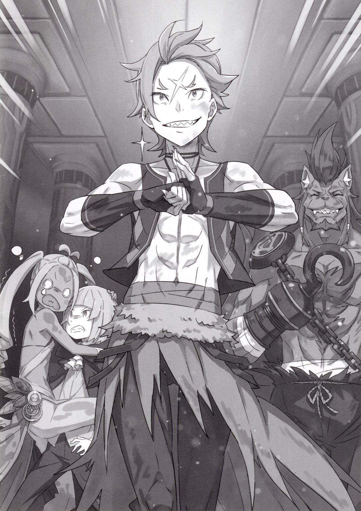

…Глубоко в недрах Города Водных Врат — Пристелла, как говорят, расположен «Великий Храм».

В «Великом Храме», существование которого держалось в секрете, хранятся «Останки Ведьмы» — реликвия четырёхсотлетней давности и важное наследие, связанное с основанием города. Останки принадлежали «Ведьме», послужившей причиной строительства этого Города Водных Врат, и одной из целей недавнего нападения Культа Ведьмы, которое нанесло городу огромный ущерб, было их похищение. Другими словами, Останки, к сожалению, привлекали слишком много внимания, поэтому их уже нельзя было держать в тайне, как раньше. Таким образом, для того чтобы обеспечить безопасность Останков, которые нельзя было

так просто вывезти из города, в «Великий Храм» была отправлена группа людей для оценки состояния их сохранности. Ими стали люди из окружения кандидаток на трон Драконьего Королевства Лугуника, которые внесли большой вклад в недавнюю битву с Культом Ведьмы, и непревзойдённая «Дива» Города Водных Врат — Пристеллы.

Такая необычная группа отправилась в «Великий Храм».

???: «Уа-а-а-а-а-а…!»

???: «Гья-я-я-я…! Мы падаем, мы падаем, мы падаем!!»

Как только они открыли большую потайную дверь, спрятанную в подземном канале, и бросили вызов «Великому Храму», Гарфиэль и его спутники почувствовали ощущение парения, когда их ноги оторвались от земли, и они полетели вниз. За дверью была не дыра. Как только дверь открылась, земля под ногами исчезла — другими словами, это была ловушка.

Заскрежетав зубами Гарфиэль взревел в нескрываемом гневе. Гарфиэль: «Ну и дела!»

Гарфиэль: «Чтоб тебя, чертов ублюдок…!!»

Его горло дрожало от гнева на архитектора этой хитроумной ловушки, пока он падал всё ниже и ниже. В тот же миг Гарфиэль вытянул руки и ноги, стараясь коснуться любой части стены, пока он падал. Почувствовав лёгкое прикосновение к твёрдой опоре, он без колебаний вонзил когти в стену. Однако это не замедлило его падение, как он предполагал.

Гарфиэль: «Ой-ой-ой-ой-ой-ой…!»

Поверхность стены, куда Гарфиэль вонзил когти, была скользкой, словно смазанной маслом. Хотя скорость падения и снизилась, он продолжал падать на встречу тверди.

В отчаянной попытке найти что-то, за что можно было бы ухватиться, он огляделся…

Лилиана: «А-а-а-а-а-а-а-а-а, мы падаем, падаем, падаем, падаем! Это ощущение свободного падения! Чувство обречённости! Мне даже почти хочется сочинить песню…»

Гарфиэль: «Да заткнись ты уже! Успокойся!»

Лилиана: «Агха!?!?»

Несмотря на то, что она падала вниз головой, «Дива» Лилиана сохраняла свою привычную бодрость духа. Гарфиэль схватил её в воздухе, но из-за спешки ему удалось ухватиться лишь за один из двух её хвостиков. Он подтянул её к себе и кое-как прижал к своему боку…

Лилиана: «Г-га-га, Гарфиэль-сан? Мне кажется, я только что услышала какой-то хруст в шее!»

Гарфиэль: «Лучше хруст в шее, чем размазанные по земле останки! “Ороронские дурные привычки”, как же… В такой ситуации не до жалоб! Остальные…» Проигнорировав неуклюжие протесты Лилианы, Гарфиэль взглянул вверх.

???: «…Не поднимайте такой шум, беспокоиться не о чем. Хотя всё и не так идеально как хотелось бы, но…»

Громкий, бодрый голос раздался прямо под Гарфиэлем — от падающего вместе с ним Рикардо. Он тоже вонзил крюк своей правой руки в стену, чтобы замедлить падение. И, как и Гарфиэль, держал в своей другой мощной руке маленькую фигурку.

Рикардо: «Я поймал сэнсэя, а Гарфиэль — певичку! Еле успели!»

Эццо: «Что ж, благодарю тебя, Рикардо-доно. Но, знаешь ли, не стоит кричать так громко мне прямо в ухо…».

Рикардо: «Что? Что такое? Я тебя не слышу, сэнсэй!»

Эццо: «Да ничего! Просто приготовьтесь к удару, Гарфиэль-доно и остальные! Мы вот-вот достигнем последнего уровня!»

Фигура, которую Рикардо держит на руках — это маг Эццо Каднер, который смешно начал предупреждать их:

Эццо: «Последний уровень. Будьте осторожны. Кто знает, что нас там ждёт.»

Лилиана: «Иглы, кипящая лава, или, может, огромный зверодемон Пристеллы с разинутой пастью!»

Гарфиэль: «Ха! Плевать, что там будет! Крутой я уничтожит любую угрозу!». Гарфиэль злобно рассмеялся над пессимистичными предположениями Лилианы. Но прямо под Гарфиэлем и остальными, которые готовились к удару…

Эццо: «…Не беспокойтесь об этом. С женщинами нужно обращаться более деликатно».

Тихо сказал Эццо и выпустил какую-то магию из своей руки вниз. В тот же миг на самом нижнем уровне появился свет, и он становился всё ближе и ближе…

Эццо: «Все! Ещё раз, приготовьтесь к удару!»

Слова предостережения были прерваны, и исследовательская группа коллективно погрузилась в массу грязи.

Рикардо: «Ха-ха-ха! Хорош, сэнсэй! Ты превратил землю под нами в грязевую яму, чтобы мы не разбились! Как хитро!»

Эццо: «Ай-ай-ай! Рикардо-доно, полёгче со мной!»

Рикардо расхохотался, когда Эццо громко возразил, хлопнув его по плечу. Эти двое были покрыты грязью с головы до ног, как будто только что вышли из болота. Конечно, Гарфиэль и Лилиана, стоявшие напротив них, не стали исключением.

Лилиана: «Просветление! Послушайте… Липкий, тягучий Великий Храм!»

Гарфиэль: «Нет-нет-нет! Прекрати, у меня плохое предчувствие». Махнув рукой почерневшей от грязи Диве, что пыталась сыграть новую песню на своей люлире, Гарфиэль немного раздражённый выковырял грязь из ушей.

Гарфиэль: «Раз уж ты спас нас в самый критический момент, я бы не хотел жаловаться, но… Не было ли способа получше?»

Эццо: «Это несколько дилетантский взгляд, Гарфиэль-доно. Позволь мне сказать, что при сложившихся обстоятельствах это было лучшее решение, которое я мог принять. Существует предел количеству заклинаний, которые можно успеть использовать за ограниченное количество времени. Конечно, был вариант смягчить удар с помощью ветра или воды, но если есть земля, то лучше всего превратить её в грязь.»

Гарфиэль: «Будь на твоём месте этот ублюдок Розвааль, он бы просто улетел в безопасное место».

Эццо: «Просто чтобы ты знал, магия полёта — это не то, что можно просто так взять и изучить!»

Раздражённый взгляд на лице Гарфиэля сменился ещё более раздражённым взглядом со стороны Эццо. Его детское лицо покраснел от гнева.

Эццо: «Контроль магии огня, чтобы избежать воздействия климата, и магия ветра, чтобы позволить своему телу свободно летать. Конечно, тебе также нужно контролировать и магию земли, чтобы безопасно приземлиться на землю и не переломать себе ноги… Несмотря на всю эффектность со стороны, это требует точечного магического контроля! А он…!»

Гарфиэль: «Я не очень понимаю всю эту магическую чушь, но ты, случайно, не ненавидишь этого ублюдка Розвааля?»

Эццо: «Да, ненавижу! Можно даже сказать, что я его презираю! Настаиваю, что я ему нисколько не завидую, так что, пожалуйста, не пойми меня неправильно!»

Гарфиэль: «Вот как? Крутой я тоже не любит этого ублюдка. Похоже, что у нас много общего!»

Эццо: «О! Правда? Что ж, это удачно!»

Гарфиэль и Эццо обнаружили, что у них есть общий враг, и между ними зародилось чувство товарищества. Напряжённая атмосфера моментально рассеялась, и они пожали друг другу руки, делая шаг навстречу друг другу. Наблюдая за этим, Рикардо ловко почесал свою голову крюком.

Рикардо: «Какое неловкое примирение».

Гарфиэль: «Ха-ха-ха, это хорошо, не так ли? Хорошая дружба — это крутая штука… Ха-ха-ха».

Рикардо: «А как насчёт тебя, юная леди? Что случилось с твоей вечной энергичностью?»

Лилиана, которая излучала уныние, заставила Рикарда забеспокоиться. Она слабо ответила: «Посмотрите…» и протянула ему свою люлиру. Её партнёр и рабочий инструмент, величавый струнный музыкальный инструмент люлир, был покрыт грязью, и казалось, что он уже ни на что не годен.

Лилиана: «О-о-о! Мой прекрасный люлир, который передавался в моей семье из поколения в поколение…! Когда-то я рисковала своей жизнью, чтобы защитить её от огромного зверодемона……!»

Рикардо: «О, это ужасно. Значит, раз она передавалась из поколения в поколение, она является некой семейной реликвией. Соболезную твоей утрате».

Лилиана: «Если бы я могла так легко с ней расстаться, то её дух никогда бы не упокоился!»

Пока Рикардо сочувственно опускал брови, осунувшаяся Лилиана попыталась что-нибудь сыграть на своей люлире.

Звук был ужасен.

Лилиана: «Не могу поверить, что мой партнёр, который вернулся из горящей башни управления в целости и сохранности, вот так бесславно пал… Это трагедия, катастрофа, кромешный ад… Мир полон жестокости… А значит, я должна уничтожить всю несправедливость этого мира, а затем и себя… ХВАТИТ МЕНЯ ПОЛИВАТЬ!?»

Лилиана, сокрушающаяся о бренности бытия и мечтающая о конце света, внезапно прервала свою скорбную речь, словно её окатили водой.

Эццо: «Да успокойся ты! Смотри, это вода!»

Лилиана: «Ха!? И что с того, что это вода?! Воду я и так вижу, а если лизну, то удостоверюсь в этом ещё лучше! Вот, оближи-оближи-оближи-оближи~! …Подождите-ка, это вода?»

Лилиана, которая облизывала то, что попало ей на лицо, услышав слово «вода», широко раскрыла глаза. Гарфиэль, стоявший перед ней, устало кивнул подбородком на Эццо.

Эццо: «Простите, что не сразу заметил ваше горе, Лилиана-сан. Сейчас я принесу воды. Это всего лишь экстренная мера, но думаю, это поможет смыть грязь с люлиры».

Лилиана: «Божественная помощь…!»

Гарфиэль: «Вообще-то это он втянул нас в эту… грязную историю»

Лилиана: «Да замолчи ты, замолчи! Как ты смеешь говорить так с Богом, неверующий! Если ты ещё раз так скажешь о Эццо-сама, не жди моего милосердия!»

Лилиана, сильно прикусив язык и истекая кровью, тщетно пытается пригрозить Гарфиэлю. Ловким движением она использует родниковую воду, созданную Эццо с помощью магии, чтобы смыть грязь с люлиры. Хлопая по плечу вздыхающего Гарфиэля, который наблюдая за происходящим, Рикардо указал вверх

Рикардо: «Ну, это была неприятная ловушка. Но это ещё не всё». Сказав это, Рикардо, а с ним и Гарфиэль, посмотрели вверх на большое отверстие, через которое они только что упали… а затем на её идеально гладкие стены. Когти Гарфиэля и крюк Рикардо служили лишь для замедления падения, но теперь, когда они дотронулись до стен, стало ясно, что они были не только необычайно гладкие, но и слегка наклонены назад.

Гарфиэль: «Если упадёшь, не поднимешься. Тщательно продумано, не правда ли?»

Рикардо: «Даже нам с Гарфиэлем будет трудновато подняться. Мы упали с приличной высоты… метров пятьдесят-шестьдесят?»

Эццо: «…Нет, больше. Не дотягивает до ста метров, но всё же». Эццо присоединился к ним, пока они разговаривали, глядя на стену. Дворф скрестил свои короткие ручки, на его детском лице было суровое выражение.

Эццо: «Я много раз прыгал с высоты, чтобы добиться успеха в магии полёта. Это ощущение невесомости похоже на прыжок со стометровой скалы. Без сомнений»

Рикардо: «…И всё же, для мага, ты используешь довольно примитивные методы тренировок»

Эццо: «Человек, поставленный в экстремальные условия, способен превзойти свои собственные возможности. Скажу сразу, я выбрал место, где под обрывом есть река. Я не хочу, чтобы вы принимали меня за самоубийцу»

Рикардо: «Но, судя по тому, что ты сказал, магия полёта не сработала, верно? Значит, ты просто много раз прыгал в реку?»

Эццо: «Что ты хочешь этим сказать?! Знать пределы своих возможностей тоже очень важно. Ладно, не будем об этом!»

Эццо топнул ногой по земле и резко указал пальцем вверх.

Эццо: «В любом случае, важно то, что назад тем путём, которым мы пришли, не вернуться. И к моему ужасу, этот «Великий Храм», по-видимому, оснащён ловушками, чтобы предотвратить проникновение злоумышленников. Другими словами…»

Эццо: «Это значит, что нам понадобятся все наши навыки!» Эццо с силой произнёс эти слова, и в его ладонях вспыхнули два ярко-красных огненных шара. Они ярко осветили окружающее пространство, и перед изумлёнными лицами собравшихся, Эццо с криком «Ха!» метнул один из огненных шаров. Шар пролетел над головой Лилианы, которая в этот момент отмывала свою люлиру, и осветил коридор, продолжающийся вдали.

Рикардо: «Проход, ведущий вглубь. Обычно упавшему человеку не дают второго шанса, но что это значит?»

Эццо: «Ничего это не значит. Идёмте дальше, вот и всё. Действовать по замыслу создателя этого «Великого Храма» неприятно, но сопротивляться бессмысленно».

Гарфиэль: «Какой же мерзкий тип его создал. Хотел бы я взглянуть на его рожу».

Скрестив руки, троица обменивается мнениями, глядя на проход, ведущий к ловушке. Вообще, ловушка, которая сбрасывает тебя с первого же шага в «Великий Храм», говорит о отвратительном характере создателя. Похожее злорадство ощущается и в том, что стены покрыты чем-то вроде масла.

Лилиана: «Э-э-э, ребята! Идти вглубь, конечно, хорошо, но…»

Гарфиэль: «О? Что случилось, сестрица?»

После того, как Лилиана более-менее очистила от грязи свою люлиру и пришла в себя, она начала нервно стучать зубами. Вскоре стало понятно, почему.

???: «Р-р-р-р-р!»

Раздался низкий рык, и Лилиана с криком «Ва-а-а!» запрыгнула за Гарфиэля и остальных. За её спиной, в освещённом огненными шарами проходе, медленно появлялась какая-то чудовищная фигура.

Гарфиэль: «Это не зверодемон… Что это за чёрт?»

Это было искажённое существо, похожее на кучу собравшихся вместе крыс. У него было короткое, раздутое, круглое тело, из различных частей туловища которого торчало несколько голов. Все они, казалось, имели собственную волю, глаза бегали, а пасти открывались и закрывались.

Лилиана: «Угя-я-я! Какая мерзость!…»

Рикардо: «Эй, сэнсэй! Ты знаешь, что это такое?»

Эццо: «Нет, и хватит поднимать шум! Вероятно, это какой-то страж «Великого Храма», но что, чёрт возьми, это за чудовище? Даже зверодемоны так не выглядят…»

Гарфиэль: «Ха! Мне плевать!»

Гарфиэль выпустил когти и, оттолкнув голову паникующей Лилианы, начал медленно приближаться к чудовищу.

Путь был только один, и если враг преграждает дорогу…

Гарфиэль: «Как говорят: «Увидев Дракона, «Святой Меча» Рейд рассмеялся ему в лицо и обнажил свой клинок»!»

Эццо: «Этой поговоркой ведь обозначают чокнутых безумцев!»

Гарфиэль: «Похоже пришло время размяться!»

Под ободряющие возгласы союзников сзади Гарфиэль бросился к странному существу.

…Исследование «Великого Храма» под Городом Водных Врат — Пристелла теперь началось всерьёз.

《Конец》
