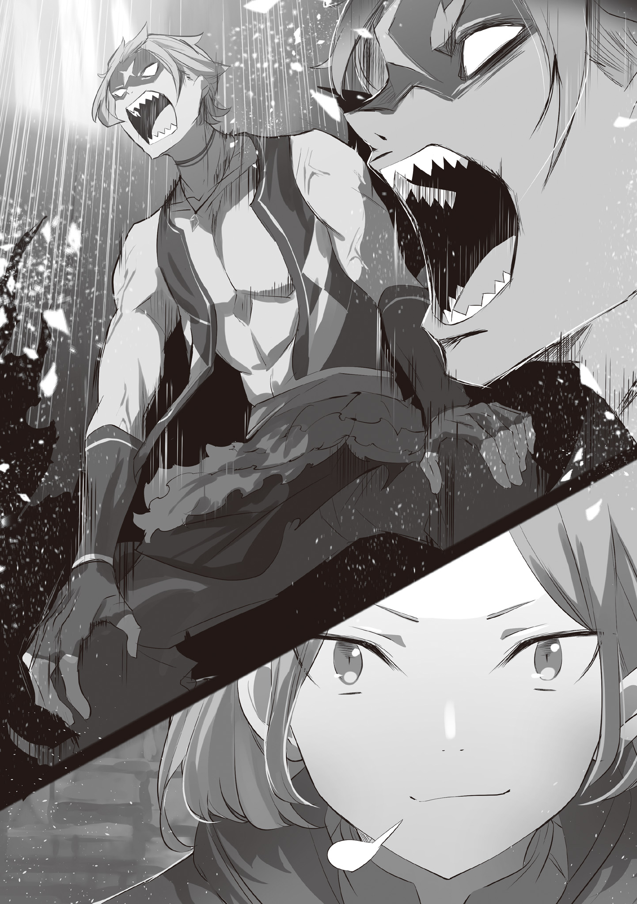

…Покорение Великого Храма под Городом Водных Врат — Пристелла, наконец подходило к концу.

Однако, несмотря на приближение к финалу, ситуация постепенно оборачивается против группы.

Лилиана: «Уггх, угх, угх… ч-что нам теперь делать!?»

Эццо: «Я же говорил! Нужно действовать по проверенной схеме!»

Лилиана: «Нет! Чтобы вырваться из безвыходной ситуации, нужно свежее и нестандартное мышление…!»

Эццо: «Это говорит та, кто даже до конца не понимает самих стандартов, которые нужно разрушать!»

Лилиана: «Эй!»

Эццо осудил безрассудное желание Лилианы стать героем. В обычной ситуации Гарфиэль был бы больше на стороне Лилианы, но в текущих обстоятельствах аргументы Эццо были куда более верными. Жизнь каждого сейчас висела на волоске. Гарфиэль, неспособный пошевелиться, чувствовал себя самым жалким человеком на свете.

Гарфиэль: «Черт возьми…!»

Он валялся на покрытом мхом полу, стиснув зубы от бессилия, не в силах пошевелить даже пальцем из-за странной силы, воздействующей на его тело. Эта давящая сила… наказание для грешников, так это интерпретировал Рикардо.

Лилиана: «А-а-а-а! Плохо, плохо, плохо!!»

Пронзительный крик Лилианы разносится по Храму, а чаша весов всё больше склоняется не в их пользу. В отличие от мужчин, которые оказались скованы таинственной силой, Лилиана была единственной, кто мог бросить вызов последней ловушке Великого Храма — гигантской доске Шатрандж.

Шатрандж — древняя настольная игра, в которой каждая фигура имеет размер с человеческий рост, а Лилиана, как главнокомандующий, играет за короля.

Однако, с самого начала игнорируя устоявшиеся стратегии, Лилиана делала один неверный ход за другим, и её положение становилось крайне невыгодным. Разбитые фигуры были разбросаны по всей доске, и если так пойдёт и дальше, то Лилиану будет ждать та же участь.

Рикардо: «Лилиана! Если проиграешь, то, скорее всего, умрёшь, так что постарайся!»

Лилиана: «А? Что это значит?! Я ничего об этом не слышала!»

Рикардо: «Ты даже не поняла это!? Просто посмотри что случилось с твоими фигурами!»

Лилиана ещё больше запаниковала, услышав, как Рикардо подбадривает её, размахивая крюком на правой руке. Даже Эццо, мудрый маг и стратег группы, казалось, плохо разбирался в Шатрандже, и ему было трудно придумать ход, который мог бы разрешить ситуацию.

Гарфиэль: «Если Лилиана проиграет, то в беде окажется не только она, но и мы, не так ли…?»

Поражение Лилианы, их единственной надежды, означало бы и поражение Гарфиэля и остальных. В этом случае Гарфиэль проиграл бы, даже не вступив в бой. Когда эта тревожная мысль промелькнула у него в голове, краем глаза он заметил, как мимо пробежала маленькая тень.

Гарфиэль: «Крыса…?»

Гарфиэль подозрительно нахмурился. Это пространство под городом было заброшено на долгие годы. Он не удивился бы, если бы здесь жила не одна, а сотня крыс, но за всё время прохождения Храма Гарфиэль не видел ни одной. Здесь встречались только уродливые монстры.

Единственное объяснение появления крысы — то, что она пробралась снаружи…

???: «Так не пойдёт, Гарфиэль. Нельзя быть таким доверчивым. Разве ты не должен был научиться у Нацуки-сана что следует быть более подозрительным ко всему».

Голос донёсся из конца коридора, откуда пришли Гарфиэль и остальные. Это был знакомый голос, но разум отказывался верить, что это возможно. Потому что человек, чей голос ему напомнил этот, был тяжело ранен в обе ноги. Даже если бы враги и ловушки на пути были устранены, он бы не смог добраться сюда.

???: «Ну, один я бы не справился. Поэтому…»

???: «Нас попросила старшая сестра, и мы пришли вместе с вами».

???: «Мы тоже переживали за Капитана».

С этими словами из темного коридора появились два котёнка и корзина, которую они несли… Внутри корзины лежал Отто Сувен, который примчался на помощь своему младшему брату.

???: «…Грех станет клином, не оставляющим пути к спасению».

Как только Отто, Хетаро и Тиви, младшие братья Мими, появившиеся с ним, ступили в это место, голос снова напрямую раздался в голове Гарфиэля.

Хетаро: «А!»

Тиви: «А-а-а, больно…!»

Под воздействием голоса Хетаро и Тиви тоже не могли устоять на ногах. Кое-как они опустили корзину на землю, и Отто, нахмурившись, выполз из неё.

Отто: «Понятно, вот оно, эта проблема…»

Гарфиэль: «О, Отто-бро?»

Отто: «Удивлён, да? На самом деле, всё просто. Я попросил крыс разведать обстановку. Поэтому я знал, что здесь произойдёт…»

Гарфиэль: «Дело не в этом! Почему Отто-бро здесь…?»

С ноткой изумления в голосе Гарфиэль изо всех сил старался говорить тихо. Гарфиэль знал ответ на свой собственный вопрос. Отто пришёл сюда, потому что волновался за него. Отто очень заботливый человек, поэтому его решение легко понять.

Гарфиэль: «Но теперь, когда Отто-бро тоже оказался втянут… Что будет с нами, если Лилиана проиграет? Мы не сможем показаться ни Капитану, ни леди Эмилии…»

Отто: «Я же говорил, ты слишком серьёзно к этому относишься. Разве я не говорил тебе? Мы ввязались в это, зная, на что идём. Почему?»

Пока Гарфиэль скрипел зубами, Отто медленно покачал головой. Затем, перед ошеломлённым Гарфиэлем, он сделал кое-что ещё более удивительное.

— Медленно опираясь на раненую ногу, он встал.

Нагрузка, безусловно, должна была быть, но… Видя вопросительный взгляд, он горько усмехнулся.

Отто: «Я знаю, что это выглядит не очень,… но какое это имеет значение?»

Гарфиэль: «Какое…?»

Отто: «Грех — это клин, так ведь? Думаю, что эта ситуация стала тяжестью для каждого из нас. Не тяжесть совершенных каждым человеком грехов имеет значение… не так ли?»

Гарфиэль: «…А?»

Предположение Отто опровергало вывод Гарфиэля. Отто посмотрел на своего брата, все ещё не способного встать и пожал плечами.

Отто: «Не совершённый грех давит на тебя, а то, насколько тяжело ты его воспринимаешь. Так что, если ты способен отпустить произошедшее, тяжесть исчезнет».

Отто: «Однако, по-настоящему отпустить ситуацию трудно. Особенно мне. Вот почему мои колени дрожат… Лучше всех с этим, наверное, справилась бы леди Эмилия».

Гарфиэль был очень озадачен, когда ему сказали, что нужно отпустить ситуацию. Сердце ни одного человека не могло так легко обрести свободу. А в его случае ситуация была ещё хуже, ведь это был Гарфиэль. Так что…

Отто: «Вот почему я здесь. …Гарфиэль, чтобы простить тебя».

Гарфиэль был ошеломлён от внезапного предложения и затаил дыхание. Прощение Отто, что это значит…?

Отто: «Я знаю, что, несмотря на твою внешнюю беззаботность и поведение, тебе трудно отпустить ситуацию. Тебе также трудно простить себя за произошедшее. Так позволь мне простить тебя вместо этого».

Гарфиэль: «Гх…»

Отто: «В любом случае, я почти уверен, что твои сожаления связаны с твоей семьёй и нами».

Гарфиэль был поражён горькими словами Отто и не мог возразить.

«Я ничего не могу ответить на твой смех, Отто. Ты, несомненно, попал в самое яблочко. И, как ты и сказал, я честный… нет, я всё же корыстный».

Гарфиэль: «О-о-о-о…!»

…Одного этого слова было достаточно, чтобы снять тяжесть с тела Гарфиэля.

Хетаро: «Капитан, мы простим тебя за то, что ты заставил нас волноваться, когда потерял… правую руку».

Тиви: «Я тоже тебя прощаю. Я прощаю тебя за все те неприятности, которые ты мне доставил».

Рикардо: «…Эй, эй! Мелкие засранцы, вы такие наглые…»

Получив прощение от Хетаро и Тиви, Рикардо тоже встал и засмеялся. Рядом с ним только Эццо, которому некому было его простить, с трудом прошипел: «Н-но почему…?».

Затем, встав, Гарфиэль и Рикардо посмотрели друг на друга.

Рикардо: «Итак, мы встали, но что мы будем делать? Будем громко болеть за Лилиану отсюда?»

Гарфиэль: «Нет, это неправильно. Крутые мы слишком честны».

Стукнул кулаком о кулак, Гарфиэль свирепо оскалил зубы. Затем он переглянулся с Отто, который стоял позади с несчастным видом.

Гарфиэль: «Крутым нам не нужно потакать этим идиотским правилам».

С этими словами Гарфиэль спрыгнул с передних ступеней и приземлился на доске, где Дива была загнана в угол. Он гордо встал перед королём, точнее, Лилианой.

Лилиана: «Г-Гарфиэль-сан? Это же нарушение правил!?»

Гарфиэль: «Ну и кто же установил эти правила, и где они написаны?»

Гарфиэль дерзко ухмыльнулся перед ошеломлённой Лилианой. В этот момент фигура, напоминающая коня, взмахнула оружием, быстро приближаясь к ней, но…

Гарфиэль бесцеремонно отбил атаку мощным ударом ноги.

Гарфиэль: «Думаешь, кусок камня может меня остановить?!»

Рикардо: «О, так вот оно что! Тогда я тоже в деле!»

С весёлым смехом Рикардо тоже спрыгнул на доску и поймал удар следующей фигуры своим крюком. В следующий миг он нанёс сокрушительный удар тесаком по открывшемуся корпусу противника, раздробив его.

Попытка честного поединка в битве умов была ошибкой с самого начала.

Рикардо: «Этот голос и атмосфера взяли надо мной верх. Но, теперь, когда нас не просят выиграть в Шатрандж… — Мы пробьёмся!»

Лилиана: «У-у-у-у! Давай, сделай это!! Мне пришла гениальная идея! Коленопреклонённый путь силы!!»

Взволнованная Лилиана заиграла на своей люлире, и под её игру они бросились в атаку.

— Гарфиэлю и Рикардо понадобилось меньше минуты, чтобы уничтожить все вражеские фигуры.

После того, как Гарфиэль уничтожил вражеского короля, неприятное бремя окончательно исчезло

Эццо: «Хм, я думал, что это будет испытание мудрости, но в итоге всё решилось грубой силой…»

Отто: «Боюсь, что на меня это тоже оказало негативное влияние, но во многих случаях быстрее всего решать проблемы кулаками. За этот год я многому научился».

Отто горько улыбнулся и прикрыл один глаз, обращаясь к Эццо, который наконец смог встать на ноги. К сожалению, Отто снова оказался в корзине, которую несли Хетаро и Тиви.

И группа, к которой присоединились ещё трое, наконец направилась в самое сердце Храма. Там находился объект, излучающий тусклый свет и словно утверждающий своё существование — «Останки Ведьмы».

Помещённые на светящийся пьедестал, они выглядели как кости человеческой руки. Однако они были очень маленькими, вероятно, принадлежали ребёнку. Значит ли это, что среди «Ведьм» были и дети?

Эццо: «Это очень интересно, но давайте изучим это позже. У нас есть магическая ткань. Давайте завернём их в неё».

Гарфиэль с любопытством разглядывал кости, и Эццо, подавив свой научный интерес, предложил завернуть её в ткань.

Магическая ткань — это особый материал, в который вплетены магические формулы, которые, как говорят, замедляют разрушение завёрнутых в неё предметов. Хотя это и зависит от степени повреждения предмета, это лучший способ сохранить кости. Остальное…

Гарфиэль: «Теперь, когда мы выполнили свою задачу,… как нам вернуться?»

У входа в Великий Храм они упали с высоты более десяти метров. Стены сделаны так, что на них невозможно взобраться, и до сих пор Гарфиэль не видел ни одного прохода, что мог бы вести наружу.

Гарфиэль думал, что если как только они доберутся до самого конца, то найдут способ выбраться наружу, но похоже, это было не так.

Лилиана: «Итак, если ничего мы ничего не найдём, сможем ли мы рассчитывать на Божественную Защиту мистера Отто?»

Отто: «…Они знают, что мы здесь, внизу, поэтому, если мы не вернёмся через некоторое время, они пришлют помощь. Так же, как и мы».

Лилиана: «Да, конечно! К счастью, мы расправились со всеми страшными парнями по пути сюда, так что теперь мы можем просто расслабиться здесь и ждать помощи….»

Лилиана с нарочито бодрым видом сказала это и прыгнула на пьедестал, с которого убрали останки.

…Именно в этот момент.

Лилиана: «А?»

В тот момент, когда Лилиана села, пьедестал резко опустился. Затем раздался тихий гул земли и звук чего-то приближающегося издалека.

Отто: «Подождите, госпожа Лилиана!? Что вы сделали!?»

Лилиана: «Я-я ничего не делала! Я не делала этого! Я уверена, что я этого не делала!»

Гарфиэль: «Сейчас не время для разговоров! Эта дрожь…»

Как только Лилиана открестилась от ответственности, произошло это…

— Огромное количество воды хлынуло на группу и яростно обрушилось на них.

Гарфиэль: «Уа-а-а-а-а-а-а…!!»

Вода хлынула с такой силой, что затопила Великий Храм и в один миг поглотила Гарфиэля и остальных. Гарфиэль инстинктивно протянул руку и схватил корзину, в которой находился Отто.

Рикардо схватил Хетаро и Тиви, а затем своим крюком подцепил Лилиану. Эццо свернулся в клубок, защищая завернутые в магическую ткань останки… однако…

Смываемый мутной водой, Гарфиэль, напрягая зрение в темноте, отчаянно искал выход. Благодаря совместным усилиям Лилианы, Рикардо и Эццо им удалось добраться до самого сердца Великого Храма, и с помощью младших братьев Мими они наконец-то заполучили «Останки Ведьмы».

И теперь всё должно было закончиться таким провалом…

— Это было совершенно недопустимо.

Гарфиэль: «…Бха!»

Конец их борьбе наступил внезапно.

Гарфиэль почувствовал, как его куда-то подбросило, и, глубоко погрузившись в воду, он вынырнул на поверхность, держа Отто в своих руках.

Сделав несколько судорожных вдохов, он огляделся…

???: «…Господин Г-Гарфиэль? А ещё Лилиана! И господин Рикардо!»

Над поверхностью воды, на краю рва, стоял молодой человек — представитель Пристеллы, Киритака — и смотрел на них в полном изумлении.

Хорошо присмотревшись, они заметили, что вокруг стало светлее, и они больше не находятся в тёмном подземном пространстве, а выброшены наружу.

Отто: «Кхэ, кхэ… похоже, это был какой-то механизм, который выносит наружу?»

Кашляя, Отто пытался понять, в какой ситуации они оказались. Гарфиэль согласился с ним, глядя на простирающийся вокруг водный путь. Мутный поток сливался с ними, унося Гарфиэля и остальных из тёмного подземелья на светлую поверхность.

Лилиана: «Ки-Киритака-сан! Помогите! Кости… я принесла кости «Ведьмы»!

Эццо: «Я на пределе… Я не создан для физического труда…!»

Лилиана жаловалась барахтаясь и плескаясь в воде, пока Эццо что-то неразборчиво бормоча безвольно дрейфовал на воде. Рикардо, Хетаро и Тиви полностью промокли, их волосы слиплись, и они стали выглядеть совсем иначе.

Киритака: «В любом случае, я рад, что вы все… благополучно вернулись».

Гарфиэль: «Да, благодаря Отто-бро».

Отто: «Если уж на то пошло, то это благодаря тебе, Гарфиэль».

Расслабив тело и мирно покачиваясь на воде, Гарфиэль улыбнулся в ответ на слова своего старшего брата. Затем они оба, не сговариваясь, протянули кулаки и стукнулись ими.

Пока Киритака в панике звал на помощь, они расслабились и отдались приятному покачиванию на воде, пока их не подобрали. Таким образом, группа, отправившаяся на покорение Великого Храма, благополучно вернулась.

《Конец》
