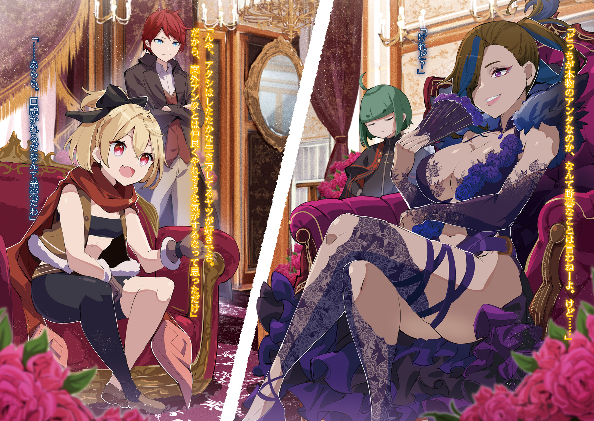
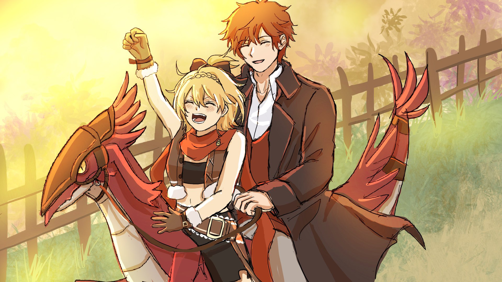

В этом месте стоял густой запах крови.

Строго говоря, это был не столько запах крови, сколько её след, оставшийся в воздухе. Все, кто здесь собрался, без единого исключения, были из тех, кто выживал, купаясь в крови своих врагов. Потому-то запах крови въелся в их плоть, в самую душу.

Несмываемый смрад крови и витавшее в воздухе ощущение насилия, от которого покалывало кожу, — вот что царило в комнате. Взаимная настороженность во взглядах создавала такое напряжение, будто все они приставили друг к другу клинки.

Среди собравшихся суровых людей было несколько тех, от кого исходил особенно сильный запах крови. Их пронзительные взгляды и осанка свидетельствовали о том, что каждый из них — закалённый боец, прошедший через бесчисленные кровавые бойни.

И это было неудивительно, ведь здесь собрались воротилы теневого мира Фландрии — одного из пяти крупнейших городов королевства Лугуника, известного как «Столица Наземных Драконов».

— Это уже шестой случай за месяц… Пора бы с этим кончать, не думаете? — раздался в пропитанном кровью воздухе женский голос, выпустивший облачко сладкого фиолетового дыма.

Это была зрелая красавица в фиолетовом платье, смело обнажавшем её соблазнительные ноги. Смуглая кожа, пышные, женственные формы — её дьявольская красота пробуждала желание как в мужчинах, так и в женщинах, полностью оправдывая прозвище «Ядовитая Госпожа».

Она была одной из тех, от кого исходил самый сильный запах крови, — Тото, хозяйка «Сада Цветочной Тюрьмы».

Начав разговор, она бросила томный взгляд своих раскосых глаз на того, кто сидел напротив.

— Что-то ты сегодня неразговорчив, Манфред. Ждёшь, на какую чашу склонятся «Весы», словно флюгер? Или твои хвалёные татуировки добрались до языка, и ты теперь говорить не можешь?

— Заткнись, потаскуха. Ещё раз пикнешь, и я тебя вместе со всеми твоими девками на корм наземным драконам пущу. Хотя от твоей вонищи даже драконы нос воротят, — резко ответил на провокацию Тото худощавый мужчина, сидевший напротив неё с прямой спиной.

Его тощее тело было облачено в длинные синие одежды, а голова была лысой. Но самой яркой его чертой были татуировки, покрывавшие всю видимую кожу — голову, шею, лицо. Все они изображали весы. Судя по тому, что рисунки виднелись даже на пальцах, можно было с уверенностью сказать, что всё его тело было покрыто татуировками.

Наносить татуировку весов на видное место — таково было правило его организации, «Весов», но никто не демонстрировал свою преданность так фанатично, как он. За эту решимость и способности он, несмотря на молодость, занял пост главы отделения организации во Фландрии.

«Татуированное Лицо» Манфред Мэдисон — так звали человека, возглавлявшего «Весы» в этом городе.

Хозяйка «Сада Цветочной Тюрьмы» и представитель «Весов» — обе организации действовали в теневом мире Фландрии и входили в так называемую «Большую тройку».

И…

— Мы здесь собрались, чтобы слушать детские перепалки? Знайте своё место, свиньи, — раздался низкий, тяжёлый голос, и переругивавшиеся Тото и Манфред тут же замолчали.

В их молчании не было страха перед говорившим, но был некоторый трепет. Осознание этого факта вызвало на их лицах лёгкое раздражение.

Однако тот, кто заставил замолчать глав двух организаций, — гигант, которому даже в огромном кресле было тесно, — не обратил на это ни малейшего внимания.

— Что, нечего возразить? Сказать, что свинья — это я? — фыркнув своим свиным пятачком, скучающе произнёс он.

— …Только безумец станет так дерзить «Королю Свиней», — процедил Манфред.

— А я просто не собираюсь подыгрывать несмешным шуткам, господин Дольтеро, — ответила Тото.

Выслушав их оправдания, гигант сложил свои массивные руки, на каждом пальце которых красовался перстень.

— Говоришь, только безумец станет мне дерзить… Что ж, пожалуй, ты прав, — пробормотав это, гигант слегка опустил глаза, не отвечая на вопрос Манфреда.

— …Хм? Как-то ты загадочно выразился. Словно тебе это что-то напомнило?

Ростом гигант был далеко за два метра, а в плечах был под стать своему росту. Руки и ноги — толстые, как брёвна. По сравнению с ним тощий Манфред казался сухим деревом рядом с могучим дубом.

Но вопреки устрашающей внешности, его зачёсанные назад золотистые волосы и голубые глаза были на удивление красивы, что резко выделяло его среди свинолюдей, известных своим уродством.

Это был не кто иной, как «Король Свиней» Дольтеро Амул — глава «Чёрной Серебряной Монеты», самой влиятельной организации в теневом мире Фландрии и самый страшный человек в городе.

Даже «Ядовитая Госпожа» и «Татуированное Лицо» были не ровней «Королю Свиней». «Чёрная Серебряная Монета» слишком долго и прочно удерживала своё влияние во Фландрии.

Организация выстояла даже во времена «Войны с полулюдьми», когда по всему королевству преследовали нелюдей. Благодаря Дольтеро, «Чёрная Серебряная Монета» сохранила свою силу и структуру.

…«Большая тройка» теневого мира Фландрии: «Чёрная Серебряная Монета», «Сад Цветочной Тюрьмы» и «Весы».

Главы трёх организаций собрались в подвале нейтрального трактира. С самого основания «Столицы Наземных Драконов» этот трактир считался неприкосновенной территорией, поэтому его часто использовали для проведения «регулярных собраний» теневого мира.

Целью этих собраний было поддержание баланса сил между организациями, правящими Фландрией. На кону стояла репутация каждой из сторон, поэтому ни одно собрание не проходило мирно.

Однако в этот раз атмосфера была накалена до предела.

Причиной тому был…

— Перейдём к делу. Убийца… Есть какие-нибудь зацепки по этому ублюдку? — вопрос Дольтеро и был той самой причиной, по которой собрание стало таким напряжённым.

За последние два месяца во Фландрии произошло шесть нападений со смертельным исходом. Каждое из них, если рассматривать по отдельности, не было чем-то из ряда вон выходящим. Вот только все жертвы были связаны с «Большой тройкой».

— Кто на нас нападает? У кого-нибудь есть ответ?

— Кто знает. Я-то надеялась услышать его сегодня здесь. Думала, ты объявишь нам войну, а, Манфред?

— Бредни этой шлюхи просто смешны, но я надеялся на то же самое. Поэтому и терпел её приторный парфюм.

Тото и Манфред обменялись убийственными взглядами, и воздух между ними вновь накалился.

Отношения этих двух организаций, которые в прошлом уже проливали кровь друг друга, были хуже некуда. Когда главы источают жажду крови, их подчинённые невольно следуют их примеру. Бойцы «Весов» сменили позиции, а ядовитые цветы «Сада Цветочной Тюрьмы» сузили взгляды.

Прежде чем они успели перейти к безрассудному столкновению, в подвале раздался скрежет сминаемой стали.

— …

Это Дольтеро, словно бумагу, сжал и оторвал железный подлокотник своего кресла. Приковав к себе всеобщее внимание, он бросил искорёженный кусок металла на пол.

— Хотите умереть так же — продолжайте болтать. У стариков времени мало. Используйте его с умом.

— …Нетерпеливы здесь все, не только вы. Строить из себя самого умного — это так нечестно. Вы согласны, госпожа «Золотой Жук»?

— Что? Обращаясь ко мне не рассчитывайте, что я смогу потушить этот пожар.

Улыбнувшись на предостережение Дольтеро, Тото обратилась к третьему лицу, и названная ею миниатюрная женщина, до этого не проронившая ни слова, смущённо улыбнулась.

Она сидела в тени за столом, за которым расположились главы трёх организаций.

На ней был хорошо сшитый мужской чёрный костюм; галстук, перчатки, ботинки и даже носки — всё было подобрано в тон. Тёмно-зелёные волосы при определённом освещении тоже казались чёрными. Они были собраны в два хвостика по бокам головы. На лице застыла непроницаемая ухмылка, скрывавшая истинный возраст.

— Вообще, какого чёрта эта обжора Хелейн здесь делает? У неё нет права участвовать в собрании.

— Что ж, на это нам нечего возразить… И, пожалуйста, не «обжора», а «Золотой Жук», господин Манфред.

На исполненное неприкрытого отвращения замечание Манфреда женщина, — Хелейн, лишь бессильно почесала щёку и поправила его.

Татуировки на лице Манфреда недовольно скривились, и тут на помощь пришла Тото.

— Это я её пригласила. Думаю, этого достаточно, верно?

— Если не считать того, что мне противно видеть, как закорешились баба, от которой несёт кровью, и баба, от которой несёт деньгами. Раз уж ты пришла, зная, что тебе тут не рады, значит, есть что сказать?

На угрожающий тон Манфреда Хелейн ответила, подняв палец:

— Как вам всем известно, наша торговая компания уже давно пользуется вашим покровительством в этом городе. И всё это благодаря вашей повседневной поддержке…

— Хватит предисловий. К делу.

— …На наш офис было совершено нападение, и мы потеряли драгоценные жизни наших сотрудников.

— …

— Мне стыдно за нашу халатность. Мы слишком расслабились под вашим покровительством и не позаботились о должной охране.

Никто не принял слова Хелейн за чистую монету.

Хотя она и сокрушалась об отсутствии собственной защиты, её компания «Золотой Жук» была, по сути, ростовщической конторой. И, как можно понять по её присутствию на этом собрании, большинство её клиентов были из теневого мира. Поэтому, как и в случае с нейтральным трактиром, существовало негласное правило — «Золотой Жук» находится под защитой «Большой тройки» и является неприкосновенным.

Тот, кто посмеет тронуть «Золотого Жука», столкнётся с объединённой местью всех теневых организаций. И сейчас эта гарантия безопасности во Фландрии была нарушена.

— Мы бы хотели избежать дальнейших потерь, как человеческих, так и финансовых. Поэтому я пришла сюда как представитель горожан, чтобы попросить вас как можно скорее разобраться в ситуации.

— «Представитель горожан»… Как лицемерно.

— Мы надеемся, что во Фландрию как можно скорее вернутся мир и безопасность. В противном случае, доверие, которое мы так долго выстраивали между нами, может пошатнуться, — учтиво поклонилась Хелейн, и даже Дольтеро не мог так просто заткнуть её.

Существование «Золотого Жука» было залогом деятельности теневых организаций во Фландрии — доказательством того, что эти негодяи, чьим оружием были насилие и беззаконие, обладали реальной силой.

Теневой мир, чей бизнес строился на силе и страхе, не мог позволить себе потерять лицо.

— В общем, этот идиот не только вытер о нас ноги, но и перешёл черту. Месть должна быть жестокой и беспощадной. Я права?

— Не возражаю. Мы заставим его пожалеть, что он родился на свет. Но надо же, нашёлся идиот, который осмелился хозяйничать на территории «Короля Свиней»…

— …Что ты хочешь сказать?

— Да так. Просто, видать, времена меняются, раз появляются те, кто не боится «Короля Свиней», перед которым дрожали все злодеи. Может, твоё влияние ослабло?

— Похоже, ты хочешь, чтобы тебе свернули шею ещё до того, как мы найдём того недоумка.

Дольтеро смерил Манфреда тяжёлым взглядом, но тот, ничуть не смутившись, лишь усмехнулся. Тото, подперев щёку рукой, с интересом наблюдала за развитием событий.

Атмосфера накалилась до предела, но тут вмешалась Хелейн:

— Постойте. Спорами здесь делу не поможешь. Окажите нам услугу…

— С какой стати я должен оказывать тебе услугу и проявлять милосердие к этому дерзкому юнцу?

— Ну… эм, послушайте, у меня есть кое-что интересное! Возможно, это связано с последними событиями, — под давлением взгляда Дольтеро поспешно достала из-за пазухи документ Хелейн. Все взгляды тут же устремились на него.

— Это отчёт о расследовании. Мы, ради семей погибших сотрудников, не жалея ни сна, ни отдыха, занимались расследованием…

— И что, что-нибудь нарыли?

— Точных доказательств нет, но… учитывая ущерб, нанесённый не только нам, но и всем присутствующим здесь организациям, возникает одно подозрение.

— Подозрение?

— Да. Нападавший либо не осознаёт вашего влияния, либо не боится его.

— …

Невежество и безрассудство — оба варианта, предложенные Хелейн, вызвали у всех присутствующих лишь раздражение.

Неужели существует кто-то, кто соответствует таким абсурдным критериям…

— …«Святой Меча» из Хакутюри.

Слова Хелейн произвели эффект разорвавшейся бомбы.

Тото и Манфред застыли с напряжёнными лицами, а Дольтеро едва заметно затаил дыхание. Правда, его реакция отличалась от реакции остальных, но этого никто не заметил.

Настолько немыслимой была эта мысль для всех, не только для «Большой тройки».

«Святой Меча» — это было бедствие, к которому не смели прикасаться даже люди из теневого мира.

Он жил в городке Хакутюри, к западу от Фландрии. Все следили за его действиями, но никто не осмеливался приблизиться. Он был истинно неприкосновенен.

— Ты это серьёзно? «Святой Меча» замешан в этом деле?

— Маловероятно. Конечно, «Святой Меча» — опасный противник, но… он вмешивается только в дела государственной важности. По крайней мере, я так слышала.

Услышав неожиданное имя, Манфред и Тото усомнились в причастности «Святого Меча». В ответ Хелейн слегка махнула рукой:

— Простите, я неверно выразилась. Нас беспокоит не сам «Святой Меча», а девушка, которую он привёл с собой.

— …Кандидатка на трон.

— Да. Именно она, как вы и сказали, господин Дольтеро, — глубоко кивнув в ответ на слова Дольтеро, продолжила Хелейн.

Королевские выборы были сейчас главной темой для жителей королевства Лугуника. После того как королевская семья прервалась из-за болезни, было объявлено о начале «королевских выборов» для избрания нового правителя.

И Хакутюри, расположенный недалеко от Фландрии, был резиденцией одной из кандидаток. Однако, по общему мнению, у этой кандидатки не было серьёзной поддержки, и её включили в список лишь для числа.

Теневой мир придерживался того же мнения, но Хелейн бросила камень в этот тихий омут.

— Если наше расследование верно, то у этой девушки был контакт с «Чёрной Серебряной Монетой».

— С «Чёрной Серебряной Монетой»?

— Более того, до нас дошли слухи, что она вела себя крайне неуважительно по отношению к господину Дольтеро. Если это правда, то это верх безрассудства… Впрочем, такое поведение мне кое-что напоминает.

— Хочешь сказать, это часть её предвыборной кампании по завоеванию популярности?

— Прошу, это всего лишь предположение, основанное на данных нашего расследования.

Прижав руку к своей плоской груди, Хелейн почтительно склонила голову. Все взгляды устремились на Дольтеро, ожидая ответа на догадку Хелейн.

— Это правда?

— …Недоразумение действительно было. Но мы уже всё уладили.

Он не собирался вдаваться в подробности, но тот факт, что он не отрицал контакта с кандидаткой, заставил Манфреда и Тото задуматься.

— Если она действительно повздорила с «Чёрной Серебряной Монетой», то слова этой обжоры не кажутся таким уж бредом. Девчонка, которой светит поражение, пытается спасти положение, устроив чистку в теневом мире города… что-то в этом роде.

— Детские глупости и милое безрассудство, но у неё есть сила, чтобы это осуществить.

— …«Святой Меча».

Это имя, которое нельзя было игнорировать, захватило их умы, и все поняли, что столкнулись с серьёзной проблемой.

Пока Дольтеро молчал, интерес Тото и Манфреда переключился на девушку-кандидатку. Была ли она виновницей или просто вызвала их личный интерес?

В любом случае, в словах Хелейн была определённая логика.

— Как бы там ни было, стоит с ней поговорить. О ней и так много слухов… И личико у неё милое, если отполировать, засияет.

— Опять ты за своё. Аж мурашки по коже. Впрочем, то, что она не соизволила нас поприветствовать, — это проблема. Как её там звали?

— Э-э, да. Кажется…

Очаровательно улыбаясь, Тото посмотрела на Хелейн, в то время как Манфред провёл пальцем по татуировке на щеке. Хелейн, поймав его взгляд, склонила голову и бросила быстрый взгляд на Дольтеро.

Один этот едва заметный жест выдавал её бездонную хитрость, которая, казалось, оплетала «Короля Свиней».

Но, не дав ему ничего сказать, Хелейн с улыбкой продолжила:

— Её звали Фельт.

— Госпожа Фельт! — в тот момент, когда она поняла, что увернуться не удастся, её слуха достиг звонкий мужской голос.

Прежде чем она успела как-то отреагировать, что-то с силой ударило её по голове. Раздался лёгкий всплеск, и лоб девушки взорвался алым.

— …!

Разбрызгивая красные капли, хрупкое тело опрокинулось назад. Потеряв опору, она врезалась в стоявшие позади деревянные ящики, которые с оглушительным грохотом рухнули, подняв облако пыли.

Среди разбросанных ящиков всех размеров лежала девушка, на которую взирало голубое небо.

Это была прелестная девушка с золотистыми волосами и дерзкими чертами лица. Но сейчас её лицо, особенно лоб, было залито красными каплями, представляя собой ужасное зрелище, от которого хотелось отвернуться. И действительно, многие из тех, кто это видел, отвернулись, едва заметно содрогнувшись.

Но среди них был один, кто, словно порыв ветра — нет, со скоростью ветра, — бросился к девушке.

— Госпожа Фельт… — опустившись на одно колено, юноша невероятной красоты заглянул в лицо упавшей девушке.

Огненно-красные волосы, словно бушующее пламя, и голубые глаза, в которых отражалось ясное небо. Воплощение красоты, которую тщетно пытались изобразить величайшие художники, обрело плоть и было здесь.

И это небесное создание, преклонившее колени, с горечью нахмурилось и прошептало дрожащими губами:

— Прошу прощения. Это всё моя вина, я не успел всего на шаг…

Его лицо, исполненное глубокого самобичевания, было настолько трогательным, что если бы кто-то запечатлел этот миг на холсте, картина стала бы трагическим шедевром, передаваемым из поколения в поколение.

В этой сцене, казавшейся почти нереальной…

— …Райнхард, — вдруг прошептали губы лежащей девушки.

Её бессильно упавшая рука поднялась, и пальцы потянулись к щеке юноши, услышавшего её голос. Он затаил дыхание, и… её пальцы крепко сжали его аккуратный нос.

— Госпожа Фельт?

— Я же тебе говорила так не делать, ты вечно всё портишь! — раздражённо ответила девушка, глядя на ошеломлённого юношу.

Затем она, лёжа на спине, подняла ноги и, резко опустив их, вскочила на землю. После этого она вытерла рукой красные капли, испачкавшие её волосы и лицо, и облизала их.

— Ух ты, сладкий! Ничего себе, вот это вещь!

— Госпожа Фельт, облизывать то, что было у вас на лице, негигиенично…

— Чего? Ты хочешь сказать, что у меня рожа грязная? Получить захотел?

— Нет, что вы, я не говорил, что ваше лицо грязное. Конечно, вы очень милы. Просто вы некоторое время были на улице, поэтому с точки зрения гигиены…

— А-а, замолчи, замолчи, замолчи!

Заткнув уши, девушка, — Фельт, грубо бросила это и, подпрыгнув, встала. Отряхнув одежду, она огляделась и спросила:

— Ну, и? Раз уж ты влез, значит, ты либо совсем не умеешь читать атмосферу, либо…

— Да. К сожалению, вы были последней, госпожа Фельт, так что восточная команда проиграла.

— Чёрт, ну и ладно.

Цокнув языком, Фельт с готовностью признала поражение. Юноша, Райнхард, протянул ей платок, чтобы вытереть лицо, и вышел в центр площади.

Там он громко объявил:

— Итак, победителем сегодняшнего праздника урожая объявляется команда западного района!

— …!!

После секундной паузы за объявлением Райнхарда последовал взрыв аплодисментов.

Хакутюри был небольшим городком, но когда почти все его жители собирались на площади, это было впечатляющее зрелище. Наблюдая за ликующими и обнимающимися людьми, Фельт, вытирая голову, улыбнулась.

— Эх, проиграла, проиграла, чёрт! …А вы, те, кто отвернулся! — резко ткнув пальцем, Фельт смерила взглядом зрителей.

Она указывала на тех, кто отвернулся от неё, когда она упала, и дрожал. Видя Фельт, с ног до головы измазанную красным, они продолжали стоять в той же позе, но…

— Хватит сдерживаться, смейтесь уже. Смешно же, посмотрите на меня, — сказав это, Фельт гордо выставила себя напоказ, с ног до головы залитую раздавленным томето.

…Взрыв хохота, казалось, заполнивший всю площадь, беззастенчиво разнёсся по всему Хакутюри.

Хакутюри, расположенный на юго-востоке королевства Лугуника, был вотчиной дома Астрея.

Семья Астрея славилась тем, что из неё выходили «Святые Меча», но, несмотря на всю важность этого титула для королевства, привилегии, дарованные им, были весьма скромными.

Такова была многовековая политика дома Астрея — не обладать излишней властью и богатством, тем самым постоянно доказывая свою преданность королевству.

Поэтому, исполняя роль незаменимого меча королевства, семья Астрея владела лишь очень небольшими землями.

Хакутюри тоже был ничем не примечательным маленьким городком. Его основными отраслями были сельское хозяйство и животноводство, а также работа, связанная с наземными драконами, на которых был большой спрос в соседнем крупном городе Фландрии.

В этот день в этом обычном городке проходил «фестиваль томето» — праздник урожая, на котором благодарили за богатый урожай этого года и молились о хорошем урожае в следующем.

На фестивале томето жители города делились на четыре команды — восточную, западную, северную и южную — и забрасывали друг друга обильно собранными томето, сражаясь до последнего выжившего.

Именно томето, от которого Фельт не смогла увернуться, и окрасило её голову в красный цвет.

Из-за этого восточная команда, за которую выступала Фельт, проиграла, и победителем фестиваля в этом году стала западная команда. В итоге, став виновницей решающего поражения, Фельт была очень раздосадована.

И дело было не просто в проигрыше…

— Итак, что же стало решающим фактором?

— Ежедневные тренировки и строгий режим дня слуг, — в один голос ответили они.

— Госпожа Фельт поздно ложится, — добавила одна из них.

— Да замолчите вы! Это была ночь перед фестивалем, я уснуть не могла! Что в этом такого?!

На пьедестал почёта поднялись и получили от мэра «Орден Томето» две девочки-близняшки, которые блестяще одолели Фельт и привели западную команду к победе.

Девочки с розовыми волосами, ростом даже ниже Фельт, — Флам и Грасис, юные служанки-близнецы из дома Астрея, где жила Фельт, были теми, кто, к её досаде, одержал над ней верх.

В финале фестиваля томето Фельт, благодаря своей проворности, вела свою команду к победе, но потерпела сокрушительное поражение от убийственной тактики близняшек.

— Что это были за движения… вас что, трое?

— Что вы, просто мы очень быстро прыгали из стороны в сторону, — ответила Флам.

— Челночный бег, — добавила Грасис.

— Чёрт! Как же обидно, что я попалась на этот трюк!

Фельт, получив от мэра «Орден Неудачника» за второе место, скривила губы. Её взгляд был устремлён на огромную фигуру, стоявшую в первом ряду.

Поймав на себе взгляд красных глаз Фельт, тот с недоумением склонил голову.

— Хм? Что такое, Фельт? Хочешь мне что-то сказать?

— Ещё бы! Что это была за тактика, старик Ром?! Ты командовал горожанами, как своими руками и ногами… а вот Гастон и Кэмберли совсем себя не проявили!

— Я всего лишь делал то, что мог. Проявить себя — это их собственная задача, так что не надо на меня жаловаться.

Старик с огромным телом, — Ром, посмеиваясь, похлопал себя по лысине. Он был в одной команде с близняшками и неожиданно для всех показал себя во всей красе.

Причём он не просто швырялся томето, используя своё огромное тело. Его самого быстро выбили, но он продолжил буйствовать, отдавая приказы.

— Надо было запретить выбывшим вмешиваться. Но это же не по-настоящему… хотя, можно было бы считать выбывших мёртвыми?

— Ну, тогда бы я просто заранее продумал тактику. Я же не ставил ловушек. Старикам тоже нужно давать поблажки.

— Кто бы тебе позволил ставить ловушки! Ты слишком серьёзно отнёсся к победе!

Пока Фельт, переживая горечь поражения, спорила со стариком Ромом, к нему подошли героини дня, Флам и Грасис. Посадив близняшек на плечи, старик Ром с победным видом посмотрел на Фельт, отчего та топнула ногой.

Несмотря на то, что старик Ром проявил неожиданные таланты, и Фельт была подавлена поражением, сам фестиваль томето можно было считать большим успехом. В конце концов, даже победившая западная команда закидала друг друга томето, и все, с ног до головы красные, смеялись друг над другом.

И подумать только, что поначалу она не хотела участвовать в таком весёлом празднике.

Семья Астрея, как хозяева города, долгое время держалась в стороне от праздника урожая, и в этом году они тоже собирались пропустить «фестиваль томето».

Но именно Фельт настояла на том, чтобы все они приняли участие.

Поскольку в фестивале обычно участвовали только горожане, Фельт и её компания были исключением, и их распределили по разным командам. Фельт попала в восточную, Флам и Грасис со стариком Ромом — в западную, Рачинс — в северную, а Гастон и Кэмберли — в южную.

А исход фестиваля, как уже было сказано…

— Ну, Райнхарда мы сразу решили не брать. Если бы ты участвовал, твоя команда бы сразу победила… теперь понятно, почему вы раньше не участвовали.

Если бы в битве принял участие «Святой Меча» с его подавляющей силой, фестиваль мгновенно превратился бы в ад томатовых криков и стонов.

Люди, поражённые томето, падали бы один за другим, и все бы онемели от ужаса. Праздник, посвящённый урожаю, превратился бы в праздник, на котором люди, боящиеся томето, проклинали бы богатый урожай.

— Ну, до такого абсурда бы не дошло, — с горькой усмешкой ответил Райнхард на воображение Фельт, которая уже успела смыть с себя и горечь поражения, и остатки томето.

Он, глядя на жителей, наслаждавшихся праздничной атмосферой, сузил глаза. Заметив в его лице облегчение, Фельт пожала плечами.

— Что это за облегчённое лицо… вечно ты обо всём беспокоишься.

— Беспокойство — не моё хобби. Но я действительно рад. Честно говоря, я боялся, что на фестивале возникнут недоразумения или хаос…

— Напрасные страхи. В следующий раз слушай меня внимательнее.

— Да. Только, если можно, в следующий раз… впрочем, ничего, — прервал себя на полуслове Райнхард.

Фельт, которой это не понравилось, с подозрением заглянула ему в лицо снизу.

— Слушай, если уж начал говорить, то говори до конца.

— …В следующий раз я бы хотел, чтобы я тоже мог участвовать. Просто смотреть — это немного…

— …Одиноко?

На вопрос Фельт Райнхард ничего не ответил, лишь улыбнулся.

Его реакция искренне удивила Фельт. Райнхард всегда держался особняком, наблюдая за всем со стороны. И она, считавшая это само собой разумеющимся, вдруг разозлилась на саму себя.

Но Райнхард, заметив её гнев, добавил:

— Не столько одиноко, сколько мне не по душе просто смотреть. Ваш азарт, госпожа Фельт, меня тоже вдохновил.

— Так ты просто не любишь проигрывать! К тому же, ты сам предложил не участвовать. Может, в следующий раз свяжем тебе руки и ноги и запретим трогать томето?

— Если это всё, что нужно, чтобы мне разрешили участвовать…

— «Всё, что нужно»?! Да это же страшно представить! И вообще, если хотел участвовать, надо было сразу говорить. Этот фестиваль уже закончился.

«Какой же он неумелый в выражении своих желаний», — с досадой подумала Фельт. Зато когда дело доходило до нравоучений в её адрес, слова у него лились рекой.

— Всё у тебя не так, всё не так… а, это что?

Тут Фельт заметила что-то краем глаза.

В толпе горожан, окруживших пьедестал, она увидела знакомую пару — молодую красивую мать с младенцем на руках. Это была Карифа, с которой она познакомилась пару месяцев назад при весьма неприятных обстоятельствах.

Она с дочерью Ирией переехала в Хакутюри, и Фельт помогла ей устроиться на работу на местной ферме. Судя по всему, в битве томето они не участвовали, но праздником наслаждались.

По крайней мере, она очень весело болтала с одним из участников, с ног до головы измазанным томето.

— Гастон, похоже, неплохо справляется.

Тот, с кем разговаривала Карифа с Ирией на руках, был Гастон, здоровяк с суровым лицом.

Хотя он и выглядел как мелкий бандит, перед Карифой его лицо расплывалось в глупой улыбке, и его симпатия к ней была видна невооружённым глазом. Впрочем, если бы Карифе это было неприятно — это одно, но, по мнению Фельт, она была не против.

— Если бы он ещё и проявил себя получше, было бы вообще здорово.

— Нет, Гастон сражался неплохо. Его окружили, и он не смог продержаться до конца, но он постепенно осваивает «Метод Потока»… я с нетерпением жду его успехов.

— Ого, ты его хвалишь, это что-то новенькое. …Кстати, а где Кэмберли? Он же был в одной команде с Гастоном.

— Кэмберли? Его в самом начале поймали другие жители и бросили в корзину с томето…

— Ясно.

Гастон и Кэмберли, будучи в одной команде, показали совершенно разные результаты. Возможно, желание проявить себя перед Карифой и Ирией сыграло свою роль.

Оставался ещё один…

— …Госпожа Фельт.

— Вижу, вижу.

Прежде чем Райнхард, исполнявший роль судьи, успел рассказать об успехах остальных, появился он.

Кивнув на его шёпот, Фельт со вздохом посмотрела на чужака, которого увидела с пьедестала. Это был незваный гость, совершенно не вписывавшийся в весёлую и шумную атмосферу праздника.

— Закрытие фестиваля поручим мэру, а мы уходим.

Сказав это, Фельт в сопровождении Райнхарда спустилась с пьедестала. Они покинули шумную площадь и быстро направились на безлюдный луг.

Там они, встав рядом, встретили приближавшуюся тень.

— И надо же было явиться в день фестиваля. Если дело пустяковое, тебе не поздоровится.

— …Что ж, прошу прощения, что помешал вашему веселью, — сказав это, перед Фельт и Райнхардом поклонился худой мужчина в костюме. Его неприятные змеиные глаза были ей знакомы.

Как раз только что она вспоминала о Карифе и Ирии.

— Ты, кажется, из «Чёрной Серебряной Монеты». Имя…

— Сафис. Прошу прощения за то, что не представился в прошлый раз.

Хотя манеры Сафиса были безупречны, Фельт фыркнула, не скрывая своего пренебрежения. Они не были друзьями. Этот человек был организатором того происшествия, которое подвергло опасности мать и дитя.

Его разоблачили, и он должен был быть наказан главой «Чёрной Серебряной Монеты», Дольтеро.

— Я думал, тот свинорылый тебя прибил.

— Глава проявил великодушие. Сейчас я, не покладая рук, пытаюсь вернуть его доверие. Разумеется, я лишился своего поста.

— Ну и отлично. Было бы ещё лучше, если бы ты лишился головы.

— Это уже слишком, госпожа Фельт. …Впрочем, у меня к вам тоже есть претензии.

Райнхард упрекнул Фельт за её резкие слова в адрес Сафиса, который как ни в чём не бывало появился перед ними. Но, по мнению Фельт, слова Райнхарда были куда более болезненными.

Вызвать недовольство «Святого Меча» — Сафису, должно быть, было не по себе.

— Господин Сафис, я принимаю ваши извинения, но вашему визиту не рад. Даже если господин Ром и господин Дольтеро — давние знакомые, я не желаю, чтобы вы контактировали с госпожой Фельт.

— Я понимаю ваши чувства. Но я пришёл не для того, чтобы досаждать вам. У меня поручение от главы.

— Поручение от свинорылого?

Восхищаясь смелостью Сафиса, который не отступил даже перед Райнхардом, Фельт задумалась.

Глава «Чёрной Серебряной Монеты», Дольтеро, был отцом Ирии. Однако во время прошлого инцидента он, чтобы оттолкнуть Карифу и Ирию, заявил, что у него нет ни жены, ни детей.

Поэтому Фельт презирала его и не собиралась прощать, какие бы у него ни были на то причины.

Но это было её мнение. Если он хотел что-то передать Карифе и Ирии, у неё не было права ему мешать…

— Прошу прощения, что разочаровываю вас, но это не имеет отношения к той матери с ребёнком.

— Тогда в чём дело? Если так, то мне с ним не о чем говорить.

— …Госпожа Фельт, вам известно о происшествиях, которые сейчас будоражат Фландрию?

Не обращая внимания на недовольную Фельт, Сафис спокойно продолжал. Он упомянул о происшествиях во Фландрии.

— Впервые слышу. С тех пор как я была у вас, я ни разу не была во Фландрии. Райнхард, а ты?

— К своему стыду, я тоже не слышал. Что происходит во Фландрии?

— …Несколько организаций, включая «Чёрную Серебряную Монету», стали мишенями и понесли потери, — отвечая на взгляды Фельт и Райнхарда, Сафис вкратце обрисовал ситуацию.

Честно говоря, это было странно. Хотя она и не была хорошо осведомлена о теневой стороне Фландрии, она слышала, что «Чёрная Серебряная Монета» была очень влиятельной и грозной организацией.

— Странно, что их смогли достать. И какое это имеет отношение к нам? Ты же сказал, что Ирия и её мать тут ни при чём.

— Да, они не имеют к этому отношения. Что касается вас, госпожа Фельт… думаю, вам лучше самой во всём разобраться.

— Чего? Ты что, пришёл подраться?

— Нет, моя цель — передать сообщение. Позволите?

Фельт скривила губы от того, что Сафис уклонялся от прямого ответа. Стоявший рядом Райнхард, кивнув, попросил его продолжать.

— После вашего недавнего контакта с нами… с «Чёрной Серебряной Монетой», ваша репутация в наших кругах, мягко говоря, не очень. Поэтому организации, с которыми у вас не было контактов, такие как «Сад Цветочной Тюрьмы» и «Весы», хотят получше вас узнать. Возможно, в скором времени они нанесут вам «визит вежливости».

— «Сад Цветочной Тюрьмы» и «Весы», значит.

— Судя по вашему тону, этот «визит» не стоит воспринимать буквально.

На слова Фельт и Райнхарда Сафис лишь сузил свои змеиные глаза, ничего не ответив.

Казалось, он говорил: «Сами думайте, что означает этот «визит» и в чём истинный смысл моего сообщения».

Вспоминая встречу с Дольтеро два месяца назад, Фельт, должно быть, вызывала у них сильную неприязнь.

— Хотя я и не думаю, что тот свинорылый способен на такую мелкую месть.

— Каковы бы ни были их намерения, я всегда буду защищать вас, госпожа Фельт.

Госпожа и рыцарь, каждый по-своему восприняли это сообщение. Кандидатка в королевы, за спиной которой стоял непобедимый «Святой Меча», не выказывала ни малейшего намерения полностью на него полагаться.

— …Ясно. Теперь к вам так просто не подступишься. Глава был прав, — единственный, кто видел эту сцену, мужчина со змеиными глазами, облизал свои тонкие губы и пробормотал это.

— А, это ты про то, что на «Чёрную Серебряную Монету» и прочих из «Большой тройки» нападают? — высунув язык, с видом знатока ответил на вопрос Фельт Рачинс.

Ответ был настолько быстрым и уверенным, что Фельт даже удивилась. По крайней мере, было ясно, что Сафис, передавший сообщение, не врал.

— Ну, я и не сомневалась особо… но что это за происшествия?

— За последние месяц-два во Фландрии одного за другим валят тех, кто правит городом из тени. Кто за этим стоит и зачем — неизвестно, но пострадавшие в ярости. Если поймают виновного, заставят пожалеть, что родился на свет.

— То же самое я и слышала. …Но я не понимаю, почему «Чёрная Серебряная Монета» предупреждает меня об этом.

— Предупреждает?

Фельт, склонив голову, что-то пробормотала, и Рачинс, сидевший напротив за доской, с подозрением посмотрел на неё.

…После «фестиваля томето» Фельт вернулась в особняк Астрея и сейчас играла в шатрандж с Рачинсом в гостиной.

Она позвала Рачинса, потому что считала, что он лучше всех осведомлён о делах во Фландрии. И не ошиблась: Рачинс знал о последних происшествиях, и Фельт решила рассказать ему о недавнем разговоре.

Он, как и Гастон с Кэмберли, был нанят Фельт. Она надеялась, что как от своего человека сможет услышать что-то дельное…

— …Госпожа, ты сейчас в очень неприятном положении, — выслушав её, двигая фигуру на доске, сказал Рачинс.

Увидев его кислое лицо и ход, Фельт сначала удивилась, а потом, раздумывая над своим следующим ходом, пробормотала:

— Неприятное положение? Меня сделали кандидаткой в королевы, хотя я этого и не хотела. Куда уж неприятнее.

— Ну, не настолько, конечно, как с выборами, но… скорее всего, тебя подозревают в том, что ты и устроила все эти нападения.

— Что?

— Ты же однажды повздорила с «Чёрной Серебряной Монетой», верно? Вот они и думают, что ты на них зла.

— Это же просто клевета. К тому же, мы тогда повздорили из-за Ирии.

— Это знает только глава «Чёрной Серебряной Монеты», и вы договорились не разглашать это. Поэтому он, наверное, и решил по-тихому предупредить тебя, чтобы всё было по-честному.

Рачинс, подперев щёку рукой, излагал свои мысли, а Фельт лишь мычала в ответ.

Предположение Рачинса было, мягко говоря, неприятным. Но оно объясняло, почему Дольтеро послал Сафиса с этим сообщением.

Тут Фельт заметила, что Рачинс смотрит на неё с удивлением.

— Что за лицо? Тебе так смешно, что я в растерянности?

— Просто ты так легко поверила. Это же всего лишь мои догадки.

— Я же сама тебя спросила, глупо было бы не слушать… К тому же, это звучит логично. Если бы это была просто выдумка, я бы больше удивилась.

Если это была ложь, то у Рачинса был талант к сочинению историй. Ему бы не с Фельт в шатрандж играть, а книги писать. Но, судя по его кислому лицу и тому, как он откинулся на спинку стула, писателем он становиться не собирался.

— …Ну, и как наша кандидатка в королевы собирается оправдываться?

На вопрос Рачинса Фельт фыркнула.

— С чего бы мне оправдываться? К тому же, у меня нет для этого никаких оснований. Я же не могу рассказать про Ирию и её мать.

— Поэтому он и предупредил тебя, чтобы ты заранее придумала оправдание. …Вот, это шах и мат.

— А?! Да ладно?! Я же выигрывала!

— Я просто делал вид. Ты играешь слишком прямолинейно. Надо быть хитрее.

Шатрандж — игра, в которой, двигая свои фигуры и забирая фигуры противника, нужно победить вражеского «короля».

После долгих раздумий, в финальной стадии игры, когда победа была уже близка, король Фельт оказался в ловушке, окружённый армией Рачинса. Это было полное поражение.

— А-а-а, чёрт! Неужели я за один день дважды так обидно проиграю!

— «Фестиваль томето» — это одно, но проиграть новичку… Хотя схватываешь ты на лету.

— Гр-р-р… а ты-то почему так хорошо играешь?

Удивительно было не только то, что он умел играть, но и то, что он играл хорошо.

Даже Гастон и Кэмберли, не говоря уже о Флам и Грасис, отказались, сказав, что не умеют. Где же Рачинс, бывший уличный хулиган, научился играть?

— …Да не так уж я и хорошо играю.

Но на вопрос Фельт Рачинс ответил на удивление спокойно. А потом, скривив губы в ехидной усмешке, добавил:

— Вместо того чтобы в эти игрушки играть, лучше бы подумала, как себя вести. Их «визит» — это не шутка и не угроза. Лучше отнестись к этому серьёзно.

Сказав это, Рачинс встал и вышел из гостиной. Проиграть и дать ему уйти было обидно, но бросаться в бой без шансов на победу было бессмысленно. Это касалось и шатранджа, и любой другой игры. Глядя на проигранную партию, Фельт пробормотала:

— Раз уж они собираются нанести «визит», так даже лучше. Я им тогда и скажу: «Не впутывайте нас в свои бандитские разборки».

Услышав от Рачинса, что происшествия во Фландрии и предупреждение от «Чёрной Серебряной Монеты» связаны с необоснованными подозрениями в её адрес, Фельт решила дождаться этого «визита».

Проще говоря, ей объявили войну. А если так, то она собиралась принять её с размахом.

По мнению Фельт, выросшей в трущобах, если тебя унижают, значит, на то есть причина. Чаще всего, покорность лишь раззадоривает противника.

Поэтому нужно не терпеть, а давать сдачи.

Сгорая от нетерпения и жажды битвы, она ждала «визита»…

— …Никто так и не пришёл!

Прошло несколько дней после праздника урожая, но ничего не происходило, и терпение Фельт лопнуло.

В её кабинете, который на самом деле был скорее камерой заключения, она, как и каждый день, сражалась с учебниками, подобранными Райнхардом, пытаясь восполнить пробелы в знаниях.

В этом не было ничего плохого. Фельт и сама понимала, что ей не хватает знаний, да и чтение оказалось не таким уж скучным занятием.

Но сидеть так целыми днями было душно, а мысль о «визите» из теневого мира не давала покоя, мешая сосредоточиться на учёбе.

— Ну сколько можно тянуть, когда же уже начнётся драка!..

— Что за воинственные речи. Я вот очень рад спокойным денькам, — с горькой усмешкой ответил на недовольство Фельт мужчина огромного телосложения, старик Ром.

Он сидел на полу в кабинете, но его голова всё равно была на одном уровне с головой Фельт. Он, поглядывая на занимающуюся Фельт, читал какие-то книги и документы.

Похоже, он, покинув трущобы и свою лавку краденого, наслаждался здешней спокойной жизнью.

— Но если будешь так расслабляться, скоро впадёшь в маразм.

— Не говори глупостей. Не беспокойся, я и здесь головой работаю. Вон, на «фестивале томето» мой план сработал как надо.

— Если подумать, старик Ром, ты же знаешь все мои сильные и слабые стороны, так что неудивительно, что твой план сработал…

Вспомнив о неприятном, Фельт, подперев щёку рукой, нахмурилась.

Ром, не обращая внимания на её реакцию, продолжал смотреть на бумаги в своих руках. Похоже, он был очень увлечён.

— Что это ты читаешь? Что-то интересное?

— Смотря для кого. Это отчёты о налогах из городов и деревень, входящих во владения Астрея, включая Хакутюри, за время отсутствия «Святого Меча». Но…

— Но что? Неужели нашёл какие-то махинации?

— Наоборот. Судя по всему, все города и деревни ведут бухгалтерию слишком честно. Налоги с фермеров и торговцев тоже собираются неэффективно… и, похоже, это продолжается уже давно.

Старик, почёсывая густые брови толстым пальцем, с серьёзным лицом смотрел на отчёты.

Услышав его слова, Фельт вспомнила жителей Хакутюри, с которыми она познакомилась на «фестивале томето». Она только начала учиться, но уже знала то, о чём в трущобах даже не задумывалась, — чтобы просто жить в этом мире, нужны деньги.

В некотором смысле, это была плата за право жить на этой земле.

— Они продолжают делать всё так, как делали при позапрошлом главе. Тогда это, может, и работало, но сейчас это не соответствует ни времени, ни настроениям в королевстве.

— Позапрошлом… это дед Райнхарда?

— Нет, его прадед. Нынешний глава этого дома — не тот юнец.

— А, точно. Главой-то считается старик Райнхарда.

Об этом Райнхард рассказывал ей ещё в самом начале королевских выборов.

Фельт — кандидатка в королевы, а Райнхард — её рыцарь. Но дом Астрея, семья Райнхарда, не мог стать для неё полноценной опорой. Причиной тому был нынешний глава дома Астрея, отец Райнхарда.

— И рожу не кажет, и обязанности свои не выполняет. Похоже, отец из него никудышный.

— С этим не поспоришь. В любом случае, переделывать всё это с нуля будет непросто.

— Даже для тебя, старик Ром?

— Я же в этом не разбираюсь. Тут дело поважнее, чем с «Чёрной Серебряной Монетой»… нужен хотя бы один толковый управляющий, иначе владения развалятся, — перелистывая отчёты, развёл руками Ром, показывая, что он бессилен.

Фельт, заглянув в бумаги, увидела лишь незнакомые слова и цифры и ничего не поняла. Нужно было срочно нанять этого управляющего, но…

— Где же его искать? Как Рачинса и остальных, на улице подобрать?

Конечно, Фельт и сама понимала, что это не выход.

То, что она нашла Рачинса и остальных, было чистой случайностью. Нельзя было рассчитывать на то, что такая удача повторится снова.

Кроме «визита» из теневого мира, теперь добавились проблемы с налогами и поиском управляющего.

— Если бы проблемы появлялись по одной… а, точно!

— Ого! Что, что такое, что ты придумала?

Фельт, сидевшая подперев щёку рукой, вскочила, перепрыгнула через стол и приземлилась на колени Рома. Устроившись у него на коленях, она посмотрела ему в лицо.

Сверкнув острым клыком, она улыбнулась.

— Какая же я дура! Зачем я ждала? Если неизвестно, когда они придут, то я сама к ним пойду! — прислонившись спиной к животу и груди старика Рома, Фельт хлопнула себя по коленям от восторга.

Из-за слов Сафиса она почему-то решила, что должна ждать их «визита», но это было ошибкой. С какой стати она должна мучиться в ожидании?

— Я сама к ним приду и нанесу «визит». Так будет быстрее всего.

— …Против тебя не только Дольтеро из «Чёрной Серебряной Монеты», но и вся «Большая тройка» Фландрии. Если бы ты была одна, я бы тебя отговорил, но… — нахмурившись, что-то пробормотал старик.

Он, конечно, был против, но не мог найти веских аргументов, чтобы остановить свою отважную внучку. Разумеется, Фельт не собиралась идти одна, и кто пойдёт с ней, было очевидно.

— С Райнхардом мне всё равно, где драться. Ну, а если он начнёт ныть, пойду одна.

— Этого я не допущу. …Ох, и почему ты выросла такой безрассудной… — смирившись, вздохнул Ром и положил свою огромную руку на голову Фельт, сидевшей у него на коленях.

Они давно знали друг друга. Это прикосновение и недовольный вздох означали, что он сдался и решил помочь.

Улыбнувшись, Фельт с досадой подумала: «И чья бы корова мычала».

Не ему, старику Рому, который, рискуя головой, явился на королевские выборы, говорить о безрассудстве.

…Это был второй визит Фельт в «Столицу Наземных Драконов» — Фландрию.

Её первый, знаменательный, визит состоялся, когда она, чтобы защитить Ирию и Карифу, ворвалась в логово «Чёрной Серебряной Монеты».

Тогда её тоже ругали за безрассудство, но и в этот раз её целью были представители теневого мира, что казалось какой-то злой иронией.

— Конечно, мне проще найти общий язык с бандитами, чем с приличными аристократами и торговцами.

— Не говорите таких вещей. И, пожалуйста, будьте осторожны. Старайтесь не отходить от меня.

— Ладно, ладно. У меня уже уши чешутся от твоих повторений, — засунув мизинец в ухо, ответила своему телохранителю, Райнхарду, Фельт.

Учитывая место и цель визита, его осторожность была понятна, но его чрезмерная опека и в других ситуациях была проблемой. С ней обращались, как с хрупкой фарфоровой куклой. Неужели Райнхард забыл, что она выросла в трущобах?

— Я выживала на улице ещё тогда, когда бегала медленнее. Не надо так беспокоиться.

— Опыт — хороший помощник, но излишняя самоуверенность может стоить жизни. Я понимаю ваши чувства, но не стоит расслабляться, сравнивая это место с трущобами столицы.

— Чёрт, вечно ты прав… ладно, усекла, — махнув рукой, кивнула на серьёзные слова Райнхарда Фельт.

Хотя ей и хотелось возразить ему по привычке, видя в его голубых глазах лишь беспокойство, она не могла найти слов для злого ответа.

И действительно, Райнхард был прав, это была вражеская территория.

— Наша цель — «Большая тройка» Фландрии… кроме «Чёрной Серебряной Монеты», это организации под названием «Сад Цветочной Тюрьмы» и «Весы». И «Сад Цветочной Тюрьмы» находится…

— Эй, вы что там делаете? Идите за мной.

Фельт, склонив голову, что-то пробормотала, и впереди идущая тень, помахав рукой, позвала их. Это был низкорослый человек, ведущий Фельт и Райнхарда, — Кэмберли.

Один из троицы из трущоб, он, называя себя «знатоком Фландрии», вызвался быть их проводником. И вот, под предводительством Кэмберли, который хвастался, что знает здесь каждый уголок…

— Но всё-таки странно. Я, госпожа и «Святой Меча» в квартале красных фонарей… — заложив руки за голову, беззаботно произнёс Кэмберли.

Услышав его слова, Райнхард попытался скрыть своё смущение за неопределённой улыбкой, но Фельт, усмехнувшись, не упустила этого.

— …Госпожа Фельт, что это за многозначительное лицо?

— Ничего. Просто смешно было видеть, как рыцарь из рыцарей смутился при слове «квартал красных фонарей». С твоей-то рожей ты бы здесь был нарасхват.

— Мне приятно, что вы так думаете, но… я не знаю, что ответить.

На смущённый ответ Райнхарда Фельт рассмеялась ещё громче.

Они, ведомые Кэмберли, пришли в квартал развлечений Фландрии, — «квартал красных фонарей». На улицах, застроенных яркими и кричащими зданиями, толпились женщины в откровенных нарядах, завлекающие мужчин, и мужчины, выбирающие себе спутниц.

Сладкий аромат, витавший в воздухе, и соблазнительные кошачьи голоса, обещавшие мимолётное удовольствие, смешивались в этом месте. Оглядываясь по сторонам, Фельт почувствовала ностальгию.

— Квартал красных фонарей… как давно это было.

— Госпожа Фельт?!

— Эй, эй, госпожа?!

Пробормотав это под нос, Фельт, услышав реакцию мужчин, поняла, что её слова могли быть неверно истолкованы.

— Сразу скажу, я не работала в таких заведениях. Просто сестрички из столичных борделей мне когда-то помогали.

— А, вот оно что. Прошу прощения за моё недоразумение…

— Так ты не работала? А я-то как заинтересовался.

— Кэмберли! — облегчённо вздохнув, упрекнул Райнхард Кэмберли за его слова.

Учитывая его положение, это было крайне неуважительно, но в отличие от рассерженного рыцаря, Фельт рассмеялась.

— Какой ещё интерес? Если бы я торговала собой, ты бы купил? Не смеши.

— Эй, эй, не надо меня недооценивать, госпожа. Я — завсегдатай квартала красных фонарей… у мужчин бывают моменты, когда нужно показать свою смелость.

— Ха, если ты можешь говорить это под взглядом Райнхарда, то ты настоящий дурак.

Неизвестно, было ли это настоящим мужским достоинством, но Кэмберли, выпятив грудь, не отступил даже под осуждающим взглядом Райнхарха.

Конечно, и для Фельт, и для Кэмберли это было лишь предположение.

На самом деле, Фельт выбрала другой путь, чем проститутки из борделей, и сейчас её положение было совершенно иным. Ей не пришлось торговать собой.

— Так что прекрати так смотреть. Что, шуток не понимаешь?..

— Даже если это шутка. Неизвестно, где могут быть глаза и уши, поэтому лучше воздержаться от таких высказываний.

— Ладно, ладно. …Где могут быть глаза и уши, говоришь, — на серьёзный ответ Райнхарда почесала щёку Фельт.

Хотя он и беспокоился из-за их перепалки с Кэмберли, он, слишком сосредоточенный на безопасности Фельт, не замечал, что происходит вокруг. По правде говоря, для неё самой большой опасностью были взгляды проституток, устремлённые на Райнхарда.

Он, затмив главных героинь квартала красных фонарей, приковал к себе всё внимание. Наверное, он слишком привык к тому, что на него смотрят. Поэтому он и не замечал, что, приковывая к себе взгляды проституток, он делал Фельт, которая шла бок о бок с ним, объектом их жгучей ревности.

Так или иначе…

— …Правительница квартала красных фонарей, «Сад Цветочной Тюрьмы».

— Они крышуют этот квартал. Я им очень благодарен, — кивнув с видом настоящего мужчины, указал подбородком на здание впереди Кэмберли.

Посмотрев туда, Фельт увидела самый большой бордель в квартале красных фонарей.

Расположенный в глубине, он своим роскошным видом отличался от остальных. Его тяжёлая, чувственная атмосфера волновала даже Фельт.

— Это действительно лучший бордель во Фландрии. Даже просто смотреть на него волнительно.

— …Можно спросить, Кэмберли, ты бывал в этом заведении?

— Ха, с моим-то кошельком я стану нищим, едва переступив порог!

На ответ Кэмберли, который с весёлым видом поднял большой палец, Фельт обменялась взглядами с Райнхардом.

Поскольку они собирались войти на вражескую территорию, обеспечение пути к отступлению было первоочередной задачей. Она молча передала это Райнхарду, и он, поняв, глубоко кивнул.

— Ну что, нанесём «визит» самому главному…

— А? А-а-а-а-а!

— Что?

Внезапный крик остановил Фельт и её спутников, собиравшихся войти.

Это был мужчина, выходивший из борделя, — коротышка. Ростом он был примерно с Кэмберли, и его детское лицо можно было принять за лицо ребёнка.

Длинные зелёные волосы были подстрижены чуть выше плеч, а на плечи накинут чёрный плащ. Этот коротышка, широко раскрыв круглые глаза и дрожащими губами, смотрел на них.

И…

— Н-наконец-то я тебя нашёл! Ты хоть представляешь, сколько я тебя искал!

На внезапное обвинение Фельт и Райнхард с недоумением нахмурились.

К сожалению, она его не знала. Райнхард тоже выглядел озадаченным, так что это был не его знакомый. Но вскоре стало ясно, на кого был направлен гнев коротышки.

— Чёрт! Надо рвать когти! — застонав, повернулся Кэмберли и попытался сбежать.

— Не уйдёшь! Стой!

— Эй, эй, я не из тех, кто останавливается по приказу!

На гневный крик преследователя Кэмберли ответил дерзостью, и коротышка, стиснув зубы, сказал: «Раз так…!» — и направил палец на убегающего.

В следующий миг на кончике его пальца сконцентрировался бледный свет и жар…

— Райнхард!

За миг до того, как могло случиться непоправимое, рядом с крикнувшей Фельт закружился ветер.

Даже с расстояния, с которого он казался маленькой точкой, Райнхард в мгновение ока оказался рядом с коротышкой. Несколько метров для него были ничем.

Он мягко накрыл своей ладонью палец коротышки и сказал:

— Этого я не могу позволить.

— Что?!

Свет и жар, собравшиеся на кончике пальца, словно впитались в руку Райнхарда и исчезли. Коротышка, увидев это, остолбенел, а в следующий миг его тело было развёрнуто и прижато к земле.

Блестяще обезвреженный, он, ошеломлённо моргая, посмотрел на Райнхарда, державшего его за руку.

— Т-ты… ты силён…

— Благодарю за похвалу. Итак, что же с тобой делать…

Услышав слова похвалы, Райнхард с горькой усмешкой поднял голову. Его взгляд был устремлён на Фельт, которая догнала Кэмберли и, повалив его, наступила ему на спину.

Пнув отчаянно сопротивлявшегося Кэмберли, Фельт помахала ему рукой.

— Госпожа, госпожа! Умоляю, отпусти!

— Дурак, кто ж тебя отпустит. И надо же было устроить такой шум перед самым «визитом».

Представляя, какое недовольство они вызвали у окружающих, Фельт с досадой огляделась и, увидев на удивление спокойную реакцию улицы, удивилась.

Хотя Райнхард и предотвратил насилие, паника в квартале красных фонарей была минимальной. Удивлены были только клиенты, а работники заведений и проститутки, махавшие руками на улице, быстро отошли в сторону, готовые укрыться от неприятностей.

— Ясно, к неприятностям они привычные. Точно, сестрички в столице тоже на такое не реагировали. А ну-ка!

— Ай!

Пнув пяткой по спине всё ещё пытавшегося сбежать Кэмберли, она схватила его за ухо, подняла и потащила обратно к Райнхарду и коротышке. Тот тоже поднял коротышку, но что-то было не так.

Почему-то поднятый коротышка взял руку Райнхарда и внимательно её разглядывал.

— …То, что было сейчас, это было рассеивание маны? Вмешаться в заклинание противника и нарушить его — это такая сложная техника… нет, раз оно было нейтрализовано, значит, это ещё более высокий уровень…

— …Что ты с ним делаешь, Райнхард? Он что-то бормочет.

— Если честно, я и сам не знаю. Похоже, я его заинтересовал, когда обезвреживал…

Райнхард, чью правую руку, протянутую для помощи, коротышка внимательно изучал, смущённо улыбался. Судя по тому, что он не отдёргивал руку, у коротышки не было злых намерений, но в квартале красных фонарей это выглядело довольно двусмысленно.

Именно в тот момент, когда Фельт собиралась подшутить над Райнхардом…

— Ясно! У тебя переизбыток маны в организме! Это всё объясняет!

— …

Коротышка, широко раскрыв глаза, с довольной улыбкой закричал.

Словно совершив великое открытие, он похлопал рыцаря по руке, а потом, наконец, сфокусировал взгляд и заметил, что на него смотрят.

Нахмурившись, он на мгновение задумался, а потом, увидев Кэмберли рядом с Фельт…

— А! Т-ты!..

— Всё, опять по новой. Райнхард.

— А-а-а-а-а! Не заламывай мне запястье, локоть, плечо, шею и поясницу одновременно!

Поняв, что всё повторяется, Фельт решительно пресекла это. Райнхард, схватив коротышку за руку, заставил его закричать, а девушка лишь пожала плечами.

Квартал красных фонарей, как ни в чём не бывало, продолжал свою обычную жизнь, не обращая внимания на вопли коротышки.

— Эццо Каднер, так меня зовут, — представился коротышка, Эццо, чья рука безвольно свисала, и почтительно поклонился.

Это был, что называется, безупречно вежливый жест. Фельт, хоть и была ещё ученицей, почувствовала, что его манеры были близки к совершенству, как у той пожилой пары, Кэрол и Гримма, которые управляли особняком Астрея в столице.

Судя по его одежде и манере говорить, можно было подумать, что он один из аристократов королевства…

— Это не так. Я выбрал такой стиль одежды лишь для самовыражения. У меня и так внешность, из-за которой меня часто недооценивают.

— А, извини. У нас разные причины, но я понимаю, каково это, когда тебя судят по внешности. Меня тоже часто недооценивают.

— Поэтому я стараюсь хотя бы одеваться прилично. Сейчас я — простой бродяга, не имеющий никакого отношения к аристократам или чиновникам. …Глупец, которого обманул такой же, как он, — говоря это, взгляд Эццо стал суровым, и Кэмберли мелко задрожал.

Если уж такой рассудительный человек, как Эццо, так злится, а Кэмберли так его боится, значит, между этими двумя коротышками была какая-то история.

— Раз уж ты сбежал, значит, ты виноват. Что ты натворил?

— Эй, эй, я ничего не натворил! Наоборот, я ему, нищему, работу нашёл! Вот уж поистине неблагодарность!

— Ч-что!.. Ты сам подошёл ко мне, ссылаясь на то, что мы соплеменники, напоил меня до беспамятства, а потом расплатился моими же деньгами! Воспользовавшись тем, что я был без сознания, ты обманом бросил меня в квартале красных фонарей!..

— Чего ты жалуешься, работая в квартале красных фонарей! Я бы сам там с удовольствием поработал!

Кэмберли и Эццо, дрожащий от гнева, смерили друг друга взглядами через Фельт. Выслушав их обоих, она с серьёзным лицом сложила руки на груди.

— Госпожа Фельт, то, что они сейчас сказали…

— Молчи. Я и так всё поняла. …Эццо, так тебя зовут? Прости.

Нахмурившись на слова Райнхарда, который слышал то же самое, Фельт кивнула и поклонилась Эццо. Увидев это, коротышка удивился, а Кэмберли закричал: «Госпожа?!».

Рядом с ней Райнхард, с серьёзным лицом прижав руку к груди, сказал:

— Я, как и госпожа Фельт, приношу свои извинения. Кэмберли находится под нашей опекой. Мы возместим вам весь ущерб, который он вам причинил.

— Такова ответственность нанимателя. Мы поступили с тобой нехорошо.

— …Поднимите головы. Я принимаю ваши извинения.

На слова Фельт и Райнхарда Эццо, подавив свой гнев и удивление, вежливо ответил. Он посмотрел на Кэмберли, который смущённо наблюдал за происходящим.

— Я тоже поступил необдуманно, пытаясь применить к тебе силу. Прошу прощения.

— В-вот именно! Нельзя же так, пытаться убить меня на глазах у всех!

— Позвольте мне объясниться, магия была лишь для устрашения. Я и не думал лишать тебя жизни.

— Н-н-ну…

На утверждение Эццо, что он лишь хотел заставить его сесть за стол переговоров, Кэмберли, который был силён лишь в наглости, потерял дар речи.

Когда противник и умнее, и прав, спорить — только позориться.

— Смирись, дурак Кэмберли.

— Чёрт! Но, госпожа, я правда не хотел ничего плохого… просто он каждый раз, как видел меня в квартале красных фонарей, с таким страшным лицом за мной гонялся, вот я и…

— Если ты это знал, почему не перестал туда ходить? И когда вызвался быть проводником, ты же мог предвидеть опасность.

— Я всегда забываю, пока не увижу его рожу…

Видя, как Кэмберли, которого холодно отчитали даже свои, Фельт и Райнхард, сжался в комок, Эццо, не выдержав, вмешался.

С жалостью глядя на сжавшегося Кэмберли, он сказал:

— Хотя всё началось с моих действий, то, что он меня подставил, не было сплошным несчастьем. Если бы я его не встретил, я бы никогда не оказался в квартале красных фонарей…

— Тебе подогнали девчонку, и ты доволен? Если тебя это устраивает, то ладно…

— Это тоже не так. Я же сказал, он бросил меня здесь, чтобы найти мне работу. И именно с работой я и обрёл здесь связи.

— Работа, связанная с вашими магическими способностями, господин Эццо? Я заметил, что вы очень сильны.

— После того, как ты так легко меня одолел, мне трудно принять это за чистую монету! — на упоминание о неудавшемся заклинании повысил голос Эццо.

Это была дурная привычка Райнхарда. Фельт, как и закричавший Эццо, прекрасно его понимала. Райнхард имел обыкновение хвалить силу противника, которого только что победил.

Она вспомнила, как в самом начале, когда она пыталась сбежать от него, он, поймав её, говорил: «Вы очень быстры», тем самым лишь раззадоривая её.

— Я больше беспокоюсь о тебе с тех пор, как поняла, что ты говоришь это не для того, чтобы посмеяться, а от чистого сердца.

— Госпожа Фельт, что вы такое говорите… если бы я мог, я бы исправился…

— Наверное, не сможешь. Лучше вернёмся к делу. Мы хотим загладить вину Кэмберли. Так что это за работа, которую он тебе нашёл…

— …Телохранитель в этом квартале красных фонарей.

Слова Фельт, которая пыталась перейти к делу о возмещении ущерба, прервал чей-то голос, который тут же завладел вниманием всей улицы.

Это было настоящее господство. До этого люди в квартале красных фонарей, включая проституток, не обращали особого внимания ни на то, как Райнхард обезвредил Эццо, собиравшегося применить магию, ни на то, как Фельт пинала Кэмберли. Но сейчас все взгляды были устремлены на неё.

На третье лицо, вмешавшееся в их разговор, — красавицу в фиолетовом платье.

— Ого, какая красотка.

Обернувшись, Фельт невольно восхитилась красотой незнакомки.

Зрелая красавица, в которой смешались красота и порок, в платье, смело обнажавшем плечи и грудь, источала аромат, проникавший в самое нутро, и улыбалась им.

Её раскосые глаза были устремлены на Эццо, который прикрывал собой Кэмберли.

— Сенсей, ко мне пришла Мимоза. Сказала, что вы устроили драку на улице. Вы хоть понимаете своё положение?

— …Мне нет оправдания. Я виноват, что напугал её.

— О, как честно.

На слова Эццо, который, понурив плечи, признал свою вину, улыбка красавицы стала глубже. Затем она, заметив, что привлекла всеобщее внимание, снисходительно сказала:

— Ну-ну, хватит на меня пялиться, работайте. Если не будете работать хотя бы два часа, значит, вы ещё не осознали себя здешними цветами.

Хотя голос красавицы был негромким, он произвёл на проституток на улице ошеломляющий эффект. Они тут же задвигались, и застывший воздух квартала красных фонарей растаял вместе со сладким ароматом.

Судя по её влиянию, эта красавица была одной из самых влиятельных… нет, этого было мало. Несомненно, она была лицом этого квартала.

А значит, она и была хозяйкой «Сада Цветочной Тюрьмы»…

— …Ты и есть та хозяйка, что заправляет здесь всем?

— Да, всё верно. Я — Тото, присматриваю за здешними цветами. Я ждала вас, госпожа Фельт, — сказав это, красавица, «Ядовитая Госпожа» Тото, скрестила руки на своей пышной груди.

Фельт думала, что это очень грозное прозвище, но, увидев её воочию, поняла, что оно ей подходит. Дело было не в том, что она травила людей ядом в прямом смысле, а в том, что она, словно отравляя, медленно втягивала их в ад, из которого без неё уже не было выхода.

Так или иначе, раз уж её ждали, то всё упрощалось.

— Извини, что без предупреждения, но я пришла нанести «визит». Как-никак, я кандидатка в королевы. Так что я могу рассчитывать на гостеприимство, верно?

На злорадную усмешку Фельт Тото ответила, широко улыбнувшись своими кроваво-красными губами.

Проводив в VIP-комнату борделя, Фельт была сражена мягкостью дивана.

Она уже успела привыкнуть к роскоши в особняке Астрея в столице и в Хакутюри, но этот диван разрушил все её представления.

Мягкое ощущение, в которое погружались спина и поясница, — это был дьявольский трон.

— Ч-что это за диван… если бы такой был дома, я бы не смогла ни работать, ни учиться.

— Госпожа Фельт, пожалуйста, не засыпайте. Мы в здании «Сада Цветочной Тюрьмы», и наша главная цель — познакомиться.

— Знаю, знаю. Чуть не задремала, но всё в порядке.

Надув губы, Фельт возразила на замечание Райнхарда, сидевшего рядом. Ему, который, несмотря на все уговоры, так и не сел, было не понять, какой силой обладает этот развращающий диван.

Кроме дивана, вся обстановка VIP-комнаты так и кричала о богатстве.

В столице Фельт в основном промышляла карманными кражами, и грабежи домов не были её специальностью, но в лавку краденого старика Рома часто приносили разные ценности. Так что Фельт на удивление хорошо разбиралась в качестве вещей.

И, по её мнению, обстановка этой комнаты отличалась от той, что была в доме небогатых аристократов Астрея.

— Для «Ядовитой Госпожи» у неё неплохой вкус.

— …Позволю себе дать вам совет: не называйте госпожу Тото так в лицо. Она не любит это прозвище, и это может осложнить разговор.

— О, спасибо, что предупредил. Приму к сведению, сенсей, — приподнявшись на диване, помахала рукой Фельт, и Эццо подмигнул ей.

Телохранитель квартала красных фонарей, нанятый Тото, он принимал Фельт и Райнхарда, пока хозяйка, ушедшая поправить макияж, не вернулась.

Благодаря роскошной обстановке и рассказам Эццо, они не скучали.

К слову, Кэмберли, помирившись с Эццо, воспринял всерьёз слова Тото: «Пока мы будем разговаривать, мои цветы могут составить компанию вашим спутникам», — и, выбрав проститутку, ушёл с ней в комнату.

Хотя его работа проводника была закончена, его энергичность вызывала восхищение.

— И всё же… я снова удивлён.

— Хм? Чему это ты удивлён?

— Тому, что я нахожусь в одной комнате с тобой и «Святым Меча». Королевские выборы — это сейчас главная тема в Лугунике, все следят за вами.

— Главная тема, говоришь. А мне как-то плевать.

— …Но ведь многое изменилось в твоей жизни, верно? Я слышал, что до участия в выборах ты жила в бедности.

Эццо, понизив голос, нерешительно спросил, и Фельт горько усмехнулась в ответ.

К тому времени, как о выборах было объявлено во всеуслышание, все уже знали, что Фельт — из трущоб, а среди кандидатов есть крупный торговец из другой страны и полуэльфийка. У любого, кто хоть немного интересовался выборами или политикой, было бы к Фельт много вопросов.

— Конечно, жизнь нехило изменилась.

В смысле резкой смены обстановки, то, что она сидит на таком мягком диване, уже само по себе было похоже на попадание в другой мир.

Но мировоззрение Фельт сформировалось за четырнадцать лет жизни в трущобах. Оно не могло так просто пошатнуться от нескольких месяцев новых впечатлений.

— Даже если изменились дом и кровать, человек так просто не меняется. Я по-прежнему не люблю аристократов и богачей, вино мне не нравится, а молоко я люблю. А этот, рядом, Райнхард, всё так же достаёт своими нравоучениями.

— Госпожа Фельт, я же не специально…

— Ладно, ладно. Видишь? Всё время так.

Фельт, перечисляя на пальцах, пожала плечами на слова Райнхарда. Эццо же, к которому она обратилась за поддержкой, с серьёзным лицом слушал её.

Видя его серьёзность, она продолжила:

— Я не изменилась с тех пор, как была в трущобах известна как воровка. Даже если образ жизни изменился, сама жизнь — нет… в этом и есть сила.

— Сила… жить?

— Это секрет выживания в трущобах. Он везде рабочий.

Жители трущоб, словно сговорившись, все так говорили.

Фельт была такой же. Она даже не помнила, кто сказал ей это первым. Может, старик Ром, а может, кто-то другой. Наверное, кто-то просто сказал ей: «Живи сильно».

— Это основа твоего мировоззрения… я глубоко впечатлён!

На слова Эццо, который, казалось, пытался вспомнить что-то забытое, Фельт отреагировала с немалым удивлением. Она даже воскликнула: «Ого?», а он, по-детски сложив свои короткие руки, несколько раз кивнул.

— Я слышал и о заявлении герцогини Карстен, и о нереалистичных идеях других кандидатов… но слухи и реальность — это две большие разницы. Я думал, что научился не судить о людях по первому впечатлению… но я поражён!

— …Ну, поражаться тут нечему.

На пылкую реакцию Эццо Фельт смутилась, но тут Райнхард обратился к нему:

— Господин Эццо.

Он, глядя на возбуждённого Эццо своими голубыми глазами, спросил:

— Могу я узнать, что именно в словах госпожи Фельт вас так впечатлило?

— А? Ты что задумал?

— Нет, это действительно важно. Если такой знающий человек, как господин Эццо, заинтересовался словами госпожи Фельт, это может пригодиться в будущем.

— Прекрати, прекрати, прекрати! Не будь как Кэмберли, не воспринимай всё так всерьёз!

— О, Кэмберли! Точно, я должен его поблагодарить! Если бы он не нашёл мне эту работу, мне бы не выпала такая удача!

— Ты что, после того, как так злился на него, серьёзно?!

От реакции Райнхарда и Эццо, которые, казалось, сошли с ума, Фельт схватилась за голову и захотела провалиться в мягкость этого дивана.

Во-первых, она не сказала ничего такого, что могло бы так впечатлить.

— Ты же взрослый, хоть и выглядишь так. Не надо так впечатляться от таких пустяков.

— Хм… ты хочешь сказать, что твои слова не имеют такой ценности? Если так…

— Нет. Когда я хочу, чтобы мои слова дошли до кого-то, я говорю это с определённым намерением. Большинство моих мыслей — заимствованные. Если я буду скромничать, я подведу тех, кто мне их дал.

— …

— Но сейчас это были просто слова. Говорить красивые слова может каждый. Я не могу ограничиваться только словами.

Фельт, полулёжа на диване, подбирала слова для Эццо. Ей хотелось выразиться лучше, но было трудно избавиться от заимствованных слов.

Возможно, это была та часть её, которая изменилась вместе с обстановкой.

— …Ясно. Так ты думаешь.

В отличие от Фельт, которая сожалела о своей неспособности выразить мысль, в голосе Эццо слышалось восхищение.

«Наверное, он меня не понял», — подумала Фельт и хотела было продолжить, но передумала. Выражение лица Эццо отличалось от того, чего она боялась.

Он медленно покачал головой и со спокойным лицом и взглядом сказал:

— Я действительно благодарен за эту возможность. Я сейчас многое переосмысливаю, и такие разговоры для меня очень ценны.

— Переосмысливаете? Что-то послужило толчком? Простите за бестактность, но с вашими знаниями и способностями, господин Эццо, вы могли бы найти работу получше, чем телохранитель.

— Опять ты за своё, хвалишь других…

— Нет, это правда, госпожа Фельт. У меня редкий талант к магии, и я не жалею сил для его развития. Моя цель — чтобы королевство признало мои способности, и я получил титул «Цвета»… хотя пока меня называют лишь «Серым».

Фельт, уставшая от дурной привычки Райнхарда, с интересом посмотрела на Эццо, который так уверенно говорил о своих способностях.

Ей нравились люди, которые так адекватно оценивали свои силы.

— Где-то я уже слышала. Титул «Цвета» — это…

— Это титул, который королевство Лугуника присваивает тем, кто достиг вершин в магии определённого атрибута. На данный момент «Красный», «Синий», «Зелёный» и «Жёлтый» уже заняты. Я собираюсь их отобрать.

— Ого, какие у тебя амбиции.

— Я уже готовлюсь к этому. Неопубликованные магические теории, создание заклинаний, значительно упрощающих изучение магии… нынешние обладатели «Цветов» слишком безразличны к развитию магии!

Похоже, Эццо был очень недоволен нынешним положением дел в области магии, но Фельт была рада, что он не просто сидел сложа руки и жаловался.

То, что он встретил здесь её, по его словам, тоже было к лучшему.

— Ладно. Если тебя всё устраивает, я ничего не скажу. А, но Кэмберли не благодари. Нечего его баловать.

— Хм, хорошо, — тихо рассмеявшись, покорно кивнул Эццо на просьбу Фельт.

Действительно, то, как человек воспримет слова Фельт, зависело от него самого. Продолжать этот разговор было бессмысленно, желаемого ответа она всё равно бы не получила.

— И всё же, я думаю, что талантливому магу не место в телохранителях в квартале красных фонарей.

— Конечно, это не та среда, где можно в полной мере раскрыть свои магические способности, но бросать начатую работу на полпути — не в моих правилах.

— И ты, такой дотошный, выполняешь свою работу… ты, похоже, более гибкий, чем некоторые.

В общем, Эццо был из тех, кто легко взваливал на себя ответственность.

То, что он согласился на эту нежеланную работу, и то, что он до сих пор добросовестно её выполняет, — тому подтверждение. И, несмотря на то, что он работал в квартале красных фонарей, он не выглядел так, будто активно развлекался.

— А что, местные девчонки не вешаются на тебя?

— …Не говори глупостей. Для меня весь этот квартал — рабочее место. Я не стану делать глупостей, которые могут посеять раздор.

— …Не станет, и правда. Сенсей, вы такой серьёзный.

Слова Фельт прервал сладкий голос. Обернувшись, они увидели в дверях VIP-комнаты Тото.

Хозяйка «Сада Цветочной Тюрьмы», заставившая их ждать, пока она поправляла макияж, стала ещё краше, и Фельт, не удержавшись, восхищённо свистнула.

— Становишься всё красивее и красивее. Я думала, куда уж больше.

— Госпожа Фельт, этот свист, это уже слишком…

— А? Это потому что ты не свистнул. Нечего стоять как истукан, когда такая красотка появляется. И ты, сенсей, тоже, никакого энтузиазма.

Фельт, на которую шикнули, высунула язык, и Райнхард, нахмурившись, вздохнул. Эццо же, которого тоже упрекнули, кашлянул и, обратившись к Фельт, сказал:

— И предыдущий вопрос, и сейчас, — не стоит так затрагивать профессиональную этику. Иногда это может быть эффективно, но это так же может подвергнуть вас опасности… а, вот оно что.

— …Что?

— Нет, рядом же господин Райнхард. С ним никакие проблемы не страшны. Теперь я понимаю, почему вы так уверенно говорите.

— Я! Не смотрю! На других! Потому что! Я так жила! А не потому! Что он рядом!

Фельт, которой не понравилось такое объяснение, разделяя слова, закричала. Затем она бросила взгляд на Райнхарда и увидела, что его недовольное лицо сменилось обычной самоуверенностью.

Только почему-то он стоял чуть ближе к ней, чем раньше.

— Я правда на тебя не опираюсь, усёк?

— Я знаю. И впредь буду стараться быть как можно ближе к вам, госпожа Фельт.

— Ты что, не понял?! А, чёрт… эй! Ты тоже, прекрати уже!

— О, уже всё? А мне так понравилась эта сцена.

Тото, прикрыв рот тыльной стороной ладони, рассмеялась над перепалкой Фельт и Райнхарда.

Её улыбка была исполнена изысканности и сильного шарма, и это совершенство техники, доведённой до предела, заставляло даже Фельт, женщину, чувствовать жажду.

— Говорят, ты здесь главная, но, наверное, и сейчас отбоя от поклонников нет?

— Вы мне льстите. Но с тех пор, как я заняла это положение, я больше не выхожу к клиентам. Наоборот, мне стыдно, что я никак не могу избавиться от старых привычек.

Сказав это, Тото села в кресло напротив Фельт и закинула ногу на ногу.

Улыбка и угол взгляда, — Тото, знавшая всё о соблазнении, была совершенна. Это была вершина красоты, не знавшей увядания, и отточенной техники. Мужчины, посещавшие квартал красных фонарей, должно быть, сходили с ума от того, что им лишь дразнили, не давая прикоснуться.

Но…

— …

За её спиной стоял телохранитель Эццо, и Тото, спокойно сидевшая напротив них, выглядела не просто как первоклассная проститутка, а как женщина-воин, способная на равных тягаться с воротилами теневого мира.

Хотя она и сейчас обладала красотой и мастерством, не уступающими молодым проституткам, это тоже было её призванием.

— Не буду спрашивать, какая ты настоящая, это было бы глупо. Но…

— Но?

— Нет, просто мне нравятся люди, которые умеют выживать. Поэтому я подумала, что мы с тобой можем поладить.

— …О, какая честь, меня пытаются соблазнить.

На слова Фельт Тото с удивлением подняла брови. Казалось, она ожидала чего-то другого, и Фельт, увидев это, почесала затылок.

Они пришли без предупреждения, да ещё и с таким двусмысленным «визитом». Неудивительно, что она подумала, что они пришли драться.

— Если так, то это ошибка. Никаких скрытых смыслов, мы правда пришли просто познакомиться. …По поводу королевских выборов и дома Астрея в Хакутюри.

— …

Перед молча сузившей глаза Тото Фельт порылась в кармане и протянула ей что-то. Раскрыв ладонь, она показала небольшой значок.

Значок в виде дракона, держащего в пасти драгоценный камень, ярко засветился в её руке.

— Это сияние Драконьего Камня. Обладание значком и сияние камня — это доказательство права на участие в выборах и знак того, что Драконий Камень признал вас кандидатом на престол.

— Драконий Камень… говорят, он сделан из настоящей капли крови Дракона. Нечасто удаётся увидеть его воочию, это впечатляет.

На объяснение Райнхарда Эццо, который разбирался в этом лучше Фельт, восхищённо кивнул.

Для Фельт это был просто светящийся камень в руке, но, так или иначе, его сияние было самым быстрым способом заявить о своём статусе.

— Как сказали Райнхард и сенсей, я ношу этот громкий титул кандидатки в королевы только потому, что этот камень светится. И, как обладательница этого камня, я не люблю ходить вокруг да около, так что скажу прямо.

— Я вас слушаю.

— Я сейчас занята тем, что разбираюсь со своими картами. Поэтому я еле справляюсь с Хакутюри. Понимаешь, о чём я?

— Не уверена. Если можно, объясните подробнее, чтобы я не ошиблась.

— Нам сейчас не до Фландрии. Не впутывайте нас.

Поддавшись на провокацию Тото, Фельт ясно дала понять, что они не имеют никакого отношения к происшествиям во Фландрии, и опровергла их подозрения.

На это Тото лишь слегка сузила глаза.

— Вы так прямо начали, госпожа Фельт, так что я не буду делать вид, что не понимаю… но откуда вам это известно?

— Это тоже одна из моих карт. Источник я не назову.

Источник информации — предупреждение от «Чёрной Серебряной Монеты», но из вежливости она не станет его раскрывать. Тот, кто болтает обо всём на свете, не заслуживает доверия.

Так или иначе…

— То, что меня могут подозревать в том, что я пытаюсь заработать популярность, — это естественно, ведь вы меня не знаете. Поэтому я и пришла познакомиться. Чтобы убедить вас.

— Доверие не строится за одну короткую встречу.

— Я не прошу доверять. Скорее поверить. К тому же, ты же знаешь, кто стоит рядом со мной.

Фельт большим пальцем указала на Райнхарда, и взгляд Тото переместился на него.

В конце концов, если бы Фельт решила для популярности уничтожить зло в большом городе, какая была бы у неё главная карта?

— Если бы я захотела, то не стала бы действовать так мелко, как вы слышали. Он бы просто устроил здесь разгром, и всё. Если цель — популярность, то естественно выбрать самый заметный и быстрый способ.

— …Когда вы упоминаете «Святого Меча», у меня нет возражений.

Хотя это и было некоторым преувеличением, слова Фельт, как и реакция Тото, нельзя было игнорировать.

Возможно, Райнхард и мог бы устроить во Фландрии то, что происходит сейчас. Но у него не было ни причин, ни выгоды, да и это не было бы разумным использованием его способностей.

Самый эффективный способ использовать Райнхарда — это использовать его всемирно известную силу и непредсказуемость, чтобы сломить волю противника.

…Так же, как Фельт считала само собой разумеющимся его неучастие в «фестивале томето».

— …

— Эм, госпожа Фельт? Вы вдруг так нахмурились, что-то случилось?

— …Ничего. Просто разозлилась на себя из-за другого дела. Не обращай внимания. И не надо.

— Госпожа Фельт, прошу прощения за назойливость, но сейчас лучше сосредоточиться на…

— Замолчи! Ты думаешь, из-за кого я отвлеклась?! Ты, гад!

На замечание Райнхарда, который был причиной её рассеянности, Фельт, оскалив клычок, рассердилась. На её гневный крик Райнхард смущённо пробормотал: «Не припомню…».

— Как и сказала госпожа Фельт, я буду рад, если моё присутствие послужит каким-то доказательством. Но я бы не хотел, чтобы вы заблуждались.

— О, заблуждались?

— Цель этого визита — не угроза и не шантаж. Выбор всегда за вами.

В отличие от того, как он обращался к Фельт и своим близким, выражение лица Райнхарда, говорившего это, было лицом рыцаря.

Атмосфера в VIP-комнате напряглась, но Тото, не дрогнув, выдержала взгляд Райнхарда, от которого обычный человек отвёл бы глаза.

Её выдержка была достойна хозяйки «Сада Цветочной Тюрьмы».

— Предупреждение от самого «Святого Меча», мы его учтём.

— Прошу вас. Впрочем, в отличие от госпожи Фельт и других кандидатов в королевы, я не представляю из себя ничего особенного.

— Это его дурная привычка, говорить гадости без злого умысла. Простите его.

Фельт заступилась за Райнхарда, чья манера говорить уже проявилась и в разговоре с Эццо. То, что Райнхард на это удивлённо моргнул, было в его духе, но на то, как Фельт с ним обращалась, Тото улыбнулась.

Её улыбка немного отличалась от тех, что были до этого, — просчитанных и искусственных.

— Госпожа Фельт… нет, я поняла вашу точку зрения. Наоборот, простите нас за то, что мы своими мелкими подозрениями доставили вам беспокойство.

— Не надо извиняться. Я тоже кое-чему научилась. Когда начинаешь что-то новое, нужно представиться окружающим. Просто, похоже, круг этих окружающих для меня стал гораздо шире, чем я думала.

Если торговец открывает новый магазин, он идёт знакомиться с конкурентами и в гильдию. Хотя у Фельт и другая ситуация, но суть та же. Если она собирается жить в Хакутюри, ей нужно познакомиться с влиятельными людьми и поговорить с ними.

— Надо будет по возвращении посоветоваться со стариком Ромом…

Хотя начало и было не из приятных, она не собиралась сдаваться.

Слишком подражать другим ей не хотелось, но подготовка была важна. То, что она осознала это, уже было плюсом. Хотя для Тото и её людей, которые несли потери, это было не так.

— Я сказала, что мы не имеем отношения к этому делу, но надеюсь, что оно поскорее разрешится.

— Благодарю за заботу. Если бы мы могли заручиться поддержкой «Святого Меча»… господина Райнхарда, то, возможно, дело бы сдвинулось с мёртвой точки.

— …Можно?

На слабую улыбку Тото Фельт застыла.

Наверное, это было сказано невзначай, но это было неосторожно. Хотя подозрения в её адрес и были неприятны, если бы ей дали повод вмешаться, она бы вмешалась.

Хотя Фландрия и была просто большим городом рядом с её владениями…

— В таком случае, поползут слухи, что мы решили здесь проблему.

— …Я была неосторожна.

— Точно. И не волнуйся. Этот парень силён в драке, но в остальном от него мало толку.

На слова Фельт, которая пожала плечами, Райнхард, опустив плечи, пробормотал: «госпожа Фельт…».

Перед этой сценой Тото, признав свою оплошность, замолчала. Вместо неё заговорил Эццо. Он, кашлянув, сказал:

— Госпожа Фельт, господин Райнхард, я понял вашу точку зрения. И ценю вашу заботу. Как вы и сказали, эту проблему должны решать мы… жители Фландрии.

— Мы, говоришь. Похоже, ты уже совсем освоился в роли телохранителя квартала красных фонарей.

— Я нашёл смысл в работе, которую считал нежеланной.

В ответ на мужественную улыбку Эццо Фельт тоже улыбнулась.

Услышав о том, что натворил Кэмберли, она очень сочувствовала Эццо, но если он смог прийти в себя, то это было к лучшему. О том, почему он пришёл в себя, она решила не думать.

— Я тоже многое поняла. Не стоит недооценивать кандидатов на трон. …По крайней мере, вас, госпожа Фельт.

— Не надо мне льстить. И, хоть и не хочется говорить, но думаю, это касается и остальных четырёх.

На слова Тото, которая, проглотив свою оплошность, вернулась к прежнему тону, Фельт ответила с раздражением. Тото серьёзно восприняла её слова, и Фельт, довольная, встала.

— Если будет возможность, ещё поболтаем. Твоё гостеприимство было интересным.

— Как вам будет угодно. Если захотите, госпожа Фельт, в следующий раз мы примем вас как положено. Хотя господина «Святого Меча» пригласить… не очень удобно.

На эту оценку Райнхард не изменился в лице. Он привык к тому, что его считают недоступным. Но Тото, ослепительно улыбнувшись, сказала:

— Добрый и красивый господин. Когда вы здесь, мои цветы, чья работа — дарить мечты, сами начинают мечтать. А это очень жестоко.

— Эм…

— Похоже, ты мне и правда нравишься.

Увидев, как Райнхард растерялся от неожиданного удара, Фельт, широко улыбнувшись, сказала это Тото.

— Госпожа Фельт, я не должен, как рыцарь, говорить такие вещи, но… мне, кажется, не очень нравится та женщина.

— Бу-ха-ха-ха-ха-ха!

Выйдя из борделя, где их проводила Тото, Фельт громко рассмеялась.

Судя по выражению лица Райнхарда, в котором смешались суровость и растерянность, последние слова этой женщины его сильно задели. Месть Тото удалась на славу.

— То, что в тебя влюбляются все проститутки, — это же комплимент. Радуйся, Райнхардик.

— Сама по себе симпатия — это приятно, но у меня есть свои обязанности. Это лишь создаёт проблемы.

— А? Ты хочешь сказать, что не можешь иметь дело с проститутками?

Для Фельт, которую в детстве в трущобах опекали и любили многие проститутки, такие слова Райнхарда были неприятны.

Но он на её нападку ответил: «Нет», — и продолжил:

— Дело не в том, что я рыцарь, а она… женщина из борделя. Проблема в том, что я из рода «Святых Меча» и нынешний обладатель «Божественной Защиты Святого Меча».

— …

— «Божественная Защита Святого Меча» передаётся из поколения в поколение только в роду Астрея. Она может проявиться у любого, даже у представителя боковой ветви. Поэтому я не могу поступать столь неосмотрительно.

Райнхард, нахмурившись, серьёзно объяснил свою ответственность. Фельт, сузив свои красные глаза, коротко ответила: «Понятно».

Чем больше она узнавала о том, что значит быть «Святым Меча», тем больше это казалось ей проблемой. Говорят, Райнхарду даже запрещено покидать страну. …К нему относились не как к человеку, а как к стихийному бедствию.

— Чёрт.

Цокнув языком, Фельт пнула корень гнева, скопившегося у неё в душе. К сожалению, корень был слишком толстым и не поддался.

— О! Госпожа, Райнхард! Как прошли переговоры?

— Чего?

На весёлый голос, раздавшийся в самый неподходящий момент, Фельт злобно посмотрела. Под её взглядом коротышка, Кэмберли, подпрыгнул.

Он тут же спрятался за спину стоявшей рядом женщины.

— Почему у тебя такое страшное лицо?! Если переговоры провалились, это не моя вина.

— Они не провалились. Просто твой весёлый голос меня взбесил.

— Это же просто придирки! Мимоза, Мимоза! Помоги!

— Э-э-э, господин Кэмберли?

Женщина, которую Кэмберли сделал своим щитом, растерянно посмотрела на Фельт.

Её звали Мимоза, и она была молодой девушкой с несколько неухоженным видом. Хотя её платье, подчёркивающее фигуру, и было знаком того, что она работает в квартале красных фонарей, она, в отличие от большинства здешних бойких женщин, казалась робкой.

Наверное, она и присматривала за Кэмберли, пока Фельт и Райнхард разговаривали с Тото.

— Кэмберли, прекрати прятаться за женщину. Чем ты занимался, пока твоя госпожа вела переговоры…

— Хватит, хватит, не хочу я это слушать.

Райнхард, упрекнувший Кэмберли, который прятался за Мимозой, хотел было задать неосторожный вопрос, но Фельт, махнув рукой, остановила его.

Даже не спрашивая, было достаточно посмотреть на оживлённого Кэмберли и на то, как покраснела Мимоза, чтобы всё понять.

Райнхард, догадавшись, неловко поклонился.

— Ты так легко смущаешь Райнхарда, может, ты какой-то важный человек?

— Эй, эй, я хоть и маленький, но у меня большие амбиции и большое будущее! Госпожа тоже заметила это во мне… ой!

Кэмберли, который на слова Фельт, склонившей голову, было воодушевился, вдруг застыл. На его реакцию Фельт с недоумением склонила голову.

— …О, вы ещё здесь, госпожа Фельт.

За их спинами, у входа в бордель, появился Эццо.

Заметив его, Кэмберли, не исправившись, попытался спрятаться за Мимозу, но маг заметил его раньше.

— О, Кэмберли! Какая удача, что я тебя встретил. Я как раз хотел тебя поблагодарить!

— Чёрт, нашёл! Наша проблема уже решена… поблагодарить?!

— Да, поблагодарить. Благодаря тому, что ты нашёл мне эту работу, я получил ценную возможность и знания. Сначала я проклинал тебя и хотел заморозить, но признаю, что был неправ!

На слова Эццо, который с сияющим лицом благодарил его, Кэмберли растерянно посмотрел на Фельт и её спутников. Понимая причину его замешательства, Фельт с досадой посмотрела на Эццо, который действительно был благодарен.

Впрочем, она хотела, чтобы Кэмберли всё-таки задумался, поэтому ничего не сказала.

Но вместо них на слова Эццо отреагировала Мимоза.

— Сенсей? Вы знакомы с господином Кэмберли? Нашёл работу…

— Как я и сказал. Он нашёл мне работу в этом квартале.

— Вот как! Тогда господин Кэмберли и для меня благодетель.

— Э? Э? Э?

От благодарности Эццо и Мимозы Кэмберли совсем растерялся.

Фельт тоже не поняла, почему Кэмберли стал благодетелем Мимозы, хотя и понимала, почему его благодарил Эццо.

— Почему эта сестричка тоже благодарит Кэмберли?

— Возможно, господин Эццо, как телохранитель квартала, помог ей?

— Нет, дело не в этом… сенсей — телохранитель, но кроме этого он учит меня и других девочек читать, писать и считать.

— Читать, писать и считать… это не работа телохранителя.

На удивление Фельт Эццо, сложив свои короткие руки, фыркнул.

Он, оглядевшись, указал на весь квартал.

— Меня наняли как телохранителя, но этот квартал — территория «Сада Цветочной Тюрьмы». Здесь не так уж часто появляются нарушители спокойствия, так что мне редко приходится применять силу. Впрочем, тем, кто всё-таки осмеливается, я даю в полной мере ощутить всю глубину искусства магии! Ха-ха-ха-ха!

— Сенсей, сенсей, вы отвлеклись.

— Ой, простите. В общем, у меня не так уж много работы. Но я не хотел сидеть без дела, и, поговорив с ними…

— Мы все были проданы нашими семьями или остались без дома, — нахмурившись, с глубоким смирением ответила Мимоза.

Выслушав её и других проституток, Эццо, должно быть, и принял решение.

— Всякая работа важна. Но то, что у них нет выбора, — это невыносимо. Я, как коротышка, который был лишён многих возможностей, тоже возмущён до глубины души!

На слова Эццо Мимоза смотрела с искренним уважением.

Судя по её словам, у Эццо было много учениц. Фельт не считала, что работать проституткой — это плохо, но она думала, что важно иметь возможность выбрать другой путь.

В этом смысле она пересмотрела своё отношение к произошедшему.

— Кэмберли, хоть ты и действуешь спонтанно, но это был неплохой выбор.

— Эй, госпожа, что это за странная похвала… неужели и Райнхард?!

— Я не так снисходителен, как госпожа Фельт. Когда вернёмся, будешь тренироваться с Гастоном и Рачинсом. Готовься.

— Ох…

Кэмберли, опустив плечи, понял, что подставил своих товарищей.

Так или иначе, Эццо, оказавшись в квартале красных фонарей, обрёл не только плохие знакомства, и Фельт, как нанимательница Кэмберли, вздохнула с облегчением.

— Кстати, господин Эццо, зачем вы здесь? У вас к нам дело?

— Хм? Ах, да! Я пришёл отдать госпоже Фельт забытую вещь. Вот.

Напомнив ему о цели визита, Эццо достал что-то из-за пазухи. На его ладони лежал…

— Значок кандидата в королевы. Это же очень важная вещь.

— Чёрт. Забыла.

— Госпожа Фельт?!

Эццо, взяв значок, который он принёс, увидел, как красный Драконий Камень засветился на ладони девушки. Поняв, что это не подделка, Райнхард, широко раскрыв свои голубые глаза, посмотрел на Фельт.

Отвернувшись от его взгляда, она пробормотала: «Прости, прости», — и продолжила:

— Я обычно его не ношу, вот и забыла. Есть же запасной?

— Дело не в этом. Дело в отношении… госпожа Эмилия с трудом вернула свой значок.

Проблема с Эмилией, о которой говорил Райнхард, началась с того, что Фельт украла её значок по заказу.

Если подумать, всё началось с того, что она взялась за это дело. Не то чтобы она считала, что всё было плохо, и не жалела о том, что взялась, но…

— Вот, я его надёжно спрятала. Теперь ты доволен? — положив значок в нагрудный карман, Фельт показала, где он.

Райнхард хотел было что-то ещё сказать, но, поскольку он старался не читать ей нотаций на людях, промолчал. Она надеялась, что и в особняке ей удастся как-нибудь от него отбиться.

— Ну, мы пойдём. Спасибо за сопровождение и за то, что вернул, сенсей.

— Хм, да. Будьте здоровы.

Торжественно кивнув, Эццо проводил их, и Фельт со своими спутниками покинула квартал красных фонарей.

Пока что «визит» в «Сад Цветочной Тюрьмы» прошёл мирно.

Однако…

— Эта Мимоза так не хотела от тебя отходить.

— Эй, эй, я же говорил. Я — завсегдатай квартала красных фонарей, меня никто не хочет отпускать.

— Не знаю, насколько этому можно верить…

Райнхард, приложив руку ко лбу, вздохнул, глядя на надувшегося Кэмберли.

Впрочем, слова Кэмберли не казались таким уж преувеличением. Действительно, многие проститутки на улице были к нему дружелюбны, а поведение Мимозы при прощании было тому подтверждением.

Возможно, он действительно был редким талантом в своём деле.

— И что с того… но в этот раз он очень помог. Мы встретились с «Садом Цветочной Тюрьмы» без скандалов, и они, похоже, не враги. И значок вернули.

— …Вы что, специально забыли значок?

Райнхард, уловив её последние слова, разгадал её хитрость.

Постучав по нагрудному карману, где лежал значок, Фельт, скривив губы, подтвердила это.

— Небольшая проверка. По крайней мере, они точно не хотят с нами связываться.

Они не стали пытаться её как-то обмануть, и отношения, которые они установили в VIP-комнате, казалось, не изменятся.

С другой стороны, она не хотела, чтобы её считали наивной дурочкой, которая верит в дружбу. Такие проверки были самыми здоровыми отношениями.

Ведь, какими бы приятными они ни были, они были представителями теневого мира.

— Простите. Я должен был догадаться о ваших намерениях.

— Если бы ты читал мои мысли, мне было бы не по себе, так что не надо. Итак, после «Сада Цветочной Тюрьмы»…

— …«Весы». Они заправляют игорным кварталом, в другой части города. Кэмберли, ты в игорном квартале…

— Ой, ой, ой, живот болит!.. Похоже, я не смогу пойти в игорный квартал!..

На вопрос, который был ему задан, Кэмберли, схватившись за живот, начал неумело оправдываться. Судя по его реакции, у него были проблемы не только в квартале красных фонарей, но и в игорном.

Переглянувшись с Райнхардом, Фельт глубоко вздохнула.

— Ты, как только мы сегодня закончим, не получишь зарплату, пока не разберёшься со всеми своими проблемами.

Так Фельт, как нанимательница, была вынуждена вмешаться в жизнь Кэмберли.

…Игорный квартал — так называли район на востоке Фландрии, где были сосредоточены игорные заведения.

В королевстве Лугуника не было закона, запрещающего азартные игры, но они часто были связаны с преступностью и насилием, поэтому для поддержания порядка требовалось регулирование.

В итоге, вместо закона, который не разделял азартные игры на легальные и нелегальные, роль арбитров взяли на себя владельцы игорных заведений — чаще всего, местные теневые организации.

Разрешение на азартные игры выдавалось не государством, а организациями, которые контролировали игорные заведения в каждом городе. И во всех пяти крупнейших городах королевства этим занимались «Весы».

Поэтому игорный квартал Фландрии тоже контролировало отделение «Весов».

Игорный квартал контролировали «Весы», квартал красных фонарей — «Сад Цветочной Тюрьмы», а всё остальное — «Чёрная Серебряная Монета». Так «Большая тройка» из тени правила городом.

И представитель «Весов» в игорном квартале…

— …К сожалению, глава сказал, что не принимает тех, у кого нет договорённости, — сказал здоровяк с лицом, похожим на раздавленную лягушку, глядя на пришедшую Фельт.

Крупное игорное заведение в квартале представляло собой большое здание, на первом этаже которого располагался трактир, а на втором и третьем — игорные залы. В нём шумела толпа пьяных, краснолицых людей.

Приближалась ночь, и воздух становился прохладнее, но азарт тех, кто шёл в игорный дом, лишь нарастал, превращаясь в настоящее безумие.

В такой обстановке Фельт и её спутники, трезвые и решительные, прошли через толпу и попросили о встрече с главой «Весов», чем, конечно же, привлекли к себе всеобщее внимание.

— …

Угрожающего вида мужчины окружили Фельт и Райнхарда.

Здоровяк, представившийся Мозоритом, молча ждал их реакции. Казалось, он говорил: «Любое подозрительное движение, и мы вас скрутим».

Конечно, с Райнхардом их план был обречён на провал. Но это был вопрос репутации. Дело было не в том, смогут они это сделать или нет.

— Если мы устроим драку, то отношения уже не исправить. Не хочется признавать, но Кэмберли был прав.

Фельт, почёсывая свои светлые волосы, с досадой скривила губы, вспомнив Кэмберли, который струсил и сбежал.

Тот, не желавший приближаться к игорному кварталу, долго говорил об опасности и непреклонности «Весов» и о том, что Фельт не удастся осуществить свой план «визита».

Она не послушала его и пришла сюда, и вот результат.

К тому же…

— Я понимаю, что наш визит был внезапным. Но если ваш представитель здесь, не могли бы вы уделить нам немного времени? Эта леди…

— …Кандидатка в королевы. Глава это знает. Знает и отказывает.

— …

Райнхард, сузив свои голубые глаза, смерил Мозорита суровым взглядом.

От напряжённой атмосферы и запаха насилия Райнхард, который обычно лишь делал Фельт замечания, тоже настроился на другой лад.

Как бы то ни было, главным приоритетом Райнхарда была безопасность Фельт.

Чувство опасности, которое не проявилось в «Саду Цветочной Тюрьмы», здесь работало на полную. Но Фельт, похлопав по плечу Райнхарда, который встал, чтобы защитить её, сказала:

— Не надо, Райнхард. Мы пришли без предупреждения. Я была готова к тому, что нас не примут.

— Но вас это устраивает?

— Если мы ворвёмся силой, это будет тот самый «визит», в котором нас и подозревают. Нас не приняли, но они знают, что мы приходили. Верно?

Упрекнув Райнхарда, который хотел было возразить, Фельт спросила Мозорита. На её слова мужчина, с его непроницаемым лицом, слегка удивлённо поднял брови.

Тут Фельт заметила, что в глазах Мозорита — не зрачки, а странный узор. Это был узор весов.

Оглядевшись, она увидела, что у окружавших их мужчин тоже были татуировки весов на шее или на руках. Наверное, это было их правилом — носить на теле знак весов.

Хотя то, что Мозорит сделал татуировку на глазных яблоках, удивляло.

— Ну, хватит удивляться друг другу. А ты чему удивился, здоровяк?

— …Тому, как быстро вы решили отступить. Конечно, я доложил главе. И о том, что вы сначала нанесли визит хозяйке квартала красных фонарей, тоже.

— Надеюсь, он не обиделся. Если бы мы пошли в другом порядке, нас бы, наверное, там не приняли…

На слова Мозорита Фельт с досадой вздохнула.

Хотя организации и поддерживали баланс сил, их отношения были очень хрупкими. Может, Тото и приняла их так радушно именно потому, что они пришли к ней раньше, чем к «Весам».

В любом случае, настаивать было бессмысленно.

— В следующий раз мы договоримся и придём с подарками. Прости за беспокойство.

Когда Фельт объявила, что они уходят, Мозорит, помедлив, подал знак своим людям. Окружение расступилось, и Фельт в сопровождении Райнхарда с достоинством вышла из игорного дома.

Подождав, пока взгляды Мозорита и его людей, устремлённые им в спину, ослабнут, она пробормотала:

— …Там нехорошо. Запах там был хуже, чем в квартале красных фонарей.

— Нехороший запах?

Райнхард, шедший рядом, с недоумением посмотрел на Фельт.

На удивление, Райнхард плохо чувствовал опасность. Точнее, для него в этом мире не было ничего опасного. И это было из-за его силы.

Но опасность — это не только угроза жизни. Это и угроза кому-то другому, и угроза имуществу, и многое другое.

Именно это чувство опасности заставило Фельт насторожиться в игорном квартале.

— На самом деле, они бы нас не приняли, даже если бы мы пришли к ним раньше, чем в «Сад Цветочной Тюрьмы».

— Это тоже вопрос репутации? Или враждебность к вам, госпожа Фельт?

— Репутация, конечно, важна, но я не думаю, что дело только в этом. Насколько серьёзно они относятся к тому, что мы — зачинщики этого беспорядка…

Судя по разговору с Тото, она либо признала их непричастность, либо решила отложить решение. Другими словами, даже Тото, с которой они поговорили мирно, не сняла с них подозрений.

Настолько необычным было то, что на «Большую тройку» нападали. Настолько, что казалось, что это мог сделать только кто-то с особой силой или положением.

— О? Это что, шатрандж? И такое есть в игорном доме?

Покидая крупное игорное заведение, Фельт заметила стол, за которым двое мужчин играли в шатрандж.

В игорных домах обычно играли в карты, но в большом городе, как этот, было много незнакомых Фельт игр. Шатрандж, которому она только училась, здесь, похоже, был одной из азартных игр.

Из-за ограниченного числа участников и тихого хода игры здесь царила особая атмосфера, отличная от остального игорного дома. …Но за столом, где шла игра, определённо чувствовался тихий азарт.

— Вы же тоже учитесь играть в шатрандж, госпожа Фельт. Как вам эти двое?

— А-а, нет, нет, мне с ними не тягаться.

На слова Райнхарда, который тоже заглянул в игру, Фельт легко сдалась. На её пораженческое заявление Райнхард почему-то улыбнулся.

— А? Почему ты смеёшься? Ты же больше меня не любишь, когда я проигрываю.

— Да. Я был удивлён, когда вы сказали, что будете продолжать проигрывать. Но и я меняюсь, и я что-то понимаю.

— Например, что?

— Вы сказали, что сейчас вам с ними не тягаться. И для меня этого сейчас достаточно.

На слова Райнхарда, который выглядел как-то просветлённым, Фельт скривила губы.

В «Саду Цветочной Тюрьмы» было забавно видеть, как он смущается, а здесь она получила неожиданный ответ, и ей стало не по себе.

В игорном доме, а ей не везёт, — подумала Фельт и хотела было идти дальше…

— Что это? На что-то наступила… фишка?

Почувствовав что-то твёрдое под ногой, Фельт подняла то, на что наступила.

Это была деревянная монета, используемая в игорных домах, — подделка под настоящие деньги. Хотя это и была подделка, в игорном доме она имела ту же ценность, что и настоящие деньги, и была придумана для того, чтобы не носить с собой большие суммы.

При выходе из игорного дома её можно было обменять на настоящие деньги…

— …Девушка, вам повезло. Не хотите сыграть?

— А?

На Фельт, которая разглядывала подобранную фишку, кто-то окликнул.

Это был худой, высокий мужчина с болезненным цветом лица. Он был одним из «крупье», которые вели игры в игорном доме, — он отвечал за игру в «Ока», игру на угадывание чисел.

Крупье вращал диск с пронумерованными ячейками и бросал в него маленький шарик. Игроки должны были угадать, в какую ячейку упадёт шарик. Правила были просты.

На другом столе была таблица с числами, и участники делали ставки, кладя на неё свои деньги. Число участников было не ограничено, и игра представляла собой противостояние крупье и множества игроков, что и делало её интересной.

Это была популярная игра, и за столом уже было много людей. У крупье не было причин приглашать Фельт с одной-единственной фишкой…

— Госпожа Фельт, эта фишка…

— Знаю. Всё подстроено. Кто-то мне её подкинул.

Кивнув на предупреждение Райнхарда, Фельт посмотрела на крупье. Из-за его натянутой улыбки было невозможно понять, что у него на уме.

Но подстроенная ситуация разожгла в ней азарт.

— Случайная фишка, подозрительная игра. Проиграю — ничего не потеряю. Я в деле.

— Вот это по-нашему.

Фельт, подбросив фишку, объявила о своём участии, и крупье улыбнулся.

На столе были числа от одного до пятидесяти, так что вероятность угадать была одна к пятидесяти. Если бы у неё было несколько фишек, она могла бы распределить шансы, но Фельт решила использовать только одну, подобранную.

— …Ну, поехали.

В тот же миг мужчина начал вращать диск, и числа слились в одно размытое пятно. Затем он бросил маленький железный шарик в направлении, противоположном вращению диска. Когда диск и шарик потеряют скорость и шарик упадёт в ячейку, игра закончится. Нужно было сделать ставку, пока они не замедлились.

— Госпожа Фельт, с такой скоростью шарика и диска, число будет…

— Стой! Это не та игра, где можно угадать глазами! И это моя игра!

— Эта фишка же была найдена… нет, я молчу.

Заставив Райнхарда, который мог бы перевернуть игру, замолчать, Фельт сосредоточилась на диске. Мужчина, уже сделавший свой ход, смотрел, как она сделает ставку.

— …Либо один, либо пятьдесят.

Приложив руку к губам, Фельт выбрала два числа.

И в последний момент, перед тем как ставки были закрыты, она, зажав фишку в пальцах, с силой поставила её на пятьдесят. Сразу после этого ставки были закрыты, и всем, включая Фельт и других игроков, оставалось лишь ждать исхода.

Диск медленно замедлялся, и, наконец, шарик с стуком упал в ячейку…

— А-а-а! Чёрт! Всё-таки один!

Проиграв, Фельт схватилась за голову, сожалея о потерянной фишке.

Рядом с ней Райнхард, заглянув в диск, слегка нахмурился.

— Было близко… но почему вы выбрали именно один и пятьдесят?

— А? Ну, я думала, либо один, удачное число, либо самое большое. Я люблю либо первое, либо самое большое.

— Удачное число и большое число… понятно, я запомню.

— Ты что, серьёзно? Не надо такое запоминать.

Пожав плечами, Фельт, проиграв, решила отступить. Проиграл — уходи, таков был этикет игорного дома.

Конечно, можно было бы взять ещё фишек и попытаться отыграться — это тоже был своего рода этикет, но…

— Жаль. Может, в следующий раз повезёт?

— Тот, кто думает, что сможет сыграть три раза, проиграет все три. Это тоже одна из истин этого мира, которые я знаю. В любом случае, сегодня я ухожу.

— …Хорошее решение.

Не удерживать уходящего клиента — это тоже был своего рода этикет крупье.

То, что Фельт не стала горячиться и ушла, было одобрено крупье. Другие игроки тоже проводили её, как будто она проиграла с достоинством, и они, наконец, направились из игорного квартала.

Хотя это и была игра на найденную фишку, проигрыш был неприятен.

Однако…

— Этим мы и нанесли «визит» «Весам».

— Значит, та фишка всё-таки была от «Весов»?

— Они смотрели, приму ли я игру, выиграю или проиграю… что-то в этом роде. Кстати, ты в конце посмотрел на тот диск и нахмурился.

— …Если честно, я тоже думал, что шарик упадёт на пятьдесят.

После секундного колебания Райнхард признался, и Фельт, хмыкнув, была впечатлена дважды. Во-первых, мастерством крупье, который обманул даже Райнхарда. Во-вторых, решением Райнхарда не говорить об этом тогда.

— Я думал, что с диском что-то не так, но, похоже, нет. Он, наверное, может выбирать, куда упадёт шарик, меняя способ вращения диска и броска шарика.

— Обмануть тебя — это круто. Может, мне к нему в ученики пойти?

— Не советую. Я один раз увидел, в следующий раз меня не обманешь.

Он не говорил, что сможет сделать то, чего не может. В этом случае было трудно решить, кого хвалить: Райнхарда, который с первого раза разгадал трюк, или крупье, который хоть раз, но смог обмануть Райнхарда.

Наверное, тот крупье был одним из лучших в «Весах».

— Что касается «визита», то теперь всё зависит от них. Мы сделали всё, что могли.

— Да. …Кстати, госпожа Фельт, вы зайдёте в «Чёрную Серебряную Монету»?

— Мы же им уже устроили. Этого «визита» достаточно. Уже темнеет, давай найдём Кэмберли и вернёмся в особняк.

Уже наступала ночь, и заходить куда-то ещё было нереально.

От Фландрии до Хакутюри на драконьей повозке несколько часов, и если они задержатся, то не успеют на последнюю.

— Нет, сегодня мы заночуем здесь. В особняк вернёмся завтра днём.

— А? Зачем ночевать? Конечно, мы вернёмся поздно, но мы же ещё успеваем. Что-то случилось?

— …Стемнеет, и мы можем наткнуться на разбойников.

— И что они тебе сделают?..

На неуклюжее оправдание Райнхарда Фельт посмотрела с подозрением. На её взгляд Райнхард некоторое время искал другое оправдание, а потом сказал:

— Я бы хотел, чтобы это осталось в секрете до завтра. Не могли бы вы мне поверить?

— Может, у тебя здесь знакомая девушка, и у вас сегодня свидание…

— Ни в коем случае!

— Не надо так волноваться… ладно. Если завтра расскажешь, то я подожду.

Это было необычное предложение, и Фельт решила его принять.

Райнхард что-то замышлял, но, судя по его яростному отрицанию, её подозрения были неверны. Больше ничего по его лицу нельзя было прочитать.

Только после того, как Фельт кивнула, в его глазах появилось явное облегчение и ожидание.

— Ну, завтра узнаем.

Фельт решила не допытываться.

Что бы ни замышлял Райнхард, это не угрожало ей. Настолько она доверяла своему рыцарю.

— Глава, так было правильно?

— Да. Я увидел то, что хотел. А досаду от того, что она сначала пошла к «Ядовитой Госпоже», я развеял, забрав у неё удачу.

Проводив взглядом уходящих Фельт и её спутников, худой мужчина ответил Мозориту.

Мужчина, который вёл игру в «Ока», уступил место своему сменщику и вместе с Мозоритом с достоинством вернулся в крупное игорное заведение, в штаб-квартиру «Весов». По дороге он, приложив костлявую руку к лицу, сорвал с него тонкую маску.

— А-а, как тесно. Но урожай был. …Так вот она какая, кандидатка в королевы.

Под маской оказалось совершенно другое лицо. Лицо Манфреда Мэдисона, с его бесчисленными татуировками весов, достойное прозвища «Татуированное Лицо».

Сняв маску, он, проведя пальцем по весам на щеке, вздохнул.

— «Святой Меча», который был с ней, не показался мне таким уж страшным, как о нём говорят. Он плохо разбирается во всём, кроме прямой агрессии… его можно обездвижить хитростью.

— Это, наверное, из-за его особой «Божественной Защиты». И девчонка, кандидатка в королевы, которая так легко попалась на удочку главы, тоже не так уж…

— Нет, у этой девчонки нюх хороший. Не зря она выросла в трущобах.

Прервав Мозорита, Манфред оценил Фельт.

Действительно, она клюнула на его приманку, но не поддалась на провокацию. Неизвестно, было ли это интуицией или наблюдательностью, но она смогла сузить выбор в «Ока» до двух вариантов.

…Как правитель игорного квартала, Манфред разбирался во всех азартных играх.

Разумеется, он мог и в «Ока» попасть в нужное число. И в этот раз два варианта, между которыми он колебался, были теми же, что и у Фельт.

— Если бы я или та девчонка были чуть капризнее, всё было бы наоборот.

— Значит, если бы у неё было две фишки, она бы случайно выиграла?

— Нет. Если бы у неё было две фишки, она бы поставила их обе на одно и то же. Это не вопрос денег, а вопрос жизни.

— …Вы в хорошем настроении, глава.

Услышав радость в его голосе, Манфред и сам это почувствовал.

Ощущение, будто ребёнку подарили новую игрушку, или будто голодный хищник нашёл подходящую добычу, — это чувство заставило душу Манфреда трепетать.

— Давно я так хорошо себя не чувствовал. …Мозорит, не спускай с них глаз. Наблюдай внимательно.

На слова Манфреда, скривившего весы на щеке, Мозорит ответил своим низким голосом: «Слушаюсь», — и поклонился. В его руке была зажата одна фишка, проигранная в той игре.

На следующий день Фельт вместе с Райнхардом отправилась в одно место.

Согласившись на план рыцаря, она заночевала во Фландрии. Рано утром Райнхард разбудил её, и она, зевая, шла под дуновения холодного утреннего воздуха.

— Если это будет что-то скучное, тебе не поздоровится.

— Да. В таком случае, пожалуйста, ругайте меня без стеснения.

— Ого, какой ты смелый. Для тебя это что-то новенькое.

Действительно, для Райнхарда, который всегда скромно отзывался о своих способностях, это было необычно. Что же придало ему такую уверенность?

Ответ ждал её впереди…

— Я как-то говорил, что хотел бы подобрать для вас наземного дракона.

— О, о-о, о-о-о-о-о!..

Перед величественной фигурой, стоявшей за деревянным забором, глаза Фельт засияли.

Райнхард привёл её на большое пастбище во Фландрии, «Столице Наземных Драконов», — место, где свободно паслось множество наземных драконов, и куда ни глянь, были сплошь одни драконы.

Среди них, по указанию Райнхарда, хозяин пастбища привёл одного, который сейчас, купаясь восторженном взгляде Фельт, гордо демонстрировал свою стать, — алого наземного дракона.

— Ого! Большой и крутой! Я могу его забрать?!

— Конечно. Это редкий вид, Диана, они отличаются выносливостью и могут проявить себя на любой местности…

— Дурак, главное не то, что он сильный или крутой, а то, что он круто выглядит!

— …Тогда, поскольку вы говорили, что любите красный цвет, я выбрал самого красного и величественного. Пожалуйста, примите.

— Чёрт, я так рада, что это полностью по-твоему, как же бесит, чёрт!..

Прервав умные объяснения Райнхарда, Фельт, обуреваемая противоречивыми чувствами, перепрыгнула через забор и встала перед алым драконом.

Острый взгляд дракона был устремлён прямо на его будущую хозяйку.

— …

Пока что Фельт была лишь кандидаткой.

Наземные драконы обычно были умными и дружелюбными, но этот был гордым. Его острый взгляд говорил: «Хочешь на мне ездить — докажи, что достоин».

— Девушка, этот дракон…

— …Всё в порядке. Доверьтесь… ей.

Хозяин пастбища хотел было вмешаться, но Райнхард остановил его, и они вместе стали наблюдать за Фельт.

Чувствуя их взгляды, Фельт почесала затылок.

— Привет, я Фельт. Ты — дракон, а не вещь. Так что я не буду просить тебя сразу мне довериться. Давай сначала подружимся.

— …

Протянув руку, которую она почёсывала, Фельт поздоровалась с драконом.

На её слова и протянутую руку дракон некоторое время не двигался, а потом медленно подошёл к ней и, вытянув шею…

— Пха, щекотно! Ты такой дружелюбный!

Дракон прижался носом не к протянутой руке, а к шее Фельт и понюхал её. От щекотки Фельт, извиваясь, нежно погладила его по шее.

Наблюдая за их общением, хозяин пастбища пробормотал: «Вот это да».

— Чтобы он так привязался к незнакомцу с первого раза…

— Я понимаю ваши чувства. …Действительно.

Райнхард, стоявший рядом с хозяином пастбища, тоже, улыбаясь, смотрел на Фельт и дракона.

Он был рад, что выбранный им дракон нашёл общий язык с ней.

После этого Фельт, признанная хозяйкой дракона, оседлала его и с воодушевлением отправилась в обратный путь из Фландрии.

Вчера, на уловку Райнхарда, она с сарказмом сказала: «Жду с нетерпением», — но подарок оказался настолько приятным, что это было иронией.

Впрочем, радоваться этому подарку было рано.

Потому что…

— …У-о-о-о?!

С тихим вскриком Фельт потеряла равновесие на драконе и запаниковала.

Она чуть не упала, но Райнхард, подбежав, поддержал её и лёгким движением вернул на место.

Но это был уже десятый раз.

— Чёрт, не получается. И я не безрукая, и Роми не виноват, так почему я не могу им управлять?

У наземных драконов есть «Божественная Защита Уклонения от Ветра», поэтому во время движения не должно быть ни тряски, ни ветра. То, что Фельт постоянно чуть не падала, не было связано с неполной работой защиты.

— Нужно потерпеть, пока не научитесь. «Божественная Защита Уклонения от Ветра» у наземных драконов, конечно, хороша, но если полностью на неё полагаться, то в случае, если она пропадёт, вы не сможете управлять драконом. Лучше разобраться с причиной неудач, пока есть поддержка.

— Это я понимаю, но не получается… а, покажи мне, как надо.

— Я? Но у нас только один дракон.

— Роми! Так что если ты сядешь со мной, будет понятнее. Так я скорее упаду и разобьюсь, чем научусь. Я этого не хочу.

На предложение Фельт, сидевшей на драконе, Райнхард на мгновение задумался. Но потом, вздохнув, сказал: «Вы правы», — и посмотрел на дракона, Роми.

Затем он, оттолкнувшись от земли, грациозно вскочил в седло. Он сел позади Фельт, обняв её, и взял поводья.

— Тогда, с вашего позволения, я покажу. Смотрите внимательно, запоминайте ощущения в руках и направление взгляда.

— Хе-хе, из всего, чему меня учили, это мне нравится больше всего. Я научусь, и мы с Роми будем везде путешествовать.

— Не забывайте, что этот дракон — для поездок на дальние расстояния. …Кстати, Роми — это в честь господина Рома?

— Н-неважно, какая разница!.. Мне просто имя понравилось!

Раскрыв её секрет, Райнхард заставил Фельт покраснеть, и она поторопила его.

На её указание Райнхард кивнул, дёрнул поводьями, и тренировка началась. Алый дракон понёсся вперёд, и в пространстве, где действовала защита, Фельт испытала странное чувство.

Будто мир разделился на дракона и всё остальное.

— Кэмберли остался по своим делам… он что, опять в квартале красных фонарей?

— …Если это его желание, мы не можем его остановить. Если он перейдёт черту и начнёт доставлять неприятности, господин Эццо, думаю, разберётся.

— Ха, может, ему и не помешает получить по заслугам. …Поехали, поехали, быстрее!

Упомянув о Кэмберли, который не поехал с ними, Фельт тут же закричала.

На её весёлый голос Райнхард крепче сжал поводья, и алый дракон, оттолкнувшись от земли, понёсся вперёд, рассекая ветер.

…Так Фельт и её спутники благополучно завершили свои «визиты» к «Большой тройке» «Столицы Наземных Драконов».

Они разъяснили свою позицию и дали понять, что не имеют никакого отношения к проблемам Фландрии и не враждебны.

Но ситуация вновь изменилась к худшему.

Через несколько дней после их визита во Фландрию случилось большое несчастье.

…Это было бегство «Серого» Эццо Каднера, который поджёг бордель в квартале красных фонарей, и арест Кэмберли, как его пособника, — худшее, что могло случиться с лагерем Фельт.
