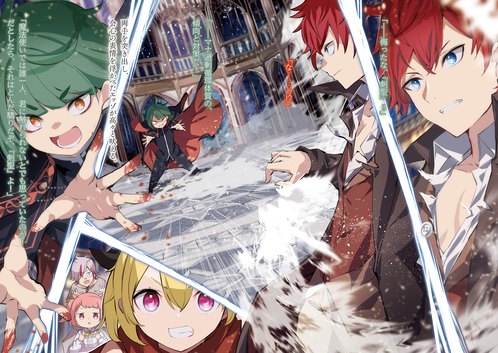
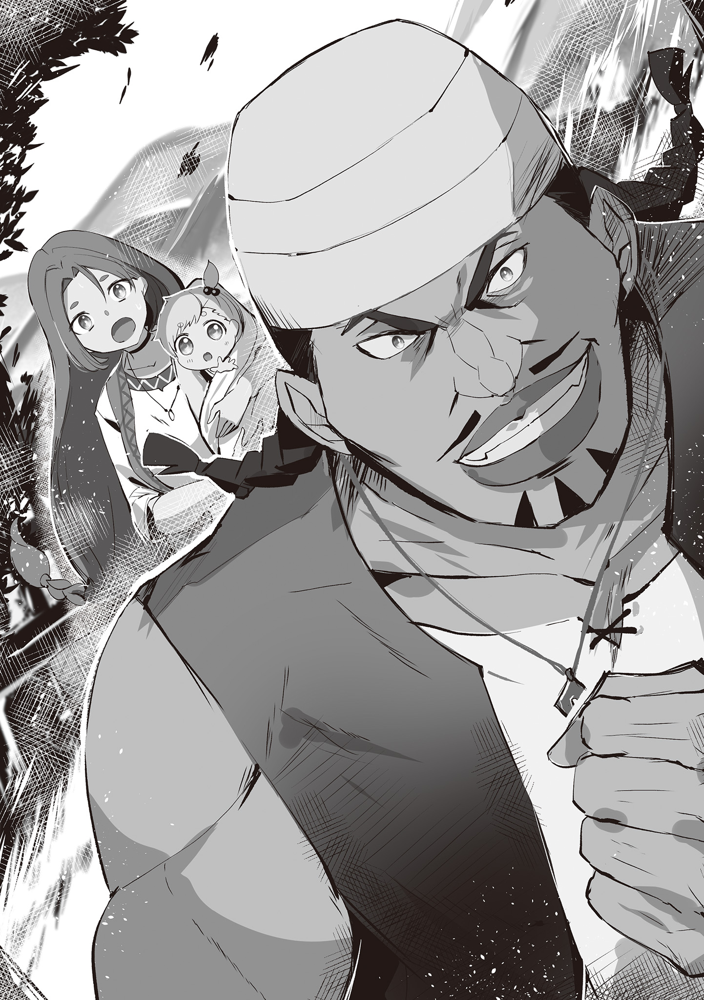
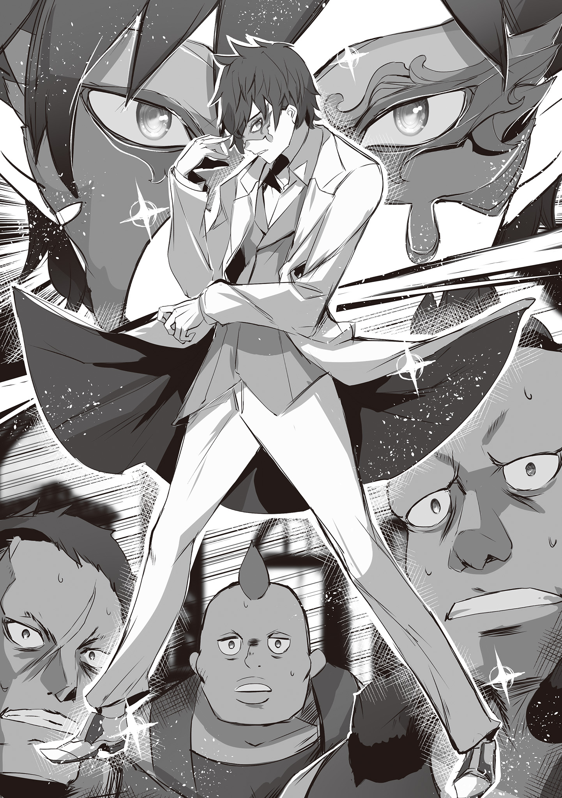
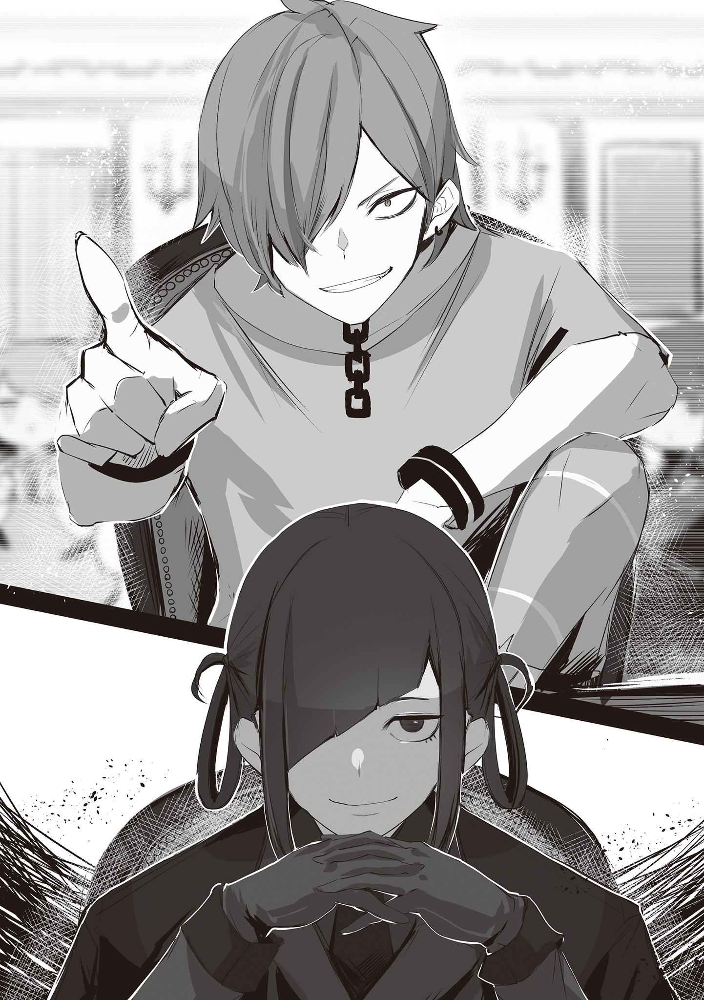
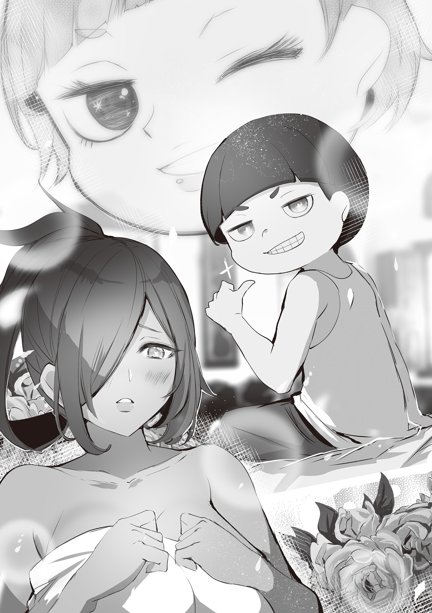
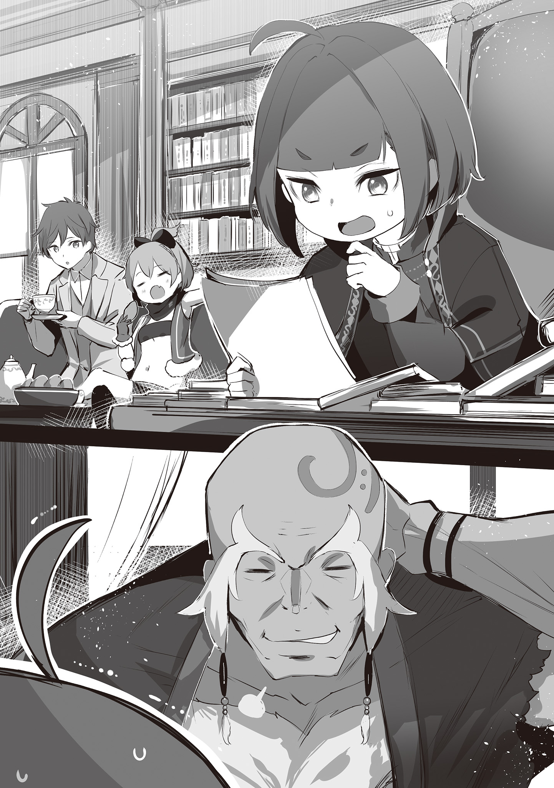
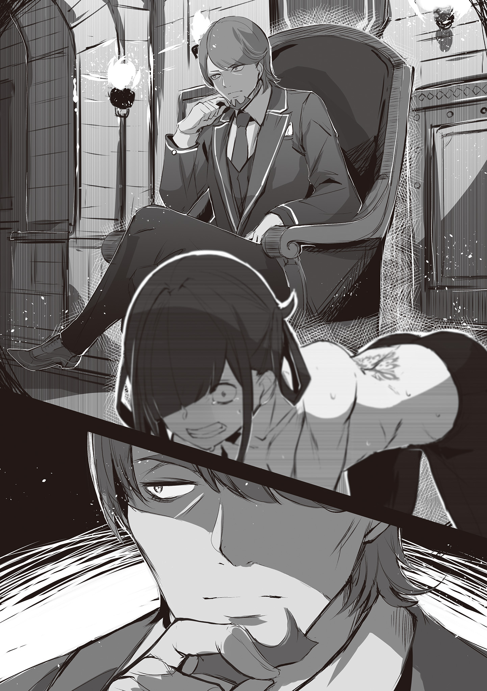

Разобравшись с подозрениями, которые пали на неё со стороны «Большой тройки» «Столицы Наземных Драконов», и нанеся им «визиты», Фельт думала, что наступит мир.

Конечно, она не ожидала, что, будучи кандидаткой в королевы, сможет избежать неприятностей. Но она надеялась, что хотя бы на какое-то время наступит затишье.

Но эта надежда оказалась напрасной.

— …Что ты сейчас сказал?

В холле особняка Астрея в Хакутюри Фельт с суровым лицом задала вопрос. Вопрос был адресован мужчине, сидевшему на полу, которому оказывали помощь, — Рачинсу.

Рачинс, с разбитой губой и синяком под глазом, тяжело дыша, стиснул зубы, пока близняшки Флам и Грасис прикладывали ему лёд и перевязывали раны.

— …Прости. Мы облажались.

— «Облажались» — это не ответ. Как это произошло? Почему…

— Госпожа Фельт!

Райнхард остановил Фельт, которая подалась вперёд. Почувствовав его руку на плече и услышав его голос, Фельт глубоко вздохнула.

— Прости.

Сейчас не время для эмоций. Нужно было действовать быстро и хладнокровно.

— Рачинс, давай ещё раз. …Прошлой ночью в квартале красных фонарей во Фландрии был пожар, и сгорело здание «Сада Цветочной Тюрьмы». Есть подозреваемый в поджоге, и в помощи ему в побеге обвиняют…

— …Меня и Кэмберли.

Райнхард, спокойно излагая факты, посмотрел на Рачинса, и тот, не возражая, кивнул. Это было то же самое, что Фельт услышала ранее. Значит, это не был сон, и она не ослышалась.

Рано утром, измотанный, вернулся Рачинс с плохими новостями из Фландрии.

— Ты говоришь, что помог поджигателю сбежать? Почему вы его не поймали?

— Не столько я, сколько Кэмберли помог ему сбежать. Он, похоже, был с ним знаком, но тогда мы ещё не знали, что его ищут за поджог. После того как мы помогли ему, нас окружили те, кто его преследовал, и вот…

Говоря это, Рачинс, поворачивая лицо, чтобы показать раны, объяснил, как его избили. Было видно, что он подвергся жестокому насилию и чудом спасся.

Проблема была в том, что вернулся только Рачинс.

— А Кэмберли?

— …Его забрали люди из «Сада Цветочной Тюрьмы». Пожар был в квартале красных фонарей. Для них это — удар по репутации. Поэтому…

Рачинс, задрожав, замолчал, и в голове Фельт промелькнула самая страшная мысль.

Это были люди из теневого мира, и они не прощали тех, кто им вредил. Без крови и страха невозможно было поддерживать порядок в их мире.

Если так пойдёт и дальше, Кэмберли конец.

— Кэмберли… он создал мне возможность, и я смог вырваться. Один… я бросил его и сбежал…

— Рачинс, не вини себя. Кэмберли…

— Хватит утешать! Ты же… ты же сам всё понимаешь, Гастон!..

Гастон, сидевший на корточках рядом с понурившимся Рачинсом, на его слова замолчал.

Гастон, который не был вчера во Фландрии, не мог вмешаться в то, что случилось с Рачинсом и Кэмберли. Поэтому он не находил слов.

В общем, если кто-то и должен был что-то сказать, то…

— Что будем делать, Фельт? Сейчас решать тебе.

Тяжёлый, суровый, хриплый голос принадлежал старику Рому, который стоял за спиной Фельт, сложив свои мощные руки.

На шум собрались все обитатели особняка, и все взгляды были устремлены на Фельт.

Конечно. Она была здесь главной и должна была взять всё в свои руки.

Однако…

— Флам, Грасис, как раны Рачинса?

— Выглядят страшно, но он умело уворачивался от ударов в жизненно важные органы, — ответила Флам.

— Хорошо держит удар, — добавила Грасис.

— Ясно. Тогда всё зависит от того, хватит ли у тебя сил встать и идти.

На слова близняшек Рачинс на мгновение застыл, а потом с вызовом ответил: «Конечно».

— Я всё сделаю. Всё, что нужно.

— Вот это настрой. Старик Ром, в «Чёрную Серебряную Монету»…

— Если я появлюсь, то из-за моих отношений с Дольтеро всё может осложниться. В прошлый раз мы договорились больше не встречаться. Но, думаю, он не будет против, если я использую своё имя, чтобы договориться о встрече.

— Спасибо. Хотелось бы, чтобы у нас был кто-то, с кем можно поговорить.

Услышав о решимости Рачинса и получив разрешение использовать имя старика Рома, Фельт посмотрела на Райнхарда.

И…

— Хватит держать меня за плечо. Я больше не буду срываться.

— …Прошу прощения.

— Сразу скажу, твои руки нам ещё пригодятся. С чего начнём?

— Сначала нужно разобраться в ситуации… для этого нужно связаться с «Садом Цветочной Тюрьмы», чтобы узнать о судьбе Кэмберли. Нужно его освободить.

Райнхард, опустив руку с плеча Фельт, высказал своё мнение. На это Фельт, усмехнувшись, сказала:

— Я того же мнения. Есть возражения?

— …

— Если нет, то так и сделаем! Рачинс и Флам, идёте со мной. Старик Ром, ты с Гастоном и Грасис остаёшься в особняке. Мало ли что.

Быстро распределив роли, Фельт изложила свой план, и все кивнули.

Тут же началась суета…

— Фельт, спасибо…

Рачинс и Гастон, низко поклонившись, сказали это Фельт. На их благодарность, сказанную с таким видом, будто она спасла им жизнь, Фельт фыркнула.

— Я ещё ничего не сделала. Рано благодарить.

— И всё равно. Ты же сама понимаешь. Разумнее было бы нас бросить.

— И я, и Рачинс, и Кэмберли — мы все были тобой подобраны. Если бы мы были полезны — это одно, но мы только создаём тебе проблемы, и всё равно…

— Хватит, хватит ныть!

Фельт, с силой хлопнув по плечу двух хулиганов с непривычно серьёзными лицами, смерила их взглядом и, выпятив грудь, сказала:

— Все долги будем считать потом. Если уж попались, то сейчас самое время отыгрываться.

— …Да.

Двое, потирая ушибленные плечи, с решительными лицами кивнули друг другу и быстро задвигались.

Проводив их взглядом, Фельт вдруг заметила, что на неё смотрит Райнхард. Хотя его взгляд ей по-прежнему не нравился, она, оскалив клыки, сказала:

— Ты же знаешь, ты должен быть рядом со мной.

— Разумеется, я буду защищать вас, что бы ни случилось. …Мы обязательно со всем разберёмся.

Взяв с собой Райнхарда, который кивнул в ответ, Фельт отправилась в самое пекло. Если уж нельзя остаться в стороне, то нужно прорваться изнутри, — так она решила.

В VIP-комнате, куда их проводили, как и в прошлый раз, царила совершенно иная атмосфера.

Сладкий, дурманящий аромат, но во взгляде, устремлённом на них, не было соблазна, а сквозила хитрость, которую обычно скрывали.

Наверное, это и была настоящая Тото, хозяйка «Сада Цветочной Тюрьмы».

Напряжённая атмосфера царила не только в этом борделе, но и во всём квартале красных фонарей. Причину этого Фельт увидела по дороге сюда.

Несколько соседних зданий были охвачены пламенем, и бордель сгорел дотла. В пожаре погибли проститутки и клиенты, и «Сад Цветочной Тюрьмы» был в ярости, разыскивая поджигателя.

И то, что Тото, несмотря на свою занятость, согласилась встретиться с ними, имело свою причину.

Она надеялась, что разговор с ними поможет ей достичь своей цели.

Однако…

— Мужчина из вашего лагеря помог сбежать поджигателю, который сжёг мой цветник. И вы просите его освободить? Я ожидала более интересного предложения, — не скрывая своего разочарования ни в голосе, ни во взгляде, сказала Фельт и Райнхарду Тото.

Сегодня Фельт, в отличие от прошлого раза, не села на диван, а стояла. В комнате, кроме Тото, было ещё несколько женщин, и по их виду было понятно, что они умеют драться.

Но обычно эту роль исполнял другой человек. То, что его не было, заставило Фельт предположить, что слухи были правдой.

С двойным чувством уныния она, вздохнув, сказала:

— Я знаю, что это глупое предложение. Но я должна была сначала озвучить наше главное требование.

— Главное требование… вы так беспокоитесь о судьбе того мужчины.

— Каким бы дураком он ни был, я решила, что он — моя ответственность. И я должна её нести. Ты же, наверное, тоже так думаешь, раз так стараешься?

— …

— …Эццо Каднер. Кэмберли помог сбежать тому сенсею, верно?

Назвав ключевое имя, Фельт заставила Тото вздрогнуть и сжать губы.

По её реакции стало ясно, что поджигатель, который сжёг бордель и стал причиной того, что Кэмберли и Рачинс попали в беду, — это тот самый коротышка-маг.

— Я не понимаю, почему господин Эццо пошёл на такое.

Вдруг вмешался Райнхард. Он, как и Фельт, пришёл к тому же выводу, но, как и она, не мог понять, что произошло дальше.

Хотя они и не разговаривали по душам, но атмосфера, исходившая от Эццо, и это ужасное происшествие никак не вязались.

— Госпожа Тото, вы тоже считаете, что это господин Эццо поджёг?

— Конечно. Если бы сенсей… Эццо был невиновен, он бы остался, помог тушить пожар и объяснился. Я не настолько глупа, чтобы выносить приговор, не выслушав его. Но Эццо сбежал с места преступления.

— Тут, конечно, подозрительно. Я бы тоже так подумала.

— Да. Поэтому поджигатель — Эццо Каднер. …Трусливый негодяй, который сжёг своих учениц, которые звали его сенсеем, и сбежал.

— Учениц…

— …Мимоза особенно любила Эццо.

На слова Тото, сказанные пониженным голосом, Райнхард нахмурился.

Услышав это имя, Фельт вспомнила мимолётную встречу с проституткой Мимозой, её хрупкий и прелестный образ. Именно она и была одной из тех, кто погиб в сгоревшем борделе.

— …Она так радовалась, что учится читать и писать.

— …Её продали за долги родителей. Она была преданной, и у неё были поклонники, так что скоро она должна была освободиться.

На слова Тото о Мимозе безысходность лишь усилилась.

Погасив долг, из-за которого она стала проституткой, Мимоза могла бы начать новую жизнь. Она могла бы использовать свои знания чтения, письма и счёта и жить совершенно по-другому.

Но этот путь был перекрыт огнём, который зажёг тот, кто и указал ей этот путь…

— Вы действительно ничего не знаете о том, что сделал Эццо?

— …Что ты имеешь в виду?

— В сгоревшем борделе были мои цветы и их клиенты. Они были связаны с «Чёрной Серебряной Монетой» и «Весами»… поэтому мы считаем, что Эццо — человек какой-то другой организации, не связанной с «Большой тройкой».

— И подозрение, как всегда, падает на нас. …Что ж, неудивительно.

На подозрительный взгляд Фельт честно признала, что ей трудно оправдаться.

Ведь Рачинс тоже подтвердил, что Кэмберли помог Эццо сбежать. Более того, именно Кэмберли и познакомил Эццо с работой в квартале красных фонарей.

Всё сходилось: Фельт внедрила Эццо в квартал красных фонарей, чтобы в нужный момент устроить поджог, нанести удар по «Большой тройке», а затем помочь исполнителю сбежать.

— В таком случае, исполнителя, Эццо, следовало бы убрать.

— О, вот как? Вы действительно так поступили бы? Если так, то это ужасно…

Хотя в словах Тото и сквозила фальшь, она тоже пыталась понять истинные намерения Фельт.

Честно говоря, это было просто досадное недоразумение.

— Подозрения естественны, но мы действительно не имеем к этому отношения. Проблемы Фландрии должны решать жители Фландрии. Разве не так?

— Да, вы правы. Поэтому мы тоже должны сделать всё возможное, чтобы раскрыть это дело. И допрос задержанных — часть этого.

— Чёрт, ходим по кругу.

— Есть способ не ходить по кругу. …Закончить этот разговор и просто наблюдать.

На цоканье Фельт Тото ответила тёмным, соблазнительным голосом.

Её предложение было заманчивым. Так Фельт и её люди могли бы избежать лишних хлопот и спокойно выйти из этой истории.

Но для этого нужно было отказаться от Кэмберли.

— К сожалению, это не в моих правилах.

— О, а я-то думала, что проявила уступчивость, учитывая ваше положение в королевских выборах.

— И что мне останется от этой уступчивости? Долг перед тобой, презрение моего рыцаря, ненависть товарищей брошенного дурака, превращение в труса, которого больше всего ненавидит моя семья, и то, что я не смогу себя простить… я не могу согласиться ни на одно из этих условий.

Если бы Фельт закрыла глаза на такие недостатки, она бы потеряла стержень, который позволял ей стоять на ногах.

Такой Фельт было бы легко манипулировать, и предложение Тото, рассчитанное не только на эту ситуацию, но и на будущее, было очень хитрым.

— Кэмберли — мой человек. Я не собираюсь его бросать. И, кстати, этот рядом со мной — тоже мой человек. Если что, он за меня заступится.

— Да. По слову госпожи Фельт я перегрызу горло любому.

— Я имела в виду пальцы или уши. Горло — это как-то страшно.

На слова Фельт, которая выпятила грудь, Райнхард, воодушевившись, был сбит с толку. На эту перепалку Тото, изящно приложив палец к подбородку, на мгновение задумалась, сузив глаза.

Казалось, она взвешивала разные варианты, не зная, какому отдать предпочтение…

— Ты больше всего хочешь поймать поджигателя, верно?

— …Да, несомненно. Я считаю, что он и есть исполнитель всех последних происшествий. Если его поймают, то и подозрения с вас, госпожа Фельт, будут сняты, и я смогу дать вам хороший ответ по поводу вашего человека.

— Хотя ты и не исключаешь, что это просто «хвост». …Но ладно.

Заставив Тото признать, что лучший способ вернуть Кэмберли и снять с себя подозрения — это поймать виновного, Фельт, сверкнув клыками, улыбнулась.

С этой улыбкой на лице она сказала:

— Мы разберёмся с этим беспорядком во Фландрии. И я с нетерпением жду, какой благодарностью ты меня тогда одаришь.

— Чёрт! Сначала спас, а теперь должен поймать? Ну и дела! — Рачинс, который в платке встретил их после разговора с «Садом Цветочной Тюрьмы», с силой пнул землю, выражая своё недовольство требованием Тото.

Флам, стоявшая рядом с бушующим Рачинсом, позвала его:

— Господин Рачинс.

— Успокойтесь. Если вы будете так шуметь в таком странном виде, то привлечёте слишком много внимания.

— Замолчи! Это же ты меня заставила это надеть, потому что меня могут узнать!

— Поэтому я и говорю, что это будет иметь обратный эффект, это же очевидно даже для молодого господина.

— Не понимаю, почему вы меня в это впутали…

Райнхард, нахмурившись, с недовольством посмотрел на Флам. На эту перепалку Рачинс, как будто остыв, глубоко вздохнул и сказал: «Прости».

Фельт понимала его волнение и смешанные чувства.

— Ведь Кэмберли поймали за то, что он помог сбежать Эццо, а теперь, чтобы спасти Кэмберли, нужно привести этого Эццо.

— Господина Рачинса и избили зря, так что неудивительно, что он злится.

— Я не из-за этого злюсь… а, чёрт!

Рачинс, кое-как подавив вновь вспыхнувший гнев, схватился за голову.

Несмотря на то, что он вернулся в особняк избитым, его рассудительность была на высоте. Он не стал в гневе врываться на вражескую территорию один и не пытался действовать напролом.

Он понимал, что на данный момент лучших условий, чем те, что они выторговали, не добиться.

— Тогда что будем делать? Попросим молодого господина обыскать весь город?

— Если не будет другого выхода, то придётся, но это самый глупый план…

— Я бы хотел этого избежать… Рачинс, есть идеи? Ты знаешь этот город лучше.

— Это не сарказм, чёрт. …Есть одна мысль.

Секунду поразмыслив над словами Райнхарда Рачинс, поправляя платок, пробормотал и нахмурился. В ответ на его слова Фельт и её спутники с надеждой посмотрели на него.

— Его ищет не только «Сад Цветочной Тюрьмы», но и другие из «Большой тройки», и не могут найти.

— Вот именно. Это и есть самая большая проблема. Как бы это ни звучало, но его ищут люди, которые знают город гораздо лучше нас, и до сих пор не нашли.

— Может, он уже покинул город?

— Нет, помнишь, как та женщина, за которой ухаживал Гастон, сбежала с ребёнком в Хакутюри, и её нашли? От теневого мира так просто не сбежишь. И то, что того коротышку-поджигателя до сих пор не нашли, означает…

— …Что его кто-то прячет.

На слова Райнхарда, который пришёл к выводу о причине того, почему Эццо не был найден, Рачинс, щёлкнув пальцами, сказал: «Вот именно». С этим выводом согласились и Фельт, и Флам. Но вместо одного вопроса появился другой.

— В таком случае, кто-то, готовый пойти против тех, кого все боятся, прячет этого господина Эццо.

— Причина — либо долг, либо чувства, либо ненависть к «Большой тройке».

— Ты сказал, что у тебя есть мысль. Ты знаешь кого-то, кто мог бы так поступить?

— …Да. Но если его прячет тот, о ком я думаю, то причина не в долге, не в чувствах и не в ненависти.

Рачинс, уклончиво, но всё же подтвердил их догадки.

Но Фельт, услышав это, склонила голову. Если причина не в долге, не в чувствах и не в ненависти, то что же могло заставить кого-то пойти против таких могущественных врагов…

— Остаётся только выгода, но какая?

— Раз уж они это делают, значит, есть. Иначе бы эти ублюдки и пальцем не пошевелили.

Судя по всему, это были не самые приятные люди. Рачинс тоже говорил о них с неохотой.

Несмотря на неприятное предчувствие, Рачинс сказал им.

Этот кто-то был…

— …Здесь есть один страшный ростовщик. «Золотой Жук».

— О, да это же самая обсуждаемая персона в королевстве. Подумать только, что вы посетите нас, — какая честь, — сказав это, женщина в чёрном костюме встретила Фельт и её спутников в приёмной офиса.

Тёмно-зелёные волосы, собранные в два хвостика, костюм, галстук и даже перчатки — всё было чёрным. Эта женщина, с её улыбкой, была, по мнению Фельт, вооружена.

Хотя она и вела себя подобострастно, Фельт, как и в случае с Тото, чувствовала, что перед ней — опасный противник.

— Мы — «Золотой Жук». Я — Хелейн, глава фландрийского отделения. Чем могу быть полезна, госпожа Фельт?

— Похоже, ты и без представления знаешь, кто я.

— По долгу службы я стараюсь быть в курсе всех слухов. Кстати, говорят, в городе был сильный пожар. Надеюсь, он не доставил вам неудобств во время вашего пребывания.

— Ну и ну.

Хелейн, кланяясь, как ни в чём не бывало, затронула больную тему.

Возможно, она не только знала об их делах, но и догадывалась, зачем они пришли. И о Рачинсе в платке, и о юной Флам, и о сопровождавшем их Райнхарде.

…«Золотой Жук» — это ростовщическая контора с филиалами во всех городах королевства Лугуника, которая во Фландрии, под покровительством «Большой тройки», мирно и бессовестно выдавала кредиты.

В некотором смысле, они обладали в городе таким же влиянием, как и «Большая тройка», и доказательством тому было то, что «Золотой Жук» тоже пострадал от недавних нападений.

Поэтому Хелейн, должно быть, тоже хотела, чтобы это дело было раскрыто. И то, что она так радушно их встретила, было, скорее всего, проявлением этой надежды.

В таком случае, Фельт тоже не собиралась хитрить.

— …Вы не прячете у себя мага по имени Эццо Каднер?

— …

— Прости. Я не люблю долгих переговоров.

На прямой вопрос Фельт Хелейн, с её застывшей улыбкой, промолчала.

Хотя она и продолжала улыбаться, Фельт почувствовала, что её улыбка стала какой-то зловещей, и поняла, что приём окончен.

— Молодой господин, это ужасно. Одна чашка этого чая стоит как месячный запас чая в особняке.

— …Флам, наслаждайся, но не теряй бдительности.

Пока атмосфера в приёмной накалялась, Райнхард и Флам оставались невозмутимы, что обнадёживало.

Райнхард — само собой, но и Флам, которую они взяли с собой, была, несмотря на свою внешность, сильным бойцом. Настолько, что Фельт и Рачинс вместе не смогли бы её одолеть.

Пока эти двое поддерживали боевой дух, Хелейн, вздохнув, сказала:

— Что за странные вещи вы говорите. Если я не ошибаюсь, это имя принадлежит опасному преступнику, который будоражит город. Прятать такого человека… мы…

— Сразу скажу, мы пришли не с пустыми обвинениями. Ты же, наверное, слышала? Про дурака, который помог ему сбежать и был схвачен «Садом Цветочной Тюрьмы».

— …Кажется, он служит какой-то важной особе. Этой особой были вы, госпожа Фельт? В таком случае, прошу прощения за мои неосторожные подозрения. Нас часто ненавидят, вот я и…

— Ростовщикам, наверное, не привыкать. Хотя я и не понимаю, как можно ненавидеть того, у кого занимаешь.

Было понятно, что ростовщическая контора, тесно связанная с теневым миром, была полна ненависти и обид. И Хелейн, похоже, знала, как с этим справляться.

Впрочем, Фельт так и не получила ответа на свой главный вопрос.

— Итак, ответ на мой вопрос… где Эццо Каднер?

— Я же уже ответила. Говорят, этот человек пошёл против «Большой тройки». Прятать такого — это слишком смело для нас.

— Да, это страшно. Обычно так не поступают.

— Вот видите? Тогда…

— …Но если есть достойная награда, то дело другое.

На слова Хелейн, которая продолжала отрицать свою причастность, вмешался мужчина, который до этого молчал. Увидев Рачинса, Хелейн, улыбаясь, склонила голову.

— Госпожа Фельт, он?

— Один из наших мозговых центров. Я сама не люблю думать. И, если честно, мы пришли к тебе по его совету.

— Ясно, вот оно что. …Ваши слова интересны.

— Для тебя это, наверное, просто необоснованные обвинения.

Перед улыбающейся Хелейн Рачинс, цокнув языком, вышел вперёд. Он встал рядом с Фельт, с другой стороны от Райнхарда.

— Это вывод из обратного. То, что беглеца не могут поймать, означает, что его кто-то прячет. Пойти против «Большой тройки» и прятать кого-то — на это способен только кто-то такой же сильный, как «Золотой Жук». Обычно «Золотой Жук» не стал бы делать таких глупостей. Но если они это сделали…

— Значит, была необычная награда. Действительно, вывод из обратного.

— Для тебя, которую обвиняют, это, наверное, неприятно.

Неизменная улыбка была более непроницаемой, чем полное отсутствие эмоций. Хелейн, не меняя интонации, слушала предположения Рачинса.

Чувства противника были непонятны. Поэтому Фельт, хлопнув себя по колену, сказала:

— А мне кажется, это убедительно. А тебе?

— …Вы доверяете своим подчинённым.

— Свой или чужой — это не так уж важно, когда дело доходит до того, чтобы согласиться или нет. Конечно, слова своих слушать легче и верить им проще, но ты думаешь, я ошибаюсь из-за предвзятости?

— Что ж. …Это действительно заслуживает внимания.

Высказав своё мнение, она попыталась склонить и противника на свою сторону. Хотя и не верилось, что Хелейн попадётся на такую простую уловку, но она получила обнадёживающий ответ.

Перед ними Хелейн, приложив тонкий палец к алым губам, сказала:

— Допустим… допустим, вы услышите от нас желаемый ответ, что вы будете делать, госпожа Фельт? Эта «Столица Наземных Драконов» — не ваша территория.

— Я не собираюсь делать этот город своей территорией. И кто бы ни прятал Эццо, я не собираюсь его выдавать. Но я же сказала, один дурак в плену.

— Значит, вы готовы рисковать ради подчинённого с не самой лучшей репутацией?

— …

Взгляд Хелейн скользнул с Фельт на Рачинса. Тот, слегка затаив дыхание, с досадой выслушал её слова.

Учитывая поведение и манеру говорить Кэмберли, Фельт и самой было трудно найти слова в его защиту.

— Этот вопрос мы уже решили. То, что я здесь, — это и есть ответ.

Она уже сказала Тото, что не бросит Кэмберли. И её решение не изменится.

На слова Фельт Рачинс, удивлённо, посмотрел на неё.

— Ты что, думал, что я тебя брошу? Если бы я бросала людей за то, что они меня не слушают, я бы давно бросила Райнхарда.

— Бросить молодого господина — это немыслимо. Даже если бросите, он сразу вернётся.

— Во-первых, не надо меня бросать.

Фельт, сверкнув клыком, улыбнулась, и на её слова в один голос ответили Флам и Райнхард. Рачинс, удивлённо, стиснув губы, промолчал.

Но прежде чем замолчать, он сказал:

— …Он мой друг. Я правда тебе благодарен.

— Я же тебе уже говорила в особняке. Рано благодарить, дурак.

На слова Рачинса, которые он с трудом выдавил из себя, Фельт, как ни в чём не бывало, пожала плечами.

Когда их перепалка закончилась, в приёмной раздались хлопки. Хелейн, хлопая в ладоши, с улыбкой смотрела на Фельт и её спутников.

— Это была прекрасная история. Мы выражаем вам своё искреннее восхищение.

— «Искреннее» — не говори того, чего не думаешь. Ты не такая.

— Что вы. Мы, как кредиторы, уверены в своей способности разбираться в людях… хорошо.

Хелейн, с силой хлопнув в ладоши перед грудью, улыбнулась Фельт. На её жест та нахмурилась, и Хелейн продолжила:

— Чтобы и впредь поддерживать с нами хорошие отношения, мы хотим исполнить ваше желание. …Местонахождение господина Эццо Каднера, верно?

— Значит, «Золотой Жук» всё-таки его прятал?

— Мы лишь предоставили ему убежище. В обмен на предложенную им плату мы не могли предоставить большего.

— Плату?

— Неопубликованную… то есть, неофициальную, магическую теорию. Мы оценили её как имеющую ценность.

На спокойный ответ Хелейн Фельт и Райнхард поняли, о чём речь.

Это было то, что Эццо готовил для своего будущего. И он обменял это на убежище, которое так легко было раскрыто.

— Вы сомневаетесь в нашей оценке того, с кем выгоднее иметь дело?

— Я не буду жаловаться после того, как получила то, что хотела. …Но ты мне не нравишься.

На прямые слова Фельт Хелейн, покачав головой, сказала: «Жаль». Даже в этот момент на её лице была улыбка, и Фельт так и не смогла понять, что у неё на уме.

…Заброшенный особняк бывшего богача на окраине Фландрии.

Здание, отобранное у проигравшего, который, увлёкшись азартными играми, промотал всё своё состояние и обратился к «Золотому Жуку», а в итоге лишился и дома. Это и было то убежище, которое Эццо Каднер, страстно говоривший о своём будущем, получил от «Золотого Жука» в обмен на это самое будущее.

Это были руины мечты, и, видя, что Хелейн предоставила именно такой особняк в качестве убежища, Фельт поняла, что её первое впечатление было верным.

— Не думаю, что это было сделано просто из вредности, но она очень строга в своих оценках. …И зачем она ввязалась в такую опасную игру.

— …Наверное, она хотела быть готовой к любому исходу.

— Готовой?

— «Золотой Жук» позиционирует себя как нейтральную сторону. Но на самом деле это означает, что они хотят быть в хороших отношениях со всеми. И ты — одна из кандидаток на эту роль.

В общем, визитная карточка Фельт как кандидатки в королевы была достаточно привлекательной, чтобы пройти строгий отбор Хелейн. А может, ту и вовсе интересовал «Святой Меча».

— Или и то, и другое… молодой господин и госпожа Фельт, два цветка в одни руки.

— Я что, похожа на цветок?

— В таком случае, цветком буду я.

На шутку Флам Фельт устало вздохнула, а Райнхард горько усмехнулся. Затем он уверенно вышел вперёд.

Глядя на особняк, он, сузив свои голубые глаза, сказал:

— Пока что другие организации нас не выследили, но это вопрос времени. Я войду. Госпожа Фельт, пожалуйста, подождите здесь.

— Ладно, я на тебя полагаюсь. Только не слишком грубо, я хочу с ним поговорить.

— Да. Флам, я доверяю тебе госпожу Фельт и Рачинса.

— Молодой господин, пожалуйста, будьте осторожны… и постарайтесь никого не убить.

Проводив Райнхарда, который обменялся взглядами с Рачинсом, Фельт и Флам остались ждать.

С мужественным взглядом на своём красивом лице, он, превращая обычный обыск старого дома в сцену из эпоса, подошёл к входу и глубоко вздохнул.

И…

— …Господин Эццо Каднер! Я знаю, что вы здесь! Не могли бы вы выйти?!

Громким голосом он, как и подобает рыцарю, открыто призвал противника показаться.

На этот поступок Фельт от удивления открыла рот, а Рачинс схватился за голову, пробормотав: «Дурак!». Только Флам, сложив руки перед собой, сказала:

— Это же молодой господин.

Как будто это было само собой разумеющимся.

Оставив в стороне странное понимание между слугами дома Астрея, Фельт огляделась. После такого призыва Эццо, скорее всего, попытается сбежать. Она внимательно смотрела, не появится ли коротышка из-за дома или из окна…

— …Не думал, что за мной придёт «Святой Меча». Меня высоко ценят.

— Не может быть.

Надежды Фельт были разбиты тем, кто, скрипнув дверью, вышел.

Растрёпанные зелёные волосы, испачканный сажей чёрный плащ, — он выглядел хуже, чем в прошлый раз, но это был, несомненно, Эццо Каднер, с которым она разговаривала в квартале красных фонарей.

Эццо, который действительно прятался в указанном убежище, но, будучи преследуемым, не утратил своего боевого духа.

Перед ним Райнхард протянул пустую ладонь.

— Господин Эццо, я настоятельно рекомендую вам сдаться. Как и мы, вас скоро найдут… сейчас ещё есть возможность объясниться по поводу вчерашнего.

— Вы думаете, что мне, который сбежал, не дав объяснений, проявят снисхождение? К сожалению, я не так оптимистичен. И я не хочу быть глупцом, который не осознаёт своего греха.

— Своего… греха?

Эццо, покачав головой, бессильно пробормотал, и Райнхард нахмурился. На его тихий вопрос маг, подняв руки, ответил: «Да».

Словно сжимая в руках что-то невидимое.

— Грех. Совершённый грех должен быть искуплен. Это будет данью памяти Мимозе, которая звала меня своим учителем, и искуплением за её оборванное будущее!

— Господин Эццо!

Почувствовав изменение в его ауре, Райнхард резко окликнул его.

Но Эццо не ответил на его зов, а вместо этого в его раскрытых ладонях закружились красный и синий свет, создавая сложное заклинание, которое даже неспециалисту показалось бы очень мощным.

Он был готов к бою. …Даже зная, что перед ним Райнхард, «Святой Меча».

— Райнхард! Делай, что должен!

— …Да!

Видя решимость Эццо, Фельт подтолкнула колеблющегося Райнхарда.

Красноволосый рыцарь, коротко ответив, оттолкнулся от земли и, словно взрыв, бросился на Эццо. Как и в их первой встрече в квартале красных фонарей, он собирался обездвижить маленького мага…

— …Ты меня недооценил, «Святой Меча»!

— Ч-что?!

В следующий миг фиолетовый удар, смешанный из красного и синего, поразил Райнхарда в грудь, отбросив его назад и заставив удивлённо вскрикнуть.

Райнхард, отступив, широко раскрыл глаза. На его белой рубашке был виден след от удара, и две пуговицы были оторваны.

— …Вот тебе тенденции и контрмеры против переизбытка маны в организме!

Эццо, вытянув руки, с довольным лицом закричал.

С его рук капала кровь. На обеих руках было сорвано несколько ногтей, а на предплечьях и запястьях виднелись порезы. Это была цена за один удар.

Но он попал. Впервые на глазах Фельт Райнхард получил урон.

— Ты думал, что ни один маг не сможет тебя коснуться?! Если так, то ты слишком зазнался, «Святой Меча»!

— …

— Я изменил структуру заклинания, намеренно исказив обычную передачу маны! Это нелогично, неравномерно, менять структуру во время создания заклинания — это безумие! Но! Как тебе!

Эццо, сорвав зубами полусорванный ноготь, с болью закричал.

Кто мог бы посмеяться над ним за то, что он так радовался одному удару?

Райнхард, обладавший подавляющей силой, был силён не только своей невероятной атакой. Его защита тоже была непробиваемой. Особенно против магии он был абсолютно неуязвим. …И в этот момент эта неуязвимость была нарушена.

— Спасибо, «Святой Меча» Райнхард ван Астрея! Благодаря тебе я доказал, что мои исследования по переизбытку маны в организме работают! Теперь — только практика!

Эццо, не останавливая кровь, израненными руками сотворил новое заклинание. Двойное заклинание, когда в каждой руке создаётся разное заклинание, — это высшая техника, доступная лишь лучшим магам.

Поток мутной воды с небес и бушующий ветер столкнулись в воздухе, создав белый туман, который, казалось, поглотил всё вокруг и мгновенно лишил всех обзора.

Под прикрытием тумана Эццо попытался сбежать. Это был лучший ход, основанный на предыдущей атаке.

…Если бы его противником не был Райнхард.

— Выражаю своё уважение.

Слова, полные искреннего восхищения, и сразу после этого ударная волна, расколовшая мир, развеяла туман.

В центре тумана стоял Райнхард, который только что ударил ногой. Райнхард, который буквально топнув ногой развеял туман, увидел спину убегающего Эццо.

Один раз его упрекнули в том, что он недооценил противника. Поэтому, проявив уважение, он не собирался повторять ошибку.

— Г-а!

Схватив его за тонкую руку, он прижал Эццо к мокрой земле. Под стонущим магом Райнхард, не теряя бдительности, заломил ему плечо.

— Победа за мной. Дальше…

Райнхард, собиравшийся снова призвать его сдаться, вдруг почувствовал, как по его щеке брызнула кровь.

Кровь была не его. Райнхард, затаив дыхание, увидел, как Эццо, воспользовавшись его удивлением, вскочил и, держась за почти оторванную правую руку, отступил.

Он сам ударил магией по своей руке, чтобы освободиться от захвата противника. Если бы Райнхард отпустил его на секунду позже, рука могла бы быть оторвана.

…Нет, он бы её оторвал. Такова была решимость в глазах Эццо.

— Ты слишком мягок, «Святой Меча». Я очень сомневаюсь, что ты сможешь защитить свою драгоценную госпожу…

— …Нужно срочно оказать помощь. Зачем вы так безрассудно…

— Я же сказал. Для искупления!

Кровотечение из почти оторванной руки было гораздо сильнее, чем раньше, и количество крови, вытекавшей из маленького тела, было смертельным. Но Эццо, с бледным лицом, не обращая на это внимания, закричал во всё горло.

Весь в крови, с искажённым от гнева и горя лицом…

— Мимоза не была умной. Она была необразованной, невоспитанной, и ей было трудно учиться. Но она старалась. Медленный прогресс не умаляет ценности желания учиться.

Эццо, запинаясь, рассказывал о погибшей девушке.

Его крик о погибшей, сожжённой девушке больно ранил души слушателей.

— Проданная родителями в квартал красных фонарей, ночная бабочка, которая мечтала стать настоящей цветочницей… она, робко, только что выученными буквами, в письме спрашивала, не смешно ли это…

Его голос, не теряя своей страсти, становился всё более неразборчивым. Эццо, сам того не заметив, опустился на колени и качал головой.

Затем он, прошептав что-то, поднял голову. Увидев перед собой тонкую тень девушки, он, сузив глаза, прохрипел: «Мимоза…».

— Никто не имеет права смеяться над мечтой. Ни кровь, ни земля, на которой ты вырос, не имеют значения. Я, «Серый», докажу это. Поэтому…

— …

— …когда я получу свой титул, прикрепи мне на грудь цветок из своего магазина…

Эццо, слабо выдохнув, потерял сознание. Его падающее тело подхватила и, погладив по спине, обняла не Мимоза. Это была Фельт, которая не была похожа на неё ни ростом, ни возрастом, ни цветом волос и глаз.

— Столько крови потерял, и так безрассудно. Потерял сознание.

Фельт, глядя на раны Эццо, скривила губы.

Одна из рук почти оторванная, а сами руки израненные и все в кровавых подтёках. Как он только мог так буйствовать.

— Госпожа Фельт, ваша одежда в крови.

— Одежду потом поменяю. Флам, поможешь с ранами?

— Да. У меня есть всё необходимое на случай, если молодой господин кого-нибудь покалечит.

Флам, поклонившись, взяла Эццо у Фельт и начала быстро оказывать ему помощь. Судя по её уверенным движениям, Фельт поняла, что с ним всё будет в порядке.

Затем она обернулась к другому, которому тоже, похоже, нужна была помощь.

— Что это за кислое лицо. В последнее время я только такое и вижу.

— …Мне очень стыдно. Честно говоря, я не думал, что он сможет контратаковать.

— Я не скажу, что ты его недооценил. Я тоже не думала, что он на такое способен. Он оказался гораздо круче, чем я думала.

Райнхард, придерживая рубашку с оторванными пуговицами, выглядел искренне удивлённым.

Действительно, нанести ему удар — это было подвигом, на который не хватило бы и сотни лучших бойцов. То, что Эццо это сделал, доказывало, что он был настоящим мастером.

И стало ясно не только то, что Эццо — выдающийся маг.

— Рачинс, что думаешь?

— Что тут думать. Отдать этого коротышку-поджигателя «Большой тройке», вернуть Кэмберли, и дело с концом… я и сам понимаю, что всё не так просто.

Рачинс, глядя на лужу крови на земле, с отвращением пробормотал.

На его слова Фельт одобрительно кивнула. Решимость Эццо, который не отступил даже перед Райнхардом, была вызвана…

— …Кто-то поджёг бордель и свалил всё на Эццо.

Увидев в его сопротивлении эту возможность, Фельт с горьким чувством посмотрела на небо Фландрии.

…В то же время, когда Фельт и её спутники осознали, что за событиями в «Столице Наземных Драконов» стоит кто-то ещё…

Гастон, оставшийся в Хакутюри ждать вестей от Фельт, боролся с нетерпением. Он знал Рачинса и Кэмберли ещё со времён, когда они были хулиганами в столице.

С Кэмберли он дружил ещё дольше, с самого детства. Поэтому он не раз попадал в переделки из-за его любви к неприятностям.

Каким-то чудом их подобрала Фельт, и они оказались втянуты в королевские выборы, которые потрясли всё королевство Лугуника. Он надеялся, что теперь всё изменится, но…

— Детские привычки так просто не проходят. …Но если бы не Кэмберли, мы бы не встретили Рачинса.

Кэмберли не только любил неприятности, но и не мог пройти мимо них.

Он постоянно лез не в своё дело, и часто ему за это доставалось. Конечно, доставалось и Гастону, но он не мог бросить его из-за его обаяния и того, что иногда он приносил пользу.

Они встретили Рачинса, когда Кэмберли подобрал его, полумёртвого, после ограбления.

И в этот раз он попался, потому что помог знакомому сбежать.

— Чёрт, стоило на одну ночь отвернуться, и вот…

— …

Вдруг кто-то потянул его за рукав, и Гастон, обернувшись, встретился с тревожным взглядом.

Рядом с ним стояла женщина с красивыми пепельно-каштановыми волосами и зелёными глазами, которой очень шёл деревенский наряд, — Карифа.

Она была матерью, с которой он познакомился два месяца назад при весьма неприятных обстоятельствах. Она была молодой, но уже воспитывала одна свою дочь. Из-за травмы, полученной тогда, она потеряла голос и нуждалась в помощи, и Гастон стал о ней заботиться.

Он называл её просто Карифой, и она не возражала.

Впрочем, Гастон, которому было приказано ждать в особняке, пришёл к ней не для того, чтобы она его утешала.

Он хотел предотвратить то, чтобы проблемы Фландрии коснулись Карифы и её дочери Ирии.

— Прости, Карифа. Я тебя напугал. Вещи собрала?

— …

— Спасибо, что так быстро. Тогда я возьму вещи, а ты — Ирию.

Карифа не могла говорить, но хорошо выражала свои чувства глазами и мимикой. Взяв у неё сумку с вещами, Гастон, стараясь не торопить её, но всё же спешил, чтобы отвести их в особняк Астрея.

Он уже договорился с хозяином фермы, где работала Карифа. Ведь именно дом Астрея и нашёл ей эту работу, а Гастон, который бывал там почти каждый день, был знаком с хозяином.

Тот не только не возражал, но и велел ему хорошо их защищать.

— И это я-то, хулиган из столичных трущоб.

Гастон, глядя на спину Карифы, которая укутывала сонную Ирию, посмотрел на свою свободную руку и пробормотал.

Он никогда не надеялся на будущее и не ждал, что кто-то будет на него надеяться.

Он бунтовал против мира, принимая свою горькую судьбу как должное, и жил, игнорируя свою гниющую душу, в компании таких же, как он, готовясь умереть.

И как же такой человек стал тем, на кого кто-то надеется?

— Всё ещё впереди. Верно, Кэмберли, Рачинс?

Назвав имена своих товарищей, которых здесь не было, Гастон сжал кулак.

Тут вернулась Карифа с Ирией на руках. Увидев сонную малышку, Гастон невольно улыбнулся.

Он протянул палец, и ребёнок, не опасаясь, схватил его. От маленькой ручки пошло тепло, и грудь Гастона наполнилась чем-то тёплым.

Он чувствовал, что это было счастье, и хотел обнять её…

— …Карифа, держи Ирию и отойди.

По дороге с фермы в особняк Гастон встал перед мужчинами, окружившими их.

Прикрывая собой Карифу, которая крепко прижимала к себе дочь, Гастон, оглядев десяток мужчин в масках, стиснул зубы.

Он пришёл за Карифой и Ирией именно потому, что боялся этого.

Как только Кэмберли, а значит, и лагерь Фельт, оказались втянуты в происшествия во Фландрии, было очевидно, что противник прибегнет к хитрости.

Ведь победить Райнхарда в открытом бою было невозможно.

— Слишком много вас для матери с ребёнком и простого хулигана. Вы, ребята, любите преувеличивать.

— …

— Ничего не скажете? Ну, я и сам не люблю болтать, так что это даже к лучшему…

Стоя перед молчаливыми мужчинами, Гастон глубоко вздохнул.

Это не было бравадой, это была правда. Ему было бы гораздо страшнее, если бы противник начал предлагать сделки и заставлять его думать.

Рачинс мог бы выкрутиться умом, а Кэмберли — наглостью, но Гастон так не умел. Он умел вести переговоры только кулаками.

— …

Глубоко вдохнув и выдохнув, он сосредоточился.

Каждый день, до изнеможения, он повторял адские тренировки — безжалостные тренировки Райнхарда, в результате которых он освоил азы «Метода Потока».

Он и не представлял, насколько плохо человек контролирует своё тело.

Он узнал это, понял и, каждый день превозмогая себя, учился владеть своим телом лучше, чем вчера. И хорошо, что его тошнило. Чем больше его тошнило, тем больше он узнавал себя.

Если бы он остался трусом, слабаком и неудачником, он бы не смог защитить Карифу и Ирию и сражаться.

— Мой друг в беде, а я здесь. Я должен доказать, что я здесь не зря, иначе какой из меня мужчина!

Гастон, сжав кулак, бросился на мужчин.

Земля под его ногами, впитавшая силу «Метода Потока», треснула, и он, взлетев, нанёс удар по застывшим от удивления мужчинам.

— …

Ему показалось, что он услышал беззвучный крик Карифы, и его кровь закипела.

Вы хоть знаете, с кем он обычно имеет дело? …По сравнению со «Святым Меча», сколько бы их ни было, он не собирался проигрывать.

— …Спасибо за помощь с ранами. И за то, что не отдали меня ни одной из «Большой тройки». Но, но…

— Что? Есть жалобы?

— Ещё бы! Несмотря на все обстоятельства, я протестую против такого обращения!

Эццо Каднер, сидевший на ступеньке грязной лестницы и смотревший на Фельт, которая, подперев щёку рукой, сидела на другой ступеньке, отчаянно замахал ногами.

Несмотря на то, что ему только что оказали помощь, и он потерял много крови, он был в ярости и кричал. Он протестовал против того, что его, связанного, подвесили со второго этажа.

— Старик Ром говорил мне, что от магов можно ожидать чего угодно. Если тебя подвесить, то даже если ты разрежешь верёвку, ты просто упадёшь на пол. Так удобнее.

— Осторожность по отношению к магам — это правильно, но для этого есть господин «Святой Меча»! И вы, наверху, неужели вы ничего не думаете по этому поводу?!

— Думаю… подвешивать господ — это доставляет мне тёмное удовольствие.

Эццо, поняв, что от неё помощи не дождёшься, обратился к Райнхарду.

— Господин «Святой Меча»!

На его отчаянный зов Райнхард, с сочувствием нахмурившись, сказал:

— Госпожа Фельт, может, это всё-таки несправедливо? Я не думаю, что господин Эццо снова прибегнет к безрассудным действиям…

— Это твоё личное мнение. Фельт права. От магов можно ожидать чего угодно. Если не можешь заткнуть рот, то свяжи руки и ноги — это минимум. Ты же сам, потому что тебе всё нипочём, недооценил его и поплатился.

— Это… да, это так.

Райнхард, который было поддался, согласился с суровым мнением Рачинса.

И именно его, который заставил Райнхарда замолчать, подвешенный Эццо внимательно рассматривал.

— Так смело говорить с «Святым Меча»… кто ты?

— Чёрт, так понятно?

— …! Это лицо… так ты тот, кто был с Кэмберли.

Эццо, увидев Рачинса, который снял платок, узнал его.

Фельт удивилась, что платок, который она считала бесполезным, оказался таким эффективным, но удивление Эццо было гораздо сильнее.

— Судя по твоему гневу… неужели Кэмберли…

— Его схватили твои бывшие хозяева, «Сад Цветочной Тюрьмы». Он помог мне сбежать, но и мне досталось. Как ты за это ответишь?

— Отвечу…

Рачинс, грубо наседая на него, вёл переговоры как хулиган, но на серьёзного и честного Эццо это подействовало.

Подумав, тот, смирившись, кивнул.

— Не знаю, можно ли это назвать искуплением, но я выслушаю ваши требования. Что мне делать?

— Что-то ты стал сговорчивым.

— Я в долгу перед Кэмберли. Уже дважды. Если я предам вас, которые беспокоятся о нём, я не смогу оправдать свои поступки. Это невыносимо.

— …Флам.

На серьёзный ответ Эццо Фельт позвала Флам. Та, поняв её, с сожалением опустила связанного мага на пол. Тугие узлы Райнхард разрезал одним движением пальцев, и Эццо был свободен.

Он, проверяя своё состояние, посмотрел на свою перевязанную правую руку.

— Хорошая работа. Кто это сделал?

— Флам, которая тебя подвешивала. Хорошо работает, правда?

— Мне неловко благодарить её, но спасибо.

Эццо, поклонившись Флам, которая, собрав верёвку, спускалась со второго этажа, снова встал перед ними и глубоко вздохнул.

Подумав, с чего начать…

— …Во-первых, это может прозвучать как оправдание, но выслушайте. Пожар в борделе «Сада Цветочной Тюрьмы», в котором погибло несколько человек… это сделал не я!..

— А-а, это мы уже поняли, можешь пропустить.

— Поняли, поэтому можно пропустить?!

На удивлённый возглас Эццо Райнхард с укором посмотрел на Фельт. Но та на его взгляд лишь нахмурилась.

— Что, некогда тратить время на то, что уже прошло? Мы уже решили, что поджигатель — кто-то другой. Значит, нужно говорить о том, что важнее.

— Ваша решительность, госпожа Фельт, восхищает, но из-за того, что вы так всё упрощаете, господин Эццо в замешательстве.

— В замешательстве? Почему? Маги же должны быть умными.

На замечание Райнхарда Фельт с разочарованием посмотрела на Эццо. Тот, поймав на себе их взгляды, схватился за голову.

— Подождите, подождите, подождите. То есть, вам нужно подтверждение фактов, и мои объяснения уже не нужны. Наша цель — поймать настоящего преступника, верно?

— О? Что, понял?

— …Почему?

Эццо, точно поняв своё положение, в свою очередь, задал вопрос.

Он, с сомнением в своих умных глазах, оглядел Фельт, Райнхарда, Флам и Рачинса и нахмурился.

— Почему вы мне верите? Мы же всего лишь раз перекинулись парой слов. Если ваша цель — освободить пленного Кэмберли, то вам не нужно слушать мои оправдания.

— …

— Вы же не можете исключать возможность, что я — безжалостный убийца, который сжёг множество людей.

Эццо, намеренно очерняя себя, пытался понять истинные намерения Фельт и её спутников.

Действительно, судя по обстоятельствам, нельзя было отрицать худшую из возможностей, которую он сам озвучил. Но они видели и слышали. …Отчаянное желание Эццо искупить свою вину, даже ценой собственной жизни.

Хотя он, будучи в бреду, и не помнил этого, они не могли забыть. После таких слов сомневаться в том, что Эццо — убийца Мимозы, было бы глупо.

Поэтому…

— …Нет, эту возможность мы уже исключили. Мы уже всё решили. Поэтому сейчас решать должен ты, сенсей.

— Я…

— Как ты и сказал, если бы нам нужно было только спасти Кэмберли, мы бы уже ушли. Если ты хочешь другого исхода, то действовать должны не мы.

На слова Фельт Эццо, удивлённо, широко раскрыл глаза.

Он был умён и, должно быть, понял, что она хотела сказать. Теперь всё зависело от его ответа. И на это решение Фельт не могла повлиять.

Но если слова того окровавленного Эццо были правдой…

— …Прошу вас, госпожа Фельт.

Перед лестницей, напротив Фельт, Эццо опустился на колени.

— Пожалуйста, помогите мне. Я, маг «Серый», Эццо Каднер, клянусь, что отплачу вам за вашу помощь. Поэтому…

— …

— …помогите мне отомстить за мою ученицу, Мимозу.

Эццо, с искренней мольбой в глазах, решил взять руку Фельт, хотя и не понимал, почему ему её протягивают, чтобы осуществить своё желание.

На его мольбу Фельт, сверкнув клыком, улыбнулась и кивнула.

— Да, я тебе помогу. Карта твоего лабиринта есть только у тебя. Чтобы найти выход, ты должен идти впереди.

…Та ночь для Эццо Каднера должна была быть обычной.

Его работа телохранителя заключалась в основном в патрулировании квартала красных фонарей и разрешении редких ссор. Иногда ему приходилось усмирять магией особо буйных, но за месяц его работы и это прекратилось.

Слухи о его магических способностях распространились, и желающих испытать судьбу не осталось.

— Впрочем, появились и те, кто хотел помериться со мной силой. Некоторые, недооценив меня из-за моего роста, потом жалели о своей недальновидности.

— Сенсей, вы хоть и милый, но сильный.

— «Милый» — это лишнее. Я всё-таки намного старше тебя.

Мимоза, прикрыв рот рукой, хихикнула, и Эццо, скривив губы, ответил.

Полурослики, как и он, часто выглядели как дети, даже будучи взрослыми. Эццо, которому было уже под тридцать, это не нравилось.

Да и вообще, оценка «милый» ему не льстила.

— Если хочешь меня похвалить, говори «великий» или «уважаемый». Впредь так и делай.

— Да. Хорошо, сенсей.

— Отлично. А домашнее задание сделала? Я хотел бы забрать его по дороге.

Эццо, кивнув на послушный ответ Мимозы, попросил её сдать домашнее задание.

Он зашёл к ней, которая ждала клиентов в борделе, во время своего обычного патруля, чтобы проверить успехи своей ученицы.

Конечно, учить проституток читать, писать и считать не входило в его обязанности.

Это была, так сказать, работа вне контракта, но если бы Тото признала её полезной, можно было бы потребовать вознаграждение. Но тогда она бы заставила платить своих учениц.

Все девушки в квартале красных фонарей были из-за денег. Нагружать их дополнительными расходами Эццо не хотел.

Поэтому это было его «хобби», за которое он не получал денег.

Именно потому, что они понимали это, все его ученицы старательно выполняли задания. Мимоза была одной из самых прилежных.

— А… простите, сенсей. Я ещё не закончила.

Поэтому то, что Мимоза в этот день не сдала домашнее задание, было необычно.

— Хм, вот как. Может, я задал слишком много? Если так, то это моя вина…

— Н-нет! Это не ваша вина, сенсей. Я была занята… но я обязательно всё сделаю вечером.

— Хорошо. Тогда я пока проверю работы других.

— Да, хорошо. …Сенсей, можно спросить о вашем друге, господине Кэмберли? Когда он придёт в следующий раз?

— …Если будет возможность, я спрошу.

Вопрос Мимозы, сказанный с лёгким румянцем, обеспокоил его больше, чем несданное домашнее задание.

Он был благодарен Кэмберли за то, что тот познакомил его с этой работой, благодаря которой он встретил Фельт, Райнхарда и Мимозу.

Но, несмотря на благодарность, он не мог отрицать, что Кэмберли был человеком проблемным. По крайней мере, он не хотел бы, чтобы он слишком сближался с его любимой ученицей.

После разговора с Мимозой он, обойдя квартал, собрал домашние задания у других учениц и, вернувшись в свою комнату, принялся за их проверку и планирование следующих уроков.

— Все хорошо справляются. Желание учиться действительно сильно влияет на результат.

Эццо, глядя на работы с высокими оценками, восхищался стараниями своих учениц.

«Хобби», которое он начал от скуки, по мере того как у него становилось всё меньше работы телохранителя, постепенно превращалось в его основное занятие.

Но он не чувствовал беспокойства. Он принимал это как должное, считая, что это неплохая жизнь…

— …Что это?

Собрав проверенные работы на краю стола, он потянулся и почувствовал неладное.

Комната Эццо находилась в одном из борделей, принадлежавших «Саду Цветочной Тюрьмы». Хотя он и уступал самому роскошному заведению Тото, он считался одним из лучших в квартале.

В здании, где ночью мужчины, бродящие по кварталу красных фонарей, должны были предаваться утехам с женщинами, витал странный, неприятный запах.

— Мимоза!..

Почувствовав этот запах, Эццо выбежал из комнаты и бросился в ту, где он был несколько часов назад.

Можно было бы назвать это предчувствием, но на это не было никаких оснований. А может, он, как никудышный телохранитель, просто побежал к той, за кого больше всего беспокоился.

В любом случае, его интуиция сработала слишком поздно.

— …Сенсей.

За открытой дверью была лужа крови, и в её центре, едва дыша, лежала Мимоза.

Она лежала не на кровати, а на полу. На кровати лежал уже мёртвый клиент с перерезанным горлом. Эццо, пошатываясь, подошёл и опустился на колени. У Мимозы тоже было сильное кровотечение из груди.

Количество крови уже давно превысило смертельную норму.

— Я сейчас применю исцеляющую магию. Как только кровь остановится и рана затянется, всё будет в порядке.

Это была ложь. Даже самая сильная исцеляющая магия не могла восполнить потерянную кровь.

— Я же всегда говорю. Сильная магия меняет законы мира. Магия может творить чудеса. Поэтому и с тобой случится чудо.

Это была ложь. Даже если бы чудо и случилось, его бы сотворила не слабая магия Эццо.

— Мимоза, не волнуйся…

— Сенсей, простите… я так старалась…

— Мимоза?

— Я так многому у вас научилась… а я… я ошиблась…

Мимоза, словно в бреду, слабым голосом прошептала и коснулась окровавленной рукой щеки Эццо.

Почему она должна извиняться? Почему она должна плакать?

Почему Эццо Каднер не мог сотворить здесь чудо?

— Сен… се…

Её дыхание прервалось, и последнее слово так и не было произнесено.

Плача от боли и чувства потери, постоянно извиняясь, она умерла. Так закончилась жизнь одной девушки по имени Мимоза.

Всё, что мог сделать Эццо, — это обмануть её, облегчив боль магией.

И…

— …Ты.

Положив бездыханное тело Мимозы, Эццо, с лицом, испачканным кровью, обернулся.

Убийца, от которого исходила жажда крови, прятался в тени коридора и смотрел на него. Эццо сразу понял. Не нужно было ни отрицаний, ни подтверждений.

Чтобы отомстить за Мимозу, руки Эццо начали создавать заклинание…

— Глупо.

Магия, которая должна была заморозить пол и обездвижить противника, не сработала, и заклинание рассеялось. Мана, которая должна была быть использована для заклинания, бесцельно рассеялась, и Эццо, удивлённо, широко раскрыл глаза.

Противник не мог упустить такой роковой момент.

— Г-а…

Эццо, получив сильный удар в грудь, отлетел и ударился спиной о стену.

Ударившись затылком, он увидел перед глазами белые вспышки и рухнул на колени. Он упал лицом в лужу крови. Руки и ноги не слушались.

Нужно было вставать, — кричал его мозг, его душа, но тело не двигалось.

— П-почему…

Почему магия не сработала?

Он не только не смог сотворить чудо, но и не смог использовать силу, необходимую для мести.

Почему, почему, почему, почему, почему, почему, почему, почему, почему, почему, почему, почему, почему, почему, почему…

В голове бушевали вопросы. Всё смешалось. Непонятным было не только то, что магия не сработала, но и то, что враг не добил его.

…Но тут в поле зрения Эццо попала мёртвая Мимоза…

— …А-а-а-а-а-а-а!

Вспыхнувший импульс заставил Эццо закричать в горящем борделе.

— …Бордель уже был в огне. Я, обезумев, схватил тело Мимозы и выбежал на улицу, и…

— …там тебя и заметили люди из «Сада Цветочной Тюрьмы».

Эццо, рассказав о том, что произошло в ту ночь в сгоревшем борделе, глубоко кивнул.

Он сжал кулак, и по его телу пробежала дрожь от бессилия, которое он испытал, не сумев спасти свою ученицу, и от отчаяния, которое он почувствовал, увидев её мёртвой.

— Я мог бы сдаться и ждать возможности объясниться… но я не смог. Пожар в борделе был вызван магией. То, что убийца не убил меня, означало, что он хотел свалить вину на меня, и, скорее всего, появилось бы много улик, указывающих на это.

— Вы думали об этом в такой критической ситуации?

— Нет, это я понял уже после того, как сбежал. В тот момент у меня в голове было другое.

— Другое…

— …Нужно было отомстить.

На вопрос Райнхарда Эццо ответил тихо, но твёрдо.

В груди Эццо, который, чудом спасшись из огня, был на грани, кипела ярость. …Нестерпимая ярость к тому, кто убил его ученицу и свалил вину на него.

— Клиент, которого принимала Мимоза в ту ночь, был из «Чёрной Серебряной Монеты». Среди других клиентов были и люди из «Весов». Если бы я попытался доказать свою невиновность, это заняло бы много времени. За это время убийца Мимозы успел бы сбежать.

— …Этого нельзя было допустить.

— Вот именно.

Нагромождение худших обстоятельств лишь подтверждало, что за этим кто-то стоит. Поэтому Эццо, решив не идти на поводу у врага, сбежал и решил выследить убийцу Мимозы.

…Кровь, душа кричали: «Отомсти!», и он решил отомстить.

— Я оставил тело Мимозы там и, не слушая призывов сдаться, сбежал. По дороге мне помог Кэмберли и его спутник…

— …и ты обратился к этому подозрительному «Золотому Жуку» и спрятался здесь.

— Верно. Я решил, что с Хелейн из «Золотого Жука» можно договориться, если наши интересы совпадут. Я не мог ей многого предложить, но…

— …

Хотя Эццо и говорил, что не мог предложить многого, Фельт и её спутники знали, что то, что он отдал Хелейн в обмен на убежище, было очень важным для его будущего.

То, что он так легкомысленно отнёсся к этому, было, наверное, из-за отчаяния от того, что он не смог спасти Мимозу.

— …Это не так, госпожа Фельт.

Но Эццо, глядя в глаза Фельт, медленно покачал головой.

— В тот момент я не смог спасти Мимозу. Но это не значит, что магия бессильна. И это не значит, что я бессилен. И я докажу. Я тоже не бессилен.

Эццо Каднер, с несломленным духом и верой, заявил это.

Его поза, его взгляд — это нравилось Фельт. Если бы он сломался и просто сгорал от жажды мести, она бы не стала его брать с собой, но…

— …Кстати, ты не говоришь, что месть — это плохо.

Фельт, встав со ступеньки, посмотрела на молчавшего Райнхарда. На её шутку тот с серьёзным лицом ответил:

— Это действительно нехорошо. Если позволить мстить без ограничений, это приведёт к цепной реакции, которая не закончится, пока одна из сторон не будет уничтожена. Это трагедия.

— Но в этот раз ты делаешь исключение? Почему?

— Если мстить без ограничений, трагедии не избежать. Эти ограничения установите вы, госпожа Фельт.

— Чёрт, и мешаешь, и не мешаешь — всё равно бесишь.

Это было, без преувеличения, проявлением доверия Райнхарда к Фельт. Хотя ей и было не по себе, она не собиралась менять свои планы только для того, чтобы пойти ему наперекор.

Она уже решила, на чьей она стороне и какого исхода хочет.

— Госпожа Фельт, я всё сказал. Верить мне или нет — решать вам…

— Сенсей, этот разговор уже закончен. Мы верим тебе. Теперь нужно думать, как пройти этот лабиринт. Хватит топтаться на месте.

— …Хорошо. Тогда я расскажу то, что скрывал.

— Эй, эй, эй, эй, эй, эй, эй, эй?!

На слова Эццо Рачинс, удивлённо, широко раскрыл глаза.

— Ты что, только что говорил, что больше нечего рассказывать, и тут же такое?!

— Госпожа Фельт сказала, что время дорого. Я понял это как общее мнение. Или я ошибся?

— Н-нет, но…

— Господин Эццо, всё в порядке. Шумит только господин Рачинс.

На справедливое замечание юной Флам Рачинс с досадой замолчал. Хотя шумел только Рачинс, Фельт тоже была удивлена.

Не тем, что у него были секреты, а тем, что он так быстро решил их раскрыть.

— Мне нравятся люди, которые быстро соображают. Итак, что ты скрывал?

— Я обратился к «Золотому Жуку» не только потому, что рассчитывал, что они, при определённых условиях, пойдут на сделку со мной, преследуемым «Большой тройкой», но и потому, что… тот убийца, скорее всего, — человек одной из «Большой тройки».

— …! Это правда?

Раскрытая карта оказалась настолько неожиданной, что Райнхард широко раскрыл глаза в нескрываемом шоке. На его слова Эццо, кивнув, подтвердил.

Если это была правда, то всё, что происходило в «Столице Наземных Драконов», переворачивалось с ног на голову.

Изначально всё началось с того, что на теневой мир, включая «Чёрную Серебряную Монету», «Сад Цветочной Тюрьмы» и «Весы», были совершены нападения, и в этом заподозрили Фельт.

Если эти нападения были лишь прикрытием, а организатор — среди жертв…

— То, что пострадали свои, и было причиной того, что они думали, что это дело рук чужаков… а это всё было подстроено, и конфликт был инсценирован!

— Если и у тебя есть жертвы, то оправдаться легко. …Откуда эта информация?

— …Мимоза.

На слова Фельт и Рачинса, которые почувствовали отвращение к этому подстроенному хаосу, Эццо ответил с суровым лицом, что лишь усугубило их чувства.

Эццо, посмотрев на свои руки, словно вспоминая тепло угасающей ученицы, сказал:

— Пожар в ту ночь был устроен для того, чтобы свалить вину на меня. Те, кто погиб в огне, — им просто не повезло… они не были целью убийцы. Убийце нужно было убить только Мимозу и её клиента.

— …Это я понимаю, но почему ты пришёл к такому выводу?

— …Перед смертью Мимоза коснулась моей щеки. Не для того, чтобы умолять, а чтобы сказать. Чтобы я посмотрел на стол. Поэтому…

Сказав это, Эццо достал из-за пазухи письмо. Конверт был в крови и помят, но содержание можно было разобрать.

Там, корявым, только что выученным почерком, была записана переписка.

— Это доказательство того, что она с кем-то переписывалась о том, что слышала от клиентов.

— …Действительно. Но здесь нет ничего, что указывало бы на что-то конкретное.

Райнхард, пробежав глазами по письму, высказал своё мнение, и Фельт, подтвердив его слова, согласилась.

В письме были лишь незначительные светские беседы и отчёты о последних событиях. Конечно, это так же могло быть письмо с зашифрованным смыслом, на случай если его кто-то прочтёт.

— По-моему, это не такое уж хитрое письмо. Наверное, та, что писала, действительно думала, что это просто светская беседа. Но…

— Тот, кто получал, кто заставлял писать, — нет. Мимоза не умела хранить секреты. До самой смерти она, скорее всего, не знала, как использовались её письма.

Рачинс, кивнув на слова Эццо, согласился с тем, что Мимозу использовали.

Это было не столько предвзятое мнение, основанное на вере в свою ученицу, сколько объективный вывод, основанный на её характере.

Организатор этого происшествия использовал Мимозу, чтобы получать от неё информацию о клиентах борделя, и, действуя осторожно, чтобы не вызывать подозрений, расширил ущерб и хаос в городе. А потом, когда Мимоза стала не нужна, он её убил и свалил вину на Эццо, чтобы закрыть дело.

— …Низость.

После секундной паузы раздался короткий и ёмкий комментарий Флам.

Но никто не упрекнул её. Все чувствовали то же самое. Все испытывали сильный гнев к организатору этого происшествия, к его подлости.

Тут…

— …госпожа Фельт.

Вдруг раздался тихий голос, и Фельт, не поворачивая головы, посмотрела на Райнхарда. Он, сузив свои голубые глаза, смотрел на закрытую дверь, — нет, за неё.

В тот же миг воздух напрягся, и Фельт, цокнув языком, спросила:

— Кто-то пришёл? Сколько их?

— Пятьдесят, шестьдесят… и их становится больше.

— Пя…?! Чёрт, и правда! Они собираются!

На вопрос Фельт ответил Райнхард, и Рачинс, выглянув в окно, выругался. Фельт тоже выглянула и увидела толпу мужчин, явно привыкших к дракам.

В такой ситуации цель толпы, окружившей особняк, была очевидна.

— …Меня нашли. Я и думал, что раз уж пришли вы, то и другие скоро появятся.

— Если та лживая женщина их не сдала, то, может, они видели твою драку с Райнхардом. Пятьдесят, шестьдесят человек — щедрые ребята.

Хотя схватка и была короткой, бой Райнхарда и Эццо был зрелищным. Особенно туман и удар, который его развеял, могли привлечь внимание.

Если они поняли, что это магия, то связать это с Эццо было нетрудно.

— Госпожа Фельт, я…

— Да. Пришло время снять печать с молодого господина.

На слова Фельт, которая обдумывала, что делать, Райнхард и Флам ответили почти одновременно.

Если говорить о силе, то даже если бы врагов было сто, Райнхард бы с ними справился. Но Фельт колебалась. Что-то её смущало.

— Конечно, если Райнхард всех их разнесёт, то проблема будет решена, но…

— Если мы так сделаем, то получится, что мы защитили этого коротышку и объявили войну «Большой тройке». Это может привести к настоящей войне.

— Да, так и будет…

Если бездумно использовать Райнхарда, то можно было бы вырваться из этой ситуации, но потом возникли бы проблемы.

Как и опасался Рачинс, если Райнхард вступит в бой, то вражды с «Большой тройкой» не избежать. Но и сдаться с Эццо или выдать его было не вариантом.

…И, что самое главное, использовать Райнхарда просто как «оружие» не позволяла гордость Фельт, или что-то ещё, более важное.

— Госпожа Фельт? Времени мало…

— Я думаю! Если они узнают, что мы защищаем сенсея, то вся «Большая тройка» станет нашими врагами. Чтобы этого не допустить…

— Попросим господина Эццо в одиночку уничтожить всех, кто снаружи?

— Понял. Перед великим магом число — не угроза… у-у-у-ух!

— Дурак, я же говорил! Подумай о своём состоянии! Ты же не можешь двигаться!

Пятеро, столпившись, громко спорили.

Впрочем, как и сказал Рачинс, заставлять израненного Эццо сражаться было нельзя. Значит, оставались Райнхард или Флам.

— Не могу же я поручить это ребёнку! Значит, придётся использовать Райнхарда…

— Замолчи! Нет другого способа?! Что это за дурацкий платок… а, подожди, подожди, подожди, подожди, вот оно!

Фельт, указав на Рачинса, который, как будто шутя, ворчал в своём платке, воскликнула.

На её озарение все с недоумением посмотрели на неё…

…В тот момент мужчины, окружившие старый особняк, почувствовали приближение смерти.

Все они были из теневого мира «Столицы Наземных Драконов» Фландрии. Все они так или иначе были связаны с насилием и использовали кровь и боль как орудие своего ремесла.

Около ста таких людей собрались, чтобы поймать одного коротышку — хотя и говорили, что он сильный маг, они были уверены, что с таким числом они не проиграют.

То есть, они не были готовы сегодня умереть.

— Я не хотел… не хотел бы прибегать к насилию, но мне приказали… приказали.

Сказав это, у входа в особняк стоял стройный юноша в белой лёгкой одежде.

Высокий, стройный, с красивым голосом, огненно-красными волосами и ясными голубыми глазами, но ещё более примечательной была странная маска, скрывавшая его лицо, кроме глаз.

Юноша в дурацкой каменной маске, с дурацкими речами. Мужчины должны были бы рассердиться, но никто не проронил ни слова. Никто не мог пошевелиться. Инстинкт подсказывал.

Один неверный шаг — и смерть. Они сами были насильниками и понимали. Это была высшая «сила».

Эта аура, красные волосы, голубые глаза, — это, несомненно, был…

— …Я. Меня зовут рыцарь в маске, Бертоль.

— …А?

Раздался удивлённый возглас.

Юноша, окутанный невероятной боевой аурой, приложив руку к маске, представился. Но его имя было не тем, что они ожидали услышать, и все мужчины растерялись.

— П-подожди! Ты же Астрея… «Святой Меча»?!

— Вы ошиблись. Я — рыцарь в маске, Бертоль.

— Р-рыцарь в маске…

— Если вы хотите узнать, кто я, то снимите с меня эту маску.

Нельзя было даже возразить, что он говорит о себе то в одном, то в другом лице.

Будто в плохом сне, мужчины были поглощены юношей, — рыцарем в маске. Тот, оглядев застывших мужчин, медленно покачал головой.

— Прошу прощения. …Сейчас я причиню вам вред.

При этих словах все мужчины снова почувствовали приближение смерти.

Но, видя, как они застыли, а некоторые даже вскрикнули, рыцарь в маске, казалось, удивился.

— Простите, я вас недооценил. Я думал, что после этих слов почти все разбегутся. В последнее время я часто сожалею о своей слабости. Нет, не так.

— …

— Дело не в моей слабости, а в том, как я смотрю на противника. Я всегда сражался только в тех битвах, где мог победить. И теперь так не должно быть. Я строго себя наказываю.

За маской не было видно его лица, но смысл его слов был неясен.

Было ясно лишь одно: это чудовище в маске, обладающее невероятной силой, считало её недостаточной и стремилось к большему.

— …Эй. По сигналу нападаем все вместе.

Вдруг один из мужчин, стоявших перед рыцарем в маске, сказал это своим товарищам.

Остальные, услышав это, усомнились в его здравомыслии. Что будет, если они все вместе нападут? Они не смогут победить и не смогут сбежать.

С того момента, как они оказались в этой ситуации, они были обречены на поражение…

— Если мы хотя бы поцарапаем его и выживем, то будем до конца жизни хвастаться этим в трактирах.

— …Это заманчиво. Я в деле.

Они, установив свои собственные условия победы в проигранной битве, обменялись улыбками.

И…

— …У-о-о-о-о-о-о-о!

Сотня мужчин, с удивительной слаженностью, с рёвом бросилась на рыцаря в маске. …Позже один из тех, кто был там, рассказывал в трактире:

— Ходить по воздуху — это уже нечестно.

— Если рожу не видно, то можно говорить, что это не ты… но после такого уже не отмажешься.

Сказав это, Рачинс, глядя на разгромленных перед особняком преследователей — около ста человек, лежавших как мёртвые, — с досадой пожал плечами.

На его слова Фельт, высунув язык, ответила:

— Ничего. Будем говорить, что ничего не знаем. На самом деле, никто не видел ни наших лиц, ни лица Райнхарда. Маска оказалась неплохой.

— Да. Благодаря ей никто не узнал, кто я.

— Я думаю, все поняли, кто вы, молодой господин. Просто доказательств нет.

На самооценку Райнхарда, который снял маску, Флам ответила без лести.

Так или иначе, самодельная каменная маска хорошо послужила для сокрытия личности Райнхарда.

— Было бы забавно надеть на Райнхарда такой же платок, как у Рачинса, но так не было опасности, что он слетит. Скажи спасибо сенсею.

— Не стоит благодарности. Изначально это были мои преследователи. Сделать камень твёрже — это не такая уж и большая помощь.

— И всё же, спасибо. …Но, думаю, не стоит слишком полагаться на этот метод.

— Хм? Почему? Если скрыть лицо, то можно буйствовать сколько угодно…

— Именно поэтому. …Я не должен так поступать.

Райнхард, вертя в руках маску, высказал свои опасения. Фельт тут же поняла, что он хотел сказать, и пожалела о своей легкомысленности.

Использовать Райнхарда по своему усмотрению — это то же самое, что обращаться с ним как с «мечом».

— …Итак, что дальше? Не будем же мы стоять на месте.

Рачинс, почувствовав, что атмосфера накаляется, поторопил их.

На его слова Фельт кивнула. Хотя они и разгромили отряд преследователей, у «Большой тройки» должны были быть и другие силы, и уничтожать их всех по очереди было не вариантом.

С того момента, как они вывели Эццо из убежища, нужно было действовать.

— Если сенсей прав, то под подозрением одна из «Большой тройки»… сгорел же бордель «Сада Цветочной Тюрьмы», так что их можно исключить?

— К сожалению, погибшая женщина была под защитой «Сада Цветочной Тюрьмы». Если рассматривать жертву как прикрытие, то наибольший эффект это имело для «Сада Цветочной Тюрьмы». И, с точки зрения использования работающей у них женщины, они были в самом выгодном положении.

— Тогда исключить кого-то будет сложно…

Действительно, тот факт, что пострадали свои, теперь играл свою роль.

Фельт, чувствуя отвращение к подлости организатора, вспомнила глав «Большой тройки» — Дольтеро, Тото и ещё не виденного ею представителя «Весов».

Если за этим кто-то стоит, то, скорее всего, это один из них.

— Бесит, но я понимаю, почему сенсей обратился к Хелейн. Если им всем нельзя доверять, то больше не к кому идти.

— Поэтому и не стоит снова обращаться к «Золотому Жуку». Если мы будем им должны, то это может плохо кончиться.

— …Ходим по кругу. Флам, у тебя есть идеи… Флам?

Райнхард, в разгар обсуждения, с недоумением посмотрел на Флам.

Девочка, закрыв глаза, не отвечала. Хотя она и была обычно неуважительна к своему хозяину, Райнхарду, она никогда бы его не проигнорировала.

Значит, это…

— …«Божественная Защита Телепатии». Сообщение от Грасис.

Вместо молчавшей Флам объяснил Райнхард.

«Божественная Защита Телепатии» — это и была причина, по которой Фельт разделила близняшек и взяла с собой во Фландрию только Флам.

Эта защита, которой близняшки, Флам и Грасис, были наделены с рождения, позволяла им раз в день передавать слова на любом расстоянии.

С помощью этой защиты они могли мгновенно связываться между Фландрией и Хакутюри.

Впрочем, изначально предполагалось, что это они будут передавать сообщения старику Рому и остальным, но…

— …Госпожа Фельт, сообщение от Грасис.

— Поняла. Говори. Что там случилось?

— На особняк напали. Пытались похитить госпожу Карифу и госпожу Ирию, и господин Гастон, защищая их, был ранен.

— Гастон?! Он в порядке?!

Услышав, что оставленный ими Гастон ранен, Рачинс, изменившись в лице, схватил Флам за плечи. Он начал её трясти.

— Успокойтесь, пожалуйста!

— Ай!

— Жизни господина Гастона ничего не угрожает. Госпожа Карифа и госпожа Ирия тоже в безопасности, они в особняке. Сейчас с ними господин Ром и Грасис.

— Вот как. Если старик Ром с ними, то всё в порядке.

Флам, выкрутив и заломив руку Рачинса, добавила подробностей. Хотя ей и было жаль Рачинса, Фельт тоже беспокоилась, так что она вздохнула с облегчением. Гастон, раненный при защите Ирии и её матери, был героем. Он, оставшись один, проявил настоящее мужество.

…И это дало Фельт толчок к дальнейшим действиям.

— Райнхард, идём. Я знаю, кто враг.

— Как скажете. Куда?

— Ясное дело. Напали на Гастона и Ирию с её матерью. …Только одни люди знают о наших отношениях с ними.

На слова Райнхарда, который был готов подчиниться, Фельт фыркнула.

В день «фестиваля томето» она надеялась больше никогда не видеть это лицо, — змеиные глаза, — но, похоже, придётся снова с ним встретиться.

Впрочем…

— В этот раз я его так отделаю, что больше не увижу.

Если думать, что это последний раз, то встреча с этим неприятным лицом даже радовала.

— Итак, куда мы идём?

Увидев лицо Фельт спросил Эццо, который отстал от них с момента получения сообщения.

Объяснять ему с самого начала отношения Гастона и Карифы и историю Карифы и Ирии было бы долго, но на этот вопрос было легко ответить.

Они направлялись…

— …в «Чёрную Серебряную Монету».

— …

— Ответим тем, кто первым на нас напал.

— …Какая смелость. Вы не понимаете, где находитесь?

— Я здесь во второй раз. Конечно, понимаю. И то, что нам здесь не рады, тоже.

Сказав это, Райнхард, держа в руках двух охранников, с достоинством вошёл в большую комнату на верхнем этаже особняка.

Сейчас теневой мир Фландрии был под ударом. Поскольку дело ещё не было раскрыто, все три организации были в состоянии повышенной готовности, — и здесь, в сердце «Чёрной Серебряной Монеты», в особняке Дольтеро Амула, тоже была усилена охрана, состоявшая из ста человек.

— Но уже дважды было доказано, что сто человек — это ничто.

Фельт, идя за Райнхардом, который уже вошёл в комнату, упрекнула их в слабой охране. В её красных глазах отразились двое, которых она искала.

Один — мужчина со змеиными глазами, которого она видела на «фестивале томето», Сафис.

И…

— Здарова, снова встретились, свинорылый.

— …Без Кромвеля, и такой невежливый визит, кандидатка в королевы.

На «приветствие» Фельт, которая подняла руку, ответил низкий, суровый голос гиганта, — одного из правителей Фландрии, «Короля Свиней» Дольтеро Амула.

Всего два месяца назад Фельт уже спорила с ним здесь. Тогда она думала, что больше никогда сюда не вернётся.

— «Невежливый», «неуважительный» — не вам говорить. Наоборот, то, что мы пришли открыто, означает, что мы действуем честно.

— «Честно» — это врываться в чужой дом средь бела дня? Как я и сказал вначале… это безумие.

— Не такой уж и день. Может, у вас от сидения в своей норе сбилось чувство времени?

— Ты!..

На наглые слова Фельт Сафис, сверкнув золотыми глазами, рассердился.

Хотя он и производил впечатление холодного и неуважительного человека, когда дело касалось оскорблений в адрес Дольтеро, он менялся. Фельт подозревала, что и в этот раз его чрезмерная преданность Дольтеро вышла из-под контроля.

На назревавший конфликт между Фельт и Сафисом Дольтеро, подняв свою толстую руку, сказал: «Стой».

— Сначала скажите, зачем вы здесь. Убить меня? Для этого вы так долго и хитро ослабляли наши силы? Нелогично.

— Не притворяйся. Это вы здесь всё мутите. Так вы пытались отвлечь нас от Хакутюри, чтобы снова напасть на Ирию и её мать…

— На Ирию напали?

Дольтеро, дёрнув бровью, отреагировал с удивлением. Его реакция была настолько естественной, что Фельт, нахмурившись, почувствовала сомнение.

Будто он впервые об этом слышал.

— Ирия и Карифа в порядке?

— …В порядке. Нынешний мужчина Карифы проявил мужество. Бывшему там делать нечего. Но лучше я расскажу, что я думаю.

— Не нужно. Я, скорее всего, думаю о том же. …Сафис.

Поверив на мгновение, что реакция Дольтеро была не игрой, Фельт и Дольтеро одновременно посмотрели на Сафиса.

На их взгляды Сафис тут же поднял руки.

— Пожалуйста, не делайте подозрительных движений. Я не хочу ломать вам плечи.

— Какая страшная угроза. Но это напрасно. Я лишь хочу сказать, что я не имею к этому отношения.

— И ты думаешь, мы поверим? Ты уже один раз облажался.

— Да, я надеюсь, что поверите. Вы же знаете мои мотивы. Я лишь хочу, чтобы глава как можно дольше оставался на своём месте.

Райнхард, мгновенно оказавшись за его спиной, заставил остановиться Сафиса, который, несмотря на холодный пот, продолжал говорить.

Два месяца назад Сафис напал на мать с ребёнком, потому что они были слабостью Дольтеро, но после того, как Дольтеро от них отрёкся, его действия потеряли всякое оправдание.

Тем не менее, вероятность того, что Сафис снова нападёт на них, оставалась.

— Поймите, глава. Хотя я и действовал втайне, разве я когда-нибудь лгал вам ради собственной выгоды?

— …Значит, ты не имеешь к этому никакого отношения?

— Да. Клянусь «Чёрной Серебряной Монетой», которую вы мне дали.

На ответ Сафиса, который низко поклонился, Дольтеро постучал пальцем по виску. Затем он, посмотрев на Фельт, сказал:

— Я понимаю твои подозрения, но это не Сафис. Этот человек мне не лжёт. Хотя он и может действовать втайне, как он и сказал.

— И ты хочешь, чтобы я поверила?.. Но если этот извращенец думает, что сможет так легко отмазаться, то он просто дурак…

В таком деле мог быть замешан кто-то с нестандартным мышлением, но просто быть сумасшедшим недостаточно, чтобы скрыться от преследования теневого мира.

Но если Фельт и хотела что-то сказать, то…

— Не тебе, с твоими-то мыслями, говорить о том, что нормально, а что нет.

— За это я извинюсь. Но…

На ворчание Фельт, которая скривила губы, Дольтеро, опустив глаза, как будто о чём-то беспокоясь, сказал:

— Если не Сафис, то кто на них напал?

— Кто знает. Может, кто-то другой из твоих, третий по счёту.

— Невозможно. Это информация, которая могла бы стать слабостью главы. Если бы кто-то ещё о ней узнал, я бы его уничтожил любым способом.

— Не думаю, что это утверждение заслуживает похвалы. Но если вы не нападали на Ирию и Карифу, то мы приносим свои извинения.

— А-а, да.

На слова Райнхарда Фельт, почесав щёку, согласилась. У её ног лежали охранники, которых он вырубил, и такая же картина была по всему особняку.

Они были уверены, что враг — «Чёрная Серебряная Монета», поэтому и ворвались.

— Прости, я поторопилась.

— Думаешь, извинениями всё исправишь? Ворваться в особняк главы…

— Сафис, молчи. Если ты сейчас заговоришь, то всё только усложнишь. Впрочем, его слова справедливы. Как ты собираешься за это ответить?

— …Ответить можно только одним способом. Мы разберёмся с этим беспорядком.

— Так.

Дольтеро, сложив свои огромные руки на коленях, заставил спинку своего огромного кресла заскрипеть.

Они ворвались в его штаб-квартиру и вырубили большинство его людей. Учитывая это, великодушие Дольтеро было поразительным.

«Но», — подумала Фельт, грубо почесав затылок.

— С другой стороны, теперь ясно, что вы не стоите за всем этим, так что наш набег был не совсем бессмысленным, верно?

— «Святой Меча», передай Кромвелю. Пусть научит эту девчонку хоть немного думать.

— Я передам ваше сообщение господину Рому, но в этот раз обстоятельства были такими, что я не могу винить во всём госпожу Фельт.

— Верно? Любой бы на нашем месте подумал, что вы — наши враги…

Сказав это, Фельт переглянулась с Райнхардом. По его суровому лицу было понятно. Он понял то же, что и она.

То, что они напали на «Чёрную Серебряную Монету», было подстроено.

— То есть, вы хотите сказать, что тот, кто это подстроил, знал, какие отношения у той матери с ребёнком с «Чёрной Серебряной Монетой» и с вами?

— …Был способ это узнать. Я слышал, что во вчерашнем пожаре погиб и один из ваших. Что и насколько он знал?

— …Старый член организации. Он не знал секрета главы, но был здесь, когда вы в прошлый раз врывались. …Жаль, что нельзя убить его дважды.

На допрос Фельт Сафис, сузив свои змеиные глаза, с отвращением пробормотал.

Мужчина из «Чёрной Серебряной Монеты», погибший в пожаре, был свидетелем того, как два месяца назад решалась судьба Ирии и её матери, и хотя он и не знал, что Ирия — дочь Дольтеро, он знал, что они связаны. И он рассказал об этом Мимозе, а та написала в письме.

Организатор использовал это, чтобы столкнуть Фельт и её людей с «Чёрной Серебряной Монетой».

— И в итоге всё сводится к тому, кто переписывался с Мимозой.

— Теперь остаётся только спросить у её хозяйки, госпожи Тото…

— Думаете, она захочет с вами встречаться? Или вы снова примените ту же грубость, что и с главой? Может, вам просто силой захватить весь город?

— Если я так сделаю, то по моим условиям я проиграю.

На язвительное предложение Сафиса Фельт с досадой ответила.

Если бы она использовала Райнхарда и силой всё решила, то всё было бы просто. Это не раз предлагал и сам Райнхард, но…

— …Такой способ, как ураган, который всё сносит, мне не по душе.

— Не понимаю. Зачем вы сами себя ограничиваете? Сам «Святой Меча», должно быть, испытывает нетерпение.

— Я…

На вопрос, Райнхард на мгновение задумался.

Но потом он, бросив взгляд на Фельт, посмотрел на Сафиса.

— Я — рыцарь госпожи Фельт. Я не испытываю нетерпения, помогая ей осуществить её планы.

— Вот как… и это говорит тот, кто вырубил сто наших людей на окраине и ещё сто здесь, итого двести.

— Простите, но что касается этого особняка — да, но бой на окраине — это дело рыцаря в маске. Не я.

На наглый ответ Райнхарда Сафис, нахмурившись, застыл. На его реакцию и наглость Райнхарда Фельт усмехнулась.

Впрочем, ситуация была не из лучших. То, что их действия были подстроены организатором, было фактом, и, как и Дольтеро, Тото и представитель «Весов», скорее всего, заперлись в своих штаб-квартирах и не станут с ними встречаться.

Она не думала, что с «Чёрной Серебряной Монетой» ничего не выйдет, и ей оставалось лишь сожалеть о том, что её обманули.

Однако…

— Для того, кого обманули, у тебя слишком довольное лицо, девчонка.

Дольтеро, глядя на Фельт, которая, приложив руку ко лбу, сокрушалась, сказал это. На его замечание Фельт пожала плечами. …Сверкнув клыком и улыбнувшись.

— Меня обманули. У меня нет ходов. Поэтому мне остаётся лишь верить, что мои люди, которые не со мной, найдут другой выход.

…В то же время женщина, которую окликнули сзади, с лёгким удивлением на своей застывшей улыбке остановилась.

Это была Хелейн, одна из немногих, кто имел право свободно перемещаться между светлым и тёмным мирами большого города Фландрии, глава филиала «Золотого Жука».

И тот, кто остановил её на улице, был сейчас самой обсуждаемой персоной в городе…

— …Господин Эццо Каднер, не опасно ли вам так открыто разгуливать?

— Спасибо за беспокойство. Но не волнуйтесь. Я принял меры, чтобы меня не узнали.

— …Эта маска на вашем лице? Если так, то, боюсь… нет.

Сказав это, Хелейн огляделась и нахмурилась.

Они разговаривали в игорном квартале, где с наступлением ночи становилось всё больше людей. Хотя многие и останавливались, чтобы поговорить, и Хелейн, и её собеседник были одеты довольно броско. Одежда Хелейн была необычной, но главное — лицо Эццо.

Он был в каменной маске, что выглядело как дурацкая шутка.

Конечно, в таком странном виде он должен был привлекать всеобщее внимание, но…

— Этого не происходит… неужели, «сокрытие»? Вы наложили его на маску?

— Эффект временный и ограниченный. Он действует только пока маска касается меня.

— И всё же. Как и ожидалось от мага «Серого».

— Я помню, что этот титул вас не очень впечатлил. Поэтому вы и рассказали тем, кто пришёл в моё убежище.

Эццо, в маске, скрывавшей его лицо, посмотрел на неё своими единственными видимыми глазами и спросил.

На его вопрос Хелейн, не меняя улыбки, кивнула.

— Значит, вы с ними встретились. Мы не знали, что произошло после… после того, как вокруг особняка нашли много людей без сознания.

— Как вы это спокойно говорите. Я думал, вы хотя бы извинитесь.

— Простой маг и кандидатка в королевы, на которую обращено внимание всего королевства… мы тщательно взвесили, с кем выгоднее иметь дело. Вы обижены?

— Нет, то, что меня догонят, было вопросом времени. В идеале я хотел бы одолеть убийцу, который пришёл за мной, и выбить из него, где организатор… но и нынешняя ситуация — это второй лучший вариант.

Эццо всегда говорил витиевато, но сейчас его слова были ещё более непонятными. Если он не обижен на то, что его сдали, то, может, он хочет, чтобы ему нашли новое убежище или помогли сбежать из города?

Но, в любом случае, у Эццо не было ничего, что он мог бы предложить в обмен…

— …Эту часть я покрою. Что ты на это скажешь?

Сказав это, в разговор Хелейн и Эццо, стоявших в толпе, вмешался тот, кто приходил в их офис вместе с кандидаткой в королевы.

На его появление Хелейн, подняв по одному пальцу на каждой руке, сказала:

— Подумать только, что вы были вместе с господином Эццо. Я рада снова вас видеть. …Старший сын нынешнего главы дома Хоффман, наставников королевской семьи, сбежавший принц, господин Рачинс Хоффман.

— Королевской семьи… наставников?!

На гладкую речь Хелейн Эццо, удивлённо, задрожал.

Наставник королевской семьи — это должность, которая позволяла обучать членов королевской семьи и их близких, и обычно она передавалась по наследству в знатных семьях.

Старший сын нынешнего главы — это практически гарантированный следующий наставник.

Конечно, продолжаю редактирование с того же места.

— Как же вы так опустились…

— Не надо так сокрушаться, мелкотня! И ты, не надо радоваться тому, что подобрала то, что другие выбросили, злобная женщина!

— Какая грубость. Если бы вы, господин Рачинс, не были из дома Хоффман, я бы отказалась от любых переговоров и уже вернулась в свой офис.

— Н-ну!..

Девочка, внезапно возникшая рядом с Рачинсом, смерила его, прижатого к стенке Хелейн, разочарованным взглядом. Видя это, Эццо вмешался:

— Успокойся.

— Я был несколько удивлён, но, услышав о твоём происхождении, Рачинс, всё встало на свои места. Теперь я понимаю, почему именно тебе доверили вести переговоры с госпожой Хелейн от моего имени.

— Господин Рачинс — представитель на переговорах?.. — спросила Флам.

— Тц. Да, так и есть. Я — представитель этого коротышки. У госпожи и её рыцаря сейчас другие дела. Это поручили мне.

— В таком случае, это не тот разговор, который следует вести на улице. Прошу в наш офис…

— К сожалению, из-за моих обстоятельств это невозможно.

Хелейн уже собиралась было проводить их, но Эццо остановил её. Он коснулся своей маски и продолжил:

— Эффект «сокрытия» от маски временный. К тому же он не действует на тех, кто пристально за мной наблюдает. Сейчас я просто пользуюсь брешью в их восприятии — никто ведь не подумает, что разыскиваемый преступник будет разгуливать прямо по вражеской территории.

— …И эта брешь исчезнет, как только мы приблизимся к нашему офису. Конечно, нам бы тоже не хотелось, чтобы нас видели вместе с вами, господин Эццо.

— А нам не хотелось бы, чтобы этого коротышку нашли. Поэтому давай-ка по-быстрому закончим. Для этого я и хочу с тобой договориться.

— Так-так, понятно.

Прикрыв рот рукой, Хелейн поочерёдно посмотрела на Эццо и Рачинса.

Эццо за маской был невозмутим, а вот на лице Рачинса читалось нетерпение. Хелейн с удивлением узнала о его происхождении — выходец из семьи наставников королевской семьи, но, похоже, отрёкшись от прошлого, он не усвоил уроков своих предков.

— Кстати, раз уж господин Рачинс назначен представителем, значит ли это, что госпожа Фельт решила встать на сторону господина Эццо?

— …А у меня есть другие причины быть здесь с этим коротышкой и девчонкой?

— Ну, есть ничтожно малая вероятность, что господин Эццо одолел «Святого Меча» и теперь угрожает вам, заставляя помогать.

— Хм, вполне возможно. Учитывая мой талант, я бы не стал этого отрицать.

— Невозможно. Ведь речь о молодом господине.

Уверенность Эццо, который сложил руки на груди, была решительно опровергнута розововолосой девочкой. В её голосе звучала непоколебимая вера, и Хелейн поняла, что давить здесь бесполезно.

В любом случае, ответ она получила.

— Однако, учитывая нынешнюю ситуацию в городе, положение господина Эццо только ухудшилось. Поэтому я не могу согласиться на сделку на прежних условиях.

— …Она всё-таки кандидатка в королевы, знаешь ли.

— Я в курсе. Но и нам придётся пойти на определённый риск, так что простого расположения госпожи Фельт будет недостаточно… Вот если бы мы могли заручиться именем или силой «Святого Меча», тогда другое дело.

— …Господин Рачинс, я её убью.

— Даже не думай! И не смей так сразу кидаться, мелкая!

Услышав предложение Хелейн, девочка тут же источила убийственную ауру, но Рачинс её остановил.

Разумеется, ни имя, ни сила «Святого Меча» Райнхарда ван Астреи не были чем-то, что можно было легко одолжить. Он был мечом королевства, и нынешняя ситуация, когда его сила была доверена кому-то другому, была сама по себе аномальной. Так что это было заведомо невыполнимое требование.

Его истинная цель была…

— И ты, не надо мне тут предлагать заведомо невыполнимые условия. Если хочешь договориться, придумай что-нибудь получше…

— …Тогда, может, господин Рачинс напишет для нас письмо?

— Письмо?

— Да, всего одно. С содержанием, которое мы попросим, и адресованное вашей семье.

Тихо, словно яд, Хелейн внесла новое предложение.

— …

Она увидела, как в глазах Рачинса промелькнуло сомнение.

То, что он не отказался сразу, означало, что рыба попалась на крючок. Сначала выдвинуть невыполнимое требование, а затем предложить более мягкое, основное — это классический приём в переговорах. К тому же Рачинс спешил разрешить дело, чтобы спасти друга, а письмо домой — это было то, что он мог решить сам.

Желание добиться результата, плата из собственного кармана — все условия сошлись.

Оставалось лишь…

— Конечно, было бы позором для ростовщика выдвигать такие условия и не предлагать ничего взамен. Так как насчёт того, чтобы заключить пари, господин Рачинс?

— Пари?

— Да. Как-никак, мы в игорном квартале… месте, где победа исполняет желания.

Сказав это, Хелейн раскинула руки, указывая на шум и гам вокруг — на людей, увлечённых игрой и одержимых своими желаниями, — и её улыбка стала ещё шире.

Жест был преувеличенно театральным, а слова — высокопарными.

— Сыграйте с нами. Если вы, господин Рачинс, выиграете, мы забудем о письме. Но если выиграем мы, сделка состоится на наших условиях. …Как вам такое, господин Рачинс Хоффман?

На предложение Хелейн Рачинс застыл, глядя на неё.

Он пытался прочесть её мысли, но Хелейн лишь улыбалась, не протягивая руки помощи тому, кто не мог решиться.

В этом не было нужды. Ведь…

— Рачинс, не стоит. Я не хочу, чтобы ты шёл на такие жертвы ради меня.

— Вы были назначены представителем, но у вас нет полномочий принимать такие решения, господин Рачинс. Это превышение полномочий.

— …!

Рядом с замолчавшим Рачинсом Эццо и девочка советовали ему не соглашаться на пари.

Учитывая характер Эццо и положение девочки, это был естественный совет. Но, хотя они и пытались поддержать Рачинса, они не до конца понимали его характер, положение и ситуацию, в которой он оказался.

Поэтому…

— …Ладно. Я принимаю это пари.

— Рачинс?!

— Господин Рачинс!

Подстёгнутый чувством неполноценности и упрямством, Рачинс с вызовом принял предложение Хелейн. Та, сохраняя невозмутимость, в душе усмехнулась, жалея его.

И всё же, чтобы сохранить видимость честности, она, всё так же указывая на игорный квартал, спросила:

— Тогда какую игру вы выберете? Мы готовы на любую.

— Любую…

Услышав это, Рачинс начал оглядываться по сторонам, ища игру, в которой у него было бы преимущество. Наконец, его взгляд остановился на чём-то в углу игорного дома, и его глаза сузились.

И…

— …Как насчёт партии в шатрандж?

Близилась ночь, и «Столица Наземных Драконов» Фландрия оживал.

Когда-то, как и гласило его название, город славился лишь производством, связанным с наземными драконами. Но с появлением квартала красных фонарей и игорного квартала всё изменилось.

Хотя драконье производство и процветало, сердцем города стали кварталы развлечений.

— …Мы, ночные цветы, — вот душа этого города, — приподняв руками свою пышную грудь, смотрела на ночной пейзаж «Ядовитая Госпожа» Тото.

На улицах стояли нарядно одетые женщины, которые, не выказывая и тени скорби о вчерашней трагедии, разжигали надежды и возбуждение мужчин, ищущих ночных развлечений.

Наверняка мужчины даже пепелище борделя превратят в повод для похоти и, соря деньгами, будут пытаться сорвать эти цветы. …Как же это низко и смешно.

— Они думают, что срывают цветы, а на самом деле сами попадаются в ловушку их нектара.

Тото верила, что женщины квартала красных фонарей сильны и способны бороться за своё счастье. И её роль — помогать тем, кто стремится к жизни, недоступной ей самой.

…Когда-то Тото и сама была одним из этих цветов, продававших себя клиентам. Ей не нравилось, когда её хотели. Но она не умела ничего другого. Приходилось, чтобы выжить.

Многие девушки выбирали такую жизнь по тем же причинам, но, в отличие от них, которые мечтали и надеялись на лучшее, у Тото не было таких желаний.

С рождения тело Тото было нечувствительным. Она не различала удовольствие и боль, радость и страдание. Она не понимала разницы между счастьем и несчастьем, но, к несчастью, у неё был талант быть «женщиной».

Благодаря врождённой красоте, обаянию и нечувствительному телу в постели ей не было равных. И квартал красных фонарей нуждался в хозяйке «Сада Цветочной Тюрьмы».

Прошло несколько лет с тех пор, как она заняла своё место, и Тото делала всё возможное, чтобы её цветы могли обрести счастье, недоступное ей. И всё же, потери были неизбежны.

— Мимоза…

Погибшая наивная девушка, играя роль ночного цветка, обладала редкой, незапятнанной душой.

Она была, как и Тото, в каком-то смысле нечувствительной, но Тото не могла оторвать от неё глаз. Когда долги её родителей будут выплачены, и срок её службы закончится, она покинет квартал красных фонарей и выйдет на свет.

Но это будущее было отнято огнём, и Тото почувствовала, будто у неё отняли часть души.

Поэтому…

— Что бы ни случилось, я докопаюсь до правды.

Покинув свой кабинет, Тото, приказав слугам разойтись, направилась в нужную комнату.

Там был заперт мужчина, причастный к смерти Мимозы. Его товарищи пытались его вызволить, но на них нельзя было положиться.

Из-за своей нерешительности и пассивности Тото потеряла Мимозу.

Она не повторит этой ошибки. Твёрдо решив это, Тото медленно толкнула дверь.

— Прости, что доставляю неудобства. Тебе, наверное, тесно, но я пока не могу тебя выпустить. Вместо этого…

Тото, говоря мягким, сладким голосом, прошла вглубь комнаты и сбросила на пол своё платье. Обнажив своё тело в откровенном белье, она наполнила комнату своим ядовитым очарованием.

Хотя она и отошла от дел, её мастерство как цветка не угасло. Многие мужчины были одурманены её ядом и превратились в зависимых, неспособных жить без неё.

Этого пленного мужчину ждала та же участь. …Она не то чтобы не доверяла его хозяйке, Фельт, но было неясно, как та поведёт себя, столкнувшись с подозреваемым Эццо.

Будет ли Фельт врагом или союзником — лучше подстраховаться и впрыснуть яд.

Ради этого Тото была готова использовать все свои женские уловки, которые ей так претили.

— …Н-не надо. Если ты подойдёшь ближе…

— …Хватит глупостей.

Мужчина, привязанный к кровати, извивался, пытаясь оттолкнуть Тото, но она силой прижала его.

Подкравшись к мужчине, который был ниже её ростом, Тото запечатала его обаятельные губы своими. Ворвавшись языком в его растерянный, дрожащий рот, она буквально растоптала его душу и тело.

Яд «Ядовитой Госпожи» квартала красных фонарей должен был распространиться за пределы большого города и достичь самого сердца королевства.

…Шатрандж был игрой, популярной не только в королевстве Лугуника, но и в других четырёх великих державах. Суть этой игры, имитирующей войну, заключалась в интеллектуальной битве двух игроков.

Игроки по очереди двигали фигуры, изображающие короля и различные виды войск, пытаясь загнать короля противника в угол, лишив его всех ходов, и поставить «шацбот» — так называлась победа.

Говорят, что «шацбот» — это название великой державы, павшей несколько сотен лет назад в великой войне. Обладая подавляющей силой, она была загнана в ловушку тактикой и уничтожена, не имея возможности пошевелиться.

Да, не имея возможности пошевелиться. …Как и игрок, сидевший сейчас напротив неё.

— Тц… — тихо цокнул языком Рачинс, с трудом сделав ход по правилам. Хелейн, улыбнувшись, оценила его как «посредственного игрока».

Игра в шатрандж началась. Дебют был окончен, и оба игрока выстроили свои позиции в соответствии со своими стратегиями. Стало ясно, что оба умеют играть, и теперь начиналась интеллектуальная битва за короля противника.

Впрочем, игрок, придерживающийся основ и стандартных ходов, никогда не сможет победить неординарного игрока.

Хелейн жалела Рачинса, который, не в силах признать свою ничтожность, отчаянно пытался реабилитироваться. Имея на руках такие козыри, как «кандидатка в королевы», «разыскиваемый преступник» и «кровь наставника королевской семьи», он не мог ими воспользоваться.

Это был предел жалкого человека, который, отвернувшись от своей крови, сбежал в трущобы.

— У всего есть свой ход, — двигая свою фигуру, поучала Хелейн Рачинса, который плыл по течению.

Вообще-то, ему не следовало соглашаться на эту игру. А если и соглашаться, то не стоило выбирать игру из игорного квартала. …Сколько должников Хелейн, ссылаясь на своё положение и честность, обобрала здесь до нитки.

Секрет был в том, чтобы не загонять в угол до конца, а оставлять немного пространства.

Человек, загнанный в угол, может пойти на отчаянные меры, но перед ним ещё есть надежда. Если поманить этой ложной надеждой, люди на удивление легко клюют.

И Хелейн, чтобы поглотить тех, кто цеплялся за эту надежду, досконально изучила все азартные игры игорного квартала. Именно благодаря своей непобедимости она, будучи молодой, стала главой отделения в большом городе Фландрии и недосягаемой даже для «Большой тройки».

— Если ситуация изменится, могут появиться и другие ходы. Игра — это дело случая, победа и поражение всегда сменяют друг друга. В этот раз просто ветер дул в нашу сторону.

Хелейн, видя, как Рачинс, оказавшийся в проигрышной ситуации, загнан в угол, подливала масла в огонь.

Она играла на его хрупкой гордости, заманивая в ловушку, которую сама же и создала. Если заставить его думать, что проигрыш — это не так уж и страшно, люди легко теряют бдительность.

И снова, и снова они приходят занимать деньги. Не понимая, что уже не могут сбежать…

— …Какая интересная картина.

Внезапно, прорезав шум и гам, раздался голос с запахом крови, и Хелейн остановила руку, тянувшуюся к фигуре.

В переполненном игорном доме у игры в шатрандж было мало зрителей. Только Эццо и девочка, связанные с Рачинсом. И тут появился мужчина с бесчисленными татуировками весов, «Татуированное Лицо».

— …Господин Манфред, что-то случилось?

— «Случилось»? Игорный квартал — моя территория. Какие могут быть ко мне претензии?

— Никаких. Просто я не ожидала вас увидеть.

Она думала, что Манфред, опасаясь убийцы, не выйдет из своего игорного дома. То, что он появился, было удивительно, но ещё более удивительным было то, как не вовремя он это сделал.

Ведь здесь был Эццо в маске.

Если Манфред узнает Эццо, то о продолжении игры в шатрандж не может быть и речи. Игорный дом погрузится в хаос, прольётся кровь, и сделка с Рачинсом сорвётся.

И это в такой удобный момент…

— Твой ход, обжора.

— …Какой вы грубиян.

Рачинс, указав на доску, поторопил Хелейн, которая мысленно просчитывала, как бы не сорвать свои планы.

Хотя её и раздражал Рачинс, который не понимал, что появившийся мужчина может принести ему гибель, Хелейн подвинула фигуру, ещё на шаг приблизив короля противника к поражению.

Керамическая фигура со стуком продвинулась по вражеской территории. Увидев это…

— Раз уж ты сделала ход, значит, ты согласна, чтобы я был свидетелем.

— Что?

Манфред снова вмешался, но удивление Хелейн было ещё сильнее.

Манфред поднял руку, и один из его людей принёс стул. «Татуированное Лицо» уселся рядом с доской. Хелейн, увидев, как он, сев, коснулся татуировки на своём лице, застыла с улыбкой.

— Что? В игорном квартале свидетель при азартной игре — это обычное дело. Есть проблемы, обжора?

— Нет, никаких…

Хелейн, собиравшаяся сказать «проблем», вдруг замолчала.

Как только что назвал её Манфред? «Обжора». Это была свойственная ему ирония, но она только что слышала это же слово.

И сказал его тот, кто сидел с ней за доской…

— …Что случилось? Улыбка пропала.

Перед застывшей Хелейн Рачинс сделал следующий ход. Этот ход не соответствовал стандартной тактике, которую выстраивала Хелейн. Но это не была и ошибка, ведущая к самоуничтожению.

Это был ход, выходящий за рамки её понимания, ход, который спасал его короля и убивал её.

— Предупреждаю. Ещё тринадцать ходов, и конец.

Рачинс, который, казалось, был загнан в угол, сказал это с совершенно другим выражением лица.

В его глазах и на лице не было ни слабости, ни паники. Уверенный ход и взгляд, и Хелейн, вспомнив совпадение со словом «обжора», поняла, что происходит.

— Ну как, господин Манфред. Ставка на нас была правильной?

— Не зазнавайся. Но твои громкие слова на «визите» оказались правдой, представитель.

Рачинс и Манфред обменялись взглядами, и Хелейн остолбенела. В довершение всего Эццо протянул руку к своей маске.

И, сняв её, показал своё лицо Манфреду…

— …Не буду извиняться. Вы первой начали игру вне доски, госпожа Хелейн.

— Господин Манфред, вы с господином Эццо Каднером…

— Подозрения в поджоге борделя временно сняты. Таков был договор с представителем кандидатки в королевы. И, Хелейн, ты совершила ещё одну непоправимую ошибку.

Манфред, скривив губы в усмешке, пожал плечами и предупредил Хелейн. Не понимая, о чём он, она нахмурилась, и Рачинс заговорил.

— Приз. Если ты выиграешь, я напишу письмо домой. А если выиграю я?

— Тогда мы организуем побег господина Эццо.

— Я хоть раз сказал тебе об этом? Это твои домыслы.

— …Тогда чего же вы хотите от нас?

— Ну, это сложный вопрос…

Рачинс, злорадно улыбаясь, с садистским удовольствием цокнул языком, глядя на Хелейн.

На мгновение она почувствовала, что попала в ловушку, но не собиралась сдаваться. То, что он не озвучил своё желание, — это была лишь уловка, которую можно было легко обойти.

В конце концов, даже если Рачинс и переломил ход игры в шатрандж, он не мог загнать её в угол…

— …

На мысли Хелейн снова вылили ушат холодной воды.

Это был тихий, раздражающий цокот языка Рачинса. Украшение на кончике его длинного языка делало звук громче обычного. Но не громкость остановила мысли Хелейн.

Раз, два, три, четыре, пять, и шесть — шесть раз он демонстративно цокнул языком.

Это произвело на Хелейн самое сильное впечатление за всё время.

— Каково это, когда тебя обманывает тот, кого ты сама хотела обмануть?

Победные слова Рачинса заставили Хелейн понять весь его замысел.

Встреча в игорном квартале, информация о происхождении Рачинса, защита девочки и Эццо, его уязвлённая гордость, его стандартная игра — всё это.

Всё это было сделано для того, чтобы под предлогом присутствия Манфреда загнать Хелейн в ловушку, из которой не было выхода.

— …Шацбот, — не двигая фигур, объявил о победе вне доски Рачинс.

Отменить игру не позволит Манфред. Тогда, может, выиграть в шатрандж и победить в пари?

Нет. Шесть цокотов языка — Рачинс знал, кто она на самом деле.

Путей к победе не было, оставалось лишь минимизировать потери. …Сохранить репутацию «Золотого Жука» во Фландрии, взяв всю вину на себя.

— …Ещё раз, чего вы хотите?

— Я лишь представитель, и моё желание одно. …Информацию, чтобы отомстить за мою ученицу.

Рачинс был лишь представителем Эццо. Поэтому на условия, озвученные Эццо, Хелейн, низко поклонившись, лбом опрокинула своего короля.

И…

— …Я признаю поражение. Наше… нет, моё поражение, — чтобы взять всю вину на себя, объявила она о своём поражении.

…В то же время, когда Рачинс победил Хелейн и заставил её признать поражение…

— …

Сливаясь, смешиваясь, внедряя в противника свой «яд».

Таков был стиль боя «Ядовитой Госпожи» Тото, и в постели никто не мог её победить, и все они становились рабами её воли.

Мужчины и женщины, старые и молодые, люди и нелюди — все были одурманены «ядом» Тото.

Кто бы ни был её противником, на поле боя, коим была постель, ей не было равных. Даже если бы это был сам «Святой Меча». …Такова была уверенность и гордость Тото.

Но…

— …У?

Сливаться, смешиваться, внедрять свой «яд» — это была её коронная техника. Поэтому быть растворяемой, смешиваемой, вбирать в себя «яд» — это было для неё впервые.

Её нечувствительные от природы душа и тело были во власти каждого движения противника и издавали незнакомые звуки.

— А, а-а, а.

Тонкий голос, который, как ей казалось, не мог принадлежать ей, и непрекращающийся поток незнакомых ощущений.

И причиной всему этому был пленный мужчина, с которым она делила постель.

— Я же говорил. Если ты подойдёшь ближе, будет плохо.

Шёпот на ухо, и сладкое ощущение, пронзающее даже те места, которых он не касался.

Казалось, даже его сердцебиение дарило ей что-то новое, и Тото, качая головой, как невинная девушка, извивалась. Но он, не давая ей сбежать, настойчиво продолжал источать свой «яд».

— Я не знаю, что там снаружи, но Рачинс приведёт госпожу. А до тех пор я буду сражаться здесь!..

— …! …?!

Противник, воодушевившись, усилил натиск, и Тото, собиравшаяся контратаковать, потеряла всякую возможность, её мысли смешались, и она провалилась в глубокую, далёкую тьму.

И то, что именно он и вытаскивал её оттуда, сводило её с ума. …Нет, не только душу, но и тело.

— Т-ты…

На её запинающийся вопрос противник остановился.

И…

— …Я — Кэмберли, завсегдатай квартала красных фонарей.

Это дурацкое представление не было ложью, и он продолжал доказывать это Тото.

…Собираясь открыть дверь, мужчина затаил дыхание, почувствовав неладное.

В его деле без хорошего чутья не выжить. Врагов у него было много, и в его убежище, разумеется, были ловушки. …И они были обезврежены.

Поняв это, мужчина, затаив дыхание, хотел было отступить…

— Невежливо, конечно, но не думай, что сможешь сбежать.

Услышав голос за спиной, мужчина обернулся и увидел того, кто говорил. Там стоял человек с зелёными волосами в чёрном плаще.

…Телохранитель «Сада Цветочной Тюрьмы».

— Глупец, который не смог защитить то, что должен был. В прошлый раз я тебе проиграл, но…

— …Думаешь, сегодня сможешь победить? Маг.

Коротышка, с которым он столкнулся в сгоревшем борделе, — Эццо Каднер.

Он был искусным магом и, по слухам, хорошо справлялся со своей работой телохранителя в «Саду Цветочной Тюрьмы». Именно поэтому он, с его особенностью, и был выбран против такой цели.

Особенность, с которой он родился, — способность нарушать ману вокруг себя…

— …Переизбыток маны в организме.

— Если знаешь, то понимаешь. У мага нет шансов. К тому же, я просто наёмник.

— Да. Переизбыток маны в организме — это враг магов. И то, что я, не справившийся со своей работой, мщу тебе, наёмнику, — это неправильно. Я понимаю.

— …

Эццо, стоявший в полумраке, говорил это, но его враждебность ничуть не ослабла.

Его глаза говорили красноречивее слов. …Он не собирался отступать.

— …Ш-ш.

Поняв, что он намерен сражаться, мужчина атаковал первым.

Даже если он имел абсолютное преимущество против магии, это не гарантировало победы. Было множество способов отомстить без магии, с помощью ловушек и уловок. Лучше было не дать ему их использовать.

В борделе он оставил его в живых, чтобы свалить на него вину. Но теперь его нужно было убить.

Острый, как лезвие, удар руки, отточенный годами тренировок, сверкнул, целясь в горло…

— …То, что ты пощадил меня в ту ночь, — это и была твоя ошибка.

В следующий миг в теле мужчины взорвался жар, и его с оглушительным рёвом отбросило к двери. Жгучая боль в груди заставила его застонать и рухнуть.

Этого не могло быть. Это был первый вариант, который он исключил. …Удар магии.

— Тенденции и контрмеры против переизбытка маны в организме… и их усовершенствование и применение.

До ушей упавшего мужчины донеслись слова Эццо. Полурослик, с окровавленными руками, объявил, что нанёс ему сокрушительный удар ценой собственной боли.

Как, всего за одну ночь, он смог найти способ обойти эту уникальную особенность?

— Встреча дала мне возможность.

— …А.

— Это неправильная месть. Даже если я отомщу, мёртвые ничего не почувствуют. Но моя душа требует мести. Поэтому я нашёл компромисс.

Эццо, подняв окровавленные руки, сжал кулаки.

— Это не месть, а доказательство. Доказательство того, что если не останавливаться, то можно сделать невозможное возможным. Доказательство того, что и коротышка, уступающий в силе, может получить титул «Цвета», и девушка, продающая цветы в квартале красных фонарей, может открыть свой цветочный магазин!

Битва за то, чтобы доказать, что невозможное возможно.

Поняв, что его победили ради этого, мужчина проклял Эццо за его глупость. За то, что этот слишком глупый мечтатель преодолел стену, которую никто не мог преодолеть.

— Моё имя — «Серый» Эццо Каднер. …Месть за Мимозу, доказательство завершено.

— …Ещё… не… умер…

— Я не отнимаю жизнь. Девушка, которая знала радость выращивания цветов, не хотела бы этого.

— …Но мы — не такие. Мы — дикари.

Эццо, отвернувшись, взмахнул плащом. Вместо него появился человек с бесчисленными татуировками весов — нет, с ужасным «Татуированным Лицом».

Мужчина кивнул, и его люди подняли тело мужчины. Он не мог сопротивляться, его тело, получившее сильный удар, не слушалось. Его уносили.

Для допроса «Татуированным Лицом», самым страшным человеком в «Весах».

— П-подождите… я… расскажу!.. И заказчика, и всё, всё расскажу…

— О, как быстро. Это очень любезно с твоей стороны. Но…

— …А.

— …к сожалению, я не верю тем, кого не пытал.

В глазах отчаявшегося мужчины отразилось гневное лицо «Татуированного Лица». Весы на его татуировках, казалось, все разом качнулись.

Будто был вынесен окончательный, не подлежащий обжалованию приговор…

— …Ну что, доволен? Мститель.

Манфред, приказав своим людям унести убийцу и обыскать дом, обратился к коротышке, который лечил свои израненные руки.

Эццо, проверяя свои руки, которые за полдня слишком много выстрадали, ответил: «Нет».

— Я не могу быть доволен. С того момента, как она умерла, пустоту в моей груди уже не заполнить. Моя глупость останется со мной как шип.

— Поэт. Но если ты не удовлетворён, то зачем была эта месть?

— Я же сказал. Это было доказательство. Ни больше, ни меньше.

Доказательство того, что невозможное возможно. Доказательство того, что можно преодолеть любую стену.

Доказательство решимости продолжать сражаться, поклявшись на могиле погибшей.

На такой ответ Эццо Манфред, не понимая, пожал плечами. Но он не стал насмехаться над его мыслями.

— И всё же, ты силён. Жаль, что ты работаешь на ту «Ядовитую Госпожу».

— …После всего этого я не смогу смотреть в глаза госпоже Тото. Я больше не смогу быть телохранителем в квартале красных фонарей.

— Тогда приходи в «Весы». Мы принимаем и тех, у кого есть тёмное прошлое.

На испытующие слова Манфреда Эццо слегка удивился. Но потом, улыбнувшись, он медленно покачал головой.

— Я ценю ваше предложение, но… у меня уже есть тот, кому я хочу предложить свои услуги.

— Ох, какая жалость. И как обидно.

Манфред, которому отказали, не выглядя расстроенным, коснулся татуировки на своём лице. На его жест Эццо сузил глаза, и Манфред, скривив губы и качнув весы на своём лице, сказал:

— И талантливого человека, и наказание предателя — и то, и другое придётся уступить той девчонке.

Весы сильно качнулись, причём в худшую сторону, — осознал Мозорит.

Он был вторым человеком в «Весах», одной из трёх организаций, правящих теневым миром Фландрии, и правой рукой «Татуированного Лица» Манфреда Мэдисона. Он проиграл в игре, на которую поставил всё, включая своё положение.

Это была игра. Конечно, можно и проиграть. Это он понимал. Непонятным было то, как он мог проиграть в игре, где все условия были в его пользу.

…Мозорит с рождения обладал особой силой, «Божественной Защитой Дальновидения».

Эта сила «глаз» позволяла ему определять местоположение цели и наблюдать за ней, невзирая на препятствия и расстояние. Мозорит должен был видеть все передвижения всех ключевых фигур.

Главы «Большой тройки» и их приближённые, кандидатка в королевы и её рыцарь «Святой Меча», коротышка-маг, на которого он собирался свалить вину, и даже его сообщница, злая женщина из «Золотого Жука», — все.

И всё же, игра перевернулась по непонятным ему причинам.

— Бесполезная баба в самый ответственный момент!..

Заглянув с помощью своей защиты, он увидел, что Хелейн была схвачена «Весами».

Поняв, что скоро она его сдаст, Мозорит решил немедленно бежать. В таких побегах главное — скорость. Поэтому он не колебался.

…План Мозорита заключался в том, чтобы, объединившись с «Золотым Жуком» и наняв убийцу, нанести удар по «Большой тройке». Ослабив влияние «Чёрной Серебряной Монеты» и «Сада Цветочной Тюрьмы», он собирался одновременно обвинить в провале своего начальника, Манфреда, и занять его место.

Но вмешательство кандидатки в королевы и «Святого Меча» и неожиданное сопротивление коротышки всё испортили.

— Чёрт!

Путь к отступлению, о котором он не сказал даже своей сообщнице Хелейн, был продуман на случай провала.

Лучше всего было бежать из города и скрыться в другой стране. Свести татуировки, изменить лицо и переждать, пока всё уляжется, в какой-нибудь глуши. А потом начать всё сначала. С его «Божественной Защитой Дальновидения» он мог бы устроиться где угодно…

— С-с-с, с-с-с.

Погружённый в свои мысли, Мозорит вдруг заметил рядом с собой девочку-кошколюдку, которая принюхивалась.

На остановке драконьих повозок эта девочка обнюхивала Мозорита, и от такой наглости у него кровь бросилась в голову. Но в последний момент он сдержался, не желая привлекать к себе внимание.

— Эй, девочка, что ты делаешь? Я занят. Твои родители…

— Хм-м, это нехорошо. От дяденьки пахнет плохим человеком! Я скажу!

— …

Девочка с невинными глазами бросила ему обвинение, и Мозорит от удивления застыл. Пока он стоял с открытым ртом, не зная, что ответить на такую наглость…

— Мими, так нельзя. Я же говорила, если увидишь кого-то подозрительного, просто тихо наблюдай.

— А, точно, госпожа так говорила! Кажется, говорила! Да!

На голос с входа в остановку девочка весело откликнулась. На её ответ тихо рассмеялась прелестная девушка с длинными светло-фиолетовыми волосами и белым лисьим воротником.

Её лицо было знакомо Мозориту. …Она была одной из кандидаток в королевы, о которых шумело всё королевство.

— Ты же понимаешь, что наша встреча здесь — не случайность?

— …!

В тот момент, когда светло-зелёные глаза девушки сверкнули, Мозорит бросился к окну.

Он инстинктивно понял, что нападать на девушку или брать в заложники девочку-кошколюдку — это ошибка. И его инстинкт не подвёл: вход в остановку был заблокирован зверолюдьми.

Выпрыгнув через единственный выход, Мозорит вырвался на улицу.

— Ай-яй, сбежал! Хетаро! Тиви! Бегом, бегом!

Слыша за спиной голос кошколюдки, Мозорит активировал свою «Божественную Защиту Дальновидения».

Установив целью всех, кто враждебен к нему, он увидел на карте всех, кто его искал, и побежал, избегая их.

Если умело использовать эту защиту, можно было делать то, что было недоступно обычным людям. Именно поэтому Мозорит и был так ценен для Манфреда, и именно поэтому у него и появились амбиции.

— Ещё не всё потеряно. Я не сдамся здесь.

В этот раз он проиграл, но в следующий раз он всё сделает правильно. Он оторвётся от преследователей, уничтожит всех, кто ему помешал, и вернёт себе победу.

Для этого ему нужно было сбежать и от этой второй кандидатки в королевы…

— …А?

Внезапно Мозорит почувствовал, что ему подставили подножку, и с грохотом упал на землю.

Он упал лицом вперёд, сильно ударившись плечом. Но он не понял, почему упал. Он посмотрел на свою ногу. Она была вся в крови. Колено, казалось, взорвалось…

— У-о-а…

Он вскрикнул от ужаса, но боли не было.

Может, рана была настолько серьёзной, что мозг отказывался её воспринимать. Неважно, нужно было вставать и бежать… но тут он почувствовал удар в поясницу и снова упал.

Ошеломлённо, он вскочил. На этот раз — плечо. Потом — бок, бедро, плечо, нога, рука, нога, поясница, плечо, живот, поясница, грудь, нога, рука, — удары сыпались один за другим…

— Ч-что… что происходит?!

С каждым ударом тело Мозорита взрывалось красным.

Но боли не было, и Мозорит не понимал, что с ним делают. Он отчаянно активировал свою «Божественную Защиту Дальновидения», чтобы найти того, кто это делает, — и сразу нашёл.

— …А.

Увидев перед глазами абсурдную картину, Мозорит выдохнул.

Далеко-далеко, на другом конце города, красноволосый юноша, «Святой Меча», замахивался рукой. В его руке был сочный, красный томето.

С невероятного расстояния он целился в убегающего Мозорита.

— …Не человек.

Ошеломлённо, поражённо, остолбенело пробормотал он, и в следующий миг томето взорвался у него на лице.

Вместе с этим ударом сознание Мозорита тоже разлетелось на куски и исчезло.

— Госпожа Фельт, он потерял сознание.

— А, ясно. Та сестричка-кошелёк его подберёт, но… всё-таки.

— …? Что-то случилось?

Райнхард, который, стоя у корзины с томето, с невероятного расстояния попадал в свою цель, вызвал у Фельт лишь скривлённую улыбку.

Скривив губы, она взяла из корзины томето, откусила и, наслаждаясь сочным, кисло-сладким вкусом, сказала Райнхарду, который склонил голову:

— …В следующем году на «фестивале томето» устроим соревнование: весь город против тебя одного.

Иначе и не будет никакой интриги.

Очнувшись, Мозорит оказался в темноте.

Он сидел на стуле, его руки и ноги были связаны. Он ничего не видел, лишь чувствовал холодный воздух.

Пытаясь привести в порядок гудящую голову, он осторожно пытался вспомнить, что произошло…

— …Очнулся, значит.

Внезапно раздался самый страшный в мире голос, и Мозорит всё вспомнил.

Томето, летящий ему в лицо, и его побег. Он собирался сбежать, прежде чем его план раскроется и за ним придут… но он проиграл. Его поймали.

И привели к чудовищу, от которого пахло кровью и смертью, — к «Татуированному Лицу» Манфреду Мэдисону.

Это была его комната пыток, где он мучил и убивал своих врагов.

— Г-глава… выслушай, выслушай меня!

— О, так ты ещё считаешь меня своим главой. Но даже если ты и убедишь меня, что скажут двое других?

На смех Манфреда, который, казалось, шёл из самого горла, у Мозорита по спине пробежал холодок.

И, словно ломая этот холодок, раздались голоса:

— Какая наглость, молить о пощаде после такого. Хуже свиньи.

— Непонятная шутка. Но я с тобой согласна.

Суровый низкий голос и томный женский голос, — оба были полны тихой ярости, и Мозорит сразу понял, кому они принадлежат.

«Король Свиней» и «Ядовитая Госпожа» — они оба были в комнате пыток «Татуированного Лица».

Их пригласили. Чтобы они видели, как Манфред накажет Мозорита.

Поняв это, Мозорит понял, что на милосердие рассчитывать не приходится, и, активировав свою защиту, попытался найти выход в темноте… но не видел. Ничего не видел. Только тьму.

— Н-ничего не вижу!.. Почему, почему?! Мои глаза…!

— Они были ценными. Полезными. Но больше не нужны. …Ни мне, ни тебе.

Мозорит почувствовал, как Манфред подходит к нему. Дрожа, он застыл, но Манфред ничего не сделал, лишь вложил ему что-то в руку.

Что-то круглое, мягкое. В руке, упругое, два круглых, чего-то…

— …А? А, а-а-а… а-а-а-а-а!

— Не кричи. Хотя бы в конце не позорь меня.

Поняв, что ему вложили в руку, Мозорит хотел было закричать, но ему в рот что-то засунули. Он лишь застонал, широко раскрыв пустые глазницы.

До его ушей донёсся звук раскладываемых инструментов. Мозорит не раз видел, как Манфред раскладывает свои любимые пыточные инструменты.

— Ты качнул весы. Ты бросил вызов. Я не буду упрекать тебя за предательство. Но проигравший должен понести наказание. Наказание, достойное того, кто убил шестерых своих ради собственных амбиций. …Именем Тифон, хранительницы весов.

— М-м-м…

Мозорит извивался, но его подбородок схватили, и в рот всунули холодный металлический инструмент. Это было лишь начало невыносимой боли… раздался крик.

— Кстати, говорят, «Чёрная Серебряная Монета» сильно пострадала.

Сквозь крики «Ядовитая Госпожа» спросила «Короля Свиней». Тот, наблюдая за ритуалом искупления, фыркнул.

— Если говорить о кошмарах, то мы все в одной лодке.

— О, да. …Но просто страдать и ничего не получить — это не выход. И мы не такие уж благородные, верно?

— С этой женщиной я согласен. Хотелось бы не только терять, но и приобретать. Например, ту кандидатку в королевы.

— …

«Татуированное Лицо», творя боль, вмешался в разговор «Короля Свиней» и «Ядовитой Госпожи». Не отрываясь от своего дела, Манфред, скривив весы на лице, улыбнулся.

— Раньше я не обращал внимания на «Святого Меча», но раз уж она выбрала его, значит, у неё есть вкус. И подчинённые у неё, похоже, тоже не промах. Может, и выйдет что-то.

— Д-да. Подчинённые у неё неплохие, я тоже так думаю.

— Почему ты краснеешь? Не делай таких отвратительных гримас, ядовитая женщина.

— …Ты думаешь, ты вправе так со мной разговаривать? Ты хоть понимаешь, какой ущерб «Весы» нанесли нам и «Чёрной Серебряной Монете»?

— Если на то пошло, то и ты виновата, что связалась с «Золотым Жуком».

— Хватит, это глупо. Нам нужно единство. …В этом нет сомнений.

«Король Свиней» утихомирил спорящих «Татуированное Лицо» и «Ядовитую Госпожу», и они замолчали.

Увидев их реакцию, он кивнул и продолжил:

— В этом меняющемся королевстве и нам нужно определиться. Когда придёт время, кого из кандидатов поддержать… я уже решил.

— И я.

— И я. …Хотя шутки господина Дольтеро я не очень понимаю.

«Большая тройка», каждый со своими мыслями, но с одной целью, объединилась.

Кандидатка, о которой шла речь, наверняка бы нахмурилась, услышав их решение, но воротилы теневого мира, смеясь, приняли его, слушая вопли агонии человека, который их предал.

…Так закончилась история, произошедшая в «Столице Наземных Драконов».

— Ты, пока я тут задницу рвал, с бабой развлекался, это как понимать?!

— А? Это вы так долго не приходили меня спасать, вот я и старался сам выбраться! Я не виноват! Не виноват!

— Хватит орать! Если пришли не навещать, а драться, то убирайтесь! Карифа пугается, и если будете шуметь, Ирия…

— А-А-А-А-А-А-А-А-А-А-А-А!

— — — А-а-а-а-а, заплакала-а-а-а-а! — — —

— Эти дураки… гости пришли, а они тут раскричались…

Даже через закрытые окна доносились слишком громкие, хулиганские голоса, и Фельт, с досадой приложив руку ко лбу, вздохнула.

На этот шум и на вид Фельт гостья хихикнула.

— Какая у вас весёлая компания. Моим ребятам под стать.

— Прости. Я им потом всыплю. …В этот раз твои ребята нам помогли. Спасибо, что так быстро откликнулись.

— Да ладно, ладно. Мы с тобой, Фельт, не чужие, да и одолжить кандидатке в королевы — дело хорошее. Если понадобится помощь, зови, даже если это будет лишь кошачья лапка.

В оригинале 猫の手 (neko no te), что является частью идиомы 猫の手も借りたい (neko no te mo karitai) — «хоть кошачью лапку одолжить», что означает крайнюю занятость.

— «Всегда» — это уж слишком. Не могу же я постоянно просить о помощи.

Фельт, надув губы, ответила, и на её слова женщина со светло-фиолетовыми волосами, — другая кандидатка в королевы, Анастасия Хосин, — с улыбкой сказала: «Жаль».

Хотя они и были соперницами, сегодня она была приглашена в особняк Астрея в Хакутюри на мирное чаепитие в благодарность за помощь во фландрийских делах. Анастасия и её отряд наёмников, «Железный Клык», помогли им в самом конце, ведь для того чтобы избежать «Божественной Защиты Дальновидения» убегающего Мозорита…

— Нам нужен был кто-то, о ком он не знал.

— Тут вы попались на слабость малочисленного отряда. Он же наверняка остерегался только Райнхарда, так что это было неизбежно.

— «Малочисленный отряд» — это ты мне льстишь. Мы просто сброд. Пока что.

— Правда? А я вот после этого случая поняла, что вас недооценивать нельзя.

Анастасия, подняв чашку с чаем, сузила свои светло-зелёные глаза. На её замечание Фельт, сложив руки на груди, промолчала.

Действительно, Анастасия была права, в этот раз Рачинс и его товарищи проявили себя с неожиданной стороны.

Когда Фельт, поддавшись на уловку организатора, чуть не столкнулась с «Чёрной Серебряной Монетой», именно Рачинс, заподозрив «Золотого Жука», исправил ситуацию. Гастон защитил своих товарищей в Хакутюри, а Кэмберли сам выбрался из плена.

— Ну, способ, которым он выбрался… я понимаю, почему Рачинс и остальные так возмущались.

— Да, я тоже, когда услышала, удивилась. Говорят, он одолел саму хозяйку квартала красных фонарей, опытную во всех делах. И это…

Анастасия и Фельт, переглянувшись, одновременно сказали:

— — …«Божественная Защита Постельных техник». — —

Сказав это, они обе рассмеялись.

Кто бы мог подумать, что самопровозглашённый «завсегдатай квартала красных фонарей» говорил правду.

То, что Кэмберли, попав в плен к «Саду Цветочной Тюрьмы», спасся сам, и история о том, как проститутки возвращали ему деньги, — всё это вызывало у Фельт лишь досаду.

Так или иначе, Рачинс, Гастон и Кэмберли, каждый по-своему, заставили «Большую тройку» себя уважать. Теперь они, скорее всего, не станут к ним лезть.

— Хорошо бы. А то, может, они им наоборот понравились?

— Не надо… с меня хватит. Я не люблю сидеть и ломать голову. Все кандидатки в королевы так мучаются?

— Кто знает. Я вот не очень-то и суечусь.

Анастасия весело рассмеялась, но кто знает, насколько она была искренна.

Хотя она и была опасным противником, но если уж и просить кого-то о помощи, то она была лучшим кандидатом. Поэтому Фельт, связавшись через «Божественную Защиту Телепатии» с Грасис, поручила старику Рому договориться с торговой компанией Хосин, и они помогли им в самом конце.

— Я думала и о полуэльфийке… но там, мне кажется, могли возникнуть другие проблемы. А с тобой всё просто — сделка.

— Какая ты честная. Могла бы сказать, что я тебе нравлюсь.

— Кто в это поверит! Мы же враги!

— Правда? А я так не думаю. Мне кажется, ты мне нравишься, Фельт. Так что я была бы рада, если бы мы подружились.

Анастасия, поставив чашку, протянула свою элегантную руку с форфоровой кожей к Фельт.

На её жест и слова Фельт с подозрением посмотрела на неё, не зная, что она задумала. Учитывая их положение, было бы глупо верить её словам.

Но, немного подумав…

— …Ладно. Давай дружить, кошелёк… нет, Анастасия. Ты мне тоже, хоть и враг, но не противна.

Взяв протянутую руку, Фельт пожала руку Анастасии. Увидев это, женщина улыбнулась.

— У меня не так уж много друзей-ровесников, так что я рада.

— Ровесников? Я слышала, ты самая старшая из кандидаток…

— А-а, не слышу, не слышу. Совсем ничего не слышу.

Анастасия, как ребёнок, заткнула уши, не желая слушать неприятное. На её поведение, совсем не подобающее взрослой, Фельт, горько усмехнувшись, взяла со стола угощение.

Какой-то обезоруживающий разговор. Если бы не их положение и титулы, они действительно могли бы стать подругами.

— Не волнуйся. Жизнь продолжается и после выборов, так что я буду рада, если ты будешь дружить и со мной, когда я стану королевой.

— Ха, ну и говоришь. …Вот за это ты мне и не противна.

Даже если они и сблизились, даже если и сотрудничали, они понимали, что столкновение неизбежно, и обменялись улыбками.

Это было достойное кандидаток в королевы укрепление дружбы.

…После того, как Анастасия ушла, Фельт, оставшись в гостиной, подпёрла щёку рукой.

Гостевые чашки и угощения убрали, но для Фельт, которая решила ещё немного задержаться, Флам и Грасис принесли новые.

В этот раз это была настоящая битва, и они обе очень помогли. Но на её благодарность они ответили…

— Не стоит. Это наша работа, — сказала Флам.

— Служба, — добавила Грасис.

Как всегда, и Фельт чувствовала, что её благодарность не дошла до них.

— Похоже, дедуля Гримм и бабушка Кэрол их слишком хорошо воспитали. Тебе тоже стоит их немного побаловать.

— Если даже у вас, госпожа Фельт, не получается, то это будет непросто… хотя я думаю, что они по-своему ко мне ласковы.

— Ласковы или просто издеваются — тут не разберёшь.

На слова Фельт Райнхард горько усмехнулся.

Хотя он и не присутствовал при разговоре с Анастасией, он появился, как только она ушла, так что, скорее всего, всё слышал.

Он хотел было встать за диваном, как подобает слуге, но Фельт похлопала по месту рядом с собой. На столе стояли чай и угощения и для Райнхарда.

В этом Флам и Грасис были безупречны, настоящие слуги.

— Я же говорила, не стой там, когда нет гостей. Садись. Выпей чаю.

— Тогда, с вашего позволения. …госпожа Фельт, о чём вы говорили с госпожой Анастасией?

— А? Что, подслушивал?

— Нет. Я почувствовал, что госпожа Анастасия покинула комнату, и вернулся.

Райнхард, сев рядом с ней, возразил. Хотя его ответ и был странным, Фельт, махнув рукой, сказала:

— Мы же получили от неё помощь. Нужно было рассказать, что и как. И про то, как всё закончилось, и про то, с чего всё началось.

— С чего началось? Значит, и о ученице господина Эццо?

— …Я умею отличать, о чём можно говорить, а о чём нет.

На слова Райнхарда Фельт, прикрыв один глаз, вспомнила погибшую Мимозу.

После того, как всё закончилось, Тото рассказала ей, что Мимоза, мечтавшая стать цветочницей, была из того же города, что и главный виновник, Мозорит. Девушка, обратившаяся к земляку за помощью в выплате долгов родителей, оказалась в квартале красных фонарей. И, ничего не подозревая, выполняла его просьбы в ответ… став источником информации.

Она стала жертвой его амбиций и погибла, так и не осуществив свою мечту. Такова была правда о смерти несчастной девушки по имени Мимоза и конец её несбывшейся мечты.

— Обидно.

— …Поэтому я всё разрушу.

На тихое слово Райнхарда Фельт ответила своими мыслями.

Обидно. Да, обидно и досадно до невозможности.

Фельт не считала, что наивных и недальновидных людей нужно жалеть. Но она не хотела, чтобы добрых людей использовали злые.

Фельт не любила добрых людей. Она, не будучи такой, чувствовала, что использует их доброту, живёт за их счёт.

Поэтому она изменит это. Она изменит. Для этого…

— Тебе ещё долго придётся со мной мучиться.

— Я к этому готов. К счастью, я очень вынослив.

— Я знаю… ты что, сейчас пошутил?

На очевидный ответ Райнхарда Фельт удивлённо моргнула. На это Райнхард, опустив глаза, сказал:

— Вы же сами говорили, госпожа Фельт, чтобы я не сдерживал свои чувства.

— …Бу-ха-ха-ха-ха-ха!

Услышав неожиданное, Фельт громко рассмеялась.

Хоть и по-своему, но Райнхард, похоже, тоже менялся. А может, Фельт просто начинала видеть то, чего раньше не замечала.

И не только Райнхард. И Рачинс, и Флам, и все остальные проявили себя с новой стороны, помогая ей достичь того, чего она одна не смогла бы.

И…

— Мой Роми и ещё один… а, похоже, будет весело.

Сказав это, она, сверкнув клыком, протянула руку и стащила со стола угощение. Наслаждаясь кисло-сладким вкусом, она увидела, как Райнхард улыбнулся.

— Ч-ч-ч-что, что, что, как, как так можно управлять владениями?! — побагровев, воскликнул Эццо в кабинете особняка Астрея, просматривая разложенные на столе бухгалтерские книги, и его глаза налились кровью.

Он перепроверял документы снова и снова, но цифры не менялись. Там, красивым почерком, была подробно описана хаотичная политика управления владениями.

— Это же абсурд! Это же владения дома Астрея, рода «Святых Меча»!

— Я понимаю твоё удивление, но, похоже, так было уже давно. Я, хоть и разбираюсь в цифрах, но не специалист. Не знаю, с чего начать…

— Но! Но! Оставить всё как есть — это же равносильно смерти!

Старик Ром, стоявший за спиной удивлённого Эццо и смотревший на те же документы, погладил свою лысину и несколько раз кивнул: «Да, да».

— П-почему вы так радуетесь?

— Я рад, что теперь есть с кем разделить это беспокойство.

— Сейчас не до этого! Нет, точно! Эти документы слишком ужасны. Это подделка, чтобы проверить мои способности, да?! Скажите, что да!

— У нас нет времени на такие игры. Такова реальность особняка… нет, лагеря.

На слова старика, который покачал своей мощной шеей, Эццо чуть не потерял сознание, но в последний момент удержался.

Да, это было испытание. И именно в таких испытаниях и проявляется истинная сила человека.

— Сначала… да, я хочу поговорить с тем, кто занимался налогами. Работа сделана из рук вон плохо, но записи аккуратные, и видно желание учиться. Кто из особняка этим занимался?

— Хм. Этим занимался человек из города Хакутюри.

— …Налогами занимался тот, кто их платит? Почему?

— …Не знаю.

Перед стариком Ромом, который, сложив мощные руки, склонил свою мощную шею, Эццо наконец рухнул на колени.

Это был верх халатности в управлении налогами. Ужасало то, что, судя по книгам, ответственный не пытался ничего скрыть. То есть, это была чудесная некомпетентность, вызванная невежеством и добротой… В тот момент, когда Эццо это понял, он вскочил и ударил себя по лицу.

— Нет, раз уж я здесь, я не допущу такой работы! Сначала нужно найти тех, кто сможет справиться… точно! Рачинс мог бы помочь! Я его привлеку!

— Ого, как быстро оправился. И сообразительность, и ум, — именно такой человек нам и нужен… а ты почему у Фельт?

Этот вопрос был не просто любопытством, а чем-то более весомым.

Эццо, с красными отпечатками своих ладоней на щеках, посмотрел на старика за своей спиной. Полурослик и великан, самые разные по росту нелюди, встретились взглядами, и Эццо вздохнул.

— В этот раз госпожа Фельт, «Святой Меча» и Рачинс мне очень помогли. И то, что я смог отомстить за Мимозу, — это тоже благодаря им. Я хочу отплатить им за это… это официальная версия.

— О, официальная. А какая неофициальная?

— …Я увидел в госпоже Фельт большой потенциал. Я думаю, это судьба.

Сказав это, Эццо, схватившись за свой плащ, зажмурился.

Этот наряд был доказательством его решимости, его решимости быть магом. В красных глазах Фельт Эццо увидел такую же решимость. Поэтому он и решил.

Если сражаться, если бросать вызов, если стремиться, то это место — самое подходящее.

— Как госпожа Фельт сражается на королевских выборах, так и у меня есть свой враг. И, по странному стечению обстоятельств, этот враг тоже тесно связан с выборами. Для меня это была неизбежная ситуация.

— Хм… то есть, тебе просто удобно быть с Фельт?

— Нет, я считаю это судьбой!

Эццо, без малейшего колебания, заявил, что то, что привело его сюда, — это судьба.

На его уверенные слова Ром сначала удивился, а потом почесал свою лысину.

— У Фельт собираются одни чудаки, и ты, похоже, один из них.

— Девушка из трущоб, у которой в рыцарях сам «Святой Меча», — неудивительно, что у неё такая компания. Хе-хе-хе, это заводит!

— Сразу скажу, Фельт не любит слово «судьба». Запомни.

— О, спасибо! Буду рад, если вы мне ещё что-нибудь расскажете, господин Ром.

Старик, пожав своими мощными плечами на благодарность Эццо, поприветствовал нового члена лагеря. Затем он, посмотрев на затылок Эццо, который разбирал разбросанные книги, спросил:

— Кстати, говорят, ты поставил какое-то странное условие, чтобы присоединиться к лагерю. Что это?

— А, это. …Я попросил разрешения два раза в месяц посещать квартал красных фонарей во Фландрии. У меня там много учениц, которых я ещё не доучил читать и писать.

— …

— Желание учиться — это благородно. Не дать ему угаснуть. …Это моя месть.

Эццо, проведя пальцем по сложенным документам, сузил глаза, глядя на написанные там буквы. Старик Ром, увидев, как он смотрит не на содержание, а на сами буквы, долго вздыхал.

Упрямец, который не шёл ни на какие компромиссы, когда дело касалось того, что он хотел делать.

— Похоже, Фельт он понравится.

Обернувшись, он распахнул окно, и в комнату ворвался ветер. Тут же со всех сторон особняка донеслись громкие споры, привычный шум.

…Мысль о том, что его гордость, почти как внучка, растёт, заставила его невольно улыбнуться.

Так закончились проблемы, окружавшие «Столицу Наземных Драконов». …За исключением одного последнего места.

Последняя сцена этой истории разыгралась в тёмной, холодной, каменной комнате.

Скорее всего, это был подвал какого-то здания в столице, в Лугунике, — предположила Хелейн. Изначально её должны были схватить «Весы» во Фландрии и, как одну из главных виновниц беспорядков, подвергнуть мести теневого мира и казнить.

Но этого не произошло, и она была здесь, цела и невредима, потому что организация, к которой она принадлежала, договорилась с «Весами» и выкупила её за огромную сумму.

Но Хелейн не чувствовала облегчения.

Её самовольные действия провалились и привели к падению доверия к «Золотому Жуку» во Фландрии. Как управляющая, она нанесла непоправимый ущерб, и отношения между городом и их организацией надолго испортятся.

Для Хелейн было бы лучше испытать ад мести теневого мира. …Чем видеть перед собой эти безразличные глаза.

— …

Женщина, стоявшая на коленях, только что закончила свой отчёт о произошедшем.

Конечно, он, скорее всего, был в курсе, но, заставив её рассказать о причинах, побудивших её к таким действиям, и о причинах провала, он хотел устранить расхождения между фактами и их восприятием.

У Хелейн не было причин лгать ради самосохранения. Перед ним она была как на ладони. Её преданность этому человеку была выше слов. Она была готова умереть по его приказу.

Но он не хотел этого. Такая трата людей была для него недопустима.

— Твоя недавняя операция во Фландрии…

После недолгого молчания мужчина начал комментировать отчёт Хелейн. Она, напрягшись, ловила каждое его слово.

Мужчина, глядя на неё сверху вниз, холодным, рассудительным голосом продолжил:

— Зачем ты это сделала? Я давал тебе такие указания? В том городе три организации поддерживали баланс. Не было причин бездумно его нарушать.

— …Там был амбициозный человек с незаурядными способностями, который не знал, что с ними делать… я подумала, что если заменить им главу «Весов», то это будет в наших интересах.

— «Незаурядные способности». Впервые слышу, что у тебя, как и у меня, есть дар видеть ценность в других.

— Н-нет!.. Простите!..

Хелейн, низко поклонившись, искренне раскаялась в своих дерзких словах.

— Ты привлекла кандидатку в королевы, чтобы придать своим словам вес, и попалась. В итоге, чуть не раскрыла своё участие и нашу связь… провал.

— Старший сын дома Хоффман служит под началом Золотой Львицы. Поэтому он и узнал о нашей организации…

— …Сын Риккерта Хоффмана.

Вспомнив лицо того мужчины, Хелейн почувствовала, как в ней закипает ярость.

Мужчина, который обманул её за доской для шатранджа. Если бы только обманул. Он, зная, к какой организации она на самом деле принадлежит, издевательски цокнул языком.

Шесть цокотов, — это был знак тайной организации, о которой знали лишь немногие в королевстве…

— …

Мужчина, задумчиво поглаживая усы, — с тускло-золотыми волосами и голубыми глазами, — был известен большинству как глава торговой гильдии столицы.

Но на самом деле его положение было гораздо более значимым. …Наряду с Советом Мудрецов, управлявшим политикой королевства, он был одной из ключевых фигур, защищавших и поддерживавших основы королевства.

Именно он и был нынешним главой контрразведывательной организации, созданной сорок лет назад после «Войны с Полулюдьми» для защиты продраконьего королевства, — «Шести Языков», — Рассел Феллоу.

Рассел, глядя на коленопреклонённую Хелейн, спокойным голосом продолжил:

— …В итоге, баланс во Фландрии, с приходом Золотой Львицы, стал даже прочнее. Наших возможностей для вмешательства стало меньше, но можно сказать, что и одной проблемой стало меньше.

— …

— Но сейчас, когда выборы в королевы сотрясают королевство, нужно быть очень осторожным в отношениях с Золотой Львицей и Валькирией, Полудьяволицей и Принцессой Солнца, и Великой Торговкой. Ты проявила неосторожность. Поэтому ты будешь наказана.

— Д-да!..

На эти долгожданные слова Хелейн, вскочив на колени, расстегнула свой костюм, обнажив свою бледную, почти плоскую грудь. Рассел провёл рукой по её обнажённой спине… и в тот же миг вытатуированный на ней проклятый знак заставил её кровь закипеть.

— К-а-а-а, к-х, а-а…

— Терять полезную фигуру — это больно. Но то, что мы смогли оценить потенциал Золотой Львицы и талант сына дома Хоффман, — это можно считать успехом. Придётся внести некоторые изменения в планы.

Рассел, не обращая внимания на корчащуюся, плачущую кровавыми слезами Хелейн, погрузился в свои мысли.

В его голове проносились сотни планов, которые разворачивались в этот самый момент, и бесчисленные фигуры, которые он расставил для их осуществления.

…Используя их, он, подавив свои личные чувства, продолжал действовать ради стабильности королевства.

Это было высшее самопожертвование. И именно потому, что он был таким, Хелейн и могла поклясться ему в вечной преданности.

Поэтому она должна была как можно скорее преодолеть эту боль и снова служить этому человеку.

— …А-а-а-а-а-а-а-а-а-а!!

Слушая крики Хелейн, Рассел думал о будущем королевства.

Выборы уже начались, и, каким бы ни был результат, они обязательно закончатся. И он хотел, чтобы это будущее было как можно ближе к тому, чего желали многие.

…В этом и был смысл существования «Шести Языков», смысл существования Рассела Феллоу.

«Конец»
