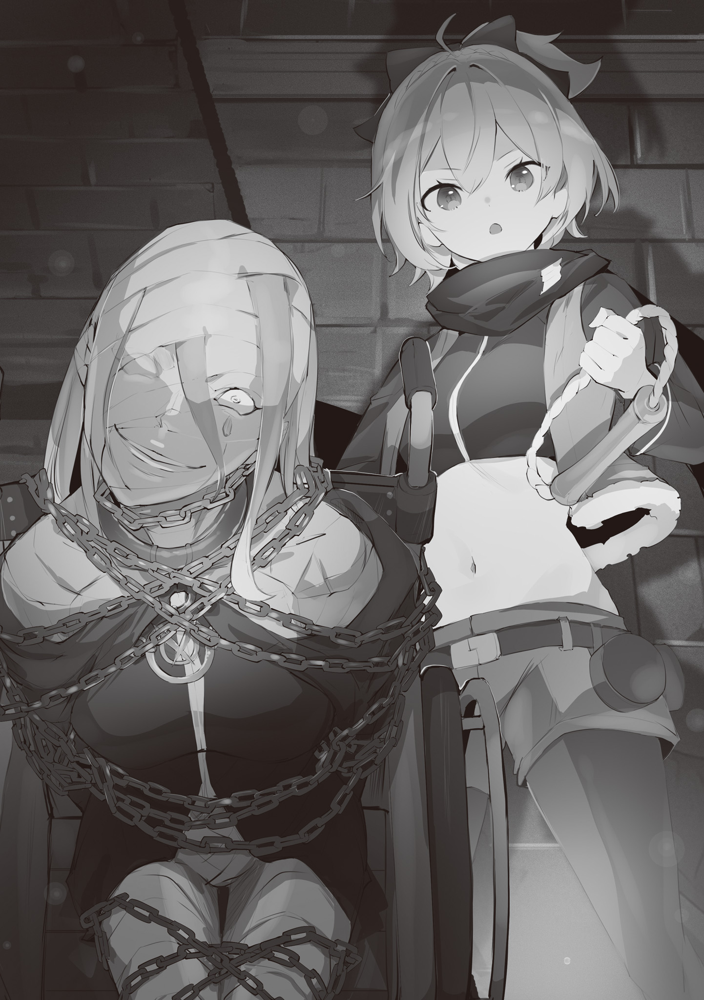

Английский перевод: Eminent Translations

Перевод: Mirastis

Редактура: MilkyWay

Путешествие из Пристеллы, Города Водных Врат, в королевскую столицу, Лугунику, в итоге заняло гораздо больше времени, чем предполагалось.

Причина, по которой им потребовался месяц — на две недели дольше, чем они планировали изначально — в основном заключалась в том, что по пути туда им пришлось столкнуться с различными препятствиями.

— Я была уверена, что эти ребята из Культа Ведьмы придут и попытаются вернуть её.

— Похоже, это был не тот случай. Я тоже думал, что это было сделано специально, но бандиты и другие препятствия, с которыми мы столкнулись по пути сюда, похоже, не имеют к этому никакого отношения.

— Просто обычные бандиты, да?

Скрестив руки, Фельт бросила боковой взгляд на Райнхарда, который поднял свои брови идеальной формы.

В данный момент они находились перед башней в королевской столице, Лугунике, на том же уровне, что и королевский замок. Если смотреть с замка — башня казалась очень высокой, но к людям в ней относились даже хуже, чем к тем, кто жил в трущобах. Эту башню, естественно, назвали Тюремной Башней… Место, где отвратительные преступники были заключены в тюрьму и ожидали своего наказания.

Стоя перед башней, Райнхард обдумывал содержание только что состоявшегося разговора. Казалось, ему было не по себе, и он выглядел так, словно ничего не понимал, но по сравнению с ним, не слишком высоко себя оценивающим, Фельт гораздо легче улавливала неестественность ситуации.

Драконья повозка, в которой ехали Фельт и Райнхард, более десяти раз останавливалась из-за непредвиденных препятствий. Как уже упоминал Райнхард, единственные, кто совершал нападения на их драконью повозку были разбойники или зверодемоны.

Однако, чтобы на Фельт нападали подобным образом… Этот факт казался ей довольно странным.

— Если подумать нормально, думаешь ли ты, что разбойники, которые заботятся только о себе, были бы настолько глупы, чтобы сделать что-то настолько опасное, как напасть на людей, которые едут на такой приличной драконьей карете, как эта?

— Возможно, у них не было другого выбора?

— Ты хочешь сказать, что иначе они не смогли бы набить свои животы? Райнхард, перестань оправдывать этих мелких негодяев. Эти ребята хитрые. Иначе они не смогли бы выжить.

— ……

— Вот почему они не идут на тех, с кем не могут справиться. Они не заботятся о дружбе друг с другом, они заботятся только о себе.

Выслушав рассуждения Фельт, Райнхард придержал язык. Похоже, это указывало на то, что он считает её доводы обоснованными. Хотя его сила была непревзойдённой, и хотя он прекрасно владел мечом, он был немного наивен, когда речь шла о путях мира. Именно это беспокоило Фельт больше всего.

— …Почему я вообще должна так беспокоиться о тебе!

— Леди Фельт, пожалуйста, не пинайте меня ногой так внезапно. Что-то случилось?

— И не смей просто уклоняться таким образом…! Тьфу, забудь.

С потёртостями от её туфель на подоле её белой юбки, Фельт изогнула губы и фыркнула.

В присутствии существа, известного как Райнхард, бандиты вели себя безрассудно. То, что невежественные бандиты напали на роскошную драконью карету, было простительно, но когда они узнали, что находятся в присутствии Райнхарда, было совершенно абсурдно, что они не струсили от страха и не потеряли боевой дух. И не только бандиты, но и зверодемоны, действовавшие согласно своим инстинктам. Правда, Фельт не сказала ему об этом…

— Леди Фельт.

— Я знаю.

Её имя было названо, и Фельт немедленно ответила.

Не говоря ни слова, Фельт почувствовала покалывание кожи, её инстинкты включились, и сама её душа ощутила это существование… Ибо оно было злом, ненавистным и отвергнутым всеми живыми существами.

— Мне понравилось путешествие сюда. Спасибо, что нашли время проводить меня. Спасибо.

Смеясь, она подняла скованные наручниками руки, раскрывая безумца, покрытого бинтами… Это была злодейка Сириус, которую Фельт сопровождала в своём путешествии. Ей было поручено доставить её в Тюремную Башню, чтобы потом она выпытала всё, что та знала о Культе Ведьмы — таинственной и опасной организации. Это был один из способов получить компенсацию за весь тот ущерб, который она нанесла в Городе Водных Врат.

Хотя она и понимала это, путешествовать с Сириус было настоящей мукой.

— Что это ты так беззаботно себя ведёшь? Эй ты! Ты что, не понимаешь, в какой ситуации находишься? Или…

— Боже мой. Это так мило, что вы беспокоитесь обо мне. Спасибо, я польщена, но, пожалуйста, не беспокойтесь обо мне, мисс Фельт. Это просто моё испытание, чтобы отплатить за всю их драгоценную, драгоценную, драгоценную любовь.

— Отплатить за любовь, испытание…?

— Не принимай её слова всерьёз. Это просто пустая болтовня.

Райнхард, который всерьёз задумался над бессвязными комментариями Сириус, похоже, не очень хорошо с ней ладил. Нередко люди, живущие в трущобах, становились психически больными из-за алкоголя и окружающего их насилия, теряя чувство реальности и правильное мышление.

Однако злой дух Сириус сильно отличался от таких обыденных явлений.

— Сэр Райнхард, сейчас она будет заключена в тюрьму. Вы пойдёте с нами?

Стражники, отвечавшие за доставку Сириус в тюрьму, попросили Райнхарда пойти с ними.

Сила Полномочия Архиепископа Греха была весьма велика. В частности, Полномочие Сириус было способно охватить всю Пристеллу. Поэтому они не могли халтурить, когда речь шла о мерах предосторожности.

— Вы приняли соответствующие меры?

— Четыре стены камеры запечатаны Злыми Запечатывающими Камнями, а её руки и ноги скованы тем же самым. Вдобавок, кроме как во время допроса, её рот также будет закрыт кляпом.

— Ваши меры предосторожности вполне естественны. В этом есть смысл.

Райнхард погладил подбородок, выслушав ответ стражника. Захват и заключение в тюрьму Архиепископа Греха ещё никогда не проводился, поэтому, даже если бы они принимали все меры предосторожности, им всё равно нужно было бы оставаться бдительными.

Затем, пока Райнхард и его коллеги говорили, Фельт почувствовала лёгкое покалывание на коже и поняла, что это было вызвано молчаливой Сириус.

— …Что за… она вдруг стала раздражённой.

— …Ах, правда, мисс Фельт, вы действительно разбираетесь в людях.

Фельт не чувствовала себя счастливой от такой похвалы, но ответ Сириус подтвердил её слова. Её губы улыбались, но её фиолетовые глаза совсем не соответствовали образу. Напротив, она выдала скрываемый ею гнев, который Фельт не часто видела в последний месяц.

Она только что приехала сюда и вдруг разозлилась. Что могло её так разозлить? Не было смысла злиться из-за того, что она попала в тюрьму.

— Злые Запечатывающие Камни.

— А?

— Я действительно не люблю Злые Запечатывающие Камни. Это то же самое, что было использовано для запечатывания этой проклятой Ведьмы, этой проклятой, проклятой Ведьмы…!

Фельт прищурила свои красные глаза на Сириус, которая с ненавистью стиснула зубы.

Во время их путешествия в королевскую столицу Фельт не раз чувствовала, что Сириус, несмотря на принадлежность к Культу Ведьмы, совсем не уважала Ведьму Зависти. Она всегда полагала, что Культисты верят в Ведьму Зависти.

Но для Сириус чувства, которые она питала к Ведьме, не были уважением или верой, а были скорее ненавистью или неприязнью, и тот факт, что она направила это на полуведьму — Эмилию, — был причиной для беспокойства Фельт.

— Леди Фельт, сейчас мы отведём её в тюрьму… но мы пойдем в Тюремную Башню.

— Ты не хочешь, чтобы я пошла с вами, не так ли? Но если ты не хотел, чтобы я была рядом с преступниками, тогда почему ты позволил мне остаться в той же драконьей карете, что и Архиепископ Греха?

— Есть ситуации, которые неизбежны, и те, которые нет. Вы должны различать их.

— Ну, хорошо. Потому что есть обстоятельства.

Фельт яростно почесала голову и издала недовольный звук, услышав слова Райнхарда, которые казались скорее защитными, чем осторожными, а затем протянула руку стражнику, отвечавшему за Сириус. В его руке был кляп, который должен был войти ей в рот. Фельт взяла его из его рук и встала перед ней…

— Твои слова ничего не значат для меня, как будто это тарабарщина, которую ты произносишь во сне. Но я всё равно должна быть осторожной. Лучше перестраховаться, чем потом жалеть.

— Боже мой, вы так холодны со мной. Разве мы уже давно не ладим?

— Тогда прими ЭТО, как мою твёрдую решимость попрощаться со всем этим месяцем с тобой.

Двумя руками Фельт закрепила кляп на Сириус. По сути, он был похож на кусок дерева, который она кусала, что мешало ей говорить и пытаться покончить с собой.

— Даже не смотри ей в глаза. Посади её в тюрьму так быстро, как только сможешь, и возвращайся.

— Это звучит так, будто вы говорите с ребёнком… Но я понимаю. Я сейчас же вернусь.

Подумав, что между ними нет особой разницы, Фельт фыркнула в ответ. После этого Райнхард вместе со стражниками повёл Сириус в Тюремную Башню.

— ……

Перед тем, как она исчезла в башне, Сириус оглянулась на неё один раз, и их взгляды пересеклись. К своему ужасу, Фельт сразу поняла, что передалось ей через эти фиолетовые глаза. С тех пор как она провела с ней последний месяц в драконьей карете, она привыкла к подобным вещам.

— Проклятье, какая же она ненормальная. Говоришь «Спасибо и извини»? Не смеши меня!

— Ценность выражения благодарности сильно меняется в зависимости от должности или титула человека, который его произносит. Я считаю, что мысль леди Фельт верна.

Фельт, стоя перед Тюремной Башней, провожала Райнхарда и Сириус. Пока она высказывала свои мысли, как кто-то неожиданно вмешался и тоже высказал свои соображения.

В плохом настроении Фельт обернулась и сказала: — И?

Тогда другой человек, у которого были острые глаза, поднял руки вверх, как бы в знак поражения.

— Мне жаль. Ужасно жаль. Я случайно увидел вас издалека, поэтому просто хотел подойти и поздороваться.

— Ты…

Фельт тщательно оглядела мужчину, который улыбался и извинялся.

У него была тёмно-светлая борода и тёмно-светлые волосы, а также дорогой костюм. По первому впечатлению она поняла, что это человек, обладающий властью. Однако, несмотря на то, что это место было связано с замком, от него исходила аура не рыцаря или дворянина, а кого-то более низкого положения.

— …Купец, что ли?

— Как проницательно. Я Рассел Феллоу, казначей Королевского Столичного Торгового Союза. Я также имею дела с королевским замком, но в этот раз я выполняю особый заказ.

— Злые Запечатывающие Камни?

— Опять же, ваши глаза весьма проницательны. При всём уважении, у вас отличные глаза, леди Фельт.

Кивая головой с руками за спиной, слова Рассела звучали как лесть. Однако Фельт чувствовала, что в его словах было гораздо больше загадочного, чем простое намерение добиться её победы на Королевских Выборах.

Но это не вызывало у неё дурных предчувствий. Она чувствовала, что у этого человека просто сильная воля.

— Злые Запечатывающие Камни, обладающие особыми свойствами по сравнению с другими магическими камнями, невозможно отличить от обычной кучки камней с одного взгляда. Чтобы отличить их, нужен особый глаз. Поэтому, хотя этого может быть недостаточно, я также приложил свои собственные усилия.

— Значит, у тебя «особые глаза»?

— Да. Это как глаз, который приобретается с опытом.

Рассел затушевал значение «особых глаз» сомнительной улыбкой.

Был ли это глаз, полученный в результате наблюдения, как сказал Рассел, или результат силы, полученной от Божественной Защиты, Фельт не могла сказать. Она не знала, но…

— Твоя одежда и лицо напоминают торговца, но ты не ведёшь себя как торговец.

— ……

Рассел слегка сузил глаза на подозрения Фельт. Видимость сложных эмоций, проходящих через его глаза, показала ей окно в его истинные чувства.

Ей показалось, что он оценивает её, скорее всего, с восхищением…

— Никто не говорил мне этого раньше. Мне бы хотелось думать, что я веду себя по-купечески…

— Я становлюсь всё более и более подозрительной, и это заставляет меня быть начеку. Кто ты на самом деле?

— Что ж, мне это интересно. Я бы хотел поговорить с вами ещё немного, чтобы вы узнали об этом.

— А?

Очевидно, он просто пригласил её на ужин и деловые переговоры. Вероятно, это было его целью с самого начала. Это должно было означать, что он каким-то образом узнал её.

Однако…

— Это мне не подходит. Если ты хочешь поговорить, то давай, говори сейчас. Наша база довольно далеко. В любом случае…

— О, учитывая характер Райнхарда, он не оставит допрос Архиепископа Греха никому другому, так что разве вы не останетесь в Королевстве на некоторое время? Я не верю, что вы настолько глупы, чтобы оставить одного из своих рыцарей.

— …Ты выглядишь очень злым. Ты начал чувствовать себя так, когда я сказала тебе, что ты не похож на купца?

— Нет, вовсе нет.

Рассел вежливо поклонился Фельт, которая выдохнула через нос и пожала плечами.

На самом деле, планы Фельт на будущее были именно такими, как он сказал. Они с Райнхардом останутся в королевской столице на некоторое время. По крайней мере…

— Пока они не вернутся из Песчаной Башни.

Пробормотав это про себя, Фельт вспомнила о тех, кто шёл за разными подсказками с той же целью, что и она. Услышав её бормотание, Рассел посмотрел на Тюремную Башню с задумчивым выражением лица.

— Сейчас мир переживает время перемен. Вы понимаете, леди Фельт?

— Я удивлена, что ты вдруг заговорил о такой важной вещи. Значит, мир меняется?

— Архиепископ Греха сейчас в тюрьме, два Архиепископа Культа Ведьмы, о которых раньше не было известно, были повержены, и два из трёх Великих Зверодемонов, угрожавших миру в течение 400 лет, также были побеждены. Слишком многое произошло всего за год или два.

— Включая истребление королевской семьи?

— Конечно, это тоже включено. 400 лет назад эпоха Ведьмы также была бурным временем. Возможно, то же самое произойдёт снова.

Можно сказать, что когда купцы зарабатывали деньги заранее, это было предзнаменованием того, что времена сильно меняются. Не будет преувеличением сказать, что способности торговца во многом зависят от уровня его прозорливости, но нынешнее отношение Рассела не казалось нацеленным на будущее. И это не укрылось, когда его взгляд переместился с башни на Фельт.

— Леди Фельт, я ожидаю от вас самого лучшего на Королевских Выборах. И я говорю так не просто по слухам, а принимая во внимание многие вещи.

— Ты всем говоришь одно и то же, не так ли?

— Да.

Рассел, который вёл себя застенчиво, ответил как ни в чём не бывало, а Фельт в ответ исказила своё лицо в грандиозной манере. Её реакция заставила его прочистить горло, а затем он отвернулся.

— Пожалуйста, извините меня. После этого у меня назначена встреча. Однако вечером я буду дома. Не хотите ли вы поужинать со мной?

— Вот что я тебе скажу, полукустарной готовки будет недостаточно, чтобы превзойти Райнхарда.

— …Я обязательно скажу об этом своим поварам.

Он помахал рукой, и Фельт высунула язык ему в спину, когда он уходил.

Не успела она опомниться, как уже дала обещание, но Фельт действительно заинтересовалась тем, о чём говорил Рассел. А это включало и маску, которую он носил, скрывая своё истинное лицо.

— …Подобно эпохе Ведьмы, бурная эпоха.

Отсутствие Короля и сборы пяти кандидаток, чтобы найти ему замену, были частью этого. Это была не та история, которая заставила бы содрогнуться всех участников, но она казалась странно захватывающей.

— Чёрт, я снова опоздаю к дедушке Рому, не так ли?

Фельт подумала о семье, которую давно не видела. Беспокоиться о таких вещах было не в её духе.

Я очень хочу оставить следы ботинок на белой форме Райнхарда.
