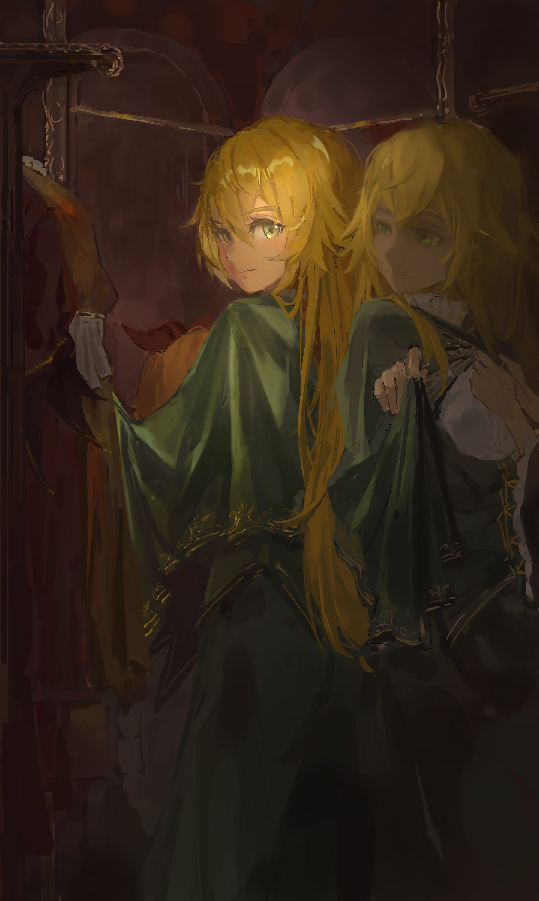
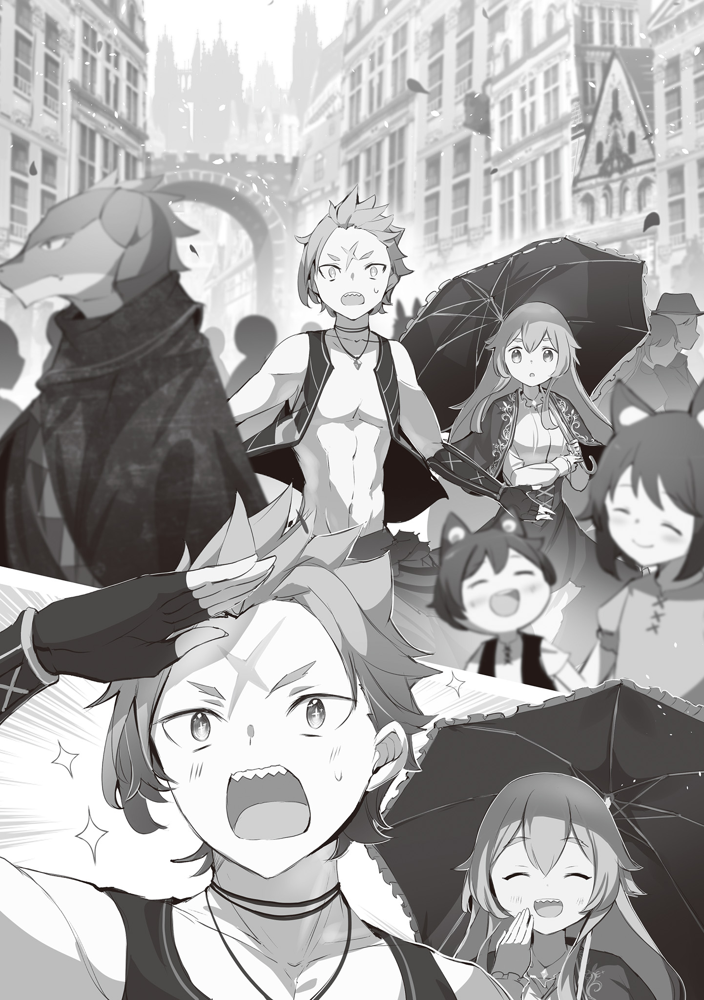
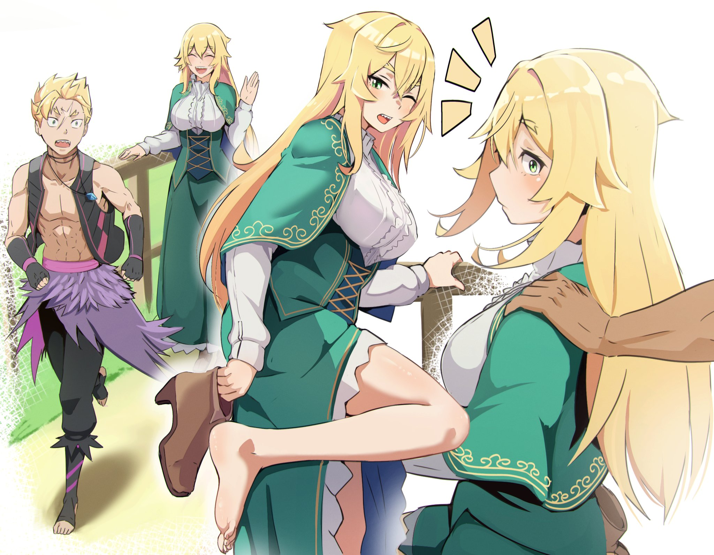
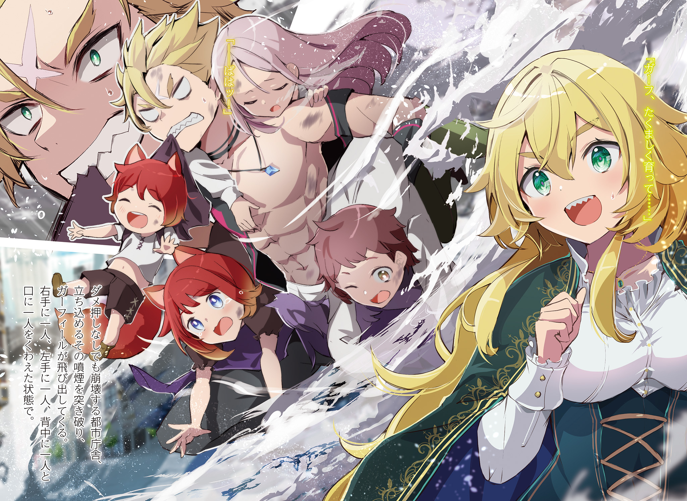
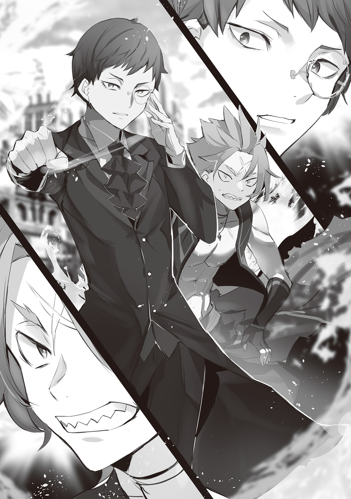
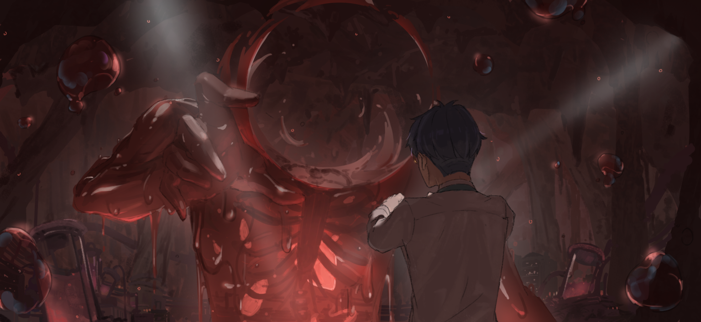

Всё началось в один из дней с внезапного разговора между братом и сестрой.

— Гарф, давай сходим куда-нибудь прогуляемся.

— Чё?

— Я говорю, давай прогуляемся. Только ты и я, вдвоём.

— …Чегось?

Услышав настойчивое приглашение сестры, младшему брату, Гарфиэлю, оставалось лишь вылупить глаза от удивления.

Гарфиэль Тинзель и Фредерика Бауманн — брат и сестра, которые долгие годы жили порознь и лишь недавно наконец-то воссоединились.

Их воссоединение вышло весьма драматичным: младший брат эффектно примчался на помощь ровно в тот момент, когда сестра чуть не пала от рук убийцы. Казалось бы, после такого они должны были стать не разлей вода, восполняя упущенное время, но… не тут-то было.

Напротив, их блестящая командная работа в смертельной ситуации совершенно не работала в повседневной жизни, и они продолжали демонстрировать ту неловкость, которая накопилась за десять лет разлуки.

С тех пор как проблемы вокруг «Святилища» и особняка Розвааля разрешились, а жители отрезанной от мира земли шагнули во внешний мир, прошёл месяц. Гарфиэль, будучи одним из них, тоже лишь недавно начал привыкать к тому, что просыпается по утрам не в знакомой лачуге, а в комнате огромного особняка.

Однако жизнь на новом месте несла в себе и напряжение, поэтому улучшение отношений между братом и сестрой продвигалось со скрипом.

— Вы же брат с сестрой, могли бы и поворковать, как мы. Скажи же, Беако?

— Ч-что за глупости ты говоришь, люди же не так поймут, в самом деле. Бетти просто старается держаться поближе, потому что она партнёр Субару, и только-то.

— Ха-ха-ха, какая же ты милашка. Но мыться в ванной я всё-таки предпочёл бы один и без надсмотрщиков!

Таким был отрывок разговора между Субару и Беатрис, которые заключили контракт в то же время, когда воссоединились брат и сестра.

Глядя на эту парочку, так и хотелось сказать: «Не лезьте не в своё дело только потому, что у вас всё замечательно», но, как оказалось, в обновлённом лагере Эмилии эта проблема считалась общей задачей.

По этой причине обитатели нового особняка — переехавшие туда после того, как старый по ряду причин сгорел дотла — пытались всячески содействовать примирению Гарфиэля и Фредерики. Они пробовали самые разные ухищрения, но все их попытки не выходили за рамки глупых розыгрышей и заканчивались полным провалом.

И вот, на фоне этой неловкости между братом и сестрой, когда не было видно никаких признаков улучшения, внезапно прогремело:

— Гарф, давай сходим куда-нибудь прогуляемся.

То самое внезапное приглашение от сестры, с которого всё и началось.

— Можешь особо не напрягаться. Зная Фредерику, она просто пока не понимает, как сократить дистанцию со своим братом после долгой разлуки. Иди уже. Рам тоже понимает это её желание побыть старшей сестрой, — как обычно сухо и безразлично сказала Рам, складывая бельё, когда Гарфиэль пришёл к ней посоветоваться насчёт приглашения.

Тон её был сух, но вот место для разговора… Рам специально принесла корзину с бельём в комнату, где на кровати лежала девушка, как две капли воды похожая на неё.

Для Гарфиэля не нашлось ни остроумного ответа, ни привычной вспыльчивости, когда Рам призналась, что понимает желание быть старшей сестрой. Ведь они находились в комнате той самой спящей девушки, которая, как им «сказали», была глубоко связана и с ним, и с самой Рам.

— У тебя недовольный вид. Не веришь словам Рам?

— Да ничё подобного. Кому это великолепный я поверю больше, чем Рам… ну, разве что бабуле, да Капитану, а так — ваще никому.

— …Дурачок. Но Рам считает, что эта черта в тебе очень даже хороша.

— Гха…

Не понимая, за что его вдруг похвалили, Гарфиэль смутился. До этого момента Рам ни разу не смотрела на него, но именно сейчас перевела на него взгляд. Её профиль был настолько красив, что сердце юноши снова замерло от чувств к своей возлюбленной.

— Постарайся как следует, Гарф. Фредерика постоянно о тебе беспокоилась. Хоть она и такая, но всё же предшественница Рам. Если ты всё испортишь, Рам это тоже будет неприятно.

И это замечание было вполне в духе Рам.

— Вы двое, хорошенько там… А! Если будете слишком много об этом думать, всё станет только неловко. Так что просто не заморачивайтесь и как следует повеселитесь!

— Сестрица Фредерика, вы просто красавица! Даже жалко тратить такой наряд на господина Гарфа!

— О, раз уж вы идёте в город, не могли бы вы прикупить чернил для перьевых ручек? А то наши запасы на исходе.

У Гарфиэля и без того не было веских причин для отказа, но после того, как ему добавили причин, отказаться от которых было невозможно, прогулка с Фредерикой в её полувыходной день стала реальностью сама собой.

Провожать их до самых ворот вышла целая делегация, раздув масштаб события: Эмилия — лидер лагеря, к которой Гарфиэль ещё не до конца привык; Петра — острая на язык горничная, с которой он познакомился совсем недавно; и Отто, чьё пренебрежительное отношение к важности происходящего действовало Гарфиэлю на нервы. Именно они напутствовали его этими словами.

И под самый конец…

— Наслаждайтесь своим свиданием один на один, как брат с сестрой! Прямо как мы с Беако!

— С-с-свиданием?! Не вздумайте воспринимать его слова всерьёз, в самом деле. Слова Субару надо делить не то что надвое, а на четыре, я полагаю.

— Ха-ха-ха, вот ведь вредная девчонка. Но знаешь, провожать меня ночью до туалета всё равно не обязательно!

Под такие напутствия Субару и Беатрис, словно выставляющих напоказ свои идеальные отношения, Гарфиэль и Фредерика покинули особняк Розвааля.

Вот как вышло, что Гарфиэль отправился на прогулку со своей сестрой.

— Гарф, а ты часто бывал в Костуле?

— Чё?

Фредерика хотела завести лёгкий, непринуждённый разговор, но, получив в ответ грубоватое бурчание, поняла, что совершила оплошность.

Она думала, что морально подготовилась к сегодняшней прогулке, но её план по завязыванию простой беседы рухнул в самом начале.

В этот миг в голове Фредерики всплыли слова её бабушки.

— Хм, малыш Гарф ведь впервые будет жить вдали от нас. Наверняка ему будет тяжело от всех этих новых вещей, так что ты уж хорошенько за ним следи и помогай.

Такую просьбу доверила ей Рюдзу, которой пришлось жить в другом месте, чтобы объединить жителей «Святилища» и своих клонов.

Конечно, Фредерика заботилась о Гарфиэле не из-за чьей-то просьбы, а потому что он был её дорогим младшим братом. Однако, желая вести себя как подобает старшей сестре, она совершенно не представляла, как именно это делать — в этом и заключалась её проблема.

В любом случае, от мысли, что она провалила поручение бабушки, её кровь похолодела от отчаяния.

И стоило только Фредерике от страха лязгнуть клыками, как…

— …Да не бывал я там. Сёдня в первый раз иду.

— Э?..

— Говорю ж, в первый раз! Ты ж сама спросила, сеструха!

— В-верно! Так значит, в первый раз… А?! Но мы ведь переехали в этот особняк уже больше двадцати дней назад! И ты ни разу там не был?!

— Да не ори ты! Сказал же, что не был, чё по сто раз повторять!

Видимо, вид у Фредерики был настолько встревоженным, что Гарфиэль решил всё же поддержать разговор. Она только успела проникнуться теплотой от его заботы, как этот неожиданный ответ мигом разрушил всю атмосферу.

Тем не менее, она и вправду была шокирована.

— Но ведь у тебя должна была быть возможность сопровождать Рам за покупками…

— Ха! Рам почти все эти муторные покупки скидывала на ту мелкую, Петру. К тому ж великолепный я был занят. Я, это… территорию особняка метил запахом, дел по горло было!

— Опять эта девочка ищет лёгкие пути… Но ты, Гарф, тоже хорош. Метить особняк своим запахом — что за неподобающие манеры!

Фредерика была поражена вскрывшимися махинациями Рам, а затем пришла в ужас от действий Гарфиэля.

Конечно, она понимала его тревогу после того, как он покинул родные края, где каждый уголок хранил знакомый запах. Но помечать территорию во внешнем мире — это уже из ряда вон выходящее чудачество.

— Нужно будет хорошенько обучить тебя здешним правилам приличия… А, а-а, а-а-а-а-а-а…?!

— Ч-чё, чё, чё такое-то?! Что стряслось? Сеструха аж в лице побледнела?!

— Н-ничего, просто вспомнилось… десять лет назад, когда я только покинула «Святилище», то поначалу делала в особняке то же самое…

Взглянув на собственное прошлое, Фредерика была раздавлена осознанием, настигшим её спустя десять лет.

Тогда, пытаясь унять тоску по дому, она тоже метила своим запахом самые разные места, предметы и даже людей, по ночам патрулировала свою территорию и устанавливала иерархию среди окрестных животных. Список её действий, которые сейчас казались дикими странностями, был поистине бесконечным.

— И Клинду, который уже тогда был дворецким, пришлось переучивать меня манерам… Какой ужас. Подумать только, мы с Гарфом настолько похожи, как истинные брат и сестра…

— Не пойму, чего ты так удивляешься, но мы с тобой брат и сестра, это ж как пить дать…

Гарфиэль вздохнул и погладил дрожащую Фредерику по спине. Услышав его слова, она вздрогнула, а он непонимающе склонил голову набок, позвав её: «Сеструха?».

Видимо, он бросил эту фразу просто так, не придавая ей особого значения.

— …Д-да, ты прав. Это же естественно, само собой разумеющееся.

— А?

Фредерика облегчённо вздохнула и улыбнулась Гарфиэлю.

Как он и сказал, совершенно естественно, что они — брат и сестра. Даже прожив врозь более десяти лет, им не нужно было с благоговением относиться к своим родственным узам. Достаточно было просто вести себя естественно.

В конце концов, что это вообще за брат и сестра, которым нужна моральная подготовка для общения?

— Бабушка, кажется, я всё-таки смогу выполнить свой долг…

— Чё? У самой рожа была прям как в поговорке «зелёная, как перья неоперившегося хоозуро», а теперь ничё не понять. Ты чего ж, сеструха, в маразм впадаешь, как наша бабуля… Кха-а-а-а!

— Я тебя только похвалила, а ты уже сболтнул лишнего. Нет, учитывая оскорбление в адрес бабушки, это не просто лишнее, а совершенно непозволительное высказывание. Подумай над своим поведением.

— Д-да не обязательно ж было по башке-то бить…

Получив по макушке, Гарфиэль обиженно посмотрел на неё глазами, полными слёз. Фредерика лишь прикрыла рот рукой, тихо посмеиваясь. Затем она сделала несколько быстрых шагов вперёд, оказавшись прямо перед братом.

— Кстати говоря, я так наряжалась, а ты мне до сих пор ни слова не сказал.

— Чё?

— Хватит издавать эти грубые звуки. Сегодняшний наряд мне помогала выбирать Петра. Согласись, прогуливаться со мной в таком виде куда непривычнее, чем если бы я была в наряде горничной?

Фредерика накинула на плечи лёгкую шаль. Вместо её привычной формы горничной на ней была одежда, специально подобранная для выхода в город.

Петра, прекрасно разбирающаяся в нарядах и обладающая строгим вкусом, лично подобрала этот образ. Сама Фредерика наслаждалась этим свежим чувством, ведь она так давно не носила ничего, кроме рабочей формы.

Точнее сказать, она только-только начала находить в себе силы радоваться этому.

— …Да какая ваще разница, чё за шмотки.

— А если бы на моём месте была Рам, ты бы сказал то же самое?

— Гха…

— Как мне рассказывал господин Субару, «свидание» — это когда и мужчина, и женщина изо всех сил стараются позаботиться друг о друге, чтобы весело провести время вместе.

Это слово было Фредерике незнакомо, но для Субару, Эмилии и Беатрис оно оказалось вполне обыденным. Даже Петра недавно радостно хвасталась, что ходила с Субару на «свидание».

Именно счастливый вид Петры в тот момент придал Фредерике смелости пригласить Гарфиэля.

Поэтому…

— …Ну, типа, выглядит ничё так.

— Для тебя это была хорошая попытка, Гарф.

— А-а?!

Гарфиэль, изо всех сил подбиравший непривычные для себя ласковые слова, повысил голос в ответ на такую оценку.

Фредерика искренне наслаждалась этой перепалкой, думая, что именно в этом и кроется та самая прелесть «свиданий», о которой с такой радостью рассказывали Петра и остальные.

Промышленный город Костул был одним из пяти крупнейших городов Драконьего Королевства Лугуника и находился ближе всего к новому особняку, куда перебрался лагерь Эмилии.

Рядом с прежним особняком находилась лишь одна маленькая деревушка, из-за чего возникало множество неудобств с закупками. И хотя размеры старого и нового особняков почти не отличались, по уровню удобства нынешняя резиденция значительно выигрывала.

— К тому же именно этот особняк является главной резиденцией семьи Мейзерс, так что, получается, раньше мы намеренно жили в неудобном поместье.

— …И на кой чёрт было творить такую херню?

— Полагаю, у господина как всегда был на этот счёт какой-то глубокий замысел… В любом случае, прежний особняк находился ближе и к королевской столице, и к «Святилищу».

— Да этот ублюдок летать умеет, ему-то какая разница…

Фредерике нечего было ответить на раздражённое клацанье зубами брата.

Она и раньше считала мысли своего господина загадкой, но после недавних событий это чувство лишь укрепилось. Фредерика даже представить себе не могла, чего Розвааль пытался добиться своим заговором, который чуть не погубил весь их лагерь.

Однако…

— …Потому что господин — «маг».

Пробормотав это, она заглушила в себе негативные эмоции по отношению к Розваалю. В этих словах крылась её непритворная правда. Для Фредерики Розвааль всегда был магом.

Не просто человеком с такой профессией или навыками, а «магом» в значении особенного существа, способного на всё.

Его знания и умения решали любые проблемы. Главной причиной, по которой ещё юная Фредерика покинула «Святилище», была надежда, которую она увидела в образе жизни Розвааля.

И это отношение не изменилось даже сейчас, после всего, что он натворил.

— Тц, да сдался мне этот ублюдок Розвааль, не хочу о нём болтать. Чем гулять с сеструхой с кислой миной, великолепный я лучше б… О, о-о-о-о, о-о-о-о-о-о?!

— Ч-ч-что случилось, Гарф?! Зачем ты так кричишь!

— Д-да нет, вон там, глянь! Чё это такое, сеструха?! Вон то здоровенное здание! Стены! Город!

Возбуждённо воскликнул Гарфиэль, указывая на виднеющуюся вдали панораму города.

Выражение его лица, до этого момента казавшееся недовольным, вмиг переменилось. Стоило лесу, скрывавшему обзор с тракта, закончиться, как перед ними предстал город Костул, и Гарфиэль был просто ошеломлён.

Впрочем, это было неудивительно. Почти весь мир, известный Гарфиэлю, ограничивался маленьким поселением «Святилища». Хоть он и знал о крупных городах в теории, реальность превзошла все его ожидания.

— О-охренеть! Ваще не время было особняк метить! Сеструха! Давай быстрее! Погнали скорее! Здоровенные, гигантские, просто огромные штуковины ждут великолепного меня!

— А! Подожди, Гарф! Стой же! Я вообще-то в юбке! Не могу же я нестись сломя голову, как ты… Да что ж такое! Гарф!

С глазами, сияющими, как у ребёнка, Гарфиэль начал торопить Фредерику.

Горько усмехаясь над тем, как быстро он переключился с предыдущей темы разговора, она всё же не могла скрыть лёгкой тревоги, глядя на разбушевавшегося брата.

Гарфиэль был крайне заинтригован своим первым большим городом, но проблема крылась в самом Костуле. Скажем прямо, среди пяти крупнейших городов этот промышленный центр был самым невзрачным.

— По сравнению с другими мегаполисами… Городом Водных Врат, Столицей Земляных Драконов или Шахтёрским Городом, здесь и смотреть-то толком не на что…

В Костуле напрочь отсутствовали какие-либо туристические достопримечательности.

И Фредерика мучилась от страха, что, несмотря на весь энтузиазм Гарфиэля перед «свиданием», этот город разочарует его.

— Прошу тебя, бабушка… спаси и сохрани нас с Гарфом!..

Спустя некоторое время после того, как она вознесла искреннюю молитву бабушке под далёким небом…

— О-охренеть! Вблизи оно ещё больше! Прям как говорят: «Гасок на деле куда здоровее, чем травят в байках»!

Широко распахнув свои изумрудные глаза, Гарфиэль радостно воскликнул, заворожённо глядя на строящееся здание.

Экскурсия по Костулу, начавшаяся с тревоги Фредерики, оказалась для него невероятно захватывающей. Она переживала из-за нехватки в городе вкусных сладостей и красивых пейзажей, но Гарфиэлю, который просто обожал всё огромное и угловатое, эта безжизненность индустриального города пришлась как нельзя по вкусу.

— Спасибо тебе, бабушка… Благодаря тебе наше с Гарфом «свидание» не пошло прахом…

Услышь эти слова сама Рюдзу, она бы точно недоумённо склонила голову, не понимая, за что её благодарят, но сейчас Фредерику это совершенно не волновало.

Тем временем Гарфиэль, с любопытством озираясь по сторонам, дёрнул сестру за рукав:

— С-сеструха! А чё это такое? Вон та гигантская коробка!

— Ну успокойся ты уже, Гарф. Эта «коробка» — магическое устройство… Такие устройства используются повсеместно в этом городе, они развились здесь, в промышленной столице, и стали её визитной карточкой.

— Магическое устройство?

Заметив округлившиеся от удивления глаза Гарфа, услышавшего незнакомое слово, Фредерика довольно улыбнулась.

«Магические устройства» были главным фактором процветания промышленного города Костул, возвысившим его до уровня пятёрки крупнейших городов. Эти аппараты, использующие магические кристаллы в качестве источника энергии, выполняли работу, на которую человеческие руки были попросту не способны.

Даже в особняке Розвааля они применялись для разжигания огня на кухне или нагрева воды в ванной, а в королевской столице служили для работы фонтанов и многого другого. Здесь, в Костуле, производство таких устройств было главной отраслью промышленности.

— Магические устройства работают быстрее и точнее, чем ручной труд. Их внедрение на заводах и производство для экспорта в другие города… Именно это и подняло значимость Костула, сделав его одним из пяти великих городов. В отличие от остальных четырёх, Костул вошёл в этот список совсем недавно, что является огромной редкостью.

— Ха-а, ну это ваще крутяк!

— Правда? Правда, правда?

— …Ток не въеду, с чего ты, сеструха, так этим гордишься.

Гарфиэля немного насторожила Фредерика, сияющая от самодовольства после рассказа об истории города. В ответ на его недоумение она широко развела руками со словами: «На самом деле…»

— Заслуга магических устройств, которые даже ты сейчас признал удивительными… Что, если я скажу тебе, что их изобретение берёт своё начало в семье Мейзерс — семье нашего господина?

— …

— О-о-ох, какое хмурое лицо… Но ведь это заслуга не самого господина, а предыдущего Розвааля K. Мейзерса, знаешь ли!

— Не смей. Трепаться. О чём-то. Что связано. С этим ублюдком Розваалем.

Услышав его слова, произнесённые сквозь стиснутые зубы, Фредерика поникла. Опять провал.

И всё же, как бы Гарфиэль ни ненавидел Розвааля, ключом к развитию города был глава семьи Мейзерс прошлого поколения — это факт. Семья Мейзерс была великим благодетелем промышленного города Костул, и именно поэтому их главная резиденция находилась так близко от него.

Но так или иначе…

— Гарф, я договорилась с работниками завода, так что, может, сходим на экскурсию?

— Правда, что ль?! Не, ну эти устройства, конечно, от этого ублюдка… Ах, какая в задницу разница!

Оказавшись перед заводом, где производились магические устройства всех форм и размеров, Гарфиэль отбросил все сомнения. Он уже было рванул внутрь, но в последний момент остановился.

Фредерика удивлённо склонила голову набок, глядя на брата, который вдруг замер на месте.

— …А тебе-то норм, сеструха? Выйдет так, что веселиться будет только великолепный я.

— …Всё в порядке. У нас ещё будет полно возможностей приехать в Костул. К тому же, на «свидании» важно заботиться друг о друге… А ты только что обо мне позаботился.

— Тц, ничё не понял… но лан, я погнал!

Сомнения развеялись в мгновение ока, и Гарфиэль с горящими глазами рванул на завод.

Наверняка он со всей своей энергией начнёт засыпать рабочих вопросами и по полной программе насладится своим первым визитом в Костул.

Проводив взглядом спину полного жизни брата, Фредерика подошла к ограждению возле завода. Опершись на него, она сняла правый ботинок.

Это была совершенно новая обувь, купленная специально для «свидания», но она всё же успела немного натереть ногу.

— Не так уж всё и плохо, как я боялась. Жить можно…

— Э-эй, ну дела. Такая красотка — и без всякого стеснения выставляет свои голые ножки напоказ.

Лицо Фредерики, только что с облегчением вздохнувшей, напряглось. Она быстро поправила подол юбки, который слегка задрался, пока она осматривала ногу, и обернулась на голос.

Там стоял крепко сложенный, высокий мужчина с зачёсанными назад тускло-светлыми волосами, от которого так и разило дикостью. Поглаживая аккуратную бородку, он улыбнулся, обнажив острые зубы.

— Иногда всё же стоит выбираться самому, а не полагаться на других. Скажи же?

— Какой вы, однако, невоспитанный. Даже если вы ищете моего согласия, мне вам ответить нечего.

— Надо же, какая утончённая манера речи. Да-да, понимаю. Украшать то, что на виду и на слуху — это первый шаг к тому, чтобы напустить на себя важности.

Мужчина развязно подошёл к ней, держась с чрезмерной фамильярностью. Фредерика не смогла проигнорировать его дерзость в лоб, потому что часть его слов, брошенных со знанием дела, попала в точку.

Ведь следить за тоном речи и внешним видом было первым, чему её научили, когда она покинула лес…

— Вы, собственно говоря, вообще кто такой?

— Я? Звать меня Хейден Гаро.

— …

— Понимаю, понимаю! Тебе совсем не имя моё нужно было. Верно? Но, даже если не спрашивать, твоя кровь уже должна была всё понять, моя соплеменница.

Фредерика замолчала, услышав ухмыляющегося Хейдена Гаро.

После таких прозрачных намёков даже ей стало ясно, кем был этот человек.

— Значит, вы тоже, как и я, полузверь.

— Редкость, не так ли? Столкнуться за пределами родины с кем-то в таком же положении. Если не произойдёт чего-то из ряда вон выходящего, мы, как существа, даже не можем распознать друг друга.

— …Увольте меня от того, чтобы вы называли нас «существами» и ставили в один ряд с собой.

Сохраняя хмурое выражение лица, Фредерика лишь так возразила на слова Хейдена.

Полузвери — это зверолюди, которые обладают ярко выраженными человеческими чертами среди полулюдей. И хотя у них есть физическая сила и способность к трансформации в зверя, в обычном состоянии их внешность почти не отличить от человеческой.

Внешне Фредерику и Гарфиэля тоже было бы не отличить от обычных людей, если бы не их клыки. То же самое касалось и стоявшего перед ней Хейдена.

— Ваши отличительные черты выражены куда слабее, чем наши.

— Ага, разве что клыки чуть островаты. Ну, а в остальном — лишь источаемый всем моим телом шарм, что так и манит самок.

— Прожив на свете около двадцати лет, я и не подозревала, что не являюсь женщиной.

— За словом в карман не полезешь! А мне это нравится! Ты в моём вкусе.

Фредерика отвернулась, не желая терпеть его вульгарное поведение, но Хейден почему-то лишь развеселился. Без всякого стеснения он встал прямо перед ней и силой притянул её за плечи к себе.

Фредерика, всё ещё стоявшая без одного ботинка, оказалась прижатой к его груди.

— …Хамство! Немедленно отпустите!

— Ого, а ты высоковата, когда стоишь вплотную. И грудь, и талия — что надо. Ты всё больше мне нравишься.

— Ах ты ж!..

Её гнев достиг апогея из-за его оценивающего взгляда, и Фредерика со всей силы отвесила Хейдену звонкую пощёчину.

Тот дёрнулся, словно от удара хлыста, отвернул лицо, а затем медленно повернул голову обратно.

— И дерзость твоя мне тоже по душе. Пожалуй, сделаю-ка я тебя своей законной женой.

— Что за…

— Законной женой в государстве, которое я построю, сможет стать лишь сильная и красивая самка.

С этими словами глаза Хейдена налились кровью. От этих перемен Фредерика почувствовала, как волоски на её теле встали дыбом, и инстинктивно чуть не обратилась в зверя.

И дело было вовсе не в «шарме, привлекающем самок», о котором он говорил, а в том самом животном инстинкте, кричащем об угрозе…

— А ну отвали от сеструхи, ублюдок!!

В следующее мгновение мимо остолбеневшей Фредерики пронеслась мощная рука, направив удар прямо в лицо ненавистному мужчине.

Это был удар без малейшего сдерживания — ошибка, присущая юности. Гарфиэль, не знающий внешнего мира, без колебаний нанёс удар такой силы, что обычного человека он превратил бы в фарш.

Пусть он и защищал Фредерику, но убийство обернулось бы огромными проблемами. Их «свидание» было бы разрушено, а нежелание Гарфиэля, не привыкшего к внешнему миру, выходить за пределы дома только усилилось бы.

Однако этого не произошло.

— Ого, какой прыткий сопляк. Будь на моём месте кто другой, ему бы не поздоровилось.

Сказал Хейден, отряхивая руку и оскалив зубы в усмешке. Он отскочил далеко назад, выпустив Фредерику из своих крепких объятий. Вырвавшись из его хватки, она оказалась в руках Гарфиэля, заслонившего её собой.

Фредерика, задержав дыхание от внезапности, услышала, как её брат, сморщив нос, сказал:

— Сеструха, чё это за ухмыляющийся мерзавец? У тебя совсем вкуса на мужиков нет.

— Уж кому, а не тебе, Гарф, мне об этом говорить! …Нет, сравнивать Рам с этим человеком было бы чересчур. Прости. И спасибо тебе.

— Как-то не очень звучит, ну да ладно, щас важнее другое…

Гарфиэль, испепеляя Хейдена острым взглядом, сжал кулаки. Заметив его боевой настрой, Хейден хлопнул в ладоши перед грудью, издав сухой звук, и сказал:

— Ты тоже полузверь. Но, судя по всему, в тебе течёт обычная, заурядная кровь. Ты точно её брат?

— Назвать великолепного меня заурядным — это ты зря. Уж не из-за роста ли ты сомневаешься в нашем с сеструхой родстве? Если так, то тут уж вопросы к ней.

— Ха-ха-ха-ха, нет, не из-за этого. Я же сказал: заурядная кровь.

В этот момент глаза Хейдена сверкнули, и из запястья Гарфиэля внезапно брызнула кровь.

Увидев сильное кровотечение, Фредерика вскрикнула: «Гарф!». Однако тот с абсолютно невозмутимым лицом зажал рану, применил магию исцеления и произнёс:

— Не кипишуй, сеструха. Ничё серьёзного. Просто зацепил, когда я ему врезал.

Юноша спокойно слизал кровь с затянувшейся раны. Но от всего его тела исходил обжигающий боевой дух: ярость к Хейдену, который посмел оскорбить сестру и ранить его, достигла предела.

Видимо, уловив это, Хейден покачал головой со словами «Эй-эй».

— Вот незадача. Я ведь просто поздоровался, драться в мои планы не входило.

— Сделал такую хрень, а теперь заднюю даёшь? Ну уж нет, будешь играть с великолепным мной, пока твоя харя не превратится в месиво. Прям как говорят: «С заходом солнца начинается пора Дильдейна»!

— Уж лучше бы меня твоя сестра пригласила поиграть. Поэтому…

Театрально протянув эти слова, Хейден щёлкнул пальцами обеих рук.

На секунду ничего не произошло, и Фредерика с Гарфиэлем лишь нахмурились. Но как только брат с сестрой продемонстрировали эту синхронную реакцию, Хейден усмехнулся…

И внезапно со стороны завода за их спинами раздался грохот и крики рабочих.

— …Тц, чё за херня?!

— И в самом деле, что же там такое? Пока будешь играть со мной в гляделки, так и не узнаешь.

Хейден насмешливо бросил это Гарфиэлю, отреагировавшему на шум со стороны завода. Разозлившись на его слова, Фредерика повысила голос: «Да вы…!»

Но сам Хейден уже отскочил далеко назад…

— Бывай. Ещё увидимся, моя законная жёнушка.

Бросив эти мерзкие, самодовольные слова, от которых по коже бежали мурашки, он скрылся из виду Фредерики. Источаемый им запах чрезмерной самоуверенности стал отдаляться — похоже, он и вправду отступил.

Как только Фредерика учуяла это, она тут же окликнула брата: «Гарф!».

— Ага, уже понял!

Не успел он договорить, как с рёвом одним прыжком влетел на территорию завода. Фредерика бросилась следом за братом, чтобы выяснить причину переполоха.

И тут они увидели… Одно из магических устройств, охваченное ослепительным светом, вышло из-под контроля.

— Что это…

Фредерика не верила своим глазам: прямо перед ней зелёно-жёлтым светом сиял магический аппарат для прессовки металла.

Этот аппарат, соединяющий две железные плиты для формовки зажатого между ними металла, был довольно распространён в Костуле, но никто никогда не видел, чтобы он светился так ярко.

Не говоря уже о том, что он двигался сам по себе, разрушая всё на своём пути, в том числе другие магические устройства, и угрожая жизням людей.

— …! Нельзя допустить этого!

На мгновение запнувшись, Фредерика оттолкнулась от земли и спасла рабочего, которого чуть не раздавило под обломками материалов, поваленных обезумевшим магическим устройством. Ей чудом удалось предотвратить увеличение числа жертв.

Оставалось лишь разобраться с самой угрозой, пока больше никто не пострадал…

— А ну смирно! Завязывай мигать, как ёлка, блин!!

Проревев это, Гарфиэль вклинил обе руки между движущимися вверх-вниз железными плитами, силой разрушая и разрывая конструкцию магического устройства. Раздался оглушительный скрежет разрываемого металла, и когда встроенный магический кристалл треснул от удара, извергнув поток маны, на него тут же обрушился свет.

Словно мотыльки, летящие на огонь, световые сгустки устремились в одну точку.

— Сдохни!

В этот же миг кулак Гарфиэля сокрушил магический кристалл, собравший на себе свет. Кристалл разлетелся вдребезги с пронзительным звоном.

Как только магический кристалл — плотный сгусток маны — был разбит, его осколки превратились в пыль маны и рассеялись в воздухе. Свет, заставивший магическое устройство выйти из-под контроля, тоже исчез вместе с пылью.

От света, окутывавшего магическое устройство, не осталось и следа.

— Гарф, ты отлично справился. Благодаря тебе обошлось без раненых…

— Похоже на то… Только вот.

— ?

Фредерика хлопнула Гарфиэля, остановившего катастрофу, по плечу, но затем удивлённо нахмурилась, услышав его подавленный голос.

Не успела она задаться вопросом, почему он звучит так хмуро, как брат ответил:

— …Такое здоровенное и крутое магическое устройство было, а я его без жалости в щепки разнёс.

И любитель всего большого и угловатого с глубокой грустью уставился на разрушенный аппарат.

— Я выслушал ситуацию. Ваши слова сходятся с показаниями работников. Безопасность людей превыше всего. Вы не несёте ответственности за повреждение оборудования на заводе.

— Вы нас очень успокоили… Прошу прощения, вы точно на нас не злитесь?

— Странный вопрос. С чего вы взяли?

Услышав этот недоумённый тон, Фредерика лишь смущённо проронила: «Нет, ничего» — и решила оставить эту тему.

Заглядывать собеседнику в лицо было проявлением невоспитанности, и она это прекрасно понимала, но… с того самого момента, как они зашли в кабинет и до конца их рассказа, выражение лица этого мужчины не изменилось ни на йоту. Способность скрывать эмоции — важное качество для политика, но мэр Костула Лено Рекс владел им даже слишком хорошо.

В данный момент Фредерика и Гарфиэль находились в здании мэрии, прервав своё «свидание», чтобы доложить об инциденте на заводе по производству магических устройств.

Они только что закончили рассказывать о случившемся и объяснили, как именно уничтожили аппарат.

Происшествие было на редкость странным. Взять хотя бы этот свет, окутавший магическое устройство…

— В нашем городе это явление называют «Светлячками».

— А-а? Раз у этой хрени есть название, то вы о ней знали, что ль, дядька… Ай, больно ж!

— Не смей грубить! Прошу прощения, господин мэр. Мой брат лишь недавно прибыл из деревни и всё ещё испытывает трудности с манерами речи…

— Всё в порядке. Меня больше впечатлили его способности, благодаря которым были спасены горожане, нежели его манеры.

— О, а ты нормальный мужик, дядька. И ты, сеструха, слишком паришься из-за всякой… Ай-й!

Фредерика тяжело вздохнула, ущипнув за бок так и не усвоившего урок Гарфиэля, который бессовестно пользовался снисходительностью собеседника. Затем она решила вернуться к прерванной теме, начав со слов: «Так значит…»

— Вы сказали, «Светлячки»? А что это вообще такое?

— Если вкратце, это специфическое явление нашего города. Зачастую их замечают возле заводов, где используют магические устройства, и было подтверждено, что они реагируют на магические кристаллы. По нашему предположению, остатки маны от кристаллов, использующихся как источники энергии, каким-то образом связываются с определённым видом квази-духов.

— …Действительно, этот свет и правда чем-то напоминал квази-духов.

Аргументы Лено показались Фредерике убедительными, и она тихо кивнула.

Эмилия, будучи заклинательницей духов, каждый день утром и вечером общалась с окружающими её квази-духами в особняке, поэтому Фредерика часто видела подобное. Квази-духи, порхающие вокруг Эмилии, действительно напоминали тот самый свет, который в городе прозвали «Светлячками».

Однако…

— Раз эти «Светлячки» творят такую дичь, то это ж капец как опасно.

— …В том-то и дело. Это новая проблема, с которой Костул столкнулся лишь в последние несколько месяцев.

— Новая проблема?

Даже если это явление было специфичным для города, его опасность была налицо — Фредерика и Гарфиэль видели это собственными глазами. Но Лено утверждал, что это не старая проблема, а нечто, начавшееся совсем недавно.

Поймав на себе взгляды Фредерики и Гарфиэля, Лено слегка кивнул:

— Как я уже упоминал, «Светлячки» были замечены в городе и раньше. Однако они лишь изредка появлялись возле магических устройств, и все сходились во мнении, что они абсолютно безвредны. Но в последние несколько месяцев участились случаи поломок и сбоев в работе магических аппаратов, а также поступали сообщения о странном поведении самих «Светлячков».

— Выходит, это «Светлячки» вызывали сбои в магических устройствах?

— Мы как раз это проверяли. Но то, что увидели вы, полностью это подтверждает.

Ответив, Лено медленно покачал головой. У него было лицо с резкими чертами и тонкими бровями.

— Было бы славно разобраться с этим силами самого города, но ущерб достиг такого уровня, когда необходимо бросить все силы на устранение последствий, а не на поиск причин. Я намерен немедленно запросить помощь у маркграфа Мейзерса.

— Чё? И на кой чёрт вам сдалась сила этого ублюдка Розвааля?

— Гарф, этот город — часть территории нашего господина, западного маркграфа. Совершенно естественно, что лорд вмешивается в решение проблем, возникших в его владениях.

Объясняя это Гарфиэлю, Фредерика про себя восхитилась проницательностью Лено.

Сначала он попытался урегулировать ситуацию внутренними ресурсами города, но, осознав тщетность этих попыток, тут же обратился за помощью к местному лорду — это было самым правильным решением для мэра. И если за дело возьмётся Розвааль, успех обеспечен.

Никто не справится с обязанностями правителя лучше Розвааля, если, конечно, не дать ему возможности плести интриги.

— Посему, хоть я и понимаю твою неприязнь к нашему господину, но…

— Да не в этом дело. То, что этот ублюдок мне противен, и то, о чём я щас трещу — разные вещи. Сеструха, ты ж сама должна знать. Про того хрена, который заставил этих «Светлячков» атаковать.

— Заставил «Светлячков»… Ах!

Услышав слова нахмурившегося Гарфиэля, Фредерика захлопала своими изумрудными глазами.

Она была так поглощена докладом об инциденте на заводе и тем фактом, что его причиной стали «Светлячки», что напрочь забыла о событии, произошедшем прямо перед этим, — о том наглом мужчине, Хейдене Гаро.

И, конечно же, Лено, услышавший об этом впервые, сразу же спросил: «Что это значит?».

— Вы знаете, что послужило причиной, по которой «Светлячки» вызвали сбой в магическом устройстве?

— Д-да. Но мы не знаем, как именно это было сделано…

— Зато мы знаем ублюдка, который это устроил. Мерзкий здоровенный полузверь. Стоило этому хрену щёлкнуть пальцами, как на заводе начался кипиш. Он явно каким-то образом манипулирует этими вашими «Светлячками». Прям как в поговорке: «Здоровая крыса, пляшущая под дудку Докоста»!

— В такое верится с трудом.

Для Лено эта информация, вероятно, находилась за гранью здравого смысла. И хотя лицо его не изменилось, нотки недоверия явно проскользнули в голосе, поэтому Фредерика окликнула его: «Господин мэр!».

— Ранее вы предположили, что «Светлячки» похожи на квази-духов. Если так, то, подобно тому, как заклинатель духов общается с ними и заключает контракт для подчинения…

— То нет ничего удивительного в том, что кто-то научился связываться со «Светлячками» и управлять их действиями, так?

Лено быстро уловил ход мыслей Фредерики и пришёл к тем же выводам.

Пусть истинная природа и образ жизни «Светлячков» оставались загадкой, но раз такая возможность существовала, её стоило рассматривать, опираясь на прецеденты. Была высока вероятность, что этот человек по имени Хейден и правда научился управлять «Светлячками».

— Думаю, помимо консультации с нашим господином о способах борьбы со «Светлячками», нам также следует начать поиски этого человека… Хейдена Гаро. Простите мою дерзость, но мы с братом можем хотя бы попытаться выследить его по запаху.

— Вот как. Маркграф ведь славится своими «пристрастиями к полулюдям».

— Ради чести нашего господина, я бы хотела опровергнуть это прозвище…

Фредерике было немного не по себе от того, что тот факт, что её органы чувств превосходили человеческие, был воспринят через призму неверной репутации Розвааля.

Но так или иначе, Лено, судя по всему, всерьёз воспринял как способности Фредерики и её брата, так и вероятность причастности Хейдена Гаро к инциденту.

— Нужно действовать быстро. Гарф, как ни жаль, но на этом наше сегодняшнее «свидание»…

— …

— Гарф?

Не дождавшись ответа, Фредерика повернулась к брату и позвала его ещё раз. Но он всё равно промолчал, пристально глядя в окно.

Внезапно Гарфиэль тихонько фыркнул носом и…

— Ложись!!

В следующее мгновение рука Гарфиэля метнулась вперёд, ухватила Фредерику и Лено за одежду и с силой потянула их вниз. Фредерика едва не вскрикнула, с размаху ударившись об пол. Точнее, возможно, она и закричала, но этот крик никто не услышал — даже она сама.

В ту же секунду в стену верхнего этажа мэрии с невероятной скоростью и оглушительным грохотом врезалось нечто гигантское.

— …

Удар был такой силы, что казалось, будто земля ушла из-под ног, а небо опрокинулось. Столы, шкафы, диван, на котором только что сидели Фредерика и Лено, — всё это снесло могучей взрывной волной и отбросило в конец комнаты.

В этой куче обломков оказались и Фредерика с остальными. Приподнявшись, она оглянулась на стену, чтобы понять, что произошло, и остолбенела.

В стене зияла огромная дыра, из которой открывался панорамный вид на весь промышленный город. А в этой дыре виднелся огромный строительный магический аппарат, окутанный тусклым светом.

Похожий на повозку, запряжённую земным драконом, и оснащённый лестницей для подъёма строительных материалов на высоту, этот магический аппарат, гружённый огромным количеством стройматериалов, с ужасающей скоростью врезался прямо в здание мэрии.

Само собой разумеется, это не могло быть случайностью…

— Так это дело рук того ублюдка…!

Прорычал Гарфиэль, лязгнув клыками от ярости. Он в последний момент почуял опасность. Его гнев, очевидно, был направлен на Хейдена, но выплёскивать злость сейчас было не время.

Медленно отъехав назад, строительное магическое устройство вновь набрало скорость и ринулось на них.

Если оно врежется ещё раз, от здания мэрии не останется и следа.

— Господин Лено! Сколько человек находится в мэрии?!

— …Двенадцать, включая семьи сотрудников.

Мгновенно поняв суть вопроса Фредерики, Лено ответил без запинки.

Услышав это, Фредерика резко крикнула брату:

— Гарф! Пробивай пол! А я разберусь снаружи!

— Не облажайся, сеструха!

Прорычав в ответ, Гарфиэль тут же пробил пол ударом ноги. В это же время Фредерика бросилась к Лено, стоявшему на одном колене. Она подхватила крупного мужчину на руки и спиной вперёд выбила окно с противоположной от надвигающегося магического устройства стороны.

С громким звоном разбитого стекла Фредерика вместе с Лено вылетела наружу.

— …

Даже в такой критической ситуации Лено не издал ни звука — его самообладанию можно было только позавидовать.

Здание мэрии насчитывало шесть этажей, а кабинет мэра находился на самом верхнем. Одно дело прыгать самой, но с человеком на руках даже для Фредерики приземление с такой высоты было не из лёгких. Обычный человек неминуемо разбился бы насмерть.

Оттолкнувшись от внешней стены, чтобы погасить инерцию, Фредерика с Лено на руках кое-как приземлилась на землю. В этот момент здание содрогнулось от второго удара магического аппарата. Раздался грохот, и мэрия начала крениться набок.

— Гарф! На задний двор!!

Забыв на мгновение о правилах приличия, Фредерика закричала во весь голос. Ей нужно было перекричать грохот и докричаться до Гарфиэля. Результат не заставил себя ждать.

Окна на всех пяти этажах мэрии разом разлетелись вдребезги, и находившиеся внутри сотрудники начали один за другим выпадать наружу.

Потерявшие дар речи от страха, люди пролетали над головами Фредерики и Лено и плюхались прямо в водохранилище, расположенное на заднем дворе мэрии.

— Кто-нибудь, помогите! Нужно вытащить тех, кто упал в воду!

Услышав череду всплесков, Лено высвободился из рук Фредерики и тут же начал отдавать приказы.

На грохот сбежались запыхавшиеся горожане и тут же бросились спасать сотрудников, барахтающихся в водохранилище. А тем временем здание мэрии продолжало рушиться…

— Нужно остановить магическое устройство.

С этими мыслями Фредерика сорвалась с места и запрыгнула на магический аппарат, который как раз отъезжал назад для третьего, решающего удара. Забравшись на напоминающее длинный вагон устройство, она вблизи разглядела «Светлячков», которые заставляли двигаться аппарат, не предназначенный для самостоятельного передвижения.

Они действительно вели себя подобно квази-духам. Фредерика, яростно сжав клыки, разбила панель, за которой скрывался магический кристалл, питавший устройство, раздавила его и развеяла «Светлячков».

Устройство, словно лишённое жизни, замерло, прекратив свои пугающие движения.

Убедившись в этом, Фредерика высунулась наружу и посмотрела на здание мэрии…

— Бха-а!

Здание рухнуло бы и без третьего удара. Пробив густое облако пыли, оттуда выскочил Гарфиэль. По одному человеку он держал в правой и левой руке, ещё один висел у него на спине, а четвёртого он тащил в зубах.

Вместе с восемью сотрудниками, сброшенными в воду, это были все двенадцать человек, о которых упоминал Лено.

— Гарф, каким же ты вырос сильным…

Фредерика облегчённо вздохнула, и её сердце наполнилось глубоким умилением.

Конечно, она уже видела всю мощь Гарфиэля в ту ночь, когда они воссоединились, и он спас её от рук убийцы. Но сейчас всё было иначе.

У её брата была сила не только для того, чтобы сражаться с кем-то, но и для того, чтобы спасать других.

— Бабушка, ты и вправду так хорошо воспитала Гарфа…

Гордость за взрослеющего брата и безмерная благодарность Рюдзу, воспитавшей его, переполнили её сердце.

Насладившись этим чувством, она собиралась спуститься, чтобы воссоединиться с Гарфиэлем, но…

— Надо же, какое потрясающее зрелище. Подумать только, не позволить умереть ни одной низшей твари.

В тот самый момент, когда над её ухом раздался этот внезапный шёпот, тело Фредерики мгновенно начало увеличиваться.

Одежда, которую с такой любовью подобрала для неё Петра, затрещала по швам: раздувающиеся руки, ноги и торс Фредерики грозили разорвать её изнутри, а белую кожу начала покрывать золотистая звериная шерсть.

Но удар Хейдена Гаро оказался быстрее.

— Если уж и раздевать законную жену, то в спальне и своими собственными руками.

С этими мерзкими словами кулак Хейдена со всей силы вонзился в солнечное сплетение Фредерики. Удар был настолько мощным, что отдача пробила её насквозь, сотрясая внутренности. Фредерика застонала от боли, и её ноги подкосились.

Её рухнувшее тело унизительно поддержал Хейден, а сознание начало угасать.

И тогда Хейден прошептал ей:

— Планы немного сорвались, но чего не сделаешь ради своей законной жены. Ну же, давай объединим нашу кровь, уничтожим всех этих отбросов и построим новую страну.

Фредерика уже не слышала этих слов Хейдена, прозвучавших так, словно он был в полном упоении от собственных речей.

Единственное, о чём она думала на краю угасающего сознания, — это сильное чувство вины за то, что ей снова придётся расстаться с Гарфиэлем.

— Господин Гарфиэль, вы целы? Раны есть?

— Тьфу! За кого вы принимаете великолепного меня? Можете не париться. Хоть на секунду я и струхнул, что не успею всех вытащить.

Выплюнув попавший в рот песок, ответил Гарфиэль подбежавшему к нему Лено.

Спустив на землю четырёх спасённых человек, которых тут же увели для оказания медицинской помощи под их бесконечные слова благодарности, Гарфиэль наконец-то смог перевести дух.

— Примите и мою благодарность. Вы превосходно справились, спася всех до единого.

— Хе, для великолепного меня эт проще простого. И сеструха… походу тоже отлично справилась.

Фыркнув на слова благодарности Лено, Гарфиэль посмотрел на остановившееся магическое устройство.

Позади обломков разрушенного здания неподвижно стоял аппарат, больше не излучающий свет. Должно быть, пока Гарфиэль занимался спасением людей, Фредерика разобралась со «Светлячками», которые и были причиной всего этого.

Нет, истинной причиной были вовсе не «Светлячки», а…

— Хейден Гаро, чтоб его…

— Тот самый человек, связанный с аномалией «Светлячков»? Выходит, и это обрушение — не случайность.

— Походу, после кипиша на заводе он шёл за нами по пятам. А когда просёк, что мы болтаем с тобой, решил заткнуть нам рты…

На этой мысли Гарфиэль вдруг широко раскрыл глаза.

Лено тут же спросил: «Что случилось?», но Гарфиэль не обратил на него внимания. Словно ошпаренный, он резко обернулся и, прищурив изумрудные глаза, уставился на неподвижное магическое устройство.

Нигде вокруг аппарата не было и следа Фредерики.

— Ах ты ж… кусок дерьма…!

В то же мгновение он всё понял. Фредерику похитил этот ублюдок Хейден Гаро. Атака на мэрию была лишь отвлекающим манёвром, а его истинной целью всё это время была Фредерика.

И он, Гарфиэль, купился на эту дешёвую уловку врага и не смог защитить свою сестру.

— Господин Гарфиэль, неужели госпожа Фредерика…

По взгляду и выражению лица Гарфиэля Лено всё понял. Сгорая от досады, Гарфиэль кивнул и мрачно подтвердил: «Ага». Острое чувство собственного бессилия разрывало его изнутри, но сейчас было не время предаваться отчаянию.

— Звиняй, но мне щас важнее всего вернуть сеструху. С остальным как-нить сам…

Он хотел поручить разбираться с последствиями разрушения мэрии Лено, но ситуация вновь резко изменилась.

Не успел Гарфиэль договорить, как вдалеке раздался оглушительный грохот. И не один раз: взрывы прогремели дважды, трижды, причём с разных сторон и один за другим.

— …

Ошарашенный Гарфиэль широко распахнул глаза и посмотрел в ту сторону, откуда доносился шум. Густые клубы дыма, вспышки яростного пламени — само предчувствие катастрофы заставило волосы на его теле встать дыбом.

И окончательно его опасения подтвердил тусклый свет, видневшийся в каждом из очагов взрывов. Тот самый ослепительный, пугающий свет магических устройств, охваченных «Светлячками».

Новая катастрофа, вызванная «Светлячками», вспыхнула одновременно в разных частях города. И всё это казалось изощрённой насмешкой Хейдена над Гарфиэлем, потерявшим свою сестру.

— Да ты, черт тебя подери, издеваешься… Харош издеваться, Хейден Гаро…!!

Глаза Гарфиэля налились кровью от бушующего внутри гнева, и он с силой упёрся ногами в землю. Земля под его ногами треснула, и «Божественная Защита Духов Земли», откликаясь на его гнев, наполнила его небывалой жизненной силой.

Как бы ему хотелось обрушить всю эту силу на Хейдена. Как бы ему хотелось прямо сейчас броситься вслед за похищенной сестрой и вернуть её.

С этой разрывающей сердце жаждой, Гарфиэль сделал шаг вперёд.

И шагнул он не на тот путь, что вёл к его сестре, а туда, где прямо сейчас бесчинствовали «Светлячки», со злостью скрежеща зубами.

— Поражение в «Войне полулюдей» — вот главная причина, по которой всякий сброд и низшие расы теперь так вольготно себя чувствуют.

— …

— То, что её называют гражданской войной Лугуники, меня дико бесит. Они так об этом пишут, будто за пределами королевства никого это не касалось. Но искры недовольства тлели везде. При желании это пламя можно было бы раздуть куда сильнее, охватив всё вокруг.

Пока мужчина произносил эту пламенную речь, в его руках раздавался скрежет стали о сталь.

Этот режущий слух звук издавал маленький напильник, которым он точил свои острые когти. Тщательно ухаживающий за своими ногтями мужчина — Хейден Гаро — привычным движением закончил подпиливать когти на всех пяти пальцах левой руки.

Подняв ухоженную руку, он посмотрел на Фредерику сквозь пальцы. В ответ на это театральное поведение она тяжело вздохнула:

— Прошу прощения, можно вас прервать?

— М? Чего тебе?

— Если ваш рассказ затянется, вы не против, если я немного вздремну? Прошлой ночью мне никак не удавалось уснуть. Я так ждала сегодняшнего дня, пока всё не обернулось вот так.

— …Кхе-кхе, ха-ха-ха-ха!

На мгновение после слов Фредерики повисла тишина, но её тут же разорвал громкий смех.

Слушая раскатистый хохот Хейдена, Фредерика с раздражением дёрнулась, но сковавшие её руки цепи лишь издали глухой лязг.

— Эй-эй, не наноси себе увечья понапрасну. Кому нужна законная жена со шрамами?

— Избить меня, притащить сюда, а теперь нести такой вздор…

— Я был с тобой очень нежен. Старался не оставить ни царапины… Хотя, не стану отрицать, удар получился сильным, но лишь потому, что я не хотел допустить ошибки.

С этими словами Хейден подошёл вплотную, схватил Фредерику за подбородок и заставил поднять голову.

Глядя прямо в лицо Хейдену, Фредерика скривилась от отвращения. Заметив её реакцию, он лишь улыбнулся, и на его ухоженном лице с аккуратной бородкой проступила самодовольная ухмылка.

— Тебе не обязательно быть покорной. Самка, не потерявшая своего стержня, — вот кто достоин стать королевой моей страны.

— Страны, страны, страны… Что вы вообще задумали? Неужели всерьёз планируете основать собственное государство?

— А если скажу, что да, ты поднимешь мою мечту на смех?

— …

Фредерика промолчала в ответ на вопрос Хейдена, заданный слегка пониженным тоном.

Конечно, в душе она готова была рассмеяться ему в лицо, но понимала: если неосторожно открыть рот, рука, сжимающая её подбородок, просто раздавит ей челюсть.

Приняв её молчание за ответ, Хейден прищурился: «Хорошая девочка».

— Красивая, сильная духом и знающая своё место. Ты притягиваешь мой взгляд не только из-за своей крови.

С этими словами он отпустил её подбородок и вместо этого запустил пальцы в её длинные золотистые волосы. Пропуская пряди сквозь пальцы, он с неподдельной нежностью поцеловал их.

От этого жеста к горлу подступила тошнота, но Фредерика лишь отвернулась, выражая своё отвращение, и перевела взгляд за спину Хейдена, осматриваясь.

Место, куда её притащили после того, как она потеряла сознание от удара, оказалось прохладным каменным гротом. Единственным источником освещения служил тусклый бледный свет. По тяжёлому, влажному воздуху и эху было ясно, что они находятся глубоко в какой-то пещере.

Фредерика стояла, прикованная цепями к холодной каменной стене. Однако, судя по времени, которое она провела без сознания, они не могли уйти далеко от Костула…

— Хейден, мальчик мой, как поживает наша юная леди?

— !

Услышав неожиданный голос третьего лица, Фредерика вздрогнула.

От её резкого движения цепи снова зазвенели. Улыбка Хейдена стала шире, он выпустил волосы Фредерики, обернулся и пошёл навстречу медленно приближающейся фигуре.

— О, наша будущая королева чувствует себя превосходно, доктор. Будь у неё хоть самая качественная кровь в мире, никто не стал бы поклоняться слабой и уродливой женщине.

— Я спрашивал отнюдь не о её красоте. Неужели ты думаешь, что меня волнуют столь тривиальные вещи?

— Эй-эй, не стоит так принижать это. Да, ты уродлив, но именно существование уродливого подчёркивает красоту прекрасного. К тому же, это куда лучше, чем быть низшим существом.

Хейден пожал плечами, а его собеседник медленно вышел на свет.

Это был седой мужчина с болезненно бледной кожей и телом, обтянутым кожей да костями. Сухая кожа и безжизненные волосы придавали ему жутковатый вид ходячего мертвеца. Однако это впечатление вдребезги разбивалось о его глаза, в которых горел зловещий, лихорадочный блеск.

И инстинкты, и жизненный опыт подсказывали Фредерике: человек с таким взглядом не может быть нормальным.

И точно: подойдя к прикованной Фредерике, глаза мужчины засияли ещё ярче.

— Но, Хейден, мальчик мой, я прекрасно тебя понимаю. Подумать только, наконец-то передо мной предстала новая обладательница прекрасной «Редкой крови»!

— Редкая кровь…

Фредерика мысленно повторила слова мужчины, чей голос аж сорвался от волнения.

Она сделала это не потому, что не понимала, о чём речь. Как раз наоборот.

Фредерике было прекрасно знакомо понятие «Редкая кровь», и она знала, что обладает ею. Ей было известно, что одной из причин, по которой ей позволили покинуть «Святилище» и поступить на службу к Розваалю, была особенная кровь, текущая в её жилах.

— Само собой, ты ведь и сама это осознаёшь? Осознаёшь, что твоя кровь — нечто особенное, в корне отличающееся от крови других. Содержание маны, вкус и эффект при поглощении вампирами — всё другое! Знаешь ли ты? Чужая кровь, попав в организм, становится ядом, но «Редкая кровь» лишена этого изъяна! Это кровь, полная тайн и мистики!

— …Об этом я не знала. И предпочла бы не знать.

Как бы ни старался мужчина с пеной у рта доказать её уникальность, Фредерике было тошно даже представлять, как кто-то пьёт её кровь. И даже если её назовут вкусной или дарующей силу, радости это не приносило.

Конечно, она была безмерно благодарна матери за то, что появилась на свет. И хотя к отцу, заставившему её мать страдать, у неё были смешанные чувства, саму свою жизнь она ценила.

Фредерика считала своё рождение полузверем важной судьбой, которую должна нести с достоинством.

— Не проклинай своё происхождение. Для нас нет большей радости, чем знать, что вы с малышом Гарфом не станете сожалеть о том, о чём мы сожалели так долго.

В памяти всплыли слова Рюдзу, сказанные перед тем, как «Святилище» было освобождено и им пришлось расстаться. На эти слова Фредерика ответила: «Обещаю».

— Но, бабушка, ты не предупреждала, что ко мне будут приставать подобные мужчины…

Ей не хотелось воспринимать своё происхождение и слова Рюдзу как бремя, но текущая ситуация была уж слишком плачевной.

— Прекрасно, просто прекрасно! Долгожданный миг! Настал долгожданный миг! Ты тоже станешь моей, моей, моей, моей…

Пока Фредерика проклинала свою горькую участь, взгляд мужчины стал ещё более безумным. Своими тонкими, словно иссохшие ветви, пальцами он распахнул плащ, демонстрируя то, что скрывалось под ним.

На мгновение Фредерика представила худшее и чуть не вскрикнула от ужаса, но, увидев, что именно он прятал, сдержала крик.

Под плащом висело бесчисленное множество маленьких флаконов, наполненных тёмно-красной жидкостью.

— Это образцы крови моей души. Видишь ли, я — исследователь. Моя цель — изучить скрытую силу крови, разгадать её тайны и тем самым спасти мир.

— Тайны крови и спасение мира?..

— Именно! Разгадать тайны крови — всё равно что разгадать тайну самой жизни! А значит, твоя кровь, юная леди, станет великим подспорьем, которое продвинет этот мир в завтрашний день!

Мужчина надвинулся на потерявшую дар речи Фредерику, вываливая на неё свою безумную теорию. Приближение человека, одержимого столь маниакальными идеями, вызвало у неё инстинктивный страх.

Однако…

— Доктор, на этом и закончим. Мне не по нутру, когда кто-то так запугивает мою будущую жену.

Как ни странно, но спасителем корчившейся Фредерики стал Хейден, грубо схвативший исследователя за лицо.

— Мм-гх! — глухо застонал мужчина, когда Хейден зажал ему рот. Хейден попытался оттолкнуть отчаянно брыкающегося исследователя, но вдруг его лицо слегка напряглось.

— Тц, распускаешь руки… то есть зубы, доктор.

— Х-х-х, какая расточительность! Какая расточительность, Хейден, мальчик мой!..

Цокнув языком, Хейден отдёрнул руку. С основания его большого пальца закапала кровь.

Судя по всему, мужчина, чьё лицо он схватил, укусил его. Но то, что произошло дальше, было воистину ненормальным. Как только капля крови Хейдена упала на землю, мужчина бросился на пол и принялся её слизывать.

Очередная дикость, от которой хотелось закричать, но, увидев рот ползающего по полу мужчины, Фредерика всё поняла.

— Эти клыки, привычка слизывать кровь… Так вы вампир, а если точнее — нетопырь.

Его одержимость кровью лишь подтвердила догадку Фредерики. Посмотрев на Хейдена, она добавила:

— А вы, как я погляжу, тоже обладатель «Редкой крови».

— Какая же ты умная женщина. Не зря я так тщательно к тебе присматривался, Фредерика.

— …Вы знаете моё имя.

— Разумеется. Неужели ты думала, что я решил сделать своей королевой первую встречную девку? Такое бывает только в сказках и дешёвых романах.

Хейден пожал плечами, давая понять, что их встреча не была случайностью. Фредерика почувствовала унижение от того, что ею так легко манипулировали, и одновременно осознала: всё было спланировано заранее.

Встреча на заводе, последовавший хаос и обрушение мэрии — всё до мельчайших деталей.

— Значит, вы устроили переполох в Костуле только ради моей «Редкой крови»?

— Эй-эй, не говори так, будто вся твоя ценность заключается лишь в крови. Меня не меньше интересует и твоё тело. Но, в целом, да — ты была главной целью того спектакля.

— …Как вы управляли «Светлячками»?

— О, это всё плоды исследований нашего многоуважаемого «коллекционера крови», доктора Леонардо Баронесса.

Хейден слизал кровь со своей раны и свысока посмотрел на Леонардо, распластавшегося у его ног.

— Сам я в этом не особо разбираюсь, но, говорят, в мире есть люди, чьё тело способно вытягивать из магических кристаллов больше энергии, чем другие. Эта способность, в отличие от «Божественных Защит», кроется в самой крови… Доктор извлёк нужные компоненты и выяснил, как управлять «Светлячками», порождёнными истощёнными кристаллами.

— Как по мне, называть их просто светлячками или жуками — показатель полнейшего невежества. Это создания, возникшие для того, чтобы карать тех, кто искажает законы природы. Их смело можно назвать сдерживающей силой этого мира…

— Короче говоря, эти твари появились из-за того, что всякие низшие существа насоздавали магических устройств. И теперь эти зазнавшиеся выскочки получают по заслугам от свидетельств собственных грехов. Забавно, скажи?

— В вашем коротком рассказе было как минимум два или три момента, которые просто выводят меня из себя…

Фредерика испытывала гнев как к ползающему по земле Леонардо, так и к насмехающемуся Хейдену.

Мужчина постоянно повторял слова о «низших расах», как заведённый, но его идеология в корне противоречила убеждениям Фредерики. Он тоже называл себя полузверем, как она и Гарфиэль, и у него явно были свои счёты с историей «Войны полулюдей» и королевством Лугуника, но…

— Мы и люди не находимся в состоянии конкуренции за превосходство. Между нами есть различия, но я не считаю это пропастью.

— …

— На самом деле люди просто пошли по иному пути развития, нежели полулюди. Магия, технологии создания инструментов и те же магические устройства Костула — всё это плоды их собственных усилий и упорного труда…

— Заткнись.

Коротко и ясно бросил Хейден, приблизившись к её лицу, когда она попыталась чётко выразить своё несогласие. В тот же миг от него начала исходить столь чудовищная, демоническая аура, что инстинкты Фредерики забили тревогу.

Это заставило её замолчать куда эффективнее, чем если бы он просто силой сжал её челюсть.

— …

Фредерика затаила дыхание и проглотила слова. Заметив её реакцию, Хейден выдержал паузу с серьёзным лицом, а затем вновь расплылся в улыбке:

— Эй-эй, прости. Ты начала нести такую чушь, что я невольно сорвался. Мне нравятся сильные женщины, но я не терплю строптивых дур.

— …И что вы в итоге намерены со мной делать?

Глядя на то, как быстро Хейден сменил гнев на милость, Фредерика оставила попытки достучаться до него.

Разговаривать с тем, кто не намерен вести диалог, — значит лишь впустую тратить нервы. Сейчас ей оставалось только подыгрывать ему и ждать подходящего момента для побега.

Главное, чтобы Леонардо не успел выкачать из неё всю кровь до этого момента…

— Твои страхи беспочвенны. Не волнуйся, я и пальцем тебя не трону. Как только мы закончим сборы, отправимся прямиком в мой замок.

— Замок…

— Да, тебе там обязательно понравится. Эй, доктор! Долго ты ещё будешь вылизывать пол?! Мы ждём только тебя. Заканчивай быстрее.

Озвучив планы, которые совершенно не радовали Фредерику, Хейден схватил Леонардо за шиворот и вздёрнул на ноги. Исследователь, всё ещё с сожалением поглядывающий на пол, получил пинок под зад и, засуетившись со словами: «Понял, понял!», принялся спешно собирать вещи.

Как только он закончит, Фредерику, видимо, увезут в этот так называемый замок.

— …

Прочности цепей могло хватить, чтобы сдержать её даже при трансформации в зверя. Оставив этот вариант на крайний случай, Фредерика выровняла дыхание и стала ждать подходящего момента.

— Я обязательно сдержу обещание, данное бабушке…

Вспомнив слова Рюдзу, Фредерика укрепила свою решимость.

Она была уверена, что прямо сейчас Гарфиэль изо всех сил ищет её.

И действительно, в промышленном городе Гарфиэль превзошёл все ожидания Фредерики.

— Ор-р-р-а-а-а-а-а!!

С силой, оставляющей вмятины на мостовой, Гарфиэль пронзил воздух, словно выпущенная стрела, и врезался в магическое устройство, окутанное «Светлячками»… Нет, точнее сказать, в «Светлячков», которые размахивали магическим устройством.

Если на заводе и в случае с аппаратом, разрушившим мэрию, можно было сказать, что «Светлячки» просто заставили устройства выйти из-под контроля, то здесь ситуация вышла на совершенно иной уровень.

В основе лежал аппарат для полировки металла, но, полностью проигнорировав его функции и конструкцию, облепившие его «Светлячки» слились в гигантского монстра-Светлячка и теперь крушили всё на своём пути.

Гарфиэль с лёту вонзил ногу прямо в центр этого монстра. На мгновение он почувствовал сопротивление светового барьера, но мощный разворот пятки вдребезги разнёс его, попутно уничтожив и само магическое устройство.

Магический кристалл, служивший ядром для появления «Светлячков», был разбит, и весь гигантский монстр развеялся пылью.

— Ну, с этим вроде…

Уничтожив десятого по счёту монстра, Гарфиэль хотел было перевести дух.

Но, словно не давая ему ни секунды передышки, в разных концах города один за другим начали выходить из строя другие магические аппараты, порождая новых монстров и сея хаос.

— Тц…

Костул был промышленным городом, и магические устройства, служившие основой его производственной мощи, находились здесь буквально на каждом шагу. Тот факт, что «Светлячки» захватывали их один за другим, означал лишь одно: искры для этого пожара были заранее разбросаны по всему городу.

— Чёрт, давлю их, давлю, а они всё лезут и лезут…!

Гарфиэль в ярости скрипнул зубами. Городские стражники под командованием Лено тоже носились по улицам, но их сил явно не хватало.

Гарфиэль стал незаменимым звеном в обороне города.

— Сеструха…

Сердце Гарфиэля сжималось от тревоги, доводя его до отчаяния.

Ему хотелось бросить всё и как можно скорее помчаться на помощь сестре, оказавшейся в беде. Но если он уйдёт, образовавшуюся брешь никем не закрыть, и судьбы множества людей будут разрушены.

Но если он отдаст все силы защите города, Фредерика окажется ещё дальше от него.

Эта неразрешимая дилемма безжалостно терзала незрелую душу Гарфиэля…

— Да вы чё, совсем страх потеряли?!

Вопреки терзаниям разума, тело Гарфиэля действовало с неистовой яростью.

Как только появлялся новый монстр, Гарфиэль точным ударом кулака разбивал магический кристалл устройства, не давая ему и шанса на атаку. Затем он тут же отпрыгивал в сторону другого аппарата, начавшего издавать зловещий гул, и уничтожал его мощным ударом ноги с разворота.

Если он хотел как можно скорее отправиться к сестре, нужно было уничтожать монстров каждую секунду, одного за другим. Покончив с очередным, он собрался рвануть к следующему…

— А?

В этот момент Гарфиэль почувствовал, как за его спиной сгущается чьё-то присутствие.

Но это было невозможно. Ведь именно там он только что уничтожил двух монстров подряд. Обернувшись с мыслью, что там никого не может быть, Гарфиэль широко распахнул свои изумрудные глаза.

Оказалось, что он уничтожил монстров не до конца. Свет окутал сразу два магических устройства, объединив их в одно целое с двумя ядрами-кристаллами.

Этот монстр резко изогнулся, и часть его тела засияла ослепительным светом. Гарфиэль понял, что мана концентрируется в одной точке, и монстр готовится нанести удар туда, куда он не успеет добежать.

— Стой…!

Он вытянул руку и попытался оттолкнуться от земли, чтобы прыгнуть, но не успевал.

Монстр, словно насмехаясь над его самонадеянностью, уже готов был выпустить луч, который испепелил бы часть города прямо на глазах у Гарфиэля…

— Прошу прощения за вмешательство. Мгновение.

Как только раздался этот голос, туловище монстра, изготовившегося к выстрелу, внезапно исчезло.

Исчезло в прямом смысле слова: пространство, где находилось тело чудовища, было вырезано подчистую. Исчезла и накопленная мана, и жуткое туловище — всё пропало без следа. Лишившись своего ядра вместе с магическими устройствами, монстр не смог поддерживать форму и рассыпался снопом световых искр.

— Чё…

«Что вообще произошло?» — колоссальное замешательство охватило Гарфиэля.

Это замешательство приковало его к месту, и в другой части города злоба, избежавшая его кулаков, уже готовилась расцвести. Но и её остановили в самый последний момент.

«Светлячки», пытавшиеся разрастись вокруг очередного магического устройства, оказались заморожены целиком.

— Слава богу! Кажется, я успела!

На ледяной столб, сковавший монстра, грациозно приземлилась фигура. Это была полуэльфийка с развевающимися длинными серебристыми волосами, которая облегчённо вздохнула, — Эмилия.

Увидев лидера их лагеря, Гарфиэль округлил глаза.

— Г-госпожа Эмилия… Какого хрена вы тут делаете?

— Какого хрена? Ну, я была в особняке и услышала о-о-очень громкие звуки со стороны города. А потом увидела, что поднимается много дыма, вот и поспешила сюда со всех ног.

— Со всех ног…

— Ага, точно. Все остальные тоже должны быть на пути сюда, но мы прибыли первыми…

— Похоже, я прибыл один. Повторное представление.

Спокойный голос продолжил мысль Эмилии, и Гарфиэль поспешно обернулся. За его спиной стоял молодой человек с невозмутимым лицом.

Одетый в чёрный фрак, подчёркивающий его худощавую, словно проволока, фигуру, и с моноклем на левом глазу — это был тот самый человек, который помогал им с переездом около месяца назад.

— Ты вроде у той мелкой родственницы Розвааля работаешь…

— Почту за честь, что вы меня помните. Как вы и сказали, я служу юной госпоже Аннерозе. Я Клинд.

— Какого хрена тут делает чужак вроде тебя, да ещё и вместе с госпожой Эмилией?

— Я зашёл в особняк по делам и как раз наткнулся на это происшествие. Удивительное совпадение. Поэтому я вызвался сопровождать госпожу Эмилию, чтобы оказать поддержку. Скромная помощь.

Услышав слова вежливо поклонившегося Клинда, Гарфиэль хрипло выдохнул.

Если то загадочное явление, уничтожившее монстра секунду назад, — дело рук Клинда, то это была отнюдь не скромная помощь и далеко не простое совпадение.

Спрыгнув с ледяного столба, Эмилия приземлилась рядом с Гарфиэлем и, осматривая город, спросила:

— Эти странные малыши — квази-духи? Нет, вроде что-то другое. Это они хулиганят в городе?

— А, ага, их вроде кличут «Светлячками». Они сливаются с местными устройствами и творят дичь… Да не об этом щас!

Машинально ответив на вопрос Эмилии, Гарфиэль сорвался на крик. Эмилия испуганно ойкнула и захлопала глазами.

Но у Гарфиэля не было времени извиняться за то, что напугал её.

— Сеструха! С городом, конечно, полная жопа, но с сеструхой ещё хуже!

— У-успокойся, Гарфиэль. Что случилось? Разве у вас с Фредерикой не было «свидания»? Разве вы не вместе?

— В том-то и дело! Сеструху утащил тот ублюдок, что заварил всю эту кашу!

— …Фредерику?

Сражаясь с монстрами, появляющимися то тут, то там, и сгорая от отчаяния, Гарфиэль наконец-то смог выговориться товарищам о своей беде.

Услышав это, Клинд прищурился, а глаза Эмилии распахнулись ещё шире.

— Господин Гарфиэль, расскажите подробнее. Срочно.

— …Пока мы с сеструхой гуляли по городу, к ней пристал один мерзкий тип. Не врубаюсь как, но он заставил этих «Светлячков» взбеситься, и пока тут творилась вся эта неразбериха…

— Он похитил Фредерику. Отвлекающий манёвр.

— Ага, в точку. И из-за того, что я повёлся на эту херню, сеструха теперь…

Гарфиэль до боли сжал кулаки, проклиная себя за оплошность.

То, что он спасал людей из рушащейся мэрии, не было оправданием. Ведь до этого он видел, как Хейден приставал к Фредерике, и должен был предвидеть, что она станет его целью.

— Гарфиэль.

Эмилия шагнула к снедаемому чувством вины Гарфиэлю. Прежде чем он успел что-либо сказать, она крепко обхватила его лицо обеими руками.

— Возьми себя в руки! Ты же видел лицо похитителя? Значит, только ты сможешь его выследить!

— …

— Розвааля сейчас нет в особняке, поэтому я беру командование на себя. Твоя задача — найти… нет, вернуть Фредерику! Сделай всё, что в твоих силах!

Глядя ему прямо в глаза, Эмилия уверенно отдала приказ, с силой сжав свои тонкие пальцы на его щеках.

На мгновение Гарфиэль опешил, но затем дрожащим голосом произнёс: «П-погодьте».

— Если великолепный я свалит отсюда, то город и все, кто тут живёт…

— С этим мы разберёмся! Тебе не обязательно делать всё в одиночку! Мы ведь товарищи, и мы все вместе!

— …

Слова Эмилии ударили Гарфиэля в самое сердце, словно кувалдой.

«Тебе не обязательно делать всё в одиночку».

Именно это стало причиной его поражения в бою с Субару месяц назад. И именно поэтому Субару, заручившись поддержкой Рам и Отто, смог одолеть Гарфиэля и перетянуть его на свою сторону.

Гарфиэлю, который всю жизнь рвал и метал в «Святилище» в одиночку, эта мысль просто не приходила в голову, и от осознания у него перехватило дыхание.

— Госпожа Эмилия, позволите ли вы мне сопровождать господина Гарфиэля? Предложение.

— И вы тоже, господин Клинд?

Эмилия удивилась предложению Клинда.

— Да. Учитывая обстоятельства похищения Фредерики, высока вероятность, что счёт идёт на минуты. К тому же, если этот хаос устроил тот же человек, что похитил её…

— То если мы его победим, вся эта опасность в городе тоже исчезнет…!

— Такова моя мысль. Просьба.

Взгляд Эмилии стал ещё решительнее, и она указала пальцем на поклонившегося Клинда.

— Отлично! Так и поступим! Пока вы двое возвращаете Фредерику, я позабочусь о городе!

— Но госпоже Эмилии одной придётся несладко…

— А вот и нет!

Эмилия, полная решимости защитить город, громко возразила Гарфиэлю и вскинула руку.

Повинуясь её жесту, очередной возрождающийся монстр мгновенно замёрз и застыл глыбой льда. Обернувшись к Гарфиэлю и Клинду, Эмилия с улыбкой произнесла: «Видели?».

— В условиях, когда требуется большая дальность атак, магам просто-напросто удобнее. Уверен, у господина Гарфиэля найдутся свои сильные стороны. Ободрение.

— Сильные стороны? Да чем моя силушка поможет в поисках сеструхи… стоп.

Появление альтернативы в виде товарищей, которым можно доверить защиту города, расширило кругозор Гарфиэля.

Точнее сказать, в пылу сражений с монстрами и всеобщей паники в Костуле он этого не замечал, но теперь, успокоившись, он явно уловил запах, который не мог спутать ни с чем.

— …Нам туда.

С абсолютной уверенностью Гарфиэль повернулся в ту сторону, где должна была находиться Фредерика.

Эмилия и Клинд переглянулись и кивнули.

И затем…

— Вперёд! Субару говорил, что «свидание» не заканчивается, пока вы не вернётесь домой!

— О! Полагаюсь на вас, госпожа Эмилия!

Получив напутствие, Гарфиэль бросился вперёд, крикнув оставшейся защищать город Эмилии.

На мгновение он подумал, что со своим рывком оставит Клинда далеко позади, но…

— Не беспокойтесь обо мне. Сопровождение.

Слегка наклонив корпус вперёд, Клинд следовал за ним со скоростью, ничуть не уступающей его собственной.

«Ну и ладно», — подумал Гарфиэль и, выбросив из головы мысли о напарнике и погружённом в хаос городе, сосредоточился исключительно на том, чтобы добраться до места, где держали Фредерику.

— А вот и главные звёзды, хоть и с опозданием! Заждался, Гарфиэль? Раз уж мы с Беако здесь, можешь расслабиться, будто ты на огромном, непотопляемом корабле!

— Сейчас Бетти и Субару покажут вам свою непревзойдённую командную работу. Смотри в оба и не моргай, в самом деле.

Пробегая мимо городских ворот, он услышал голоса этой парочки, но даже не обратил на них внимания.

Оставив позади крики проигнорированных спасителей: «Эй, так нечестно!» и «Какое вопиющее неуважение, в самом деле!», Гарфиэль продолжал бежать.

Впервые за месяц он снова ощутил эту радость — бежать, зная, что твои действия не бессмысленны, потому что кто-то верит в тебя. И, как в ту самую ночь, он мчался вперёд, чтобы спасти свою сестру.

— Если не будешь пытаться сбежать, я тебя не трону. Мне бы хотелось тебе доверять, что скажешь?

Раскинув свои мускулистые руки, спросил Хейден. Фредерика, скорчив самую недовольную гримасу, на которую только была способна, промолчала.

Видимо, сборы были завершены, и этот вопрос прозвучал перед тем, как он собирался увести её отсюда.

Судя по его словам, если она не будет сопротивляться, он «по-джентльменски» снимет с неё цепи.

— Сначала приковали меня, а теперь строите из себя джентльмена? Делайте что хотите. Только будьте готовы.

— Ого, к чему же?

— К тому, что стоит вам снять цепи, как мои когти разорвут вам лицо.

— Эй-эй, после таких слов мне и впрямь хочется их снять, но торчать в этой сырой пещере больше не в моих интересах.

С этими словами Хейден с хрустом размял кулаки.

Неужели он собирается снова избить её до потери сознания и унести, как в прошлый раз?

В ответ на эту угрозу раздался тонкий голос Леонардо:

— Хейден, мальчик мой! Это драгоценная «Редкая кровь». Прошу, обойдись без грубостей.

— Можешь не повторять, доктор. Это моя будущая жена. Я не собираюсь её калечить.

— Даже если ты этого не хочешь, твоя сила превосходит человеческую. Ты уже ранил её, когда тащил сюда. Я чувствую этот насыщенный аромат крови.

— Что?

Услышав слова нервозного Леонардо, улыбка сползла с лица Хейдена.

Заметив его реакцию, Леонардо напрягся: «Ч-что не так?».

— Если дело в силе, то я лишь сделал тебе комплимент. Твои физические данные просто поразительны…

— Нет, дело не в этом. Ты сказал про запах крови? «Редкой крови», и не моей?

— Д-да. Твою кровь я узнаю из тысячи. А это другой, насыщенный…

Леонардо на мгновение стушевался, но тут же заговорил с экстазом в голосе. Выслушав его ответ, Хейден обернулся и пронзил Фредерику своими голубыми глазами.

По его взгляду Фредерика поняла: он обо всём догадался.

— …

Хейден молча начал приближаться к ней. Как только он оказался достаточно близко и открылся, Фредерика резко вскинула ногу.

— Получайте!

До этого момента она ни разу не пыталась сопротивляться, копя силы для этого единственного, сокрушительного удара.

Нога должна была врезаться в висок Хейдена и вырубить этого высокомерного ублюдка… но этого не произошло. Он заблокировал удар рукой, схватил её за ногу и оказался прямо перед ней.

А затем…

— Ах?!

Не отпуская её ноги, Хейден свободной рукой грубо разорвал одежду Фредерики.

Плечо оголилось, обнажив нижнее бельё, и Фредерика вскрикнула. Окинув её белую кожу оценивающим взглядом с ног до головы, Хейден, не меняя холодного выражения лица, схватил Фредерику за лицо.

С силой, которую Леонардо назвал сверхчеловеческой, он насильно открыл ей рот. Заглянув внутрь, Хейден усмехнулся.

— Достойно моей королевы. Какая предусмотрительность.

В глазах жестоко улыбающегося Хейдена отразилась рана у основания языка Фредерики.

В тот момент, когда её похищали в Костуле, Фредерика сама прокусила себе язык. Эта рана служила для того, чтобы оставлять за собой кровавый след вплоть до того места, куда её принесли.

— Леонардо! Уходим отсюда! Прямо сейчас заявятся проблемные…

— А вот и те самые проблемные гости. Прошу прощения.

Хейден резко обернулся и крикнул Леонардо, но его прервал подчёркнуто вежливый голос. Лицо львиного полузверя исказилось. И было от чего. Внезапно в пространстве раздался голос того, кого здесь быть не должно. Да ещё и стена пещеры была вырезана неведомой силой, образовав проход там, где его отродясь не было.

И из этого прохода вылетела фигура…

— Уже второй раз! А ну отвали от сеструхи, шестёрка хренова!!

Мощный кулак врезался Хейдену прямо в лицо, отомстив за унижение, за которое Фредерика не смогла поквитаться сама.

Явление, вызванное Клиндом, было воистину непостижимым.

Можно было сказать, что он стёр монстра-Светлячка вместе с самим пространством, и уже одно это поражало воображение, но и способ, которым они добрались до места назначения, был не менее удивительным.

Однако, как только Гарфиэль увидел свою сестру в нужном месте, он мгновенно забыл обо всех этих чудесах.

Единственное, что имело значение — спасти Фредерику. Это была задача Гарфиэля Тинзеля.

— Ор-р-р-а-а-а-а-а!!

Вмазав кулаком по этой ненавистной роже, он впечатал Хейдена в стену и, пробив её насквозь, вылетел вслед за ним. Удар и поднявшееся облако пыли сотрясли всю пещеру, но сейчас его заботила не прочность сводов, а необходимость отделить сестру от этого урода.

Не останавливаясь даже после того, как пробил стену, Гарфиэль пронёсся сквозь неё, дальше и дальше, пока не вылетел в огромное пространство.

— Тц…

Секундное ощущение невесомости сменилось тем, что всё его тело погрузилось в огромную массу воды. Оттолкнувшись от дна и вынырнув на поверхность, он понял, что оказался в тёмном озере — подземном водоёме.

То, что он нашёл замаскированный вход, уже говорило о том, что это не искусственная пещера, но столь гигантское подземное озеро стало для него неожиданностью.

— Отвлекаешься в бою, отбраковка?!

— Чёрт!

Стоило Гарфиэлю высунуть голову из воды, как в его плечо вонзились когти, подняв фонтан брызг.

Он инстинктивно уклонился, но в воде движения были скованы. Кончики когтей, от которых он не успел увернуться, глубоко вонзились в плечо, вырвав кусок мяса, и из раны хлынула кровь.

То же самое было и во время их первой стычки в Костуле. Тело Гарфиэля было невероятно крепким, и даже звериные когти не должны были так легко рвать его плоть.

— Гордишься своими коготками, бородатый ублюдок?..

— Да. Моими когтями, способными разрезать даже сталь. Это меч короля, что будет рубить головы грешникам, предателям и низшим существам.

— Хватит нести бредни, которые я не понимаю!!

Кулак взревевшего Гарфиэля рассёк воздух, и поверхность озера взорвалась, словно от бомбы.

Даже если вода гасила силу удара, натренированные до предела кулаки Гарфиэля были сродни артиллерийским снарядам. Они обладали мощью, способной сокрушить врага, невзирая на любые препятствия.

Но это работало лишь в том случае, если противник был из тех, для кого «препятствия» имели значение.

— В воде всё по-другому, да? Твои движения заметно отличаются от того, как ты двигаешься на суше!

Хейден с лёгкостью парировал кулак Гарфиэля, пробивший толщу воды, и, усмехнувшись, обрушил на него шквал ударов обеими руками.

Его когти, как он и утверждал, действительно были способны резать сталь. Их невероятная острота вспарывала кожу Гарфиэля, рвала плоть и дробила кости, а хлынувшая кровь окрасила воды подземного озера в тёмно-красный цвет.

Как и подметил Хейден, «Божественная Защита Духов Земли» не работала в воде, а раны появлялись быстрее, чем Гарфиэль успевал залечивать их магией. Обильное кровотечение растворяло его жизнь в воде.

— Гх… — пузырьками вырвался мучительный стон, и Хейден расхохотался, глядя на тонущего в крови и воде Гарфиэля.

— Я признаю твою смелость и любовь к семье! Но ты всё равно остаёшься лишь жалкой отбраковкой. Как бы ты ни трепыхался, тебе меня не одолеть. Твою сестру я сделаю королевой своей страны, где не будет места низшим существам, так что тони с благодарностью!

— Низшим, говоришь?..

— Этим вредителям, что расплодились по всему миру и мнят себя хозяевами земли. У нас был шанс всё изменить. «Война полулюдей» была именно таким шансом, но те, кто ею руководил, оказались бездарями. Я возьму эту роль на себя!

Продолжая свои пламенные речи, Хейден не переставал кромсать плоть юноши.

От потери крови и кусков плоти Гарфиэль, наверное, стал весить куда меньше, чем когда выходил из особняка. А ведь он и так не горел желанием идти на эту прогулку… то есть «свидание».

— Постарайся как следует, Гарф. Фредерика постоянно о тебе беспокоилась. Хоть она и такая, но всё же предшественница Рам. Если ты всё испортишь, Рам это тоже будет неприятно.

Слова Рам, с которой он советовался перед уходом, наполнили его обескровленное тело жизненной силой.

Гарфиэлю было плевать на идеалы Хейдена.

— Ты меня бесишь. И я тебе вмажу. Вот и всё!

Голова Гарфиэля была под водой, поэтому его слова превратились лишь в бульканье.

Но его решимость влилась в кулак. Хейден, увидев летящий в него кулак, оставляющий за собой кровавый след, попытался медленно и неторопливо его отбить.

Он мог бы легко уклониться, как делал это раньше, но, видимо, расслабился, видя замедленные движения Гарфиэля. И тогда… кости правой руки Хейдена — от ладони, принявшей удар, до самого локтя — разом разлетелись вдребезги.

— Что?! — ошеломлённо выдохнул Хейден, широко распахнув глаза.

В следующее мгновение апперкот другой рукой снизу вверх впечатался в его челюсть, и огромный блондин взмыл в воздух, с грохотом врезавшись в потолок пещеры.

В воде невозможно было нормально опереться на землю, поэтому Гарфиэль вложил в этот удар силу всего тела, словно сжатая пружина. Выдохнув, он понимал, что повторить подобное уже не сможет.

— Война полулюдей, избранная кровь, неизбранная… Вся эта муть, от которой башка трещит… Иди затирай это госпоже Эмилии, а не великолепному мне!!

Отношения между людьми и полулюдьми, несправедливость мира, которую Хейден считал неправильной, идеалы, к которым он стремился, — всё это было не по части Гарфиэля.

Разбираться в этих высоких материях — удел Эмилии и Субару.

Задача же Гарфиэля — разбивать в щепки любые преграды, встающие на пути к их идеалам.

— А значит, и тебя!

— …Хочешь сказать, что ты, тупоголовый ублюдок, не способный даже понять моих слов, сломаешь мне клыки?

Поддерживая себя на плаву, Гарфиэль указал пальцем на Хейдена, который после его удара оказался вбит в потолок. Услышав дерзкие слова Гарфиэля, Хейден исказился от ярости и оскалил зубы.

Его лицо, лишённое одного из острых клыков, начало трансформироваться с жутким хрустом.

Звериная трансформация. Фигура Хейдена Гаро на глазах превращалась в гигантского свирепого льва, движимого первобытными инстинктами.

Увидев это, Гарфиэль яростно щёлкнул клыками…

— Да плевать я хотел на твою идеологию. У меня ещё незаконченное «свидание» с сеструхой!

С громким рёвом всё тело Гарфиэля также начало с треском увеличиваться в размерах.

Как же досадно. Если бы она могла, то перегрызла бы один из своих напильников.

Напильник был ей жизненно необходим, чтобы стачивать постоянно растущие клыки. А иногда, когда на душе было совсем тяжело, она с силой грызла его, чтобы выплеснуть эмоции.

И именно сейчас ей как никогда нужен был этот напильник.

Ведь…

— Накиньте это. Ваш вид оставляет желать лучшего. Возмущение.

Раздался голос, и на разорванную одежду Фредерики мягко опустился пиджак.

И от этой деликатной заботы, и от того, что она почувствовала облегчение, Фредерике стало противно самой себе. Конечно, в первую очередь она была рада тому, что Гарфиэль примчался и отшвырнул Хейдена.

Но Фредерика была уже не ребёнком и не могла отрицать, что присутствие этого человека тоже сыграло свою роль.

— …Какое унижение.

— Я полагал, что в первую очередь услышу слова благодарности. Непостижимо.

Мужчина наклонил голову, поправил монокль на левом глазу и недовольно пробормотал.

Клинд — безупречный дворецкий, служащий Аннерозе Милоад, родственнице Розвааля из побочной ветви семьи Мейзерс, — всегда сохранял это до скрежета зубовного невозмутимое спокойствие.

— Х-Хейден, мальчик мой! Хейден! Кх, гх… Как вы нас нашли?!

— Скажем так: это сила братской любви. Если быть точным, то господин Гарфиэль выследил Фредерику по оставленному ей кровавому следу. Проницательность. Но всё же…

— У-у?..

— С первого взгляда видно, что вы и сами насквозь пропитаны запахом крови. Тем не менее, вы не заметили её хитрости — это провал. Крупный провал.

Клинд медленно покачал головой, всем своим видом демонстрируя нескрываемое разочарование.

От этого жеста Фредерику передёрнуло — она вспомнила его безжалостные уроки в те времена, когда ещё была юной и неопытной горничной. Эта психологическая пытка глубоко задела гордость Леонардо.

Запавшие глаза на бледном, истощённом лице Леонардо налились кровью, и вспыхнувший гнев разжёг его маниакальную натуру исследователя.

— Не отдам… Не отдам! Эта девчонка с «Редкой кровью» — моя! До последней капли!

С пеной у рта и безумием во взгляде Леонардо рухнул на пол лицом вниз. В ту же секунду раздался звон бьющегося стекла — все флаконы с кровью, висевшие на нём, разом разбились.

Растекающаяся лужа крови создавала впечатление, будто сам Леонардо стал жертвой жестокого убийства, но это длилось лишь мгновение.

Как только кровь покрыла всё его тело, он издал жуткий стон: «О-о, о-о-о-о, о-о-о-о!». Тело «коллекционера крови» окуталось кровавыми пузырями и начало трансформироваться.

А затем…

— Меня всегда поражает степень очернённости душ тех, кто одержим вами. Изумление.

— Я сама сокрушаюсь об этом больше, чем кто-либо другой…!

Дрожащим голосом ответив на спокойное замечание Клинда, Фредерика вновь прокляла свою судьбу.

И было за что. Прямо на её глазах мужчина, одержимый её кровью, растворился в огромной луже крови, превратив всё своё тело в монстра из багровой жидкости.

— О-о-о-о-о-о…

От тощего тела Леонардо не осталось и следа. Он превратился в нечто колоссальное — его размеры не шли ни в какое сравнение ни с его собственным телом, ни с объёмом крови из флаконов.

Но даже в таком состоянии безумие Леонардо никуда не исчезло. Огромный сгусток жидкой крови, извиваясь, начал медленно ползти в сторону Фредерики.

Каждое содрогание гигантского тела исторгало в холодный воздух пещеры кровавые пузыри. Соприкасаясь со светящимися каменными стенами, эти пузыри поглощали камень, сливаясь с ним. Падая на землю, они поглощали и её, возвращаясь в основное тело Леонардо.

Наблюдая за тем, как этот монстр разрастается на глазах, Фредерика почувствовала неподдельный ужас.

— Хи-и-и! Клинд! Клинд! Сделайте же что-нибудь!

— Его стремление к высотам заслуживает похвалы. Мне бы такой энтузиазм. Зависть.

— Клинд!!

— …Однако.

Взгляд Клинда, только что осыпавшего надвигающегося кровавого монстра непонятными похвалами, стал острым, как бритва. Блеск монокля вонзился в кровавую массу, и Клинд вытянул обе руки вперёд.

А затем он крепко сжал кулаки. В тот же миг…

— О-о-о-о-о?!

Монстр, у которого даже не было видно головы, издал искажённый рёв.

Причина была очевидна: часть его гигантского тела была вырезана прямо вместе с пространством, и мощный ударный импульс пронзил его насквозь. И это был не единичный удар — невидимые атаки обрушивались на монстра каждый раз, когда Клинд сжимал и разжимал кулаки.

Необъяснимая, невидимая атака Клинда терзала Леонардо с каждым движением рук.

— О-о-о-о-о!

— Надо же. Изумление.

Монстр терял массу быстрее, чем успевал поглощать окружение, и был вынужден перейти в глухую оборону. Но безумие исследователя не позволило ему просто сдаться.

Гигантское тело из крови содрогнулось, и в следующее мгновение из него вырвался ослепительный рой «Светлячков». Они ринулись к Клинду и облепили его вытянутые руки, пытаясь их сковать.

Ведь если он не сможет сжимать и разжимать кулаки, то и атаковать не сможет…

— Прошу прощения, но руки здесь совершенно ни при чём. Заблуждение.

Клинд, чьи руки были опутаны светом, вежливо поклонился, и в ту же секунду гигантское тело Леонардо вырезало ещё раз.

— О-о-о…

Огромная кровавая масса Леонардо, превратившаяся в решето, начала таять на глазах, поглощаемая пространством кусок за куском, пока не исчезла окончательно.

В буквальном смысле слова: от «коллекционера крови» не осталось ни единой капли. Он был стёрт с лица земли.

— Если бы он продолжил бесконтрольно расти, это стало бы угрозой для целого государства. Устранено.

На всё про всё ушло от силы секунд тридцать. Покончив с монстром, Клинд стоял с таким невозмутимым видом, будто ничего особенного не произошло. Фредерика, в очередной раз поразившись его бездонной силе, затаила дыхание. Клинд повернулся к ней и спросил:

— Фредерика, вы целы? Проверка.

— Д-да, я в порядке. Если бы вы ещё сняли с меня эти цепи… Ох, вы уже.

Не успела она договорить, как ощущение металла на запястьях исчезло, и она смогла опустить руки. Каким образом он это сделал — неизвестно, но, видимо, цепи тоже были стёрты из реальности, как и Леонардо.

Не став вдаваться в подробности, Фредерика плотнее запахнула пиджак и сказала:

— Что ж, благодарю вас… Погодите, нам нельзя тут прохлаждаться! Там Гарф!

— Минуточку. Его ситуация, конечно, важна, но не требует сиюсекундного вмешательства. В первую очередь стоит убедиться в собственной безопасности. Небрежность.

— Гх… Я и без вас это знаю! И вообще, что вы здесь делаете?

— Заскочил в особняк по делам, увидел, что творится в Костуле, и примчался вместе с госпожой Эмилией. Услышав, что вас похитили, отправился сюда. Спешка.

— …Вы беспокоились обо мне?

— Разумеется. Если кто-то использует вашу «Редкую кровь» во зло — жди беды. Большая проблема.

Клинд медленно покачал головой, и Фредерика до скрежета сжала клыки.

Несмотря на то, что её освободили, а Леонардо был повержен, её охватило ещё большее чувство унижения и стыда, чем раньше. И причины этого ей даже не хотелось обдумывать.

В этот момент…

— Йоу, сеструха, и ты, очкарик, живы-здоровы, как погляжу!

— Гарф!

Из огромной дыры в стене раздался голос, и Фредерика бросилась туда. Из пролома появился Гарфиэль, весь с ног до головы перемазанный кровью.

— Т-ты в порядке? Столько крови…

— А? Не парься. Это всё моя кровь.

— Поэтому я и волнуюсь! Как можно было получить такие раны… Раны?

Фредерика попыталась вытереть рукавом окровавленное тело брата, чтобы оценить масштаб повреждений, и замерла в изумлении.

Раны, вызвавшие столь обильное кровотечение, почти бесследно исчезли с тела Гарфиэля. Конечно, свою роль сыграла и магия исцеления, но его регенерация была просто феноменальной.

— Если мои ноги стоят на земле, нет ни единого шанса, что я проиграю в драке.

— …Ну что за ребёнок, в самом деле.

Глядя на победоносно ухмыляющегося Гарфиэля с его ослепительной улыбкой, Фредерика почувствовала, как с её плеч спадает напряжение.

По её оценке, Хейден Гаро был невероятно сильным бойцом, но Гарфиэль превзошёл его. Он был куда надёжнее любой «Редкой крови».

— Твоё существование для меня — сокровище, куда ценнее какой-то там особенной крови.

— А? Эй, очкарик, это полная жопа! Сеструха начала нести какую-то дичь! Походу, они накачали её какой-то дурью… Ай-й-й!

— Я переступила через свой стыд, чтобы сказать тебе это! Хватит паясничать!

— Да не паясничаю я! Я за тебя переживаю!

Ей стоило немалого мужества сказать эти слова, от которых у самой покраснели щёки, а он всё обратил в шутку. Фредерика была возмущена. Гарфиэль, в свою очередь, оскорбился, и брат с сестрой принялись шумно препираться.

— Мне, конечно, радостно видеть такие тёплые отношения между братом и сестрой, но позвольте вмешаться. Внимание.

— Что такое? Я тут пытаюсь объяснить Гарфу, что значит авторитет старшей сестры… А.

Фредерика обернулась на слова Клинда и открыла рот от удивления. Гарфиэль тоже поморщился, увидев вытянутые руки Клинда, которые всё ещё были облеплены «Светлячками».

— Инициатор повержен, но они не рассеиваются. Устранение.

— Ты говоришь «устранение», но… когда дело дошло до магических устройств, я просто разбивал кристаллы. Ты что, предлагаешь мне разбить твоё Одо или отрубить тебе руки?

— От такого метода я бы предпочёл отказаться. Просьба. Это явление — тоже результат манипуляций кровью, которые проводил тот исследователь. Раз так, то, Фредерика…

— Я-я?

Услышав своё имя, Фредерика указала на себя пальцем. Клинд кивнул и вытянул вперёд руки, покрытые «Светлячками».

— Прошу вас использовать вашу «Редкую кровь», чтобы спасти мои руки. Спасение.

— …

Фредерика сглотнула и перевела взгляд с его рук на лицо и обратно.

Честно говоря, Розвааль рассказывал ей о свойствах «Редкой крови» с самого детства, но она не помнила, чтобы от неё когда-либо была реальная польза или выгода. То, что Розвааль обратил на неё внимание из-за крови — пожалуй, единственный плюс, который она могла вспомнить.

А вот неприятностей, включая сегодняшние события, хватало с избытком…

— Надеюсь, это станет вторым полезным случаем.

С этими словами Фредерика поднесла палец к клыку и слегка провела по острию.

На порезанном пальце выступила капля крови. Она осторожно капнула ею на руки Клинда, окутанные «Светлячками». Капля крови соприкоснулась с тусклым светом, излучаемым насекомыми.

— Я снимаю кровавые узы, что подчиняли вас. Вы свободны.

В тот момент, когда Фредерика произнесла это заклинание…

Свет вспыхнул ярче на мгновение, и рой «Светлячков» вокруг рук Клинда рассеялся. Они разлетелись в разные стороны, растворились в воздухе и исчезли.

Увидев это, Гарфиэль восхищённо выдохнул:

— Охренеть. Ток не говорите, что для того, чтобы остановить всех этих тварей в городе, понадобится выкачать из сеструхи целую лужу крови?

— Не беспокойтесь. «Редкая кровь» Фредерики перезаписала команды заклинателя. Принуждение. Полагаю, хаос в Костуле уже должен был прекратиться. Предположение.

— Предположения нас не устроят! Гарф, тот человек, который всё это устроил…

— Валяется вон там, вмурованный в стену. Надо вытащить этого гада и валить обратно в город.

Гарфиэль взял руку Фредерики и тут же применил магию исцеления, затянув порез на её пальце.

Улыбнувшись заботе брата, Фредерика нежно погладила свой палец:

— Ну, хотя бы изредка моя кровь должна приносить пользу.

— А? Ты что-то сказала?

— Нет, ничего. Пойдёмте скорее. Если мы задержимся в этом удушливом запахе крови, я вообще перестану чувствовать запахи… Клинд?

Фредерика обернулась, чтобы поблагодарить Клинда, и увидела, что он ощупывает свои освобождённые руки. Затем он уставился на неё сквозь монокль.

Его взгляд был настолько пронзительным, что у Фредерики перехватило дыхание: «Ч-что такое?».

Клинд медленно покачал головой и произнёс:

— И всё же, глядя на то, как вы выросли, я испытываю глубочайшее разочарование. Досада.

— Куда это вы смотрите, чтобы такое говорить?! Ах ты ж извращенец!!

Её спасли, но это оскорбление отбило всякое желание благодарить.

Фредерику успешно спасли, пособник врага был уничтожен Клиндом, оставалось лишь схватить главаря, и можно было праздновать полную победу… но не тут-то было.

— Тц, вот же живучий гад…!

Цокнув языком, Гарфиэль осматривал глубокую воронку на берегу подземного озера, образовавшуюся в результате их ожесточённой битвы. Именно здесь, поваленный навзничь, должен был лежать побеждённый Хейден Гаро, но его нигде не было.

Столкнувшись в яростной схватке, превратившись в гигантских льва и тигра, они оставили на дне воронки кровавые следы, но Хейден бесследно исчез.

— Он носитель крайне опасных идей. Нужно немедленно разослать ориентировки по окрестностям и начать поиски. Спешка.

Клинд постарался подбодрить Гарфиэля, расстроенного тем, что упустил врага.

Это была забота — не дать ему пасть духом. Конечно, Гарфиэль злился на себя за нехватку силы и потерю бдительности. Но больше всего…

— Если этот ублюдок ещё раз сунется к сеструхе, я его просто в порошок сотру.

— …

— Чё уставился? У тебя ща рожа, прям как в поговорке: «Опешил от причуд Уилофа»!

— Нет, до Уилофа мне, конечно, далеко, но я удивлён. Восхищение.

Сказав это так, будто был лично знаком с Уилофом, ставшим героем поговорки, Клинд удостоил ответ Гарфиэля еле заметной улыбкой.

— Свежая, подающая надежды душа, словно растущее молодое деревце… Поистине восхитительно. Жажда.

— …Чё-то я от таких похвал ваще не в восторге.

Было ли это утешением в стиле Клинда или искренней похвалой, но для Гарфиэля это прозвучало сомнительно, и он лишь скривился.

Пока Гарфиэль и Клинд обменивались этими репликами, Фредерика ждала их у выхода из пещеры, поправляя накинутый Клиндом пиджак и тяжело вздыхая.

Она узнала, что после её похищения ситуация со «Светлячками» в Костуле ухудшилась. Для устранения последствий пришлось задействовать Эмилию, Субару и остальных.

И всё это произошло из-за её неопытности, позволившей ситуации зайти так далеко.

— Если бы я не предложила сегодня пойти в город…

— То в другой день произошло бы то же самое. Ведь моей целью изначально была ты.

— !

Услышав этот голос, Фредерика резко обернулась, и по её спине пробежал холодок. Она инстинктивно выбросила вперёд руку для удара.

Раздался хлопок — кто-то перехватил её запястье. Перед ней стоял львиный получеловек, взиравший на неё с дикой ухмылкой.

— Хейден Гаро.

— Какая радость. Наконец-то я услышал своё имя из твоих уст.

Хейден всё так же не лез за словом в карман, но его тело было покрыто ранами, а прежняя властная аура заметно потускнела. Поражение в схватке с Гарфиэлем давало о себе знать.

То, что он вообще нашёл в себе силы снова предстать перед ней, казалось безумием.

— В этом и кроется разница между нами и низшими существами. Непреодолимая пропасть.

— …Это просто разница, а не превосходство. Вы всё ещё намерены продолжать?

— Конечно, хотелось бы сказать «да», но сейчас не лучшее время. У твоего брата паршивая кровь, но дерётся он отменно.

Хейден медленно покачал головой, не отпуская левую руку Фредерики.

Если бы он попытался снова похитить её или причинить вред, Гарфиэль и Клинд мгновенно примчались бы сюда, и тогда его ждало бы окончательное поражение.

Так что эти слова были лишь жалкой попыткой Хейдена сохранить лицо.

— Сегодня я отступаю, Фредерика. Но наши пути ещё пересекутся. По крайней мере, до тех пор, пока вы продолжаете играться в Королевские выборы и возиться с этими низшими существами.

— Ваша правая рука сломана. Вы собираетесь продолжать, пока кто-то из нас не будет уничтожен?

— Вы ничего не понимаете. Не понимаете, сколько ещё тех, кто разделяет мои убеждения.

Хейден приблизил своё лицо к её и проговорил это мрачным, хриплым голосом. В этот момент Фредерика рефлекторно взмахнула свободной правой рукой, целясь когтями ему в лицо.

Она думала, что он увернётся. Но Хейден не стал уклоняться, и её когти оставили глубокие царапины над его левым глазом.

Пахучая «Редкая кровь» львиного полузверя испачкала когти Фредерики.

А затем…

— Этот шрам останется в знак благодарности за то, что ты запомнила моё имя.

— Боюсь вас огорчить, но как только я смою эту кровь со своих рук, то тут же постараюсь забыть о вас, как о страшном сне. Прошу прощения.

— Хе-хе.

Хейден лишь усмехнулся в ответ на её отчаянную попытку казаться храброй и отпустил её руку.

Львиный получеловек резко отпрыгнул назад и скрылся в лесу за пределами пещеры. Его фигура исчезла из виду, а присутствие растаяло в воздухе.

— …

Она упустила его, и этот факт вызывал у неё ненависть.

Фредерика почувствовала, как её сердце тяжело забилось. Как и сказал этот ублюдок, они ещё встретятся. Это неприятное предчувствие эхом отдавалось в источнике её жизни, разносящем «Редкую кровь» по всему телу.

— Я отправлюсь в Костул первым, чтобы доложить обстановку. Займусь и организацией розыска сбежавшего львиного получеловека, Хейдена Гаро. Обязанность.

— Д-да, пожалуйста. И, насчёт этого…

— Фредерика, вы слишком много об этом думаете. Беспочвенные страхи.

— А?

— Те, кто вам дорог, не могут не дорожить вами в ответ. Как правило, такие люди не считают помощь близким за обузу. Факт.

— …

— Жаль, конечно, что вам помешали. Но в любой ситуации можно найти способ насладиться моментом. Находчивость.

Бросив напоследок эту до скрежета зубов бесящую фразу, Клинд первым отправился в промышленный город.

Если его догадки верны, то хаос, вызванный «Светлячками» в Костуле, должен был прекратиться благодаря тому, что «Редкая кровь» Фредерики сняла заклинание контроля.

Фредерику саму злило, что она была так уверена в том, что всё произошло именно так, как он сказал.

— И ведь, зараза, когда этот ублюдок так говорит, реально кажется, что всё так и будет.

— …! И не говори! Ты совершенно прав. Этот человек всегда был таким! Ведёт себя так, будто всё знает наперёд, строит из себя всезнайку и сохраняет невозмутимое лицо, как бы мы тут из кожи вон ни лезли. Это просто невыносимо!

— Э-эй, я ж так сильно-то его не поносил…

Гарфиэль отшатнулся, положив руки на плечи Фредерике, которая в порыве эмоций чуть ли не нависла над ним.

Фредерика, на радостях, что нашла единомышленника в своей неприязни к Клинду, слегка перегнула палку. Заметив реакцию брата, она густо покраснела и пробормотала: «П-прости».

Как бы там ни было, Клинд ушёл, и Фредерика с Гарфиэлем снова остались вдвоём. Хотя, конечно, зрелище было ещё то: Фредерика в порванной одежде, прикрывающаяся пиджаком Клинда, а Гарфиэль, после трансформации оставшийся по пояс голым, весь покрытый засохшей кровью.

Сложно было поверить, что всего пару часов назад они вышли из особняка, чтобы отправиться на «свидание».

— Слушай…

— Слышь…

Не желая затягивать молчание, они попытались завести разговор, и их голоса прозвучали одновременно.

Гарфиэль и Фредерика удивлённо переглянулись и тихонько рассмеялись.

Они пережили невероятно опасное приключение, и не все проблемы были решены до конца, но…

— По крайней мере, мы оба живы и здоровы.

— Ну да, и с городом всё должно быть в норме. Пусть я на это и забил, но Капитан и остальные уже были там.

— Это верно… Кстати, Гарф, а ты, случайно, не принарядился немного перед выходом из особняка?

— Гха!

Услышав вопрос склонившей голову Фредерики, лицо Гарфиэля напряглось, и он издал сдавленный звук.

Резко отвернувшись, с таким усилием, что чуть шея не хрустнула, Гарфиэль своим поведением выдал себя с головой.

— Значит, ты и правда старался подготовиться, чтобы пойти со мной.

— Д-да забей! Это всё Рам заставила, деваться было некуда! И вообще, ты вон как вырядилась, а теперь придётся выслушивать придирки от той мелкой горничной!

— Не волнуйся, Петра не станет меня ругать. Уверена, вместо меня отдуваться придётся тебе.

— С хера ли это?!

Они перекидывались словами легко и непринуждённо, словно это была их обычная перепалка.

Это «свидание», которое должно было сократить пропасть в десять лет, пошло совершенно не по плану, втянуло в неприятности кучу людей и обернулось катастрофой.

И всё же…

— Знаешь, сеструха, насчёт всего этого.

— Я не понимаю, что значит «всего этого». Говори яснее.

— Капитан вправил мне мозги, и я попёрся во внешний мир, чтобы помочь госпоже Эмилии с этими выборами. Но, оказывается, есть ещё такие ублюдки, как этот бородатый упырь.

— …Гарф.

Слова Гарфиэля, который впервые покинул «Святилище», столкнулся с миром, где существуют совершенно иные ценности, и встретил тех, чья судьба была похожа на его собственную, тяжёлым грузом легли на сердце Фредерики.

Но минутная тревога сестры была тут же развеяна улыбкой брата.

— И теперь я врубаюсь, зачем ваще выперся из «Святилища». Я должен разбираться с такими вот поехавшими уродами, чтобы они не путались под ногами у госпожи Эмилии и Капитана! Вот и всё!

— …Хи-хи.

— Чё смешного?

Глядя на то, с какой детской наивностью Гарфиэль, сжав кулаки, выдал этот прямолинейный ответ, Фредерика рассмеялась — наполовину от изумления, наполовину от безграничной нежности.

Увидев её улыбку, Гарфиэль недоумённо нахмурился.

Как будто и не было той неловкости между ними — брат и сестра, дружно шагая рядом, сполна наслаждались своим сегодняшним «свиданием».

Вдали виднелся промышленный город. Люди перекликались друг с другом, приводя улицы в порядок после хаоса. В толпе Эмилия, заметив их, принялась радостно махать руками.

Субару, усадив Беатрис себе на плечи, и прибывший раньше остальных Клинд тоже были там. Переглянувшись, Фредерика и Гарфиэль дружно замахали им в ответ.

《Конец》
